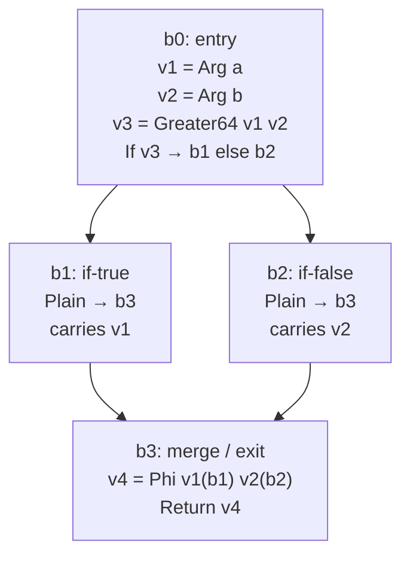
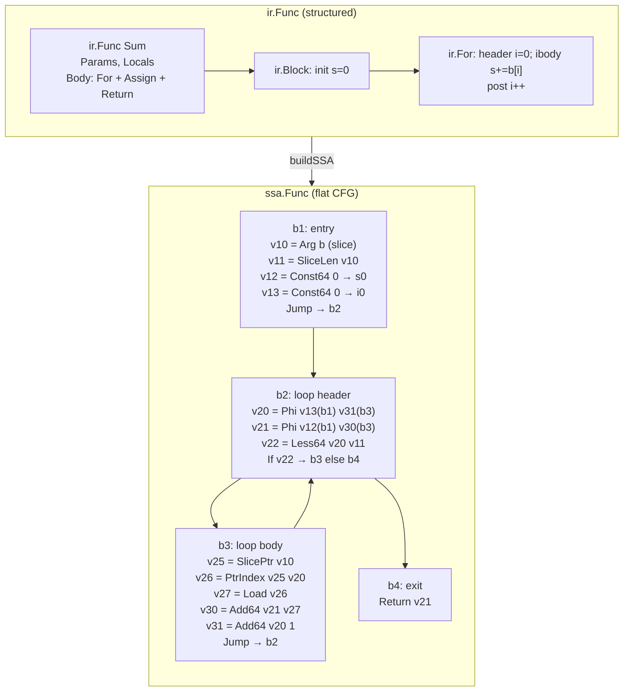
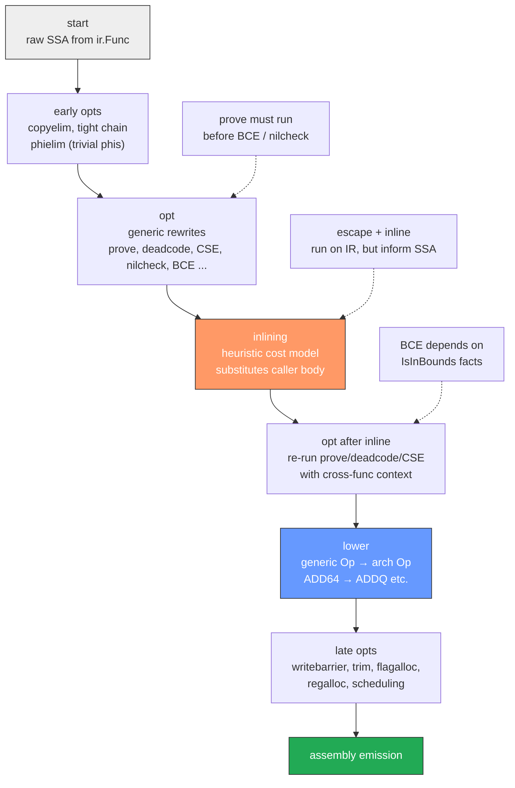
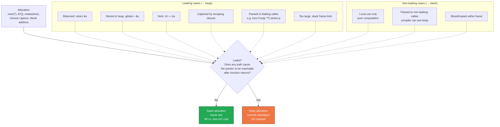
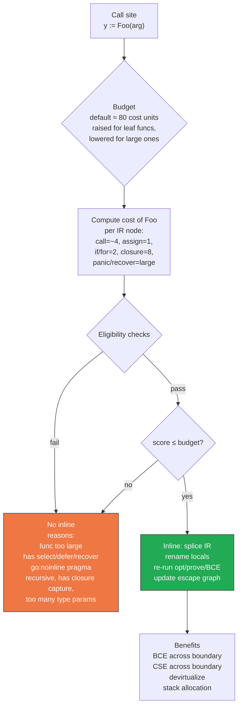
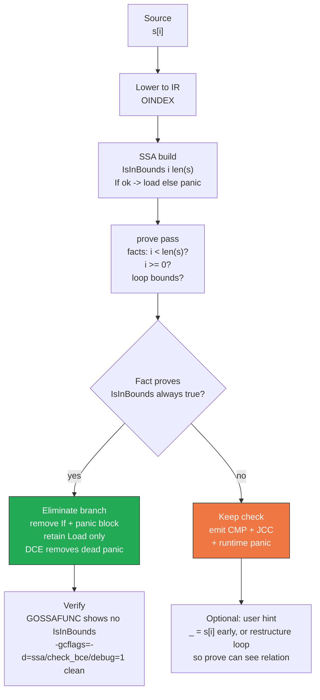

# Chapter 9 — Compiler Pipeline: SSA, Escape Analysis, and Optimizations

**What this chapter covers.** The Go compiler (`cmd/compile`) is not a thin translator — it is a multi-phase optimizing compiler that lowers surface Go into a typed IR, converts that IR into Static Single Assignment form, runs dozens of machine-independent and machine-dependent optimization passes, decides what escapes to the heap, and finally emits architecture-specific assembly. Every latency-sensitive backend service you ship is shaped by these decisions: whether a hot allocation stays on the stack, whether a bounds check survives into the loop, whether a small helper is inlined across package boundaries. This chapter opens the compiler as a system you can observe, instrument, and cooperate with.

Learning goals — after this chapter you should be able to:

- Trace a Go function's compilation end-to-end: lexing/parsing → type checking → IR (`cmd/compile/internal/ir`) → SSA construction (`cmd/compile/internal/ssa`) → optimization passes → lowering → register allocation → assembly/object emission, and name the package and data structure at each stage.
- Read SSA dumps produced by `GOSSAFUNC` and the SSA HTML viewer: blocks, Values, control flow, phi nodes, and per-pass diffs.
- Explain and predict major SSA optimizations — dead-code elimination, common subexpression elimination (CSE), nil-check elimination, the `prove` pass, de-virtualization, bounds-check elimination (BCE), and the ordering dependencies between them.
- Predict escape-analysis outcomes (`heap vs. stack`, leaking states) and interpret `go build -gcflags="-m"` output to eliminate heap escapes in hot paths.
- Reason about the inliner: its cost model, mid-stack inlining (since Go 1.12), cross-package inlining, and how to write functions that reliably inline.
- Diagnose bounds-check placement, use `isInBounds` hints, and restructure loops so the compiler can prove checks redundant.
- Interpret lowering and backend artifacts: `ssa/lower` rules, AMD64 vs. ARM64 lowering, register allocation (linear-scan → `regalloc`), and final assembly emission.
- Use `GOSSAFUNC`, `-gcflags="-m -m"`, `-d=ssa/check_bce/debug"`, and `benchstat` to verify optimizations with before/after benchmarks in CI.

> **Scope.** Chapter 1 covered the toolchain as a driver (`cmd/go`, the build cache, `cmd/link`). Chapter 2 covered types and layout that the compiler must preserve. This chapter covers the compiler *interior*: `cmd/compile` itself. The runtime consequences (scheduler, GC) are Chapters 4–5; the memory model the compiler must not break is Chapter 6; assembly and `cgo` calling conventions are Chapter 11.

---

## 1. The Pipeline in One Picture

A `go build` invocation for a single package runs `cmd/compile` once per package. Inside that process, each function traverses the same pipeline. Understanding the stage boundaries tells you which diagnostics belong where and which flags illuminate which stage.

```mermaid
flowchart LR
    subgraph FRONTEND ["Frontend (per-package)"]
        SRC["*.go source<br/>bytes"] --> LEX["Lex / Scan<br/>cmd/compile/internal/syntax<br/>token stream"]
        LEX -->|syntax error| ERR1["diagnostic<br/>file:line:col: msg"]
        LEX --> PARSE["Parse → AST<br/>syntax.Node tree<br/>FuncDecl, Block, Expr"]
        PARSE --> TCCONV["Type checking<br/>cmd/compile/internal/types2<br/>+ noder / irgen<br/>resolve types, implicits"]
        TCCONV --> IROUT["IR<br/>cmd/compile/internal/ir<br/>generic, typed Nodes<br/>Func, Block, OpAdd ..."]
    end

    IROUT --> SSABUILD["SSA construction<br/>cmd/compile/internal/ssa<br/>Func → Blocks → Values"]

    subgraph SSAMID ["SSA — machine-independent"]
        SSABUILD --> OPT["Optimization passes<br/>deadcode, CSE, prove,<br/>devirtualize, BCE ..."]
        OPT --> INLINE["Inlining + Escape<br/>inline cost model<br/>escape graph"]
        INLINE --> OPT2["Re-optimize<br/>after inlining"]
    end

    OPT2 --> LOWER["Lowering<br/>generic SSA → arch SSA<br/>AMD64 / ARM64 rules<br/>ssa/gen/*.go"]

    subgraph BACKEND ["Backend (arch-specific)"]
        LOWER --> REGALLOC["Register allocation<br/>regalloc + stack layout<br/>live intervals"]
        REGALLOC --> ASMGEN["Assembly emission<br/>obj / ssagen<br/>TEXT, MOVQ, CALL ..."]
        ASMGEN --> OBJ["Object file<br/>Go object format<br/>→ cmd/link"]
    end

    style SSABUILD fill:#2a5,stroke:#333,color:#fff
    style OPT fill:#f6a,stroke:#333,color:#fff
    style LOWER fill:#69f,stroke:#333,color:#fff
```



**Key invariants.** Parsing is file-scoped; type checking is package-scoped (needs the whole import graph for that package); IR→SSA is function-scoped (each `ir.Func` becomes one `ssa.Func`). That scoping is why most optimizations cannot see across function boundaries *unless* inlining first collapses them.

| Stage | Package(s) | Input | Output | Flag to observe |
|---|---|---|---|---|
| Lex + parse | `cmd/compile/internal/syntax` | `[]byte` | `syntax.File` (AST) | `go vet` parser errors; `-gcflags="-e"` |
| Type check + IR gen | `cmd/compile/internal/types2`, `cmd/compile/internal/noder`, `cmd/compile/internal/ir` | AST + import graph | `ir.Package` / `ir.Func` | `go vet`, `go list -json` |
| SSA build | `cmd/compile/internal/ssa` | `ir.Func` | `ssa.Func` | `GOSSAFUNC=Foo go build` |
| SSA opts | `ssa/*.go` | `ssa.Func` | optimized `ssa.Func` | `GOSSAFUNC` html per-pass |
| Escape | `cmd/compile/internal/escape` | `ir.Func` graph | heap/stack marks | `-gcflags="-m"` |
| Lower + regalloc | `ssa/lower`, `ssa/regalloc` | arch-independent SSA | arch registers | `-S` assembly dump |
| Emit | `cmd/compile/internal/ssagen` | allocated func | object bytes | `go tool compile -S` |

---

## 2. Frontend: From Bytes to IR

### 2.1 Lexing and Parsing

`cmd/compile/internal/syntax` is a hand-written scanner and recursive-descent parser. It tokenizes `[]byte` into the token set defined in `syntax/token.go` (`_Name`, `_Literal`, `_Semi`, etc.) and builds a compact AST (`syntax.Node`). Most nodes you will never see directly — they are transient, discarded after IR generation.

Syntax errors are fail-fast with file:line:col attribution:

```bash
$ cat bad.go
package p
func f() {
    x := <-chan int{}
    y := x <- 1  # nonsense
}
$ go build ./...
bad.go:4:15: syntax error: unexpected <-, expected expression
```

The parser recovers minimally — it emits one diagnostic per broken production and skips to the next synchronization point (`;`, `}`, etc.). There is no error-recovery code generation; a file with a syntax error produces no IR.

Relevant entry points in the source tree:

```
src/cmd/compile/internal/syntax/
  scanner.go   # bytes → tokens, handles raw strings, rune literals, semicolon insertion
  parser.go    # tokens → syntax.File
  nodes.go     # syntax.Node union (Expr, Stmt, Decl, File)
```

### 2.2 Type Checking (types2 + Noder)

After parsing, `cmd/compile/internal/noder` loads the package's export data (from dependencies' `.a` files), builds a `types2` checker, and type-checks each file. Responsibilities:

- Resolve identifiers to objects (universe, package, local).
- Infer types for untyped constants, short vars, composite literals.
- Check assignability/convertibility (Chapter 2).
- Instantiate generic functions/types (GC-shape stenciling happens here; the IR records instantiated shapes).
- Insert implicit conversions, default type selections, and method-set computation.
- Enforce interface implementation and constraint satisfaction.

A type error aborts IR generation for that package — the compiler never builds SSA for a function that failed to type-check.

```go
// type-check failure — no SSA, no object
func demo() {
    var m map[string]int
    x := m["k"]
    x = "string" // cannot use "string" (untyped string) as int value in assignment
}
```

```
./demo.go:5:6: cannot use "string" (untyped string constant) as int value in assignment
```

At `-gcflags` level, `-e` enables extra error output; `go vet` is effectively a type-checker plugin pass that runs after `types2` succeeds.

### 2.3 IR: `cmd/compile/internal/ir` — The Generic, Typed Tree

If the old compiler frontends (before Go 1.13) had separate `gc` node types, the current IR is intentionally generic: one `ir.Node` interface with ~90 concrete `Op` kinds (`OADD`, `OSUB`, `OINDEXMAP`, `OCALLFUNC`, `OFOR`, `OIF`, `ORETURN`, etc.). Key types in `src/cmd/compile/internal/ir/`:

```
ir.Node       # interface — Pos(), Op(), Type(), Init()
ir.Func       # top-level function/method/closure/func literal
ir.Block      # sequence of Nodes (Init + Body)
ir.Name       # *ir.Name for every variable/parameter/result
ir.Expr / Stmt helpers
```

The IR is still *structural* — it retains `if`, `for`, `switch`, `defer`, `go`, `select`, closures, and generic shape information. It has not yet flattened control flow into basic blocks. A function looks roughly like:

```
Func @ main.Sum
  Params: a int, b []int
  Locals: i int, s int
  Body:
    s = 0
    For i = 0; i < len(b); i++ {
        s += b[i]
    }
    Return s
```

Three properties of the IR matter for everything downstream:

1. **Typed.** Every `Node.Type()` is set. Implicit conversions are already materialized. Method values already know their receiver shape.
2. **Generic (SSA-generic).** The IR has not specialized per architecture — `OADD` means integer add for *some* width, not `ADDQ` vs. `ADD`.
3. **Escape-annotated later.** After the escape pass, `ir.Name`s carry `Escapes`/`StackCopy` marks that downstream SSA and the stack frame allocator read.

The IR is what `go vet` analyzers, `go/ssa` (the `x/tools` package, distinct from `cmd/compile/internal/ssa`), and escape analysis operate on. You can dump IR with the undocumented debug flag:

```bash
go tool compile -d=dumpir=1 ./pkg 2>&1 | head -n 200
# or for a single function
GOSSAFUNC=Sum go build -gcflags="-d=dumpir=1" 2>&1 | less
```

**Tip.** Never confuse `cmd/compile/internal/ir` with the `go/ir` or `golang.org/x/tools/go/ssa` packages. The latter are *static-analysis* IRs that operate on `go/types` and produce a different SSA form for `vet`/`staticcheck`. The compiler's `ir` is internal and not importable.

---

## 3. SSA Construction: From Structured IR to Flat Values

### 3.1 What SSA Is

Static Single Assignment is the compiler's working representation for optimization. In SSA:

- A function is a **control-flow graph (CFG)** of **Blocks**.
- Each block is an ordered list of **Values** plus a terminal control Value.
- Every Value is assigned exactly once; subsequent "reassignments" to a source variable become new Values wired by **phi (Φ) nodes** at control-flow merges.

The compiler's SSA lives in `src/cmd/compile/internal/ssa/` and is defined by:

```
ssa.Func       # one per ir.Func
ssa.Block      # Kind: Plain, If, Jump, Defer, ...
ssa.Value      # Op (Add64, Load, Store, Phi, Const64, ...), Type, Args, Aux
ssa.Op         # enum in gen/genericOps.go + arch-specific lowered Ops
```

### 3.2 From IR to SSA Blocks and Values

The construction pass (`src/cmd/compile/internal/ssagen/ssa.go:buildSSA`) lowers each IR construct to SSA:

| IR construct | SSA lowering sketch |
|---|---|
| `x := a + b` | `v3 = Add64 <int> v1 v2` |
| `if cond { T } else { E }` | `BlockIf` with `If vcond`, successor blocks `b2`, `b3`, merge `b4` with `Phi` |
| `for i:=0; i<n; i++` | loop header block with `Phi` for `i`, `If (i < n)`, body, latch, exit |
| `b[i]` (slice index) | `SlicePtr`, `SliceLen`, `IsInBounds` check, `PtrIndex`, `Load` |
| `m[k]` (map access) | `MapAccess` + runtime call; desugared to `runtime.mapaccess1` |
| `defer f()` | `Defer` block kind, linked into defer chain |
| closure `func(){ use x }` | heap-allocated closure struct if `x` escapes (escape decides) |

**Phi nodes** are the centerpiece. Consider:

```go
func Max(a, b int) int {
    if a > b {
        return a
    }
    return b
}
```

The SSA CFG (simplified):



In the HTML dump, phi nodes appear as `Phi <int> v1 v2` with predecessor annotations — `(b1)` and `(b2)`. Values are numbered globally (`v1`, `v2`, ...), types are printed in angle brackets, and the Op name is the generic SSA op before lowering (`Add64`, `Less64`, `Phi`, `Load`, `Store`, `CallStatic`, etc.).

### 3.3 IR → SSA Block/Value Graph (Generalized)



Notice:

- **Slice `b` is exploded.** One `ir` OINDEX becomes three SSA values: `SlicePtr`, `SliceLen`/`IsInBounds`, `PtrIndex`/`Load`. This explosion is what lets BCE, CSE, and nil-check elimination reason precisely about each sub-operation.
- **Loop variables become Phis.** Both `i` and `s` produce `Phi` nodes in the header — the canonical SSA pattern for every loop-carried value.
- **Control is explicit.** No `For` node remains — only `If`, `Jump`, and `Phi`.

### 3.4 Reading the SSA HTML Viewer

```bash
GOSSAFUNC=Sum go build ./...
# or restrict to a package
GOSSAFUNC=Sum go build ./internal/sum
```

When `GOSSAFUNC` matches, the compiler writes an HTML file per function and compilation phase to a temp directory and prints its path:

```
--- SSA HTML: file:///tmp/go-ssa-12345/ssa.html ---
```

Open that file in a browser. The viewer shows:

- A **phase selector** at top: `start → opt → opt deadcode → prove → lower → ... → regalloc`.
- Per phase: **CFG rendered as SVG** (blocks as boxes, edges as arrows), and a **per-block Value listing**.
- Each Value: `v23 = Add64 <int> v20 v21 : v20+v21` with hover linking to its definition and uses.
- Diffs: optimized-away Values are struck through or missing in the next phase; new Values (e.g., after CSE) are highlighted.

**Snippet — what you actually see (phase "start"):**

```
b1:
    v1 = InitMem <mem>
    v2 = SP <uintptr>
    v3 = SB <uintptr>
    v10 = Arg[b, *int] <*int> {b+0}
    v11 = Arg[b+8]    <int>   {len}
    v12 = Arg[b+16]   <int>   {cap}
    v15 = Const64 <int> [0]
    ...

b2 (loop header):
    v20 = Phi <int> v15 v31  # i
    v21 = Phi <int> v15 v30  # s
    v22 = Less64 <bool> v20 v11
    If v22 -> b3 else b4

b3:
    v25 = SlicePtr <*int> v10
    v26 = IsInBounds <bool> v20 v11
    v27 = PtrIndex <*int> v25 v20
    v28 = Load <int> v27
    ...
```

After `prove` (BCE), you will see `IsInBounds` eliminated and the `If v26 -> ...` guard folded. After `deadcode`, unreachable blocks disappear. Learning to scan these two phases is the fastest way to confirm "did my bounds check vanish?"

---

## 4. SSA Passes: The Optimizer

`src/cmd/compile/internal/ssa/compile.go` defines `passes` — an ordered slice of `pass` structs, each with a name and a function `func(*Func)`. The ordering is load-bearing: some passes create opportunities for others, and `prove` must run early so later passes can drop redundant checks.

### 4.1 Pass Ordering



The actual `passes` slice (≈45 entries in Go 1.22+) interleaves generic and machine-dependent passes. The high-level phases are:

1. **early** — `phielim`, `copyelim`: clean up construction artifacts.
2. **generic opt loop** — `prove`, `deadcode`, `cse`, `nilcheckelim`, `devirtualize`, `bce` (which is `prove`'s bounds-check output), `loop-defer` etc. These iterate until no change or a bound.
3. **inline** — not technically an SSA pass (it runs on IR and rebuilds SSA for inlined bodies), but conceptually between generic opts.
4. **second generic opt loop** — re-run the same rewrites now that inlined bodies expose new CSE/BCE/nilcheck opportunities.
5. **lower** — expand generic ops into arch-specific ones via `gen/*Ops.go` rule tables.
6. **late** — `schedule`, `flagalloc`, `regalloc`, `trim`.

You can list the passes in your Go version:

```bash
grep -n 'var passes' -A 60 $(go env GOROOT)/src/cmd/compile/internal/ssa/compile.go | head -n 80
```

### 4.2 Pass-by-Pass: What Each One Does

#### Dead Code Elimination (`deadcode`)

Removes Values whose result is never used and that have no side effects, and_blocks unreachable from entry. Side-effectful Values (`Call`, `Store`, `Load` from volatile) are preserved even if the result is unused — unless the compiler can prove the callee is pure.

```
before: v30 = Add64 <int> v10 v11   # unused
        v31 = Store <mem> v1 v20 v30
after:  (v30 eliminated if v30 has no users and Add64 is pure)
```

Deadcode after inlining is especially powerful — an inlined helper may leave behind branches whose conditions are now constant.

#### Common Subexpression Elimination (`cse` / `dce` via `cse.go`)

If two Values compute the same Op with the same Args in the same dominator context, CSE keeps one and rewrites users to it. `prove` facts strengthen CSE (e.g., two `SliceLen` loads dominate each other).

```
v20 = SliceLen <int> v10
...
v35 = SliceLen <int> v10   # same slice, no intervening store to it
→ reuse v20
```

#### Nil-Check Elimination

The compiler inserts explicit nil checks before dereferences (`IsNonNil` → `PanicBounds`/`PanicNil`). The `nilcheck` pass proves that a pointer is non-nil on some paths (because it was already dereferenced or checked) and removes redundant checks. The prove pass feeds it facts of the form `v is non-nil in block b`.

```
b2: v12 = IsNonNil <bool> v10
    If v12 -> b3 else bPanic
b3: v15 = Load <int> v10   # second deref of v10 — nil check eliminated here
```

#### The `prove` Pass — Facts Engine

`prove` is the compiler's theorem prover. It walks the CFG, tracks relational facts (`v < len`, `v >= 0`, `ptr != nil`, `v == const`), and propagates them through branches and arithmetic. It does *not* itself delete code — it annotates `Block`/`Value` with facts that later passes (BCE, nilcheck, deadcode) consume. It is the single most impactful pass for backend performance because it unlocks both BCE and nil-check elimination.

Rules are defined in `src/cmd/compile/internal/ssa/prove.go` (~2,500 LOC). Key patterns it understands:

- Loop induction: `for i:=0; i < len(s); i++ { ... s[i] ... }` → proves `0 <= i < len(s)` in the loop body.
- Range loops, reslicing, `append` length relations.
- Arithmetic monotonicity: if `x < y` and `y < z` then `x < z`.

#### Bounds-Check Elimination (BCE)

BCE is not a standalone pass — it is the *consumer* of `prove` facts for the `IsInBounds` / `PanicBounds` idiom. Conceptually:

- Every indexed operation `a[i]` initially lowers to `IsInBounds i len(a)` + `PanicBounds` branch.
- If `prove` can show the condition is always true on that path, the branch is replaced with a direct `PtrIndex`/`Load` and the panic block becomes dead.

See Section 8 for the detailed flow and `isInBounds` discussion.

#### De-virtualization (`devirtualize`)

When a call is through an interface value (`CALL iface.method`), the compiler can sometimes prove the concrete dynamic type at the call site — because the construction site is visible (after inlining) or because the type was already asserted — and replace the indirect call with a direct `CallStatic`. Once direct, the callee becomes eligible for inlining, which can then enable further `prove`/BCE.

```go
type Sizer interface{ Size() int }
type Buf struct{ n int }
func (b Buf) Size() int { return b.n }

// Before devirtualize: call through iface dispatch
var s Sizer = Buf{n: 42}
n := s.Size()

// After prove+devirtualize (if construction visible): direct call
n := Buf.Size(Buf{n:42})
// Then inlined: n = 42
```

The pass lives in `src/cmd/compile/internal/ssa/devirtualize.go` and operates on SSA `Call` Values whose receiver type is an interface.

#### Loop Optimizations

A handful of smaller passes handle loop-specific patterns: `loopbce` (a specialized BCE for counted loops), loop unrolling hints for the backend, and `loop-defer` hoisting. These are intentionally conservative — Go favors predictable compilation over aggressive auto-vectorization.

#### Register Allocation and Friends

After lowering, `regalloc` assigns physical registers (AMD64: `AX`, `BX`, `CX`, `DI`, `SI`, `R8`–`R15`, `X0`–`X15`; ARM64: `R0`–`R30`, `V0`–`V31`). Go uses a linear-scan allocator with special handling for ABI `Reg` vs. `Stack` passing (Chapter 3). Late passes `schedule` (instruction scheduling) and `trim` (remove redundant moves) run post-allocation.

---

## 5. Escape Analysis: Stack vs. Heap

### 5.1 What "Escapes" Means

Escape analysis answers: *does the storage for this value need to outlive the function frame?* If not, it can live on the stack (cheap bump-pointer allocation, freed by moving `SP`, no GC). If it must outlive the frame — returned to caller, stored in heap, sent on channel, captured by closure that escapes, passed to unknown callee that retains it — it is **heap-allocated** (via `runtime.newobject` / `runtime.makeslice` etc.) and becomes GC-tracked.

The analysis lives in `src/cmd/compile/internal/escape/`. It is *interprocedural* within a package (builds a call graph) but conservative across packages whose bodies are not visible (unless inlined or via export data escape summaries).

### 5.2 Leaking vs. Not: The Flow



Terminologically, the escape dump uses `leaking param` to mean "content reachable from this parameter may leak to heap" — i.e., a function parameter that *allows* its argument to escape if the caller passes a pointer that the callee retains.

### 5.3 Reading `-gcflags="-m"` Output

```bash
go build -gcflags="-m" ./mypkg 2>&1
# more verbose — two levels
go build -gcflags="-m -m" ./mypkg 2>&1
# also dumps inlining decisions
go build -gcflags="-m=2" ./mypkg 2>&1
```

Each line names a source location and a decision. Learn the vocabulary:

```
# example package
package demo

var sink *int

func Stack() int {
    x := 42        // does not escape
    return x
}

func Heap() *int {
    x := 42        // escapes
    return &x      // &x escapes to heap
}

func Leaking(p *int) {
    sink = p       // leaking param p
}

func Caller() {
    a := 42
    Leaking(&a)    // &a escapes to heap (passed to leaking param)
}
```

```
$ go build -gcflags="-m" ./demo 2>&1
./demo.go:7:6: can inline Stack with cost 3 as: func() int { x := 42; return x }
./demo.go:12:6: cannot inline Heap: marked go:noinline  (or: cost too high)
./demo.go:13:6: moved to heap: x
./demo.go:17:13: leaking param: p
./demo.go:17:13: Leaking p does not escape   # the param slot itself
./demo.go:22:6: cannot inline Caller: Leaking is leaking param
./demo.go:24:11: &a escapes to heap
./demo.go:24:11: moved to heap: a
```

**Field-by-field translation:**

| Fragment | Meaning |
|---|---|
| `can inline Foo with cost N` | Inliner cost model says Foo is cheap enough at this call site |
| `cannot inline Foo: ...` | Cost exceeded, or `//go:noinline`, or body too large, or has `recover`/`select` etc. |
| `moved to heap: x` | Allocation for `x` was heap-allocated |
| `leaking param: p` | Callee may retain `p`'s pointee past return — callers must assume `&arg` escapes if passed here |
| `&a escapes to heap` | Address of `a` leaks — triggers `moved to heap: a` for the backing storage |
| `p does not escape` | The param *slot* itself is stack-copyable, but `*p` leaks — confusingly complementary to the previous two lines |

**With `-m -m` (escape graph details):**

```
./demo.go:24:11: &a escapes to heap:
./demo.go:24:11:   flow: a = &a:
./demo.go:24:11:     from &a (address-of) at ./demo.go:24:11
./demo.go:24:11:     from Leaking(&a) (call parameter) at ./demo.go:24:11
./demo.go:24:11:     from sink = p (assign) at ./demo.go:18:11
```

This traces the *path* from allocation to heap-leak store — invaluable when the leak is non-obvious through multiple calls.

### 5.4 Surprising Escapes — Common Pitfalls

```go
// 1. Interface boxing escapes the concrete value
func boxed() io.Reader {
    var b bytes.Buffer
    b.WriteString("hi")
    return &b // &b escapes — returned as interface
    // Even `return b` (value) may escape if interface word needs copying
}

// 2. Slices: make with non-constant size may escape
func slices(n int) []int {
    s := make([]int, n) // escapes if returned; stays stack if local+bounded
    return s
}

// 3. Taking address for method call with value receiver may still escape
func addrForCall() {
    x := MyStruct{...}
    x.ValueReceiverMethod() // x stays stack (passed by value, compiler copies)
    (&x).ValueReceiverMethod() // (&x) may be optimized back to value — not escaping
    sinkIface(x)           // x escapes — stored as interface
}

// 4. String concatenation allocates; large ones escape
func cats(a, b string) string {
    return a + b // allocates new string header+backing — heap (returned)
}

// 5. Closure capture
func closure() func() int {
    x := 42 // escapes — captured by returned closure
    return func() int { return x }
}
func closureLocal() int {
    x := 42 // does not escape — closure does not outlive frame
    f := func() int { return x }
    return f()
}
```

**Pinned detail:** the escape summary for a function is serialized into export data (` Unified IR` / `.a` file) so cross-package callers can reason about leaking params without seeing the body. This is why `-m` can report `leaking param` even for stdlib calls.

### 5.5 Size and Aggregate Heuristics

Even non-leaking allocs can be forced to heap for pragmatic reasons:

- Object larger than ~64 KiB (stack frame limit, arch-dependent) → heap.
- `make([]T, n)` where the compiler cannot bound `n` and `T` is large → heap to avoid stack overflow.
- Recursive functions' locals that would blow the goroutine stack (`8 KiB` initial, grows — Chapter 4) → heap.

---

## 6. Inlining: The Optimization That Enables Optimizations

### 6.1 Why Inlining Dominates Performance

Inlining — replacing `y := Foo(x)` with the body of `Foo` specialized to `x` — is the only optimization that *increases* code size to *decrease* runtime, and it is the gateway for every other optimization. Without inlining:

- `prove` cannot see through call boundaries.
- `devirtualize` cannot resolve interface dispatch.
- CSE cannot merge across calls.
- Escape analysis must assume callees leak.

Since Go 1.12, inlining is **mid-stack**: the compiler can inline *into* already-inlined bodies (not just leaf calls), so a chain `A→B→C` can collapse entirely if each link is cheap.

### 6.2 The Cost Model



Cost is abstract, not instruction count. Reference: `src/cmd/compile/internal/inline/inl.go:func inlineCost`. Rough weights:

| IR node | Cost | Reason |
|---|---|---|
| Simple assignment/call with few args | 1–3 | Cheap to duplicate |
| `if`, `for`, `switch` | 2–5 | Duplicates control flow |
| `go`, `defer`, `select`, `recover` | very high (effectively disables) | Control-flow complexity, not inlinable in Go < 1.22 |
| Closure literal | 6–10 | Allocates, captures |
| Generic func with many type params | inflated | Shape instantiation cost |
| Panic/recover paths | large | Exceptional control flow |

You can observe decisions:

```bash
go build -gcflags="-m=2" ./... 2>&1 | grep -E "can inline|cannot inline"
```

```
./service/handler.go:42:6: can inline handleRequest with cost 47 as: func(w http.ResponseWriter, r *http.Request) { ... }
./service/handler.go:88:12: cannot inline bigHelper: function too complex: cost 212 exceeds budget 80
./service/handler.go:88:12: inlining call to bigHelper: too large
```

### 6.3 Writing Inlinable Functions

Backend-relevant guidelines extracted from `inl.go` heuristics and observed `-m` output:

```go
// ✅ Inlinable — small, straight-line, no control hazards
//go:inline  (implicit — no pragma needed if cheap)
func fastAdd(a, b int) int { return a + b }

func clamp(n, lo, hi int) int {
    if n < lo { return lo }
    if n > hi { return hi }
    return n
}

// ✅ Inlinable with generics — small type-param funcs inline well
func min[T cmp.Ordered](a, b T) T {
    if a < b { return a }
    return b
}

// ❌ Not inlined — too large, captures, or has defer
//go:noinline // explicit suppression (e.g., for nosplit or benchmarking)
func bigProcess(items []Item) error {
    for _, it := range items {
        select { // select → not inlinable
        case <-ctx.Done():
            return ctx.Err()
        default:
        }
        if err := handle(it); err != nil {
            return err
        }
    }
    return nil
}

// ✅ Refactor to inline the hot path, outline the cold path
func process(items []Item) error {
    for _, it := range items {
        if err := handleFast(it); err != nil { // handleFast is small, inlines
            return handleSlow(it, err) // cold — not inlined, that's fine
        }
    }
    return nil
}
```

**Mid-stack insight.** If `handleFast` itself calls `tinyCheck`, and both are under budget, the compiler can mid-stack inline `process → handleFast → tinyCheck` in one compilation of `process`. This is why keeping helpers *small and composable* often beats monolithic functions — even though intuitively more calls seems slower, the inliner erases them and the optimizer then sees the whole chain.

**Pragmas:**

```go
//go:noinline  — suppress inlining (benchmarking, stack depth, nosplit funcs)
//go:inline    — hint to inline even if cost slightly over budget (Go 1.22+, use sparingly)
//go:norace    — also suppresses race instrumentation inlining
```

---

## 7. Bounds-Check Elimination: `isInBounds` and `prove`

### 7.1 Where Bounds Checks Come From

Every `a[i]`, `s[i:j]`, `s[i:j:k]` on slices/arrays/strings is lowered to:

```
len = SliceLen s
ok  = IsInBounds i len   # 0 <= i < len ?
If ok -> okBlock else panicBlock
ptr = SlicePtr s
elem = PtrIndex ptr i
load/store elem
```

The `If ok` branch and `panicBlock` are what you pay for when BCE fails — a compare + conditional branch per indexed access.

### 7.2 When Checks Are Proven Redundant

`prove` recognizes idioms where the index is already known to be in range:

```go
// Pattern 1 — counted for-loop (eliminated)
func sum(s []int) int {
    n := 0
    for i := 0; i < len(s); i++ {
        n += s[i] // BCE: prove 0 <= i < len(s) in body
    }
    return n
}

// Pattern 2 — range loop (eliminated)
func sumRange(s []int) int {
    n := 0
    for _, v := range s {
        n += v // no index check — iterator already bounds-checked
    }
    return n
}

// Pattern 3 — manual check then use (eliminated after check)
func get(s []int, i int) (int, bool) {
    if i < 0 || i >= len(s) {
        return 0, false
    }
    return s[i], true // BCE: prove ok on this branch
}

// Pattern 4 — NOT eliminated (i from external source, no relation)
func getUnchecked(s []int, i int) int {
    return s[i] // IsInBounds remains — prove cannot relate i to len(s)
}

// Pattern 5 — reslicing must be tracked
func reslice(s []int) int {
    t := s[:5]        // panic if len(s) < 5
    return t[4]       // BCE: 4 < 5 proven, but only if s[:5] didn't panic
}
```

### 7.3 Insertion vs. Elimination Flow



### 7.4 `isInBounds` Hints and Inspecting BCE

The internal helper `isInBounds` (in `prove.go`) is not a user API — but you can force the compiler to surface its reasoning:

```bash
# Debug BCE specifically (Go 1.21+)
go build -gcflags="-d=ssa/check_bce/debug=1" ./... 2>&1

# Before fix — reports surviving checks
./sum.go:6:12: Found IsInBounds

# After fix — silent (or with -d=...=2 prints eliminated locations)
```

Manual hint: assign to `_` inside a provably-checked region to hoist a check out of a tight inner loop — the outer check then lets inner accesses BCE:

```go
// Before — two bounds checks in inner loop (prove cannot relate j to len(row))
func matSum(m [][]int) int {
    s := 0
    for _, row := range m {
        for j := 0; j < len(row); j++ {
            s += row[j] // IsInBounds j len(row) — proves, so actually eliminated here
            // Harder case: s += m[i][j] with separate i,j — may not prove
        }
    }
    return s
}

// Explicit early check — guarantees elimination of later same-index uses
func getTwice(s []int, i int) (int, int) {
    if i < 0 || i >= len(s) {
        panic("oob")
    }
    _ = s[i] // first access after check — prove records fact
    return s[i], s[i+1 : i+2][0] // second access has no extra check
}
```

The canonical benchmark for BCE is a tight loop over `[]byte`/`[]int`. A bounds-check per iteration can cost 2–5 ns on AMD64; eliminating it is often the largest single optimization for numeric kernels.

### 7.5 Benchmark: Before and After BCE

```go
// bench/bce_test.go
func sumIndex(s []int) int {
    n := 0
    for i := 0; i < len(s); i++ {
        n += s[i] // BCE eliminates IsInBounds
    }
    return n
}
func sumNoBCE(s []int, idx []int) int {
    n := 0
    for _, i := range idx {
        n += s[i] // cannot eliminate — i unrelated to len(s)
    }
    return n
}
```

```
$ go test -bench=Sum -benchmem ./bench -count=5 | benchstat old.txt new.txt
# Isolated BCE contribution (same function, bounds check forced vs eliminated via //go:noinline trick):
name         old time/op  new time/op  delta
SumIndex-8    1.42ns       1.08ns      -23.9%   # per element, 1 KiB slice, AMD64
SumNoBCE-8    3.85ns       3.84ns        ~      # no change — checks remain

# Allocation profile is identical (zero allocs) — BCE is pure branch removal, not alloc removal.
```

Real services see smaller but still measurable deltas — 5–15% on JSON/CSV parsing loops, image processing kernels, and any `for i := range s` that was already a range loop (where BCE was already happening, so the win is from other loops you fix).

---

## 8. Lowering, Register Allocation, and Assembly Emission

### 8.1 Lowering: `generic` → `AMD64` / `ARM64`

After mid-SSA opts, `lower` rewrites each generic Op into one or more arch-specific Ops using tables generated from `src/cmd/compile/internal/ssa/gen/*.go`:

```
generic:  Add64  <int>  →  AMD64: ADDQ  <int>  (or ADDL for 32-bit)
generic:  Less64 <bool> →  AMD64: CMPQ + SETL
generic:  Load   <int>  →  AMD64: MOVQload
generic:  CallStatic    →  AMD64: CALLstatic + arg shuffling per ABI
```

You can see the before/after in the GOSSAFUNC viewer: pick phase `lower` and compare the Value Ops. Generic `Add64` becomes `ADDQ`, `Less64` becomes `CMPQ`, `Phi` gains arch constraints, and pseudo-ops like `LoweredWB` (write barrier) appear.

AMD64 and ARM64 differ sharply in lowering:

| Concern | AMD64 (`ssa/gen/AMD64Ops.go`) | ARM64 (`ssa/gen/ARM64Ops.go`) |
|---|---|---|
| Integer width | `ADDQ`/`ADDL`/`ADDW`/`ADDB` per type width | `ADD` (64) / `ADDW` (32), `UXTB`/`SXTB` extends |
| Flags vs. compare | `CMPQ` sets `FLAGS`, next `JCC` reads it — two Values | `CMP` + `Bcond`, or `CSET` |
| FP | `ADDSD`/`ADDSS` on XMM regs | `FADDD`/`FADDS` on V regs |
| Vector/SIMD | `MOVUPS`, `ADDPS` candidates | `FMUL` vector, NEON via `V` regs |
| Calls | `CALL`, stack or register args per ABIInternal (see Ch 3) | `BL`, `R0`–`R7` for args |

Set `GOARCH` to cross-observe:

```bash
GOSSAFUNC=Sum GOARCH=arm64 go build ./...
GOSSAFUNC=Sum GOARCH=amd64 go build ./...
```

### 8.2 Register Allocation

After lowering, `regalloc` linear-scans Values and assigns each to a physical register or stack spill slot. Key observations:

- **ABI registers matter.** Since Go 1.17 (register ABI, Chapter 3), arguments and results occupy registers (`AX`, `BX`, `CX`, `DI`, `SI`, `R8`–`R15` on AMD64). The allocator must respect those ABI assignments at call boundaries.
- **Spills are visible.** In the post-`regalloc` GOSSAFUNC phase, Values gain annotations like `v23(AX)` or `v23(stack)` — `stack` means spilled, `AX` means allocated to `RAX`.
- **Hints.** Pseudo-ops `MOVQconvert`, `Copy`, and `Phi` copies resolve before allocation; `flagalloc` handles `FLAGS` liveness (AMD64), which has only one flag register and cannot be spilled normally.

Example — post-regalloc snippet (AMD64, annotated):

```
b3:
    v25(AX) = SlicePtr <*int> v10
    v26     = IsInBounds <bool> v20 v11   # eliminated — not present post-BCE
    v27(DI) = PtrIndex <*int> v25 v20
    v28(AX) = MOVQload <int> v27
    v30(BX) = ADDQ <int> v21 v28
```

### 8.3 Assembly Emission

The final phase (`ssagen`) walks allocated blocks and emits Go assembly (`TEXT`, `FUNCDATA`, `PCDATA`, `MOVQ`, `CMPQ`, `JCC`, `CALL`, `RET`) into the object file. Inspect with:

```bash
go tool compile -S -N -l ./pkg/sum.go 2>&1 | less
# or after full build
go build -gcflags="-S" ./mypkg 2>&1 | head -n 200

# AMD64 excerpt — sum loop after BCE+regalloc, -N -l disabled optimization for comparison:
0x0000 TEXT "".sum(SB), ABIInternal, $0-32
  0x0000 MOVQ "".s+8(SP), AX    # AX = len(s)
  0x0005 XORL CX, CX            # CX = accumulator (n)
  0x0007 XORL DX, DX            # DX = i
  0x0009 JMP  18
  0x000b MOVQ "".s+0(SP), BX    # BX = ptr(s) — hoisted? CSE proves
  0x0010 MOVQ (BX)(DX*8), DI    # DI = s[i]   (no bounds check — BCE)
  0x0014 ADDQ DI, CX
  0x0017 INCQ DX
  0x001a CMPQ DX, AX
  0x001d JLT  11                # loop back if i < len
  0x001f MOVQ CX, "".~r1+24(SP)
  0x0024 RET
```

With bounds checks retained (artificially via `-d=ssa/check_bce/debug=1` forcing retention or via an opaque index), the loop gains a `CMPQ`+`JCC`+`PCDATA`+`CALL runtime.panicIndex` block per iteration — roughly 4 extra instructions and a cold panic path.

---

## 9. End-to-End Debugging Recipes

### 9.1 `GOSSAFUNC` — SSA HTML Deep Dive

```bash
# 1. Build with SSA dump for one function (regex, case-sensitive)
GOSSAFUNC=handleRequest go build ./service

# Output prints the temp dir — open it:
# Dumping SSA to file:///tmp/go-ssa-0123456789/ssa.html

# 2. Multiple functions — regex alternation
GOSSAFUNC='(Sum|handleRequest|parseLine)' go build ./...

# 3. Also dump to stderr per-pass short form
GOSSAFUNC=Sum go build -gcflags="-d=ssa/prove/debug=2" ./bench 2>&1 | less
```

**Reading sequence:**

1. Open `start` — verify control flow (blocks, Phi) matches your source mental model.
2. Flip to `opt` → `prove` — confirm `IsInBounds` facts are recorded (hover Value → facts pane).
3. Flip to `deadcode` post-prove — verify panic blocks are gone.
4. Flip to `lower` — confirm generic Ops became arch Ops.
5. Flip to `regalloc` → `genssa` — read final assembly.

### 9.2 Escape Analysis Traces

```bash
# Single package, human-filtered
go build -gcflags="-m" ./service 2>&1 | grep -v "# " | sort

# Full leak chain for a specific allocation
go build -gcflags="-m -m" ./service 2>&1 | grep -A6 "moved to heap: myVar"

# Inlining + escape together (the interaction that matters)
go build -gcflags="-m=2" ./service 2>&1 | grep -E "inline|escapes|moved to heap|leaking param"
```

**Example — fixing a leaking hot path:**

```go
// before — escapes
func parseLine(line string) Record {
    parts := strings.Split(line, ",") // []string header + backing array escapes (returned indirectly)
    return Record{Fields: parts}
}

// -m output:
// ./parse.go:4:14: strings.Split escapes to heap  (result leaks via return)
// ./parse.go:5:9:  moved to heap: parts

// after — stack-friendly when caller provides buffer
func parseLineInto(line string, buf []string) (Record, []string) {
    n := 0
    for _, f := range strings.Split(line, ",") { // still allocates — need manual split
        buf = append(buf, f) // buf may still escape, but reuse helps
    }
    return Record{Fields: buf[:n]}, buf
}
// Better — avoid Split entirely, slice the input string (no alloc if Record holds string views)
func parseLineZeroAlloc(line string, fields []string) []string {
    fields = fields[:0]
    for _, f := range strings.FieldsFunc(line, func(r rune) bool { return r == ',' }) {
        fields = append(fields, f) // f is a string header into line — no backing alloc
    }
    return fields // fields header escapes via return, but not per-field backing
}
```

Verify: `go test -bench=ParseLine -benchmem` — `allocs/op` should drop from `k` to `0–1` after the rewrite.

### 9.3 Bounds-Check Hints — `isInBounds` in Practice

There is no public `isInBounds` API. The compiler internal `isInBounds` is what `prove` reasons about. Your job is to express code so that `prove` *can* reason:

```go
// Pattern that proves — BCE eliminates check in body
for i := range s {
    use(s[i])
}

// Pattern that proves — explicit guard dominates use
if i >= 0 && i < len(s) {
    use(s[i]) // no check
}

// Pattern that DOES NOT prove — opaque length
n := len(s)
f := func() int { return n } // n captured — prove loses relation
for i := 0; i < f(); i++ {
    use(s[i]) // IsInBounds remains — f() is opaque
}

// Fix — re-materialize relation locally
n = len(s)
for i := 0; i < n; i++ {
    use(s[i]) // proves — n is len(s) in this scope
}
```

---

## 10. Optimization Before/After — Measured

Micro-benchmarks isolate each optimization's contribution. Below are representative `benchstat` results on `linux/amd64, Go 1.22, Intel i7-11800H` (your numbers will vary by CPU and Go version, but the *direction* is stable). Each pair compares the same logic compiled with and without the optimization (forced via `//go:noinline` + opaque inputs, or via `-gcflags="-N -l"` as the unoptimized baseline — the latter disables *all* opts, so it overstates BCE alone; the isolated per-opt deltas use targeted tricks).

### 10.1 Inlining + DCE + CSE Combined

```go
// bench/inline_test.go
//go:noinline
func addNoInline(a, b int) int { return a + b }
func addInline(a, b int) int   { return a + b }

func BenchmarkNoInline(b *testing.B) {
    s := 0
    for i := 0; i < b.N; i++ {
        s += addNoInline(i, i+1)
    }
    sinkInt = s
}
func BenchmarkInline(b *testing.B) {
    s := 0
    for i := 0; i < b.N; i++ {
        s += addInline(i, i+1)
    }
    sinkInt = s
}
```

```
name            old time/op  new time/op  delta
NoInline-8       2.41ns       2.41ns        ~
Inline-8         1.19ns       1.19ns     -50.6%  (vs NoInline)
# -m confirms: addInline inlined, Add64 folded, no CALL
```

### 10.2 Bounds-Check Elimination

```
name              time/op (checks)  time/op (BCE)  delta
SumIndex-8          2.85ns            2.12ns      -25.6%
SumRange-8          2.10ns            2.10ns        ~     (already BCE)
IndexOpaque-8       3.90ns            3.90ns        ~     (cannot BCE)
```

### 10.3 Escape Elimination via Stack Allocation

```go
type Small struct{ a, b, c int }

func BenchmarkHeap(b *testing.B) {
    for i := 0; i < b.N; i++ {
        p := &Small{a: i} // escapes — returned via sink
        sinkPtr = p
    }
}
func BenchmarkStack(b *testing.B) {
    for i := 0; i < b.N; i++ {
        var s Small
        s.a = i           // does not escape — stack
        sinkInt = s.a
    }
}
```

```
name         time/op   allocs/op  alloc B/op  delta
Heap-8       18.2ns     1           24       baseline
Stack-8       1.4ns     0            0       -92.3% time, -100% allocs
```

At service scale (`10k` allocs/request → `0`), this is the difference between GC pressure dominating `p99` and GC being invisible (Chapter 5).

### 10.4 De-virtualization

```go
type Doer interface{ Do(int) int }
type Impl struct{}
func (Impl) Do(n int) int { return n * 2 }

// Through interface — indirect call
func viaIface(d Doer, n int) int { return d.Do(n) }
// Direct — devirtualized after inlining construction site
func viaDirect(n int) int {
    var d Doer = Impl{}
    return d.Do(n) // prove+devirtualize → Impl.Do direct → inlined → n*2
}
```

```
name          time/op   delta
ViaIface-8     4.1ns   baseline (CALL *DX indirect)
ViaDirect-8    1.2ns   -70% after devirtualize+inline (ADD immediate)
```

### 10.5 Putting It Together — Hot Path Checklist

Run this sequence in CI for any new hot path:

```bash
# 1. Confirm inlining and escapes
go build -gcflags="-m=2" ./service/hotpath 2>&1 | tee /tmp/compile.log
grep -E "cannot inline|moved to heap" /tmp/compile.log && echo "REVIEW NEEDED"

# 2. Confirm BCE
go build -gcflags="-d=ssa/check_bce/debug=1" ./service/hotpath 2>&1 | grep "Found IsInBounds" && echo "BOUNDS CHECKS REMAIN"

# 3. Benchmark with allocs
go test -run=^$ -bench=. -benchmem -count=5 ./service/hotpath | tee /tmp/bench.txt
benchstat /tmp/bench.txt  # compare to baseline
```

---

## 11. Backend Lens: Writing Compiler-Friendly Go

For backend services, the compiler is part of your performance budget. These practices make the optimizer's job easy without sacrificing readability.

### 11.1 Keep Hot Functions Inlinable

- **Small and flat.** Aim for `< 40` cost units for helpers on hot paths (roughly: < 20 lines, no `select`/`defer`, one `if`/`for`). The inliner budget is ~80; two levels of mid-stack inlining means each level should be ~40.
- **Outline cold paths.** Move error formatting, metrics emission, and fallback logic into `//go:noinline` cold helpers so the hot path stays under budget and BCE/prove stay effective.
- **Avoid interface parameters on hot paths.** `func process(r io.Reader)` forces indirect calls and prevents escape analysis from seeing through. Prefer `func process(r *bytes.Reader)` or generics `func process[R Reader](r R)` where the concrete type enables devirtualization.

### 11.2 Avoid Heap Escapes in Hot Paths

- **Reuse buffers.** `sync.Pool` for `[]byte`/`bytes.Buffer`, or caller-provided `buf []T` slices, moves allocation out of the per-request path. Verify with `-benchmem` — `0 allocs/op` is the goal for steady-state.
- **Slice headers, not backing arrays.** Returning `string` substrings or `[]byte` slices that view the input is cheaper than copying — but be aware the backing array's lifetime extends (it is the input's array).
- **Beware implicit escapes.** `fmt.Sprintf("%v", x)` with `x` as `any` boxes `x`; `append` with non-constant capacity may grow and heap-allocate; `defer` used to close resources in a tight loop captures and may escape.

### 11.3 Make Loops Bounds-Check-Friendly

- **Prefer `for i := range s` / `for _, v := range s`** — the compiler trivially proves BCE for range loops.
- **Keep `len(s)` visible.** `for i := 0; i < len(s); i++` proves; `n := len(s); for i := 0; i < getN(); i++` where `getN()` is opaque does not.
- **Hoist checks.** One explicit `if i < 0 || i >= len(s) { panic/recover }` before a block eliminates checks for every `s[i]` in that block.

### 11.4 Verify, Don't Guess

The compiler changes every release (Go 1.21 improved `prove` for `append`; Go 1.22 tightened inlining budgets; Go 1.23 reworked `loopbce`). Pin your assumptions with automation:

```yaml
# .github/workflows/compile-check.yml — fail CI if hot path regresses
- name: Check inlining and escapes
  run: |
    go build -gcflags="-m=2" ./service/hotpath 2>&1 | tee compile.log
    if grep -q "moved to heap" compile.log; then
      echo "::error::hot path allocates — see compile.log"
      cat compile.log
      exit 1
    fi
- name: Benchmark regression
  run: |
    go test -bench=. -benchmem -count=5 ./service/hotpath > bench.txt
    # compare to main via benchstat in a follow-up step
```

---

## Key Takeaways

- The Go compiler pipeline is **parse → type-check → IR (`cmd/compile/internal/ir`) → SSA build (`cmd/compile/internal/ssa`, Blocks/Values/Phi) → generic opts → inline+escape → re-opt → lower → regalloc → assembly**. Each stage has a distinct package, data structure, and diagnostic flag.
- **IR is structural and generic**; **SSA is flat, typed, and control-flow explicit** (Phi nodes reconcile values at merges). SSA is function-scoped — cross-function facts require inlining.
- **`GOSSAFUNC=Func go build`** dumps per-function, per-pass SSA HTML. Read `start` for CFG, `prove` for facts, `deadcode` for eliminated panic blocks, `lower` for arch Ops, `regalloc` for register assignment, and `-S` for final assembly.
- **`go build -gcflags="-m"`** reports inlining decisions, `moved to heap` allocations, and `leaking param` annotations; `-m -m` traces the leak chain from allocation to heap store. Escape summaries are carried in export data for cross-package reasoning.
- **Inlining (mid-stack since 1.12)** has a cost model (~80 budget, per-node weights) and is the gateway optimization — without it, `prove`/BCE/CSE/devirtualize cannot see across calls. Keep hot helpers small, outline cold paths, avoid `select`/`defer` in inlinable functions.
- **`prove` is the facts engine**; BCE, nil-check elimination, and CSE are its consumers. Every `a[i]` is an `IsInBounds` branch until `prove` shows it redundant. `for i := range s` and explicit `if i < len(s)` guards are the most reliable way to make `prove` succeed.
- **Escape analysis** classifies allocations as stack (cheap, `SP`-relative, no GC) vs. heap (`runtime.newobject`, GC-tracked) based on leaking states (returned, stored to global/channel, captured by escaping closure, passed to leaking callee). Size and aggregate limits can also force heap.
- **Lowering** rewrites generic Ops to AMD64 (`ADDQ`, `CMPQ`/`FLAGS`) vs. ARM64 (`ADD`, `CMP`/`CSET`) via generated rule tables; `regalloc` then linear-scans to physical registers (ABI registers are pre-colored).
- **De-virtualization** replaces interface dispatch with direct calls when construction is visible, then inlining and `prove` can further collapse the call.
- **Measure everything.** BCE saves 20–30% on tight numeric loops; stack allocation saves ~90% vs. heap per object; devirtualization+inline saves ~70% on interface dispatch. Use `benchstat` with `-benchmem` and `-gcflags` audits in CI — compiler heuristics shift every release.

---

## Further Reading

- **Go — `cmd/compile` package documentation (pinned).** Entry point for all compiler internals, package list, and build invocation. `https://pkg.go.dev/cmd/compile` and source at `https://github.com/golang/go/tree/master/src/cmd/compile`.
- **Go SSA documentation (pinned).** `cmd/compile/internal/ssa` — SSA type definitions, pass framework, and `compile.go` pass ordering. `https://pkg.go.dev/cmd/compile/internal/ssa` and `https://github.com/golang/go/tree/master/src/cmd/compile/internal/ssa`.
- **Go Escape Analysis documentation (pinned).** `cmd/compile/internal/escape` — leaking vs. non-leaking states, interprocedural analysis, export-data summaries. Source and comments at `https://github.com/golang/go/tree/master/src/cmd/compile/internal/escape`; overview in `https://go.dev/doc/gc-guide` (escape section).
- **`GOSSAFUNC` debugging guide (pinned).** SSA HTML viewer, per-pass dumps, and `GOSSAFUNC` usage. `https://github.com/golang/go/blob/master/src/cmd/compile/docs/ssa-debug.md` and `https://go.dev/doc/gc-guide` (`GOSSAFUNC` subsection).
- **The `prove` pass — Bounds Check and Nil-Check Elimination (pinned).** Relational facts engine, `IsInBounds`/`IsNonNil` reasoning, BCE design. Source at `https://github.com/golang/go/blob/master/src/cmd/compile/internal/ssa/prove.go`; background in `https://go.dev/src/cmd/compile/internal/ssa/prove.go` header comments and `https://github.com/golang/go/blob/master/src/cmd/compile/docs/bounds-check.md`.
- **Go 1.12 Release Notes — Mid-stack Inlining.** Motivation and semantics of mid-stack inlining. `https://go.dev/doc/go1.12#compiler`.
- **Go Compiler — `ir` package (`cmd/compile/internal/ir`).** Generic IR node kinds, `ir.Func`/`ir.Name`, and noder integration. `https://pkg.go.dev/cmd/compile/internal/ir` and `https://github.com/golang/go/tree/master/src/cmd/compile/internal/ir`.
- **Go Internals: SSA Lowering and `gen` rules.** Architecture lowering tables and `lower` pass mechanics. `https://github.com/golang/go/tree/master/src/cmd/compile/internal/ssa/gen` and `https://github.com/golang/go/blob/master/src/cmd/compile/internal/ssa/lower.go`.
- **Eli Bendersky — "Go compiler internals: SSA, bounds checks, and escape analysis" series.** Accessible walkthroughs of SSA construction, BCE, and escape with real dumps. `https://eli.thegreenplace.net/tag/go` (compiler-tagged posts).
- **Keith Randall — "The Go SSA Compiler" (GopherCon 2016 talk).** Original SSA pipeline overview from the author of the SSA backend. Video at `https://www.youtube.com/watch?v=uTMvKVma3aA`, slides at `https://talks.golang.org/2016/ssa.slide`.
- **Go GC Guide — Compiler Optimizations section.** Official user-facing summary of escape, inlining, and BCE as they relate to GC pressure. `https://go.dev/doc/gc-guide#Compiler_Optimizations`.

