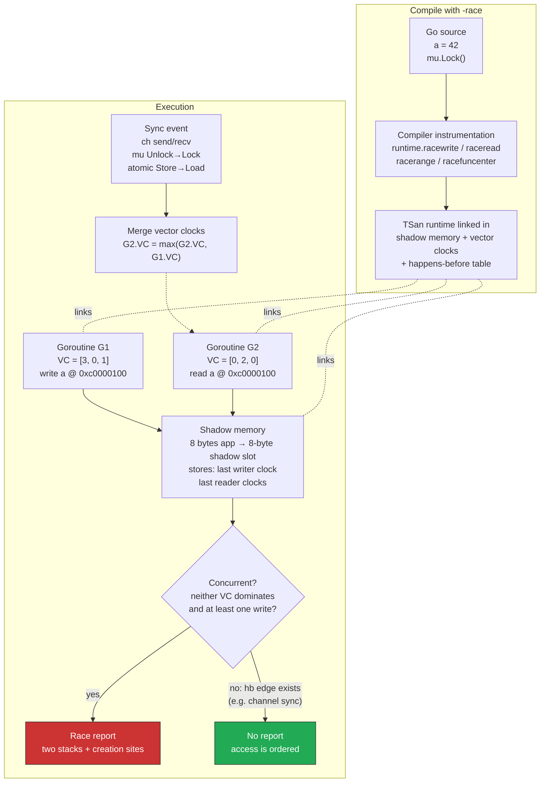
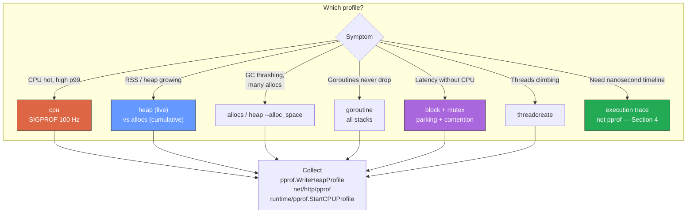
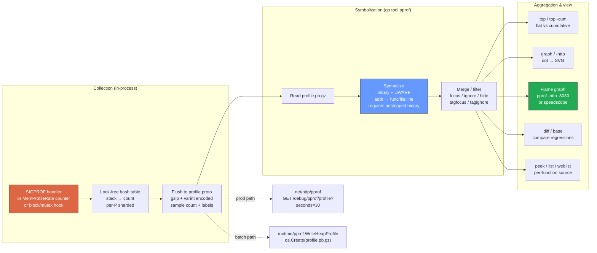
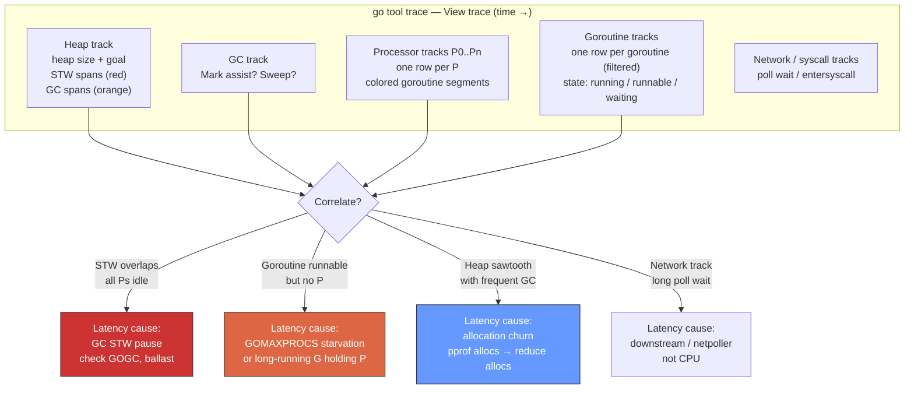
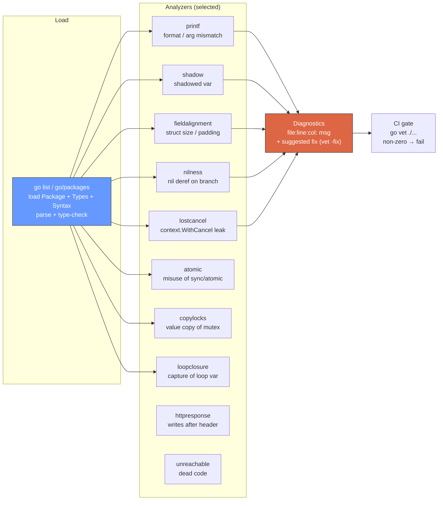
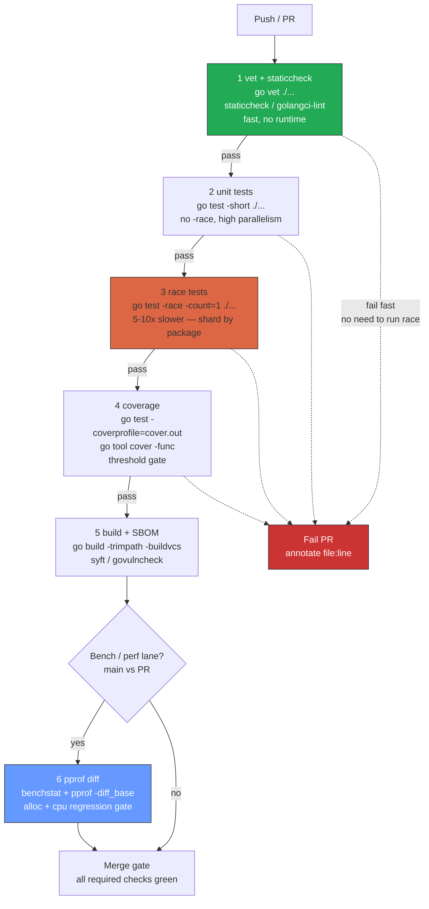

# Chapter 10 — Tooling Deep Dive: Race Detector, pprof, execution trace, and vet

**What this chapter covers.** Chapters 4–9 opened the Go runtime and compiler internals; this chapter opens the instruments that let you *observe* them under load. Four tools form the standard backend Go observability kit: the **race detector** (dynamic happens-before checking derived from ThreadSanitizer), **pprof** (sampling and heap profilers plus the `go tool pprof` analysis pipeline), the **execution tracer** (`runtime/trace` and `go tool trace`), and **`go vet` / `staticcheck`** (static analyzers that catch bugs before you run). You will learn how each tool works underneath, how to run it, how to read its output, when to wire it into CI, and when to leave it out of production — with real command invocations, trimmed real outputs, and the failure modes that only appear at backend scale.

Learning goals — after this chapter you should be able to:

- Explain how the race detector instruments memory accesses with ThreadSanitizer shadow memory and vector clocks, what happens-before edges it understands, and why it imposes 5–10x CPU and memory overhead.
- Run `go test -race` / `go run -race` / `go build -race`, read a race report (two goroutine stacks, conflicting accesses, creation sites), use the `race` build tag for race-only code, and evaluate suppression.
- Name every pprof profile (cpu, heap, allocs, goroutine, threadcreate, block, mutex), explain when and how each is collected, and choose the right one for CPU-bound, memory-bound, or contention-bound investigations.
- Drive `go tool pprof` (top, list, weblist, peek, traces, diff, focus/ignore, -http) and the programmatic `runtime/pprof` and `net/http/pprof` APIs, and produce flame graphs via `pprof -http` and Speedscope.
- Capture execution traces with `runtime/trace`, `go test -trace`, and `net/http/pprof?trace`, and navigate the `go tool trace` viewer (goroutine timeline, processor track, heap/GC/STW view) to diagnose scheduling stalls and GC pauses.
- Run `go vet` and its analyzers (printf, shadow, fieldalignment, nilness, lostcancel, …), fix representative warnings before/after, and extend with `staticcheck` / `golangci-lint`.
- Design a CI tooling DAG (vet → test → race → cover → diff-pprof) and a production continuous-profiling posture (Parca / Pyroscope / `net/http/pprof` sampling) appropriate for latency and cost investigations.

> **Placement.** Chapter 6 defined the memory model and happens-before; this chapter operationalizes it with the detector. Chapter 4 covered the G-M-P scheduler and netpoller whose stalls you diagnose with pprof's block/mutex profiles and the execution trace. Chapter 5 covered the allocator and GC whose behavior you measure with heap/alloc profiles and the trace's heap view. Chapter 9's compiler pipeline is the substrate for `go vet`'s analyzers and the inliner decisions pprof reveals.

---

## 1. The tooling landscape in one picture

Go's tooling philosophy is batteries-included and runtime-aware. Unlike languages where profiling is an external agent (eBPF, JVMTI, `perf`), Go bakes collection points *into* the runtime: every `Mutex.Lock`, every allocation, every goroutine park, and every `SIGPROF` tick cooperates with a profiler — no ptrace, no bytecode rewriting.

| Layer | Tool | When it runs | Overhead | What it tells you |
|---|---|---|---|---|
| Correctness | Race detector (`-race`) | Tests, CI, local repro | 5–10x CPU, 5–10x RAM | Missing happens-before edges (data races) |
| Performance (sampling) | `pprof` cpu | Prod sampling or load test | ~1–3% at 100 Hz | Where CPU time is spent |
| Performance (heap) | `pprof` heap / allocs | On demand or sampled | Low (counter-based) | Who allocated live bytes / total allocations |
| Contention | `pprof` block / mutex | With `SetBlockProfileRate` / `SetMutexProfileFraction` | Tunable | Where goroutines block and mutexes contend |
| State census | `pprof` goroutine / threadcreate | On demand | Negligible | Goroutine stacks and OS thread creations |
| Latency / scheduling | Execution trace | Targeted capture (seconds) | Moderate, per-event | Nanosecond event log: goroutines, Ps, GC, syscalls |
| Static correctness | `go vet` / `staticcheck` | Every build in CI | None at runtime | Suspicious constructs without running code |

The rest of this chapter goes tool by tool — mechanism first, then invocation, then reading the output, then backend practice.

---

## 2. The race detector

### 2.1 What it is

The detector is **ThreadSanitizer (TSan)** ported to Go, maintained in `src/runtime/race*` and `src/internal/race`. At build time, `-race` rewrites the program:

- Every heap / global memory access (read and write) is instrumented.
- Every synchronization event (channel send/recv, `Mutex.Lock/Unlock`, `WaitGroup.Add/Done/Wait`, `Once.Do`, `atomic` operations, goroutine create/join) emits a happens-before edge.
- Instrumented code calls into the TSan runtime (`race*.go` → C++ TSan in `race_*.s` shims) which tracks **shadow memory** — a mapping from each 8-byte-aligned memory word to the vector clock of its last accesses — and reports a race when two accesses conflict and are concurrent (neither happens-before the other).

Stack variables that provably never escape are *not* instrumented. Map and slice internals get extra checks (concurrent map read/write still panics even without `-race`).

### 2.2 Instrumentation: vector clocks and shadow memory

TSan assigns each goroutine a **vector clock** — a logical timestamp that advances at every synchronization point. On `ch <- v`, the sender's clock is piggybacked to the receiver; on `mu.Unlock()` → `mu.Lock()`, the unlocker's clock flows to the next locker. Two accesses conflict if they touch the same word, at least one is a write, and neither's clock dominates the other's.



Key properties to internalize:

- **Coverage is dynamic.** The detector only sees executions that actually happened. A race on an error path your test never hits is invisible — hence the imperative to race-test under realistic concurrency and load.
- **Shadow memory is word-granular.** Adjacent fields in a tight struct can share a shadow slot at small sizes, but false positives from word-sharing are rare in practice on 64-bit.
- **It understands Go's happens-before.** A correctly synchronized map access through a channel will not be flagged; an atomic `Store` that the spec says happens-before a `Load` that observes it is correctly modeled.
- **Compiler optimizations are race-aware with `-race`.** Some reorderings are disabled so the instrumented program matches the spec.

### 2.3 How to run it

```bash
# Tests — the most common invocation
go test -race ./...

# Run a single package with count to shake out flaky races
go test -race -count=10 -run TestCache ./internal/cache

# Run a binary (useful for a repro server / integration test)
go run -race ./cmd/api
go build -race -o /tmp/api.race ./cmd/api && /tmp/api.race

# Force data race on a specific test with -count and -failfast
go test -race -count=5 -failfast ./...

# Env tuning (rare — defaults are good)
GORACE="halt_on_error=1 log_path=/tmp/race.log strip_path_prefix=/home/ci/src" go test -race ./...
```

The `race` build tag is implicit when `-race` is passed. You can gate code on it:

```go
//go:build race

package cache

import "runtime"

// race-enabled extra bookkeeping (e.g. stricter double-close detection)
func init() { runtime.RaceEnabled = true } // illustrative — real flag is internal
```

```go
// Regular file — race-only helper excluded from normal builds
//go:build !race

package cache

func raceNoop() {}
```

For cgo-heavy binaries, the detector also instruments C thread interactions where possible, but the fidelity drops at the cgo boundary — treat cgo calls as opaque synchronization points.

### 2.4 Reading a race report

The report always shows **two goroutines**, the conflicting accesses (read vs. write), and the creation sites so you can trace causality.

```go
// racy.go — canonical example
package main

type Counter struct{ n int }

func (c *Counter) Inc() { c.n++ }       // line 5: read + write of c.n
func (c *Counter) Value() int { return c.n } // line 6: read of c.n

func main() {
    var c Counter
    go c.Inc()              // line 10
    _ = c.Value()           // line 11 — concurrent with line 10, no hb edge
}
```

```
$ go run -race racy.go
==================
WARNING: DATA RACE
Read at 0x00c000012088 by main goroutine:
  main.(*Counter).Value()
      /home/ubuntu/racy.go:6 +0x2a
  main.main()
      /home/ubuntu/racy.go:11 +0x7e

Previous write at 0x00c000012088 by goroutine 7:
  main.(*Counter).Inc()
      /home/ubuntu/racy.go:5 +0x3c
  main.main.func1()
      /home/ubuntu/racy.go:10 +0x1e

Goroutine 7 (running) created at:
  main.main()
      /home/ubuntu/racy.go:10 +0x6a
==================
Found 1 data race(s)
exit status 66
```

Reading checklist:

1. **Address** (`0x00c000012088`) — the same word. If two reports share an address, they are the same location.
2. **Access kind** — `Read` vs. `Previous write` (or `Write` vs. `Write`). A read/write race is still a race.
3. **Stacks** — instrumented PCs with file:line. Follow them to the unprotected field.
4. **Creation site** — `created at:` tells you which `go` statement spawned the racing goroutine. Often the fix is to synchronize between the parent and that goroutine (channel, `WaitGroup`, `Mutex`).
5. **Exit code 66** — with `halt_on_error=1` (default outside `GORACE`), the process exits after the first report. In CI, use `-race -count=1` per package to surface all packages, or collect `log_path` per package.

Fix for the example — add the missing edge:

```go
// fixed.go
func main() {
    var c Counter
    var mu sync.Mutex
    go func() {
        mu.Lock(); c.n++; mu.Unlock()
    }()
    mu.Lock(); _ = c.n; mu.Unlock() // or use sync/atomic, or a channel join

    // Better: make Counter itself safe
}
type SafeCounter struct {
    mu sync.Mutex
    n  int
}
func (c *SafeCounter) Inc()  { c.mu.Lock(); c.n++; c.mu.Unlock() }
func (c *SafeCounter) Value() int { c.mu.Lock(); defer c.mu.Unlock(); return c.n }
```

Loop-variable capture — the pre-Go-1.22 classic that `vet`'s `loopclosure` also catches:

```go
// racy loop — all goroutines share the same `v` variable (before Go 1.22 per-iteration vars)
for _, v := range items {
    go func() { println(v) }() // race: loop writes v, goroutine reads it
}
// fixed — shadow or parameterize
for _, v := range items {
    v := v
    go func() { println(v) }()
}
// Go 1.22+: per-iteration loop vars — this is no longer racy, but keep the habit
```

### 2.5 Suppression and limitations

Go has **no annotation-based suppression** (`//nolint` for vet, but not for the race detector). The options are:

- **Fix the race.** The only endorsed path. Suppression files from C++ TSan (`TSAN_OPTIONS=suppressions=...`) are not honored by Go's TSan fork.
- **Exclude the test/package** from `-race` in CI (e.g., a package that wraps an racy C library through cgo where you accept the risk). Document the exclusion with a linked issue.
- **Guard racy access behind `race`-tagged helpers** only when you are implementing your own synchronization (rare — e.g., a custom lock that the detector does not recognize; then you call `runtime.RaceAcquire`/`RaceRelease` via `sync`'s internal hooks — not public API).

Limitations to keep in mind:

- **No false positives** on Go-level races in practice — if it reports, it is a real conflicting pair under the memory model. Treat every report as a P0 bug.
- **False negatives are common** — unexercised paths, racy `unsafe` tricks, and races that require a specific interleaving may not surface. Race testing is probabilistic; `-count` and stress tests help.
- **`sync.Map`/`sync.Pool` internals are annotated** so their intentional racy fast paths do not report. Do not copy that pattern into application code.
- **Signal handlers and finalizers** run in contexts the detector does not fully model.

### 2.6 CI vs. prod: the overhead contract

| Dimension | Factor | Consequence |
|---|---|---|
| CPU | 5–10x | A 200 ms handler becomes 1–2 s; p99 SLOs break, timeouts fire spuriously |
| Memory | 5–10x | Shadow memory + per-goroutine clocks; a 2 GB heap becomes 10–20 GB — OOMKilled in Kubernetes |
| Binary size | 2–3x | TSan runtime linked in |
| Scheduling | Slower, serialized in TSan | Contention patterns shift — not representative of prod timing |

**Rule:** race detector in **CI and pre-merge**, never in **production serving paths**.

Backend-appropriate CI posture:

```yaml
# .github/workflows/go.yml (excerpt)
jobs:
  vet:
    runs-on: ubuntu-latest
    steps:
      - uses: actions/checkout@v4
      - uses: actions/setup-go@v5
        with: { go-version: '1.23' }
      - run: go vet ./...          # fast — gate before expensive steps

  test-race:
    needs: vet
    runs-on: ubuntu-latest
    steps:
      - uses: actions/checkout@v4
      - uses: actions/setup-go@v5
        with: { go-version: '1.23' }
      - run: go test -race -count=1 -short ./...
        env:
          GORACE: halt_on_error=1

  cover:
    needs: test-race
    runs-on: ubuntu-latest
    steps:
      - run: go test -coverprofile=cover.out ./...
      - run: go tool cover -func=cover.out
```

Run `-race` only on packages that can bear it; for a large monorepo, shard by package and cap parallelism so the 10x resident set does not thrash the runner. Keep a non-race `go test ./...` lane as well — `-race` serializes enough to hide some `GOARCH`-sensitive deadlocks that only show without instrumentation.

---

## 3. pprof — the profiler suite

### 3.1 Profile taxonomy and when to collect

Go exposes seven canonical profiles. The table is the triage guide — reach for the profile that matches the symptom.

| Profile | How collected | What it samples | When to collect | Key question it answers |
|---|---|---|---|---|
| **cpu** | `SIGPROF` at `100 Hz` per thread (`setitimer`/`setprof`) | Stack traces of running goroutines | CPU-bound p99, hot function search | Where is time spent while on-CPU? |
| **heap** | Counter on every allocation (sampled, 1/512 KB by default) | Live heap at collection instant | Memory growth, OOM, heap size regressions | Who holds live bytes right now? |
| **allocs** | Same counter, cumulative | All allocations since program start | Allocation churn, GC pressure | Who allocated the most over time (even if freed)? |
| **goroutine** | Stack dump of all goroutines | Every goroutine's current stack | Goroutine leaks, 100k+ goroutines | What are goroutines doing / waiting on? |
| **threadcreate** | Stack on each `threadcreate` | OS threads created by runtime | Thread explosion (cgo, `LockOSThread`) | Who caused new `M`s? |
| **block** | `runtime.SetBlockProfileRate` | Goroutines blocked on `chan`/`Mutex`/`Cond`/`IO` | Tail latency from parking | Where do goroutines park and for how long? |
| **mutex** | `runtime.SetMutexProfileFraction` (1 = every contention) | Contended `Mutex`/`RWMutex` lock sites | Lock contention under load | Which mutex is hot and who contends? |

Optional Go 1.21+ **execution-trace profile** (`trace`) is covered in Section 4 — not a pprof profile but often exposed on the same `net/http/pprof` surface.



Sampling parameters you control:

```go
import "runtime"

// Block profile — record every blocking event (rate = 1 → every event, 0 → disabled).
// Default is 0. In prod, 1 is common for backend services; overhead is low.
// Higher values sample: runtime.SetBlockProfileRate(1000) → one in 1000 ns of block time.
runtime.SetBlockProfileRate(1)

// Mutex profile — fraction of contended lock events to record.
// Default 0 (disabled). 1 → every contention. Higher values sample.
runtime.SetMutexProfileFraction(1)

// Memory profile rate — bytes per sample (default 512 * 1024).
// Lower → more accurate but higher overhead. Leave default unless debugging tiny allocs.
runtime.MemProfileRate = 512 * 1024
```

### 3.2 CPU profiling — how `SIGPROF` sampling works

`runtime/pprof.StartCPUProfile(w)` asks the runtime to set `ITIMER_PROF` to 10 ms (100 Hz) per `M`. On each `SIGPROF`, the signal handler captures the current goroutine's stack (including cgo frames via `sigprof` trampolines), hashes it, and bumps a counter in a lock-free hash table. After the profile window, `StopCPUProfile` flushes the table as a `proto`-encoded `profile.proto` with stack–count pairs.

Implications:

- **Off-CPU time is invisible** to the cpu profile. A handler that spends 50 ms waiting on a slow downstream but only 2 ms on CPU will show 2 ms. Pair cpu + block/mutex + trace for the full picture.
- **100 Hz is coarse.** A 30 s profile at 100 Hz samples ~3,000 stacks per thread. Short or bursty workloads need longer windows or `benchstat`-aggregated profiles.
- **Inlining and `//go:noinline` matter.** Inlined functions may not appear as distinct frames unless you disable inlining for investigation.

### 3.3 The pipeline: collection → symbolization → aggregation



The profile file (`profile.proto`, usually `*.pb.gz`) is self-contained for stacks but **not for symbols** — `go tool pprof` needs the binary that produced it (or a local build at the same commit) to map addresses to `func/file:line`. In CI, archive the binary alongside the profile.

### 3.4 `net/http/pprof` — the prod sampling surface

The standard library registers HTTP handlers when you import `net/http/pprof`. No init needed beyond the import.

```go
import _ "net/http/pprof" // registers /debug/pprof/* on DefaultServeMux

// If you use a custom mux, register explicitly:
import "net/http/pprof"

mux := http.NewServeMux()
mux.HandleFunc("/debug/pprof/", pprof.Index)
mux.HandleFunc("/debug/pprof/cmdline", pprof.Cmdline)
mux.HandleFunc("/debug/pprof/profile", pprof.Profile)   // cpu — ?seconds=30
mux.HandleFunc("/debug/pprof/symbol", pprof.Symbol)
mux.HandleFunc("/debug/pprof/trace", pprof.Trace)       // execution trace — ?seconds=5
```

Exposed endpoints:

```
GET /debug/pprof/                 — HTML index with links to each profile
GET /debug/pprof/profile?seconds=30&debug=0   — 30 s cpu profile (proto by default, &debug=1 → text)
GET /debug/pprof/heap?debug=0     — heap (live) — add &gc=1 to run GC before sampling
GET /debug/pprof/allocs           — allocs (cumulative since start)
GET /debug/pprof/goroutine?debug=2 — goroutine stacks (debug=2 → full stacks)
GET /debug/pprof/threadcreate?debug=1
GET /debug/pprof/block?debug=1
GET /debug/pprof/mutex?debug=1
GET /debug/pprof/trace?seconds=5  — execution trace (Section 4)
GET /debug/pprof/cmdline          — command line
GET /debug/pprof/symbol           — symbol lookup (POST addresses)
```

Harden it before production — it is a sensitive endpoint:

```go
// Gate behind internal listener / mTLS / admin port, not the public ingress.
adminMux := http.NewServeMux()
adminMux.Handle("/debug/pprof/", middleware.RequireInternalAuth(pprof.Index))
// Or serve on a separate port bound to 127.0.0.1 / Tailscale / mTLS mesh.
go http.ListenAndServe("127.0.0.1:6060", nil)
```

Scrape patterns for backend fleets:

```bash
# One-off fetch from a pod (seconds controls window for cpu/trace)
curl -s http://pod-ip:6060/debug/pprof/profile?seconds=30 > cpu.pb.gz
curl -s http://pod-ip:6060/debug/pprof/heap > heap.pb.gz
curl -s "http://pod-ip:6060/debug/pprof/goroutine?debug=0" > goroutine.pb.gz

# With auth header
curl -s -H "Authorization: Bearer $TOKEN" http://pod:6060/debug/pprof/profile?seconds=30 > cpu.pb.gz
```

### 3.5 `runtime/pprof` — programmatic API

For tests, benchmarks, and cron-sampled jobs:

```go
import (
    "os"
    "runtime/pprof"
    "runtime/trace"
)

// CPU — paired Start/Stop; writes proto to w
f, _ := os.Create("cpu.pprof")
pprof.StartCPUProfile(f)
defer pprof.StopCPUProfile() // flush and remove SIGPROF handler

// Heap — one-shot snapshot
f2, _ := os.Create("heap.pprof")
defer f2.Close()
pprof.WriteHeapProfile(f2) // live heap; use pprof.Lookup("allocs") for cumulative

// Any named profile
pprof.Lookup("goroutine").WriteTo(os.Stdout, 1) // debug=1 text, debug=0 proto
pprof.Lookup("block").WriteTo(f3, 0)
pprof.Lookup("mutex").WriteTo(f4, 0)

// With labels — attach k/v to samples that pprof can filter on
pprof.Do(ctx, pprof.Labels("handler", "checkout", "tenant", "acme"), func(ctx context.Context) {
    handleCheckout(ctx) // samples inside carry handler=checkout, tenant=acme
})
// CLI: pprof -tagfocus handler:checkout cpu.pb.gz

// Manual block/mutex tuning
// (usually set once at startup, not per-request)
```

Label hygiene matters for fleet-wide aggregation — Parca / Pyroscope group by labels, so keep cardinality bounded (handler name, not user ID).

### 3.6 `go tool pprof` — the analysis CLI

Open a profile with the binary that produced it for best symbolization:

```bash
go tool pprof -http=:8080 ./bin/api cpu.pb.gz   # interactive web UI (graph, flame, top, source)
go tool pprof ./bin/api cpu.pb.gz               # REPL
go tool pprof -top ./bin/api cpu.pb.gz
go tool pprof -top -cum ./bin/api cpu.pb.gz     # cumulative (including callees)
```

Common REPL commands (also available as `go tool pprof -<cmd>` flags):

| Command | What it does | When to use |
|---|---|---|
| `top [N]` | Top N functions by flat samples, with flat/cum % | First look — hottest functions |
| `top -cum` | Sort by cumulative (self + callees) | Find the call subtree that owns the time |
| `list <regex>` | Source-annotated per-line samples for matching funcs | Drill into a hot function |
| `weblist <regex>` | `list` + HTML with disassembly | Shareable annotated source |
| `peek <regex>` | Callees/callers of matching funcs | Trace caller→callee flow |
| `traces` | All distinct stack traces with sample counts | Spot tail-specific stacks |
| `focus=<re>`, `ignore=<re>`, `hide=<re>` | Filter samples by regex before display | Isolate a subsystem |
| `tagfocus=<k:v>`, `tagignore=<k:v>` | Filter by `pprof.Do` labels | Slice by handler / tenant |
| `diff_base=<other.pb.gz>` | Subtract baseline profile | Before/after regression |
| `sample_index=cpu` / `alloc_objects` / `inuse_space` | Switch heap view | Toggle live vs. allocs interpretation |

Real outputs — trimmed:

**CPU `top` (flat = time in function itself, cum = time in function + callees):**

```
$ go tool pprof -top ./bin/api cpu.pb.gz
Fetching profile over HTTP from http://127.0.0.1:6060/debug/pprof/profile?seconds=30
Saved profile in /home/ubuntu/pprof/pprof.api.samples.cpu.001.pb.gz
Type: cpu
Time: Aug 21, 2026 at 14:03 UTC
Duration: 30.12s, Total samples = 3021
Showing nodes accounting for 2840, 94.01% of 3021 total
Dropped 42 nodes (cum <= 15)
      flat  flat%   sum%        cum   cum%
       612 20.26% 20.26%        612 20.26%  runtime.mallocgc
       408 13.51% 33.77%        891 29.50%  encoding/json.(*encodeState).marshal
       287  9.50% 43.27%        287  9.50%  runtime.memmove
       191  6.32% 49.59%        403 13.34%  myapp/handler.Checkout
       143  4.73% 54.32%        143  4.73%  crypto/sha256.block
        98  3.24% 57.57%        620 20.52%  net/http.(*conn).serve
         0     0%    100%        891 29.50%  myapp/handler.Checkout -> encoding/json.Marshal  (cum)
```

Reading: `Checkout` is 6.3% flat but 13.3% cum — it spends half its time in `json.Marshal`. The `runtime.mallocgc` flat tells you allocation churn is the top CPU consumer — cross-check with `allocs`.

**Heap `top` — live bytes (`inuse_space`) vs. allocs (`alloc_space`):**

```
$ go tool pprof -top --sample_index=inuse_space ./bin/api heap.pb.gz
Type: inuse_space
Showing nodes accounting for 412.33MB, 92.1% of 447.80MB total
      flat  flat%   sum%        cum   cum%
  128.50MB 28.70% 28.70%   128.50MB 28.70%  myapp/cache.NewLRU (128 MB live — leak or cache size?)
   84.20MB 18.80% 47.50%    84.20MB 18.80%  encoding/json.(*Decoder).Buffered
   42.10MB  9.40% 56.90%   170.60MB 38.10%  myapp/handler.Checkout alloc (dominated by json + LRU)
   31.00MB  6.92% 63.82%    31.00MB  6.92%  bytes.growSlice
```

```
$ go tool pprof -top --sample_index=alloc_space ./bin/api heap.pb.gz
Type: alloc_space
      flat  flat%   sum%        cum   cum%
  4.12GB 34.20% 34.20%   4.12GB 34.20%  encoding/json.Marshal  (churn — GC pressure)
  1.80GB 14.90% 49.10%   1.80GB 14.90%  myapp/handler.Checkout / strings.Builder
```

Rule: `inuse_space` finds leaks; `alloc_space` finds churn. A function high in `alloc_space` but absent in `inuse_space` is GC pressure, not a leak.

**`list` — per-line attribution:**

```
$ go tool pprof -list Checkout ./bin/api cpu.pb.gz
Total: 3021
ROUTINE ======================== myapp/handler.Checkout in myapp/handler/checkout.go
     191      403  (flat, cum) 13.34% of Total
         .          .     42:func (h *Handler) Checkout(w http.ResponseWriter, r *http.Request) {
         .          .     43:    items := h.cart.Items(r.Context())
         3          3     44:    body, err := json.Marshal(items)   // 3 flat, 287 cum in callee
       112        112     45:    h.cache.Set(r.Context(), key, body) // 112 flat — copy?
        76        288     46:    w.Write(body)
```

**`weblist` / `peek` / `traces`:**

```bash
go tool pprof -weblist Checkout ./bin/api cpu.pb.gz   # annotated HTML with assembly
go tool pprof -peek json.Marshal ./bin/api cpu.pb.gz  # callers and callees of Marshal
go tool pprof -traces ./bin/api cpu.pb.gz              # every unique stack
```

**Diffing a regression:**

```bash
go tool pprof -top -diff_base=baseline.pb.gz ./bin/api candidate.pb.gz
# Positive flat → candidate does more work; negative → candidate improved.
```

### 3.7 Flame graphs

`go tool pprof` serves an interactive SVG:

```bash
go tool pprof -http=:8080 ./bin/api cpu.pb.gz
# Opens browser: Graph (dot), Flame Graph, Peek, Source, Traces, Top
# Flame Graph tab: x = sample count, y = stack depth, color = package, click to zoom.
# Or export:
go tool pprof -flame ./bin/api cpu.pb.gz > flame.svg
```

For sharing without Go: **Speedscope** (`https://speedscope.app` — drag the `.pb.gz`) or `pprof -http` export.

```
Flame graph reading (cpu profile, left-to-right = flat sample share):

 [all] 3021 samples (100%)
  ├─ runtime.mallocgc  612  ██████████
  ├─ encoding/json.Marshal  891
  │    ├─ encodeState.marshal 408
  │    └─ reflect.Value  ...
  ├─ myapp/handler.Checkout  191
  │    ├─ cache.Set  112
  │    └─ w.Write  76
  └─ net/http.serve  620
       └─ ...

Heap flame: width = bytes, not time — look for wide plateaus holding live memory.
```

Common misread: flame width is **flat + cum overlap** — a wide tower means that subtree owns the resource; a thin tower with a wide base means the cost is scattered across many leaves.

---

## 4. Execution trace

pprof tells you *where* resources are spent aggregated over time. The **execution trace** tells you *when* — a nanosecond event log of goroutine state transitions, P scheduling, GC/STW, syscalls, and network events over a capture window (typically 1–10 seconds).

### 4.1 Capturing a trace

```go
import "runtime/trace"

// Programmatic — any Go program
f, _ := os.Create("trace.out")
trace.Start(f)
defer trace.Stop() // flush; trace is ~1–10 MB/s depending on event rate

// HTTP — net/http/pprof already exposes it
// curl http://127.0.0.1:6060/debug/pprof/trace?seconds=5 > trace.out

// Tests / benchmarks — no code
go test -trace=trace.out ./...
go test -run=BenchmarkCheckout -trace=trace.out -bench=. ./...

// Benchmark with trace + cpu + mem in one run (Go 1.21+)
go test -bench=BenchmarkCheckout -benchtime=5s -cpuprofile=cpu.pprof -memprofile=mem.pprof -trace=trace.out ./...
```

Trace files are **not proto** — they are a custom binary format. Open with `go tool trace`, not `go tool pprof`.

### 4.2 `go tool trace` — the viewer

```bash
go tool trace trace.out
# 2026/08/21 14:05:00 Parsing trace...
# 2026/08/21 14:05:01 Splitting trace...
# 2026/08/21 14:05:01 Opening browser. View trace at http://127.0.0.1:41233
```

The viewer is a **browser app** (no CLI equivalent for the timeline). Views:

| View | What it shows | Use for |
|---|---|---|
| **View trace** | Full timeline: goroutines × Ps + heap + GC + STW + network | Primary view — scheduling stalls, GC pauses, P starvation |
| **Goroutine analysis** | Per-goroutine stats: execution / runnable / blocked / sched latency | Find goroutines with high runnable latency |
| **Network blocking profile** | Network wait stacks | Netpoller vs. slow downstream |
| **Synchronization blocking profile** | `sync` blocking stacks | Contention-driven stalls |
| **Syscall blocking profile** | Syscall stacks | `entersyscall` handoff diagnosis |
| **Scheduler latency profile** | Time goroutines spent runnable but not running | Quantify scheduler delay (p99 runnable) |

### 4.3 Walkthrough: reading the timeline

The timeline has **horizontal tracks** (y = goroutines and Ps) vs. time (x, nanoseconds). Color encodes goroutine state.

```mermaid
gantt
    title Execution trace — 5 ms window (schematic)
    dateFormat x
    axisFormat %L ms

    section Heap / GC
    Heap size (MB)          : 0, 1
    GC STW (stop-the-world) : crit, stw1, 2, 1
    GC concurrent mark      : active, cm1, 1, 3
    GC sweep               : active, sw1, 3, 2

    section P0 (M0)
    G1 Checkout handler    : active, g1a, 0, 2
    G7 json.Marshal        : active, g7a, 1, 1
    G1 runnable (queued)   : crit, g1r, 2, 1

    section P1 (M1)
    G2 Checkout handler    : active, g2a, 0, 3
    G3 cache.Set           : active, g3a, 3, 2

    section P2 (M2)
    G4 netpoll wait        : done, g4a, 0, 4
    G5 syscall (Read)      : active, g5a, 2, 1

    section Goroutine states
    Running (on P)         : milestone, m1, 0, 0
    Runnable (queued)      : milestone, m2, 0, 0
    Blocked (chan/mutex)   : milestone, m3, 0, 0
    Blocked (network)      : milestone, m4, 0, 0
    Blocked (syscall)      : milestone, m5, 0, 0
```



More precise mental model as a flowchart:



Step-by-step reading:

1. **Set the window.** Drag to zoom to the slow request (e.g., a 12 ms p99 span). The minimap at the top shows the full capture.
2. **Read the heap track first.** Is the p99 request aligned with a GC STW pause (red vertical bar) or a heap spike? If yes, the latency is GC — confirm with `GODEBUG=gctrace=1` / `godebug` and `pprof heap`.
3. **Read the P tracks.** Are all `P`s busy when your goroutine becomes runnable (orange `runnable` segment)? That is scheduler latency — `GOMAXPROCS` starvation or a `for { }` loop without preemption points (Section 1.2 of Chapter 4) holding a `P`.
4. **Click a goroutine segment.** The info pane shows its stack at that instant, the wait reason (`chan receive`, `semacquire`, `IO wait`, `GC assist`), and the blocking call site. For `IO wait`, switch to the network blocking profile.
5. **Check goroutine analysis.** Sort by `runnable` time — the goroutine with the highest runnable / execution ratio is the scheduling victim, not the cause. The cause is the goroutine monopolizing the `P` in the same window.

Example diagnosis:

> A `GET /checkout` p99 of 45 ms on a 4-core pod. CPU profile shows only 8 ms on-CPU. Trace of a 5 s capture shows three 2 ms STW pauses per second (GOGC=100, live heap 1.2 GB) and a recurring 18 ms `runnable` span for `G12345 (Checkout)` queued behind `G12300` running `json.Marshal` on a 4 MB cart. Fix: reduce allocation churn in `Marshal` (pooling / `json.RawMessage`), raise `GOGC` or add `GOMEMLIMIT`, and ensure `GOMAXPROCS` matches the cgroup CPU limit via `automaxprocs`.

### 4.4 Trace for latency investigations — backend lens

- **Capture in prod without `-race`.** Trace overhead is moderate (~5–15% during capture, plus file I/O). Capture 5–10 s on a single pod replica, not the fleet, and download via `net/http/pprof/trace`. Prefer off-peak or canary pods.
- **Correlate with pprof.** Always capture `cpu.pb.gz` + `heap.pb.gz` + `trace.out` together around the slow window — `cpu` says *what* was hot, `trace` says *when* it blocked the request, `heap` says *why* GC fired.
- **Sampling wrappers:**

```bash
# One-shot triad from a pod
POD=api-7d9c8f-xxxxx
NS=prod
kubectl exec -n $NS $POD -- curl -s "http://127.0.0.1:6060/debug/pprof/profile?seconds=30" > cpu.$(date +%s).pb.gz &
kubectl exec -n $NS $POD -- curl -s "http://127.0.0.1:6060/debug/pprof/heap" > heap.$(date +%s).pb.gz
kubectl exec -n $NS $POD -- curl -s "http://127.0.0.1:6060/debug/pprof/trace?seconds=5" > trace.$(date +%s).out
wait
go tool pprof -http=:8080 ./bin/api cpu.*.pb.gz
go tool trace trace.*.out
```

- **Continuous trace is not useful** — traces are high-cardinality event logs, not sampled aggregates. For continuous fleet-wide views, use pprof-continuous systems (next section) and capture traces ad hoc for deep dives.

---

## 5. `go vet` and `staticcheck` — static analyzers

The race detector and profilers are *dynamic* — they see what ran. `go vet` and `staticcheck` are *static* — they see what *could* go wrong without running, by analyzing the typed AST/SSA.

### 5.1 `go vet` — the analyzer pipeline

`go vet` is a driver that runs a suite of **analyzers** from `golang.org/x/tools/go/analysis`. Each analyzer declares the facts it needs, the files it inspects, and the diagnostics it produces. The driver builds an analysis graph, runs analyzers in dependency order, and prints `file:line:col: message`.



Running:

```bash
go vet ./...                          # all analyzers
go vet -vettool=$(which shadow) ./... # include shadow (not on by default — see note)
go vet -printf -nilness ./...         # subset

# Per-analyzer flags
go vet -fieldalignment ./...          # report structs that waste space due to padding
go vet -composites ./...              # unkeyed composite literals (fragile)

# Show available analyzers
go vet -help | grep -A2 "analyzer"
go vet --help  # Go 1.21+ lists analyzers explicitly

# Auto-fix where possible (not all analyzers offer fixes)
go vet -fix ./... 2>&1 | head -n 50
```

Note on `shadow`: removed from the default `vet` set in Go 1.12 due to noise. Enable via `golang.org/x/tools/go/analysis/passes/shadow` or via `golangci-lint` / `staticcheck`; do not rely on bare `go vet` to catch shadowing.

### 5.2 Before / after — representative warnings

**`printf` — format/argument mismatch (always enabled):**

```go
// before
log.Printf("user %s has %d items", userID) // vet: Printf format %d reads arg 2, but call has 1 arg

// after
log.Printf("user %s has %d items", userID, len(items))
```

```
$ go vet ./...
handler.go:44:2: printf: Printf format %d reads arg 2, but call has 1 arg
```

**`fieldalignment` — struct padding waste (opt-in):**

```go
// before — 24 bytes on amd64 (bool + 7 pad + int64 + bool + 7 pad) — vet: struct of size 24 could be 16
type CacheEntry struct {
    Hit   bool  // 1 + 7 pad
    Value int64 // 8
    Valid bool  // 1 + 7 pad
}

// after — 16 bytes (reorder by descending alignment)
type CacheEntry struct {
    Value int64 // 8
    Hit   bool  // 1
    Valid bool  // 1 + 6 pad
}
// For hot structs allocated millions of times, this is RSS and cache-line utilization.

$ go vet -fieldalignment ./internal/cache
# myapp/internal/cache
cache.go:12:9: struct of size 24 could be 16
```

Trade-off: reorder only when profiling shows the struct is hot or the binary bloats; field order can be load-bearing for `encoding/json` alphabetical surprises and `unsafe` layouts.

**`nilness` — nil dereference on a branch:**

```go
// before
func handle(w http.ResponseWriter, r *http.Request) {
    var user *User
    if r.URL.Query().Get("id") != "" {
        user = lookup(r.Context(), r.URL.Query().Get("id"))
    }
    println(user.Name) // vet: nilness: may be nil — lookup not called on empty id
}

// after
func handle(w http.ResponseWriter, r *http.Request) {
    user := lookupOrAnonymous(r)
    if user == nil {
        http.Error(w, "not found", 404)
        return
    }
    println(user.Name)
}
```

**`lostcancel` — leaked context cancel func:**

```go
// before
func fetch(ctx context.Context) {
    ctx, _ = context.WithCancel(ctx) // vet: the cancel function returned by context.WithCancel should be called, not discarded
    doWork(ctx)
}

// after
func fetch(ctx context.Context) {
    ctx, cancel := context.WithCancel(ctx)
    defer cancel()
    doWork(ctx)
}
```

**`copylocks` — copying a value containing a mutex:**

```go
// before
type Counter struct{ mu sync.Mutex; n int }
func (c Counter) Inc() { c.mu.Lock(); c.n++; c.mu.Unlock() } // vet: Inc passes lock by value — copy of Mutex

// after
func (c *Counter) Inc() { c.mu.Lock(); c.n++; c.mu.Unlock() }
```

**`loopclosure` / `shadow` patterns** — see the race section's loop-variable example; vet's `loopclosure` flags the racy capture pre-1.22, and `shadow` flags accidental shadowing that hides the intended variable.

### 5.3 `staticcheck` and `golangci-lint`

`go vet` is intentionally conservative — Go ships only low-false-positive analyzers. For deeper coverage, two tools dominate backend fleets:

**`staticcheck` (`honnef.co/go/tools/staticcheck`)** — ~150 checks (SA*, S*, ST*) covering:

- `SA9003` — empty branches, `SA5008` — `defers` in loops, `SA6000` — regexp can be compiled at init, `SA1024` — `time.Sleep` with context.
- `ST1005` — error strings should not be capitalized, `QF1001` — apply `De Morgan` simplifications.
- Inline documentation for every check at `staticcheck.io/docs/checks`.

```bash
go install honnef.co/go/tools/cmd/staticcheck@latest
staticcheck ./...
staticcheck -f stylish ./...           # grouped output
staticcheck -checks "all,-ST1000" ./... # enable all, exclude style nits

# Per-package config in staticcheck.conf
# checks = ["all", "-ST1000", "-ST1003"]
# initialisms = ["API", "ID", "URL"]
```

**`golangci-lint`** — meta-linter that runs `vet`, `staticcheck`, `errcheck`, `ineffassign`, `gosec`, `fieldalignment`, `shadow`, and 50+ others in one binary with caching. The fleet standard for CI.

```yaml
# .golangci.yml (excerpt — backend-appropriate)
run:
  timeout: 5m
  go: "1.23"
linters:
  enable:
    - govet
    - staticcheck
    - errcheck
    - ineffassign
    - fieldalignment
    - shadow
    - nilnil
    - contextcheck
    - noctx            # http call without context
    - bodyclose        # unclosed response body
    - gocritic
    - revive
issues:
  exclude-rules:
    - path: _test\.go
      linters: [fieldalignment]
    - path: internal/mocks
      linters: [all]
  max-issues-per-linter: 0
  max-same-issues: 0
output:
  formats:
    - format: github-actions  # annotations inline in PR diff

# CI:
# golangci-lint run ./...
# golangci-lint run --new-from-rev=origin/main ./...  # only new issues on PR
```

When to use which:

- `go vet ./...` — always, in every CI job, zero config.
- `staticcheck ./...` — enable per-repo; fix or `//lint:ignore SAxxxx reason` with justification.
- `golangci-lint run ./...` — fleet-wide standard when you want `errcheck`/`bodyclose`/`noctx` in addition to vet — these catch the backend-specific leaks (`resp.Body` not closed, `http.Get` without context) that cause goroutine and connection leaks at scale.

---

## 6. Backend lens — CI, continuous profiling, and latency playbooks

### 6.1 The CI tooling DAG

Backend CI should run cheap static checks first, then functional tests, then expensive dynamic checks, then artifacts that depend on a green build.



Practical notes:

- **Gate `vet` before `race`.** A `printf` bug that `vet` catches in 2 s should not wait for a 10 min race job.
- **Shard `test -race`** by package (or by `go test -race ./internal/...` buckets) and set per-shard memory limits — the 10x shadow will OOM a 4 GB runner on large packages.
- **Coverage after race** so the threshold reflects race-exercised paths.
- **Perf lane as non-blocking** for PRs (informational diff), blocking for `main` regressions.

### 6.2 Sampling pprof in prod — Parca / Pyroscope continuous profiling

One-off `curl /debug/pprof` is for incidents. For fleets, **continuous profiling** scrapes every pod on a schedule and aggregates by service, version, and `pprof.Do` label.

Options:

- **Parca** (CNCF) — pull-based, Prometheus-style scrape config, `profile.proto` storage, pprof-compatible UI. Works with `net/http/pprof` directly.
- **Pyroscope** (Grafana) — push or pull, Grafana-native, supports Go `pprof` plus eBPF.
- **Homegrown** — cron `curl` → object storage → offline `go tool pprof` diffs (simplest to start).

```yaml
# Parca scrape config (excerpt) — pulls cpu + heap + goroutine + mutex from each pod
scrape_configs:
  - job_name: go-services
    kubernetes_sd_configs: [{ role: pod }]
    relabel_configs:
      - source_labels: [__meta_kubernetes_pod_annotation_parca_enabled]
        regex: "true"
        action: keep
    params:
      seconds: ["30"]
    scrape_interval: 30s
    profiling_config:
      pprof_config:
        memory:
          enabled: true
          path: /debug/pprof/heap
        block:
          enabled: true
          path: /debug/pprof/block
          delta: true
        mutex:
          enabled: true
          path: /debug/pprof/mutex
          delta: true
        goroutine:
          enabled: true
          path: /debug/pprof/goroutine
```

Operational guidance:

- Enable `SetBlockProfileRate(1)` and `SetMutexProfileFraction(1)` in prod for block/mutex — overhead is low and the contention signal is worth it.
- Keep `MemProfileRate` at default unless hunting a tiny-alloc leak.
- Scrape `cpu` at 30–60 s windows every 1–5 min; longer windows smooth short spikes but increase per-scrape cost.
- Gate `net/http/pprof` on an admin port / mesh mTLS — unauthenticated pprof is a heap-exfiltration vector.
- Alert on **alloc space growth** and **goroutine count** derived from continuous profiles, not just CPU.

### 6.3 Trace for latency investigations — playbook

When p99 spikes without a CPU spike:

1. **Capture the triad** on a canary pod: `cpu.pb.gz` (30 s) + `heap.pb.gz` + `trace.out` (5 s). Do it twice — once during good p99 and once during bad.
2. **Open trace first.** Check STW alignment, then P saturation, then goroutine `runnable` time.
3. **Diff pprof:** `go tool pprof -diff_base=good.pb.gz bad.pb.gz` — new flat in `mallocgc` or `sync` points to the regressed path.
4. **Corroborate with metrics:** `GOMAXPROCS` vs. cgroup quota, `go_gc_duration_seconds`, `go_goroutines`, `process_cpu_seconds_total`.

| Trace finding | Likely cause | Fix |
|---|---|---|
| Periodic red STW bars aligned with p99 spikes | GC STW (heap too large, GOGC too low) | Raise `GOGC`, set `GOMEMLIMIT`, reduce `alloc_space` churn |
| `runnable` >> `running` for request goroutines, Ps at 100% | `GOMAXPROCS` starvation / long `P`-holding goroutine | Fix cgroup limit, use `automaxprocs`, break up long loops |
| Long `IO wait` in network track, Ps idle | Slow downstream / netpoller not the bottleneck | Timeout / circuit-break downstream, not more cores |
| `semacquire` / `chan` park dominating | Lock contention | `mutex` profile → reduce critical section, shard, or switch to `RWMutex`/`atomic` |

---

## 7. Putting it together — a worked incident

A `checkout` service rolls out a new `Cache.Set` that JSON-marshals the whole cart.

- `go vet` — green.
- `go test -race` — green (tests use a `T` per goroutine — the race only fires under concurrent `Set`/`Get` on the same key, which the test does not do).
- Load test at 5k RPS, p99 from 18 ms → 47 ms, CPU from 42% → 68%, `go_goroutines` stable, heap from 600 MB → 1.4 GB.

**Investigation:**

```bash
# Canary pod triad
curl -s http://canary:6060/debug/pprof/profile?seconds=30 > bad.cpu.pb.gz
curl -s http://canary:6060/debug/pprof/heap > bad.heap.pb.gz
curl -s http://canary:6060/debug/pprof/trace?seconds=5 > bad.trace.out
go tool pprof -top bad.cpu.pb.gz
go tool pprof -top --sample_index=alloc_space bad.heap.pb.gz
go tool trace bad.trace.out
```

- CPU top: `encoding/json.Marshal` 29% cum, `runtime.mallocgc` 20% flat.
- Heap alloc_space: `json.Marshal` 4.1 GB over 30 s (churn), heap inuse dominated by `CacheEntry` 128 MB.
- Trace: 2 ms STW every 1.1 s, `G12345 Checkout` runnable 14 ms behind a `G12300 Marshal` on `P0`.

**Fix:** pool `bytes.Buffer` + `json.Encoder`, switch `CacheEntry` to `fieldalignment`-optimized layout, add `GOMEMLIMIT=1GiB`, and add a concurrent `go test -race -count=50 -run TestCacheConcurrent` that exercises `Set`/`Get` overlap. Re-cut profiles: CPU 43%, heap 620 MB, STW 0.4 ms, p99 19 ms.

---

## Key takeaways

- The race detector is ThreadSanitizer with Go-aware happens-before instrumentation (shadow memory + vector clocks). It reports real races with two stacks and creation sites; treat every report as a P0. Run it in CI (`go test -race`), never in prod — 5–10x CPU/RAM overhead and shifted timing.
- Races are dynamic — uncovered paths are invisible. Use `-count`, stress tests, and concurrent test cases that actually share the state under the same synchronization discipline as prod.
- pprof profiles answer different questions: `cpu` (where on-CPU time goes, 100 Hz `SIGPROF`), `heap` (live bytes), `allocs` (churn/GC pressure), `goroutine`/`threadcreate` (leaks), `block`/`mutex` (parking and contention). Collect the one that matches the symptom; pair them.
- `net/http/pprof` is the prod sampling surface; `runtime/pprof` + `pprof.Do` labels are the programmatic surface. Always capture with the binary for symbolization, use `go tool pprof` verbs (`top`, `list`, `weblist`, `peek`, `traces`, `diff_base`, `-http` flame graphs), and read flat vs. cum correctly.
- Flame graphs visualize cum ownership; heap flames show byte ownership. Speedscope and `pprof -http` are interchangeable — archive `*.pb.gz` + binary per incident.
- Execution trace is a nanosecond event log (goroutines × Ps + heap/STW/GC). Use it when pprof shows low CPU but high p99 — read heap → P saturation → goroutine `runnable` → wait reason, in that order.
- `go vet` is the mandatory CI gate (printf, nilness, lostcancel, copylocks, composites, …); `shadow` and `fieldalignment` are opt-in. `staticcheck` adds ~150 SA checks; `golangci-lint` bundles vet + staticcheck + errcheck/bodyclose/noctx for backend fleets.
- Wire the DAG as vet → test → race → cover → build → (bench/pprof diff). For prod, run continuous profiling (Parca / Pyroscope) scraped from `net/http/pprof` with block/mutex enabled, and capture traces ad hoc for latency dives.

## Further reading

- **Go Data Race Detector — official docs.** Build modes, overhead, happens-before coverage, `GORACE` flags, and cgo notes. https://go.dev/doc/articles/race_detector *(pinned)*
- **Diagnosing performance with `net/http/pprof` and `go tool pprof` — official docs.** Endpoints, profile types, `runtime/pprof` API, and CLI verbs. https://go.dev/doc/diagnostics#profiling *(pinned)*
- **`runtime/trace` and `go tool trace` — official docs.** Capturing traces, viewer tracks, and interpretation guide. https://go.dev/doc/diagnostics#tracing — also `go doc runtime/trace` and `go tool trace -help` *(pinned)*
- **`go vet` — `cmd/vet` docs and `go/analysis` passes.** Analyzer list, flags, and how to write custom analyzers. https://pkg.go.dev/cmd/vet — per-pass docs at https://pkg.go.dev/golang.org/x/tools/go/analysis/passes *(pinned)*
- **Staticcheck — `honnef.co/go/tools/staticcheck` docs.** All SA/S/ST/QF checks, configuration, and `//lint:ignore` guidance. https://staticcheck.io/docs/ *(pinned)*
- **ThreadSanitizer — design and algorithm.** Vector clocks, shadow memory, and happens-before tracking that Go's detector is derived from. https://github.com/google/sanitizers/wiki/ThreadSanitizerAlgorithm
- **Google pprof — `profile.proto` and `go tool pprof` reference.** Profile format, symbolization, and UI. https://github.com/google/pprof
- **Parca — continuous profiling architecture.** Pull-based scrape, storage, and fleet-wide pprof aggregation. https://www.parca.dev/docs/
- **Pyroscope — continuous profiling for Go.** Push/pull modes, `pprof.Do` labels, and Grafana integration. https://pyroscope.io/docs/
- **Felix Geisendoerfer — *The Go pprof Guide* (practical).** CPU/heap/block/mutex examples, diff workflows, and flame-graph reading at backend scale. https://github.com/felixge/pprofutils (and `github.com/google/pprof` examples)

