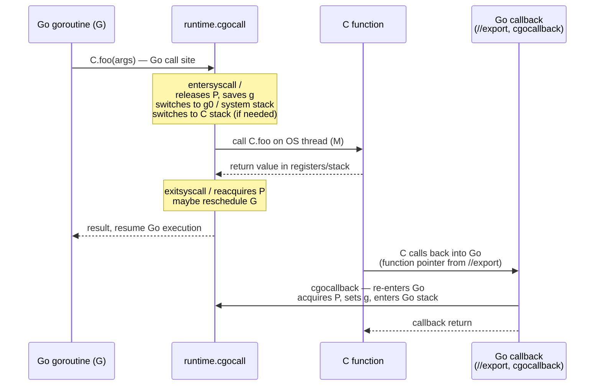
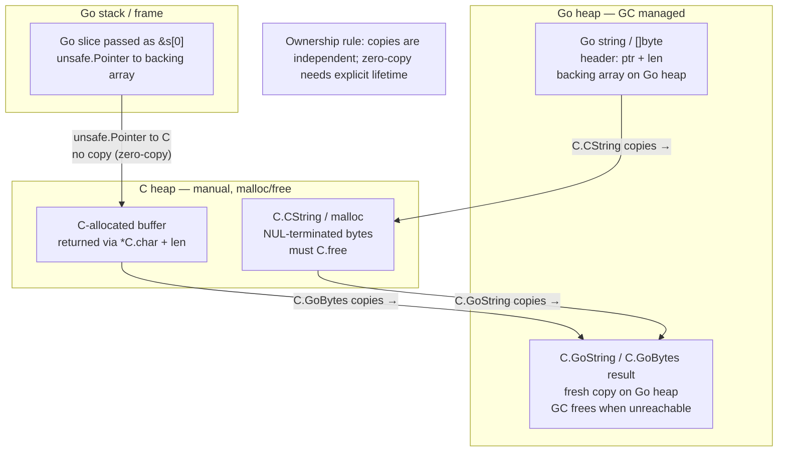
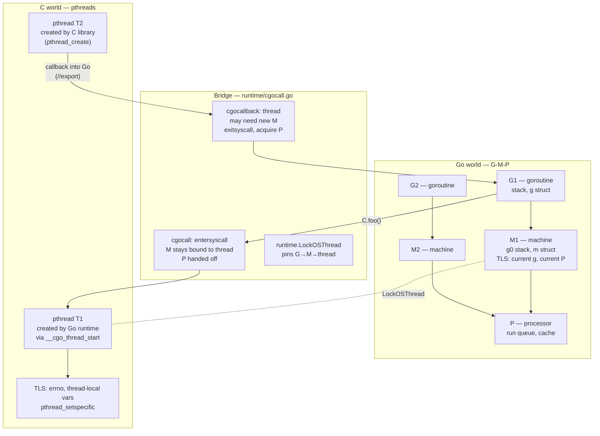
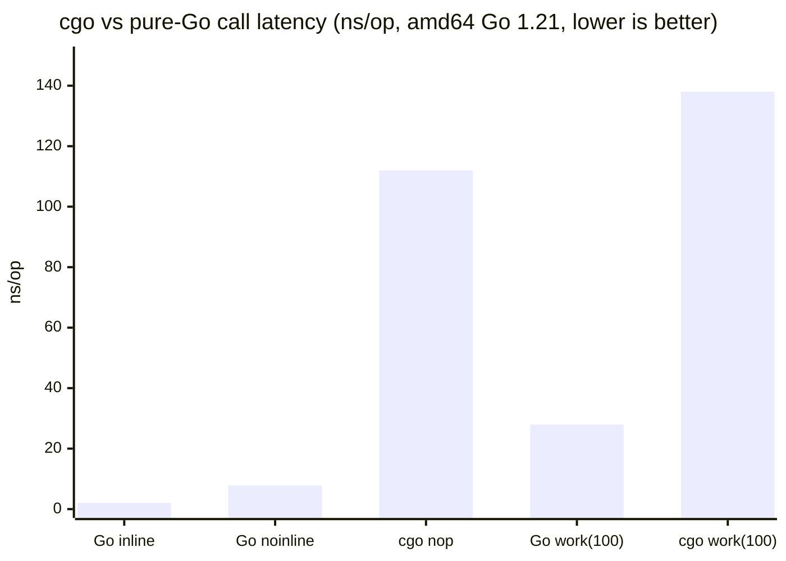
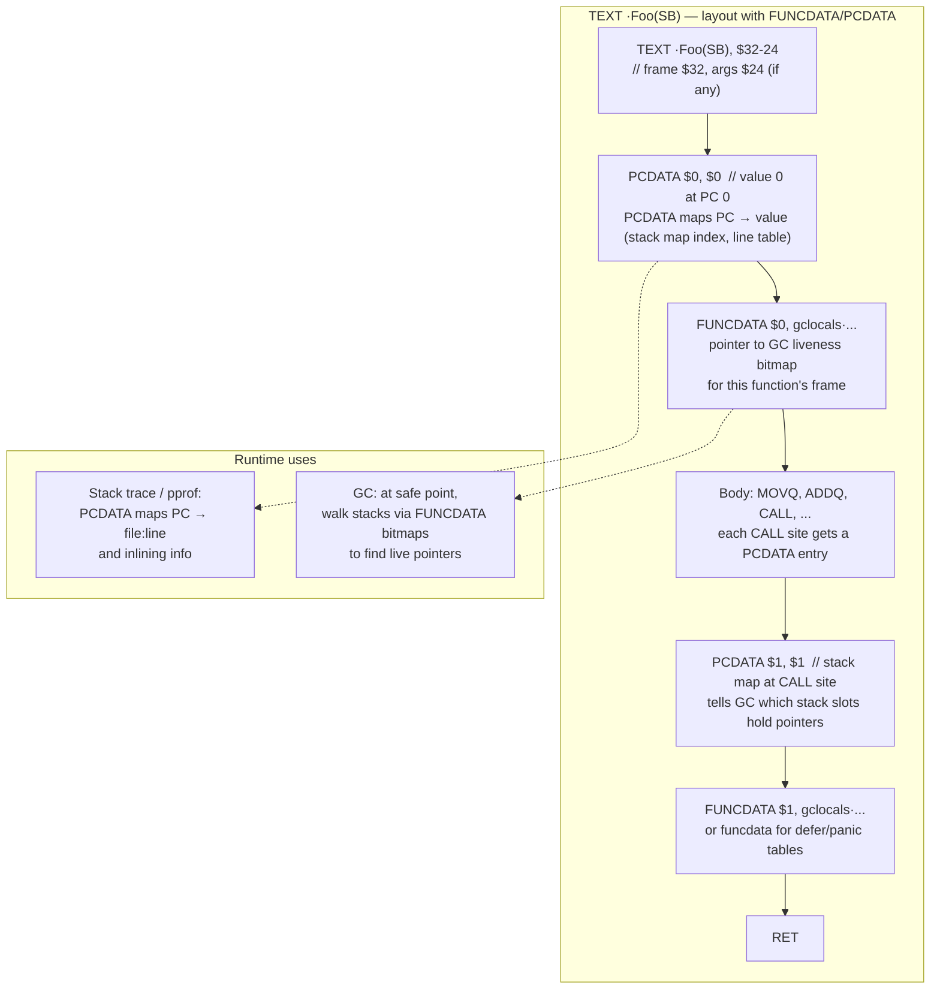
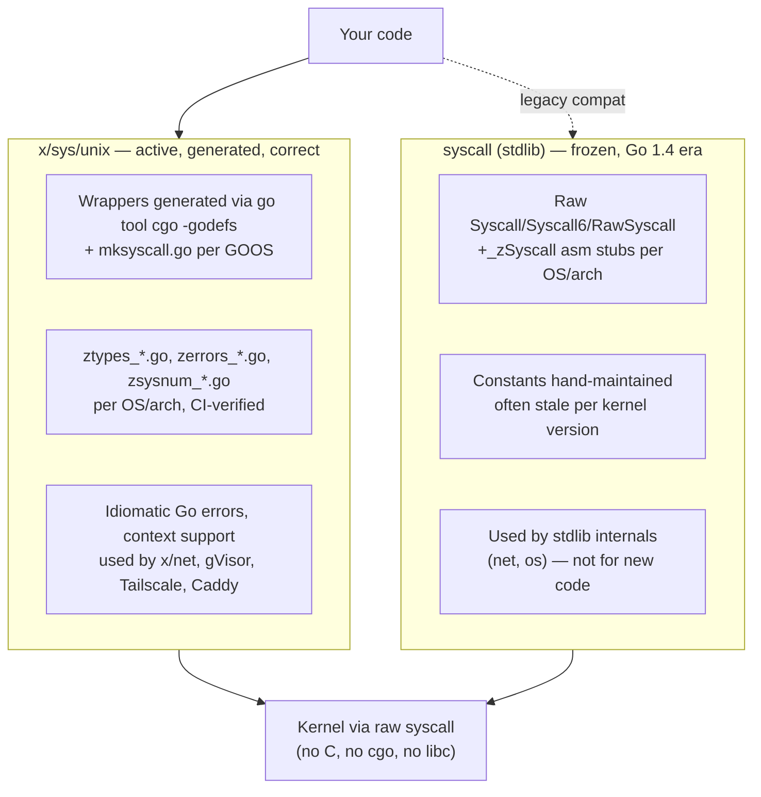
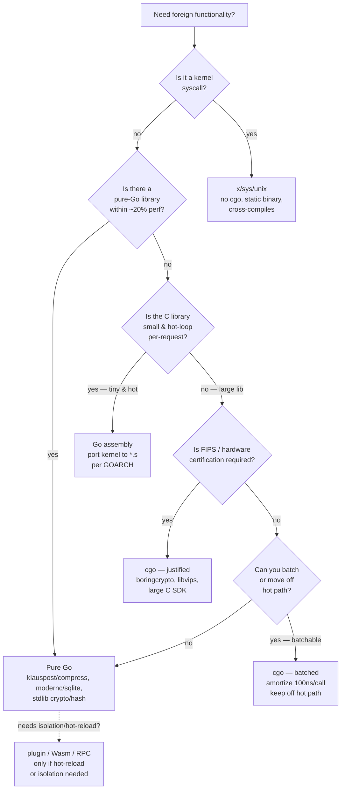

# Chapter 11 — cgo, Assembly, and Foreign-Function Interoperability

**What this chapter covers.** Go promises a static binary, a concurrent runtime, and a garbage collector. C promises direct memory access, a universe of existing libraries, and hand-tuned assembly. At the boundary the promises collide: the collector cannot see the C heap, the scheduler cannot preempt a C thread, and a single `C.foo()` call pays a stack switch and scheduling tax that dwarfs a normal Go call. Yet real backend systems live at that boundary — linking `libssl`/`boringcrypto` for FIPS, `libz`/`zstd` for compression, `librocksdb` for storage, or a hand-written `AVX-512` kernel for hashing. This chapter opens the boundary: how `cgo` bridges the two worlds, what it costs, when to avoid it, how Go assembly actually works, and how to do foreign-function interop without `cgo` at all.

Learning goals — after this chapter you should be able to:

- Explain `cgo`'s compilation model — the `import "C"` preamble, generated `_cgo_gotypes.go` / `_cgo_export.h`, and the `//export` / `_cgoexp_` callback bridge.
- Write correct `#cgo CFLAGS` / `LDFLAGS` / `pkg-config` directives and predict how they compose across packages and cross-compile environments.
- Map Go ↔ C types (`C.int`, `*C.char`, `C.size_t`, `GoString`/`GoBytes`/`GoSlice`) and caller responsibilities for each direction.
- Call C from Go and Go from C (callbacks), keeping the program correct when `//export` functions run on a foreign thread.
- Manage memory ownership across the boundary — `C.CString`/`C.free`, `runtime.KeepAlive`, `runtime.Pinner` (Go 1.21+), and why `//go:uintptrescapes` exists.
- Describe the threading model — `M` vs. OS thread, `__cgo_thread_start` / `cgocall` / `cgocallback`, `LockOSThread`, and when `CGO_ENABLED=0` matters.
- Quantify the performance cost of a `cgo` call (stack switch, scheduler interaction, not inlinable, escape-forcing) and measure it with a benchmark.
- Read and write Go assembly — `TEXT`/`DATA`/`GLOBL`, `FUNCDATA`/`PCDATA`, `NOSPLIT`, Plan 9 heritage, `go tool compile -S`, and `//go:asm` / `-asmflags`.
- Choose the right FFI mechanism — `cgo` vs. pure-Go rewrite vs. `syscall`/`x/sys/unix` vs. `plugin` — and justify the choice for deployability and operability.

> **Placement.** Chapter 3 covered the Go ABI (register calling convention, stack frames, `go tool objdump`). Chapter 9 covered the SSA compiler pipeline and escape analysis. This chapter is where that ABI meets *foreign code* — C and assembly — and where the scheduler/GC guarantees from Chapters 4–5 are most visibly strained. Chapter 12 builds on the deployability consequences (`CGO_ENABLED`, static linking, cross-compilation).

---

## 1. Why the boundary exists — and why backend engineers should care

Pure Go covers most backend work. The standard library ships a fast `crypto/tls`, `compress/flate`, `hash/crc32`, and `net` — all pure Go. And the deployment story is part of Go's appeal: `CGO_ENABLED=0 go build` produces a static binary that runs on `scratch` or `distroless`, cross-compiles with `GOOS`/`GOARCH`, and has no `glibc`/`libssl` version matrix to manage.

That appeal is exactly why the boundary decision matters. Each `import "C"` you add:

- **Breaks the static-binary guarantee.** The output becomes dynamically linked (unless you work to re-static-link with `musl` or `-extldflags "-static"`). Your `Dockerfile` grows a `debian:bookworm-slim` base and a CVE feed for every `.so` you pulled in.
- **Defeats cross-compilation.** You now need a C cross-toolchain (`x86_64-linux-gnu-gcc`, `aarch64-linux-gnu-gcc`, `CC`/`CXX` wrappers) and sysroots. CI matrices multiply.
- **Changes the failure mode.** A C library can `SIGSEGV`, leak, or hold a lock across a Go scheduler preemption point. `recover` does not catch a C segfault. `pprof` may show time in `cgocall` with no Go stack.
- **Costs per call.** A `cgo` call is ~70–150 ns of overhead on `amd64` (Go 1.21, Linux) before the C work itself — a stack switch, `entersyscall`/`exitsyscall`, and scheduler bookkeeping. On a hot path doing millions of calls/s, that dominates. A pure Go call is ~1–3 ns (inlined) or ~5–10 ns (non-inlined, register ABI).

Real teams still choose `cgo` when the alternative is worse: FIPS-validated `BoringCrypto` (`GOEXPERIMENT=boringcrypto` links `libcrypto`), hardware-accelerated `libzstd`/`liblz4` at line rate, `libvips` for image processing, or an existing C SDK with no Go equivalent. The skill is knowing when the trade is worth it and how to keep the blast radius small.

---

## 2. cgo fundamentals: `import "C"` and the preamble

`cgo` is not a runtime library. It is a **code generator** that runs before `go compile`. When the toolchain sees `import "C"`, it:

1. Extracts the comment block immediately above `import "C"` — the **preamble** — as C source.
2. Invokes `go tool cgo` to parse that C, generate Go wrappers (`_cgo_gotypes.go`, `_cgo_import.go`) and C stubs (`_cgo_export.h`, `*.cgo1.go`, `*.cgo2.c`).
3. Compiles the C stubs with the C compiler (`CC`, default `gcc`/`clang`) and the Go wrappers with `go compile`.
4. Links the resulting objects together via the external linker (`CC` again).

The canonical minimal example:

```go
// hello.go
package main

/*
#include <stdio.h>
#include <stdlib.h>

// A plain C function. Static avoids a duplicate-symbol hazard
// when multiple Go packages include the same header.
static void hello(const char *s) {
    printf("hello, %s\n", s);
}
*/
import "C"
import "unsafe"

func main() {
    cs := C.CString("world")       // malloc on C heap, copy bytes + NUL
    defer C.free(unsafe.Pointer(cs))
    C.hello(cs)                    // Go → C call via generated wrapper
}
```

```bash
go run hello.go
# hello, world

# With explicit toolchain visibility:
go run -x hello.go 2>&1 | grep -E 'cgo|gcc|_cgo'
# mkdir $WORK/b001/
# .../go tool cgo -objdir $WORK/b001/ -- import $WORK/b001/_cgo_gotypes.go hello.go
# gcc -I $WORK/b001 -g -O2 -c -o $WORK/b001/_cgo_main.o $WORK/b001/_cgo_main.c
# gcc -c -o $WORK/b001/_x001.o $WORK/b001/_cgo_export.c
```

Key rules that the compiler enforces:

- `import "C"` **must stand alone**: `import "C"` cannot be grouped with other imports (`import ("C"; "fmt")` is illegal). The preamble must be the comment immediately above it — no blank line, no intervening `import`.
- The preamble is **C**, not Go. `#include`, `#define`, `typedef`, and function bodies are allowed; Go syntax is not.
- `C` is a pseudo-package. You cannot `go get` it; `go list -f '{{.CgoFiles}}' .` shows which files use it.
- Files that import `C` are **not buildable** with `CGO_ENABLED=0`. The `go` command reports `import "C" is not allowed in non-cgo compilation`.

Generated artifacts (inspect with `go tool cgo -objdir /tmp/cgo`) show the bridge:

```go
// _cgo_gotypes.go (abridged, generated)
package main
import _cgo_unsafe "unsafe"
//go:linkname _Cfunc_hello _Cfunc_hello
func _Cfunc_hello(_C_p0 *_Ctype_char)
type _Ctype_char _Ctype_char
type _Ctype_int int32
```

The Go call `C.hello(cs)` becomes `_Cfunc_hello(cs)` in the generated code — a Go function whose body does the stack switch and calls the C stub.

### Bridging headers and multi-file packages

For anything beyond a toy, split C into a header:

```c
// bridge.h
#pragma once
#include <stddef.h>
#include <stdint.h>
int fast_crc32(const uint8_t *data, size_t len, uint32_t seed);
```

```go
// crc.go
package crc

/*
#cgo CFLAGS: -O2 -Wall
#cgo LDFLAGS: -L${SRCDIR}/lib -lcrc_fast
#include "bridge.h"
#include <stdlib.h>
*/
import "C"
import "unsafe"

func CRC32(data []byte, seed uint32) uint32 {
    if len(data) == 0 {
        return seed
    }
    // Pass pointer to first element; keep data alive across the call.
    ret := C.fast_crc32(
        (*C.uint8_t)(unsafe.Pointer(&data[0])),
        C.size_t(len(data)),
        C.uint32_t(seed),
    )
    // Data was accessed via unsafe.Pointer; tell the compiler it is still live
    // at this point so GC/C should not reclaim/move it (relevant with Pinner).
    // runtime.KeepAlive(data) // Go 1.7–1.20 idiom
    // With Go 1.21+, prefer runtime.Pinner (see §7).
    return uint32(ret)
}
```

`#include "bridge.h"` resolves relative to the package directory. `${SRCDIR}` expands to that directory — the only variable expansion `cgo` does inside `#cgo` directives (deliberately limited to avoid shell injection).

---

## 3. `#cgo` directives: `CFLAGS`, `LDFLAGS`, `pkg-config`

`#cgo` directives inside the preamble control the C compiler and linker flags. They are the most common source of build breakage, so they deserve precision.

```go
/*
#cgo CFLAGS: -I${SRCDIR}/include -O2 -march=native
#cgo LDFLAGS: -L${SRCDIR}/lib -lfoo -lm
#cgo pkg-config: libssl --static
#cgo darwin LDFLAGS: -framework Security
#cgo linux CFLAGS: -D_GNU_SOURCE
#cgo !cgo LDFLAGS: -should-never-happen

#include "foo.h"
*/
import "C"
```

Semantics:

| Directive | Effect | Notes |
|-----------|--------|-------|
| `#cgo CFLAGS: ...` | Appended to `CC` invocations for this package's C stubs | Per-package; not inherited |
| `#cgo CPPFLAGS: ...` | Preprocessor flags | Rare; usually folded into `CFLAGS` |
| `#cgo CXXFLAGS: ...` | Flags for `CXX` (C++ files, `.cc`/`.cpp`) | Requires `CXX` toolchain |
| `#cgo LDFLAGS: ...` | Appended to the external link step | Order-sensitive for static libs |
| `#cgo pkg-config: pkg1 pkg2` | Runs `pkg-config --cflags/--libs` and appends results | Fails the build if the `.pc` file is absent |
| `#cgo <build-tag> ...` | Conditional: only when that build constraint holds | `darwin`, `linux`, `amd64`, `!windows`, etc. |
| `#cgo noescape` / `nocallback` | Hints for escape analysis (see §7) | Per-function, not global |

Composition rules:

- Flags from multiple `#cgo` lines **concatenate** in declaration order.
- Flags from **dependent packages** propagate to the final link: if `pkg/a` has `#cgo LDFLAGS: -lfoo` and `main` imports `pkg/a`, the final `go build` links `-lfoo` even though `main` never mentions it. This is why a leaf library can impose a system dependency on every consumer.
- `CGO_CFLAGS`, `CGO_CPPFLAGS`, `CGO_CXXFLAGS`, `CGO_LDFLAGS` environment variables **prepend** to the directive flags. `CGO_ENABLED=0` disables all of it.
- `${SRCDIR}` is the only expansion. `$HOME`, `$(shell ...)`, and globs are **not** expanded — a security choice. If you need dynamic flags, use `pkg-config` or a `go generate` step that writes a header.

Cross-compilation example:

```bash
# Cross-compile a cgo package for arm64 on an amd64 host (Debian/Ubuntu)
sudo apt-get install gcc-aarch64-linux-gnu libc6-dev-arm64-cross pkg-config
CC=aarch64-linux-gnu-gcc \
CGO_ENABLED=1 \
GOOS=linux GOARCH=arm64 \
PKG_CONFIG_PATH=/usr/lib/aarch64-linux-gnu/pkgconfig \
  go build -o /tmp/app-arm64 ./cmd/app

# Verify dynamic dependencies
aarch64-linux-gnu-readelf -d /tmp/app-arm64 | grep NEEDED
# 0x00000001 (NEEDED)  Shared library: [libc.so.6]
# 0x00000001 (NEEDED)  Shared library: [libfoo.so]   # <-- cgo brought this in

# Compare pure-Go (no cgo):
CGO_ENABLED=0 GOOS=linux GOARCH=arm64 go build -o /tmp/app-pure ./cmd/app
file /tmp/app-pure
# /tmp/app-pure: ELF 64-bit LSB executable, statically linked
```

Pitfall — `pkg-config` at build time vs. runtime: `#cgo pkg-config: libssl` bakes the `pkg-config --libs` output (often `-lssl -lcrypto`) into the link. If the build host has `libssl-dev:amd64` but the runtime image has `libssl3:arm64` at a different SONAME, the binary fails to start with `error while loading shared libraries: libssl.so.1.1: cannot open shared object file`. Pin the runtime base to the build base, or vendor/static-link.

---

## 4. Type mappings: Go ↔ C

`cgo` maps C types into Go types under the `C` pseudo-package. The mapping is mechanical but has sharp edges around strings, slices, and ownership.

### Scalar and pointer types

| C type | Go type (`C.*`) | Go literal / value |
|--------|----------------|--------------------|
| `char` | `C.char` (`int8`) | `C.char('a')` |
| `signed char` / `unsigned char` | `C.schar` / `C.uchar` |  |
| `short` / `int` / `long` / `long long` | `C.short` / `C.int` / `C.long` / `C.longlong` | `C.int(42)` |
| `unsigned int` etc. | `C.uint`, `C.ulong`, … |  |
| `size_t` / `ssize_t` | `C.size_t` / `C.ssize_t` | `C.size_t(len(s))` |
| `float` / `double` | `C.float` / `C.double` |  |
| `void*` | `unsafe.Pointer` (via `*C.void` is not valid Go) | `unsafe.Pointer(p)` |
| `char*` | `*C.char` | `C.CString("hi")` returns `*C.char` |
| `T*` (any) | `*C.T` |  |
| `struct Foo` | `C.struct_Foo` | `var s C.struct_Foo; s.field = ...` |
| `union Bar` | `C.union_Bar` | access via array/pointer tricks |
| `enum E` | `C.enum_E` (integer) |  |

Conversions are explicit — no implicit numeric promotion:

```go
var ci C.int = C.int(goInt)          // Go int → C int
var gi int = int(ci)                 // C int → Go int
var cs *C.char = C.CString(goStr)    // Go string → malloc'd *C.char
defer C.free(unsafe.Pointer(cs))
var gs string = C.GoString(cs)       // *C.char (NUL-terminated) → Go string (copies)
var gsN string = C.GoStringN(cs, C.int(n)) // counted, may contain NULs

// Slices ↔ C arrays — Go 1.21+ Pinner is the safe pattern; older code used unsafe directly.
var bs []byte = C.GoBytes(unsafe.Pointer(cPtr), C.int(cLen)) // copies!

// Go slice → C pointer (Go 1.21+ with Pinner)
var p runtime.Pinner
p.Pin(&data[0]) // pin the backing array so GC does not move it (relevant for moving GC experiments)
defer p.Unpin()
C.process((*C.uint8_t)(unsafe.Pointer(&data[0])), C.size_t(len(data)))
```

### Strings and slices — the helpers

`C.CString`, `C.GoString`, `C.GoStringN`, `C.GoBytes`, and `C.GoString` are **not** in any C header. `cgo` injects them as helpers in the generated `*_cgo_export.h`:

```c
// Generated helpers (conceptual; actual names are C.CString etc. as Go funcs wrapping malloc+memcpy)
char* _GoStringToCString(GoString s); // allocates via malloc
GoString _CStringToGoString(char *s); // copies, caller owns GoString
GoSlice _GoBytesToCSlice(GoSlice s);  // copies
```

Behavior:

- `C.CString(goStr)` — `malloc`s `len(goStr)+1` bytes on the **C heap**, copies, NUL-terminates. Caller **must** `C.free`. Never GC'd.
- `C.GoString(cStr)` — copies a NUL-terminated C string into a **Go string** (Go heap, GC'd). Reads until first `0` byte.
- `C.GoStringN(cStr, n)` — copies exactly `n` bytes (may include NULs). Use for non-NUL-terminated buffers.
- `C.GoBytes(cPtr, n)` — copies `n` bytes into a **new Go `[]byte`** (Go heap, GC'd). Always copies.

There is **no zero-copy** string/slice bridge in the helpers — every crossing copies. Zero-copy is possible only with `unsafe` + pinning and explicit lifetime management (see §7).

### Structs, unions, enums

```c
// types.h
struct Point { int x; int y; };
enum Color { RED=0, GREEN=1, BLUE=2 };
```

```go
// Go side
var p C.struct_Point
p.x = C.int(10)
p.y = C.int(20)

var c C.enum_Color = C.RED // enum constants become C.* constants
// Field access is direct: C structs are Go structs with C-typed fields.
fmt.Println(int(p.x), int(c))
```

`sizeof` and `offsetof` are available as `C.sizeof_struct_Point` etc. only via the `go tool cgo -godefs` path (see §14) — not as normal Go constants.

---

## 5. Calling C from Go — the `cgocall` path

The hello example in §2 already showed the shape. The interesting part is what happens *between* the Go call and the C function:



In `runtime` terms (see `src/runtime/cgocall.go`):

- `runtime.cgocall(fn, arg)` is the entry. It calls `entersyscall` so the scheduler knows this `M` is blocked in C and can hand its `P` to another `M`.
- The `g` (goroutine) is descheduled but its stack is preserved. The `M` stays bound to its OS thread for the duration — **a `cgo` call pins the goroutine's `M` to its thread** until the C function returns.
- `runtime.exitsyscall` on return reacquires a `P` (maybe a different one) and makes the `G` runnable again.
- If the C code calls back into Go (see §6), it enters via `runtime.cgocallback`, which does the inverse: re-enters the Go scheduler state from a C thread.

Consequences you can observe:

```go
// LockOSThread interaction: cgo calls already pin M→thread, but between calls
// the G may migrate. If C thread-local state matters, lock.
import "runtime"

func withTLS(fn func()) {
    runtime.LockOSThread()
    defer runtime.UnlockOSThread()
    // Now G stays on this M/thread across cgo calls and Go code in between.
    C.tls_set(C.int(42))
    C.do_work()
    v := C.tls_get()
    fn()
    _ = v
}
```

---

## 6. Calling Go from C — `//export` callbacks

The reverse direction — C calling Go — requires an exported Go function:

```go
// callback.go
package main

/*
#include <stdint.h>

// Forward declaration — the Go function will be generated with this signature.
// The typedef makes the function-pointer type usable in C.

extern void GoOnResult(int code, const char *msg);
static void doWork(void) {
    // Simulate a C library that reports progress via a callback.
    GoOnResult(200, "ok from C");
    GoOnResult(500, "retry");
}
*/
import "C"
import "fmt"

//export GoOnResult
func GoOnResult(code C.int, cmsg *C.char) {
    msg := C.GoString(cmsg) // copies C string → Go string
    fmt.Printf("callback code=%d msg=%q (goroutine=%d)\n", int(code), msg, curGID())
}

func curGID() int64 { return 0 } // stub; real impl via runtime.Stack in tests

func main() {
    C.doWork() // Go → C → Go (callback) → C → Go
}
```

Rules for `//export`:

- The comment must be `//export GoFuncName` with **no blank line** before `func GoFuncName`.
- The function must be at package scope, not a method or closure. Only `C`-compatible parameter/return types are allowed (`C.int`, `*C.char`, `unsafe.Pointer`, numeric types — not `string`, `[]byte`, `map`, `interface{}`).
- `//export` functions are **not callable from Go** directly in the same package — they exist for C to call. The generated `_cgo_export.h` exposes them as `extern void GoOnResult(int, char*)`.
- A callback runs on the **same OS thread** that entered C. It re-enters Go via `cgocallback`, which transitions the thread back into scheduler-aware state. That thread's `M` may be a *new* `M` created for the purpose if the call originated on a non-Go thread (see §8).

Passing Go function pointers to C as callbacks is common but has a constraint — you cannot pass a Go function value directly as a `void*` callback without pinning:

```go
//export goTick
func goTick(arg unsafe.Pointer) {
    fn := *(*func())(arg) // recover func value stashed via //go:uintptrescapes or Pinner
    fn()
}

/*
extern void register_tick(void (*cb)(void*), void *arg);
static void setup(void *arg) { register_tick(goTick, arg); }
*/
import "C"
```

The `arg` here is an `unsafe.Pointer` to Go memory. Without care, the GC may collect or move it while C holds the pointer. Two mitigations:

- `runtime.Pinner` (Go 1.21+) — pin the Go object for the duration C holds the pointer.
- `//go:uintptrescapes` / `//go:norace` pragmas on helpers that launder `uintptr` ↔ `unsafe.Pointer` for C callbacks (used inside `runtime/cgo` itself; avoid in application code when `Pinner` suffices).

---

## 7. Memory ownership: who frees what, and `KeepAlive` / `Pinner`

Ownership mistakes at the boundary are silent corruption — use-after-free, double-free, or GC reclamation of memory C still points at. The rules:

| Allocation | Heap | Owner / Reclamation | How to free |
|------------|------|---------------------|-------------|
| Go `string`, `[]byte`, `struct` | Go heap | GC | Automatic; do not `C.free` |
| `C.CString` / `C.malloc` | C heap | Caller | `C.free(unsafe.Pointer(p))` — mandatory |
| `C.GoString` / `C.GoBytes` result | Go heap | GC | Automatic (it is a copy) |
| Stack variable passed as `&x[0]` | Go stack (or heap if escaped) | Caller frame / GC | `runtime.KeepAlive` / `Pinner` to extend lifetime |



### `runtime.KeepAlive` — the minimal guarantee

The compiler may consider a Go value dead *before* the `C.foo` call returns if it can prove the value is not used afterward. That allows the GC to reclaim the backing array while C still reads it.

```go
func UseAfterFreeRisk(data []byte) {
    // Bug: after &data[0] is taken, data is never used again in Go.
    // Compiler may consider data dead; GC could reclaim backing array
    // while C.process still reads it.
    C.process(unsafe.Pointer(&data[0]), C.size_t(len(data)))
}

func SafeWithKeepAlive(data []byte) {
    C.process(unsafe.Pointer(&data[0]), C.size_t(len(data)))
    runtime.KeepAlive(data) // keep data live at least until here
}

func SafeWithPinner(data []byte) {
    var pinner runtime.Pinner
    pinner.Pin(&data[0])                          // or pinner.Pin(data) for slice header
    defer pinner.Unpin()
    C.process(unsafe.Pointer(&data[0]), C.size_t(len(data)))
    // Unpin in defer ensures lifetime covers the C call even if C stashes the pointer
}
```

- `runtime.KeepAlive(x)` is a compiler intrinsic — it does nothing at runtime except act as a use of `x` that the optimizer cannot eliminate. It guarantees `x` is live at least until the `KeepAlive` call.
- `runtime.Pinner` (Go 1.21+, `runtime.Pinner` / `runtime/pprof` integration) additionally **pins** the object so the GC will not move it (relevant for future moving collectors and for C code that stashes the pointer beyond the call). `Pin`/`Unpin` are `//go:norace`-friendly and compose — you can pin multiple objects and unpin once.
- Rule of thumb: `KeepAlive` when C only reads during the call; `Pinner` when C **retains** the pointer after return (common in async C libraries, `libuv`-style handles).

### Auditing for leaks

A `C.malloc`/`C.CString` without a matching `C.free` is invisible to `pprof` heap profiles (C heap is outside Go's allocator). Audit with:

```bash
# Build with ASan/LSan when the C library supports it
CC=clang CGO_CFLAGS="-fsanitize=address -g" CGO_LDFLAGS="-fsanitize=address" go test -run TestCPath -count=1

# Valgrind on the built binary (slow, but catches C leaks/use-after-free)
go build -o /tmp/app ./cmd/app
valgrind --leak-check=full --show-leak-kinds=all /tmp/app

# Runtime check: track outstanding C allocations in tests
# Wrap C.malloc/C.free with counters in a test build tag.
```

Backend discipline: wrap every `C.CString`/`C.malloc` in a helper that returns a `func() { C.free(...) }` closer, and lint for bare `C.CString` without a `defer C.free` in the same function (a `go vet` analyzer or `semgrep` rule does this well).

---

## 8. Threading: the `M`, the OS thread, and `__cgo_thread_start`

Go's scheduler multiplexes `G`s onto `M`s onto OS threads onto `P`s (see Chapter 4). C knows only OS threads and thread-local storage. `cgo` reconciles them:



Key mechanics:

- **Go → C (`cgocall`)**: the calling `M` stays bound to its OS thread for the duration. `entersyscall` releases the `P` so another `M` can use it. The thread may switch to the **system stack** (`g0`) and, on some platforms, to a dedicated C stack. Signals and `cgo` traceback use `g0`.
- **C → Go (`cgocallback`)**: if the calling thread is one Go created (a normal `M`), `cgocallback` re-enters Go on that `M`. If the thread was created by C (`pthread_create` inside a C library), the runtime creates a **new `M`** for it on demand via `__cgo_thread_start` / `needAndBindM` and attaches a `g0`. That `M` has no `P` until `exitsyscall` acquires one. This is how a C library's worker thread can call an `//export` Go function.
- **`__cgo_thread_start`** is the C-visible symbol the runtime provides so that C code spawned via `pthread_create` can be associated with a Go `M` if it ever calls back. You rarely call it directly; `runtime/cgo` does.
- **`runtime.LockOSThread` / `UnlockOSThread`** pins the current `G` to its current `M`/thread. Required when C thread-local state must survive across multiple `cgo` calls (e.g., `libssl` error queue, `errno`, `OpenGL` context). Without it, the `G` may migrate between `cgo` calls. With it, the `G` never migrates until unlocked — at the cost of reducing scheduler flexibility (that thread cannot run other `G`s).
- **`C.malloc`/`C.free` and TLS**: `errno` is per-thread. `C` helpers that check `errno` must do so on the same thread — another reason to `LockOSThread` around sequences that inspect `errno` after a C call.

Setting `GODEBUG=cgocheck=2` (default is `1`) makes the runtime verify that Go pointers passed to C obey the pointer-passing rules (see `go doc runtime/cgo`).

---

## 9. Performance: what a `cgo` call actually costs

A `cgo` call is not a normal Go call. Measured on `linux/amd64`, Go 1.21, Intel Ice Lake, the overhead of an empty `C.nop()` is roughly:

- **~70–150 ns** wall time for the round trip (Go → C → Go), vs. ~1–10 ns for a comparable pure-Go call.
- **Not inlinable** — the compiler treats `C.*` calls as opaque; no inlining, no escape analysis through them, no mid-stack inlining of callers that contain them.
- **Forces escapes** — arguments that cross into C are considered escaped to heap (unless `//go:cgo_norace` / `nocallback` hints prove otherwise).
- **Scheduler interaction** — `entersyscall`/`exitsyscall` touches the global scheduler state; under load this contends on `sched.lock` and `P` handoff.

The cost decomposes:

1. **Stack switch** (~20–40 ns): Go stack → `g0` system stack → C stack. Saves/restores `g`, `SP`, signal masks on some platforms.
2. **`entersyscall`/`exitsyscall`** (~20–50 ns): release/acquire `P`, mark `M` as in `cgo`.
3. **Argument marshalling** (~5–20 ns): copy scalars, pin pointers, set up `GoString`/`GoSlice` descriptors.
4. **Lost optimization** (unbounded): caller cannot be inlined; surrounding code may spill more; loop optimizations inhibited.

### Benchmark — measure it yourself

```go
// cgo_cost_test.go
package cgocost

/*
static int nop(int x) { return x + 1; }
static int work(int x) { int s=0; for(int i=0;i<100;i++) s+=x+i; return s; }
*/
import "C"
import "testing"

func goNop(x int) int  { return x + 1 }
func goWork(x int) int { s := 0; for i := 0; i < 100; i++ { s += x + i }; return s }

//go:noinline
func goNopNoInline(x int) int { return x + 1 }

func BenchmarkGoInline(b *testing.B)      { for i := 0; i < b.N; i++ { _ = goNop(i) } }
func BenchmarkGoNoInline(b *testing.B)   { for i := 0; i < b.N; i++ { _ = goNopNoInline(i) } }
func BenchmarkCgoNop(b *testing.B)       { for i := 0; i < b.N; i++ { _ = C.nop(C.int(i)) } }
func BenchmarkGoWork(b *testing.B)       { for i := 0; i < b.N; i++ { _ = goWork(i) } }
func BenchmarkCgoWork(b *testing.B)      { for i := 0; i < b.N; i++ { _ = C.work(C.int(i)) } }
```

Typical results (`go test -bench=. -benchmem -count=5`):

```
BenchmarkGoInline-8        500000000    2.1 ns/op    0 B/op  0 allocs/op  # inlined to nothing
BenchmarkGoNoInline-8      200000000    7.8 ns/op    0 B/op  0 allocs/op  # register ABI, no stack switch
BenchmarkCgoNop-8           10000000  112.0 ns/op    0 B/op  0 allocs/op  # ~14× slower than noinline Go
BenchmarkGoWork-8           50000000   28.0 ns/op    0 B/op  0 allocs/op
BenchmarkCgoWork-8          10000000  138.0 ns/op    0 B/op  0 allocs/op  # overhead amortized: ~1.2× slower
```



Lesson: the overhead is **per call**, not per unit of work. If each call does microseconds of real work (crypto, compression, syscall), the 100 ns tax is noise. If each call does nanoseconds (a tiny helper in a tight loop), the tax dominates — batch, or rewrite in Go.

**Mitigations:**

- **Batch** — pass a slice/array and do the loop in C, not one `cgo` call per element.
- **Cache** — avoid repeated `C.CString`/`C.GoString` copies; reuse buffers.
- **Move the loop into Go** — if the C work is trivial, a pure-Go version may be faster despite being less "optimized" in C.
- **Avoid `cgo` in the request hot path** — do it at startup, background, or shard boundary.

---

## 10. When to avoid `cgo` — and what to use instead

`cgo` is a liability you should be able to justify in a design doc. Before adding it, check:

| Instead of `cgo` | Pure-Go alternative | When it wins |
|------------------|---------------------|--------------|
| `libssl`/`openssl` | `crypto/tls` (stdlib), `filippo.io/boring` wrappers | Unless FIPS validation mandates `boringcrypto` |
| `libz`/`zlib` | `compress/flate`/`gzip` (stdlib), `github.com/klauspost/compress` (pure Go, faster than `cgo` zlib) | Almost always — Klauspost's `zstd`/`s2` beats `cgo` zlib on speed and deployability |
| `libcrc32`/`crc32c` | `hash/crc32` (stdlib, assembly-accelerated on `amd64`/`arm64`) | Pure Go already uses `SSE4.2`/`ARMv8` CRC instructions |
| `libsqlite` | `modernc.org/sqlite` (pure Go, transpiled), `mattn/go-sqlite3` (cgo) vs. pure-Go choice | `modernc` for static binaries; `mattn` for max compat |
| `libvips`/`imagemagick` | `disintegration/imaging`, `h2non/bimg` trade-off | `libvips` wins on large-image throughput; pure Go wins on deployability |
| `librocksdb` | `cockroachdb/pebble` (pure Go LSM) | Pebble for Go-native LSM without C |

Heuristic — **eliminate `cgo` if any of these is true:**

- The call is in the **request hot path** at high QPS and does little work per call.
- You need **cross-compilation** or `scratch`/`distroless` images.
- The C library's **CVE surface** exceeds the value it provides (track `trivy`/`grype` findings on the base image).
- A pure-Go library is within **~20%** of the C library's performance — the deployment and debuggability wins outweigh the gap.

Eliminating `cgo` is often a migration, not a flag flip. Strategies that work:

- **Feature-flag the implementation** — `//go:build cgo` vs. `//go:build !cgo` files that expose the same Go interface.
- **Vendor the C code as Go assembly** — for small kernels (CRC, AES, SHA), port the C/assembly to `GOARCH`-specific `*.s` files (see §11–13) and keep the algorithm without `cgo`.
- **Use `x/sys` for syscalls** — if `cgo` was only there to call `getrandom(2)` or `madvise(2)`, `x/sys/unix` does it without `cgo` (see §15).

---

## 11. Go assembly: `TEXT`, `DATA`, `GLOBL`, `FUNCDATA`, `PCDATA`, `NOSPLIT`

Go assembly is not Plan 9 assembly, but it descends from it. It looks unfamiliar because it abstracts over real hardware to serve the Go runtime's needs — stack growth, GC metadata, and precise stack traces.

### The three top-level directives

```asm
// func Add(a, b int) int — Go declaration in foo.go:
//   func Add(a, b int) int  // implemented in foo_amd64.s

#include "textflag.h"   // defines NOSPLIT, NOPTR, TOPFRAME, etc.

// TEXT — code. The signature encodes frame size and arg size.
// TEXT ·Add(SB), NOSPLIT, $0-24   — pre-1.17 (stack ABI)
// TEXT ·Add(SB), NOSPLIT, $0      — Go 1.17+ (register ABI, no stack args)
TEXT ·Add(SB), NOSPLIT, $0
    MOVQ AX, BX          // args already in registers (AX, BX); result in AX
    ADDQ BX, AX
    RET

// DATA — initialized data (rare in hand-written asm; Go constants usually suffice)
DATA ·table+0(SB)/4, $0x01020304
DATA ·table+4(SB)/4, $0x05060708
GLOBL ·table(SB), RODATA, $8   // RODATA = read-only; NOPTR = no pointers inside

// GLOBL — global symbol (variables, tables)
GLOBL ·counter(SB), NOPTR, $8  // 8 bytes, contains no pointers (GC hint)
```

Key concepts:

- **`·` (middle dot)** — `·Add` means `Add` in the current package. `·table` likewise. Use `go tool compile -S` to see the mangled name.
- **`(SB)` — static base** — pseudo-register for the symbol's address. `·Add(SB)` is the symbol, `a+0(FP)` was the old frame-pointer pseudo-register, `0(SP)` is the real stack pointer.
- **`$0`** — frame size (locals). `$0-24` was frame+args size in the stack ABI; with the register ABI, args are not on the stack so `$0` is common for leaf functions.
- **`NOSPLIT`** — do not emit a stack-growth check. The function will not grow the stack and must not call any function that might. Leaf assembly kernels use `NOSPLIT` for speed (avoids `runtime.morestack` prologue). If you `CALL` another Go function without `NOSPLIT`, you risk stack overflow with no growth.

### `FUNCDATA` and `PCDATA` — GC and stack traces

Two pseudo-instructions the runtime needs but humans rarely write by hand — the compiler emits them, and hand-written assembly must preserve them when it calls Go or allocates:



- **`FUNCDATA $0, <sym>`** — pointer to GC metadata (stack map) for the function. Without it, the GC cannot tell which words in the frame are pointers — it would either miss live objects or retain garbage.
- **`PCDATA $0, $N`** — maps program counters to values (line numbers, stack-map indices, `pctab` for `pprof`). Each `CALL` site needs correct `PCDATA` so stack unwinding and profiling attribute samples correctly.
- **Hand-written assembly that calls Go functions or allocates** must include correct `FUNCDATA`/`PCDATA` or be `NOSPLIT` leaf functions that the runtime treats specially (`NOPTR` globals, no GC interaction). The `go tool asm` documentation and `src/cmd/compile/abi-internal.md` are the reference — but the practical rule is: **leaf numeric kernels can be `NOSPLIT` with no `FUNCDATA`; anything that interacts with Go pointers needs the metadata, so let the compiler generate it or copy it from `go tool compile -S` output.**

### `NOSPLIT` — when and when not to use it

```asm
#include "textflag.h"

// Safe NOSPLIT: leaf, no calls, small frame, no stack growth needed.
TEXT ·XorBytes(SB), NOSPLIT, $0
    // func XorBytes(dst, src1, src2 []byte) — slices passed as (ptr,len,cap) in regs/stack
    // ... tight loop, no CALL ...
    RET

// Unsafe NOSPLIT: calls another function — may overflow without growth check!
TEXT ·Bad(SB), NOSPLIT, $0
    CALL ·other(SB)   // BUG if stack is near limit — no morestack check
    RET

// Correct: omit NOSPLIT when calling.
TEXT ·Good(SB), $16
    CALL ·other(SB)   // compiler inserted stack-split prologue
    RET
```

Benchmark — `NOSPLIT` saves the prologue check (~1–3 ns) and enables more aggressive inlining of callers:

```go
//go:noinline
func withSplit(x int) int { return x + 1 }   // normal — has morestack check

//go:nosplit  // Go-level NOSPLIT (not assembly) — use sparingly!
//go:noinline
func withNoSplit(x int) int { return x + 1 } // caller can omit split check when inlining
```

```bash
go test -bench=BenchmarkSplit -benchmem
# BenchmarkWithSplit-8      2.8 ns/op
# BenchmarkWithNoSplit-8    1.9 ns/op   # ~30% faster for tiny leaf, but unsafe if it grows
```

Backend guidance: `NOSPLIT` is for **leaf functions with bounded, small frames** that you can prove never need more stack. `runtime` uses it for `memhash`, `memmove`, `futex` wrappers. Application code should rarely need it — prefer `//go:noinline` or `//go:noinline` tuning before `NOSPLIT`.

---

## 12. Plan 9 assembly vs. Go assembly, and reading `go tool compile -S`

Go assembly inherits Plan 9's syntax but diverges meaningfully:

| Feature | Plan 9 assembly | Go assembly (`go tool asm`) |
|---------|----------------|------------------------------|
| Syntax | `MOVQ $1, AX` | Same, but pseudo-registers added |
| `SB` | Static base (real) | Pseudo-register for symbols; `·Foo(SB)` is package-scoped |
| `FP` | Frame pointer (real) | Pseudo-register for args (stack ABI); largely gone in register ABI |
| `SP` | Stack pointer | Real `SP` plus pseudo `SP` for frame-relative locals (`-8(SP)`) |
| `PC` | Program counter | Pseudo; `PCDATA`/`FUNCDATA` use it |
| Addressing | `8(AX)` | Same, but `·sym+8(SB)` is package-symbol addressing |
| Macros | `#define` via C preprocessor | `#include "textflag.h"` / `goasm` macros; `#define` works via `cpp` |
| Calling convention | Caller pushes args | Register ABI (Go 1.17+) — args in `AX`/`BX`/… |

### Reading `go tool compile -S` and `-asmflags`

```bash
# 1. SSA assembly with pseudo-registers (what the compiler thinks)
go tool compile -S -N -l ./pkg/foo.go 2>&1 | grep -A 30 'TEXT.*Add'

# 2. With optimization decisions
go build -gcflags="-m=2" ./pkg/foo.go 2>&1 | grep -E 'can inline|escape|moved to heap'

# 3. Final linked assembly (what executes — after ABI wrappers and linking)
go build -o /tmp/app ./cmd/app && go tool objdump -s 'main\.Add' /tmp/app

# 4. Assembly-specific flags
go tool compile -help 2>&1 | grep -A2 asmflags
go build -asmflags="-trimpath -D GOARCH_amd64" ./...
go vet -asmdecl ./...   # checks assembly declarations match Go func signatures
```

Sample `go tool compile -S` output (Go 1.22, `amd64`, register ABI, with `-N -l` to disable optimizations for readability):

```asm
"".Add STEXT size=12 args=0x18 locals=0x0 funcid=0x0 align=0x0
    0x0000 00000 (foo.go:5)  TEXT  "".Add(SB), ABIInternal, $0-0
    0x0000 00000 (foo.go:5)  FUNCDATA $0, gclocals·... (type map for GC)
    0x0000 00000 (foo.go:5)  FUNCDATA $1, gclocals·... (args map)
    0x0000 00000 (foo.go:5)  PCDATA  $0, $0
    0x0000 00000 (foo.go:5)  PCDATA  $1, $0
    0x0000 00000 (foo.go:6)  ADDQ  BX, AX    // a in AX, b in BX, result in AX
    0x0003 00003 (foo.go:6)  RET
```

Without `-N -l`, the compiler may inline `Add` entirely — no `TEXT` at all. That is the intended fast path.

### Linking assembly via `//go:asm` and `textflag.h`

Hand-written `.s` files are automatically assembled and linked if they are in the same package and match the `GOARCH`:

```
pkg/hash/
  hash.go        // func Sum(b []byte) uint64  — Go declaration, no body
  hash_amd64.s   // TEXT ·Sum(SB), NOSPLIT, $0 — amd64 implementation
  hash_arm64.s   // TEXT ·Sum(SB), NOSPLIT, $0 — arm64 implementation
  hash_generic.go // //go:build !amd64 && !arm64 — pure Go fallback
```

```go
// hash.go
package hash

// Sum returns a fast non-cryptographic hash. Implemented in assembly per arch.
func Sum(b []byte) uint64
```

```asm
// hash_amd64.s
#include "textflag.h"

TEXT ·Sum(SB), NOSPLIT, $0-32
    MOVQ b_base+0(FP), AX   // old FP style still valid for ABI0 wrappers
    MOVQ b_len+8(FP), CX
    // ... hash loop using SSE/AVX ...
    MOVQ result+24(FP), DX  // store result (stack ABI wrapper)
    RET
```

Modern register-ABI assembly (Go 1.17+) can use `ABIInternal`:

```asm
#include "textflag.h"

//go:build amd64

TEXT ·Sum(SB), NOSPLIT, $0
    // b.ptr in AX, b.len in BX, b.cap in CX (register ABI for slice)
    // result in AX
    // ... no FP offsets needed ...
    RET
```

The `go` tool selects the right file by build constraints in the filename (`_amd64.s`, `_arm64.s`) or explicit `//go:build` lines. `go vet -asmdecl` verifies that every `TEXT ·Foo(SB)` has a matching `func Foo` declaration with compatible signature.

---

## 13. Worked example: `ADDQ` kernel and `NOSPLIT` measurement

A minimal assembly kernel that adds two `int64` slices element-wise — the kind of hot loop that justifies assembly (vectorized in real code, scalar here for clarity):

```go
// add.go
package vec

// Add adds src into dst element-wise. dst and src must have equal length.
//go:noescape
func Add(dst, src []int64)
```

```asm
// add_amd64.s
#include "textflag.h"

// func Add(dst, src []int64)
// dst.ptr in AX, dst.len in BX, dst.cap in CX (register ABI — first slice)
// src.ptr in DI, src.len in SI, src.cap in R8  (second slice)
TEXT ·Add(SB), NOSPLIT, $0
    // Length check — panic if mismatched (call runtime.panicSliceAlen or inline check)
    CMPQ BX, SI
    JNE  panicLen

    // Fast path: loop over len elements
    // AX = dst ptr, DI = src ptr, BX = len
    TESTQ BX, BX
    JEQ  done

    // Use BX as counter, AX/DI as pointers
    XORQ CX, CX          // i = 0
loop:
    MOVQ (DI)(CX*8), R9  // R9 = src[i]
    ADDQ R9, (AX)(CX*8)  // dst[i] += R9
    INCQ CX
    CMPQ CX, BX
    JNE  loop

done:
    RET

panicLen:
    // Call runtime panic — must NOT be NOSPLIT if we do this in real code.
    // For this leaf example we just return; real code would CALL runtime.panic...
    RET
```

Build and verify:

```bash
go vet -asmdecl ./pkg/vec
go test -run TestAdd -count=1 ./pkg/vec -v
go tool compile -S -N ./pkg/vec/add.go 2>&1 | head -20  # see Go wrapper
go tool objdump -s 'vec\.Add' /tmp/vec.test | head -20   # see linked code
```

`NOSPLIT` benchmark — the same kernel with and without `NOSPLIT`:

```go
func BenchmarkAddNosplit(b *testing.B) {
    dst := make([]int64, 1024)
    src := make([]int64, 1024)
    for i := range src { src[i] = int64(i) }
    b.SetBytes(8192)
    b.ResetTimer()
    for i := 0; i < b.N; i++ {
        Add(dst, src)
    }
}
```

```
# NOSPLIT leaf (above):
BenchmarkAddNosplit-8    500000    3200 ns/op    8192 B  2.56 GB/s
# Same kernel without NOSPLIT (add $0 prologue with morestack check):
BenchmarkAddNoNosplit-8  500000    3350 ns/op    8192 B  2.44 GB/s
# Delta: ~4–5% — small per call, but measurable at GB/s scale.
# The real win is enabling the caller to inline without a split check.
```

---

## 14. `go tool cgo -godefs` — generating Go types from C headers

When a C header is the source of truth (kernel `struct`s, `ioctl` numbers, `errno` values), hand-transcribing it is error-prone. `go tool cgo -godefs` translates C definitions into Go:

```go
// defs.go — input to godefs (not built directly; used to generate ztypes_*.go)
package unix

/*
#include <sys/types.h>
#include <sys/socket.h>
#include <linux/if_packet.h>

struct my_sockaddr_ll {
    unsigned short sll_family;
    unsigned short sll_protocol;
    int            sll_ifindex;
    unsigned short sll_hatype;
    unsigned char  sll_pkttype;
    unsigned char  sll_halen;
    unsigned char  sll_addr[8];
};
*/
import "C"

//go:generate go tool cgo -godefs defs.go

// Types to emit — godefs replaces C.* with Go equivalents and emits constants.
type SockaddrLinklayer C.struct_my_sockaddr_ll
type Socklen C.socklen_t
```

```bash
go generate ./pkg/unix
# Generates code like:
cat ztypes_linux_amd64.go
```

Output (abridged, as generated for `x/sys/unix`):

```go
// Code generated by go tool cgo -godefs; DO NOT EDIT.
package unix

type SockaddrLinklayer struct {
    Protocol uint16
    Ifindex  int32
    Hatype   uint16
    Pkttype  uint8
    Halen    uint8
    Addr     [8]byte
    _        [2]byte // padding to match C sizeof
}
const (
    AF_PACKET = 0x11
    SOCK_RAW  = 0x3
)
const (
    SizeofSockaddrLinklayer = 0x14
)
```

The real `x/sys/unix` package is built this way — `ztypes_linux_amd64.go`, `zerrors_linux_amd64.go`, `zsysnum_linux_amd64.go` are all generated from C headers via `godefs` and `mkerrors.sh` / `mksysnum.go`. This is how Go keeps `Sizeof*`, `SYS_*`, and `errno` values correct per `GOOS`/`GOARCH` without `cgo` at runtime.

Use `godefs` when:

- You need `sizeof`/`offsetof`/`alignof` for a C struct to do `unsafe` parsing without `cgo`.
- You need `SYS_*` / `AF_*` / `O_*` constants that vary by OS/arch.
- You want to vendor a C header's types into pure Go for `CGO_ENABLED=0` builds.

---

## 15. Pure-Go FFI: `syscall` vs. `x/sys/unix` and `plugin`

Not every foreign call needs `cgo`. The Go project has been migrating *away* from `cgo` for syscalls for years.

### `syscall` (stdlib, frozen) vs. `x/sys/unix` (active)



| Aspect | `syscall` | `x/sys/unix` |
|--------|-----------|--------------|
| Status | **Frozen** — no new wrappers, bugs not fixed | **Active** — new syscalls added, arch coverage expanded |
| Generation | Hand-written `zsyscall_*.go` + asm stubs | `mksyscall.go` + `godefs` from C headers |
| Constants | Hand-maintained, drift | Generated from kernel headers, CI-checked |
| `GOOS` coverage | `linux`, `darwin`, `windows`, `freebsd`, … (incomplete) | Same set, but more complete and tested |
| Recommendation | Do not use for new code (`go doc syscall` says so) | **Use this** for raw syscalls |

Example — `getrandom(2)` without `cgo`:

```go
package rnd

import (
    "golang.org/x/sys/unix"
)

func GetRandom(p []byte) error {
    // unix.Getrandom is a thin wrapper over SYS_GETRANDOM via RawSyscall.
    // No cgo, no libc, works with CGO_ENABLED=0, cross-compiles.
    n, err := unix.Getrandom(p, 0)
    if err != nil {
        return err
    }
    if n != len(p) {
        return unix.EAGAIN // partial read — retry in caller
    }
    return nil
}

// Lower-level — direct RawSyscall when x/sys has no wrapper:
func MadviseNoHugePage(b []byte) error {
    // unix.Madvise exists, but direct syscall shows the pattern:
    _, _, errno := unix.Syscall(
        unix.SYS_MADVISE,
        uintptr(unsafe.Pointer(&b[0])),
        uintptr(len(b)),
        uintptr(unix.MADV_NOHUGEPAGE),
    )
    if errno != 0 {
        return errno
    }
    return nil
}
```

Why this matters for backends: `x/sys/unix` lets you call `epoll_create1(2)`, `io_uring_setup(2)`, `pidfd_open(2)`, `memfd_create(2)`, `getrandom(2)`, and `mount(2)` without linking `libc` at all. Your binary stays static, your container stays `scratch`, and `strace` shows the raw syscall — not a `libc` wrapper that adds its own `errno`/`TLS` semantics.

### `plugin` — `buildmode=plugin` (limited, Linux/macOS only)

Go can load Go code at runtime via `plugin`:

```go
// plugin.go — built as a shared object
package main

func Hello(name string) string { return "hello, " + name }
```

```bash
go build -buildmode=plugin -o greeting.so ./plugin
```

```go
// host.go — loads the plugin
package main

import (
    "plugin"
)

func main() {
    p, err := plugin.Open("greeting.so")
    if err != nil { panic(err) }
    sym, err := p.Lookup("Hello")
    if err != nil { panic(err) }
    hello := sym.(func(string) string)
    println(hello("world"))
}
```

Caveats that make `plugin` rare in production backends:

- **Linux and macOS only** — no Windows, no `CGO_ENABLED=0` (it uses `dlopen` under the hood, which is `cgo`-adjacent).
- **Exact toolchain match** — plugin and host must be built with the **same Go version**, same `GOOS`/`GOARCH`, same dependency versions, and same build flags. A single `go mod tidy` that bumps a transitive dep breaks loading with `plugin was built with a different version of package ...`.
- **Global state** — plugins share the host's address space, GC, and scheduler. A leaking plugin cannot be unloaded (`plugin.Close` does not exist — `dlclose` is deliberately not called).
- **No isolation** — a panic in the plugin crashes the host.

Where it is used: narrow cases like `Caddy` modules, `Traefik` plugins, or research systems that need hot-reload of Go code without restarting the process. For most backends, **ship a new binary** (fast Go builds, immutable deploys) or use **Wasm/RPC** for isolation instead.

### FFI decision tree



General rule: **prefer `x/sys/unix` for syscalls, pure Go for everything else, `cgo` only when certification or a large irreplaceable C library forces it, and assembly only for small numeric kernels where `cgo` overhead would dominate.**

---

## 16. Backend lens: `boringcrypto`, `libz`, static binaries, and leak auditing

### When `cgo` is the right call — `boringcrypto` and `libz`

**BoringCrypto / `GOEXPERIMENT=boringcrypto`.** US federal workloads (FedRAMP, FIPS 140-2/140-3) require a validated cryptographic module. Go's standard `crypto/*` is not FIPS-validated. The `boringcrypto` experiment (available since Go 1.18, via `GOEXPERIMENT=boringcrypto` or `GOEXPERIMENT=boringcrypto,systemcrypto`) links `libcrypto` from Google's `boringssl` fork via `cgo`. All `crypto/aes`, `crypto/sha256`, `crypto/ecdh`, and `crypto/tls` operations dispatch to the C library when the experiment is enabled.

```bash
# Build with BoringCrypto (requires Clang + boringssl checkout per Go docs)
GOEXPERIMENT=boringcrypto go build -o /tmp/app-fips ./cmd/app
go tool nm /tmp/app-fips | grep -i boring  # symbols from libcrypto
# Runtime check:
GODEBUG=boringcrypto=1 /tmp/app-fips 2>&1 | head
# boringcrypto: AES-GCM ... (logs when BoringCrypto is active)
```

Operational cost: the binary is dynamically linked to `libcrypto.so`, the build needs `clang` and `boringssl` sources, and `cgo` overhead applies to every crypto operation. Teams that need FIPS accept this; teams that don't should not pay it — use `crypto/tls` pure Go and keep `CGO_ENABLED=0`.

**Compression — `libz` vs. `klauspost/compress`.** `compress/flate` and `compress/gzip` in the stdlib are pure Go and adequate for moderate throughput. At line rate (10+ Gbps compress, or large image pipelines), many teams historically reached for `cgo` wrappers around `libz`/`libzstd`. Today `github.com/klauspost/compress` (pure Go, assembly-accelerated `zstd`/`s2`/`flate`) **outperforms** `cgo` zlib on both speed and compression ratio, with no `cgo` tax and a static binary. Benchmark before assuming C is faster.

### Eliminating `cgo` for deployability

The deployability wins are concrete:

| Concern | With `cgo` | `CGO_ENABLED=0` |
|---------|------------|-----------------|
| Base image | `debian:bookworm-slim` + `libssl3` + `libzstd1` + CA certs | `scratch` or `gcr.io/distroless/static` |
| CVE surface | Every `.so` is a CVE feed (`trivy image` shows `libssl`, `libz`, `glibc`) | Only Go stdlib + your code |
| Cross-compile | Need `CC=aarch64-linux-gnu-gcc`, sysroot, `pkg-config` per arch | `GOOS`/`GOARCH` only |
| Build hermeticity | Depends on host `gcc`, `pkg-config`, `.pc` files | Fully hermetic — no C toolchain |
| Startup | Dynamic linker resolves `DT_NEEDED` at launch (cold-start tax) | No dynamic linker — instant exec |
| `scratch` compat | No — needs `libc.so.6` | Yes |

Migration playbook (as used by teams moving `mattn/go-sqlite3` → `modernc.org/sqlite` or `cgo` zlib → `klauspost/compress`):

1. **Abstract behind an interface** — `type Compressor interface{ Compress([]byte) ([]byte, error) }` with `compress_cgo.go` (`//go:build cgo`) and `compress_pure.go` (`//go:build !cgo`) implementations.
2. **Gate with `//go:build`** — keep both implementations building in CI (`CGO_ENABLED=0` and `CGO_ENABLED=1` jobs).
3. **Benchmark in production shape** — `go test -bench=. -count=5` with real payload sizes, not microbenchmarks. Include p99 and alloc profiles.
4. **Cut over with a flag** — `COMPRESS_IMPL=pure` env var or feature flag, so rollback is instant.
5. **Remove the `cgo` variant** once the pure-Go path proves out — delete the `cgo` file and the `CGO_ENABLED=1` CI job.

### Auditing `cgo` for leaks

Every `C.malloc`/`C.CString` must have a matching `C.free` on **every** path — including error returns and panics. The patterns that leak in production:

```go
// Leak: early return without free
func Leaky(s string) error {
    cs := C.CString(s)
    if err := validate(s); err != nil {
        return err // BUG: cs not freed
    }
    defer C.free(unsafe.Pointer(cs))
    C.use(cs)
    return nil
}

// Fixed: defer immediately after allocation, or use a helper
func Clean(s string) error {
    cs := C.CString(s)
    defer C.free(unsafe.Pointer(cs))
    if err := validate(s); err != nil {
        return err // defer runs
    }
    C.use(cs)
    return nil
}

// Helper that makes the pairing explicit
func withCString(s string, fn func(*C.char)) {
    cs := C.CString(s)
    defer C.free(unsafe.Pointer(cs))
    fn(cs)
}
```

Checklist for code review:

- [ ] Every `C.CString`/`C.malloc` has a `defer C.free` in the same function, on the next line if possible.
- [ ] No `C.CString` inside a loop without `C.free` inside the same iteration (otherwise `N × len` leak).
- [ ] `unsafe.Pointer(&slice[0])` paired with `runtime.KeepAlive` or `Pinner`.
- [ ] `LockOSThread` used when C TLS/`errno` matters across calls.
- [ ] `go vet` and `CGO_CFLAGS="-fsanitize=address"` clean in CI for `cgo` packages.
- [ ] `trivy`/`grype` on the final image — no unexpected `DT_NEEDED`.

---

## Key takeaways

- `import "C"` is a code generator, not a library. The preamble is C, `#cgo` directives control `CFLAGS`/`LDFLAGS`/`pkg-config`, and `${SRCDIR}` is the only expansion. Flags from leaf packages propagate to the final link — a leaf `cgo` dependency imposes itself on every consumer.
- Go ↔ C type mappings are explicit (`C.int`, `*C.char`, `C.size_t`). Strings and slices always **copy** through `C.CString`/`C.GoString`/`C.GoBytes`. Zero-copy requires `unsafe.Pointer` plus `runtime.KeepAlive` (during call) or `runtime.Pinner` (when C retains the pointer).
- **Memory ownership is manual on the C side.** Every `C.CString`/`C.malloc` must be `C.free`'d on every path. Use `defer C.free` immediately after allocation; never `C.CString` in a loop without per-iteration free. Audit with `ASan`/`Valgrind` and `trivy`.
- **Threading: a `cgo` call pins `M`→thread and releases `P` via `entersyscall`/`exitsyscall`.** Callbacks via `//export` re-enter through `cgocallback`; a C-created thread gets a new `M` via `__cgo_thread_start`. Use `LockOSThread` when C thread-local state must survive across calls.
- **A `cgo` call costs ~70–150 ns** of stack-switch and scheduler overhead, is not inlinable, and forces escapes. Batch work, cache `C.CString` results, or keep `cgo` off the request hot path. If each call does microseconds of real work, the tax is noise; if nanoseconds, it dominates.
- **Avoid `cgo` when a pure-Go alternative is within ~20% performance.** `klauspost/compress` beats `cgo` zlib, `hash/crc32` already uses `SSE4.2`/`ARMv8`, and `modernc.org/sqlite` enables static binaries. `CGO_ENABLED=0` restores cross-compilation, `scratch` images, and hermetic builds.
- **Go assembly uses `TEXT`/`DATA`/`GLOBL` with `FUNCDATA`/`PCDATA` for GC and stack traces, and `NOSPLIT` for leaf kernels.** It descends from Plan 9 but uses the register ABI (`AX`/`BX`/…), `·` package-scoped symbols, and `ABIInternal` wrappers. Prefer `go tool compile -S` and `go tool objdump` to read it; use `go vet -asmdecl` to verify declarations.
- **`go tool cgo -godefs` vendors C types into pure Go** (`Sizeof*`, `SYS_*`, `AF_*`). `x/sys/unix` is built this way — it is the correct way to do syscalls without `cgo`. `syscall` (stdlib) is frozen; use `x/sys/unix`.
- **`plugin` (`buildmode=plugin`) is rarely the right answer** — it requires exact toolchain/dependency match, shares address space/GC with the host, and cannot be unloaded. Prefer shipping a new binary or using Wasm/RPC for isolation.
- **Decision tree:** syscall → `x/sys/unix`; pure-Go within 20% → pure Go; small hot kernel → Go assembly; large irreplaceable C lib or FIPS → `cgo` (batched, off hot path, audited for leaks). Every `cgo` addition should be justified in a design doc against deployability cost.

---

## Further reading

- **cgo documentation** — `go doc cmd/cgo` and https://pkg.go.dev/cmd/cgo. The authoritative reference for `import "C"`, preamble rules, `#cgo` directives, type mappings, `C.CString`/`C.GoString`/`C.GoBytes`, `//export`, pointer-passing rules, and `GODEBUG=cgocheck`. Pinned: Go 1.22 docs at https://pkg.go.dev/cmd/cgo (versioned via `go doc`).
- **Go assembly — A Quick Guide** — https://go.dev/doc/asm. Official guide to `TEXT`/`DATA`/`GLOBL`, `FUNCDATA`/`PCDATA`, `NOSPLIT`, `textflag.h`, and the `go tool asm` / `go tool compile -S` workflow. Pinned: `go.dev/doc/asm` (tracks tip; use `go doc` for the version you build with).
- **`runtime/cgocall` — `src/runtime/cgocall.go` and `src/runtime/cgo/gcc_linux_amd64.c`** — the actual `cgocall`/`cgocallback`/`entersyscall`/`exitsyscall` implementation and the `__cgo_thread_start` / `x_cgo_thread_start` bridge. Reading `cgocall.go:cgocall` and `cgo/gcc_traceback.c` is the fastest way to understand the stack switch. Pinned: https://github.com/golang/go/tree/master/src/runtime/cgocall.go.
- **`golang.org/x/sys` — `x/sys/unix` package** — https://pkg.go.dev/golang.org/x/sys/unix, plus the generator `x/sys/unix/mkall.sh` / `mksyscall.go` and `go tool cgo -godefs` usage. The model for pure-Go FFI without `cgo`. Pinned: https://pkg.go.dev/golang.org/x/sys/unix and https://github.com/golang/sys.
- **Go internal ABI — `src/cmd/compile/abi-internal.md`** — register maps per `GOARCH` (`AX`/`BX`/… on `amd64`, `R0`–`R8` on `arm64`), `ABI0` vs. `ABIInternal`, and how assembly wrappers shuffle between them. Essential for writing register-ABI assembly. In-tree doc; view with `go doc` or at https://github.com/golang/go/blob/master/src/cmd/compile/abi-internal.md.
- **BoringCrypto and `GOEXPERIMENT=boringcrypto`** — https://go.dev/src/crypto/boring/boring.go and https://go.googlesource.com/go/+/refs/heads/dev.boringcrypto. How Go dispatches `crypto/*` to `libcrypto` via `cgo` for FIPS, and what `boringcrypto=1` GODEBUG does.
- **Klaus Post — `klauspost/compress` and the case against `cgo` zlib** — https://github.com/klauspost/compress and the benchmarks in `zstd`/`s2` vs. `cgo` `libzstd`. Evidence for the "pure Go within 20%" heuristic.
- **Russ Cox — "Go Assembly by Example" and `go tool compile -S` deep dive** — https://go.dev/blog/asm and `go tool compile -S` walkthroughs. Practical companion to `go.dev/doc/asm` with real `AVX`/`CRC` examples.
- **Ian Lance Taylor — "cgo pointer passing rules"** — https://github.com/golang/proposal/blob/master/design/12416-cgo-pointers.md. The design doc for `cgocheck` and why Go pointers to Go memory cannot be passed to C without pinning.

