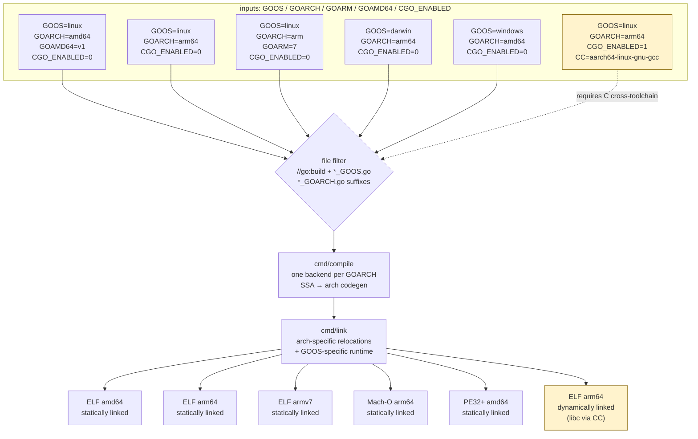
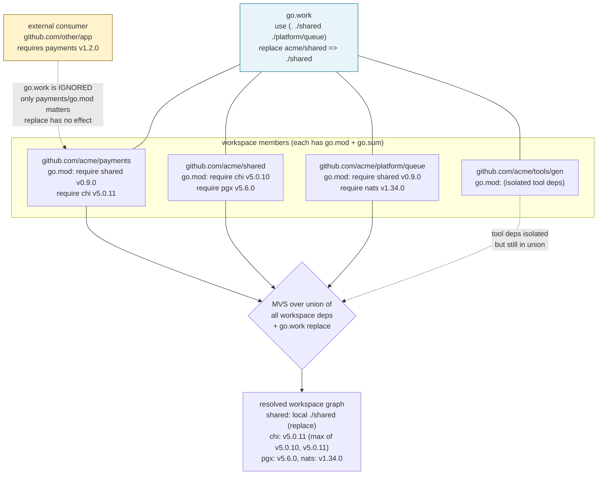
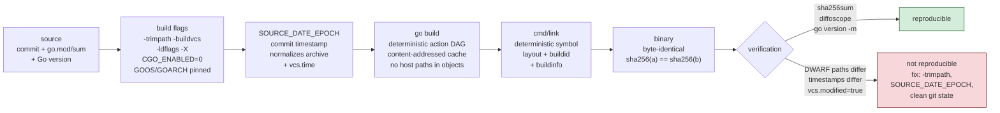
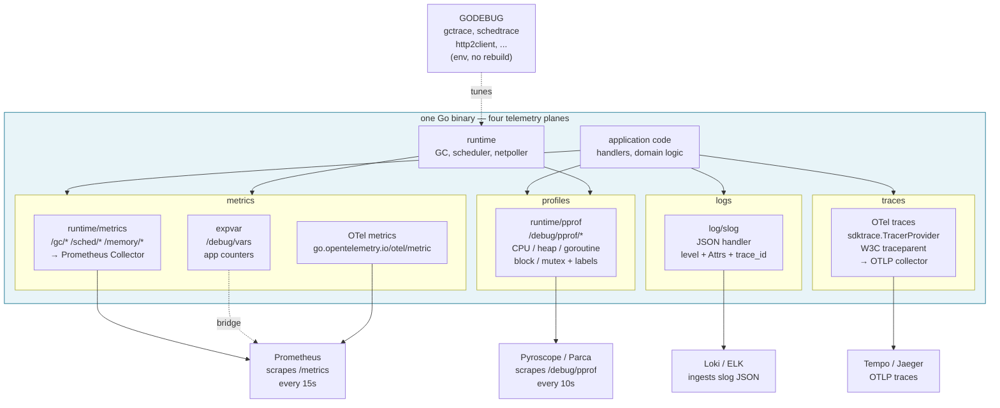
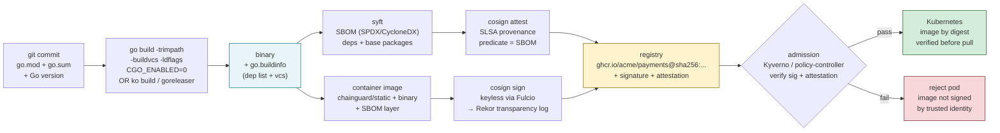
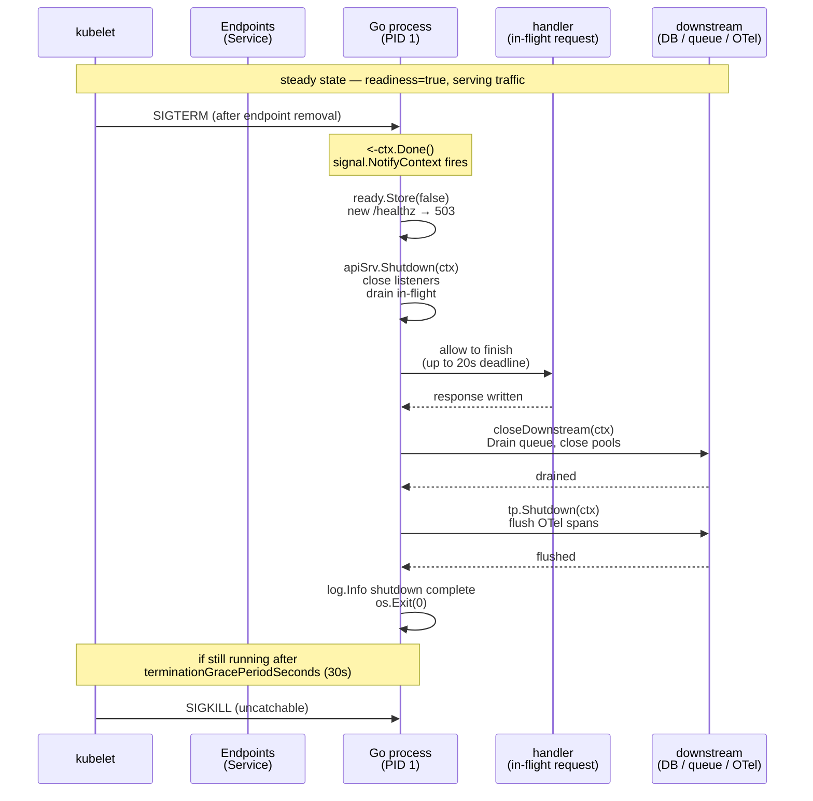

# Chapter 12 — Production Go: Cross-Compilation, Workspaces, Telemetry, and Deployment at Scale

**What this chapter covers.** The distance between `go build` on a developer laptop and a signed, SBOM-attested, autoscaled binary running on 500 Kubernetes pods is where Go's toolchain promises either pay off or break down. This chapter closes that distance. We trace how the same hermetic build model from Chapter 1 extends to cross-compilation matrices, multi-module workspaces, bit-for-bit reproducible artifacts, and observable, gracefully-shutting-down services that respect cgroup limits. Every section is grounded in the artifact you actually ship — the static binary and the container that carries it — and in the operational reality of running hundreds of Go services with one platform team.

Learning goals — after this chapter you should be able to:

- Cross-compile any pure-Go service to every `GOOS`/`GOARCH` pair from `go tool dist list`, diagnose why `cgo` breaks that model, and fix it with `zig cc` or `xgo` when `CGO_ENABLED=1` is non-negotiable.
- Structure multi-module repositories with `go.work`, reason about when `go.work` beats `replace`, and run `go work sync` correctly in CI.
- Produce bit-for-bit reproducible binaries and containers with `-trimpath`, `-buildvcs`, `SOURCE_DATE_EPOCH`, `ko`/`apko`, and `goreleaser`, and verify them with `go version -m` and `diffoscope`.
- Instrument a Go service with `runtime/metrics`, `expvar`, `log/slog`, OpenTelemetry, and `runtime/pprof` continuous profiling, and tune it at runtime with `GODEBUG` and `GOMEMLIMIT`/`GOMAXPROCS`.
- Build minimal, signed, SBOM-attested container images (`scratch` vs. distroless vs. `apko`/`ko`) and deploy them to Kubernetes with correct resource limits, `GOMAXPROCS`/`GOMEMLIMIT` tuning, probes, and graceful shutdown via `signal.NotifyContext` + `http.Server.Shutdown`.
- Reason about supply-chain integrity end-to-end — from `GOSUMDB` through `cosign`/`sigstore` signing and `syft` SBOM generation — for a fleet of Go services.

> **Scope and dependencies.** This chapter assumes Chapter 1 (toolchain, modules, linker, `go build` DAG) and draws on Chapter 4 (scheduler/`GOMAXPROCS`), Chapter 5 (allocator/GC/`GOMEMLIMIT`), and Chapter 10 (`pprof`/`trace`/race detector). Supply-chain primitives (`SLSA`, `in-toto`, `Sigstore`) are covered in Companion Book 4; here we show their Go-specific integration.

---

## 1. Cross-compilation — one toolchain, every platform

Go's cross-compilation story is unusually simple for systems languages: no `arm-linux-gnueabihf-gcc` in your `PATH` by default, no sysroot dance, no CMake toolchain file. The compiler is a cross-compiler out of the box because `cmd/compile` and `cmd/link` handle every `GOARCH` internally. That simplicity has a precise boundary — `CGO_ENABLED=0` — and crossing that boundary reintroduces the entire C cross-compilation problem.

### 1.1 The GOOS/GOARCH/GOARM matrix

Three environment variables select the target; a fourth controls the build itself:

| Variable | Meaning | Examples | Notes |
|----------|---------|----------|-------|
| `GOOS` | Target operating system | `linux`, `darwin`, `windows`, `freebsd`, `wasmtime` | Determines `//go:build` evaluation, syscall package selection, default file suffixes (`*_linux.go`) |
| `GOARCH` | Target CPU architecture | `amd64`, `arm64`, `386`, `arm`, `ppc64le`, `wasm`, `riscv64`, `loong64` | Selects `cmd/compile` backend and `cmd/link` output format |
| `GOARM` | ARM variant (only when `GOARCH=arm`) | `5`, `6`, `7` | `GOARM=7` → ARMv7 + hard-float; `5` → soft-float baseline |
| `GOAMD64` | x86-64 microarchitecture level | `v1` … `v4` | `v3` = AVX/AVX2 era (Haswell+); default `v1` is maximally compatible. Set `GOAMD64=v3` to trade portability for speed |
| `GOMIPS` / `GOMIPS64` | MIPS float ABI | `hardfloat`, `softfloat` | Rare outside embedded; `GOARCH=mips` is soft-stripped in Go 1.23+ on some platforms |
| `CGO_ENABLED` | Whether `import "C"` is allowed | `0`, `1` | `0` → pure Go, fully cross-compilable; `1` → requires a C cross-compiler for the target |

Enumerate the matrix for your toolchain:

```bash
# Every supported GOOS/GOARCH pair for this Go release
$ go tool dist list
aix/ppc64
darwin/amd64
darwin/arm64
dragonfly/amd64
freebsd/386
freebsd/amd64
freebsd/arm
freebsd/arm64
freebsd/riscv64
illumos/amd64
ios/amd64
ios/arm64
js/wasm
linux/386
linux/amd64
linux/arm
linux/arm64
linux/loong64
linux/mips
linux/mips64
linux/mips64le
linux/mipsle
linux/ppc64
linux/ppc64le
linux/riscv64
linux/s390x
netbsd/386
netbsd/amd64
netbsd/arm
netbsd/arm64
openbsd/386
openbsd/amd64
openbsd/arm
openbsd/arm64
openbsd/ppc64
openbsd/riscv64
plan9/386
plan9/amd64
plan9/arm
solaris/amd64
wasip1/wasm
windows/386
windows/amd64
windows/arm
windows/arm64

# Current host triple — what `go build` does with no env override
$ go env GOOS GOARCH GOARM GOAMD64 CGO_ENABLED CC
linux
amd64
    # (empty when not arm)
v1
1
gcc
```

A single env prefix is enough:

```bash
# Pure Go — no C toolchain needed, works from any host
$ CGO_ENABLED=0 GOOS=linux GOARCH=arm64 go build -o payments-linux-arm64 ./cmd/api
$ CGO_ENABLED=0 GOOS=darwin GOARCH=amd64 go build -o payments-darwin-amd64 ./cmd/api
$ CGO_ENABLED=0 GOOS=windows GOARCH=amd64 go build -o payments.exe ./cmd/api
$ CGO_ENABLED=0 GOOS=linux GOARCH=arm GOARM=7 go build -o payments-armv7 ./cmd/api

# Inspect what you built — no need to boot the target
$ file payments-linux-arm64 payments-armv7 payments.exe
payments-linux-arm64: ELF 64-bit LSB executable, ARM aarch64, statically linked
payments-armv7:       ELF 32-bit LSB executable, ARM, EABI5 version 1 (SYSV), statically linked
payments.exe:         PE32+ executable (console) x86-64, for MS Windows

$ go version -m payments-linux-arm64 | head -8
        payments-linux-arm64: go1.22.4
        build   GOOS=linux
        build   GOARCH=arm64
        build   CGO_ENABLED=0
```

Build constraints interact with cross-compilation at file-selection time, before any package compiles. A file named `net_linux.go` with `//go:build linux` is excluded when `GOOS=darwin`; `cmd/go` never even parses it. This is why `go vet` and `gopls` must be told the target — their diagnostics are target-dependent:

```go
// internal/platform/mem_linux.go
//go:build linux

package platform

import "golang.org/x/sys/unix"

func Mlockall() error { return unix.Mlockall(unix.MCL_CURRENT | unix.MCL_FUTURE) }
```

```go
// internal/platform/mem_darwin.go
//go:build darwin

package platform

func Mlockall() error { return nil } // no mlockall on darwin
```



*Diagram 1 — Cross-compilation matrix: every GOOS/GOARCH pair is one env prefix with CGO_ENABLED=0; the CGO_ENABLED=1 path (highlighted) breaks the hermetic model and requires an external cross-compiler.*

### 1.2 The cgo boundary

When any package in the transitive closure imports `"C"`, the build sets `CGO_ENABLED=1` (or fails if you forced `CGO_ENABLED=0`). At that point `cmd/go` no longer self-contains the build:

1. `cmd/cgo` generates Go shims + C stubs.
2. The host `CC` compiles the C fragments (`-cc` phase).
3. Final linking is delegated to `CC` (external linking), so the binary becomes dynamically linked and platform-dependent.

```bash
# Pure Go transitive closure — cross-compiles from anywhere
$ CGO_ENABLED=0 GOOS=linux GOARCH=arm64 go build ./...

# As soon as one dep imports "C", cross without a C toolchain fails
$ GOOS=linux GOARCH=arm64 go build ./... 2>&1 | head -5
# runtime/cgo
cgo: C compiler "gcc" not found: exec: "gcc": executable file not found in $PATH

# Forcing CGO_ENABLED=0 only helps if no dep actually needs cgo
$ CGO_ENABLED=0 GOOS=linux GOARCH=arm64 go build ./...  # succeeds if closure is pure
$ CGO_ENABLED=0 go build -o /tmp/bin ./cmd/api && ldd /tmp/bin
        not a dynamic executable

# With cgo, the target CC must match GOARCH
$ CGO_ENABLED=1 GOOS=linux GOARCH=arm64 CC=aarch64-linux-gnu-gcc go build -o /tmp/bin-arm64 ./cmd/api
$ file /tmp/bin-arm64
/tmp/bin-arm64: ELF 64-bit LSB executable, ARM aarch64, dynamically linked, interpreter /lib/ld-linux-aarch64.so.1
$ ldd /tmp/bin-arm64
        linux-vdso.so.1
        libc.so.6 => /lib/aarch64-linux-gnu/libc.so.6
```

Common crates in this trap: `github.com/mattn/go-sqlite3` (always cgo), `net` with `osuser`/`netgo` edge cases, anything importing `github.com/DataDog/zstd` with cgo fallback. Prefer pure-Go alternatives (`modernc.org/sqlite`, `jackc/pgx` over `lib/pq` with cgo) when you need a clean cross matrix.

#### Fixing cgo cross with `zig cc` and `xgo`

Two tools restore hermetic cross-compilation when you cannot eliminate `cgo`:

**`zig cc`** — Zig ships a bundled, hermetic C toolchain that can target any `GOOS`/`GOARCH` from any host. It replaces `CC`/`CXX` without installing per-arch sysroots:

```bash
# Install zig (https://ziglang.org/download/ — single tarball, no dependencies)
$ zig version
0.13.0

# Use it as the C cross-compiler — one binary handles every target
$ CGO_ENABLED=1 GOOS=linux GOARCH=arm64 \
  CC="zig cc -target aarch64-linux-gnu" \
  CXX="zig c++ -target aarch64-linux-gnu" \
  go build -o payments-linux-arm64 ./cmd/api

$ CGO_ENABLED=1 GOOS=linux GOARCH=amd64 \
  CC="zig cc -target x86_64-linux-gnu" \
  CXX="zig c++ -target x86_64-linux-gnu" \
  go build -o payments-linux-amd64 ./cmd/api

# Windows cross from Linux — no mingw needed
$ CGO_ENABLED=1 GOOS=windows GOARCH=amd64 \
  CC="zig cc -target x86_64-windows-gnu" \
  go build -o payments.exe ./cmd/api
```

Why `zig cc` rather than installing `gcc-aarch64-linux-gnu`: Zig's toolchain is a single ~80 MB download that contains headers and libraries for every target. It eliminates sysroot drift between developer laptops and CI. The trade is that you now depend on Zig's bundled `glibc`/`musl` version — pin it (`zig 0.13.0`) and record it in `go version -m` via `-ldflags` if auditability matters.

**`xgo` / `crazymax/xgo`** — A Docker-based cross-compilation harness that bundles per-arch `CC` toolchains and `QEMU` for `go test` on foreign arch:

```bash
# xgo (legacy, still common in older goreleaser configs)
$ xgo --targets=linux/amd64,linux/arm64,darwin/arm64 ./cmd/api

# crazymax/xgo — actively maintained fork
$ docker run --rm -v $PWD:/src -w /src crazymax/xgo:latest \
    --targets=linux/amd64,linux/arm64,linux/arm \
    --out payments ./cmd/api
```

Prefer `zig cc` for new setups — it runs without Docker and integrates directly with `go build` env. Reserve `xgo` for projects that need `QEMU`-backed `go test` across architectures in CI.

### 1.3 Cross-compile matrix script

The script that every multi-platform Go project needs. It enforces `CGO_ENABLED=0` for the pure matrix and isolates the `CGO_ENABLED=1` (+ `zig cc`) path when a specific target needs it. Use it locally and in CI (`GORELEASER` in Section 5 automates the same matrix declaratively).

```bash
#!/usr/bin/env bash
# scripts/cross-compile.sh — reproducible cross-build matrix
# Usage: ./scripts/cross-compile.sh [version]
# Requires: go >= 1.21, zig >= 0.11 (only for cgo targets)
set -euo pipefail

VERSION="${1:-dev}"
LDFLAGS="-s -w -X main.version=${VERSION} -X main.commit=$(git rev-parse --short HEAD 2>/dev/null || echo unknown)"
BUILDVCS=1  # stamp vcs.revision/time into go.buildinfo; use --buildvcs=false to suppress
TRIMPATH="-trimpath"

# Pure Go targets — no C toolchain needed, build from any host
PURE_TARGETS=(
  "linux/amd64"
  "linux/arm64"
  "linux/arm/7"       # GOARCH=arm + GOARM=7
  "linux/riscv64"
  "darwin/amd64"
  "darwin/arm64"
  "windows/amd64"
  "windows/arm64"
)

# cgo targets — require zig cc; built only if zig is present
CGO_TARGETS=(
  "linux/amd64"
  "linux/arm64"
)

build_one() {
  local goos="$1" goarch="$2" goarm="${3:-}" cc_extra="${4:-}"
  local out="dist/payments-${goos}-${goarch}${goarm:+-v${goarm}}"
  [[ "$goos" == "windows" ]] && out="${out}.exe"

  local env_args=(GOOS="$goos" GOARCH="$goarch")
  [[ -n "$goarm" ]] && env_args+=(GOARM="$goarm")
  env_args+=(CGO_ENABLED=0)  # pure path

  echo "==> ${out} (${goos}/${goarch}${goarm:+/v${goarm}}) CGO_ENABLED=0"
  env "${env_args[@]}" go build \
    ${TRIMPATH} -buildvcs="${BUILDVCS}" \
    -ldflags "${LDFLAGS}" \
    -o "${out}" ./cmd/api

  # Verify: check embedded buildinfo matches target
  go version -m "${out}" | grep -E "build\s+GO(OS|ARCH)"
}

build_one_cgo() {
  local goos="$1" goarch="$2"
  local out="dist/payments-${goos}-${goarch}-cgo"
  local zig_target
  case "${goos}/${goarch}" in
    linux/amd64) zig_target="x86_64-linux-gnu" ;;
    linux/arm64) zig_target="aarch64-linux-gnu" ;;
    *) echo "no zig mapping for ${goos}/${goarch}"; return 1 ;;
  esac
  echo "==> ${out} (${goos}/${goarch} + cgo via zig cc -target ${zig_target})"
  env GOOS="$goos" GOARCH="$goarch" CGO_ENABLED=1 \
      CC="zig cc -target ${zig_target}" \
      CXX="zig c++ -target ${zig_target}" \
      go build ${TRIMPATH} -ldflags "${LDFLAGS}" -o "${out}" ./cmd/api
}

mkdir -p dist

for target in "${PURE_TARGETS[@]}"; do
  IFS=/ read -r goos goarch goarm <<< "$target"
  build_one "$goos" "$goarch" "$goarm"
done

if command -v zig &>/dev/null; then
  for target in "${CGO_TARGETS[@]}"; do
    IFS=/ read -r goos goarch _ <<< "$target"
    build_one_cgo "$goos" "$goarch"
  done
else
  echo "zig not found — skipping cgo cross targets (install zig for full matrix)"
fi

echo "--- dist/ ---"
ls -lh dist/
echo "--- buildinfo spot-check ---"
for f in dist/*; do echo "== $f =="; go version -m "$f" | grep -E "build\s+(GOOS|GOARCH|CGO)"; done
```

Key design choices:

- **`CGO_ENABLED=0` by default.** The pure matrix covers 95% of services. A `go.mod` that accidentally pulls a `cgo` dependency fails fast rather than silently producing a dynamically-linked binary that will not run on `scratch`.
- **`-trimpath -buildvcs`** — discussed in Section 3; removing local filesystem paths and stamping VCS metadata makes builds reproducible without leaking developer paths.
- **`GOAMD64=v3` is opt-in.** Uncomment `env_args+=(GOAMD64=v3)` for compute-heavy services where Haswell+ can be assumed. The default `v1` is maximally portable; `v3`/`v4` emit AVX2/AVX-512 and fault on older hardware.

---

## 2. Workspaces — `go.work` and multi-module repos

Go 1.18 introduced workspaces (`go.work`) to solve a concrete pain: developing across multiple modules without `replace` directives that must never be committed. Before workspaces, the only way to test a local change to `github.com/acme/shared` from `github.com/acme/payments` was:

```go
// go.mod — DO NOT COMMIT THIS
replace github.com/acme/shared => ../shared
```

Every developer maintained their own `replace` set, CI had to strip them, and `go mod tidy` fought you. Workspaces make the local override a *workspace* concern, not a *module* concern.

### 2.1 `go.work` mechanics

A `go.work` file lives at the workspace root (above the modules) and declares which modules participate:

```go
// go.work — workspace root (e.g., /repo/go.work)
// This file is NOT published. Consumers of any module ignore it.
go 1.22.4

use (
    .               // the main service module at the root
    ./shared        // shared library module
    ./platform/queue // another service/library module
    ./tools/gen     // code-gen tool, its own module
)

// Optionally, override a dependency for every module in the workspace:
replace github.com/acme/shared => ./shared
```

```bash
# Create / inspect a workspace
$ cat go.work
go 1.22.4

use (
    .
    ./shared
    ./platform/queue
)

$ go work use ./new-service          # add a module
$ go work use -r ./...               # recursively find and add all modules under .
$ go work sync                       # sync go.work.sum and each go.mod's go.sum
$ go work edit -use ./tools/lint     # same, but without scanning
$ go env GOWORK                      # where the workspace file was found
/home/ubuntu/repo/go.work
$ GOWORK=off go list -m all          # ignore the workspace (single-module mode)

# What `go work sync` actually does — it is `go mod tidy` for the workspace
$ go work sync
# → updates go.work.sum (hashes of workspace deps)
# → updates each module's go.sum to be consistent with the workspace view
# → fails if workspace modules require conflicting versions of the same dep
```

Resolution rules (these matter when builds break after adding a workspace entry):

- When `GOWORK` points at a `go.work` file (or is auto-discovered by walking parents), `cmd/go` builds a *workspace module graph*: the union of all `use`d modules' dependencies, resolved once via MVS.
- `replace` directives in `go.work` apply to *every* module in the workspace and override any `replace` in individual `go.mod` files. `replace` in a `go.mod` inside a workspace still applies to that module *when built outside the workspace* (e.g., by a consumer).
- `go.work` and `go.work.sum` should be committed if you want `git clone && go build ./...` to work. Exclude them if you want every consumer to build each module independently — but then developers must create their own `go.work`.
- `go list -m all` inside a workspace shows the *workspace-resolved* versions, not any single module's `go.mod` view. Use `GOWORK=off go list -m all` to see the single-module view when debugging version conflicts.



*Diagram 2 — go.work workspace graph: the workspace resolves the union of all members' dependencies; external consumers ignore go.work entirely.*

### 2.2 Monorepo vs. multi-module vs. polyrepo

There are three repository shapes for a Go fleet, each with a different `go.work` role:

| Shape | Modules | `go.work` | When to use |
|-------|---------|-----------|-------------|
| **Single module monorepo** | One `go.mod` at root, all packages under it | None needed | Small fleet (<15 services) or tightly-coupled codebase. Simplest CI, but `go list` always sees the whole world; `go test ./...` tests everything. |
| **Multi-module monorepo** | N `go.mod` files under one repo root, one `go.work` at root | `go.work` at repo root, committed | Large monorepo where services version dependencies independently but developers work across modules. Each service can be released/tagged at its own version; CI can build/test the workspace or individual modules. |
| **Polyrepo** | One `go.mod` per repo, no workspace | `go.work` created locally by developers who clone multiple repos side-by-side | Organizationally separated teams, independent CI, versioning via semver tags. Developers create an ad-hoc `go.work` outside any repo to work across repos without `replace`. |

The industry trend for Go fleets of 50–500 services is **multi-module monorepo with `go.work` committed**. It gives:

- **Atomic cross-service refactors** — change `shared` and all consumers in one commit, verified by one `go test ./...` at the workspace root.
- **Independent release versions** — each `go.mod` is releasable at its own tag (`shared/v0.10.0`, `payments/v1.2.0`); the repo can be tagged per-module (`git tag shared/v0.10.0`).
- **Selective CI** — CI can run `go test ./shared/... ./platform/queue/...` for affected modules or `GOWORK=off go test ./...` per module for hermetic checks.

A concrete multi-module layout:

```
repo/
├── go.work                  # workspace root — committed
├── go.work.sum
├── go.mod                   # github.com/acme/payments (main service)
├── go.sum
├── cmd/api/main.go
├── internal/
├── shared/                  # github.com/acme/shared — library module
│   ├── go.mod               # module github.com/acme/shared
│   ├── go.sum
│   └── otel/middleware.go
├── platform/queue/          # github.com/acme/platform/queue
│   ├── go.mod
│   └── consumer.go
└── tools/gen/               # github.com/acme/tools/gen — code generator
    ├── go.mod
    └── main.go
```

```go
// repo/go.work
go 1.22.4

use (
    .
    ./shared
    ./platform/queue
    ./tools/gen
)
```

```go
// repo/go.mod — main service
module github.com/acme/payments

go 1.22.4

require (
    github.com/acme/shared v0.9.0
    github.com/acme/platform/queue v0.3.0
    github.com/go-chi/chi/v5 v5.0.11
)

// No replace needed — go.work maps shared => ./shared
// This go.mod is what external consumers see.
```

Inside the workspace, `import "github.com/acme/shared"` resolves to `./shared` regardless of the `v0.9.0` line. Outside the workspace (CI with `GOWORK=off`, or an external consumer), it resolves to `v0.9.0` from the proxy. There is no `replace` to forget to remove before tagging.

CI pattern for a multi-module monorepo:

```yaml
# .github/workflows/ci.yml — test both views
jobs:
  test-workspace:
    runs-on: ubuntu-latest
    steps:
      - uses: actions/checkout@v4
      - uses: actions/setup-go@v5
        with: { go-version-file: go.mod, cache: true }
      - run: go work sync
      - run: go vet ./...
      - run: go test -race -count=1 ./...
      # ^ tests the workspace union — catches cross-module breakage

  test-hermetic:
    runs-on: ubuntu-latest
    steps:
      - uses: actions/checkout@v4
      - uses: actions/setup-go@v5
        with: { go-version-file: go.mod }
      - run: GOWORK=off go test -count=1 ./...
        working-directory: shared
      - run: GOWORK=off go test -count=1 ./...
        working-directory: platform/queue
      # ^ tests each module as its consumers will see it
```

### 2.3 `replace` vs. workspace — when to use which

| Mechanism | Scope | Committed? | Consumer sees it? | Use case |
|-----------|-------|------------|-------------------|----------|
| `replace` in `go.mod` | That module only, when it is the main module | Yes if committed | No — ignored when module is a dependency | Pinning a fork, working around a broken upstream, `replace acme/shared => ../shared` for a quick local test (remove before commit) |
| `replace` in `go.work` | Every module in the workspace | Yes if `go.work` committed | No — `go.work` is never published | Workspace-wide override (e.g., point every module at a local checkout of a shared library) |
| `GOWORK=off` | Disables workspace | N/A | N/A | Debugging single-module resolution, hermetic CI checks |
| No replace, no workspace | Proxy-resolved version | — | Yes — the `require` line is what consumers resolve | Normal released dependencies |

Rule of thumb: **`replace` in `go.mod` is a publishing-time concern (forks, retractions); `go.work` is a development-time concern (local multi-module work).** If you find yourself editing `replace` in `go.mod` during development, create a `go.work` instead. If CI fails because a `replace` points at a local path, the `replace` should have been in `go.work`.

---

## 3. Reproducible builds — from `-trimpath` to bit-for-bit containers

A reproducible build produces byte-identical output from the same inputs regardless of who builds it, where, or when. For Go this means: the same commit, same `go.mod`/`go.sum`, same Go version, and same build flags must yield the same binary — down to the hash. Reproducibility is the foundation of binary transparency and SLSA provenance: if builds are not reproducible, you cannot verify that the binary in the registry was built from the source you audited.

### 3.1 The reproducibility knobs

| Flag / env | What it does | Why it matters |
|------------|--------------|----------------|
| `-trimpath` | Strips local filesystem paths from the binary (`compile -trimpath`, `link -trimpath`). Replaces absolute paths like `/home/alice/repo/internal/foo.go` with `github.com/acme/payments/internal/foo.go` in `pclntab`, `gopclntab`, and `DWARF` | Without it, two developers building the same commit from different checkout paths produce different binaries |
| `-buildvcs` | Controls VCS stamping into `runtime/debug.BuildInfo` (`vcs.revision`, `vcs.time`, `vcs.modified`). Default `auto` (stamp if `.git` is present); `true`/`false` to force | Deterministic when `.git` state is deterministic; `false` removes VCS noise for hermetic diffing |
| `-ldflags "-s -w"` | `-s` omits symbol table, `-w` omits DWARF debug info | Smaller binary; removes debug paths that can vary. Omit when you need `pprof` line numbers in prod — trade size for debuggability |
| `-ldflags "-X main.version=v1.2.3"` | Sets string variables at link time | Deterministic, but the value must be pinned (e.g., git tag) not `$(date)` |
| `SOURCE_DATE_EPOCH` | Unix timestamp respected by `go` for archive timestamps and `vcs.time` fallback | Required for container layer reproducibility; set to the commit timestamp in CI |
| `-tags` / `GOEXPERIMENT` | Must be identical across builds | Different tags select different files; the flag set is part of the build identity |
| `CGO_ENABLED`, `CC`, `GOOS`/`GOARCH` | Part of the build identity | Any change selects different objects; lock in CI |

```bash
# Fully reproducible pure-Go build — the baseline for verification
$ SOURCE_DATE_EPOCH=$(git log -1 --format=%ct) \
  CGO_ENABLED=0 \
  go build -trimpath -buildvcs=true \
    -ldflags "-s -w -X main.version=$(git describe --tags --always)" \
    -o payments ./cmd/api

# Verify: two builders should produce identical hashes
$ sha256sum payments
a3f7c... payments
$ go version -m payments
        build   -buildmode=exe
        build   -compiler=gc
        build   CGO_ENABLED=0
        build   GOARCH=amd64
        build   GOOS=linux
        build   vcs=git
        build   vcs.revision=9f3c1a7d2e4b0c6f8a1b2c3d4e5f6a7b8c9d0e1f
        build   vcs.time=2024-11-15T14:22:31Z
        build   vcs.modified=false
        dep     github.com/go-chi/chi/v5    v5.0.11 h1:...

# Bit-for-bit diff — use diffoscope for actionable output
$ diffoscope payments-a payments-b || true
# With -trimpath, diffoscope should report no differences
# Without -trimpath, you will see DWARF paths differing: /home/alice/... vs /home/bob/...
```



*Diagram 3 — Reproducibility pipeline: pinned inputs + -trimpath + SOURCE_DATE_EPOCH → deterministic binary; verification closes the loop.*

### 3.2 Reproducible containers — `ko`, `apko`, `goreleaser`

A reproducible binary is not enough if the container that carries it is not reproducible. Traditional `Dockerfile` builds embed timestamps, package-manager nondeterminism, and base-image drift. Three tools address this for Go:

**`ko` — container images without Dockerfiles.** `ko` builds Go binaries and packages them into images directly from `go.mod`, using `apko`/` chainguard` base images that are themselves reproducible. No `Dockerfile`, no `docker build`:

```yaml
# ko.yaml — ko configuration (go.work-aware since ko 0.15+)
# https://ko.build/configuration/
apiVersion: ko.build/v1alpha1
kind: Config
baseImageOverrides:
  github.com/acme/payments/cmd/api: cgr.dev/chainguard/static:latest
  # Single static base — no shell, no package manager, minimal attack surface
builds:
  - id: api
    main: ./cmd/api
    env:
      - CGO_ENABLED=0
    flags:
      - -trimpath
      - -ldflags=-s -w -X main.version={{.Env.VERSION}}
    ldflags:
      - -s
      - -w
      - -X main.version={{.Env.VERSION}}
      - -X main.commit={{.Env.COMMIT}}
```

```bash
# Build and push — ko resolves the import path, builds with `go build`, creates the image
$ export VERSION=$(git describe --tags --always) COMMIT=$(git rev-parse HEAD)
$ ko build ./cmd/api --base-import-paths --push --tags $VERSION,latest
2024/11/15 14:22:31 Building github.com/acme/payments/cmd/api for linux/amd64
2024/11/15 14:22:31 Using base cgr.dev/chainguard/static:latest for github.com/acme/payments/cmd/api
2024/11/15 14:22:31 Publishing ghcr.io/acme/payments:abc1234
2024/11/15 14:22:31 Published ghcr.io/acme/payments@sha256:7f3a...
# Digest-addressable, SLSA provenance available via ko --sbom

# Publish a multi-arch image (ko builds each arch natively via GOARCH)
$ ko build ./cmd/api --platform=linux/amd64,linux/arm64 --bare --push --tags $VERSION
```

`ko` advantages for Go fleets: it respects `go.work`, honors `GOPROXY`/`GOSUMDB`, generates an SBOM by default (`--sbom=spdx`), and produces images with no `Dockerfile` to maintain across 100 repos. The `cgr.dev/chainguard/static` base is itself built reproducibly with `apko`.

**`apko` — declarative, reproducible base images.** Where `ko` builds the Go binary, `apko` builds the base image. You declare the image contents in YAML; `apko` assembles it deterministically from `apk` packages pinned by hash:

```yaml
# apko.yaml — reproducible base image for Go services
# https://github.com/chainguard-dev/apko
contents:
  repositories:
    - https://dl-cdn.alpinelinux.org/alpine/edge/main
    - https://packages.wolfi.dev/os
  keyring:
    - https://packages.wolfi.dev/os/wolfi-signing.rsa.pub
  packages:
    - ca-certificates-bundle  # TLS roots — needed even for scratch-like images
    - tzdata                  # time zones
    # NOTE: no shell, no apk, no busybox — minimal runtime deps
    # Add `glibc` only if you have a cgo binary; prefer CGO_ENABLED=0

cmd: /payments  # entrypoint
archs:
  - amd64
  - arm64

accounts:
  run-as: 65532  # nonroot
```

```dockerfile
# Dockerfile that uses apko-built base + ko-built binary
# Alternatively, ko handles this internally with --base-import-paths; this shows the layers
FROM cgr.dev/chainguard/static:latest AS base
COPY --from=ko-build /ko-app/payments /payments
USER nonroot
ENTRYPOINT ["/payments"]
```

For maximum reproducibility, combine them: `apko` builds the base, `ko` builds the app layer, `goreleaser` orchestrates the release.

**`goreleaser` — release automation with reproducibility built in:**

```yaml
# .goreleaser.yaml — full matrix, containers, signing, SBOM
# https://goreleaser.com/customization/
version: 2
project_name: payments

before:
  hooks:
    - go mod tidy
    - go vet ./...

builds:
  - id: api
    main: ./cmd/api
    binary: payments
    env:
      - CGO_ENABLED=0
    flags:
      - -trimpath
    ldflags:
      - -s -w -X main.version={{.Version}} -X main.commit={{.Commit}} -X main.date={{.Date}}
    goos: [linux, darwin, windows]
    goarch: [amd64, arm64]
    goarm: ["7"]          # only for GOARCH=arm
    ignore:
      - goos: windows
        goarch: arm64     # skip exotic combos if needed
    mod_timestamp: "{{ .CommitTimestamp }}"  # SOURCE_DATE_EPOCH equivalent

archives:
  - id: tarballs
    builds: [api]
    formats: [tar.gz]
    name_template: "{{ .ProjectName }}_{{ .Version }}_{{ .Os }}_{{ .Arch }}{{ with .Arm }}v{{ . }}{{ end }}"
    format_overrides:
      - goos: windows
        formats: [zip]

nfpms:  # optional: deb/rpm/apk
  - id: deb
    builds: [api]
    vendor: Acme
    homepage: https://github.com/acme/payments
    formats: [deb, apk]

dockers:  # legacy docker builds
  - image_templates: ["ghcr.io/acme/payments:{{ .Version }}-amd64"]
    use: buildx
    build_flag_templates:
      - --platform=linux/amd64
      - --label=org.opencontainers.image.revision={{ .Commit }}

docker_manifests:
  - name_template: "ghcr.io/acme/payments:{{ .Version }}"
    image_templates:
      - "ghcr.io/acme/payments:{{ .Version }}-amd64"
      - "ghcr.io/acme/payments:{{ .Version }}-arm64"

# ko integration (goreleaser 1.20+): build images without Dockerfiles
kos:
  - id: api-ko
    main: ./cmd/api
    base_image: cgr.dev/chainguard/static:latest
    ldflags: "-s -w -X main.version={{.Version}}"
    platforms: [linux/amd64, linux/arm64]
    tags: ["ghcr.io/acme/payments:{{.Version}}", "ghcr.io/acme/payments:latest"]
    sbom: spdx

sboms:
  - id: archive-sbom
    artifacts: archive
  - id: ko-sbom
    artifacts: images

signs:
  - id: archives
    artifacts: archive
    args: ["--keyless", "--fulcio-url=https://fulcio.sigstore.dev"]

docker_signs:
  - id: images
    artifacts: images
    args: ["--keyless"]
```

```bash
# One command: build matrix, containers, SBOMs, signatures
$ goreleaser release --clean --snapshot  # local smoke test
$ goreleaser release --clean             # full release (requires GITHUB_TOKEN, cosign)
```

Reproducibility checklist for CI:

```bash
# ci/repro-check.sh — fail the build if it is not reproducible
set -euo pipefail
go build -trimpath -buildvcs=true -ldflags "-s -w" -o /tmp/a ./cmd/api
go build -trimpath -buildvcs=true -ldflags "-s -w" -o /tmp/b ./cmd/api
if ! cmp /tmp/a /tmp/b; then
  echo "NOT REPRODUCIBLE — diffoscope output:"
  diffoscope /tmp/a /tmp/b || true
  exit 1
fi
echo "reproducible: $(sha256sum /tmp/a | cut -d' ' -f1)"
```

---

## 4. Telemetry and observability — metrics, logs, traces, profiles from one binary

A Go binary that ships without observability is undebuggable at scale. The Go standard library and the Go observability ecosystem now cover four pillars out of the box, and they all run inside the binary with no sidecar required. The backend lens: at 100s of services, you need *uniform* telemetry — same metric names, same log schema, same trace propagation, same profiling endpoint — so that the platform team can build one dashboard, one alert, one runbook that works for every service.

### 4.1 `runtime/metrics` — the ground truth

Since Go 1.16, `runtime/metrics` exposes every runtime statistic as a named, typed metric with a stable API. It supersedes `runtime.ReadMemStats` and `runtime.ReadGCStats` for new code (the old APIs still work but are coarser and more allocation-heavy).

```go
package telemetry

import (
    "runtime/metrics"
    "github.com/prometheus/client_golang/prometheus"
)

// Names are stable, histogram-aware, and documented in `go doc runtime/metrics`.
// Every histogram has an explicit bucket set — no hidden Prometheus defaults.
var interesting = []string{
    "/gc/heap/allocs:bytes",          // cumulative allocations
    "/gc/heap/goal:bytes",            // GOGC/GOMEMLIMIT target heap size
    "/gc/heap/live:bytes",            // live heap after last GC
    "/gc/gogc:percent",               // current GOGC
    "/gc/gomemlimit:bytes",           // current GOMEMLIMIT (Go 1.19+)
    "/gc/pauses:seconds",             // histogram of STW pause durations
    "/gc/cycles/automatic:gc-cycles", // GCs triggered automatically
    "/gc/cycles/forced:gc-cycles",    // GCs forced by runtime.GC()
    "/sched/goroutines:goroutines",   // current goroutine count
    "/sched/latencies:seconds",       // histogram of scheduling latencies
    "/memory/classes/heap/stacks:bytes",
    "/memory/classes/heap/objects:bytes",
    "/memory/classes/total:bytes",
    "/cpu/classes/gc/mark/assist:cpu-seconds",
    "/cpu/classes/gc/mark/dedicated:cpu-seconds",
}

func RegisterRuntimeMetrics(reg prometheus.Registerer) {
    // Bridge runtime/metrics → Prometheus.
    // Each runtime/metrics histogram becomes a Prometheus histogram with matching buckets.
    for _, name := range interesting {
        desc := metrics.All()[name] // spec: Kind, Cumulative, Buckets
        _ = desc
        // Use a library like github.com/prometheus/client_golang/prometheus/collectors
        // or roll your own Collector that calls metrics.Read on Collect.
    }
}

// Minimal custom Collector — one Prometheus scrape reads all runtime metrics atomically.
type runtimeCollector struct {
    descs map[string]*prometheus.Desc
    names []string
}

func NewRuntimeCollector(names []string) prometheus.Collector {
    descs := make(map[string]*prometheus.Desc, len(names))
    for _, n := range names {
        descs[n] = prometheus.NewDesc(
            "go_"+sanitize(n), "runtime/metrics "+n, nil, nil,
        )
    }
    return &runtimeCollector{descs: descs, names: names}
}

func (c *runtimeCollector) Describe(ch chan<- *prometheus.Desc) {
    for _, d := range c.descs { ch <- d }
}

func (c *runtimeCollector) Collect(ch chan<- prometheus.Metric) {
    samples := make([]metrics.Sample, len(c.names))
    for i, n := range c.names { samples[i].Name = n }
    metrics.Read(samples)
    for _, s := range samples {
        switch s.Value.Kind() {
        case metrics.KindUint64:
            ch <- prometheus.MustNewConstMetric(c.descs[s.Name], prometheus.GaugeValue, float64(s.Value.Uint64()))
        case metrics.KindFloat64:
            ch <- prometheus.MustNewConstMetric(c.descs[s.Name], prometheus.GaugeValue, s.Value.Float64())
        case metrics.KindFloat64Histogram:
            h := s.Value.Float64Histogram()
            buckets := make(map[float64]uint64, len(h.Counts))
            for i, v := range h.Buckets { buckets[v] = h.Counts[i] }
            ch <- prometheus.MustNewConstHistogram(c.descs[s.Name],
                h.Counts[len(h.Counts)-1], h.Counts[len(h.Counts)-1], buckets)
        }
    }
}

func sanitize(n string) string {
    // "/gc/heap/allocs:bytes" → "gc_heap_allocs_bytes"
    s := ""
    for _, c := range n {
        switch c {
        case '/', ':', '.': s += "_"
        case '-': s += "_"
        default: s += string(c)
        }
    }
    // trim leading _
    if len(s) > 0 && s[0] == '_' { s = s[1:] }
    return s
}
```

Prefer this over `expvar` for runtime internals — `runtime/metrics` is typed, versioned, and does not allocate per-read. `expvar` (next section) is for *application* metrics.

### 4.2 `expvar` — the original Go metrics endpoint

`expvar` (since Go 1.0) exposes `sync/atomic`-backed variables over HTTP at `/debug/vars`. It is simple, allocation-free on the write path for integer vars, and scrapable by any HTTP client. Its weakness is that it is untyped-JSON and unauthenticated — do not expose it on the public port.

```go
package telemetry

import (
    _ "expvar" // registers /debug/vars
    "expvar"
    "net/http"
    pprof "net/http/pprof"
)

var (
    requestsTotal = expvar.NewInt("requests_total")
    queueDepth    = expvar.NewInt("queue_depth")
    lastError     = expvar.NewString("last_error")
    // Maps and Floats are also available; use expvar.NewMap for labeled counters.
    byStatus = expvar.NewMap("http_status")
)

func init() {
    // Publish a computed var — called on every /debug/vars scrape
    expvar.Publish("goroutines", expvar.Func(func() any {
        return metrics.All()["/sched/goroutines:goroutines"]
    }))
}

func AdminMux() *http.ServeMux {
    mux := http.NewServeMux()
    // expvar and pprof share the admin mux — never mount on the public mux
    mux.Handle("/debug/vars", expvar.Handler())
    mux.HandleFunc("/debug/pprof/", pprof.Index)
    mux.HandleFunc("/debug/pprof/cmdline", pprof.Cmdline)
    mux.HandleFunc("/debug/pprof/profile", pprof.Profile)
    mux.HandleFunc("/debug/pprof/symbol", pprof.Symbol)
    mux.HandleFunc("/debug/pprof/trace", pprof.Trace)
    return mux
}
```

```bash
$ curl -s http://localhost:9091/debug/vars | jq .
{
  "cmdline": ["/payments"],
  "memstats": { "Alloc": 4823440, ... },
  "requests_total": 12844,
  "queue_depth": 7,
  "http_status": { "200": 12000, "500": 12 }
}
```

For new services, bridge `expvar` or `runtime/metrics` into Prometheus/OpenTelemetry metrics rather than scraping `expvar` JSON directly — the typed histogram and label support in OTel/Prometheus is worth the extra dependency. Keep `expvar` for quick debugging and for services that cannot take a Prometheus dependency.

### 4.3 `log/slog` — structured logging since Go 1.21

Go 1.21 added `log/slog` to the standard library. It is the first structured, leveled, context-aware logger that is part of `go` itself. For backend services, it replaces `log`, `go.uber.org/zap`, and `sirupsen/logrus` as the default — not because it is faster than `zap` (it is slightly slower in the hot path), but because it is *standard*, `context`-aware, and has a stable `Handler` interface that every library can target.

```go
package main

import (
    "context"
    "log/slog"
    "net/http"
    "os"
)

func initLogger() *slog.Logger {
    // JSON handler for prod (scraped by Loki/CloudWatch/ELK), text for local dev.
    // Both emit the same Attr set — only the wire format differs.
    var handler slog.Handler
    if os.Getenv("ENV") == "production" {
        handler = slog.NewJSONHandler(os.Stdout, &slog.HandlerOptions{
            Level:     slog.LevelInfo,
            AddSource: false, // set true to include file:line (costs ~1 alloc)
        })
    } else {
        handler = slog.NewTextHandler(os.Stdout, &slog.HandlerOptions{
            Level: slog.LevelDebug,
        })
    }
    // Enrich every line with service identity — critical for multi-service log aggregation
    handler = handler.WithAttrs([]slog.Attr{
        slog.String("service", "payments"),
        slog.String("version", version),
        slog.String("env", os.Getenv("ENV")),
    })
    return slog.New(handler)
}

func main() {
    log := initLogger()
    slog.SetDefault(log) // so libraries using slog.Default() pick it up

    // Context-aware logging — trace/span IDs flow automatically if you set them
    mux := http.NewServeMux()
    mux.HandleFunc("/charge", func(w http.ResponseWriter, r *http.Request) {
        ctx := r.Context()
        // WithAttrs for per-request fields; avoids map allocs when handler supports it
        reqLog := log.With(
            slog.String("request_id", r.Header.Get("X-Request-ID")),
            slog.String("method", r.Method),
            slog.String("path", r.URL.Path),
        )
        reqLog.InfoContext(ctx, "charge started",
            slog.String("customer_id", r.URL.Query().Get("customer")),
            slog.Int64("amount_cents", 1999),
        )
        // ...
        if err := charge(ctx); err != nil {
            // slog's LevelError + structured error attr — searchable in Loki
            reqLog.ErrorContext(ctx, "charge failed",
                slog.String("error", err.Error()),
                slog.String("error_type", errorType(err)),
            )
            http.Error(w, "internal error", http.StatusInternalServerError)
            return
        }
        reqLog.InfoContext(ctx, "charge succeeded")
    })

    // Propagate trace ID into log context — the glue between logs and traces
    // See Section 4.4 for the OTel side.
    _ = context.WithValue // placeholder: use otel/baggage or slog+trace provider
}
```

Output (JSON, production):

```json
{"time":"2024-11-15T14:22:31.123Z","level":"INFO","msg":"charge started","service":"payments","version":"v1.4.2","env":"production","request_id":"req_9f3c","method":"POST","path":"/charge","customer_id":"cus_42","amount_cents":1999}
{"time":"2024-11-15T14:22:31.189Z","level":"ERROR","msg":"charge failed","service":"payments","version":"v1.4.2","env":"production","request_id":"req_9f3c","method":"POST","path":"/charge","error":"pgx: connection reset","error_type":"transient"}
```

Operational rules:

- **One JSON schema per fleet.** Define the required attrs (`service`, `version`, `env`, `request_id`, `trace_id`, `span_id`) in a platform library. Every service imports it. Loki/ELK queries assume those fields exist.
- **`InfoContext`/`ErrorContext` over `Info`/`Error`.** The `Context` variants let a `Handler` extract `trace_id` from `context.Context` without passing it as an explicit `Attr` — essential for OTel correlation.
- **Do not log at `Debug` in prod.** `slog.LevelDebug` is below `Info` and disabled by default at `LevelInfo`. Use `GODEBUG` or a dynamic level (via `slog.LevelVar`) to enable it per-pod without redeploying.

```go
var level slog.LevelVar // starts at Info (0); mutable at runtime

func init() {
    level.Set(slog.LevelInfo)
    h := slog.NewJSONHandler(os.Stdout, &slog.HandlerOptions{Level: &level})
    slog.SetDefault(slog.New(h))
}

// Expose on admin mux for on-the-fly debugging (protect with auth)
adminMux.HandleFunc("/debug/loglevel", func(w http.ResponseWriter, r *http.Request) {
    switch r.Method {
    case http.MethodGet:
        w.Write([]byte(level.Level().String()))
    case http.MethodPut:
        var req struct{ Level string `json:"level"` }
        json.NewDecoder(r.Body).Decode(&req)
        var l slog.Level
        if err := l.UnmarshalText([]byte(req.Level)); err != nil {
            http.Error(w, err.Error(), 400); return
        }
        level.Set(l)
        w.Write([]byte("ok"))
    }
})
```

### 4.4 OpenTelemetry for Go

OTel is the fleet-wide standard for traces and metrics. The Go SDK (`go.opentelemetry.io/otel`) instruments HTTP, gRPC, database, and custom spans with W3C `traceparent` propagation.

```go
package telemetry

import (
    "context"
    "log/slog"

    "go.opentelemetry.io/contrib/bridges/otelslog"
    "go.opentelemetry.io/contrib/instrumentation/net/http/otelhttp"
    "go.opentelemetry.io/otel"
    "go.opentelemetry.io/otel/exporters/otlp/otlptrace/otlptracehttp"
    "go.opentelemetry.io/otel/propagation"
    sdkresource "go.opentelemetry.io/otel/sdk/resource"
    sdktrace "go.opentelemetry.io/otel/sdk/trace"
    semconv "go.opentelemetry.io/otel/semconv/v1.26.0"
)

func InitTracer(ctx context.Context, serviceName, serviceVersion string) (*sdktrace.TracerProvider, error) {
    res, err := sdkresource.New(ctx,
        sdkresource.WithAttributes(
            semconv.ServiceName(serviceName),
            semconv.ServiceVersion(serviceVersion),
            semconv.DeploymentEnvironmentKey.String(env()),
        ),
        sdkresource.WithFromEnv(),      // OTEL_RESOURCE_ATTRIBUTES
        sdkresource.WithTelemetrySDK(), // otel.sdk.*
        sdkresource.WithHost(),
    )
    if err != nil { return nil, err }

    exp, err := otlptracehttp.New(ctx,
        otlptracehttp.WithEndpoint(otelEndpoint()), // e.g. otel-collector:4318
        otlptracehttp.WithInsecure(),               // TLS in prod via WithTLSClientConfig
    )
    if err != nil { return nil, err }

    tp := sdktrace.NewTracerProvider(
        sdktrace.WithBatcher(exp),
        sdktrace.WithResource(res),
        sdktrace.WithSampler(sdktrace.ParentBased(sdktrace.TraceIDRatioBased(0.1))),
        // 10% head sampling; collector does tail sampling for errors
    )
    otel.SetTracerProvider(tp)
    otel.SetTextMapPropagator(propagation.NewCompositeTextMapPropagator(
        propagation.TraceContext{}, propagation.Baggage{},
    ))

    // Bridge slog → OTel logs (Go 1.21+): every slog record becomes an OTel LogRecord
    // Requires go.opentelemetry.io/contrib/bridges/otelslog
    _ = otelslog.NewLogger(serviceName) // wire into slog handler chain if using OTel logs

    return tp, nil
}

func InstrumentedMux(tp *sdktrace.TracerProvider) http.Handler {
    mux := http.NewServeMux()
    mux.Handle("/charge", otelhttp.NewHandler(
        http.HandlerFunc(chargeHandler), "POST /charge",
        otelhttp.WithMessageEvents(otelhttp.ReadEvents, otelhttp.WriteEvents),
    ))
    // Health/readiness probes should NOT be traced — filter them out to save collector budget
    mux.Handle("/healthz", http.HandlerFunc(healthHandler))
    return mux
}

// Inside a handler — manual span for a DB call
func chargeHandler(w http.ResponseWriter, r *http.Request) {
    ctx, span := otel.Tracer("payments").Start(r.Context(), "charge")
    defer span.End()

    // slog record automatically carries trace_id/span_id if handler is otelslog-aware
    slog.InfoContext(ctx, "charging customer", slog.String("customer_id", r.URL.Query().Get("customer")))

    if err := chargeDB(ctx); err != nil {
        span.RecordError(err)
        span.SetStatus(1, err.Error()) // codes.Error
        http.Error(w, "internal error", 500)
        return
    }
}
```

Propagate `traceparent` across service boundaries — `otelhttp` does this automatically for outgoing requests when you use `otelhttp.NewTransport`:

```go
client := &http.Client{Transport: otelhttp.NewTransport(http.DefaultTransport)}
req, _ := http.NewRequestWithContext(ctx, "GET", "http://risk-service/evaluate", nil)
resp, err := client.Do(req) // traceparent header injected automatically
```

### 4.5 `runtime/pprof` — continuous profiling

Go's profiler is always available; it costs ~1–2% CPU when sampling and near-zero when not actively collecting. Continuous profiling (always-on `pprof` scraping by `pyroscope`/`parca`/`datadog`) is the Go equivalent of `perf` — and it works inside `scratch` containers because it is in-process.

```go
package telemetry

import (
    "net/http"
    pprof "net/http/pprof"
    "runtime"
    runtimePprof "runtime/pprof"
)

// Admin mux with pprof — mount on :9091 or :6060, never on the public port.
func AdminMuxWithPprof() *http.ServeMux {
    mux := http.NewServeMux()
    mux.HandleFunc("/debug/pprof/", pprof.Index)
    mux.HandleFunc("/debug/pprof/cmdline", pprof.Cmdline)
    mux.HandleFunc("/debug/pprof/profile", pprof.Profile)   // CPU — ?seconds=30
    mux.HandleFunc("/debug/pprof/heap", pprof.Index)         // alias for allocs
    mux.HandleFunc("/debug/pprof/allocs", pprof.Index)
    mux.HandleFunc("/debug/pprof/goroutine", pprof.Index)
    mux.HandleFunc("/debug/pprof/block", pprof.Index)
    mux.HandleFunc("/debug/pprof/mutex", pprof.Index)
    mux.HandleFunc("/debug/pprof/threadcreate", pprof.Index)
    mux.HandleFunc("/debug/pprof/trace", pprof.Trace)       // execution trace — ?seconds=5

    // Optional: expose expvar alongside pprof
    mux.Handle("/debug/vars", expvar.Handler())
    return mux
}

func init() {
    // Enable block and mutex profiling — off by default (non-zero overhead)
    // Tune rates: 1 = every event, higher = sampled
    runtime.SetBlockProfileRate(10000)  // sample 1 in 10k block events
    runtime.SetMutexProfileFraction(10000)
}

// pprof labels — attach request-scoped dimensions to every profile sample
// Labels propagate via context and appear in pprof's `pprof.Labels` view.
func labeledHandler(next http.Handler) http.Handler {
    return http.HandlerFunc(func(w http.ResponseWriter, r *http.Request) {
        labels := runtimePprof.Labels(
            "endpoint", r.URL.Path,
            "method", r.Method,
        )
        runtimePprof.Do(r.Context(), labels, func(ctx context.Context) {
            next.ServeHTTP(w, r.WithContext(ctx))
        })
    })
}
```

Collection:

```bash
# One-shot — what an engineer runs during an incident
$ go tool pprof -http=:8080 http://payments:9091/debug/pprof/profile?seconds=30
$ go tool pprof -http=:8080 http://payments:9091/debug/pprof/heap
$ go tool pprof -http=:8080 http://payments:9091/debug/pprof/goroutine
$ curl -s http://payments:9091/debug/pprof/trace?seconds=5 > trace.out
$ go tool trace trace.out  # opens execution trace viewer

# Continuous — what the platform runs fleet-wide
# Pyroscope/Parca scrape every 10s; labels let you slice by endpoint/method
# pyroscope config snippet (scrape Go pprof):
#   - job_name: payments
#     scrape_interval: 10s
#     static_configs: [{targets: ['payments:9091']}]
#     profiling_config:
#       pprof_config:
#         cpu: {enabled: true, path: /debug/pprof/profile, delta: true}
#         memory: {enabled: true, path: /debug/pprof/heap}
```

Fleet rule: **every Go service exposes `pprof` on the admin port, scraped by the continuous profiler.** The incident workflow is `pyroscope → flame graph → offending commit`, not `ssh → perf`. The cost is negligible; the alternative is flying blind on the one service that is burning CPU at 3 AM.

### 4.6 `GODEBUG` — runtime knobs without recompiling

`GODEBUG` is a comma-separated list of `key=value` pairs read at startup (and via `GODEBUG` env). Since Go 1.21, the `GODEBUG` syntax is versioned: `godebug` build tag or `GODEBUG` env can set defaults that are overridden at runtime. Common knobs for production:

```bash
# Format: GODEBUG=key1=value1,key2=value2
# Set via env or `go run -exec` wrapper; no rebuild needed.

# GC / memory
GODEBUG=gctrace=1              # print GC events to stderr (pause, heap, CPU)
GODEBUG=gcpacertrace=1         # verbose GC pacer decisions (Go 1.21+)
GODEBUG=madvdontneed=1         # madvise MADV_DONTNEED vs MADV_FREE (Linux memory reclaim)
GODEBUG=asyncpreemptoff=1      # disable async preemption (diagnose preemption bugs)

# Scheduler
GODEBUG=schedtrace=1000        # print scheduler state every 1000ms
GODEBUG=scheddetail=1          # verbose sched trace

# HTTP
GODEBUG=http2client=0          # disable HTTP/2 client
GODEBUG=http2server=0          # disable HTTP/2 server
GODEBUG=multipathtcp=1         # enable MPTCP (Go 1.23+)

# Runtime safety (Go 1.21+ defaults; can be re-enabled for compat testing)
GODEBUG=cgocheck=1             # cgo pointer checks (default 1; 0 disables — unsafe)
GODEBUG=asynctimerchan=1       # legacy timer chan behavior

# Example: diagnose GC pressure without redeploying
$ GODEBUG=gctrace=1 ./payments 2>&1 | head -20
gc 1 @0.042s 2%: 0.010+0.8+0.003 ms clock, 0.08+0.2+0.02+0.01+0.1 ms cpu, 4->4->1 MB, 5 MB goal, 8 P
gc 2 @0.189s 1%: 0.009+0.5+0.002 ms clock, 0.07+0.1+0.01+0.00+0.08 ms cpu, 4->4->2 MB, 5 MB goal, 8 P

# Kubernetes: set GODEBUG per-pod for a canary without rebuilding the image
# kubectl set env deployment/payments GODEBUG=gctrace=1
```

`GODEBUG` values are also available inside the binary via `runtime/debug.ReadBuildInfo` and `debug.SetGCPercent` / `debug.SetMemoryLimit` for programmatic control — but prefer `GOMEMLIMIT` env (Section 5.3) for memory tuning.



*Diagram 4 — Observability stack: one binary emits metrics, logs, traces, and profiles; each plane is scraped independently and converges in Grafana.*

---

## 5. Deployment — images, signing, SBOM, Kubernetes

The static Go binary from Chapter 1 is the ideal container payload: no `libc`, no interpreter, no `LD_LIBRARY_PATH`. The deployment story is therefore about *not* adding things — smaller base, fewer layers, pinned digests, attested provenance — and about teaching Kubernetes and the Go runtime to cooperate on resources and lifecycle.

### 5.1 `scratch` vs. distroless vs. `apko`

| Base | Contents | Size (Go service) | When to use |
|------|----------|--------------------|-------------|
| `scratch` | Empty — literally zero files | Binary size only (~15–40 MB) | Pure `CGO_ENABLED=0` binaries that need no CA certs, no tzdata, no shell. Smallest attack surface, but no `nsswitch`, no certs — TLS dials fail without `ca-certificates` baked into the binary or mounted |
| `gcr.io/distroless/static` | `ca-certificates`, `tzdata`, `nonroot` user, no shell/package manager | ~2 MB + binary | Default for most Go services. Covers TLS + time zones without a shell. Deprecated in favor of `cgr.dev/chainguard/static` (actively maintained) |
| `cgr.dev/chainguard/static` | Same as distroless, built reproducibly with `apko`, Wolfi packages, daily CVE patches | ~1.5 MB + binary | Preferred for new services. `apko`-built, SLSA provenance, `cosign`-signed base. Drop-in replacement for `gcr.io/distroless/static` |
| `apko`-built custom | You declare exactly which `apk` packages to include (see `apko.yaml` in Section 3.2) | Minimal + declared packages | When you need `glibc` (cgo), `curl` for health checks, or `tzdata` variants. Also for FIPS/proxy-constrained registries where you must build from internal package repos |
| `golang:1.22-alpine` | Full Go toolchain + Alpine userland | ~350 MB | **Never in production.** Build stage only (`AS builder`). Copy the binary out and discard the toolchain |

```dockerfile
# Dockerfile — multi-stage, distroless final (traditional, without ko)
# Prefer ko (Section 3.2) for new services; this is for teams that must keep Dockerfiles.

# Stage 1: build — uses the Go toolchain, discarded after
FROM golang:1.22.4-bookworm AS builder
WORKDIR /src
COPY go.mod go.sum ./
RUN go mod download
COPY . .
# Reproducible, static build — same flags as ./scripts/cross-compile.sh
ARG VERSION=dev
ARG COMMIT=unknown
RUN CGO_ENABLED=0 go build \
      -trimpath -buildvcs=true \
      -ldflags "-s -w -X main.version=${VERSION} -X main.commit=${COMMIT}" \
      -o /out/payments ./cmd/api \
    && go version -m /out/payments

# Stage 2: runtime — distroless/chainguard, no shell, no toolchain
FROM cgr.dev/chainguard/static:latest
COPY --from=builder /out/payments /payments
# Nonroot is already the default in chainguard/static; be explicit anyway
USER nonroot:nonroot
# No HEALTHCHECK here — let Kubernetes probes do it (avoids needing curl in the image)

# Exec form — no shell wrapping, signals reach the Go process (PID 1)
ENTRYPOINT ["/payments"]
```

`ko`-based builds (Section 3.2) eliminate this Dockerfile entirely. The equivalent `ko` invocation produces the same image with fewer moving parts and automatic SBOM generation.

### 5.2 `goreleaser` — release automation

`goreleaser` is the `make dist` for Go. It orchestrates `go build` across the matrix, builds archives and containers, generates SBOMs, and signs artifacts — all from `.goreleaser.yaml` (Section 3.2). In a fleet of 100 services, `goreleaser` standardizes the release so that every service's GitHub Release has the same layout: `checksums.txt`, `sbom.spdx.json`, `*.tar.gz`/`*.zip`, container image, and `cosign` signature. Engineers learn one layout and can verify any service.

Key behaviors to know:

- `mod_timestamp` pins archive entry timestamps to `SOURCE_DATE_EPOCH` equivalent — required for reproducible tarballs.
- `builds[].flags: [-trimpath]` + `ldflags: [-s -w -X ...]` — same reproducibility knobs as Section 3.1.
- `kos:` and `dockers:` can coexist — `ko` for Go-native images, `dockers` for custom Dockerfiles that need extra layers.
- `signs:` and `docker_signs:` invoke `cosign` automatically (see Section 5.3) — keyless by default via Fulcio/Rekor.

### 5.3 Signing, SBOM, and supply-chain attestation

Reproducibility proves *what* was built; signing and SBOM prove *who* built it and *what is inside*.

**Signing with `cosign` / Sigstore (keyless):**

```bash
# Sign a binary or archive — keyless via OIDC (GitHub Actions, GCP, etc.)
# Fulcio issues a short-lived cert bound to the OIDC identity; Rekor logs the entry.
$ cosign sign-blob --yes \
    --output-signature payments-linux-amd64.sig \
    --output-certificate payments-linux-amd64.pem \
    payments-linux-amd64
# Verification — anyone can verify with the Rekor transparency log
$ cosign verify-blob --yes \
    --certificate payments-linux-amd64.pem \
    --signature payments-linux-amd64.sig \
    --certificate-identity-regexp "https://github.com/acme/payments.*" \
    --certificate-oidc-issuer https://token.actions.githubusercontent.com \
    payments-linux-amd64
Verified OK

# Sign a container image — same flow, image digest is what is signed
$ cosign sign --yes ghcr.io/acme/payments@sha256:7f3a...
$ cosign verify --yes \
    --certificate-identity-regexp "https://github.com/acme/payments.*" \
    --certificate-oidc-issuer https://token.actions.githubusercontent.com \
    ghcr.io/acme/payments@sha256:7f3a...

# Kubernetes admission — verify before running (Kyverno / Sigstore policy-controller)
# See Companion Book 4, Chapter 5 for the full policy; the Go-relevant bit:
# policy: require that every image's signature chains to Fulcio + Rekor and
#         that the certificate identity matches github.com/acme/*
```

**SBOM with `syft` (SPDX / CycloneDX):**

```bash
# SBOM for a Go binary — syft reads go.mod via the binary's buildinfo
$ syft payments-linux-amd64 -o spdx-json > sbom.spdx.json
$ jq '.packages[] | {name: .name, versionInfo: .versionInfo}' sbom.spdx.json | head -20
{
  "name": "github.com/go-chi/chi/v5",
  "versionInfo": "v5.0.11"
}
{
  "name": "github.com/jackc/pgx/v5",
  "versionInfo": "v5.6.0"
}

# SBOM for a container image — includes base-layer packages too
$ syft ghcr.io/acme/payments@sha256:7f3a... -o cyclonedx-json > sbom.cyclonedx.json

# Attach SBOM as an attestation (cosign attest) — SLSA provenance
$ cosign attest --yes --predicate sbom.spdx.json --type spdxjson \
    ghcr.io/acme/payments@sha256:7f3a...
$ cosign verify-attestation --yes --type spdxjson \
    --certificate-identity-regexp "https://github.com/acme/payments.*" \
    ghcr.io/acme/payments@sha256:7f3a... | jq .predicate.packages | head -30
```

**What `go version -m` already gives you:** For Go binaries, the SBOM-lite is embedded — `go version -m` lists every `dep` with version and `h1:` hash, plus `vcs.revision` and `build` settings. `syft` enriches this with base-image packages and a standard SPDX/CycloneDX envelope that vulnerability scanners (`grype`, `osv-scanner`) consume.



*Diagram 5 — Build → sign → SBOM → deploy supply chain: every artifact is hashed, signed keylessly, attested, and verified at admission.*

### 5.4 Kubernetes deployment — resources, probes, GOMAXPROCS/GOMEMLIMIT, admin endpoints

The Go runtime must be told about its cgroup limits. By default, `GOMAXPROCS` is `runtime.NumCPU()` of the *host*, not the pod's `cpu` limit, and `GOMEMLIMIT` is unset (GC targets 100% of host memory). On a 96-core node with a `cpu: 500m` pod, Go will schedule 96 `P`s and GC as if it has 96 cores — burning CPU on preemption and scheduling. On a `memory: 256Mi` pod, it will GC too late and get OOMKilled.

Two fixes, in order of preference:

1. **`automaxprocs` / `automemlimit`** — Go libraries that read cgroup limits at startup and call `runtime.GOMAXPROCS` / `debug.SetMemoryLimit` automatically. Use them. One import, no config.

```go
package main

import (
    _ "go.uber.org/automaxprocs" // sets GOMAXPROCS to cgroup cpu quota on import
    "github.com/KimMachineGun/automemlimit/mempprof"
    "go.uber.org/automaxprocs/maxprocs"
)

func init() {
    // automaxprocs — log what it set so you can verify in prod
    if _, err := maxprocs.Set(maxprocs.Logger(func(format string, args ...any) {
        slog.Info(fmt.Sprintf(format, args...))
    })); err != nil {
        slog.Warn("automaxprocs failed", slog.String("error", err.Error()))
    }

    // automemlimit — sets GOMEMLIMIT to cgroup memory limit * ratio (default 0.9)
    // Requires cgroups v2 or v1; falls back to no-op if not in a container
    if err := mempprof.SetGoMemLimitWithOpts(
        mempprof.WithRatio(0.9),
        mempprof.WithProvider(mempprof.FromCgroup),
        mempprof.WithFallback(mempprof.FromSystem),
    ); err != nil {
        slog.Warn("automemlimit failed", slog.String("error", err.Error()))
    }
}
```

2. **Explicit `GOMAXPROCS` / `GOMEMLIMIT` env** — set from Kubernetes `resources.limits` via the Downward API when you do not want the import (e.g., minimal `scratch` images where extra deps are undesirable):

```yaml
env:
  - name: GOMAXPROCS
    valueFrom:
      resourceFieldRef: { resource: limits.cpu }  # 500m → 1, 2 → 2
  - name: GOMEMLIMIT
    value: "230MiB"  # ~90% of limits.memory (256Mi) — leave headroom for Go's off-heap + kernel
```

Full deployment manifest — the reference for a production Go service:

```yaml
# k8s/deployment.yaml — production Go service with observability + resource tuning
apiVersion: apps/v1
kind: Deployment
metadata:
  name: payments
  labels: { app: payments, version: v1.4.2 }
spec:
  replicas: 3
  strategy:
    type: RollingUpdate
    rollingUpdate: { maxUnavailable: 1, maxSurge: 1 }
  selector: { matchLabels: { app: payments } }
  template:
    metadata:
      labels: { app: payments, version: v1.4.2 }
      annotations:
        # Prometheus scraping — admin port, not public
        prometheus.io/scrape: "true"
        prometheus.io/port: "9091"
        prometheus.io/path: "/metrics"
        # Pyroscope/Parca — continuous pprof
        pyroscope.io/scrape: "true"
        pyroscope.io/port: "9091"
    spec:
      terminationGracePeriodSeconds: 30  # must exceed shutdown timeout (see Section 6)
      securityContext:
        runAsNonRoot: true
        runAsUser: 65532        # nonroot (chainguard/static default)
        runAsGroup: 65532
        fsGroup: 65532
        seccompProfile: { type: RuntimeDefault }
      containers:
        - name: payments
          # Always pin by digest — tags are mutable, digests are not
          image: ghcr.io/acme/payments@sha256:7f3a1b2c3d4e5f6a7b8c9d0e1f2a3b4c5d6e7f8a9b0c1d2e3f4a5b6c7d8e9f0a1b2c
          imagePullPolicy: IfNotPresent
          ports:
            - name: http      # public API
              containerPort: 8080
              protocol: TCP
            - name: admin     # metrics / pprof / expvar / health — NOT public
              containerPort: 9091
              protocol: TCP
          env:
            - name: ENV
              value: production
            # Option A: let automaxprocs/automemlimit read cgroups (preferred)
            # No GOMAXPROCS/GOMEMLIMIT env needed — libraries do it on import.
            # Option B: explicit (uncomment if not using automaxprocs):
            # - name: GOMAXPROCS
            #   valueFrom: { resourceFieldRef: { resource: limits.cpu } }
            # - name: GOMEMLIMIT
            #   value: "230MiB"
            - name: OTEL_EXPORTER_OTLP_ENDPOINT
              value: http://otel-collector.observability.svc.cluster.local:4318
            - name: OTEL_RESOURCE_ATTRIBUTES
              value: "deployment.environment=production,service.namespace=payments"
            # GODEBUG — set per-deployment without rebuilding
            # - name: GODEBUG
            #   value: "gctrace=0"
          resources:
            requests:
              cpu: 250m
              memory: 128Mi
            limits:
              # Keep limits close to requests for Go — bursty GC benefits from headroom,
              # but too-high memory limits hide leaks. Set GOMEMLIMIT to ~90% of this.
              cpu: 1000m
              memory: 256Mi
          # Probes — distinct liveness vs readiness, admin port for health
          # Readiness gates traffic; liveness restarts the pod.
          readinessProbe:
            httpGet: { path: /healthz, port: admin }  # 200 only when ready to serve
            initialDelaySeconds: 3
            periodSeconds: 5
            timeoutSeconds: 2
            failureThreshold: 3
          livenessProbe:
            httpGet: { path: /livez, port: admin }    # 200 unless deadlocked
            initialDelaySeconds: 15
            periodSeconds: 10
            timeoutSeconds: 2
            failureThreshold: 3
          startupProbe:  # for slow-starting services (migrations, cache warmup)
            httpGet: { path: /healthz, port: admin }
            periodSeconds: 2
            failureThreshold: 30  # 60s budget before liveness takes over
          securityContext:
            allowPrivilegeEscalation: false
            readOnlyRootFilesystem: true
            capabilities: { drop: [ALL] }
          lifecycle:
            preStop:
              # Give the Go graceful shutdown (Section 6) time to drain.
              # kubelet sends SIGTERM, then waits terminationGracePeriodSeconds.
              # preStop sleeps so the endpoint is removed from Service before SIGTERM.
              exec:
                command: ["/bin/sh", "-c", "sleep 5"]
              # NOTE: chainguard/static has no /bin/sh — use a Go-native preStop
              # or switch to chainguard/static with `sleep` via `apk add busybox` in apko.
              # Alternative: omit preStop and rely on readiness probe + endpoint propagation delay.
---
apiVersion: v1
kind: Service
metadata:
  name: payments
  labels: { app: payments }
spec:
  selector: { app: payments }
  ports:
    - name: http
      port: 80
      targetPort: http
    # Admin port is NOT exposed via the Service — only via PodIP for scraping
---
# ServiceMonitor for Prometheus Operator (if using kube-prometheus)
apiVersion: monitoring.coreos.com/v1
kind: ServiceMonitor
metadata: { name: payments, labels: { release: kube-prometheus } }
spec:
  selector: { matchLabels: { app: payments } }
  endpoints:
    - port: admin
      path: /metrics
      interval: 15s
    # pprof is scraped by Pyroscope/Parca, not Prometheus
```

Probe design for Go — the subtlety is in the handler:

```go
// health.go — separate readiness vs liveness
var ready atomic.Bool // set to true after warmup (DB pool, cache, etc.)

func init() {
    // readiness: false until the service can actually serve
    ready.Store(false)
}

func markReady() { ready.Store(true) }

func healthHandler(w http.ResponseWriter, r *http.Request) { // readiness
    if !ready.Load() {
        http.Error(w, "not ready", http.StatusServiceUnavailable)
        return
    }
    // Optionally check downstream deps (DB ping with short timeout)
    // Fail readiness on downstream outage — removes pod from Service endpoints
    // but does NOT restart it (that is liveness's job).
    w.WriteHeader(http.StatusOK)
    w.Write([]byte("ok"))
}

func liveHandler(w http.ResponseWriter, r *http.Request) { // liveness
    // Must be cheap and never depend on downstream — only checks this process
    // A deadlock or goroutine leak should still return 500 here so kubelet restarts.
    w.WriteHeader(http.StatusOK)
    w.Write([]byte("ok"))
}
```

---

## 6. Graceful shutdown — `signal.NotifyContext` + `http.Server.Shutdown`

Kubernetes sends `SIGTERM`, waits `terminationGracePeriodSeconds`, then sends `SIGKILL`. Between those two signals, the Go process must: stop accepting new connections, finish in-flight requests, flush telemetry, and close downstream resources (DB pools, queue consumers). The standard pattern since Go 1.16 is `signal.NotifyContext` + `http.Server.Shutdown`; since Go 1.20, `context.WithCancelCause` gives richer error propagation.

### 6.1 The shutdown sequence

```go
package main

import (
    "context"
    "errors"
    "fmt"
    "log/slog"
    "net/http"
    "os"
    "os/signal"
    "syscall"
    "time"

    // Resource tuning (Section 5.4)
    _ "go.uber.org/automaxprocs"
    "github.com/KimMachineGun/automemlimit/mempprof"
)

var (
    version = "dev"
    commit  = "unknown"
)

func main() {
    // Resource limits — do this first, before any goroutine is scheduled
    if err := mempprof.SetGoMemLimitWithOpts(mempprof.WithRatio(0.9)); err != nil {
        slog.Warn("automemlimit", slog.String("error", err.Error()))
    }

    log := initLogger() // slog JSON handler (Section 4.3)
    slog.SetDefault(log)

    // Public API server
    apiMux := http.NewServeMux()
    apiMux.HandleFunc("/charge", chargeHandler)
    apiMux.HandleFunc("/healthz", healthHandler) // also on public mux for ALB target checks
    apiSrv := &http.Server{
        Addr:         ":8080",
        Handler:      apiMux,
        ReadTimeout:  5 * time.Second,
        WriteTimeout: 10 * time.Second,
        IdleTimeout:  60 * time.Second,
        // BaseContext lets you inject per-connection context (trace, request ID)
    }

    // Admin server — pprof, metrics, expvar, liveness/readiness (Section 4.5, 5.4)
    adminMux := AdminMuxWithPprof() // :9091
    adminMux.HandleFunc("/healthz", healthHandler)
    adminMux.HandleFunc("/livez", liveHandler)
    adminMux.Handle("/metrics", promHandler())
    adminSrv := &http.Server{
        Addr:    ":9091",
        Handler: adminMux,
    }

    // Root context — cancelled on SIGINT/SIGTERM
    // signal.NotifyContext (Go 1.16+) wires os.Interrupt + SIGTERM to context cancellation.
    // This is the single cancellation signal for the entire process.
    ctx, stop := signal.NotifyContext(context.Background(), os.Interrupt, syscall.SIGTERM)
    defer stop() // release signal handler when main returns

    // Start servers — each in its own goroutine so they do not block shutdown
    go func() {
        log.Info("api server listening", slog.String("addr", apiSrv.Addr))
        if err := apiSrv.ListenAndServe(); err != nil && !errors.Is(err, http.ErrServerClosed) {
            log.Error("api server error", slog.String("error", err.Error()))
            stop() // cancel root context — triggers shutdown
        }
    }()
    go func() {
        log.Info("admin server listening", slog.String("addr", adminSrv.Addr))
        if err := adminSrv.ListenAndServe(); err != nil && !errors.Is(err, http.ErrServerClosed) {
            log.Error("admin server error", slog.String("error", err.Error()))
        }
    }()

    // Mark ready — after listeners are bound, before blocking on signal
    markReady()
    log.Info("ready", slog.String("version", version), slog.String("commit", commit))

    // Block until SIGTERM/SIGINT or server error
    <-ctx.Done()
    log.Info("shutdown signal received", slog.String("cause", context.Cause(ctx).Error()))

    // Graceful shutdown — 20s budget, must fit within terminationGracePeriodSeconds (30s)
    // Leave 10s headroom for kubelet + preStop + endpoint propagation.
    shutdownCtx, cancel := context.WithTimeout(context.Background(), 20*time.Second)
    defer cancel()

    // 1) Stop readiness — new connections get 503, Service endpoints are removed
    ready.Store(false)

    // 2) Shutdown HTTP servers — drains in-flight requests, closes listeners
    // Shutdown is graceful: it waits for active handlers to finish, up to shutdownCtx deadline.
    // New connections during shutdown get 503 (or are refused if listener is closed).
    if err := apiSrv.Shutdown(shutdownCtx); err != nil {
        log.Error("api shutdown error", slog.String("error", err.Error()))
    } else {
        log.Info("api server drained")
    }
    if err := adminSrv.Shutdown(shutdownCtx); err != nil {
        log.Error("admin shutdown error", slog.String("error", err.Error()))
    }

    // 3) Close downstream resources — DB pools, queue consumers, OTel exporters
    if err := closeDownstream(shutdownCtx); err != nil {
        log.Error("downstream close error", slog.String("error", err.Error()))
    }

    // 4) Flush telemetry — OTel spans, slog buffers, pprof
    if tp != nil {
        if err := tp.Shutdown(shutdownCtx); err != nil {
            log.Error("otel shutdown error", slog.String("error", err.Error()))
        }
    }

    log.Info("shutdown complete")
}

func closeDownstream(ctx context.Context) error {
    // Example: drain queue consumer, close DB pool
    // Each Close should respect ctx deadline — do not block past terminationGracePeriodSeconds
    var errs []error
    // if err := queueConsumer.Drain(ctx); err != nil { errs = append(errs, err) }
    // if err := dbPool.Close(); err != nil { errs = append(errs, err) }
    return errors.Join(errs...)
}
```



*Diagram 6 — Graceful shutdown sequence: SIGTERM → stop readiness → drain HTTP → close downstream → flush telemetry → exit, all within terminationGracePeriodSeconds.*

### 6.2 Common mistakes at scale

| Mistake | Symptom | Fix |
|---------|---------|-----|
| **No `signal.NotifyContext` / `Shutdown`** | `SIGTERM` kills the process mid-request; clients see `502`/`connection reset`; queue messages are lost | Always use the pattern above. No `os.Exit(1)` in signal handlers. |
| **Same `http.Server` for public + admin** | `Shutdown` closes `pprof`/`metrics` before you can scrape the final state; liveness probe fails during drain and triggers a `SIGKILL` loop | Separate `apiSrv` (`:8080`) and `adminSrv` (`:9091`). Shut down `apiSrv` first; keep `adminSrv` alive until the end for post-mortem scraping. |
| **`terminationGracePeriodSeconds` < `Shutdown` timeout** | Kubelet sends `SIGKILL` while handlers are still running; graceful shutdown is truncated | `terminationGracePeriodSeconds` must exceed `Shutdown` timeout + `preStop` sleep + endpoint propagation (~5s). `30s` termination with `20s` shutdown is a safe default. |
| **`GOMAXPROCS` = host cores** | Pod with `cpu: 500m` on a 96-core node schedules 96 `P`s; scheduler thrashes, p99 latency spikes, CPU throttling | `automaxprocs` or `GOMAXPROCS` from `limits.cpu`. Verify with `go version -m` or `runtime.GOMAXPROCS(0)` in logs. |
| **`GOMEMLIMIT` unset** | GC targets host memory, not pod limit; heap grows past `limits.memory` and the pod is OOMKilled without a Go-level signal | `automemlimit` or explicit `GOMEMLIMIT=~90%` of `limits.memory`. Monitor `/gc/gomemlimit:bytes` and `container_memory_working_set_bytes`. |
| **Readiness never fails on downstream outage** | Pod stays in Service endpoints while DB is down; every request fails and retries amplify the outage | `healthHandler` should fail readiness when critical downstream is unavailable (with a short timeout). Liveness must stay `200` — only restart on process-level failure. |
| **`preStop` with `sleep` in `scratch`** | `exec: "/bin/sh": not found` — `scratch` and `chainguard/static` have no shell | Either add `busybox` via `apko`, use a Go-native `preStop` (exec the binary with a `preStop` subcommand), or omit `preStop` and rely on `readinessProbe` + endpoint propagation. |
| **Logging to `stdout` without JSON in prod** | Logs are unparseable by Loki/ELK; `trace_id` correlation breaks; alerts cannot query by `service`/`version` | `slog.NewJSONHandler(os.Stdout, ...)` in prod, `NewTextHandler` locally. Enforce the schema via a shared platform library. |

### 6.3 Operating Go at scale — 100s of services, one platform

The patterns in this chapter are multiplicative. One service with `ko` + `cosign` + `slog` + `automaxprocs` is straightforward. Three hundred services with inconsistent choices is operational debt. The platform team should standardize:

- **One base image** (`cgr.dev/chainguard/static` + `apko` for exceptions), **one build tool** (`ko` or `goreleaser`, not both per service), **one signing identity** (per-repo OIDC via Fulcio), **one SBOM format** (SPDX JSON via `syft`).
- **One `slog` schema** (required attrs, JSON in prod), **one OTel collector endpoint**, **one `runtime/metrics` → Prometheus bridge**, **one continuous profiler**. Every service's dashboard is a template with `service` as a variable.
- **One `k8s/deployment.yaml` template** (Helm chart, Kustomize base, or `cuelang`/`kpt` package) that bakes in `resources.limits`, `GOMEMLIMIT`/`GOMAXPROCS`, probes, `terminationGracePeriodSeconds`, and `securityContext`. Services override `requests`/`limits` and `replicas`, not the shape.
- **One `go.work` per monorepo**, `GOWORK=off` in hermetic CI, `go version -m` as the deployment audit trail. Pin `toolchain` in `go.mod` so every builder — developer laptop, CI, `ko` — uses the same Go version.
- **Reproducibility as a CI gate** — `cmp`/`diffoscope` on two independent builds, `cosign verify` on every image before it reaches `prod`. A non-reproducible or unsigned image never deploys, regardless of urgency.

The payoff is that `go build -trimpath`, `go version -m`, `go tool dist list`, and `go.work` are the same commands on every service. The toolchain's opinionation — static binaries, internal linker, MVS, build cache — becomes the fleet's consistency.

---

## Key takeaways

- **`GOOS`/`GOARCH` cross-compilation is free for pure Go; `cgo` is the boundary.** With `CGO_ENABLED=0`, one `go build` invocation targets any pair in `go tool dist list` from any host. The moment a transitive dependency imports `"C"`, you need a matching `CC` — use `zig cc -target <triple>` for a hermetic fix or `crazymax/xgo` for Docker-based cross + `QEMU` testing. Prefer pure-Go dependencies to keep the matrix clean.
- **`go.work` solves multi-module development without `replace` drift.** `go.work` at the workspace root declares `use` members and optional `replace` overrides that apply to every module in the workspace but are invisible to external consumers. Commit `go.work` for monorepo workflows; use `GOWORK=off` in CI for hermetic single-module verification. `go work sync` is the workspace equivalent of `go mod tidy`.
- **Reproducibility requires `-trimpath`, pinned `SOURCE_DATE_EPOCH`, and explicit flags.** `-trimpath` strips host paths, `-buildvcs` stamps or suppresses VCS metadata, `ldflags -s -w -X` must be pinned to a tag/commit, and `SOURCE_DATE_EPOCH` normalizes timestamps. Verify with `sha256sum` + `diffoscope` + `go version -m`. `ko` + `apko` + `goreleaser` extend reproducibility from the binary to the container and release artifacts.
- **One binary should emit all four telemetry planes.** `runtime/metrics` (typed, stable) for runtime internals, `expvar` or a Prometheus bridge for app metrics, `log/slog` (JSON in prod, `slog.LevelVar` for dynamic leveling) for structured logs with `trace_id` correlation, OTel for W3C-propagated traces, and `runtime/pprof` (always-on, scraped by `pyroscope`/`parca`) for continuous profiling. `GODEBUG` tunes the runtime without rebuilding.
- **Deployment is `scratch`/`distroless`/`apko` + signing + SBOM + correct Kubernetes wiring.** Use `cgr.dev/chainguard/static` (or `apko`-built custom) as the base, `ko` to build without Dockerfiles, `cosign` keyless signing via Fulcio/Rekor, and `syft` SPDX SBOMs — all orchestrated by `goreleaser`. In Kubernetes, pin images by digest, set `GOMAXPROCS`/`GOMEMLIMIT` from cgroup limits via `automaxprocs`/`automemlimit`, and expose `pprof`/`expvar`/`metrics` on a separate admin port that is not in the Service.
- **Graceful shutdown is `signal.NotifyContext` → `ready=false` → `http.Server.Shutdown` → drain downstream → flush OTel, all within `terminationGracePeriodSeconds`.** Separate public and admin `http.Server`s, keep `terminationGracePeriodSeconds` (30s) comfortably above the `Shutdown` timeout (20s), and never put `GOMEMLIMIT`-unaware or `GOMAXPROCS`-unaware binaries on shared nodes — they will be throttled or OOMKilled under load.
- **At fleet scale, standardize the toolchain choices once.** One base image, one build tool, one log schema, one OTel collector, one deployment template, one signing identity. Go's opinionated toolchain (`go build`, `go version -m`, `go tool dist list`, `go.work`) makes fleet-wide consistency achievable — but only if the platform team enforces it.

---

## Further reading

- **Go Workspaces — `go.work` reference.** Official documentation for `go.work`, `go work use`/`sync`/`edit`, and workspace-aware `cmd/go` behavior. Covers `GOWORK` env, `use`/`replace` semantics, and interaction with `GOPROXY`. https://go.dev/ref/mod#workspaces *(pinned)*
- **`ko` — container images for Go.** Builds and publishes container images directly from Go import paths without Dockerfiles; integrates with `apko` bases, generates SBOMs, and signs with `cosign`. https://ko.build/ *(pinned — ko)*
- **`apko` — declarative APK-based images.** Builds reproducible, minimal base images from `apko.yaml` using Wolfi/Chainguard `apk` packages; the engine behind `cgr.dev/chainguard/*` images. https://github.com/chainguard-dev/apko *(pinned — apko: same entry as ko above covers both; see also https://edu.chainguard.dev/open-source/apko/)*
- **`goreleaser` — Go release automation.** Declarative `.goreleaser.yaml` for cross-compilation matrices, archives, `nfpms`, Docker/`ko` images, SBOMs, and `cosign` signing. https://goreleaser.com/ *(pinned)*
- **`log/slog` — structured logging in the standard library.** Package docs for `log/slog` (Go 1.21+): `Handler`, `Level`, `Attr`, `With`, `InfoContext`/`ErrorContext`, `LevelVar`, and the `slog.Handler` interface for custom backends. https://pkg.go.dev/log/slog *(pinned)*
- **`runtime/metrics` — stable runtime telemetry.** Package docs for `runtime/metrics` (Go 1.16+): metric names (`/gc/*`, `/sched/*`, `/memory/*`), `Sample`, `Value.Kind`, histogram buckets, and migration from `runtime.MemStats`. https://pkg.go.dev/runtime/metrics *(pinned)*
- **`cosign` / Sigstore — keyless signing and verification.** `cosign sign-blob`/`sign`/`verify`/`attest`, Fulcio (short-lived certs via OIDC), Rekor (transparency log), and Kubernetes admission with `policy-controller`/`Kyverno`. Covers the keyless flow used in Section 5.3. https://docs.sigstore.dev/cosign/overview/ *(pinned)*
- **`GODEBUG` — runtime debugging knobs.** Full list of `GODEBUG` keys (`gctrace`, `schedtrace`, `http2client`, `madvdontneed`, `asynctimerchan`, etc.), versioning since Go 1.21, and interaction with `GOMEMLIMIT`/`GOMAXPROCS`. https://pkg.go.dev/runtime#hdr-Environment_Variables and https://go.dev/doc/godebug
- **Uber `automaxprocs` and `automemlimit` — cgroup-aware Go tuning.** `go.uber.org/automaxprocs` (sets `GOMAXPROCS` from cgroup CPU quota) and `github.com/KimMachineGun/automemlimit` (sets `GOMEMLIMIT` from cgroup memory limit). Read the cgroup v1/v2 detection logic before relying on it in mixed clusters. https://github.com/uber-go/automaxprocs and https://github.com/KimMachineGun/automemlimit
- **`syft` — SBOM generation for Go binaries and containers.** Generates SPDX/CycloneDX SBOMs from Go `buildinfo`, container layers, and filesystem scans; integrates with `grype` for vulnerability matching. https://github.com/anchore/syft
- **`zig cc` as a hermetic C cross-compiler for Go.** Using `zig cc -target <triple>` as `CC`/`CXX` for `CGO_ENABLED=1` cross-compilation; covers bundled headers, `glibc`/`musl` selection, and pinning Zig's toolchain version for reproducibility. https://ziglang.org/documentation/master/#Targets and https://andrewkelley.me/post/zig-cc-powerful-drop-in-replacement-gcc-clang.html
- **Continuous profiling for Go — Pyroscope / Parca.** Scraping `runtime/pprof` endpoints fleet-wide, `pprof` labels, and flame-graph workflows for CPU/heap/goroutine/block/mutex profiles. https://grafana.com/docs/pyroscope/latest/ and https://www.parca.dev/docs/overview

