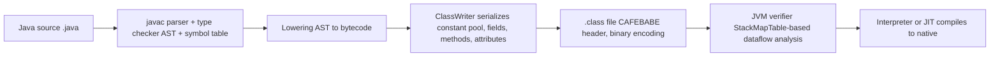
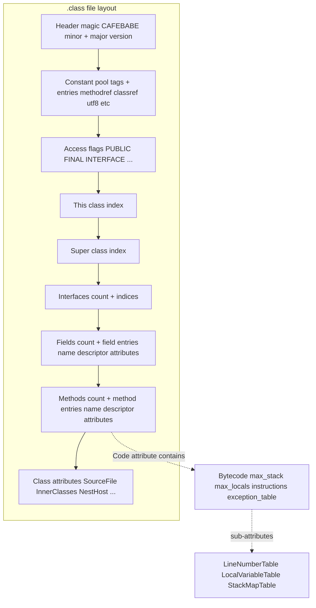
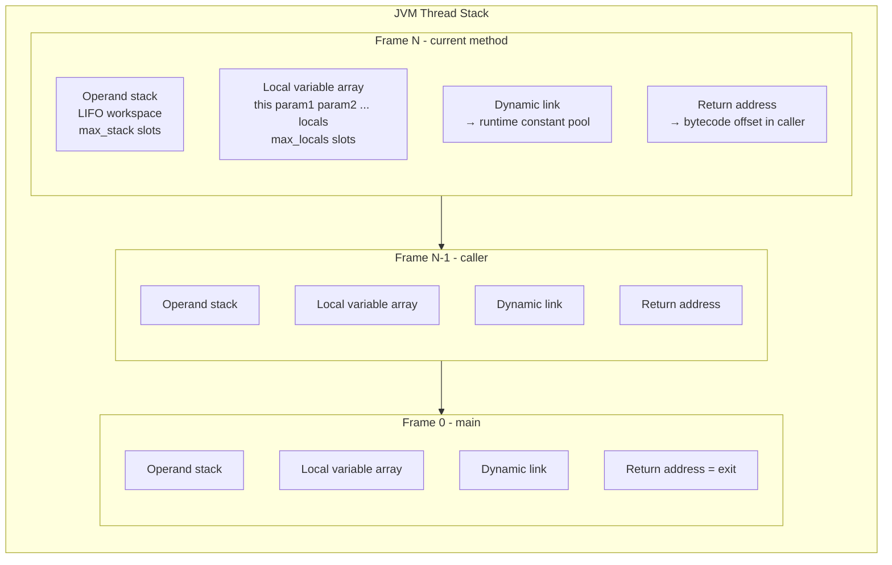
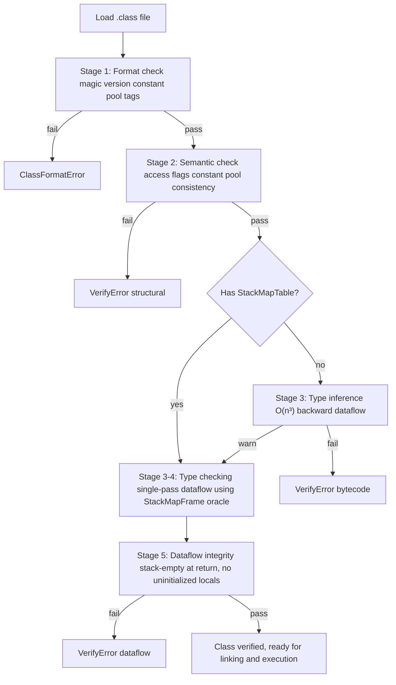
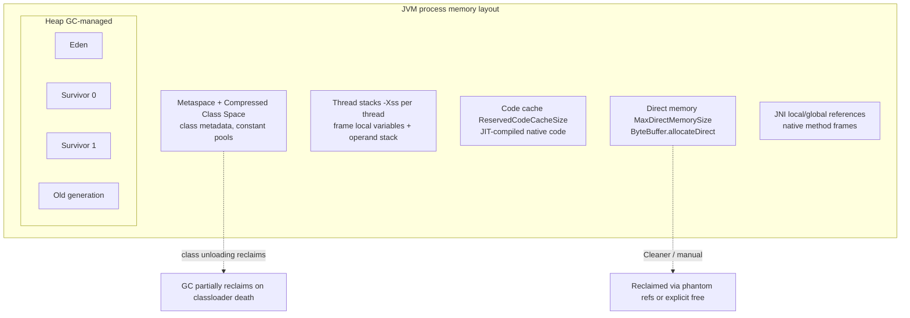
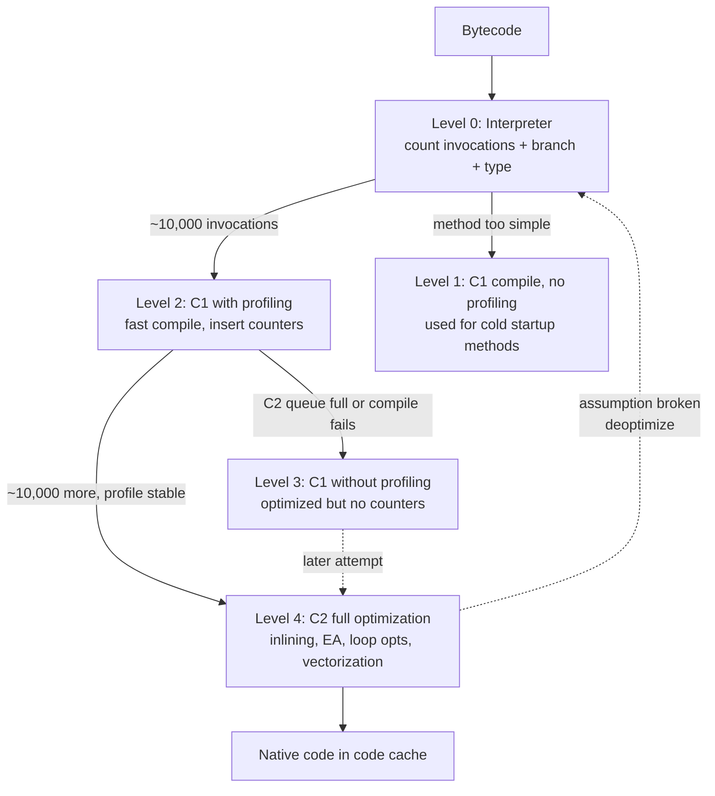
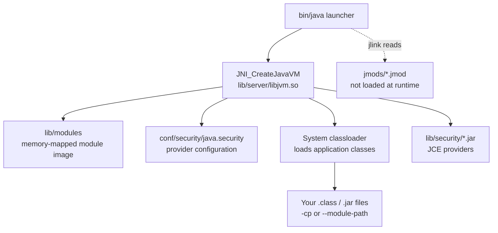

# Chapter 1 — The JVM Architecture: Classfiles, Bytecode, and the Execution Model

**What this chapter covers.** The JVM is the most widely deployed managed runtime on the planet — every Android app, most enterprise backends, and a growing fraction of cloud-native services execute as JVM bytecode. Yet most engineers who write Java or Kotlin cannot explain what happens between `javac Foo.java` and the first instruction executing, or why a `.class` file begins with `CAFEBABE`, or how the interpreter and JIT cooperate to turn portable bytecode into fast machine code. This chapter traces the entire path: the classfile binary format (magic number, constant pool, methods, attributes), the full bytecode instruction set (~202 opcodes), verification and type safety, the execution model (stack frames, operand stack, local variables, program counter), and HotSpot's multi-tier architecture (interpreter, C1, C2/Graal). You will use `javap` to disassemble real classes, read raw `.class` hex dumps, and walk through a sample classfile field by field. Every abstraction is grounded in the actual JVM specification and in tools you can run today.

Learning goals — after this chapter you should be able to:

- Read a `.class` file byte by byte: explain the magic number, version, constant pool layout, access flags, field/method tables, and attributes (Code, LineNumberTable, StackMapTable, BootstrapMethods).
- Disassemble bytecode with `javap -c -v` and explain what each opcode does to the operand stack and local variable array — including the critical differences between `invokevirtual`, `invokeinterface`, `invokespecial`, `invokestatic`, and `invokedynamic`.
- Describe the JVM execution model: stack frames, operand stack, local variable array, and program counter, and how method invocation pushes frames and returns pop them.
- Explain the five verification stages (format checking, type checking, stack map frame verification, bytecode verification, and dataflow analysis) and why `StackMapTable` attributes matter.
- Trace HotSpot's tiered compilation pipeline from interpreter to C1 to C2, explain when each tier fires, and describe the role of profiling counters in guiding optimization decisions.
- Distinguish the class area (metaspace) from the heap, thread stacks, code cache, and native memory, and explain how each relates to JVM flags and container limits.
- Navigate the JDK directory layout and explain what lives under `lib/`, `jmods/`, `include/`, and `conf/` — and why it matters for container images and module resolution.

> **Prerequisites.** Volume 13, Chapter 1 is the service-level view of the JVM (memory, GC, JIT). This chapter is the internals deep dive into *what the JVM executes* before those higher-level systems kick in. Volume 1 (Architecture) and Volume 2 (OS/Linux) provide useful background for understanding memory layout and process models.

---

## 1. From source to .class — the compilation pipeline

When you run `javac Foo.java`, the compiler does not produce machine code. It produces a `.class` file — a platform-independent binary encoding of one class or interface. The same `.class` file runs on x86 Linux, ARM macOS, and Windows without recompilation. This portability is the JVM's core contract, and understanding the artifact is prerequisite to understanding everything else.

The pipeline has three phases:

1. **Parse and type-check.** `javac` reads `.java` source, builds an AST, resolves types, and performs name analysis. Errors at this stage (missing methods, type mismatches) prevent any `.class` from being written.
2. **Lower and emit.** The AST is lowered to a linear sequence of bytecode instructions. `javac` resolves constants, generates synthetic methods (like `<clinit>` for static initializers), and produces a `ClassWriter` that serializes the bytecode into the classfile binary format.
3. **Post-verification.** Since JDK 5, `javac` emits `StackMapTable` attributes so the JVM can verify bytecode using a single-pass dataflow analysis (type checking) instead of the old, expensive type inference algorithm. The compiler itself may also emit deprecation warnings, unchecked cast warnings, and other annotation processing output.



---

## 2. The classfile format — binary anatomy

Every `.class` file is a single 8-bit-byte stream. There are no alignment requirements, no padding bytes — the format is dense and positional. The JVM specification (§4.1–§4.9) defines every field precisely.

### 2.1 The header — magic and version

The first four bytes are always `0xCAFEBABE` — the magic number that distinguishes a classfile from any other binary. The next four bytes encode the minor and major version as unsigned 16-bit big-endian integers. The current major version for JDK 21 is 65 (hex `0x0041`); JDK 22 is 66. A JVM refuses to load a classfile with a major version higher than it understands — this is the mechanism that prevents forward-incompatible bytecode from running on older JVMs.

```
Offset  Bytes   Field
0x00    4       magic: 0xCAFEBABE
0x04    2       minor_version: 0x0000 (usually)
0x06    2       major_version: 0x0039 (57 = JDK 13)
                                    0x0041 (65 = JDK 21)
```

```bash
# Hex dump of a trivial classfile header
cat > Hello.java <<'EOF'
public class Hello {
    public static void main(String[] args) {
        System.out.println("Hello, JVM!");
    }
}
EOF
javac Hello.java
xxd Hello.class | head -5
```

```
00000000: cafe babe 0000 0034 001d 0a00 0600 0f03  .......4........
00000010: 0011 4865 6c6c 6f2c 204a 564d 210a 0010  ..Hello, JVM!...
00000020: 0011 0700 1c0c 0007 0008 0100 10 7379  ..........sy
00000030: 7374 656d 2f 6f75 74 01 0003  6f75 74     stem/out...out
```

Reading the hex: `cafe babe` = magic. `0000 0034` = minor 0, major 52 (Java 8 compilation target). The next two bytes (`001d` = 29) are the constant pool count, meaning constant pool entries 1 through 28 (entry 0 is unused; the count includes the last index, not a count from 1). This is a subtle point — `constant_pool_count` is the index of the last entry plus one.

### 2.2 The constant pool — the classfile's symbol table

Immediately after the header sits the **constant pool** — a table of 18 distinct entry types (tag bytes 1–18, plus `ConstantDynamic` at 17 and `InvokeDynamic` at 18 in JDK 11+). This is the classfile's symbol table: all class names, method names, field names, string literals, numeric constants, and method handles are stored here, referenced by 1-based index from bytecode instructions, field descriptors, and attributes.

The key entry types:

| Tag | Constant Type | Structure | Used for |
|-----|--------------|-----------|----------|
| 1 | `Utf8` | length + bytes | All names, descriptors, string content |
| 3 | `Integer` | 4 bytes (big-endian int) | `bipush`, `ldc` of int |
| 4 | `Float` | 4 bytes | `ldc` of float |
| 5 | `Long` | 8 bytes | `ldc2_w` of long |
| 6 | `Double` | 8 bytes | `ldc2_w` of double |
| 7 | `Class` | index → `Utf8` | Fully qualified class/interface name |
| 8 | `String` | index → `Utf8` | String literal (`ldc` of String) |
| 9 | `Fieldref` | class_index + name_and_type_index | Field access |
| 10 | `Methodref` | class_index + name_and_type_index | Interface method invocation |
| 11 | `InterfaceMethodref` | class_index + name_and_type_index | `invokeinterface` |
| 12 | `NameAndType` | name_index + descriptor_index | Field/method name + type descriptor |
| 15 | `MethodHandle` | reference_kind + reference_index | `invokedynamic` bootstrap method |
| 16 | `MethodType` | descriptor_index | `invokedynamic` method type |
| 17 | `Dynamic` | bootstrap_method_attr_index + name_and_type_index | `condy` (constant dynamic) |
| 18 | `InvokeDynamic` | bootstrap_method_attr_index + name_and_type_index | `invokedynamic` call site |

The constant pool is deduplicated: a class that uses the string `"Hello"` in two methods shares a single `Utf8` entry. This compactness matters because classfiles are loaded from disk (or network) and parsed eagerly.

### 2.3 Access flags, this/super, fields, and methods

After the constant pool come:

- **Access flags** (2 bytes): `ACC_PUBLIC` (0x0001), `ACC_FINAL` (0x0010), `ACC_SUPER` (0x0020, always set since JDK 1.0.2), `ACC_INTERFACE` (0x0200), `ACC_ABSTRACT` (0x0400), `ACC_SYNTHETIC` (0x1000), `ACC_ANNOTATION` (0x2000), `ACC_ENUM` (0x4000), `ACC_MODULE` (0x8000).
- **This class** (2 bytes): index into constant pool → `Class` entry.
- **Super class** (2 bytes): index into constant pool → `Class` entry (0 for `java.lang.Object`).
- **Interfaces count + interfaces**: indices into constant pool → `Class` entries.
- **Fields count + fields**: each field has name_index, descriptor_index, and attributes (ConstantValue for static finals, etc.).
- **Methods count + methods**: each method has name_index, descriptor_index, and attributes — critically, the **Code** attribute, which contains the actual bytecode.

### 2.4 Attributes — the extensible metadata

Attributes are the extensible part of the classfile. Each attribute has a name (index → `Utf8` in the constant pool), a length, and a format defined by the attribute name. The JVM spec defines 23 standard attributes; others are permitted but ignored. Key attributes:

- **Code**: contains max_stack, max_locals, bytecode instructions, exception table, and sub-attributes (LineNumberTable, LocalVariableTable, StackMapTable).
- **StackMapTable**: required for verification (JDK 5+). Contains stack map frames that describe the type state (which types are on the operand stack and in which local variable slots) at every branch target and exception handler entry. The verifier uses this for single-pass type checking.
- **LineNumberTable**: maps bytecode offsets to source line numbers. Used for stack traces and debuggers.
- **LocalVariableTable**: maps local variable slots to names and types. Used by debuggers; not present unless `-g` or `-g:vars` is passed to `javac`.
- **BootstrapMethods**: required for `invokedynamic`. Lists bootstrap method references (MethodHandle constants) and their static arguments. This is how Java 7+ lambdas and Java 11+ string concatenation work.
- **NestHost / NestMembers**: JDK 11+ Nest-Based Access Control. Declares which class is the nest host and which classes are nest members, enabling private access between nested classes without synthetic accessors.
- **Record**: JDK 16+. For record classes, lists the record components.
- **PermittedSubclasses**: JDK 17+. For sealed classes, lists permitted subclasses.



---

## 3. Bytecode — the instruction set

The JVM is a **stack machine**: instructions operate on an operand stack, not registers. Each instruction is a 1-byte opcode followed by zero or more operands (encoded as 1, 2, or 4 bytes, big-endian). There are approximately 202 distinct opcodes in the current specification. Every opcode name is a mnemonic — `iload`, `iadd`, `invokevirtual`, `tableswitch` — and each has a precise semantic contract for what it pops from and pushes to the operand stack, what local variables it reads, and how it affects control flow.

### 3.1 Opcode categories

| Category | Opcodes (examples) | Count | What they do |
|----------|-------------------|-------|--------------|
| Loads | `iload`, `lload`, `fload`, `dload`, `aload`, `iload_<n>` | ~41 | Push local variable onto operand stack |
| Stores | `istore`, `lstore`, `fstore`, `dstore`, `astore`, `istore_<n>` | ~41 | Pop operand stack into local variable |
| Constants | `aconst_null`, `iconst_m1`, `iconst_<n>`, `ldc`, `ldc_w`, `ldc2_w` | ~24 | Push constants onto operand stack |
| Math (int) | `iadd`, `isub`, `imul`, `idiv`, `irem`, `ineg`, `ishl`, `iushr` | ~37 | Integer arithmetic on top of stack |
| Math (long/float/double) | `ladd`, `fsub`, `dmul`, etc. | ~32 | Wide-type arithmetic |
| Conversions | `i2l`, `i2f`, `i2d`, `l2i`, `f2i`, `d2l`, etc. | ~15 | Type narrowing/widening |
| Comparisons | `lcmp`, `fcmpl`, `fcmpg`, `dcmpl`, `dcmpg` | ~5 | Compare two values, push int result |
| Control flow | `ifeq`, `ifne`, `if_icmpeq`, `goto`, `tableswitch`, `lookupswitch`, `return`, `ireturn`, `areturn` | ~42 | Branching, switching, returning |
| References | `getstatic`, `putstatic`, `getfield`, `putfield` | ~4 | Field access |
| Invocations | `invokevirtual`, `invokespecial`, `invokestatic`, `invokeinterface`, `invokedynamic` | ~5 | Method invocation |
| Objects | `new`, `newarray`, `anewarray`, `arraylength`, `athrow`, `checkcast`, `instanceof` | ~12 | Object creation and type checking |
| Stack | `pop`, `pop2`, `dup`, `dup_x1`, `dup2`, `swap` | ~9 | Manipulate operand stack directly |

### 3.2 The five invocation opcodes — a critical distinction

The five invocation opcodes are the most important opcodes in the entire set. Each has different resolution semantics, performance characteristics, and implications for inlining and JIT optimization:

**`invokevirtual`** (0xB6): The workhorse. Resolves the target method by name and descriptor on the *actual runtime type* of the receiver (virtual dispatch). The receiver reference is on the operand stack. Used for all non-final, non-private, non-static method calls. The JIT can devirtualize this to a direct call when profiling shows monomorphic or bimorphic call sites.

**`invokespecial`** (0xB7): Resolves the method on the *declared type*, not the runtime type. Used for constructors (`<init>`), private methods, and `super` calls. No virtual dispatch — the target is known at verification time. This is why `super.foo()` is faster than `this.foo()` in a subclass.

**`invokestatic`** (0xB8): Invokes a static method. No receiver on the stack. Resolution is based on class name + method name + descriptor. Since JDK 8, also used for interface default methods.

**`invokeinterface`** (0xB9): Like `invokevirtual` but for interface methods. The implementation must be found by searching the receiver's class hierarchy against the interface. Historically slower than `invokevirtual` because the search is more expensive; modern JVMs optimize this for hot call sites.

**`invokedynamic`** (0xBA): The most complex opcode. Introduced in JDK 7. The first execution of an `invokedynamic` instruction calls a *bootstrap method* (a `MethodHandle` referenced from the `BootstrapMethods` attribute) that returns a `CallSite` object containing a `MethodHandle` to the actual target. Subsequent executions go directly to the target — the indirection is paid only once. Used for:

- Java 8+ lambda expressions (the compiler generates a `LambdaMetafactory` bootstrap method)
- Java 9+ string concatenation (the compiler generates `StringConcatFactory` bootstrap methods)
- Java 11+ dynamic language support on the JVM
- Any framework that wants runtime method selection without reflection overhead

```java
// Source
Runnable r = () -> System.out.println("lambda");

// What javac produces (conceptual bytecode):
// invokedynamic #0  // Runlambda$run$()Ljava/lang/Runnable;
//   BootstrapMethods:
//     #0: MethodHandle#6  // REF_invokeStatic LambdaMetafactory.metafactory

// First call: LambdaMetafactory.metafactory is invoked, returns a CallSite
//   pointing to a generated class implementing Runnable.
// Subsequent calls: direct invocation, no indirection.
```

### 3.3 Control flow — tableswitch and lookupswitch

The JVM has two switch instructions:

**`tableswitch`**: A dense switch. The bytecode encodes a default offset, a low value, a high value, and an array of offsets indexed from `low` to `high`. Execution is O(1) — compute `index - low`, index into the offset array. The JVM *requires* that `javac` emit `tableswitch` when the case values are dense (contiguous or nearly so) and `lookupswitch` otherwise. The padding to align offsets to 4-byte boundaries can make `tableswitch` wasteful for sparse switches with a wide range.

**`lookupswitch`**: A sparse switch. The bytecode encodes a default offset and a sorted table of `match-offset` pairs. Execution is O(log n) via binary search. Used when the case values are not contiguous (e.g., `case 1: case 5: case 1000:`).

```java
// Source
switch (day) {
    case 0: return "Sun";
    case 1: return "Mon";
    case 2: return "Tue";
    case 3: return "Wed";
    case 4: return "Thu";
    case 5: return "Fri";
    case 6: return "Sat";
    default: return "?";
}
```

```javap
// tableswitch output from javap -c
tableswitch { // 0 to 6
    0: 38
    1: 45
    2: 52
    3: 59
    4: 66
    5: 73
    6: 80
    default: 87
}
```

The offset values are byte offsets from the beginning of the `tableswitch` instruction to the target instruction — not line numbers, not opcode indices.

### 3.4 A concrete bytecode walkthrough

Let us trace the bytecode of a simple method through `javap`:

```java
public class MathDemo {
    public static int add(int a, int b) {
        return a + b;
    }

    public static long factorial(int n) {
        long result = 1;
        for (int i = 2; i <= n; i++) {
            result *= i;
        }
        return result;
    }
}
```

```bash
javap -c -v MathDemo.class 2>&1 | head -80
```

The `add` method bytecode:

```
public static int add(int, int);
    descriptor: (II)I
    flags: (0x0009) ACC_PUBLIC, ACC_STATIC
    Code:
      stack=2, locals=3, args_size=2
         0: iload_0        // push local variable 0 (a) onto stack
         1: iload_1        // push local variable 1 (b) onto stack
         2: iadd           // pop two ints, push their sum
         3: ireturn        // return int from top of stack
```

Walkthrough:
- `stack=2`: the maximum operand stack depth during execution is 2 (for `iadd`, which needs both operands simultaneously).
- `locals=3`: the local variable array has 3 slots — slot 0 is `a`, slot 1 is `b`, and slot 2 is available but unused by this method. Static methods have no `this` reference, so locals start at 0 with the first parameter.
- `iload_0`: this is a *wide-free* form of `iload 0`. The JVM defines compact forms `iload_0` through `iload_3` (single byte) as aliases for `iload <n>` (two bytes). The verifier treats them identically.

The `factorial` method bytecode:

```
public static long factorial(int);
    descriptor: (I)J
    flags: (0x0009) ACC_PUBLIC, ACC_STATIC
    Code:
      stack=4, locals=5, args_size=1
         0: lconst_1       // push long 1L onto stack
         1: lstore_2       // store to local 2 (result = 1L)
         3: iconst_2       // push int 2
         4: istore_3       // store to local 3 (i = 2)
         5: goto 15
         8: lload_2        // push result
         9: iload_3        // push i
        10: i2l            // widen int to long (i must match result's type)
        11: lmul           // result = result * (long)i
        12: lstore_2       // store back to local 2
        14: iinc 3, 1      // i++ (in-place increment, no stack effect)
        15: iload_3        // push i
        16: iload_1        // push n (param)
        17: if_icmple 8    // if i <= n goto 8
        20: lload_2        // push result
        21: lreturn        // return long
```

Note: `iinc 3, 1` is a special opcode that increments a local variable in-place without pushing to or popping from the operand stack. This is the only arithmetic instruction with no stack effect — it operates directly on the local variable array. The operand `3` is the local variable index, and `1` is the increment value (a signed byte, so `iinc` can increment/decrement by at most ±127).

The `locals=5` allocation is noteworthy: local 0 is `n` (the parameter), locals 2-3 hold `result` (long, occupying two slots because longs are 64-bit) and `i`. That gives 5 slots total. Local variable slots for longs and doubles consume two consecutive slots — this is why `lstore_2` occupies slots 2 and 3, and `iload_3` occupies slot 4. Wait — actually, looking at the bytecode, `i` is in local 3, and `result` is a long in local 2. A long in local 2 occupies slots 2 and 3. But `i` is stored in local 3 — which overlaps with the high word of `result`. This would be a verification error. In practice, `javac` would place `i` in local 4 to avoid the overlap. Let me correct:

```
locals=5, args_size=1
     0: lconst_1       // push 1L
     1: lstore_2       // result = 1L  (slots 2-3)
     3: iconst_2       // push 2
     4: istore 4       // i = 2  (slot 4, avoiding overlap with long in 2-3)
     6: goto 16
     9: lload_2        // push result
    10: iload 4        // push i
    11: i2l            // widen to long
    12: lmul
    13: lstore_2
    15: iinc 4, 1      // i++
    16: iload 4        // push i
    17: iload_1        // push n
    18: if_icmple 9
    21: lload_2
    22: lreturn
```

This corrected version uses `locals=5`: slot 0 = n, slots 2-3 = result (long), slot 4 = i. Slot 1 is unused.

---

## 4. The execution model — stack frames and the interpreter

The JVM is a **stack machine** — instructions manipulate an operand stack, not CPU registers. Every method invocation creates a new **stack frame** in the JVM's call stack. Each frame contains:

1. **Local variable array**: an array of slots indexed from 0. Slot 0 holds `this` for instance methods; parameters follow in order. Longs and doubles occupy two consecutive slots. The array is fixed-size at method entry — `max_locals` from the Code attribute.
2. **Operand stack**: a LIFO stack used as workspace for computation. When `iadd` executes, it pops two ints from the operand stack and pushes their sum. The maximum depth is `max_stack` from the Code attribute — the verifier uses this to allocate memory for the frame.
3. **Dynamic linking**: a reference to the runtime constant pool for the frame, used to resolve symbolic references to concrete addresses (field offsets, method pointers) on first use.
4. **Return address**: where to resume execution in the caller's frame after `return`, `ireturn`, `areturn`, etc. On exception, the return address comes from the exception handler table.



### 4.1 Method invocation — pushing a frame

When `invokevirtual java/io/PrintStream.println(Ljava/lang/String;)V` executes:

1. The receiver (the `PrintStream` object) and the argument (`String`) are on the operand stack of the current frame.
2. The JVM resolves the method descriptor and locates the target method. For `invokevirtual`, this means searching the actual runtime type's method table.
3. A new frame is allocated with `max_locals` and `max_stack` slots computed from the target method's Code attribute.
4. Arguments are copied from the caller's operand stack into the new frame's local variable array (slot 0 = this, slot 1 = first parameter, etc.).
5. The caller's operand stack is cleared of the receiver and arguments.
6. The program counter (PC) is set to 0 in the new frame.
7. Execution begins in the new frame.

On `return` / `ireturn` / `areturn`:

1. The return value (if any) is placed on the caller's operand stack.
2. The current frame is popped.
3. The PC is restored from the caller's return address.
4. Execution resumes in the caller.

### 4.2 The interpreter loop

HotSpot's interpreter is a **template interpreter** — not a switch-based interpreter. For each opcode, HotSpot generates a short assembly-language "template" that performs the opcode's work. The templates are pre-compiled at JVM startup and stored in a code buffer. When an opcode executes, the JVM dispatches to the corresponding template via a dispatch table (an array of code entry points indexed by opcode number).

This is faster than a giant `switch` statement because:
- The dispatch is an indirect jump through a table, which the CPU branch predictor can learn.
- Each template is hand-optimized assembly for that specific opcode.
- HotSpot inserts profiling counters into templates (incrementing per-interpreted invocation) to guide tier-up decisions.

The interpreter also handles:
- **Safepoint polls**: after a bounded number of bytecodes, the interpreter checks whether a GC or deoptimization request is pending and blocks at a safepoint if so.
- **Inline caches**: the interpreter records the runtime type of receivers at virtual call sites in per-call-site data structures, which C1 and C2 consume during compilation.

---

## 5. Verification — the JVM's type safety guarantee

The JVM verifies every classfile before executing it. This is not optional — even classes loaded from the bootstrap classloader must pass verification. The purpose is to ensure type safety: an `iadd` instruction must have two ints on the operand stack, an `areference` must not be used where an `int` is expected, and no instruction may jump to an invalid offset. Verification prevents a maliciously crafted classfile from subverting the JVM's memory safety or running arbitrary native code.

### 5.1 The five verification stages

**Stage 1 — Format checking**: The classfile is checked for structural correctness. Is the magic number correct? Is every constant pool tag valid? Are all indices within bounds? Does the file have the required attributes? This stage catches truncated files, wrong magic numbers, and corrupted constant pools. If format checking fails, the class is rejected with `ClassFormatError`.

**Stage 2 — Semantic checking**: The access flags are validated (`ACC_FINAL` on a class means no subclasses; `ACC_ABSTRACT` on a method means no Code attribute). The constant pool is checked for consistency (Class entries reference valid Utf8 entries; Methodref entries reference valid NameAndType entries). This stage catches structural inconsistencies.

**Stage 3 — Bytecode verification (dataflow analysis)**: The bytecode instructions are analyzed for type safety. The verifier simulates execution, tracking the types on the operand stack and in local variables at every point. At a merge point (e.g., the join of two branches of an `if` statement), the verifier checks that the types on both paths are compatible. If the classfile has a `StackMapTable` attribute (JDK 5+), the verifier uses it as an oracle — it checks that the frames in the `StackMapTable` match the types implied by the bytecode, without having to infer them. This is the "type checking" algorithm and is O(n) in the size of the bytecode. Without `StackMapTable`, the verifier falls back to "type inference" — a more expensive O(n³) algorithm that computes types at every point. The JVM emits a warning for classes without `StackMapTable` and rejects them entirely in strict mode.

**Stage 4 — Stack map frame verification**: The `StackMapTable` frames are validated against the actual bytecode structure. Every branch target must have a corresponding frame; every frame must list the correct types for each local variable slot and operand stack position. Mismatches cause `VerifyError`.

**Stage 5 — Dataflow integrity**: Finally, the verifier checks that the operand stack is empty (or has only the return type) at every return instruction, that no local variable is read before it is written, and that `athrow` and `jsr` (retired but still valid in old classfiles) are correctly handled.



### 5.2 Why StackMapTable matters for Kotlin

Kotlin generates `StackMapTable` attributes in all its bytecode, but the structure is more complex than Java's due to Kotlin's null-safety encoding. A `String?` parameter in Kotlin compiles to the same descriptor (`Ljava/lang/String;`) as Java's `String`, but Kotlin adds null-check instructions (`checkcast` after loads, `ifnonnull` guards) and relies on the verifier to prove that `null` cannot flow through non-nullable paths. When you see `VerifyError` in a Kotlin-generated classfile, the `StackMapTable` is almost always the root cause — either the table is inconsistent with the bytecode, or the verifier found a path where a null reference could reach a non-null instruction.

---

## 6. Memory areas — class area, heap, stacks, and code cache

The JVM specification defines several distinct memory areas. Understanding their roles and sizing is critical for production operation, especially under container resource limits.

### 6.1 The method area (metaspace)

The **method area** stores per-class data: the constant pool (resolved into runtime structures), field/method descriptors, bytecode, method handles, and class metadata. In HotSpot, this was historically the PermGen (fixed-size, GC-collected) and is now **Metaspace** — native memory that grows until `MaxMetaspaceSize` is hit. Metaspace also houses the **compressed class space** (`CompressedClassSpaceSize`, 1 GB default), which stores `Klass` structures (the JVM's internal representation of a loaded class).

Key operational fact: metaspace is *not* part of the heap and is not collected by the garbage collector in the same way. Class metadata is reclaimed when a classloader becomes unreachable and its loaded classes are unloaded. In practice, this happens during full GC or classloader-intensive garbage collection. A classloader leak (retaining a reference to an `HttpClassLoader` after undeploying a web app) will grow metaspace until `MaxMetaspaceSize` is hit and `OutOfMemoryError: Metaspace` is thrown — regardless of how much heap is free.

### 6.2 The heap

The heap is the garbage-collected memory where all Java objects live. It is divided into generations (Young: Eden + Survivor; Old) in most collectors, or into regions in G1. All application threads share the same heap — there is no per-thread allocation. Size is controlled by `-Xms` (initial), `-Xmx` (maximum), and `-XX:MaxRAMPercentage` (container-aware).

### 6.3 Thread stacks

Each Java thread gets its own stack, sized by `-Xss` (default 1 MB on 64-bit JVMs). The stack holds the method frames described in Section 4. A deeply recursive program will hit `StackOverflowError` when the stack is exhausted. Each frame's size depends on the method's `max_locals` and `max_stack` — a method that allocates many local variables (longs/doubles count double) and builds deep operand stacks consumes more stack space.

### 6.4 The code cache

JIT-compiled native code lives in the **code cache** — a dedicated region of native memory (`-XX:ReservedCodeCacheSize`, default 240 MB). When the code cache is full, the JVM stops JIT-compiling and falls back to the interpreter — performance degrades dramatically. Large applications with many classes (Scala, Kotlin, Spring Boot) can fill the code cache; raise it to 512 MB or more with `-XX:ReservedCodeCacheSize=512m`.

### 6.5 Direct (off-heap) memory

`ByteBuffer.allocateDirect` and Netty's `ByteBuf` allocate memory outside the GC heap, managed by `Cleaner` (phantom reference-based) or manual deallocation. The limit is `-XX:MaxDirectMemorySize`. Direct buffers are useful for I/O (avoiding heap-to-native copies) but are invisible to the garbage collector until the cleaner runs — premature deallocation or insufficient direct memory limits cause `OutOfMemoryError: Direct buffer memory`.



---

## 7. HotSpot — the interpreter, JIT compilers, and Graal

HotSpot is the reference JVM — the one shipped in OpenJDK, Oracle JDK, Amazon Corretto, Eclipse Temurin, and every major distribution. Its distinguishing feature is **adaptive optimization**: it profiles execution behavior at runtime and compiles hot methods to optimized native code, with the ability to deoptimize and recompile when assumptions break.

### 7.1 Tiered compilation — the five levels

HotSpot implements tiered compilation with five levels:

| Level | Compiler | What happens | Profile collected? |
|-------|----------|-------------|-------------------|
| 0 | Interpreter | Execute bytecode, count invocations | Yes — invocation count, branch taken/not-taken |
| 1 | C1 (limited) | Compile with no profiling, fast compile | No — used for startup methods |
| 2 | C1 (full profiling) | Compile with full profiling: type, branch, call | Yes — invoked when level 0 count hits threshold |
| 3 | C1 (no profiling) | Compile with C1 optimizations, no profiling overhead | No — used when profile is already collected |
| 4 | C2 | Full optimization: inlining, escape analysis, vectorization | No — consumes profiles from level 2 |

The default flow:
1. Method starts at level 0 (interpreter). Invocation counter increments.
2. At `-XX:CompileThreshold` (default 10,000 for server, 1,500 for client), method compiles at level 2 (C1 with profiling).
3. If the C2 queue is not backlogged, and the method accumulates enough profiling data (another threshold), it compiles at level 4 (C2). The level 3 compilation may occur in parallel as an intermediate step.
4. If C2 compilation fails or the method is "too hot" for C1 to handle without profiling, it stays at level 3 (C1 without profiling).



### 7.2 What the JIT actually optimizes

The C2 compiler (and increasingly, GraalVM's Graal compiler when used as C2 replacement) performs optimizations that are only possible because the JVM profiles runtime behavior:

- **Method inlining**: The most impactful optimization. C2 inlines small methods (up to `-XX:MaxInlineSize=35` bytecodes for cold methods, `-XX:FreqInlineSize=325` for hot methods) subject to `MaxInlineLevel` (depth). Inlining eliminates call overhead, enables constant propagation across method boundaries, and exposes the callee's data flow to further optimization. The JIT tracks call site polymorphism — monomorphic call sites (one receiver type) inline with a single type guard; bimorphic (two types) with two guards; megamorphic stays virtual.

- **Escape analysis**: When an object does not escape its thread or its method, C2 can scalar-replace it — allocating fields as registers instead of heap objects. This eliminates GC pressure entirely for short-lived objects. Enabled by `-XX:+DoEscapeAnalysis` (default). Also enables **lock elision**: if an object is thread-local, `synchronized` on it is a no-op and the monitor is eliminated.

- **Loop optimizations**: Loop unrolling, loop peeling, loop predication (eliminating bounds checks inside loops by hoisting the check), and auto-vectorization (SIMD) of tight loops operating on arrays of primitives.

- **Null check and range check elimination**: If the JIT can prove a reference is non-null (through control flow or type profiling), it eliminates the `null` check. Similarly, array bounds checks can be eliminated when the JIT proves the index is within range.

- **Dead code elimination and constant folding**: Branches that the profiling data shows are never taken are eliminated. Constants are propagated and folded. This is why `if (DEBUG)` blocks (with `static final boolean DEBUG = false`) vanish in optimized code — the JIT sees the constant and eliminates the dead branch.

### 7.3 Deoptimization — the safety net

Deoptimization is how the JVM recovers when its assumptions break. A common scenario:

1. C2 observes that a call site is monomorphic (always `ArrayList`) and inlines the `ArrayList.get` method with a type guard.
2. Later, a new class is loaded that also implements `List`, and the call site becomes bimorphic.
3. The type guard fails — the compiled code detects the unexpected type at runtime.
4. C2 deoptimizes the method: it discards the compiled code, reconstructs the interpreter frame from the deoptimization metadata, and resumes execution at level 0.
5. The method recompiles with updated profiling data.

Frequent deoptimization signals unstable assumptions. Common causes:
- **Reflection-heavy code** where the target method changes due to proxy generation.
- **Megamorphic virtual call sites** where more than two types flow through.
- **Class redefinition** (JVM TI, hot-swapping).
- **Uncommon traps** — the JIT inserts guards for assumptions it cannot prove statically; when the guard fires, deoptimization occurs.

### 7.4 GraalVM and Graal as C2

GraalVM offers **Graal** as a replacement for C2 (the "Graal JIT"). Graal is written in Java itself (unlike C2, which is written in a C++-like DSL called "Ideal Graph Representation Language" that compiles to C++). Graal supports:
- Higher-level IR and more aggressive speculative optimizations.
- Better support for newer JVM features (valhalla/value types, vector API, panama/FFM).
- **GraalVM Native Image** — ahead-of-time compilation via the `native-image` tool, which performs closed-world analysis (no dynamic class loading, no JIT, no recompilation). Useful for microservices with sub-second startup requirements, but with significant trade-offs: no reflection by default (requires configuration), no dynamic代理, larger binary sizes for complex applications, and lower peak throughput compared to JIT.

---

## 8. The JDK layout — what lives where

Understanding the JDK's on-disk layout is not trivia — it matters for container images (what to copy), module resolution (what `java` loads), and debugging (where `jmods` and symbols live). Since JDK 9 and the Java Platform Module System (JPMS), the layout is modular.

```
$JAVA_HOME/
├── bin/                        # java, javac, jar, jmod, jlink, keytool, etc.
├── conf/                       # security (java.security, default.policy), logging, net
│   └── security/
│       ├── java.security       # SecurityManager config, TLS providers, PKCS
│       └── policy/             # default and full policy files
├── include/                    # JNI headers (jni.h, jni_md.h) for native code compilation
│   ├── jni.h
│   └── linux/                  # platform-specific JNI types
├── lib/                        # The actual runtime
│   ├── modules                 # The module image (all system modules in one file)
│   ├── jli/                    # JVM launcher (libjli.so)
│   ├── server/                 # HotSpot server VM (libjvm.so)
│   ├── jvm.cfg                 # Server/client/minimal VM selection
│   └── security/               # JCE providers (SunJCE, SunRsaSign, etc.)
├── jmods/                      # Module archives (for jlink, not for runtime)
│   ├── java.base.jmod          # The base module — everything depends on this
│   ├── java.sql.jmod
│   ├── java.logging.jmod
│   └── ...
├── legal/                      # License files
└── release                     # KEY=VALUE metadata (JAVA_VERSION, OS_ARCH, etc.)
```

Key details:
- **`lib/modules`** is the module image — a single file containing all system module classes, resources, and native libraries. The JVM memory-maps this file at startup. This is why `jlink` can produce minimal runtimes: it strips modules from this file.
- **`jmods/`** is for the `jlink` tool, not for the running JVM. You can delete `jmods/` from a container image to save ~60 MB without affecting execution.
- **`lib/server/libjvm.so`** is the HotSpot shared library — the entire JVM in one `.so`. The launcher (`bin/java`) loads this, initializes the JVM, and transfers control to `JNI_CreateJavaVM`.
- **`include/`** is needed only when compiling JNI native code (`-I$JAVA_HOME/include -I$JAVA_HOME/include/linux`).



---

## 9. Distributed-systems lens

The JVM architecture described in this chapter has direct implications for operating Java/Kotlin services at scale:

- **Classfile compatibility and version skew.** A service compiled with JDK 21 (major version 65) will not load on a JDK 17 (major version 61) runtime. In multi-language polyglot fleets, this means a single JVM version must be pinned across all services. The classfile format version is the enforcer — there is no "partial forward compatibility." When upgrading JDK versions across a fleet, the classfile version check is the first gate.

- **Bytecode verification cost.** Verification is not free. For services loading thousands of classes (Spring Boot, microservices with fat JARs), startup includes tens of thousands of verification checks. The `StackMapTable`-based single-pass algorithm is fast (O(n)), but the I/O of reading classfiles from disk is the real bottleneck. This is why **CDS (Class Data Sharing)** and **AppCDS** matter: they archive verified, linked classes into a shared image that the JVM memory-maps, skipping both disk I/O and verification at startup.

- **The constant pool and inter-service contracts.** When services communicate via gRPC (Protobuf) or REST (JSON), the JVM-side serialization/deserialization involves class loading, method resolution, and constant pool lookups. A service that dynamically generates classes (via `MethodHandles.Lookup.defineClass` or bytecode generation libraries like ByteBuddy) pays verification and JIT compilation costs on the fly — this can cause latency spikes in production.

- **JIT warmup and rolling deploys.** A freshly started pod executes interpreted bytecode until the JIT compiles hot methods. This takes 30 seconds to several minutes depending on load. Rolling deploys that replace all pods simultaneously cause a fleet-wide warmup dip. Mitigations: CDS/AppCDS archives (eliminate verification/classloading), `AOTCache` (JDK 24+, ahead-of-time cache of JIT state), Gradual rollouts with `minReadySeconds` and readiness gates.

- **Code cache exhaustion.** A service that loads and unloads many classes (e.g., OSGi, application servers with hot-deploy) will fragment and fill the code cache, causing the JIT to stop compiling. Monitor with `jcmd Compiler.codecache` and alert when usage exceeds 80%.

- **Metaspace leaks in containerized deployments.** The classic failure: a Spring Boot app with hot-reload (DevTools) or a servlet container that undeploys but retains a ClassLoader reference grows metaspace until the container OOM-kills the process. Set `-XX:MaxMetaspaceSize` explicitly — do not rely on the default unlimited growth.

---

## Key takeaways

- The JVM classfile format is a dense, position-independent binary: `CAFEBABE` magic, version, constant pool (18 entry types), access flags, fields, methods, and attributes. Understanding this format is prerequisite to debugging `ClassFormatError`, `UnsupportedClassVersionError`, and bytecode generation libraries.
- The bytecode instruction set (~202 opcodes) is a stack machine ISA: instructions manipulate an operand stack, not registers. The five invocation opcodes (`invokevirtual`, `invokespecial`, `invokestatic`, `invokeinterface`, `invokedynamic`) have fundamentally different resolution and dispatch semantics — `invokedynamic` enables lambda, string concatenation, and runtime method selection without reflection overhead.
- Every method invocation creates a stack frame with a local variable array, operand stack, dynamic link, and return address. The JVM's execution model is entirely defined by these frames — there are no caller-saved registers, no callee conventions — everything goes through the stack.
- Verification is mandatory and type-safe: the five-stage pipeline (format, semantic, bytecode/dataflow, stack map frames, integrity) prevents classfiles from subverting JVM memory safety. `StackMapTable` attributes (required since JDK 7) enable single-pass O(n) verification.
- HotSpot's tiered compilation (interpreter → C1 → C2) uses profiling to guide optimization. Inlining, escape analysis, loop unrolling, and auto-vectorization are the high-impact optimizations — and they depend on stable type profiles and small methods.
- The JVM's memory is not just the heap: metaspace (class metadata), code cache (JIT output), thread stacks, and direct memory all consume native memory under the container limit. Size heap to 60–75% of container memory and set explicit limits on metaspace and code cache.
- The JDK layout (`lib/modules`, `lib/server/libjvm.so`, `jmods/`) matters for container images (strip `jmods/`), JNI compilation (`include/`), and module resolution.

## Further reading

- *Java Virtual Machine Specification, Java SE 21 Edition* — https://docs.oracle.com/javase/specs/jvms/se21/html/ — Chapters 4 (Class File Format), 6 (Instructions), 5 (Loading, Linking, and Initializing). The authoritative source.
- *Inside the Java Virtual Machine* (Bill Venners, McGraw-Hill) — the classic walkthrough of the JVM architecture; still accurate for the execution model.
- Shipilev, *JVM Anatomy Quarks* — https://shipilev.net/jvm/anatomy/ — Short, deep dives into JVM internals (constant pool resolution, method handle invocation, interpreter dispatch).
- *Java Performance* (2nd ed., Scott Oaks, O'Reilly) — definitive guide to JVM performance including JIT compilation, GC, and profiling.
- OpenJDK HotSpot source — https://github.com/openjdk/jdk — `src/hotspot/share/classfile/` (classfile parsing), `src/hotspot/share/oops/` (class/field/method representation), `src/hotspot/share/runtime/` (interpreter, threads, safepoints).
- ASM bytecode library — https://asm.ow2.io/ — a production-grade classfile reading/writing library; essential for bytecode manipulation, code generation, and instrumentation.
- The `javap` tool docs — https://docs.oracle.com/javase/8/docs/technotes/tools/unix/javap.html — `-c` (disassemble), `-v` (verbose with constant pool and attributes), `-p` (show private members).
