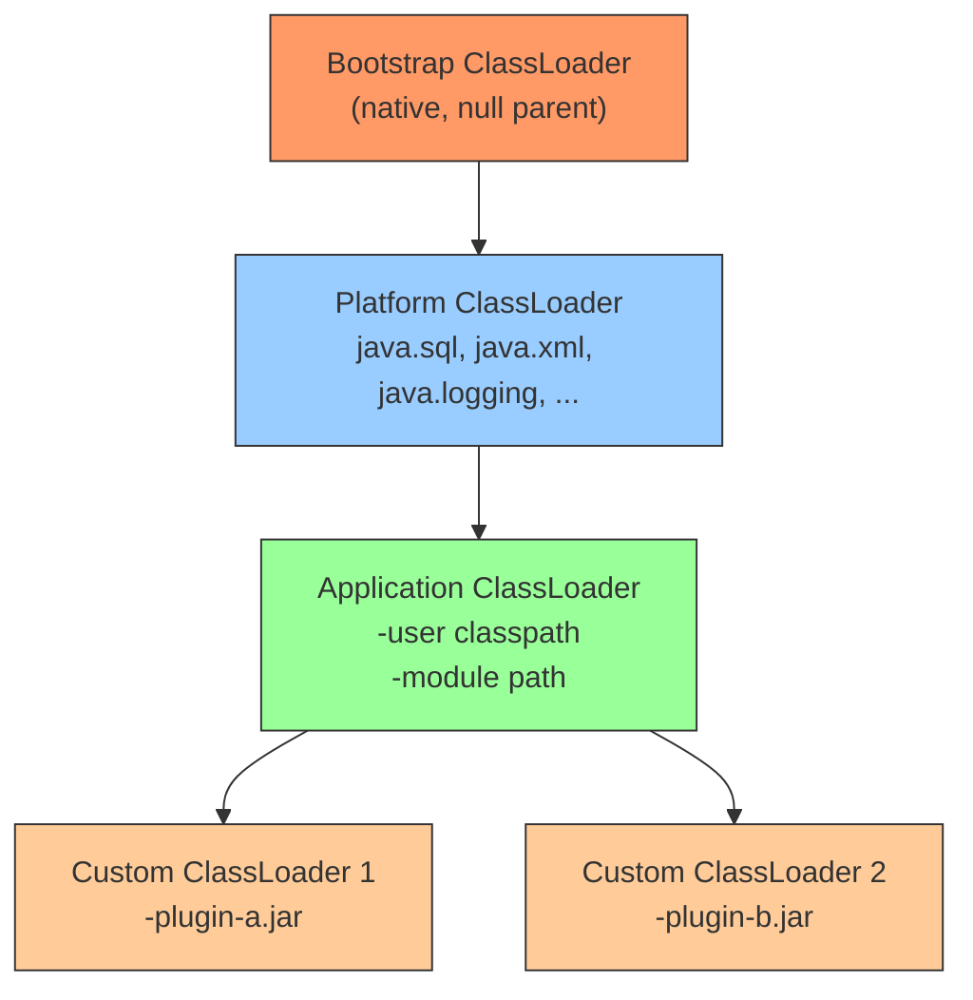
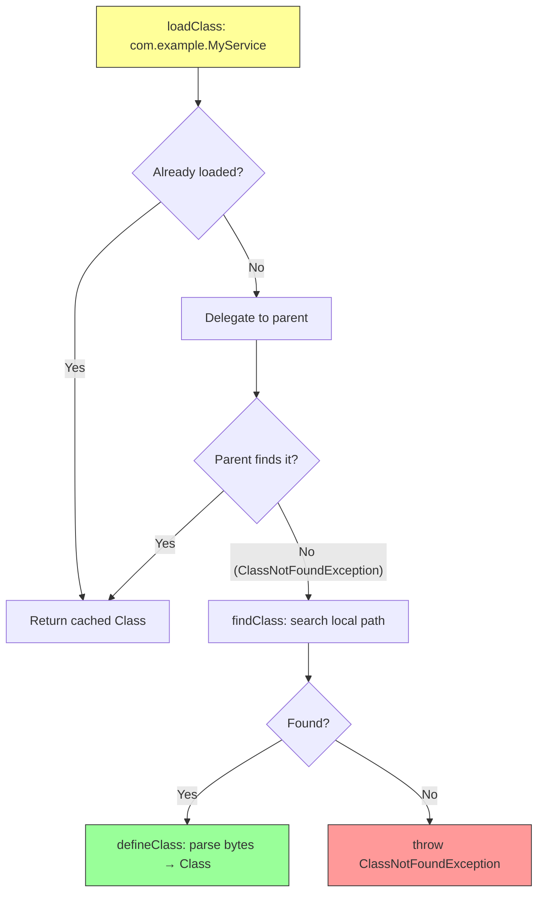
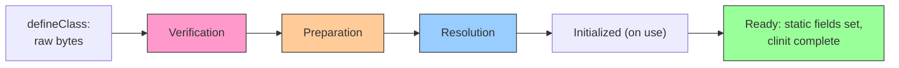
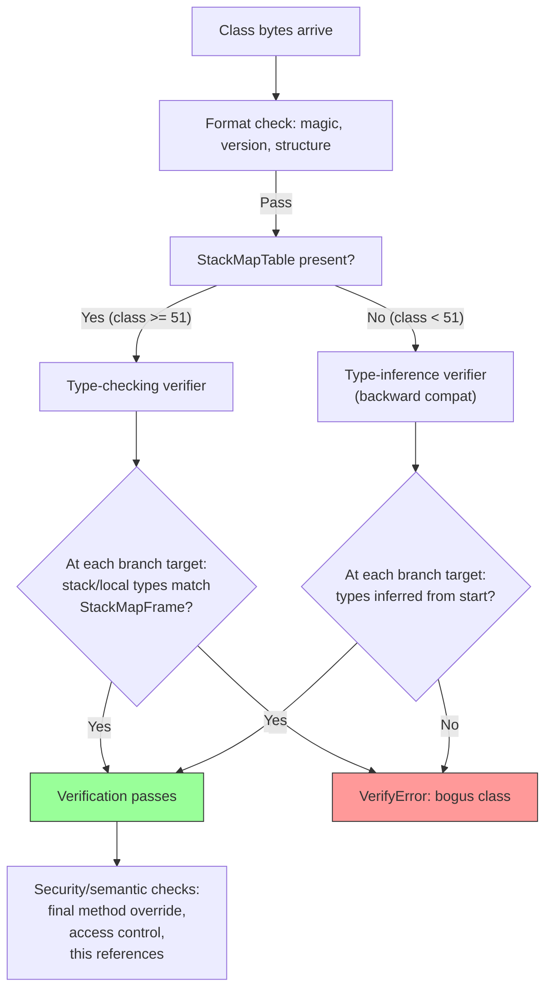
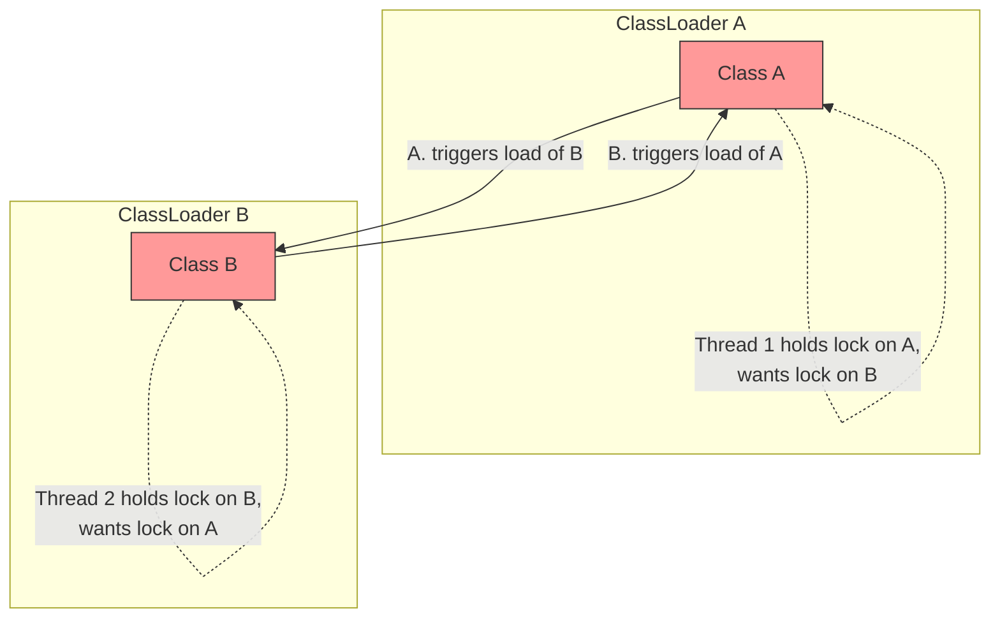
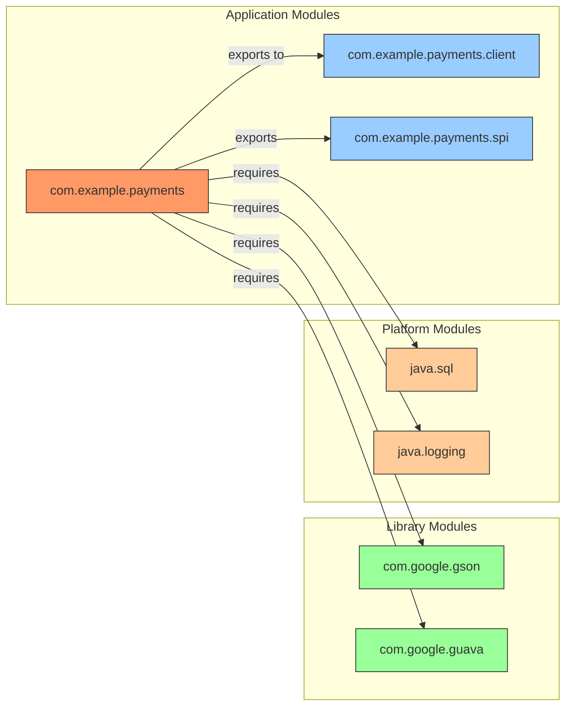
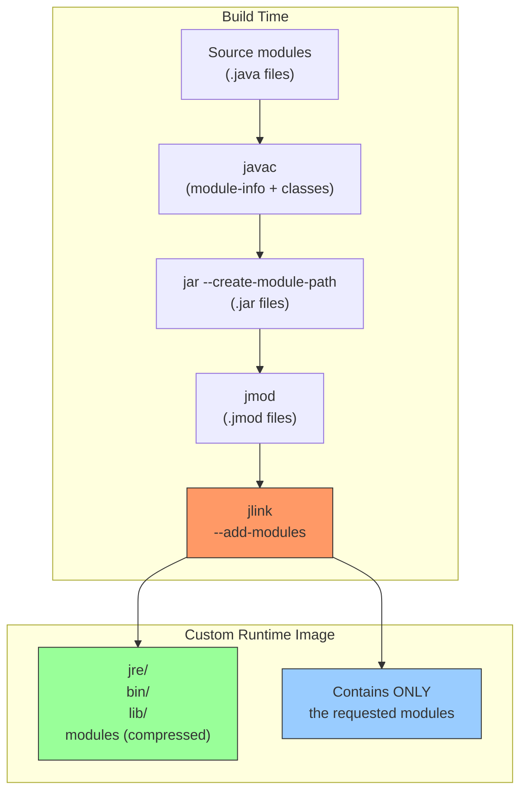

# Chapter 2 — Class Loading, Linking, Verification, and Modules (JPMS)

**What this chapter covers.** After Chapter 1 introduced the JVM architecture —
classfiles, bytecodes, and the runtime data areas — this chapter follows a class
from its first byte of bytecode on disk through every transformation the JVM
performs before the first instruction of its static initializer executes. We
examine the three built-in class loaders, the parent-first delegation model, and
why parallel-capable loaders exist. We walk through the three linking phases —
verification (including StackMapTable-based control-flow analysis), preparation,
and resolution — and then cover class initialization: the `<clinit>` method,
the deadlock patterns that lurk in circular static dependencies, and the precise
ordering rules the JVM specification mandates. We confront the practical pain of
ClassLoader leaks and the PermGen-to-Metaspace migration that JDK 8 brought. We
then cover the Java Platform Module System (JPMS): module declarations,
readability edges, qualified exports, module layers, and the build-time tools
`jdeps` and `jlink`. Finally, we look at custom ClassLoader design patterns
that underpin OSGi, application servers, and modern plugin architectures — with
code you can run.

Learning goals — after this chapter you should be able to:

- Describe the three-tier built-in ClassLoader hierarchy (bootstrap, platform,
  application) and explain which types each loader serves.
- Implement parent-first delegation and explain when and how to break it.
- Walk through the linking pipeline — verification, preparation, resolution —
  and explain what StackMapTable frames do during bytecode verification.
- Explain the `<clinit>` initialization procedure, its synchronization rules,
  and how circular static dependencies cause classloader-level deadlocks.
- Diagnose a Metaspace OOM caused by ClassLoader leaks and identify the
  characteristic symptoms.
- Read and write a `module-info.java` declaration, explain `exports`, `opens`,
  and `requires` directives, and reason about module readability graphs.
- Use `jdeps --module-path` to analyze module dependencies and `jlink` to
  compose a custom runtime image.
- Design a custom ClassLoader for plugin isolation, including thread-context
  classloader management.

---

## The class loading machinery

When the JVM needs a class or interface that has not yet been loaded, it does
not simply open a `.class` file and parse it. It consults a *class loading
subsystem* — a carefully layered architecture of loaders, delegation links,
and verification passes — that has evolved over three decades. Understanding
this machinery matters for two reasons every senior backend engineer cares
about: **correctness** (a class loaded by the wrong loader is a different type
entirely, leading to `ClassCastException` or security violations) and
**liveness** (ClassLoader leaks are one of the most common causes of slow,
mysterious out-of-memory failures in long-running JVM services).

### The built-in loader hierarchy

The JVM ships with three built-in class loaders, arranged in a parent-child
tree. Each loader has a well-defined scope:

| Loader | Parent | Scope | Implementation |
|--------|--------|-------|----------------|
| Bootstrap | null | `java.base` and the boot classpath (`-Xboot/classpath`) | Native C++ code |
| Platform | Bootstrap | `java.sql`, `java.xml`, `java.logging`, etc. (JDK modules with `-Djava.system.classes.loader`) | `jdk.internal.loader.ClassLoaders$PlatformClassLoader` |
| Application | Platform | User classpath (`-cp`, `-jar`, module path) | `jdk.internal.loader.ClassLoaders$AppClassLoader` |



You can inspect these loaders at runtime:

```java
public class LoaderHierarchy {
    public static void main(String[] args) {
        ClassLoader cl = LoaderHierarchy.class.getClassLoader();
        while (cl != null) {
            System.out.println(cl);
            cl = cl.getParent();
        }
        System.out.println(null); // bootstrap
    }
}
```

Output on JDK 21:

```
jdk.internal.loader.ClassLoaders$AppClassLoader@7852e922
jdk.internal.loader.ClassLoaders$PlatformClassLoader@4e25154f
null
```

The `null` at the end is the bootstrap loader — it is implemented in native
code and has no Java representation, so `getParent()` returns `null`.

> **A distributed-systems note.** In a microservice fleet, the application
> class loader is effectively *the service boundary*. Everything above it —
> platform modules, the bootstrap image classes — is shared infrastructure.
> Everything below it — your fat-jar, your shaded dependencies — is your
> service's mutable, independently deployable unit. The class loading hierarchy
> is where the "shared kernel / mutable payload" split of a fleet actually
> lives, inside every JVM.

### The parent-first delegation model

When the application loader needs a class, the JVM calls its `loadClass(name)`
method. The default implementation does *not* look in the local classpath
first. Instead, it follows the **parent-first delegation model**:

1. If the class has already been loaded by this loader (check the cache), return
   the cached `Class<?>` object.
2. Delegate to the parent loader by calling `parent.loadClass(name)`.
3. Only if the parent throws `ClassNotFoundException`, call `findClass(name)` on
   the current loader.



This design ensures that core Java classes — `java.lang.String`, `java.util.List`
— are always loaded by the bootstrap or platform loader, never by an application
loader. This is both a correctness guarantee and a security boundary: you cannot
ship a malicious `java.lang.String` on your classpath and have the JVM use it
for its internal operations.

The implementation in `java.lang.ClassLoader` is approximately:

```java
protected Class<?> loadClass(String name, boolean resolve)
        throws ClassNotFoundException {
    synchronized (getClassLoadingLock(name)) {
        // Step 1: check local cache
        Class<?> c = findLoadedClass(name);
        if (c == null) {
            try {
                // Step 2: delegate to parent
                if (parent != null) {
                    c = parent.loadClass(name, false);
                } else {
                    // parent is null → bootstrap loader
                    c = findBootstrapClassOrNull(name);
                }
            } catch (ClassNotFoundException e) {
                // parent could not find it
            }
            if (c == null) {
                // Step 3: find locally
                c = findClass(name);
            }
        }
        if (resolve) {
            resolveClass(c);
        }
        return c;
    }
}
```

### Breaking delegation: child-first loading

Some frameworks intentionally break parent-first delegation. **OSGi** and
**application servers** (JBoss/WildFly, WebSphere) use *child-first* (also
called *thread-context* or *service-provider*) loading so that each deployment
unit can ship its own version of a library without clashing with other
deployments on the same JVM.

The pattern uses `Thread.currentThread().getContextClassLoader()` as the lookup
anchor. In OSGi, each bundle gets its own class loader whose `loadClass`
implementation tries the bundle's own JARs first, then the framework's
execution environment, then the parent — the exact reverse of standard
delegation.

```java
public class ChildFirstClassLoader extends ClassLoader {

    private final URL[] localUrls;

    public ChildFirstClassLoader(URL[] urls, ClassLoader parent) {
        super(parent);
        this.localUrls = urls;
    }

    @Override
    protected Class<?> loadClass(String name, boolean resolve)
            throws ClassNotFoundException {
        synchronized (getClassLoadingLock(name)) {
            // 1. Check local cache
            Class<?> c = findLoadedClass(name);
            if (c != null) return c;

            // 2. Java core classes MUST be loaded by the bootstrap/parent
            if (name.startsWith("java.") || name.startsWith("jdk.")) {
                return super.loadClass(name, resolve);
            }

            // 3. Try local JARs first (child-first)
            try {
                c = findClass(name);
                if (resolve) resolveClass(c);
                return c;
            } catch (ClassNotFoundException e) {
                // 4. Fall back to parent
                return super.loadClass(name, resolve);
            }
        }
    }

    @Override
    protected Class<?> findClass(String name) throws ClassNotFoundException {
        String path = name.replace('.', '/') + ".class";
        try (var is = findResource(path).openStream()) {
            byte[] bytes = is.readAllBytes();
            return defineClass(name, bytes, 0, bytes.length);
        } catch (Exception e) {
            throw new ClassNotFoundException(name, e);
        }
    }

    @Override
    protected java.net.URL findResource(String name) {
        for (URL url : localUrls) {
            try {
                java.net.URL resource = new java.net.URL(url, name);
                resource.openConnection().connect(); // quick probe
                return resource;
            } catch (Exception ignored) {}
        }
        return null;
    }
}
```

Child-first loading is a **blast radius control** mechanism. In a fleet where
ten services share a JVM (an app-server deployment, or a legacy monolith
being decomposed), child-first loading prevents one service's transitive
dependency from poisoning another's class resolution — the same isolation
guarantee that separate JVMs give you, but without the cost of a process per
service.

### Parallel-capable loaders

Starting with JDK 7, the `java.lang.ClassLoader` class has the
`registerAsParallelCapable()` static method. When a ClassLoader subclass calls
this in its constructor, the JVM knows it can resolve classes from multiple
loaders concurrently without external synchronization — the loader handles its
own locking per class name (via `getClassLoadingLock(name)`).

Both `AppClassLoader` and `PlatformClassLoader` register as parallel-capable.
This matters in multithreaded startup: if five threads all try to load
`com.google.gson.Gson` simultaneously, only one actually loads it while the
others block on the per-name lock, then all five get the same `Class<?>`
object. Without parallel-capable registration, the JVM falls back to a
coarser lock on the entire loader, serializing all loads.

You can observe this behavior with a debugger or a Java Flight Recorder trace.
During parallel class loading, HotSpot creates one thread per class to load
its dependencies concurrently, then merges the results. The parallel loading
path is visible in the `VM.classloader` JFR event:

```bash
# Record parallel class loading events
jfr start --settings=profile --duration=30s -f classload.jfr
java -XX:+UnlockDiagnosticVMOptions -XX:+TraceClassLoading MyApplication
jfr print --events jdk.ClassLoaderConstraints classload.jfr
```

The `ClassLoadingService` in the HotSpot VM maintains a per-loader counter of
loaded classes. On a cold start loading ~12,000 classes (typical for a Spring
Boot application), parallel-capable loading reduces startup time by 15-25%
on multi-core machines compared to the serial fallback.

If you write a custom ClassLoader for a plugin system, register it as
parallel-capable unless you have a reason not to:

```java
public class PluginClassLoader extends ClassLoader {
    static {
        registerAsParallelCapable(); // enables per-name locking
    }
    // ...
}
```

One caveat: parallel-capable loaders require that `findClass` and
`defineClass` be thread-safe *on their own*. The JVM guarantees that
`loadClass` serializes per-class-name via `getClassLoadingLock`, but your
`findClass` implementation — which reads from disk, network, or any external
source — must handle concurrent calls correctly. In practice this means
either synchronizing the I/O or designing the lookup to be idempotent.

---

## Linking: verification, preparation, resolution

Once a class loader has produced a byte array via `findClass`, it calls
`defineClass`, which hands the bytes to the JVM. The JVM then runs the class
through **linking** — a three-phase pipeline that turns raw bytes into a
usable class with valid bytecode, allocated static storage, and symbolic
references resolved to actual types.



### Verification: making sure the bytes are safe

Verification is the most computationally expensive linking phase. It ensures
that the bytecode does not violate the structural constraints of the JVM —
that it will not corrupt memory, bypass access checks, or perform type-unsafe
operations. The JVM specification defines four types of verification, roughly
ordered by the era in which they were introduced:

**1. Format checking.** The classfile magic number (`0xCAFEBABE`), version
numbers, and structural validity (correct constant pool entry types, valid
field/method descriptors) are verified first. A malformed classfile is
rejected immediately without further processing.

**2. Bytecode verification (type checking).** This is the core of verification.
Since JDK 7 (JSR 202), the HotSpot JVM uses a *type-checking* verifier based
on the `StackMapTable` attribute rather than the older type-inference approach.
The `StackMapTable` is a precomputed map, embedded by `javac`, that describes
the type state (primitive types or class/interface types) of the operand stack
and local variables at every branch target and exception handler. The verifier
walks the bytecode, checking that at every point the actual types match the
declared `StackMapFrame` types.



The type-checking verifier is both faster and simpler than the type-inference
verifier, but it requires the compiler to emit `StackMapTable` data. If you
are hand-writing bytecode (e.g., via ASM, ByteBuddy, or a bytecode
manipulation framework), you must emit correct `StackMapTable` entries or
your class will fail verification at load time.

**3. Access control verification.** The verifier checks that the bytecode
does not violate `private`, `protected`, or package-private access modifiers.
It also checks that `final` methods are not overridden and that `this` in a
constructor refers to a type compatible with the enclosing class.

**4. Data-flow analysis.** For each method, the verifier ensures that all
instructions can actually be reached, that the operand stack is never
underflowed, and that every return path has the correct return type on the
stack. This catches dead code that would be otherwise harmless and, more
importantly, code that tries to use uninitialized objects.

A verification failure throws `VerifyError`, and the class is never linked:

```java
// This bytecode snippet is invalid: using a local before initializing it
// The StackMapTable would show the type as 'uninitialized' at the point
// of use, and verification fails:

public class VerifyDemo {
    public String broken() {
        String s;
        // s is uninitialized here — bytecode that reads it fails verification
        return s; // VerifyError at class load time
    }
}
```

### Preparation: allocating static storage

After verification, the JVM allocates memory for the class's `static` fields
and sets them to their **default values** (0, null, false, etc.). Preparation
does *not* execute any Java code — it is a metadata-level pass that populates
the `PerClassData` structures. The actual static initializers (`static {}`
blocks and static field initializers) run later, during initialization.

This distinction matters for a subtle reason. Consider:

```java
public class Counter {
    public static int x = 42;
}
```

After preparation, `Counter.x` is `0` — not `42`. The assignment `x = 42`
is part of the class's `<clinit>` method, which runs during initialization.
If another thread reads `Counter.x` between preparation and the completion of
`<clinit>`, it sees `0`.

### Resolution: binding symbolic references

Resolution transforms **symbolic references** (strings in the constant pool)
into **direct references** (pointers to class metadata, field offsets, method
entry points). For example, when bytecode references
`java/lang/String.length()I`, the symbolic reference is a UTF-8 string in the
constant pool. Resolution finds the `java.lang.String` class, locates the
`length()` method, and stores the resolved method entry point.

The JVM specification allows resolution to happen at any point — during
linking, during first use, or even lazily. HotSpot's actual behavior is
demand-driven: resolution typically happens when the class is first actively
used, not when it is loaded. This means a class can be successfully loaded
and linked even if one of its symbolic references points to a class that does
not exist — as long as that reference is never actually invoked.

This lazy resolution has operational implications: in a microservice that
shades dependencies (relocating packages to avoid version conflicts), a
`NoClassDefFoundError` may surface only after weeks of running in production,
when a rarely-exercised code path is finally reached. A static analysis tool
like `jdeps` (covered later in this chapter) can catch these issues before
deployment.

---

## Initialization: `<clinit>` and the static order

Initialization is the phase that executes user code. The `<clinit>` method
(the compiler-generated class initializer) sets static fields to their
declared values and runs static blocks. The JVM specification defines strict
rules for when `<clinit>` runs and what happens when multiple threads
concurrent access a class for the first time.

### The `<clinit>` procedure

1. The JVM acquires an initialization lock on the `Class<?>` object. This
   monitor is distinct from any `synchronized` block the programmer writes —
   it is internal to the JVM.
2. If the class is already being initialized by the current thread (recursive
   initialization), the lock is released and `<clinit>` proceeds — this allows
   self-referential static fields like `Class.forName("Foo")` inside Foo's
   static initializer.
3. If the class is being initialized by a *different* thread, the current
   thread waits on the lock. When the other thread completes `<clinit>` (or
   throws an exception), all waiters are notified.
4. Before executing `<clinit>`, the JVM recursively initializes all classes
   that are directly referenced by `<clinit>`. This is the root of both the
   initialization ordering guarantee and the deadlock hazard.

### Initialization ordering

The JVM guarantees that a class is initialized before it is used in any of
these ways:

- Creating an instance (not counting `Class.newInstance()`)
- Invoking a static method
- Accessing/modifying a static field (unless it is a compile-time constant)
- Reflection (`Class.forName("com.example.Foo")`)
- Initializing a subclass (which initializes the superclass first)

The parent-before-child ordering ensures that a subclass's `<clinit>` can
safely reference the superclass's static fields.

### The classloader deadlock pattern

Circular static initialization across two class loaders is one of the most
insidious JVM bugs. Consider:



Thread 1 loads class A. The JVM locks A's `Class<?>` object and begins
executing A's `<clinit>`. A's static initializer references class B, so the
JVM tries to load B — but B's class loader is the same one, so it locks B's
`Class<?>` object and begins B's `<clinit>`. So far, no problem — this is
recursion on a single thread, which the JVM handles.

The deadlock happens with two class loaders. Thread 1 loads A via loader1;
A's `<clinit>` references B, which lives in loader2. The JVM tries to
initialize B under loader2 and blocks waiting for loader2's lock. Meanwhile,
Thread 2 loads B via loader2; B's `<clinit>` references A, which lives in
loader1. Thread 2 blocks on loader1's lock. Both threads are now deadlocked.

In practice this pattern appears in OSGi and application server deployments
where different bundles/modules have separate class loaders and static
initializers that cross module boundaries. The symptom is a JVM that hangs
during startup with threads stuck in `Thread.State.BLOCKED` on class
initialization locks — visible in a thread dump as:

```
"main" #1 prio=5 tid=0x00007f8a1c001000
   java.lang.Thread.State: BLOCKED (on object monitor)
        at com.example.A.<clinit>(A.java:10)
        - waiting to lock <0x000000076b1234a0> (a java.lang.Class)
        at com.example.B.<clinit>(B.java:15)
        - locked <0x000000076b1234b0> (a java.lang.Class)
```

The fix is to ensure that static initialization within one class loader
never directly or indirectly triggers static initialization in a different
class loader. Lazy loading via reflection, or moving cross-loader references
from static initializers to explicit method calls, breaks the cycle.

---

## ClassLoader leaks and PermGen → Metaspace

### The leak mechanism

A ClassLoader leak occurs when a `ClassLoader` instance cannot be garbage
collected because something still holds a reference to it — or to one of its
classes. Since the loader holds a reference to every `Class<?>` it loaded,
and each `Class<?>` holds a reference to its loader, the entire loader
subgraph is pinned in memory.

The most common cause is **static state** that captures classloader-scoped
objects. A static `Map` in a class loaded by the application class loader
that stores references to objects from a plugin's class loader will pin the
entire plugin's loader tree in memory. This is the single most common source
of class loader leaks in production JVM services.

```java
// BUG: this pins the entire plugin class loader in memory
public class GlobalRegistry {
    private static final Map<String, Object> instances = new HashMap<>();

    public static void register(String key, Object instance) {
        instances.put(key, instance);
        // instance was created by a plugin class loader
        // the plugin class loader is now permanently reachable
    }
}
```

When a web application is redeployed (hot deploy in Tomcat, Jetty, etc.),
the old class loader is supposed to become unreachable and be GC'd along with
its loaded classes. If any static reference leaks, the old loader stays
alive, its classes stay in memory, and the new deployment loads a fresh set.
Over repeated deploys, memory consumption grows linearly.

### PermGen and the migration to Metaspace

In JDK 7 and earlier, class metadata (class names, method/field descriptors,
constant pool, bytecode, annotations) was stored in **PermGen** (Permanent
Generation) — a fixed-size memory region of the old generation. PermGen had a
hard upper limit (default 82 MB on 32-bit, 164 MB on 64-bit) set by
`-XX:MaxPermSize`. ClassLoader leaks in PermGen manifested as:

```
java.lang.OutOfMemoryError: PermGen space
```

This error was ubiquitous in the mid-2000s to mid-2010s in app-server
deployments with hot redeploy.

Starting with JDK 8, PermGen was eliminated. Class metadata was moved to
**Metaspace** — a native memory region (outside the Java heap) managed by the
JVM. Metaspace grows automatically (up to `-XX:MaxMetaspaceSize`, which
defaults to unlimited on most platforms). The same ClassLoader leak now
manifests as:

```
java.lang.OutOfMemoryError: Metaspace
```

The symptoms differ subtly. PermGen leaks hit a hard ceiling and threw
immediately. Metaspace leaks grow the JVM's RSS gradually — you may not
notice until the OS OOM-kills the process, or until monitoring catches the
climbing native memory. This makes Metaspace leaks harder to detect but no
less damaging.

Here is a reproducer for a Metaspace leak:

```java
import java.net.URL;
import java.net.URLClassLoader;

/**
 * Demonstrate a ClassLoader leak: dynamic class generation without cleanup.
 * In production, this pattern appears when frameworks (CGLIB, ASM) generate
 * classes without tracking the loader lifecycle.
 */
public class MetaspaceLeakDemo {

    public static void main(String[] args) throws Exception {
        long count = 0;
        while (true) {
            // Each iteration creates a new loader (simulates a hot deploy)
            URLClassLoader loader = new URLClassLoader(
                new URL[]{new URL("file:///tmp/plugins/")});
            // Load a class that references the loader
            Class<?> cls = loader.loadClass("com.example.Plugin");
            cls.getDeclaredConstructor().newInstance();
            //loader.close(); // uncomment to fix the leak
            count++;
            if (count % 1000 == 0) {
                System.out.println("Loaded " + count + " classes, "
                    + "free mem: " + Runtime.getRuntime().freeMemory() / 1024 + " KB");
            }
        }
    }
}
```

Without `loader.close()`, the JVM's RSS grows until the process is killed.
The fix is straightforward: when a class loader is no longer needed, call
`close()` on it, and ensure that no static references survive. In real-world
applications, this means:

- Framework registries (CDI containers, plugin managers) must use
  `WeakReference<ClassLoader>` or explicit lifecycle hooks.
- Thread-local variables set during request processing must be cleaned up in a
  `finally` block — a thread pool thread that retains a reference to a
  plugin's class loader from a previous request will pin the old loader.
- The `Thread.currentThread().setContextClassLoader()` must be reset after
  each request.

---

## The Java Platform Module System (JPMS)

JPMS (Project Jigsaw, finalized in JDK 9, Jigsaw JSR 376) is the JVM's
first-class module system. It addresses problems that ClassLoader hacks
partially solved: reliable configuration (detecting missing dependencies at
compile and link time rather than at runtime), strong encapsulation (preventing
unauthorized reflective access), and platform compression (trimming the JDK
to only the modules an application needs).

### module-info.java

Every named module has a `module-info.java` at the root of its source tree.
Here is a realistic example for a payment-processing service:

```java
// src/main/java/module-info.java
module com.example.payments {
    // This module requires these other modules
    requires java.sql;
    requires java.logging;
    requires com.google.gson;
    requires com.google.guava;

    // But only Guava's ImmutableMap from the base package is public API
    exports com.example.payments.api to com.example.payments.client;
    exports com.example.payments.model;

    // Internal implementation is completely hidden
    // (no exports for com.example.payments.internal)

    // Reflection access for serialization frameworks
    opens com.example.payments.model to
        com.google.gson,
        com.fasterxml.jackson.databind;

    // Service provider interface
    provides com.example.payments.spi.PaymentGateway
        with com.example.payments.internal.StripeGateway;
    uses com.example.payments.spi.PaymentProcessor;
}
```

### Readability and the module graph

A `requires` directive creates a **readability edge** in the module graph.
When module A requires module B, A can access B's exported packages. The
readability graph is acyclic at the module level — circular module
dependencies are rejected at link time.



### exports vs opens

This distinction is critical and frequently misunderstood:

- **`exports com.example.payments.api`**: makes all public types in that
  package accessible to other modules for both compile-time references and
  runtime reflection. Without this, other modules cannot see the package at
  all (strong encapsulation).

- **`exports ... to <module>`**: a *qualified export*. Only the named module(s)
  get access. This is how you expose API to specific consumers without leaking
  internals to the entire module graph.

- **`opens com.example.payments.model to com.google.gson`**: grants
  *deep reflective access* — not just public members, but all members
  (including private fields) via `setAccessible(true)`. This is needed for
  serialization frameworks (Gson, Jackson, JAXB) that use reflection to
  instantiate and populate objects. A package that is only `exports`ed cannot
  be reflected upon with `setAccessible`.

The security implication is significant. Pre-JPMS, libraries like Gson could
reflectively access any public (and, via `setAccessible`, even private) field
of any class. JPMS restores the encapsulation boundary: without an `opens`
directive, deep reflection throws `InaccessibleObjectException`. This is
why migrating to JPMS in a Maven/Gradle project often surfaces reflection
errors in Gson, Jackson, Hibernate, Spring, and other frameworks — you must
add `opens` directives for every package those frameworks reflect upon.

### Module layers

A **module layer** (`java.lang.ModuleLayer`) is a runtime partition of modules.
The JVM starts with the **boot layer**, which contains the platform modules
(`java.base`, `java.sql`, etc.) and any modules on the system module path.
Your application can create additional layers:

```java
// Create a child layer for plugin isolation
ModuleLayer bootLayer = ModuleLayer.boot();
ModuleLayer pluginLayer = bootLayer.defineModulesWithOneLoader(
    List.of(pluginModuleDescriptor),
    ClassLoader.getSystemClassLoader()
);
```

Each layer has its own set of modules and its own class loader. Modules in
different layers can have the same name (providing namespace isolation), but
the JVM resolves each module reference within its own layer first.

Module layers are the JPMS-native equivalent of OSGi's bundle resolution —
they give you a structured way to create isolated, independently loadable
groups of modules. Application servers and plugin frameworks are beginning to
adopt this API instead of rolling their own class loader hacks.

### jdeps: analyzing module dependencies

`jdeps` is a static analysis tool that inspects `.class` files or JAR files
and reports their module dependencies. It is essential for migrating a
class-path project to the module path.

```bash
# Analyze a JAR for module dependencies
jdeps --module-path /path/to/libs/ myapp.jar

# Generate a module-info.java from an existing JAR (migration aid)
jdeps --generate-module-info /tmp/modinfo myapp.jar

# Check for split-package conflicts (two JARs providing the same package)
jdeps --check myapp.jar

# Analyze which JDK internal APIs are used (migration from sun.misc.*, com.sun.*)
jdeps --jdk-internals myapp.jar
```

The output of `--check` is particularly useful:

```
myapp.jar
   [ok] myapp-1.0.jar
   [Conflict] com.google.common.collect
      myapp-1.0.jar
      guava-31.1.jar
   [Warning: Package split across modules]
      myapp-1.0.jar  contains com.example.util
      utils-2.0.jar  contains com.example.util
```

Split packages are forbidden by JPMS — two modules cannot export the same
package. `jdeps --check` catches this before you attempt a module build.

### jlink: composing custom runtime images

`jlink` composes a custom JDK runtime image containing only the modules your
application needs, eliminating unused modules (and their class data) entirely.
This reduces the runtime image from ~300 MB (full JDK) to as little as 30-40
MB.

```bash
# First, analyze which modules your app needs
jdeps --print-module-deps --ignore-missing-deps myapp.jar
# Output: java.base,java.logging,java.sql,com.google.gson,com.google.guava

# Build a custom runtime image
jlink \
    --module-path /path/to/jmods:/path/to/libs/*.jar \
    --add-modules java.base,java.logging,java.sql,com.google.guava \
    --strip-debug \
    --no-header-files \
    --compress zip-6 \
    --output /opt/myapp-runtime \
    --launcher myapp=com.example.app/com.example.app.Main

# Verify the image
/opt/myapp-runtime/bin/java --list-modules
# java.base@21.0.2
# java.logging@21.0.2
# java.sql@21.0.2
# com.google.guava@31.1
```



The startup time and memory improvement is substantial. A Spring Boot
application that bundles a full JRE at 300 MB can be reduced to a jlink
image of 50 MB with 20-30% faster startup (fewer classes to load and verify).
For containerized microservices where image size and cold start matter —
serverless, Kubernetes HPA scaling — this is a practical optimization, not a
theoretical one.

> **A distributed-systems note.** JPMS enforces at build and link time the
> dependency constraints that your CI/CD pipeline, your Gradle/Maven POM, and
> your team's tribal knowledge were supposed to enforce at development time.
> In a fleet of hundreds of JVM services, JPMS shifts failure modes left:
> instead of a `NoClassDefFoundError` in production at 3 AM, you get a
> `jdeps` failure in CI at 10 AM. This is the same principle as moving from
> runtime schema validation to compile-time schema contracts — the earlier
> you catch the inconsistency, the cheaper the fix.

---

## Custom ClassLoader patterns for plugin systems

### The plugin architecture

Modern JVM applications — from application servers (Tomcat, WildFly) to
build tools (Gradle, Maven) to data platforms (Kafka Connect, Elasticsearch)
— use custom ClassLoaders to load plugins, extensions, or deployments with
strong isolation. The fundamental requirements are:

1. **Isolation.** Plugin A's classes cannot see Plugin B's classes unless
   explicitly allowed.
2. **Delegation.** Both plugins can see the host application's classes (and
   the JDK classes).
3. **Lifecycle.** When a plugin is undeployed, its class loader and all loaded
   classes must become eligible for GC.
4. **Transparency.** The plugin author writes standard Java — they should not
   need to know that their code runs inside a custom loader.

Here is a minimal but production-realistic plugin loader:

```java
public class PluginClassLoader extends ClassLoader {
    static {
        registerAsParallelCapable();
    }

    private final Path pluginDir;
    private final Set<String> systemPackages;

    public PluginClassLoader(Path pluginDir, ClassLoader parent) {
        super(parent);
        this.pluginDir = pluginDir;
        // Java core packages MUST be loaded by the bootstrap/platform loader
        this.systemPackages = Set.of(
            "java.", "javax.", "jdk.", "sun.", "com.sun.",
            "org.xml.", "org.w3c.", "org.ietf."
        );
    }

    @Override
    protected Class<?> loadClass(String name, boolean resolve)
            throws ClassNotFoundException {
        synchronized (getClassLoadingLock(name)) {
            Class<?> c = findLoadedClass(name);
            if (c != null) return c;

            // System packages: parent-first (mandatory for correctness)
            if (systemPackages.stream().anyMatch(name::startsWith)) {
                return super.loadClass(name, resolve);
            }

            // Plugin packages: child-first (isolation)
            try {
                String path = name.replace('.', '/') + ".class";
                URL resource = findResource(path);
                if (resource != null) {
                    byte[] bytes = resource.openStream().readAllBytes();
                    c = defineClass(name, bytes, 0, bytes.length);
                    if (resolve) resolveClass(c);
                    return c;
                }
            } catch (IOException e) {
                throw new ClassNotFoundException(name, e);
            }

            // Fallback to parent
            return super.loadClass(name, resolve);
        }
    }

    @Override
    protected URL findResource(String name) {
        Path resource = pluginDir.resolve(name);
        if (Files.exists(resource)) {
            try {
                return resource.toUri().toURL();
            } catch (Exception e) {
                return null;
            }
        }
        return null;
    }
}
```

### Thread context classloader management

The thread context classloader (`Thread.currentThread().getContextClassLoader()`)
is the glue that makes plugin systems work with libraries that do not accept
an explicit class loader parameter (JDBC drivers, JNDI lookups, serialization
frameworks). The host application sets it before dispatching to a plugin and
restores it afterward:

```java
public class PluginDispatcher {

    public void dispatch(Plugin plugin) {
        Thread current = Thread.currentThread();
        ClassLoader original = current.getContextClassLoader();
        try {
            current.setContextClassLoader(plugin.getClassLoader());
            plugin.execute();
        } catch (Exception e) {
            log.error("Plugin execution failed", e);
        } finally {
            current.setContextClassLoader(original); // always restore
        }
    }
}
```

Failing to restore the context classloader is another common source of
classloader leaks: a thread pool thread retains a reference to the old
plugin's loader, and that loader can never be GC'd until the thread pool
itself is shut down.

### Comparison: JPMS modules vs ClassLoader isolation

| Dimension | JPMS Modules | Custom ClassLoader |
|-----------|-------------|-------------------|
| Dependency enforcement | Compile-time and link-time | Runtime (NoClassDefFoundError) |
| Encapsulation | Strong (module-info) | Weak (access checks only) |
| Isolation granularity | Module (package-level) | Loader (arbitrary) |
| Circular dependencies | Forbidden | Allowed |
| Hot deploy | Not supported | Native (loader lifecycle) |
| Ecosystem tooling | jdeps, jlink, jmod | OSGi (equinox/felix), custom |

JPMS and ClassLoader isolation are complementary, not competing. A plugin
framework can create a module layer per plugin (using a distinct class loader
per layer), getting both JPMS's compile-time guarantees and runtime isolation.

---

## Distributed-systems lens: class loading at fleet scale

At fleet scale, class loading matters in ways that are invisible on a single
JVM:

- **JEP 310: Application Class-Data Sharing (AppCDS).** When you run
  hundreds of JVM instances across a cluster, startup time and memory
  footprint per instance multiply. AppCDS pre-processes your application's
  classes into a shared archive that every instance memory-maps, reducing both
  startup time and per-instance RSS. This is the same "pre-baked filesystem"
  trick that container layer caching uses — amortize the I/O and parsing once
  across N instances.

- **Class loading and container memory limits.** In Kubernetes, a container
  with `-Xmx2g` and default Metaspace can still OOM the container because
  Metaspace grows outside the heap. Setting `-XX:MaxMetaspaceSize=256m` is
  essential for predictable container memory budgets. The ClassLoader leak
  pattern we discussed earlier becomes a container-eviction incident in a
  Kubernetes cluster with tight memory limits.

- **Module analysis in CI.** Adding `jdeps --check` and `jlink` to your CI
  pipeline catches dependency resolution errors at build time. In a fleet
  where each service is independently deployed, this prevents the "works on my
  machine" classpath divergence that accumulates over months of rapid
  iteration.

- **Remoting and serialization across loader boundaries.** In frameworks that
  deserialize objects across class loader boundaries (RMI, some message broker
  clients), a class loaded by loader A may fail to resolve when deserialized
  by loader B. This manifests as `ClassNotFoundException` or
  `ClassCastException` at deserialization time, not at send time — a classic
  distributed-systems consistency gap where the sender's type space diverges
  from the receiver's.

---

## Key takeaways

- **Parent-first delegation is the default, and breaking it requires care.**
  Child-first loading (OSGi, app servers) trades simplicity for isolation.
  Know which model you are using and why.

- **StackMapTable-based verification** is the JVM's primary defense against
  corrupted bytecode. If you generate bytecode (ASM, ByteBuddy, cglib), you
  must emit correct `StackMapTable` entries or your classes will fail to load.

- **The `<clinit>` deadlock pattern** is real and only surfaces under load.
  Circular static initialization across class loader boundaries hangs the JVM.
  Design static initializers to avoid cross-loader dependencies.

- **ClassLoader leaks cause slow-burn OOMs.** In PermGen (JDK ≤ 7) they hit
  a hard ceiling; in Metaspace (JDK 8+) they grow silently. The fix is always
  the same: ensure no static references escape the loader's lifecycle, and
  always call `close()` on loaders you create.

- **JPMS `exports`/`opens` are not optional for libraries that use
  reflection.** Serialization frameworks (Gson, Jackson, JAXB) need `opens`
  directives; failure to provide them causes `InaccessibleObjectException`.

- **`jdeps` and `jlink` are production tools, not just migration aids.**
  Adding `jdeps --check` to CI catches split-package and missing-module
  errors. `jlink` reduces container image size by 60-80%, directly improving
  cold-start time and scaling speed in container orchestration platforms.

- **Custom ClassLoaders must handle thread context management.** Failing to
  save/restore `Thread.currentThread().getContextClassLoader()` causes leaks
  that survive loader undeployment.

---

## Further reading

- **JSR 376 — Java Platform Module System specification.** The normative
  specification for JPMS. [https://jcp.org/en/jsr/detail?id=376](https://jcp.org/en/jsr/detail?id=376)

- **JSR 202 — Java 6 Class File Verification Update.** Defines the
  StackMapTable attribute and type-checking verifier. Part of Java SE 6 spec.

- **JEP 261 — Module System.** The implementation JDK Enhancement Proposal
  for Project Jigsaw. [https://openjdk.org/jeps/261](https://openjdk.org/jeps/261)

- **JEP 238 — Multi-Release JARs.** How JPMS interacts with versioned class
  files. [https://openjdk.org/jeps/238](https://openjdk.org/jeps/238)

- **JEP 310 — Application Class-Data Sharing.** AppCDS for production
  deployments. [https://openjdk.org/jeps/310](https://openjdk.org/jeps/310)

- **JEP 382 — Strongly Encapsulate JDK Internals by Default.** Why
  `--add-opens` exists and what it means for frameworks. [https://openjdk.org/jeps/382](https://openjdk.org/jeps/382)

- **Cliff Click, "The JVM loading, linking and initialization machinery."**
  An accessible walkthrough of the JVM class lifecycle from one of HotSpot's
  original architects.

- **Alexandre Cesari, "ClassLoader Leaks: a Deep Dive."** The definitive
  diagnostic guide for ClassLoader leaks in application servers.
  [https://javadox.com/glassfish/4.0/glassfish-api/apidocs/index.html](https://javadox.com/glassfish/4.0/glassfish-api/apidocs/index.html)

- **OSGi R8 Core Specification.** The bundle-based module system that
  predates JPMS and remains in production in Eclipse-based tooling and
  telecom infrastructure. [https://www.osgi.org/specification/](https://www.osgi.org/specification/)

- **Baeldung, "Java Module System — Getting Started."** Practical
  migration guide for Maven/Gradle projects. [https://www.baeldung.com/java-module-system](https://www.baeldung.com/java-module-system)
