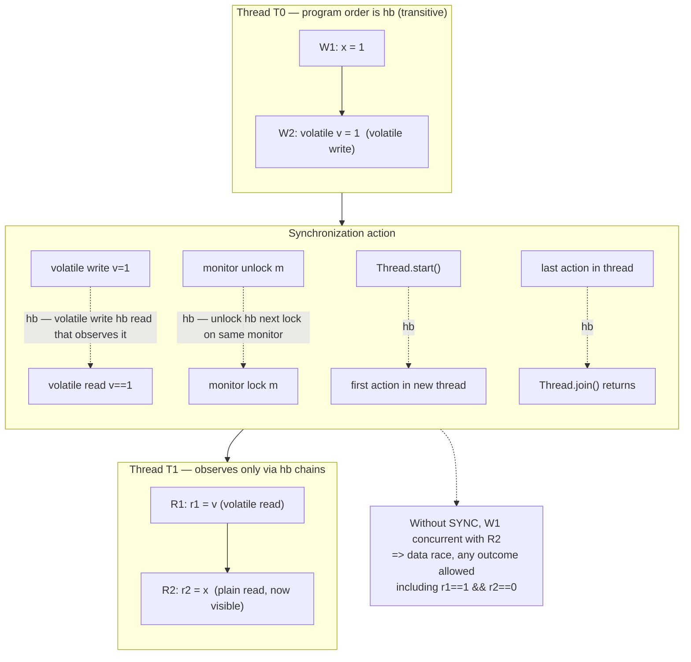
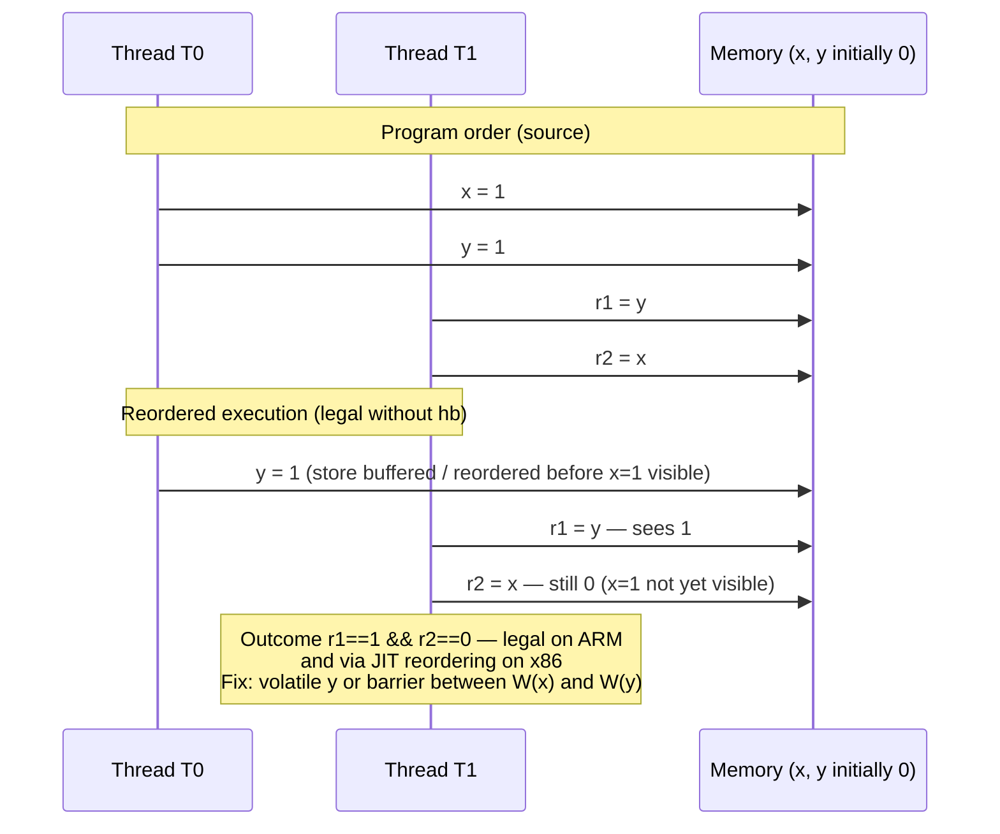
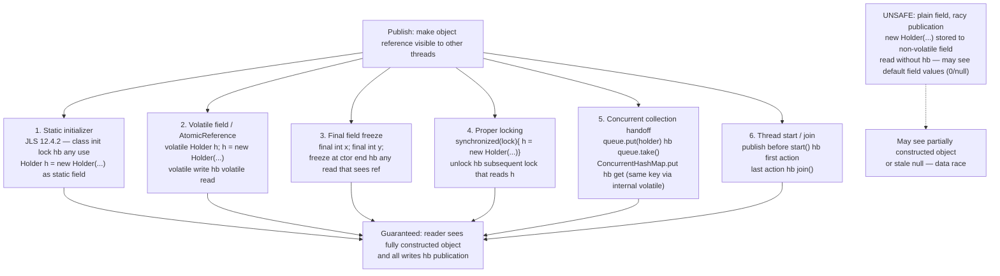
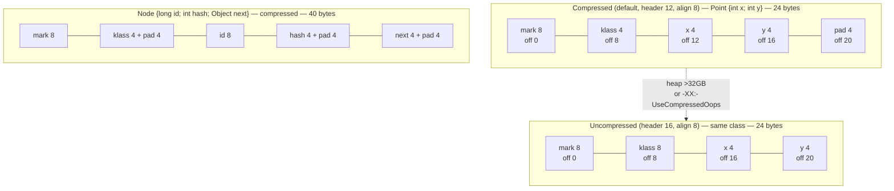
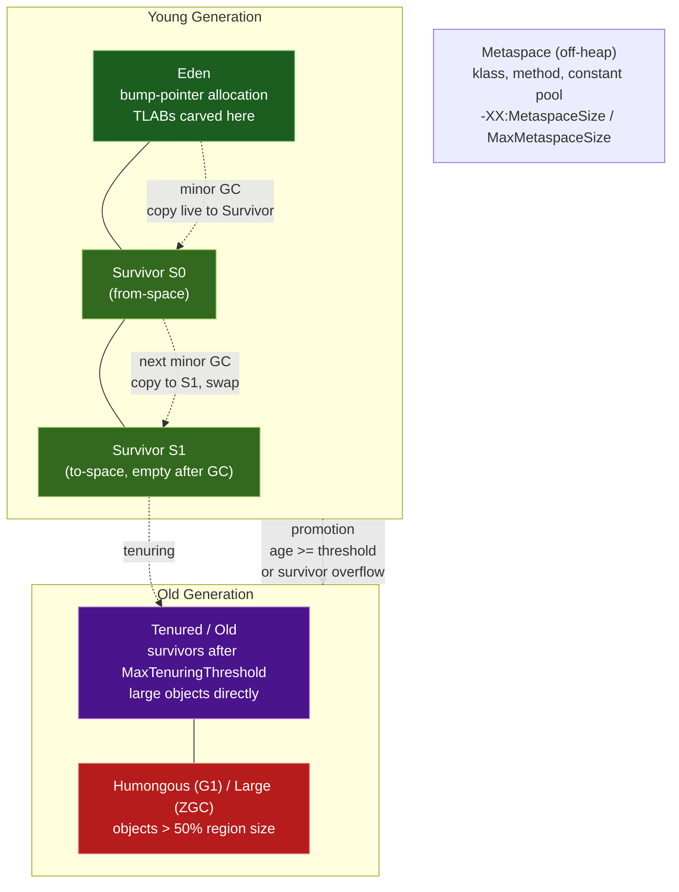
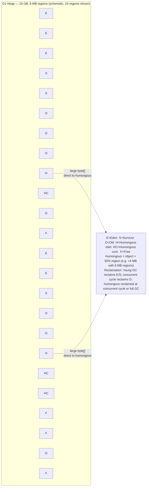
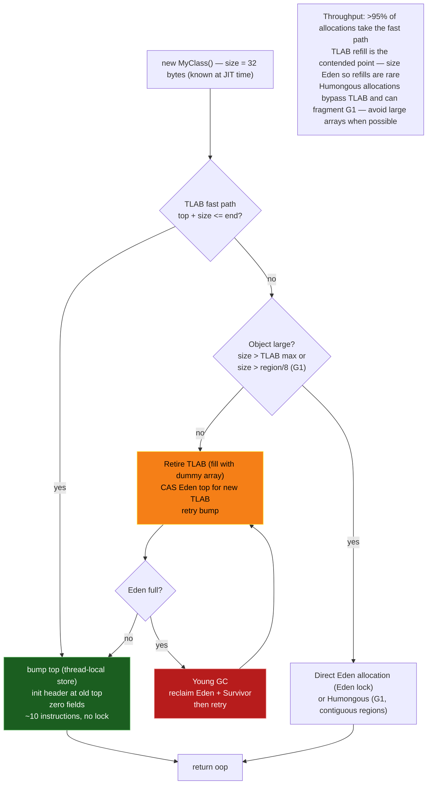
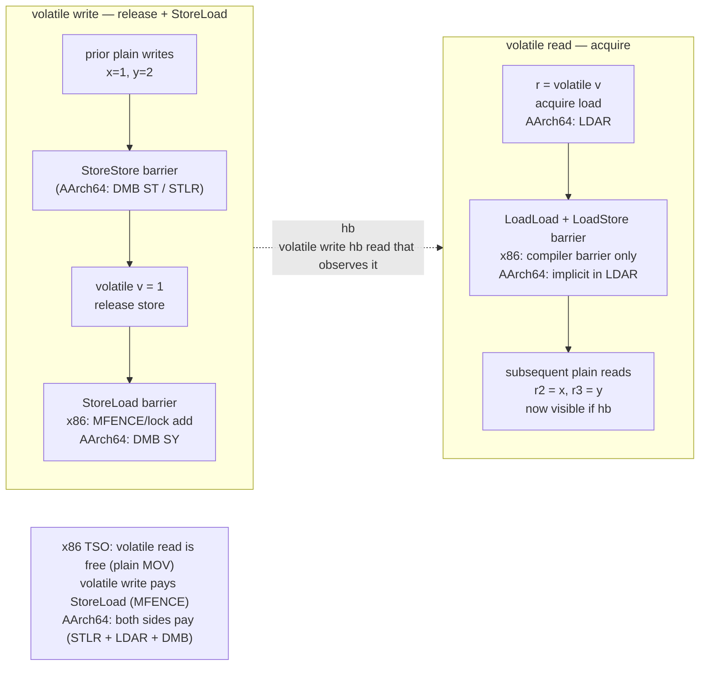

# Chapter 3 — The Java Memory Model, Object Layout, and Heap Organization

**What this chapter covers.** Every interesting JVM backend shares mutable state across threads — config snapshots, caches, connection pools, metrics counters, request queues — and allocates millions of objects per second into a managed heap that must hide hardware reordering and GC pauses. The contract that makes this safe is the Java Memory Model (JMM), and the cost of that contract is encoded in every object header and heap region. This chapter opens both: the formal happens-before model that tells you when a write in one thread becomes visible in another, and the concrete HotSpot implementation that makes allocation fast — mark words, klass pointers, compressed oops, field reordering, JOL-verified layouts, TLABs, generational regions, humongous objects, and the memory barriers that connect the JMM to silicon.

Learning goals — after this chapter you should be able to:

- State the JMM happens-before relation precisely, enumerate every edge the JLS guarantees (program order, monitor, volatile, thread start/join, interruption, finalizers, transitive closure), and prove or refute visibility for any two accesses.
- Explain visibility, reordering, and data races in terms of compiler, JIT, and hardware (x86 TSO vs. ARM weak ordering), and predict which litmus-test outcomes are legal under the JMM.
- Classify publication as safe or unsafe, apply the four safe-publication idioms (static initializer, volatile, final-field freeze, proper locking), and diagnose unsafe publication with tests rather than reasoning by example.
- Describe `final` field semantics — freeze action, safe publication of immutable objects, and the `String`/`record` guarantees that depend on them.
- Diagram HotSpot object layout on 64-bit: mark word, klass pointer, compressed vs. uncompressed modes, field reordering, object alignment, and array headers; interpret `JOL` output for any class.
- Explain heap organization — Eden/Survivor/Old, G1/ZGC/Shenandoah regions, TLAB allocation fast/slow paths, humongous objects — and how it drives allocation and collection costs.
- Name the four memory barriers (`LoadLoad`, `LoadStore`, `StoreStore`, `StoreLoad`), map `volatile`/`VarHandle` access modes to barriers on x86 and AArch64, and distinguish JMM barriers from GC barriers (SATB, pre/post barriers).

> **Placement.** Chapter 1 gave the classfile and execution model; Chapter 2 traced class loading and linking. This chapter is the concurrency-and-memory foundation for everything that follows: Chapter 4 (GC algorithms assume the heap layout and barriers described here), Chapter 5 (the JIT reorders subject to the JMM and intrinsifies `VarHandle`), and Chapter 6 (threads, monitors, `VarHandle`, Loom, and structured concurrency build directly on happens-before). Familiarity with Volume 4, Chapter 3 (hardware memory models) and Volume 17, Chapter 6 (Go memory model) helps but is not required.

---

## 1. Why the JMM and heap layout matter at backend scale

On a single thread the JVM is simple: bytecode executes in program order and allocation is `new`. In a backend service that model breaks in three places simultaneously:

1. **The JIT compiler** reorders loads and stores, eliminates dead stores, hoists loop-invariant reads, and inlines through publication boundaries — all legal under the as-if-serial rule for a single thread, all capable of breaking a racy multi-threaded program.

2. **The processor** reorders. x86 is Total Store Order (TSO): stores become visible in order but a later load can bypass an earlier store. AArch64 (Graviton, the cost-optimized default in many fleets) is weakly ordered: almost any reordering of independent accesses is observable unless a barrier intervenes.

3. **The heap** is shared and generational. Every core allocates into the same Eden, every GC moves objects, and every reference must remain valid across compaction. Headers, compressed pointers, and TLABs are not trivia — they determine object footprint, cache-line density, allocation latency, and how large a heap you can run before compressed oops collapse.

The JMM is the contract between your code and these three actors. If you establish happens-before edges between conflicting accesses, the JVM guarantees visibility and ordering. If you do not, you have a **data race** and the program's behavior is not merely "eventually consistent" — the JLS declares it unconstrained for those locations. A config-reload thread that writes a plain `Map` reference and an HTTP handler that reads it can observe a partially constructed map, a `null` field of a non-null object, or a stale cache forever — and it will pass every test on x86 before failing on AArch64 at 3 AM.

> **Backend lens.** A single microservice handles 10k–100k requests per second, each allocating hundreds of objects. TLAB contention, humongous allocations, and false publication show up as p99 outliers, not averages. Understanding headers and heap regions is how you read a flame graph, size a heap for G1/ZGC, and explain why a 34 GB heap is slower than a 26 GB one.

---

## 2. The Java Memory Model: happens-before

The authoritative reference is JLS 17, Chapter 17 (Threads and Locks), and JSR-133 (the Manson–Pugh model, 2004, still current). It fits in a few pages and every backend JVM engineer should have read it once.

### 2.1 The relation

The JMM defines a **happens-before** (`hb`) relation — a strict partial order over memory actions (reads, writes, lock/unlock, volatile accesses, thread start/join):

- If action *a* happens-before action *b*, then the effects of *a* (all prior writes by its thread) are visible to *b*, and *b* observes *a* as preceding it.
- `hb` is **transitive**: if `a hb b` and `b hb c`, then `a hb c`.
- `hb` is **not total**: many actions are concurrent (unordered). Two concurrent conflicting accesses (same location, at least one write) constitute a **data race**.

Within a single thread the model guarantees **as-if-serial** semantics: the thread behaves as if actions occurred in program order, regardless of actual reordering. Across threads, only `hb` edges provide ordering.

### 2.2 The five canonical edges

JLS 17.4.5 enumerates the edges. Memorize this table — during review you are hunting for which row justifies each visibility claim.

| Edge | Rule | Intuition |
|------|------|-----------|
| **Program order** | If *x* and *y* are actions of the same thread and *x* precedes *y* in program order, then *x* `hb` *y*. | Single-thread semantics. Writes before later reads in the same thread are always visible. |
| **Monitor (synchronized)** | An unlock on monitor *m* `hb` every subsequent lock on *m*. | The `n`th `unlock` `hb` the `(n+1)`th `lock`. All writes before the unlock are visible after the lock. |
| **Volatile** | A write to volatile *v* `hb` every subsequent read of *v* that observes that write. | Volatile is a linearization point. Volatile write = release, volatile read = acquire. |
| **Thread start / join** | `Thread.start()` `hb` the first action in the started thread. Any action in a thread `hb` `Thread.join()` that returns after that thread terminates. `Thread.isAlive()` returning `false` similarly synchronizes. | Publishing via thread creation; observing termination. |
| **Transitivity** | If *a* `hb` *b* and *b* `hb` *c*, then *a* `hb` *c*. | Chaining publication: `W(x) hb volatile-write hb volatile-read hb R(x)` makes `W(x)` visible at `R(x)`. |
| **Interruption / finalizer / default** | `Thread.interrupt()` `hb` detection of interruption (`isInterrupted()`, `InterruptedException`); constructor end `hb` `finalizer` start; writes to `final` fields (freeze) `hb` reads that see the correctly constructed object. | Less commonly relied upon, but part of the formal model. |

There is no general `hb` edge for a plain write followed by a plain read, for `Atomic*` plain modes, for `ConcurrentHashMap.get` vs. `put` on different keys, or for any framework "eventually" — only the rows above (and their `java.util.concurrent` implementations that internally use `volatile`/`synchronized`/`VarHandle` release-acquire).

### 2.3 Happens-before graph



Transitivity is the workhorse. The common publish pattern:

```
T0:  x = 42          // W(x)  — plain write
T0:  volatileReady = true  // VW — volatile write
                    // W(x) hb VW  (program order)
T1:  if (volatileReady)    // VR — volatile read observing VW, so VW hb VR
T1:      use(x)            // R(x) — VR hb R(x) (program order)
                    // therefore W(x) hb R(x) — x==42 guaranteed
```

Remove `volatile` and every guarantee vanishes, even though the write to `x` precedes the write to `ready` in source order.

### 2.4 What `hb` does not guarantee

- **No total order.** Two `volatile` writes to *different* variables are ordered only through program order within each thread; a third thread can observe them in either order unless additional synchronization creates a total order. Total order over all volatile accesses is guaranteed only for accesses to the *same* volatile variable, and for `VarHandle` `volatile`/`acquire`/`release` modes defined in JLS 17 extensions.
- **No causality beyond `hb`.** Out-of-thin-air values are prohibited — the JMM's causality rules forbid a read seeing a value that was never written — but plain racy reads can see stale values arbitrarily long.
- **No progress guarantee.** `hb` is about visibility when an action *does* occur, not about liveness. A spin loop on a plain flag (`while (!done) {}`) may be hoisted to `if (!done) while(true) {}` by the JIT, never observing the update, even though the write `hb` nothing.

---

## 3. Visibility, reordering, and data races

### 3.1 Who reorders

Three independent agents reorder your program, subject only to single-thread as-if-serial correctness:

| Agent | What it reorders | Constraint without `hb` |
|-------|-----------------|-------------------------|
| **javac / JIT (C2/Graal)** | Load–load, load–store, store–store; eliminates, hoists, sinks, and common-subexpresses memory operations across branches and loops. | May reorder any two plain accesses to different locations; may not reorder across a volatile/monitor boundary or a `VarHandle` opaque/acquire/release fence. |
| **Processor (x86 TSO)** | StoreLoad only (a later load can bypass an earlier store via the store buffer). Loads and stores otherwise ordered. | `StoreLoad` reordering observable — the classic Dekker / double-checked-locking failure on x86. |
| **Processor (AArch64 weak)** | LoadLoad, LoadStore, StoreStore, StoreLoad — almost any pair of independent accesses can appear reordered. | Any litmus outcome without a barrier is legal; acquire loads and release stores provide only pairwise ordering. |

The JIT is often the bigger source of surprises than the CPU. A field read hoisted out of a loop, a null check eliminated because the JIT proved non-null on the fast path — these produce "impossible" values that no hardware litmus test predicts.

### 3.2 Reordering illustrated



The classic four litmus tests (each `hb`-free by default):

```java
// StoreStore — can T1 see y==1 before x==1?
//   T0: x=1; y=1;     T1: r1=y; r2=x;   Outcome r1==1 && r2==0 legal?  YES on ARM, NO on x86 (TSO orders stores)

// LoadLoad — can loads be reordered?
//   T0: x=1;          T1: r1=y; r2=x; // if T0 also does y=1 after x=1, same StoreStore case.

// StoreLoad — Dekker / double-checked locking hump
//   T0: x=1; r1=y;    T1: y=1; r2=x;   Outcome r1==0 && r2==0 legal?  YES on both x86 and ARM
//   This is why DCL needs volatile — StoreLoad is the only x86 reordering.

// Independent — no dependency
//   T0: x=1;          T1: y=1;        No race (different locations), but publication of x via y needs hb.
```

All four outcomes (`r1==0/1 × r2==0/1`) are legal without `hb`. Making `y` volatile establishes `W(x) hb W(y,vol) hb R(y,vol) hb R(x)`, restricting outcomes to `r1==1→r2==1` or `r1==0→r2==0`.

### 3.3 Data race vs. race condition

A **data race** is a formal JMM term: conflicting accesses, at least one write, concurrent (no `hb`). Its consequence is loss of all visibility guarantees for those locations — the JIT may assume data-race-free execution and optimize accordingly (roach-motel semantics: the JIT may move plain accesses *into* a synchronized block but not *out of* it).

A **race condition** is a semantic bug: timing-dependent correctness even with proper `hb` (e.g., two threads both `check-then-act` under correct locking but with a logical window). Fixing a data race does not fix a race condition, and vice versa.

---

## 4. Safe publication, unsafe publication, and `final` field semantics

### 4.1 Unsafe publication — the default is broken

```java
// UNSAFE — do not do this. Demonstrates the failure mode every backend must recognize.
class Holder {
    int x;
    int y;
    Holder(int x, int y) { this.x = x; this.y = y; }
}

// Publisher thread
Holder h; // plain, non-volatile, non-final field
void publish() {
    h = new Holder(1, 2); // allocation + construction + publication — three steps
}

// Reader thread
void use() {
    Holder r = h;
    if (r != null) {
        // May see r.x==0 || r.y==0, or even a partially constructed object,
        // because construction (W(x),W(y)) has no hb to R(x),R(y).
        System.out.println(r.x + " " + r.y);
    }
}
```

Three things can go wrong, *all* legal under the JMM:

1. **Reordering:** `h = ref` can become visible before `x=1; y=2` complete (store-store reordering through the allocator + JIT).
2. **Staleness:** Reader may see `h == null` forever (no `hb`, no visibility guarantee — `h` lives in a core's store buffer / cache).
3. **Thin-air / torn reference:** On 32-bit JVMs a plain `long`/`double` write can tear; on 64-bit, references are atomic but the *object's fields* are not.

The same bug appears in the infamous **double-checked locking** (DCL) anti-pattern:

```java
// BROKEN DCL — classic interview trap that still appears in production caches
class Singleton {
    private static Singleton instance; // plain!
    static Singleton get() {
        if (instance == null) {                // R1 — racy read
            synchronized (Singleton.class) {
                if (instance == null)
                    instance = new Singleton(); // W — allocation + ctor + store
            }
        }
        return instance; // may return partially constructed Singleton
    }
}
```

The fix is exactly one word:

```java
private static volatile Singleton instance; // volatile write hb volatile read
// Now: construction hb volatile write hb volatile read hb field reads — safe.
```

### 4.2 Safe publication patterns



| Pattern | Mechanism | When to use |
|---------|-----------|-------------|
| **Static initializer** | Class-initialization lock (JLS 12.4.2) — the JVM holds a lock during `<clinit>`; any thread that uses the class `hb` after init completes. | Singletons, static caches, `static final Holder H = new Holder(...)` — the simplest safe publication; prefer it. |
| **`volatile` / `AtomicReference`** | Volatile write `hb` volatile read. | Lazy singletons (DCL with `volatile`), config snapshots swapped atomically: `volatile Config cur = load();` readers do plain `Config c = cur;` (volatile read) then use `c`'s final fields. |
| **`final` fields** | Freeze action at constructor end `hb` any read that sees the reference *and* does not leak `this` during construction. | Immutable value objects, `record`s, `String`, event objects — the most efficient safe publication (no barrier on the read path). |
| **Locking** | Unlock `hb` next lock on same monitor. | Mutable shared state with invariants spanning multiple fields (`size` + `array`, `map` + `version`). |
| **Concurrent collection** | Library establishes internal `volatile`/`VarHandle` edges (`put` hb `get` for same key in `ConcurrentHashMap`, `put` hb `take` in `BlockingQueue`). | Handoff between threads — task queues, caches, pub/sub. Document which collection gives which guarantee. |
| **Thread start/join, `Future`** | `start()` `hb` thread entry; task completion `hb` `Future.get()` return. | One-shot publication: build in one thread, hand off via `Future`/`CompletableFuture`. |

### 4.3 `final` field semantics — the freeze

`final` fields have stronger semantics than "assign once" (JLS 17.5). The model introduces a **freeze** action at the end of the constructor that `hb` any read of that `final` field through a reference that did not escape before the freeze.

```java
final class Config {
    final int timeoutMs;
    final String endpoint; // final reference — guarantees visible state of the String too (transitively)
    final Map<String,String> labels; // final reference to mutable map — only the reference is frozen, not the map's contents!

    Config(int t, String e) {
        this.timeoutMs = t;
        this.endpoint = e;
        this.labels = Map.of("env","prod"); // immutable snapshot — safe
        // ---- freeze ----  hb any thread that later reads a Config reference published safely
    }
}

// Safe publication of Config via data-race-free publication of the reference:
volatile Config CURRENT = new Config(3000, "https://api.internal");

// Reader — no lock, no volatile read of fields, just the reference:
Config c = CURRENT;           // volatile read — hb chain includes freeze
int t = c.timeoutMs;          // guaranteed 3000, not 0
// c.labels is also the correctly constructed Map — because freeze hb the publish.
```

Rules that still catch seniors:

- **No `this` escape.** If the constructor publishes `this` (stores it to a static, starts a thread, registers a listener), the freeze may not `hb` the reader — the reader can see default `final` values (0/`null`). Static analysis (`ErrorProne` `ConstructorLeaksThis`) catches this.
- **Only the `final` fields themselves are frozen.** A `final Map` guarantees the reference, not the map's interior mutability. Publish an *immutable* snapshot (`Map.copyOf`, `List.copyOf`, Guava `ImmutableMap`) or treat the field as effectively immutable after construction.
- **Deserialization / reflection / `Unsafe` can bypass `final`.** `Unsafe.putObject`, `Field.setAccessible` on `final`, and some serialization paths assign `final` fields outside the constructor — the freeze guarantee does not apply. Prefer constructors and records.
- **`record` and `String` rely on this.** `record Point(int x, int y)` has implicitly `final` fields with the same freeze. `String`'s `final byte[] value` (compact strings) is safe to share precisely because of `final` freeze + safe publication through the string table / interning.

Freeze sequence: `W(timeoutMs) hb W(endpoint) hb freeze hb volatile-write(CURRENT) hb volatile-read(r=CURRENT) hb R(r.timeoutMs)` — transitive `hb` ensures the reader sees `3000` and a non-null `endpoint`. If `CURRENT` were plain or `this` escaped in the constructor, the chain breaks and `0`/`null` is legal.

### 4.4 `jcstress` — proving visibility, not hoping for it

Testing concurrency by running a loop and checking "it never failed" proves nothing — a racy program can pass a million iterations on x86 and fail on the first run on AArch64. `jcstress` (OpenJDK Code Tools) enumerates outcomes under stress and reports which are legal under the JMM.

```java
// jcstress test: unsafe publication vs. safe publication via volatile.
// Run: mvn -pl jcstress-samples clean test -Dtest=PublicationTest
import org.openjdk.jcstress.annotations.*;
import org.openjdk.jcstress.infra.results.IntResult1;

@JCStressTest
@Outcome(id = "1", expect = Expect.ACCEPTABLE, desc = "Saw fully constructed object")
@Outcome(id = "0", expect = Expect.ACCEPTABLE_INTERESTING, desc = "Saw default value — unsafe publication")
@State
public class PublicationTest {

    // --- Unsafe variant ---
    static class Holder { int x; Holder(int x){ this.x = x; } }
    Holder holder; // plain — unsafe publication

    @Actor
    public void publisher() {
        holder = new Holder(1);
    }

    @Actor
    public void reader(IntResult1 r) {
        Holder h = holder;
        r.r1 = (h == null) ? -1 : h.x; // -1=null, 0=default, 1=correct
    }

    // --- Safe variant (separate test class, shown inline for comparison) ---
    @JCStressTest
    @Outcome(id = "1", expect = Expect.ACCEPTABLE, desc = "Always correct")
    @State
    public static class SafePublicationTest {
        static class SafeHolder { final int x; SafeHolder(int x){ this.x = x; } }
        volatile SafeHolder holder; // volatile + final field

        @Actor public void publisher() { holder = new SafeHolder(1); }
        @Actor public void reader(IntResult1 r) {
            SafeHolder h = holder;
            r.r1 = (h == null) ? -1 : h.x; // never 0 — freeze + volatile hb
        }
    }
}
```

Expected `jcstress` output (schematic):

```
Unsafe variant:
  Result -1 (null)           — acceptable (reader ran first)
  Result  0 (default x==0)   — INTERESTING — unsafe publication observed
  Result  1 (x==1)           — acceptable
  *** Interesting results observed — publication is unsafe ***

Safe variant:
  Result -1 (null)           — acceptable
  Result  1 (x==1)           — acceptable
  *** No interesting results — publication is safe ***
```

Additional litmus jcstress sketch — volatile ordering:

```java
@JCStressTest
@Outcome(id = "0, 0", expect = Expect.ACCEPTABLE, desc = "Both saw 0 — reordered")
@Outcome(id = "1, 1", expect = Expect.ACCEPTABLE, desc = "Both saw 1")
@Outcome(id = "0, 1", expect = Expect.ACCEPTABLE, desc = "T1 saw 1, T2 saw 0")
@Outcome(id = "1, 0", expect = Expect.ACCEPTABLE, desc = "T1 saw 0, T2 saw 1 — only with volatile is this forbidden for some patterns")
@State
public class StoreLoadTest {
    int x, y;
    volatile int vy; // make y volatile to forbid r1==1 && r2==0

    @Actor public void actor1(IntResult2 r) { x = 1; vy = 1; }
    @Actor public void actor2(IntResult2 r) { r.r1 = vy; r.r2 = x; }
    // With plain y, r1==1 && r2==0 is observable. With volatile vy, it is forbidden (hb).
}
```

> **Backend recipe:** Gate every shared-mutable publication path with a jcstress test in CI (or at least a `jcstress`-style stress loop). One test that asserts "no `INTERESTING` outcome" is worth more than a thousand "it works on my laptop" runs. See Chapter 6 for structured concurrency and `VarHandle` test patterns.

---

## 5. Object layout: headers, compressed oops, field reordering

Every `new` produces a HotSpot `oop` (ordinary object pointer) — a contiguous, 8-byte-aligned region of heap. Its prefix is the **object header**; its suffix is the instance fields and alignment padding.

### 5.1 The mark word

The first word of every object is the **mark word** (`markWord.hpp`, `oopDesc`). It multiplexes GC, locking, and identity hash code. On 64-bit HotSpot (JDK 21, biased locking removed since JDK 15 / JEP 374):

```
64-bit mark word (little-endian, HotSpot 21, UseCompressedOops on):

  Unlocked, no hash:
  ┌──────────────────────────────────────────────────────────┬───┬───┐
  │                    unused (62 bits)                      │0 0│01 │  biased_lock=0, lock=01
  └──────────────────────────────────────────────────────────┴───┴───┘

  Unlocked, hash computed (hash:25 bits, age:4 bits):
  ┌──────────────┬──────────────┬──────────────┬─────────────┬───┐
  │ hash (25)    │ age (4)      │ unused (30)  │ 0           │01 │
  └──────────────┴──────────────┴──────────────┴─────────────┴───┘

  Lightweight locked (stack lock / thin lock):
  ┌──────────────────────────────────────────────────────────────┬──┐
  │  pointer to lock record on owning thread's stack (62 bits) │00│  lock=00
  └──────────────────────────────────────────────────────────────┴──┘

  Heavyweight (inflated monitor):
  ┌──────────────────────────────────────────────────────────────┬──┐
  │  pointer to ObjectMonitor* (62 bits)                        │10│  lock=10
  └──────────────────────────────────────────────────────────────┴──┘

  GC forwarding (during copy):
  ┌──────────────────────────────────────────────────────────────┬──┐
  │  forwarding pointer to new location (62 bits)               │11│  lock=11
  └──────────────────────────────────────────────────────────────┴──┘

  Age field (4 bits, max 15): incremented at each Young GC survival; compared to
  -XX:MaxTenuringThreshold (default 15 with Parallel/G1) to decide promotion.
```

Historical note: **biased locking** (mark bit `101`) was removed in JDK 15. On JDK 8 you will still see `biased_lock=1` in JOL; on JDK 17+/21 the bit is repurposed and the mark is `01` when unlocked. When reading older posts or JOL output from JDK 8, expect the bias epoch and thread ID in the mark — do not confuse it with current layout.

The mark word is mutated with CAS. Computing `System.identityHashCode(o)` on an unlocked object CASes the hash into the mark; locking inflates the monitor and moves the hash into the `ObjectMonitor`.

### 5.2 Klass pointer and compressed class pointers

The second word is the **klass pointer** — a pointer to the `InstanceKlass` metadata in Metaspace that describes the object's class (vtable, field layout, GC map). On 64-bit:

- **Uncompressed** (`-XX:-UseCompressedClassPointers`): 8 bytes, full 64-bit pointer.
- **Compressed** (default, `-XX:+UseCompressedClassPointers`): 4 bytes, encoded as `(klass_base + index << 3)`. Like compressed oops, it saves 4 bytes per object header.

```
Header size:
  64-bit, compressed class pointers (default, heap < 32 GB):  12 bytes (8 mark + 4 klass)
    + 4 bytes padding to reach 8-byte alignment before fields → effective header 12, fields start at offset 12, object size rounded to 8
  64-bit, uncompressed:                                       16 bytes (8 mark + 8 klass)
  32-bit:                                                      8 bytes (4 mark + 4 klass)

JOL reports this as "object header: 12 bytes (8 + 4 + 0 padding)" vs. "16 bytes (8 + 8)".
```

### 5.3 Compressed oops

**Compressed ordinary object pointers** (`UseCompressedOops`, default when `MaxHeapSize < ~32 GB`) store references as 32-bit scaled offsets from the heap base, not 64-bit pointers:

```
Compressed oop encoding (HotSpot, globals.hpp):
  narrowOop = (oop - heapBase) >> LogMinObjAlignmentInBytes   // shift = 3 (8-byte alignment)
  oop       = heapBase + (narrowOop << 3)

Zero-based compressed oops (heapBase == 0, heap < 4 GB or < 32 GB with shift):
  oop = narrowOop << 3   // no add — single shift, fastest path

Heap sizing cliffs:
  < 4 GB   : zero-based, shift 0 or 3 — narrowOop addresses entire heap without base
  4–32 GB  : zero-based with shift 3 — 32-bit narrowOop << 3 covers 32 GB (2^32 * 8)
  > 32 GB  : compressed oops disabled automatically — references become 8 bytes, header grows to 16 bytes, object footprint ~20-40% larger
```

That cliff is an operational fact: a heap sized at 34 GB can be *slower and larger* than one sized at 26 GB, because every reference doubles in size and every object header grows by 4 bytes. Size heaps at 24–26 GB or jump to 48+ GB only when genuinely needed — see Chapter 12.

### 5.4 Field layout, reordering, and alignment

HotSpot reorders fields by size to fill alignment gaps: `long`/`double` (8) → `int`/`float` (4) → `short`/`char` (2) → `byte`/`boolean` (1) → `oops` (4 compressed / 8 uncompressed). Within each group, declaration order is preserved; groups interleave to minimize padding. A `byte` field can occupy the 4-byte gap after a compressed klass pointer. Object size is `alignUp(header + fields, 8)` (or 16 with large heaps). `@Contended` (JEP 142, `-XX:-RestrictContended`) isolates cache-line-contended fields at 64–128 bytes per field — use only for hot counters and queue indices.

### 5.5 Array layout

Arrays have an extra 4-byte `length` field between the header and the elements:

```
Object array (compressed):
  offset 0:  mark word (8)
  offset 8:  klass pointer (4)
  offset 12: length (4)        ← array length, not element count header — always 4 bytes
  offset 16: elements[0..n-1]  ← 4 bytes each (compressed oop), or 8 if uncompressed
  size = alignUp(16 + n*elemSize, 8)

Primitive array (e.g., byte[]):
  offset 0:  mark (8)
  offset 8:  klass (4)
  offset 12: length (4)
  offset 16: bytes[0..n-1]     ← 1 byte each, packed, no per-element header
  size = alignUp(16 + n, 8)

boolean[] is bytes internally (1 byte per element); HotSpot does not bit-pack.
```

JOL makes this concrete:

```bash
# Add JOL as a test dependency (Maven):
# <dependency><groupId>org.openjdk.jol</groupId><artifactId>jol-core</artifactId><version>0.17</version></dependency>

java -jar jol-cli.jar internals java.util.ArrayList
java -jar jol-cli.jar layout -v java.lang.String
java -cp jol-core.jar:target/classes org.openjdk.jol.Main layout com.example.MyClass
```

### 5.6 JOL output — reading it

```java
import org.openjdk.jol.info.ClassLayout;
import org.openjdk.jol.vm.VM;

public class JolDemo {
    static class Point { int x; int y; }                          // two ints
    static class Node  { long id; int hash; Object next; }        // mixed
    static class Padded implements Cloneable { byte b; long v; byte c; } // reordering demo

    public static void main(String[] args) {
        System.out.println(VM.current().details());
        System.out.println(ClassLayout.parseClass(Point.class).toPrintable());
        System.out.println(ClassLayout.parseClass(Node.class).toPrintable());
        System.out.println(ClassLayout.parseClass(Padded.class).toPrintable());

        Point p = new Point();
        System.out.println(ClassLayout.parseInstance(p).toPrintable());
        System.out.println(ClassLayout.parseInstance(new int[4]).toPrintable());
        System.out.println(ClassLayout.parseInstance(new String("hello")).toPrintable());
    }
}
```

Representative output on **JDK 21, 64-bit, compressed oops + compressed klass, 8-byte alignment** (addresses will vary; offsets and sizes are stable):

```
# VM details:
# Running 64-bit HotSpot VM.
# Using compressed oop with 3-bit shift.
# Using compressed klass with 3-bit shift.
# Objects are 8 bytes aligned.
# Field sizes by type: 4, 1, 1, 2, 2, 4, 4, 8, 8 [bytes]

com.example.JolDemo$Point object internals:
 OFF  SZ   TYPE DESCRIPTION               VALUE
   0   8        (object header: mark)     0x0000000000000001 (non-biasable; age: 0)
   8   4        (object header: klass)    0x000010a8
  12   4    int Point.x                   0
  16   4    int Point.y                   0
  20   4        (object alignment gap)    0
Instance size: 24 bytes
Space losses: 0 bytes internal + 4 bytes external = 4 bytes total

com.example.JolDemo$Node object internals:
 OFF  SZ   TYPE DESCRIPTION               VALUE
   0   8        (object header: mark)     0x0000000000000001
   8   4        (object header: klass)    0x00001120
  12   4        (alignment/padding gap)   0
  16   8   long Node.id                   0
  24   4    int Node.hash                 0
  28   4        (alignment/padding gap)   0
  32   4 Object Node.next                 null
  36   4        (object alignment gap)    0
Instance size: 40 bytes
Space losses: 0 bytes internal + 4 bytes external = 4 bytes total
  // Note: longs first (offset 16), then ints, then oops — not source order.

com.example.JolDemo$Padded object internals:
 OFF  SZ   TYPE DESCRIPTION               VALUE
   0   8        (object header: mark)     0x0000000000000001
   8   4        (object header: klass)    0x00001188
  12   1   byte Padded.b                  0
  13   1   byte Padded.c                  0
  14   2        (alignment/padding gap)   0
  16   8   long Padded.v                  0
Instance size: 24 bytes
Space losses: 2 bytes internal + 0 bytes external = 2 bytes total
  // Source order was byte, long, byte — HotSpot reordered to long first, bytes packed after header.

[I object internals:
 OFF  SZ   TYPE DESCRIPTION               VALUE
   0   8        (object header: mark)     0x0000000000000001
   8   4        (object header: klass)    0x00000890
  12   4        (array length)            4
  16  16    int [I.<elements>             N/A
Instance size: 32 bytes

java.lang.String object internals:
 OFF  SZ      TYPE DESCRIPTION               VALUE
   0   8           (object header: mark)     0x0000000000000001
   8   4           (object header: klass)    0x00000fd8
  12   4           (alignment/padding gap)   0
  16   4    byte[] String.value              null
  20   1      byte String.coder              0
  21   1   boolean String.hashIsZero         false
  22   2           (alignment/padding gap)   0
  24   4       int String.hash               0
Instance size: 32 bytes
  // String is 32 bytes + the byte[] payload (header 16 + length*1, compact strings since JDK 9).
```

Reading the columns:

- `OFF` — byte offset from object start. Fields at `12` are packed into the padding after the compressed klass. HotSpot reorders to minimize gaps, but never violates alignment: `long`/`double` at 8-byte offsets, `int` at 4-byte, `short`/`char` at 2-byte, `oop` at 4 or 8-byte.
- `SZ` — field size in bytes (4 for compressed oop, 8 for uncompressed).
- `Instance size` — `alignUp(header + fields + padding, 8)`. Every object is a multiple of 8 bytes; with `-XX:ObjectAlignmentInBytes=16` (large heaps), multiples of 16.



---

## 6. Heap organization: generations, TLABs, and regions

### 6.1 The generational hypothesis

Most objects die young. Backend services confirm this: request-scoped DTOs, `byte[]` buffers, iterators, and lambda captures rarely survive one Young GC. The heap exploits this by segregating by age:

```
Logical generations (Parallel / G1 / CMS historical):
  Young ── Eden (new allocations) + Survivor S0/S1 (copying, age count)
  Old   ── tenured survivors + large objects
  Metaspace (off-heap since JDK 8) — class metadata, not part of the GC heap

G1 / ZGC / Shenandoah — region-based, no fixed Young/Old boundary:
  Heap = array of equal-size regions (1–32 MB, -XX:G1HeapRegionSize)
  Each region is Eden OR Survivor OR Old OR Humongous OR Free
  Collection sets are chosen per pause goal, not by fixed generation sizes
```



Survivor mechanics (Parallel / G1 Young):

- **Eden** fills via TLAB bump allocation until full, then a **minor GC** copies live Eden + `from` Survivor objects into `to` Survivor, incrementing their age (mark word `age` field, 4 bits → max 15).
- When `age >= MaxTenuringThreshold` (default 15, G1/Parallel) or `to` Survivor overflows, the object is **promoted** (copied) to Old.
- `SurvivorRatio` (default 8) sets `Eden : Survivor` = 8:1 each, so Young = Eden + 2×Survivor. `-XX:TargetSurvivorRatio` controls desired occupancy.

Region-based heaps (G1, ZGC, Shenandoah) replace contiguous generations with a **region array**:

```
G1 heap (example: -Xmx16g -XX:G1HeapRegionSize=8m → 2048 regions):
  Region 0: Eden       Region 1: Eden       Region 2: Survivor   Region 3: Old
  Region 4: Old        Region 5: Free       Region 6: Humongous starts (2 regions)  Region 7: Humongous contin...
  Humongous: any object > 50% region size (e.g., >4 MB with 8 MB regions) — allocated directly as contiguous humongous regions in Old, not in Eden. Large byte[] / arrays are the common case. G1 reclaims humongous regions only at global concurrent cycles — they can pin Old and cause fragmentation.

ZGC / Shenandoah: colored pointers + load barriers, no fixed Young/Old split in the same sense (generational ZGC, JEP 474, adds generations atop the region model — see Chapter 4).
```



### 6.2 TLAB — allocation without contention

Allocation must be fast: a backend allocating 1 GB/s cannot take a lock per `new`. The **Thread-Local Allocation Buffer** (TLAB) makes it a bump pointer:

```java
// Conceptual TLAB (HotSpot: thread.cpp, CollectedHeap, ThreadLocalAllocBuffer)
// Each Java thread owns a TLAB carved from Eden — a contiguous [top, end) slice.

class TLAB {
    byte[] eden;      // the Eden region
    long top;         // bump pointer — next free byte
    long end;         // limit of this TLAB
    long pfTop;       // prefetch watermark

    // Fast path — inlined by JIT, ~10 instructions on x86/AArch64, no lock, no CAS
    Object allocate(int size) {
        long t = top;
        long newTop = t + size;
        if (newTop <= end) {   // fits in TLAB?
            top = newTop;       // bump — single store, thread-local, no barrier
            // init mark word, klass, zero fields — then return oop at t
            return oopAt(t);
        }
        return allocateSlow(size); // TLAB refill — may CAS Eden top if -XX:-UseTLAB? No, TLAB refill takes Eden lock
    }
}
```

Actual HotSpot fast path (x86_64 assembly, `tlab.c`, `c1_LIRAssembler` / `c2 macroAssembler` — schematic):

```asm
; r15 = current thread, r15->tlab.top in [r15 + offsetTop], r15->tlab.end in [r15 + offsetEnd]
mov  rax, [r15 + topOffset]     ; load top
mov  rbx, rax
add  rbx, objectSize            ; newTop = top + size (size is constant for known class)
cmp  rbx, [r15 + endOffset]     ; fits?
ja   slowPath                   ; no — refill TLAB
mov  [r15 + topOffset], rbx     ; bump top — no lock, thread-local
; initialize header at [rax]: mark word, klass, zero fields
mov  qword ptr [rax], 0x01      ; mark word (unlocked)
mov  dword ptr [rax+8], klassId ; compressed klass
; ... zero remaining fields ...
; rax is the new oop
```

Slow path (`allocateSlow`, `ThreadLocalAllocBuffer::make_parsable`, `CollectedHeap::allocate_new_tlab`):

1. Retire current TLAB (fill remainder with a dummy int array so the heap remains parsable for GC).
2. Request a new TLAB from Eden: CAS `Eden.top` (shared, contended — Eden allocation lock or CAS on `top`).
3. If Eden is full, trigger Young GC.
4. If object is **too large for TLAB** (`> TLABWasteTargetPercent` or `> Eden/2` or `> G1HeapRegionSize/8`), allocate **directly in Eden** (outside TLAB, under Eden lock) or as **humongous** in G1.

Tuning:

| Flag | Default | Effect |
|------|---------|--------|
| `-XX:+UseTLAB` | on | Disable only to diagnose — allocation becomes Eden-locked, throughput collapses. |
| `-XX:TLABSize` | ergonomic (~64 KB–256 KB) | Initial TLAB size; HotSpot auto-tunes via `TLABWasteTargetPercent` and allocation rate. |
| `-XX:TLABWasteTargetPercent` | 1% | Fraction of Eden allowed to waste on TLAB retirement gaps. Larger → fewer refills but more fragmentation. |
| `-XX:-ResizeTLAB` | off (resizing on) | Disable adaptive TLAB sizing — rarely useful. |
| `-XX:ObjectAlignmentInBytes` | 8 | 16 on heaps > 32 GB with compressed oops disabled; changes TLAB alignment. |



> **Backend lens — sizing.** Size TLABs and Eden so that request-scoped allocations never hit the slow path mid-request. A 256 KB TLAB holds ~8k 32-byte objects — enough for a typical HTTP handler. If `jstat -gc` shows frequent Young GC and `TLABWasteTargetPercent` waste is high, Eden is too small or a single allocation site is producing humongous arrays (check with `jmap -histo` + `G1Humongous` logs: `-Xlog:gc+heap=info`).

---

## 7. Barriers: JMM barriers vs. GC barriers

The word "barrier" is overloaded. Two unrelated families share the name:

### 7.1 JMM / memory barriers (ordering barriers)

Inserted by the JIT to enforce `hb` on hardware that would otherwise reorder. Four primitives (JSR-133, `OrderAccess`, `VarHandle`):

| Barrier | Prevents | x86 cost | AArch64 cost |
|---------|----------|----------|--------------|
| `LoadLoad` | later load bypassing earlier load | free (TSO already orders loads) | `DMB LD` or `LDA` |
| `LoadStore` | later store bypassing earlier load | free | `DMB ST` |
| `StoreStore` | later store bypassing earlier store | free (stores ordered) | `DMB ST` / `STL` |
| `StoreLoad` | later load bypassing earlier store | `MFENCE` / `lock addl` / `XCHG` — **expensive** (~20–40 ns) | `DMB SY` / `STL`+`LDA` — expensive |

Mapping of Java constructs to barriers (HotSpot `OrderAccess`, `decorators.hpp`):

```
volatile write (release + StoreStore + StoreLoad):
  x86:  MOV [v], 1  +  lock addl [rsp],0  (or XCHG)  — StoreLoad fence
  AArch64: STLR [v], 1  (release store — StoreStore + LoadStore) + optional DMB for StoreLoad

volatile read (acquire + LoadLoad + LoadStore):
  x86:  MOV r, [v]  (TSO already LoadLoad+LoadStore — no extra fence, just compiler barrier)
  AArch64: LDAR r, [v]  (acquire load)

monitor enter: LoadLoad + LoadStore (acquire)    — x86: lock-prefixed CAS or XCHG
monitor exit:  LoadStore + StoreStore (release)  — x86: MOV + compiler barrier; StoreLoad via unlock protocol

VarHandle modes (java.lang.invoke.VarHandle, since JDK 9 — preferred over Unsafe, sun.misc):
  plain           — no barrier, no hb (like normal field access)
  opaque          — coherent but unordered (no hb, but eventually visible, no tearing)
  release/acquire — pairwise hb (release write hb acquire read on same var)
  volatile        — full hb, StoreLoad included

Atomic* (java.util.concurrent.atomic): volatile semantics — same barriers as volatile.
```



`VarHandle` is the modern surface for fine-grained ordering (replacing `Unsafe` and ad-hoc `volatile`):

```java
import java.lang.invoke.MethodHandles;
import java.lang.invoke.VarHandle;

class PublicationBox {
    int x; // plain field
    static final VarHandle X;
    static {
        try {
            X = MethodHandles.lookup().findVarHandle(PublicationBox.class, "x", int.class);
        } catch (ReflectiveOperationException e) { throw new Error(e); }
    }

    // Publisher — release store: prior writes hb this store, but no StoreLoad cost
    void publish(int v) {
        X.setRelease(this, v); // release — hb any acquire load that observes v
    }

    // Reader — acquire load
    int consume() {
        return (int) X.getAcquire(this); // acquire — hb subsequent plain reads
    }

    // Volatile — stronger (StoreLoad), use when publication must be immediately visible
    void publishVolatile(int v) { X.setVolatile(this, v); }
    int consumeVolatile()       { return (int) X.getVolatile(this); }

    // Opaque — cheapest, no hb, only coherence (no tearing, eventually visible)
    // Useful for progress indicators, not for publication.
    void setOpaque(int v) { X.setOpaque(this, v); }
}
```

Choose the weakest mode that still establishes the needed `hb`. For publication (`W(x) hb publish hb consume hb R(x)`), `release`/`acquire` is sufficient and cheaper than `volatile` on AArch64 (avoids `DMB SY`). For mutual exclusion or Dekker-style coordination, `volatile` (full `StoreLoad`) is required.

### 7.2 GC barriers (read/write barriers)

Inserted by the JIT to keep GC invariants while the mutator runs concurrently. They have nothing to do with JMM ordering, but they sit on the same memory accesses and show up in assembly:

| GC barrier | When | What it does |
|------------|------|--------------|
| **Pre-barrier (SATB)** | Before overwriting a reference (`obj.field = newVal`) in G1/ZGC/Shenandoah | Records the *previous* value for Snapshot-At-The-Beginning marking: `if (marking) satbQueue.enqueue(oldVal)`. Ensures a reference overwritten before the marker visits it is not lost. |
| **Post-barrier (card mark / remembered set)** | After storing a reference into Old that points to Young | Dirties the card table (`cardTable[addr>>9] = dirty`) so Young GC can find Old→Young pointers without scanning all of Old. G1's post-barrier also enqueues into the remembered-set buffer. |
| **Load barrier** | On reference load (`obj.field`, array load) in ZGC/Shenandoah | Checks colored-pointer metadata, remaps or forwards the oop if the object was moved concurrently. ZGC: `loadBarrier(obj.field)` — tests address bad mask, self-heals the reference. |
| **Strength reduction** | JIT optimization | Eliminates redundant barriers when it can prove the reference stays in Young or the GC phase does not need them. |

G1 write-barrier pseudocode (HotSpot `g1BarrierSetAssembler`):

```java
// Mutator does: obj.field = newVal  (field is an oop)
// JIT emits:

// --- pre-barrier (if concurrent marking active) ---
Object oldVal = obj.field;                 // load old reference
if (oldVal != null && markingActive) {
    satbQueue.enqueue(oldVal);             // remember for SATB snapshot
}

// --- actual store ---
obj.field = newVal;                        // plain store

// --- post-barrier (always for cross-region stores) ---
if (newVal != null && obj in Old && newVal in Young) {
    cardTable[((long)obj.field) >> 9] = DIRTY; // card mark — 512-byte cards
    if (G1RememberedSetActive) rsQueue.enqueue(obj); // remembered set refinement
}
```

ZGC load barrier (colored pointers, `ZBarrierSetAssembler`):

```
; T1: r = obj.field  (obj.field is a colored oop — top bits encode metadata)
mov  r, [obj + offset]        ; load raw oop (may be colored / forwarded)
test r, ZAddressBadMask       ; is the color bad (object moved)?
jz   done
call ZBarrier::loadBarrierSlow ; remap / forward, self-heal [obj + offset] with good oop
done:
; r now holds the good oop
```

Why this matters for backends: GC barriers are on the **hot path** — every reference store pays a card mark, every load pays a ZGC barrier. They dominate GC overhead more than marking itself. When tuning G1, `-Xlog:gc+ergo` and `-XX:+G1EagerReclaimHumongousObjects` interact with barrier costs; when tuning ZGC, `ZAllocationSpikeTolerance` and load-barrier elision determine p99.

---

## 8. Putting it together — a backend publication recipe

A common backend pattern ties all three layers — JMM, layout, and heap — together: a **config snapshot** reloaded periodically and read on every request without locking.

```java
// Immutable snapshot — final fields + safe publication via volatile
public final class RoutingConfig {
    final Map<String, Endpoint> table; // immutable — Map.copyOf at construction
    final int version;
    final long loadedAtNanos;

    public RoutingConfig(Map<String, Endpoint> table, int version) {
        this.table = Map.copyOf(table); // defensive copy — final ref to immutable data
        this.version = version;
        this.loadedAtNanos = System.nanoTime();
        // freeze hb publication (below)
    }

    public Endpoint route(String key) { return table.get(key); }
}

// Publication — volatile reference, release/acquire via VarHandle or volatile
public final class ConfigHolder {
    // Option A: volatile (simplest, StoreLoad on write)
    private volatile RoutingConfig current;

    // Option B: VarHandle release/acquire (cheaper on AArch64 — no StoreLoad on read)
    private static final VarHandle CURRENT;
    static {
        try { CURRENT = MethodHandles.lookup().findVarHandle(ConfigHolder.class, "current", RoutingConfig.class); }
        catch (ReflectiveOperationException e) { throw new Error(e); }
    }
    @SuppressWarnings("unused") private RoutingConfig currentVA; // accessed via VarHandle

    // Writer — background reloader, single writer assumed (or CAS loop for multi-writer)
    public void reload(Map<String, Endpoint> newTable) {
        RoutingConfig next = new RoutingConfig(newTable, current.version + 1);
        // Safe publication: freeze hb volatile write hb volatile read
        current = next; // volatile store — StoreStore + StoreLoad
        // VarHandle alternative: CURRENT.setRelease(this, next);
    }

    // Reader — every HTTP handler, no lock, no volatile read of fields
    public Endpoint route(String key) {
        RoutingConfig c = current; // volatile load — LoadLoad + LoadStore (acquire)
        // VarHandle alternative: (RoutingConfig) CURRENT.getAcquire(this);
        return c.route(key); // safe — freeze hb publish hb read hb field access
    }
}
```

Why this works (the `hb` proof):

```
W(table copy) hb W(version) hb freeze hb volatile-write(current=next)
  hb volatile-read(c=current) hb R(c.table) / R(c.version)
```

- `W(table copy)` etc. are program-ordered before `freeze` (constructor body).
- `freeze` `hb` `volatile-write` (JLS 17.5 — freeze `hb` publication when reference does not escape).
- `volatile-write` `hb` `volatile-read` that observes it (JLS 17.4.5).
- `volatile-read` `hb` field reads via program order in the reader.

Remove any link (make `current` plain, leak `this` in the constructor, or mutate `table` after publication) and the proof breaks — jcstress will surface the `INTERESTING` outcome within seconds.

Heap and layout consequences:

- `RoutingConfig` is ~32 bytes header + three oops/ints + `Map` payload. `Map.copyOf` allocates a compact immutable map (often a single array) — one Old allocation per reload, not per request. Readers allocate nothing.
- If `table` is large (10k endpoints), the `Map`'s backing array may be **humongous** in G1 (array length × reference size > 50% region). Size `G1HeapRegionSize` to avoid this (e.g., 16 MB regions for a 4 MB array) or shard the map.
- TLABs are irrelevant on the read path (no allocation); the write path allocates `RoutingConfig` + `Map` copy in Eden, promoted to Old if it survives long enough — which it does, by design.

---

## 9. Distributed-systems lens

The JMM is a single-node consistency model, but its lessons transfer directly to distributed systems:

| Single-node (JMM) | Distributed analogue | Lesson |
|-------------------|----------------------|--------|
| `hb` via `volatile` / `synchronized` | Linearizability via consensus / lease | Both require an explicit synchronization point; "eventually" is not a guarantee. |
| TSO vs. weak ARM | Sequential vs. causal consistency across replicas | Code correct on TSO (x86) can fail on weak hardware — like code correct with a single replica failing with async replication. Test on the weakest model you deploy to. |
| Safe publication (`final` freeze) | Immutable event / snapshot publication | Publish immutable snapshots through a linearizable store (volatile ref / consensus log), not by mutating a shared object in place. |
| Data race = undefined behavior | Split-brain write without fencing | A racy publication is not "stale" — it can expose torn or partially constructed state, just as a fencing violation can expose uncommitted writes. Use explicit barriers (fences, epochs, `VarHandle` release/acquire). |
| Card table / remembered set | Incremental replication / dirty tracking | Both track cross-region references incrementally to avoid full scans — and both pay a per-write barrier cost. |
| TLAB (thread-local bump) | Partition-local allocation / sharding | Avoid contention by carving local slices from a shared resource; refill under contention is the scaling bottleneck in both cases. |

For fleet operations:

- **Test on AArch64** even if production is mixed. AArch64 exposes every missing `hb`; x86 hides many via TSO. Run jcstress and stress tests on Graviton runners in CI.
- **Heap size cliffs are capacity cliffs.** The 32 GB compressed-oops boundary affects every service's memory footprint and GC pause. Standardize heap sizes at 8 GB / 16 GB / 24 GB and require justification to exceed 32 GB — see Chapter 12 for container-aware sizing (`-XX:MaxRAMPercentage`, `UseContainerSupport`).
- **Allocation rate is a service-level metric.** Export `jvm.gc.allocation.rate` (via JFR `jdk.ObjectAllocationInNewTLAB` / `jdk.ObjectAllocationOutsideTLAB`, or Micrometer `jvm_gc_memory_allocated_bytes_total`) alongside request rate. A spike in allocation rate predicts Young GC pressure before p99 does.

---

## Key takeaways

- The JMM's happens-before relation has five canonical edges — program order, monitor, volatile, thread start/join, and transitivity. Every visibility claim must cite a row; if no row applies, the code has a data race and no visibility guarantee.
- Reordering comes from three actors — javac/JIT, x86 store buffers, and AArch64 weak ordering. The JIT is often the more surprising source. Plain accesses can be reordered arbitrarily across threads; only `hb` edges constrain them.
- Safe publication requires an explicit `hb` between construction and publication. The four idioms are static initializer, `volatile`/`AtomicReference`, `final`-field freeze (no `this` escape), and proper locking. Double-checked locking without `volatile` is broken.
- `final` field freeze (`JLS 17.5`) guarantees that any thread seeing a safely published reference sees the `final` fields' correctly constructed values. It covers the `final` reference, not the interior mutability of the referenced object — publish immutable snapshots.
- HotSpot object layout on 64-bit: 8-byte mark word (hash, age, lock state — biased locking removed since JDK 15), 4-byte compressed klass (or 8 uncompressed), then fields reordered as `long`/`double` → `int`/`float` → `short`/`char` → `byte`/`boolean` → `oops`, padded to 8-byte alignment. Arrays add a 4-byte `length`. Every object size is a multiple of 8 (or 16) bytes.
- Compressed oops (`UseCompressedOops`, shift 3, zero-based) store references as 32-bit offsets — halving reference footprint and header size (12 vs. 16 bytes) — but only up to ~32 GB heap. Beyond that, references double and throughput can regress; size heaps deliberately below the cliff.
- Heap organization: Eden (TLAB bump allocation) → Survivor (copying, age count, `MaxTenuringThreshold`) → Old; G1/ZGC replace fixed generations with equal-size regions and humongous regions for large objects (>50% region size). TLAB fast path is ~10 instructions, no lock; the slow path (TLAB refill / humongous) is the contended point.
- Barriers are two families: JMM barriers (`LoadLoad`, `LoadStore`, `StoreStore`, `StoreLoad`) enforce `hb` on hardware — `volatile` write pays `StoreLoad` (expensive on both x86 and AArch64), `volatile` read is cheap on x86; `VarHandle` `release`/`acquire`/`opaque`/`plain` let you pay only for the ordering you need. GC barriers (SATB pre-barrier, card-mark post-barrier, ZGC load barrier) keep concurrent GC correct and sit on every reference store/load.
- Prove publication with `jcstress`, not with "it never failed." A single `@JCStressTest` that asserts no `INTERESTING` outcome is the definitive test for safe publication, volatile ordering, and DCL.

---

## Further reading

- **JLS 17, Chapter 17** — Threads and Locks (the normative JMM): https://docs.oracle.com/javase/specs/jls/se17/html/jls-17.html
- **JSR-133** — Java Memory Model and Thread Specification Revision (Manson, Pugh, Adve): https://jcp.org/en/jsr/detail?id=133 and the paper "The Java Memory Model" (POPL 2005).
- **Aleksey Shipilëv — Close Encounters of The Java Memory Model Kind** (Devoxx): https://shipilev.net/blog/2016/close-encounters-of-jmm-kind/ — the most readable JMM walkthrough with jcstress examples.
- ** jcstress** — OpenJDK Code Tools, Java Concurrency Stress tests: https://github.com/openjdk/jcstress and https://openjdk.org/projects/code-tools/jcstress/
- **JOL (Java Object Layout)** — `org.openjdk.jol`: https://github.com/openjdk/jol — `ClassLayout`, `GraphLayout`, `VM.current().details()`; the definitive tool for verifying layouts and compressed-oops mode.
- **HotSpot sources** — `src/hotspot/share/oops/markWord.hpp`, `oopDesc`, `klass.hpp`, `compressedOops.hpp`, `threadLocalAllocBuffer.hpp`, `g1BarrierSetAssembler`, `zBarrierSetAssembler`: https://github.com/openjdk/jdk
- **JEP 374** — Disable and Remove Biased Locking (JDK 15): https://openjdk.org/jeps/374 — why biased locking is gone and what replaced it.
- **JEP 450** — Compact Object Headers (JDK 24, experimental): https://openjdk.org/jeps/450 — header compression from 12 to 8 bytes; relevant for future layout changes.
- **JEP 474** — ZGC Generational Mode (JDK 23): https://openjdk.org/jeps/474 — generational ZGC atop the region model.
- **"Memory Barriers: a Hardware View for Software Hackers"** — Paul McKenney: http://www.rdrop.com/users/paulmck/scalability/paper/whymb.2010.06.07c.pdf — hardware reordering fundamentals.
- **Shipilëv — "Java Memory Model Pragmatics"** (talk + transcript): https://shipilev.net/blog/2014/jmm-pragmatics/ — safe publication, final fields, VarHandle modes in practice.
- **"The Art of Multiprocessor Programming"** — Herlihy & Shavit (2nd ed., 2020) — Chapter 3 (mutual exclusion) and Chapter 16 (memory models) for the broader theory behind `hb` and linearizability.

