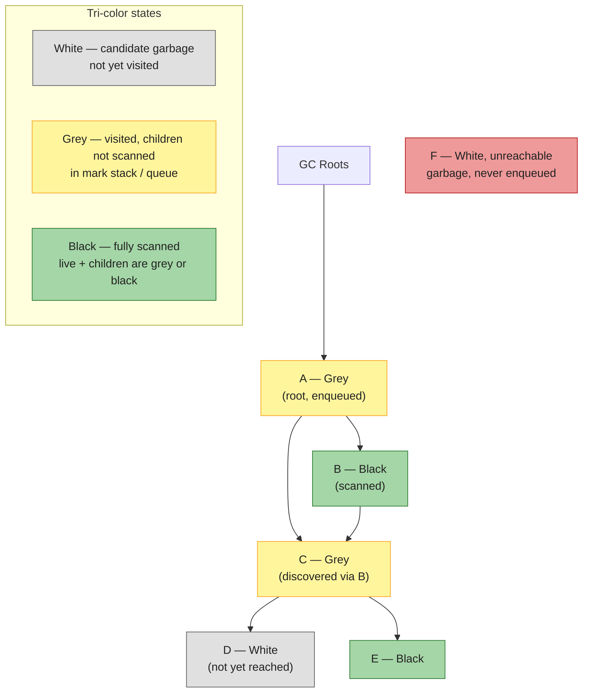
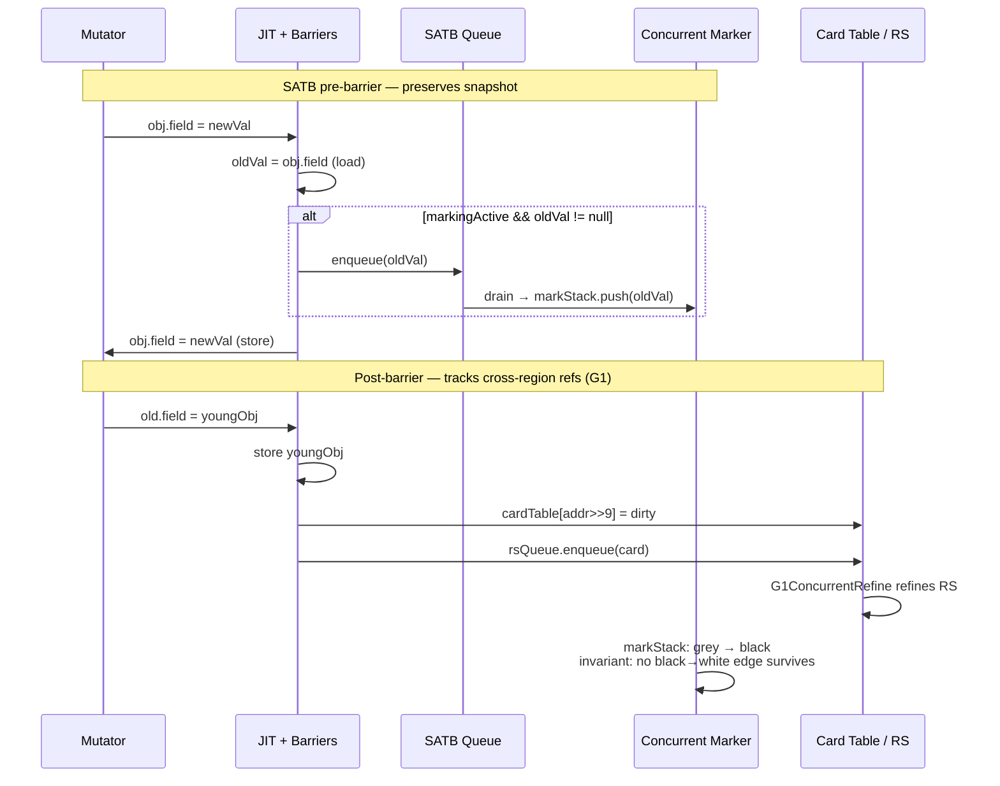
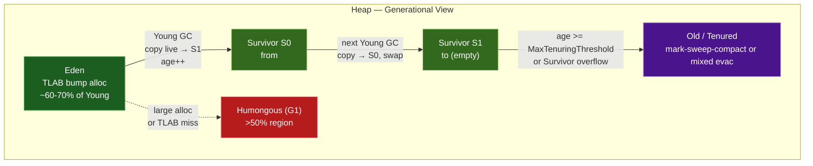
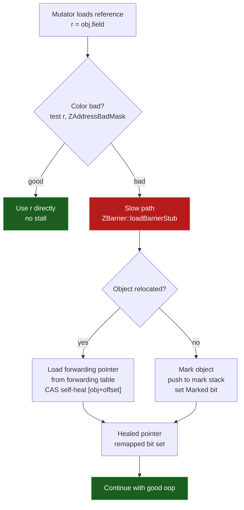
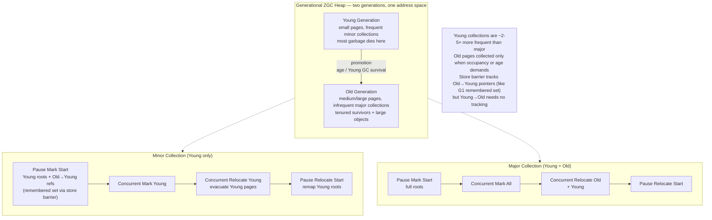
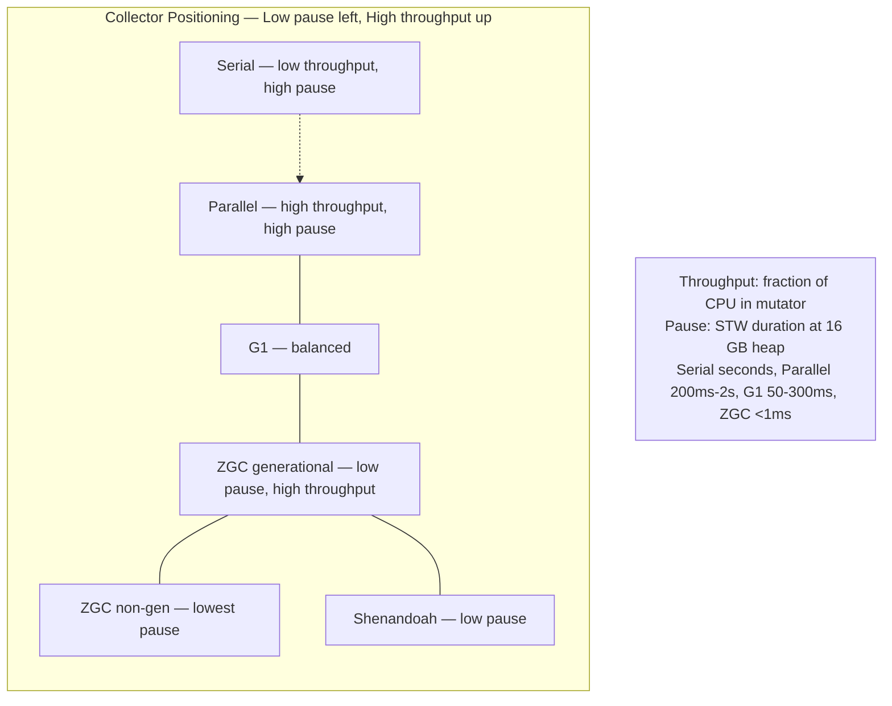
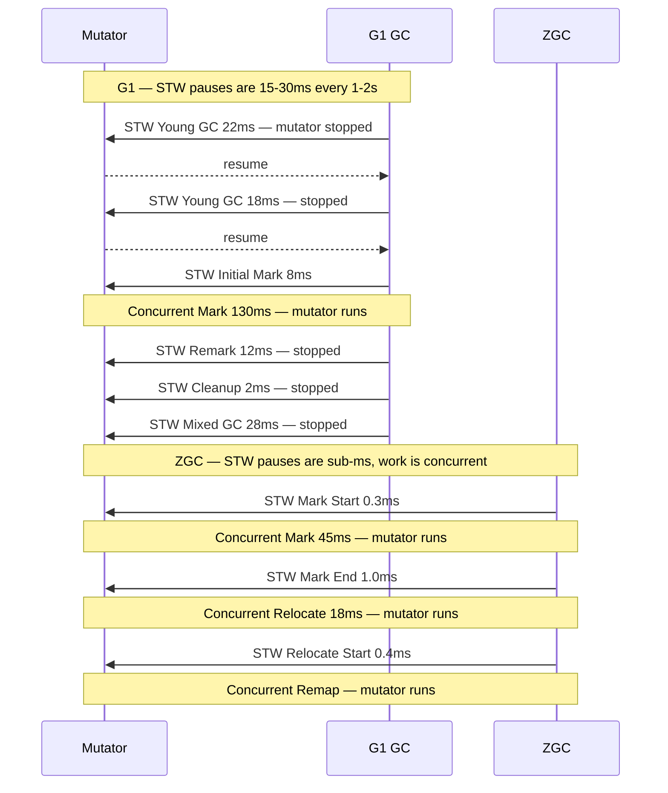

# Chapter 4 — Garbage Collection: Serial, Parallel, G1, ZGC, Shenandoah, and Generational ZGC

**What this chapter covers.** Every JVM backend is a garbage-collected system under load. The collector determines your p99, your heap efficiency, your container sizing, and whether a 2-second STW pause triggers a cascade of timeouts across 40 downstream services. This chapter dissects how HotSpot reclaims the heap — from reachability and tri-color marking through write barriers, generations, evacuation, and concurrent relocation — and then walks every production collector in order: Serial, Parallel, CMS (as history that explains G1), G1, ZGC, Shenandoah, and Generational ZGC (JDK 21, JEP 474). You will learn to read `-Xlog:gc*` output line-by-line, interpret `jstat` and JFR GC events, and choose and tune a collector for throughput, latency, or heap scale with concrete flags and log snippets.

Learning goals — after this chapter you should be able to:

- Define reachability, tri-color marking, and the three GC invariants; explain why a concurrent collector needs a write barrier and how SATB and incremental-update barriers differ.
- State the generational hypothesis, quantify it with allocation-rate math, and map it to Young/Old regions, TLABs, and humongous objects.
- Describe Serial, Parallel, and G1 internals: mark-sweep vs. copy vs. evacuate, G1 regions, remembered sets, SATB concurrent marking, Young and Mixed collections, and humongous handling.
- Explain ZGC's colored pointers and load barriers, Shenandoah's Brooks forwarding pointer, and how each achieves concurrent relocation without STW compaction.
- Contrast non-generational and generational ZGC (JDK 21), including young/old separation, generational collection sets, and when it wins.
- Choose among Serial, Parallel, G1, ZGC, and Shenandoah using a latency-throughput-heap-size matrix and defend the choice with pause and throughput reasoning.
- Read and tune from real GC logs (`-Xlog:gc*`), `jstat -gc*`, and JFR `jdk.GarbageCollection` events; apply heap-sizing, pause-goal, and barrier-overhead tuning.
- Apply a distributed-systems lens: how GC pauses become timeout amplification, retry storms, and quorum stalls, and how to size heaps and collectors for fleet-wide tail-latency SLOs.

> **Placement.** Chapter 3 defined the heap you are collecting — object layout, compressed oops, TLABs, and JMM/GC barriers. This chapter collects it. Chapter 5 (JIT) assumes you understand safepoints and barrier costs; Chapter 6 (threads/Loom) assumes you understand STW pauses and concurrent phases; Chapter 10 (profiling) and Chapter 12 (production tuning) build directly on the log analysis and sizing here.

---

## 1. Why GC dominates backend tail latency

A backend service allocating 500 MB/s–2 GB/s per instance (typical for Jackson/Protobuf-heavy HTTP handlers) fills a 4 GB Eden in 2–8 seconds. Every allocation is a TLAB bump (Chapter 3, Section 6.2) until Eden is full, then the collector must reclaim space. The way it reclaims — stop-the-world copy, concurrent mark, concurrent relocate — determines three production quantities:

| Quantity | What it measures | Who feels it |
|----------|-----------------|--------------|
| **Throughput** | Fraction of CPU spent in mutator vs. GC | Cost — more GC CPU means more instances for the same QPS |
| **Pause time** | STW duration where no Java thread makes progress | Latency — p50/p99/p999 response time; downstream timeout budgets |
| **Heap efficiency / footprint** | Heap needed to sustain a given allocation rate at a target pause | Density — how many pods per node, whether you can run a 32 GB heap without compressed-oops collapse |

A 15 ms G1 Young GC is invisible at p50 but shifts p99 by 15 ms. A 1.2-second Full GC on Parallel with a 16 GB heap blows a 500 ms RPC deadline, trips a circuit breaker, and retries from 20 callers simultaneously — a classic GC-induced retry storm. In consensus systems (Raft/ZooKeeper/etcd), a single STW pause longer than `electionTimeout` can force a leader step-down. In Kafka clients, a pause longer than `session.timeout.ms` triggers rebalance. GC is not a local concern; it is a distributed-systems failure mode.

Container awareness compounds this. Since JDK 10 (JEP 307) and JDK 14 (JEP 363), HotSpot reads cgroup limits for `UseContainerSupport` (default on). `-Xmx` defaults to 25% of the container limit; ergonomics picks G1 by default. An unset `-Xmx` inside a 2 GB cgroup and a 64 GB host gives wildly different ergonomics than you tested on your laptop. Always set `-Xms` and `-Xmx` explicitly in containers and understand which collector ergonomics chose — check `-Xlog:gc+heap=info` at startup.

---

## 2. Foundations: reachability, mark-sweep, copy, and tri-color

### 2.1 Reachability

HotSpot is a **tracing collector**: liveness is reachability from a set of **GC roots**, not reference counting.

Roots include: Java thread stacks (local variables, operands), JNI handles, `java.lang.Class` statics, `ClassLoader` tables, `JVMTI` handles, interned `String` table, code-cache oops (compiled code), and `Synchronizer` monitors. Any object transitively reachable from a root is live; everything else is garbage regardless of reference cycles.

```
Roots ──► A ──► B ──► D
        └─► C ──► E      F (unreachable) ──► G (unreachable, cyclic with F)
Live set = {A,B,C,D,E}; garbage = {F,G}
```

Reference strength modifies reachability (all in `java.lang.ref`):

| Reference type | Collected when | Typical use |
|---------------|---------------|-------------|
| Strong | Never, while reachable | Normal fields |
| Soft (`SoftReference`) | Before `OutOfMemoryError`, LRU per heap | Caches (`-XX:SoftRefLRUPolicyMSPerMB`) |
| Weak (`WeakReference`) | Next GC if only weakly reachable | `WeakHashMap`, class unloading |
| Phantom + `Cleaner` | After finalization/cleaning, never returns referent | Resource cleanup (replaces `finalize`) |
| `FinalReference` | Enqueued for finalizer thread | Legacy `Object.finalize` — avoid |

Soft-reference pressure is a common cause of "GC thrashing before OOM" — the heap fills with soft-reachable cache entries that the collector keeps reviving. Prefer bounded caches (Caffeine, Guava) with explicit eviction over `SoftReference` caches.

### 2.2 The three reclamation strategies

| Strategy | Mechanism | Cost | Compacts? |
|----------|-----------|------|-----------|
| **Mark-Sweep** | Mark live, sweep dead into free lists | Sweep is O(heap); free lists fragment | No |
| **Mark-Sweep-Compact** | Mark live, slide survivors together | Extra copy pass; one STW compaction | Yes |
| **Copy / Evacuation** | Copy live objects to a new region, reclaim old region wholesale | Copy is O(live), not O(heap); needs 2× space or region discipline | Yes (by definition) |

HotSpot uses all three at different times: Serial Old is mark-sweep-compact; Parallel Old is mark-sweep-compact; G1 Young is copying evacuation; G1 Old mixed collections are evacuation; ZGC/Shenandoah are concurrent copying (relocation). No production HotSpot collector is pure mark-sweep without compaction — fragmentation would eventually force a Full GC.

### 2.3 Tri-color marking

All tracing collectors can be understood through the **Dijkstra tri-color abstraction**. Each object is white (unvisited), grey (visited but children not scanned), or black (visited, children scanned). The collector maintains the **tri-color invariant**:

> No black object directly references a white object.

If the invariant holds, marking is complete when no grey remains — white objects are garbage.



STW collectors trivially maintain the invariant — the mutator is stopped, so no new edges appear. **Concurrent** collectors must maintain it while the mutator runs and mutates the graph. Two violations are possible:

1. Mutator creates a new edge `black → white` (stores a white object into a black object's field).
2. Mutator deletes the only path to a white object that was about to be discovered via a grey object, then the grey object is scanned.

Without intervention both produce lost live objects (collector reclaims something still reachable) or floating garbage (collector retains something dead — safe but wasteful). The intervention is a **write barrier** (GC barrier, not JMM barrier — Chapter 3, Section 7).

---

## 3. Write barriers: SATB, incremental update, and remembered sets

### 3.1 SATB (Snapshot-At-The-Beginning)

Used by G1, ZGC, Shenandoah for concurrent marking.

**Invariant:** the collector retains every object live at the *start* of marking, even if the mutator later drops the last reference to it. An object that becomes unreachable during marking is retained as **floating garbage** and reclaimed next cycle — safe, slightly wasteful.

**Mechanism — pre-barrier (before overwriting a reference):**

```java
// Mutator executes: obj.field = newVal   (field is an oop)
// JIT emits (G1 SATB pre-barrier, ZGC/Shenandoah similar):
Object oldVal = obj.field;               // load previous value
if (oldVal != null && markingActive) {
    satbQueue.enqueue(oldVal);           // remember old referent — it was live at snapshot start
}
obj.field = newVal;                      // actual store
```

If the mutator overwrites `obj.field` that previously pointed to white object `W`, the pre-barrier enqueues `W` so the marker will still visit it even if no other path remains. Deletions cannot hide objects.

SATB queues are thread-local (`SATBMarkQueue`, `G1ThreadLocalData::satb_mark_queue`). When a queue fills, it is enqueued to the global `SATBMarkQueueSet` for concurrent marking threads to drain. Overflow handling is critical — a missed enqueue would lose an object. HotSpot uses buffer completion and `SATBMarkQueue::flush`.

### 3.2 Incremental update (CMS-style)

The dual: instead of remembering deletions, remember insertions.

**Invariant:** any white object that the mutator makes reachable by storing it into a black object is re-greyed.

**Mechanism — post-barrier (after storing a reference):**

```java
// Mutator executes: obj.field = newVal
obj.field = newVal;                      // actual store
if (newVal != null && markingActive) {
    markStack.push(newVal);              // re-grey: ensure new referent is visited
    // CMS called this "mod-union table" / dirty card
}
```

Incremental update re-scans grey roots at the end to catch insertions. It produces less floating garbage than SATB but needs a re-mark of dirty cards/stack. G1 uses SATB for marking + a separate **post-barrier** for remembered sets (see below) — do not confuse the two barriers even though both fire on reference stores.

### 3.3 Card table and remembered sets (G1)

Generational and region-based collectors must find **cross-region pointers** without scanning the whole heap. G1 solves this with two structures:

- **Card table:** one byte per 512-byte heap card (`-XX:G1CardTable`). Post-barrier dirties the card: `cardTable[addr >> 9] = dirty`. At Young GC, only dirty cards in Old regions are scanned for Old→Young pointers.
- **Remembered set ( remembered set ):** per-region set of cards that contain pointers *into* that region. Refined concurrently by `G1ConcurrentRefine` threads draining dirty-card queues. At evacuation, the remembered set tells the collector which Old cards to scan to update references to moved Young objects.

ZGC and Shenandoah avoid remembered sets entirely — their **load barriers** make cross-region pointer tracking unnecessary (every load self-heals).



**Cost awareness.** Every reference store pays at least one barrier. G1's post-barrier is unconditional for Old→Young stores (card dirty is a single byte store, ~3–5 ns). ZGC's load barrier is on every reference *load* — more frequent than stores — but is elided by the JIT when it can prove the oop is already remapped (`ZBarrierSetC2::escapeIsSafe`). Barrier overhead is the dominant throughput tax of concurrent collectors: G1 ~5–10%, ZGC/Shenandoah ~10–20% vs. Parallel, recouped only if pause reduction lets you hit SLOs with fewer instances.

---

## 4. The generational hypothesis and heap anatomy

### 4.1 The hypothesis, quantified

> Most objects die young; old objects tend to stay alive. Collecting only the young generation reclaims most garbage at O(live-young) cost, not O(heap).

Backend measurements consistently show 85–98% of Young GC garbage is reclaimable. A request handler allocating 200 KB of temporary `byte[]`, `String`, and collection nodes per request promotes almost nothing if `MaxTenuringThreshold` and Survivor sizing are correct.

Allocation rate drives Young GC frequency:

```
Young GC interval ≈ Eden size / allocation rate
Example: Eden 1.5 GB, allocation 1 GB/s → Young GC every ~1.5 s
Survivor promotion rate ≈ live-young per Young GC × Young GC frequency
If 50 MB survives each Young GC → promotion 33 MB/s → Old fills in minutes without tuning
```

### 4.2 Generational heap anatomy (Parallel / G1 Young)

```
Eden  ── bump-pointer, TLAB-carved, where new allocations land
S0/S1 ── two Survivor spaces, copying with age counting (mark-word age field, 4 bits, max 15)
Old   ── tenured survivors + direct-allocated large objects
Metaspace (off-heap) ── class metadata, not collected with the Java heap
```



G1, ZGC, and Shenandoah replace the contiguous Young/Old split with a **region array** (see Sections 6–9), but the generational invariant is the same: young regions are collected frequently and cheaply, old regions rarely.

### 4.3 Sizing knobs that actually matter

| Flag | Default (JDK 21, G1) | Guidance |
|------|----------------------|----------|
| `-Xms` / `-Xmx` | 25% cgroup limit (ergonomic) | Set both equal in containers; avoids heap-resize pauses and compressed-oops boundary surprises |
| `-XX:MaxGCPauseMillis` | 200 (G1) | G1 pause *goal*, not guarantee — G1 picks Young/Mixed set sizes to try to meet it |
| `-XX:G1HeapRegionSize` | Ergonomic: heap/2048, 1–32 MB | Larger regions reduce remembered-set overhead but increase humongous threshold (50% region); tune if humongous allocation is high |
| `-XX:MaxTenuringThreshold` | 15 (G1/Parallel) | Lower → faster promotion, more Old pressure; higher → longer Survivor retention, more copy cost |
| `-XX:SurvivorRatio` | 8 (Parallel) | G1 ignores this (region-based); Parallel: Eden:Survivor = 8:1 |
| `-XX:InitiatingHeapOccupancyPercent` (IHOP) | 45 (G1) | Old occupancy that triggers concurrent marking; lower → earlier marking, fewer Full GCs, more concurrent CPU |
| `-XX:G1MixedGCLiveThresholdPercent` | 85 | Old regions with live < 85% are candidates for Mixed GC |
| `-XX:ConcGCThreads` | ~25% `ParallelGCThreads` | Concurrent marking threads; raise if marking cannot keep up with allocation |

Heap sizing cliffs (Chapter 3, Section 5.3 — worth repeating because it is the most common production misconfiguration): compressed oops cover 32 GB with a 3-bit shift. At ~32–34 GB, HotSpot disables `UseCompressedOops`, every reference doubles to 8 bytes, headers grow from 12 to 16 bytes, and effective heap capacity *drops* despite a larger `-Xmx`. Size at 26–30 GB or jump to 48 GB+ only when measured.

---

## 5. Serial and Parallel: the throughput collectors

### 5.1 Serial (`-XX:+UseSerialGC`)

Single-threaded collector. Young: copying (Eden + one Survivor → other Survivor). Old: mark-sweep-compact (STW, single-threaded). No concurrency, no parallelism.

Use when: heap < 1–2 GB, single-core environments, client apps, or when you need deterministic, minimal-footprint GC for CLI tools. Not for backends — a 4 GB heap Full GC can pause for seconds single-threaded.

### 5.2 Parallel / Throughput (`-XX:+UseParallelGC`, Parallel Scavenge + Parallel Old)

The throughput king. Both Young and Old are **parallel STW** — all mutator threads stopped, all GC threads cooperating.

- **Young (Parallel Scavenge):** parallel copying. Eden + `from` Survivor → `to` Survivor, age-counted, promotion on overflow. Ergonomics auto-tunes Young/Old ratio and `MaxTenuringThreshold` to maximize throughput (`-XX:+UseAdaptiveSizePolicy`, `-XX:GCTimeRatio=99` means 1% GC time goal).
- **Old (Parallel Old, PS MarkSweep):** parallel mark-sweep-compact. Mark live in parallel, compute new addresses (summary), compact by sliding live objects, update references.

No concurrent phase — every collection is STW, but STW is *short* for its heap size because every core participates. For batch jobs, ETL, and nightly report generators where pause time is irrelevant and throughput is everything, Parallel wins.

```bash
# Parallel GC with throughput-oriented ergonomics
java -XX:+UseParallelGC \
     -Xms16g -Xmx16g \
     -XX:+UseAdaptiveSizePolicy \
     -XX:GCTimeRatio=99 \
     -XX:MaxGCPauseMillis=500 \
     -Xlog:gc*,gc+heap=info,gc+ergo*=debug:file=/var/log/gc.log:time,uptime,level,tags \
     -jar batch-job.jar
```

Parallel log (JDK 21, `-Xlog:gc*`):

```
[0.842s][info][gc] GC(0) Pause Young (Allocation Failure) 1842M->312M(4096M) 18.342ms
[0.842s][info][gc] GC(0) User=0.08s Sys=0.02s Real=0.02s
[5.210s][info][gc] GC(1) Pause Full (Ergonomics) 3890M->1240M(4096M) 412.118ms
[5.210s][info][gc] GC(1) User=1.82s Sys=0.04s Real=0.41s
```

`Pause Young` is the STW Young copy; `Pause Full` is Old compaction. Parallel never prints `Concurrent` phases — everything is `Pause`. If you see `Pause Full` frequently, the heap is too small or promotion is too aggressive.

### 5.3 When to use — and when to escape

| Signal | Meaning | Action |
|--------|---------|--------|
| `Pause Young` < 50 ms, `Pause Full` rare | Healthy throughput workload | Keep Parallel |
| `Pause Full` > 500 ms and frequent | Old too small or fragmentation | Increase `-Xmx`, lower promotion, or switch to G1/ZGC |
| p99 latency SLO < 200 ms | STW pauses will violate SLO | Switch to G1 (pause-goal) or ZGC/Shenandoah (concurrent) |

---

## 6. CMS → G1: regions, concurrent marking, evacuation

### 6.1 CMS in one paragraph (why it matters)

CMS (Concurrent Mark-Sweep, removed in JDK 14, JEP 363) was the first low-pause production collector: concurrent marking with incremental-update barriers, STW initial-mark and remark, concurrent sweep. It did **not** compact — free lists fragmented until a Serial Old Full GC compacted. Fragmentation-induced Full GC was CMS's fatal flaw and the reason G1 replaced it. If you still see CMS flags in legacy configs (`-XX:+UseConcMarkSweepGC`, `-XX:CMSInitiatingOccupancyFraction`), treat them as tech debt — the collector does not exist on JDK 17+.

### 6.2 G1 heap: the region array

G1 divides the heap into equal-size regions (`-XX:G1HeapRegionSize`, 1–32 MB, default heap/2048). Each region has a *role* that changes over time:

```mermaid
flowchart TB
    subgraph G1Heap["G1 Heap — 16 GB, G1HeapRegionSize=8 MB → 2048 regions (24 shown)"]
        direction LR
        R0["E"]
        R1["E"]
        R2["E"]
        R3["S"]
        R4["S"]
        R5["O"]
        R6["O"]
        R7["O"]
        R8["H*"]
        R9["HC"]
        R10["O"]
        R11["F"]
        R12["E"]
        R13["E"]
        R14["S"]
        R15["O"]
        R16["O"]
        R17["H*"]
        R18["HC"]
        R19["HC"]
        R20["F"]
        R21["F"]
        R22["O"]
        R23["F"]
    end
    LEG["E=Eden  S=Survivor  O=Old<br/>H*=Humongous start  HC=Humongous cont.<br/>F=Free<br/>Humongous = object > 50% region<br/>(>4 MB with 8 MB regions)"]

    R8 -.-> LEG
    style R0 fill:#1b5e20,stroke:#66bb6a,color:#fff
    style R1 fill:#1b5e20,stroke:#66bb6a,color:#fff
    style R2 fill:#1b5e20,stroke:#66bb6a,color:#fff
    style R3 fill:#33691e,stroke:#9ccc65,color:#fff
    style R4 fill:#33691e,stroke:#9ccc65,color:#fff
    style R12 fill:#1b5e20,stroke:#66bb6a,color:#fff
    style R13 fill:#1b5e20,stroke:#66bb6a,color:#fff
    style R14 fill:#33691e,stroke:#9ccc65,color:#fff
    style R5 fill:#4a148c,stroke:#ce93d8,color:#fff
    style R6 fill:#4a148c,stroke:#ce93d8,color:#fff
    style R7 fill:#4a148c,stroke:#ce93d8,color:#fff
    style R10 fill:#4a148c,stroke:#ce93d8,color:#fff
    style R15 fill:#4a148c,stroke:#ce93d8,color:#fff
    style R16 fill:#4a148c,stroke:#ce93d8,color:#fff
    style R22 fill:#4a148c,stroke:#ce93d8,color:#fff
    style R8 fill:#b71c1c,stroke:#ef9a9a,color:#fff
    style R9 fill:#b71c1c,stroke:#ef9a9a,color:#fff
    style R17 fill:#b71c1c,stroke:#ef9a9a,color:#fff
    style R18 fill:#b71c1c,stroke:#ef9a9a,color:#fff
    style R19 fill:#b71c1c,stroke:#ef9a9a,color:#fff
```



Key properties:

- **No fixed Young/Old boundary.** G1 picks the Young set per GC from free + Eden + Survivor regions to meet `MaxGCPauseMillis`. Young size is adaptive.
- **Humongous objects** (`size > 50% region`) are allocated directly in Old as contiguous humongous regions. They are not moved during Young GC and are reclaimed only at concurrent cycles or Full GC. A single large `byte[]` (e.g., decompressed payload, gRPC message) can pin multiple regions. G1 can eagerly reclaim humongous regions if they become unreachable (`-XX:+G1EagerReclaimHumongousObjects`, default on since JDK 18), but fragmentation remains.
- **Remembered sets** per region (Section 3.3) make evacuation O(remembered-set) not O(heap).

### 6.3 G1 concurrent marking (SATB)

Triggered when Old occupancy exceeds `InitiatingHeapOccupancyPercent` (default 45%). Phases:

```
1. Initial Mark  (STW, piggybacks on Young GC) — mark roots, set SATB active
2. Root Region Scan — scan Survivor regions for references into Old
3. Concurrent Mark — SATB marking from roots + drained SATB queues
4. Remark        (STW) — drain remaining SATB queues, weak-reference processing
5. Cleanup       (STW) — reclaim empty Old regions, sort Old regions by live %
6. Concurrent Cleanup — free empty regions
```

Only Initial Mark, Remark, and Cleanup are STW. Concurrent Mark runs alongside the mutator; SATB pre-barriers preserve the snapshot. After marking, G1 knows liveness per Old region and can schedule **Mixed GCs**: Young regions + a few Old regions with the lowest live percentage, evacuated together. This is how G1 incrementally compacts Old without a Full GC.

### 6.4 Evacuation pauses: Young and Mixed

Both are **STW parallel copying**: live objects in the collection set (CSet) are copied to new regions (Survivor or Old), forwarding pointers installed, remembered sets updated, then old regions reclaimed as Free.

```bash
# G1 with pause goal and detailed logging
java -XX:+UseG1GC \
     -Xms16g -Xmx16g \
     -XX:MaxGCPauseMillis=200 \
     -XX:G1HeapRegionSize=8m \
     -XX:InitiatingHeapOccupancyPercent=45 \
     -XX:ConcGCThreads=4 \
     -Xlog:gc*,gc+phases=debug,gc+heap=info:file=/var/log/gc.log:time,uptime,level,tags \
     -jar service.jar
```

G1 log — Young GC (evacuation):

```
[12.042s][info][gc] GC(18) Pause Young (Normal) (G1 Evacuation Pause) 1420M->380M(4096M) 22.412ms
[12.042s][info][gc] GC(18) Eden regions: 18->0(18) Survivor regions: 3->3(3) Old regions: 2->2 Humongous regions: 1->1
[12.042s][debug][gc,phases] GC(18)   Pre Evacuate Collection Set: 0.2ms
[12.042s][debug][gc,phases] GC(18)   Evacuate Collection Set: 14.8ms
[12.042s][debug][gc,phases] GC(18)   Post Evacuate Collection Set: 3.1ms
[12.042s][debug][gc,phases] GC(18)   Other: 4.3ms
```

G1 log — concurrent marking + Mixed:

```
[45.210s][info][gc] GC(42) Concurrent Cycle
[45.210s][info][gc] GC(42) Pause Initial Mark (G1 Humongous Allocation) 2100M->2100M(4096M) 8.102ms
[45.210s][info][gc] GC(42) Concurrent Mark (45.210s, 45.340s) 130.215ms
[45.340s][info][gc] GC(42) Pause Remark 2120M->2120M(4096M) 12.408ms
[45.340s][info][gc] GC(42) Pause Cleanup 2120M->1980M(4096M) 2.114ms
[45.340s][info][gc] GC(42) Concurrent Cleanup for Next Mark (45.340s, 45.342s) 1.802ms
[46.100s][info][gc] GC(43) Pause Young (Prepare Mixed) (G1 Evacuation Pause) 1680M->420M(4096M) 18.920ms
[46.800s][info][gc] GC(44) Pause Young (Mixed) (G1 Evacuation Pause) 1800M->440M(4096M) 28.104ms
[46.800s][info][gc] GC(44) Eden regions: 12->0(12) Survivor regions: 3->2(3) Old regions: 8->6 Humongous regions: 1->1
```

`Pause Young (Mixed)` evacuates Young + selected Old regions. Repeated Mixed GCs incrementally reclaim Old. If concurrent marking cannot keep up (allocation outpaces reclamation), G1 falls back to `Pause Full (G1 Compaction Pause)` — a Serial Old-style compacting Full GC. Avoid it by lowering `IHOP` or increasing `ConcGCThreads`.

### 6.5 G1 failure modes

| Symptom in logs | Root cause | Fix |
|-----------------|-----------|-----|
| `To-space Exhausted` | Survivor + Old regions full during evacuation | Increase `-Xmx`, reduce Young size via lower `MaxGCPauseMillis`, or lower promotion |
| `Evacuation Failure` / `PreserveCMReferents` | Live data too high for CSet | Same + raise `G1ReservePercent` (default 10) |
| Frequent `Pause Full (G1 Compaction Pause)` | Concurrent marking never completes before Old fills | Lower `InitiatingHeapOccupancyPercent` to 30–35, raise `ConcGCThreads` |
| High humongous allocation (`G1 Humongous Allocation` as Initial Mark trigger) | Large arrays (`byte[]`, `ArrayList` growth) | Increase `G1HeapRegionSize`, pool buffers, or switch to ZGC which handles large objects better |
| `Remark` pause spikes | Large SATB queue backlog or weak-ref processing | Check `RefProc` time in `gc+phases=debug`; reduce `SoftReference` use |

---

## 7. ZGC: colored pointers, load barriers, and concurrent relocation

ZGC (JEP 333, production since JDK 15) targets **sub-millisecond STW pauses regardless of heap size** — 8 MB or 16 TB. It achieves this by making almost everything concurrent: marking, relocation, and reference updating happen while the mutator runs. Only brief STW pauses for root scanning and phase transitions remain.

### 7.1 Colored pointers

On 64-bit, virtual address space is 48–52 bits; the top bits are unused. ZGC steals them as **metadata**:

```
ZGC colored pointer (JDK 21, 64-bit, 48-bit address space, schematic):

  63   44 43        0
 ┌──────┬────────────┐
 │metadata│  heap offset │  (lower 42-44 bits = offset into ZHeap)
 └──────┴────────────┘
  ││││
  │││└─ Finalizable
  ││└── Remapped
  │└─── Marked1
  └──── Marked0

Two mark bits alternate per cycle (Marked0 / Marked1) so ZGC can distinguish
"marked in this cycle" from "marked last cycle" without clearing metadata.
Remapped = object has been relocated and the pointer is to the new location.
```

Because metadata lives in the pointer, not in the object header, ZGC does not need per-object forwarding bits or header word stealing. But it requires **pointer masking**: every load must strip metadata before dereferencing, unless a load barrier has already remapped it.

JDK 17 used **multi-mapping** (three virtual mappings of the same physical heap at different colored addresses) so that a colored pointer could be dereferenced directly after `mmap` tricks. JDK 21 on x86-64 with 5-level paging and on AArch64 with 52-bit VA uses the same technique; on platforms where multi-mapping is unavailable ZGC falls back to explicit masking.

### 7.2 Load barriers

Every reference load (`aload`, `getfield`, `aaload`) is instrumented:



Pseudocode of the fast path (HotSpot `ZBarrierSetAssembler::load_barrier_fast_path`):

```asm
; r = obj.field  (colored oop in register)
test r, ZAddressBadMask       ; single TEST instruction on x86 — ~1 cycle
jz   good                     ; predicted not-taken after warmup
call ZBarrier::loadBarrierSlow ; remap / mark / forward, self-heal
good:
; r is now good — dereference
```

The barrier is **self-healing**: once a reference is remapped, the healed (good-colored) oop is written back to the field with a CAS, so future loads of the same field take the fast path. Hot code quickly converges to no slow-path hits.

JIT elision: if the JIT can prove a reference was already loaded through a barrier and not stored (e.g., loop-invariant `obj.field` hoisted), it elides the second barrier. This is why ZGC's barrier overhead drops from ~15% in microbenchmarks to ~5–10% in real services.

### 7.3 ZGC cycle — mostly concurrent

```
1. Pause Mark Start   (STW, ~0.1–1 ms) — root scan, set marking active, SATB on
2. Concurrent Mark    — mark from roots + SATB queues, set Marked bit
3. Pause Mark End     (STW) — drain SATB, weak-ref processing
4. Concurrent Prepare for Relocation — select relocation set (regions with most garbage)
5. Concurrent Relocate — copy live objects in relocation set to new pages, install forwarding
6. Pause Relocate Start (STW) — remap roots to new locations, set remapped bit
7. Concurrent Remap   — mutator's load barriers lazily remap remaining references
```

Steps 2, 4, 5, 7 are concurrent. Only three STW pauses, each typically < 1 ms. Relocation is concurrent: the mutator may access an object while it is being copied. Correctness comes from the load barrier + forwarding table — a mutator load that hits an object mid-copy is forwarded to the new copy.

```bash
# ZGC (non-generational, JDK 17/21 default before JEP 474)
java -XX:+UseZGC \
     -Xms16g -Xmx16g \
     -XX:ConcGCThreads=4 \
     -XX:ParallelGCThreads=8 \
     -Xlog:gc*,gc+heap=info:file=/var/log/gc.log:time,uptime,level,tags \
     -jar service.jar

# ZGC tuning for allocation spikes (common in burst-heavy backends)
java -XX:+UseZGC -Xms16g -Xmx16g \
     -XX:ZAllocationSpikeTolerance=5 \
     -XX:ZCollectionInterval=5 \
     -XX:+ZProactive \
     -jar service.jar
```

ZGC log (JDK 21, non-generational):

```
[10.042s][info][gc] GC(0) Pause Mark Start 12.042ms  (STW)
[10.042s][info][gc] GC(0) Concurrent Mark 45.210ms
[10.088s][info][gc] GC(0) Pause Mark End 1.012ms  (STW)
[10.089s][info][gc] GC(0) Concurrent Prepare for Relocation 2.104ms
[10.092s][info][gc] GC(0) Concurrent Relocate 18.420ms
[10.110s][info][gc] GC(0) Pause Relocate Start 0.842ms  (STW)
[10.111s][info][gc] GC(0) Concurrent Remap 8.104ms
[10.042s][info][gc] GC(0) Load: 14.2/16.0 GB (88%), Live: 4.1 GB, Garbage: 8.9 GB, Reclaimed: 8.1 GB
[10.042s][info][gc] GC(0) Memory: 14.2M->6.1M(16384M) 0.3ms
[10.042s][info][gc] GC(0) GC(0) completed in 78ms — STW total ~2ms, concurrent ~72ms
```

`Load` is heap occupancy before GC, `Live` is marked live, `Garbage` is reclaimable, `Reclaimed` is freed. ZGC reclaims concurrently — the heap drops without a long pause.

### 7.4 ZGC heap: pages, not regions

ZGC manages the heap as **pages** (2 MB small, 32 MB medium, `n × 2 MB` large for humongous). Pages are allocated from `ZPhysicalMemory` backed by `mmap` with colored multi-mapping. Large objects get their own large page — no humongous fragmentation like G1, but large pages are not relocated (pinned).

---

## 8. Shenandoah: Brooks forwarding pointers

Shenandoah (JEP 189, production since JDK 15) shares ZGC's goal — concurrent evacuation with sub-millisecond pauses — but uses a different mechanism: a **Brooks forwarding pointer** in every object.

### 8.1 Brooks pointer

Every object has an extra word (adjacent to the header, or stolen from the header on some configurations) that points to the object's current location:

```
Object layout with Brooks pointer (Shenandoah, 64-bit, compressed oops):

  ┌──────────┬──────────┬──────────────┬────────┐
  │ mark 8   │ klass 4  │ Brooks ptr 4/8 │ fields │  (Brooks word holds forwarding address)
  └──────────┴──────────┴──────────────┴────────┘

Normal:  Brooks ptr == self (points to this object)
During evacuation: Brooks ptr == new location (after copy)
After evacuation:  mutator sees Brooks ptr, follows it
```

Mutator invariant: **every reference load goes through the Brooks pointer**. The JIT emits a load barrier on every `aload`/`getfield` that does `oop = *brooksPtr` if evacuation is in progress. Unlike ZGC's colored-pointer test (single `TEST`), Shenandoah's barrier is an extra indirection — one more load per reference.

### 8.2 Shenandoah cycle

```
1. Pause Init Mark        (STW) — root scan, SATB on
2. Concurrent Mark        — SATB marking
3. Pause Final Mark       (STW) — drain SATB, weak refs, choose collection set
4. Concurrent Cleanup     — reclaim empty regions
5. Concurrent Evacuation  — copy live objects in CSet, CAS Brooks pointer to new location
6. Pause Init Update Refs (STW) — ensure no mutator holds stale from-space pointers
7. Concurrent Update Refs — fix all references to point to to-space (via Brooks)
8. Pause Final Update Refs(STW) — complete
9. Concurrent Cleanup     — reclaim from-space regions
```

Shenandoah 2.0 (JDK 17+) introduced **load-reference barriers (LRB)** as an alternative to Brooks barriers, reducing overhead when evacuation is not active. The flag `-XX:ShenandoahGCMode=iu` (incremental update) vs. `satb` selects barrier mode; `generational` mode (experimental) adds Young/Old separation.

```bash
# Shenandoah (JDK 21)
java -XX:+UseShenandoahGC \
     -Xms16g -Xmx16g \
     -XX:ShenandoahGCHeuristics=adaptive \
     -XX:ShenandoahGCMode=satb \
     -Xlog:gc*,gc+ergo=info:file=/var/log/gc.log:time,uptime,level,tags \
     -jar service.jar

# Shenandoah with pacer tuning for bursty allocation
java -XX:+UseShenandoahGC -Xms16g -Xmx16g \
     -XX:ShenandoahPacerTrigger=3 \
     -XX:ShenandoahGuaranteedGCInterval=10000 \
     -jar service.jar
```

Shenandoah log:

```
[8.042s][info][gc] GC(0) Pause Init Mark 0.842ms
[8.042s][info][gc] GC(0) Concurrent marking 32.104ms
[8.074s][info][gc] GC(0) Pause Final Mark 1.210ms
[8.074s][info][gc] GC(0) Concurrent evacuation 18.420ms
[8.092s][info][gc] GC(0) Pause Init Update Refs 0.412ms
[8.092s][info][gc] GC(0) Concurrent update references 12.104ms
[8.104s][info][gc] GC(0) Pause Final Update Refs 0.304ms
[8.104s][info][gc] GC(0) Concurrent cleanup 1.102ms
[8.104s][info][gc] GC(0) 8.1G->2.4G(16.0G) 62ms, STW total ~2.8ms
```

### 8.3 ZGC vs. Shenandoah — mechanism comparison

| Property | ZGC (colored pointers) | Shenandoah (Brooks pointer) |
|----------|----------------------|----------------------------|
| Metadata location | Top bits of pointer | Extra word per object |
| Barrier type | Load barrier (test + self-heal) | Brooks indirection (load through forwarding ptr) |
| Barrier cost when idle | One `TEST` per load, predicted not-taken | One extra load per reference when evacuating; elided when not |
| Object overhead | None (metadata in pointer) | 4–8 bytes per object (Brooks word) |
| Heap size | Up to 16 TB (multi-mapping) | Up to ~100 GB typical (region-based) |
| Large objects | Large pages, not relocated | Humongous regions, not evacuated when pinned |
| Throughput tax | ~5–10% (barrier + concurrent threads) | ~10–15% (Brooks + concurrent copy) |
| STW pauses | ~0.1–1 ms (3 pauses/cycle) | ~0.3–2 ms (4 pauses/cycle) |

Both are excellent low-pause collectors. ZGC scales to larger heaps; Shenandoah's adaptive heuristics can be more aggressive at reclaiming garbage incrementally. For most backends either is a good choice when G1 pauses are too high — pick the one your JDK vendor supports best (Oracle/OpenJDK ships both; some vendors default to one).

---

## 9. Generational ZGC (JDK 21, JEP 474)

Non-generational ZGC treats every object equally: every GC marks the whole heap. For backends where 90%+ of objects die young, this wastes marking and relocation work on short-lived garbage that a Young GC could reclaim at O(live-young) cost. **Generational ZGC** (JEP 474, delivered in JDK 21 as `-XX:+ZGenerational`, default since JDK 23) adds generations atop ZGC's concurrent relocation.

### 9.1 Architecture



Key additions over non-generational ZGC:

- **Young generation:** small pages (2 MB), collected frequently. Minor GC marks only Young + Old→Young references. Promotion age is tracked per object (like G1's age field).
- **Old generation:** medium/large pages, collected by major GC (full marking + relocation). Major GC is rarer — often 10–20× less frequent than minor.
- **Store barrier for Old→Young:** generational ZGC adds a **store barrier** (unlike non-generational ZGC which only has a load barrier) to track Old→Young pointers, so minor GC does not need to scan all of Old. This is the same insight as G1's card table but implemented via ZGC's barrier infrastructure.
- **Remembered set:** per-page remembered set for Old→Young, refined concurrently.

### 9.2 When generational wins

| Workload | Non-generational ZGC | Generational ZGC |
|----------|---------------------|-----------------|
| Allocation-heavy, short-lived objects (HTTP handlers, serialization) | Marks entire heap every GC — wasted work | Minor GC marks only Young — 2–5× less marking, lower CPU |
| Cache-heavy, long-lived Old (large in-memory caches) | Same cost as above — cache objects re-marked every cycle | Major GC infrequent — cache pages rarely marked/relocated |
| Allocation rate > 1 GB/s, heap 16–64 GB | GC frequency high, concurrent threads compete with mutator | Fewer major GCs, lower concurrent CPU, better throughput |
| Small heap (< 4 GB), low allocation | Negligible difference | Minor overhead of store barrier not worth it — use non-generational or G1 |

Benchmarks from JEP 474 and vendor reports show generational ZGC reducing GC CPU overhead by 20–40% and allocation stall time by 30–60% vs. non-generational on allocation-heavy services, while preserving sub-millisecond pauses.

### 9.3 Enabling and tuning

```bash
# Generational ZGC — JDK 21 (explicit), JDK 23+ (default for ZGC)
java -XX:+UseZGC -XX:+ZGenerational \
     -Xms16g -Xmx16g \
     -XX:ConcGCThreads=4 \
     -Xlog:gc*,gc+heap=info:file=/var/log/gc.log:time,uptime,level,tags \
     -jar service.jar

# Force non-generational ZGC (if you need to compare or hit a generational bug)
java -XX:+UseZGC -XX:-ZGenerational -Xms16g -Xmx16g -jar service.jar

# Generational ZGC with NUMA (large hosts)
java -XX:+UseZGC -XX:+ZGenerational -Xms64g -Xmx64g \
     -XX:+UseNUMA -XX:ConcGCThreads=8 -XX:ParallelGCThreads=16 \
     -jar service.jar
```

Generational ZGC log — minor vs. major:

```
[10.042s][info][gc] GC(0) Minor Collection (Young) 8.2G->2.1G(16.0G) 12.042ms
[10.042s][info][gc] GC(0) Young: 6.1G->0.4G(8.0G) Old: 2.1G->1.7G(8.0G) Reclaimed: 5.7G
[10.042s][info][gc] GC(0) Pause Mark Start 0.342ms  Pause Relocate Start 0.412ms  STW total 0.75ms
[15.210s][info][gc] GC(5) Major Collection (Young+Old) 12.4G->4.2G(16.0G) 48.210ms
[15.210s][info][gc] GC(5) Young: 4.2G->0.6G  Old: 8.2G->3.6G  Reclaimed: 8.2G
[15.210s][info][gc] GC(5) Pause Mark Start 0.842ms  Pause Mark End 1.102ms  Pause Relocate Start 0.620ms  STW total 2.56ms
```

Minor GC STW total < 1 ms; major GC STW total ~2–3 ms, but major is rare. If you see major GC every few seconds, Young is too small or promotion is too aggressive — same tuning as G1.

Non-generational ZGC marks the entire 16 GB heap every cycle. Generational ZGC marks only ~4 GB of Young on minor GC (10-20x more frequent) and the full heap only on major GC — roughly 5x less marking work on allocation-heavy services.

---

## 10. Choosing a collector: the latency-throughput-heap matrix

No collector is best for all workloads. The choice is a tradeoff among throughput, pause, heap size, and operational maturity.



| Collector | Throughput | Max pause (16 GB heap) | Heap scale | Barrier tax | Maturity | Choose when |
|-----------|-----------|----------------------|-----------|------------|----------|-------------|
| **Serial** | Low | Seconds | < 2 GB | None | Ancient | CLI tools, single-core, tiny heaps |
| **Parallel** | **Highest** | 200 ms–2 s (STW) | Up to ~32 GB efficiently | None | Ancient | Batch, ETL, throughput > latency, no SLO |
| **G1** | High | 50–300 ms (tunable via `MaxGCPauseMillis`) | Up to ~64 GB | ~5–10% | Default since JDK 9, most battle-tested | **Default for backends** — balanced, pause-goal, good density |
| **ZGC (non-gen)** | Medium-High | **< 1 ms STW** | **Up to 16 TB** | ~10–15% | Production JDK 15+ | Heap > 32 GB, or p99 SLO < 10 ms, or allocation spikes |
| **ZGC (generational)** | **High** (close to G1) | **< 1 ms minor, < 3 ms major** | Up to 16 TB | ~5–10% (store+load) | Production JDK 21+ (JEP 474), default JDK 23+ | **Preferred low-pause** for allocation-heavy services — best latency+throughput combo |
| **Shenandoah** | Medium | **< 2 ms** | Up to ~100 GB typical | ~10–15% | Production JDK 15+ | Alternative low-pause, good when ZGC not available or for incremental-heuristic workloads |

### 10.1 Decision tree for a backend service

```
Heap < 4 GB, no tight SLO?
  └─ G1 (default) — simplest, well-understood, good throughput

Heap 4–32 GB, p99 SLO 100–500 ms?
  └─ G1 with MaxGCPauseMillis=200 — tune IHOP, region size
  └─ If G1 Mixed/Full pauses violate SLO → switch to Generational ZGC

Heap > 32 GB, or p99 SLO < 10 ms, or p999 SLO?
  └─ Generational ZGC — sub-ms pauses, scales to TBs
  └─ Alternative: Shenandoah if ZGC unavailable

Throughput > latency (batch, nightly jobs)?
  └─ Parallel — maximize CPU for mutator

Latency > throughput (trading, real-time bidding, gaming)?
  └─ Generational ZGC or Shenandoah — minimize STW

Uncertain / fleet default?
  └─ G1 for fleet default, Generational ZGC for latency-sensitive tier
  └─ Measure: run both with -Xlog:gc* for a week, compare p99 and CPU
```

### 10.2 Heap sizing and container guidance

```bash
# Container-aware sizing (Kubernetes pod with limit 4 GB, request 4 GB)
# Always set Xms == Xmx to avoid resize pauses; leave headroom for off-heap (Metaspace, direct buffers, thread stacks)
java -XX:+UseG1GC \
     -Xms3g -Xmx3g \
     -XX:MaxRAMPercentage=75.0 \
     -XX:+UseContainerSupport \
     -XX:MaxGCPauseMillis=200 \
     -jar service.jar

# Large heap with compressed oops — stay under 32 GB
java -XX:+UseG1GC -Xms26g -Xmx26g -XX:+UseCompressedOops -jar service.jar
# Verify at startup:
# [0.012s][info][gc,heap] Heap region size: 8M
# [0.012s][info][gc,heap] Compressed Oops: enabled, Compressed Class Pointers: enabled

# Large heap where compressed oops disabled — jump to 48 GB only if needed
java -XX:+UseZGC -XX:+ZGenerational -Xms48g -Xmx48g -jar service.jar
# ZGC handles >32 GB without compressed-oops penalty via colored pointers
```

Rule of thumb: leave 25–30% of container memory for off-heap (Metaspace, code cache, direct `ByteBuffer`, thread stacks at 1 MB each). A 4 GB cgroup with `-Xmx3g` is healthier than `-Xmx4g` that OOMKills on the first large `ByteBuffer.allocateDirect`.

---

## 11. Reading GC logs: `-Xlog:gc*`, `jstat`, and JFR

### 11.1 Unified GC logging (`-Xlog`, JDK 9+)

The old `-XX:+PrintGC` / `-XX:+PrintGCDetails` flags are gone. Unified logging uses `-Xlog:<tags>:<level>:<output>`:

```bash
# Minimal production logging — GC pauses + heap occupancy, 50 MB rotation
java -Xlog:gc:file=/var/log/gc.log:time,uptime,level,tags:filecount=10,filesize=50M \
     -jar service.jar

# Detailed — phases, heap, ergonomics, safepoints (for tuning)
java -Xlog:gc*,gc+phases=debug,gc+heap=info,gc+ergo*=debug,safepoint=info \
     :file=/var/log/gc.log:time,uptime,level,tags:filecount=10,filesize=50M \
     -jar service.jar

# Reference processing and humongous tracking (G1)
java -Xlog:gc+ref=debug,gc+humongous=debug:file=/var/log/gc.log:time,uptime,level,tags \
     -jar service.jar
```

Log tags cheat sheet:

| Tag | Shows |
|-----|-------|
| `gc` | GC start/end, pause type, heap before→after, duration |
| `gc+phases` | Per-phase timings (Evacuate, Remark, RefProc, etc.) |
| `gc+heap` | Heap layout, region sizes, compressed-oops mode at startup |
| `gc+ergo` | Ergonomics decisions (IHOP, Young sizing, CSet selection) |
| `gc+ref` | Reference processing (Soft/Weak/Phantom/Cleaner) time |
| `gc+humongous` | Humongous allocation and reclamation (G1) |
| `safepoint` | All safepoints (not just GC — deoptimization, biased-lock revocation) |

### 11.2 Annotated log walkthrough — G1 Young GC

```
[12.042s][info][gc] GC(18) Pause Young (Normal) (G1 Evacuation Pause) 1420M->380M(4096M) 22.412ms
│         │       │              │         │                          │         │        └─ STW duration
│         │       │              │         │                          │         └─ heap capacity (Xmx)
│         │       │              │         │                          └─ heap after → before
│         │       │              │         └─ reason (Allocation Failure vs. G1 Evacuation Pause is the sub-reason)
│         │       │              └─ GC id (monotonic counter)
│         │       └─ level (info/debug/trace)
│         └─ timestamp (uptime or wall-clock with -Xlog:gc:file:...:time)
│
[12.042s][debug][gc,phases] GC(18)   Pre Evacuate Collection Set: 0.2ms
[12.042s][debug][gc,phases] GC(18)   Evacuate Collection Set: 14.8ms   ← dominant: parallel copy
[12.042s][debug][gc,phases] GC(18)   Post Evacuate Collection Set: 3.1ms ← reference updates, RS cleanup
[12.042s][debug][gc,phases] GC(18)   Other: 4.3ms                     ← code roots, termination
```

What to watch:

- **Heap before→after:** `1420M->380M` means 1,040 MB reclaimed, 380 MB live. If `380M` grows steadily, Old is accumulating — check promotion rate.
- **Duration breakdown:** `Evacuate` should dominate. If `Other` or `RefProc` dominates, you have JNI/code-root or reference-processing pressure.
- **Frequency:** Young GC every 1–3 seconds is healthy for a 4 GB heap at 1 GB/s allocation. Every 200 ms means Eden is too small.

### 11.3 Annotated log — G1 concurrent cycle + Mixed

```
[45.210s][info][gc] GC(42) Concurrent Cycle                          ← marking cycle starts
[45.210s][info][gc] GC(42) Pause Initial Mark (G1 Humongous Allocation) 2100M->2100M(4096M) 8.102ms  ← STW, piggybacked on Young GC
[45.210s][info][gc] GC(42) Concurrent Mark (45.210s, 45.340s) 130.215ms ← concurrent SATB marking
[45.340s][info][gc] GC(42) Pause Remark 2120M->2120M(4096M) 12.408ms  ← STW, drain SATB queues
[45.340s][info][gc] GC(42) Pause Cleanup 2120M->1980M(4096M) 2.114ms  ← STW, reclaim empty Old regions
[45.340s][info][gc] GC(42) Concurrent Cleanup for Next Mark (45.340s, 45.342s) 1.802ms
[46.100s][info][gc] GC(43) Pause Young (Prepare Mixed) (G1 Evacuation Pause) 1680M->420M(4096M) 18.920ms
[46.800s][info][gc] GC(44) Pause Young (Mixed) (G1 Evacuation Pause) 1800M->440M(4096M) 28.104ms  ← evacuates Young + some Old
```

If `Concurrent Mark` duration exceeds the time to fill Old, marking never finishes before Old fills → `Pause Full`. Lower `IHOP` to start marking earlier.

### 11.4 Annotated log — Generational ZGC

```
[10.042s][info][gc] GC(0) Minor Collection (Young) 8.2G->2.1G(16.0G) 12.042ms
[10.042s][info][gc] GC(0) Young: 6.1G->0.4G(8.0G) Old: 2.1G->1.7G(8.0G) Reclaimed: 5.7G  ← per-generation accounting
[10.042s][info][gc] GC(0) Pause Mark Start 0.342ms  Pause Relocate Start 0.412ms  STW total 0.75ms
[15.210s][info][gc] GC(5) Major Collection (Young+Old) 12.4G->4.2G(16.0G) 48.210ms
[15.210s][info][gc] GC(5) Young: 4.2G->0.6G  Old: 8.2G->3.6G  Reclaimed: 8.2G
[15.210s][info][gc] GC(5) Pause Mark Start 0.842ms  Pause Mark End 1.102ms  Pause Relocate Start 0.620ms  STW total 2.56ms
```

Minor GC is Young-only; major is Young+Old. STW total is the sum that matters for SLOs.

### 11.5 `jstat` — live heap telemetry without logs

`jstat` polls the JVM's GC counters via `jvmstat` (no log parsing needed, safe for sidecars):

```bash
# Every second, print GC summary
jstat -gc $(pgrep -f service.jar) 1000

# Output (G1, 16 GB heap, values in KB):
#  S0C    S1C    S0U    S1U      EC       EU        OC         OU       MC     MU    CCSC   CCSU   YGC     YGCT    FGC    FGCT     GCT
#  0.0   18432.0  0.0   18432.0 3145728.0  892928.0  12582912.0  2847200.0  89216.0 86200.0 11264.0 10800.0   42    0.892    0     0.000    0.892
#  │      │      │      │       │        │         │          │         │      │      │      │       │      │        │      │        └─ total GC time (s)
#  │      │      │      │       │        │         │          │         │      │      │      │       │      │        └─ Full GC count/time
#  │      │      │       Young GC count/time ───────┘          │      Metaspace / Compressed class space
#  └─ Survivor 0/1 capacity/used, Eden capacity/used, Old capacity/used

# Utilization view (percentages — fastest triage)
jstat -gcutil $(pgrep -f service.jar) 1000
#   S0     S1     E      O      M     CCS    YGC     YGCT    FGC    FGCT     GCT
#   0.00 100.00  28.38  22.62  96.62  95.88     42    0.892     0    0.000    0.892

# Cause view — why GCs are firing
jstat -gcause $(pgrep -f service.jar) 1000
#   S0     S1     E      O      M     CCS    YGC     YGCT    FGC    FGCT     GCT    LGCC                 GCC
#   0.00 100.00  28.38  22.62  96.62  95.88     42    0.892     0    0.000    0.892  Allocation Failure   No GC
#  └─ last GC cause (Allocation Failure, G1 Evacuation Pause, G1 Humongous Allocation, Ergonomics)
#  └─ current GC cause (No GC / Allocation Failure / etc.)

# Capacity view — is heap resizing?
jstat -gccapacity $(pgrep -f service.jar) 1000
#  NGCMN    NGCMX     NGC     S0C   S1C       EC      OGCMN      OGCMX       OGC         OC       MCMN     MCMX      MC     CCSMN    CCSMX     CCSC    YGC    FGC
```

Alert on: `O` (Old utilization) trending toward 80%+ without dropping (Old not being reclaimed), `FGC` incrementing (Full GCs — always investigate), `GCT` growing faster than `YGC` (pauses lengthening).

### 11.6 JFR — GC events for dashboards

JFR (Chapter 10) emits structured GC events without log parsing:

```bash
# Record JFR with GC events
java -XX:StartFlightRecording=filename=rec.jfr,settings=profile,duration=60s \
     -XX:FlightRecorderOptions=stackdepth=128 \
     -jar service.jar

jfr print --events jdk.GarbageCollection,jdk.GCHeapSummary,jdk.GCPause rec.jfr
```

```
jdk.GarbageCollection {
  startTime = 12:04:02.042
  gcId = 18
  name = "G1 Young Generation"
  cause = "G1 Evacuation Pause"
  sumOfPauses = 22.4 ms
  longestPause = 22.4 ms
}

jdk.GCHeapSummary {
  gcId = 18
  heapSpace = { start = 0x700000000, committedSize = 4.0 GB, reservedSize = 4.0 GB, usedSize = 380 MB }
  heapUsed = 380 MB
}
```

Ship `jdk.GarbageCollection` + `jdk.GCPause` to your metrics pipeline (Prometheus via JFR exporter, or OpenTelemetry JFR receiver) to graph pause percentiles alongside request p99 — the correlation is the most persuasive tuning evidence for leadership.

### 11.7 GC pause timeline — visualizing STW vs. concurrent

STW pauses block all Java threads; concurrent phases run alongside the mutator.



G1's Young GCs are 15–30 ms STW every 1–2 seconds; ZGC's STW is < 1 ms with concurrent work filling the gaps. The mutator's throughput is `1 − (STW time / wall time)` — for G1 ~98–99%, for ZGC ~99.9%+.

### 11.8 Tuning recipes

**Recipe 1: G1 Young GC too frequent (Eden too small)**

```bash
# Symptom: jstat YGC every 300ms, Eden 512 MB, allocation 1.5 GB/s
# Fix: increase heap or reduce allocation; verify Eden sizing
java -XX:+UseG1GC -Xms8g -Xmx8g -XX:G1HeapRegionSize=4m -XX:MaxGCPauseMillis=200 -jar service.jar
# Check: -Xlog:gc+ergo=debug shows "Eden regions: 64->0(64)" — Eden is 64×4 MB = 256 MB (too small)
# Increase region size or heap so Eden is 1–2 GB
```

**Recipe 2: G1 Full GC (concurrent marking cannot keep up)**

```bash
# Symptom: logs show "Pause Full (G1 Compaction Pause) 3800M->1200M(4096M) 1.2s"
# Fix: start marking earlier, give it more CPU
java -XX:+UseG1GC -Xms16g -Xmx16g \
     -XX:InitiatingHeapOccupancyPercent=30 \
     -XX:ConcGCThreads=6 \
     -XX:G1ReservePercent=15 \
     -jar service.jar
```

**Recipe 3: Humongous allocation pressure**

```bash
# Symptom: "G1 Humongous Allocation" triggers concurrent cycles; jstat OU spikes
# Diagnose:
# -Xlog:gc+humongous=debug shows "Humongous object allocation: 8 MB, region size 2 MB → 4 regions"
# Fix: larger regions or reduce large allocations
java -XX:+UseG1GC -Xms16g -Xmx16g -XX:G1HeapRegionSize=8m -jar service.jar
# Or: pool direct buffers, reuse byte[] via ThreadLocal, limit gRPC message size
```

**Recipe 4: Switch to Generational ZGC for p99**

```bash
# Baseline with G1: p99 180ms, p999 450ms (GC pauses visible)
# Switch to Generational ZGC:
java -XX:+UseZGC -XX:+ZGenerational \
     -Xms16g -Xmx16g \
     -XX:ConcGCThreads=4 \
     -XX:+ZProactive \
     -Xlog:gc:file=/var/log/gc.log:time,uptime,level,tags \
     -jar service.jar
# Expect: p99 drops to 20–40ms, p999 to 60–100ms, CPU +5–10% — verify with JFR + metrics
```

**Recipe 5: Allocation stall (ZGC cannot reclaim fast enough)**

```bash
# Symptom: ZGC log "Allocation Stall" — mutator blocked waiting for GC
# Fix: increase heap, raise spike tolerance, or throttle allocation
java -XX:+UseZGC -XX:+ZGenerational -Xms32g -Xmx32g \
     -XX:ZAllocationSpikeTolerance=5 \
     -XX:ConcGCThreads=6 \
     -jar service.jar
# If still stalling: heap is too small for allocation rate — increase Xmx or reduce per-request allocation
```

---

## 12. Distributed-systems lens: GC as a fleet-wide failure mode

GC pauses do not stay local. In a fleet of hundreds of instances, a 200 ms STW pause on one replica is a 200 ms latency spike for every caller holding a connection to it. The amplification patterns that matter:

### 12.1 Timeout amplification and retry storms

```
Service A (caller) ──► Service B (callee, G1, 16 GB heap)
  timeout = 500 ms
  retries = 2, backoff 100 ms

B Young GC: 250 ms STW (G1 Mixed with large CSet)
  → A's request times out at 500 ms (250 ms GC + 200 ms queue + 50 ms processing)
  → A retries → B now handles 2× load during next GC → longer pauses → more timeouts
  → Retry storm: 20 callers × 2 retries = 40 extra requests landing while B is still paused
```

Mitigations: **hedged requests** (send to two replicas, use first reply) mask single-replica GC pauses but double load — use only for p99-critical paths. **Retry budgets** (e.g., 20% of requests may be retries) and **exponential backoff with jitter** bound storms. **Coordinated omission**-aware metrics (HdrHistogram) reveal GC-induced latency that average-based metrics hide.

### 12.2 Consensus and membership

Raft (etcd, Consul, CockroachDB) and ZooKeeper rely on heartbeat timeouts. A GC pause longer than `electionTimeout` (etcd default 1 s) on the leader causes followers to start an election; a pause on a follower causes the leader to mark it dead and trigger re-replication. ZGC/Shenandoah's sub-ms pauses make JVM-based consensus participants viable; G1 requires careful tuning (`MaxGCPauseMillis` well below `electionTimeout/2`) and over-provisioned heaps.

Kafka's `session.timeout.ms` (default 45 s) and `max.poll.interval.ms` (5 min) are generous, but a Full GC of 2–5 seconds on a Parallel-collected consumer can still trigger rebalance. The Kafka client library's heartbeat thread is a Java thread — it stops during STW.

### 12.3 Fleet GC coordination

At scale, uncoordinated GC across replicas is desirable — you want pauses *staggered* so at least N−1 replicas are responsive. JVMs naturally stagger because allocation rates differ slightly. Anti-patterns that synchronize GC:

- **Simultaneous rolling deploy** — all instances start at the same time, fill Eden at the same rate, GC together. Stagger deploys.
- **Periodic batch jobs** (cache refresh, config reload) that allocate heavily on a timer — all replicas allocate together, GC together. Jitter the timer.
- **Heap sizing that forces Full GC** — Full GC is often triggered by Old occupancy, which grows deterministically; all replicas Full-GC within seconds of each other. Avoid Full GC entirely via concurrent collectors or correct IHOP.

### 12.4 Sizing for SLOs, not averages

Size heaps from the tail:

1. Measure allocation rate (`jstat -gc` EU delta / wall time, or JFR `jdk.ObjectAllocationInNewTLAB`).
2. Set Young/Eden so Young GC interval is 1–5 seconds (frequent enough to reclaim, infrequent enough to not dominate CPU).
3. Set Old so concurrent marking completes before Old fills — `Old growth rate × Concurrent Mark duration < (100% − IHOP) × heap`.
4. Load-test with realistic traffic and measure **pause percentiles** (`jstat GCT` is not enough — parse `gc` logs for per-pause durations, or use JFR `jdk.GCPause` histogram).
5. Correlate GC pauses with request p99 (overlay `jdk.GCPause` on request latency in Grafana) — the spikes should not align after tuning.

For a fleet with p99 SLO of 100 ms, G1 with `MaxGCPauseMillis=100` is a starting point but not a guarantee — G1 may exceed the goal under pressure. Generational ZGC with < 1 ms STW gives headroom for the rest of the request path (network, serialization, downstream calls) to stay within SLO. The extra 5–10% CPU tax is often cheaper than the alternative: over-provisioning replicas to absorb GC-induced latency.

### 12.5 Observability checklist

- [ ] `-Xlog:gc:file=/var/log/gc.log:time,uptime,level,tags:filecount=10,filesize=50M` on every JVM
- [ ] `jstat -gcutil` scraped by sidecar or JMX exporter (or `jvm_gc_pause_seconds` via Micrometer)
- [ ] JFR `jdk.GCPause` + `jdk.GarbageCollection` shipped to metrics (Prometheus/Grafana)
- [ ] Alert on `FGC > 0` (any Full GC), `GCT / wall time > 5%` (GC overhead), `Old utilization > 80%` sustained
- [ ] Dashboard: GC pause histogram overlaid with request p50/p99, heap occupancy (Eden/Survivor/Old), allocation rate
- [ ] Chaos test: inject allocation pressure (`byte[]` churn) and verify SLO holds — same as Jepsen but for GC

---

## Key takeaways

- GC is a tracing problem: mark live from roots via tri-color, then reclaim white. The tri-color invariant (no black→white) is maintained by SATB pre-barriers (G1/ZGC/Shenandoah) or incremental-update post-barriers — every concurrent collector pays a barrier tax on the mutator's hot path.
- Generations exploit mortality: Young GC copies survivors at O(live-young), Old is collected rarely. TLABs make allocation a bump pointer; humongous/large objects bypass Young and can fragment G1 — size `G1HeapRegionSize` or use ZGC large pages to mitigate.
- Serial and Parallel are STW throughput collectors — no concurrency, maximum CPU for the mutator, pauses proportional to live set. Use Parallel for batch; never for latency-sensitive backends.
- G1 is the balanced default: region array, SATB concurrent marking, Young and Mixed evacuation pauses, `MaxGCPauseMillis` as a goal not a guarantee. Tune `IHOP`, `ConcGCThreads`, and region size; avoid Full GC by ensuring concurrent marking keeps up.
- ZGC achieves sub-ms STW via colored pointers and load barriers (test + self-heal, JIT-elided) with concurrent mark/relocate/remap. Shenandoah achieves the same via Brooks forwarding pointers and concurrent evacuation. Both trade ~5–15% throughput for an order-of-magnitude pause reduction and scale to large heaps (ZGC to 16 TB).
- Generational ZGC (JDK 21, JEP 474, default in JDK 23) adds Young/Old separation to ZGC: minor GC marks only Young (frequent, cheap), major GC marks Old+Young (rare). It reclaims the generational advantage non-generational ZGC gave up, cutting GC CPU 20–40% on allocation-heavy services while preserving sub-ms pauses — it is the preferred low-pause collector for new deployments.
- Choosing a collector is a latency-throughput-heap matrix: Parallel for throughput, G1 for balanced/default, Generational ZGC (or Shenandoah) for p99 < 10 ms or heap > 32 GB. Always measure — run both under production traffic with `-Xlog:gc*` and compare pause histograms vs. CPU.
- Logs are the source of truth: `-Xlog:gc*` for pause types/durations/phases, `jstat -gcutil`/`-gcause` for live telemetry, JFR `jdk.GCPause` for dashboard-grade pause histograms. Alert on Full GC, Old pressure, and GC overhead > 5%.
- At fleet scale GC is a distributed failure mode: STW pauses become timeout amplification, retry storms, and consensus stalls. Stagger GC via jittered deploys/timers, size heaps from tail percentiles, and correlate GC pauses with request p99 — the overlay tells you whether GC is your tail-latency bottleneck.

---

## Further reading

- **JLS 17, Chapter 12 (Execution) and Chapter 17 (Threads and Locks)** — reachability, finalization, and reference processing semantics.
  https://docs.oracle.com/javase/specs/jls/se21/html/index.html
- **HotSpot GC documentation — G1, ZGC, Shenandoah (OpenJDK)** — official collector docs, flags, and ergonomics.
  https://docs.oracle.com/en/java/javase/21/gctuning/garbage-first-garbage-collector.html
  https://docs.oracle.com/en/java/javase/21/gctuning/z-garbage-collector1.html
  https://wiki.openjdk.org/display/shenandoah/Main
- **JEP 333: ZGC — A Scalable Low-Latency Garbage Collector** — design, colored pointers, load barriers, multi-mapping.
  https://openjdk.org/jeps/333
- **JEP 189: Shenandoah — A Low-Pause-Time Garbage Collector** — Brooks pointers, concurrent evacuation.
  https://openjdk.org/jeps/189
- **JEP 474: ZGC — Generational Mode** — generational ZGC design, store barriers, Young/Old separation.
  https://openjdk.org/jeps/474
- **JEP 363: Remove the Concurrent Mark Sweep (CMS) Garbage Collector** — why CMS was removed and G1 replaced it.
  https://openjdk.org/jeps/363
- **JEP 307: Parallel Full GC for G1 and JEP 346: Promptly Return Unused Committed Memory from G1** — G1 Full GC and heap uncommit.
  https://openjdk.org/jeps/307  https://openjdk.org/jeps/346
- **HotSpot `SATBMarkQueue`, `G1BarrierSet`, `ZBarrierSetAssembler`, `ShenandoahBarrierSetAssembler`** — source-level barrier implementations.
  https://github.com/openjdk/jdk/tree/master/src/hotspot/share/gc
- **Gil Tene — Understanding Java GC, Pauses, and HdrHistogram (QCon, InfoQ)** — pause measurement, coordinated omission, and GC tuning methodology.
  https://www.infoq.com/presentations/Tene-HdrHistogram/
- **Jean-Philippe Bempel et al. — ZGC Deep Dive (JVMLS, Devoxx)** — ZGC internals, generational ZGC performance, and production tuning.
  https://www.youtube.com/results?search_query=ZGC+deep+dive+JVMLS
- **Charlie Hunt, Monica Beckwith, Poonam Parhar, Bengt Rutisson — *Java Performance* (2nd ed., Addison-Wesley, 2014)** — chapters 5–8 on GC tuning, still relevant for generational mechanics and ergonomics.
- **JFR Event Reference — `jdk.GarbageCollection`, `jdk.GCPause`, `jdk.GCHeapSummary`, `jdk.ObjectAllocationInNewTLAB`** — structured GC observability.
  https://docs.oracle.com/en/java/javase/21/docs/specs/man/jfr.html

