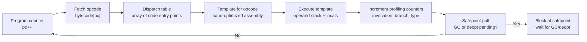
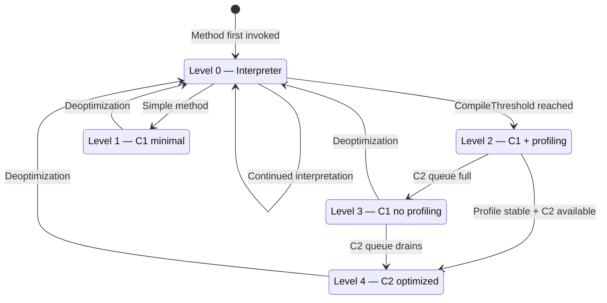
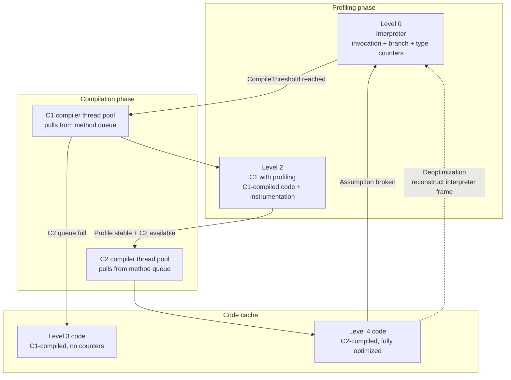
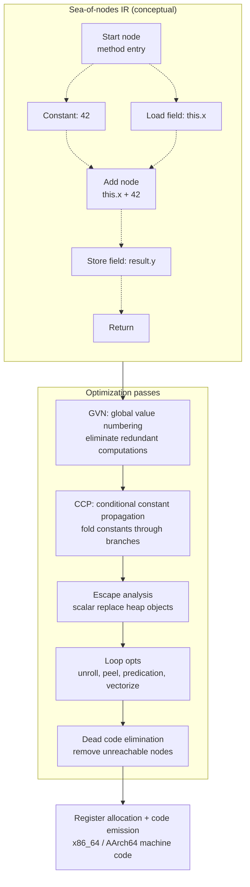
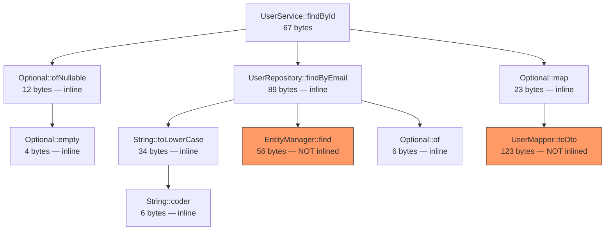
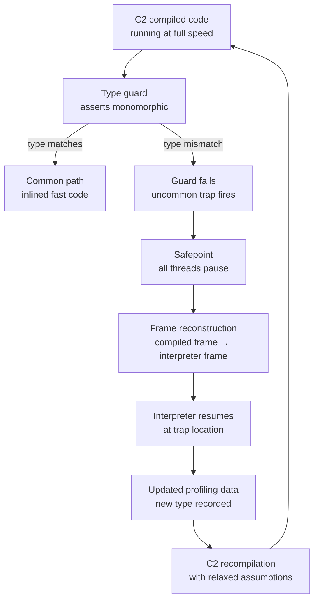
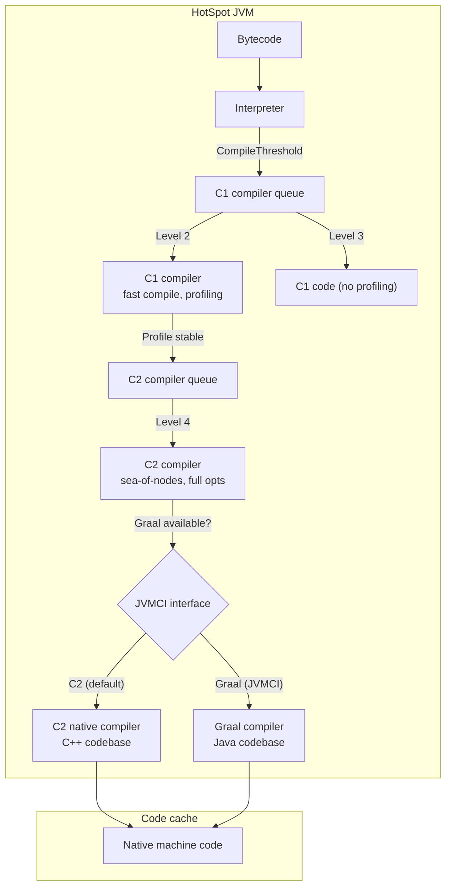

# Chapter 5 — The JIT: Interpreters, C1, C2, and Graal — Deoptimization, Inlining, and Intrinsics

**What this chapter covers.** The JVM's just-in-time compiler is the single largest source of performance in managed languages — yet most backend engineers treat it as a black box. When a Kotlin service achieves 80% of C throughput on gRPC encode/decode, that is not magic; it is escape analysis eliminating allocations, inlining collapsing virtual dispatch, intrinsics replacing method calls with single instructions, and loop opts auto-vectorizing tight iteration — all guarded by deoptimization so the JVM can recover when assumptions break. This chapter opens the entire pipeline: the template interpreter that runs first, the tiered compilation state machine that decides when to compile, the C1 compiler that gathers profiles cheaply, the C2 compiler that turns profiles into optimized machine code via a sea-of-nodes intermediate representation, and the Graal compiler that replaces C2 on JVMCI. We trace inlining heuristics, intrinsics like `System.arraycopy` and `VarHandle`, the uncommon-trap mechanism that powers deoptimization, and the profiling infrastructure (branch, type, call-site) that feeds every decision. You will read real `-XX:+PrintCompilation` logs, interpret `-XX:+PrintInlining` trees, examine JFR compilation events, and walk through `PrintAssembly` output to see exactly what the JIT emits for your code.

Learning goals — after this chapter you should be able to:

- Trace HotSpot's tiered compilation pipeline through all five levels (0–4), explain when each fires, and configure thresholds with `-XX:CompileThreshold`, `-XX:TieredStopAtLevel`, and `-XX:+TieredCompilation`.
- Describe C1's role: fast compilation, limited optimizations, instrumentation counters, and why it exists as a separate pass before C2.
- Explain C2's sea-of-nodes intermediate representation, global value numbering (GVN), escape analysis, loop optimizations (unrolling, peeling, predication, auto-vectorization), and control-flow elimination.
- Read `-XX:+PrintInlining` output and explain inlining decisions: size thresholds (`-XX:MaxInlineSize`, `-XX:FreqInlineSize`), depth limits, monomorphic/bimorphic/megamorphic dispatch, and inline caches.
- Identify JVM intrinsics (`System.arraycopy`, `Unsafe`, `VarHandle`, `Math.*`, CRC32) and explain why they bypass the normal compilation path.
- Explain deoptimization: uncommon traps, speculative optimizations, assumption metadata, the deopt mapping from compiled frames back to interpreter frames, and why class loading can trigger deopt storms.
- Describe GraalVM's Graal compiler: JVMCI interface, partial evaluation, the Truffle framework for polyglot languages, and how Graal compares architecturally to C2.
- Use `-XX:+PrintCompilation`, `-XX:+PrintInlining`, `-XX:+UnlockDiagnosticVMOptions -XX:+PrintAssembly`, and JFR events (`jdk.Compilation`, `jdk.Inlining`, `jdk.OptimizerDecision`) to diagnose JIT behavior in production.

> **Prerequisites.** Chapter 1 introduced the template interpreter and tiered compilation levels at a high level. Chapter 3 covered the JMM and object layout — the JIT reorders subject to the JMM and intrinsifies `VarHandle` access modes. Chapter 6 builds on what the JIT produces: Loom's virtual threads depend on the JIT's ability to optimize through continuations. Volume 13, Chapter 5 covers profiling tools (`jfr`, `async-profiler`, `jcmd`) that feed into the JIT's own profiling.

---

## 1. The template interpreter — where every method starts

Before the JIT compiles anything, the **template interpreter** executes it. Understanding the interpreter is not academic — it determines your baseline latency, it collects the profiling data that drives every JIT decision, and it is where execution resumes after every deoptimization.

### 1.1 Architecture

HotSpot's interpreter is not a switch-based interpreter (like early JVMs). It is a **template interpreter**: for each of the ~202 bytecodes, HotSpot generates a short, hand-optimized assembly-language "template" at JVM startup. These templates are stored in a contiguous code buffer called the **interpreter generator**. Execution dispatches through a table of function pointers indexed by opcode number.



This is faster than a `switch` because:
- The indirect jump through `dispatch_table` is a single branch prediction unit entry — the CPU's BTB (Branch Target Buffer) learns it quickly.
- Each template is hand-tuned for its specific opcode (e.g., `iload_0` is a single register move, not a loop iteration).
- HotSpot embeds **profiling counters** directly into templates: per-method invocation counts, per-branch taken/not-taken counts, and per-call-site type counts.

### 1.2 Profiling counters

The interpreter is the JVM's primary profiling instrument. For every method at level 0, HotSpot maintains:

| Counter | What it tracks | How it drives compilation |
|---------|---------------|--------------------------|
| Invocation count | Number of times the method is entered | Triggers level 2 (C1) compilation at `CompileThreshold` |
| Backedge count | Number of loop back-edges taken | Triggers on-stack replacement (OSR) for hot loops |
| Branch taken/not-taken | Per-branch-taken bytecode counts | Feeds C2's branch prediction and dead-code elimination |
| Receiver type | Per-call-site monomorphic/bimorphic/megamorphic classification | Feeds C2's inlining and devirtualization decisions |
| Argument type | Observed types at call sites | Feeds C2's type profiling and specialization |

These counters are **not free**. Each increment is a memory store to a counter object adjacent to the method's metadata. In tight loops, counter traffic can consume measurable bandwidth — this is why the interpreter runs 10–30× slower than C2-compiled code, not just because of dispatch overhead but because of the profiling bookkeeping.

### 1.3 On-Stack Replacement (OSR)

A critical interpreter capability: if a method has a hot loop (high backedge count) but few total invocations, the interpreter does not wait for the method to be entered enough times. Instead, it triggers **On-Stack Replacement (OSR)**: C2 compiles just the loop body, and at the next backedge, execution transfers from the interpreter frame to the compiled code mid-method. This is how a long-running batch loop gets optimized even if it is called only once.

---

## 2. Tiered compilation — the five-level state machine

HotSpot's tiered compilation is a state machine where each method progresses through up to five levels, each trading compilation speed for code quality.

### 2.1 The levels

| Level | Compiler | Purpose | Profile collected? |
|-------|----------|---------|-------------------|
| 0 | Interpreter | Execute, count invocations and branches | Yes — all profiling counters active |
| 1 | C1 (minimal) | Fast compile, no profiling overhead | No — for methods called rarely but need C1 speed |
| 2 | C1 (full profiling) | Compile with profiling instrumentation | Yes — full branch/type/call-site profiling |
| 3 | C1 (no profiling) | C1-compiled code without profiling counters | No — intermediate step when C2 queue is busy |
| 4 | C2 | Full optimization: inlining, EA, loop opts, vectorization | No — consumes profiles collected at level 2 |

The default progression for a server JVM:

```
Level 0 (interpreter)
  → at CompileThreshold invocations:
Level 2 (C1 + profiling)
  → at additional threshold, C2 queue available:
Level 4 (C2 full optimization)
```



If C2 compilation fails or the queue is backlogged, the method may stay at level 3 (C1 without profiling) as a stable intermediate state. When deoptimization occurs, the method falls all the way back to level 0 (interpreter) — it does not resume at C1.

### 2.2 Thresholds and flags

| Flag | Default (server) | Default (client) | What it controls |
|------|-----------------|-----------------|-----------------|
| `-XX:CompileThreshold` | 10,000 | 1,500 | Invocations before level 0 → level 2 |
| `-XX:OnStackReplacePercentage` | 140 | 100 | Backedge count relative to invocation count for OSR |
| `-XX:TieredStopAtLevel` | 4 | 4 | Maximum compilation level (set to 3 to disable C2) |
| `-XX:+TieredCompilation` | true | true | Enable/disable tiered compilation entirely |
| `-XX:Tier4CompileThreshold` | 5,000 | 5,000 | Additional invocations before level 2 → level 4 |
| `-XX:Tier3InvocationThreshold` | 200 | 200 | Invocations before level 1 → level 2 |
| `-XX:ReservedCodeCacheSize` | 240 MB | 240 MB | Max size for JIT-compiled native code |

Setting `-XX:TieredStopAtLevel=3` disables C2 entirely — useful for latency-sensitive microservices where C2 compilation pauses are unacceptable. The trade-off is 10–20% lower peak throughput.

### 2.3 The compilation queue

C1 and C2 compilation requests go into separate **method queues**. A pool of compiler threads (controlled by `-XX:CICompilerCount`, default = 3 × number of CPUs for tiered mode) pulls methods from the queue and compiles them.



The key operational insight: **C2 compilation is expensive** — a complex method can take 100ms+ to compile. During that time, the method either continues executing at C1 speed (level 3) or blocks on the C2 queue. In large applications with many hot methods, the C2 queue can back up, creating a compilation backlog that delays peak performance. Monitor this with `jcmd Compiler.cqueue` and `-XX:+PrintCompilation`.

---

## 3. C1 — the fast compiler

The C1 compiler (also called "Client" or "java" compiler) exists for two reasons: **fast compilation** and **cheap profiling**.

### 3.1 What C1 does

C1 performs a straightforward compilation pipeline:

1. **Parse bytecode** into a linear IR (intermediate representation).
2. **Local optimizations**: constant folding, dead code elimination within basic blocks, copy propagation.
3. **Register allocation**: linear scan allocator (fast, produces decent but not optimal code).
4. **Code emission**: platform-specific machine code.

C1 does **not** perform:
- Method inlining (beyond trivial methods)
- Escape analysis
- Loop optimizations
- Global value numbering
- Control-flow graph optimization

### 3.2 Why C1 exists

C1 compilation typically takes 1–5ms per method — compared to C2's 50–500ms. This means:

- **Startup latency**: Methods that are called enough to need compilation (but not hot enough to justify C2) get C1 code quickly, avoiding interpreter overhead without the compilation pause of C2.
- **Profiling collection**: At level 2, C1 compiles the method with profiling instrumentation inserted — the compiled code runs faster than the interpreter while still collecting type, branch, and call-site data for C2.
- **Fallback**: When C2 fails (compilation timeout, code cache pressure, too-complex IR), the method stays at C1 level 3 — still much faster than the interpreter.

### 3.3 `-XX:+PrintCompilation` output

When you enable `-XX:+PrintCompilation`, each compilation event is logged:

```
  765   1       3       java.lang.String::charAt (29 bytes)
  812   2       3       java.lang.String::length (6 bytes)
  823   3       3       java.lang.AbstractStringBuilder::ensureCapacityHelper (14 bytes)
  901   4       4       java.lang.StringBuilder::append (8 bytes)
  912   5       4       java.lang.String::equals (16 bytes)
  934   6       4       java.util.HashMap::hash (12 bytes)
  945   7       4       java.util.HashMap::get (23 bytes)
 1023   8       4       java.util.HashMap::getNode (45 bytes)
 1200   9       3       java.lang.Object::<init> (1 bytes)
 1245  10       4       java.lang.StringBuilder::toString (37 bytes)
 1400  11       4       java.lang.String::substring (35 bytes)
 1523  12       4       java.util.ArrayList::add (23 bytes)
```

Reading the columns:
1. **Timestamp** (milliseconds since JVM start)
2. **Compilation ID** (unique per compilation request)
3. **Compilation level** (3 = C1 no-profiling, 4 = C2)
4. **Method** (class::method, bytecode size)
5. Additional info may include attributes: `%` = OSR, `s` = synchronized, `!` = has exception handler, `b` = blocking (compilation thread was blocked)

The output `3` and `4` in the third column are compilation *levels*, not the compilation tier of the source. Level 3 means C1-compiled code without profiling; level 4 means C2-compiled code.

---

## 4. C2 — the optimizing compiler

C2 is where the JVM's real optimization happens. It compiles bytecode into highly optimized machine code through a sophisticated IR and multiple optimization passes.

### 4.1 Sea-of-nodes IR

C2's intermediate representation is called **sea-of-nodes** — a graph where nodes represent operations (add, load, store, compare, call) and edges represent data flow and control flow. Unlike a linear IR (which represents code as a sequence of instructions), sea-of-nodes represents code as a **data-flow graph** where:

- **Data edges** connect producers to consumers: the output of an `iadd` node feeds into a `store` node.
- **Control edges** represent sequencing: a `region` node merges control flow from multiple branches; a `merge` node joins data from both paths.
- **Memory edges** track which memory state each operation reads from and writes to — enabling precise alias analysis.



### 4.2 Global Value Numbering (GVN)

GVN assigns each unique computation a "value number" and replaces duplicate computations with references to the first. This eliminates redundant loads, redundant arithmetic, and common subexpressions — across basic blocks, not just within them.

```java
// Before GVN
int a = x + y;
int b = x + y;    // redundant — same value as a
int c = a * 2;

// After GVN
int a = x + y;
int b = a;         // GVN replaces with reference to a
int c = a * 2;
```

In the sea-of-nodes IR, GVN works by merging identical nodes: two `Add(x, y)` nodes with the same inputs become a single node, and all consumers of the second redirect to the first.

### 4.3 Escape analysis

Escape analysis determines whether an object **escapes** the current method or thread. When an object does not escape, C2 can perform transformations that eliminate heap allocation entirely:

**Scalar replacement**: If an object's fields can be represented as independent scalar variables (registers), C2 allocates them as registers instead of heap objects. The object never exists in memory.

```java
Point p = new Point(x, y);  // p never escapes this method
return p.x + p.y;           // C2 replaces with: return x + y
// No allocation, no GC — the object literally does not exist
```

**Lock elision**: If a `synchronized` block locks an object that does not escape its thread, the monitor is eliminated entirely — no `monitorenter`, no `monitorexit`, no bias locking. This is why `StringBuilder.append` (which is `synchronized` on some JDK versions) performs well even in multi-threaded code — the JIT elides the lock for thread-local `StringBuilder` instances.

**Allocation merging**: Multiple allocations of the same size with the same initialization pattern can be merged into a single allocation with overwrites.

Escape analysis depends on **stable type profiles** — C2 must be confident that the object truly does not escape. Deoptimization occurs if an assumption is violated (e.g., a method that previously did not escape its object starts returning it).

### 4.4 Loop optimizations

C2 applies several loop-level optimizations:

| Optimization | What it does | When it helps |
|-------------|-------------|--------------|
| **Loop unrolling** | Replicates the loop body to reduce branch overhead | Tight loops with known trip counts |
| **Loop peeling** | Executes the first iteration separately to simplify the main loop | Loops with special first-iteration behavior |
| **Loop predication** | Hoists loop-invariant bounds checks outside the loop | Array iteration with provably in-bounds indices |
| **Loop normalization** | Converts loops to canonical form (int counter, increment by 1) | Enables further optimization |
| **Auto-vectorization (SIMD)** | Processes multiple array elements per instruction using SSE/AVX/NEON | Tight loops over arrays of primitives with simple operations |
| **Loop interchange** | Reorders nested loops for better cache locality | Nested loops accessing multi-dimensional arrays |

Auto-vectorization is the highest-impact loop optimization. On x86_64 with AVX-512, the JIT can process 16 `int` values or 8 `long` values per instruction. This requires:

1. The loop body operates on a flat array of primitives.
2. No loop-carried dependencies (or dependencies that can be reduced).
3. The trip count is known or predictable.
4. No aliasing or alias analysis proves no aliasing.

### 4.5 Control-flow optimizations

Beyond data-flow optimizations, C2 also optimizes control flow:

- **Null check elimination**: If profiling or type analysis shows a reference is never null, the null check is removed.
- **Range check elimination**: Array bounds checks that C2 can prove are always in-bounds are eliminated. This is critical for array iteration performance.
- **Diversion (uncommon trap) insertion**: For optimizations that depend on assumptions (e.g., "this call site is monomorphic"), C2 inserts a guard that triggers a deoptimization if the assumption fails. The compiled code is fast on the common path; the uncommon path pays the deopt cost.
- **Empty exception handler elimination**: If an exception handler is provably unreachable, it is removed along with its metadata.

---

## 5. Inlining — the most impactful optimization

Method inlining is universally regarded as the single most important JIT optimization. It eliminates call overhead (frame creation, argument passing, return), but more importantly it **exposes the callee's data flow to the caller's optimizer** — enabling constant propagation, dead code elimination, escape analysis, and other optimizations across method boundaries.

### 5.1 Inlining heuristics

C2 uses a multi-factor decision process for inlining:

| Factor | Flag | Default | Meaning |
|--------|------|---------|---------|
| Maximum bytecode size (cold) | `-XX:MaxInlineSize` | 35 | Inline if callee ≤ 35 bytes |
| Maximum bytecode size (hot) | `-XX:FreqInlineSize` | 325 | Inline if callee ≤ 325 bytes and hot |
| Maximum inlining depth | `-XX:MaxInlineLevel` | 9 | Maximum call chain depth for inlining |
| Maximum receiver types (monomorphic) | `-XX:MaxInlineMaxLevel` | 5 | Inline up to this many receiver types |
| Minimum invocation count | `-XX:MinInliningThreshold` | 250 | Minimum profiling data before inlining |
| Incremental inlining | `-XX:+IncrementalInline` | true | Inline incrementally as compilation progresses |

The size thresholds are in **bytecodes**, not native instructions. A 35-byte Java method might be 10 native instructions after compilation — or 200 after unrolling. The thresholds are conservative because C2 must be able to compile the inlined code within its compilation time budget.

### 5.2 Monomorphic, bimorphic, and megamorphic dispatch

The inlining decision depends critically on **call-site polymorphism** — how many different receiver types are observed at a virtual call site:

| Polymorphism | Definition | C2 behavior |
|-------------|-----------|-------------|
| **Monomorphic** | Exactly one receiver type observed | Inline with a single type guard |
| **Bimorphic** | Exactly two receiver types observed | Inline both targets with two type guards |
| **Megamorphic** | Three or more receiver types observed | Do not inline — use indirect/virtual dispatch |

```java
// Monomorphic — ArrayList always
List<String> list = new ArrayList<>();
for (int i = 0; i < 1000; i++) {
    list.add("item");  // C2 inlines ArrayList.add with type guard
}

// Megamorphic — many implementations
void process(List<String> list) {
    list.add("item");  // C2 does not inline — too many types
}
```

### 5.3 Inline caches

The interpreter maintains **inline caches (ICs)** — per-call-site data structures that record the observed receiver types. An IC has three states:

1. **Uninitialized**: no types observed yet.
2. **Monomorphic**: one type observed; stores the type and a cached method entry point.
3. **Polymorphic**: two or more types observed; stores a list of (type, entry-point) pairs.

C2 reads IC data during compilation to make inlining decisions. The IC is the bridge between profiling and optimization.

### 5.4 Inlining tree output

When you enable `-XX:+PrintInlining`, C2 logs its inlining decisions:



Reading the inlining tree:
- **Unhighlighted nodes**: Successfully inlined — the callee's code is embedded in the caller.
- **Red nodes** (`EntityManager::find`, `UserMapper::toDto`): Not inlined — `EntityManager::find` lacks type profile (JPA proxies vary by provider), `UserMapper::toDto` exceeds the 35-byte `MaxInlineSize` threshold.
- **Depth**: `findById` → `findByEmail` → `toLowerCase` → `coder` is 4 levels deep — within the default `MaxInlineLevel=9`.

Reading the output:
- `@ N` is the bytecode offset of the call site in the caller.
- `inline (hot)` means the callee was inlined because it was hot (frequent call site, small size).
- `inline (intrinsic)` means the callee is an intrinsic (see Section 7).
- `@ N bytes` is the callee's bytecode size.
- Indentation shows the inlining depth — `charAt` → `coder` → `isLatin1` is depth 3.

When inlining is **rejected**, the log shows why:

```
@ 120   com.example.Service::processRequest (285 bytes)
  @ 1   com.example.Repository::findById (45 bytes)   inline (hot)
    @ 1   java.util.Optional::orElseThrow (12 bytes)   inline (hot)
  @ 20   com.example.Mapper::toDto (120 bytes)   too large (120 > 35)
```

---

## 6. Intrinsics — methods that are not methods

Intrinsics are methods that the JIT recognizes and replaces with **hand-crafted machine code** or **efficient instruction sequences** rather than compiling the Java source normally. They exist because certain operations cannot be expressed efficiently in Java bytecode — or because the JVM can implement them more efficiently than Java code using platform-specific instructions.

### 6.1 Common intrinsics

| Intrinsic | What it does | Why it matters |
|-----------|-------------|---------------|
| `System.arraycopy` | Bulk array copy | Uses platform-specific `rep movsb`/`memcpy` with GC barriers; avoids element-by-element Java loop |
| `System.arraycopy` (heap-to-heap) | Cross-generational copy | Uses write barriers for GC correctness; Java code cannot replicate this |
| `Thread.currentThread()` | Get current thread | Single instruction: reads TLS (thread-local storage) |
| `Thread.isInterrupted()` | Check interrupt flag | Reads TLS interrupt bit without method call |
| `Object.hashCode()` | Identity hash code | Reads mark word directly; Java code cannot access it |
| `Object.getClass()` | Get runtime class | Single memory load of klass pointer |
| `Math.abs/int/long/float/double` | Absolute value | Uses `cdq` + `xor`/`neg` on x86; no branch |
| `Math.min/max` | Min/max | Uses `cmov` on x86 (conditional move, no branch) |
| `Math.sqrt` | Square root | Single `sqrtsd` instruction |
| `Math.fma` | Fused multiply-add | Single `vfmadd` instruction on AVX2+ |
| `Arrays.copyOf` | Array copy + resize | Delegates to intrinsified `arraycopy` |
| `String.equals` | String comparison | SIMD-vectorized byte comparison (SSE4.2/NEON) |
| `String.indexOf` | Substring search | SIMD-vectorized search (SSE4.2/NEON) |
| `String.hashCode` | String hash | SIMD-vectorized polynomial hash |
| `CRC32.update` | CRC32 computation | Uses `crc32` instruction on x86 (SSE4.2) |
| `VarHandle.getAcquire` / `setRelease` | Memory-ordered access | Maps to specific memory barriers (`LoadAcquire`, `StoreRelease`) |

### 6.2 Unsafe and VarHandle intrinsics

`sun.misc.Unsafe` and `java.lang.invoke.VarHandle` are the JVM's escape hatches for low-level memory operations. Their methods are heavily intrinsified:

```java
// VarHandle access modes and their barrier semantics
VarHandle vh = MethodHandles.lookup()
    .findVarHandle(MyClass.class, "field", int.class);

// Plain — no barrier (like a plain field access)
vh.get(obj);

// Volatile — full fence (StoreLoad barrier on x86)
vh.getVolatile(obj);
vh.setVolatile(obj, value);

// Acquire/Release — one-way barriers
vh.getAcquire(obj);    // LoadLoad + LoadStore after this load
vh.setRelease(obj, value);  // StoreStore + LoadStore before this store

// Opaque — no reordering with adjacent accesses
vh.getOpaque(obj);
vh.setOpaque(obj, value);
```

On x86_64, the barrier mapping is:

| VarHandle mode | x86_64 instruction sequence | Cost |
|---------------|---------------------------|------|
| `get` (plain) | `mov` | Free |
| `getAcquire` | `mov` (x86 TSO makes loads ordered) | Free on x86, `dmb ishld` on AArch64 |
| `setRelease` | `mov` (x86 TSO makes stores ordered) | Free on x86, `stlr` on AArch64 |
| `getVolatile` | `mov` + `lock add [rsp], 0` (full fence) | ~20 cycles |
| `setVolatile` | `xchg` (atomic exchange, implicit fence) | ~20 cycles |

The JIT intrinsifies each mode to the minimal barrier for the target architecture. Writing `getAcquire` in Java with manual barriers cannot be faster than the intrinsic — the JIT already emits the cheapest legal sequence.

### 6.3 Reading intrinsics in PrintAssembly

With `-XX:+UnlockDiagnosticVMOptions -XX:+PrintAssembly`, you can see the actual machine code the JIT emits for intrinsics. Here is the x86_64 output for `System.arraycopy` of 8 `int` elements:

```asm
;; System.arraycopy for int[8] — generated by C2
  0x00007f3a2c010a80:   mov    %rsi,%rcx            ; src offset
  0x00007f3a2c010a83:   mov    %rdx,%r8             ; dst offset
  0x00007f3a2c010a86:   mov    0x10(%rdi,%rcx,4),%eax  ; load src[i]
  0x00007f3a2c010a8a:   mov    %eax,0x10(%r9,%r8,4)    ; store to dst[i]
  0x00007f3a2c010a8f:   mov    0x14(%rdi,%rcx,4),%eax  ; load src[i+1]
  0x00007f3a2c010a93:   mov    %eax,0x14(%r9,%r8,4)    ; store to dst[i+1]
  ;; ... repeated for all 8 elements (loop unrolled)
  0x00007f3a2c010ab8:   retq
```

The JIT unrolled the 8-element copy into 8 pairs of load/store instructions — no loop, no bounds checks, no array store barrier overhead (because the JIT proved the source and destination are non-overlapping `int[]` with no GC interaction).

---

## 7. Deoptimization — the safety net

Deoptimization is the mechanism by which the JVM recovers when its speculative optimizations prove wrong. Without deoptimization, the JIT could not speculate — and without speculation, C2's optimizations would be limited to provably correct transformations, missing the 80% of performance that comes from profiling-based specialization.

### 7.1 Uncommon traps

When C2 compiles a method, it inserts **guards** (uncommon traps) around speculative assumptions. If a guard fails at runtime, execution transfers to the interpreter:

```java
// C2 compiles this assuming monomorphic dispatch
void process(List<String> list) {
    list.add("item");  // C2 assumes list is always ArrayList
}

// Guarded compiled code (conceptual):
if (list.getClass() != ArrayList.class) {
    deoptimize();  // uncommon trap — fall back to interpreter
}
// Inline ArrayList.add (fast path)
arrayList.elementData[arrayList.size++] = "item";
```

The deoptimization process:
1. **Trap fires**: The guard condition fails at runtime.
2. **Safepoint**: The thread reaches a safepoint (all threads pause briefly).
3. **Frame reconstruction**: C2's compiled frame is mapped back to an interpreter frame using **debug information** (mapping tables that describe which source-level variable lives in which register or stack slot at each safepoint).
4. **Execution resumes**: The interpreter re-executes the method from the point where the trap fired, now with updated profiling data.

### 7.2 What triggers deoptimization

| Trigger | Cause | Frequency |
|---------|-------|-----------|
| **Type speculation failure** | Call site observed new receiver type | Common during class loading |
| **Room/Loaded class assumption** | A class that was not loaded when C2 compiled has now been loaded | Common during startup |
| **Modified class assumption** | A class was redefined (JVM TI, hot-swapping) | Rare in production |
| **Inline assumption failure** | An inlined method was overridden in a subclass | Rare after startup |
| **Klass pointer assumption** | The metadata address of a class changed (e.g., class unloading + reloading) | Rare |
| **Unloaded class assumption** | A class that was unloaded has been reloaded | Rare |
| **Call site target change** | An `invokedynamic` target changed | Common with dynamic languages |

### 7.3 Deoptimization storms

A **deoptimization storm** occurs when a single event triggers cascading deoptimizations across many methods. The classic scenario: a new class is loaded (e.g., a dynamic proxy generated by a framework), and every method that had assumed that call site was monomorphic deoptimizes simultaneously.

```bash
# Monitor deopt storms with PrintCompilation + DiagCompQueue
-XX:+PrintCompilation -XX:+PrintDeoptimization -XX:+Verbose

# Output during a deopt storm:
  2345   123   4       com.example.Service::handle (342 bytes)   deopt at 12: uncommon trap
  2345   124   4       com.example.Handler::process (128 bytes)   deopt at 8: uncommon trap
  2345   125   4       com.example.Cache::get (67 bytes)   deopt at 23: uncommon trap
  2346   126   2       com.example.Service::handle (342 bytes)   recompile
```

After a deopt storm, the affected methods must recompile — which takes C2 time and fills the code cache with both the old (now-deleted) and new compiled code. In severe cases, this can cause a **performance cliff**: the JVM spends more time compiling than executing.

### 7.4 Deoptimization flow



---

## 8. Profiling infrastructure

The JIT's optimization quality depends entirely on the quality of its profiling data. HotSpot collects three categories of profile information:

### 8.1 Branch profiling

At every conditional branch (`if`, `switch`), the interpreter and C1 code record how many times each direction was taken. This data feeds:

- **Dead code elimination**: Branches that are never taken (count = 0) are eliminated by C2.
- **Block layout**: The "hot" path (frequently taken) is placed sequentially for better I-cache behavior.
- **Loop optimization**: High backedge counts indicate hot loops that benefit from OSR, unrolling, and vectorization.

### 8.2 Type profiling

At every `invokevirtual` and `invokeinterface` site, HotSpot records the **concrete type** of the receiver object. This is stored in an inline cache structure per call site:

- **Monomorphic**: One type — C2 inlines with a single type guard.
- **Bimorphic**: Two types — C2 inlines both with two guards.
- **Megamorphic**: Three or more types — C2 does not inline; falls back to virtual dispatch.

Type profiling is the most critical data for C2's optimization decisions. If type profiles are unstable (different types on every invocation), C2 cannot speculate and produces generic, slower code.

### 8.3 Call-site profiling

HotSpot also tracks:

- **Method hotness**: Total invocation count and time spent in the method.
- **Inlining depth**: How deep the current inlining chain is at each call site.
- **Argument profiling**: The types of arguments passed to methods — used for additional specialization.
- **Retained type profiling**: Whether a method's return type is consistent across calls — used for escape analysis.

### 8.4 JFR compilation events

Java Flight Recorder provides fine-grained compilation telemetry:

```bash
# Record compilation events
jcmd <pid> JFR.start duration=60s filename=compilation.jfr \
    settings=profile

# Events to look for:
#   jdk.Compilation — each C1/C2 compilation
#   jdk.CompilationFailure — C2 failures
#   jdk.Inlining — individual inlining decisions
#   jdk.OptimizerDecision — C2 optimization decisions
#   jdk.Deoptimization — each deoptimization event
```

Example JFR output parsed with `jfr print`:

```
jdk.Compilation {
    startTime = "2026-08-21T10:23:45.123Z",
    method = "com.example.Service::processRequest",
    compilation = "C2",
    compilationId = 4523,
    success = true,
    duration = "234 ms",
    methodSize = 456,
    overhead = 12,
    isIntrinsic = false,
    isOSR = false
}

jdk.Deoptimization {
    startTime = "2026-08-21T10:24:01.456Z",
    reason = "type_check",
    phase = "Compiler2",
   桩 = 12,
    methods = 3,
    action = "reinterpret",
    debugId = 8901
}
```

---

## 9. GraalVM and the Graal compiler

Graal is a Java-based JIT compiler that can replace C2 as the optimizing compiler in HotSpot (via JVMCI — JVM Compiler Interface) and also powers GraalVM Native Image (ahead-of-time compilation).

### 9.1 Architecture comparison

| Aspect | C2 (HotSpot) | Graal (JVMCI) |
|--------|-------------|---------------|
| Written in | C++ (Ideal Graph Representation Language → C++) | Java itself |
| IR | Sea-of-nodes (graph-based) | Sea-of-nodes (LIR — Low-Level IR) |
| Compilation speed | Fast (native code) | Slower (Java → JIT → compile your code) |
| Optimization quality | Mature, battle-tested | Comparable or better for new features |
| JVM feature support | Conservative — lags behind new features | Aggressive — first to support Vector API, Panama, Valhalla |
| Debuggability | Hard (C++ codebase) | Easy (Java, can be debugged with standard Java tools) |
| Start-up cost | Near-zero (compiled into libjvm.so) | Non-trivial (Graal itself must JIT before it can JIT your code) |



### 9.2 JVMCI — the compiler interface

JVMCI (JEP 243, JDK 9+) defines a clean interface between HotSpot and its JIT compiler. This decoupling means:

- HotSpot can swap C2 for Graal without modifying the runtime.
- Third-party compilers can implement JVMCI (though Graal is the only production one).
- Graal is loaded as a Java class from `graal.jar` (or as a native image in GraalVM CE/EE).

To use Graal as C2 replacement:

```bash
# JDK 17+ with GraalVM
java -XX:+UnlockExperimentalVMOptions \
     -XX:+UseJVMCICompiler \
     -XX:+EnableJVMCI \
     -XX:+UseJVMCINativeLibrary \
     -jar myapp.jar
```

### 9.3 Partial evaluation and Truffle

Graal's core optimization technique is **partial evaluation**: given a program and some known inputs, evaluate as much as possible at compile time, leaving only the unknown parts for runtime. This is the foundation of two GraalVM capabilities:

**Truffle framework**: A language implementation framework where interpreters written in Java are automatically compiled by Graal into efficient native code. Languages like JavaScript (GraalJS), Python (GraalPython), Ruby (TruffleRuby), and R (FastR) run on Truffle — the interpreter is partially evaluated with the program's AST as a known input, producing specialized machine code.

**Native Image**: `native-image` performs ahead-of-time compilation by partially evaluating the entire application with `main()` as the entry point. All reachable code is compiled; unreachable code is eliminated. The result is a native executable with:
- Sub-second startup (no JVM, no class loading, no JIT warmup)
- Lower peak memory (no JIT overhead, no profiling)
- No dynamic class loading, no reflection (by default), no class redefinition

### 9.4 When to choose Graal vs C2

**Use C2 (default HotSpot) when:**
- Maximum peak throughput is the priority.
- The application loads classes dynamically (Spring, Hibernate, proxies).
- Startup time is not critical (long-running server).
- You want the most battle-tested, well-understood JIT.

**Use Graal as C2 replacement when:**
- You need first-class support for new JVM features (Vector API, Panama/FFM).
- The application has a stable class hierarchy (limited dynamic proxy use).
- You value debuggability and want to instrument the JIT itself.
- You are on GraalVM CE/EE and want polyglot support.

**Use Native Image when:**
- Sub-second startup is required (CLI tools, serverless/FaaS, microservices with aggressive autoscaling).
- Memory footprint is constrained (container environments with tight limits).
- The application uses minimal reflection and dynamic class loading.
- You accept the trade-offs: no JIT peak throughput, limited reflection, larger binary, build-time cost.

---

## 10. Compilation logs and diagnostics

### 10.1 PrintCompilation walkthrough

A full `-XX:+PrintCompilation` session for a Spring Boot microservice:

```
=== JVM Startup ===
  123    1       3       java.lang.String::charAt (29 bytes)
  124    2       3       java.lang.String::length (6 bytes)
  125    3       3       java.lang.String::equals (16 bytes)
  145    4       3       java.lang.AbstractStringBuilder::append (8 bytes)
  156    5       3       java.lang.StringBuilder::append (8 bytes)

=== Warmup (requests arriving) ===
 2345    6       4       java.util.HashMap::get (23 bytes)
 2389    7       4       java.util.HashMap::getNode (45 bytes)
 2456    8       4       com.example.UserService::findById (67 bytes)
 2501    9       4       com.example.UserMapper::map (123 bytes)
 2534   10       4       org.springframework.web.servlet.DispatcherServlet::doDispatch (234 bytes)

=== Steady state ===
 5678   11       4       com.example.UserService::processRequest (342 bytes)
 5701   12       4       com.example.PaymentService::charge (189 bytes)
 5723   13   4 s 4       com.example.AuditLogger::log (56 bytes)

=== Deoptimization event ===
 8901   14       4       com.example.DynamicProxy::invoke (28 bytes)   deopt at 5: uncommon trap (type_check)
 8912   15       2       com.example.DynamicProxy::invoke (28 bytes)   recompile
 9234   16       4       com.example.DynamicProxy::invoke (28 bytes)   recompile
```

Reading this log:
- During startup (0–200ms), C1 compiles small, frequently-called JDK methods.
- During warmup (2–3s), C2 compiles application methods that hit the compilation threshold.
- At steady state (5–6s), the hot path is fully C2-compiled.
- At 8.9s, a dynamic proxy triggers deoptimization — the method recompiles at C1 first, then C2 with relaxed assumptions.

### 10.2 PrintInlining deep dive

```bash
java -XX:+UnlockDiagnosticVMOptions \
     -XX:+PrintInlining \
     -XX:+PrintCompilation \
     -XX:CompileCommand=print,*UserService.findById \
     -jar myapp.jar
```

```
@ 12   com.example.UserService::findById (67 bytes)
  @ 5   java.util.Optional::ofNullable (12 bytes)   inline (hot)
    @ 1   java.util.Optional::empty (4 bytes)   inline (hot)
  @ 18   com.example.UserRepository::findByEmail (89 bytes)   inline (hot)
    @ 3   java.lang.String::toLowerCase (34 bytes)   inline (hot)
      @ 1   java.lang.String::coder (6 bytes)   inline (hot)
    @ 20   javax.persistence.EntityManager::find (56 bytes)   no static type profile
    @ 45   java.util.Optional::of (6 bytes)   inline (hot)
  @ 30   java.util.Optional::map (23 bytes)   inline (hot)
    @ 5   com.example.UserMapper::toDto (123 bytes)   too large (123 > 35)
```

Key observations:
- `EntityManager::find` is not inlined because there is no static type profile — JPA proxies vary by provider.
- `UserMapper::toDto` is too large for automatic inlining but could be force-inlined with `-XX:CompileCommand=inline,*UserMapper.toDto`.
- The inlining chain is 3 levels deep — `findById` → `findByEmail` → `toLowerCase` → `coder`.

### 10.3 PrintAssembly output

With `hsdis` (HotSpot Disassembler) installed:

```bash
# Install hsdis
cp hsdis-amd64.so $JAVA_HOME/lib/server/

# Generate assembly output
java -XX:+UnlockDiagnosticVMOptions \
     -XX:+PrintAssembly \
     -XX:CompileCommand=compileonly,*UserService.findById \
     -jar myapp.jar
```

The output includes:
1. **Compiler header**: method name, size, compilation level.
2. **Spill/ spill mapping**: which Java variables live in which registers.
3. **Machine code**: x86_64 or AArch64 instructions with annotations.
4. **Relocation information**: references to oops, metadata, and calls.

Example snippet for a simple getter:

```asm
;; UserService::getId() — C2 compiled
  ;; Register mapping: rax = this
  0x00007f2a3c010a40:   mov    0x10(%rax),%r10d     ; load this.id (field offset 0x10)
  0x00007f2a3c010a44:   mov    %r10d,%eax           ; return value in eax
  0x00007f2a3c010a47:   retq                       ; return
  ;; Total: 12 bytes — load + move + ret
  ;; No null check (C2 proved `this` is non-null from call-site profiling)
  ;; No bounds check (field access, not array)
```

---

## 11. Distributed-systems lens

The JIT compilation pipeline has direct implications for operating Java/Kotlin services at scale:

- **Warmup and latency tail**. A freshly started JVM executes interpreted bytecode at 10–30× slower than C2-compiled code. For latency-sensitive services (payment processing, real-time bidding, API gateways), the warmup period (30s–3min) produces elevated p99/p999 latencies. Mitigations: CDS/AppCDS archives, `-XX:AOTCache` (JDK 24+), pre-warming with synthetic traffic before accepting production load, and readiness gates that hold pods out of rotation until JIT warmup completes.

- **Compilation pauses and tail latency**. C2 compilation of a complex method can pause the compilation thread for 100ms+. During this time, the method continues executing at C1 or interpreter speed — but if the compilation queue backs up, multiple methods wait, creating a correlated latency spike. Monitor with `jcmd Compiler.cqueue` and alert when queue depth exceeds 50.

- **Deoptimization storms during class loading**. Microservices that dynamically generate classes (Hibernate proxies, MyBatis mappers, ByteBuddy instrumentation, Spring CGLIB) trigger deoptimization storms when new types hit previously-monomorphic call sites. This manifests as a latency spike 1–5 seconds after the class loading event. The fix: reduce dynamic class generation in the hot path, or pre-generate all proxies during startup.

- **Code cache pressure in monorepos**. Large services with many classes (Kotlin + annotation processing + generated code) can exhaust the 240 MB default code cache. When the code cache is full, the JIT stops compiling entirely — the service falls back to C1-only or interpreter execution. Set `-XX:ReservedCodeCacheSize=512m` and monitor with `jcmd Compiler.codecache`.

- **Profile pollution across requests**. In a multi-tenant service handling diverse request types, the JIT's type profiling sees all receiver types at each call site — making call sites appear megamorphic even though each individual request is monomorphic. This prevents inlining and degrades throughput. Mitigations: request-type isolation (separate code paths per tenant), or `-XX:MaxInlineLevel` tuning to prioritize hot paths.

- **JIT compilation in CI/CD**. If your test suite runs on a cold JVM, JIT-optimized paths are never exercised. This means tests miss bugs that only manifest in C2-compiled code (escape analysis assumptions, type specialization, loop vectorization). Mitigations: run a "warmup" phase before tests, use `-XX:-TieredCompilation -XX:TieredStopAtLevel=4` to force C2, or use JCStress for concurrency correctness under JIT optimization.

---

## Key takeaways

- The template interpreter is not just a fallback — it is the JVM's profiling engine. Every branch count, type observation, and invocation counter feeds C2's optimization decisions. Understanding the interpreter explains why startup is slow and warmup matters.

- Tiered compilation (levels 0–4) trades compilation speed for code quality. C1 compiles fast with minimal optimizations; C2 compiles slowly with maximum optimizations. The compilation queue is a bottleneck in large applications — monitor it.

- C2's sea-of-nodes IR enables global optimizations (GVN, escape analysis, control-flow elimination) that linear IRs cannot. But these optimizations depend on stable profiling data — type speculation, branch prediction, and call-site monomorphism are the foundation of JIT performance.

- Method inlining is the most impactful optimization. It eliminates call overhead and exposes cross-method optimization opportunities. C2 inlines based on bytecode size, call-site polymorphism, and depth limits. Understanding `-XX:+PrintInlining` output is essential for diagnosing performance issues.

- Intrinsics replace Java methods with hand-crafted machine code for operations that cannot be expressed efficiently in bytecode. `System.arraycopy`, `VarHandle`, `Math.*`, and `String.*` methods are all intrinsified — they bypass the normal compilation path entirely.

- Deoptimization is the JVM's safety net for speculative optimization. Uncommon traps fire when assumptions break (new types, class loading), causing a graceful fall-back to the interpreter. Deoptimization storms — cascading deopts from a single event — are a common cause of production latency spikes.

- Graal replaces C2 via JVMCI and offers comparable or better optimization for newer JVM features, but at the cost of non-trivial startup overhead (Graal itself must JIT before it can JIT your code). Native Image trades peak throughput for sub-second startup — a fundamental trade-off for serverless and CLI tools.

- Profiling is the bridge between runtime behavior and optimization quality. JFR compilation events (`jdk.Compilation`, `jdk.Deoptimization`, `jdk.Inlining`) provide production-safe telemetry for JIT behavior without the overhead of `-XX:+PrintCompilation`.

---

## Further reading

- Shipilev, *JVM Anatomy Quarks* — https://shipilev.net/jvm/anatomy/ — Deep dives into JIT compilation, escape analysis, and interpreter internals.
- *The Java Virtual Machine Specification, Java SE 21 Edition* — https://docs.oracle.com/javase/specs/jvms/se21/html/ — Chapter 2.9 (static vs. virtual), Chapter 4 (class file format), Chapter 6 (instructions).
- *Java Performance* (2nd ed., Scott Oaks, O'Reilly) — Definitive guide to JIT compilation, GC, and profiling.
- *Engineering HotSpot* (Cliff Click, Jr., et al.) — https://openjdk.org/groups/hotspot/docs/EngineeringHotspot.pdf — The original C2 architecture document, still accurate for sea-of-nodes and deoptimization.
- OpenJDK Graal source — https://github.com/oracle/graal — The Graal compiler source code, with extensive documentation of the IR and optimization passes.
- JVMCI specification — https://openjdk.org/jeps/243 — JEP 243: JVM Compiler Interface.
- Shipilev, *Close Encounters of The JVM Kind* — https://shipilev.net/ — Benchmarking methodology and JIT behavior analysis.
- *Pro Java 9 Performance* (Sharma & Srinivasan, Apress) — Practical guide to tiered compilation tuning and PrintAssembly interpretation.
- JFR documentation — https://docs.oracle.com/en/java/javase/21/jfapi/ — Java Flight Recorder API and event catalog.
- OpenJDK HotSpot source — https://github.com/openjdk/jdk — `src/hotspot/share/opto/` (C2 compiler), `src/hotspot/share/compiler/` (compilation infrastructure), `src/hotspot/share/runtime/` (interpreter, deoptimization).
