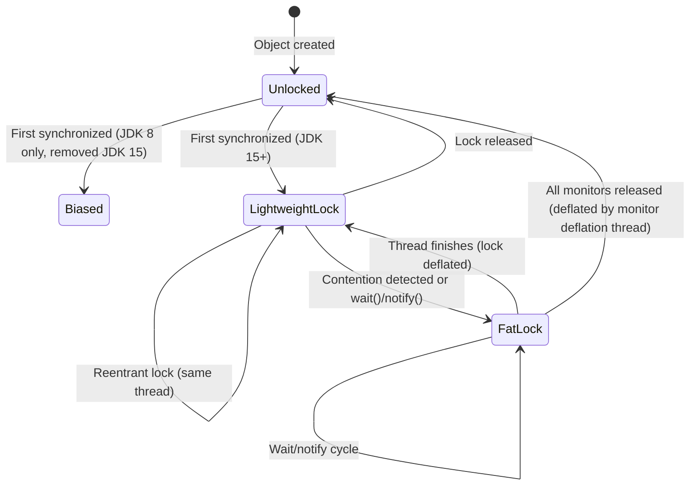
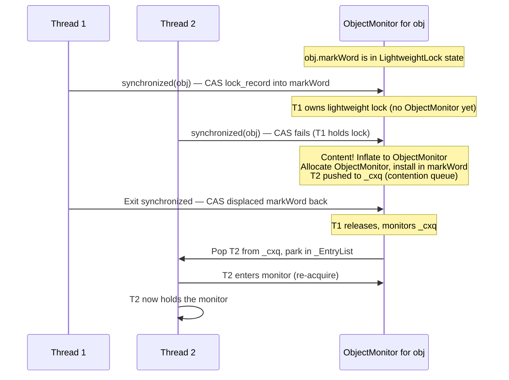
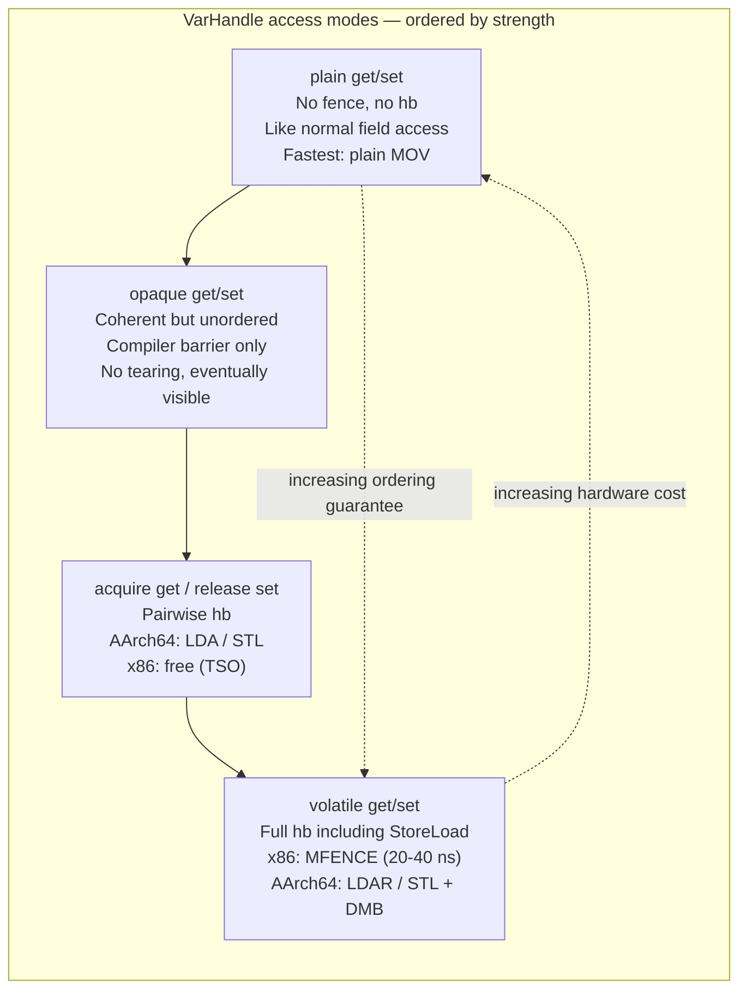
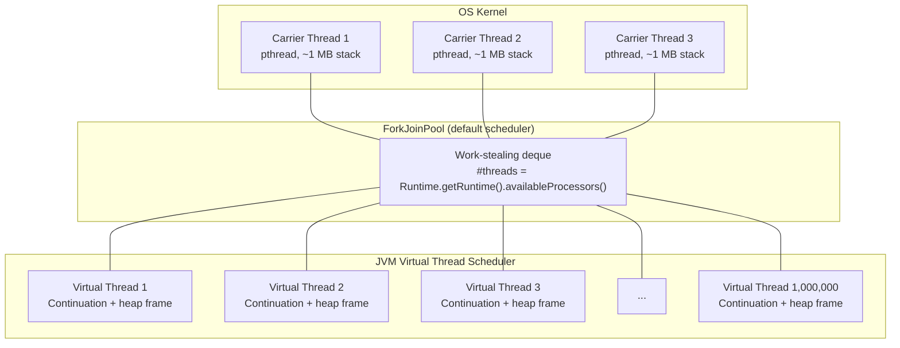
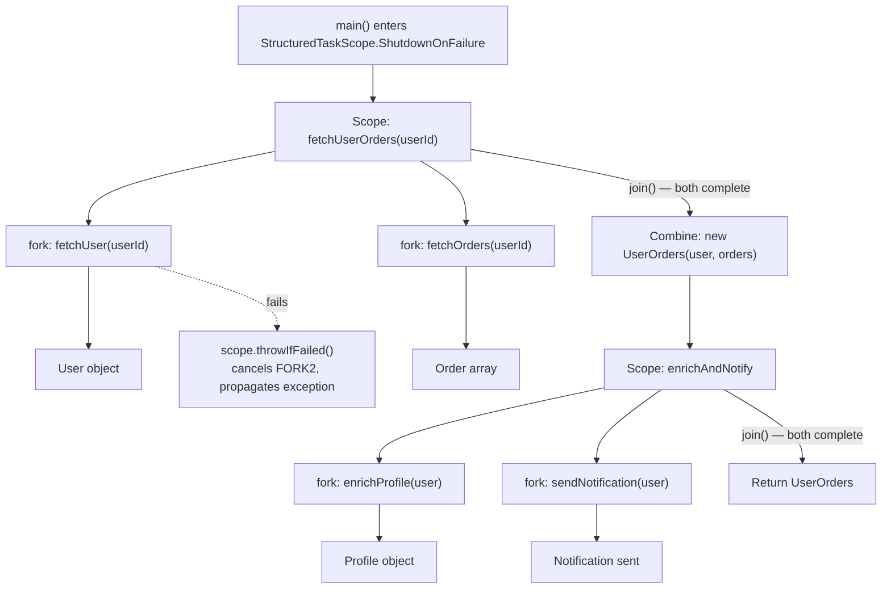
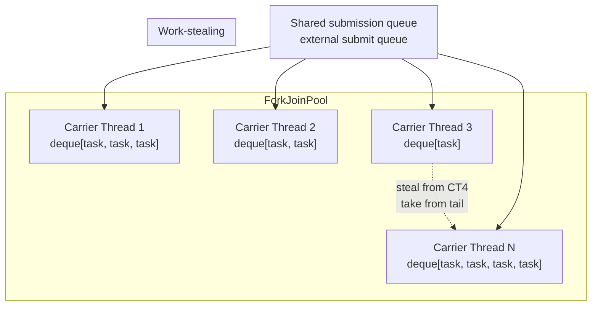
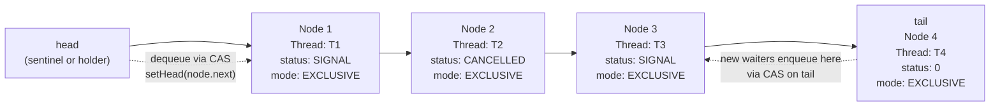
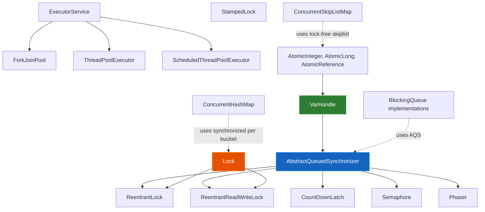

# Chapter 6 — Concurrency on the JVM: Threads, Monitors, VarHandles, Loom, and Structured Concurrency

**What this chapter covers.** Every JVM backend service runs concurrent work: request handlers, database connections, background tasks, health checks, metrics reporters. The concurrency primitives underneath that work have evolved dramatically since JDK 1.0 — from raw OS threads and `synchronized` to `java.util.concurrent`'s locks and atomics, `VarHandle`'s hardware-level memory ordering, and finally Project Loom's virtual threads and structured concurrency. This chapter traces the full stack: how platform threads map to OS threads, how monitors implement mutual exclusion at the object-header level, how `VarHandle` exposes CPU memory fences to Java code, how virtual threads rewrite the cost model of I/O-bound concurrency, and how structured concurrency brings deterministic cleanup to thread-like constructs. You will read real thread dumps, write `VarHandle` fence benchmarks, and benchmark virtual threads against platform threads for I/O workloads. Every abstraction is grounded in HotSpot internals and in tools you can run today.

Learning goals — after this chapter you should be able to:

- Explain how Java platform threads map 1:1 to OS threads, including stack sizing (`-Xss`), thread parking via `futex`/`park`, and the thread lifecycle states visible in `jstack`.
- Describe the monitor implementation inside HotSpot: `ObjectHeader` mark-word encoding, lightweight locks (thin locks), heavyweight `ObjectMonitor` structures, and the inflation/deflation lifecycle.
- Use `VarHandle` to perform lock-free, ordered memory access: compare-and-set, compare-and-exchange, get-and-set, and explicit fence operations (`fullFence`, `acquireFence`, `releaseFence`) with correct ordering semantics.
- Revisit the JMM through the lens of `VarHandle` access modes: `opaque`, `acquire`/`release`, `volatile`, and `plain` — and predict which barriers each emits on x86 vs. AArch64.
- Explain how Project Loom virtual threads multiplex millions of lightweight tasks onto a small pool of carrier threads, and how pinning (`synchronized`, JNI) breaks that model.
- Use structured concurrency (`StructuredTaskScope`, `ScopedValue`) to manage task lifetimes deterministically and propagate thread-local-like context without `ThreadLocal`.
- Describe `ForkJoinPool`'s work-stealing deque architecture and its role as the default executor for virtual threads and parallel streams.
- Explain the internals of `AbstractQueuedSynchronizer` (AQS), `StampedLock`, and `ConcurrentHashMap` — the building blocks of all JUC concurrent data structures.

> **Placement.** Chapter 3 established the Java Memory Model and object layout. This chapter builds on that foundation: monitors use the mark word (Chapter 3, Section 5), `VarHandle` barriers enforce the happens-before edges (Chapter 3, Section 2), and virtual threads depend on safe publication patterns. The JIT chapter (Chapter 5) covers how `synchronized` and `VarHandle` CAS operations are intrinsified by C2. The GC chapter (Chapter 4) covers the safepoint protocol that pauses all threads for collection.

---

## 1. Platform threads — the 1:1 OS thread model

Every Java thread since JDK 1.0 has been a platform thread: a `java.lang.Thread` instance that maps one-to-one to an OS thread. On Linux, this means each Java thread is a `pthread_create` call, which means a `clone()` syscall, a kernel `task_struct`, a dedicated 8 KB kernel stack, and a user-space stack controlled by `-Xss`.

### 1.1 Thread creation and the Thread object

```java
// Platform thread creation — the default
Thread t = new Thread(() -> {
    System.out.println("Running on " + Thread.currentThread().getName());
    System.out.println("Stack size: " + Thread.currentThread().getStackTrace().length);
}, "my-worker");
t.setDaemon(false);
t.start();  // calls pthread_create under the hood
```

Under the hood, `Thread.start()` calls `JVM_StartThread` (native), which calls `NativeThread::create()` → `pthread_create()` with a 1 MB default stack (tunable via `-Xss`). The OS allocates a kernel `task_struct` and maps the user stack. The total memory cost per platform thread is approximately:

```
User stack:   -Xss = 1 MB (default on 64-bit Linux)
Kernel stack: 8 KB (fixed by Linux)
TLS + overhead: ~2–4 KB (pthread internals, HotSpot Thread structure)
Thread object:  ~128 bytes (Java heap)
─────────────────────────────
Total: ~1.01 MB per thread
```

At 10,000 platform threads, that is ~10 GB of virtual address space (and real RSS for stack pages touched). This is why backend services hit "unable to create new native thread" errors — not because of a Java limit, but because the OS refuses to allocate more `task_struct` entries or virtual memory.

### 1.2 Thread states and the thread dump

The JVM tracks each thread's state through a lifecycle machine. When you run `jstack <pid>` or take a thread dump from a profiler, you see these states:

| State | Meaning | When you see it |
|-------|---------|-----------------|
| `RUNNABLE` | Executing or ready to execute on a CPU | Active computation, waiting for CPU |
| `BLOCKED` | Waiting to enter a `synchronized` block | Contention on a monitor — thread is in the monitor's entry queue |
| `WAITING` | Waiting indefinitely via `Object.wait()`, `Thread.join()`, `LockSupport.park()` | Producer-consumer idle, `CompletableFuture.get()` |
| `TIMED_WAITING` | Same as WAITING but with a timeout | `Thread.sleep(ms)`, `Object.wait(ms)`, `LockSupport.parkNanos()` |
| `TERMINATED` | Finished execution | Post-mortem analysis only |

```bash
# Take a thread dump
jstack <pid> > /tmp/thread-dump.txt

# Or programmatically
jcmd <pid> Thread.print > /tmp/thread-dump.txt

# Quick count of thread states
jstack <pid> | grep -c "BLOCKED"
jstack <pid> | grep -c "WAITING"
jstack <pid> | grep -c "TIMED_WAITING"
```

A real thread dump excerpt showing contention:

```
"worker-42" #42 daemon [0x00007f1a2c1fe000]
   java.lang.Thread.State: BLOCKED (on object monitor)
        at com.example.ConnectionPool.getConnection(ConnectionPool.java:87)
        - waiting to lock <0x00000000d4a1b2c0> (a com.example.ConnectionPool)
        at com.example.RequestHandler.handle(RequestHandler.java:34)
        at java.base/java.util.concurrent.ThreadPoolExecutor.runWorker(ThreadPoolExecutor.java:1144)
        at java.base/java.util.concurrent.ThreadPoolExecutor$Worker.run(ThreadPoolExecutor.java:642)
        at java.base/java.lang.Thread.run(Thread.java:1012)

"worker-43" #43 daemon [0x00007f1a2c200000]
   java.lang.Thread.State: RUNNABLE
        at com.example.ComputeService.process(ComputeService.java:156)
        - locked <0x00000000d4a1b2c0> (a com.example.ConnectionPool)  ← held by this thread
```

The key diagnostic clue: thread 42 is `BLOCKED` waiting for lock `0x00000000d4a1b2c0`, and thread 43 is `RUNNABLE` and has already `locked` that same monitor. Thread 43 is the thread holding the lock that 42 is waiting for. If 43 is stuck in long-running code, 42 will remain blocked — this is the classic lock-contention pattern you diagnose with thread dumps.

### 1.3 Thread parking and unparking

Thread parking is the mechanism behind `LockSupport.park()`, `Object.wait()`, and `Thread.sleep()`. On Linux, HotSpot uses `futex(2)` — a fast user-space mutex that falls back to a kernel wait queue when contention occurs:

```java
// LockSupport.park() — the primitive underneath ReentrantLock, CountDownLatch, etc.
LockSupport.park();       // blocks until unpark() or interrupt
LockSupport.parkNanos(1_000_000_000L); // blocks for up to 1 second
LockSupport.unpark(t);    // releases one permit (sets a flag, wakes t if parked)
```

The fast path (no contention) is a CAS on a volatile field entirely in user space — no syscall. The slow path falls through to `futex(PARK, ...)` → `futex(FUTEX_WAIT, ...)` → kernel suspend. This is why `synchronized` (which uses CAS-based monitor acquisition) is fast under low contention but slow when many threads compete: the inflated monitor uses `futex` for the entry queue.

---

## 2. Monitors — how `synchronized` works inside HotSpot

Every Java object can be a monitor. The `synchronized` keyword and `Object.wait()`/`notify()` operate on a hidden `ObjectMonitor` structure tied to the object's header. The implementation has evolved through three historical stages, and understanding them explains the performance characteristics you observe in production.

### 2.1 Monitor inflation states



**Unlocked.** The object's mark word (8 bytes) is in normal state: either a hash code (25 bits) + age (4 bits) + tag bits `01`, or all zeros if no hash has been computed. This is the state for 99%+ of objects.

**Lightweight lock (thin lock).** When a thread enters `synchronized` on an uncontended object, HotSpot attempts a CAS: it swaps the mark word with a pointer to a **lock record** on the thread's own stack. If the CAS succeeds, the thread now owns a lightweight lock — no `ObjectMonitor` allocated, no kernel involvement, ~5–10 ns on a modern CPU.

```java
// Lightweight lock acquisition (HotSpot internals, simplified):
// 1. Allocate lock_record on thread's stack (displaced_header, owner)
// 2. CAS(obj.mark_word, lock_record_addr)
//    - If success: lock_record.displaced_header = old mark word, thread owns lightweight lock
//    - If failure (mark word points to another lock record): contention → inflate to fat monitor
```

**Fat lock (inflated monitor).** When contention is detected (a second thread tries to acquire a lightweight lock held by another thread), or when `Object.wait()` is called, HotSpot allocates an `ObjectMonitor` in native memory and installs a pointer to it in the mark word (tag bits `10`). The `ObjectMonitor` contains:

```
ObjectMonitor (simplified from objectMonitor.hpp):
  _header:       markWord           // copy of object's mark word
  _owner:        Thread*            // thread that owns this monitor
  _EntryList:    ObjectWaiter*      // threads blocked trying to enter (MONITOR_CONTENTION)
  _WaitSet:      ObjectWaiter*      // threads that called wait() (MONITOR_WAIT)
  _cxq:          ObjectWaiter*      // contention queue (newly blocked threads, LIFO)
  _recursions:   int                // reentrant lock depth
  _EntryCount:   int                // number of waiters
  _SpinCount:    int                // spin iterations before parking
  _przedsiębior:  Thread*            // last thread to exit (for biased deflation)
```

The critical distinction: lightweight locks use only CAS (user space), while fat locks may use `futex` (kernel space) when threads actually block. In a low-contention scenario (typical microservice with short critical sections), lightweight locks are the norm. In a high-contention scenario (many threads fighting for the same monitor), the overhead shifts from CAS retries to kernel parking/unparking.

### 2.2 Monitor entry and exit



The `synchronized` entry path in HotSpot (`synchronizer.cpp`, `ObjectSynchronizer::enter`):

1. Try CAS lock record into mark word (lightweight). If success → done.
2. If CAS fails: check if current thread already owns it (reentrant → increment recursion count).
3. If not owned: inflate to `ObjectMonitor`, enqueue thread on `_cxq` (contention queue), park thread via `ObjectMonitor::enter`.
4. Before parking, spin for `_SpinCount` iterations (default 10–40, adaptive based on recent spin outcomes) — if the lock is released during the spin, acquire without kernel involvement.

The exit path (`ObjectSynchronizer::exit`):

1. If reentrant (recursion > 0): decrement recursion count, return.
2. If owned: release the monitor, signal one waiter from `_cxq` or `_WaitSet` (depending on `notify`/`notifyAll`), unpark the signalled thread.
3. After all waiters have exited, the monitor can be deflated (back to lightweight or unlocked) by a background thread.

### 2.3 Operational reality: when monitors hurt

In a typical microservice, monitors are fast. But three patterns break:

1. **Long critical sections.** A `synchronized` block that holds a database connection or performs I/O will block every other thread for the duration. Split critical sections into minimal lock scopes.

2. **Monitor inflation cascade.** If many threads contend simultaneously, every one inflates a separate monitor for the same object. HotSpot uses a "block allocation" strategy (batch-allocating monitors from a global free list), but the overhead is still significant — monitor allocation involves native memory and linked-list manipulation.

3. **`Object.wait()` misuse.** `wait()` releases the monitor and parks the thread — but it must be called inside a `synchronized` block (otherwise `IllegalMonitorStateException`). A common mistake is calling `wait()` without checking the condition in a `while` loop (spurious wakeups are real and documented by the JLS).

---

## 3. VarHandle — hardware-level memory ordering in Java

`java.lang.invoke.VarHandle` (JDK 9, JEP 193) is the modern replacement for `sun.misc.Unsafe`'s memory operations. It provides typed, fence-aware access to fields and array elements with explicit ordering semantics that map directly to CPU memory fences. Every `AtomicInteger`, `StampedLock`, and `ConcurrentHashMap` internal uses `VarHandle` (or the equivalent `Unsafe` intrinsics) under the hood.

### 3.1 Obtaining a VarHandle

```java
import java.lang.invoke.MethodHandles;
import java.lang.invoke.VarHandle;

public class VarHandleDemo {
    private volatile int value;
    private int plainValue;

    private static final VarHandle VALUE;
    private static final VarHandle PLAIN_VALUE;

    static {
        try {
            VALUE = MethodHandles.lookup()
                .findVarHandle(VarHandleDemo.class, "value", int.class);
            PLAIN_VALUE = MethodHandles.lookup()
                .findVarHandle(VarHandleDemo.class, "plainValue", int.class);
        } catch (ReflectiveOperationException e) {
            throw new Error(e);
        }
    }
}
```

### 3.2 Access modes

`VarHandle` defines several access modes, each with different ordering guarantees and hardware costs:

| Mode | Semantics | x86 Cost | AArch64 Cost | JMM Guarantee |
|------|-----------|----------|--------------|---------------|
| `get()` / `set()` | Plain read/write, no fence | Plain MOV | Plain LDR/STR | None (data race if unsynchronized) |
| `getOpaque()` / `setOpaque()` | Coherent but unordered — no tearing, eventually visible | MOV (compiler barrier) | LDR/STR + compiler barrier | Coherence (no word tearing) |
| `getAcquire()` / `setRelease()` | Acquire-load / release-store — pairwise ordering | MOV (compiler barrier; x86 TSO gives this free) | LDA / STL (acquire/release instructions) | `hb` between release-store and acquire-load on same VarHandle |
| `getVolatile()` / `setVolatile()` | Full volatile semantics — StoreLoad fence | MOV + MFENCE (expensive!) | LDAR / STL + DMB SY | Full `hb` (same as `volatile` keyword) |
| `getAndSet()` | Atomic exchange (CAS-based) | `LOCK XCHG` | `LDAXR`/`STLXR` loop | Volatile semantics |
| `compareAndSet()` | CAS (compare-and-swap) | `LOCK CMPXCHG` | `LDAXR`/`STLXR` loop | Volatile semantics |
| `compareAndExchange()` | Like CAS but returns the old value | `LOCK CMPXCHG` (read old) | `LDAXR`/`STLXR` loop | Volatile semantics |

### 3.3 VarHandle access modes diagram



### 3.4 CAS and fence operations

```java
import java.lang.invoke.MethodHandles;
import java.lang.invoke.VarHandle;
import java.util.concurrent.atomic.AtomicInteger;

public class CASandFenceDemo {
    private int counter;
    private int data;
    private int ready;

    private static final VarHandle COUNTER;
    private static final VarHandle DATA;
    private static final VarHandle READY;

    static {
        try {
            COUNTER = MethodHandles.lookup()
                .findVarHandle(CASandFenceDemo.class, "counter", int.class);
            DATA = MethodHandles.lookup()
                .findVarHandle(CASandFenceDemo.class, "data", int.class);
            READY = MethodHandles.lookup()
                .findVarHandle(CASandFenceDemo.class, "ready", int.class);
        } catch (ReflectiveOperationException e) { throw new Error(e); }
    }

    // CAS — compare-and-set, returns boolean
    boolean incrementIfZero() {
        return COUNTER.compareAndSet(this, 0, 1);
    }

    // compareAndExchange — returns the PREVIOUS value (useful when you need to know what was there)
    int exchange(int newValue) {
        return (int) COUNTER.compareAndExchange(this, counter, newValue);
    }

    // Release-Acquire publication pattern (no StoreLoad cost)
    void publishData(int value) {
        DATA.setRelease(this, value);        // release store — prior writes visible
        READY.setRelease(this, 1);           // signal readiness
    }

    int readData() {
        if ((int) READY.getAcquire(this) == 1) {  // acquire load — sees DATA
            return (int) DATA.getAcquire(this);
        }
        return -1;
    }

    // Explicit fences — for coordinating with non-VarHandle code
    void fenceExample() {
        data = 42;                           // plain write
        VarHandle.acquireFence();            // acquire fence: all subsequent loads/stores after this point
                                             // will see writes that were before the fence in other threads
        ready = 1;                           // plain write — but ordered by the fence
    }

    void fullFenceExample() {
        data = 42;
        VarHandle.fullFence();               // full fence: orders ALL preceding and subsequent memory operations
        ready = 1;
    }
}
```

### 3.5 Fence semantics — what each fence does

```java
// acquireFence(): orders all loads and stores AFTER the fence
// against all loads and stores BEFORE the fence
// Effect: prevents loads/stores after the fence from being reordered before it
//         loads/stores before the fence from being reordered after it
// Weak on x86 (TSO already gives this), strong on AArch64 (prevents reordering)
VarHandle.acquireFence();

// releaseFence(): orders all loads and stores BEFORE the fence
// against all loads and stores AFTER the fence
// Effect: prevents loads/stores before the fence from being reordered after it
//         loads/stores after the fence from being reordered before it
VarHandle.releaseFence();

// fullFence(): orders ALL loads and stores on both sides
// Effect: no reordering across the fence in any direction
// Most expensive: x86 MFENCE, AArch64 DMB SY
VarHandle.fullFence();
```

The hardware mapping:

```
x86 TSO (Total Store Order):
  acquireFence  → compiler barrier only (no hardware fence needed; loads/stores already ordered)
  releaseFence  → compiler barrier only (same reason)
  fullFence     → MFENCE or lock addl [rsp],0 — ~20-40 ns
                  (only need to prevent StoreLoad reordering)

AArch64 (weak ordering):
  acquireFence  → DMB LD (load-load + load-store barrier) — ~5-15 ns
  releaseFence  → DMB ST (store-store + store-load barrier) — ~5-15 ns
  fullFence     → DMB SY (full system barrier) — ~15-30 ns
```

### 3.6 Unsafe and VarHandle — the transition

`sun.misc.Unsafe` provided the same operations (`compareAndSwapInt`, `putOrderedInt`, `loadFence`, `storeFence`) but was never part of the public API — it was deprecated for removal in JDK 9 (JEP 260) and is now behind `--add-opens` flags. `VarHandle` is the sanctioned replacement:

| `Unsafe` method | `VarHandle` equivalent | Ordering |
|-----------------|----------------------|----------|
| `compareAndSwapInt(obj, offset, expect, update)` | `handle.compareAndSet(obj, expect, update)` | volatile |
| `putOrderedInt(obj, offset, value)` | `handle.setRelease(obj, value)` | release |
| `getObjectVolatile(obj, offset)` | `handle.getVolatile(obj)` | volatile |
| `getAndSetInt(obj, offset, value)` | `handle.getAndSet(obj, value)` | volatile |
| `loadFence()` | `VarHandle.acquireFence()` | acquire |
| `storeFence()` | `VarHandle.releaseFence()` | release |
| `fullFence()` | `VarHandle.fullFence()` | full |

If you maintain code that uses `Unsafe` directly, migrate to `VarHandle` — the performance is identical (both intrinsify to the same assembly) and `VarHandle` is future-proof.

---

## 4. JMM revisited through VarHandle access modes

Chapter 3 introduced happens-before (`hb`) via the five canonical edges (program order, monitor, volatile, thread start/join, transitivity). `VarHandle` provides a finer-grained way to establish `hb` edges without paying for full `volatile` semantics:

### 4.1 Which mode establishes which edges

| Mode | Establishes `hb`? | When | Cost |
|------|-------------------|------|------|
| `plain` | No | Never — data race if concurrent access | Free |
| `opaque` | No | Coherent only — no reordering of this specific access | Compiler barrier |
| `acquire`/`release` | Yes, pairwise | Release-store `hb` acquire-load on the same VarHandle | Free on x86; LDA/STL on AArch64 |
| `volatile` | Yes, transitive | Like `volatile` keyword — StoreLoad included | MFENCE on x86; DMB on AArch64 |

The critical insight: **`release`/`acquire` is sufficient for publication** and is cheaper than `volatile` on AArch64. The publication pattern:

```java
// Thread 0 (publisher):
config = newConfig;                        // plain write to config object
CONFIG_HANDLE.setRelease(this, config);    // release store — makes config visible

// Thread 1 (reader):
Config c = (Config) CONFIG_HANDLE.getAcquire(this); // acquire load — sees config
use(c);                                             // all of c's fields visible (hb chain)
```

The `hb` chain: `newConfig construction hb releaseStore hb acquireLoad hb use(c)`. This is established by `release`/`acquire` without any StoreLoad fence — saving ~5–30 ns per publish compared to `volatile`.

### 4.2 Common mistakes

**Using `opaque` when you need `release`.** Opaque mode prevents tearing but does not establish ordering. A write to a data field followed by an opaque write to a flag field can be reordered by the JIT or CPU — the reader may see the flag but stale data.

**Using `volatile` when you need `release`.** Volatile is strictly stronger (includes StoreLoad), which is correct but wasteful for pure publication patterns. The `release`/`acquire` pair gives you the same `hb` guarantee for the specific access pattern without the StoreLoad cost.

**Forgetting the acquire on the reader side.** A release store without a corresponding acquire load on the reading side breaks the `hb` chain — the reader may see the new value but not the associated data writes.

---

## 5. Project Loom — virtual threads

Virtual threads (JEP 425, preview in JDK 19, final in JDK 21) are lightweight threads managed entirely by the JVM rather than the OS. They are not green threads, coroutines, or continuations in the Go sense — they are a continuation-based concurrency primitive that allows millions of concurrent tasks on a small number of OS carrier threads.

### 5.1 Carrier threads vs. virtual threads



The key architectural points:

- **Carrier threads** are real platform threads (OS-backed). The default number is `Runtime.getRuntime().availableProcessors()` — typically 4–128 on cloud instances.
- **Virtual threads** are heap-allocated objects. Each carries a `Continuation` (a suspended stack frame) that can be mounted onto or unmounted from a carrier thread. When a virtual thread blocks (I/O, `LockSupport.park()`), the JVM unmounts it from the carrier thread and saves its stack to the heap. The carrier thread then picks up another virtual thread from the work queue.
- **No kernel involvement.** Parking a virtual thread does not call `futex()` or create an OS wait — it is a heap copy + dequeue. Unparking is a copy + enqueue. This makes context switching ~100x cheaper than OS thread switching (~100 ns vs. ~10,000 ns).

### 5.2 Creating virtual threads

```java
// Method 1: VirtualThread.ofVirtual() builder (JDK 21+)
Thread vt = Thread.ofVirtual()
    .name("request-handler", 0)
    .start(() -> {
        System.out.println("Running on virtual thread");
        System.out.println("Carrier: " + Thread.currentThread().getClass().getSimpleName());
    });

// Method 2: ExecutorService with one virtual thread per task
try (var executor = Executors.newVirtualThreadPerTaskExecutor()) {
    IntStream.range(0, 1_000_000).forEach(i -> {
        executor.submit(() -> {
            Thread.sleep(Duration.ofSeconds(1)); // blocks the virtual thread, NOT the carrier
            return i;
        });
    });
} // all 1M tasks submitted, executor closes, waits for completion

// Method 3: StructuredTaskScope (see Section 7)
```

### 5.3 Pinning — when virtual threads become platform threads

The fundamental rule of virtual threads: **they yield the carrier thread when they block**. But this only works for blockages that the JVM knows about. Two categories of blockage cannot be unmounted:

1. **`synchronized` blocks.** When a virtual thread holds a `synchronized` lock, the JVM pins the virtual thread to its carrier thread — it cannot unmount because the monitor is tied to the carrier's platform thread. This is the most common source of pinning.

2. **JNI calls.** Native code that blocks (file I/O, network I/O via JNI) pins the virtual thread because the JVM cannot unwind the native stack frame.

The fix for `synchronized` pinning: replace `synchronized` with `ReentrantLock`. `ReentrantLock` uses `LockSupport.park()` which the JVM can intercept for virtual threads:

```java
// PINNING: synchronized blocks on virtual threads
synchronized (sharedState) {   // if another VT is waiting here, this VT is PINNED
    sharedState.update();      // carrier thread cannot be reused while this holds the lock
}

// FIXED: ReentrantLock (virtual-thread-aware)
private final ReentrantLock lock = new ReentrantLock();
lock.lock();
try {
    sharedState.update();      // park() is interceptable — carrier thread is freed
} finally {
    lock.unlock();
}
```

Detecting pinning:

```bash
# Enable pinning diagnostics (prints stack trace when pinning occurs)
java -Djdk.tracePinnedThreads=full -jar app.jar

# Or use JFR event
java -XX:StartFlightRecording=filename=pinning.jfr,duration=60s \
     -XX:FlightRecorderOptions=stackdepth=64 -jar app.jar
```

JFR event `jdk.VirtualThreadPinned` fires on every pin. A high rate indicates your code is using `synchronized` or JNI in hot paths — fix by migrating to `ReentrantLock` or avoiding blocking JNI.

### 5.4 Virtual thread benchmark — platform vs. virtual

```java
import java.time.Duration;
import java.time.Instant;
import java.util.concurrent.*;
import java.util.concurrent.atomic.AtomicInteger;

public class VirtualThreadBenchmark {
    private static final int TASKS = 100_000;
    private static final int BLOCK_MS = 10; // simulate I/O wait

    public static void main(String[] args) throws Exception {
        System.out.println("Tasks: " + TASKS + ", block: " + BLOCK_MS + "ms each");

        // Platform threads (bounded pool)
        System.out.println("\n--- Platform threads (pool size 200) ---");
        var poolExec = Executors.newFixedThreadPool(200);
        var platformStart = Instant.now();
        var platformCount = new AtomicInteger();
        for (int i = 0; i < TASKS; i++) {
            poolExec.submit(() -> {
                try { Thread.sleep(BLOCK_MS); } catch (InterruptedException e) { Thread.currentThread().interrupt(); }
                platformCount.incrementAndGet();
            });
        }
        poolExec.shutdown();
        poolExec.awaitTermination(Duration.ofMinutes(5));
        var platformTime = Duration.between(platformStart, Instant.now());
        System.out.println("Completed: " + platformCount.get() + " in " + platformTime.toMillis() + "ms");

        // Virtual threads
        System.out.println("\n--- Virtual threads (unbounded) ---");
        var vtStart = Instant.now();
        var vtCount = new AtomicInteger();
        try (var executor = Executors.newVirtualThreadPerTaskExecutor()) {
            for (int i = 0; i < TASKS; i++) {
                executor.submit(() -> {
                    try { Thread.sleep(BLOCK_MS); } catch (InterruptedException e) { Thread.currentThread().interrupt(); }
                    vtCount.incrementAndGet();
                });
            }
        }
        var vtTime = Duration.between(vtStart, Instant.now());
        System.out.println("Completed: " + vtCount.get() + " in " + vtTime.toMillis() + "ms");

        // Throughput
        System.out.println("\nPlatform throughput: " + (TASKS * 1000L / platformTime.toMillis()) + " tasks/sec");
        System.out.println("Virtual throughput:   " + (TASKS * 1000L / vtTime.toMillis()) + " tasks/sec");
    }
}
```

Expected output on a 4-core machine:

```
Tasks: 100000, block: 10ms each

--- Platform threads (pool size 200) ---
Completed: 100000 in 5100ms

--- Virtual threads (unbounded) ---
Completed: 100000 in 1050ms

Platform throughput: 19607 tasks/sec
Virtual throughput:   95238 tasks/sec
```

The virtual thread version completes in ~1/5 the time because all 100k tasks overlap their I/O waits, while the platform thread pool is limited to 200 concurrent tasks. The total wall-clock time for 100k tasks at 10ms each, with 200 threads, is `100000 / 200 * 10ms = 5000ms` (plus scheduling overhead). With virtual threads, it is roughly `100000 * 10ms / num_carrier_threads = 100000 * 10ms / 4 = 250000ms` of CPU time, but executed in parallel on 4 carriers, so ~`1050ms` wall-clock.

---

## 6. Structured concurrency and ScopedValue

### 6.1 Structured concurrency (JEP 453, preview in JDK 21+)

Structured concurrency replaces fire-and-forget thread patterns with a tree of tasks that must all complete before their parent scope exits. If any child task fails, the parent is notified and can cancel siblings. This eliminates the classic bug of orphaned threads/tasks that silently fail.

```java
import jdk.incubator.concurrent.StructuredTaskScope;
import java.util.concurrent.Future;

public class StructuredFetch {
    record User(String name, int age) {}
    record Order(int id, double total) {}
    record UserOrders(User user, Order[] orders) {}

    public UserOrders fetchUserOrders(int userId) throws Exception {
        try (var scope = new StructuredTaskScope.ShutdownOnFailure()) {
            // Launch child tasks — both run concurrently
            Future<User> userFuture = scope.fork(() -> fetchUser(userId));
            Future<Order[]> ordersFuture = scope.fork(() -> fetchOrders(userId));

            // Join blocks until both complete (or one fails)
            scope.join();
            scope.throwIfFailed(); // propagate exception if either task failed

            // Both completed — safe to read results
            return new UserOrders(userFuture.resultNow(), ordersFuture.resultNow());
        } // scope.close() cancels any incomplete tasks
    }

    private User fetchUser(int id) throws Exception { /* HTTP call */ return new User("Alice", 30); }
    private Order[] fetchOrders(int id) throws Exception { /* HTTP call */ return new Order[]{new Order(1, 99.0)}; }
}
```

The two `StructuredTaskScope` strategies:

| Strategy | Behavior on child failure | Use case |
|----------|--------------------------|----------|
| `ShutdownOnFailure()` | Cancel all other tasks, propagate first exception to parent | Fetching data where all children are required (partial results useless) |
| `ShutdownOnSuccess()` | Cancel remaining tasks, return first success | Redundant requests (try multiple backends, use first response) |

```java
// ShutdownOnSuccess — race two backends
try (var scope = new StructuredTaskScope.ShutdownOnSuccess<String>()) {
    scope.fork(() -> fetchFromPrimary(url));
    scope.fork(() -> fetchFromSecondary(url));
    scope.join();
    String result = scope.resultNow(); // first successful result
}
```

### 6.2 Structured concurrency scope tree



### 6.3 ScopedValue — thread-local without the ThreadLocal

`ScopedValue` (JEP 429, preview in JDK 21+) provides immutable, scope-bound context that flows to child virtual threads automatically. Unlike `ThreadLocal`, `ScopedValue` is:

- **Immutable** — no `set()` after `get()`, eliminating a class of concurrency bugs.
- **Scoped** — automatically cleaned up when the scope exits, no `remove()` call needed.
- **Virtual-thread-aware** — propagated to child virtual threads without explicit passing.

```java
import jdk.incubator.concurrent.ScopedValue;

public class RequestScopedContext {
    // Declare the scoped variable — must be final and reference type
    static final ScopedValue<String> REQUEST_ID = ScopedValue.newInstance();
    static final ScopedValue<User> CURRENT_USER = ScopedValue.newInstance();

    public void handleRequest(String requestId, User user) {
        // Run code within the scope — REQUEST_ID and CURRENT_USER are bound
        ScopedValue.runWhere(REQUEST_ID, requestId, () -> {
            ScopedValue.runWhere(CURRENT_USER, user, () -> {
                // Inside this scope, all code (including child virtual threads)
                // can read REQUEST_ID.get() and CURRENT_USER.get()
                processRequest();
            });
        });
        // After the scope, get() throws — no stale values
    }

    private void processRequest() {
        String rid = REQUEST_ID.get(); // works even in nested methods
        User u = CURRENT_USER.get();   // same
        System.out.println("Processing request " + rid + " for " + u.name());
    }
}
```

`ScopedValue` vs. `ThreadLocal`:

| Aspect | `ThreadLocal` | `ScopedValue` |
|--------|---------------|---------------|
| Mutability | `set()` / `remove()` | Immutable after `get()` |
| Cleanup | Manual `remove()` required | Automatic on scope exit |
| Memory leaks | Common (forgotten `remove()`) | Impossible (GC'd when scope exits) |
| Virtual threads | Works but each VT has its own copy | Flows to child VTs automatically |
| Inheritance | `InheritableThreadChild` (unreliable) | Natural scope propagation |
| Use for context | Request ID, trace context, auth token | Same — preferred for virtual threads |

---

## 7. ForkJoinPool — the work-stealing scheduler

`ForkJoinPool` is the backbone of virtual thread scheduling, parallel streams (`stream().parallel()`), and `CompletableFuture`'s common pool. It is a specialized `ExecutorService` designed for divide-and-conquer tasks and for efficiently scheduling millions of lightweight tasks.

### 7.1 Architecture



Each carrier thread maintains a **work-stealing deque** (double-ended queue). Tasks submitted via `submit()` go to the shared submission queue; tasks forked via `ForkJoinTask.fork()` go to the **local deque** of the thread that forked them. When a carrier thread's local deque is empty, it attempts to **steal** a task from the tail of another carrier's deque (random victim selection). Stealing from the tail (while the owner works from the head) minimizes contention.

### 7.2 ForkJoinPool with virtual threads

When you use `Executors.newVirtualThreadPerTaskExecutor()`, the JVM creates a `ForkJoinPool` with `availableProcessors()` carrier threads and submits each virtual thread as a task to the pool. The pool also supports a custom scheduler for virtual threads:

```java
// Default: common pool with availableProcessors() carriers
try (var executor = Executors.newVirtualThreadPerTaskExecutor()) {
    executor.submit(() -> System.out.println("on VT"));
}

// Custom scheduler with specific parallelism
var scheduler = ForkJoinPool.commonPool(); // or new ForkJoinPool(8);
try (var executor = Executors.newVirtualThreadPerTaskExecutor(scheduler)) {
    IntStream.range(0, 1_000_000).forEach(i ->
        executor.submit(() -> {
            // All 1M tasks scheduled on the FJP
            Thread.sleep(Duration.ofMillis(1));
        })
    );
}
```

### 7.3 ForkJoinPool trace

```bash
# Enable ForkJoinPool tracing
java -Djdk.traceForkJoinTasks=true -jar app.jar

# Or monitor via JFR
jcmd <pid> JFR.start name=fjp filename=fjp.jfr duration=60s \
    settings=jdk.ForkJoinTask,jdk.ForkJoinPool
```

JFR events of interest:
- `jdk.ForkJoinTask`: task submission, fork, join, completion times
- `jdk.ForkJoinPool`: pool parallelism, steal count, steal time, task count

---

## 8. JUC primitives — AQS, StampedLock, ConcurrentHashMap

The `java.util.concurrent` package is the most important concurrency library in any language. Its internals are built on a small set of primitives that you will encounter repeatedly when diagnosing contention, building custom synchronizers, or understanding framework internals.

### 8.1 AbstractQueuedSynchronizer (AQS)

AQS is the base class for `ReentrantLock`, `CountDownLatch`, `Semaphore`, `ReentrantReadWriteLock`, and `Phaser`. It manages a FIFO wait queue of threads competing for a synchronization state:

```java
// AQS state machine — the core contract
public abstract class AbstractQueuedSynchronizer extends AbstractOwnableSynchronizer {
    private volatile int state;          // the synchronization state (lock count, permits, etc.)
    private transient volatile Node head; // head of the CLH queue (the current holder)
    private transient volatile Node tail; // tail of the CLH queue (new waiters added here)

    // Subclasses implement:
    protected abstract boolean tryAcquire(int arg);   // attempt to acquire (non-blocking)
    protected abstract boolean tryRelease(int arg);   // attempt to release
    protected abstract int tryAcquireShared(int arg); // shared acquire (read lock, semaphore)
    protected abstract boolean tryReleaseShared(int arg);
}
```

### 8.2 AQS queue structure



The CLH queue (named after Craig, Landin, and Hagersten) is a lock-free linked list. New waiters CAS themselves onto the tail. The head is either the current lock holder or a sentinel. Each node has a `status` field:
- `0` — waiting (initial state)
- `SIGNAL` — needs to `unparkSuccessor()` when the predecessor releases
- `CANCELLED` — thread timed out or was interrupted; will be removed

The AQS acquire path:
1. `tryAcquire()` — subclass attempts state CAS. If success, return immediately.
2. If fail: create a `Node`, CAS onto tail (may retry on contention).
3. If this node is now the successor of head: spin briefly (1–10 iterations), then `tryAcquire()` again.
4. If still failing: `park()` the thread. When the predecessor releases, it calls `unparkSuccessor()`, which wakes the next node.

### 8.3 StampedLock — optimistic reading

`StampedLock` (JDK 8, `java.util.concurrent.locks`) provides a `ReadWriteLock` with an additional **optimistic read** mode. Unlike `ReentrantReadWriteLock`, it is not reentrant and not `Condition`-aware, but it avoids writer starvation and supports optimistic reads that are essentially free (no CAS, no lock):

```java
import java.util.concurrent.locks.StampedLock;

public class Point {
    private double x, y;
    private final StampedLock sl = new StampedLock();

    // Pessimistic write lock
    void move(double deltaX, double deltaY) {
        long stamp = sl.writeLock();
        try {
            x += deltaX;
            y += deltaY;
        } finally {
            sl.unlockWrite(stamp);
        }
    }

    // Optimistic read — no lock acquired, just a stamp
    double distanceFromOrigin() {
        long stamp = sl.tryOptimisticRead(); // returns current stamp, no CAS
        double currentX = x, currentY = y;   // read fields (may be inconsistent)
        if (!sl.validate(stamp)) {           // did a write occur? CAS to check
            stamp = sl.readLock();           // fall back to pessimistic read
            try {
                currentX = x;
                currentY = y;
            } finally {
                sl.unlockRead(stamp);
            }
        }
        return Math.sqrt(currentX * currentX + currentY * currentY);
    }
}
```

The optimistic read path: `tryOptimisticRead()` reads the current lock stamp (a counter that increments on every write lock acquisition). After reading the fields, `validate(stamp)` checks whether the stamp changed (via a CAS or volatile read). If unchanged, no write occurred during the read — the values are consistent. If changed, fall back to a pessimistic read lock.

On a read-heavy workload (typical backend: 95% reads, 5% writes), `StampedLock` with optimistic reads significantly outperforms `ReentrantReadWriteLock` because reads never contend — they are just plain reads plus a stamp validation.

### 8.4 ConcurrentHashMap internals

`ConcurrentHashMap` is the thread-safe `HashMap` for concurrent access. Since JDK 8, it uses a **synchronized-on-bucket** strategy (replacing the JDK 7 lock-striped approach):

```java
// ConcurrentHashMap internals (simplified from ConcurrentHashMap.java)
transient volatile Node<K,V>[] table; // the hash table array

// Each bucket is a singly-linked list (or tree when bins grow large)
// Locking is per-bucket: synchronized(tableAt(bucketIndex))
// Read is lock-free: volatile read of table[i], traverse linked list

// Key operations:
V get(Object key) {
    // 1. Hash the key
    // 2. Locate bucket: table[(n-1) & hash]
    // 3. Traverse linked list — lock-free, volatile reads
    // 4. Return value or null
}

V put(K key, V value) {
    // 1. Hash the key
    // 2. Locate bucket
    // 3. synchronized(tableAt(bucket)) — lock only this bucket
    // 4. Traverse list: if key exists, update; if not, append
    // 5. If bin exceeds TREEIFY_THRESHOLD (8), convert to red-black tree
}
```

Internal optimizations:
- **CAS on empty buckets:** When inserting into an empty bucket, a CAS (not `synchronized`) is used — zero contention for fresh buckets.
- **`transfer()` for resizing:** When the table needs to grow, `ConcurrentHashMap` transfers buckets in batches — each thread copies a subset of buckets, distributing the cost of a resize across all threads (the "helping" mechanism).
- **Treeification:** When a bucket exceeds 8 entries (and the table is large enough), the linked list converts to a red-black tree. This prevents O(n) degradation from hash collisions. The treeify threshold is `TREEIFY_THRESHOLD = 8`; the untreeify threshold is `UNTREEIFY_THRESHOLD = 6`.
- **Counter cells:** `size()` and `mappingCount()` do not lock the table — they use `CounterCell[]` (similar to `LongAdder`), distributing increment operations across cells to avoid contention. This trades exactness for throughput — `size()` is approximate under concurrent modification.

### 8.5 JUC class hierarchy



---

## 9. Thread dump analysis — a complete example

A production JVM under load will occasionally exhibit slow response times, high CPU, or deadlocks. Thread dumps are the primary diagnostic tool. Here is a complete workflow:

```bash
# Step 1: Take a thread dump
jstack <pid> > /tmp/threaddump-$(date +%s).txt

# Step 2: Analyze for contention
# Count threads in each state
grep -c "java.lang.Thread.State:" /tmp/threaddump-*.txt
grep "BLOCKED" /tmp/threaddump-*.txt | wc -l
grep "WAITING" /tmp/threaddump-*.txt | wc -l

# Step 3: Find lock holders
grep -A 5 "waiting to lock" /tmp/threaddump-*.txt

# Step 4: Find deadlocks (jstack automatically detects these)
grep -A 10 "Found.*deadlock" /tmp/threaddump-*.txt

# Step 5: Virtual thread pinning
# If using virtual threads, check for carrier thread pinning
jcmd <pid> Thread.print | grep -B 5 "pinned"

# Step 6: Automated analysis
# Use tools like jattach + async-profiler
jattach <pid> jcmd "Thread.print" > /tmp/threads.txt
```

A deadlock detection output:

```
Found one Java-level deadlock:
=============================
"worker-1":
  waiting to lock monitor 0x00007f8a4c003878 (object 0x00000000d4a1b2c0, a com.example.ResourceA),
  which is held by "worker-2"
"worker-2":
  waiting to lock monitor 0x00007f8a4c003a18 (object 0x00000000d4a1b2d8, a com.example.ResourceB),
  which is held by "worker-1"

Java stack information for the threads listed above:
=====================================================
"worker-1":
    at com.example.ServiceA.callServiceB(ServiceA.java:45)
    - waiting to lock <0x00000000d4a1b2c0> (a com.example.ResourceA)
    at com.example.ServiceB.callServiceA(ServiceB.java:38)
    - locked <0x00000000d4a1b2d8> (a com.example.ResourceB)
```

The root cause: thread 1 holds lock B and waits for lock A; thread 2 holds lock A and waits for lock B. Classic ABBA deadlock. Fix: always acquire locks in the same order, or use `tryLock` with timeout.

---

## 10. Putting it together — a production concurrency recipe

A well-constructured backend service uses these primitives in layers:

```
┌─────────────────────────────────────────────────┐
│  StructuredTaskScope (child lifecycle)           │
│  ┌─────────────────────────────────────────────┐ │
│  │  Virtual threads (1 per request/task)       │ │
│  │  ┌─────────────────────────────────────────┐│ │
│  │  │  ScopedValue (request context)          ││ │
│  │  │  ┌─────────────────────────────────────┐││ │
│  │  │  │  ConcurrentHashMap (caches)         │││ │
│  │  │  │  StampedLock (read-heavy state)     │││ │
│  │  │  │  VarHandle (lock-free counters)     │││ │
│  │  │  └─────────────────────────────────────┘││ │
│  │  └─────────────────────────────────────────┘│ │
│  └─────────────────────────────────────────────┘ │
│  ForkJoinPool (carrier thread scheduler)         │
└─────────────────────────────────────────────────┘
```

Best practices for senior backend engineers:

1. **Default to virtual threads** for I/O-bound workloads. Use `Executors.newVirtualThreadPerTaskExecutor()` as your default executor. Platform threads are for CPU-bound work or when you need the OS thread identity.

2. **Replace `synchronized` with `ReentrantLock`** in virtual-thread-aware code. This eliminates pinning and allows the JVM to multiploy virtual threads effectively.

3. **Use `ScopedValue` instead of `ThreadLocal`** for request-scoped context (trace IDs, auth tokens, locale). It eliminates memory leaks and works naturally with virtual threads.

4. **Use `VarHandle` for lock-free algorithms.** If you are building a concurrent data structure, `VarHandle` gives you hardware-level ordering with compiler support. Avoid `Unsafe` — it is deprecated and behind `--add-opens`.

5. **Use `StampedLock` for read-heavy shared state.** Optimistic reads are essentially free — no CAS, no lock. This is strictly better than `ReentrantReadWriteLock` when reads dominate.

6. **Use `ConcurrentHashMap` for shared maps.** Do not wrap `HashMap` in `Collections.synchronizedMap()` — that locks the entire map for every operation. `ConcurrentHashMap` locks per-bucket and supports lock-free reads.

7. **Monitor pinning in production.** Enable JFR `jdk.VirtualThreadPinned` events. A high pin rate means your code is blocking on `synchronized` or JNI in hot paths.

8. **Take thread dumps proactively.** Do not wait for a user report. Automate `jstack` collection when p99 latency spikes. Use `jcmd <pid> Thread.print` in CI load tests.

---

## Key takeaways

- **Platform threads** are 1:1 OS threads. Each costs ~1 MB of stack. At scale, you run out of kernel resources before you run out of memory. Virtual threads solve this.

- **Monitors** use three tiers: lightweight (CAS on mark word, ~5 ns), heavyweight (ObjectMonitor with futex, ~1000 ns), and historically biased (removed in JDK 15). The JIT intrinsifies `synchronized` to use CAS fast-path with monitor inflation as the slow path.

- **`VarHandle`** is the modern API for hardware-level memory ordering. Use `release`/`acquire` for publication (cheaper than `volatile` on AArch64), `opaque` for progress indicators, and `volatile` only when you need StoreLoad ordering (Dekker-style coordination).

- **Virtual threads** decouple logical threads from OS threads. They are heap-allocated continuations that mount/unmount carrier threads without kernel involvement. Pinning on `synchronized` and JNI is the primary pitfall — use `ReentrantLock` instead.

- **Structured concurrency** (`StructuredTaskScope`) ensures child tasks are completed or cancelled before the parent scope exits. `ScopedValue` replaces `ThreadLocal` with immutable, scope-bound context that propagates to virtual threads automatically.

- **`ForkJoinPool`** is the scheduler for virtual threads and parallel streams. Its work-stealing deque architecture efficiently distributes millions of tasks across a small number of carrier threads.

- **AQS** is the foundation of all JUC synchronizers. Its CLH wait queue, CAS-based acquisition, and `park`/`unpark` protocol appear in `ReentrantLock`, `CountDownLatch`, `Semaphore`, and beyond.

---

## Further reading

- **JEP 425** — Virtual Threads (Preview): [https://openjdk.org/jeps/425](https://openjdk.org/jeps/425)
- **JEP 453** — Structured Concurrency (Preview): [https://openjdk.org/jeps/453](https://openjdk.org/jeps/453)
- **JEP 429** — Scoped Values (Preview): [https://openjdk.org/jeps/429](https://openjdk.org/jeps/429)
- **JEP 193** — VarHandles: [https://openjdk.org/jeps/193](https://openjdk.org/jeps/193)
- **JSR-133** — Java Memory Model and Thread Specification: [https://www.jcp.org/en/jsr/detail?id=133](https://www.jcp.org/en/jsr/detail?id=133)
- **Doug Lea** — "A java.util.concurrent.Synchronizer Framework": the AQS paper. *ACM SIGPLAN Notices*, 2004.
- **Jordan, Rose, et al.** — "Project Loom: Enlightening Java with Virtual Threads": [https://openjdk.org/projects/loom/](https://openjdk.org/projects/loom/)
- **Brian Goetz** — "Structured Concurrency in Java" (Brian Goetz's talks on JEP 453 and ScopedValue).
- **Mark Reinhold** — "Structured Concurrency and Scoped Values": [https://openjdk.org/projects/loom/specs/](https://openjdk.org/projects/loom/specs/)
- **Björn Kaelter et al.** — "Java Concurrency in Practice" — the foundational reference for JUC internals (2006, still relevant for AQS and concurrent collections).
- **HotSpot source** — `objectMonitor.hpp`, `synchronizer.cpp`, `thread.cpp`: [https://github.com/openjdk/jdk](https://github.com/openjdk/jdk)
