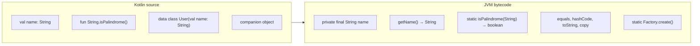
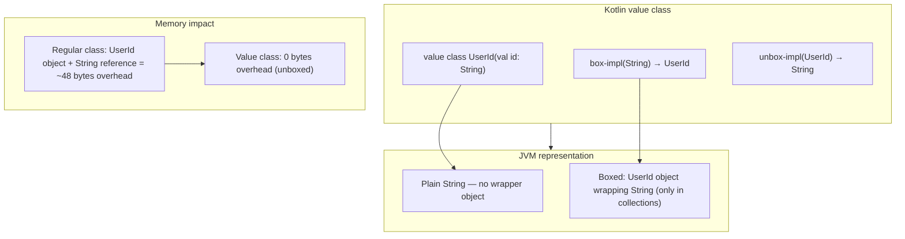
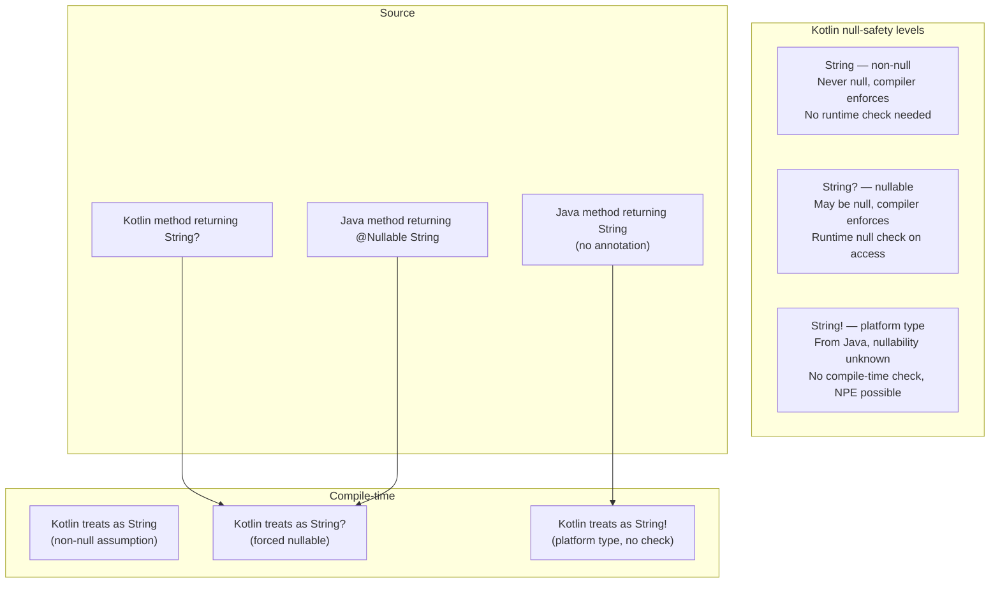
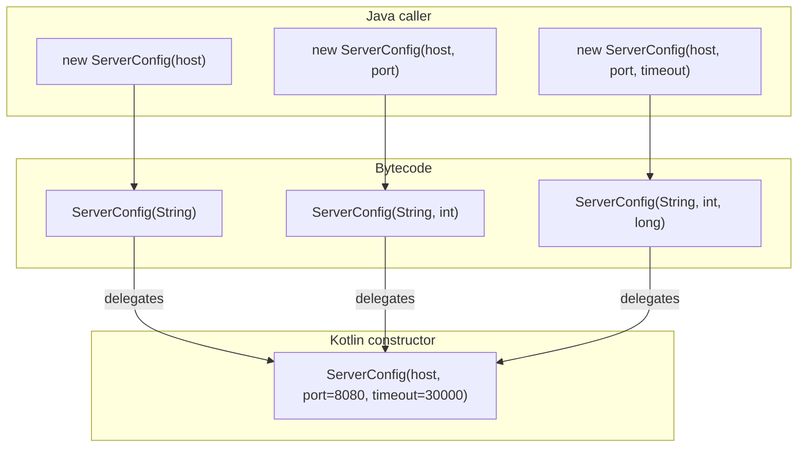
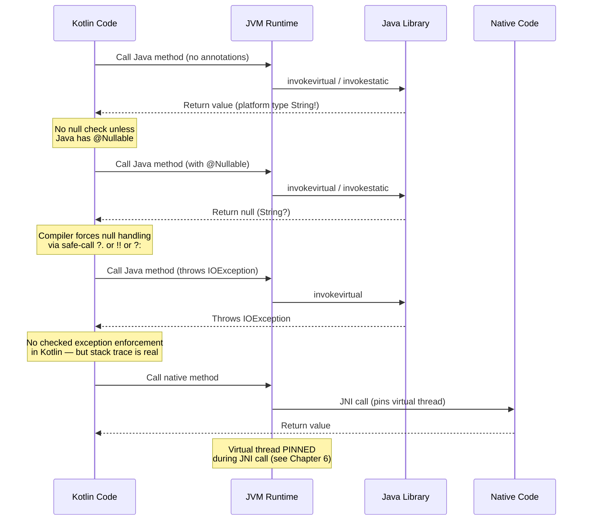
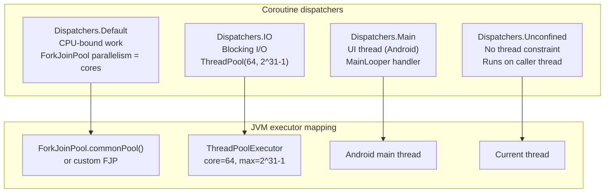
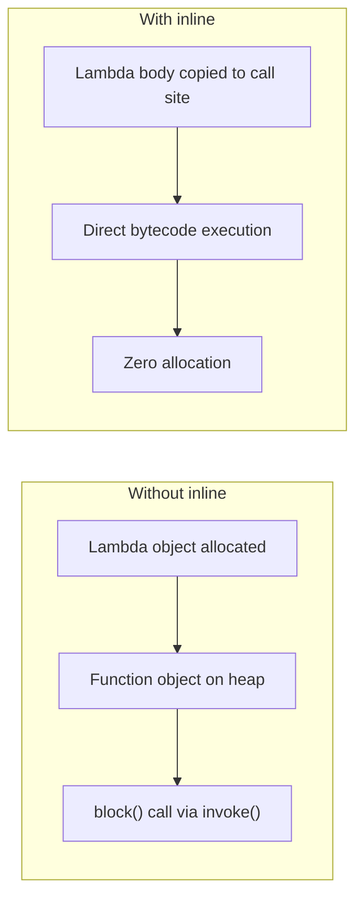

# Chapter 7 — Kotlin on the JVM: Interop, Null-Safety, Coroutines, and Compiler Intrinsics

**What this chapter covers.** Kotlin has become the primary language for new JVM backend services at most FAANG-scale companies, yet many teams treat it as "Java with less boilerplate" without understanding what the compiler actually produces on the JVM. This chapter opens the black box: how Kotlin's language constructs map to JVM bytecode, how the null-safety system prevents NPEs at compile time while interoperating with Java's billions of lines of nullable code, how suspend functions desugar into state machines that the JVM executes as continuation-passing style, and how compiler intrinsics like `inline`/`reified` break the JVM's erasure barrier to give you type-safe generics at zero runtime cost. Every abstraction is grounded in real bytecode you can inspect with `javap`, real pitfalls you will encounter in production, and real performance characteristics measured on modern JVMs.

Learning goals — after this chapter you should be able to:

- Describe how Kotlin properties, data classes, companion objects, sealed classes, and extension functions map to JVM bytecode — including the getter/setter convention, `copy()`, `hashCode()`/`equals()`/`toString()`, and `@JvmStatic`.
- Explain the null-safety system: platform types, the distinction between Kotlin's null checks and Java's NPE, JSpecify annotations, and the correct way to annotate Java APIs for Kotlin consumption.
- Navigate Java-Kotlin interop: SAM conversions for functional interfaces, checked exception handling, `@JvmOverloads`, `@JvmName`, `@JvmField`, and how to name Kotlin APIs that are pleasant from Java.
- Describe how `suspend` functions desugar into JVM methods with a `Continuation` parameter, how the Kotlin compiler generates a state machine, and what `Dispatchers.Default`/`IO`/`Main` map to in terms of executor threads.
- Use structured concurrency in Kotlin (`coroutineScope`, `supervisorScope`, `async`, `launch`) and predict how cancellation propagates through the coroutine tree.
- Explain compiler intrinsics: how `inline` functions eliminate lambda allocation overhead, how `reified` type parameters survive erasure for runtime type checks and `is T` casts, and when to use `value class` to eliminate wrapper allocation.
- Identify and fix common interop pitfalls: platform type NPEs, SAM conversion ambiguity, checked exception swallowing, companion object vs. static, and coroutine dispatcher misuse.

> **Placement.** Chapter 1 established the JVM architecture and bytecode model. Chapter 3 covered the Java Memory Model and object layout. Chapter 6 covered threads, monitors, and virtual threads. This chapter builds on those foundations: Kotlin properties rely on the JVM's method resolution (Chapter 2), coroutine dispatchers use the executor infrastructure from Chapter 6, and the state machine generated by `suspend` functions relies on the JVM's method invocation and exception table mechanisms (Chapter 1). The JIT chapter (Chapter 5) covers how `inline` functions and intrinsics are optimized by the compiler.

---

## 1. Kotlin→JVM mapping: what the compiler actually produces

Kotlin compiles to JVM bytecode. Every language feature — properties, data classes, extension functions, sealed classes, companion objects — produces standard `.class` files that HotSpot, GraalVM, and any JVM can execute. Understanding the mapping is essential for interop, performance tuning, and debugging.

### 1.1 Properties → getters and setters

Kotlin properties do not exist on the JVM. Every property is compiled into a private field plus a getter and (if `var`) a setter:

```kotlin
// Kotlin source
class User(val name: String, var age: Int)
```

```bash
# Inspect the bytecode with javap
javap -p -c build/classes/kotlin/main/User.class
```

```
public final class User {
  private final java.lang.String name;  // private field, backing store
  private int age;                      // private field, backing store

  public final java.lang.String getName();  // getter for 'name'
    Code:
       0: aload_0
       1: getfield      #12  // Field name:Ljava/lang/String;
       4: areturn

  public final int getAge();                 // getter for 'age'
    Code:
       0: aload_0
       1: getfield      #16  // Field age:I
       4: ireturn

  public final void setAge(int);             // setter for 'age' (var only)
    Code:
       0: aload_0
       1: iload_1
       2: putfield      #16  // Field age:I
       5: return

  public User(java.lang.String, int);        // primary constructor
  public java.lang.String toString();        // auto-generated
  public int hashCode();                     // auto-generated
  public boolean equals(java.lang.Object);   // auto-generated
}
```

From Java, a Kotlin `val name: String` becomes `user.getName()`. A Kotlin `var age: Int` becomes `user.getAge()` / `user.setAge(42)`. This is the standard JavaBeans convention — no surprises, but worth knowing when you see `getName()` in a stack trace and wonder where it came from.

**Extension functions** compile as static methods with the receiver as the first parameter:

```kotlin
// Kotlin extension function
fun String.isPalindrome(): Boolean =
    this.lowercase() == this.lowercase().reversed()
```

```bash
javap -p -c build/classes/kotlin/main/UserKt.class
```

```
public static final boolean isPalindrome(java.lang.String);
    Code:
       0: aload_0
       1: invokevirtual #12  // Method String.toLowerCase:()Ljava/lang/String;
       4: aload_0
       5: invokevirtual #12  // Method String.toLowerCase:()Ljava/lang/String;
       ...
```



### 1.2 Data classes: equals, hashCode, toString, copy, componentN

A `data class` generates `equals()`, `hashCode()`, `toString()`, `copy()`, and `componentN()` functions based on the primary constructor parameters:

```kotlin
data class Point(val x: Double, val y: Double)
```

```bash
javap -p build/classes/kotlin/main/Point.class
```

```
public final class Point {
  private final double x;
  private final double y;

  public Point(double, double);                    // constructor
  public final double getX();                      // getter
  public final double getY();                      // getter
  public final Point copy(double, double);         // copy with defaults
  public static Point copy$default(Point, double, double, int, Object);
  public java.lang.String toString();             // "Point(x=1.0, y=2.0)"
  public int hashCode();                          // 31 * 31 + x bits + y bits
  public boolean equals(java.lang.Object);        // structural equality
  public final double component1();               // destructuring: val (x, y) = point
  public final double component2();
}
```

**Performance note:** `hashCode()` for data classes uses a simple polynomial hash. For large data classes, this can be slow and non-deterministic across JVM restarts (randomized `String.hashCode` seed). In hot paths, consider a custom `hashCode()` or a stable hash library.

### 1.3 Companion objects → static methods

Kotlin has no static methods. The `companion object` compiles to a nested class with a `Companion` instance and a synthetic accessor:

```kotlin
class UserService {
    companion object {
        private val MAX_RETRIES = 3
        fun create(): UserService = UserService()
    }
}
```

```bash
javap -p build/classes/kotlin/main/UserService.class
```

```
public final class UserService {
  private static final int MAX_RETRIES;
  static final UserService$Companion Companion;  // the singleton companion
  static {};

  public UserService();
  public static final UserService create();      // <-- what Java calls
  public static final int getMaxRetries$...();   // backing for MAX_RETRIES
}
```

From Java: `UserService.Companion.create()`. With `@JvmStatic`, it becomes `UserService.create()` — a true static method. Without `@JvmStatic`, Java callers must go through the `Companion` object.

```kotlin
class UserService {
    companion object {
        @JvmStatic
        fun create(): UserService = UserService()
    }
}
```

Now Java sees `UserService.create()` — no `Companion` in the path.

### 1.4 Value classes: zero-overhead wrappers

`value class` (previously `inline class`) eliminates the allocation overhead of wrapper types. At runtime, the JVM sees the underlying type directly:

```kotlin
@JvmInline
value class UserId(val id: String) {
    init {
        require(id.isNotBlank()) { "UserId must not be blank" }
    }
}

// Usage
fun findUser(userId: UserId): User { ... }

// At the call site: NO allocation
findUser(UserId("abc-123"))  // just passes "abc-123" as a String
```

```bash
javap -p build/classes/kotlin/main/UserId.class
```

```
public final class UserId {
  public static final UserId box-impl(java.lang.String);   // for collections
  public static final java.lang.String unbox-impl(UserId); // unwrap
  public static boolean equals-impl(java.lang.String, java.lang.Object);
  public static boolean hashCode-impl(java.lang.String);
  // ... no String field — it IS the String at the JVM level
}
```



**Pitfall:** When a value class is used as a generic type argument or in a collection, the compiler **boxes** it. This defeats the zero-overhead goal. Use value classes for domain types passed through function parameters, not for `List<UserId>` (use `List<String>` instead and convert at the boundary).

---

## 2. Null-safety: compile-time guarantees across the Java boundary

Kotlin's null-safety system is one of its most valuable features for backend services. The compiler tracks nullability in the type system: `String` is non-null, `String?` is nullable, and every platform type (`!`) is a boundary where nullability is undetermined.

### 2.1 The type hierarchy



### 2.2 Platform types: the silent killer

When Kotlin calls Java code that lacks null annotations, the return type is a **platform type** (`String!`). The Kotlin compiler does not insert a null check — it trusts the Java code. If the Java code returns null, the Kotlin caller gets an NPE at the call site, not at the definition site:

```kotlin
// Java library (no annotations)
public class Config {
    public String getConfigValue(String key) {
        return map.get(key);  // may return null!
    }
}

// Kotlin caller — compiles fine, but may crash at runtime
val value: String = Config().getConfigValue("timeout")
// If getConfigValue returns null → NullPointerException at this line
// The NPE points HERE, not in the Java code — making debugging harder
```

The fix: annotate Java APIs with `@Nullable`/`@NonNull` from JSpecify or JetBrains annotations:

```java
import org.jspecify.annotations.Nullable;

public class Config {
    @Nullable
    public String getConfigValue(String key) {
        return map.get(key);
    }
}
```

Now Kotlin sees `String?` (nullable), and the compiler forces you to handle the null:

```kotlin
val value: String? = Config().getConfigValue("timeout")
val safe: String = value ?: "default"  // compiler-enforced null handling
```

### 2.3 Null checks in Kotlin vs. Java

Kotlin's `!!` operator and the implicit null check produce different bytecode than Java's NPE:

```kotlin
// Kotlin null check
fun greet(name: String?) {
    println("Hello, ${name!!.uppercase()}")
}
```

```java
// Equivalent Java
public void greet(String name) {
    if (name == null) {
        throw new NullPointerException("name cannot be null");
    }
    System.out.println("Hello, " + name.toUpperCase());
}
```

Both produce a `checkcast` or explicit null check, but Kotlin's `!!` uses `IntrinsicCheckParameterIsNotNullImpl` which is a Kotlin-specific intrinsic that throws `NullPointerException` with a descriptive message. The stack trace differs:

```
// Kotlin !! operator
Exception in thread "main" java.lang.NullPointerException: name cannot be null
    at UserKt.greet(User.kt:3)
    at UserKt.main(User.kt:5)

// Java implicit null dereference
Exception in thread "main" java.lang.NullPointerException
    at User.greet(User.java:5)
    at User.main(User.java:10)
```

**Distribution-systems lens:** In a backend service processing millions of requests, platform-type NPEs are the #1 source of Kotlin/Java interop bugs. They appear as 500 errors in HTTP responses, logged with stack traces that point to the Kotlin call site — far from the Java code that returned null. The fix is systematic: add `@Nullable`/`@NonNull` annotations to every Java method that crosses the interop boundary, and enforce it with a lint rule (`NullAway` for Java, or Kotlin's built-in platform-type detection).

### 2.4 JSpecify and the annotation landscape

| Annotation | From | Used by | Semantics |
|------------|------|---------|-----------|
| `@Nullable` / `@NonNull` | `org.jspecify.annotations` | Kotlin, NullAway, Error Prone | Type-use, applies to parameters, return types, fields |
| `@Nullable` / `@NotNull` | `org.jetbrains.annotations` | IntelliJ, Kotlin | Kotlin's native annotation processing |
| `@Nullable` / `@NonNull` | `javax.annotation` | FindBugs, SpotBugs | Legacy, not type-use (applies to declaration) |
| `@NullMarked` / `@NullUnmarked` | `org.jspecify.annotations` | JSpecify module-level default | Marks an entire class/module as non-null by default |

The recommended approach for new Java codebases: use **JSpecify** annotations (`org.jspecify.annotations`). They are type-use annotations (apply to generics, arrays, etc.), supported by both Kotlin and NullAway, and designed for cross-language interop:

```java
import org.jspecify.annotations.NullMarked;
import org.jspecify.annotations.Nullable;

@NullMarked  // Everything is non-null by default
public class UserRepository {
    public User findById(long id) { ... }             // non-null return
    public @Nullable User findByEmail(String email) { ... }  // nullable return
    public List<User> findAll(@Nullable String filter) { ... } // nullable parameter
}
```

---

## 3. Java-Kotlin interop: making the boundary disappear

### 3.1 SAM conversions: lambdas for Java functional interfaces

Kotlin automatically converts lambda expressions to Java SAM (Single Abstract Method) interfaces — but the mechanics differ from Java's own lambda conversion:

```kotlin
// Java functional interface
@FunctionalInterface
public interface Handler {
    void handle(Request request, Response response);
}

// Kotlin: SAM conversion — lambda becomes Handler instance
server.addRoute("/api") { req, resp ->
    resp.setStatus(200)
    resp.write("OK")
}

// Explicit SAM conversion
val handler = Handler { req, resp -> resp.setStatus(200) }
```

**Pitfall:** Kotlin lambdas allocate an anonymous class on each invocation (unless inlined). For hot paths, prefer method references or `inline` functions:

```kotlin
// Allocation on every call
server.addRoute("/api") { req, resp -> handler.handle(req, resp) }

// Method reference — no allocation (compiled to a constant MethodHandle)
server.addRoute("/api", ::handleRequest)
```

### 3.2 Checked exceptions: the Kotlin vs. Java divide

Java enforces checked exceptions in the type system. Kotlin does not. When Kotlin code throws a checked exception, it compiles fine, but Java callers that catch the exception must declare it in their `throws` clause:

```kotlin
// Kotlin: no throws declaration needed
fun parseConfig(path: String): Config {
    val content = File(path).readText()  // may throw IOException — no compiler warning
    return parse(content)
}
```

```java
// Java caller: must handle IOException even though Kotlin doesn't declare it
try {
    Config config = parseConfig("/etc/app.conf");
} catch (IOException e) {  // compiler requires this
    // ...
}
```

The fix: use `@Throws` to declare checked exceptions for Java callers:

```kotlin
@Throws(IOException::class)
fun parseConfig(path: String): Config {
    val content = File(path).readText()
    return parse(content)
}
```

### 3.3 JVM interop annotations

| Annotation | Effect | Use case |
|------------|--------|----------|
| `@JvmStatic` | Adds a true static method to the companion object | Java callers: `Foo.create()` instead of `Foo.Companion.create()` |
| `@JvmOverloads` | Generates overloads with default parameters | Java callers: `Foo.create("name")` without passing all defaults |
| `@JvmName` | Renames the JVM method/class | Avoid name clashes: `fun List<Int>.filter(...)` → `@JvmName("filterInt")` |
| `@JvmField` | Exposes the backing field directly | Simple data holders: `val x: Int` → `public int x` (no getter) |
| `@JvmRecord` | Makes a data class a JVM record (Java 16+) | Java 16+ pattern matching, `record` syntax |
| `@JvmMultifileClass` | Merges multiple file-level declarations | Splitting large files while keeping a single JVM class |

```kotlin
// @JvmOverloads: generates overloaded methods for Java
class ServerConfig @JvmOverloads constructor(
    val host: String,
    val port: Int = 8080,
    val timeout: Long = 30_000
)
```

```bash
javap -p build/classes/kotlin/main/ServerConfig.class
```

```
public final class ServerConfig {
  public ServerConfig(java.lang.String);                     // host only
  public ServerConfig(java.lang.String, int);                // host + port
  public ServerConfig(java.lang.String, int, long);          // host + port + timeout
}
```



### 3.4 The interop call graph: who calls whom



---

## 4. Coroutines: suspend functions as JVM state machines

Kotlin coroutines are the language's answer to asynchronous programming without the callback hell of raw `Future`/`CompletableFuture` chains. On the JVM, a `suspend` function compiles to a method with an extra `Continuation<T>` parameter and a state machine encoded in the method body.

### 4.1 What a suspend function compiles to

```kotlin
suspend fun fetchUser(id: String): User {
    val response = httpClient.get("/users/$id")  // suspend call
    return parseUser(response)
}
```

```bash
javap -p -c build/classes/kotlin/main/UserFetcherKt.class
```

```
public static final java.lang.Object fetchUser(
    java.lang.String,
    kotlin.coroutines.Continuation  // <-- the hidden Continuation parameter
);
  Code:
    0: aload_1
    1: checkcast     #18  // UserFetcherKt$fetchUser$1
    4: astore_3
    5: aload_3
    6: getfield      #20  // Field L$0:Ljava/lang/Object;
    9: checkcast     #24  // Continuation
   12: aload_1
   13: checkcast     #28  // String
   16: astore        5
   18: iconst_0
   19: istore        6
   21: new           #30  // UserFetcherKt$fetchUser$1  ← STATE MACHINE CLASS
   24: dup
   25: aload         5
   27: aload_3
   28: iconst_0     // label = 0 (initial state)
   29: invokespecial #32  // UserFetcherKt$fetchUser$1.<init>
   32: areturn
```

The key insight: the compiler generates an inner class (`fetchUser$1`) that implements `Continuation<User>` and contains a `label` field that tracks which suspension point to resume from. Each `suspend` call site becomes a `label` value:

```mermaid
stateDiagram-v2
    [*] --> State0: Initial entry
    State0 --> State1: "label = 0: call httpClient.get()"
    note right of State1:_suspend: save local vars,\nreturn from method\nresumePoint = label
    State1 --> State2: "label = 1: httpClient resumes\nparseUser(response)"
    note right of State2: Continuation.resumeWith()\ncalled by dispatcher
    State2 --> [*]: "label = 2: return result"
```

### 4.2 The Continuation interface

The `Continuation<T>` interface is the backbone of the coroutine state machine:

```kotlin
// From kotlin.coroutines
interface Continuation<in T> {
    val context: CoroutineContext
    fun resumeWith(result: Result<T>)
}
```

When a suspend function hits its first suspension point (an actual suspend, like an I/O call), it:
1. Saves local variables into the state machine object.
2. Creates a `Continuation` callback that captures the current state.
3. Returns from the method — the caller's stack is freed.

When the I/O completes, the runtime calls `continuation.resumeWith(result)`, which:
1. Restores local variables from the state machine.
2. Jumps to the correct `label` via a `when` expression.
3. Continues execution from where it left off.

```kotlin
// Simplified state machine (what the compiler generates internally)
class FetchUserContinuation(
    val id: String,
    val completion: Continuation<User>
) : Continuation<User> {
    var label = 0
    var result: Any? = null

    override fun resumeWith(result: Result<User>) {
        this.result = result
        try {
            when (label) {
                0 -> {
                    label = 1
                    httpClient.get("/users/$id", this)  // suspend call → saves state
                }
                1 -> {
                    val response = result.getOrThrow()
                    val user = parseUser(response)
                    completion.resumeWith(Result.success(user))
                }
            }
        } catch (e: Exception) {
            completion.resumeWith(Result.failure(e))
        }
    }
}
```

### 4.3 Dispatchers: where coroutines run

The coroutine dispatcher determines which thread (or thread pool) a coroutine executes on:



```kotlin
// Dispatchers.Default — CPU-bound
withContext(Dispatchers.Default) {
    val result = cpuIntensiveParse(data)  // runs on ForkJoinPool
}

// Dispatchers.IO — blocking I/O
withContext(Dispatchers.IO) {
    val conn = dataSource.getConnection()  // blocks a thread from IO pool
    val rs = conn.prepareStatement("SELECT ...").executeQuery()
}

// Dispatchers.Main — UI (Android)
withContext(Dispatchers.Main) {
    textView.text = "Updated"  // runs on Android main thread
}
```

**Pitfall: `Dispatchers.IO` vs. `Dispatchers.Default`.** Using `Default` for blocking I/O starves the CPU-bound pool. Using `IO` for CPU-bound work wastes the 64-thread limit on computation. In a backend service, map dispatchers to your actual workload:

```kotlin
// WRONG: IO dispatcher for CPU-bound JSON parsing
suspend fun processMessage(msg: Message): Result =
    withContext(Dispatchers.IO) {
        objectMapper.readValue(msg.body, Request::class.java)  // CPU, not IO
    }

// RIGHT: Default dispatcher for CPU work
suspend fun processMessage(msg: Message): Result =
    withContext(Dispatchers.Default) {
        objectMapper.readValue(msg.body, Request::class.java)
    }
```

### 4.4 Structured concurrency

Kotlin's structured concurrency ties coroutine lifetimes to a scope. When the scope exits, all child coroutines are cancelled:

```kotlin
suspend fun fetchUserProfile(userId: String): UserProfile =
    coroutineScope {
        val userDeferred = async { fetchUser(userId) }
        val ordersDeferred = async { fetchOrders(userId) }
        val preferencesDeferred = async { fetchPreferences(userId) }

        // All three run concurrently
        // If ANY fails, the scope cancels ALL others and throws
        UserProfile(
            user = userDeferred.await(),
            orders = ordersDeferred.await(),
            preferences = preferencesDeferred.await()
        )
    }
```

**Cancellation propagation:**

```kotlin
suspend fun processBatch(items: List<Item>) = coroutineScope {
    items.chunked(100).forEach { chunk ->
        launch(Dispatchers.Default) {
            chunk.forEach { item ->
                ensureActive()  // check for cancellation before each item
                processItem(item)
            }
        }
    }
}
```

`supervisorScope` differs from `coroutineScope` — a child failure does **not** cancel siblings:

```kotlin
suspend fun resilientFetch(ids: List<String>): Map<String, User> =
    supervisorScope {
        ids.associateWith { id ->
            async {
                runCatching { fetchUser(id) }.getOrNull()  // failure → null, not cancellation
            }.await()
        }
    }
```

---

## 5. Compiler intrinsics: inline, reified, and the erasure escape hatch

The JVM erases generic type parameters at runtime. You cannot write `if (obj is List<String>)` in Java because `List<String>` becomes `List` after erasure. Kotlin's `inline` + `reified` combination breaks this limitation by inlining the function body at the call site with the concrete type preserved.

### 5.1 inline functions: no lambda allocation

Normal Kotlin lambdas allocate an anonymous class on each invocation:

```kotlin
// Without inline: allocates a Runnable/Function object every call
fun measure(block: () -> Unit) {
    val start = System.nanoTime()
    block()
    val elapsed = System.nanoTime() - start
    println("Took ${elapsed / 1_000_000}ms")
}

measure { heavyComputation() }  // allocates a lambda object
```

With `inline`, the compiler copies the lambda body into the call site — zero allocation:

```kotlin
// With inline: no allocation, lambda body inlined
inline fun measure(block: () -> Unit) {
    val start = System.nanoTime()
    block()  // body inlined at call site
    val elapsed = System.nanoTime() - start
    println("Took ${elapsed / 1_000_000}ms")
}

measure { heavyComputation() }  // no allocation — body directly inlined
```



### 5.2 reified type parameters: surviving erasure

The `reified` keyword preserves the type parameter at the call site by inlining the function body with the concrete type:

```kotlin
// Without reified: type is erased, cannot use for type checks
inline fun <T> deserialize(json: String, clazz: Class<T>): T {
    return objectMapper.readValue(json, clazz)
}

// With reified: type is inlined with concrete type
inline fun <reified T> deserialize(json: String): T {
    return objectMapper.readValue(json, T::class.java)  // T::class.java works!
}

// Call site — T becomes User at compile time
val user: User = deserialize<User>(jsonString)
// Compiles to:
// val user: User = objectMapper.readValue(jsonString, User::class.java)
```

**How reified works under the hood:** The compiler generates a synthetic method that accepts a `KClass<T>` parameter, and at each call site, passes the concrete type. The function body is inlined, so the `T::class.java` reference resolves to the actual class at compile time:

```bash
# What the compiler generates for deserialize<User>(json)
invokestatic deserialize$default(String)User  # synthetic method with reified param
# The call site passes User::class.java explicitly
```

**Use cases for reified types in backend services:**

```kotlin
// Type-safe JSON deserialization
inline fun <reified T : Any> String.fromJson(): T =
    objectMapper.readValue(this, T::class.java)

// Runtime type checks
inline fun <reified T> Any.isType(): Boolean = this is T

// Reflection-free configuration binding
inline fun <reified T : Any> Config.bind(): T =
    configMapper.convertValue(this, T::class.java)

// Generic filtering
inline fun <reified T : Any> List<*>.filterIsType(): List<T> =
    filterIsInstance<T>()
```

### 5.3 value class and inline class internals

`value class` (previously `inline class`) provides zero-overhead type-safe wrappers. The compiler inlines the wrapper type at the call site, avoiding allocation:

```kotlin
@JvmInline
value class Email(val value: String) {
    init {
        require('@' in value) { "Invalid email: $value" }
    }
}

fun sendEmail(to: Email, body: String) {
    smtpClient.send(to.value, body)
}
```

At the call site, `Email` is inlined — the JVM sees a plain `String`:

```bash
javap -c build/classes/kotlin/main/Email.class
```

```
public static final void sendEmail(java.lang.String, java.lang.String);
  Code:
    0: aload_0
    1: aload_1
    2: invokestatic  #12  // SMTPClient.send(String, String)
    5: return
```

No `Email` object is created. The validation runs only at construction sites. This is ideal for domain types in hot paths — `UserId`, `OrderId`, `Email` — where the safety of a distinct type matters but the allocation cost is unacceptable.

### 5.4 Inline class boxing behavior

```kotlin
// Unboxed: direct parameter
fun process(id: UserId) { ... }  // receives plain String at JVM level

// Boxed: generic or collection context
fun processAll(ids: List<UserId>) { ... }  // List<Object> at JVM level, boxed UserId

// Boxed: nullable
fun process(id: UserId?) { ... }  // UserId is boxed for nullable check
```

**Pitfall:** Overusing value classes in generic contexts causes unexpected boxing. Profile before applying value classes to hot-path data structures.

---

## 6. Interop pitfalls: production war stories

### 6.1 The platform type NPE in a microservice

A backend service processed user events from Kafka. The event parser returned a `String` from Java code (no annotation). The Kotlin consumer used the value directly:

```kotlin
// Kotlin service consuming from Kafka
val eventData: String = eventParser.parse(rawMessage)  // platform type!
val userId = extractUserId(eventData)  // NPE if parse returns null
```

The Java `eventParser.parse()` returned `null` for malformed messages — the null was caught at the Kotlin call site as an NPE, but the stack trace pointed to `extractUserId`, making the root cause invisible. The fix: annotate the Java parser's return type with `@Nullable` and handle it explicitly:

```kotlin
val eventData: String? = eventParser.parse(rawMessage)
if (eventData == null) {
    log.warn("Malformed message, skipping")
    return
}
```

### 6.2 Checked exception swallowing

A Kotlin library function threw `IOException` but the Kotlin code didn't declare it (Kotlin doesn't enforce checked exceptions). The Java caller caught `IOException` but never saw it because the Kotlin compiler didn't generate the `throws` declaration in the bytecode:

```kotlin
// Kotlin — no @Throws
fun readConfig(path: String): Config = File(path).readText().let(::parse)
// Throws IOException but Java doesn't know
```

```java
// Java — catches IOException but the compiler doesn't require it
try {
    Config config = readConfig("/etc/app.conf");
} catch (IOException e) {  // compiles fine, but the exception IS thrown
    // This works, but the Java developer doesn't know to catch it
}
```

The danger: a Java developer who doesn't read the Kotlin source may not catch the exception, leading to unhandled exceptions in production. Fix: always add `@Throws(IOException::class)` for functions that throw checked exceptions consumed by Java.

### 6.3 Coroutine dispatcher misuse in a web server

A web server used a single `Dispatchers.IO` dispatcher for all request processing:

```kotlin
// WRONG: all requests share one IO pool
suspend fun handleRequest(req: Request): Response =
    withContext(Dispatchers.IO) {
        val dbResult = database.query(req.sql)    // blocks
        val cacheResult = cache.get(req.key)       // blocks
        processResults(dbResult, cacheResult)       // CPU work — wastes IO thread
    }
```

The IO pool has 64 threads by default. Under load, all 64 threads were blocked on database calls, and the CPU-bound `processResults` was starving other requests. The fix: use separate dispatchers for blocking and CPU work:

```kotlin
// RIGHT: separate blocking and CPU dispatchers
suspend fun handleRequest(req: Request): Response {
    val dbResult = withContext(Dispatchers.IO) {
        database.query(req.sql)
    }
    val cacheResult = withContext(Dispatchers.IO) {
        cache.get(req.key)
    }
    return withContext(Dispatchers.Default) {
        processResults(dbResult, cacheResult)  // CPU work on dedicated pool
    }
}
```

---

## 7. Sealed classes, when expressions, and exhaustive matching

Kotlin's `sealed` class hierarchy enables exhaustive `when` expressions — the compiler ensures every subclass is handled. On the JVM, sealed classes compile to a base class with `final` subclasses (since Kotlin 1.5, sealed classes can be in the same file or same module):

```kotlin
sealed class Result<out T> {
    data class Success<T>(val value: T) : Result<T>()
    data class Error(val exception: Exception) : Result<Nothing>()
    object Loading : Result<Nothing>()
}

// Exhaustive when — compiler rejects if a subclass is missing
fun <T> handleResult(result: Result<T>): String = when (result) {
    is Result.Success -> "Got: ${result.value}"
    is Result.Error -> "Failed: ${result.exception.message}"
    is Result.Loading -> "Loading..."
    // If you add a new Result subclass and forget to handle it here,
    // the compiler fails — this is the distributed-systems safety net
}
```

From the JVM perspective, `sealed` is a compiler-enforced convention — it produces a standard class hierarchy with no special bytecode. The exhaustiveness check is purely a compile-time feature, but it is critical for backend services where adding a new error type and forgetting to handle it in a `when` expression silently breaks error handling.

### 7.1 Sealed classes for distributed-systems error modeling

In a microservice, errors flow across service boundaries as protobuf enums or JSON error codes. Kotlin sealed classes model these as type-safe ADTs:

```kotlin
sealed class ServiceError(val code: String, val httpStatus: Int) {
    data class NotFound(val resource: String) :
        ServiceError("NOT_FOUND", 404)
    data class RateLimited(val retryAfterSeconds: Long) :
        ServiceError("RATE_LIMITED", 429)
    data class Internal(val cause: Throwable) :
        ServiceError("INTERNAL", 500)
    object Unavailable :
        ServiceError("UNAVAILABLE", 503)
}

fun Response.toServiceError(): ServiceError = when (statusCode) {
    404 -> ServiceError.NotFound(path)
    429 -> ServiceError.RateLimited(retryAfterSeconds())
    500 -> ServiceError.Internal(IOException("upstream 500"))
    503 -> ServiceError.Unavailable
    else -> ServiceError.Internal(IOException("unexpected $statusCode"))
}
```

This pattern makes it impossible to silently ignore a new HTTP status code — the `when` expression fails at compile time. It also makes error handling testable: you can exhaustively match on sealed subclasses in tests without worrying about missing branches.

---

## 8. Distributed-systems lens: Kotlin interop at scale

In a microservice architecture, Kotlin-to-Java interop is not a personal coding preference — it is an organizational boundary. When your service exposes a gRPC API generated from Protobuf (Java stubs), consumes a Java SDK for AWS/GCP, and integrates with a Java-based Kafka client library, every layer crosses the interop boundary.

### 8.1 Annotation discipline as a contract

At FAANG scale, the JSpecify annotation strategy is a team-wide policy, not an individual choice. If your Java SDK returns `@Nullable`, the Kotlin consumer gets `String?` and the compiler enforces null handling. If it doesn't annotate, you get platform types and silent NPEs. The team should maintain a lint rule (NullAway for Java, `-Xjvm-default=all` for Kotlin) that fails CI on missing annotations in cross-language APIs.

The practical impact: a single unannotated Java method can propagate nullability confusion through an entire service graph. Consider a configuration service that returns `Map<String, Object>` — every value is a platform type. Without annotation, Kotlin code accesses `config["timeout"] as Int` and gets an NPE if the value is null or a `String`. With `@NullMarked` on the Java class, the return type becomes `Map<String, Object & Any>` and the Kotlin compiler catches the type mismatch at compile time.

### 8.2 Coroutine dispatchers as resource allocation

The `Dispatchers.IO` pool has 64 threads by default — a hard ceiling. In a service handling 10,000 concurrent requests, each making 3 database calls, you need 30,000 concurrent IO operations. `Dispatchers.IO` scales to 2^31-1 threads (virtual threads on JDK 21+), but each still occupies a carrier thread during the blocking call. If your database driver is not virtual-thread-aware, you hit the 64-thread ceiling. The fix: use `Dispatchers.IO` with virtual threads (JDK 21+), or use a reactive driver (R2DBC, MongoDB reactive) that avoids blocking entirely.

**Measuring dispatcher saturation** in production requires custom metrics:

```kotlin
class MonitoredDispatcher(
    private val delegate: CoroutineDispatcher,
    private val name: String
) : CoroutineDispatcher() {
    private val activeCount = AtomicInteger(0)
    private val maxObserved = AtomicInteger(0)

    override fun dispatch(context: CoroutineContext, block: Runnable) {
        val current = activeCount.incrementAndGet()
        maxOberved.updateAndGet { maxOf(it, current) }
        delegate.dispatch(context, Runnable {
            try {
                block.run()
            } finally {
                activeCount.decrementAndGet()
            }
        })
    }

    fun reportMetrics(): Map<String, Any> = mapOf(
        "dispatcher" to name,
        "active_count" to activeCount.get(),
        "max_observed" to maxObserved.get()
    )
}
```

### 8.3 Value classes and the serialization boundary

When a value class crosses a serialization boundary (Kafka, gRPC, HTTP), it is boxed. If your `UserId(value class)` is serialized to JSON, you get `{"value": "abc-123"}` — not `"abc-123"`. Use `@SerialName` or custom serializers to control the wire format:

```kotlin
@Serializable
@JvmInline
value class UserId(val id: String) {
    @Serializer(forClass = UserId::class)
    companion object : KSerializer<UserId> {
        override fun serialize(encoder: Encoder, value: UserId) {
            encoder.encodeString(value.id)  // wire format: just the string
        }
        override fun deserialize(decoder: Decoder): UserId {
            return UserId(decoder.decodeString())
        }
    }
}
```

### 8.4 Kotlin coroutines in reactive pipelines

Many backend teams mix Kotlin coroutines with reactive libraries (Project Reactor, RxJava). The interop point is `kotlinx-coroutines-reactive` which provides `awaitFirst()`, `awaitLast()`, and `asFlow()` bridges:

```kotlin
// Reactor → Kotlin coroutine
suspend fun fetchFromReactor(): User =
    reactiveClient.get().uri("/users/123")
        .retrieve()
        .bodyToMono(User::class.java)
        .awaitFirst()  // suspends until the Mono emits

// Kotlin coroutine → Reactor
fun processEvents(): Flux<Event> = flow {
    while (currentCoroutineContext().isActive) {
        val event = eventQueue.receive()  // suspend on Channel
        emit(event)
    }
}.asFlux()
```

**Pitfall:** Blocking inside a Reactor scheduler thread (`Schedulers.boundedElastic()`) while also using `Dispatchers.IO` creates thread-starvation cascades. Map each reactive scheduler to a dispatcher and never mix them.

### 8.5 Interop in multi-language builds

In a Gradle build with both Java and Kotlin modules, the interop annotations must be available at compile time. A common mistake: putting `@Nullable` annotations on Java classes in a module that the Kotlin module doesn't depend on, or using annotations from a different version of the annotation library. The build fails silently — the annotations are present in bytecode but not visible to the Kotlin compiler, which treats the types as platform types.

The fix: declare the annotation dependency in a shared convention plugin:

```kotlin
// build.gradle.kts
plugins {
    id("org.jetbrains.kotlin.jvm")
    id("net.ltgt.errorprone") // for NullAway
}

dependencies {
    compileOnly("org.jspecify:jspecify:1.0.0")
    errorprone("com.uber.nullaway:nullaway:0.12.0")
}
```

---

## Key takeaways

- **Kotlin compiles to standard JVM bytecode.** Properties become getters/setters, data classes generate `equals`/`hashCode`/`toString`/`copy`, companion objects become nested classes, and extension functions become static methods with the receiver as the first parameter. Use `javap` to inspect what the compiler produces.

- **Null-safety is a compile-time guarantee that crosses the Java boundary — but only if Java is annotated.** Platform types (`String!`) from unannotated Java code bypass Kotlin's null checks. Use JSpecify annotations (`@Nullable`, `@NullMarked`) on all Java APIs consumed by Kotlin. Enforce annotation discipline via NullAway in CI.

- **`suspend` functions desugar into state machines.** The compiler generates a `Continuation<T>` parameter and an inner class with a `label` state machine. Each suspension point saves local state and returns from the method. The dispatcher determines which thread pool executes the resumed coroutine. `Dispatchers.Default` (ForkJoinPool) for CPU work, `Dispatchers.IO` (thread pool) for blocking I/O.

- **Structured concurrency ties coroutine lifetimes to scopes.** `coroutineScope` cancels all children on failure. `supervisorScope` isolates child failures. `async`/`launch` inherit the parent scope's dispatcher and cancellation. Always call `ensureActive()` in long-running loops.

- **`inline` + `reified` breaks erasure.** Inline functions eliminate lambda allocation. Reified type parameters preserve the type at the call site, enabling `T::class.java` and `is T` checks. Use for type-safe JSON deserialization, logging, and generic filtering. Value classes provide zero-overhead wrappers but box in generic contexts.

- **Interop annotations are a team-wide contract, not a convenience.** `@JvmStatic`, `@JvmOverloads`, `@JvmName`, and `@Throws` make Kotlin APIs usable from Java. Missing annotations create hidden pitfalls: platform-type NPEs, unchecked exceptions, and awkward call sites. Treat interop annotations as API design, not afterthought.

---

## Further reading

- [Kotlin JVM documentation](https://kotlinlang.org/docs/jvm-backend.html) — official reference on Kotlin→JVM compilation, name mangling, and bytecode generation.
- [JSpecify: Nullness annotations for JVM languages](https://jspecify.dev/) — the cross-language annotation standard for nullability.
- [Kotlin coroutines guide](https://kotlinlang.org/docs/coroutines-guide.html) — official guide to suspend functions, dispatchers, and structured concurrency.
- [kotlinx.coroutines GitHub](https://github.com/Kotlin/kotlinx.coroutines) — the official coroutine library with dispatcher implementations and testing utilities.
- [Kotlin inline classes (value classes)](https://kotlinlang.org/docs/inline-classes.html) — official documentation on value class semantics and boxing behavior.
- [NullAway](https://errorprone.info/docs/NullAway) — Error Prone plugin for checking nullability annotations in Java at compile time.
- [Kotlin FAQ: How do I call Java code from Kotlin?](https://kotlinlang.org/docs/java-interop.html) — comprehensive interop reference including SAM, checked exceptions, and platform types.
- [AndroidX JSpecify annotations](https://developer.android.com/reference/androidx/annotation/Nullable) — the annotations used by Android and recommended for all JVM interop.
