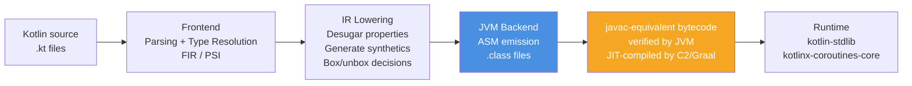
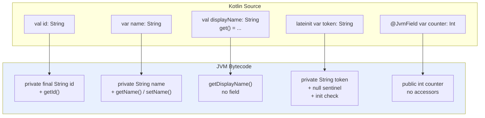
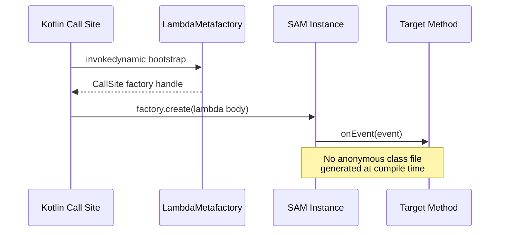
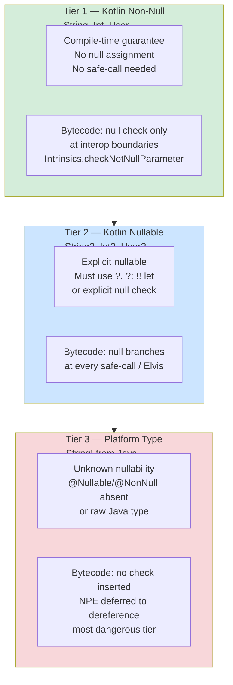
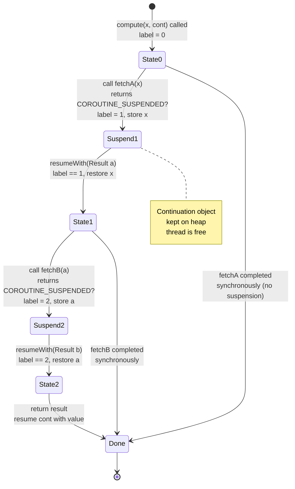
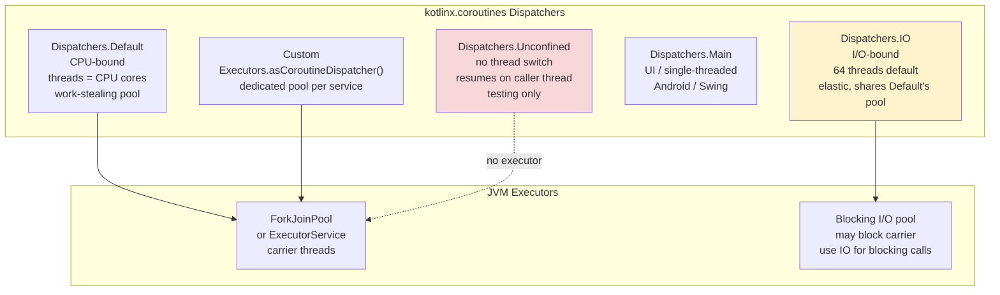
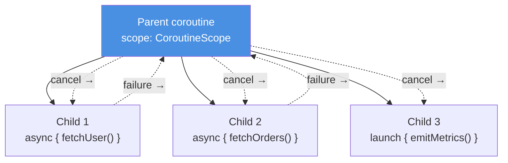
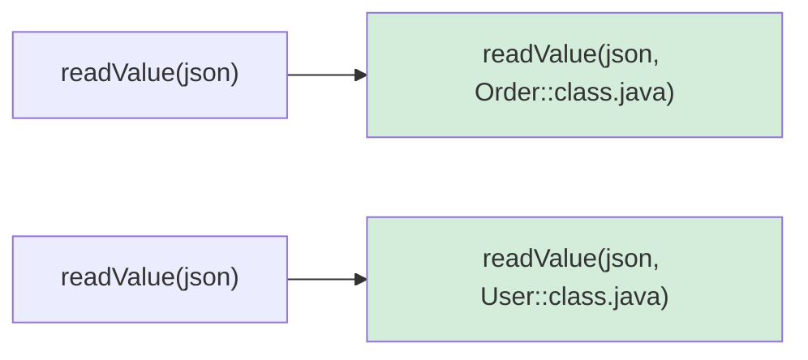

# Chapter 7 — Kotlin on the JVM: Interop, Null-Safety, Coroutines, and Compiler Intrinsics

**What this chapter covers.** Kotlin is the default language for new JVM backend services at most large organizations, yet many teams treat it as syntactic sugar over Java. That mental model breaks the first time a `NullPointerException` originates from a `!!` three frames away, a `suspend` function appears as a method with an extra `Continuation` parameter in a stack trace, or a Java caller cannot find the Kotlin `companion object` method it expects to be `static`. This chapter removes the black box. You will see exactly how the Kotlin compiler (`kotlinc`) lowers Kotlin constructs to JVM bytecode — properties to `get`/`set` methods, `data class` to `equals`/`hashCode`/`copy`/`componentN`, `value class` to mangled primitives, `object` to the singleton holder pattern, and `suspend` to a continuation-passing state machine. You will understand the null-safety contract at the bytecode boundary, how platform types (`String!`) leak Java nullability into Kotlin, and how `?.`, `?:`, and `let` chains compile. You will dissect coroutines as generated classes you can inspect with `javap -c -p`, reason about dispatcher topology, and apply structured concurrency correctly in service code. Finally, you will use compiler intrinsics — `inline`, `reified`, `noinline`/`crossinline`, and the `contract` DSL — to eliminate abstraction cost without breaking semantics. Every section pairs Kotlin source with the `javap` output it produces.

Learning goals — after this chapter you should be able to:

- Map every major Kotlin declaration — property, data class, companion object, `object` singleton, `value`/`inline` class, extension function, SAM lambda — to the JVM class/method/field it becomes, and predict the `javap` output without running it.
- Explain Kotlin's null-safety system: non-null vs. nullable types, platform types (`T!`), JSpecify/JSR-305 annotations, and how `?.`, `?:`, `!!`, `let`, and safe-call chains compile to null checks and branches.
- Design Java↔Kotlin interop boundaries: when to apply `@JvmStatic`, `@JvmOverloads`, `@JvmName`, `@JvmField`, `@JvmInline`/`@JvmRecord` interactions, how `lateinit` works, and why Kotlin silently swallows Java checked exceptions.
- Describe how `suspend` desugars: the added `Continuation` parameter, the `COROUTINE_SUSPENDED` protocol, and the compiler-generated state-machine class with `label` dispatch — and walk a real `javap -c -p` dump of a two-suspension function.
- Select and tune coroutine dispatchers (`Default`, `IO`, `Unconfined`), apply structured concurrency (`coroutineScope`, `supervisorScope`, `SupervisorJob`), and implement correct cancellation and exception propagation (`CancellationException`, `CoroutineExceptionHandler`).
- Use `inline` functions, `reified` generics, `noinline`/`crossinline`, and `contract` declarations to get zero-cost abstractions and type-safe generic operations that survive erasure.

> **Placement.** Chapter 2 covered class loading, bytecode verification, and the `class` file format — the substrate Kotlin targets. Chapter 3 established the Java Memory Model and object layout that Kotlin properties and `value` classes build upon. Chapter 5 covered JIT intrinsification and inlining; Kotlin's own `inline` is a compile-time analogue you will compare directly. Chapter 6 covered threads, monitors, `VarHandle`, and Project Loom — coroutine dispatchers are the Kotlin-level scheduler on top of those primitives. If you have not read Chapter 6, skim at least Sections 1 and 5 (thread model and executor topology) before Section 8 here.

---

## 1. How `kotlinc` lowers Kotlin to JVM bytecode

Kotlin does not ship a runtime VM. The `kotlinc` frontend parses Kotlin source, runs type resolution, and emits JVM bytecode via ASM — the same bytecode instructions (`aload`, `invokevirtual`, `invokedynamic`) that `javac` emits. Understanding this lowering is non-optional for backend work: debuggers, profilers (`async-profiler`, JFR), decompilers, and reflection all show you the JVM view, not the Kotlin view.

### 1.1 Compilation pipeline in one picture



The key observation: by the time the class file reaches the verifier, there is no trace of "Kotlin" — only classes, methods, fields, and annotations. The `kotlin.Metadata` annotation preserves the original Kotlin signature for reflection and for the Kotlin compiler when another module depends on this class, but the JVM itself never reads it.

```bash
# Inspect what the Kotlin compiler actually emitted
kotlinc Service.kt -d /tmp/classes
javap -c -p -v /tmp/classes/com/example/Service.class | head -n 120
# The -p flag shows private members; -v shows the Metadata annotation
# The -c flag disassembles bytecode
```

The Kotlin standard library (`kotlin-stdlib`) is a compile-time and runtime dependency. Intrinsics like `Intrinsics.checkNotNullParameter` and `Intrinsics.checkNotNullExpressionValue` are `static` helpers inserted by the compiler to enforce null contracts at runtime when compile-time guarantees do not suffice (platform types, `!!`, interop boundaries). They are small, `final`, and JIT-inline to a single null-check branch.

### 1.2 What the metadata annotation carries

Every Kotlin-compiled class carries:

```
RuntimeVisibleAnnotations:
  0: #10(#11=[...]): kotlin/Metadata(
    mv={2, 1, 0}, k=1, xi=48,
    d1={"\u0000\u0018\n\u0002\u0018\u0002\n..."},
    d2={"Lcom/example/Service;", "name", "getName", ...}
  )
```

Tools like `kotlin-reflect`, `jackson-module-kotlin`, and `gson` decode this annotation to recover Kotlin-specific type information (nullability, `suspend`, `value class` wrapper) that bytecode erases. If you strip this annotation (ProGuard/R8 `keep` misconfiguration), reflection breaks but direct bytecode execution does not — a common production incident pattern.

---

## 2. Properties, data classes, companions, and objects — the object mapping

### 2.1 Properties are methods

The single most important lowering rule: a Kotlin property is not a field. It is a field plus accessor methods, with visibility and naming governed by precise conventions.

```kotlin
// File: User.kt
class User(
    val id: String,                        // read-only property
    var name: String,                      // mutable property
    private var _internal: Int = 0
) {
    var email: String? = null
        private set                          // setter visibility != getter visibility

    val displayName: String
        get() = "$name <$email>"            // computed — no backing field

    lateinit var sessionToken: String        // late-initialized, non-null

    @JvmField
    var counter: Int = 0                    // exposed as public field, no accessors
}
```

The compiler generates:

```bash
javap -p /tmp/classes/com/example/User.class
```

```
public final class com.example.User {
  private final java.lang.String id;
  private java.lang.String name;
  private int _internal;
  private java.lang.String email;
  private int counter;                          // @JvmField — public field

  public final java.lang.String getId();
  public final java.lang.String getName();
  public final void setName(java.lang.String);
  private final int get_internal();
  private final void set_internal(int);
  public final java.lang.String getEmail();
  private final void setEmail(java.lang.String); // private setter
  public final java.lang.String getDisplayName(); // no field — computed
  public final java.lang.String getSessionToken();
  public final void setSessionToken(java.lang.String);
  // synthetic null-check in constructor:
  //   Intrinsics.checkNotNullParameter(id, "id")

  // @JvmField counter has no getter/setter:
  public int counter;  // with -p you see the field directly
}
```

Detailed observations for the senior backend reader:

| Kotlin declaration | JVM artifact | Notes |
|---|---|---|
| `val id: String` | `private final String id` + `getId()` | No setter. Field is `final`. |
| `var name: String` | `private String name` + `getName()`/`setName(String)` | Both accessors `public final`. |
| `var email: String?` with `private set` | `getEmail()` public, `setEmail()` private | Setter visibility lowered independently. |
| `val displayName: String get() = ...` | Only `getDisplayName()` — **no backing field** | Every access recomputes. Not `volatile`, not cached. |
| `lateinit var sessionToken: String` | `private String sessionToken` + null sentinel + `UninitializedPropertyAccessException` guard | Field is non-final, initially `null` at JVM level despite Kotlin non-null type. Access before init throws. |
| `@JvmField var counter: Int` | `public int counter` — no accessors | Breaks encapsulation intentionally for Java interop / performance. |
| `const val MAX = 100` (top-level or companion) | `public static final int MAX = 100` + inlined at call sites | Compile-time constant, no field access at call site. |



Why this matters for services: Jackson, JPA, gRPC codegen, and annotation processors reflect over JVM artifacts. A `private set` property is invisible to frameworks that call setters reflectively unless they use Kotlin-aware modules (`jackson-module-kotlin` reads `Metadata` to find the private setter). A `lateinit` property that is never initialized throws `UninitializedPropertyAccessException` — a subclass of `RuntimeException` that bypasses exhaustive initialization checks and surfaces only at request time, typically under a rarely-hit code path. In a distributed service, that is a 500 you only see in production.

Backing-field bytecode for a simple property read/write:

```kotlin
fun example(u: User): String {
    u.name = "Ada"
    return u.name
}
```

```
javap -c -p /tmp/classes/com/example/UserKt.class

  public static final java.lang.String example(com.example.User);
    Code:
       0: aload_0
       1: ldc           #2  // String Ada
       3: invokevirtual #3  // Method com/example/User.setName:(Ljava/lang/String;)V
       6: aload_0
       7: invokevirtual #4  // Method com/example/User.getName:()Ljava/lang/String;
      10: areturn
```

There is no `getfield`/`putfield` on the caller side — only virtual method calls. The JIT will inline these trivial accessors within a few invocations (see Chapter 5, inlining heuristics: `MaxInlineSize=35` bytes, accessors are ~5 bytes), so the abstraction cost is zero after warmup. Before warmup, you pay one virtual call per property access — measurable in tight serialization loops.

### 2.2 Data classes — the generated surface

```kotlin
data class Order(
    val id: String,
    val amountCents: Long,
    val currency: String = "USD"
)
```

`javap -p` shows the full synthetic surface:

```
public final class com.example.Order {
  private final java.lang.String id;
  private final long amountCents;
  private final java.lang.String currency;

  public final java.lang.String getId();
  public final long getAmountCents();
  public final java.lang.String getCurrency();

  // componentN — used by destructuring
  public final java.lang.String component1();
  public final long component2();
  public final java.lang.String component3();

  // copy — default arguments become overloads via bitmask
  public final com.example.Order copy(java.lang.String, long, java.lang.String);
  public static synthetic com.example.Order copy$default(..., int mask, Object);
  // mask bit 0 → id default, bit 1 → amountCents, bit 2 → currency

  public boolean equals(java.lang.Object);
  public int hashCode();
  public java.lang.String toString();

  public synthetic Order(java.lang.String, long, java.lang.String, int, kotlin.jvm.internal.DefaultConstructorMarker);
}
```

Three details with production consequences:

1. **`equals`/`hashCode` are structural.** Two `Order` instances with the same field values are `equal`, regardless of identity. If you use a data class as a `ConcurrentHashMap` key or put it in a `HashSet` across service boundaries, hash distribution is determined by the generated `hashCode` — which multiplies by `31` per component. For a high-cardinality key space this is fine; for a low-cardinality one (e.g., `data class Shard(val id: Int)` with 8 values), you get predictable bucket collisions. Prefer explicit `hashCode` tuning for hot-path map keys.

2. **`copy` with defaults uses a synthetic bitmask.** The `copy$default` method takes an `int mask` where bit `i` means "use default for parameter `i`". This is how `order.copy(amountCents = 999)` compiles without allocating a builder. The call site passes `mask = 0b101` (keep `id` and `currency`, override `amountCents`). The method is `synthetic` — Java callers should use the explicit `copy(String, long, String)` overload.

3. **Destructuring is positional, not nominal.** `val (id, amount) = order` compiles to `component1()`/`component2()`. Reordering properties in the data class silently breaks destructuring at every call site without a compile error if types happen to align (e.g., swapping two `String` fields). In a multi-team monorepo, treat property order as API.

### 2.3 Companion objects, `object` singletons, and static exposure

```kotlin
class Service private constructor(val endpoint: String) {
    companion object {
        const val DEFAULT_TIMEOUT_MS = 3000
        fun create(endpoint: String) = Service(endpoint)

        @JvmStatic
        fun createForJava(endpoint: String) = Service(endpoint)
    }

    object Registry {
        val services = mutableMapOf<String, Service>()
        fun register(s: Service) { services[s.endpoint] = s }
    }
}
```

Bytecode reality:

```
public final class com.example.Service {
  private final java.lang.String endpoint;
  public static final int DEFAULT_TIMEOUT_MS = 3000;  // const → true static
  public static final com.example.Service$Companion Companion; // singleton holder

  public static final class Companion {
    public final com.example.Service create(java.lang.String);
    public final com.example.Service createForJava(java.lang.String); // instance method
    public static com.example.Service createForJava$static(java.lang.String); // @JvmStatic synthetic
  }

  public static final class Registry {
    public static final com.example.Service$Registry INSTANCE; // singleton
    private final java.util.Map services;
  }
}
```

What to internalize:

- **Without `@JvmStatic`**, `Service.create("...")` from Kotlin compiles to `Service.Companion.create("...")` — an instance call on the `Companion` singleton. From Java, you must write `Service.Companion.create("...")`. With `@JvmStatic`, the compiler also generates a `static` forwarder `Service.createForJava(String)` on the outer class, so Java callers write `Service.createForJava("...")`.

- **`object Registry`** is a singleton with a `private` constructor and a `public static final INSTANCE` field, initialized in `<clinit>`. There is no double-checked locking — class loading provides the happens-before (JMM class initialization semantics, Chapter 3). Access is `Service.Registry.INSTANCE` from bytecode. This is the same pattern as `enum` singletons in Effective Java.

- **Serialization hazard.** `object` singletons are not automatically serialization-safe. If you serialize `Registry` via Java serialization or Kryo without care, deserialization creates a second instance. Kotlin's `object` generates a `readResolve` only for `object` declarations that are `Serializable` — verify with `javap -p` that `private Object readResolve()` exists if you serialize singletons over the wire (avoid doing so; prefer DTOs).

---

## 3. Value classes, inline classes, and extension functions

### 3.1 `value class` — zero-cost wrappers with mangled names

```kotlin
@JvmInline
value class UserId(val raw: String)

@JvmInline
value class OrderId(val raw: Long)

fun findUser(id: UserId): User? = lookup(id.raw)
fun findOrder(id: OrderId): Order? = lookup(id.raw)
```

At the JVM level, the compiler erases the wrapper and passes the underlying type directly — but it must prevent accidental cross-wiring of two wrappers over the same underlying type. It does this by **name mangling**:

```
public final class com.example.UserId {
  private final java.lang.String raw;
  // constructor is private — only generated for boxing fallback
  // All call sites that take UserId actually take String with a mangled name:
}

public final class com.example.ServiceKt {
  // Kotlin: fun findUser(id: UserId): User?
  // JVM:    public static final User findUser-Yo8aak( String id )
  //                                    ^^^^^^^ mangled suffix

  // Kotlin: fun findOrder(id: OrderId): Order?
  // JVM:    public static final Order findOrder-kS2GYao( long id )
}
```

Verify:

```bash
javap -p /tmp/classes/com/example/ServiceKt.class | grep findUser
# public static final com.example.User findUser-Yo8aak(java.lang.String);
```

Consequences:

- **Interop friction.** Java callers see `findUser_Yo8aak(String)` — not `findUser(UserId)`. To expose a Java-friendly overload, add an explicit `@JvmName` or a secondary function. Alternatively, keep `value class` internal to Kotlin modules and expose `String`/`long` at the Java API boundary.

- **Boxing fallback.** When a `value class` is used as a generic type argument (`List<UserId>`), stored in a nullable position (`UserId?`), or passed as `Any`, the JVM must box it into the wrapper object. The allocation is real — one object per element. In hot paths (e.g., a `List<UserId>` of 100K entries materialized per request), this boxing cost can dominate. The JIT can sometimes scalar-replace the box (Chapter 5, escape analysis), but not across method boundaries that expect `Object`.

- **`@JvmInline` is mandatory** for the JVM backend since Kotlin 1.5. Without it, the compiler still boxes. The annotation is the signal to erase.

After mangling, `findUser` lowers to `findUser-Yo8aak(String)`, `findOrder` to `findOrder-kS2GYao(long)`, while `List<UserId>` boxes each element into a `UserId` wrapper object.

For backend services, `value class` is ideal for domain identifiers that cross network boundaries (`UserId`, `TenantId`, `TraceId`) — you get compile-time type safety with no wire-format cost, provided you serialize the underlying `raw` value. It is poor for collections that are sorted, filtered, and mapped in tight loops where boxing pressure matters; measure with `async-profiler` allocation profiling before committing.

### 3.2 `object` revisited — double-checked locking is absent

We covered `object` in Section 2.3, but one more detail matters for services: an `object` that captures mutable state is a global singleton shared across all request handlers. In a coroutines-based service (Section 7), every coroutine sees the same `object` instance — there is no coroutine-local isolation. Guard mutable state with `Mutex` (coroutine-aware) or `AtomicReference`, not `synchronized`, to avoid pinning virtual threads (Chapter 6, Section 6).

### 3.3 Extension functions — static helpers with syntactic sugar

```kotlin
// File: StringExt.kt
fun String.isValidEmail(): Boolean = contains("@") && contains(".")
fun String.truncate(maxLen: Int): String = if (length <= maxLen) this else take(maxLen)

// Extension on nullable receiver
fun String?.orUnknown(): String = this ?: "unknown"

// Generic extension
fun <T> List<T>.secondOrNull(): T? = if (size >= 2) this[1] else null
```

Bytecode:

```
public final class com.example.StringExtKt {
  public static final boolean isValidEmail(java.lang.String $this$isValidEmail);
  public static final java.lang.String truncate(java.lang.String $this$truncate, int maxLen);
  public static final java.lang.String orUnknown(java.lang.String $this$orUnknown);
  public static final java.lang.Object secondOrNull(java.util.List $this$secondOrNull);
}
```

Every extension is a `static` method whose first parameter is the receiver (`$this$...`). There is no monkey-patching, no dynamic dispatch, no vtable entry on `String`. Resolution is **static and lexical** — the compiler picks the extension visible at the call site via imports. This has two consequences:

1. **No polymorphism.** If `class A` and `class B : A` both have extensions `fun A.foo()` and `fun B.foo()`, `val x: A = B(); x.foo()` calls `A.foo()`. The receiver's static type determines the target. For service code, this means extension-based polymorphism is a bug pattern — use member functions or interfaces.

2. **Binary compatibility is import-sensitive.** Moving an extension to a different package changes the call site's import and thus the linkage. No `NoSuchMethodError` at runtime (the target is a static method), but a stale compiled call site may bind to a different extension after a partial recompilation.

The `this` parameter is explicit in bytecode — `truncate` takes `(String, int)`, not `(int)` on a `String` instance. Profilers and stack traces show `StringExtKt.truncate(String, int)` rather than `String.truncate(int)`. When triaging a flame graph, search for `*Kt.` classes — that suffix marks file-level functions and extensions.

---

## 4. SAM conversions, functional interfaces, and `fun interface`

Kotlin's SAM (Single Abstract Method) conversion lets a lambda satisfy a Java functional interface. Since Kotlin 1.4, `fun interface` brings the same to Kotlin-declared interfaces.

```kotlin
// Java functional interface (java.lang.Runnable, java.util.concurrent.Callable, etc.)
fun interface EventHandler {
    fun onEvent(event: String)
}

// Kotlin call site — SAM conversion
val handler: EventHandler = EventHandler { event -> println("got $event") }

// Java interop — Kotlin lambda passed to Java method expecting single-method interface
// Java: void submit(Runnable task)
executor.submit { println("running") }  // lambda → Runnable via SAM
```

Bytecode for the SAM lambda:

```
javap -c -p /tmp/classes/com/example/SamKt.class

  // The lambda body becomes a synthetic method:
  private static final void onEvent$lambda$0(java.lang.String event);
    Code:
       0: getstatic     #2  // Field java/lang/System.out
       3: aload_0
       4: invokedynamic #3,  0  // InvokeDynamic #0:apply:()LEventHandler;
       // ... bootstrap: LambdaMetafactory.metafactory ...

  // At the call site, invokedynamic creates the SAM instance:
  invokedynamic #4,  0  // InvokeDynamic #1:run:()Ljava/lang/Runnable;
```



Why `invokedynamic` matters: before JDK 8, Kotlin generated an anonymous inner class (`EventHandler$1.class`) per lambda — one file per lambda, loaded eagerly. With `invokedynamic` (the default since Kotlin 1.4 targeting JVM 8+), the SAM instance is created via `LambdaMetafactory` at first invocation, and the JVM may share the factory across call sites. For a service that creates thousands of short-lived lambdas per request (stream pipelines, coroutine builders), this eliminates class-loading churn and metaspace pressure.

**SAM ambiguity pitfall.** If a Java method is overloaded with two SAM types:

```java
// Java
void handle(Runnable r);
void handle(Callable<String> c);
```

```kotlin
// Kotlin — ambiguous
handler.handle { println("which one?") }  // COMPILE ERROR: overload resolution ambiguity
handler.handle(Runnable { println("explicit") })  // OK — explicit SAM constructor
```

In large Java-interop surfaces (AWS SDK, gRPC stubs), overloaded SAM methods are common. Always use the explicit `Runnable { ... }` constructor form in ambiguous contexts — it costs the same allocation but removes resolution nondeterminism.

**`fun interface` vs. `typealias` for lambdas.** `typealias Handler = (String) -> Unit` is just a function type — every handler is a distinct `Function1` instance. `fun interface EventHandler` is a named SAM that participates in overload resolution and can carry overloads/defaults in future. For public service APIs, prefer `fun interface` for handler contracts that may evolve.

---

## 5. Null-safety — the type system, the boundary, and the operators

### 5.1 The three tiers of nullability



Kotlin's null-safety is a **type-system guarantee that degrades at the Java boundary**. Within pure Kotlin, `String` cannot hold `null` — the compiler rejects `val s: String = null`. The JVM still represents `String` as a nullable reference (`Ljava/lang/String;`), but the compiler inserts `Intrinsics.checkNotNull*` guards at function entry points and before dereferences that cross nullable boundaries. When all code is Kotlin, these guards are redundant but cheap (one branch, JIT-elided after profiling shows non-null).

The guarantee breaks at platform types. Any Java-declared type without a nullability annotation arrives in Kotlin as `T!` — the compiler does not know whether it is `T` or `T?` and lets you use it as either, emitting no check. This is the single largest source of Kotlin NPEs in mixed codebases.

### 5.2 Platform types and JSpecify

```kotlin
// Java file — no nullability annotations
public class JavaUserService {
    public String findName(String userId) {  // returns null if not found — but signature says String
        return userId.equals("known") ? "Ada" : null;
    }
    public String getDisplayName(String userId) { return findName(userId); }
}
```

```kotlin
// Kotlin caller — platform type String! silently accepted as String
fun greet(service: JavaUserService, id: String) {
    val name: String = service.findName(id)  // compiles — String! → String
    println(name.length)                      // NPE at runtime if findName returned null
}
```

Bytecode for `greet`:

```
public static final void greet(JavaUserService, java.lang.String);
  Code:
     0: aload_0
     1: aload_1
     2: invokevirtual #2 // JavaUserService.findName:(Ljava/lang/String;)Ljava/lang/String;
     5: astore_2         // no null check — platform type, compiler trusts Java
     6: aload_2
     7: invokevirtual #3 // String.length:()I  — NPE here if null
```

Add JSpecify annotations to fix the boundary:

```java
import org.jspecify.annotations.Nullable;
import org.jspecify.annotations.NonNull;

public class JavaUserService {
    public @Nullable String findName(@NonNull String userId) { ... }
    public @NonNull String getDisplayName(@NonNull String userId) { ... }
}
```

Now Kotlin sees `findName` as `String?` and `getDisplayName` as `String` — the assignment `val name: String = service.findName(id)` fails to compile, forcing the caller to handle null:

```kotlin
fun greetSafe(service: JavaUserService, id: String) {
    val name: String? = service.findName(id)  // nullable — must handle
    println(name?.length ?: 0)                // safe-call + Elvis — no NPE
}
```

**Annotation ecosystem.** Kotlin recognizes `org.jspecify.annotations.*` (JSpecify 1.0, the current standard), `javax.annotation.*` (JSR-305, dormant), `org.jetbrains.annotations.*`, and `androidx.annotation.*`. JSpecify is the only actively maintained, specification-backed choice — adopt it for all new Java code. Configure the Kotlin compiler to enforce strict JSR-305/ JSpecify handling:

```kotlin
// build.gradle.kts
tasks.withType<KotlinCompile> {
    compilerOptions {
        freeCompilerArgs.add("-Xjsr305=strict")  // strict nullability from JSR-305
        // or with Kotlin 2.0+: -Xjspecify-annotations=strict
    }
}
```

### 5.3 Operators — what `?.`, `?:`, `!!`, and `let` compile to

```kotlin
data class Address(val city: String?)
data class Profile(val address: Address?)
data class Account(val profile: Profile?)

fun cityLength(account: Account?): Int {
    // Safe-call chain + Elvis
    return account?.profile?.address?.city?.length ?: -1
}

fun requireCity(account: Account): String {
    return account.profile!!.address!!.city!!  // triple !! — triple risk
}

fun cityOrLog(account: Account?): Int {
    return account?.profile?.address?.city?.let { city ->
        println("city=$city")
        city.length
    } ?: -1
}
```

`cityLength` bytecode — each `?.` is a null check + branch:

```
public static final int cityLength(com.example.Account);
  Code:
     0: aload_0
     1: ifnull        40          // account == null → goto 40 (return -1)
     4: aload_0
     5: invokevirtual #2  // Account.getProfile:()LProfile;
     8: astore_1
     9: aload_1
    10: ifnull        40          // profile == null → goto 40
    13: aload_1
    14: invokevirtual #3  // Profile.getAddress:()LAddress;
    17: astore_2
    18: aload_2
    19: ifnull        40
    21: aload_2
    22: invokevirtual #4  // Address.getCity:()Ljava/lang/String;
    25: astore_3
    26: aload_3
    27: ifnull        40          // city == null → goto 40
    30: aload_3
    31: invokevirtual #5  // String.length:()I
    34: istore        4
    36: iload         4
    37: ireturn
    40: iconst_m1                 // -1
    41: ireturn
```

Each `?.` is exactly one `ifnull` + conditional jump — the same cost as a hand-written `if (x != null)` in Java. The chain short-circuits at the first `null` without evaluating later links. The JIT sees this as a sequence of predictable branches (usually not-null in steady state) and speculates accordingly.

`requireCity` with `!!` compiles to:

```
public static final java.lang.String requireCity(com.example.Account);
  Code:
     0: aload_0
     1: invokevirtual #2  // Account.getProfile
     4: dup
     5: ifnonnull     12
     8: ldc           #6  // String "profile"
    10: invokestatic  #7  // Intrinsics.throwUninitializedPropertyAccessException / throwNpe
    12: invokevirtual #3 // Profile.getAddress
    15: dup
    16: ifnonnull     23
    19: ldc           #8
    21: invokestatic  #7
    23: invokevirtual #4  // Address.getCity
    26: dup
    27: ifnonnull     34
    30: ldc           #9
    32: invokestatic  #7  // throws KotlinNullPointerException with message
```

`!!` is not a no-op — it inserts `Intrinsics.throwNpe()` which throws `KotlinNullPointerException` (a subclass of `NullPointerException` since Kotlin 1.4) with a message like `"account.profile must not be null"`. Compare with a raw Java NPE (`Cannot invoke "Profile.getAddress()" because "profile" is null` since JDK 14's helpful NPEs). The Kotlin variant is more precise about which link in the chain was null, but both are 500s. In a distributed trace, the difference between `KotlinNullPointerException` and `NullPointerException` tells you whether the null originated from a Kotlin `!!` assertion or a raw Java dereference — instrument your error classifier to distinguish them.

**`let` + safe-call idiom** compiles to a null check followed by a synthetic lambda invocation (or an inlined call if `let` is inlined — it is, since `let` is `inline`). Prefer `?.let` for side-effecting null-guarded blocks and `?:` for default values. Avoid `?.let` for simple value mapping where `?.` + `?:` is clearer.

**Null-safety checklist for service boundaries:**

- Annotate every Java method that crosses into Kotlin with `@Nullable`/`@NonNull` (JSpecify).
- Never use `!!` on data that originated from a network call, database, or deserialization — those are the highest-risk null sources. Use `?: error("...")` or `?: return` to fail explicitly.
- In gRPC/Protobuf stubs, `string` fields default to `""` (not `null`), but `optional string` and message fields are nullable — generate Kotlin stubs with `protoc-gen-kotlin` which maps `optional` to `T?` correctly.
- Monitor `KotlinNullPointerException` rate separately from `NullPointerException` in your metrics — a spike in the former after a Kotlin migration usually means platform types or `!!` overuse.

---

## 6. Java–Kotlin interop — annotations, exceptions, and `lateinit`

### 6.1 The annotation toolkit for pleasant Java APIs

Kotlin's defaults are optimized for Kotlin callers. Four annotations fix the Java view:

```kotlin
class MetricsReporter @JvmOverloads constructor(
    val namespace: String,
    val flushIntervalMs: Long = 5000,
    val maxBatchSize: Int = 100
) {
    companion object {
        @JvmStatic
        fun create(namespace: String) = MetricsReporter(namespace)

        @JvmStatic
        @JvmName("createWithInterval")  // avoid overload clash after erasure
        fun create(namespace: String, interval: Long) = MetricsReporter(namespace, interval)
    }

    @JvmField
    val createdAtNanos: Long = System.nanoTime()

    @JvmName("recordEventInternal")
    fun record(event: String) { /* ... */ }

    @Throws(IOException::class)  // checked exception bridge — see 6.2
    fun flush() { /* ... */ }
}
```

| Annotation | What it does | Without it |
|---|---|---|
| `@JvmStatic` | Generates `static` forwarder on outer class | Java must go through `Companion` singleton |
| `@JvmOverloads` | Generates N overloads for N default params | Java sees one constructor requiring all args; no defaults |
| `@JvmName("...")` | Renames JVM method to avoid clashes | Mangled or conflicting names after erasure |
| `@JvmField` | Exposes property as `public` field, no accessors | Java must call `get`/`set` methods |
| `@Throws(IOException::class)` | Adds `throws IOException` to JVM signature | Checked exception invisible to Java `catch` (see below) |
| `@JvmInline` | Erases `value class` wrapper | Wrapper object allocated |
| `@JvmRecord` (Kotlin 1.9+) | Generates JVM `record` class file | Regular class with `equals`/`hashCode` |

The annotation mapping is summarized in the table above: `companion fun create()` → `static create()` via `@JvmStatic`, constructors with defaults → overloads via `@JvmOverloads`, `val createdAtNanos` → `public final` field via `@JvmField`, and `fun record` → `recordEventInternal()` via `@JvmName`.

`@JvmOverloads` cost: it generates `2^N` overloads in the worst case for N default parameters, but actually generates N+1 constructors (each overload fills one more default from the right). For a constructor with 3 defaults, you get 4 overloads. Binary size impact is negligible; method count impact matters only if you approach the 64K methods-per-dex limit on Android (irrelevant for backend services).

### 6.2 Checked exceptions — Kotlin swallows them

Kotlin has no checked exceptions. Any Java method that declares `throws IOException` can be called from Kotlin without `try`/`catch`, and any Kotlin function can throw a checked exception without declaring it. The JVM still enforces `throws` at the bytecode level for Java callers, but Kotlin callers bypass verification.

```java
// Java
public class FileStore {
    public String read(String path) throws IOException {
        return Files.readString(Path.of(path));
    }
}
```

```kotlin
// Kotlin — no try/catch required, compiles fine
fun loadConfig(store: FileStore): String {
    return store.read("/etc/config.json")  // IOException not caught — propagates as unchecked
}

// Kotlin throwing a checked exception without declaring it
fun failWithIo(): Nothing {
    throw IOException("disk full")  // no @Throws needed for Kotlin callers
}
```

**Consequences for distributed services:**

- A Kotlin service calling a Java library that throws `InterruptedException`, `TimeoutException`, or `ExecutionException` will not be forced to handle interruption or timeout. An unhandled `InterruptedException` that propagates as an unchecked exception may bypass your thread-interruption protocol (Chapter 6, Section 7) and leave a thread in an inconsistent state. Always wrap Java calls that declare checked exceptions in explicit `try`/`catch` even though the compiler does not require it — or use `runCatching` with typed handling.

- When Kotlin code is called from Java, checked exceptions are invisible unless annotated with `@Throws`. A Java caller that expects `catch (IOException e)` will never catch the exception from a Kotlin function lacking `@Throws` — the exception still propagates (the JVM does not enforce `throws` at runtime), but the Java compiler will not let you write the `catch` without `@Throws` on the declaration. Add `@Throws` to every Kotlin function that is part of a Java-facing API and can throw a checked exception.

```kotlin
@Throws(IOException::class, TimeoutException::class)
fun fetchRemote(url: String): String {
    // Java callers can now write catch (IOException | TimeoutException e)
}
```

### 6.3 `lateinit`, `by lazy`, and `Delegates.notNull`

Three mechanisms for deferred initialization, with different runtime characteristics:

```kotlin
class RequestHandler {
    // 1. lateinit — mutable, non-null, checked at access time
    lateinit var router: Router
    fun init(router: Router) { this.router = router }

    // 2. by lazy — immutable after first access, thread-safe by default
    val config: Config by lazy { loadConfig() }  // LazyThreadSafetyMode.SYNCHRONIZED

    // 3. Delegates.notNull — for primitives where lateinit is illegal
    var retryCount: Int by Delegates.notNull()
}
```

| Mechanism | JVM field type | Thread safety | Access before init | Use when |
|---|---|---|---|---|
| `lateinit var x: T` | `T` (nullable at JVM level, null sentinel) | None — racy | `UninitializedPropertyAccessException` | DI / framework injection before `start()` |
| `by lazy { ... }` | `Lazy<T>` holder object | `SYNCHRONIZED` (default), `PUBLICATION`, or `NONE` | Blocks or computes on first access | Expensive singleton within a class |
| `Delegates.notNull<T>()` | `T` with null sentinel | None | `IllegalStateException` | Primitive `var` that cannot be `lateinit` |

`lateinit` is common in Spring/Quarkus/Ktor handlers where the framework constructs the object and then injects dependencies before handling requests. The hazard: if you access `router` from a coroutine launched during construction (before `init()`), you get `UninitializedPropertyAccessException` — a race that only manifests under startup ordering variations. Prefer constructor injection (`class RequestHandler(val router: Router)`) for new code; reserve `lateinit` for framework-mandated no-arg construction.

`by lazy` with `SYNCHRONIZED` uses double-checked locking on the `Lazy` instance — correct but contended if many coroutines hit the lazy property concurrently at startup. For request-scoped lazies, use `LazyThreadSafetyMode.NONE` or `PUBLICATION` to avoid the lock.

---

## 7. Coroutines — `suspend`, `Continuation`, and the state machine

### 7.1 What `suspend` means at the bytecode level

A `suspend` function is a function that can suspend without blocking its thread. The compiler implements this by adding a hidden `Continuation` parameter and rewriting the function body into a state machine.

```kotlin
// Kotlin source
suspend fun fetchUser(id: String): User {
    val cached = cache.get(id)           // suspension point 1 (if cache is suspend)
    if (cached != null) return cached
    val remote = api.fetch(id)           // suspension point 2
    cache.put(id, remote)                // suspension point 3 (if put is suspend)
    return remote
}
```

For illustration, consider a simpler two-suspension function and its lowered form:

```kotlin
// Simplified — two suspension points
suspend fun compute(x: Int): String {
    val a = fetchA(x)   // suspend 1
    val b = fetchB(a)   // suspend 2
    return "result:$b"
}
```

The compiler generates a class equivalent to:

```kotlin
// Pseudo-code of generated state machine (simplified)
class ComputeContinuation(
    var x: Int,
    var a: String? = null,
    var b: String? = null,
    var label: Int = 0,                              // state index
    completion: Continuation<String>
) : Continuation<String> {
    override val context: CoroutineContext = completion.context
    override fun resumeWith(result: Result<String>) { /* dispatcher resumes here */ }

    // The actual method the JVM sees:
    //   Object compute(int x, Continuation<String> cont)
    // Returns either String (completed) or COROUTINE_SUSPENDED (suspended)
}
```

The JVM signature of `suspend fun compute(x: Int): String` becomes:

```
public static final java.lang.Object compute(int, kotlin.coroutines.Continuation<? super java.lang.String>);
```

It returns `Object` — either the real `String` result (if the function completed without suspending) or the singleton `kotlin.coroutines.intrinsics.CoroutineSingletons.COROUTINE_SUSPENDED` (if it suspended). The caller checks `if (result === COROUTINE_SUSPENDED) return COROUTINE_SUSPENDED` to propagate suspension up the stack. No thread is blocked; the current frame is simply returned and the continuation object holds the state.



### 7.2 Walking a real `javap -c -p` dump

Compile a minimal suspend function and inspect:

```kotlin
// File: Demo.kt
suspend fun hello(name: String): String {
    delay(10)
    return "hello $name"
}
```

```bash
kotlinc Demo.kt -d /tmp/demo -classpath kotlinx-coroutines-core.jar
javap -c -p /tmp/demo/DemoKt.class
```

Abbreviated output (comments added):

```
// The suspend function — note the Continuation parameter and Object return
public static final java.lang.Object hello(java.lang.String, kotlin.coroutines.Continuation<? super java.lang.String>);
  Code:
     0: aload_1
     1: instanceof    #2  // check if continuation is already our state machine
     4: ifeq          30  // if not, create a new HelloContinuation
     7: aload_1
     8: checkcast     #3  // cast to HelloContinuation
    11: aload_1
    12: getfield      #4  // HelloContinuation.label:I
    15: ldc           #5  // int 0x80000000 (hash for suspension check)
    17: iand
    18: ifeq          30
    // ... extract label, restore locals from continuation fields ...
    30: aload_0               // name
    31: aload_1               // continuation
    32: ldc           #6  // long 10
    34: invokestatic  #7  // Method kotlinx/coroutines/DelayKt.delay:(JLkotlin/coroutines/Continuation;)Ljava/lang/Object;
    37: dup
    38: ldc           #8  // CoroutineSingletons.COROUTINE_SUSPENDED
    40: if_acmpne     46  // if result != COROUTINE_SUSPENDED → continue
    43: areturn               // suspended — return COROUTINE_SUSPENDED to caller
    46: checkcast     #9  // cast result (Unit) — delay returns Unit
    49: pop
    50: new           #10 // StringBuilder
    53: dup
    54: ldc           #11 // "hello "
    56: invokespecial #12 // StringBuilder.<init>
    59: aload_0
    60: invokevirtual #13 // StringBuilder.append
    63: invokevirtual #14 // StringBuilder.toString
    66: areturn

// The generated continuation class (inner class of DemoKt)
final class com.example.DemoKt$hello$1 extends kotlin.coroutines.jvm.internal.ContinuationImpl {
  int label;              // current state
  java.lang.String L$0;   // stored local: name
  java.lang.Object result; // last suspension result
  // ... constructor, invokeSuspend, etc.
  public final java.lang.Object invokeSuspend(java.lang.Object);
    Code:
       0: aload_0
       1: getfield      #1 // label
       4: tableswitch   { // dispatch on label
                 0: 28
                 1: 56
             default: 80  // throw IllegalStateException("call to 'resume' before 'invoke'")
           }
      28: aload_1             // result from previous suspension (Unit from delay)
      // ... resume logic, restore L$0, proceed to StringBuilder ...
      56: // label 1 — resumed after delay
      // ... restore name from L$0, build "hello $name" ...
      80: new           #2 // IllegalStateException
}
```

Key observations:

- **`label` is the program counter.** Each suspension point increments `label`. On resume, `tableswitch` jumps to the right state. This is a classic compiler-generated state machine — the same pattern `javac` uses for `switch` on strings.

- **Locals that survive across suspension are spilled to fields** (`L$0`, `I$0`, etc.). `name` is stored in `L$0` before suspending at `delay` and restored after. Locals that are dead across suspension are not spilled — the compiler liveness analysis minimizes the continuation size.

- **`COROUTINE_SUSPENDED` is the sentinel.** Every suspend call is followed by `if_acmpne COROUTINE_SUSPENDED` — if the callee suspended, the caller immediately returns `COROUTINE_SUSPENDED` without executing further bytecode. Suspension propagates up the call stack as a return value, not an exception.

- **The continuation is allocated once** (or reused if the caller already passed a matching continuation). For a chain of N suspend calls, there are N continuation objects linked via `completion` — one per function in the call stack. Each is small (a few fields + `label`), typically 32–64 bytes. For deep call stacks (10+ suspend frames), this is a few hundred bytes per suspended coroutine — negligible compared to a platform thread's 1 MB stack, and the reason coroutines scale to millions.

### 7.3 Continuation interface and interception

```kotlin
public interface Continuation<in T> {
    public val context: CoroutineContext
    public fun resumeWith(result: Result<T>)
}

public interface CoroutineContext {
    public operator fun <E : Element> get(key: Key<E>): E?
    public fun <R> fold(initial: R, operation: (R, Element) -> R): R
    public operator fun plus(context: CoroutineContext): CoroutineContext
    public fun minusKey(key: Key<*>): CoroutineContext

    public interface Key<E : Element>
    public interface Element : CoroutineContext { ... }
}
```

The `Continuation` is intercepted before it reaches the state machine. `ContinuationInterceptor` (the dispatcher) wraps the continuation's `resumeWith` to schedule resumption on the right thread pool. This is how `withContext(Dispatchers.IO) { ... }` moves execution — it does not move the running thread; it suspends, and the interceptor resumes the continuation on a different executor.

Debug tip: when a coroutine suspends, the stack trace shows `ContinuationImpl.resumeWith` and `DispatchedTask.run` — not your business logic. Use `kotlinx.coroutines.debug` (`-Dkotlinx.coroutines.debug`) to enable coroutine names in thread names (`coroutine#42 @coroutine#42`) and `DebugProbes.dumpCoroutines()` to see all suspended continuations with their creation stack traces. In production, the `kotlinx-coroutines-debug` artifact adds ~2% overhead — enable it only during incidents.

---

## 8. Dispatchers, structured concurrency, cancellation, and exception handling

### 8.1 Dispatcher topology



Concrete guidance for backend services:

| Dispatcher | Backing pool | When to use | Pitfall |
|---|---|---|---|
| `Default` | `ForkJoinPool` sized to `Runtime.availableProcessors()` | CPU work: JSON parsing, hashing, compression, business logic | Blocking call here starves CPU tasks — latency spike across all coroutines on `Default` |
| `IO` | Elastic pool, 64 threads default (tunable via `kotlinx.coroutines.io.parallelism`), shares threads with `Default` | Blocking I/O: JDBC, legacy HTTP clients, file I/O | Still threads — 10K concurrent blocking calls needs 10K threads; prefer async I/O (Ktor client, R2DBC) to avoid thread-per-request |
| `Unconfined` | None — resumes on whatever thread called `resumeWith` | Tests, benchmarks where thread does not matter | Resumption thread is unpredictable; never use in production service code — breaks thread-local assumptions and tracing context |
| `Main` | Single thread (Android main looper, Swing EDT) | UI only | Not available on server — `Dispatchers.Main` throws `IllegalStateException` unless `kotlinx-coroutines-swing`/`android` is on classpath |
| Custom | `Executors.newFixedThreadPool(n).asCoroutineDispatcher()` | Isolating a noisy dependency (e.g., dedicated pool for a slow downstream) | Must `close()` the dispatcher to shut down the executor; leaked pools prevent JVM exit |

```kotlin
// Correct dispatcher selection in a service handler
class OrderService(
    private val db: Database,              // blocking JDBC
    private val paymentClient: PaymentClient, // async Ktor client
    private val ioDispatcher: CoroutineDispatcher = Dispatchers.IO,
    private val cpuDispatcher: CoroutineDispatcher = Dispatchers.Default
) {
    suspend fun placeOrder(req: PlaceOrderRequest): Order {
        // CPU-bound validation — stays on Default (caller's dispatcher)
        val validated = withContext(cpuDispatcher) { validate(req) }

        // Blocking I/O — explicitly on IO
        val order = withContext(ioDispatcher) { db.insert(validated) }

        // Non-blocking I/O — no dispatcher switch needed, suspends cooperatively
        val receipt = paymentClient.charge(order.id, order.amountCents)

        // CPU-bound mapping — back on Default
        return withContext(cpuDispatcher) { toResponse(order, receipt) }
    }

    private fun validate(req: PlaceOrderRequest): ValidatedOrder { /* ... */ }
}
```

`withContext` is itself a suspend function that suspends, switches dispatcher via `ContinuationInterceptor`, executes the block, and switches back on return. The switch cost is one suspension + one dispatch — roughly 1–2 microseconds on a warm JVM. Avoid wrapping single non-blocking calls in `withContext`; the switch overhead exceeds the work.

### 8.2 Structured concurrency — `coroutineScope` vs. `supervisorScope`



**`coroutineScope`** — all children must succeed; any child failure cancels the parent and all siblings. Use when children are subtasks of a single logical operation (scatter-gather where partial results are useless).

**`supervisorScope`** — children failures do not cancel siblings or parent; each child's exception is isolated. Use when children are independent operations where partial success is acceptable (fan-out to multiple downstreams, batch processing).

```kotlin
// coroutineScope — all-or-nothing
suspend fun loadDashboard(userId: String): Dashboard = coroutineScope {
    val user = async { userService.fetch(userId) }
    val orders = async { orderService.list(userId) }
    val prefs = async { prefService.fetch(userId) }
    // If any async fails, the other two are cancelled immediately.
    // The exception propagates to the caller; no partial Dashboard is returned.
    Dashboard(user.await(), orders.await(), prefs.await())
}

// supervisorScope — isolated failures
suspend fun notifyAll(userIds: List<String>, message: String): NotifyResult = supervisorScope {
    val jobs = userIds.map { id ->
        async {
            try { notifier.send(id, message) }
            catch (e: Exception) { Failed(id, e) }  // per-child handling
        }
    }
    val results = jobs.awaitAll()
    NotifyResult(results.filterIsInstance<Success>(), results.filterIsInstance<Failed>())
    // One send failure does not cancel the other sends.
}
```

Bytecode note: `coroutineScope` and `supervisorScope` are `suspend` functions that create a `ScopeCoroutine` / `SupervisorCoroutine` subclass of `AbstractCoroutine` and install it as the `completion` of each child's continuation. Cancellation is cooperative — a child is cancelled by completing its `Job` with `CancellationException`, which causes the next suspension point to throw. Code between suspension points does not observe cancellation until it suspends or explicitly checks `ensureActive()` / `isActive`.

### 8.3 Cancellation — cooperative, exception-based, and structured

```kotlin
suspend fun pollWithTimeout(): String {
    return withTimeout(5000) {               // throws TimeoutCancellationException after 5s
        while (isActive) {                  // explicit check in tight loop
            val result = fetch()            // suspend point — cancellation checked here
            if (result != null) return@withTimeout result
            delay(100)                      // suspend point — throws CancellationException if cancelled
        }
        error("unreachable")
    }
}

// Cancellation propagation in a service
class SearchService(private val scope: CoroutineScope) {
    fun search(query: String): Deferred<List<Result>> {
        return scope.async {
            // If scope is cancelled (server shutdown), this async is cancelled too.
            // withTimeout ensures we don't hang on a slow downstream.
            withTimeout(2000) {
                downstream.search(query)
            }
        }
    }
}
```

Rules every backend engineer must internalize:

1. **Cancellation is cooperative.** Only suspension points (`delay`, `await`, `withContext`, channel ops, `suspend` calls) and explicit `ensureActive()` / `yield()` checks throw `CancellationException`. A `while (true) { compute() }` loop with no suspension never cancels — it will run until the thread pool is exhausted or the process is killed. Always add `ensureActive()` or `yield()` in CPU-bound loops inside coroutines.

2. **`CancellationException` is special.** It is swallowed by `coroutineScope` (used for structured cancellation) and rethrown by `supervisorScope`. Never catch `CancellationException` in a generic `catch (e: Exception)` without rethrowing — doing so breaks structured cancellation and leaks coroutines that should have been cancelled. The correct pattern:

   ```kotlin
   try { doWork() }
   catch (e: CancellationException) { throw e }  // always rethrow
   catch (e: IOException) { handleIoError(e) }
   ```

3. **`withTimeout` vs. `withTimeoutOrNull`.** `withTimeout` throws `TimeoutCancellationException` (subtype of `CancellationException`) on timeout. `withTimeoutOrNull` returns `null` instead. In request handlers, prefer `withTimeout` so timeouts propagate as cancellations that clean up resources; use `withTimeoutOrNull` only when `null` is a valid fallback (cache miss, optional enrichment).

4. **Resource cleanup in `finally`.** `finally` blocks run even after cancellation, but suspend calls inside `finally` need `withContext(NonCancellable)` — otherwise they immediately throw `CancellationException` again.

   ```kotlin
   suspend fun useResource() {
       val conn = pool.acquire()  // suspend
       try {
           conn.query("SELECT ...")
       } finally {
           withContext(NonCancellable) {
               pool.release(conn)  // must not be cancelled
           }
       }
   }
   ```

### 8.4 Exception handling — `CoroutineExceptionHandler` and `async` vs. `launch`

```kotlin
// launch — exception propagates to parent, handled by CoroutineExceptionHandler
val handler = CoroutineExceptionHandler { _, ex ->
    logger.error("Uncaught coroutine exception", ex)
    metrics.increment("coroutine.uncaught")
}
scope.launch(handler) {
    throw IOException("downstream failed")  // delivered to handler if uncaught
}

// async — exception is captured in Deferred, thrown on await()
val deferred: Deferred<String> = scope.async {
    throw IOException("downstream failed")  // stored, not propagated yet
}
try {
    deferred.await()  // throws IOException here
} catch (e: IOException) {
    handleError(e)
}
```

Key distinction: `launch` is fire-and-forget — uncaught exceptions go to the `CoroutineExceptionHandler` (or to the uncaught exception handler if none is installed, which by default logs and may crash the process in some coroutine builders). `async` captures the exception for the awaiter — if you never `await`, the exception is silently lost until the `Deferred` is GC'd, at which point `CoroutineExceptionHandler` is invoked as a last resort. **Always `await` every `async`** — an un-awaited `async` is a structured-concurrency violation that leaks exceptions.

For top-level service scopes (e.g., `GlobalScope` is forbidden — use a `CoroutineScope(SupervisorJob() + Dispatchers.Default)` tied to the server lifecycle), install a `CoroutineExceptionHandler` that routes to your centralized error reporting (Sentry, Datadog, etc.) and never swallows.

---

## 9. Compiler intrinsics — `inline`, `reified`, `noinline`/`crossinline`, and contracts

### 9.1 `inline` — compile-time inlining, not JIT inlining

Kotlin's `inline` is distinct from the JIT's inlining (Chapter 5). The Kotlin compiler copies the function body into each call site at compile time, eliminating the call overhead and — crucially — the lambda allocation.

```kotlin
// Without inline — lambda is an object allocation per call
fun <T> measure(block: () -> T): T {
    val start = System.nanoTime()
    val result = block()           // invokeinterface Function0.invoke
    println("took ${System.nanoTime() - start} ns")
    return result
}

// With inline — no allocation, body is copied
inline fun <T> measureInline(block: () -> T): T {
    val start = System.nanoTime()
    val result = block()           // inlined — direct bytecode
    println("took ${System.nanoTime() - start} ns")
    return result
}
```

Call site comparison:

```kotlin
// Call site
val x = measure { computeExpensively() }
val y = measureInline { computeExpensively() }
```

Bytecode without `inline`:

```
// measure — lambda object created via invokedynamic
invokedynamic #2,  0  // InvokeDynamic #0:invoke:()Lkotlin/jvm/functions/Function0;
invokestatic  #3  // Method measure:(Lkotlin/jvm/functions/Function0;)Ljava/lang/Object;

// The lambda body is a separate synthetic method:
private static final java.lang.Object computeExpensively$lambda$0();
```

Bytecode with `inline`:

```
// No invokedynamic, no Function0 allocation — computeExpensively inlined directly
invokestatic  #4  // Method computeExpensively:()Ljava/lang/Object;
 // measureInline body (System.nanoTime, println) also inlined around it
```

In a hot path that calls a higher-order function millions of times per second (e.g., `List.map`, `withLock`, `use`), the allocation pressure from non-inline lambdas can dominate GC. `inline` eliminates that pressure entirely. The cost: larger bytecode at each call site (code bloat), and the inlined function's bytecode is duplicated — dex/method-count and JIT code-cache impact for very large inlined functions. Rule of thumb: inline small higher-order functions (< 30 bytecode instructions, single lambda parameter); do not inline large functions or those called from many sites.

### 9.2 `reified` — defeating type erasure at compile time

The JVM erases generic type parameters: `List<String>` and `List<Int>` are both `List` at runtime. `reified` recovers the type by inlining it as a concrete class literal at each call site.

```kotlin
// Without reified — cannot check generic type at runtime
fun <T> isStringList(list: List<T>): Boolean {
    // return list is List<String>  // COMPILE ERROR: cannot check for erased type
    return false
}

// With reified — type is available as a class literal
inline fun <reified T> List<*>.isInstanceOf(): Boolean {
    return this is List<T>  // actually checks: list is List && elements are T (with caveats)
}

inline fun <reified T> Any.isA(): Boolean = this is T

// Practical — type-safe deserialization without Class<T> parameter
inline fun <reified T : Any> ObjectMapper.readValue(json: String): T {
    return readValue(json, T::class.java)  // T::class.java (or `typeOf<T>()` for full generic type) inlined as concrete class
}

// Usage — no Class parameter needed at call site
val order: Order = mapper.readValue("""{"id":"123","amountCents":999}""")
// Inlined to: mapper.readValue(json, Order.class)
```

At each call site the compiler expands the reified type to a concrete class literal:



Constraints on `reified`:

- Only `inline` functions can have `reified` parameters — the type must be inlined at the call site to become a concrete class literal.
- `reified` does not reify nested generics: `inline fun <reified T> check(list: List<T>)` can check `list is List<*>` and `T::class`, but `list is List<String>` still erases to `list is List<*>` at runtime — element-type checks require iterating.
- Overusing `reified` for large functions bloats every call site. For service code, the sweet spot is small utility functions (JSON parsing, type-safe config lookup, metrics tagging) where the `Class<T>` parameter would otherwise be boilerplate.

```kotlin
// Type-safe config lookup with reified — eliminates Class<T> threading
inline fun <reified T : Any> Config.get(key: String): T {
    val raw = getString(key)
    return when (T::class) {
        String::class  -> raw as T
        Int::class     -> raw.toInt() as T
        Long::class    -> raw.toLong() as T
        Boolean::class -> raw.toBoolean() as T
        else           -> objectMapper.readValue<T>(raw)  // nested reified
    }
}

val port: Int = config.get("server.port")        // T = Int — no Class<Int> needed
val feature: FeatureFlags = config.get("flags")   // T = FeatureFlags — deserialized
```

### 9.3 `noinline` and `crossinline` — controlling inline scope

```kotlin
inline fun withRetry(
    crossinline block: () -> Unit,      // can be called from nested lambda, not from bare return
    noinline onError: (Exception) -> Unit  // not inlined — stored as Function object
) {
    var lastError: Exception? = null
    repeat(3) {
        try {
            block()                     // inlined — but crossinline prevents non-local return
            return                      // return from withRetry, not from block
        } catch (e: Exception) {
            lastError = e
        }
    }
    lastError?.let { onError(it) }      // onError is a real object — can be stored, passed
}
```

| Modifier | Meaning | Bytecode effect |
|---|---|---|
| (default) `inline` param | Body copied, non-local `return` allowed | No `Function` object, direct bytecode |
| `crossinline` | Body copied, non-local `return` forbidden | Prevents `return` inside `block` from returning out of enclosing function — required when `block` is called inside another lambda/object |
| `noinline` | Not copied, remains a `Function` object | `invokedynamic` + `Function` allocation; allows storing/passing the lambda |

Use `crossinline` whenever the inline lambda is invoked inside another lambda, anonymous object, or local function — otherwise a `return` inside the lambda would try to return from the outer function across an incompatible stack frame, which the compiler correctly forbids. Use `noinline` when you need to store the lambda, pass it to a non-inline function, or conditionally execute it.

### 9.4 Contract DSL — telling the compiler what your function guarantees

Contracts are compiler intrinsics that let you teach the type checker that a function establishes a condition. They have no runtime effect — they are pure type-system hints consumed during compilation.

```kotlin
import kotlin.contracts.ExperimentalContracts
import kotlin.contracts.contract

@OptIn(ExperimentalContracts::class)
fun requireNonNull(value: String?) {
    contract { returns() implies (value != null) }
    if (value == null) throw IllegalArgumentException("value must not be null")
}

@OptIn(ExperimentalContracts::class)
fun <T> Result<T>.isSuccess(): Boolean {
    contract { returns(true) implies (this@isSuccess is Success<T>) }
    return this is Success<T>
}

// Usage — smart-cast after contract
fun handle(input: String?) {
    requireNonNull(input)
    println(input.length)  // smart-cast to String — no ?. or !! needed
}

fun process(result: Result<Order>) {
    if (result.isSuccess()) {
        println(result.value)  // smart-cast to Success<Order>
    }
}
```

Available contract effects:

| Contract | Meaning | Example |
|---|---|---|
| `returns() implies (x != null)` | If function returns normally, `x` is non-null | `requireNotNull`, `checkNotNull` |
| `returns(true) implies (x != null)` | If function returns `true`, `x` is non-null | `isNotNull()`, `isSuccess()` |
| `returns(false) implies (x == null)` | If function returns `false`, `x` is null | Custom null-guard |
| `returns(null) implies (x == null)` | If function returns `null`, `x` is null | Lookup functions |
| `callsInPlace(block, EXACTLY_ONCE)` | Lambda is invoked exactly once, in place | `withLock`, `use`, `let` |

The stdlib already declares contracts for `let`, `run`, `apply`, `also`, `use`, `with`, `check`, `require`, `error`, and `TODO`. Custom contracts are `ExperimentalContracts` — the API has been stable since Kotlin 1.3 but the annotation is still required. For service code, the highest-value custom contract is a `requireAuthenticated(user: User?)` guard that implies `user != null` on return, eliminating `!!` at every downstream use of `user`.

Contracts are erased at compile time — no bytecode, no runtime check beyond what you wrote. The `contract { ... }` block must be the first statement and is not executed; it is parsed by the compiler and discarded.

---

## 10. Distributed-systems lens — Kotlin services at scale

Every abstraction in this chapter has a distributed-systems consequence. A single service's bytecode choices amplify across hundreds of instances.

### 10.1 Serialization and wire format

`data class` and `value class` define your wire types. When `Order` crosses a gRPC or Kafka boundary, its `equals`/`hashCode`/`toString` behavior determines deduplication, partitioning, and log readability. A `value class UserId(String)` that is `toString()`'d as `"UserId(raw=abc)"` in logs but serialized as `"abc"` on the wire creates a mismatch that breaks log-based debugging. Override `toString` on value classes to return the raw value when they appear in structured logs, or configure your JSON mapper to unwrap value classes (`@JsonValue` on the `raw` property, or `jackson-module-kotlin` with `KotlinFeature.StrictNullChecks`).

Protobuf-generated Kotlin code (`protoc-gen-kotlin` DSL) already maps `optional` to nullable `T?` and `repeated` to `List<T>` — but the generated `copy` and `equals` are Java-style (field-by-field with presence checks), not Kotlin `data class` semantics. Do not mix generated proto types with Kotlin `data class` equality assumptions in map keys.

### 10.2 Null-safety as a reliability boundary

In a polyglot environment (Kotlin services calling Java libraries, Java services calling Kotlin APIs), every RPC and database boundary is a platform-type boundary. Adopt a team rule: **all Java code that is called from Kotlin is annotated with JSpecify; all Kotlin APIs exposed to Java carry `@JvmName`/`@JvmStatic`/`@Throws` as needed.** Enforce this with ArchUnit or Detekt rules that fail the build on unannotated public Java methods in shared modules. The cost of a `KotlinNullPointerException` in a payment path far exceeds the annotation overhead.

Measure `KotlinNullPointerException` separately from `NullPointerException` in your error budget. A spike in `KotlinNullPointerException` after a Kotlin migration or a new Java dependency usually means a platform-type escape — the fix is an annotation, not a `!!` removal.

### 10.3 Coroutine dispatchers and capacity planning

Dispatcher choice is capacity planning. `Dispatchers.Default` is sized to CPU cores — if you block it, you reduce the effective CPU capacity of the entire service to zero, regardless of how many pods Kubernetes has scheduled. `Dispatchers.IO` is elastic but still creates threads — 10K concurrent JDBC queries on `Dispatchers.IO` creates 10K threads, each with an 8 MB stack (JVM default `-Xss`), consuming 80 GB of virtual memory across the fleet.

For I/O-bound services, the scaling path is:

1. **Short term:** `Dispatchers.IO` with tuned `kotlinx.coroutines.io.parallelism` (default 64 — increase only with load testing; each thread is a real OS thread).
2. **Medium term:** Replace blocking clients (JDBC → R2DBC, `HttpURLConnection` → Ktor CIO/OkHttp async) so coroutines suspend without holding a thread — then `Dispatchers.Default` suffices.
3. **Long term:** Project Loom virtual threads (Chapter 6, Section 6) as the carrier for `Dispatchers.IO` — early prototypes show `Dispatchers.IO` backed by `Executors.newVirtualThreadPerTaskExecutor()` reduces thread count to near-zero for I/O workloads, but pinning (`synchronized`, JNI) must be eliminated first.

Structure your service's `CoroutineScope` hierarchy to mirror your deployment topology: one `SupervisorJob`-backed scope per server lifecycle, one `coroutineScope` per request, and `supervisorScope` only for fan-out where partial failure is acceptable. Cancel the server scope on `SIGTERM` (Kubernetes pod termination) and let structured cancellation drain in-flight requests — this is the coroutine equivalent of graceful shutdown.

### 10.4 Inline, reified, and binary size

`inline` + `reified` bloat is a fleet-wide cost: larger JARs, slower class loading, higher JIT code-cache pressure, and larger container images. For a service with 500 call sites of an `inline fun <reified T> parseJson`, the `parseJson` body is duplicated 500 times in bytecode. If the body is 100 bytes, that is 50 KB of extra bytecode — trivial. If it is 2 KB (complex deserialization with error handling), that is 1 MB — still trivial for a single service, but multiplied across 200 services it adds up in artifact storage and pull time. Keep `inline` functions small; extract non-generic logic into a private non-inline helper.

---

## Key takeaways

- A Kotlin property is a field plus `get`/`set` methods; `@JvmField` breaks that to a public field, `lateinit` uses a null sentinel, and computed properties (`get() = ...`) have no field at all. Frameworks that reflect over fields vs. methods see different views — use `kotlin-reflect` or `jackson-module-kotlin` to reconcile.
- `data class` generates `equals`/`hashCode`/`toString`/`copy`/`componentN`; `copy` uses a bitmask for defaults, destructuring is positional, and `equals` is structural — all consequences for map keys, sets, and API evolution.
- `companion object` is a singleton holder; `@JvmStatic` adds a static forwarder for Java. `object` singletons use class-loading for initialization safety and generate `INSTANCE` — verify `readResolve` if you serialize them.
- `value class` erases to its underlying type with name mangling (`findUser-Yo8aak`); Java callers see the mangled name, and generic/nullable usage boxes. Ideal for domain IDs at API boundaries, not for large collections.
- Extension functions are static methods with a `$this$` receiver parameter — no dynamic dispatch, no polymorphism, lexical resolution only. File-level extensions live in `*Kt` classes.
- SAM conversion uses `invokedynamic` + `LambdaMetafactory` — no anonymous class files, lazy instantiation, shared factories. Overloaded SAM methods require explicit `Runnable { ... }` constructors to disambiguate.
- Kotlin null-safety is a type-system guarantee that degrades to platform types (`T!`) at every Java boundary. Annotate Java with JSpecify `@Nullable`/`@NonNull`, treat `!!` as a code smell on network/deserialized data, and monitor `KotlinNullPointerException` separately.
- `?.`, `?:`, `!!`, and `?.let` compile to `ifnull` branches, `Intrinsics.throwNpe`, and synthetic lambdas respectively — each branch is a predictable JIT speculation point.
- Kotlin swallows Java checked exceptions; add `@Throws` for Java callers and always handle `InterruptedException`/`TimeoutException` explicitly even though the compiler does not require it.
- `lateinit` is for framework injection with runtime init checks; `by lazy` is for expensive singletons with configurable thread safety; `Delegates.notNull` is for primitives. Prefer constructor injection over all three for new service code.
- `suspend` adds a `Continuation` parameter and returns `Object` (`T` or `COROUTINE_SUSPENDED`); the compiler generates a state-machine class with a `label` dispatch (`tableswitch`) and spills live locals to fields. Suspension propagates as a return value, not an exception.
- `ContinuationInterceptor` (the dispatcher) wraps `resumeWith` — `withContext` suspends and resumes on a different executor. `Dispatchers.Default` is CPU-sized `ForkJoinPool`, `Dispatchers.IO` is elastic (64 threads), `Unconfined` is test-only. Blocking `Default` starves all CPU work.
- Structured concurrency: `coroutineScope` cancels all children on any failure (all-or-nothing); `supervisorScope` isolates failures (partial success). `async` captures exceptions for `await`; `launch` routes to `CoroutineExceptionHandler`. Never leak an un-awaited `async`.
- Cancellation is cooperative — only suspension points and `ensureActive()`/`yield()` throw `CancellationException`. Never swallow `CancellationException` without rethrowing; use `withContext(NonCancellable)` for cleanup in `finally`.
- `inline` copies the body at call sites and eliminates lambda allocation; `reified` survives erasure by inlining the concrete class literal. `crossinline` forbids non-local `return` when the lambda is called from a nested scope; `noinline` keeps the lambda as a `Function` object.
- `contract` DSL teaches the type checker that a function establishes a condition (`returns() implies (x != null)`, `callsInPlace`) — no runtime effect, erased after compilation. Use for `requireAuthenticated`-style guards that enable smart-casts.

## Further reading

- Kotlin Language Specification — Kotlin Compiler Team, https://kotlinlang.org/spec/ — authoritative source for lowering, type system, and coroutines design.
- Kotlin Coroutines Guide — JetBrains, https://kotlinlang.org/docs/coroutines-guide.html — structured concurrency, cancellation, dispatchers, and debugging.
- *Kotlin Coroutines Deep Dive* — Marcin Moskała, https://kt.academy — detailed walkthrough of continuation internals, state machines, and dispatcher implementation.
- JSpecify 1.0 Specification — https://jspecify.dev/docs/spec/ — nullness annotations recognized by `kotlinc`, Error Prone, and NullAway.
- JSR-305 Annotations (javax.annotation) — https://github.com/findbugsproject/findbugs — historical nullability annotations; superseded by JSpecify but still encountered.
- JEP 425: Virtual Threads (Preview) / JEP 444: Virtual Threads (Final, JDK 21) — https://openjdk.org/jeps/444 — Loom carrier-thread model underlying `Dispatchers.IO` evolution.
- *Java Concurrency in Practice* — Goetz et al., Addison-Wesley — monitors, safe publication, and executor topology that coroutine dispatchers build upon.
- Kotlin Metadata and Reflection — https://kotlinlang.org/docs/reflection.html and `kotlinx-metadata-jvm` — how `kotlin.Metadata` preserves Kotlin signatures for tooling.
- `javap` and `java.lang.invoke.LambdaMetafactory` — JDK Tool Specifications, https://docs.oracle.com/en/java/javase/21/docs/specs/man/javap.html — inspecting SAM/lambda lowering and `invokedynamic` bootstraps.
- Detekt and ArchUnit — https://detekt.dev, https://www.archunit.org — static enforcement of JSpecify coverage and `@Throws`/`@JvmStatic` conventions in mixed codebases.
