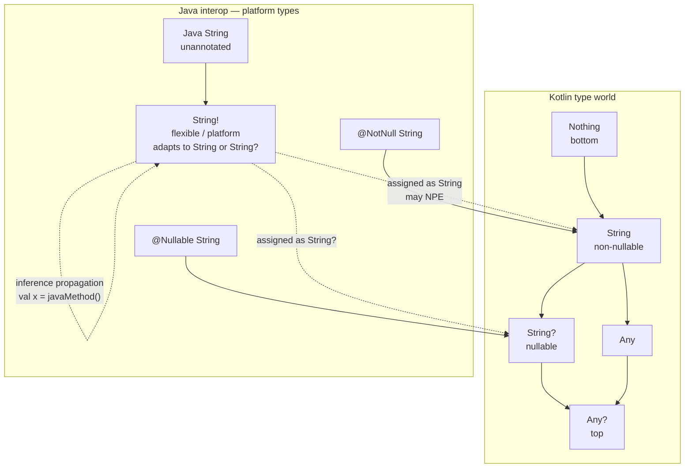
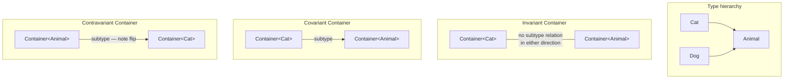
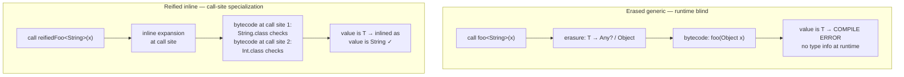
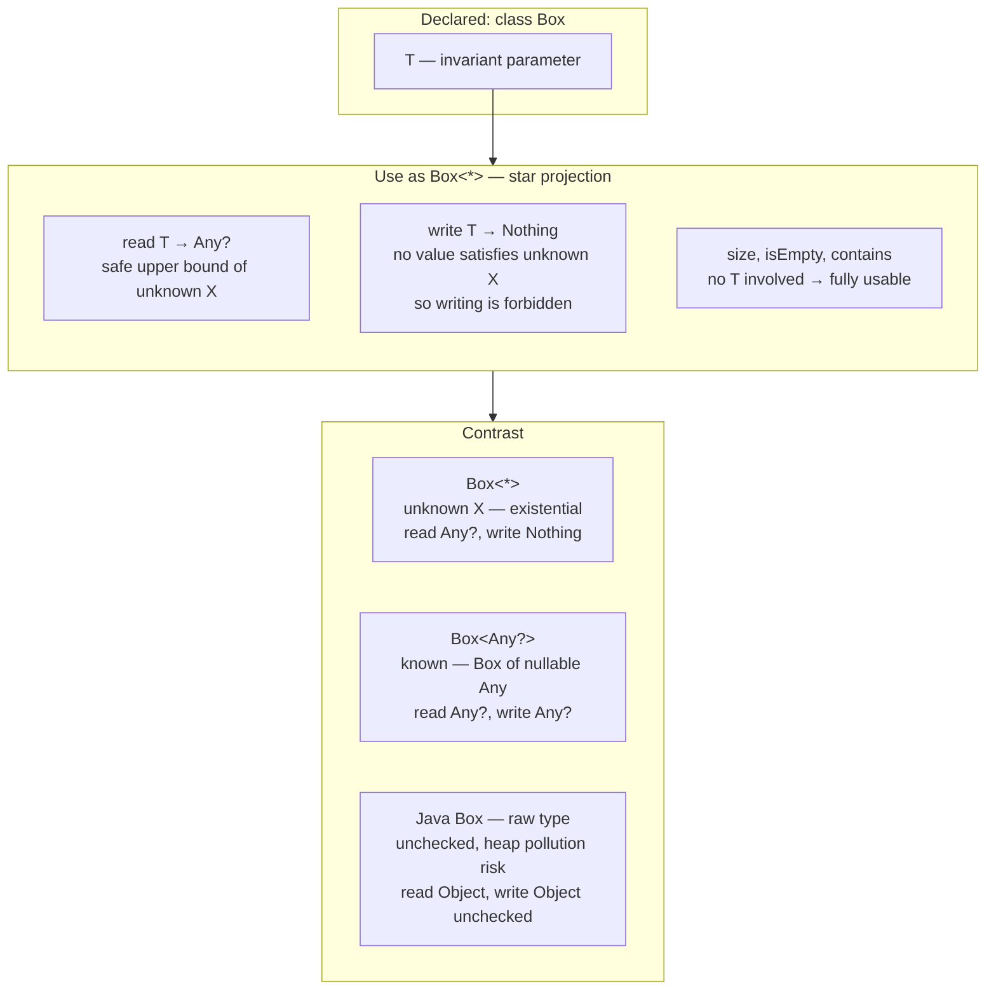
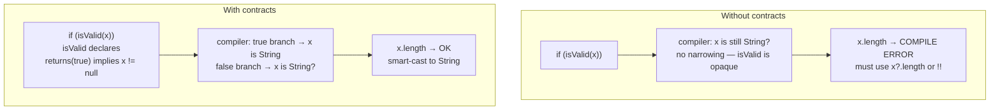
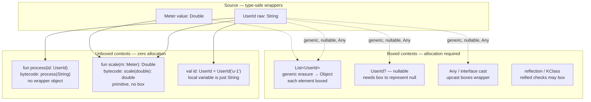

# Chapter 8 — The Kotlin Type System, Generics, and Reified Types

**What this chapter covers.** Kotlin's type system is not Java's type system with nicer syntax. It replaces the Java model — erased generics with use-site wildcards, nullable-by-default references, and primitive/object duality — with a stricter, more expressive lattice: non-nullable types by default, declaration-site variance, platform types at the Java boundary, flexible and intersection types in the compiler internals, star projections for erased generics, reified generics that recover erased type information via inlining, contracts that lift flow typing into the type checker, and value classes that erase wrappers without boxing. Understanding this system is not academic: every Kotlin microservice you deploy interoperates with Java bytecode at the generic-signature level, every JSON serializer relies on reified types or reflective `KType` tokens, and every `NullPointerException` you thought Kotlin eliminated can still surface through a platform type.

Learning goals — after this chapter you should be able to:

- Explain Kotlin's type lattice: non-nullable `T` vs nullable `T?`, platform type `T!`, flexible type `(A..B)`, intersection type, and star projection `*`, and where each arises in compilation and interop.
- Compare declaration-site variance (`in`/`out`) with Java use-site variance (`? extends`/`? super`), apply PECS correctly in both languages, and predict the variance matrix for any generic declaration.
- Describe type erasure on the JVM (what is erased, what survives in `Signature` attributes, and why `instanceof`/`is` checks on bare generics fail) and how `inline` + `reified` recovers type information at call sites.
- Use `reified T`, `typeOf<T>()`, `KType`/`KClass`, and `serializer<T>()` idioms to build type-safe serialization, DI, and routing without passing explicit `Class<T>` tokens.
- Predict how Kotlin generics map to Java wildcards at the bytecode boundary and how star projections handle Java raw types and unbounded wildcards.
- Model null-safety as a type-system property: smart casts, flow typing, and `kotlin.contracts` for custom null checks.
- Evaluate value/inline classes, unsigned types, and the primitive specialization problem — when wrappers are erased, when they box, and what that means for allocation pressure on hot paths.
- Design delegated properties (`by lazy`, `by observable`, custom delegates) and understand their desugaring to `KProperty` + `getValue`/`setValue` operators.

> **Prerequisites.** Volume 18, Chapter 1 (JVM architecture) for classfiles and `Signature` attributes; Chapter 2 (class loading) for verification; Chapter 7 (Kotlin interop) for null-safety and coroutine lowering. Familiarity with Java generics and bytecode generics signatures is assumed.

---

## 1. The Kotlin type lattice — more than `T` and `T?`

Java has one reference type hierarchy rooted at `Object` where `null` inhabits every reference type. Kotlin splits that hierarchy. Every type `T` implicitly defines a supertype `T?` that includes `null`, and the compiler enforces the distinction at every assignment, call, and return. This section maps the full lattice, including the types that only appear at boundaries and inside the compiler.

### 1.1 Non-nullable, nullable, and the `Nothing` bottom

In Kotlin, `String` means "a `String` that is definitely not null." `String?` means "a `String` or `null`." They are distinct types with a subtyping relation:

- `String <: String?` — every non-null `String` is a valid `String?`.
- `Nothing <: String` — `Nothing` is the bottom type, a subtype of every type. It has no values. Functions that never return (`throw`, infinite loop, `TODO()`) return `Nothing`, which lets the type checker treat code after such a call as unreachable.
- `Any` is the top of the non-nullable hierarchy (`Any?` is the true top including `null`).
- `Unit` is Kotlin's `void` — a proper type with a single value, not a keyword.

```kotlin
fun requireNonNull(s: String): Int = s.length       // s is String — .length is safe
fun acceptNullable(s: String?): Int? = s?.length     // must use ?. or !! or smart cast

val a: String? = "hello"       // String <: String? — widening, always safe
// val b: String = a           // ERROR: String? is not a subtype of String

fun fail(): Nothing = throw IllegalArgumentException("never returns")
val x: String = fail()         // OK: Nothing <: String — unreachable assignment typechecks
```

The compiler rejects `String? → String` narrowing without an explicit check. This is not a lint — it is a type error, enforced before bytecode emission. The bytecode itself has no notion of nullability; `String` and `String?` both compile to `Ljava/lang/String;` in descriptors. Nullability is tracked in Kotlin metadata (`@Metadata` annotation) and in the type-checker, not in the JVM verifier. That gap is precisely where platform types enter.

### 1.2 Platform types — `T!` at the Java boundary

When Kotlin calls Java, the Java declaration has no nullability annotation (or has an ambiguous one). The Kotlin compiler cannot decide whether the Java type is `T` or `T?`, so it assigns a *platform type* denoted `T!` — a flexible type that behaves as both.

```kotlin
// Java:
// public class JavaRepo {
//     public String findName(int id) { return ...; }           // no annotation
//     public @Nullable String findNick(int id) { return ...; }
//     public @NotNull String findTitle(int id) { return ...; }
// }

val a = JavaRepo().findName(42)    // type is String! — platform type
val b: String = a                  // compiles — String! adapts to String
val c: String? = a                 // also compiles — String! adapts to String?
println(a.length)                  // compiles but may NPE at runtime if Java returned null

val nick: String? = JavaRepo().findNick(42)   // @Nullable → String? (honored)
val title: String = JavaRepo().findTitle(42)  // @NotNull → String (honored)
```

Platform types are invisible in source — you never write `String!`. They appear only in tooling (IDE hints, error messages) and in the compiler's internal type representation. They propagate through inference: if `a` is `String!` and you write `val d = a`, then `d` is also `String!`. They collapse only when assigned to a definite Kotlin type (`String` or `String?`) or when used in a context that demands one.

Support for JSR-305 (`@Nullable`/`@NotNull`), JetBrains `@Nullable`/`@NotNull`, and AndroidX annotations determines whether a Java type maps to `T`/`T?` or remains `T!`. Without annotations, Kotlin must assume the worst — and it is the caller's responsibility to handle `null`. In distributed systems, this matters at every service boundary where Kotlin calls a Java library (gRPC stubs, JDBC drivers, Jackson deserialization): an unannotated Java getter returning `null` will slip past the Kotlin type checker via `T!` and surface as an NPE far from the call site.



### 1.3 Flexible, intersection, and other internal types

Beyond `T`/`T?`/`T!`, the Kotlin compiler uses several types that rarely appear in source but explain error messages and bytecode:

| Internal type | Notation | Where it arises |
|---|---|---|
| **Flexible type** | `(A..B)` | Platform types are flexible types where `A = T`, `B = T?`. Also used for Java wildcard capture. `MutableList<String!>` is really `MutableList<(String..String?)>`. |
| **Intersection type** | `T & Any` / `T where T : A, T : B` | `T & Any` denotes "T intersected with Any" — used internally to express `T` with a non-null upper bound after smart cast. Multiple upper bounds `where T : Closeable, T : Appendable` is an intersection. |
| **Star projection** | `List<*>` | Existential type — "a `List` of some unknown type." Not the same as `List<Any?>` or `List<Any>`. Discussed in §4. |
| **Definite non-nullable** | `T & Any` | After `if (x != null)`, `x` is smart-cast from `T?` to `T & Any` internally, asserting non-null without changing the generic argument. |
| **Captured type** | `capture(List<out String>)` | Result of capturing a wildcard for type inference — internal only, surfaces in error messages like "captured type of `out String`". |
| **Type parameter with nullable bound** | `T : Any?` | Default bound is `Any?`. `T : Any` constrains `T` to non-nullable types only — affects what you can do with `T?` inside the generic. |

```kotlin
// Intersection type — multiple upper bounds
fun <T> closeAndAppend(x: T) where T : AutoCloseable, T : Appendable {
    x.append("closing")  // T has both interfaces
    x.close()
}

// Flexible type visible in error message:
// fun process(list: MutableList<String>) { ... }
// Java call: process(javaList) where javaList is MutableList<String!>
// If signatures mismatch, error shows: "required MutableList<String> found MutableList<(String..String?)>"

// Definite non-null after smart cast:
fun <T> handle(x: T?) {
    if (x != null) {
        // x is now T & Any — non-null T, not T? — so x.hashCode() is safe
        println(x.hashCode())
    }
}
```

### 1.4 Where types live — descriptors, signatures, metadata

On the JVM, types are encoded in two places:

1. **Bytecode descriptors** — erased types used by the verifier. `List<String>` and `List<Int>` both have descriptor `Ljava/util/List;`. Nullability is invisible here.
2. **Generic `Signature` attribute** — preserves generic arguments as strings like `Ljava/util/List<Ljava/lang/String;>;` for reflection and compiler use, but erased at runtime for `instanceof` and overload resolution.
3. **Kotlin `@Metadata` annotation** — stores the full Kotlin type information (nullability, variance modifiers, suspend markers, value class info) as a protobuf blob. The Kotlin compiler and `kotlin-reflect` read this; `javac` and the JVM verifier ignore it.

```bash
# Inspect the three layers
kotlinc Example.kt -d example.jar
javap -v -p example.jar | grep -A2 "Signature\|RuntimeVisibleAnnotations"
# Signature: L // erased descriptor
# Kotlin Metadata: d1 = { ... } // full Kotlin types

# Kotlin's view (with kotlinc's -Xprint-enhanced):
# fun process(items: List<String>): String?  — Kotlin sees List<String>, nullable return
# Bytecode descriptor: (Ljava/util/List;)Ljava/lang/String;
# Signature attribute: (Ljava/util/List<Ljava/lang/String;>;)Ljava/lang/String;
```

This three-layer encoding explains why Kotlin null-safety is a compile-time guarantee, not a runtime invariant: once compiled, `String` and `String?` are the same bytecode type, and only `@Metadata` + Kotlin-aware tooling can distinguish them.

---

## 2. Variance — `in`/`out` vs `? extends`/`? super` and PECS

Variance answers one question: if `Cat <: Animal`, is `Box<Cat> <: Box<Animal>`? In Java and Kotlin, the answer depends on how the generic type parameter is declared and used.

### 2.1 The three variances

For a generic `Container<T>`:

- **Invariant** (default in both languages): `Container<Cat>` and `Container<Animal>` are unrelated, regardless of `Cat <: Animal`. You can both read `T` and write `T`, so neither direction is safe to coerce.
- **Covariant** (`out T` in Kotlin, `? extends T` in Java): `Container<Cat> <: Container<Animal>`. You can read `T` values (they are at least `Animal`), but you cannot safely write `T` (you might put a `Dog` into a `Container<Cat>`).
- **Contravariant** (`in T` in Kotlin, `? super T` in Java): `Container<Animal> <: Container<Cat>` — the subtype relation flips. You can write `T` values (any `Cat` is an `Animal`), but reading yields only `Any?`/`Object`.



### 2.2 Declaration-site vs use-site variance

This is the central design difference between Kotlin and Java:

| Aspect | Kotlin | Java |
|---|---|---|
| **Default** | Invariant (`class Box<T>`) | Invariant (`class Box<T>`) |
| **Covariance** | Declaration-site: `class Box<out T>` | Use-site: `Box<? extends T>` |
| **Contravariance** | Declaration-site: `class Box<in T>` | Use-site: `Box<? super T>` |
| **Enforcement** | Compiler checks that `out T` only appears in output positions, `in T` only in input positions | Compiler checks each wildcard use site |
| **Flexibility** | One declaration fixes variance for all uses; use-site `out` projection (`Box<out T>`) available as override | Every variable/method can choose its own wildcard |

Kotlin's philosophy is that most types have a natural variance — a `Producer<T>` naturally produces `T` (covariant), a `Consumer<T>` naturally consumes `T` (contravariant), and a `MutableList<T>` is naturally invariant because it does both. Declaring variance once at the class level eliminates the wildcard noise that pervades Java APIs.

```kotlin
// Kotlin: declaration-site variance — declared once, enforced everywhere
interface Producer<out T> {
    fun produce(): T
    // fun consume(value: T)  // ERROR: Cannot use 'T' as in-parameter when declared as 'out'
}

interface Consumer<in T> {
    fun consume(value: T)
    // fun produce(): T  // ERROR: Cannot use 'T' as out-return when declared as 'in'
}

class MutableBox<T>(var value: T)  // invariant — both in and out positions

// Covariant assignment — safe because Producer only outputs T
val catProducer: Producer<Cat> = CatProducer()
val animalProducer: Producer<Animal> = catProducer  // OK: Producer<Cat> <: Producer<Animal>

fun feedAll(consumer: Consumer<Animal>) {
    consumer.consume(Cat())  // Cat is an Animal
}
val catConsumer: Consumer<Cat> = feedAll as Consumer<Cat>  // Consumer<Animal> <: Consumer<Cat>
```

```java
// Java: use-site variance — chosen at every use
interface Producer<T> {
    T produce();
}

Producer<Cat> catProducer = () -> new Cat();
Producer<? extends Animal> animalProducer = catProducer;  // wildcard needed every time

void feedAll(Consumer<? super Cat> consumer) {
    consumer.consume(new Cat());
}
```

### 2.3 Variance position rules

The compiler enforces position rules to guarantee soundness:

```kotlin
class Box<out T>(private val value: T) {
    fun get(): T = value              // OK: T in out-position (return type)
    // fun set(value: T) {}           // ERROR: T in in-position
    // var stored: T                  // ERROR: var needs both get and set
    val snapshot: T get() = value     // OK: val is out-only
}

class Sink<in T> {
    fun put(value: T) {}              // OK: T in in-position (parameter)
    // fun get(): T {}                // ERROR: T in out-position
}

// Invariant class — T appears in both positions, so no variance annotation allowed
class MutableBox<T>(var value: T) {   // OK: invariant allows both
    fun get(): T = value
    fun set(value: T) { this.value = value }
}
```

When a declaration-site variant type is used in the "wrong" position, Kotlin projects it:

```kotlin
class Box<out T>(val value: T)

// T is out — when you try to use Box<String> as a consumer, T is projected to Nothing:
fun wrongUse(box: Box<String>) {
    // box is Producer-like — you can read String out, but never put String in
}

// For invariant types, Kotlin offers use-site projection as an escape hatch:
fun copy(from: List<out Any>, to: MutableList<in Any>) {
    // List<out Any> — covariant projection, read-only view
    // MutableList<in Any> — contravariant projection, write-only view
    for (item in from) to.add(item)
}
```

### 2.4 The variance matrix

Every combination of declaration-site variance and use-site projection has a defined meaning. This matrix is the reference for predicting subtype relations:

| Declaration | Use-site projection | Effective variance | `Box<Cat>` vs `Box<Animal>` | Read `T` as | Write `T` |
|---|---|---|---|---|---|
| `class Box<T>` (invariant) | `Box<T>` | Invariant | Unrelated | `T` | `T` |
| `class Box<T>` | `Box<out T>` | Covariant projection | `Box<Cat> <: Box<Animal>` | `T` (as `Animal`) | `Nothing` (forbidden) |
| `class Box<T>` | `Box<in T>` | Contravariant projection | `Box<Animal> <: Box<Cat>` | `Any?` | `T` |
| `class Box<T>` | `Box<*>` | Star projection | See §4 | `Any?` | `Nothing` (forbidden) |
| `class Box<out T>` | `Box<T>` | Covariant (as declared) | `Box<Cat> <: Box<Animal>` | `T` | `Nothing` (forbidden) |
| `class Box<out T>` | `Box<out T>` | Covariant (redundant) | `Box<Cat> <: Box<Animal>` | `T` | `Nothing` |
| `class Box<out T>` | `Box<in T>` | **Error** — conflicting | — | — | — |
| `class Box<in T>` | `Box<T>` | Contravariant (as declared) | `Box<Animal> <: Box<Cat>` | `Any?` | `T` |
| `class Box<in T>` | `Box<*>` | Star projection of contravariant | Special: `in Nothing` | `Any?` | `Nothing` |

```kotlin
// Demonstrating the matrix:
open class Animal
class Cat : Animal()
class Dog : Animal()

// Invariant — exact match required
fun invariant(box: MutableList<Animal>) {}
// invariant(mutableListOf(Cat()))  // ERROR: MutableList<Cat> is not MutableList<Animal>

// Covariant projection — read-only widening
fun covariant(producer: List<Animal>) {}
covariant(listOf(Cat()))  // OK: List is covariant (out T), so List<Cat> <: List<Animal>

// Contravariant projection — write-only narrowing
fun contravariant(sink: MutableList<in Cat>) {
    sink.add(Cat())       // OK: can put Cat in
    // val x: Cat = sink[0]  // ERROR: read returns Any?
}
val animalSink: MutableList<Animal> = mutableListOf()
contravariant(animalSink)  // OK: MutableList<Animal> <: MutableList<in Cat>

// Star projection
fun star(list: List<*>) {
    val first: Any? = list[0]  // read as Any?
    // list.add("x")           // ERROR: Nothing — cannot write
}
```

### 2.5 PECS — Producer Extends, Consumer Super

Joshua Bloch's PECS mnemonic maps directly to Kotlin's `in`/`out`:

- **Producer `extends`** → **Producer `out`**: if a parameter produces `T` values (you read from it), make it `out` / `? extends T`.
- **Consumer `super`** → **Consumer `in`**: if a parameter consumes `T` values (you write to it), make it `in` / `? super T`.

```kotlin
// Classic PECS example: copy from source (producer) to destination (consumer)
fun <T> copyKotlin(source: List<out T>, dest: MutableList<in T>) {
    for (item in source) dest.add(item)
}

// Java equivalent for comparison:
// <T> void copyJava(List<? extends T> source, List<? super T> dest) {
//     for (T item : source) dest.add(item);
// }

// Real-world backend example: event handler registry
interface EventHandler<in E : Event> {
    fun handle(event: E)
}

class EventBus {
    private val handlers = mutableMapOf<KClass<*>, MutableList<EventHandler<*>>>()

    fun <E : Event> register(type: KClass<E>, handler: EventHandler<E>) {
        handlers.getOrPut(type) { mutableListOf() }.add(handler)
    }

    // Contravariant handler: a handler for Event can handle any subtype
    // EventHandler<Event> <: EventHandler<UserCreatedEvent>
    fun <E : Event> dispatch(event: E) {
        @Suppress("UNCHECKED_CAST")
        (handlers[event::class] as? List<EventHandler<E>>)?.forEach { it.handle(event) }
    }
}
```

In Kotlin service code, PECS shows up most often in collection processing, event dispatch, and anything with `Flow`/`Sequence`:

```kotlin
// Flow is covariant: Flow<out T> — a Flow<Cat> is a Flow<Animal>
fun animalFlow(): Flow<Animal> = flowOf(Cat(), Dog())

// MutableStateFlow is invariant — it both produces and consumes T
// MutableStateFlow<Cat> is NOT a MutableStateFlow<Animal>
```

---

## 3. Type erasure, reified generics, and `typeOf`

### 3.1 What erasure means on the JVM

The JVM has no runtime representation of generic type arguments. `List<String>` and `List<Int>` are the same class (`java.util.List`) at runtime. The compiler erases type parameters to their upper bound (or `Object`/`Any?` if unbounded) and inserts casts where needed. This is true for both Java and Kotlin — they share the same runtime.

What survives erasure:

| Artifact | Survives? | Where |
|---|---|---|
| Raw class | Yes | Bytecode descriptor (`Ljava/util/List;`) |
| Upper bound | Yes | Implicit in erased descriptor |
| `Signature` attribute | Yes (as metadata) | Classfile attribute — visible via reflection but not used for `instanceof` |
| Kotlin `@Metadata` | Yes (as annotation) | Stores full Kotlin generic + nullability info |
| Runtime `instanceof` / `is` check on `T` | **No** | `if (x is List<String>)` checks only `List`, not `String` |
| Overload resolution on `T` | **No** | `fun foo(x: List<String>)` and `fun foo(x: List<Int>)` collide — same erased signature |

```kotlin
fun <T> erasedCheck(value: Any) {
    // if (value is List<String>)  // WARNING: check for instance is always true / unchecked cast
    if (value is List<*>) {        // OK: only checks raw type
        println("it's a list, element type erased")
    }
}

// Overload collision — does not compile:
// fun handle(x: List<String>) {}
// fun handle(x: List<Int>) {}     // ERROR: conflicting overloads — same JVM signature

// Workaround: JVM name mangling
@JvmName("handleStrings")
fun handleStrings(x: List<String>) {}
@JvmName("handleInts")
fun handleInts(x: List<Int>) {}    // OK: distinct JVM names via annotation
```

Checking the bytecode confirms erasure:

```bash
kotlinc Erasure.kt -d erasure.jar
javap -v -p -classpath erasure.jar ErasureKt | grep -A5 "erasedCheck"
```

```java
// Decompiled — note Object, not T, and no String check:
public static final void erasedCheck(Object value) {
    boolean isList = value instanceof List;  // raw check only
}
```

```mermaid
sequenceDiagram
    participant Source as Kotlin source<br/>fun &lt;T&gt; foo(x: T)
    participant Compiler as Compiler<br/>type erasure
    participant Bytecode as Bytecode<br/>descriptor + Signature
    participant Runtime as Runtime<br/>instanceof / casts
    Source->>Compiler: T is String in source
    Compiler->>Bytecode: descriptor (Ljava/lang/Object;)<br/>Signature &lt;T:Ljava/lang/Object;&gt;(TT;)V
    Bytecode->>Runtime: instanceof checks raw type only
    Runtime-->>Source: casts inserted by compiler<br/>are checked at runtime
    Note over Compiler,Bytecode: Signature preserved for<br/>reflection but NOT for<br/>instanceof or overloads
```

### 3.2 The reified workaround — `inline` + `reified`

Kotlin's answer to erasure is `reified` type parameters on `inline` functions. When a function is `inline`, its body is copied to every call site at compile time. If a type parameter is marked `reified`, the compiler substitutes the *concrete* type argument at each call site, making `T::class`, `is T`, and `T::class.java` available — operations that are impossible with erased generics.

```kotlin
// Erased — cannot check T at runtime
fun <T> isInstanceErased(value: Any): Boolean {
    // return value is T  // ERROR: Cannot check for instance of erased type: T
    return false
}

// Reified — T is known at each call site after inlining
inline fun <reified T> isInstanceReified(value: Any): Boolean {
    return value is T  // OK: compiler knows T at call site
}

// Usage — each call site gets a specialized copy:
isInstanceReified<String>("hello")  // inlined as: "hello" is String
isInstanceReified<Int>(42)          // inlined as: 42 is Int
```

What `inline` + `reified` actually does at the bytecode level:

```kotlin
inline fun <reified T> createInstance(): T? {
    return T::class.java.getDeclaredConstructor().newInstance()
}

// Call site 1:
val s: String? = createInstance<String>()
// After inlining, compiler emits (conceptually):
//   String.class.getDeclaredConstructor().newInstance()

// Call site 2:
val n: Int? = createInstance<Int>()
// After inlining:
//   Integer.class.getDeclaredConstructor().newInstance()  // boxed — see §6
```

Constraints on `reified`:

- Only on `inline` functions — never on classes, interfaces, or non-inline functions. The type must be recoverable by inlining, and only functions are inlined.
- Cannot be used across module boundaries in a non-inlined way — the call site must see the function body.
- Each call site gets a separate bytecode expansion — code bloat is real if the function body is large and called many times with many distinct `T`.
- `reified` parameters cannot be used as `reified` arguments to non-reified positions without further inlining.

```kotlin
// Common reified utilities in backend code:

inline fun <reified T : Any> Gson.fromJson(json: String): T =
    fromJson(json, T::class.java)

inline fun <reified T : Any> ObjectMapper.readValue(json: String): T =
    readValue(json, typeRef<T>())  // see typeRef below via TypeReference

// TypeReference trick — anonymous subclass captures generic supertype token
inline fun <reified T> typeRef(): TypeReference<T> = object : TypeReference<T>() {}

// KClass-based service locator (simplified DI)
class ServiceRegistry {
    private val services = mutableMapOf<KClass<*>, Any>()
    inline fun <reified T : Any> register(instance: T) {
        services[T::class] = instance
    }
    inline fun <reified T : Any> resolve(): T =
        services[T::class] as? T ?: error("No service for ${T::class.simpleName}")
}
```



### 3.3 `typeOf`, `KType`, and the `KType` token

`T::class` gives you a `KClass` (the erased class), but loses generic arguments: `T::class` for `List<String>` yields `List::class`. To preserve full generic type information, Kotlin 1.6+ provides `typeOf<T>()` (requiring `reified T` inline context or experimental `optIn`):

```kotlin
import kotlin.reflect.typeOf
import kotlin.reflect.KType

@OptIn(ExperimentalStdlibApi::class)
inline fun <reified T> printType() {
    val kType: KType = typeOf<T>()
    println("KType: $kType")
    println("Classifier: ${kType.classifier}")   // KClass — e.g., List
    println("Arguments: ${kType.arguments}")      // KTypeProjection list — e.g., [String]
    println("Nullable: ${kType.isMarkedNullable}")
}

printType<List<String>>()          // KType: kotlin.collections.List<kotlin.String>
printType<Map<String, Int?>>()     // KType: kotlin.collections.Map<kotlin.String, kotlin.Int?>
printType<List<String>?>()         // KType: kotlin.collections.List<kotlin.String>? — nullable

// Passing KType explicitly when reified is not available:
fun processWithType(value: Any, type: KType) {
    println("Processing as $type")
}
processWithType(listOf("a"), typeOf<List<String>>())
```

This is the foundation for type-safe serialization frameworks. `kotlinx.serialization` uses `typeOf` / `serializer<T>()` to resolve the correct `KSerializer` at compile time without runtime reflection scanning:

### 3.4 Reified serializer example — end to end

```kotlin
import kotlinx.serialization.Serializable
import kotlinx.serialization.KSerializer
import kotlinx.serialization.json.Json
import kotlinx.serialization.serializer  // reified serializer() extension
import kotlin.reflect.typeOf

@Serializable
data class UserEvent(val userId: String, val email: String, val timestamp: Long)

@Serializable
data class PagedResult<T>(val items: List<T>, val nextToken: String?)

// --- Reified JSON helpers (typical in any Kotlin backend service) ---

@OptIn(ExperimentalStdlibApi::class)
object JsonCodec {
    private val json = Json {
        ignoreUnknownKeys = true
        encodeDefaults = true
        explicitNulls = false
    }

    // Reified encode — resolves KSerializer<T> at call site, no Class<T> parameter
    inline fun <reified T> encode(value: T): String {
        // serializer<T>() is itself an inline reified function that returns KSerializer<T>
        // typeOf<T>() is available for logging / routing decisions
        val kType = typeOf<T>()
        println("Encoding type: $kType")  // e.g., PagedResult<UserEvent>
        return json.encodeToString(serializer<T>(), value)
    }

    inline fun <reified T> decode(raw: String): T {
        return json.decodeFromString(serializer<T>(), raw)
    }

    // Non-reified overload for when T is only known as KType at runtime
    // (e.g., message router that dispatches by topic → KType map)
    fun <T> decodeWithKType(raw: String, type: KType, serializer: KSerializer<T>): T {
        @Suppress("UNCHECKED_CAST")
        return json.decodeFromString(serializer as KSerializer<T>, raw) as T
    }
}

// Usage — zero boilerplate at call sites:
fun main() {
    val event = UserEvent("u-42", "alice@example.com", 1713700000L)

    // Simple type — serializer resolved via reified T = UserEvent
    val json1 = JsonCodec.encode(event)
    val back1: UserEvent = JsonCodec.decode(json1)
    println(json1)
    // {"userId":"u-42","email":"alice@example.com","timestamp":1713700000}

    // Nested generic — serializer for PagedResult<UserEvent> composed automatically
    val page = PagedResult(items = listOf(event), nextToken = "tok-99")
    val json2 = JsonCodec.encode(page)          // T = PagedResult<UserEvent>
    val back2: PagedResult<UserEvent> = JsonCodec.decode(json2)
    println(json2)
    // {"items":[{"userId":"u-42",...}],"nextToken":"tok-99"}

    // Contrast with Java/Gson — requires explicit TypeToken at every call site:
    // Type type = new TypeToken<PagedResult<UserEvent>>(){}.getType();
    // gson.fromJson(json, type);
    // Kotlin reified eliminates the anonymous-subclass ceremony entirely.
}
```

Key points for backend engineers:

- `serializer<T>()` is `inline fun <reified T> serializer(): KSerializer<T>` — it uses `typeOf<T>()` internally to look up the generated serializer. No reflection scan at runtime; the serializer is resolved at compile time and inlined.
- For polymorphic hierarchies (`@Polymorphic`, sealed classes), the `KSerializer` includes a discriminator field — `typeOf` ensures the correct polymorphic serializer is selected.
- When the type is not known at compile time (message router, plugin system), fall back to passing `KType`/`KSerializer` explicitly — reified is a call-site optimization, not a universal replacement for type tokens. Design your router's registry around `KType` keys if you need runtime dispatch.

---

## 4. Star projections and Java interop

### 4.1 What `*` means

`List<*>` is Kotlin's spelling for "a `List` of some unknown type." It is the safe replacement for Java's raw type `List` and for the unbounded wildcard `List<?>`. Understanding `*` requires understanding what it projects to.

For a generic `Box<T>`:

- `Box<*>` means `Box<out Any?>` if `T` is covariant or invariant — you can read `Any?` out, but you can only write `Nothing` (i.e., you cannot write anything except `null` into a `Box<in Nothing>` position, and even that is restricted).
- For `Box<in T>`, `Box<*>` projects to `Box<in Nothing>` — you can write `Nothing` (nothing) and read `Any?`.

More precisely, `*` is an *existential type*: `Box<*>` means "there exists some type `X` such that this is a `Box<X>`, but we don't know what `X` is." The compiler enforces safe use by projecting `X` to its bounds.

```kotlin
fun starDemo(list: List<*>) {
    val first: Any? = list[0]   // OK: read as Any? — the only safe supertype of unknown X
    // list.add("hello")        // ERROR: cannot add — would require knowing X
    println("size=${list.size}") // OK: size doesn't involve T
    for (item in list) {         // OK: iteration yields Any?
        println(item)
    }
}

fun <T> copyStar(from: List<*>, to: MutableList<in Any?>) {
    // List<*> elements are Any?, so we can add them to MutableList<in Any?>
    for (item in from) to.add(item)
}
```



### 4.2 Star projection erasure demo

The following program demonstrates how `*`, `Any?`, and Java raw types differ at runtime — and that all three erase to the same bytecode:

```kotlin
// StarProjectionDemo.kt
fun inspectStar(list: List<*>) {
    println("List<*> size=${list.size}, first=${list.firstOrNull()}")
    // list.add("x")  // compile error — Nothing
}

fun inspectAny(list: List<Any?>) {
    println("List<Any?> size=${list.size}")
    // list is MutableList<Any?> only if declared mutable — List<Any?> is read-only anyway
}

fun inspectRawJava(list: java.util.ArrayList<*>) {
    println("ArrayList<*> via Kotlin view")
}

// At the bytecode level, all three have the same erased descriptor:
// (Ljava/util/List;)V — the Signature attribute distinguishes them:
//   inspectStar: (Ljava/util/List<*>;)V
//   inspectAny:  (Ljava/util/List<Ljava/lang/Object;>;)V
// But instanceof cannot distinguish any of them:
fun erasureDemo() {
    val strings: List<String> = listOf("a", "b")
    val ints: List<Int> = listOf(1, 2)

    println(strings is List<*>)       // true — raw check
    println(ints is List<*>)          // true — same raw check
    // println(strings is List<String>)  // WARNING: unchecked — same as List<*>

    // Star projection safely handles either:
    inspectStar(strings)  // OK: List<String> <: List<*>
    inspectStar(ints)     // OK: List<Int> <: List<*>

    // Any? is stricter — requires exact match on nullability view:
    // inspectAny(strings)  // ERROR if strings is List<String> and function expects List<Any?>
    // But List<String> <: List<Any> via covariance (List is out), so:
    val anys: List<Any> = strings  // OK: List is covariant
    inspectAny(listOf("a", null))  // OK: List<Any?> inferred

    // Bytecode proof — descriptors are identical after erasure:
    println(inspectStar::class.java.methods.find { it.name == "inspectStar" })
    println(inspectAny::class.java.methods.find { it.name == "inspectAny" })
    // Both: public static void inspect...(java.util.List)
}

fun main() {
    erasureDemo()
    // Output:
    // true
    // true
    // List<*> size=2, first=a
    // List<*> size=2, first=1
    // public static final void StarProjectionDemoKt.inspectStar(java.util.List)
    // public static final void StarProjectionDemoKt.inspectAny(java.util.List)
}
```

For a backend service that reflects over handlers or deserializes heterogeneous lists, `List<*>` is the correct Kotlin type for "a list whose element type I don't know yet." Cast it only after checking the desired element type with a reified helper:

```kotlin
inline fun <reified T> List<*>.filterIsInstanceReified(): List<T> =
    filterIsInstance<T>()  // uses reified T to check each element

val mixed: List<*> = listOf("a", 42, "b", 3.14)
val strings: List<String> = mixed.filterIsInstanceReified<String>()  // ["a", "b"]
```

### 4.3 Java wildcard interop

Kotlin declaration-site variance and Java use-site variance meet at the bytecode boundary. The Kotlin compiler maps between them automatically, but the mapping has sharp edges:

| Java declaration | Kotlin view | Notes |
|---|---|---|
| `List<String>` | `MutableList<String>` | Invariant — exact match |
| `List<? extends Number>` | `MutableList<out Number>` | Covariant projection |
| `List<? super String>` | `MutableList<in String>` | Contravariant projection |
| `List<?>` | `MutableList<*>` | Star projection |
| `List` (raw) | `MutableList<*>` | Raw → star projection (with unchecked warning) |
| `List<? extends Number>` as return | `List<Number>` in Kotlin if declared `out` | Kotlin may see raw bound |

```kotlin
// Java class:
// public class JavaBox {
//     public static void consumeNumbers(List<? extends Number> nums) {}
//     public static void produceStrings(List<? super String> sink) {}
//     public static List<?> unknownList() { return List.of("a", "b"); }
// }

// Kotlin call sites — wildcards mapped to projections:
JavaBox.consumeNumbers(listOf(1, 2, 3))       // List<Int> <: List<out Number> — OK
JavaBox.produceStrings(mutableListOf<Any>())  // MutableList<Any> <: MutableList<in String> — OK
val unknown: MutableList<*> = JavaBox.unknownList() as MutableList<*>

// Going the other direction — Kotlin declaration with variance, seen from Java:
// Kotlin: class Producer<out T>(val value: T)
// Java sees: class Producer<T> { T getValue(); }  — with Signature <T:Ljava/lang/Object;>
// Java cannot express declaration-site variance, so it sees invariant Producer<T>
// To call from Java with variance, Java must use wildcards:
// Producer<? extends Animal> p = new Producer<>(new Cat());

// @JvmWildcard / @JvmSuppressWildcards control wildcard generation:
class KotlinService {
    // Without annotation, Kotlin's List<String> generates List<String> in bytecode Signature
    // Java sees List<String> — correct.

    // With declaration-site variance, Java interop may need explicit wildcards:
    fun processInvariant(list: List<String>) {}           // Java: List<String>
    fun processCovariant(list: List<@JvmWildcard String>) {} // Java: List<? extends String>
    fun processNoWildcard(list: List<@JvmSuppressWildcards String>) {} // suppress ? extends
}
```

```bash
# Verify wildcard generation in bytecode signatures:
kotlinc Interop.kt -d interop.jar
javap -v -p -classpath interop.jar KotlinService | grep -A1 "Signature"
# processInvariant: (Ljava/util/List<Ljava/lang/String;>;)V
# processCovariant: (Ljava/util/List<+Ljava/lang/String;>;)V  — '+' denotes ? extends
# processNoWildcard: (Ljava/util/List<Ljava/lang/String;>;)V
```

In a polyglot service (Kotlin services calling Java libraries and vice versa), the practical rule is: annotate Kotlin variance-bearing APIs with `@JvmWildcard` where Java callers need covariance, and use `@JvmSuppressWildcards` sparingly when Java's wildcard handling complicates overload resolution. Test the Java-facing Signature with `javap` — don't guess.

---

## 5. Null-safety as a type-system property — flow typing and contracts

### 5.1 Smart casts and flow typing

Kotlin's null-safety is not a runtime check inserted before every dereference. It is a type-narrowing system where control flow refines types. After a null check, the compiler *smart-casts* `T?` to `T` within the scope where non-null is proven:

```kotlin
fun flowTypingDemo(input: String?) {
    // input is String? — nullable

    if (input != null) {
        // input is smart-cast to String here — no !!, no ?. needed
        println(input.length)       // String.length — safe
        println(input.uppercase())  // all String members available
    }

    // input is String? again — smart cast expired outside the if

    // Early return — also narrows
    if (input == null) return
    // input is String from here on — compiler knows the null path returned
    println(input.length)

    // Elvis + throw / return also narrows:
    val s: String = input ?: error("null")  // String, not String?
}

fun whenNarrowing(value: Any?) {
    when (value) {
        null -> println("null")
        is String -> println(value.length)   // value is String in this branch
        is Int -> println(value + 1)         // value is Int here
        else -> println("other: $value")
    }
}
```

The compiler tracks several narrowing conditions:

- `x != null`, `x == null`, `x is T`, `x !is T`, `x is null` / `x !is null` in `if`/`when`/`while`.
- `&&` and `||` short-circuit: `if (x != null && x.isNotEmpty())` — second condition sees `x` as non-null.
- `?.let { }`, `?: return`, `?: throw`, `?: error()` — idiomatic early-exit narrowing.
- `is` checks narrow `Any`/`Any?` to concrete types, enabling safe casts without `as`.

```kotlin
fun complexFlow(x: Any?, y: String?) {
    if (x is String && y != null && x.length == y.length) {
        // x is String, y is String — both narrowed by the combined condition
        println(x.uppercase() + y.uppercase())
    }

    // Smart cast survives only if the variable is stable:
    var mutable: String? = y
    if (mutable != null) {
        // mutable is String? still — var can be reassigned between check and use
        // println(mutable.length)  // ERROR: smart cast impossible — var is mutable
        val snapshot = mutable       // snapshot is String (val — stable)
        println(snapshot.length)     // OK
    }
}
```

Stability is the key limitation: smart casts apply only to `val` properties (and local `val`s) that have no custom getter and are not open. A `var` or an `open val` with a custom getter could return a different value on each access, so the compiler refuses to narrow it. In backend code, this surfaces with mutable entity fields — prefer `val` or capture to a local `val` before narrowing.

### 5.2 Contracts — lifting custom checks into the type system

Standard flow typing handles `!= null` and `is T`, but backend code is full of custom validation: `requireNotNull`, `check`, helper predicates like `isValidEmail(x)`. Without help, the compiler cannot connect `if (isValid(x))` to a type narrowing. `kotlin.contracts` solves this by letting functions declare *contracts* — promises about how their return value relates to their parameters' types.

```kotlin
import kotlin.contracts.ExperimentalContracts
import kotlin.contracts.contract

@OptIn(ExperimentalContracts::class)
fun requireNonBlank(value: String?, lazyMessage: () -> String = { "required" }): String {
    contract {
        returns() implies (value != null)  // if this function returns normally, value is non-null
    }
    if (value.isNullOrBlank()) throw IllegalArgumentException(lazyMessage())
    return value
}

fun handleRequest(rawEmail: String?) {
    val email = requireNonBlank(rawEmail) { "email is required" }
    // rawEmail is now smart-cast to String — contract told the compiler
    // that normal return implies non-null
    println(email.length)  // safe — but prefer using the returned `email` val
}

// More expressive: returns(true) / returns(false) / returns(null) / returnsNotNull()

@OptIn(ExperimentalContracts::class)
fun isNotNullAndNotEmpty(value: String?): Boolean {
    contract {
        returns(true) implies (value != null)  // true return means value is non-null
    }
    return !value.isNullOrEmpty()
}

fun processBatch(input: String?) {
    if (isNotNullAndNotEmpty(input)) {
        // input is String here — contract propagated the narrowing
        println(input.length)
    }
}

// callsInPlace — for inline higher-order functions that execute a lambda exactly once,
// allowing smart casts inside the lambda to propagate:
@OptIn(ExperimentalContracts::class)
inline fun <T> T?.ifPresent(block: (T) -> Unit) {
    contract { callsInPlace(block, InvocationKind.AT_MOST_ONCE) }
    if (this != null) block(this)
}
```

Available contract effects:

| Contract | Meaning |
|---|---|
| `returns() implies (x != null)` | Normal return guarantees `x` is non-null/non-false |
| `returns(true) implies (x is T)` | Returning `true` narrows `x` to `T` |
| `returns(false) implies (x is T)` | Returning `false` narrows `x` |
| `returns(null) implies (x is T)` | Returning `null` narrows `x` |
| `returnsNotNull() implies (x != null)` | Non-null return implies `x` is non-null |
| `callsInPlace(lambda, EXACTLY_ONCE)` | Lambda is called in place — smart casts inside it propagate |
| `callsInPlace(lambda, AT_MOST_ONCE)` | Lambda called zero or one times |
| `callsInPlace(lambda, AT_LEAST_ONCE)` | Lambda called one or more times |



Contracts are experimental (`@OptIn(ExperimentalContracts::class)`) but stable in practice; the standard library uses them extensively (`requireNotNull`, `check`, `error`, `TODO`, `let`, `run`, `also`, `apply`). Custom contracts are most valuable in shared validation libraries: a single `validateRequest()` with a contract can narrow types across every service that calls it, eliminating repetitive `!!` and `?.let` chains.

Limitations: contracts apply only to `inline` functions (or functions the compiler can analyze as effectively inline in the stdlib), cannot express arbitrary predicates (only null checks and type tests), and are not inherited — overriding a contracted function does not carry the contract to the override. For complex validation, prefer returning a sealed result type over relying solely on contracts.

---

## 6. Value classes, inline classes, and unsigned types

### 6.1 The allocation problem

On the JVM, every domain concept modeled as a class costs an allocation: `data class UserId(val value: String)` wraps a `String` in a heap object with a header, a reference field, and GC pressure. For hot-path identifiers that appear millions of times (request IDs, partition keys, metric labels), that overhead is significant. Kotlin offers three mechanisms to eliminate it.

### 6.2 Value classes (`@JvmInline value class`)

A `value class` with a single property is *unboxed* at runtime where possible — the wrapper disappears and only the underlying value remains. The type still exists at compile time for type safety, but at runtime it is just the wrapped type.

```kotlin
@JvmInline
value class UserId(val raw: String)

@JvmInline
value class PartitionKey(val raw: String)

@JvmInline
value class RequestId(val raw: String)

// Type safety — cannot mix them:
fun loadUser(id: UserId) { /* ... */ }
fun loadPartition(key: PartitionKey) { /* ... */ }

val uid = UserId("u-42")
val pkey = PartitionKey("p-99")
// loadUser(pkey)  // ERROR: PartitionKey is not UserId — compile-time safety, zero runtime cost

// At runtime (when not boxed), UserId("u-42") is just the String "u-42" — no wrapper object.
// Bytecode for loadUser(UserId) is actually loadUser(String) after mangling.
```

When does boxing occur? The wrapper *is* allocated when:

- Used as a generic type argument: `List<UserId>` boxes each `UserId` because generics erase to `Object` and the wrapper identity is needed.
- Used as nullable `UserId?` — `null` requires a box to distinguish "null UserId" from "UserId wrapping null" (though `UserId` wrapping `String` cannot wrap `null` if `raw` is `String` non-nullable, the nullable wrapper still boxes).
- Used as `Any` / interface type — upcasting to `Any` boxes.
- Returned from an inline function that doesn't inline at the call site.

```kotlin
@JvmInline value class Meter(val value: Double)

fun unboxed(m: Meter): Double = m.value * 2.0        // no allocation — m is just a double
fun boxed(list: List<Meter>): Double {                // boxes — generic context
    return list.sumOf { it.value }
}
fun nullable(m: Meter?): Double? = m?.value          // boxes — nullable

// Bytecode proof:
kotlinc ValueClass.kt -d v.jar
javap -v -p -classpath v.jar ValueClassKt | grep -A2 "unboxed\|boxed"
// unboxed: (D)D — takes and returns primitive double, no Meter object
// boxed: (Ljava/util/List;)D — List of boxed Meter objects
```



### 6.3 Inline classes (deprecated) vs value classes

`inline class` was the experimental predecessor. It is deprecated in favor of `@JvmInline value class`, which generalizes to multi-property value classes in Kotlin 2.0+ (via `@JvmInline` single-property restriction being lifted for non-JVM targets). Migrate any remaining `inline class` declarations:

```kotlin
// Deprecated:
inline class LegacyId(val raw: String)

// Current:
@JvmInline value class ModernId(val raw: String)
```

### 6.4 Unsigned and primitive specialization

Kotlin's unsigned types (`UByte`, `UShort`, `UInt`, `ULong`) and the experimental unsigned arrays are also value classes — they wrap signed JVM primitives with unsigned semantics at compile time and erase to the signed primitive at runtime:

```kotlin
val count: UInt = 42u           // value class wrapping Int — runtime is just int 42
val big: ULong = 9_000_000_000u  // wrapping Long — runtime is just long

// Unsigned operations are intrinsified — no boxing for arithmetic:
fun increment(x: UInt): UInt = x + 1u  // compiles to iadd on primitive int

// Pitfall — boxing in generics still applies:
val counts: List<UInt> = listOf(1u, 2u, 3u)  // each UInt boxed — List<U* > is generic
val array: UIntArray = uintArrayOf(1u, 2u, 3u) // specialized primitive array — no boxing
```

For backend hot paths (counters, checksums, binary protocol parsing), prefer `UIntArray`/`UByteArray` or plain signed primitives over `List<UInt>` to avoid per-element boxing. When unsigned semantics are needed for correctness (e.g., Kafka offset arithmetic that wraps at `2^32`), `UInt`/`ULong` give you the right operations with zero overhead outside generic contexts.

---

## 7. Delegated properties — `by` as a type-system feature

Delegated properties let a property's `get`/`set` logic be extracted into a reusable delegate object. The compiler desugars `val x by delegate` into calls to `delegate.getValue(thisRef, property)` / `delegate.setValue(thisRef, property, value)`.

### 7.1 Mechanism and desugaring

```kotlin
import kotlin.reflect.KProperty

class LoggingDelegate<T>(private var value: T) {
    operator fun getValue(thisRef: Any?, property: KProperty<*>): T {
        println("get ${property.name} = $value")
        return value
    }
    operator fun setValue(thisRef: Any?, property: KProperty<*>, newValue: T) {
        println("set ${property.name}: $value → $newValue")
        value = newValue
    }
}

class ServiceConfig {
    var endpoint: String by LoggingDelegate("https://api.example.com")
    var timeoutMs: Long by LoggingDelegate(5_000L)
}

// Desugared (what the compiler generates, simplified):
class ServiceConfigDesugared {
    private val `endpoint$delegate` = LoggingDelegate("https://api.example.com")
    var endpoint: String
        get() = `endpoint$delegate`.getValue(this, ::endpoint)
        set(value) { `endpoint$delegate`.setValue(this, ::endpoint, value) }

    private val `timeoutMs$delegate` = LoggingDelegate(5_000L)
    var timeoutMs: Long
        get() = `timeoutMs$delegate`.getValue(this, ::timeoutMs)
        set(value) { `timeoutMs$delegate`.setValue(this, ::timeoutMs, value) }
}
```

The delegate must provide `operator fun getValue` (and `setValue` for `var`). Two special cases:

- `ReadOnlyProperty<in R, out T>` — delegate for `val` only.
- `ReadWriteProperty<in R, T>` — delegate for `var`.

### 7.2 Standard delegates

```kotlin
// lazy — thread-safe by default (SYNCHRONIZED), computed once
val expensiveClient: HttpClient by lazy {
    HttpClient.newBuilder().connectTimeout(Duration.ofSeconds(5)).build()
}
// Modes: LazyThreadSafetyMode.SYNCHRONIZED (default), PUBLICATION, NONE

// observable — vetoable / observable mutation
var maxRetries: Int by Delegates.observable(3) { prop, old, new ->
    require(new in 0..10) { "${prop.name} out of range: $new" }
    logger.info { "${prop.name}: $old → $new" }
}
var boundedRetries: Int by Delegates.vetoable(3) { _, _, new -> new in 0..10 }

// notNull — lateinit alternative with explicit delegate (throws if read before write)
var lateConfig: ServiceConfig by Delegates.notNull()

// map-backed — useful for JSON / dynamic config
class JsonConfig(private val map: Map<String, Any?>) {
    val host: String by map       // map.getValue(thisRef, property) — looks up "host" key
    val port: Int by map          // looks up "port" key
}
val cfg = JsonConfig(mapOf("host" to "db.internal", "port" to 5432))
println(cfg.host)  // "db.internal"

// Custom: expiring cache delegate
class ExpiringDelegate<T>(private val ttl: Duration, private val producer: () -> T) {
    private var cached: T? = null
    private var expiresAt: Instant = Instant.MIN

    operator fun getValue(thisRef: Any?, property: KProperty<*>): T {
        if (cached == null || Instant.now().isAfter(expiresAt)) {
            cached = producer()
            expiresAt = Instant.now().plus(ttl)
        }
        @Suppress("UNCHECKED_CAST")
        return cached as T
    }
}

class TokenHolder {
    val accessToken: String by ExpiringDelegate(Duration.ofMinutes(55)) {
        fetchTokenFromIdp()  // called at most once per 55 minutes, on first access after expiry
    }
}
```

### 7.3 Property delegation in distributed systems

Delegates shine for cross-cutting backend concerns that would otherwise require boilerplate on every property:

```kotlin
// Metrics-instrumented property — records access count and latency
class MeteredDelegate<T>(private var value: T, private val name: String, private val registry: MeterRegistry) {
    operator fun getValue(thisRef: Any?, property: KProperty<*>): T {
        registry.counter("${name}.reads").increment()
        return value
    }
    operator fun setValue(thisRef: Any?, property: KProperty<*>, newValue: T) {
        registry.counter("${name}.writes").increment()
        value = newValue
    }
}

// Feature-flag delegate — reads from a remote flag service, falls back to default
class FlagDelegate(private val flagKey: String, private val default: Boolean, private val flags: FlagService) {
    operator fun getValue(thisRef: Any?, property: KProperty<*>): Boolean =
        flags.isEnabled(flagKey) ?: default
}

class ServiceFlags(flags: FlagService, registry: MeterRegistry) {
    val enableNewRouting: Boolean by FlagDelegate("routing.v2", default = false, flags)
    var circuitThreshold: Int by MeteredDelegate(5, "circuit.threshold", registry)
}

// ProvideDelegate — customizes delegate creation based on property metadata
// (advanced: delegate provider can inspect property name, type, annotations)
class ValidatedString(private var value: String, private val maxLen: Int) {
    operator fun getValue(thisRef: Any?, property: KProperty<*>): String = value
    operator fun setValue(thisRef: Any?, property: KProperty<*>, newValue: String) {
        require(newValue.length <= maxLen) { "${property.name} exceeds $maxLen chars" }
        value = newValue
    }
}

class Config {
    var serviceName: String by ValidatedString("api", maxLen = 64)
}
```

Performance note: each delegated property adds an object field for the delegate and a `KProperty` instance for the property reference (lazily initialized). On hot paths with millions of instances, prefer direct fields or value classes over delegates. Delegates are ideal for configuration, service-level singletons, and framework integration — not for per-record domain objects.

---

## 8. Putting it together — a type-safe backend service skeleton

The following example combines variance, reified generics, star projections, value classes, and delegated properties in a single service structure that mirrors real Kotlin backend code:

```kotlin
@file:OptIn(ExperimentalStdlibApi::class)

import kotlinx.serialization.Serializable
import kotlinx.serialization.json.Json
import kotlinx.serialization.serializer
import kotlin.reflect.KClass
import kotlin.reflect.typeOf
import kotlin.properties.Delegates

// --- Value classes for domain safety (zero-cost) ---
@JvmInline value class TenantId(val raw: String)
@JvmInline value class EventId(val raw: String)

// --- Covariant event hierarchy — Producer<out T> pattern ---
sealed class DomainEvent {
    abstract val eventId: EventId
    abstract val tenantId: TenantId
}

@Serializable
data class UserCreated(
    override val eventId: EventId,
    override val tenantId: TenantId,
    val email: String,
) : DomainEvent()

@Serializable
data class OrderPlaced(
    override val eventId: EventId,
    override val tenantId: TenantId,
    val amountCents: UInt,  // unsigned — value class, unboxed as int
) : DomainEvent()

// --- Contravariant handler — Consumer<in T> pattern ---
fun interface EventHandler<in E : DomainEvent> {
    fun handle(event: E)
}

// Covariant producer — produces events
interface EventSource<out E : DomainEvent> {
    fun next(): E?
}

// --- Reified event codec — serializer<T>() via reified generics ---
object EventCodec {
    private val json = Json { ignoreUnknownKeys = true; explicitNulls = false }

    inline fun <reified T : DomainEvent> encode(event: T): String =
        json.encodeToString(serializer<T>(), event)

    inline fun <reified T : DomainEvent> decode(raw: String): T =
        json.decodeFromString(serializer<T>(), raw)

    // Star-projection handler registry — heterogeneous handlers stored as EventHandler<*>
    private val handlers = mutableMapOf<KClass<*>, MutableList<EventHandler<*>>>()

    fun <E : DomainEvent> register(type: KClass<E>, handler: EventHandler<E>) {
        handlers.getOrPut(type) { mutableListOf() }.add(handler)
    }

    // Reified convenience — no KClass boilerplate at call sites
    inline fun <reified E : DomainEvent> register(noinline handler: (E) -> Unit) {
        register(E::class, EventHandler { e: E -> handler(e) })
        println("Registered handler for ${typeOf<E>()}")  // KType logging via reified T
    }

    fun dispatch(event: DomainEvent) {
        @Suppress("UNCHECKED_CAST")
        val list = handlers[event::class] as? List<EventHandler<DomainEvent>> ?: return
        for (h in list) h.handle(event)
    }
}

// --- Delegated config — lazy, observable, validated ---
class ServiceConfig {
    val httpClient by lazy { java.net.http.HttpClient.newHttpClient() }

    var maxRetries: Int by Delegates.vetoable(3) { _, _, new -> new in 0..10 }

    var logLevel: String by Delegates.observable("INFO") { _, old, new ->
        println("logLevel: $old → $new")
    }
}

// --- Wiring ---
fun main() {
    val config = ServiceConfig()

    // Reified registration — type inferred, no Class<T> token
    EventCodec.register<UserCreated> { e ->
        println("New user: ${e.email} in tenant ${e.tenantId.raw}")
    }
    EventCodec.register<OrderPlaced> { e ->
        println("Order ${e.eventId.raw} amount=${e.amountCents}")
    }

    // Contravariant handler — a handler for DomainEvent handles any subtype
    val auditHandler = EventHandler<DomainEvent> { e ->
        println("AUDIT ${e::class.simpleName} ${e.eventId.raw}")
    }
    EventCodec.register(DomainEvent::class, auditHandler)
    // EventHandler<DomainEvent> <: EventHandler<UserCreated> — contravariance

    val event = UserCreated(EventId("evt-1"), TenantId("t-42"), "alice@example.com")
    val encoded = EventCodec.encode(event)   // reified — no serializer arg needed
    val decoded: UserCreated = EventCodec.decode(encoded)
    EventCodec.dispatch(decoded)
}
```

This skeleton demonstrates the distributed-systems relevance of every type-system feature:

- **Value classes** prevent tenant/event ID confusion with zero allocation overhead — critical when every request carries multiple IDs.
- **Covariant `EventSource<out T>`** lets a `Source<UserCreated>` be used where `Source<DomainEvent>` is expected — natural for partitioned consumers.
- **Contravariant `EventHandler<in T>`** lets a single audit handler consume all event subtypes without per-type registration.
- **Reified `encode`/`decode`** eliminate `Class<T>` / `TypeToken` boilerplate at every serialization site — multiplied across hundreds of event types.
- **Star projection `EventHandler<*>`** in the registry stores heterogeneous handlers safely; the `is` check in `dispatch` recovers the concrete type.
- **Delegated properties** centralize config concerns (lazy init, validation, observability) without scattering logic across the codebase.

---

## 9. Pitfalls and operational guidance

**Platform types are the null-safety escape hatch.** Every unannotated Java return is `T!`. Audit your Java dependencies' nullability annotations; add `@Nullable`/`@NotNull` to internal Java code (or use JSpecify). In Kotlin, prefer `String` over `String?` for values that must not be null, and handle `T!` from Java with explicit `?: error()` or `requireNotNull` at the boundary — fail fast rather than propagating a nullable platform type through your call graph.

**Reified bloat is real.** Each distinct `T` at a call site for an `inline fun <reified T>` generates a separate inlined copy. For small helpers (`isInstance`, `serializer()`) this is negligible. For large functions called with many types, prefer a non-reified `KType`/`KClass` parameter and a single shared implementation. Profile bytecode size with `javap -v` if service JAR size grows unexpectedly.

**Variance errors often signal a design problem.** If you find yourself fighting `out`/`in` errors, the class likely has mixed responsibilities (both producing and consuming `T`). Split it: a `Producer<out T>` and a `Consumer<in T>` are easier to reason about than an invariant `Box<T>` that does both. `MutableList<T>` is invariant for exactly this reason — it both reads and writes `T`.

**Star projections are not `Any?`.** `List<*>` and `List<Any?>` have different write semantics. `List<*>` forbids writing (projects to `Nothing`); `List<Any?>` allows writing `Any?`. Use `*` when the element type is genuinely unknown (heterogeneous registries, reflective inspection); use `Any?` when the list intentionally holds heterogeneous nullable values.

**Value class boxing in generics negates the optimization.** `List<UserId>` boxes every `UserId`. For collections of value classes on hot paths, consider parallel primitive arrays (`List<String>` for `UserId` wrappers) or specialized collections. Measure allocation rate with JFR (`jdk.ObjectAllocationInNewTLAB`) before and after introducing value classes in performance-sensitive code.

**Contracts don't replace sealed results.** Use contracts for simple null/type narrowing in validation helpers. For complex business validation with multiple failure modes, return `Result<T>` or a sealed `ValidationOutcome` — contracts cannot express "this function returns an error string or narrows the type" beyond null/type predicates.

---

## Key takeaways

- Kotlin's type lattice splits every type `T` into non-nullable `T` and nullable `T?`, with `Nothing` as bottom and `Any?` as top. Platform type `T!` (a flexible type `(T..T?)`) at the Java boundary adapts to either, and is the primary source of NPEs in Kotlin services.
- Declaration-site variance (`in`/`out`) fixes a type's variance once; use-site projection (`out`/`in` at the use site) and star projection (`*`) provide local overrides. `MutableList<T>` is invariant, `List<out T>` is covariant, `Consumer<in T>` is contravariant — choose based on whether the type produces, consumes, or does both.
- PECS maps to `out`/`in`: producer → `out` / `? extends`, consumer → `in` / `? super`. Covariant types allow `Box<Cat> <: Box<Animal>`; contravariant types flip it.
- JVM type erasure removes generic arguments at runtime; `Signature` attributes and Kotlin `@Metadata` preserve them for reflection but not for `instanceof` or overload resolution. `inline` + `reified` recovers type information by specializing the function body at each call site — enabling `is T`, `T::class`, `typeOf<T>()`, and `serializer<T>()` without explicit `Class<T>` tokens.
- `typeOf<T>()` yields a full `KType` including generic arguments and nullability; `T::class` yields only the erased `KClass`. `kotlinx.serialization`'s `serializer<T>()` is a reified function that resolves `KSerializer<T>` at compile time.
- Star projection `Box<*>` is an existential type — read as `Any?`, write as `Nothing` (forbidden). It is the safe Kotlin replacement for Java raw types and `?` wildcards, and the correct type for heterogeneous registries.
- Java wildcard interop: `? extends T` ↔ `out T`, `? super T` ↔ `in T`, `?` / raw ↔ `*`. Use `@JvmWildcard` / `@JvmSuppressWildcards` to control wildcard generation for Java callers; verify with `javap -v`.
- Flow typing smart-casts `T?` to `T` after `!= null` / `is T` checks, but only for stable `val`s. `kotlin.contracts` extends this to custom validation functions via `returns() implies` / `returns(true) implies` / `callsInPlace` declarations.
- `@JvmInline value class` erases the wrapper to its underlying type at runtime (a `String` wrapper becomes a `String`, a `Double` wrapper becomes a `double`) — zero allocation except when boxed as generic arguments, nullable, or `Any`. Unsigned types (`UInt`, `ULong`) are value classes with the same boxing rules.
- Delegated properties desugar `by delegate` to `getValue`/`setValue` operator calls with a `KProperty` parameter. Standard delegates (`lazy`, `observable`, `vetoable`, map-backed) and custom delegates centralize cross-cutting concerns (caching, feature flags, metrics) without per-property boilerplate.

---

## Further reading

- Kotlin Language Specification — Type System: https://kotlinlang.org/spec/type-system.html — normative reference for flexible types, intersection types, and variance.
- Kotlin Reference — Generics: In, Out, Where: https://kotlinlang.org/docs/generics.html — declaration-site and use-site variance with examples.
- Kotlin Reference — Inline Functions and Reified Type Parameters: https://kotlinlang.org/docs/inline-functions.html#reified-type-parameters
- Kotlin Reference — Value Classes: https://kotlinlang.org/docs/inline-classes.html — unboxing rules, boxing cases, and multi-property value classes.
- `kotlin.reflect.typeOf` and `KType` API: https://kotlinlang.org/api/latest/jvm/stdlib/kotlin.reflect/type-of.html
- `kotlin.contracts` API: https://kotlinlang.org/api/latest/jvm/stdlib/kotlin.contracts/
- `kotlinx.serialization` — Serializers via reified generics: https://github.com/Kotlin/kotlinx.serialization/blob/master/docs/serializers.md
- Angelika Langer — Java Generics FAQ (wildcards, PECS, capture): http://www.angelikalanger.com/GenericsFAQ/FAQSections/TechnicalDetails.html
- Bracha, Gilad — *Generics in the Java Programming Language* (2004) — original erasure and wildcard design rationale.
- Naftalin, Maurice & Wadler, Philip — *Java Generics and Collections* (O'Reilly, 2006) — Chapters 2–3 on variance and wildcards.
- JVM Specification §4.7.9 — `Signature` Attribute: https://docs.oracle.com/javase/specs/jvms/se21/html/jvms-4.html#jvms-4.7.9 — how generic signatures survive erasure in classfiles.
- JSpecify — Nullness annotations for Java: https://jspecify.dev/docs/user-guide/ — modern replacement for JSR-305 `@Nullable`/`@NotNull`.
