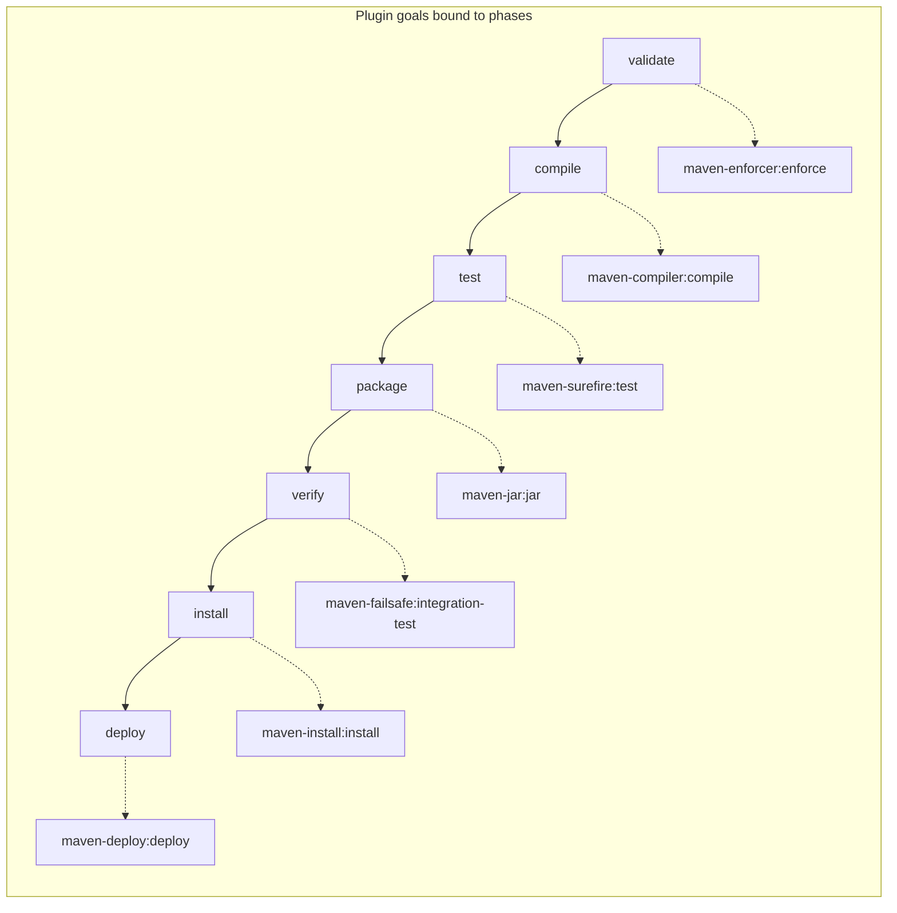
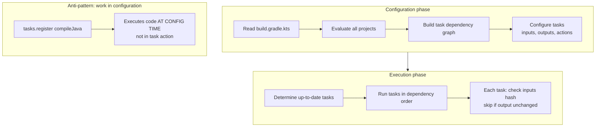
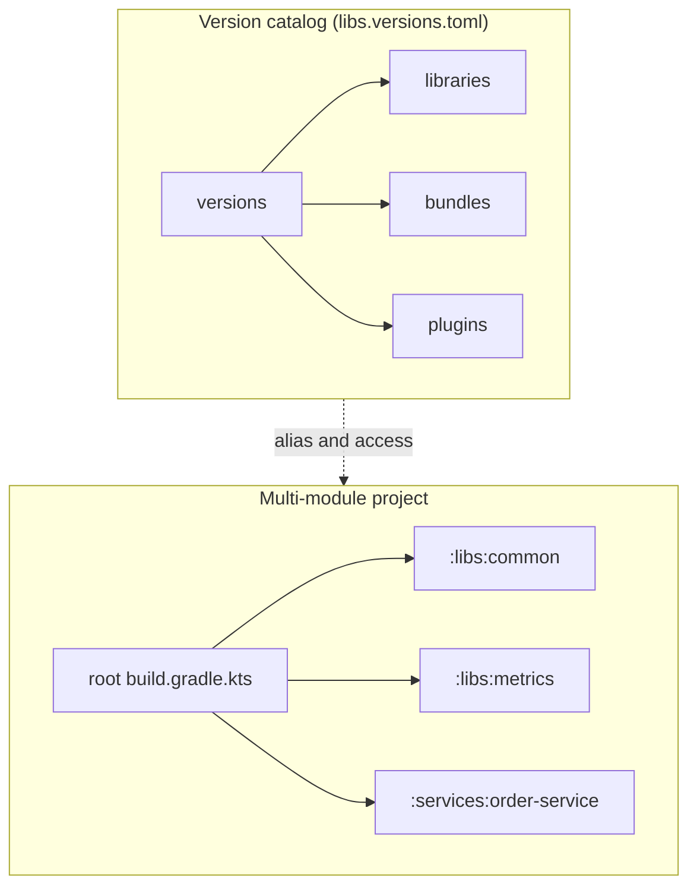
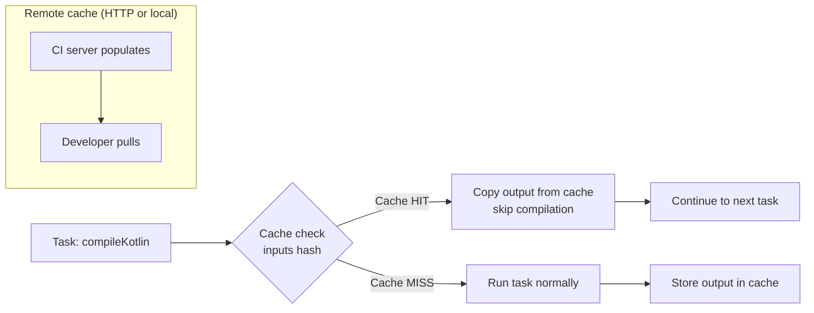
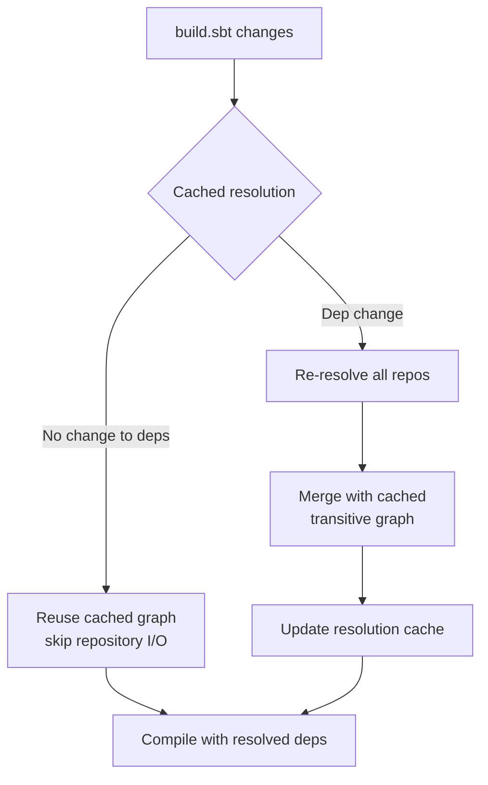
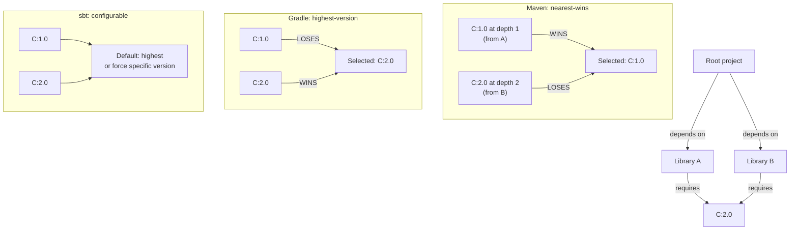
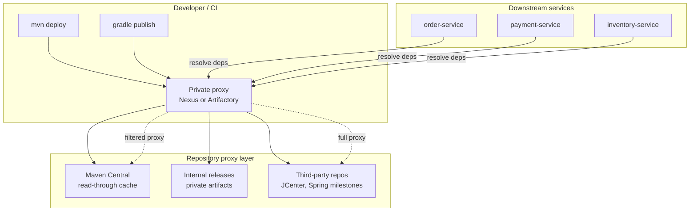
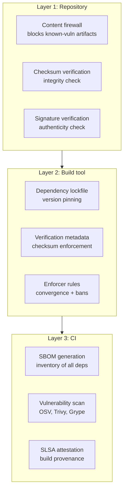

# Chapter 9 — Build Tooling, Dependency Management, and the Module/Artifact Ecosystem

**What this chapter covers.** The JVM ecosystem ships production systems through three dominant build tools — Maven, Gradle, and sbt — each with a distinct model for lifecycle, configuration, and dependency resolution. Beyond the build tool itself, every JVM project operates within a broader artifact ecosystem: Maven Central as the default public repository, private registries like Nexus and Artifactory as enterprise proxies, BOMs and version catalogs as coordination mechanisms, and cryptographic signatures as the trust layer between publish and consumption. Understanding these tools is not optional polish — in a distributed system with hundreds of services, each pulling hundreds of transitive dependencies, build tooling is the first line of defense against dependency confusion, version conflict, reproducibility failure, and supply-chain compromise. A misconfigured POM or Gradle build cache can silently produce different artifacts on different CI agents, and a missing enforcer rule can let a vulnerable transitive dependency slip through to production.

Learning goals — after this chapter you should be able to:

- Describe Maven's lifecycle model (validate → compile → test → package → install → deploy), explain how plugins bind to phases, and reason about the POM inheritance and dependency mediation (nearest-wins).
- Configure Gradle's Kotlin DSL for a multi-module project, distinguish configuration-time from execution-time, leverage the build cache and Configuration Cache, and use version catalogs for centralized dependency declaration.
- Understand sbt's incremental compilation model, its Ivy-based dependency resolution, and how `build.sbt` differs structurally from Maven/Gradle XML or Kotlin DSL.
- Explain transitive dependency resolution across all three tools, including conflict resolution strategies (nearest-wins, highest-version, forced substitution), dependency locking, and verification metadata.
- Configure and operate artifact repositories: Maven Central, Sonatype Nexus, JFrog Artifactory, PGP/GPG signing, and repository content filtering.
- Apply a BOM (Bill of Materials) and a Gradle version catalog to manage coordinated version families across a multi-module build.

> **Prerequisites.** Volume 18, Chapter 2 (class loading and JPMS modules) for module system context; Volume 9, Chapter 9 (application security) for supply-chain threat awareness. Familiarity with JVM compilation, `javac`/`kotlinc`, and basic `jar`/`war` packaging is assumed.

---

## 1. Maven — the lifecycle and the POM

Maven's central abstraction is the **Project Object Model** (POM): an XML document that declares project metadata, dependencies, plugins, and profiles. Every Maven build executes a fixed **lifecycle** — a sequence of named phases — and each phase is bound to one or more **plugin goals** that perform the actual work.

### 1.1 The default lifecycle phases

The `jar` packaging lifecycle (the most common) runs these phases in order:



Running `mvn package` executes `validate → compile → test → package`. Running `mvn install` adds `verify → install`. The lifecycle is deterministic — every phase executes its preceding phases first, and plugins declared in the POM are bound to phases via their `<executions>` or via packaging-default bindings (e.g., `maven-jar:jar` automatically binds to the `package` phase when `<packaging>jar</packaging>`).

### 1.2 POM inheritance and the effective POM

Maven POMs inherit from a parent POM and ultimately from the **Super POM** (`org.apache.maven:maven-model`). The **effective POM** is the fully-resolved result of inheritance, property interpolation, and plugin defaults:

```xml
<!-- Parent POM — manages versions for a platform team's shared libraries -->
<project>
    <modelVersion>4.0.0</modelVersion>
    <groupId>com.example.platform</groupId>
    <artifactId>platform-parent</artifactId>
    <version>3.2.0</version>
    <packaging>pom</packaging>

    <properties>
        <java.version>21</java.version>
        <kotlin.version>2.0.21</kotlin.version>
        <jackson.version>2.17.2</jackson.version>
        <micrometer.version>1.13.4</micrometer.version>
        <junit.version>5.10.3</junit.version>
    </properties>

    <dependencyManagement>
        <dependencies>
            <dependency>
                <groupId>com.fasterxml.jackson.core</groupId>
                <artifactId>jackson-databind</artifactId>
                <version>${jackson.version}</version>
            </dependency>
            <dependency>
                <groupId>io.micrometer</groupId>
                <artifactId>micrometer-core</artifactId>
                <version>${micrometer.version}</version>
            </dependency>
            <dependency>
                <groupId>org.junit.jupiter</groupId>
                <artifactId>junit-jupiter</artifactId>
                <version>${junit.version}</version>
                <scope>test</scope>
            </dependency>
            <!-- BOM import — brings in Spring Boot's curated versions -->
            <dependency>
                <groupId>org.springframework.boot</groupId>
                <artifactId>spring-boot-dependencies</artifactId>
                <version>3.3.4</version>
                <type>pom</type>
                <scope>import</scope>
            </dependency>
        </dependencies>
    </dependencyManagement>

    <build>
        <pluginManagement>
            <plugins>
                <plugin>
                    <groupId>org.apache.maven.plugins</groupId>
                    <artifactId>maven-compiler-plugin</artifactId>
                    <version>3.13.0</version>
                    <configuration>
                        <source>${java.version}</source>
                        <target>${java.version}</target>
                    </configuration>
                </plugin>
                <plugin>
                    <groupId>org.jetbrains.kotlin</groupId>
                    <artifactId>kotlin-maven-plugin</artifactId>
                    <version>${kotlin.version}</version>
                </plugin>
            </plugins>
        </pluginManagement>
    </build>
</project>
```

A child module inherits this parent and only declares what's specific to itself:

```xml
<!-- Child module — order-service -->
<project>
    <modelVersion>4.0.0</modelVersion>
    <parent>
        <groupId>com.example.platform</groupId>
        <artifactId>platform-parent</artifactId>
        <version>3.2.0</version>
    </parent>

    <artifactId>order-service</artifactId>
    <packaging>jar</packaging>

    <dependencies>
        <!-- Version inherited from parent dependencyManagement -->
        <dependency>
            <groupId>com.fasterxml.jackson.core</groupId>
            <artifactId>jackson-databind</artifactId>
        </dependency>
        <dependency>
            <groupId>org.junit.jupiter</groupId>
            <artifactId>junit-jupiter</artifactId>
            <scope>test</scope>
        </dependency>
    </dependencies>
</project>
```

The effective POM for `order-service` now includes all plugin configurations, properties, and managed versions from the parent — you can inspect it with `mvn help:effective-pom`.

### 1.3 Transitive dependency resolution and nearest-wins

When your project depends on `A`, and `A` depends on `B:1.0`, Maven resolves `B` transitively. But if `A` depends on `B:1.0` and `C` depends on `B:2.0`, Maven must choose. The algorithm:

1. Build the full dependency graph (all transitive paths).
2. For each conflicting artifact (`groupId:artifactId`), select the version with the **shortest path** from the root project (nearest-wins).
3. If two versions have equal depth, Maven picks the one declared **first** in the POM (first-declaration-wins).

This is deterministic but not always correct. A library at depth 2 might require `B:2.0` for correctness, but Maven picks `B:1.0` because it sits at depth 1 from the root. The maven-enforcer-plugin catches these:

```xml
<plugin>
    <groupId>org.apache.maven.plugins</groupId>
    <artifactId>maven-enforcer-plugin</artifactId>
    <version>3.5.0</version>
    <executions>
        <execution>
            <id>enforce-banned-deps</id>
            <goals><goal>enforce</goal></goals>
            <configuration>
                <rules>
                    <bannedDependencies>
                        <excludes>
                            <!-- Ban known-vulnerable transitive versions -->
                            <exclude>org.apache.logging.log4j:log4j-core:[,2.17.1)</exclude>
                            <exclude>com.google.guava:guava:*:*:compile</exclude>
                        </excludes>
                    </bannedDependencies>
                    <dependencyConvergence>
                        <!-- Fail if versions don't converge -->
                    </dependencyConvergence>
                </rules>
            </configuration>
        </execution>
    </executions>
</plugin>
```

The `dependencyConvergence` rule fails the build if any transitive dependency has version conflicts — surfacing the "nearest-wins" ambiguity before it reaches production. In a distributed system with dozens of microservices, each pulling its own transitive tree, uncontrolled version divergence is a deployment-time time bomb: a library that works locally with `B:1.0` may fail in a different service that resolved `B:2.0`.

### 1.4 Maven profiles and the reactor build

Maven **profiles** let you activate different configuration for different environments. Profiles can be activated by command-line flag, JDK version, OS, or property:

```xml
<profiles>
    <profile>
        <id>staging</id>
        <properties>
            <env.url>https://staging.example.com</env.url>
        </properties>
        <build>
            <plugins>
                <plugin>
                    <groupId>org.springframework.boot</groupId>
                    <artifactId>spring-boot-maven-plugin</artifactId>
                    <configuration>
                        <jvmArguments>-Dspring.profiles.active=staging</jvmArguments>
                    </configuration>
                </plugin>
            </plugins>
        </build>
    </profile>
    <profile>
        <id>production</id>
        <activation>
            <property><name>env.CI</name><value>true</value></property>
        </activation>
        <!-- Additional hardening: signing, verification -->
    </profile>
</profiles>
```

Activate with `mvn package -Pstaging` or `-P!staging` to deactivate. Profiles are a common source of build non-determinism: if a profile is activated by a local property (e.g., JDK version), the same `pom.xml` produces different effective POMs on different machines. Prefer activation by explicit flags or CI environment variables over implicit conditions.

The **Maven reactor** is how multi-module projects are built. When you run `mvn package` from the root of a multi-module project, Maven determines the correct build order by analyzing inter-module dependencies and builds them sequentially (or in parallel with `-T 1C` for one thread per CPU core). The reactor ensures that if module B depends on module A, A is built first. If you run `mvn package -pl order-service -am`, Maven builds only `order-service` and all modules it depends on (`-am` = also-make), skipping unrelated modules — a critical optimization for monorepos with dozens of modules. The `-pl` flag (project list) combined with `-am` (also-make) and `-amd` (also-make-dependent) gives you fine-grained control over what gets built, which is essential when your monorepo contains 50+ modules but a change touches only two.

---

## 2. Gradle — Kotlin DSL, configuration cache, and version catalogs

Gradle replaces Maven's XML and fixed lifecycle with a **directed acyclic graph** (DAG) of **tasks**. Configuration is done in Groovy or Kotlin DSL (`build.gradle.kts`), and the build is expressed as a program — not a declarative tree. The critical distinction for senior engineers: Gradle separates **configuration time** (evaluating `build.gradle.kts`) from **execution time** (running task actions).

### 2.1 Configuration vs execution



The Configuration Cache — enabled via `org.gradle.configuration-cache=true` — serializes the result of the configuration phase to disk. On subsequent builds, Gradle skips configuration entirely if `build.gradle.kts` files haven't changed, jumping straight to execution. This is why you should never do I/O (network calls, file reads, shell commands) during configuration — it breaks the cache and makes builds non-reproducible.

### 2.2 A multi-module Kotlin DSL build

```kotlin
// settings.gradle.kts
rootProject.name = "platform"

include("libs:common", "libs:metrics", "services:order-service")

// Version catalog — centralized, type-safe dependency declarations
dependencyResolutionManagement {
    versionCatalogs {
        create("libs") {
            from(files("gradle/libs.versions.toml"))
        }
    }
}
```

```toml
# gradle/libs.versions.toml
[versions]
kotlin = "2.0.21"
jackson = "2.17.2"
micrometer = "1.13.4"
junit = "5.10.3"
spring-boot = "3.3.4"

[libraries]
jackson-databind = { module = "com.fasterxml.jackson.core:jackson-databind", version.ref = "jackson" }
jackson-kotlin = { module = "com.fasterxml.jackson.module:jackson-module-kotlin", version.ref = "jackson" }
micrometer-core = { module = "io.micrometer:micrometer-core", version.ref = "micrometer" }
junit-jupiter = { module = "org.junit.jupiter:junit-jupiter", version.ref = "junit" }
spring-boot-starter = { module = "org.springframework.boot:spring-boot-starter", version.ref = "spring-boot" }

[bundles]
monitoring = ["micrometer-core"]
jackson-all = ["jackson-databind", "jackson-kotlin"]

[plugins]
spring-boot = { id = "org.springframework.boot", version.ref = "spring-boot" }
kotlin-jvm = { id = "org.jetbrains.kotlin.jvm", version.ref = "kotlin" }
```

The version catalog replaces scattered `ext {}` blocks and hardcoded version strings. Every module in the build references the same catalog:

```kotlin
// build.gradle.kts for services/order-service
plugins {
    alias(libs.plugins.kotlin.jvm) apply true
    alias(libs.plugins.spring.boot) apply true
}

dependencies {
    implementation(project(":libs:common"))
    implementation(project(":libs:metrics"))

    // Type-safe catalog access — IDE completion, compile-time checking
    implementation(libs.bundles.jackson.all)
    implementation(libs.bundles.monitoring)

    testImplementation(libs.junit.jupiter)
}
```



The catalog is the single source of truth. Upgrading Jackson from 2.17.2 to 2.18.0 is a one-line change in `libs.versions.toml`, and every module picks it up. This eliminates the "grep for version strings across 40 `build.gradle` files" maintenance burden that plagues large JVM monorepos.

### 2.3 Build cache and remote caching

Gradle's build cache stores task outputs keyed by task inputs (source files, configuration, tool versions). On a cache hit, Gradle skips the task entirely:



Configure the build cache in `gradle.properties`:

```properties
# gradle.properties
org.gradle.caching=true
org.gradle.parallel=true
org.gradle.configuration-cache=true

# Remote cache (e.g., Gradle Enterprise, Develocity, or self-hosted)
# systemProp.gradle.cache.url=https://cache.example.com/
```

For a monorepo with 50 modules, remote caching can reduce CI build times from 45 minutes to under 10 by sharing compiled outputs across branches and developers. The cache is content-addressed: identical inputs always produce identical outputs. If your builds are not reproducible (e.g., they read timestamps or environment variables during configuration), the cache becomes unreliable — hence the Configuration Cache.

### 2.4 Convention plugins and buildSrc

As a Gradle multi-module build grows, `build.gradle.kts` files accumulate duplicated configuration (compiler flags, test framework setup, publishing defaults). Gradle's solution is **convention plugins** — shared build logic in `buildSrc/` or included builds:

```kotlin
// buildSrc/src/main/kotlin/quality-conventions.gradle.kts
// This is a precompiled script plugin — applies to any project that uses it

plugins {
    checkstyle
    jacoco
}

checkstyle {
    toolVersion = "10.18.2"
    configFile = rootProject.file("config/checkstyle/checkstyle.xml")
}

tasks.withType<Test> {
    useJUnitPlatform()
    reports {
        junitXml.required.set(true)
        html.required.set(true)
    }
}

jacoco {
    toolVersion = "0.8.12"
}

tasks.named<JacocoReport>("jacocoTestReport") {
    dependsOn(tasks.withType<Test>())
    reports {
        xml.required.set(true)  // for CI coverage gates
        html.required.set(true)
    }
}
```

Consuming projects apply the convention with a single line:

```kotlin
// services/order-service/build.gradle.kts
plugins {
    id("quality-conventions")  // from buildSrc — no version needed
    alias(libs.plugins.kotlin.jvm)
}
```

The convention plugin encapsulates a reusable build policy. When the platform team wants to add a new static analysis tool or change the test framework, they update one file in `buildSrc/` and every module picks it up on next build. This is Gradle's answer to Maven's parent POM plugin management — but expressed as Kotlin code rather than XML inheritance, which makes it easier to test and reason about.

### 2.5 Composite builds — forking and substitution

Composite builds let you include other Gradle builds and substitute their published dependencies with local sources:

```kotlin
// settings.gradle.kts of a service that needs to patch a library
includeBuild("../jackson-kotlin-patch") {
    dependencySubstitution {
        substitute(module("com.fasterxml.jackson.module:jackson-module-kotlin"))
            .using(project(":"))
    }
}
```

When you run `./gradlew build` in the service, Gradle resolves `jackson-module-kotlin` from the patched local build instead of Maven Central. This is invaluable for:
- Testing a library patch before it's published
- Coordinating changes across a library and its consumers
- Splitting a monorepo without losing atomic change capability

---

## 3. sbt — incremental compilation and Ivy resolution

sbt is the default build tool for Scala, but it is also used for Kotlin/JVM projects in ecosystems that interact heavily with Scala libraries. Its model differs fundamentally from Maven and Gradle.

### 3.1 The build.sbt model

A `build.sbt` file is not declarative XML or a DSL wrapping a DAG — it is a **Scala program** that produces a build definition. Each top-level statement is a setting or task definition:

```scala
// build.sbt
ThisBuild / organization := "com.example"
ThisBuild / version      := "1.0.0"
ThisBuild / scalaVersion := "3.5.0"

lazy val common = (project in file("libs/common"))
  .settings(
    libraryDependencies ++= Seq(
      "com.fasterxml.jackson.core" % "jackson-databind" % "2.17.2",
      "org.typelevel"              %% "cats-core"        % "2.12.0"
    )
  )

lazy val orderService = (project in file("services/order-service"))
  .dependsOn(common)
  .settings(
    libraryDependencies ++= Seq(
      "io.micrometer" % "micrometer-core" % "1.13.4",
      "org.scalatest" %% "scalatest"      % "3.2.18" % Test
    ),
    // sbt's incremental compilation — only recompiles changed sources
    incOptions := incOptions.value.withRecompileAllFraction(0.5)
  )
```

### 3.2 Ivy-based resolution

Unlike Maven and Gradle (which use Maven-style repository layout by default), sbt uses **Ivy** for dependency resolution. The key difference: Ivy supports **branch and revision selectors**, not just fixed versions:

```scala
libraryDependencies ++= Seq(
  // Fixed version
  "org.typelevel" %% "cats-core" % "2.12.0",
  // Version range — "any 2.x"
  "org.typelevel" %% "cats-core" % "[2.0.0,3.0.0)",
  // Latest release — uses Ivy's dynamic version resolution
  "org.typelevel" %% "cats-core" % "latest.release"
)
```

sbt caches resolution results in `~/.sbt/1.0/resolution-cache/` and in `project/target/`. The **cached resolution** feature (enabled by default in sbt 1.3+) stores the resolved dependency graph and only re-resolves when `build.sbt` or `*.sbt` files change. This avoids the overhead of hitting repositories on every compile.



sbt's incremental compiler (the Zinc compiler) tracks source-level dependencies at the individual definition level. If you change one function in one file, only the files that depend on that definition are recompiles. Zinc builds a dependency graph of Scala/Java source files and their API surfaces — a change to a `val` declaration recompiles everything that references it; a change to a local `private def` recompiles only the enclosing class.

### 3.4 sbt in practice — commands, scopes, and settings

sbt's interactive shell is its killer feature. Unlike Maven and Gradle (which require a separate command for every invocation), sbt provides a REPL where you can run tasks, inspect settings, and hot-reload changes:

```bash
$ sbt
sbt> compile              # compile all sources
sbt> test                 # run all tests
sbt> orderService/test    # test a specific subproject
sbt> show dependencyClasspath  # inspect resolved classpath
sbt> reload               # re-read build.sbt after changes
```

sbt uses **scopes** to allow settings to vary by context. A setting can differ across subprojects, configurations (Compile vs Test), and tasks:

```scala
// Setting for Compile scope only
Compile / scalacOptions += "-Wunused:imports"

// Setting for Test scope only
Test / fork := true    // run tests in a forked JVM

// Setting per-task
Test / javaOptions ++= Seq("-Xmx512m")
```

The **commands** vs **tasks** distinction is fundamental: a **task** is a function that computes a value (may be cached, may be skipped if inputs haven't changed). A **command** is an imperative action that modifies the build state (e.g., `reload`, `clean`, `set`). This separation enables sbt's incremental compilation — tasks like `compile` track their inputs and outputs, so a recompile only happens when sources actually change.

### 3.5 Comparing the three tools

| Aspect | Maven | Gradle | sbt |
|---|---|---|---|
| **Config format** | XML (pom.xml) | Kotlin/Groovy DSL | Scala (build.sbt) |
| **Lifecycle** | Fixed phases | Task DAG | Task DAG (commands are orthogonal) |
| **Dependency resolution** | Maven resolver (nearest-wins) | Gradle resolver (highest version) | Ivy resolver (configurable strategy) |
| **Compilation** | javac/kotlinc (batch) | javac/kotlinc (batch or daemon) | Zinc incremental compiler |
| **Multi-project** | Modules via parent POM | Composite builds / subprojects | Project definitions with `.dependsOn` |
| **Caching** | None built-in (use Maven Wrapper + CI) | Build cache + Configuration Cache | Cached resolution + Zinc incremental |
| **Convention sharing** | Parent POM inheritance | Convention plugins (buildSrc) | Auto-plugins (`.sbt` in `project/`) |
| **Ecosystem** | Java-dominant | JVM-wide (Java, Kotlin, Android, Scala, Groovy) | Scala-dominant, JVM |
| **Learning curve** | Low (XML is explicit) | Medium (DSL + task model) | High (Scala in build + scopes) |

Each tool has earned its niche. Maven dominates Java enterprise precisely because its rigidity is a feature — when every project follows the same lifecycle, new developers can navigate any Maven project without learning a custom build DSL. Gradle dominates Android and Kotlin precisely because its flexibility handles the complexity of variant builds, multi-target compilation, and rapid iteration cycles. sbt dominates Scala because Zinc's incremental compilation is essential for the language's compilation speed, and the Scala-in-build-file approach lets you express complex build logic without a separate DSL.

---

## 4. Dependency resolution — conflict resolution, substitution, locking

Across all three tools, the dependency resolver must handle three problems: **transitive resolution** (pulling in indirect dependencies), **conflict resolution** (choosing one version when multiple are requested), and **reproducibility** (ensuring the same build produces the same artifact tomorrow).

### 4.1 Conflict resolution strategies



The difference matters in production. Maven's nearest-wins can silently select an older, vulnerable version if it happens to be closer in the dependency tree. Gradle's highest-version strategy avoids this but can break binary compatibility when a library expects a specific API that a newer version removed. sbt allows explicit control:

```scala
// Force a specific version — overrides all resolution strategies
dependencyOverrides += "org.apache.logging.log4j" % "log4j-core" % "2.17.2"

// Disable eviction logging for noisy transitive updates
update / evictionWarningOptions := EvictionWarningOptions.empty
```

Gradle provides similar control:

```kotlin
configurations.all {
    resolutionStrategy {
        // Force specific versions across all configurations
        force("org.apache.logging.log4j:log4j-core:2.17.2")

        // Fail on version conflicts instead of resolving automatically
        failOnVersionConflict()

        // Prefer specific module versions
        preferProjectModules()
    }
}
```

### 4.2 Dependency substitution and replace

Gradle allows **dependency substitution** — replacing one module with another at resolution time:

```kotlin
configurations.all {
    resolutionStrategy {
        dependencySubstitution {
            // Replace the Apache HttpClient with a fork
            substitute(module("org.apache.httpcomponents:httpclient"))
                .using(module("com.example:httpclient-fork:4.5.14-patch"))
        }
    }
}
```

This is useful when:
- You maintain a patched fork of a library and want to deploy it as a drop-in replacement
- You're migrating from one groupId to another (e.g., a library moved under a new organization)
- You need to apply a CVE fix before the upstream library publishes a release

### 4.3 Dependency locking

Locking freezes the resolved dependency graph to a file that is checked into source control. Every subsequent build uses the locked versions, regardless of what's available in repositories:

```kotlin
// build.gradle.kts
dependencyLocking {
    lockAllConfigurations()
}
```

After resolving, run `./gradlew dependencies --write-locks` to generate `gradle/dependency-locks/*.lockfile`. These lockfiles capture exact versions (including transitive) and checksums. On CI, run `./gradlew build --locked` to enforce that the lockfile matches the resolved graph — if a dependency drifts, the build fails.

Maven achieves a similar result with the `maven-dependency-plugin:tree` output pinned in CI, but it lacks Gradle's native lockfile format. sbt has no built-in lockfile mechanism, though the `sbt-dependency-lock` plugin provides similar functionality.

### 4.4 Verification metadata

Gradle 6.2+ introduced **dependency verification metadata** (`gradle/verification-metadata.xml`). This file contains checksums (SHA-256 by default) for every resolved artifact and POM. If an artifact's checksum doesn't match, the build fails — catching compromised or tampered dependencies:

```bash
# Generate initial verification metadata
./gradlew --write-verification-metadata sha256 help

# On CI — verify all dependencies match recorded checksums
./gradlew build
# If a dependency was tampered with, Gradle fails with:
# "Dependency verification failed for project ':services:order-service'"
```

This is a hardening measure against supply-chain attacks (see Vol 9, Chapter 11 for threat modeling). When a dependency's POM or JAR is modified in Maven Central — whether through a compromised maintainer account or a repository mirroring attack — verification metadata catches the mismatch before it reaches production.

---

## 5. BOMs, platform constraints, and the Maven enforcer

### 5.1 Bills of Materials (BOMs)

A BOM is a POM with `<packaging>pom</packaging>` that declares `<dependencyManagement>` entries for a coherent set of libraries. Consumers import the BOM with `<scope>import</scope>` to inherit all managed versions without pulling any actual dependencies:

```xml
<!-- Spring Boot BOM — imports hundreds of curated versions -->
<dependencyManagement>
    <dependencies>
        <dependency>
            <groupId>org.springframework.boot</groupId>
            <artifactId>spring-boot-dependencies</artifactId>
            <version>3.3.4</version>
            <type>pom</type>
            <scope>import</scope>
        </dependency>
    </dependencies>
</dependencyManagement>

<!-- Now these resolve without explicit versions -->
<dependencies>
    <dependency>
        <groupId>org.springframework.boot</groupId>
        <artifactId>spring-boot-starter-web</artifactId>
        <!-- Version from Spring Boot BOM -->
    </dependency>
    <dependency>
        <groupId>com.fasterxml.jackson.core</groupId>
        <artifactId>jackson-databind</artifactId>
        <!-- Jackson version from Spring Boot BOM -->
    </dependency>
</dependencies>
```

In Gradle, the equivalent is the `platform()` function:

```kotlin
dependencies {
    implementation(platform("org.springframework.boot:spring-boot-dependencies:3.3.4"))
    implementation("org.springframework.boot:spring-boot-starter-web")
    implementation("com.fasterxml.jackson.core:jackson-databind")
}
```

BOMs are a coordination mechanism for large organizations. The platform team publishes a BOM that pins compatible versions of all shared libraries (Jackson, Netty, Micrometer, SLF4J, etc.), and service teams import it. When a vulnerability is found in Netty 4.1.100, the platform team updates the BOM, and all services pick up the fix on their next rebuild — no service team needs to change their own build file.

### 5.2 BOM ordering and override semantics

Multiple BOMs can conflict. The resolution:

- **Maven**: BOMs are imported in declaration order. The first BOM to declare a managed version wins. A later BOM can override an earlier one only if it appears later in the same `<dependencyManagement>` section.
- **Gradle**: Later `platform()` declarations override earlier ones. You can also use `enforcedPlatform()` which forces versions even against explicit version declarations in individual dependencies.
- **sbt**: No native BOM concept. You emulate it with `dependencyOverrides` or by importing a library that transitively brings version management.

### 5.3 The Maven enforcer in practice

The enforcer plugin is Maven's policy engine for build governance:

```xml
<plugin>
    <groupId>org.apache.maven.plugins</groupId>
    <artifactId>maven-enforcer-plugin</artifactId>
    <version>3.5.0</version>
    <executions>
        <execution>
            <id>enforce</id>
            <goals><goal>enforce</goal></goals>
            <configuration>
                <rules>
                    <!-- Require minimum Maven version -->
                    <requireMavenVersion>
                        <version>3.9.6</version>
                    </requireMavenVersion>
                    <!-- Require minimum JDK version -->
                    <requireJavaVersion>
                        <version>21</version>
                    </requireJavaVersion>
                    <!-- Fail on any dependency convergence issues -->
                    <dependencyConvergence />
                    <!-- Ban transitive dependencies with known vulnerabilities -->
                    <bannedDependencies>
                        <excludes>
                            <exclude>commons-collections:commons-collections</exclude>
                            <exclude>log4j:log4j</exclude>
                        </excludes>
                        <message>Banned due to known CVEs</message>
                    </bannedDependencies>
                    <!-- Require all dependencies come from approved repositories -->
                    <requireReleaseDeps>
                        <onlyWhenRelease>true</onlyWhenRelease>
                        <message>No Snapshots allowed in release builds</message>
                    </requireReleaseDeps>
                </rules>
            </configuration>
        </execution>
    </executions>
</plugin>
```

In a distributed system context, the enforcer is your CI gate. Every merge request should pass `mvn verify` with enforcer rules active. The `dependencyConvergence` rule prevents the slow drift where two services end up with different versions of the same library — a common source of `NoSuchMethodError` in production when a shared library evolves.

---

## 6. Artifact repositories — Maven Central, Nexus, Artifactory, and signatures

### 6.1 The repository topology



### 6.2 Why a private proxy matters

Directly resolving from Maven Central in production CI/CD has several problems:

1. **Availability**: Maven Central is a CDN-backed service, but outages happen (the October 2019 outage lasted hours). A local proxy with cached artifacts keeps builds running.
2. **Security**: You cannot control what's published to Maven Central. A proxy lets you apply content filtering — block known-vulnerable artifacts, enforce signature verification, and audit what's being pulled.
3. **Speed**: A Nexus proxy on the same network as your CI cluster resolves artifacts in milliseconds instead of seconds.
4. **Auditability**: Every artifact resolved through the proxy is logged, giving you a complete dependency bill of materials for every build.

### 6.3 Nexus and Artifactory configuration

Sonatype Nexus Repository and JFrog Artifactory are the two dominant private repository managers. Both support:

- **Proxy repositories**: Cache artifacts from remote repositories (Maven Central, Spring milestones, etc.)
- **Hosted repositories**: Store your internal artifacts (libraries, BOMs, plugins)
- **Virtual repositories**: A single endpoint that aggregates proxy + hosted repositories

A typical Nexus configuration for a JVM platform team:

```yaml
# Nexus repository configuration (simplified REST API)
repositories:
  # Proxy for Maven Central
  - name: maven-central-proxy
    format: maven2
    type: hosted
    online: true
    storage:
      writePolicy: ALLOW  # proxy writes cache
    proxy:
      remoteUrl: https://repo1.maven.org/maven2/
      contentMaxAge: 1440   # 24 hours cache

  # Hosted repo for internal libraries
  - name: internal-releases
    format: maven2
    type: hosted
    online: true
    storage:
      writePolicy: ALLOW_ONCE  # immutable releases

  # Virtual repo aggregating both
  - name: all-repositories
    format: maven2
    type: virtual
    members:
      - maven-central-proxy
      - internal-releases
```

### 6.4 GPG/PGP signing

Maven Central **requires** that all published artifacts are signed with GPG. The `maven-gpg-plugin` signs the JAR, POM, and checksums:

```xml
<plugin>
    <groupId>org.apache.maven.plugins</groupId>
    <artifactId>maven-gpg-plugin</artifactId>
    <version>3.2.7</version>
    <executions>
        <execution>
            <id>sign-artifacts</id>
            <phase>verify</phase>
            <goals><goal>sign</goal></goals>
            <configuration>
                <gpgArguments>
                    <arg>--pinentry-mode</arg>
                    <arg>loopback</arg>
                </gpgArguments>
            </configuration>
        </execution>
    </executions>
</plugin>
```

In Gradle, signing is configured via the `signing` plugin:

```kotlin
plugins {
    `maven-publish`
    signing
}

publishing {
    publications {
        create<MavenPublication>("maven") {
            from(components["java"])
            pom {
                url.set("https://github.com/example/order-service")
                licenses {
                    license {
                        name.set("Apache License, Version 2.0")
                        url.set("https://www.apache.org/licenses/LICENSE-2.0")
                    }
                }
            }
        }
    }
}

signing {
    // Uses GPG key from ~/.gnupg/ or GRADLE_GPG_KEY properties
    sign(publishing.publications["maven"])
}
```

When a consumer resolves a signed artifact, Maven/Gradle verifies the PGP signature against the public key published to a key server (keys.openpgp.org). This prevents an attacker from substituting a malicious JAR in a repository — even if they compromise the storage layer, they cannot forge the signature without the private key.

### 6.5 Repository content filtering and firewalls

Nexus and Artifactory support **content selectors** and **firewall** policies that block resolution of known-vulnerable components:

- **Nexus Repository Firewall** (formerly Sonatype IQ): Scans every component entering your repository against the Sonatype vulnerability database. Components with critical CVEs are quarantined before they reach your builds.
- **Artifactory Xray**: Similar capability with JFrog's vulnerability database integration, plus license compliance scanning.

These are the operational counterparts to the Maven enforcer and Gradle verification metadata — the enforcer runs at build time in your project; the firewall runs at the repository level for all projects.

### 6.6 Maven Central publishing requirements

Publishing to Maven Central (via the Central Publishing Portal, formerly OSSRH) requires:

1. **Group ID ownership**: Verified via DNS TXT record or GitHub repository ownership.
2. **GPG signatures**: Every artifact (JAR, POM, sources JAR, javadoc JAR) must be signed. The `.asc` files are published alongside the artifacts.
3. **Sources and javadoc JARs**: Maven Central requires `-sources.jar` and `-javadoc.jar` for every release artifact.
4. **POM metadata**: `<name>`, `<description>`, `<url>`, `<licenses>`, `<developers>`, and `<scm>` must be present and non-empty.

```xml
<!-- Required POM metadata for Maven Central -->
<name>Order Service</name>
<description>Handles order lifecycle management for the e-commerce platform</description>
<url>https://github.com/example/order-service</url>
<licenses>
    <license>
        <name>Apache License, Version 2.0</name>
        <url>https://www.apache.org/licenses/LICENSE-2.0</url>
    </license>
</licenses>
<developers>
    <developer>
        <id>platform-team</id>
        <name>Platform Engineering</name>
        <email>platform@example.com</email>
    </developer>
</developers>
<scm>
    <connection>scm:git:https://github.com/example/order-service.git</connection>
    <developerConnection>scm:git:ssh://github.com/example/order-service.git</developerConnection>
    <url>https://github.com/example/order-service</url>
</scm>
```

In practice, most teams publish to a private Nexus/Artifactory first and promote to Maven Central only for open-source libraries. The private proxy handles the internal audience; Maven Central handles the external one. The signing key should live in a CI secret (GitHub Actions secrets, Vault, or a hardware token) — never on a developer's laptop where it can be exfiltrated.

---

## 7. The distributed-systems lens — build tooling at fleet scale

In a distributed system with hundreds of services, build tooling is infrastructure. The consequences of a bad build configuration propagate across the entire fleet:

### 7.1 Version convergence across services

When Team A's `order-service` resolves `netty-common:4.1.100.Final` and Team B's `payment-service` resolves `netty-common:4.1.108.Final`, you have two services with different Netty versions in production. If both services communicate via Netty-based gRPC, and Netty 4.1.108 introduces a wire-protocol change, the services are now incompatible — but only under specific message patterns that existing integration tests don't cover.

The solution is a **platform BOM** (discussed in §5.1) enforced at the organization level. The platform team maintains a BOM, publishes it to the internal Nexus, and every service imports it. CI enforces convergence through the Maven enforcer or Gradle lockfiles.

Consider a real scenario: a payment processor's fleet of 200 Java microservices all depend on a shared `common-lib`. When `common-lib` 2.5.0 is released with a new serialization format, half the fleet upgrades immediately (they use SNAPSHOT versions in development) while the other half pins to 2.4.x. The result: `order-service` (on 2.5.0) sends events in the new format, but `fraud-detection` (on 2.4.x) cannot deserialize them. The production incident takes 4 hours to diagnose because the serialization format is not versioned — both versions claim the same content type. The fix: a platform BOM that pins `common-lib` to exactly one version across all services, with a CI gate that fails the build if the resolved version doesn't match the BOM.

### 7.2 Build reproducibility and CI determinism

A build that works on a developer's machine but fails in CI — or passes CI but produces a different artifact — is a reliability hazard. Sources of non-determinism:

| Source | Maven | Gradle | sbt |
|---|---|---|---|
| **Timestamp in JAR manifest** | `project.build.outputTimestamp` (reproducible builds) | Not embedded by default | Not embedded by default |
| **Dependency resolution order** | Deterministic (POM order) | Deterministic (sorted by strategy) | Deterministic (Ivy cache) |
| **Transitive version drift** | Without enforcer: possible | Without lockfile: possible | Without pinning: possible |
| **Plugin version drift** | Without `maven-wrapper.properties`: possible | Without wrapper/lock: possible | Without `project/build.properties`: possible |

Enable Maven reproducible builds:

```xml
<properties>
    <!-- Set to the release timestamp — strips timestamps from JARs -->
    <project.build.outputTimestamp>2024-08-21T00:00:00Z</project.build.outputTimestamp>
</properties>
```

In Gradle, verify reproducibility:

```bash
# Check that all tasks produce reproducible output
./gradlew build
./gradlew clean build
# Compare the two outputs — they should be byte-identical
```

### 7.3 Gradle Build Scan for diagnosis

When a build is slow or fails mysteriously, the Gradle Build Scan (via Develocity, formerly Gradle Enterprise) is the diagnostic tool:

```bash
# Run a build with a scan
./gradlew build --scan

# Example output URL:
# https://scans.gradle.com/s/abc123xyz
```

The scan provides:
- **Task execution timeline**: Which tasks ran, how long each took, which were cached.
- **Configuration cache effectiveness**: How many projects were cached vs reconfigured.
- **Dependency resolution graph**: The full resolved dependency tree with conflict resolution decisions.
- **Build cache hit/miss ratio**: Which tasks hit the remote cache and which missed.
- **Problem detection**: Identified deprecations, configuration cache misses, and performance bottlenecks.

For a CI pipeline that runs 50+ Gradle builds per day across branches, build scans are the primary tool for detecting configuration cache regressions, identifying slow tasks for optimization, and debugging dependency resolution failures. When a developer reports "the build takes 20 minutes on my machine but 5 minutes on CI," a build scan reveals whether the bottleneck is dependency resolution (slow on the developer's machine due to no local cache), compilation (lacking parallelism), or test execution (not forked or poorly partitioned).

Maven's diagnostic equivalent is the `-X` (debug) flag: `mvn package -X` prints the full reactor build order, every plugin goal execution, and the resolved dependency tree with conflict resolution decisions. For dependency-specific debugging, `mvn dependency:tree -DoutputType=dot` generates a Graphviz-compatible dependency graph that can be visualized to understand why a particular version was selected.

### 7.4 Supply-chain hardening through build tooling

Build tooling is the last line of defense before an artifact reaches production. The layered defense:



No single layer is sufficient. Maven Central had typosquatting attacks in 2020 and 2021 where packages named `com.google.mavem` (note the typo) exfiltrated credentials. The repository firewall catches known-malicious packages; the build tool catches checksum mismatches and version drift; the CI pipeline generates SBOMs for audit and scans for newly-disclosed CVEs.

For JVM projects specifically, the attack surface includes not just direct dependencies but also Maven plugins (which execute arbitrary code during the build), annotation processors (which run during compilation), and test dependencies (which execute in CI with elevated permissions). A compromised `maven-compiler-plugin` could inject bytecode during compilation, bypassing all source-level security measures. The defense: pin plugin versions in `<pluginManagement>`, use Gradle's plugin verification (`gradle/verification-metadata.xml`), and run builds in isolated containers with no network access except to approved repositories.

---

## 8. Key takeaways

- **Maven's lifecycle is deterministic and plugin-driven.** The fixed phase sequence (validate → compile → test → package → install → deploy) makes builds predictable. The POM inheritance model works for large organizations via parent POMs and BOMs, but nearest-wins dependency mediation can silently select wrong versions — enforce convergence with maven-enforcer-plugin.
- **Gradle separates configuration from execution.** The Configuration Cache eliminates configuration overhead by serializing the result. The build cache eliminates redundant task execution. Version catalogs provide type-safe, centralized dependency management. Composite builds enable cross-project development without publishing.
- **sbt's Ivy-based resolution and Zinc incremental compiler** offer unique advantages for Scala-heavy JVM projects. Cached resolution avoids repository I/O, and Zinc's definition-level granularity minimizes recompilation.
- **Version locking is non-negotiable in production.** Gradle lockfiles (`--write-locks` / `--locked`), Maven's `flatten-maven-plugin` with locked dependency trees, or sbt's `sbt-dependency-lock` — whichever tool you use, lock your dependency graph and verify it on CI.
- **Verification metadata catches tampering.** Gradle's `verification-metadata.xml` (SHA-256 checksums for every artifact) and GPG signatures provide defense-in-depth against supply-chain compromise.
- **Private proxies (Nexus/Artifactory) are not optional.** They provide caching, content filtering, audit logging, and a single resolution endpoint. For a fleet of hundreds of services, a proxy is the difference between "Maven Central is down, CI is blocked" and "builds continue unaffected."
- **The platform BOM is the coordination mechanism.** One team maintains the BOM; all teams import it. When a CVE drops, one BOM update propagates to every service on next rebuild.
- **Build scans are the diagnostic tool.** `gradle build --scan` and `mvn validate -X` are your first moves when a build is slow, non-deterministic, or fails in CI but works locally. For dependency-specific debugging, `mvn dependency:tree` and `./gradlew dependencies` show the full resolved graph with conflict resolution annotations.

---

## Further reading

- **Maven POM Reference**: https://maven.apache.org/guides/mini/guide-configuring-pom.html
- **Maven Enforcer Plugin**: https://maven.apache.org/enforcer/enforcer-rules/index.html
- **Gradle Kotlin DSL**: https://docs.gradle.org/current/userguide/kotlin_dsl.html
- **Gradle Version Catalogs**: https://docs.gradle.org/current/userguide/platforms.html#sub:version-catalog
- **Gradle Configuration Cache**: https://docs.gradle.org/current/userguide/configuration_cache.html
- **Gradle Build Cache**: https://docs.gradle.org/current/userguide/build_cache.html
- **Gradle Dependency Locking**: https://docs.gradle.org/current/userguide/dependency_locking.html
- **Gradle Dependency Verification**: https://docs.gradle.org/current/userguide/dependency_verification.html
- **sbt Documentation**: https://www.scala-sbt.org/1.x/docs/
- **sbt Zinc Incremental Compiler**: https://www.scala-sbt.org/1.x/docs/How-binaries-are-cross-built.html
- **Sonatype Nexus Repository**: https://help.sonatype.com/en/sonatype-repository-oss.html
- **JFrog Artifactory**: https://jfrog.com/help/r/jfrog-artifactory-documentation
- **Maven Reproducible Builds**: https://maven.apache.org/guides/mini/guide-reproducible-builds.html
- **Gradle Develocity (Build Scans)**: https://docs.gradle.com/develocity/gradle-plugin/current/
- **Maven Central Publishing Requirements**: https://central.sonatype.org/publish/publish-requirements/
