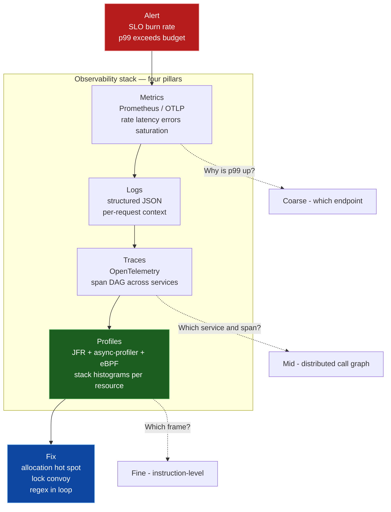
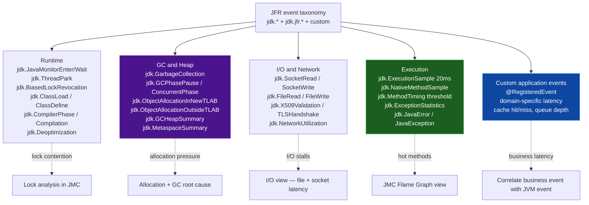
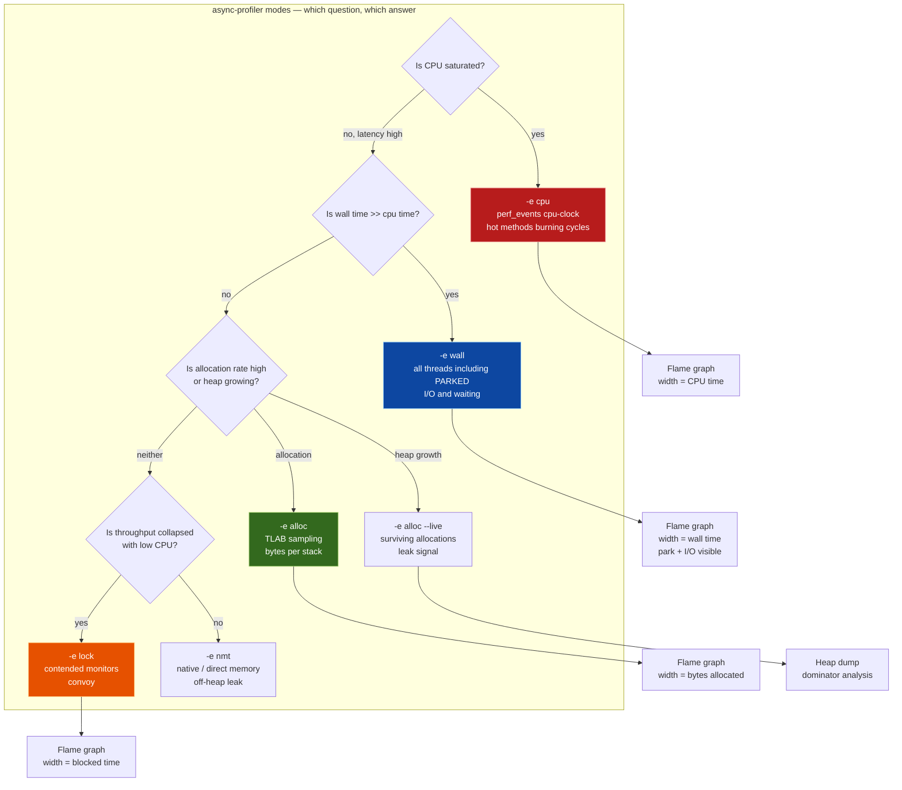
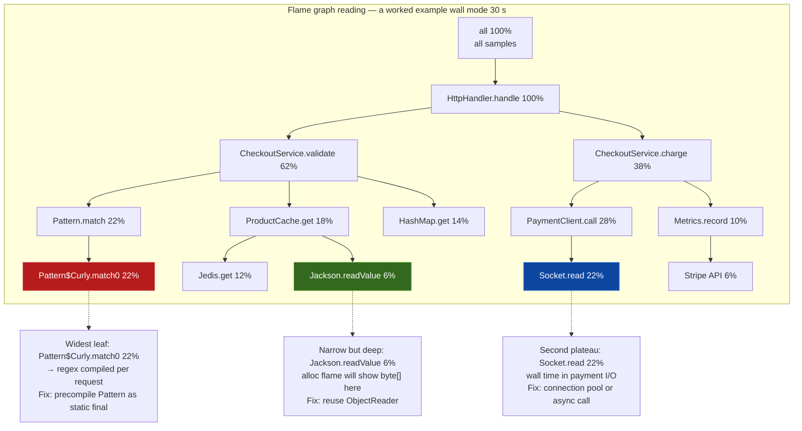
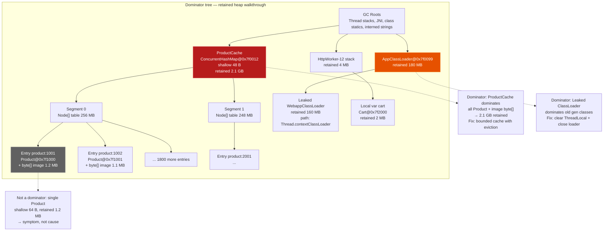
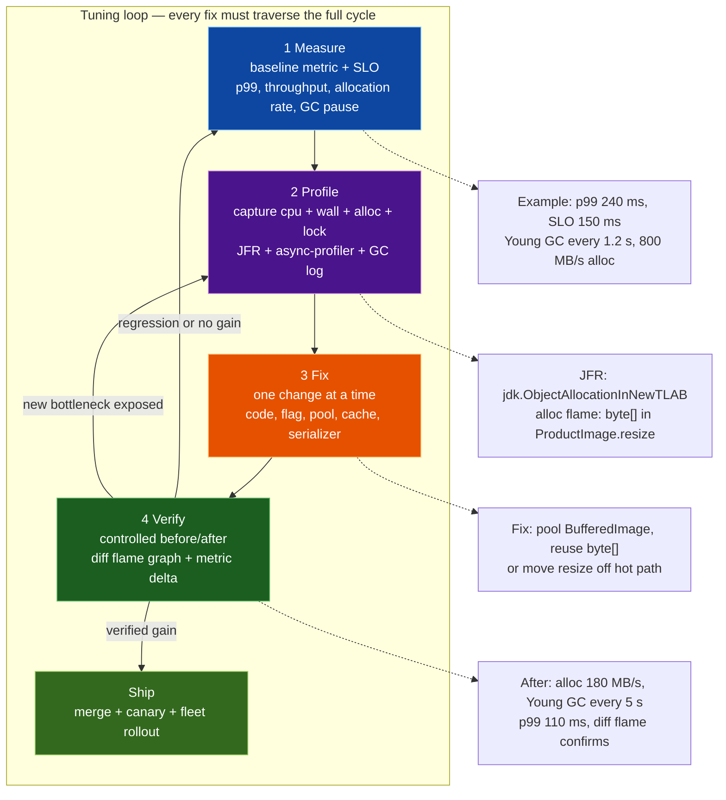
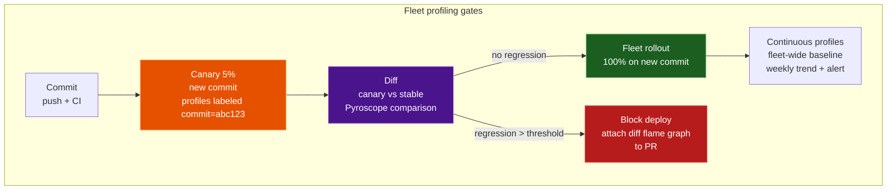

# Chapter 10 — Profiling, Observability, and Performance Tuning (JFR, async-profiler, JMC, heap dumps)

**What this chapter covers.** A backend service that passes all functional tests can still fail in production — creeping p99, periodic STW pauses that trip circuit breakers, a slow memory leak that OOM-kills one pod per day, or a lock convoy that collapses throughput under load. The JVM ships the richest observability toolkit of any managed runtime, but it is useless unless you know which instrument to reach for, what bias it introduces, and how to turn a recording into a fix you can verify. This chapter dissects the four pillars of JVM observability — Flight Recorder, sampling profilers, heap analysis, and GC logs — and assembles them into a continuous profiling and tuning workflow you can run across a fleet. You will record and stream JFR events, drive async-profiler through every mode, read flame graphs without being fooled by them, walk a heap dump through Eclipse MAT's dominator tree, parse unified GC logs, and deploy Pyroscope and Parca for always-on profiling in Kubernetes.

Learning goals — after this chapter you should be able to:

- Explain why profiles are the fourth pillar of observability and how they complement metrics, logs, and traces — and why a profile can answer questions the other three cannot.
- Operate JDK Flight Recorder end-to-end: choose a recording configuration, start it with `jcmd` and `-XX:StartFlightRecording`, stream events with `jdk.jfr.consumer.RecordingStream`, author custom `@RegisteredEvent` types, and analyze a recording in JDK Mission Control.
- Distinguish async-profiler's `cpu`, `wall`, `alloc`, `lock`, and `nmt` modes, explain why `AsyncGetCallTrace` avoids safepoint bias, and generate and read flame graphs and differential flame graphs for each mode.
- Capture and dissect a heap dump (`jcmd GC.heap_dump`, `jmap`, `-XX:+HeapDumpOnOutOfMemoryError`), walk the `hprof` with `jhat`/`jhsdb` and Eclipse MAT, and use histogram, dominator tree, path-to-GC-roots, and leak-suspects to isolate the retainer of a leak.
- Parse unified GC logs (`-Xlog:gc*`) for G1, ZGC, and Shenandoah, compute allocation and promotion rates, and correlate GC pauses with JFR `jdk.GarbageCollection` and `jdk.GCPhasePause` events.
- Deploy continuous profiling with Grafana Pyroscope or Parca: configure the agent, label profiles by service/region/commit, control overhead and cardinality, and correlate profiles with traces via exemplars.
- Execute a disciplined tuning loop — measure, profile, fix, verify — and avoid the classic traps: optimizing what you did not measure, tuning flags without a profile, and declaring victory without a controlled before/after comparison.

> **Placement.** Chapter 4 built the GC theory and log vocabulary this chapter instruments. Chapter 5 explained JIT compilation and deoptimization — the code whose quality you measure with profilers. Chapter 3 defined the object layout whose retention you diagnose in heap dumps. Chapter 12 (Production JVM) applies the tuning decisions you learn to make here to container sizing, CDS, and fleet rollout.

---

## 1. The fourth pillar — where profiling fits in observability

Metrics tell you *that* a service is slow (p99 jumped from 80 ms to 240 ms). Logs tell you *which* requests were slow. Traces tell you *which service* in the call graph was slow. Only a profile tells you *which instruction* was slow — which method, which allocation site, which lock, which kernel stack ate the CPU.

The four signals differ in dimensionality, cardinality, and cost:

| Signal | Question it answers | Granularity | Cost of always-on |
|--------|---------------------|-------------|-------------------|
| Metrics (Counters, Histograms) | Is the system healthy? What is the rate/latency/error budget? | Per-process or per-endpoint aggregates | Low — counters in memory, scraped every 15 s |
| Logs (structured JSON) | What happened for request X? What was the exception chain? | Per-request, per-event string | Medium — I/O and index cost; sampled or level-filtered |
| Traces (OpenTelemetry) | Where did time go across 40 services? Which span dominates? | Per-request DAG of spans | Medium — head or tail sampling required at high QPS |
| Profiles (JFR, async-profiler, eBPF) | Which code path consumed CPU, allocated memory, or blocked on a lock? | Per-stack-frame histogram sampled at 1–10 kHz | Low when sampled, high fidelity — the only signal that explains *why* CPU or memory is spent |

Profiling is the missing differential in backend incident response. An alert fires on p99 latency (metric). You find the slow handler in a trace (span `checkout.validateCart` at 180 ms). Only the wall-clock profile shows that 140 ms of those 180 ms was inside `java.util.regex.Pattern.match` recompiling the same pattern per request — an allocation inside a hot loop invisible to both metrics and traces.

### 1.1 The cost model — sampling, instrumentation, and overhead budgets

Not all profiling is equal. The overhead and bias of a technique determine whether you can leave it on in production:

| Technique | How it collects | Typical overhead | Bias / blind spot |
|-----------|----------------|------------------|-------------------|
| JFR (Flight Recorder) | Instrumentation points in JDK/JVM code emit typed events into thread-local buffers | < 1% with `profile` config, 1–2% with everything enabled | Only sees what has an event site; needs event enabled |
| async-profiler `cpu` | `perf_events` + `AsyncGetCallTrace` samples at e.g. 10 kHz on `cpu-clock` | 1–3% | Only running threads; misses idle/waiting time |
| async-profiler `wall` | Periodic sampling of all threads regardless of `RUNNABLE` state | 1–3% + timer signal | Includes idle time — must filter or it drowns CPU signal |
| async-profiler `alloc` | Intercepts `TLAB` allocation path sampling every N bytes | 2–5% | Sampling, not exact count |
| async-profiler `lock` | JVMTI `MonitorContendedEnter` sampling / hotspot lock events | 1–2% | Only contended locks |
| Heap dump (`jmap`/`jcmd`) | STW traversal of entire heap graph, serializes to `hprof` | STW pause proportional to live set (seconds for multi-GB) | Point-in-time snapshot only |
| Java Flight Recorder Method Sampling | JFR `jdk.ExecutionSample` samples at `20 ms` (50 Hz) | < 1% | Lower frequency than async-profiler; safepoint-aware sampling |
| eBPF / `perf` kernel stacks | Kernel `perf_events` samples user + kernel stacks | 1–2% | Sees kernel frames JFR misses; no Java line numbers without mapping |

In production, the correct default is **always-on JFR at the `profile` or `continuous` setting plus continuous profiling at low frequency** (e.g., async-profiler wall at 500 Hz or Pyroscope at 10 Hz). Reserve high-frequency or allocation profiling for targeted 60-second captures.



### 1.2 What senior teams get wrong

- **Metrics-only tuning.** Dashboards show `jvm_gc_pause_seconds` spiking but not *why*. Teams bump `-Xmx` or lower `MaxGCPauseMillis` without a profile — the real cause is a 4 MB per-request allocation inside a Jackson serializer, fixable with one buffer reuse.
- **One-off profiling in staging.** A 30-second `async-profiler` capture on a laptop with 1 QPS does not reproduce the lock contention that only appears at 8k QPS with 200 threads. Production sampling is non-negotiable for concurrency bugs.
- **Flame graph as truth without method.** A flame graph shows *where* time was spent, not whether that time was necessary, contended, or idle. Reading it without distinguishing `cpu` vs `wall` vs `alloc` produces confident wrong conclusions.

---

## 2. JDK Flight Recorder — the flight data recorder inside the JVM

JFR (JEP 328, open-sourced in JDK 11) is a low-overhead, always-on event system embedded in HotSpot and the JDK libraries. Think of it as the JVM's black box: a circular buffer of typed events that the JVM writes continuously, with near-zero overhead when no recording is active and ~1% when one is.

### 2.1 Architecture — buffers, chunks, and the repository

```
Mutator thread                JFR thread-local buffer           Global repository
─────────────                ─────────────────────              ────────────────
jdk.ObjectAllocationInNewTLAB ──►  thread-local chunk (8 KB)
jdk.JavaMonitorEnter          ──►  committed via Atomic::xchg   ──►  .jfr chunk file
jdk.ExecutionSample (sampler) ──►  flushed on buffer full       ──►  rotation every
jdk.GarbageCollection         ──►  or chunk boundary                maxChunkSize
Custom @RegisteredEvent       ──►  lock-free, no safepoint          (default 12 MB)
```

Each thread owns a small thread-local buffer. Events are written with `EventWriter.putLong/putString` without acquiring a global lock; only when the buffer fills is it linked to the global `Repository` under a short critical section. If no recording is active, the writer bails out after a single `shouldCommit()` check — the fast path is a single branch.

A **recording** is a time window over the repository: `jcmd <pid> JFR.start` opens a chunk, the JVM streams events into it, and `JFR.stop` or `JFR.dump` finalizes the chunk to a `.jfr` file. Chunks are self-describing — they carry their own constant pools and metadata so any chunk is independently readable by JMC or `jfr print`.

There are three lifecycles:

| Lifecycle | How started | When data lands on disk | Use for |
|-----------|-------------|------------------------|---------|
| In-memory circular buffer | Default if `FlightRecorder` is enabled at startup | Never, until dumped | Post-incident forensics: `jcmd JFR.dump` after an alert |
| Continuous disk recording | `-XX:StartFlightRecording=disk=true,maxChunkSize=12M` | Rotated chunks in `repository/` | Always-on fleet recording; ship chunks to object storage |
| Streaming (`RecordingStream`) | Programmatic `new RecordingStream()` | Piped to consumer, never touches disk | Live alerting and adaptive sampling |

### 2.2 Event taxonomy — what the JVM can tell you

JFR defines 140+ event types. Every event carries `startTime`, `duration` (for duration events), `eventThread`, and `stackTrace`. The taxonomy matters because enabling the wrong set blinds you at 1% cost, while enabling everything costs 2% and buries signal in noise.



The two most important selectors for backend work are `profile.jfc` and `continuous.jfc` (both shipped in `$JAVA_HOME/lib/jfr/`). Their practical difference:

| Setting file | `jdk.ExecutionSample` | `jdk.ObjectAllocation*` | `jdk.JavaMonitorEnter` threshold | `jdk.SocketRead/Write` | Overhead |
|--------------|----------------------|------------------------|----------------------------------|-----------------------|----------|
| `default.jfc` | period 20 ms | off | 10 ms | threshold 20 ms | < 0.5% |
| `profile.jfc` | period 20 ms | every TLAB alloc (sampling with `throttle`) | 10 ms | threshold 10 ms | ~1% |
| `continuous.jfc` | period 20 ms | sampled | 20 ms | threshold 20 ms | ~0.7% |

For always-on fleet recording, start from `profile.jfc` and tune thresholds: raise `jdk.FileRead` threshold to 20 ms to cut file I/O noise, enable `jdk.ObjectAllocationInNewTLAB#throttle=100/s` to cap allocation event rate under high allocation pressure.

### 2.3 Recording — command line, jcmd, and programmatic

**At startup — the correct default for every production service:**

```bash
# JDK 17+ — continuous 24-hour in-memory ring + 7-day disk rotation
java \
  -XX:StartFlightRecording=name=continuous,settings=profile,disk=true,dumponexit=true,\
maxChunckSize=12M,maxAge=7d,repository=/var/log/jfr,filename=/var/log/jfr/app.jfr \
  -XX:FlightRecorderOptions=repository=/var/log/jfr,maxchunksize=12M,globalbuffersize=512k,threadbuffersize=8k \
  -Xlog:jfr*=info \
  -jar service.jar

# Alternative — explicit two-recordings pattern: memory ring + periodic dump
java \
  -XX:StartFlightRecording=name=mem,settings=profile,maxSize=200M \
  -jar service.jar
# Then periodically: jcmd <pid> JFR.dump name=mem filename=/var/log/jfr/$(date +%s).jfr
```

**At runtime with `jcmd` — no restart required:**

```bash
# Discover the JVM PID
jcmd | head
# 12345 com.example.CheckoutService

# Start a 60-second high-fidelity capture
jcmd 12345 JFR.start name=incident-20260812 \
  settings=profile \
  duration=60s \
  filename=/tmp/incident-20260812.jfr \
  maxsize=100M

# Check active recordings
jcmd 12345 JFR.check
# Recording: name=incident-20260812 duration=60s state=RUNNING ...

# Dump the in-memory ring without stopping (useful when FlightRecorder was started at boot)
jcmd 12345 JFR.dump name=continuous filename=/tmp/continuous-now.jfr

# Stop and finalize
jcmd 12345 JFR.stop name=incident-20260812

# List available event types and their current thresholds
jcmd 12345 JFR.configure

# Inspect a recording without JMC — headless triage on a bastion host
jfr print --events jdk.GarbageCollection,jdk.GCPhasePause,jdk.ExecutionSample \
  --stack-depth 64 /tmp/incident-20260812.jfr | head -n 120

# Summary view — event counts and total times
jfr summary /tmp/incident-20260812.jfr
# jdk.ExecutionSample :  18234 events
# jdk.ObjectAllocationInNewTLAB : 89210 events  (total allocated 412 MB)
# jdk.JavaMonitorEnter : 412 events (max duration 184 ms)
# jdk.SocketRead : 8201 events
```

**Kubernetes — add a sidecar or init pattern for shipping chunks:**

```yaml
# Deployment snippet — mount an emptyDir for the JFR repository and ship with a sidecar
spec:
  template:
    spec:
      volumes:
        - name: jfr-repo
          emptyDir: { sizeLimit: 1Gi }
      containers:
        - name: app
          image: registry.example.com/checkout:1.4.2
          env:
            - name: JAVA_TOOL_OPTIONS
              value: >-
                -XX:StartFlightRecording=name=continuous,settings=profile,
                disk=true,repository=/jfr,maxAge=2h,maxSize=500M
                -XX:FlightRecorderOptions=repository=/jfr
          volumeMounts:
            - { name: jfr-repo, mountPath: /jfr }
          # Dump on OOM for post-mortem even if the pod is evicted
          lifecycle:
            preStop:
              exec:
                command: ["/bin/sh", "-c", "jcmd 1 JFR.dump name=continuous filename=/jfr/dump-$(date +%s).jfr || true"]
        - name: jfr-shipper
          image: registry.example.com/jfr-shipper:0.3
          args: ["--repository=/jfr", "--sink=s3://jfr-archive/$(POD_NAME)/", "--interval=60s"]
          volumeMounts:
            - { name: jfr-repo, mountPath: /jfr }
```

### 2.4 Streaming — `jdk.jfr.consumer.RecordingStream` (JDK 14+)

Continuous disk recording is durable; streaming is *live*. A `RecordingStream` subscribes to events as they are committed, before chunk rotation, with back-pressure via the consumer thread.

```java
import jdk.jfr.consumer.RecordingStream;
import java.time.Duration;

public final class JfrLiveMonitor {

    public static void main(String[] args) throws Exception {
        try (var stream = new RecordingStream()) {

            // Enable only what the live pipeline needs — keep overhead minimal
            stream.enable("jdk.GarbageCollection").withThreshold(Duration.ofMillis(0));
            stream.enable("jdk.GCHeapSummary").withPeriod(Duration.ofSeconds(1));
            stream.enable("jdk.JavaMonitorEnter").withThreshold(Duration.ofMillis(20));
            stream.enable("jdk.ThreadPark").withThreshold(Duration.ofMillis(50));
            // ExecutionSample at 20 ms is already the default when enabled
            stream.enable("jdk.ExecutionSample").withoutStackTrace(); // lightweight counter
            stream.enable("com.example.CheckoutLatency").withThreshold(Duration.ofMillis(0));

            stream.onEvent("jdk.GarbageCollection", event -> {
                long gcId   = event.getLong("gcId");
                String name = event.getString("name");      // "G1 Young Generation"
                long pause  = event.getDuration().toMillis();
                if (pause > 100) {
                    System.err.printf("[JFR-STREAM] Long GC pause gcId=%d name=%s pause=%dms%n",
                        gcId, name, pause);
                    // push to Micrometer / OTel metric, or trigger jcmd JFR.dump
                }
            });

            stream.onEvent("jdk.JavaMonitorEnter", event -> {
                String monitorClass = event.getString("monitorClass");
                long durationMs = event.getDuration().toMillis();
                var stack = event.getStackTrace();
                System.err.printf("[JFR-STREAM] Monitor contention %s blocked %dms at %s%n",
                    monitorClass, durationMs,
                    stack != null && !stack.getFrames().isEmpty()
                        ? stack.getFrames().get(0) : "<no stack>");
            });

            stream.onEvent("com.example.CheckoutLatency", event -> {
                long latencyMs = event.getLong("latencyMs");
                String outcome  = event.getString("outcome");
                if (latencyMs > 500) {
                    // Correlate domain event with JVM state in the same time window
                    System.err.printf("[JFR-STREAM] Slow checkout latency=%dms outcome=%s%n",
                        latencyMs, outcome);
                }
            });

            // Blocks and dispatches on a dedicated thread — never call from a latency-sensitive thread
            stream.start();
        }
    }
}
```

Operational notes:

- `RecordingStream` enables the Flight Recorder if it was not already enabled; `FlightRecorder.isAvailable()` will flip to `true` on first stream creation. The overhead is that of the enabled events only.
- Always set thresholds and periods explicitly. `withoutStackTrace()` is valuable for high-frequency events like `jdk.ExecutionSample` when you only need a count.
- Run the stream on a dedicated thread or off-heap forwarder; blocking the callback blocks JFR's event dispatch.
- Streaming and disk recording coexist — a `RecordingStream` does not consume events from the disk chunks; it subscribes to the live flow independently.

### 2.5 Custom events — instrument the domain, not just the runtime

The most powerful JFR feature for backends is not the built-in events but the two lines that add a domain event:

```java
import jdk.jfr.*;

@Name("com.example.CheckoutLatency")
@Label("Checkout Latency")
@Description("End-to-end checkout handler latency including payment and inventory")
@Category({"Domain", "Checkout"})
@StackTrace(false)          // domain event — stack is usually noise; enable if you need caller context
@Threshold("20 ms")         // only commit if duration >= 20 ms — cuts volume by ~90%
@Registered
public final class CheckoutLatencyEvent extends Event {
    @Label("Latency (ms)") long latencyMs;
    @Label("Outcome")      String outcome;   // SUCCESS, PAYMENT_FAILED, INVENTORY_SHORTAGE
    @Label("Cart Size")    int cartSize;
}

@Name("com.example.CacheAccess")
@Label("Cache Access")
@Category({"Domain", "Cache"})
@StackTrace(false)
public final class CacheAccessEvent extends Event {
    @Label("Cache")   String cacheName;
    @Label("Hit")     boolean hit;
    @Label("Key Hash") int keyHash; // never log the raw key — hash only
}

// Usage — structured as try-with-resources via begin()/commit() or the Event helper:
public CheckoutResult checkout(Cart cart) {
    var event = new CheckoutLatencyEvent();
    event.begin();
    try {
        var result = doCheckout(cart);
        event.outcome = result.outcome().name();
        event.cartSize = cart.size();
        return result;
    } finally {
        event.latencyMs = event.duration().toMillis();
        if (event.shouldCommit()) { // respects @Threshold
            event.commit();
        }
    }
}

// Cache wrapper — emits one event per access, sampled by throttle in jfc
public Value get(String key) {
    var event = new CacheAccessEvent();
    event.begin();
    event.cacheName = "product-cache";
    event.keyHash = key.hashCode();
    Value v = delegate.get(key);
    event.hit = (v != null);
    event.commit(); // no threshold — every access is interesting at throttle
    return v;
}
```

Wire thresholds through the `.jfc` rather than hard-coding them, so operators can tune without redeploying:

```xml
<!-- checkout-profile.jfc fragment — include via jcmd JFR.configure or -XX:FlightRecorderOptions:settings= -->
<configuration version="2.0" label="Checkout profile" provider="Checkout Service">
  <event name="com.example.CheckoutLatency">
    <setting name="enabled">true</setting>
    <setting name="stackTrace">false</setting>
    <setting name="threshold">20 ms</setting>
  </event>
  <event name="com.example.CacheAccess">
    <setting name="enabled">true</setting>
    <setting name="throttle">100/s</setting> <!-- cap event rate -->
  </event>
</configuration>
```

Loaded with `jcmd <pid> JFR.start settings=/etc/jfr/checkout-profile.jfc`.

### 2.6 JDK Mission Control — reading the recording

JDK Mission Control (JMC, `org.openjdk.jmc`, standalone download from `jdk.java.net/jmc`) is the primary GUI for `.jfr` files. For headless environments, `jfr print` and `jfr summary` (JDK 14+, in `$JAVA_HOME/bin`) cover triage. JMC's value is correlation — every view is time-linked.

A disciplined JMC walkthrough for a latency incident proceeds in this order:

1. **Overview → Automated Analysis.** JMC's rule engine flags long GC pauses, high allocation rate, contended locks, and blocked threads. Treat it as a checklist, not a diagnosis — click through each finding to its source event.

2. **Java Application → Method Profiling (JFR Method Sampling).** This is `jdk.ExecutionSample` aggregated into a hot-methods table. Sort by *Sample Count* descending. If `java.util.regex.Pattern$Curly.match` is top with 18% of samples, you have a regex hot spot. The *Flame Graph* tab in JMC 8+ renders the same data as an interactive flame graph — zoom into the widest plateau.

3. **Java Application → Allocations → TLAB Allocations.** Sort by *Total Allocated* or *Allocation Count*. The *Allocation Stack Traces* view shows the exact call site. A single `byte[]` allocation at `com.example.JsonCodec.serialize` at 1.2 GB/s explains Young GC pressure without ever looking at GC logs.

4. **Java Application → Lock Instances / Java Blocking.** `jdk.JavaMonitorEnter` events sorted by *Duration* reveal the contended monitor and the stack that blocked. Correlate with `jdk.ThreadPark` and `jdk.JavaMonitorWait` to distinguish lock contention from `LockSupport.park` / `CompletableFuture` waiting.

5. **JVM Internals → Garbage Collections.** Timeline of `jdk.GarbageCollection` and `jdk.GCPhasePause` events. Select a long pause — the *References* and *Heap Summary* panels show heap occupancy before/after. A Young GC that reclaims only 12% of Eden indicates premature promotion or a leak.

6. **JVM Internals → JIT Compilations and Code Cache.** `jdk.Compilation` events show deoptimizations (unstable inlining) and code-cache pressure. A burst of `made not entrant` / `made zombie` followed by falling JIT throughput signals code-cache churn — raise `ReservedCodeCacheSize`.

7. **Custom Events → `com.example.*`.** Your domain events appear alongside JVM events on the same timeline. Select a slow `CheckoutLatency` event — the 500 ms around it shows which GC, lock, and allocation events co-occurred. This is the correlation that metrics alone cannot provide.

```bash
# Headless JMC rule evaluation — run in CI or on a bastion, no GUI
# Requires org.openjdk.jmc:flightrecorder.rules
java -jar org.openjdk.jmc.flightrecorder.rules.headless.jar \
  --recording /tmp/incident-20260812.jfr \
  --format json > /tmp/jmc-analysis.json
# Produces rule violations with severity, score, and remedial message

# Programmatic JFR parsing — alternative to JMC when automating fleet analysis
# Using jdk.jfr.consumer.RecordingFile (JDK 14+)
```

```java
import jdk.jfr.consumer.RecordingFile;
import jdk.jfr.consumer.RecordedEvent;
import java.nio.file.Path;
import java.util.*;

public final class JfrTriage {
    public static void main(String[] args) throws Exception {
        var path = Path.of(args[0]);
        long longPauses = 0, contendedLocks = 0;
        Map<String, Long> allocByClass = new HashMap<>();

        try (var file = new RecordingFile(path)) {
            while (file.hasMoreEvents()) {
                RecordedEvent e = file.readEvent();
                switch (e.getEventType().getName()) {
                    case "jdk.GarbageCollection" -> {
                        long pause = e.getDuration().toMillis();
                        if (pause > 50) longPauses++;
                    }
                    case "jdk.JavaMonitorEnter" -> {
                        if (e.getDuration().toMillis() > 20) contendedLocks++;
                    }
                    case "jdk.ObjectAllocationInNewTLAB" -> {
                        String cls = e.getString("objectClass");
                        long size = e.getLong("tlabSize");
                        allocByClass.merge(cls, size, Long::sum);
                    }
                }
            }
        }
        System.out.printf("Long GC pauses (>50ms): %d%n", longPauses);
        System.out.printf("Contended locks (>20ms): %d%n", contendedLocks);
        allocByClass.entrySet().stream()
            .sorted(Map.Entry.<String, Long>comparingByValue().reversed())
            .limit(10)
            .forEach(e -> System.out.printf("  alloc %-50s %8.1f MB%n",
                e.getKey(), e.getValue() / (1024.0 * 1024)));
    }
}
```

---

## 3. async-profiler — sampling without safepoint bias

JFR's `jdk.ExecutionSample` is excellent for always-on baselines, but its 20 ms period (50 Hz) is too coarse for short-lived hot spots, and it samples at safepoints — it can only observe a thread when the JVM brings it to a safepoint. `async-profiler` (by Andrei Pangin, now under `async-profiler/async-profiler` on GitHub) was built to fix exactly this limitation.

### 3.1 Why safepoint bias matters

HotSpot's classic `GetStackTrace` and `AsyncGetCallTrace`-free profilers (honest-profiler, old `hprof` cpu sampling) work by suspending threads at safepoints and walking stacks. The bias is systematic: code that never hits a safepoint (tight counted loops, `Unsafe` access, some intrinsics) is under-sampled, while safepoint-heavy code (allocations, method entries) is over-sampled. In Kotlin, an `IntArray` loop without allocation can appear *colder* than it is.

`async-profiler` avoids this by using `AsyncGetCallTrace` (AGCT) — a HotSpot-internal API that walks a thread's stack *asynchronously* from a `perf_events` or timer signal handler, without requiring the thread to be at a safepoint. Combined with `perf_events` (`cpu-clock` or `cpu-cycles` hardware counters) on Linux, it samples precisely where the CPU is, including inside JIT-compiled code and kernel frames.

```
Traditional safepoint sampler              async-profiler (AGCT + perf_events)
─────────────────────────────              ───────────────────────────────────
Timer fires ──► request safepoint          perf_event fires (cpu-clock, 10 kHz)
             ──► wait for thread to        ──► signal handler
                reach safepoint               ──► AsyncGetCallTrace(thread)
             ──► walk stack                   ──► walk stack immediately
             Bias: only safepoint states      Bias: none (sees all states)

Result: tight loops under-counted         Result: faithful CPU distribution
```

### 3.2 Modes — one profiler, five questions

async-profiler is not one profiler but five, selected by `-e` (event):

```bash
# Install — single static binary, no agent, no JVMTI attach overhead until started
curl -L https://github.com/async-profiler/async-profiler/releases/download/v3.0/async-profiler-3.0-linux-x64.tar.gz \
  | tar xz -C /tmp
export AP=/tmp/async-profiler-3.0-linux-x64

# Discover target PID
jcmd | grep CheckoutService
# 12345 com.example.CheckoutService
```

| Mode | Flag | What it samples | When to use |
|------|------|----------------|-------------|
| `cpu` | `-e cpu` | `perf_events cpu-clock` — on-CPU time | Hot methods burning CPU — the default first profile |
| `wall` | `-e wall` | Timer sampling every thread regardless of `RUNNABLE` | Latency — find where wall-clock time is spent including `park`/`sleep`/`I/O` |
| `alloc` | `-e alloc` | TLAB allocation sampling (bytes allocated, not object count) | Allocation pressure — find the call sites filling Eden |
| `lock` | `-e lock` | `MonitorContendedEnter` / `ReentrantLock` contention | Lock convoys — which monitor blocks the most thread-time |
| `nmt` | `-e nmt` | Native memory tracking deltas | Off-heap leaks — `ByteBuffer.allocateDirect`, JNI, metaspace |
| `live` | `--live` + `-e alloc` | Live allocations (not yet GC'd) | Leak suspicion — what survives Young GC |

**CPU — the starting point for every investigation:**

```bash
# 60-second CPU profile at 10 kHz (default), collapsed + flame graph
/tmp/async-profiler/profiler.sh start \
  -e cpu -i 100000 \
  --jfrsync profile \
  -f /tmp/cpu.jfr 12345
# ... let load run for 60 s ...
/tmp/async-profiler/profiler.sh stop 12345

# One-shot shorthand — profile for 30 s and emit an HTML flame graph
/tmp/async-profiler/profiler.sh -e cpu -d 30 -i 100000 \
  -f /tmp/cpu-flame.html 12345
# -e cpu     event
# -d 30      duration 30 s
# -i 100000  interval 100 us = 10 kHz sampling
# -f         output file (.html flame graph, .jfr, .collapsed, .jstack)

# JFR output — import directly into JMC alongside the JVM's own JFR chunks
/tmp/async-profiler/profiler.sh -e cpu -d 30 -o jfr -f /tmp/cpu.jfr 12345
jfr print --events jdk.ExecutionSample /tmp/cpu.jfr | head
```

**Wall-clock — the latency profile:**

```bash
# Wall-clock profiling — samples ALL threads including WAITING/PARKED
# Essential distinction: cpu shows "what burned CPU", wall shows "what made the request slow"
/tmp/async-profiler/profiler.sh -e wall -d 30 -t \
  -f /tmp/wall-flame.html 12345
# -t  include thread names in the flame graph (separate flame per thread)

# With Kotlin coroutines — wall is the only mode that sees suspension time
# A coroutine parked on Dispatchers.IO appears as WAITING in wall, invisible in cpu
/tmp/async-profiler/profiler.sh -e wall -d 60 -t --cstack dwarf \
  -f /tmp/wall-coroutines.html 12345
```

Reading `cpu` vs `wall` correctly is the single most common async-profiler mistake. A concrete illustration:

```
cpu flame graph (30 s, 10 kHz)              wall flame graph (30 s, 500 Hz)
──────────────────────────────              ────────────────────────────────
Wide plateau:                               Wide plateau:
  Pattern.match  22%                          LockSupport.park  38%
  JsonCodec.serialize  18%                    Pattern.match      9%
  HashMap.get  11%                            Jedis.get (socketRead)  21%
  ...                                        JsonCodec.serialize  7%

Interpretation:                             Interpretation:
  "We burn CPU in regex"                     "We spend wall time parked
   → fix the regex                            waiting for Redis + regex"
   → but misses that 38% of                → real bottleneck is downstream
     wall time is idle wait                    I/O, not CPU
```

Always capture both. If `wall` is dominated by `park`/`wait`/`socketRead` while `cpu` is dominated by a compute kernel, the fix is concurrency or caching, not micro-optimization.

**Allocation — find the garbage:**

```bash
# Allocation profile — sampled every 512 KB by default (--alloc 512k)
# Reports bytes allocated per stack, not object count
/tmp/async-profiler/profiler.sh -e alloc -d 30 \
  -f /tmp/alloc-flame.html 12345

# Live allocation — only objects still reachable at dump time (leak signal)
# Requires --live and a GC at the end of the window
/tmp/async-profiler/profiler.sh -e alloc --live -d 30 \
  -f /tmp/live-alloc.html 12345
```

An `alloc` flame graph wide at `byte[]` under `com.example.ProductImage.resize` at 800 MB/s explains why Eden fills every 2 seconds — no GC log analysis needed.

**Lock — find the convoy:**

```bash
# Lock contention — samples contended monitor entry
# Width = total time threads were BLOCKED on that monitor
/tmp/async-profiler/profiler.sh -e lock -d 30 -t \
  -f /tmp/lock-flame.html 12345

# With -t, each thread gets its own lane — identify the single lock
# that serializes 40 worker threads
```

A lock flame graph narrow but tall indicates a single monitor with high contention depth (many threads queueing). A wide, shallow lock graph indicates many distinct locks each with brief contention — usually not worth optimizing.

**Native memory:**

```bash
# NMT mode — requires -XX:NativeMemoryTracking=detail at JVM startup
# Shows native allocations outside the Java heap
/tmp/async-profiler/profiler.sh -e nmt -d 30 \
  -f /tmp/nmt-flame.html 12345

# Compare with jcmd NMT output for the same window
jcmd 12345 VM.native_memory summary scale=MB
jcmd 12345 VM.native_memory detail scale=MB
```

### 3.3 Kotlin specifics

Kotlin generates synthetic methods (`$default` for default parameters, `suspend` state-machine dispatch, `inline` call-site specialization) that appear as distinct frames in async-profiler output. Two caveats:

- **Inline functions** (`inline fun <T> Iterable<T>.filter(...)`) are inlined at the call site — the flame graph shows the call *site* method, not `filter` itself. If you inline a hot path, the flame graph correctly attributes its cost to the caller.
- **Coroutines** suspend by returning `COROUTINE_SUSPENDED` and resuming via `Continuation.resumeWith`. A `cpu` profile sees the state-machine dispatch (`BaseContinuationImpl.resumeWith`) as a hot frame; a `wall` profile sees `LockSupport.park` under `DefaultExecutor`. Correlate with JFR `jdk.ThreadPark` events to distinguish suspension from contention.

```kotlin
// This coroutine chain appears in profiles as:
suspend fun fetchProduct(id: String): Product =
    withContext(Dispatchers.IO) {          // wall: park here; cpu: invisible while parked
        productCache.getOrLoad(id) {       // alloc: byte[] from deserialization
            httpClient.get("/products/$id") // wall: socketRead
        }
    }

// cpu flame shows:  DefaultExecutor.runWorker → ContinuationImpl.resumeWith → fetchProduct$lambda
// wall flame shows: LockSupport.park → DefaultExecutor → fetchProduct (suspended)
// alloc flame shows: byte[] → Jackson deserializer → fetchProduct$lambda
```

### 3.4 Output formats and the `--jfrsync` bridge

async-profiler can emit JFR (`-o jfr`), collapsed stacks (`.collapsed` for `flamegraph.pl`), HTML flame graphs, and `pprof` for continuous profiling backends:

```bash
# Emit JFR and merge with the JVM's own JFR — single file for JMC
/tmp/async-profiler/profiler.sh start -e cpu --jfrsync profile -f /tmp/merged.jfr 12345

# Emit collapsed stacks for Brendan Gregg's flamegraph.pl
/tmp/async-profiler/profiler.sh -e cpu -d 30 -o collapsed -f /tmp/stacks.collapsed 12345
/tmp/async-profiler/bin/flamegraph.pl /tmp/stacks.collapsed > /tmp/cpu-flame.svg

# Emit pprof for Pyroscope/Parca ingestion
/tmp/async-profiler/profiler.sh -e cpu -d 30 -o pprof -f /tmp/cpu.pprof 12345
curl -X POST http://pyroscope:4040/ingest \
  -H "Content-Type: application/octet-stream" \
  --data-binary @/tmp/cpu.pprof
```

`--jfrsync` is the recommended bridge for production: it synchronizes async-profiler's samples with the JVM's JFR clock so both event streams share timestamps in JMC. Without it, correlating an async-profiler CPU hot spot with a JFR allocation or lock event requires manual time alignment.



---

## 4. Flame graphs — how to read them without fooling yourself

A flame graph is a histogram of stack traces, not a call graph. Every sample's stack is folded into a horizontal bar whose width is proportional to its frequency. The y-axis is stack depth; the x-axis is alphabetical, not temporal. The *widest plateau* is the hottest code — but only within the mode you sampled.

### 4.1 Anatomy of a flame graph

```
y  stack depth
^
|  ┌──────────────────────────────┐
|  │  BigDecimal.<init>           │  ← leaf frame (where the sample landed)
|  ├──────────┬───────────────────┤
|  │ JsonCodec│  Pattern.match    │  ← caller frames (alphabetically sorted)
|  ├──────────┴──────┬────────────┤
|  │  CheckoutService.validate    │
|  ├────────────────┴────────────┤
|  │  HttpHandler.handle          │
|  └─────────────────────────────┘
|  ◄──────── x: alphabetical ──────────►
   width = sample count (time, bytes, or blocked time depending on mode)
```

Reading rules for senior reviewers:

1. **Width is frequency, not causality.** A wide `HashMap.get` plateau does not mean `HashMap` is slow — it means many samples landed in `HashMap.get` *called from* the frames above it. Follow the stack downward to the domain method that *calls* `HashMap.get` in a loop.

2. **Alphabetical x-axis is not time.** Adjacent bars are not temporally adjacent. Do not infer call order from horizontal position — only from vertical stacking.

3. **Inverted (icicle) vs standard.** Standard flame graphs grow upward from `all` at the bottom; inverted (icicle) graphs grow downward from the root. Both encode the same data — JMC and async-profiler default to standard; Speedscope defaults to inverted. Agree on one for team reviews.

4. **Merged vs per-thread.** `async-profiler -t` emits per-thread lanes; without `-t`, all threads are merged. A lock convoy is invisible in the merged view — the per-thread view shows 40 threads all converging on one monitor frame.

5. **Differential flame graphs.** To verify a fix, capture before and after with identical load, then render the *difference*: `flamegraph.pl --diff`. Red frames grew, blue frames shrank. A successful allocation fix shows the `byte[]` plateau shrinking and `G1 Young GC` time shrinking with it.



### 4.2 Generating and comparing flame graphs

```bash
# Capture before the fix — collapsed stacks
/tmp/async-profiler/profiler.sh -e cpu -d 60 -o collapsed -f /tmp/before.collapsed 12345
/tmp/async-profiler/profiler.sh -e alloc -d 60 -o collapsed -f /tmp/before-alloc.collapsed 12345

# ... deploy fix: precompile regex, reuse Jackson ObjectReader ...

# Capture after the fix — same load, same duration, same interval
/tmp/async-profiler/profiler.sh -e cpu -d 60 -o collapsed -f /tmp/after.collapsed 12345
/tmp/async-profiler/profiler.sh -e alloc -d 60 -o collapsed -f /tmp/after-alloc.collapsed 12345

# Differential flame graph — red = more samples after, blue = fewer
/tmp/async-profiler/bin/diffgraph.pl /tmp/before.collapsed /tmp/after.collapsed > /tmp/diff.svg
# Or with Brendan Gregg's toolkit:
flamegraph.pl --title "CPU diff: before → after" /tmp/after.collapsed > /tmp/after.svg

# JFR-based flame graph — no async-profiler needed when JFR is already running
jfr print --events jdk.ExecutionSample --stack-depth 128 /tmp/app.jfr \
  | jfr-flame-graph --output /tmp/jfr-flame.html
# Alternative: open /tmp/app.jfr in JMC → Method Profiling → Flame Graph tab → Export SVG

# Speedscope — interactive viewer for pprof / collapsed / JFR JSON
npx speedscope /tmp/cpu.pprof
npx speedscope /tmp/before.collapsed
```

For fleet-wide differential analysis, export both captures as `pprof` and compare in Pyroscope's *Comparison View* or with `pprof -diff_base`:

```bash
go tool pprof -diff_base=before.pprof after.pprof
# (pprof) top 20
#       flat  flat%   sum%        cum   cum%
#     -420ms 18.2% 18.2%      -420ms 18.2%  Pattern.match
#     -180ms 7.8% 26.0%       -180ms 7.8%  byte[] allocation in JsonCodec
```

---

## 5. Heap dumps — finding the dominator

When the heap grows monotonically, or a pod OOM-kills after 18 hours, or `jstat -gc` shows Old climbing without bound, the question is not how fast you allocate but *what survives*. A heap dump is a point-in-time snapshot of every object, its fields, and its references — the only artifact that can answer "what is retaining this memory?"

### 5.1 Capturing a dump — jcmd, jmap, and automatic triggers

All three paths produce the same `hprof` binary format. Prefer `jcmd` — it works without the `jmap` attach caveat and does not require `JDK_HOME/bin` on the container image.

```bash
# Preferred — jcmd, works on JDK 8+ and does not need jmap
# Triggers a STW heap traversal; duration ~ 1-3 s per GB of live heap
jcmd 12345 GC.heap_dump /tmp/heap-$(date +%Y%m%d-%H%M%S).hprof

# With live objects only — triggers a Full GC first to reclaim garbage, then dumps
# Use when you want retained set, not floating garbage
jcmd 12345 GC.heap_dump -all=false /tmp/heap-live.hprof
# -all=false is the default for jcmd; jmap defaults to all=true

# Legacy — jmap (requires JDK, not JRE; may fail inside minimal container images)
jmap -dump:live,format=b,file=/tmp/heap.hprof 12345
# live  → Full GC before dump; omit for all objects including unreachable
# format=b → binary hprof (only format MAT understands)

# Low-level — jhsdb jmap (works even when the process is hung, via SA)
jhsdb jmap --binaryheap --pid 12345 --dumpfile /tmp/heap.hprof

# Automatic — dump on OutOfMemoryError without human intervention
java \
  -XX:+HeapDumpOnOutOfMemoryError \
  -XX:HeapDumpPath=/var/log/heap/oom-%p-%t.hprof \
  -XX:+ExitOnOutOfMemoryError \
  -jar service.jar
# %p = PID, %t = timestamp; always set ExitOnOutOfMemoryError alongside —
# a JVM that OOM'd but stays alive serves corrupt responses

# Kubernetes — ephemeral emptyDir + sidecar upload
# Never write a multi-GB hprof to the container's overlay FS — it will fill the node
spec:
  containers:
  - name: app
    env:
    - name: JAVA_TOOL_OPTIONS
      value: "-XX:+HeapDumpOnOutOfMemoryError -XX:HeapDumpPath=/dumps/oom-%p-%t.hprof"
    volumeMounts:
    - { name: heap-dumps, mountPath: /dumps }
  volumes:
  - name: heap-dumps
    emptyDir: { sizeLimit: 5Gi }

# Trigger manually inside a pod without exec — via a liveness-sidecar HTTP endpoint
# that runs: jcmd 1 GC.heap_dump /dumps/manual-$(date +%s).hprof
```

**Operational cautions:**

- A heap dump is STW. On a 16 GB heap with 8 GB live, expect 8–20 seconds of pause. In Kubernetes, raise `terminationGracePeriodSeconds` and trigger dumps off-peak or on a canary, or use `jcmd GC.heap_dump` on a single pod behind a readiness-gate that removes it from the load balancer first.
- The `hprof` file is roughly the size of the live heap (compressed with no compression). A 12 GB live set produces a ~12 GB file — compress with `gzip --fast` before uploading (typically 3:1 ratio for object-heavy heaps). Ship to object storage (`s3://heap-dumps/...`), not to a developer laptop over `kubectl cp`.
- `jhsdb jmap` can dump a hung JVM that no longer responds to `jcmd` — it attaches via the Serviceability Agent and reads raw memory. Use it when `jcmd` times out.

### 5.2 The hprof format — what is inside

The `hprof` binary (`JAVA PROFILE 1.0.2` header) is a stream of records: heap dump segments, thread stacks, class definitions, and GC roots. Every object is identified by an `ID` (4 or 8 bytes depending on compressed oops) and carries its class ID, instance size, and field values. MAT and YourKit parse this stream into an indexed object graph.

Key record types the analyst should know:

| Record | What it tells you |
|--------|-------------------|
| `HEAP_DUMP_SEGMENT` | Objects, arrays, primitive arrays, class statics; the core graph |
| `ROOT_JNI_GLOBAL` / `ROOT_JNI_LOCAL` | JNI handles — native code retaining Java objects |
| `ROOT_JAVA_FRAME` | Local variables on thread stacks — often the unexpected retainer |
| `ROOT_STICKY_CLASS` | Classes and classloaders — classloader leak signal |
| `ROOT_THREAD_OBJECT` | Thread objects themselves |
| `CLASS_DUMP` | Per-class statics — `static Map cache` lives here |
| `THREAD_BLOCK` | Stack trace for each thread at dump time — correlate thread state with retained heap |

You can inspect the raw stream with `jhat` (JDK 8, removed in JDK 9+) or `jhsdb`:

```bash
# JDK 8 — jhat starts an HTTP server browsing the heap (slow for large dumps)
jhat -J-Xmx4g /tmp/heap.hprof
# Browse http://localhost:7000 — histogram, per-class instance list, OQL queries

# JDK 11+ — jhsdb heap walk without a full MAT import (faster triage)
jhsdb jmap --heap --pid 12345
jhsdb jstack --pid 12345  # thread stacks at dump time

# jxray / fast HPROF tools for CI pipelines
java -jar jxray.jar heap-report /tmp/heap.hprof --output /tmp/heap-report.json
```

### 5.3 Eclipse MAT — the dominator walkthrough

Eclipse Memory Analyzer (MAT, `eclipse.org/mat`) is the reference tool for `hprof` analysis. Its core abstraction is the **dominator tree** — the structure that answers "if this object were collected, how much heap would be freed transitively?"

An object `X` *dominates* object `Y` if every path from a GC root to `Y` goes through `X`. The *retained heap* of `X` is the sum of shallow heaps of all objects dominated by `X`. The object with the largest retained heap is the leak's retainer — not necessarily the largest object, but the one whose removal frees the most memory.



**MAT walkthrough — from opening the dump to the fix:**

*Step 1 — Leak Suspects report.* On opening a dump, MAT offers *Leak Suspects* — a heuristic report ranking the largest retained sets. Treat it as a starting hypothesis. In a checkout service leak, it typically reports:

```
Problem Suspect 1:
  One instance of "java.util.concurrent.ConcurrentHashMap" loaded by
  "jdk.internal.loader.ClassLoaders$AppClassLoader @ 0x7f001234"
  occupies 2,184,320,512 (68.2%) bytes.
  The memory is accumulated in one instance of
  "java.util.concurrent.ConcurrentHashMap$Node[]" loaded by "<system class loader>".

Keywords: java.util.concurrent.ConcurrentHashMap, ProductCache
```

Click *Details → Shortest Paths To GC Roots → exclude weak references* to see why the `ConcurrentHashMap` is retained. If the path is `ProductCache → static field → AppClassLoader`, it is a long-lived cache — check its eviction policy. If the path is `ProductCache → ThreadLocal → Thread → GC root`, it is a `ThreadLocal` leak — the cache is pinned by a thread that never clears it.

*Step 2 — Histogram.* `Window → Histogram` lists every class by instance count and shallow heap. Sort by *Retained Heap* descending. The histogram answers "what kind of object dominates the heap?" — not "which instance."

```
Class Name                              | Objects | Shallow Heap | Retained Heap
---------------------------------------------------------------------------------
byte[]                                  |  82,412 |  1.8 GB      |  1.8 GB
com.example.Product                     |  82,400 |  48 MB       |  1.85 GB
java.util.concurrent.ConcurrentHashMap$Node | 82,400 |  12 MB    |  1.86 GB
java.util.concurrent.ConcurrentHashMap  |       1 |  48 B        |  2.18 GB
```

`byte[]` at 1.8 GB with the same cardinality as `Product` (82k) suggests each `Product` holds one large `byte[]` (likely an image or serialized blob). The fix is not "reduce `byte[]`" but "bound the cache that holds the `Product` instances that hold the `byte[]`."

*Step 3 — Dominator tree.* `Window → Dominator Tree` — sort by retained heap. Expand the top node. MAT shows *Retained Heap* and *Percentage* per dominator. The expected shape of a cache leak is a single `ConcurrentHashMap` dominating 60–80% of the heap. Right-click → *Path To GC Roots → exclude weak/soft references* to confirm the retention path is strong.

*Step 4 — Path to GC roots and incoming references.* Select a single `Product` instance → *Path To GC Roots → exclude weak references* + *Merge Shortest Paths*. MAT shows every strong path pinning that instance. For a cache leak the path is trivial: `Product → Node → Node[] → ConcurrentHashMap → ProductCache static`. For a listener leak the path is more subtle: `Product → ArrayList → Order → ListenerRegistry → static`.

*Step 5 — OQL — query the heap like a database.*

```sql
-- MAT OQL — find all Product instances whose image is larger than 1 MB
SELECT p.id, p.name.toString(), p.image.length
FROM com.example.Product p
WHERE p.image.length > 1048576

-- Find the largest retained ConcurrentHashMap
SELECT * FROM java.util.concurrent.ConcurrentHashMap c
WHERE c.size > 10000

-- Find ThreadLocals that retain more than 10 MB
SELECT t.@displayName, t.value.@retainedHeapSize
FROM java.lang.ThreadLocal$ThreadLocalMap$Entry t
WHERE t.value.@retainedHeapSize > 10485760

-- Find classloader leaks — classloaders with no incoming strong reference except a Thread
SELECT l.@displayName, l.@retainedHeapSize
FROM java.lang.ClassLoader l
WHERE l.@retainedHeapSize > 50 * 1024 * 1024
```

*Step 6 — Compare two dumps.* Take a heap dump at T+0 and T+1 hour under steady load. In MAT: `File → Compare Basket → Add` both dumps → *Compare Tables → Histogram*. The delta shows which class grew. A cache leak shows `Product` at +12k instances, `+180 MB`; a `ThreadLocal` leak shows `Cart` at +400 instances pinned by `HttpWorker` threads.

**Kotlin and framework pitfalls in heap dumps:**

| Pattern | What it looks like in MAT | Fix |
|---------|--------------------------|-----|
| Unbounded `ConcurrentHashMap` / `Caffeine` without `maximumSize` | `ConcurrentHashMap` dominates heap, `Node[]` + `Product` grow linearly | `Caffeine.newBuilder().maximumSize(10_000).expireAfterWrite(5, MINUTES).build()` |
| `ThreadLocal<Cart>` never removed | `ThreadLocalMap$Entry` retained via `Thread.threadLocals`, path to `HttpWorker` | `try/finally { threadLocal.remove() }` in a servlet filter / Ktor plugin |
| Kotlin coroutine `Job` tree retaining `CoroutineScope` | `StandaloneCoroutine` + `JobSupport` retain `Product` via `Continuation` | Cancel scope on request completion; avoid `GlobalScope` |
| `MutableList<Product>` in a `companion object` | `Product[]` via `ArrayList.elementData` retained by class statics | Scope the list to the request or bound it |
| `ByteArray` from `OkHttp` / `Netty` pooled buffer not released | `byte[]` retained via `RealBufferedSource` / `ByteBuf` + `Cleaner` phantom | `use {}` / `release()` in `finally` |
| Classloader leak on hot redeploy (Spring Boot DevTools, OSGi) | `AppClassLoader` retained via `Thread.contextClassLoader` | Clear `ThreadLocal`, deregister JDBC drivers, close `URLClassLoader` |

**Correlating with `jstat` and JFR to confirm the leak is real before dumping:**

```bash
# Watch Old occupancy over 30 minutes — if it climbs monotonically, it is a leak, not churn
jstat -gc 12345 5000 | awk 'NR==1{print} NR>1{printf "%s Old:%dM EU:%dM OU:%dM YGC:%d FGC:%d\n", \
  strftime("%H:%M:%S"), $3/1024, $6/1024, $7/1024, $12, $14}'

# JFR Old occupancy trend — no dump needed to see the slope
jfr print --events jdk.GCHeapSummary /tmp/app.jfr \
  | grep -E "when|heapUsed|heapSpace" | head -n 40
```

---

## 6. GC logs — the quantitative performance story

GC logs are the only signal that quantifies pause time, allocation rate, and promotion rate over hours and days. JFR's `jdk.GarbageCollection` events tell the same story at event granularity; GC logs tell it as a continuous time series that log aggregators and `GCeasy` can trend.

### 6.1 Unified logging — `-Xlog` (JDK 9+, JEP 158, JEP 271)

The old `-XX:+PrintGCDetails -XX:+PrintGCTimeStamps` flags are gone. Unified logging uses a single `-Xlog` selector:

```bash
# Production-recommended GC logging — JDK 17+, G1 or ZGC
java \
  -Xlog:gc*,gc+heap=info,gc+phases=debug,gc+ergo*=trace,gc+age=trace,safepoint=info:file=/var/log/gc/gc.log:time,uptime,level,tags:filecount=10,filesize=50M \
  -Xlog:gc:file=/var/log/gc/gc.log:time,uptime \
  -jar service.jar

# Decode the selector:
#   gc*              all gc tags at info level
#   gc+heap=info     heap occupancy before/after each GC
#   gc+phases=debug  per-phase timings (Evacuate, Remark, Reference Processing)
#   gc+ergo*=trace   ergonomics decisions (why G1 chose this Young size)
#   gc+age=trace     tenuring age histogram
#   filecount=10,filesize=50M  rotate 10 × 50 MB, never fill the disk
#   time,uptime,level,tags    decorators on every line

# ZGC — add ZGC-specific phases
java \
  -Xlog:gc*,gc+phases=debug:file=/var/log/gc/gc.log:time,uptime,level,tags:filecount=10,filesize=50M \
  -jar service.jar

# Tail the live log
tail -F /var/log/gc/gc.log | grep --line-buffered "Pause Young\|Pause Full\|Concurrent"

# Ship to Loki / ELK — GC logs are plain text, trivial to forward
# Promtail / Fluent Bit config: path /var/log/gc/gc.log, label {service="checkout", collector="g1"}
```

### 6.2 Reading G1 logs

```
[2026-08-12T14:02:10.042+00:00][info][gc] GC(18) Pause Young (Normal) (G1 Evacuation Pause) 1420M->380M(4096M) 22.412ms
[2026-08-12T14:02:10.042+00:00][debug][gc,phases] GC(18)   Pre Evacuate Collection Set: 0.2ms
[2026-08-12T14:02:10.042+00:00][debug][gc,phases] GC(18)   Evacuate Collection Set: 14.8ms
[2026-08-12T14:02:10.042+00:00][debug][gc,phases] GC(18)   Post Evacuate Collection Set: 3.1ms
[2026-08-12T14:02:10.042+00:00][debug][gc,phases] GC(18)   Other: 4.3ms
[2026-08-12T14:02:10.042+00:00][info][gc,heap] GC(18) Eden regions: 18->0(18) Survivor regions: 3->3(3) Old regions: 2->2 Humongous regions: 1->1

[2026-08-12T14:02:45.210+00:00][info][gc] GC(42) Concurrent Cycle
[2026-08-12T14:02:45.210+00:00][info][gc] GC(42) Pause Initial Mark (G1 Humongous Allocation) 2100M->2100M(4096M) 8.102ms
[2026-08-12T14:02:45.340+00:00][info][gc] GC(42) Concurrent Mark (45.210s, 45.340s) 130.215ms
[2026-08-12T14:02:45.340+00:00][info][gc] GC(42) Pause Remark 2120M->2120M(4096M) 12.408ms
[2026-08-12T14:02:45.340+00:00][info][gc] GC(42) Pause Cleanup 2120M->1980M(4096M) 2.114ms
```

Field by field:

- `GC(18)` — monotonically increasing GC ID, correlates with JFR `jdk.GarbageCollection#gcId`.
- `Pause Young (Normal) (G1 Evacuation Pause)` — STW Young evacuation. `Normal` vs `Mixed` vs `Full`.
- `1420M->380M(4096M)` — heap before → after (total heap occupancy, not Young alone). `380M` is live data after evacuation — the promotion + survivor volume.
- `22.412ms` — STW pause duration. Compare against `MaxGCPauseMillis` goal and downstream RPC deadlines.
- `Eden regions: 18->0(18)` — 18 Eden regions reclaimed, 0 remain; parenthesized value is Young region count selected for this pause.

**Deriving allocation rate without a profiler:**

```
Allocation rate = (heap before next Young GC) - (heap after previous Young GC) / time between GCs

Example:
  GC(18) at t=10.042s  1420M->380M
  GC(19) at t=11.540s  1380M->360M
  Allocation between GCs = 1380M - 380M = 1000 MB over 1.498 s ≈ 667 MB/s

Promotion rate = (Old after GC - Old before GC) / interval
  If Old goes 420M -> 440M across Young GC(18), promotion = 20 MB in 1.5 s ≈ 13 MB/s
```

An allocation rate above ~1 GB/s per instance on G1 with a 4 GB heap means Young GC every 1–2 seconds — sustainable only if most objects die young. A promotion rate above 30–50 MB/s means Young objects survive too long — lower `MaxTenuringThreshold` or fix the allocation site.

### 6.3 Reading ZGC logs

```
[2026-08-12T14:03:10.100+00:00][info][gc] GC(5) Garbage Collection (Warmup) 1200M(30%)->800M(20%) 8.2ms
[2026-08-12T14:03:10.100+00:00][info][gc,phases] GC(5) Pauses: Mark Start 0.8ms, Mark End 0.6ms, Relocate Start 0.5ms
[2026-08-12T14:03:10.100+00:00][info][gc,heap] GC(5) Heap: 4096M, Free: 3296M, Used: 800M
[2026-08-12T14:03:10.100+00:00][info][gc,phases] GC(5) Concurrent: Mark 12.4ms, Relocate 18.2ms, Reference Processing 1.1ms
```

ZGC pauses are the sum of `Mark Start + Mark End + Relocate Start` — each typically 0.3–1.5 ms, independent of heap size. If `Mark Start` spikes to 10 ms, check `jcmd VM.info` for long root scanning (many threads) or `jfr print --events jdk.GCPhasePause` for the phase breakdown.

### 6.4 Tooling — GCeasy, GCViewer, and JFR correlation

```bash
# GCeasy — upload-free CLI via the GCeasy API or self-hosted
curl -X POST https://api.gceasy.io/analyzeGC \
  -H "Content-Type: multipart/form-data" \
  -F "file=@/var/log/gc/gc.log" | jq '.pauseTimePercentiles, .allocationRate'

# GCViewer — local, offline, no data leaves the VPC
java -jar gcviewer-1.37.jar /var/log/gc/gc.log --summary
# Prints: throughput %, avg pause, max pause, allocation rate, promotion rate

# JFR correlation — same GC, richer context
jfr print --events jdk.GarbageCollection,jdk.GCPhasePause,jdk.GCHeapSummary \
  /tmp/app.jfr | grep -A5 "GC(18)"
# JFR adds per-phase CPU time, heap occupancy per generation, and the stack
# that triggered the allocation failure — GC logs do not carry stacks
```

Best practice is to ship both: GC logs to your log aggregator for fleet-wide alerting (`avg_over_time(gc_pause_seconds) > 0.1`), and JFR chunks to object storage for deep dives where the GC event's stack trace reveals the allocation trigger.

---

## 7. Continuous profiling — Pyroscope and Parca in production

Ad-hoc `async-profiler -d 30` captures are invaluable for incidents but miss the regressions that creep in over days — a dependency upgrade that adds 4% CPU, a new feature that doubles allocation rate, a lock that only contends during the nightly batch window. Continuous profiling closes that gap: every instance samples continuously at low frequency (10–100 Hz) and ships `pprof` payloads to a central store where they are aggregated, compared, and alerted on.

### 7.1 Architecture — the pprof contract

Both Pyroscope and Parca share the same wire format: Google's `pprof` (profile proto, `perftools/profiles` spec). Any agent that emits `pprof` can ship to either backend. The JVM path is:

```
JVM (per pod)
  async-profiler -e cpu --loop 10s -o pprof   ─┐
  async-profiler -e alloc --loop 30s -o pprof   ├─►  pprof HTTP push/pull
  JFR jdk.ExecutionSample (via jfr-converter)  ─┘         │
                                                          ▼
                                              Pyroscope / Parca server
                                                columnar store (TSDB-like)
                                                labels: service, region, pod, commit, profile_type
                                                          │
                                                          ▼
                                              Grafana (Pyroscope datasource)
                                              Parca UI
                                              Alert: cpu increase > 10% week-over-week
```

Key design decisions:

| Decision | Pyroscope (Grafana) | Parca |
|----------|---------------------|-------|
| Agent | `pyroscope.java` agent, `async-profiler` sidecar, or Grafana Alloy with `pyroscope.scrape` | `parca-agent` (eBPF, system-wide, no JVM agent) or `async-profiler` pprof push |
| Collection | Push (agent POSTs to `/ingest`) | Pull (Parca scrapes `/debug/pprof` like Prometheus) or push via `parca-agent` |
| Storage | Pyroscope TSDB (per-label time series of profiles) | Parca columnar store (FrostDB / Parquet) |
| Query | Flame graph, diff, and `profile.query` PromQL-like syntax in Grafana | Parca UI + `parca query` CLI, native differential view |
| Overhead | Agent at 10 Hz cpu + 512 KB alloc sampling: ~1–2% | eBPF at 19 Hz system-wide: ~1% |
| Kubernetes | Helm chart with Alloy as DaemonSet + Deployment | Helm chart with `parca-agent` DaemonSet + `parca` Deployment/StatefulSet |

### 7.2 Pyroscope — push with Grafana Alloy

**Option A — Grafana Alloy scraping a JFR / async-profiler endpoint (recommended for Kubernetes):**

```yaml
# alloy-config.yaml — Deploy Alloy as a DaemonSet or sidecar that scrapes pprof endpoints
logging:
  level: info
pyroscope:
  write:
    - endpoint:
        url: http://pyroscope.monitoring.svc:4040
        headers:
          Authorization: "Bearer ${PYROSCOPE_TOKEN}"

pyroscope.scrape "jvm":
  targets:
    - targets: ["checkout-service:9876"]  # pods expose /debug/pprof via an HTTP wrapper
      labels:
        service_name: "checkout-service"
        region:       "ap-southeast-1"
        profile_type: "cpu"
  profiling_config:
    pprof_config:
      process_cpu:
        enabled: true
        delta: true          # delta between scrapes — rate, not cumulative
        path: /debug/pprof/cpu
      memory:
        enabled: true
        path: /debug/pprof/alloc
      mutex:
        enabled: true
        path: /debug/pprof/lock
      block:
        enabled: true
        path: /debug/pprof/wall

# The JVM side — expose pprof over HTTP with async-profiler's built-in server
# Start async-profiler in loop mode, writing pprof to a file that the HTTP wrapper serves:
# /tmp/async-profiler/profiler.sh start -e cpu -i 100000 --loop 10s -o pprof -f /tmp/cpu.pprof 1
# Then a tiny HTTP server (or Alloy's own discovery) serves /tmp/cpu.pprof at /debug/pprof/cpu
```

**Option B — Pyroscope Java agent (simplest for non-Kubernetes or single-service):**

```bash
# Attach at startup — no code change, no sidecar
java \
  -javaagent:/opt/pyroscope/pyroscope.jar \
  -Dpyroscope.server.address=http://pyroscope.monitoring.svc:4040 \
  -Dpyroscope.application.name=checkout-service \
  -Dpyroscope.format=jfr \
  -Dpyroscope.profiler.event=cpu,alloc,lock \
  -Dpyroscope.profiler.alloc=512k \
  -Dpyroscope.profiler.lock=10ms \
  -Dpyroscope.labels.region=ap-southeast-1 \
  -Dpyroscope.labels.commit=${GIT_SHA} \
  -Dpyroscope.upload.interval=10s \
  -jar service.jar

# Verify ingestion
curl http://pyroscope.monitoring.svc:4040/pyroscope/label-values?label=service_name
```

**Grafana — query and correlate with traces:**

```promql
# Grafana Pyroscope datasource — flame graph for the last hour, checkout-service, cpu profile
{service_name="checkout-service", profile_type="cpu"}

# Differential — compare this week vs last week per commit
# In Grafana Explore → Pyroscope → Comparison view → select two time ranges or two label values
{service_name="checkout-service", commit="abc123"}  vs  {service_name="checkout-service", commit="def456"}

# Correlate with Tempo traces — click a slow trace's span → "Profile" tab shows the cpu profile
# for the same pod and time window (requires exemplars or trace_id label on profiles)
```

### 7.3 Parca — pull with eBPF and pprof

Parca's distinguishing feature is `parca-agent` — an eBPF agent running as a DaemonSet that profiles *every* process on the node (Java, Go, Python, native) without per-service instrumentation. For JVM-only fleets, async-profiler pprof push to Parca works equally well.

```yaml
# parca-agent DaemonSet — eBPF, no JVM agent required
# values.yaml for parca/parca-agent Helm chart
parcaAgent:
  mode: "ebpf"               # system-wide eBPF sampling at 19 Hz
  storeAddress: "parca.monitoring.svc:7070"
  config:
    scrapeConfigs:
      - job_name: "kubernetes-pods"
        kubernetes_sd_configs:
          - role: pod
        relabel_configs:
          - source_labels: [__meta_kubernetes_pod_annotation_parca_enabled]
            action: keep
            regex: "true"
          - source_labels: [__meta_kubernetes_pod_label_app]
            target_label: service_name
          - source_labels: [__meta_kubernetes_namespace]
            target_label: namespace
        profiling_config:
          pprof_config:
            cpu:
              enabled: true
              path: /debug/pprof/cpu
              delta: true

# Annotate the JVM Deployment to opt in
metadata:
  annotations:
    parca/enabled: "true"
spec:
  containers:
  - name: app
    ports:
    - { name: pprof, containerPort: 9876 }
    # parca-agent scrapes http://pod-ip:9876/debug/pprof/cpu

# Alternative — push pprof from async-profiler directly to Parca
# No agent — cron or sidecar pushes every 30 s
/tmp/async-profiler/profiler.sh -e cpu -d 10 -o pprof -f /tmp/cpu.pprof 1
curl -X POST http://parca.monitoring.svc:7070/debug/pprof/ingest \
  -H "Content-Type: application/octet-stream" \
  --data-binary @/tmp/cpu.pprof
```

**Query in Parca UI:**

```
# Parca query — flame graph for checkout-service, cpu, last 1 hour
{service_name="checkout-service", profile_type="cpu"}

# Diff query — compare canary vs stable
{service_name="checkout-service", env="canary"}  vs  {service_name="checkout-service", env="stable"}

# Parca CLI
parca query --query='{service_name="checkout-service"}' --start=$(date -d '1 hour ago' +%s) --end=$(date +%s)
```

### 7.4 Labeling, cardinality, and cost control

Continuous profiling is cheap per sample but expensive per label cardinality — the same lesson as metrics.

| Practice | Why |
|----------|-----|
| Label by `service_name`, `region`, `env` (stable/canary), `commit` (short SHA) | Enables diff by deploy — the primary use case |
| Do **not** label by `pod`, `instance`, or `trace_id` | Cardinality explosion — each pod would be a separate time series |
| Sample cpu at 10 Hz, alloc at 512 KB, lock at 10 ms, wall at 100 Hz | Keeps per-pod overhead < 2% |
| Upload every 10–30 s, not every second | Amortizes HTTP and storage cost |
| Retain raw profiles 7–14 days, aggregated daily profiles 90 days | Raw diffs for incidents, aggregates for trends |
| Gate continuous profiling behind a feature flag / `PYROSCOPE_ENABLED` env | Disable instantly if overhead is suspect — no redeploy |

Instrument the canary first. When a canary with a new commit shows a 12% wider `Pattern.match` plateau than stable, you have caught the regression before it reaches 100% of the fleet.

---

## 8. Tuning workflow — measure, profile, fix, verify

Profiling without a workflow produces confident anecdotes. A disciplined loop produces verified improvements that survive the next deploy.

### 8.1 The four-phase loop



**Phase 1 — Measure.** Before touching a profiler, record the baseline with the same load you will use to verify. At minimum: p50/p99/p999 latency, throughput (RPS), allocation rate (MB/s), Young GC interval, Old occupancy slope, CPU utilization, and lock contention rate. Snapshot the metric dashboard and commit the GC log segment. Without a baseline, any profile is entertainment.

**Phase 2 — Profile.** Capture all relevant modes *simultaneously* under that load — `cpu` + `wall` + `alloc` + `lock` + JFR + GC log. A single mode lies by omission. The allocation flame graph that explains Young GC pressure is invisible in `cpu` mode; the lock convoy that explains collapsed throughput is invisible in `alloc` mode.

**Phase 3 — Fix.** Make one change at a time. The most impactful JVM fixes, ordered by frequency in backend services:

| Fix class | Example | Expected gain |
|-----------|---------|---------------|
| Allocation elimination | Precompile `Pattern`, reuse `ObjectReader`, pool `byte[]`, avoid `String.format` in hot loop | 2–10× reduction in allocation rate, directly extends Young GC interval |
| Lock scope reduction | Narrow `synchronized` block, replace `synchronized` with `ReentrantLock` + tryLock, sharded lock, `ConcurrentHashMap.compute` → `merge` | Eliminates convoy, restores linear scaling with cores |
| I/O concurrency | Connection pool sizing, async `CompletableFuture`, reactive driver, `virtual threads` (Loom) for blocking I/O | Converts wall wait to throughput; wall flame `park` plateau shrinks |
| Data structure | `ArrayList` → `ObjectPool`, `HashMap` → `IntObjectHashMap` (Eclipse Collections), avoid boxed `Integer` in hot path | Reduces allocation + indirection |
| JIT / flag | Raise `ReservedCodeCacheSize`, tune `MaxGCPauseMillis` / `G1HeapRegionSize`, switch G1 → ZGC for pause SLO | Fixes deoptimization or pause-goal compliance |
| Cache policy | Bound cache with `Caffeine.maximumSize`, add TTL, add `weakKeys` for classloader safety | Stops heap growth, bounds dominator |

**Phase 4 — Verify.** Re-measure under identical load and duration. Produce three artifacts: (1) metric delta (before/after p99 and throughput), (2) differential flame graph, (3) GC log delta (allocation rate, pause percentiles). A fix that does not move the metric is not a fix — it is a diff that added complexity.

### 8.2 Worked example — from 240 ms p99 to 110 ms

*Baseline (Phase 1).* Checkout service, 3 replicas, 4k RPS total. Dashboard: p50 28 ms, p99 240 ms, Young GC every 1.2 s, allocation rate 820 MB/s, Old stable, CPU 62%. SLO: p99 < 150 ms.

*Profile (Phase 2).* Four captures in parallel for 60 s under production load (mirrored via traffic shadowing to a staging replica with production JFR settings):

```bash
# Terminal 1 — JFR (already running continuously; dump the window)
jcmd 12345 JFR.dump name=continuous filename=/tmp/before.jfr

# Terminal 2 — async-profiler triple capture
/tmp/async-profiler/profiler.sh -e cpu   -d 60 -o pprof -f /tmp/before-cpu.pprof 12345 &
/tmp/async-profiler/profiler.sh -e alloc -d 60 -o pprof -f /tmp/before-alloc.pprof 12345 &
/tmp/async-profiler/profiler.sh -e wall  -d 60 -t -o pprof -f /tmp/before-wall.pprof 12345 &
wait

# Terminal 3 — GC log slice
cp /var/log/gc/gc.log /tmp/before-gc.log
```

JMC on `/tmp/before.jfr` → Method Profiling: `Pattern$Curly.match` 22% of `jdk.ExecutionSample`. Allocations view: `byte[]` 1.1 GB allocated in 60 s, top stack `ProductImage.resize → BufferedImage.getRGB → byte[]`. async-profiler `alloc` flame graph confirms: widest plateau is `byte[]` under `ProductImage.resize`. `wall` flame shows 34% `LockSupport.park` under `Jedis.get` — secondary, not primary.

*Fix (Phase 3).* Two changes, applied one at a time (two loop iterations):

1. **Precompile regex.** `Pattern.compile("\\$\\{[^}]+\\}")` was inside `CheckoutValidator.validate` per request. Hoist to `private static final Pattern PLACEHOLDER = Pattern.compile(...)`. Expected: eliminate `Pattern.compile` allocation + `Pattern.match` CPU.
2. **Pool image buffer.** `ProductImage.resize` allocated `new byte[width * height * 3]` per thumbnail. Replace with a `ThreadLocal<byte[]>` buffer sized to the max thumbnail (reused across requests on the same worker thread), or move resizing to an async worker off the request path. Expected: allocation rate drops from 820 MB/s to ~180 MB/s.

*Verify (Phase 4).* Re-deploy to the shadow replica, replay the same 60 s production trace:

```bash
# After fix — identical capture
/tmp/async-profiler/profiler.sh -e cpu   -d 60 -o pprof -f /tmp/after-cpu.pprof 12345
/tmp/async-profiler/profiler.sh -e alloc -d 60 -o pprof -f /tmp/after-alloc.pprof 12345
jcmd 12345 JFR.dump name=continuous filename=/tmp/after.jfr

# Differential flame graph
go tool pprof -diff_base=/tmp/before-cpu.pprof /tmp/after-cpu.pprof
# Shows Pattern.match -18%, BufferedImage.getRGB -14%

# Metrics — same Grafana dashboard, same time window
# Before: p99 240 ms, Young GC 1.2 s interval, 820 MB/s
# After:  p99 110 ms, Young GC 5.1 s interval, 185 MB/s  ✓ SLO met

# GC log delta
grep "Pause Young" /tmp/before-gc.log | awk '{sum+=$NF; n++} END{print sum/n "ms avg"}'
# Before: 22.4 ms avg  After: 14.1 ms avg  (smaller Young set, less to evacuate)
```

Only after both deltas are confirmed does the fix ship to the canary, then to the fleet. The differential flame graph and metric screenshot are attached to the PR — the review is evidence-based, not anecdotal.

### 8.3 Fleet practice — profiling at scale

A single replica's profile is a sample; a fleet's profiles are a distribution. At scale, three practices separate mature teams from teams that profile once and forget:

- **Profile the canary, not just the outlier.** Every deploy's canary should ship profiles to Pyroscope/Parca with `commit` as a label. The canary-vs-stable diff is the deploy gate — a 5% CPU regression on the canary is a block, not a follow-up ticket.
- **Correlate profiles with traces via exemplars.** When a trace's span is slow, the trace ID should link to the profile shard for that pod and time window. Grafana's *Traces to profiles* feature (Tempo + Pyroscope) does this when both signals share `service_name` and time. The alternative is manual hunting.
- **Budget profiling overhead like any other SLO cost.** Continuous profiling at 10 Hz + JFR `profile` costs ~1–2% CPU. That is cheaper than the 5–10% of over-provisioning you carry because you cannot see where CPU is spent. Treat it as observability spend with a measurable return (fewer instances for the same p99).



---

## Key takeaways

- Profiles are the fourth pillar of observability. Metrics, logs, and traces tell you that and where a service is slow; only profiles tell you which instruction is slow. Run JFR and continuous profiling always on — their 1–2% overhead is cheaper than the over-provisioning you carry without them.
- JFR is the flight data recorder: thread-local buffers, chunk rotation, and 140+ typed events with < 1% overhead at `profile` settings. Start it at boot with `-XX:StartFlightRecording`, tune thresholds through `.jfc` files, stream live with `RecordingStream`, and add domain `@RegisteredEvent` types to correlate business latency with JVM events on the same timeline.
- async-profiler's `AsyncGetCallTrace` + `perf_events` avoids safepoint bias and is the correct CPU profiler for JIT-compiled hot loops. Use `cpu` for hot methods, `wall` for latency (includes `park`/`I/O`), `alloc` for allocation pressure, `lock` for convoys, and `nmt` for native leaks. Always capture `cpu` and `wall` together — they tell complementary stories.
- Flame graphs are histograms, not call graphs: width is frequency within the sampled mode, x-axis is alphabetical, y-axis is stack depth. The widest plateau is the hottest code — but verify the mode before concluding. Differential flame graphs (`diff_base` + `flamegraph.pl --diff`) are the only honest way to prove a fix changed the profile.
- Heap dumps answer "what survives," not "what was allocated." Capture with `jcmd GC.heap_dump` (STW, sized to live heap), analyze in Eclipse MAT via histogram → dominator tree → path-to-GC-roots → OQL, and confirm the leak is real with `jstat -gc` Old-occupancy slope before dumping. Bound every cache (`Caffeine.maximumSize`), clear every `ThreadLocal`, and never retain `GlobalScope` coroutines.
- GC logs (`-Xlog:gc*`) are the quantitative time series: allocation rate, promotion rate, pause percentiles, and ergonomics decisions. Derive allocation rate from `(heap before next Young GC - heap after previous) / interval` and correlate GC pause events with JFR `jdk.GarbageCollection` stacks to find the trigger. Ship GC logs to your log aggregator and JFR chunks to object storage — they are complementary.
- Continuous profiling (Pyroscope push, Parca pull/eBPF) makes profiling a fleet capability, not a one-off capture. Label by `service_name`/`region`/`commit`, not by `pod`/`trace_id`; sample at 10 Hz cpu + 512 KB alloc; and gate every deploy on a canary-vs-stable profile diff. A 5% CPU regression on the canary is a deploy block.
- Tuning is a loop — measure, profile, fix, verify — with one change at a time and a controlled before/after. Produce three artifacts for every fix: metric delta, differential flame graph, and GC log delta. A fix without a measured delta is not a fix.

## Further reading

- JEP 328: Flight Recorder (OpenJDK). https://openjdk.org/jeps/328
- JEP 349: JFR Event Streaming (JDK 14). https://openjdk.org/jeps/349
- JDK Flight Recorder Runtime Guide (Oracle, JDK 21). https://docs.oracle.com/en/java/javase/21/jfr/
- JDK Mission Control User Guide (OpenJDK JMC 8+). https://github.com/openjdk/jmc
- `jfr` tool reference (`jfr print`, `jfr summary`, `jfr view`) — `jfr --help` on JDK 14+. https://docs.oracle.com/en/java/javase/21/docs/specs/man/jfr.html
- async-profiler — Andrei Pangin. https://github.com/async-profiler/async-profiler
- Brendan Gregg — Flame Graphs (ACM Queue, 2016) and *Systems Performance* (2nd ed., 2020), Chapter 6 (CPUs) and Chapter 8 (Memory). https://www.brendangregg.com/flamegraphs.html
- Unified JVM Logging — JEP 158 and JEP 271 (`-Xlog`). https://openjdk.org/jeps/158 and https://openjdk.org/jeps/271
- Eclipse Memory Analyzer (MAT) — Concepts: Dominator Tree, Path to GC Roots, OQL. https://help.eclipse.org/latest/topic/org.eclipse.mat.ui.help/concepts/dominatortree.html
- Grafana Pyroscope — Java / JFR integration and Grafana Alloy `pyroscope.scrape`. https://grafana.com/docs/pyroscope/latest/
- Parca — Continuous profiling with eBPF and pprof. https://www.parca.dev/docs/overview
- Google pprof profile proto (`perftools/profiles`). https://github.com/google/pprof
- *Java Performance* (2nd ed., Scott Oaks, O'Reilly, 2020) — Chapters 5–7 (JIT, GC tuning, heap analysis).
- *Optimizing Java* (Evans, Gough, Newland, O'Reilly, 2018) — Chapters 8–10 (profiling, GC, JIT).
