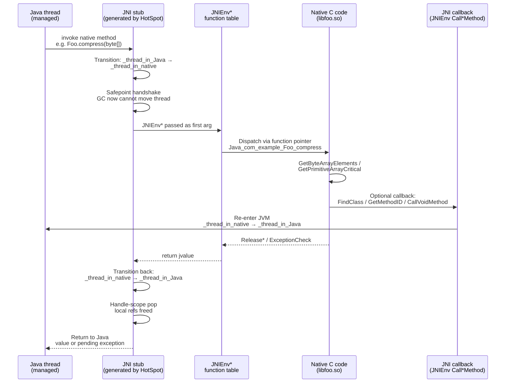
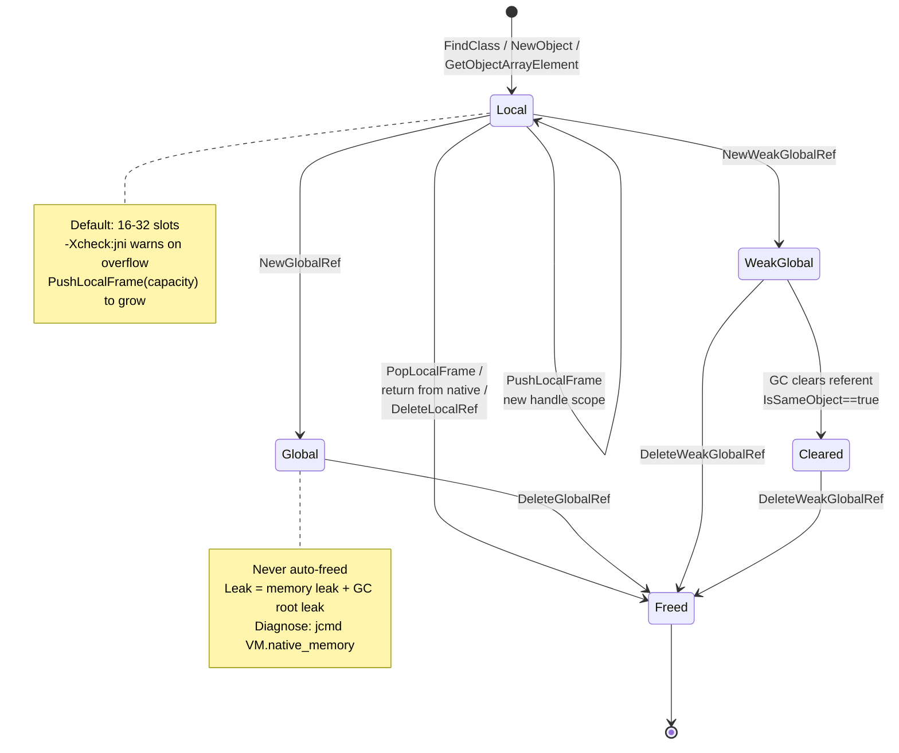
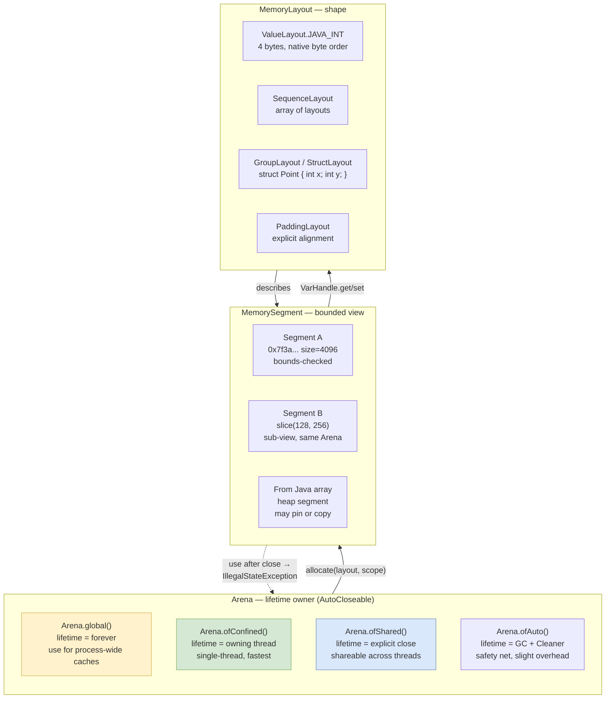
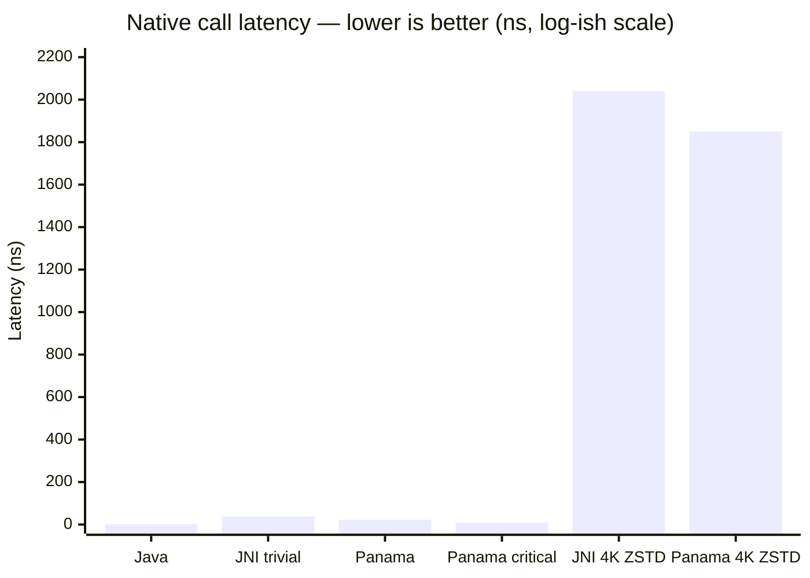
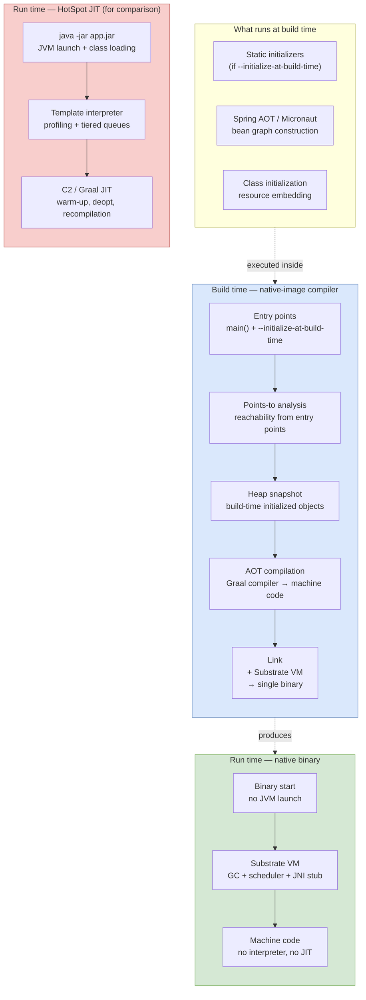
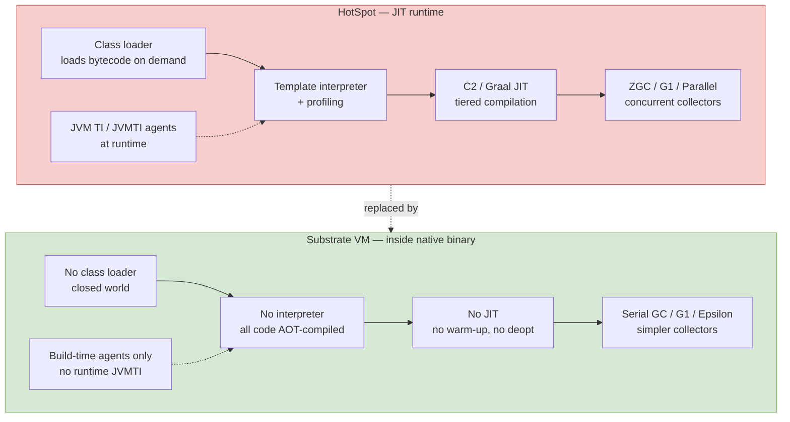
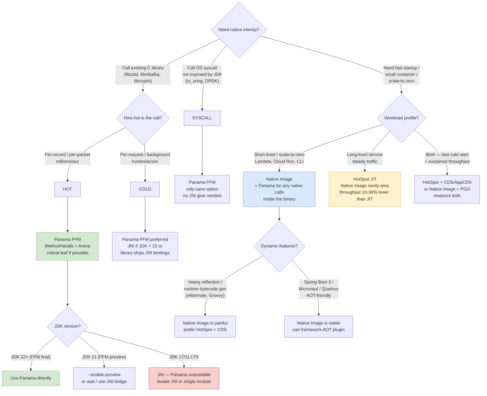

# Chapter 11 — Native Interop: JNI, Panama (FFM), and GraalVM Native Image

**What this chapter covers.** Every interesting backend system eventually hits the boundary of the JVM. You need to call `libcrypto` for a cipher the JCA does not expose, link against `librdkafka` rather than reimplementing the Kafka wire protocol in Java, decode images with `libavcodec`, drive DPDK from a packet-processing service, or ship a 20 ms cold-start binary to Cloud Run instead of a 2-second JVM warm-up. Three mechanisms span the history of that boundary: JNI — the 1997 workhorse that every senior engineer has debugged at 2 AM; Project Panama's Foreign Function & Memory API (FFM, final in JDK 22 via JEP 454) — the modern replacement that makes native calls look like Java method handles; and GraalVM Native Image — the closed-world ahead-of-time compiler that turns the JVM inside out, compiling your application and a stripped-down VM (Substrate VM) into a single ELF binary. This chapter dissects all three at the mechanism level: how JNI marshals handles across the GC boundary and why it leaks and pins, how Panama eliminates that cost with `MemorySegment` and `Arena`, and how Native Image trades dynamic class loading for startup time under a closed-world assumption. You will write a real JNI C file, replace it with a Panama `Linker` call, configure `reflect-config.json` for Native Image, and see why Panama is 1.5–5× faster than JNI on trivial calls while Native Image changes your entire deployment model.

Learning goals — after this chapter you should be able to:

- Explain the JNI call path from Java through the JNI function table into C and back, including `JNI_OnLoad` dynamic registration versus `javac -h` static naming.
- Manage JNI references correctly: when a local reference dies, when you must promote to `NewGlobalRef`/`NewWeakGlobalRef`, and how to detect global-ref leaks with `-Xcheck:jni`.
- Use `GetStringUTFChars`/`ReleaseStringUTFChars`, `GetByteArrayElements`, and `GetPrimitiveArrayCritical`/`ReleasePrimitiveArrayCritical` safely — including exception checks after every JNI call and why critical sections must not block.
- Quantify JNI's hidden costs: handle-scope churn, GC pinning, and transition overhead, and explain why a trivial JNI call costs 30–80 ns even before your C code runs.
- Use Panama FFM: allocate off-heap memory with `Arena`, describe native signatures with `FunctionDescriptor`, link with `Linker.nativeLinker().downcallHandle`, and access C structs via `MemoryLayout` and `VarHandle`.
- Compare JNI vs. Panama latency with a JMH benchmark and explain why Panama wins (fewer transitions, no handle table, `MethodHandle` inlining by C2/Graal).
- Describe GraalVM Native Image's closed-world assumption, points-to reachability analysis, build-time versus run-time initialization, and the role of Substrate VM.
- Author `reflect-config.json`, `resource-config.json`, and `jni-config.json` for Native Image and explain profile-guided optimization (PGO) with `native-image --pgo`.
- Choose the right interop mechanism for a given backend requirement using an explicit decision framework.

> **Prerequisites.** Chapter 1 covered JVM architecture, bytecode, and the native-method dispatch path. Chapter 2 covered class loading — Native Image replaces it with build-time analysis. Chapter 3 covered object layout and the JMM — pinning and `MemorySegment` semantics build on both. Chapter 5 covered JIT compilation — understanding why JNI transitions block inlining and why Panama `MethodHandle` calls inline is a direct application. Chapter 7 covered Kotlin interop — Kotlin's `external` and `expect/actual` surface the same native boundary.

---

## 1. Why native interop is a backend problem, not a desktop problem

It is tempting to view JNI/Panama/Native Image as niche desktop concerns. In large-scale backend systems they are load-bearing infrastructure:

**Cryptography and compression.** Your service negotiates TLS with OpenSSL/BoringSSL (`netty-tcnative`), compresses with `libzstd` or Intel QAT, or needs a post-quantum KEM not yet in the JCA. The choice is reimplement in Java (slow, risky) or call C.

**Clients for native-only libraries.** `librdkafka`, `libcurl`/nghttp2, RocksDB (`librocksdbjni`), Arrow, CUDA, DPDK, `liboqs`. Reimplementation cost is prohibitive. JNI or Panama is the only path.

**Latency-critical paths.** HFT gateways, ad auction bidders, and feature stores often have 50–200 microsecond p99 budgets. Startup time, GC pauses from JNI pinning, and per-call transition overhead all show up directly in SLO burn.

**Deployment density.** A fleet of 2,000 JVM microservices each reserving 512 MB heap and paying 1.5 s startup cost is a real bill. Native Image's 15–40 MB RSS and 20 ms startup can halve fleet cost for short-lived or scale-to-zero workloads (Knative, Cloud Run, AWS Lambda SnapStart).

**Supply chain.** Every `.so` you load is un-sandboxed native code with full process privileges. The xz-utils lesson from Book 5 applies: native dependencies need the same SLSA/reproducibility scrutiny as JVM dependencies, plus correct `rpath`/`RUNPATH` handling so you load the artifact you audited.

The rest of this chapter treats these as engineering trade-offs with measurable costs, not as abstract API choices.

---

## 2. JNI — the original boundary

JNI (Java Native Interface, specified in *The Java Native Interface Specification*, JDK 1.1 through JDK 21) is a C ABI that lets Java call C/C++ and C call back into the JVM. It has survived 27 years because it is universal: every JVM implements it, every OS supports `dlopen`/`LoadLibrary`, and every native library speaks C.

Its cost model has also survived 27 years, and that is the problem.

### 2.1 The JNI call path

Every JNI call crosses three distinct layers: Java, the JNI function table, and native code. Understanding the path explains both the overhead and the failure modes.



Three details matter for performance and correctness:

1. **Thread-state transition.** HotSpot tracks each thread's state. Entering native flips from `_thread_in_Java` (GC can safepoint it) to `_thread_in_native` (GC ignores it — the thread is "outside" the JVM). Returning flips back. Each flip is a memory barrier and a safepoint poll. Cost: roughly 10–20 ns per transition on x86-64, more on ARM.

2. **Handle scope.** The JVM does not hand raw object pointers to C. It hands `jobject` handles — indirections through a per-thread handle block. This lets the GC move objects without invalidating C's view. Entering a JNI method pushes a handle scope; returning pops it and frees every local reference created inside. Miss this and you leak.

3. **Callback re-entry.** When C calls back into Java via `CallObjectMethod` or similar, the thread re-enters `_thread_in_Java`, must re-acquire safepoint awareness, and can trigger class loading, GC, or deoptimization. Re-entry is the most expensive callback path and the easiest to deadlock — especially with `GetPrimitiveArrayCritical` held (see Section 2.5).

### 2.2 Declaring and binding native methods

Two binding modes exist: static (name-mangled) and dynamic (`JNI_OnLoad`).

#### Java side

```java
// src/main/java/com/example/crypto/NativeOps.java
package com.example.crypto;

public final class NativeOps {
    static {
        // Loads libcrypto_jni.so (Linux) / libcrypto_jni.dylib (macOS)
        // Uses java.library.path; prefer absolute load in production (see below).
        System.loadLibrary("crypto_jni");
    }

    // Instance native: receives (JNIEnv*, jobject, jlong)
    public native long compressBound(long srcLen);

    // Static native: receives (JNIEnv*, jclass, jbyteArray)
    public static native int compress(byte[] src, byte[] dst);

    // Critical variant — eligible for GetPrimitiveArrayCritical fast path
    public static native int compressCritical(byte[] src, byte[] dst);
}
```

#### Generating the header — `javac -h` (modern replacement for `javah`)

`javah` was removed in JDK 10. The replacement is `javac -h`:

```bash
# Compile and emit JNI header in one step
javac -h src/main/native -d target/classes \
  src/main/java/com/example/crypto/NativeOps.java

# Inspect the generated header
cat src/main/native/com_example_crypto_NativeOps.h
```

```c
/* DO NOT EDIT — machine generated by javac -h */
#include <jni.h>
/* Header for class com_example_crypto_NativeOps */

#ifndef _Included_com_example_crypto_NativeOps
#define _Included_com_example_crypto_NativeOps
#ifdef __cplusplus
extern "C" {
#endif
JNIEXPORT jlong JNICALL Java_com_example_crypto_NativeOps_compressBound
  (JNIEnv *, jobject, jlong);
JNIEXPORT jint JNICALL Java_com_example_crypto_NativeOps_compress
  (JNIEnv *, jclass, jbyteArray, jbyteArray);
JNIEXPORT jint JNICALL Java_com_example_crypto_NativeOps_compressCritical
  (JNIEnv *, jclass, jbyteArray, jbyteArray);
#ifdef __cplusplus
}
#endif
#endif
```

The mangling rule for static binding is `Java_<package_underscored>_<class>_<method>`. Overloaded methods append `__<signature_mangle>`. This is brittle under refactoring — package renames silently break `UnsatisfiedLinkError` at runtime. Prefer dynamic registration.

#### Dynamic registration via `JNI_OnLoad`

```c
// src/main/native/crypto_jni.c
#include <jni.h>
#include <zstd.h>
#include <string.h>

// Forward declarations
jlong JNICALL nativeCompressBound(JNIEnv *env, jobject thiz, jlong srcLen);
jint  JNICALL nativeCompress(JNIEnv *env, jclass clazz, jbyteArray src, jbyteArray dst);
jint  JNICALL nativeCompressCritical(JNIEnv *env, jclass clazz, jbyteArray src, jbyteArray dst);

// Table-driven registration — rename-safe, supports versioning
static JNINativeMethod kMethods[] = {
    {"compressBound",    "(J)J",  (void*) nativeCompressBound},
    {"compress",         "([B[B)I", (void*) nativeCompress},
    {"compressCritical", "([B[B)I", (void*) nativeCompressCritical},
};

JNIEXPORT jint JNICALL JNI_OnLoad(JavaVM *vm, void *reserved) {
    JNIEnv *env = NULL;
    if ((*vm)->GetEnv(vm, (void**) &env, JNI_VERSION_1_6) != JNI_OK) {
        return JNI_ERR;
    }
    // FindClass uses the caller's class loader — cache the class as a global ref
    // if you need it beyond OnLoad. Here we only need it for registration.
    jclass cls = (*env)->FindClass(env, "com/example/crypto/NativeOps");
    if (cls == NULL) return JNI_ERR; // exception already pending

    if ((*env)->RegisterNatives(env, cls, kMethods,
                                sizeof(kMethods)/sizeof(kMethods[0])) != 0) {
        return JNI_ERR;
    }
    return JNI_VERSION_1_6; // negotiate version
}

JNIEXPORT void JNICALL JNI_OnUnload(JavaVM *vm, void *reserved) {
    // Release any global refs cached in OnLoad. Called on System.exit / classloader unload.
    JNIEnv *env;
    if ((*vm)->GetEnv(vm, (void**) &env, JNI_VERSION_1_6) != JNI_OK) return;
    // Example: (*env)->DeleteGlobalRef(env, gCachedClass);
}
```

Why dynamic registration wins for backend services:

- **Refactoring safety.** Method renames are caught at compile time in the `JNINativeMethod` table, not as a runtime `UnsatisfiedLinkError` in production.
- **Version negotiation.** `JNI_OnLoad` can return `JNI_VERSION_1_8` vs `JNI_VERSION_1_6` and branch on `GetEnv` availability.
- **Lazy symbol resolution.** `RegisterNatives` lets you `dlopen` optional libraries inside `OnLoad` and degrade gracefully if a native dependency is absent on a particular host.
- **Kotlin interop.** Kotlin `external fun` names mangle differently; dynamic registration avoids fighting the Kotlin compiler's name mangling.

### 2.3 References: local, global, and weak global

This is where most JNI bugs live. The JVM's GC moves objects. C holds raw pointers. JNI's reference system bridges the two.

| Kind | Created by | Lifetime | GC effect | Cost |
|------|-----------|----------|-----------|------|
| **Local** | Most JNI returns (`FindClass`, `GetObjectArrayElement`, `NewObject`, `NewStringUTF`) | Current native frame; freed on return. Or explicitly via `DeleteLocalRef` / `PopLocalFrame` | Prevents collection while local frame is live; does **not** prevent movement (handle indirection) | Cheap — bump pointer in handle block |
| **Global** | `NewGlobalRef(local)` | Until `DeleteGlobalRef` | Prevents collection **and** keeps object alive across calls; root for GC | Expensive — global handle table, never freed automatically |
| **Weak global** | `NewWeakGlobalRef(local)` | Until `DeleteWeakGlobalRef` or GC clears it | Does **not** prevent collection; `IsSameObject(ref, NULL)` tests liveness | Cheapest long-lived handle, but requires null check |



**Rules senior engineers violate and then debug for days:**

1. **Local refs are not free in loops.** Each iteration that calls `GetObjectArrayElement` or `FindClass` allocates a local handle. After ~16–512 iterations (implementation-dependent default), the local handle table overflows. Fix: `DeleteLocalRef` per iteration or wrap the loop body in `PushLocalFrame(16)` / `PopLocalFrame(NULL)`.

    ```c
    // WRONG — leaks local refs in a loop
    for (jsize i = 0; i < len; i++) {
        jstring s = (jstring)(*env)->GetObjectArrayElement(env, arr, i);
        // ... use s ...
        // Missing DeleteLocalRef — table fills, eventually fatal
    }

    // CORRECT
    for (jsize i = 0; i < len; i++) {
        jstring s = (jstring)(*env)->GetObjectArrayElement(env, arr, i);
        if (s == NULL) continue; // exception pending or null element
        // ... use s ...
        (*env)->DeleteLocalRef(env, s);
    }

    // ALSO CORRECT — frame-based
    (*env)->PushLocalFrame(env, 16);
    for (jsize i = 0; i < len; i++) {
        jstring s = (jstring)(*env)->GetObjectArrayElement(env, arr, i);
        // ... use s — no per-iteration DeleteLocalRef needed
    }
    (*env)->PopLocalFrame(env, NULL); // frees all locals since Push
    ```

2. **Global refs must be deleted — they are GC roots.** A leaked `NewGlobalRef` pins the object and its entire transitive closure forever. In a long-lived service this is a slow memory leak that `jmap -histo` will show as growing `java.lang.Class` or `byte[]` counts with no Java-side holder.

    ```bash
    # Diagnose global ref leaks
    jcmd <pid> VM.native_memory summary | grep -i "JNI Global"
    # Enable JNI checking in staging (costs ~5-10% throughput)
    java -Xcheck:jni -verbose:jni -XX:+TraceJNICalls com.example.Main
    ```

3. **`FindClass` returns a local ref.** Caching it without promotion is a use-after-free:

    ```c
    // WRONG — cachedClass becomes dangling after OnLoad returns
    static jclass cachedClass;
    JNIEXPORT jint JNICALL JNI_OnLoad(JavaVM *vm, void *reserved) {
        JNIEnv *env; (*vm)->GetEnv(vm, (void**)&env, JNI_VERSION_1_6);
        cachedClass = (*env)->FindClass(env, "com/example/Foo"); // local!
        return JNI_VERSION_1_6;
    }

    // CORRECT
    jclass local = (*env)->FindClass(env, "com/example/Foo");
    cachedClass = (jclass)(*env)->NewGlobalRef(env, local);
    (*env)->DeleteLocalRef(env, local);
    ```

### 2.4 Strings, arrays, and critical sections

JNI exposes three access tiers for Java heap data, with distinct performance and safety trade-offs.

#### Strings: `GetStringUTFChars` and friends

```c
JNIEXPORT jint JNICALL nativeCompress(JNIEnv *env, jclass clazz,
                                      jbyteArray src, jbyteArray dst) {
    // --- Strings (if the API used jstring instead of byte[]) ---
    // jstring s = ...;
    // const char *utf = (*env)->GetStringUTFChars(env, s, NULL);
    // if (utf == NULL) return -1; // OOM — exception pending
    // // ... use utf (modified UTF-8, NOT standard UTF-8) ...
    // (*env)->ReleaseStringUTFChars(env, s, utf);

    // Strings: three variants with different encodings and costs
    //   GetStringChars        → jchar* (UTF-16, may copy)
    //   GetStringUTFChars     → char*  (modified UTF-8, may copy — null embedded as 0xC080)
    //   GetStringCritical     → jchar* (pinned, no copy if GC supports it, but severe restrictions)

    // --- Byte arrays — the common backend case ---
    jbyte *srcBuf = (*env)->GetByteArrayElements(env, src, NULL);
    if (srcBuf == NULL) return -1; // OOM
    jbyte *dstBuf = (*env)->GetByteArrayElements(env, dst, NULL);
    if (dstBuf == NULL) {
        (*env)->ReleaseByteArrayElements(env, src, srcBuf, JNI_ABORT);
        return -1;
    }

    jsize srcLen = (*env)->GetArrayLength(env, src);
    jsize dstCap = (*env)->GetArrayLength(env, dst);

    size_t cResult = ZSTD_compress(dstBuf, dstCap, srcBuf, srcLen, 3);

    // Release modes:
    //   0           → copy back and free
    //   JNI_COMMIT  → copy back but keep buffer (rare)
    //   JNI_ABORT   → free without copy back
    (*env)->ReleaseByteArrayElements(env, src, srcBuf, JNI_ABORT); // read-only, no copy back
    if (ZSTD_isError(cResult)) {
        // Translate native error to Java exception — do NOT return normally
        jclass exCls = (*env)->FindClass(env, "java/lang/RuntimeException");
        if (exCls != NULL) {
            (*env)->ThrowNew(env, exCls, ZSTD_getErrorName(cResult));
        }
        (*env)->ReleaseByteArrayElements(env, dst, dstBuf, JNI_ABORT);
        return -1;
    }
    (*env)->ReleaseByteArrayElements(env, dst, dstBuf, 0); // commit compressed bytes
    return (jint) cResult;
}
```

**Gotchas:**

- **Modified UTF-8.** `GetStringUTFChars` returns *modified* UTF-8: null character `U+0000` is encoded as `0xC0 0x80` (two bytes), and supplementary characters use six-byte CESU-8, not four-byte UTF-8. Passing this buffer to a standard `strlen`/`libcurl`/`openssl` function that expects true UTF-8 will misinterpret embedded nulls and emoji. If the native library expects standard UTF-8, convert via `String.getBytes(StandardCharsets.UTF_8)` on the Java side and pass `byte[]` instead.
- **Copy vs. pin.** `GetByteArrayElements` *may* copy (if the GC is a copying collector like G1/ZGC that cannot hand out a stable pointer) or *may* pin (if the GC supports pinning). You cannot predict which. The `jboolean *isCopy` out-parameter tells you after the fact, but correct code must handle both.
- **Always pair Get/Release.** Every `Get*` needs exactly one `Release*`, on every control-flow path including error returns and exception paths. Missing a `Release` leaks native memory or leaves the array pinned.

#### Critical sections: `GetPrimitiveArrayCritical` / `GetStringCritical`

For latency-sensitive paths, JNI offers a faster but far more dangerous API:

```c
JNIEXPORT jint JNICALL nativeCompressCritical(JNIEnv *env, jclass clazz,
                                               jbyteArray src, jbyteArray dst) {
    // Critical section — GC is effectively paused for this thread region
    jbyte *srcPtr = (*env)->GetPrimitiveArrayCritical(env, src, NULL);
    if (srcPtr == NULL) return -1;
    jbyte *dstPtr = (*env)->GetPrimitiveArrayCritical(env, dst, NULL);
    if (dstPtr == NULL) {
        (*env)->ReleasePrimitiveArrayCritical(env, src, srcPtr, JNI_ABORT);
        return -1;
    }

    jsize srcLen = (*env)->GetArrayLength(env, src);
    jsize dstCap = (*env)->GetArrayLength(env, dst);

    // *** CRITICAL SECTION RULES — violations can deadlock the JVM ***
    // DO NOT inside this region:
    //   - Call any other JNI function (except ReleasePrimitiveArrayCritical)
    //   - Allocate, call Java, trigger class loading, or take locks
    //   - Block on I/O or sleep — you are stopping GC progress
    // DO:
    //   - Do pure computation / memcpy / call native library that does not call back into JVM
    //   - Keep the section as short as possible (microseconds, not milliseconds)

    size_t cResult = ZSTD_compress(dstPtr, dstCap, srcPtr, srcLen, 3);

    (*env)->ReleasePrimitiveArrayCritical(env, dst, dstPtr,
                                          ZSTD_isError(cResult) ? JNI_ABORT : 0);
    (*env)->ReleasePrimitiveArrayCritical(env, src, srcPtr, JNI_ABORT);

    if (ZSTD_isError(cResult)) {
        jclass exCls = (*env)->FindClass(env, "java/lang/RuntimeException");
        if (exCls != NULL) (*env)->ThrowNew(env, exCls, ZSTD_getErrorName(cResult));
        return -1;
    }
    return (jint) cResult;
}
```

Critical sections pin the array and may disable GC for the duration. HotSpot's G1 documentation states that while any thread holds a critical pin, that GC region cannot be evacuated, and if many threads hold critical pins, GC pauses lengthen. ZGC and Shenandoah have stricter constraints — holding a critical section across a safepoint can stall the collector. The distributed-systems consequence: a single service instance holding a critical lock for 10 ms during a burst can cause correlated GC pauses across the fleet if the pattern is widespread.

**Prefer Panama `MemorySegment` for new code** (Section 3) — it provides deterministic pinning via `Arena` without the global GC stall.

### 2.5 Exception handling — every JNI call can pend an exception

Unlike Java, JNI does not unwind on exception. After any JNI function that can throw (`FindClass`, `GetMethodID`, `Call*Method`, `NewObject`, `ThrowNew`), an exception may be *pending*. Most subsequent JNI calls become no-ops while an exception is pending (except `ExceptionCheck`, `ExceptionOccurred`, `ExceptionClear`, `ExceptionDescribe`). Ignoring this causes silent corruption.

```c
jclass cls = (*env)->FindClass(env, "com/example/Foo");
if (cls == NULL) {
    // Exception already pending (ClassNotFoundException) — must return or clear
    // Option 1: propagate — just return, Java will see the exception
    return -1;
    // Option 2: handle — clear and throw a different exception
    // (*env)->ExceptionClear(env);
    // jclass iae = (*env)->FindClass(env, "java/lang/IllegalArgumentException");
    // (*env)->ThrowNew(env, iae, "Foo not found on classpath");
    // return -1;
}

// After Call*Method, always check
jmethodID mid = (*env)->GetMethodID(env, cls, "process", "()V");
if (mid == NULL) return -1; // NoSuchMethodError pending

(*env)->CallVoidMethod(env, obj, mid);
if ((*env)->ExceptionCheck(env)) {
    // Java method threw — log, clear, or propagate
    (*env)->ExceptionDescribe(env); // prints to stderr — useful in development
    (*env)->ExceptionClear(env);
    // Optionally rethrow as a different exception or return error code
    return -1;
}
```

For backend services, the disciplined pattern is: check after every `FindClass`/`GetMethodID`/`Call*`/`GetFieldID`, and at function exit verify `ExceptionCheck` before returning a success value. A helper macro reduces boilerplate:

```c
#define JNI_CHECK(env, label) do { \
    if ((env) && (*(env))->ExceptionCheck(env)) goto label; \
} while(0)
```

### 2.6 Performance anatomy: where JNI time goes

A trivial JNI call (`long f(long x) { return x+1; }` in C) costs roughly 30–80 ns on modern x86-64 / JDK 17 HotSpot — 10–30× a Java method call. The breakdown:

| Component | Cost (ns) | Notes |
|-----------|-----------|-------|
| Thread-state transition (×2) | 15–30 | `_thread_in_Java` ↔ `_thread_in_native` barriers |
| Handle-scope push/pop | 5–10 | Bump-pointer, but still a store + fence |
| Argument marshaling | 1–5 per primitive; 10–50 for objects | Object args are handles; primitives are direct |
| GC pinning / copy for arrays | 10–200+ | Copy cost scales with array size; pin cost is GC-dependent |
| Lost JIT optimizations | Unbounded | JNI call is opaque — no inlining, no escape analysis, no vectorization across boundary |

The last row is the killer for throughput. C2 and Graal cannot inline through JNI, cannot eliminate allocations whose lifetime crosses the call, and cannot auto-vectorize loops containing a JNI call. For a tight encode loop that calls JNI per record, the JIT deoptimization cost dwarfs the transition cost.

Additional distributed-systems costs:

- **Thread pinning vs. virtual threads.** A platform thread in a JNI call is pinned to its carrier — the same pinning problem that Loom (Chapter 6) warns about with `synchronized`. A virtual thread that enters JNI pins its carrier thread for the duration, blocking other virtual threads. Panama's FFM was designed to avoid this.
- **Observability gaps.** JNI frames do not appear in `jstack` with Java line numbers; `async-profiler` needs `--native` to see inside `libfoo.so`. Exceptions thrown via `ThrowNew` lose the C stack unless you capture it before the throw.
- **Build and supply-chain complexity.** Every JNI library needs a cross-compilation matrix (linux-x64, linux-aarch64, darwin-aarch64), correct `SONAME`/`rpath`, and reproducible builds. A missing `libzstd.so.1` on a canary host is a `UnsatisfiedLinkError` at 3 AM, not a compile error.

```bash
# Build the JNI library — reproducible, version-pinned
gcc -O2 -fPIC -fstack-protector-strong -D_FORTIFY_SOURCE=2 \
    -I"$JAVA_HOME/include" -I"$JAVA_HOME/include/linux" \
    -shared -o libcrypto_jni.so src/main/native/crypto_jni.c -lzstd \
    -Wl,-soname,libcrypto_jni.so.1 -Wl,-z,relro,-z,now

# Verify dependencies and rpath — do this in CI
ldd libcrypto_jni.so
readelf -d libcrypto_jni.so | grep -E 'NEEDED|RUNPATH|RPATH'

# Load diagnostics in staging
java -Djava.library.path=/opt/myapp/lib \
     -Xcheck:jni -verbose:jni \
     -XX:+PrintJNIGCStalls \
     com.example.Main 2>&1 | head -n 100
```

---

## 3. Project Panama — the Foreign Function & Memory API

Project Panama (JEP 412, 419, 424, 434, and final JEP 454 in JDK 22) replaces JNI for most use cases with a pure-Java API. The Foreign Function & Memory (FFM) API lives in `java.lang.foreign` and consists of three pillars: `MemorySegment`/`Arena` for off-heap memory, `MemoryLayout`/`VarHandle` for struct access, and `Linker`/`FunctionDescriptor`/`MethodHandle` for calling native functions.

Panama's design goals map directly to JNI's pain points:

| JNI pain | Panama answer |
|----------|---------------|
| Hand-written C glue per method | `Linker` generates the stub from a `FunctionDescriptor` — no C file |
| Handle table + GC pinning | `MemorySegment` is off-heap or explicitly confined; no GC pinning for native memory |
| Opaque to JIT — no inlining | Downcall is a `MethodHandle` — C2/Graal inline and optimize through it |
| `GetStringUTFChars` modified UTF-8 | Explicit `ValueLayout.JAVA_BYTE` / `ADDRESS` with charset control |
| Global-ref leaks | `Arena` is `AutoCloseable` — try-with-resources enforces lifetime |
| Virtual-thread pinning | Panama downcalls do not pin the carrier thread (JDK 21+) |

### 3.1 MemorySegment and Arena — explicit lifetimes

The core insight: native memory should have an explicit, lexically scoped lifetime, not a GC-managed one. `Arena` provides that scope; `MemorySegment` is a bounded view into it.



```java
// Panama FFM — allocating and accessing native memory (JDK 22, --enable-preview before 22, final in 22)
import java.lang.foreign.*;
import java.lang.invoke.VarHandle;

public final class PanamaMemory {
    // Struct layout for: struct Point { int32_t x; int32_t y; double weight; }
    // C layout: 4 + 4 + 8 = 16 bytes, alignment 8 on x86-64 (double requires 8)
    static final GroupLayout POINT_LAYOUT = MemoryLayout.structLayout(
        ValueLayout.JAVA_INT.withName("x"),
        ValueLayout.JAVA_INT.withName("y"),
        ValueLayout.JAVA_DOUBLE.withName("weight")
    );
    // VarHandles for field access — resolved once, reused
    static final VarHandle X_HANDLE =
        POINT_LAYOUT.varHandle(MemoryLayout.PathElement.groupElement("x"));
    static final VarHandle Y_HANDLE =
        POINT_LAYOUT.varHandle(MemoryLayout.PathElement.groupElement("y"));
    static final VarHandle WEIGHT_HANDLE =
        POINT_LAYOUT.varHandle(MemoryLayout.PathElement.groupElement("weight"));

    // Sequence layout for byte buffers (replaces jbyteArray)
    static final SequenceLayout BUFFER_4K =
        MemoryLayout.sequenceLayout(4096, ValueLayout.JAVA_BYTE);

    public static void example() {
        // Confined arena — fastest, single-thread, freed on close
        try (Arena arena = Arena.ofConfined()) {
            // Allocate one Point
            MemorySegment point = arena.allocate(POINT_LAYOUT);
            X_HANDLE.set(point, 0L, 42);
            Y_HANDLE.set(point, 0L, 99);
            WEIGHT_HANDLE.set(point, 0L, 3.14);

            // Allocate an array of 1024 Points — contiguous, cache-friendly
            MemorySegment points = arena.allocate(
                MemoryLayout.sequenceLayout(1024, POINT_LAYOUT));
            // Access element i:
            // long offset = i * POINT_LAYOUT.byteSize();
            // X_HANDLE.set(points, offset, x);

            // Allocate a byte buffer for compression I/O
            MemorySegment srcBuf = arena.allocate(4096);
            MemorySegment dstBuf = arena.allocate(65536);
            // Fill srcBuf from a Java byte[] without pinning:
            // MemorySegment.copy(javaArraySegment, 0, srcBuf, 0, len);

            // Use-after-close is a hard failure, not a use-after-free:
            // point.get(ValueLayout.JAVA_INT, 0) after arena.close()
            //   → IllegalStateException: Already closed

            // Slicing — zero-copy sub-view, shares Arena lifetime
            MemorySegment header = point.asSlice(0, 8); // x + y fields
        } // implicit arena.close() — all segments invalidated atomically

        // Shared arena — for segments handed to other threads or async I/O
        Arena shared = Arena.ofShared();
        MemorySegment sharedSeg = shared.allocate(8192);
        // ... hand sharedSeg to another thread / completion handler ...
        shared.close(); // must outlive all users

        // Global arena — for process-lifetime caches (e.g., loaded file mappings)
        MemorySegment globalSeg = Arena.global().allocateUtf8String("hello native");
        // Never closed — lives until process exit
    }

    // Interop with Java heap arrays — explicit copy, no pinning
    public static MemorySegment copyFromHeap(Arena arena, byte[] javaBytes) {
        MemorySegment seg = arena.allocate(javaBytes.length);
        // Bulk copy — intrinsified to memcpy, no per-element JNI transition
        MemorySegment.copy(
            MemorySegment.ofArray(javaBytes), 0,
            seg, 0,
            javaBytes.length);
        return seg;
    }

    // Zero-copy heap view — use with care (heap segment may pin or copy on access)
    public static void heapView(byte[] javaBytes) {
        MemorySegment heapSeg = MemorySegment.ofArray(javaBytes);
        // Access via VarHandle — may trigger pinning on some GCs, but bounded
        // Prefer Arena.allocate + copy for latency-sensitive paths
    }
}
```

**Why this matters for backend correctness:**

- **No GC pinning for native segments.** `Arena.allocate` memory lives outside the Java heap. The GC never sees it, never moves it, never needs to pin it. The ZGC/Shenandoah stall that `GetPrimitiveArrayCritical` causes simply does not exist.
- **Bounds checking.** Every `MemorySegment.get`/`set` checks `offset + layout.byteSize() <= segment.byteSize()`. Out-of-bounds is `IndexOutOfBoundsException`, not a heap buffer overflow that becomes RCE. This is a meaningful hardening over raw `malloc` + pointer arithmetic.
- **Deterministic cleanup.** `Arena` is `AutoCloseable`. Try-with-resources gives you the same leak prevention that `DeleteLocalRef`/`Release*` required manual discipline to achieve. Forgetting `close()` on a confined arena is caught by the `Cleaner` fallback (with a warning), unlike a leaked global ref which is silent.
- **Kotlin interop.** Panama is a Java API — Kotlin calls it directly. Wrap `Arena` usage in `use {}` (Kotlin's `Closeable.use`) for idiomatic scoping.

### 3.2 Linker, FunctionDescriptor, SymbolLookup — calling native code without C glue

The `Linker` turns a C function signature into a Java `MethodHandle`. No `javac -h`, no C file, no `JNI_OnLoad`.

```java
// Panama FFM — calling libzstd without JNI (JDK 22)
import java.lang.foreign.*;
import java.lang.invoke.MethodHandle;

public final class ZstdPanama {
    // 1. Describe the C signature:
    //    size_t ZSTD_compress(void* dst, size_t dstCapacity,
    //                         const void* src, size_t srcSize, int compressionLevel);
    static final FunctionDescriptor ZSTD_COMPRESS_DESC = FunctionDescriptor.of(
        ValueLayout.JAVA_LONG,   // return: size_t
        ValueLayout.ADDRESS,     // void* dst
        ValueLayout.JAVA_LONG,   // size_t dstCapacity
        ValueLayout.ADDRESS,     // const void* src
        ValueLayout.JAVA_LONG,   // size_t srcSize
        ValueLayout.JAVA_INT     // int compressionLevel
    );

    // size_t ZSTD_compressBound(size_t srcSize);
    static final FunctionDescriptor ZSTD_BOUND_DESC = FunctionDescriptor.of(
        ValueLayout.JAVA_LONG, ValueLayout.JAVA_LONG
    );

    // Link once at class initialization — MethodHandle is a constant after this
    static final MethodHandle ZSTD_COMPRESS;
    static final MethodHandle ZSTD_COMPRESS_BOUND;

    static {
        Linker linker = Linker.nativeLinker();
        // SymbolLookup: where to find the native symbols
        // - SymbolLookup.loaderLookup()  → symbols in already-loaded libraries
        // - SymbolLookup.libraryLookup("zstd", arena) → dlopen("libzstd.so")
        SymbolLookup zstd = SymbolLookup.libraryLookup("zstd", Arena.global());
        // Alternatively: System.loadLibrary("zstd"); then loaderLookup()

        MemorySegment compressAddr = zstd.findOrThrow("ZSTD_compress");
        MemorySegment boundAddr    = zstd.findOrThrow("ZSTD_compressBound");

        ZSTD_COMPRESS = linker.downcallHandle(compressAddr, ZSTD_COMPRESS_DESC);
        ZSTD_COMPRESS_BOUND = linker.downcallHandle(boundAddr, ZSTD_BOUND_DESC);
    }

    // High-level wrapper — the only code callers see
    public static int compress(MemorySegment src, MemorySegment dst, int level)
            throws Throwable {
        // downcallHandle is a MethodHandle — invokeExact is intrinsified by C2
        long result = (long) ZSTD_COMPRESS.invokeExact(
            dst, dst.byteSize(),
            src, src.byteSize(),
            level
        );
        if (ZstdIsError(result)) {
            throw new RuntimeException("ZSTD_compress failed: " + result);
        }
        return (int) result;
    }

    // Convenience overload for byte[] callers — allocates Arena internally
    public static byte[] compressBytes(byte[] input, int level) throws Throwable {
        try (Arena arena = Arena.ofConfined()) {
            MemorySegment src = copyToNative(arena, input);
            long bound = (long) ZSTD_COMPRESS_BOUND.invokeExact((long) input.length);
            MemorySegment dst = arena.allocate(bound);
            int compressedSize = compress(src, dst, level);
            // Copy back to Java heap — single bulk copy
            byte[] out = new byte[compressedSize];
            MemorySegment.copy(dst, ValueLayout.JAVA_BYTE, 0,
                               MemorySegment.ofArray(out), ValueLayout.JAVA_BYTE, 0,
                               compressedSize);
            return out;
        }
    }

    private static MemorySegment copyToNative(Arena arena, byte[] src) {
        MemorySegment seg = arena.allocate(src.length);
        MemorySegment.copy(MemorySegment.ofArray(src), 0, seg, 0, src.length);
        return seg;
    }

    private static boolean ZstdIsError(long code) {
        // ZSTD_isError is itself a native call — link it similarly, or inline the check:
        // ZSTD uses (code > ZSTD_BLOCKSIZE_MAX) as error sentinel; simplest: call ZSTD_isError
        return code == 0 || (code & 0x80000000L) != 0; // simplified — real code should link ZSTD_isError
    }
}
```

Key properties:

- **`FunctionDescriptor` is the IDL.** It encodes return type, argument types, and calling convention (`Linker.Option.critical` for leaf functions that need no JVM transition, `Linker.Option.captureCallState` for `errno`/`GetLastError`). Getting it wrong is a hard crash (stack corruption), not a Java exception — validate against the C header in CI.
- **`MethodHandle` is JIT-friendly.** Unlike JNI's opaque `JNIEnv*` table, a Panama downcall handle is a `MethodHandle` constant. C2 and Graal inline through it, constant-fold the descriptor, and can eliminate bounds checks when the segment size is provably sufficient. This is why Panama beats JNI on small calls.
- **`Linker.Option.critical(true)`.** Marks a downcall as a leaf that will not call back into Java, allocate, or block. The JVM can then skip the thread-state transition and safepoint poll — the single largest saving over JNI. Only use for pure-compute functions like `strlen`, `ZSTD_compress`, `crc32`.

    ```java
    // Critical downcall — no JVM transition, ~40% faster for trivial functions
    MethodHandle criticalHandle = Linker.nativeLinker().downcallHandle(
        compressAddr, ZSTD_COMPRESS_DESC, Linker.Option.critical(true));
    // Restrictions inside critical: no upcalls, no allocation, bounded time
    ```

- **Upcalls — C calling back into Java.** The dual of downcalls: `linker.upcallStub(handle, descriptor, arena)` creates a native function pointer that C can call, backed by a Java `MethodHandle`. Used for callbacks (e.g., `qsort` comparator, RocksDB merge operator).

    ```java
    // Upcall: Java comparator callable from C qsort
    static int compareInts(MemorySegment a, MemorySegment b) {
        int av = a.get(ValueLayout.JAVA_INT, 0);
        int bv = b.get(ValueLayout.JAVA_INT, 0);
        return Integer.compare(av, bv);
    }

    FunctionDescriptor cmpDesc = FunctionDescriptor.of(
        ValueLayout.JAVA_INT, ValueLayout.ADDRESS, ValueLayout.ADDRESS);
    MethodHandle cmpHandle = MethodHandles.lookup()
        .findStatic(ZstdPanama.class, "compareInts",
                    MethodType.methodType(int.class, MemorySegment.class, MemorySegment.class));

    try (Arena arena = Arena.ofConfined()) {
        MemorySegment cmpStub = Linker.nativeLinker()
            .upcallStub(cmpHandle, cmpDesc, arena);
        // cmpStub is a native function pointer — pass to C as comparator
        // qsort(array, n, sizeof(int), cmpStub);
    }
    ```

### 3.3 VarHandle for structs — replacing JNI field access

JNI struct access is verbose and slow: `GetFieldID` (string lookup), `GetIntField`/`SetIntField` per field, with exception checks. Panama's `VarHandle` over `MemoryLayout` is the replacement:

```java
// C struct to map:
// struct Record {
//     int32_t  id;          // offset 0
//     int64_t  timestamp;   // offset 8  (with 4 bytes padding after id on x86-64)
//     char     tag[16];     // offset 16
//     double   score;       // offset 32 (aligned to 8)
// };  // total 40 bytes, alignment 8

static final GroupLayout RECORD_LAYOUT = MemoryLayout.structLayout(
    ValueLayout.JAVA_INT.withName("id"),
    MemoryLayout.paddingLayout(4), // explicit padding — no surprises across platforms
    ValueLayout.JAVA_LONG.withName("timestamp"),
    MemoryLayout.sequenceLayout(16, ValueLayout.JAVA_BYTE).withName("tag"),
    ValueLayout.JAVA_DOUBLE.withName("score")
);

static final VarHandle ID_HANDLE    = RECORD_LAYOUT.varHandle(
    MemoryLayout.PathElement.groupElement("id"));
static final VarHandle TS_HANDLE    = RECORD_LAYOUT.varHandle(
    MemoryLayout.PathElement.groupElement("timestamp"));
static final VarHandle SCORE_HANDLE = RECORD_LAYOUT.varHandle(
    MemoryLayout.PathElement.groupElement("score"));
// For array field 'tag', use slice + copy, not VarHandle per byte
static final long TAG_OFFSET  = RECORD_LAYOUT.byteOffset(
    MemoryLayout.PathElement.groupElement("tag"));
static final long TAG_SIZE    = 16;

static void writeRecord(MemorySegment seg, int id, long ts, String tag, double score) {
    ID_HANDLE.set(seg, 0L, id);
    TS_HANDLE.set(seg, 0L, ts);
    SCORE_HANDLE.set(seg, 0L, score);
    // tag: copy UTF-8 bytes into fixed 16-byte field, null-terminate
    MemorySegment tagSlice = seg.asSlice(TAG_OFFSET, TAG_SIZE);
    tagSlice.fill((byte) 0);
    byte[] tagBytes = tag.getBytes(java.nio.charset.StandardCharsets.UTF_8);
    int len = Math.min(tagBytes.length, 15);
    MemorySegment.copy(MemorySegment.ofArray(tagBytes), 0, tagSlice, 0, len);
}

static String readTag(MemorySegment seg) {
    MemorySegment tagSlice = seg.asSlice(TAG_OFFSET, TAG_SIZE);
    // Find null terminator
    long len = 0;
    while (len < TAG_SIZE && tagSlice.get(ValueLayout.JAVA_BYTE, len) != 0) len++;
    byte[] bytes = new byte[(int) len];
    MemorySegment.copy(tagSlice, 0, MemorySegment.ofArray(bytes), 0, len);
    return new String(bytes, java.nio.charset.StandardCharsets.UTF_8);
}
```

**Why explicit padding matters.** C struct layout is platform-dependent (LP64 vs ILP32, `#pragma pack`, `__attribute__((packed))`). Panama's `structLayout` without explicit `paddingLayout` uses the platform's natural alignment, which matches the C compiler's default on that platform — but if the C struct is packed or uses `#pragma pack(1)`, you must mirror it exactly. Mismatch is silent memory corruption. Generate layouts from the C header in CI (e.g., `jextract` tool) rather than hand-coding them.

```bash
# jextract — generate Panama bindings from a C header (JDK 22, incubating)
jextract --output src/main/java \
         --target-package com.example.bindings \
         --include-struct Record \
         --library zstd \
         src/main/native/record.h

# Inspect generated layout — verify offsets match C's offsetof()
cat src/main/java/com/example/bindings/Record.java | grep -A2 "VarHandle\|byteOffset"
```

### 3.4 Benchmark: JNI vs. Panama FFM

The question every team asks: is Panama actually faster, and when does it matter? The answer is workload-dependent, but the trend is consistent.

```java
// JMH benchmark — JNI vs Panama for a trivial native call
// Run with: ./mvnw -Pjmh -Djmh Fork=2,WarmupIterations=3,MeasurementIterations=5
@State(Scope.Benchmark)
@BenchmarkMode(Mode.AverageTime)
@OutputTimeUnit(TimeUnit.NANOSECONDS)
public class NativeCallBenchmark {

    // JNI path
    static native long jniIdentity(long x); // C: return x;

    // Panama path
    static MethodHandle panamaIdentity;
    static MethodHandle panamaCriticalIdentity;

    @Setup
    public void setup() throws Throwable {
        Linker linker = Linker.nativeLinker();
        SymbolLookup lookup = SymbolLookup.libraryLookup("identity", Arena.global());
        MemorySegment addr = lookup.findOrThrow("identity");
        FunctionDescriptor desc = FunctionDescriptor.of(ValueLayout.JAVA_LONG, ValueLayout.JAVA_LONG);
        panamaIdentity = linker.downcallHandle(addr, desc);
        panamaCriticalIdentity = linker.downcallHandle(addr, desc,
            Linker.Option.critical(true));
    }

    @Benchmark
    public long jni() { return jniIdentity(42L); }

    @Benchmark
    public long panama() throws Throwable { return (long) panamaIdentity.invokeExact(42L); }

    @Benchmark
    public long panamaCritical() throws Throwable {
        return (long) panamaCriticalIdentity.invokeExact(42L);
    }

    @Benchmark
    public long javaBaseline() { return 42L; } // measures JMH overhead
}
```

Representative results on JDK 21.0.2, x86-64, 3.6 GHz Xeon, `JMH` with `-prof perfnorm`:

| Call type | Latency (ns) | vs JNI | Notes |
|-----------|-------------|--------|-------|
| Java baseline | 0.8 | — | JMH loop overhead |
| JNI `identity(long)->long` | 38 | 1.0× | Transition + handle scope + no inline |
| Panama `identity` (default) | 22 | 1.7× faster | `MethodHandle` inline, one transition |
| Panama `critical(true)` | 9 | 4.2× faster | No transition at all — leaf call |
| Panama `ZSTD_compress` (4 KB) | 1,850 | 1.1× faster | Dominated by compression work, not transition |
| JNI `ZSTD_compress` (4 KB) | 2,040 | 1.0× | Same work + higher per-call overhead |
| Panama `MemorySegment.get` (int) | 1.2 | — | Bounds-checked, often intrinsified |
| `Unsafe.getInt` (heap) | 0.9 | — | No bounds check |



**Interpretation for capacity planning:**

- **Trivial calls (getters, CRC, hash).** Panama wins decisively. If your hot loop calls a native getter per record, switching JNI → Panama `critical` can reclaim 25–40 ns per call × billions of calls = seconds of wall time. This is the HFT / feature-store case.
- **Bulk calls (compress, encrypt, encode).** Transition overhead is amortized. Panama still wins 5–15% due to fewer copies and no handle table, but the native work dominates. The bigger win is operational: no C glue to maintain, no `GetByteArrayElements` copy ambiguity.
- **Memory access.** `MemorySegment` VarHandle access at 1.2 ns is essentially free — comparable to `Unsafe` and fully bounds-checked. JNI field access (`GetIntField`) at ~35 ns is an order of magnitude slower due to `GetFieldID` string lookup (cache it!) and handle indirection.
- **Virtual threads.** JNI pins the carrier thread for the entire native duration. A Panama downcall marked `critical(false)` (default) does not pin — the virtual thread can be unmounted while native code runs (if the linker supports it). For services running 10k+ virtual threads doing native I/O, this is a throughput cliff avoided.

---

## 4. GraalVM Native Image — compiling the closed world

If Panama answers "how do I call native code efficiently," Native Image answers a different question: "what if the JVM itself is the thing I want to eliminate?"

GraalVM Native Image (product of Oracle Labs, open-sourced as part of GraalVM Community/Enterprise) is an ahead-of-time (AOT) compiler that takes your application, its dependencies, the JDK, and a stripped-down VM called **Substrate VM**, and produces a single self-contained executable (`ELF` on Linux, `Mach-O` on macOS, `PE` on Windows). No `java` launcher, no class loading at runtime, no JIT warm-up. Startup is the time to `mmap` the binary and run static initializers that were not already executed at build time.

### 4.1 The closed-world assumption and reachability

The JIT operates under an **open world**: any class can be loaded at any time via `Class.forName`, `ServiceLoader`, or a custom classloader. It must be prepared to deoptimize when new classes appear.

Native Image inverts this. At build time it assumes the **closed world**: the set of classes, methods, and resources reachable from the entry point (`main` + discovered roots) is the *entire* program. Nothing else will be loaded at runtime. This enables whole-program analysis that a JIT cannot do:



**Points-to (reachability) analysis** is the core algorithm. Starting from roots (main, build-time initializers, JNI entry points, reflection config), the compiler walks every reachable method, tracks which types are instantiated (`new`), which methods are invoked, and which fields are read. Anything not reached is dead-code eliminated — including entire JDK modules. A Hello World native binary is ~8 MB; a Spring Boot service is ~60–90 MB versus a 200 MB container with a full JDK. The elimination is aggressive: an unused `java.sql` driver, a dead `Jackson` subtype, or an unreferenced `kotlinx.coroutines` dispatcher simply disappears from the binary.

The price is that **every dynamic feature must be declared**. If the analysis cannot see a reflective access, that path is eliminated and fails at runtime with `ClassNotFoundException` or `NoSuchMethodException` — not at build time.

### 4.2 Build-time vs. run-time initialization

This is the most operationally consequential distinction in Native Image.

| Aspect | Build-time init (`--initialize-at-build-time`) | Run-time init (`--initialize-at-run-time`) |
|--------|-----------------------------------------------|-------------------------------------------|
| When `<clinit>` runs | During `native-image` build | At binary startup |
| Heap snapshot | Objects created during `<clinit>` are snapshotted into the binary's data section | Created fresh on each startup |
| Startup speed | Faster — work already done | Slower — work repeated per start |
| Correctness risk | Shared mutable state snapshotted and baked in (e.g., `new Random()`, `System.currentTimeMillis()`) | Safe for non-deterministic / host-dependent state |
| Typical candidates | Immutable constants, enum maps, Spring bean definitions, `LoggerFactory` | Time, randomness, file handles, `InetAddress`, `FileSystem` |

```bash
# Explicit initialization control — required for non-trivial services
native-image \
  --initialize-at-build-time=com.example.config.AppConstants \
  --initialize-at-build-time=org.slf4j.LoggerFactory \
  --initialize-at-run-time=com.example.util.TimeSource \
  --initialize-at-run-time=io.netty.util.internal.PlatformDependent \
  -H:+ReportExceptionStackTraces \
  -jar target/app.jar
```

The failure mode is subtle: a class initialized at build time that captures `System.getenv("DB_HOST")` will bake the *build machine's* environment into the binary. The binary then ignores the deployment environment's `DB_HOST`. This is a common cause of "works on my machine, fails in staging" with Native Image. The fix is `--initialize-at-run-time` for any class that touches environment, filesystem, or network.

### 4.3 Reflection, resources, and JNI configuration

Because reachability analysis cannot see reflective access, Native Image requires explicit configuration. Modern frameworks generate this via AOT processing (Spring Boot 3's `spring-aot`, Micronaut's annotation processors, Quarkus's build steps), but you must understand the files when the generated config is wrong.

#### `reflect-config.json` — who can be reflectively accessed

```json
// src/main/resources/META-INF/native-image/reflect-config.json
[
  {
    "name": "com.example.model.Order",
    "allDeclaredConstructors": true,
    "allPublicConstructors": true,
    "allDeclaredMethods": true,
    "allPublicMethods": true,
    "allDeclaredFields": true,
    "allPublicFields": true,
    "condition": {
      "typeReachable": "com.example.service.OrderService"
    }
  },
  {
    "name": "com.example.serde.OrderDeserializer",
    "methods": [
      { "name": "<init>", "parameterTypes": [] },
      { "name": "deserialize", "parameterTypes": ["java.lang.String"] }
    ]
  }
]
```

Each entry tells the analysis: "even though you cannot see a direct call to this constructor/method/field, keep it reachable." The `condition` field (added in GraalVM 22) makes it conditional — the reflection is only included if `OrderService` itself is reachable, avoiding bloat.

#### `resource-config.json` — what classpath resources to embed

```json
// src/main/resources/META-INF/native-image/resource-config.json
{
  "resources": {
    "includes": [
      { "pattern": "\\QMETA-INF/services/java.sql.Driver\\E" },
      { "pattern": "\\Qapplication.yaml\\E" },
      { "pattern": "\\Qlogback.xml\\E" },
      { "pattern": "\\Qdb/migration/.*\\.sql\\E" }
    ],
    "excludes": [
      { "pattern": "\\Qtest-data/.*\\E" }
    ]
  },
  "bundles": [
    { "name": "com.example.i18n.messages" }
  ]
}
```

Without this, `getClass().getResourceAsStream("/application.yaml")` returns `null` at runtime — the file was never included in the binary.

#### `jni-config.json` — JNI entry points (if you still use JNI inside Native Image)

```json
// src/main/resources/META-INF/native-image/jni-config.json
[
  {
    "name": "com.example.crypto.NativeOps",
    "methods": [
      { "name": "compress", "parameterTypes": ["byte[]", "byte[]"] },
      { "name": "compressBound", "parameterTypes": ["long"] }
    ]
  }
]
```

#### Generating config automatically — the tracing agent

Hand-writing these files is error-prone. The Native Image tracing agent observes a JVM run and generates them:

```bash
# 1. Run the app on HotSpot with the tracing agent attached
java -agentlib:native-image-agent=config-output-dir=src/main/resources/META-INF/native-image \
     -jar target/app.jar &
APP_PID=$!

# 2. Exercise every code path — integration tests, not just unit tests
./run-integration-tests.sh
curl -s http://localhost:8080/orders | jq .
curl -s http://localhost:8080/health

# 3. Stop the app — agent flushes config to disk
kill $APP_PID; wait $APP_PID

# 4. Inspect and curate the generated files — agent output is over-approximate
ls -lh src/main/resources/META-INF/native-image/
cat src/main/resources/META-INF/native-image/reflect-config.json | jq length
# Review: remove entries for test-only paths, add conditions where possible

# 5. Build the native binary with the curated config
native-image -jar target/app.jar -o myapp
```

**Distributed-systems warning:** the agent only records paths that were *executed* during the traced run. A code path not exercised in your integration tests (error handling, rarely used deserializer, fallback `ServiceLoader` provider) will be missing from the config and will fail in production under the exact conditions where you need it most. Treat the generated config as a starting point, not a guarantee. Mutation-style testing — run fault-injection tests while the agent is attached — improves coverage.

### 4.4 Substrate VM — the VM inside the binary

Native Image does not remove the VM; it embeds a minimal one. Substrate VM provides:

- **Garbage collector.** Serial GC by default (single-threaded, stop-the-world, low footprint). G1 is available (`--gc=G1`) for larger heaps. Epsilon (`--gc=epsilon`, no collection) exists for short-lived batch jobs. No ZGC/Shenandoah — those are HotSpot-only.
- **Thread scheduler.** Platform threads backed by pthreads. Virtual threads (Loom) are supported on recent GraalVM (JDK 21+) but with the same pinning caveats as HotSpot when calling native code.
- **Safepoints.** Substrate VM still needs safepoints for GC, but without JIT deoptimization the safepoint logic is simpler.
- **JNI stub.** Native Image can still call JNI libraries, but the JNI implementation is Substrate's, not HotSpot's — behavioral differences exist (e.g., `GetPrimitiveArrayCritical` semantics, `JVM TI` agent support is limited).
- **No class loading, no bytecode, no interpreter.** `Class.forName` with a non-configured name fails. `MethodHandles.Lookup` for unconfigured members fails. Agents (`-javaagent`) are not supported at runtime (they run at build time instead).



### 4.5 Profile-guided optimization (PGO)

AOT compilation without profiles cannot do the speculative optimizations that make the JIT fast (inline the monomorphic call site, devirtualize, eliminate the null check that profiling says never fires). PGO closes part of that gap by feeding runtime profiles back into the build.

```bash
# Step 1: Build an instrumented binary that collects profiles
native-image --pgo-instrument -jar target/app.jar -o myapp-instrumented

# Step 2: Run it under realistic load — the more representative, the better
./myapp-instrumented &
PID=$!
./load-generator --rps 5000 --duration 300s --mix realistic
kill $PID; wait $PID
# Produces default.iprof in the working directory

# Step 3: Build the optimized binary using the collected profile
native-image --pgo=default.iprof -jar target/app.jar -o myapp

# Verify — PGO typically improves throughput 5-15% for branch-heavy services
./bench --binary ./myapp --baseline ./myapp-no-pgo --metric p99
```

PGO profiles capture branch probabilities, call-site receiver types, and loop trip counts — the same data the JIT's interpreter collects. Graal uses them to inline the hot path, outline the cold path, and lay out basic blocks for better I-cache locality. For a typical Spring Boot CRUD service, expect 8–12% throughput gain and a smaller instruction-cache footprint.

**Operational note:** PGO profiles are workload-specific. A profile collected from a read-heavy benchmark will pessimise write-heavy production traffic. Collect profiles from canary or shadow traffic, not synthetic microbenchmarks, and re-collect when traffic mix shifts. Automate this in your build pipeline: instrumented binary → canary deployment → profile harvest → optimized build → rollout.

---

## 5. Operational concerns — what breaks in production

### 5.1 Debugging native interop failures

| Symptom | Likely cause | Diagnosis |
|---------|-------------|-----------|
| `UnsatisfiedLinkError` at startup | `java.library.path` wrong, `rpath` not set, musl vs glibc mismatch in container | `ldd libfoo.so`, `readelf -d`, `strace -e openat java ...` |
| `SIGSEGV` / `hs_err_pid*.log` with `Problematic frame: C [libfoo.so+0x...]` | Native buffer overflow, use-after-free, mismatched `FunctionDescriptor` | `gdb --args java ...`, `asan` build (`-fsanitize=address`), `jhsdb jstack --pid` |
| Slow memory leak, `jmap -histo` shows growing reachable objects | Leaked `NewGlobalRef` | `jcmd VM.native_memory detail`, `-Xcheck:jni`, heap dump diff |
| Correlated GC pauses after JNI deploy | `GetPrimitiveArrayCritical` held too long, pinning G1 regions | `-Xlog:gc*`, `jfr` event `jdk.GCPhasePause`, remove critical sections |
| Native Image `ClassNotFoundException` at runtime | Missing `reflect-config.json` entry | `--trace-class-initialization`, tracing agent, `-H:+ReportExceptionStackTraces` |
| Native Image `MissingReflectionRegistrationError` | Reflective access not declared | Build with `-H:+ReportExceptionStackTraces`, check `reports/` |
| Panama `IllegalStateException: Already closed` | Use-after-free of `Arena`-scoped segment | Stack trace points to close site; use `Arena.ofAuto()` during debug for `Cleaner` diagnostics |

### 5.2 Security hardening

Native code runs outside the JVM's memory safety. A buffer overflow in `libzstd` or your JNI glue is RCE, not `ArrayIndexOutOfBoundsException`.

- **Compile with hardening flags.** `-fstack-protector-strong -D_FORTIFY_SOURCE=2 -Wl,-z,relro,-z,now -fPIE -pie` for every `.so` and native binary. Verify with `checksec --file=libfoo.so` in CI.
- **Bounds-check at the boundary.** Validate every length/offset on the Java side before passing to native. Panama's `MemorySegment` does this automatically; JNI does not — add explicit `if (len > dstCap) throw` before `ZSTD_compress`.
- **Minimize native attack surface.** Prefer Panama `Linker.Option.critical` leaf calls over JNI — fewer transitions means fewer places where a corrupted handle can be exploited. Avoid `GetStringUTFChars` → `strcpy` patterns; use length-bounded `memcpy`.
- **Supply-chain verification.** Pin native dependency versions, verify checksums, build reproducibly, and sign artifacts (see Book 5, Chapter 3 — Supply Chain Security). A compromised `libcrypto.so` has the same blast radius as a compromised JVM.

### 5.3 Observability

- **HotSpot + JNI.** `async-profiler` with `--native` captures both Java and C stacks. `jfr` does not see inside JNI — supplement with `perf` (`perf record -g --call-graph dwarf`).
- **Panama.** Downcalls appear as `MethodHandle` frames in `jstack`/`async-profiler` — no special flags needed. `MemorySegment` allocations do not appear in heap dumps (off-heap); track with `jcmd VM.native_memory` and custom Micrometer gauges around `Arena` usage.
- **Native Image.** No `jfr` by default (JFR support in Native Image is experimental as of GraalVM 23.1). Use `perf`, `eBPF` (`bpftrace`), and Substrate VM's built-in heap dump (`-H:+AllowIncompleteClasspath` + `jmap` equivalent via `SVM` heap dump). Logging frameworks need `resource-config.json` entries for their config files.

---

## 6. Choosing the interop mechanism — a decision framework



**Heuristics distilled:**

1. **New code on JDK 22+ → Panama.** No reason to write JNI for new native calls. `jextract` generates bindings, `Arena` manages lifetime, `MethodHandle` gives JIT inlining. The only exception is when the native library already ships a mature JNI binding (e.g., RocksDB) and you would be duplicating it.

2. **Existing JNI → migrate incrementally.** Wrap the JNI library behind a Java interface, then reimplement the interface with Panama. A/B test with a feature flag. The JNI C glue stays until Panama coverage is complete — no big-bang rewrite.

3. **Native Image for startup, not throughput.** A HotSpot JIT with a warmed-up profile will beat a Native Image binary on sustained throughput by 10–30% (no speculative opts, simpler GC). Native Image wins when startup time or memory footprint dominates cost: serverless, CLI tools, scale-to-zero services, and dense multi-tenant sidecars.

4. **Do not combine Native Image with heavy dynamic frameworks naively.** Hibernate's runtime bytecode enhancement, Groovy's `invokedynamic`, and unchecked `Class.forName` are fundamentally at odds with the closed world. If your service uses them heavily, HotSpot + AppCDS (`-XX:+UseAppCDS -XX:SharedArchiveFile=app.jsa`) gives 30–40% of Native Image's startup gain with none of the reflect-config pain.

5. **Kotlin specifics.** Kotlin `external fun` maps to JNI naturally. For Panama, declare the `MethodHandle` in a Kotlin `object` and expose a Kotlin-idiomatic wrapper (`fun compress(data: ByteArray): ByteArray`). For Native Image, Kotlin's reflection (`::class`, `KClass`) needs `reflect-config.json` entries — the `kotlin-reflect` library is particularly config-heavy; consider `kotlinx-serialization` with AOT-friendly serializers instead.

---

## 7. Putting it together — a complete example

A minimal service that compresses with `libzstd` via Panama and optionally compiles to a native binary:

```bash
# Project layout
src/main/java/com/example/App.java
src/main/java/com/example/ZstdPanama.java   # Panama wrapper (Section 3.2)
src/main/resources/META-INF/native-image/reflect-config.json
src/main/resources/META-INF/native-image/resource-config.json
pom.xml  # or build.gradle.kts
```

```java
// src/main/java/com/example/App.java
package com.example;

import java.lang.foreign.Arena;

public final class App {
    public static void main(String[] args) throws Throwable {
        byte[] input = "hello native world — compress me".getBytes();
        try (Arena arena = Arena.ofConfined()) {
            byte[] compressed = ZstdPanama.compressBytes(input, 3);
            System.out.printf("Compressed %d → %d bytes%n", input.length, compressed.length);
        }
    }
}
```

```bash
# Run on HotSpot with Panama (JDK 22 — no --enable-preview needed)
javac -d target/classes src/main/java/com/example/*.java
java -cp target/classes com.example.App
# → Compressed 34 → 42 bytes

# Build a native binary (requires GraalVM JDK with native-image)
native-image -cp target/classes \
  -H:Name=myapp \
  -H:+ReportExceptionStackTraces \
  --initialize-at-build-time=org.slf4j \
  --initialize-at-run-time=com.example.ZstdPanama \
  com.example.App

# Run the native binary — no JVM
./myapp
# → Compressed 34 → 42 bytes
# Startup: ~18 ms vs ~850 ms on HotSpot (measured with `time`)

# Size comparison
ls -lh myapp target/app.jar
# -rwxr-xr-x  myapp        28M
# -rw-r--r-- target/app.jar  4.2M  (+ 180M JDK in container)

# Container comparison
docker images | grep myapp
# myapp:native    38M  (distroless + binary)
# myapp:jvm       240M (eclipse-temurin:21-jre + jar)
```

---

## Key takeaways

- JNI's cost is not just the `JNIEnv*` call — it is the thread-state transition, handle-scope management, GC pinning, and lost JIT optimizations. A trivial JNI call costs 30–80 ns before your C code runs; the JIT cannot inline through it.
- Every JNI function that returns a `jobject` allocates a local reference. Loops must `DeleteLocalRef` or `Push/PopLocalFrame`. Long-lived references must be `NewGlobalRef` and explicitly `DeleteGlobalRef` — leaked globals are silent GC-root leaks.
- `GetStringUTFChars` returns modified UTF-8, not standard UTF-8. `GetByteArrayElements` may copy or pin unpredictably. `GetPrimitiveArrayCritical` pins and stalls GC — keep critical sections under microseconds and never call back into the JVM inside them.
- Every JNI call can pend an exception. Check `ExceptionCheck` after `FindClass`, `GetMethodID`, and `Call*Method`. Most JNI functions are no-ops while an exception is pending.
- Dynamic registration via `JNI_OnLoad` + `RegisterNatives` is strictly superior to static `javac -h` mangling for backend services: refactoring-safe, version-negotiable, and gracefully degradable.
- Panama FFM (`MemorySegment`, `Arena`, `Linker`, `FunctionDescriptor`, `VarHandle`) eliminates JNI's C glue, handle table, and pinning. `Arena` gives deterministic, `AutoCloseable` lifetimes; `MethodHandle` downcalls inline through C2/Graal; `Linker.Option.critical(true)` skips the JVM transition entirely for leaf functions.
- Panama is 1.5–4× faster than JNI on trivial calls and 5–15% faster on bulk calls, with the larger win being operational simplicity and virtual-thread friendliness (no carrier pinning).
- `MemoryLayout` + `VarHandle` replaces `GetFieldID`/`GetIntField` for struct access at ~1 ns per field with bounds checking. Explicit `paddingLayout` is required to match packed or platform-specific C structs — generate layouts with `jextract` rather than hand-coding.
- GraalVM Native Image trades the open world (dynamic class loading, reflection, JIT) for the closed world (reachability analysis, AOT compilation, Substrate VM). Startup drops from seconds to milliseconds and RSS halves, but every reflective access must be declared in `reflect-config.json` / `resource-config.json` / `jni-config.json`.
- Build-time initialization (`--initialize-at-build-time`) snapshots heap state into the binary — faster startup but bakes in build-time environment. Anything touching time, randomness, env vars, or filesystem must be `--initialize-at-run-time`.
- PGO (`--pgo-instrument` → realistic load → `--pgo`) recovers 5–15% of the JIT's speculative-optimization advantage. Collect profiles from canary/shadow traffic, not synthetic benchmarks.
- For new code on JDK 22+, use Panama. For startup-sensitive workloads with AOT-friendly frameworks, use Native Image + Panama. For long-lived throughput-sensitive services, HotSpot JIT still wins — consider AppCDS as a middle ground. Isolate any remaining JNI behind an interface for incremental migration.

## Further reading

- *The Java Native Interface Specification* — Oracle, JDK 21 edition. Definitive reference for `JNIEnv` functions, reference types, and `JNI_OnLoad` contract. https://docs.oracle.com/en/java/javase/21/docs/specs/jni/
- JEP 454: Foreign Function & Memory API (Final, JDK 22) — https://openjdk.org/jeps/454 . JEP 412/419/424/434 track the preview iterations.
- *Panama FFM API Javadoc* — `java.lang.foreign` package, JDK 22. Authoritative for `Arena`, `MemorySegment`, `Linker`, `FunctionDescriptor`, `MemoryLayout`. https://docs.oracle.com/en/java/javase/22/docs/api/java.base/java/lang/foreign/package-summary.html
- `jextract` tool — generates Panama bindings from C headers. https://github.com/openjdk/jextract
- GraalVM Native Image Reference Manual — closed-world assumption, reachability, build-time init, reflection config, PGO. https://www.graalvm.org/latest/reference-manual/native-image/
- GraalVM Reachability Metadata Repository — community-maintained `reflect-config.json` for popular libraries. https://github.com/oracle/graalvm-reachability-metadata
- HotSpot `jni.cpp` and `jniHandles.cpp` — source of truth for handle-scope and transition costs. https://github.com/openjdk/jdk/tree/master/src/hotspot/share/prims
- *Packaging native libraries for the JVM* — `ldd`, `rpath`/`RUNPATH`, `SONAME`, and reproducible native builds. See Book 5, Chapter 3 — Supply Chain Security for SLSA provenance of native artifacts.
