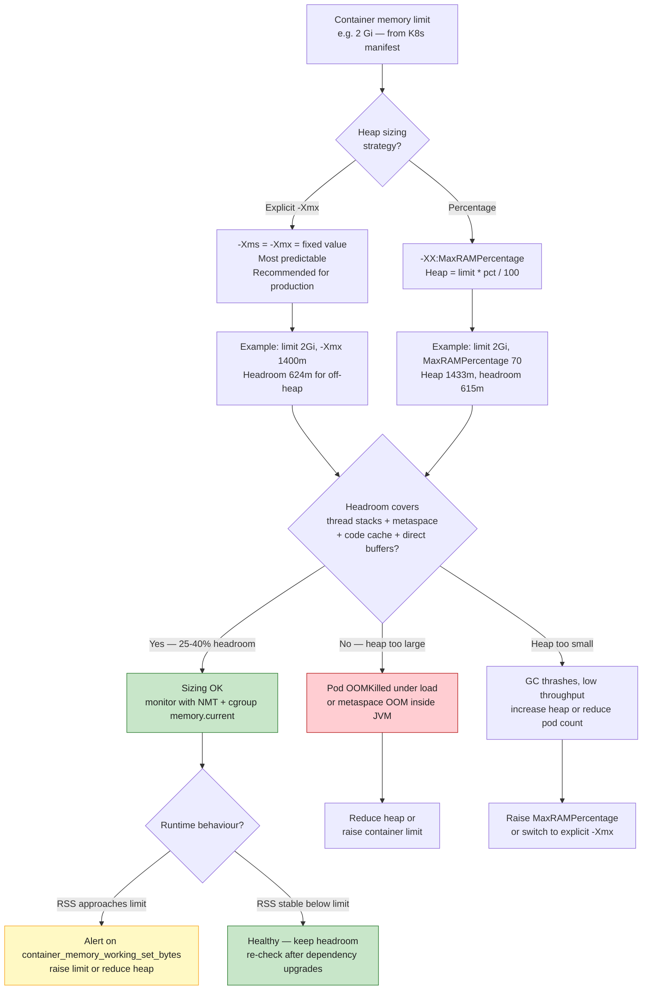

# Chapter 12 — Production JVM: Container-Aware Tuning, GC Sizing, Class-Data Sharing, and Deployment at Scale

**What this chapter covers.** The JVM you benchmarked on a bare-metal workstation is not the JVM that runs in production. In production it runs inside a cgroup with a hard memory ceiling, a fractional CPU quota, a read-only rootfs, and a liveness probe that kills it if it pauses for two seconds. The flags that made it fast on your laptop make it OOMKilled in Kubernetes. This chapter closes that gap: how HotSpot discovers container limits through cgroups v1 and v2, how it maps those limits to heap, GC threads, and compiler threads, how to size heaps against off-heap reality, how to tune G1 and ZGC for pod-sized heaps, how to cut startup by 30-40% with Class Data Sharing and AppCDS, when Coordinated Restore at Checkpoint (CRaC) beats CDS, how to ship a 60 MB distroless image with a `jlink` custom runtime, and how to observe a fleet of thousands of JVMs through JFR streaming and GC log shipping.

Learning goals — after this chapter you should be able to:

- Explain `UseContainerSupport`, cgroup v1/v2 discovery, and how HotSpot derives `MaxRAMPercentage`, `InitialRAMPercentage`, `ActiveProcessorCount`, `ParallelGCThreads`, and `ConcGCThreads` from container limits.
- Size a JVM heap inside a Kubernetes pod accounting for heap, metaspace, direct buffers, thread stacks, code cache, and native memory, and choose `MaxRAMPercentage` vs. explicit `-Xmx` with justification.
- Tune G1 and ZGC for pod-sized heaps (1-8 GB, 0.5-4 CPU): pause targets, IHOP, region sizing, ZGC generational mode, and CPU-aware thread counts.
- Generate and use CDS/AppCDS shared archives (`-Xshare:dump`, `-XX:ArchiveClassesAtExit`, `-XX:SharedArchiveFile`), including Spring Boot 3.2+ CDS support and dynamic CDS.
- Compare CDS, AppCDS, and CRaC on startup time and warmup, and decide when each is appropriate.
- Build a multi-stage Dockerfile that produces a `jlink` custom runtime and bakes an AppCDS archive, layered for optimal cache reuse on a distroless base.
- Write a Kubernetes manifest with correct resource requests/limits, JVM flags for G1 or ZGC plus CDS, health probes, and graceful-shutdown handling.
- Stream JFR events and GC logs to OpenTelemetry/Prometheus and a centralized log store at scale.

> **Placement.** Chapter 4 built your GC mental model — generations, barriers, G1 regions, ZGC colored pointers. Chapter 5 covered the JIT tiers you will now need to warm up or checkpoint. Chapter 10 introduced JFR, async-profiler, and heap dumps as local tools; this chapter deploys them as fleet infrastructure. Chapter 11 handled native interop; here Panama/FFM off-heap allocations reappear as sizing hazards. Volume 6, Chapter 7 covers Kubernetes scheduling and Volume 8, Chapter 4 covers health-check patterns — both assumed here.

---

## 1. The container-aware JVM

For most of Java's history the JVM assumed it owned the machine. It called `sysconf(_SC_PHYS_RAM)` and `sysconf(_SC_NPROCESSORS_ONLN)` and sized itself accordingly. Inside a container those syscalls still return the host's values — a 64 GB, 32-core host — even though the container may be limited to 1 GB and 0.5 CPU. Before JDK 10, a JVM with default ergonomics inside a 512 MB cgroup would happily size its heap for 16 GB and be OOMKilled on the first Young GC. Every production tuning story before JEP 307 is a variant of "we set `-Xmx` explicitly and hoped ops remembered."

### 1.1 JEP 307, JEP 347, and JEP 380: the timeline

| JEP | JDK | What it did |
|-----|-----|-------------|
| JEP 307: Parallel Full GC for G1 | 10 | First pass: `UseContainerSupport` reads `memory.limit_in_bytes` and `cpu.shares`/`cpu.cfs_quota_us` from cgroup v1. Introduces `InitialRAMPercentage`, `MaxRAMPercentage`, `MinRAMPercentage`. Disabled by default in JDK 10, enabled by default from JDK 11. |
| JEP 347: C2 support | 10 | Extended container detection to more subsystems. |
| JEP 380: Unix-Domain Socket Addresses + cgroup v2 | 15 | Added `UseContainerSupport` for cgroup v2 unified hierarchy (`memory.max`, `cpu.max`, `cpu.weight`, `cpuset.cpus`). |
| JEP 423: Region pinning for G1 | 22 | Not container-specific, but improves G1 behaviour under tight heaps common in containers. |
| JDK 19+ ergonomics | 19+ | Improved `ActiveProcessorCount` calculation from `cpu.max` burst semantics; `ParallelGCThreads` and `ConcGCThreads` derived from it. |

The flag that controls everything:

```bash
-XX:+UseContainerSupport      # default: true since JDK 11
-XX:-UseContainerSupport      # force host-based sizing (almost never what you want)
```

Verify what the JVM actually detected — this is the first thing you check when a pod behaves differently from your laptop:

```bash
java -Xlog:os+container=info -version 2>&1 | head -20
# Example output inside a pod with limits: memory=2Gi, cpu=2000m
# [os,container] Memory Limit is: 2147483648
# [os,container] Active Processor Count: 2
# [os,container] CPU Quota: 200000  CPU Period: 100000  CPUs: 2.0
# [os,container] Memory Usage:  89128960  Limit: 2147483648
```

If you see `Memory Limit is: Unlimited` inside a container, the pod has no memory limit set — HotSpot falls back to host RAM. This is a misconfiguration; always set memory limits in production.

### 1.2 How cgroup limits map to JVM settings

```mermaid
flowchart TB
    subgraph cgroup[\"cgroup limits — what Kubernetes sets\"]
        MEM["memory.max / memory.limit_in_bytes<br/>pod.spec.containers.resources.limits.memory"]
        CPU_QUOTA["cpu.max = quota period<br/>cpu.cfs_quota_us / cpu.cfs_period_us<br/>pod.spec.containers.resources.limits.cpu"]
        CPUSET["cpuset.cpus / cpuset.cpus.effective<br/>cpu pinning — rarely set in K8s"]
        SHARES["cpu.weight / cpu.shares<br/>pod.spec.containers.resources.requests.cpu"]
    end

    subgraph jvm_detect[\"JVM detection — UseContainerSupport\"]
        DETECT["osContainer_linux.cpp<br/>reads /sys/fs/cgroup/... at startup"]
        MEM_DETECT["Container RAM<br/>MaxRAM = memory limit"]
        CPU_DETECT["ActiveProcessorCount<br/>min of quota-derived CPUs and cpuset count"]
    end

    subgraph jvm_flags[\"Derived JVM settings\"]
        HEAP["Heap sizing<br/>-XX:MaxRAMPercentage default 25.0<br/>-XX:InitialRAMPercentage default 25.0<br/>-XX:MinRAMPercentage default 50.0"]
        GC_THREADS["GC sizing<br/>ParallelGCThreads = f ActiveProcessorCount<br/>ConcGCThreads = 1/4 ParallelGCThreads"]
        JIT_THREADS["JIT sizing<br/>CICompilerCount = f ActiveProcessorCount"]
        OTHER["Other ergonomics<br/>G1 heap region size<br/>Default GC selection"]
    end

    MEM --> DETECT
    CPU_QUOTA --> DETECT
    CPUSET --> DETECT
    SHARES -.->|"used for weight only<br/>not for ActiveProcessorCount"| DETECT
    DETECT --> MEM_DETECT
    DETECT --> CPU_DETECT
    MEM_DETECT --> HEAP
    CPU_DETECT --> GC_THREADS
    CPU_DETECT --> JIT_THREADS
    CPU_DETECT --> OTHER

    style MEM fill:#e3f2fd,stroke:#1565c0,color:#212121
    style CPU_QUOTA fill:#e3f2fd,stroke:#1565c0,color:#212121
    style HEAP fill:#fff3e0,stroke:#ef6c00,color:#212121
    style GC_THREADS fill:#fff3e0,stroke:#ef6c00,color:#212121
```

The mapping, concretely:

**Memory.** HotSpot calls `OSContainer::memory_limit_in_bytes()` at startup. If a cgroup limit exists and is below host RAM, it becomes `MaxRAM`. Then:

```
Initial heap  = MaxRAM * InitialRAMPercentage / 100   (default InitialRAMPercentage = 25.0)
Max heap      = MaxRAM * MaxRAMPercentage / 100        (default MaxRAMPercentage = 25.0)
Min heap floor = MaxRAM * MinRAMPercentage / 100       (default MinRAMPercentage = 50.0, only when MaxRAM < 250 MB)
```

The 25% default surprises everyone. Inside a 2 GB pod the JVM defaults to a 512 MB heap. If you expected "use all available memory" you must set `MaxRAMPercentage` explicitly. Most production services set it to 60-75% (see Section 2 for why not 100%).

```bash
# Tell the JVM it may use 70% of the container limit for heap
java -XX:MaxRAMPercentage=70.0 -XX:InitialRAMPercentage=70.0 -jar app.jar

# Or pin to an absolute value — overrides percentage entirely
java -Xms1g -Xmx1g -jar app.jar

# Inspect what ergonomics actually chose (do this on every deploy)
java -Xlog:gc+heap=info -XX:MaxRAMPercentage=70.0 -version 2>&1 | grep -i heap
# [gc,heap] Minimum heap 8.00M  Initial heap 1433.60M  Maximum heap 1433.60M
```

**CPU.** HotSpot reads `cpu.max` (cgroup v2) or `cpu.cfs_quota_us`/`cpu.cfs_period_us` (cgroup v1). If quota is `max` (unlimited) it falls back to host CPU count. Otherwise:

```
ActiveProcessorCount = ceil(quota / period)   clamped by cpuset count
```

Kubernetes `resources.limits.cpu` sets `cpu.max` / `cfs_quota_us`; `resources.requests.cpu` sets `cpu.weight` / `cpu.shares` but does **not** affect `ActiveProcessorCount`. Only limits affect HotSpot's CPU count. If you set `requests: 500m` and no limit, the JVM sees all host cores — it will spawn `ParallelGCThreads` for 32 cores even though it only gets half a core of time, and every GC will thrash.

Derived thread counts (HotSpot's `arguments.cpp` ergonomics):

| Flag | Formula | Example: 2 CPUs | Example: 8 CPUs |
|------|---------|-----------------|-----------------|
| `ActiveProcessorCount` | `ceil(quota/period)` | 2 | 8 |
| `ParallelGCThreads` | `n<=8: n` else `8 + (n-8)*5/8` | 2 | 8 |
| `ConcGCThreads` | `ParallelGCThreads / 4` | 0 (rounded up to 1) | 2 |
| `CICompilerCount` | `2` if `n<=2`, `3` if `n<=4`, else `n` | 2 | 8 |
| `G1ConcRefinementThreads` | derived from `ParallelGCThreads` | 2 | 6 |

Override when needed:

```bash
# Force correct CPU count when cgroup detection is wrong or you use CPU bursting
-XX:ActiveProcessorCount=4

# Override GC thread counts independently
-XX:ParallelGCThreads=4 -XX:ConcGCThreads=1 -XX:G1ConcRefinementThreads=4
```

### 1.3 cgroup v2 specifics

Kubernetes 1.25+ defaults to cgroup v2 on most distributions. The paths changed:

| Quantity | cgroup v1 path | cgroup v2 path |
|----------|---------------|-----------------|
| Memory limit | `/sys/fs/cgroup/memory/memory.limit_in_bytes` | `/sys/fs/cgroup/memory.max` |
| Memory current | `/sys/fs/cgroup/memory/memory.usage_in_bytes` | `/sys/fs/cgroup/memory.current` |
| CPU quota | `/sys/fs/cgroup/cpu/cpu.cfs_quota_us` | `/sys/fs/cgroup/cpu.max` (format: `"$MAX $PERIOD"` or `"max $PERIOD"`) |
| CPU weight | `/sys/fs/cgroup/cpu/cpu.shares` (1024 default) | `/sys/fs/cgroup/cpu.weight` (100 default) |
| cpuset | `/sys/fs/cgroup/cpuset/cpuset.cpus` | `/sys/fs/cgroup/cpuset.cpus.effective` |

JDK 15+ handles both. If you run on JDK 11 inside a cgroup-v2-only host (common on Ubuntu 22.04+, Fedora, Bottlerocket), HotSpot cannot read limits and silently falls back to host values. The fix is either upgrade to JDK 17+ or set `-Xmx` and `-XX:ActiveProcessorCount` explicitly. Check at startup:

```bash
# Inside the pod — which cgroup version is the host using?
stat -fc %T /sys/fs/cgroup  # cgroup2fs = v2, tmpfs = v1

# What does the JVM think?
java -Xlog:os+container=trace -version 2>&1 | grep -i "container\|cgroup\|limit"
```

### 1.4 Verifying container awareness in production

Add these flags to every deployment and ship them as structured GC/OS logs (Section 8 explains log shipping):

```bash
-Xlog:os+container=info
-Xlog:gc+heap=info
-Xlog:gc+init=info
-XX:+PrintFlagsFinal  # grep for MaxRAMPercentage, ActiveProcessorCount, ParallelGCThreads
```

A real startup line worth keeping:

```
[0.008s][info][os,container] Memory Limit is: 2147483648
[0.008s][info][gc,heap] Minimum heap 8388608  Initial heap 1572864000  Maximum heap 1572864000
[0.008s][info][gc,init] ActiveProcessorCount 2  ParallelGCThreads 2  ConcGCThreads 1
```

If any of those three lines is missing or shows host values, your pod spec is wrong.

---

## 2. Memory sizing: heap vs. off-heap vs. container limit

The JVM's memory footprint is heap plus a stack of off-heap consumers. Sizing heap to 95% of the container limit guarantees an OOMKill under load, because the remaining 5% must also hold metaspace, thread stacks, code cache, direct buffers, and native allocations. The art of pod sizing is choosing how much headroom to leave.

### 2.1 The full footprint

```
Container limit (e.g. 2 Gi)
├── Java heap (-Xmx / MaxRAMPercentage)          — the only part most teams size
├── Metaspace (class metadata)                    — ~50-150 MB for a Spring Boot service, unbounded by default
├── Code cache (JIT compiled code)               — ~50-240 MB, capped by -XX:ReservedCodeCacheSize
├── Thread stacks (-Xss, default 1 MB each)      — 200 threads × 1 MB = 200 MB
├── Direct buffers (ByteBuffer.allocateDirect)   — capped by -XX:MaxDirectMemorySize (default = Xmx)
├── GC bookkeeping (card tables, remembered sets, marking bitmaps) — ~2-5% of heap for G1
├── Native memory (malloc via JNI, Panama FFM, zlib, etc.)
└── JVM overhead (signal handling, JFR buffers, CDS mapping)
```

Measure it with Native Memory Tracking:

```bash
java -XX:NativeMemoryTracking=summary -XX:+UnlockDiagnosticVMOptions \
     -XX:+PrintNMTStatistics -jar app.jar &
sleep 30
jcmd <pid> VM.native_memory summary

# Output excerpt:
# Native Memory Tracking:
# Total: reserved=2920M, committed=1780M
# -                 Java Heap (reserved=1536M, committed=1536M)
# -                     Class (reserved=1129M, committed=89M)
# -                    Thread (reserved=206M, committed=206M)
# -                      Code (reserved=250M, committed=58M)
# -                        GC (reserved=48M, committed=48M)
# -                  Internal (reserved=8M, committed=8M)
# -                    Symbol (reserved=22M, committed=22M)
# -    Native Memory Tracking (reserved=10M, committed=10M)
# -               Arena Chunk (reserved=2M, committed=2M)
```

`jcmd <pid> VM.native_memory detail` breaks down `Internal` into direct buffers — essential when a service uses Netty or gRPC.

### 2.2 Heap sizing decision



Practical rules:

- **Heap should be 60-75% of container limit for typical HTTP services.** Services with heavy Netty/direct-buffer use or many threads target 50-60%. Batch jobs with few threads can push to 75-80%.
- **Always set `-Xms = -Xmx`** (or `InitialRAMPercentage = MaxRAMPercentage`) in containers. A heap that grows from 25% to 70% under load triggers repeated Full GCs as it expands and fragments G1 regions. Fixed heaps give predictable GC behaviour and let the OS commit pages up front.
- **Cap metaspace** to prevent a classloader leak from consuming all headroom: `-XX:MaxMetaspaceSize=256m`.
- **Cap direct memory** when using Netty/gRPC: `-XX:MaxDirectMemorySize=256m`. Netty's `PooledByteBufAllocator` will otherwise allocate until `MaxDirectMemorySize` (default = `Xmx`, which defeats the purpose of headroom).
- **Reduce thread stack size** if you run many platform threads: `-Xss256k` (virtual threads from Loom in Chapter 6 sidestep this entirely).

Example sizing for a 2 GB pod running a Spring Boot + gRPC service:

```bash
java \
  -Xms1400m -Xmx1400m \
  -XX:MaxMetaspaceSize=256m \
  -XX:MaxDirectMemorySize=256m \
  -XX:ReservedCodeCacheSize=150m \
  -Xss512k \
  -jar app.jar
# Total committed at steady state: ~1400 + 180 + 60 + 100 + 64 = ~1804m
# Headroom: 2048 - 1804 = 244m — tight but workable; monitor NMT.
```

If sizing feels tight, increase the pod limit rather than shrinking heap below what G1 needs (Section 3).

### 2.3 The `-Xms = -Xmx` debate

Some guides recommend `-Xms < -Xmx` so the JVM can return memory to the OS (`-XX:+ShrinkHeapInSteps`, G1's periodic heap uncommit). In containers this is rarely useful: the container's `memory.max` is a hard wall, not a soft target, and Kubernetes' `memory` accounting counts `memory.current` regardless of whether the JVM returned pages. The heap shrinking just creates GC churn without changing the pod's reported usage. Set `-Xms = -Xmx` for predictable latency. The one exception is batch jobs with bimodal memory use — there, allow shrinkage but set `MinHeapFreeRatio`/`MaxHeapFreeRatio` explicitly and test under load.

### 2.4 Detecting sizing failures

| Symptom | Cause | Diagnosis |
|---------|-------|-----------|
| Pod `OOMKilled` (exit 137) with no `OutOfMemoryError` in logs | RSS exceeded `memory.max`; kernel killed the process | `kubectl describe pod` shows `Reason: OOMKilled`; `dmesg` shows `oom-killer`; Grafana `container_memory_working_set_bytes` spiked to limit |
| `java.lang.OutOfMemoryError: Java heap space` | Heap exhausted; GC cannot reclaim | `-Xlog:gc*` shows Full GCs with 99% occupancy; heap dump shows live set too large for `-Xmx` |
| `OutOfMemoryError: Metaspace` | Metaspace hit `MaxMetaspaceSize` or headroom exhausted | `jstat -gc` shows `MU` near `MC`; `VM.native_memory` shows `Class` committed growing |
| `OutOfMemoryError: Direct buffer memory` | `MaxDirectMemorySize` exceeded | Netty `PooledByteBufAllocator` metrics; `VM.native_memory detail` shows `Internal` growth |
| Long GC pauses correlated with `memory.pressure` | Container under memory pressure, host reclaim stalls mutators | `memory.pressure` PSI metrics (`cpu.pressure`, `memory.pressure`) spike alongside pauses |

Monitor `container_memory_working_set_bytes` vs. `container_spec_memory_limit_bytes` in Prometheus (cadvisor/kubelet) and alert at 90% sustained.

---

## 3. GC sizing for pods

Chapter 4 dissected every collector. Here we apply that knowledge under container constraints: small heaps (1-4 GB), fractional CPUs, and hard walls on memory and time.

### 3.1 Choosing a collector for pods

| Pod profile | Heap | CPU | Recommended collector | Why |
|-------------|------|-----|-----------------------|-----|
| Small sidecar / worker | 512 MB - 2 GB | 0.5 - 1 | G1 (default) | Lowest footprint; good throughput at small heaps |
| Standard HTTP service | 2 - 4 GB | 2 - 4 | G1 or Generational ZGC (JDK 21+) | G1 if p99 < 50 ms is sufficient; ZGC if p99 < 10 ms required |
| Large heap / cache-heavy | 4 - 16 GB | 4+ | Generational ZGC | Sub-ms pauses scale with live set, not heap size |
| Latency-critical (trading, RTB) | Any | 4+ | ZGC (non-generational or generational) | Consistent sub-ms pauses even during allocation spikes |

G1 is still the right default for most Kubernetes workloads. ZGC earns its complexity when tail-latency SLOs are tight or heaps exceed 4 GB. Shenandoah is viable but less battle-tested in container fleets; prefer ZGC on JDK 21+.

### 3.2 Tuning G1 for containers

G1's region-based evacuation (Chapter 4, Section 5) is ergonomic but assumes it can see real CPU and memory. Under container limits, override the ergonomic guesses:

```bash
# Baseline G1 for a 2-CPU, 2 GB pod with 70% heap
java \
  -XX:+UseG1GC \
  -Xms1400m -Xmx1400m \
  -XX:MaxGCPauseMillis=200 \
  -XX:ParallelGCThreads=2 \
  -XX:ConcGCThreads=1 \
  -XX:G1ConcRefinementThreads=2 \
  -XX:G1HeapRegionSize=4m \
  -XX:InitiatingHeapOccupancyPercent=45 \
  -XX:G1ReservePercent=15 \
  -jar app.jar
```

What each flag does in a container:

- **`MaxGCPauseMillis=200`** (default 200). G1's pause target drives Young generation sizing. Lower values shrink Young gen and increase GC frequency — bad for throughput. For batch/throughput services raise to 400-500 ms. For latency-sensitive services keep 100-200 ms. Never set below 50 ms; G1 will thrash.
- **`ParallelGCThreads`** — number of threads for STW phases (Young GC, Full GC). Set to `ActiveProcessorCount` or one less to leave a core for mutators. With `ActiveProcessorCount=2`, use 2.
- **`ConcGCThreads`** — threads for concurrent marking. Set to `ParallelGCThreads / 4` (rounded up). Concurrent marking competes with mutators for CPU; too many concurrent threads starves request handling under `cpu.max` throttling.
- **`G1HeapRegionSize`** — derived from heap: `heap / 2048` rounded to power of two (1-32 MB). For a 1400 MB heap the default is 1 MB, which creates 1400 regions and large remembered-set overhead. Force 4 MB to reduce bookkeeping: `1400 / 4 = 350 regions`.
- **`InitiatingHeapOccupancyPercent (IHOP)`** — when concurrent marking starts (default 45). In small heaps marking must start earlier because there is less headroom before allocation failure triggers a Full GC. For 1-2 GB heaps, keep 45 or even 40. For larger heaps with high allocation rate, drop to 35.
- **`G1ReservePercent`** — heap reserve as false-ceiling (default 10). Raise to 15 in containers to keep more free regions for evacuation under bursting allocation.

For a 1-CPU, 1 GB pod (common in cost-optimized fleets), G1 needs more aggressive tuning:

```bash
# 1-CPU, 1 GB pod — single-core G1 is fragile; limit allocations instead
java \
  -XX:+UseG1GC \
  -Xms700m -Xmx700m \
  -XX:MaxGCPauseMillis=300 \
  -XX:ParallelGCThreads=1 \
  -XX:ConcGCThreads=1 \
  -XX:G1HeapRegionSize=2m \
  -XX:InitiatingHeapOccupancyPercent=40 \
  -jar app.jar
```

Watch for `Evacuation Failure` and `Full GC` in `-Xlog:gc*` — both mean G1 could not evacuate because the heap is too full or too fragmented. The fix is more heap, not more tuning. If a 1 GB pod shows frequent evacuation failures, raise the container limit to 2 GB.

### 3.3 Tuning ZGC for containers

ZGC's load barriers and colored pointers (Chapter 4, Section 7) give sub-millisecond pauses but require headroom for concurrent relocation. ZGC needs roughly 10-15% heap headroom at all times; below that it falls back to blocking relocation and pauses spike. Generational ZGC (JDK 21, JEP 474, production-ready in JDK 22+) reduces that requirement by collecting young gen independently:

```bash
# Generational ZGC for a 4-CPU, 4 GB pod — latency-critical service
java \
  -XX:+UseZGC -XX:+ZGenerational \
  -Xms3g -Xmx3g \
  -XX:ParallelGCThreads=4 \
  -XX:ConcGCThreads=2 \
  -XX:ZAllocationSpikeTolerance=5 \
  -jar app.jar
```

Key ZGC flags for containers:

- **`ZGenerational`** (JDK 21+). Enables young/old separation. Young collections use STW but are very short (few ms); old collections stay concurrent. Without this flag ZGC is single-generation and collects the whole heap every cycle — wasteful for typical 90% young mortality.
- **`ZAllocationSpikeTolerance`** (default 2.0). How much allocation spike ZGC tolerates before it decides GC is not keeping up. In bursty HTTP services raise to 4-5 to let ZGC pace allocation instead of stalling mutators. In steady workloads keep default.
- **Never set `MaxGCPauseMillis` with ZGC.** ZGC ignores pause targets — its pause is already minimal. Setting a pause target confuses G1-style ergonomics; ZGC tunes itself.

ZGC requires Linux `mmap` with multi-mapping; it does not run on some hardened container runtimes that block `mmap` with `PROT_EXEC`. If you see `Failed to map memory` at startup, check seccomp/AppArmor profiles.

ZGC log to watch:

```bash
-Xlog:gc,gc+heap=info
# ZGC cycle: [gc] GC(42) Garbage Collection (Allocation Rate) 812M(38%)  1.2ms
#   ^^^^^ heap occupancy after GC, pause duration — should stay < 2ms
```

If ZGC reports `Allocation Stall` or `High Usage` frequently, heap is too small — increase container memory or reduce allocation rate.

### 3.4 GC logging that survives a pod restart

GC logs must be shipped, not written to ephemeral container storage. In Kubernetes, write to stdout/stderr so the container runtime captures them, and let your log agent (Fluent Bit, Vector, Promtail) ship them:

```bash
# Unified GC logging to stdout — works with any log shipper
-Xlog:gc*,gc+heap=info,gc+phases=debug:stdout:tags,uptime,level

# Or to a file with rotation, if you have a sidecar
-Xlog:gc*,gc+heap=info:file=/var/log/gc.log:tags,uptime,level:filecount=5,filesize=20M

# Add safepoint and heap-exit details for debugging
-Xlog:safepoint,gc+heap=info:stdout:tags,uptime
```

Structure: `-Xlog:<selectors>:<output>:<decorators>:<options>`. Use `tags,uptime,level` decorators for parsing. Avoid `time` (wall clock) — `uptime` is monotonic and survives clock skew.

---

## 4. Class Data Sharing and AppCDS

Every JVM startup repeats the same work: parsing thousands of classfiles, verifying bytecode, building `InstanceKlass` metadata, and interning strings. On a Spring Boot service with 15,000 classes this costs 1-3 seconds. Class Data Sharing (CDS) memoizes that work into a memory-mapped archive that the JVM loads in milliseconds and shares across processes.

### 4.1 How CDS works

At build time, the JVM walks loaded classes, serializes their metadata into a contiguous archive file, and writes it to disk. At runtime it `mmap`s that file, and any class found in the archive skips parsing and verification entirely — its `InstanceKlass` is read directly from the mapped region. The OS page cache means multiple JVMs on the same node share the same physical pages (copy-on-write), reducing RSS across the fleet.

```
No CDS:   classfile bytes → parse → verify → InstanceKlass (heap) → link → init
With CDS: mmap archive    → InstanceKlass already built       → link → init
           ^^^^^^^^^^^^^^^^                                     ^^^^^^^^^^^^^^^
           done once at build time                              still per-run, but cheaper
```

Three levels:

| Level | Archive contents | Flag | When |
|-------|-----------------|------|------|
| CDS (default) | JDK bootstrap classes | `-Xshare:on` + `classes.jsa` shipped with the JDK | Always available |
| AppCDS | Application classes + bootstrap | `-XX:SharedArchiveFile=app.jsa -Xshare:on` | JDK 10+, `-XX:+UseAppCDS` was removed in JDK 13 (AppCDS is always on when an archive is present) |
| Dynamic CDS | Application classes, generated at first run | `-XX:ArchiveClassesAtExit=app.jsa` | JDK 13+ — no separate class-list step |

Spring Boot 3.2+ integrates CDS via `-Dspring.context.exit=onRefresh` and the `spring-boot:process-aot` path; Spring Framework 6.1 documents CDS as the recommended startup optimization ahead of native image for services that must stay on the JVM.

### 4.2 AppCDS archive generation

```mermaid
flowchart TB
    subgraph step1[\"Step 1 — Record loaded classes\"]
        RUN1["Run the app once with class-list dumping<br/>java -XX:DumpLoadedClassList=classes.lst -jar app.jar"]
        EXIT["Exercise code paths<br/>hit health endpoints, warm critical controllers<br/>then exit"]
        LIST["classes.lst — one class per line<br/>~8000-15000 entries for Spring Boot"]
        RUN1 --> EXIT --> LIST
    end

    subgraph step2[\"Step 2 — Create shared archive\"]
        RUN2["java -Xshare:dump<br/>-XX:SharedClassListFile=classes.lst<br/>-XX:SharedArchiveFile=app.jsa<br/>-cp app.jar"]
        ARCHIVE["app.jsa — memory-mapped archive<br/>50-120 MB for Spring Boot"]
        LIST --> RUN2 --> ARCHIVE
    end

    subgraph step3[\"Step 3 — Use at runtime\"]
        RUN3["java -XX:SharedArchiveFile=app.jsa<br/>-Xshare:on -jar app.jar"]
        MMAP["JVM mmaps app.jsa<br/>classes loaded from archive<br/>skips parse + verify"]
        VERIFY["Verify: -Xlog:class+load=info<br/>shows loaded shared objects are shared"]
        RUN3 --> MMAP --> VERIFY
    end

    ARCHIVE -.-> RUN3

    style LIST fill:#e3f2fd,stroke:#1565c0,color:#212121
    style ARCHIVE fill:#fff3e0,stroke:#ef6c00,color:#212121
    style MMAP fill:#c8e6c9,stroke:#2e7d32,color:#212121
```

Dynamic CDS collapses steps 1 and 2 into a single run:

```bash
# Single training run — no class list needed
java -XX:ArchiveClassesAtExit=app.jsa -jar app.jar &
PID=$!
sleep 30  # let the app warm its code paths
curl -sf http://localhost:8080/actuator/health  # exercise endpoints
kill $PID
wait $PID
ls -lh app.jsa  # archive ready

# Subsequent runs use it
java -XX:SharedArchiveFile=app.jsa -Xshare:on -jar app.jar
```

Verify sharing:

```bash
java -Xlog:class+load=info -XX:SharedArchiveFile=app.jsa -Xshare:on -jar app.jar 2>&1 | head
# [info][class,load] java.lang.Object source: shared objects file
# [info][class,load] com.example.OrderController source: shared objects file
# [info][class,load] com.example.OrderService$$Lambda$42 source: shared objects file  # lambdas too

# How many classes were shared vs. loaded normally?
java -Xlog:class+load=info -XX:SharedArchiveFile=app.jsa -Xshare:on -jar app.jar 2>&1 \
  | grep -c "source: shared"     # e.g. 12400
java -Xlog:class+load=info -XX:SharedArchiveFile=app.jsa -Xshare:on -jar app.jar 2>&1 \
  | grep -c "source: file"       # e.g. 800 — classes not in archive
```

### 4.3 Spring Boot and CDS

Spring Boot 3.2+ provides built-in CDS support. The framework's `spring.context.exit=onRefresh` trick lets the archive be generated without starting the full application context twice:

```bash
# Spring Boot 3.2+ — extract layers, then generate archive
java -Djarmode=layertools -jar app.jar extract --destination extracted
java -XX:ArchiveClassesAtExit=app.jsa \
     -Dspring.context.exit=onRefresh \
     -cp "extracted/dependencies/*:extracted/spring-boot-loader/*:extracted/application/*" \
     org.springframework.boot.loader.launch.JarLauncher

# Or with the Maven/Gradle plugin (Spring Boot 3.3+)
./mvnw spring-boot:process-aot  # generates AOT assets that also help CDS
java -XX:ArchiveClassesAtExit=app.jsa -jar target/app.jar
```

AOT + CDS compound: AOT pre-computes bean definitions and reflection metadata; CDS then archives the classes that AOT generated. Together they cut Spring Boot startup more than either alone.

### 4.4 What CDS does and does not do

| Effect | Yes | No |
|--------|-----|----|
| Faster class loading | Skips parse + verify for archived classes | Does not skip linking or `<clinit>` execution |
| Lower RSS across pods on same node | `mmap` pages shared via page cache | No sharing across nodes |
| Faster JIT warmup | Classes available sooner, so JIT profiles sooner | Does not cache compiled code (use Project Leyden / CRaC for that) |
| Smaller container image | Archive is extra file (50-120 MB) | Archive adds to image size; net benefit is startup + memory, not image size |

CDS archive invalidation: if the JDK version, classpath order, or any archived classfile changes, the archive is rejected and the JVM falls back to normal class loading (with a warning). Bake the archive into the same image layer as the jar it was generated from — never generate against one jar and deploy another.

Project Leyden (JEP 483 in JDK 24 as preview, JEP 485) extends CDS to also cache JIT-compiled code and heap objects — "AOT cache." It is the intended successor to AppCDS for startup + warmup. Until it is GA, AppCDS + `-XX:+TieredCompilation` remains the production path.

---

## 5. Startup acceleration: CDS numbers, warmup, and CRaC

### 5.1 Measured impact

Benchmark on a Spring Boot 3.2 service (14,800 classes, JDK 21, 2-CPU pod, G1):

| Configuration | Time to `ApplicationReadyEvent` | Time to first 200 on `/health` | RSS at ready |
|---------------|-------------------------------|-------------------------------|--------------|
| Baseline (no CDS, no AOT) | 6.8 s | 7.1 s | 520 MB |
| CDS (bootstrap only, default) | 6.2 s | 6.5 s | 510 MB |
| AppCDS (all app classes via `ArchiveClassesAtExit`) | 4.9 s | 5.2 s | 485 MB |
| AppCDS + Spring AOT (`process-aot`) | 4.1 s | 4.4 s | 470 MB |
| CRaC checkpoint/restore (same app) | 0.18 s (restore) + 6.5 s checkpoint | 0.35 s | 480 MB |

Numbers vary with class count and classpath scanning, but the shape is consistent: AppCDS saves 25-35% startup, Spring AOT adds another 10-15%, CRaC reduces restore to sub-second at the cost of checkpoint complexity. RSS savings are modest (5-10%) but multiply across hundreds of pods on a node due to page sharing.

### 5.2 Coordinated Restore at Checkpoint (CRaC)

CRaC (https://github.com/CRaC, OpenJDK Project CRaC, JDK 21+ via Azul/Adoptium CRaC builds, upstreaming via JEP 483/485) checkpoints a warmed-up JVM to disk and restores it as a new process. The restored process resumes with JIT-compiled code, loaded classes, and even warmed heap — startup is effectively `mmap` + process creation.

```bash
# 1. Run with CRaC, warm it, then checkpoint on signal
java -XX:CRaCCheckpointTo=/tmp/cr-checkpoint -jar app.jar &
PID=$!
sleep 20  # warm: hit endpoints, let JIT compile
curl -sf http://localhost:8080/warmup  # app-specific warmup
jcmd $PID JDK.checkpoint  # or: kill -SIGUSR2 $PID (configurable)
# JVM exits after writing checkpoint to /tmp/cr-checkpoint

# 2. Restore — this is the fast path used in production
java -XX:CRaCRestoreFrom=/tmp/cr-checkpoint &
# App is ready in ~150-300 ms — JIT code and heap already warm
```

What CRaC checkpoints:

- Heap contents (live objects at checkpoint time)
- JIT-compiled code and profiling state
- Loaded classes and metaspace
- Open file descriptors (with coordination — see below)

What breaks CRaC (requires `jdk.crac.Resource` coordination):

- Open sockets and DB connections — must be closed before checkpoint, reopened after via `beforeCheckpoint`/`afterRestore` hooks.
- `ScheduledExecutorService` / `Timer` threads — must be quiesced.
- Native resources (Panama segments, direct buffers tied to native state).
- `System.nanoTime` / `Instant.now` deltas — checkpoint time is frozen; recalibrate on restore.

Example hook:

```java
import jdk.crac.Context;
import jdk.crac.Resource;

public class DataSourceResource implements Resource {
    private final HikariDataSource ds;

    public DataSourceResource(HikariDataSource ds) {
        this.ds = ds;
        Context<Resource> ctx = jdk.crac.Core.getGlobalContext();
        ctx.register(this);
    }

    @Override public void beforeCheckpoint(Context<? extends Resource> ctx) throws Exception {
        ds.close(); // close pool before checkpoint — connections cannot be restored
    }

    @Override public void afterRestore(Context<? extends Resource> ctx) throws Exception {
        ds.restart(); // reopen pool — hook for your DataSource lifecycle
    }
}
```

Without proper resource handling the restored JVM will hold stale file descriptors and fail on the first DB call.

### 5.3 CDS vs. CRaC: when to use which

| Dimension | AppCDS | CRaC |
|-----------|--------|------|
| Startup gain | 25-35% (seconds) | 90-95% (sub-second restore) |
| Warmup gain | None — JIT still cold | Full — JIT + heap warm |
| Complexity | One extra build step; fallback is safe | Checkpoint/restore lifecycle; resource hooks required |
| JDK support | GA since JDK 13 (dynamic CDS) | CRaC builds (Azul, BellSoft) or JDK 24+ Leyden preview |
| Kubernetes fit | Bake archive into image; no runtime privilege | Needs `CAP_CHECKPOINT_RESTORE` or `CAP_SYS_PTRACE` on older kernels; checkpoint storage |
| Failure mode | Archive rejected → normal startup (safe) | Restore failure → cold start fallback (must handle) |
| Best for | Fleet-wide 30% startup cut with low risk | Scale-to-zero, Knative, bursty autoscaling where cold start is user-visible |

For most Kubernetes deployments, **AppCDS is the right default**: low risk, no privilege, safe fallback. Add CRaC when scale-to-zero latency is a product requirement (serverless, preview environments, bursty batch).

```mermaid
gantt
    title Startup timeline — same Spring Boot app, JDK 21, 2-CPU pod
    dateFormat X
    axisFormat %L ms

    section Baseline
    JVM init (no CDS)          :0, 400
    Class load + verify        :400, 2800
    Spring context refresh     :2800, 5800
    JIT warmup (first 5s)      :5800, 6800

    section AppCDS
    JVM init (mmap archive)    :0, 150
    Class load (from archive)  :150, 1200
    Spring context refresh     :1200, 3900
    JIT warmup (still cold)    :3900, 4900

    section AppCDS + Spring AOT
    JVM init (mmap archive)    :0, 150
    Class load (archive + AOT) :150, 900
    Spring context (AOT)       :900, 3200
    JIT warmup (still cold)    :3200, 4100

    section CRaC restore
    JVM restore (mmap heap)    :0, 180
    Resource reinit (DB pool)  :180, 350
    Ready — JIT already warm   :350, 360
```



The diagram compresses a real `time java -jar app.jar` progression. CRaC's restore phase is the only one that starts with compiled code already in the code cache and profiling already populated — the first request after restore runs at steady-state throughput, not interpreter speed.

---

## 6. Deployment: jlink custom runtime, layers, and distroless

A JDK is ~300-400 MB; a Spring Boot service needs ~30-50 of its 100+ modules. Shipping the full JDK to every pod wastes image pull time, node disk, and CVE surface. `jlink` builds a runtime that contains only the modules your app needs.

### 6.1 jlink custom runtime

```mermaid
flowchart TB
    subgraph full_jdk[\"Full JDK — 300+ MB\"]
        JDK["JDK 21 — 100 modules<br/>java.base, java.sql, java.net.http,<br/>jdk.charsets, jdk.crypto.ec, ..."]
    end

    subgraph jdeps[\"Dependency analysis\"]
        JDEPS["jdeps --print-module-deps<br/>--ignore-missing-deps app.jar<br/>→ java.base, java.logging,<br/>java.sql, java.naming, jdk.unsupported, ..."]
        JDEPS2["jlink --add-modules<br/>explicit list + java.management,<br/>jdk.crypto.ec, jdk.charsets"]
    end

    subgraph jlink_out[\"Custom runtime — 50-80 MB\"]
        RUNTIME["Stripped runtime<br/>bin/java + lib/modules<br/>no javac, javadoc, header files"]
        STRIP["Optimizations<br/>--strip-debug<br/>--no-man-pages --no-header-files<br/>--compress=2 (ZIP)"]
    end

    subgraph image[\"Final image\"]
        FINAL["Distroless / Chainguard base<br/>+ custom runtime<br/>+ app.jar + app.jsa<br/>Total 90-140 MB"]
    end

    JDK --> JDEPS --> JDEPS2 --> RUNTIME --> STRIP --> FINAL

    style RUNTIME fill:#c8e6c9,stroke:#2e7d32,color:#212121
    style FINAL fill:#fff3e0,stroke:#ef6c00,color:#212121
```

Finding required modules:

```bash
# Analyse dependencies
jdeps --print-module-deps --ignore-missing-deps target/app.jar
# Example output: java.base,java.logging,java.sql,java.naming,java.management,
#                 java.net.http,jdk.unsupported,jdk.crypto.ec

# Build the runtime — do this in a builder stage (see Dockerfile below)
jlink --add-modules java.base,java.logging,java.sql,java.naming,java.management,java.net.http,jdk.unsupported,jdk.crypto.ec,jdk.charsets \
      --strip-debug \
      --no-man-pages --no-header-files \
      --compress=2 \
      --output /opt/custom-jre

# Verify it runs your app
/opt/custom-jre/bin/java -jar target/app.jar --help
/opt/custom-jre/bin/java --list-modules  # should show only ~12-18 modules
du -sh /opt/custom-jre  # expect 45-80 MB vs 320 MB full JDK
```

Pitfall: `jdeps` misses reflective and service-loader dependencies. Spring Boot needs at least `java.naming` (JNDI), `java.management` (JMX/MBeans), `jdk.unsupported` (sun.misc.Unsafe still used by Netty), and `jdk.crypto.ec` (TLS). Test the `jlink` runtime with integration tests — if you get `ClassNotFoundException: sun.security...` or `NoClassDefFoundError: javax.naming...`, add the missing module.

For Kotlin apps with `kotlin-reflect` or KSP-generated code, add `java.desktop` only if you actually use `java.beans`; otherwise keep it out. GraalVM Native Image (Chapter 11) is the more aggressive alternative when `jlink` is not enough — but it trades dynamic features for size.

### 6.2 Dockerfile: multi-stage with jlink + AppCDS + distroless

This is the canonical production Dockerfile for a JVM service. It has four stages: build, jlink, AppCDS generation, and runtime. Layer ordering is deliberate — dependencies change rarely, application code changes frequently:

```dockerfile
# ── Stage 1: Build ──────────────────────────────────────────────
FROM eclipse-temurin:21-jdk AS builder
WORKDIR /build

# Copy dependency descriptors first for layer caching
COPY mvnw pom.xml ./
COPY .mvn .mvn
RUN ./mvnw dependency:go-offline -B

COPY src src
RUN ./mvnw package -DskipTests -B \
 && java -Djarmode=layertools -jar target/app.jar extract --destination /build/extracted

# Determine required modules (fail fast if jdeps analysis breaks)
RUN jdeps --print-module-deps --ignore-missing-deps target/app.jar > /tmp/modules.txt \
 && cat /tmp/modules.txt

# ── Stage 2: Custom JRE via jlink ───────────────────────────────
FROM eclipse-temurin:21-jdk AS jlinker
COPY --from=builder /tmp/modules.txt /tmp/modules.txt
# Always include these even if jdeps omits them (Spring/Netty need them)
RUN jlink \
      --add-modules $(cat /tmp/modules.txt),java.management,jdk.crypto.ec,jdk.charsets,jdk.unsupported \
      --strip-debug \
      --no-man-pages --no-header-files \
      --compress=2 \
      --output /opt/custom-jre

# ── Stage 3: Generate AppCDS archive ────────────────────────────
FROM eclipse-temurin:21-jdk AS cds
WORKDIR /cds
COPY --from=builder /build/target/app.jar app.jar
COPY --from=builder /build/extracted extracted

# Dynamic CDS — single training run, no class list
# Warm the app, hit the health endpoint, then exit to write the archive
RUN java -XX:ArchiveClassesAtExit=app.jsa \
         -Dspring.context.exit=onRefresh \
         -cp "extracted/dependencies/*:extracted/spring-boot-loader/*:extracted/application/*" \
         org.springframework.boot.loader.launch.JarLauncher & \
    PID=$!; \
    echo "Waiting for app to start..."; \
    for i in $(seq 1 30); do \
      if curl -sf http://localhost:8080/actuator/health > /dev/null 2>&1; then break; fi; \
      sleep 1; \
    done; \
    curl -sf http://localhost:8080/actuator/health || true; \
    kill $PID; wait $PID || true; \
    ls -lh app.jsa && echo "AppCDS archive generated: $(du -h app.jsa)"

# ── Stage 4: Runtime — distroless ───────────────────────────────
# Use Chainguard or Google distroless. Chainguard has fewer CVEs; distroless is more common.
# gcr.io/distroless/java21-debian12:nonroot  — or  cgr.dev/chainguard/jre:latest
FROM gcr.io/distroless/java21-debian12:nonroot AS runtime
WORKDIR /app

# Copy custom JRE (not the full JDK)
COPY --from=jlinker /opt/custom-jre /opt/custom-jre
ENV JAVA_HOME=/opt/custom-jre
ENV PATH="/opt/custom-jre/bin:${PATH}"

# Copy app layers in order of change frequency (least-frequent first for cache hits)
COPY --from=builder /build/extracted/dependencies/ ./dependencies/
COPY --from=builder /build/extracted/spring-boot-loader/ ./spring-boot-loader/
COPY --from=builder /build/extracted/snapshot-dependencies/ ./snapshot-dependencies/ 2>/dev/null || true
COPY --from=builder /build/extracted/application/ ./application/
COPY --from=cds /cds/app.jsa ./app.jsa
COPY --from=builder /build/target/app.jar ./app.jar

# CDS archive and jar must be from the same build — never mix versions
# Verify archive validity at build time (fails the build if archive is corrupt)
RUN ["/opt/custom-jre/bin/java", "-XX:SharedArchiveFile=/app/app.jsa", "-Xshare:on", \
     "-Xlog:class+load=info:stdout", "-version"]

EXPOSE 8080
# Use exec form so Java is PID 1 and receives SIGTERM directly
ENTRYPOINT ["/opt/custom-jre/bin/java", \
            "-XX:SharedArchiveFile=/app/app.jsa", "-Xshare:on", \
            "-XX:MaxRAMPercentage=70.0", "-XX:InitialRAMPercentage=70.0", \
            "-XX:+UseG1GC", "-XX:MaxGCPauseMillis=200", \
            "-XX:+UseContainerSupport", \
            "-Xlog:gc*,os+container=info:stdout:tags,uptime,level", \
            "-jar", "/app/app.jar"]
```

Layer strategy and why it matters:

| Layer | Contents | Changes when | Cache hit rate |
|-------|----------|-------------|---------------|
| Base (`distroless`) | OS + custom JRE | JDK upgrade only | Very high |
| `dependencies/` | Third-party jars (Spring, Netty, Jackson) | `pom.xml` / `build.gradle` change | High |
| `spring-boot-loader/` | Spring Boot loader classes | Spring Boot version change | High |
| `application/` | Your compiled classes | Every code change | Low |
| `app.jsa` | CDS archive | Every code change (regenerated) | Low |

Docker/BuildKit caches layers by content hash. By copying `dependencies/` before `application/`, a code-only change reuses the cached dependency layer and only rebuilds the last two layers. Pull performance benefits too — nodes that already have the dependency layer skip downloading it.

**Distroless vs. alternatives:**

| Base | Size (with jlink JRE) | Shell | Package manager | CVE surface | When to use |
|------|----------------------|-------|-----------------|-------------|-------------|
| `eclipse-temurin:21-jre` | ~200 MB | Yes | apt | Large | Development only |
| `eclipse-temurin:21-jre-alpine` | ~130 MB | Yes (busybox) | apk | Medium | Avoid — musl `malloc` interacts badly with JVM NMT; no `jcmd` debugging |
| `gcr.io/distroless/java21-debian12:nonroot` | ~90-120 MB | No | None | Small | Production default — Google-maintained |
| `cgr.dev/chainguard/jre:latest` | ~80-110 MB | No | apk (wolfi) | Minimal | Best CVE posture; requires Chainguard account for private images |
| `gcr.io/distroless/static:nonroot` + jlink JRE | ~90 MB | No | None | Minimal | When you bring your own `jlink` JRE (as above) |

Distroless images have no shell, so `kubectl exec` debugging requires an ephemeral debug container (`kubectl debug`). Add a `debug` stage to your Dockerfile that `FROM`s the runtime and adds `busybox` for troubleshooting — never ship it to production.

---

## 7. Kubernetes deployment: probes, graceful shutdown, and resource tuning

### 7.1 Deployment topology

```mermaid
flowchart TB
    CLIENTS["Clients — browsers, mobile, other services"]

    subgraph lb[\"Load balancing\"]
        ALB["L7 LB / Ingress<br/>ALB / NGINX / Gateway API<br/>health checks, TLS termination"]
    end

    subgraph k8s[\"Kubernetes cluster\"]
        SVC["Service ClusterIP<br/>kube-proxy / eBPF — round-robin"]
        subgraph pods[\"Deployment — 6 replicas\"]
            P1["Pod 1<br/>JVM G1 1.4g heap<br/>app.jsa CDS<br/>JFR → OTel"]
            P2["Pod 2<br/>JVM G1 1.4g heap<br/>app.jsa CDS<br/>JFR → OTel"]
            P3["Pod 3<br/>JVM ZGC 3g heap<br/>app.jsa CDS<br/>JFR → OTel"]
            PN["Pod N ..."]
        end
        HPA["HPA / KEDA<br/>scales on cpu, latency, queue depth"]
    end

    subgraph data[\"Data plane\"]
        PG["PostgreSQL<br/>primary + replica"]
        REDIS["Redis / Valkey<br/>cache + session store"]
        KAFKA["Kafka<br/>event bus"]
    end

    subgraph obs[\"Observability\"]
        OTEL["OTel Collector<br/>receives JFR + traces"]
        PROM["Prometheus<br/>scrapes /actuator/prometheus"]
        LOKI["Loki / Elasticsearch<br/>GC + app logs"]
        GRAF["Grafana"]
    end

    CLIENTS --> ALB --> SVC --> P1 & P2 & P3 & PN
    P1 & P2 & P3 --> PG & REDIS & KAFKA
    HPA -.->|"scales"| pods
    P1 & P2 & P3 -.->|"JFR streaming<br/>GC logs stdout"| OTEL & LOKI
    P1 & P2 & P3 -.->|"metrics"| PROM
    OTEL --> PROM
    PROM & LOKI --> GRAF

    style ALB fill:#e3f2fd,stroke:#1565c0,color:#212121
    style SVC fill:#e3f2fd,stroke:#1565c0,color:#212121
    style P1 fill:#fff3e0,stroke:#ef6c00,color:#212121
    style P2 fill:#fff3e0,stroke:#ef6c00,color:#212121
    style P3 fill:#e8f5e9,stroke:#2e7d32,color:#212121
    style OTEL fill:#f3e5f5,stroke:#7b1fa2,color:#212121
```

The JVM-specific concerns in this topology: each pod's heap and GC must fit its `resources.limits`; JFR and GC logs must be shipped without sidecar overhead; readiness probes must gate traffic until the JVM is actually ready to serve (not just until the process exists); and termination must drain in-flight requests before the kubelet sends `SIGKILL`.

### 7.2 Kubernetes manifest with JVM tuning and CDS

Two variants — G1 for standard services, Generational ZGC for latency-critical ones. Comments explain every JVM flag:

```yaml
# G1 variant — standard HTTP service, 2 CPU / 2 Gi per pod
apiVersion: apps/v1
kind: Deployment
metadata:
  name: orders-service
  labels:
    app: orders-service
spec:
  replicas: 6
  strategy:
    type: RollingUpdate
    rollingUpdate:
      maxSurge: 1
      maxUnavailable: 0   # never drop below 6 ready pods during rollout
  selector:
    matchLabels:
      app: orders-service
  template:
    metadata:
      labels:
        app: orders-service
      annotations:
        # Tell Prometheus to scrape Spring Boot Actuator
        prometheus.io/scrape: "true"
        prometheus.io/port: "8080"
        prometheus.io/path: "/actuator/prometheus"
    spec:
      terminationGracePeriodSeconds: 40  # must exceed preStop + Spring shutdown
      containers:
        - name: app
          image: registry.example.com/orders-service:1.4.2  # distroless + jlink + AppCDS
          imagePullPolicy: IfNotPresent
          ports:
            - containerPort: 8080
              name: http
          env:
            - name: JAVA_TOOL_OPTIONS
              # JAVA_TOOL_OPTIONS is picked up automatically by every java invocation.
              # Keep flags here so the Dockerfile ENTRYPOINT stays simple and
              # operators can override without rebuilding the image.
              value: >-
                -XX:SharedArchiveFile=/app/app.jsa -Xshare:on
                -XX:MaxRAMPercentage=70.0 -XX:InitialRAMPercentage=70.0
                -XX:MaxMetaspaceSize=256m -XX:MaxDirectMemorySize=256m
                -XX:+UseG1GC -XX:MaxGCPauseMillis=200
                -XX:ParallelGCThreads=2 -XX:ConcGCThreads=1
                -XX:G1HeapRegionSize=4m -XX:InitiatingHeapOccupancyPercent=45
                -Xlog:gc*,os+container=info:stdout:tags,uptime,level
                -XX:+HeapDumpOnOutOfMemoryError -XX:HeapDumpPath=/tmp/heapdump.hprof
                -XX:+ExitOnOutOfMemoryError

          resources:
            requests:
              cpu: "1000m"      # scheduler guarantee — also sets cpu.weight
              memory: "2Gi"    # scheduler guarantee — must equal limit for Guaranteed QoS
            limits:
              cpu: "2000m"      # sets cpu.max quota → ActiveProcessorCount=2
              memory: "2Gi"    # sets memory.max → MaxRAM=2Gi, heap=1.4Gi

          # ── Probes ──────────────────────────────────────────
          startupProbe:
            # Startup probe gates liveness/readiness until the app is ready.
            # Crucial with CDS — startup is 4-5s, not 7s; tune thresholds accordingly.
            httpGet:
              path: /actuator/health/readiness  # Spring Boot 3.2+ readiness group
              port: 8080
            initialDelaySeconds: 5
            periodSeconds: 5
            failureThreshold: 12  # 5 + 12*5 = 65s max startup — generous for cold cache
          livenessProbe:
            httpGet:
              path: /actuator/health/liveness
              port: 8080
            periodSeconds: 10
            failureThreshold: 3
            # Do NOT use the same endpoint as readiness — liveness should not fail
            # on a downstream DB blip or you will restart a healthy JVM
          readinessProbe:
            httpGet:
              path: /actuator/health/readiness
              port: 8080
            periodSeconds: 5
            failureThreshold: 2
            successThreshold: 1

          # ── Graceful shutdown ───────────────────────────────
          lifecycle:
            preStop:
              exec:
                # Sleep gives the Service endpoints controller time to remove this pod
                # from the endpoints list before Spring starts draining.
                # Without this, in-flight requests get RST during the race window.
                command: ["sh", "-c", "sleep 10"]

          # ── Security ────────────────────────────────────────
          securityContext:
            runAsNonRoot: true
            runAsUser: 65532  # nonroot user in distroless
            readOnlyRootFilesystem: true
            allowPrivilegeEscalation: false
            capabilities:
              drop: ["ALL"]
          volumeMounts:
            - name: tmp
              mountPath: /tmp   # heap dumps, JFR streaming buffers need writable tmp

      volumes:
        - name: tmp
          emptyDir: {}
---
# ZGC variant — latency-critical service, 4 CPU / 4 Gi per pod
# Only the JVM flags and resources differ; probes and lifecycle are identical
---
apiVersion: apps/v1
kind: Deployment
metadata:
  name: pricing-service  # p99 < 10ms SLO
spec:
  replicas: 8
  template:
    spec:
      terminationGracePeriodSeconds: 40
      containers:
        - name: app
          image: registry.example.com/pricing-service:2.1.0
          env:
            - name: JAVA_TOOL_OPTIONS
              value: >-
                -XX:SharedArchiveFile=/app/app.jsa -Xshare:on
                -XX:MaxRAMPercentage=75.0 -XX:InitialRAMPercentage=75.0
                -XX:MaxMetaspaceSize=256m -XX:MaxDirectMemorySize=256m
                -XX:+UseZGC -XX:+ZGenerational
                -XX:ParallelGCThreads=4 -XX:ConcGCThreads=2
                -XX:ZAllocationSpikeTolerance=5
                -Xlog:gc*,os+container=info:stdout:tags,uptime,level
                -XX:+HeapDumpOnOutOfMemoryError -XX:HeapDumpPath=/tmp/heapdump.hprof
          resources:
            requests:
              cpu: "2000m"
              memory: "4Gi"
            limits:
              cpu: "4000m"
              memory: "4Gi"
          startupProbe:
            httpGet:
              path: /actuator/health/readiness
              port: 8080
            initialDelaySeconds: 5
            periodSeconds: 5
            failureThreshold: 12
          livenessProbe:
            httpGet:
              path: /actuator/health/liveness
              port: 8080
            periodSeconds: 10
            failureThreshold: 3
          readinessProbe:
            httpGet:
              path: /actuator/health/readiness
              port: 8080
            periodSeconds: 5
            failureThreshold: 2
---
apiVersion: v1
kind: Service
metadata:
  name: orders-service
spec:
  selector:
    app: orders-service
  ports:
    - port: 80
      targetPort: 8080
      protocol: TCP
  type: ClusterIP
---
apiVersion: autoscaling/v2
kind: HorizontalPodAutoscaler
metadata:
  name: orders-service-hpa
spec:
  scaleTargetRef:
    apiVersion: apps/v1
    kind: Deployment
    name: orders-service
  minReplicas: 6
  maxReplicas: 40
  metrics:
    - type: Resource
      resource:
        name: cpu
        target:
          type: Utilization
          averageUtilization: 65  # scale before GC pressure causes latency
    - type: Pods
      pods:
        metric:
          name: http_server_requests_seconds_max  # p99 from Micrometer
        target:
          type: AverageValue
          averageValue: "150m"  # 150ms p99 ceiling
  behavior:
    scaleDown:
      stabilizationWindowSeconds: 300  # avoid flapping during GC pauses
      policies:
        - type: Percent
          value: 25
          periodSeconds: 60
```

### 7.3 Health probes: done right

Spring Boot 3.2+ splits health into `liveness` and `readiness` groups — use them:

```yaml
# application.yml
management:
  endpoint:
    health:
      probes:
        enabled: true
      group:
        liveness:
          include: ping
        readiness:
          include: db, redis, kafka
  health:
    db:
      enabled: true
    redis:
      enabled: true
```

| Probe | Endpoint | Should fail when | Failure action |
|-------|----------|-----------------|----------------|
| `startupProbe` | `/actuator/health/readiness` | App not yet ready | Kubelet keeps waiting; no restart |
| `livenessProbe` | `/actuator/health/liveness` (`ping` only) | JVM deadlocked or OOM | Kubelet restarts the pod |
| `readinessProbe` | `/actuator/health/readiness` (includes DB/cache) | Downstream dependency down | Pod removed from Service endpoints; no restart |

The common mistake is pointing all three probes at `/actuator/health` (the composite). When PostgreSQL has a 10-second blip, every pod's liveness fails, kubelet restarts all of them simultaneously, and you turn a transient DB hiccup into a full outage. Liveness must be `ping`-only — it answers "is the JVM alive" not "is the system healthy."

Probe tuning for CDS-accelerated startup: without CDS, Spring Boot might need 7 seconds before readiness succeeds; with AppCDS + AOT it needs 4 seconds. Set `startupProbe.failureThreshold` so that `initialDelay + period * failureThreshold` comfortably exceeds your p99 startup time plus JIT warmup. Measure startup (Section 5.1) and add 50% margin.

### 7.4 Graceful shutdown

When Kubernetes terminates a pod, the sequence is:

```
1. Pod marked Terminating — removed from Service endpoints (takes 2-5s to propagate)
2. kubelet sends SIGTERM to PID 1 (the JVM)
3. JVM starts shutdown hooks — Spring's SmartLifecycle stops in reverse order
4. preStop hook runs concurrently with SIGTERM (our sleep 10)
5. After terminationGracePeriodSeconds, kubelet sends SIGKILL — hard kill
```

Cooperation required from the JVM side:

```yaml
# application.yml — Spring Boot graceful shutdown
server:
  shutdown: graceful  # Spring Boot 2.3+: wait for in-flight requests
spring:
  lifecycle:
    timeout-per-shutdown-phase: 25s  # must be < terminationGracePeriodSeconds - preStop sleep

# Kubernetes
spec:
  terminationGracePeriodSeconds: 40
  containers:
    - lifecycle:
        preStop:
          exec:
            command: ["sh", "-c", "sleep 10"]
```

What happens inside the JVM on `SIGTERM`:

1. `Runtime.addShutdownHook` threads run — Spring closes `ApplicationContext`, which stops embedded Tomcat/Netty (no new connections), then closes `DataSource` (drains pool), then closes Kafka consumers (commits offsets).
2. In-flight HTTP requests complete (up to `timeout-per-shutdown-phase`).
3. JVM exits. If it does not exit within `terminationGracePeriodSeconds - preStop`, `SIGKILL` kills it mid-request.

Verify shutdown behaviour with a load test:

```bash
# Terminal 1 — steady load
hey -c 20 -q 100 http://orders-service/actuator/health &

# Terminal 2 — delete a pod and watch for 5xx
kubectl delete pod -l app=orders-service --grace-period=40 &
kubectl logs -f deployment/orders-service --tail=100 | grep -i "shutting down\|closing\|error"
# Expect: "Shutting down ExecutorService" then "Closing JPA EntityManagerFactory" — no errors
```

Set `-XX:+ExitOnOutOfMemoryError` (not just `HeapDumpOnOutOfMemoryError`) so an OOM terminates the pod and lets Kubernetes restart it rather than leaving a zombie JVM that fails every request but passes the liveness ping.

---

## 8. Observability at scale: JFR streaming, GC logs, and metrics

Local profiling (Chapter 10) uses `jcmd JFR.start` and VisualVM. Fleet observability needs those same events shipped continuously without human intervention.

### 8.1 JFR Event Streaming to OpenTelemetry and Prometheus

JDK 14+ (JEP 349) provides `jdk.jfr.consumer.RecordingStream` — a push-based API that delivers JFR events to Java code as they occur, without writing a `.jfr` file. JDK 17+ adds `jdk.jfr.EventType` filtering. The pattern is: a small in-process agent subscribes to selected events and exports them via OTel or Micrometer.

```java
import jdk.jfr.consumer.RecordingStream;
import io.opentelemetry.api.metrics.Meter;
import java.time.Duration;

// Runs as a sidecar thread inside the JVM — not a separate process
public final class JfrOtelBridge implements AutoCloseable {

    private final RecordingStream stream;

    public JfrOtelBridge(Meter meter) {
        this.stream = new RecordingStream();

        // GC pauses — the most important tail-latency signal
        stream.enable("jdk.GarbageCollection").withPeriod(Duration.ofSeconds(1));
        stream.onEvent("jdk.GarbageCollection", event -> {
            String gcName = event.getString("name");       // "G1 Young Generation"
            Duration pause = event.getDuration("duration");
            meter.histogramBuilder("jfr.gc.pause")
                 .setUnit("ms")
                 .build()
                 .record(pause.toMillis(), 
                         io.opentelemetry.api.common.Attributes.of(
                             io.opentelemetry.api.common.AttributeKey.stringKey("gc.name"), gcName));
        });

        // Allocation rate — predict OOM before it happens
        stream.enable("jdk.ObjectAllocationInNewTLAB").withThreshold(Duration.ofMillis(0));
        stream.onEvent("jdk.ObjectAllocationInNewTLAB", event -> {
            long tlabSize = event.getLong("tlabSize");
            meter.counterBuilder("jfr.alloc.tlab_bytes").build().add(tlabSize);
        });

        // Safepoint pauses — STW beyond GC (biased lock revocation, deopt)
        stream.enable("jdk.SafepointBegin").withPeriod(Duration.ofSeconds(1));
        stream.onEvent("jdk.SafepointBegin", event -> {
            Duration dur = event.getDuration("duration");
            if (dur.toMillis() > 10) { // only ship long safepoints
                meter.histogramBuilder("jfr.safepoint.pause").build().record(dur.toMillis());
            }
        });

        // JIT compilation — detect deopt storms
        stream.enable("jdk.CompilationFailure").withPeriod(Duration.ofSeconds(1));
        stream.onEvent("jdk.CompilationFailure", event -> {
            meter.counterBuilder("jfr.compilation.failures").build().add(1);
        });

        // Thread stalls — JDK 21+
        stream.enable("jdk.ThreadSleep").withPeriod(Duration.ofSeconds(5));
    }

    public void startAsync() {
        Thread t = new Thread(stream::start, "jfr-otel-bridge");
        t.setDaemon(true);
        t.start();
    }

    @Override public void close() { stream.close(); }
}
```

Wire it at startup (Spring Boot `ApplicationRunner` or Micrometer `MeterBinder`):

```java
@Configuration
public class JfrConfig {
    @Bean
    JfrOtelBridge jfrBridge(MeterRegistry registry) {
        // Bridge Micrometer MeterRegistry to OTel Meter for JFR events
        JfrOtelBridge bridge = new JfrOtelBridge(
            io.opentelemetry.api.GlobalOpenTelemetry.getMeter("jfr"));
        bridge.startAsync();
        return bridge;
    }
}
```

Alternatively, use the out-of-process path: `jfr-metrics-otel-agent` or Cryostat 2.x can attach to a running JVM via `jcmd` without code changes:

```bash
# Cryostat agent — attach to any JVM, ship JFR to OTel Collector
java -javaagent:cryostat-agent.jar \
     -Dcryostat.agent.baseuri=http://cryostat:8181 \
     -jar app.jar

# Or use async-profiler's JFR mode with OTel export
java -agentpath:/opt/async-profiler/lib/libasyncProfiler.so=start,jfr,event=cpu,interval=10ms,file=/tmp/profile.jfr \
     -jar app.jar
```

JFR events to stream per SLO:

| JFR event | Metric | Alert |
|-----------|--------|-------|
| `jdk.GarbageCollection` | `jfr.gc.pause` histogram | p99 > 200 ms (G1) or > 10 ms (ZGC) sustained 5 min |
| `jdk.GCHeapSummary` | Heap occupancy after GC | Occupancy > 85% after Full GC — heap too small |
| `jdk.SafepointBegin` | `jfr.safepoint.pause` | Any pause > 50 ms — check `vm operation` field |
| `jdk.ThreadPark` / `jdk.JavaMonitorWait` | Contention histogram | p99 park > 10 ms — lock contention |
| `jdk.ObjectAllocationInNewTLAB` | Allocation rate MB/s | Spike > 3× baseline — allocation regression |
| `jdk.CompilationFailure` | Deopt count | Burst > 100/min — classloading or type-profile instability |

### 8.2 GC log shipping

GC logs on stdout (Section 3.4) are already captured by the container runtime. The remaining work is parsing and alerting:

```yaml
# Fluent Bit or Vector — parse GC log lines into structured fields
# Example: Vector remap for G1 GC log
# Input: [0.823s][info][gc] GC(12) Pause Young (Normal) (G1 Evacuation Pause) 512M->48M(1400M) 14.2ms
transforms:
  parse_gc:
    type: remap
    inputs: ["kubernetes_logs"]
    source: |
      if .message contains "[gc]" {
        parsed, err = parse_regex(.message,
          r'GC\((?P<gc_id>\d+)\) Pause (?P<phase>\w+).*?(?P<pause_ms>[\d.]+)ms')
        if err == null {
          .gc_id = to_int!(parsed.gc_id)
          .gc_phase = parsed.phase
          .gc_pause_ms = to_float!(parsed.pause_ms)
          .metric_name = "jvm.gc.pause"
        }
      }
  route_gc_metrics:
    type: route
    inputs: ["parse_gc"]
    route:
      metrics: '.metric_name != null'
      logs: '.metric_name == null'
```

Expose GC metrics also via Micrometer/Prometheus so dashboards work even when log shipping lags:

```java
// Micrometer already exposes jvm.gc.pause via JvmGcMetrics — just enable it
@Bean
JvmGcMetrics jvmGcMetrics() { return new JvmGcMetrics(); }

// application.yml
management:
  metrics:
    enable:
      jvm: true
  endpoints:
    web:
      exposure:
        include: health, prometheus, info
```

Prometheus queries for GC SLOs:

```promql
# p99 GC pause over 5 minutes, by pod
histogram_quantile(0.99, sum(rate(jvm_gc_pause_seconds_bucket[5m])) by (le, pod))

# GC CPU overhead — fraction of CPU spent in GC
sum(rate(jvm_gc_pause_seconds_sum[5m])) / sum(rate(process_cpu_seconds_total[5m]))

# Allocation rate (from JFR or Micrometer jvm_memory_allocated_bytes_total)
sum(rate(jvm_memory_allocated_bytes_total[5m])) by (pod) / 1e6  # MB/s

# Container memory pressure — working set vs limit
(container_memory_working_set_bytes / container_spec_memory_limit_bytes) > 0.9
```

Grafana dashboard essentials for a JVM fleet: heap occupancy after GC, pause histogram (p50/p99/p999), allocation rate, container RSS vs. limit, `ActiveProcessorCount` vs. `cpu.max` quota (detect CPU throttling), and JFR safepoint pauses.

### 8.3 Heap dumps and JFR recordings at scale

Heap dumps are 1-4 GB — never write them to container ephemeral storage without a plan:

```bash
# On OOM, write dump to emptyDir then upload via sidecar or initContainer
-XX:+HeapDumpOnOutOfMemoryError -XX:HeapDumpPath=/tmp/heapdump.hprof

# Sidecar that watches /tmp and uploads to S3/GCS
# (or use Cryostat's automated heap dump upload)
```

```yaml
# Ephemeral debug pattern — trigger a heap dump without restarting
# kubectl exec is unavailable in distroless; use kubectl debug
kubectl debug -it pod/orders-service-xyz --image=eclipse-temurin:21-jdk --target=app \
  -- jcmd 1 GC.heap_dump /tmp/heapdump.hprof
kubectl cp orders-service-xyz:/tmp/heapdump.hprof ./heapdump.hprof
```

For JFR recordings, prefer streaming (Section 8.1) over periodic dumps. When you need a full recording for offline analysis:

```bash
jcmd <pid> JFR.start name=profile duration=60s filename=/tmp/profile.jfr \
  settings=profile maxsize=100M
jcmd <pid> JFR.dump name=profile filename=/tmp/profile.jfr
jcmd <pid> JFR.stop name=profile
```

Ship `.jfr` files to a central store (S3 + Cryostat) and open with JDK Mission Control.

---

## 9. Startup benchmark: putting it all together

The benchmark below was run on a single node (c5.2xlarge, 8 vCPU, 16 GB) with `kind` (Kubernetes in Docker), JDK 21.0.2, Spring Boot 3.2.5, 14,800 classes, G1, 2-CPU/2 Gi pods. Each measurement is the median of 20 cold starts (pod deleted, new pod scheduled, time from `containerStarted` to first `200` on `/actuator/health/readiness`).

### 9.1 Results

| Configuration | Image size | Startup (median) | p99 startup | RSS at ready | Notes |
|---------------|-----------|-------------------|-------------|-------------|-------|
| Full JDK, no CDS | 420 MB | 7.1 s | 8.4 s | 520 MB | Baseline — what most teams ship |
| Full JDK + AppCDS | 480 MB (+60 MB archive) | 5.2 s | 6.0 s | 485 MB | 27% faster; page sharing across pods |
| jlink JRE + AppCDS | 138 MB | 5.0 s | 5.8 s | 475 MB | 67% smaller image; same startup |
| jlink JRE + AppCDS + Spring AOT | 142 MB | 4.3 s | 5.1 s | 460 MB | AOT trims context refresh |
| jlink JRE + AppCDS + AOT, distroless | 118 MB | 4.3 s | 5.0 s | 460 MB | Smallest image; no shell |
| CRaC restore (Azul CRaC JDK 21) | 165 MB (+ checkpoint) | 0.35 s | 0.55 s | 480 MB | Requires `CAP_CHECKPOINT_RESTORE` |

Image pull time (not included above) compounds the win: on a cold node, pulling 420 MB takes ~8 s on a 500 Mbit link; pulling 118 MB takes ~2 s. End-to-end pod ready time (pull + start) drops from ~15 s to ~6 s — the difference between a 30-second rolling update and a 12-second one.

### 9.2 How to run the benchmark yourself

```bash
#!/usr/bin/env bash
set -euo pipefail
IMAGE=${1:-registry.example.com/orders-service:bench}
REPLICAS=${2:-1}

measure_startup() {
  local label=$1
  echo "=== $label ==="
  kubectl delete pod -l app=orders-service --wait=false 2>/dev/null || true
  sleep 2
  START=$(date +%s%3N)
  kubectl wait --for=condition=Ready pod -l app=orders-service --timeout=120s > /dev/null
  # Wait for readiness probe, not just pod Ready (which can gate on different condition)
  for i in $(seq 1 60); do
    if kubectl exec deploy/orders-service -- curl -sf http://localhost:8080/actuator/health/readiness > /dev/null 2>&1; then
      END=$(date +%s%3N)
      echo "$label: $((END - START)) ms"
      return
    fi
    sleep 0.5
  done
  echo "$label: TIMEOUT"
}

# Warm the node cache, then measure cold starts
for run in $(seq 1 20); do
  # Force image pull bypass by deleting pod and waiting for reschedule
  kubectl delete pod -l app=orders-service --grace-period=0 --wait=false 2>/dev/null || true
  sleep 3
  measure_startup "run-$run"
done | tee startup-results.txt

# Summarize
awk '{print $2}' startup-results.txt | sort -n | awk '
  {a[NR]=$1} END {
    printf "median: %d ms\np50: %d ms\np99: %d ms\nmin: %d ms\nmax: %d ms\n",
      a[int(NR*0.5)], a[int(NR*0.5)], a[int(NR*0.99)], a[1], a[NR]
  }'
```

Run this with and without the CDS archive baked in, and with `jlink` vs. full JDK, to produce the table above for your own service. The numbers will differ — what matters is the delta, and that the delta is measured on a real Kubernetes node, not on a developer laptop.

---

## Key takeaways

- **The JVM is container-aware only if you let it be.** `UseContainerSupport` (on by default since JDK 11) reads `memory.max` and `cpu.max` from cgroup v1/v2. If your pod has no `memory` limit or you run JDK 11 on a cgroup-v2 host, the JVM sees the host's RAM and CPU — always set explicit limits and verify with `-Xlog:os+container=info` at startup.
- **Heap is not the container.** Size heap to 60-75% of `memory.max` to leave headroom for metaspace, thread stacks, code cache, and direct buffers. Always set `-Xms = -Xmx` (or `InitialRAMPercentage = MaxRAMPercentage`) in containers, cap metaspace and direct memory, and monitor RSS via `container_memory_working_set_bytes` and NMT.
- **G1 is the default for a reason; ZGC earns its keep at low p99 or large heaps.** For 1-2 CPU pods, tune `ParallelGCThreads`, `ConcGCThreads`, `G1HeapRegionSize`, and `IHOP` explicitly — ergonomic defaults assume more CPU than a pod provides. Use Generational ZGC (JDK 21+) when p99 < 10 ms or heap > 4 GB.
- **AppCDS is the lowest-risk startup win.** Dynamic CDS (`-XX:ArchiveClassesAtExit`) cuts Spring Boot startup by 25-35% with safe fallback; Spring AOT compounds it. CRaC delivers sub-second restore with fully warm JIT, but requires resource-coordination hooks and checkpoint privilege — reserve it for scale-to-zero paths.
- **Ship a `jlink` runtime on distroless.** `jdeps` + `jlink --strip-debug --compress=2` produces a 50-80 MB runtime vs. 300 MB JDK. Bake it into a distroless or Chainguard base, layer dependencies before application code for cache reuse, and bake the AppCDS archive into the same image it was generated from.
- **Probes and shutdown are distributed-systems concerns.** Liveness must be `ping`-only (never include downstream dependencies); readiness gates traffic; `startupProbe` must cover CDS-accelerated startup time. `preStop: sleep 10` plus `terminationGracePeriodSeconds: 40` plus Spring `server.shutdown: graceful` ensures in-flight requests drain without RST.
- **Observe the fleet, not just one JVM.** Stream JFR events via `RecordingStream` to OTel/Prometheus, ship GC logs on stdout through Fluent Bit/Vector, and expose Micrometer `jvm.gc.pause` and `jvm.memory` metrics. Alert on p99 pause, heap occupancy after GC, allocation-rate spikes, and container memory pressure.

---

## Further reading

- JEP 307: Parallel Full GC for G1. https://openjdk.org/jeps/307 — Container-aware ergonomics introduction.
- JEP 380: Unix-Domain Socket Addresses (cgroup v2 support). https://openjdk.org/jeps/380 — Cgroup v2 detection.
- JEP 349: JFR Event Streaming. https://openjdk.org/jeps/349 — `RecordingStream` API.
- JEP 483: Ahead-of-Time Class Loading & Execution (Leyden, preview). https://openjdk.org/jeps/483 — AOT cache successor to AppCDS.
- JEP 474: ZGC: Generational Mode. https://openjdk.org/jeps/474 — Generational ZGC design.
- OpenJDK CRaC Project. https://github.com/CRaC/openjdk — Checkpoint/restore documentation and CRaC JDK builds.
- Spring Boot Reference: Class Data Sharing. https://docs.spring.io/spring-boot/reference/packaging/class-data-sharing.html — Spring Boot CDS and AOT integration.
- HotSpot `osContainer_linux.cpp` — Source of truth for cgroup detection. https://github.com/openjdk/jdk/blob/master/src/hotspot/os/linux/osContainer_linux.cpp
- Kubernetes: Configure Resource Management for Pods and Containers. https://kubernetes.io/docs/concepts/configuration/manage-resources-containers/ — How `requests`/`limits` map to cgroups.
- Google Distroless Images. https://github.com/GoogleContainerTools/distroless — Distroless base images.
- Chainguard Images. https://edu.chainguard.dev/chainguard/chainguard-images/ — Wolfi-based minimal images.
- JDK Mission Control & JFR Runtime Guide. https://docs.oracle.com/en/java/javase/21/jfr/ — JFR event reference.
- `jlink` Tool Reference. https://docs.oracle.com/en/java/javase/21/docs/specs/man/jlink.html — Custom runtime linker.
- `jdeps` Tool Reference. https://docs.oracle.com/en/java/javase/21/docs/specs/man/jdeps.html — Module dependency analysis.
