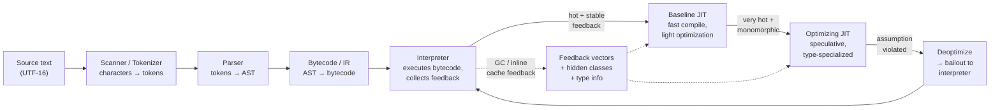
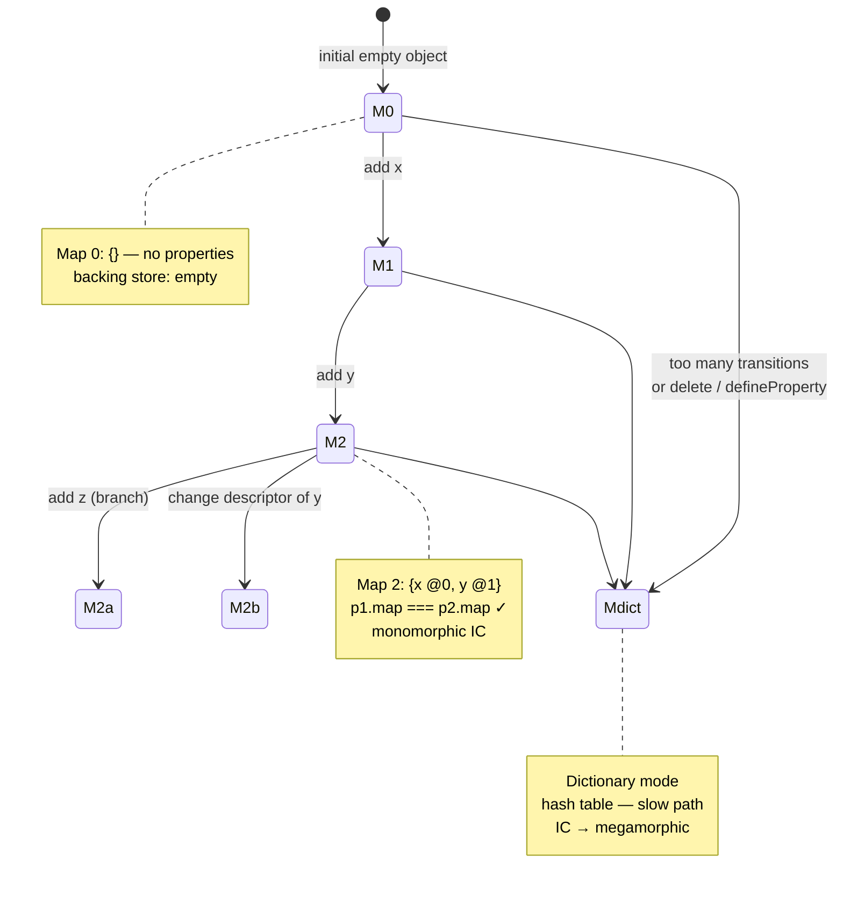
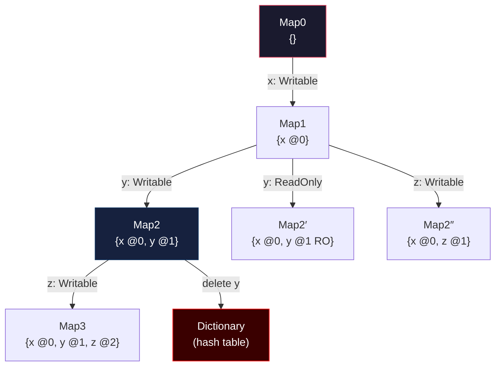
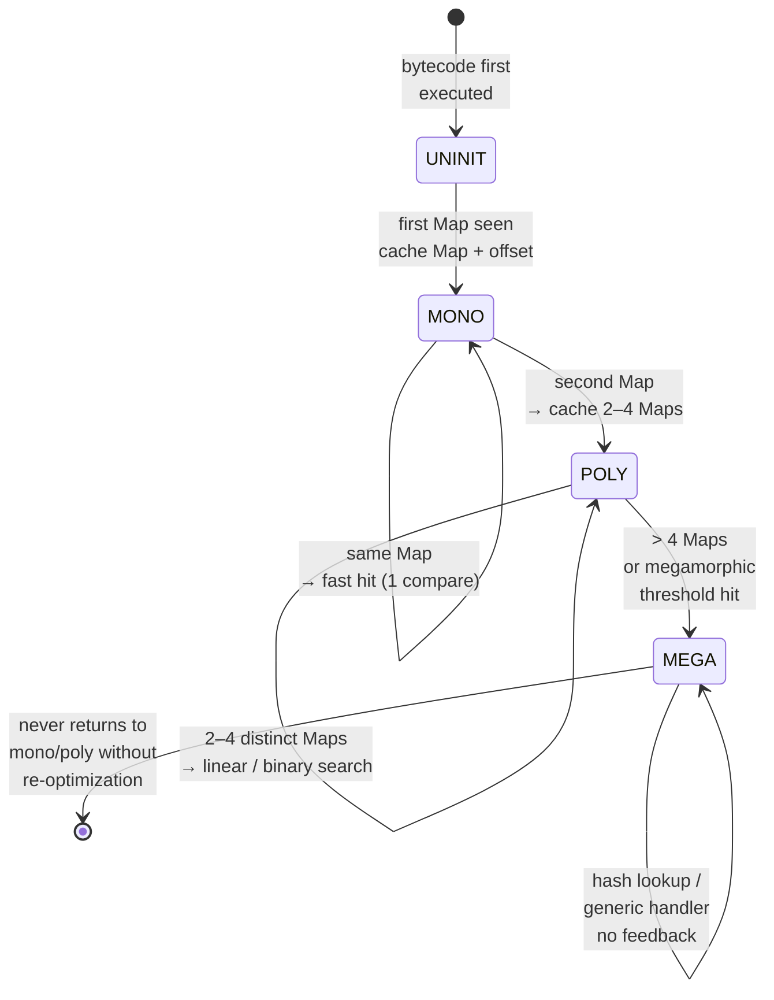
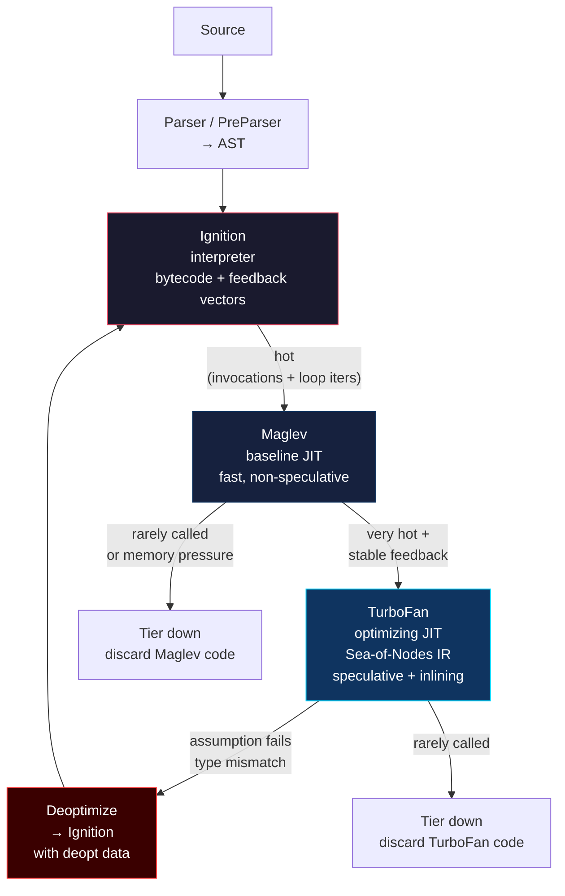
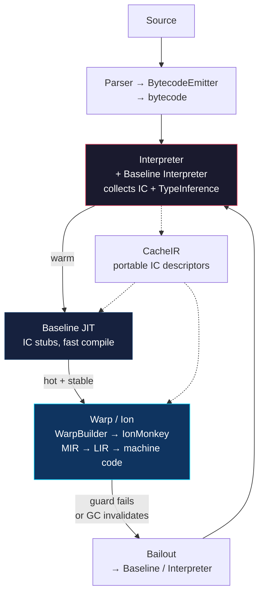
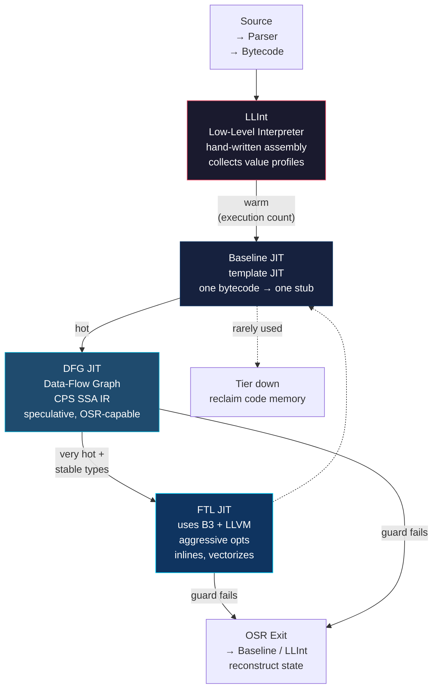

# Chapter 1 — JavaScript Engines: V8, SpiderMonkey, and JavaScriptCore

*What this chapter covers:* The anatomy of a modern JavaScript engine — from source text to machine code — and the concrete mechanisms that make dynamic JavaScript fast. We dissect the shared pipeline (parser, AST, bytecode, inline caches, optimizing compilation), then go engine-by-engine through V8 (Ignition / Maglev / TurboFan), SpiderMonkey (Baseline / Ion / Warp), and JavaScriptCore (LLInt / Baseline / DFG / FTL). Along the way you will trigger real hidden-class transitions, watch inline caches move through their states with `d8`, and trace a deoptimization bailout from optimized code back to the interpreter.

**Learning goals:**

- Explain the full engine pipeline — character stream, tokenizer, parser, AST, bytecode, feedback vectors, and tiered optimizing compilers — and why each stage exists.
- Describe V8's hidden classes (Maps), transition trees, and property-storage strategies, and predict when an object goes dictionary mode.
- Trace inline-cache states (uninitialized → monomorphic → polymorphic → megamorphic) and explain how ICs feed speculative optimization.
- Compare V8, SpiderMonkey, and JSC tiering architectures side-by-side, including what triggers tier-up and tier-down.
- Use `d8` and engine flags (`--print-ast`, `--print-bytecode`, `--trace-ic`, `--trace-opt`, `--print-opt-code`, `--allow-natives-syntax`) to observe engine internals on real code.
- Diagnose deoptimization: why it happens, what it costs, and how to avoid it in hot paths at fleet scale.
- Connect engine behavior to distributed-systems concerns: Node.js fleet performance variance, tail-latency amplification, and reproducible benchmarking.

---

## 1. Why a Backend Engineer Should Care About Engine Internals

JavaScript is no longer a browser-only language. Every Node.js service, every Cloudflare Worker, every edge function, and every server-side-rendered page runs on one of three engines. At scale — hundreds of services, thousands of containers, rolling deploys — engine behavior becomes infrastructure behavior.

A single polymorphic property load in a hot middleware path can keep V8 from inlining a function, adding microseconds per request. Multiply by 50,000 requests per second across a fleet and you have measurable CPU and tail-latency regression. A deoptimization storm after a deploy that changes object shape can spike p99 latency for minutes until the new code stabilizes in the optimizing compiler. Understanding *why* requires understanding the engine, not just the profiler.

This chapter treats the engine as a distributed-systems component: it is a JIT-compiled runtime with adaptive optimization, speculative assumptions, and fallback paths — not unlike a database query planner that picks execution strategies based on observed statistics.

## 2. The Universal Pipeline

Every modern engine follows the same high-level pipeline. Implementations differ in naming and number of tiers, but the stages are structurally identical.



Key idea: the engine does not compile JavaScript once. It compiles it *repeatedly*, each time with more information and more aggressive assumptions. The interpreter is not a legacy fallback — it is the profiling tier that makes optimization safe.

| Stage | Input | Output | Cost | Optimism |
|-------|-------|--------|------|----------|
| Scanner | characters | tokens | O(n) | none |
| Parser | tokens | AST | O(n) | none |
| PreParser (lazy) | tokens | function skeleton | O(n) | none |
| Bytecode gen | AST | bytecode + constant pool | O(n) | none |
| Interpreter | bytecode | results + feedback | low startup | none |
| Baseline JIT | bytecode + feedback | unoptimized machine code | medium | little |
| Optimizing JIT | bytecode + stable feedback | highly optimized machine code | high | speculative |

The scanner and parser run on the main thread and are latency-sensitive — they block first execution. Bytecode generation is where lazy parsing pays off: V8's preparser skips inner function bodies until they are first called, reducing parse cost on large bundles.

## 3. From Characters to AST

### 3.1 Tokenization and Parsing

The scanner converts a UTF-16 character stream into tokens (`Ident`, `Number`, `String`, `Punctuator`, `Keyword`). The parser — a recursive-descent parser in all three engines — builds an Abstract Syntax Tree. V8 has two parsers: the full parser and the preparser. SpiderMonkey and JSC use similar two-pass strategies.

Consider this minimal program:

```javascript
// example.js
function add(a, b) {
  return a + b;
}
const r = add(2, 3);
```

Dumping its AST with V8's `d8` shell (built from the V8 source with `gm x64.debug`):

```bash
# Build d8 (once — from the v8/ checkout)
# tools/dev/gm.py x64.release

# Print the AST for a snippet
./d8 --print-ast example.js
```

Trimmed output:

```
--- AST ---
FUNC at 0
. KIND 0
. SUSPEND COUNT 0
. NAME "add"
. PARAMS
. . VAR (0x123) "a"
. . VAR (0x124) "b"
. BLOCK NOCOMPLETIONS at -1
. . RETURN at 14
. . . ADD at 14
. . . . VAR PROXY "a" (0x123)
. . . . VAR PROXY "b" (0x124)
...
```

For `add(2, 3)`, the AST encodes `CALL` with `VAR PROXY` for `add` and two `LITERAL 2`/`LITERAL 3` arguments. Every node carries source position for stack traces and scope info for closures.

The raw AST is not executed directly. It is lowered to bytecode (V8 Ignition), or to a structured IR (SpiderMonkey's `BytecodeEmitter`, JSC's `BytecodeGenerator`). Bytecode is compact, position-independent, and easy to interpret — a good profiling substrate.

### 3.2 Bytecode

V8's Ignition bytecode for `add` looks like this (via `--print-bytecode`):

```bash
./d8 --print-bytecode --print-bytecode-filter=add example.js
```

```
[generated bytecode for function: add (0x1a2b...)]
Parameter count 3
Register count 0
Frame size 0
  12 S> 0x1a2b00001234 @    0 : 0b 02             LdaSmi [2]
       0x1a2b00001236 @    2 : 26 fb             Star r0
       0x1a2b00001238 @    4 : 0b 03             LdaSmi [3]
       ...
  14 E> 0x1a2b00001240 @    6 : 0d 02 00          Ldar a1
       0x1a2b00001243 @    9 : 4b fa 01          Add a1, [1]
       0x1a2b00001246 @   12 : ab                Return
```

Each handler is a small native function. `Ldar` loads an argument register, `Add` performs the addition — but not naively. `Add` consults the *feedback vector* for that bytecode offset: has this addition always been `Smi + Smi` (small integers)? If so, the optimizing compiler can emit a single integer add with an overflow check rather than a generic `ToNumber` + `NumberAdd` call.

SpiderMonkey and JSC bytecode are structurally similar — stack-based in JSC's LLInt, register-based in V8's Ignition — but all three share the feedback-vector idea: every property load, store, call, and arithmetic operation has a slot that records what types were seen. For `Add` at slot 1, the feedback vector might record `{ SmiAdd: 1200, NumberAdd: 0, Generic: 0 }` — if stable and monomorphic, TurboFan can emit a single checked `Int32Add`; otherwise the engine stays in the interpreter and keeps profiling.

## 4. Hidden Classes, Maps, and Shapes — Making Dynamic Objects Fast

JavaScript objects are hash maps in the spec. Real engines do not implement them as hash maps in the fast path. Instead, they assign every object a *hidden class* — called **Map** in V8, **Shape** in SpiderMonkey, **Structure** in JSC — that describes the object's layout: property names, offsets, and attributes.

### 4.1 The Core Idea

When you write:

```javascript
function Point(x, y) {
  this.x = x;
  this.y = y;
}

const p1 = new Point(1, 2);
const p2 = new Point(3, 4);
```

Both `p1` and `p2` share the same Map because they added properties in the same order. The Map says: offset 0 is `x`, offset 1 is `y`, both writable data properties, stored inline. Property access `p1.x` becomes a single indexed load — no hash lookup — guarded by a Map check.



### 4.2 Transition Trees

Maps form a *transition tree* (a trie). Each edge is labeled by the property being added and its attributes.



Critical property: objects that follow the same transition path *share* Maps. The engine can then optimize for a specific Map — if `p1.map === p2.map`, the offset of `x` is a compile-time constant. If a third object `p3` adds `y` before `x`, it takes a different branch and gets a different Map. Code that handles both `p1` and `p3` becomes polymorphic.

Concrete example showing the cost:

```javascript
// monomorphic — one Map
function sumPoints(points) {
  let s = 0;
  for (const p of points) s += p.x + p.y; // IC sees one Map
  return s;
}

// polymorphic — two Maps alternating
const a = { x: 1, y: 2 };       // Map2
const b = { y: 2, x: 1 };       // Map2″ — different order!
sumPoints([a, b, a, b, a, b]);  // IC becomes polymorphic

// megamorphic — many Maps
const many = [];
for (let i = 0; i < 200; i++) {
  const o = {};
  o["prop" + i] = i;            // each object has a distinct Map
  many.push(o);
}
```

Observe the transition with `--allow-natives-syntax` (requires `d8` built with natives syntax):

```javascript
// map-transitions.js — run with: d8 --allow-natives-syntax map-transitions.js

function Point(x, y) { this.x = x; this.y = y; }

const p1 = new Point(1, 2);
console.log(%HaveSameMap(p1, new Point(3, 4))); // true — same transitions

const q = {};
q.y = 2;
q.x = 1;
console.log(%HaveSameMap(p1, q));               // false — y before x

// Inspect maps directly
%DebugPrint(p1);
%DebugPrint(q);

// Adding a property out of order forces a new branch
const r = new Point(5, 6);
r.z = 7;   // Map2 → Map3  (x,y → x,y,z)
console.log(%HaveSameMap(r, p1));               // false — r has extra transition

// Deleting forces dictionary mode
delete r.z;
%DebugPrint(r); // → map transitions to dictionary / hash table
```

```bash
./d8 --allow-natives-syntax --trace-maps map-transitions.js 2>&1 | head -40
```

```
[TraceMaps: InitialMapCreation Map 0x1a2b... for Point]
[TraceMaps: Transition from Map 0x1a2b... to Map 0x1a2c... for "x"]
[TraceMaps: Transition from Map 0x1a2c... to Map 0x1a2d... for "y"]
[TraceMaps: HaveSameMap true]
[TraceMaps: Transition from Map 0x... to Map 0x... for "y"]  // q.y
[TraceMaps: Transition from Map 0x... to Map 0x... for "x"]  // q.x — different branch
[TraceMaps: HaveSameMap false]
```

### 4.3 Storage Details

- **Inline vs. out-of-line:** V8 stores the first N properties (typically 4–8 depending on object size) directly in the object header (in-object properties). Overflow goes to a separate `PropertyArray`.
- **Elements vs. properties:** Integer-indexed properties (`arr[0]`) live in the *elements* backing store, which has its own kind lattice (`PACKED_SMI_ELEMENTS → PACKED_DOUBLE_ELEMENTS → PACKED_ELEMENTS → HOLEY_* → DICTIONARY_ELEMENTS`). A single `arr[100000] = 1` or `delete arr[0]` can hole-ify or dictionary-ify an array permanently.
- **Attributes matter:** Making a property non-writable, non-enumerable, or accessor-based creates a distinct Map branch. `Object.defineProperty(obj, "x", { value: 1, writable: false })` is a different transition than `obj.x = 1`.

```javascript
// Elements kind transitions — observable via %HasFastElements / %DebugPrint
const arr = [1, 2, 3];
%DebugPrint(arr);              // PACKED_SMI_ELEMENTS

arr.push(4.5);
%DebugPrint(arr);              // PACKED_DOUBLE_ELEMENTS (widened)

arr.push("hello");
%DebugPrint(arr);              // PACKED_ELEMENTS

arr[100] = 99;                 // hole
%DebugPrint(arr);              // HOLEY_ELEMENTS — deoptimization risk for loops
```

### 4.4 Why This Matters at Scale

Hidden classes are a *global* resource. Two teams adding properties to the same shared object type in different orders — say, two microservices constructing the same event envelope — create polymorphism that slows every consumer. Enforcing a single factory function or using `class` syntax (which guarantees consistent property order) is not a style preference; it is a performance contract.

## 5. Inline Caches

Hidden classes make property access fast *if* the engine knows which Map to expect. Inline caches are the mechanism that remembers.

### 5.1 How an IC Works

Every property access site in bytecode has an IC slot. The first time the code runs, the slot is **uninitialized**. On the first execution it records the Map it saw and the offset. On subsequent executions, it compares the object's Map against the cached one — a single pointer comparison — and if it matches, loads at the cached offset immediately.



V8's thresholds (as of mid-2025, subject to tuning): monomorphic is 1 Map, polymorphic caches up to 4 Maps (configurable), beyond that → megamorphic. SpiderMonkey and JSC have similar cutoffs but different constants.

### 5.2 Observing ICs with d8

```javascript
// ic-demo.js
function getX(o) { return o.x; }

const a = { x: 1, y: 2 };
const b = { y: 2, x: 1 };  // different Map

// Warm up — monomorphic
for (let i = 0; i < 10000; i++) getX(a);

// Now introduce a second Map — polymorphic
for (let i = 0; i < 10000; i++) getX(i % 2 === 0 ? a : b);

// Megamorphic — many distinct Maps
for (let i = 0; i < 10000; i++) {
  const o = {};
  o["k" + (i % 20)] = i;   // 20 different Maps — over threshold
  getX(o);
}
```

```bash
./d8 --trace-ic ic-demo.js 2>&1 | grep -E "GetX|LoadIC|StoreIC|megamorphic"
```

Representative trimmed output:

```
[TraceIC] LoadIC at getX:0 (uninitialized -> monomorphic) map=0x1a2b... offset=8
[TraceIC] LoadIC at getX:0 monomorphic hit (map=0x1a2b... count=9999)
[TraceIC] LoadIC at getX:0 monomorphic miss -> polymorphic (maps=[0x1a2b..., 0x1a2c...])
[TraceIC] LoadIC at getX:0 polymorphic hit
[TraceIC] LoadIC at getX:0 polymorphic -> megamorphic (exceeded max polymporphic maps)
[TraceIC] LoadIC at getX:0 megamorphic (generic handler, no map check)
```

Additional flags for deeper inspection:

```bash
# Verbose IC + map transitions + optimization history
./d8 --trace-ic --trace-maps --trace-opt --trace-deopt ic-demo.js 2>&1 | less

# Dump the feedback vector for a function
./d8 --allow-natives-syntax --print-feedback-vectors ic-demo.js
# %DebugPrint(getX) also shows feedback vector slots

# Per-site IC state via internal method (when available)
./d8 --allow-natives-syntax -e '
  function getX(o){ return o.x; }
  const a={x:1}, b={x:2};
  %DebugPrint(getX);
'
```

### 5.3 ICs and Speculative Optimization

IC feedback is not just an optimization itself — it is the *input* to the optimizing compiler. TurboFan, Ion, and FTL all read feedback vectors to decide what types to speculate on. A monomorphic `o.x` load becomes "guard that `o` has Map M, then load at offset 8" — no hash, no branch on type. A megamorphic site becomes "call the generic runtime handler" — no speculation possible, no inlining.

This is why a single megamorphic site in a hot function can prevent the entire function from being optimized, or force it to deoptimize repeatedly. The IC state is the canary.

## 6. V8 — Ignition, Maglev, and TurboFan

V8 (Chrome, Node.js, Deno, Cloudflare Workers) has the most documented and most tiered architecture. As of 2024–2025, production V8 uses three execution tiers plus the parser:



### 6.1 Ignition — The Interpreter

Ignition is a register-based bytecode interpreter with an accumulator model. Bytecode handlers are hand-written in a DSL called CodeStubAssembler and compiled ahead of time. Every bytecode dispatches through a jump table; feedback is collected inline in `FeedbackVector` slots.

- **Startup:** Ignition code is generated synchronously on first parse — no background thread needed. This keeps first-paint latency low.
- **Feedback:** Each `LdaNamedProperty`, `CallProperty`, `Add`, etc. has a slot recording Maps, call targets, and arithmetic types.
- **On-Stack Replacement (OSR):** Hot loops can OSR from Ignition directly mid-iteration without waiting for the function to be re-entered.

### 6.2 Maglev — Mid-Tier Baseline JIT (Since V8 11.x)

Maglev sits between Ignition and TurboFan. Before Maglev, there was Sparkplug (a non-optimizing baseline compiler). Maglev replaced Sparkplug in most configurations because it is faster to compile *and* faster to execute — it uses faster register allocation and copies Ignition's bytecode with light optimization, without speculative guards.

- **When it triggers:** After a function has been executed N times or a loop has iterated M times (heuristics tuned per platform; roughly single-digit invocations on desktop, higher on mobile).
- **What it does:** Translates Ignition bytecode to machine code one-to-one, performs simple constant folding, and retains IC feedback collection — but does not speculate on types. The resulting code is faster than interpretation but not yet near peak.
- **Why it matters:** Maglev reduces the time spent in the interpreter before TurboFan kicks in. For short-lived Node.js request handlers that never get hot enough for TurboFan, Maglev *is* the peak tier.

### 6.3 TurboFan — The Optimizing Compiler

TurboFan is a sea-of-nodes optimizing compiler. It consumes Ignition bytecode plus the feedback vector, builds a graph IR, and applies ~100 optimization passes: inlining, escape analysis, loop unrolling, range analysis, load elimination, and type specialization.

The critical mechanism is *speculation*: TurboFan emits guards — cheap Map checks, type checks, bounds checks, overflow checks — and assumes they pass. If they do, the optimized code is dramatically faster (inlined property loads, unboxed numbers, eliminated bounds checks). If any guard fails, the entire optimized frame is deoptimized. The pipeline is Bytecode + FeedbackVector → Sea-of-Nodes IR graph → inlining and escape analysis → type/range narrowing → optimized machine code with guards; if all guards pass the fast path runs with no runtime calls, otherwise the engine bails out to Ignition via the deoptimization table.

Example of what TurboFan can elide:

```javascript
// Before optimization — generic
function sum(arr) {
  let total = 0;
  for (let i = 0; i < arr.length; i++) total += arr[i];
  return total;
}
```

With stable feedback (`arr` always `PACKED_SMI_ELEMENTS`, `total` always `Smi`):

- `arr.length` load → Map guard + inline offset load (no dictionary lookup).
- `arr[i]` → bounds check + single indexed load (no elements-kind check in the hot loop if hoisted).
- `total += ...` → `Int32Add` with overflow check; overflow bails to BigInt/double path.
- Loop → unrolled or strength-reduced if profitable.

If any assumption is wrong — `arr` arrives with `PACKED_DOUBLE_ELEMENTS`, or `total` overflows Smi range — the guard fails and `sum` deoptimizes.

### 6.4 Observing Tiers with d8

```bash
# Trace optimization, deoptimization, and tier transitions
./d8 --trace-opt --trace-deopt --trace-maglev --trace-turbo ic-demo.js

# Print optimized code (Intel syntax) for a function named sum
./d8 --print-opt-code --print-opt-code-filter=sum --code-comments sum-demo.js

# Force optimization / deoptimization via natives syntax
./d8 --allow-natives-syntax -e '
  function sum(arr) {
    let t = 0;
    for (let i = 0; i < arr.length; i++) t += arr[i];
    return t;
  }
  const a = [1,2,3,4,5];
  // Warm up through Ignition → Maglev → TurboFan
  for (let i = 0; i < 20000; i++) sum(a);
  %OptimizeFunctionOnNextCall(sum);
  sum(a); // next call triggers TurboFan compilation
  console.log(%GetOptimizationStatus(sum)); // bitmask: optimized?
  // Break the assumption — holey array forces deopt
  a[100] = 1;
  sum(a);
  console.log(%GetOptimizationStatus(sum));
'
```

`%GetOptimizationStatus` returns a bitmask (V8 version-dependent — consult `runtime.h`):

| Bit | Meaning |
|-----|---------|
| 1 | Function is optimized |
| 2 | Function is optimized by TurboFan |
| 4 | Function was never optimized |
| 16 | Function may have been deoptimized |

Printed optimized-code snippet (trimmed, x64):

```asm
; TurboFan code for sum — prologue
0x1a2b0000b000    cmp  [rdi+0x18], MapForPackedSmiElements  ; Map guard
0x1a2b0000b008    jnz  DeoptimizeBailout                    ; bailout if wrong Map
0x1a2b0000b00e    mov  rbx, [rdi+0x10]                      ; load elements backing store
0x1a2b0000b012    mov  ecx, [rdi+0x14]                      ; load length
; ... loop body: single add, no runtime call ...
0x1a2b0000b040    jo   DeoptimizeBailout                    ; overflow check
```

## 7. SpiderMonkey — Baseline, Ion, and Warp

SpiderMonkey (Firefox, SpiderNode) has converged on a similar shape but with different naming and history.



### 7.1 Baseline Interpreter and Baseline JIT

SpiderMonkey's Baseline tier is split: a Baseline Interpreter (the default execution tier since ~2022) and a Baseline JIT that compiles bytecode to machine code using generated IC stubs. The key abstraction is **CacheIR**: instead of emitting machine code directly for each IC, the engine emits a portable CacheIR sequence (a linear IR describing the cache logic). CacheIR is then compiled to machine code by the Baseline JIT or consumed by Warp/Ion for optimization. This makes IC logic shareable across tiers.

### 7.2 Warp and IonMonkey

Warp (shipped ~2021) replaced the older Ion Builder. Warp transpiles bytecode + CacheIR + type inference data into IonMonkey's MIR (Middle-level IR). The WarpBuilder runs on a background thread; when it finishes, the function is patched to jump to Ion code.

- **MIR** — SSA-based, high-level, speculative (type guards, shape guards).
- **LIR** — Low-level IR after register allocation.
- **Bailouts** — Ion frames capture snapshot state so they can reconstruct interpreter/Baseline frames on guard failure. SpiderMonkey bails to Baseline, not directly to the interpreter, which makes re-optimization faster.

Warp's advantage is compile speed: by reusing CacheIR as its input, it avoids re-analyzing every IC from scratch. This was critical for large web apps where Ion's old builder was a compile-time bottleneck.

### 7.3 Tuning

SpiderMonkey exposes tiering decisions via prefs and env vars, but unlike `d8`, there is no single `--trace-opt` flag for SpiderMonkey's `js` shell — instead:

```bash
# SpiderMonkey js shell (built from mozilla-central)
./js --help | grep -i baseline

IONFLAGS=help ./js script.js          # Ion optimization trace
CACHEIR_LOGS=1 ./js script.js         # CacheIR stub generation
```

## 8. JavaScriptCore — LLInt, Baseline, DFG, and FTL

JavaScriptCore (Safari, Bun) has *four* execution tiers — the most of any engine — betting that finer granularity wins on heterogeneous Apple hardware (high-efficiency vs. high-performance cores).



### 8.1 LLInt — The Assembly Interpreter

LLInt is not a bytecode loop in C — it is hand-written assembly (generated from `offlineasm` templates) that dispatches bytecode with computed `goto` / jump tables. Its job is to start executing immediately (no JIT compile delay) and to profile values flowing through each bytecode: what types appear at each `GetById`, what callees appear at each `Call`.

### 8.2 Baseline JIT

The Baseline JIT is a *template JIT*: each bytecode has a pre-written assembly template that is stamped out and patched together. It is very fast to compile (no IR, no optimization) and produces code roughly 2–3× faster than LLInt. It continues to collect profiling data.

### 8.3 DFG JIT

DFG (Data Flow Graph) builds a CPS-style SSA graph from bytecode + profiling data. It is speculative: it emits `CheckStructure` / `CheckType` guards and optimizes under the assumption they pass. DFG supports OSR entry (compile a hot loop without waiting for the function to re-enter) and OSR exit (bail mid-function back to Baseline). A key JSC strength is DFG's handling of *polyvariant inlining* — it can inline the same callee at multiple call sites with different speculative types.

### 8.4 FTL JIT

FTL (Faster Than Light) is the top tier. DFG code that remains hot is recompiled via two backends: **B3** (Bare Bones Backend, JSC's own optimizing IR) and optionally **LLVM** for the most aggressive optimizations (loop vectorization, heavy inlining, global value numbering). FTL can do optimizations that DFG cannot afford because FTL compilation runs on a background thread with fewer latency constraints. The tradeoff is compile time and memory — FTL code is large, so JSC is aggressive about discarding it when functions cool down.

### 8.5 Choosing a Tier

JSC's tiering is driven by execution counters + profiling stability + memory pressure. On iOS, where memory is constrained, JSC may never promote to FTL; on macOS with abundant memory, it does eagerly. This makes performance *device-dependent* — a hot path that is FTL-optimized on a developer's MacBook may remain in DFG or Baseline on a low-end device or in a memory-constrained container.

### 8.6 Cross-Engine Tier Comparison

| Dimension | V8 | SpiderMonkey | JSC |
|-----------|----|--------------|-----|
| Interpreter | Ignition (bytecode) | Baseline Interpreter | LLInt (assembly) |
| Baseline JIT | Maglev | Baseline JIT (CacheIR) | Baseline JIT (template) |
| Optimizing JIT(s) | TurboFan | Ion via Warp | DFG → FTL (B3/LLVM) |
| IC abstraction | Feedback vectors + handlers | CacheIR | Value profiles + structure checks |
| Hidden class name | Map | Shape | Structure |
| Deopt target | Ignition | Baseline | Baseline / LLInt |
| OSR entry | yes (Ignition→TurboFan, loop) | yes (Warp) | yes (DFG, FTL) |
| Background compile | TurboFan, Maglev | WarpBuilder | DFG, FTL |

## 9. Deoptimization — When Speculation Fails

Optimized code is correct *only* as long as every guard holds. When a guard fails — a Map changed, a type was unexpected, an array went holey, an overflow occurred — the engine must abandon the optimized frame and reconstruct interpreter (or baseline) state. This is **deoptimization** (V8/TurboFan), **bailout** (SpiderMonkey/Ion), or **OSR exit** (JSC/DFG/FTL).

### 9.1 What Triggers a Bailout

- Map mismatch: a monomorphic site saw a new Map.
- Type mismatch: `Smi + Smi` guard failed because a `double` arrived.
- Elements kind transition: `PACKED_SMI_ELEMENTS → HOLEY_DOUBLE_ELEMENTS`.
- Overflow: `Int32Add` overflowed into double/BigInt range.
- `delete`, `Object.defineProperty`, `Object.setPrototypeOf` — all can invalidate Maps/structure assumptions.
- `eval`, `with`, `arguments` aliasing (spoils scope analysis).

### 9.2 The Bailout Mechanism

The optimizing compiler embeds *deoptimization data* — a side table mapping each guard site to the interpreter frame it should materialize if that guard fails. When a guard fails, the runtime:

1. Captures the optimized frame's registers and spills.
2. Looks up the deopt table for that program counter.
3. Materializes interpreter frames (and inlined callee frames) from the captured state.
4. Jumps to the interpreter at the corresponding bytecode offset.

```mermaid
sequenceDiagram
    participant OPT as TurboFan code<br/>(optimized sum)
    participant GUARD as Guard:<br/>Map == M2?
    participant RUNTIME as Deoptimization<br/>runtime
    participant DEOPT as Deopt table<br/>+ side exits
    participant INTERP as Ignition<br/>interpreter

    OPT->>GUARD: load arr[0]<br/>check arr.map == M2
    GUARD-->>OPT: miss (arr.map == M3)
    OPT->>RUNTIME: trap — guard failed<br/>at pc 0x1a2b...b012
    RUNTIME->>DEOPT: lookup deopt id 42<br/>→ bytecode offset 9<br/>→ register mapping
    DEOPT-->>RUNTIME: frame translation:<br/>rax→acc, rbx→r0, ...
    RUNTIME->>INTERP: materialize<br/>interpreter frame<br/>+ inlined frames
    INTERP->>INTERP: resume at<br/>bytecode offset 9<br/>generic Add handler
    Note over OPT,INTERP: Optimized code stays<br/>installed but is now<br/>marked for deopt.<br/>Re-opt requires<br/>new feedback.
```

Cost: the bailout itself is microseconds, but the *aftermath* is expensive — the function is now running in the interpreter/baseline tier. If it remains hot, it will be re-optimized, but re-optimization re-profiles from scratch and may take thousands of future calls to re-stabilize. A tight loop that alternates types can ping-pong between optimized and deoptimized code — a *deoptimization storm*.

### 9.3 Observing Deoptimization

```javascript
// deopt-demo.js
function add(a, b) { return a + b; }

// Stabilize as Smi + Smi
for (let i = 0; i < 20000; i++) add(i | 0, 1);

%OptimizeFunctionOnNextCall(add);
add(1, 2); // → optimized for Smi

console.log("status before deopt:", %GetOptimizationStatus(add));

// Break the assumption — strings force generic path
add("hello", " world");
console.log("status after deopt:", %GetOptimizationStatus(add));
```

```bash
./d8 --allow-natives-syntax --trace-opt --trace-deopt deopt-demo.js 2>&1
```

```
[marking add for optimization]
[completed optimizing add]
[status before deopt: 129]   # 0x81 — optimized by TurboFan
[deoptimize: add (reason: not a Smi, bailout id 3)]
[status after deopt: 97]     # deoptimized, now unoptimized
```

Additional diagnostics:

```bash
# Count deopts and reasons
./d8 --trace-deopt --trace-opt-stats deopt-demo.js 2>&1 | grep deopt

# Full IR + deopt table for a function
./d8 --print-opt-code --print-deopt-stress deopt-demo.js 2>&1 | less

# Force stress deoptimization (every eligible guard bails) — for testing
./d8 --deopt-every-n-times=1000 stress-test.js
```

### 9.4 Avoiding Deoptimization in Hot Code

Principles (engine-agnostic):

- **Monomorphism:** Keep call sites and property accesses monomorphic. One Map per site, one callee per call site. Use factory functions and `class` to guarantee it.
- **Stable types:** Do not mix `number` and `string` through the same `+` site; do not mix `Smi` and `double` through the same loop if the loop is TurboFan-optimized.
- **Stable shapes:** Do not `delete` properties, do not `Object.defineProperty` after construction, do not add properties conditionally in different orders. Seal the shape at construction time.
- **Stable elements kinds:** Initialize arrays fully; avoid holes; do not mix element types in performance-critical arrays. Pre-allocate with `new Array(n)` only if you fill every slot before use.
- **No prototype mutation:** `Object.setPrototypeOf` invalidates structure assumptions globally — never in hot code.
- **Minimize `arguments` and `eval`:** Both disable many optimizations in the enclosing function.

```javascript
// ❌ Deopt-prone: conditional shape
function makeEvent(type, payload) {
  const e = { type };
  if (payload) e.payload = payload; // sometimes 1 prop, sometimes 2 → 2 Maps
  if (type === "error") e.code = 500; // 3rd branch
  return e;
}

// ✅ Stable shape: always same properties, same order
function makeEventStable(type, payload) {
  return {
    type,
    payload: payload ?? null, // always present
    code: type === "event" ? null : 500,
  };
}
// Monomorphic: every call site sees one Map. TurboFan inlines the loads.
```

For hot loops, the most common deoptimization root cause in production Node.js services is *elements kind polymorphism*: an array that is usually `PACKED_SMI_ELEMENTS` but occasionally receives a `double` or a hole. The mitigation is to either keep arrays homogeneous or to split hot paths by kind.

## 10. Putting It Together — Tier-Up and Tier-Down Lifecycle

A function does not stay at one tier forever. Counters, feedback stability, memory pressure, and guard failures drive continuous tier transitions — cold (Ignition / LLInt) warms to Maglev / Baseline JIT after a few invocations or loop iterations, promotes to TurboFan / Ion / DFG when feedback is hot and stable, and can reach FTL or a re-optimized TurboFan tier when very hot with no recent bailouts. Any guard failure bails back to the warm tier; cool-down or memory pressure discards JIT code and tiers down to cold, with re-invocation restarting the cycle through re-profiling.

In V8 specifically, as of 2025:

- **Ignition → Maglev:** ~1–5 invocations or ~10 loop iterations (varies by embedded vs. desktop heuristics).
- **Maglev → TurboFan:** ~100–10,000 invocations depending on function size and feedback stability; compilation runs on a background thread (concurrent recompilation). Short functions tier up faster.
- **Tier down:** JIT code is held weakly. On memory pressure or after a period of non-use, the GC discards it. The next call re-enters Ignition and the cycle restarts. Node.js services with large codebases and infrequent code paths benefit from tier-down because it bounds code memory — but it means p99 latency includes re-optimization jitter after a cold period.

JSC and SpiderMonkey follow the same lifecycle with different thresholds and with LLInt/Baseline as the cold tier.

## 11. Instrumentation Cookbook

A runnable checklist of `d8` / `js` / `jsc` flags useful during investigation. These require shells built from engine source — not the `node` binary (Node embeds V8 but does not expose most `d8` flags; use `d8` or a `node --allow-natives-syntax` subset).

```bash
# --- V8 (d8) ---
# AST + bytecode
./d8 --print-ast script.js
./d8 --print-bytecode --print-bytecode-filter=myFunction script.js

# Feedback vectors and maps
./d8 --allow-natives-syntax --print-feedback-vectors script.js
./d8 --allow-natives-syntax --trace-maps script.js

# Inline caches
./d8 --trace-ic script.js

# Optimization and deoptimization
./d8 --trace-opt --trace-deopt --trace-opt-stats script.js
./d8 --print-opt-code --print-opt-code-filter=myFunction --code-comments script.js
./d8 --trace-maglev --trace-turbo script.js  # tier transitions (version-dependent)

# Natives syntax helpers (in JS)
# %HaveSameMap(a, b)          — do a and b share a Map?
# %HasFastProperties(obj)     — is obj still in fast mode?
# %HasFastElements(arr)       — are elements still fast?
# %DebugPrint(obj)            — dump Map, properties, elements kind
# %OptimizeFunctionOnNextCall(fn)
# %GetOptimizationStatus(fn)  — bitmask
# %NeverOptimizeFunction(fn)  — pin to Ignition (for baselines)
# %DeoptimizeFunction(fn)     — force deopt (for testing bailout recovery)

# Stress / fuzz tiering
./d8 --deopt-every-n-times=1000 --opt fid=script.js

# --- SpiderMonkey (js shell) ---
IONFLAGS=help  ./js script.js
CACHEIR_LOGS=1 ./js script.js

# --- JSC (jsc shell) ---
# jsc --help lists --thresholdForJITAfterWarmUp, etc.
./jsc --dumpBytecode script.js
./jsc --logExecutableAllocation script.js
```

In production Node.js (where `d8` flags are unavailable), the closest equivalents are:

```bash
# Node's built-in V8 diagnostics
node --trace-opt --trace-deopt app.js 2>&1 | head -100     # some V8 builds expose these
node --trace-ic app.js                                     # if built with v8_enable_trace_ic

# Perf + V8 runtime call stats
node --perf-basic-prof --interpreted-frames-native-stack app.js
node --runtime-call-stats app.js  2>&1 | grep -i "Map\|IC\|Deopt"

# Sampling profiler → look for %Deoptimize, %OptimizeFunctionOnNextCall markers
node --prof app.js && node --prof-process isolate-*.log | less
```

## 12. Distributed-Systems Lens — Engines at Fleet Scale

Engines are deterministic per input, but fleet behavior is not. The same JavaScript bundle runs on thousands of containers with different CPU features, memory limits, and warm-up histories. Several engine properties amplify into systemic effects.

### 12.1 Warm-Up Skew and Tail Latency

Tiered compilation means the first N requests to a freshly started Node.js pod run slower (Ignition/Maglev) than the next N (TurboFan). During a rolling deploy, pods are at different warm-up phases — the load balancer sees latency variance that is not caused by downstream dependencies. Canary analysis that compares canary vs. baseline p50 may miss the effect; p95/p99 diverges first.

Mitigations: *warm-up probes* that hit critical endpoints before the pod joins the pool; *code caching* (`v8.compile.cache` / Node's `--compile-cache`); and avoiding deploys that change hot object shapes, which would force every pod through a new optimization cycle.

### 12.2 Performance Non-Reproducibility

Two engineers benchmarking the same endpoint can get different numbers because TurboFan decisions depend on *history*: what argument types and Maps were seen before the measurement. A microbenchmark that runs in isolation often optimizes differently than the same function in production where it shares ICs with other callers. Always benchmark with production-like feeding: warm the function with realistic Maps and types before timing, and run `--trace-deopt` to verify the optimized code survived the measurement.

### 12.3 One Megamorphic Site, Many Callers

A shared utility — say, `get(obj, path)` in a large monorepo — accumulates IC states from every caller. If any team passes many heterogeneous Maps through it, the site goes megamorphic and *every* caller pays, even the ones that were monomorphic before. This is the IC equivalent of a noisy neighbor. The fix is to split the generic path from the fast path (e.g., a monomorphic fast path for the common `Map` plus a generic fallback), or to avoid the shared generic accessor in hot code entirely.

### 12.4 Elements Kind as a Distributed Contract

An event queue service that serializes arrays as JSON and a consumer that deserializes them share an implicit contract: the elements kind of those arrays. If the producer starts emitting `null` holes for missing values, every consumer that does `for (let i = 0; i < arr.length; i++)` may tier-down from an optimized `PACKED_SMI_ELEMENTS` loop to a holey-elements loop with a hole check per iteration. Schema validation at the boundary (e.g., "arrays are dense and homogeneous") is also a performance guarantee.

### 12.5 Engine Version as a Deploy Risk

V8, SpiderMonkey, and JSC ship with the embedding runtime. A Node.js minor upgrade (e.g., Node 20.11 → 20.13) may include a V8 point release that changes Maglev heuristics, IC thresholds, or the `PACKED → HOLEY` transition rules. Performance can shift without any application code change. Treat engine upgrades like any other infrastructure migration: benchmark on a canary, track deoptimization rates, and correlate latency with the engine version label in your metrics.

## Key Takeaways

- The engine pipeline is parser → AST → bytecode + feedback vectors → tiered JITs. The interpreter is the profiler; JITs are speculative consumers of that profile.
- Hidden classes (V8 Maps / SpiderMonkey Shapes / JSC Structures) turn hash-map objects into indexed structs. Sharing Maps across instances requires constructing objects in the same property order — use factories and `class`.
- Each property access site has an inline cache that moves through uninitialized → monomorphic → polymorphic (≤4 Maps) → megamorphic. Monomorphic is a single pointer compare; megamorphic is a generic handler with no optimization feedback.
- V8 tiers Ignition → Maglev → TurboFan; SpiderMonkey tiers Baseline Interpreter → Baseline JIT (CacheIR) → Warp/Ion; JSC tiers LLInt → Baseline → DFG → FTL (B3/LLVM). All three tier up on hotness + stable feedback and tier down on cool-down or memory pressure, and all support OSR entry/exit.
- Deoptimization reconstructs interpreter/baseline frames from optimized frames using a deopt table. A single guard failure discards the optimized code for that function; re-optimization requires new stable feedback. Deoptimization storms are a real tail-latency risk.
- `d8 --print-ast`, `--print-bytecode`, `--trace-ic`, `--trace-maps`, `--trace-opt/--trace-deopt`, `--print-opt-code`, and `%HaveSameMap` / `%GetOptimizationStatus` / `%DebugPrint` let you observe every stage on real code. Use them before trusting a microbenchmark.
- At fleet scale, engines create warm-up skew, non-reproducible benchmarks, noisy-neighbor IC pollution, and version-dependent performance shifts. Treat Maps, IC states, and elements kinds as cross-team contracts, and instrument deoptimization rates as a service health signal.

## Further Reading

- V8 documentation — <https://v8.dev/docs> (Ignition, TurboFan, Maglev, hidden classes, inline caches, deoptimization).
- V8 blog — "An Introduction to Speculative Optimization in V8" (2017), "Maglev — V8's Fastest Optimizing JIT" (2023), "Sparkplug — A Non-Optimizing JS Compiler" (2021) — <https://v8.dev/blog>.
- "V8 Internals for JavaScript Developers" — Mathias Bynens & Benedikt Meurer (JSConf / dotJS talks) — <https://v8.dev/blog/cost-of-javascript-2019>.
- SpiderMonkey Internals — CacheIR, WarpBuilder, IonMonkey — <https://firefox-source-docs.mozilla.org/js/index.html> and <https://spidermonkey.dev/>.
- JavaScriptCore — "Introducing the WebKit FTL JIT" (Fil Pizlo, 2014), "Speculation in JavaScriptCore" — <https://webkit.org/blog/> (search FTL, DFG, LLInt, B3).
- ECMA-262 — ECMAScript Language Specification (living standard) — <https://tc39.es/ecma262/> (normative property-lookup and prototype-chain semantics that engines optimize).
- "Optimization Killers" — Bluebird wiki / Petka Antonov — <https://github.com/petkaantonov/bluebird/wiki/Optimization-killers> (historical but still instructive checklist; verify each claim against current engine behavior).
- Node.js performance diagnostics — <https://nodejs.org/api/perf_hooks.html> and `node --prof` / `node --prof-process` documentation.

