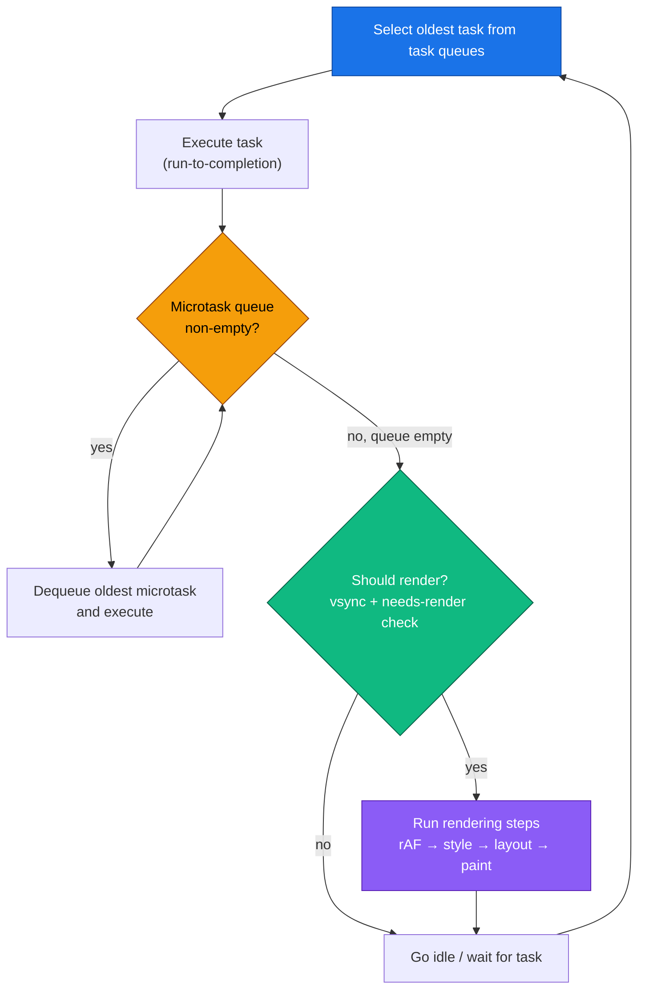
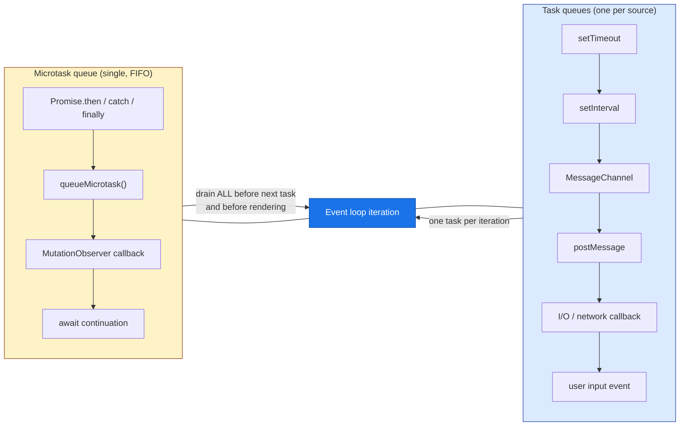
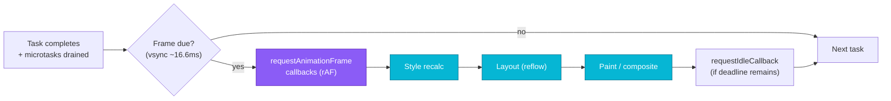
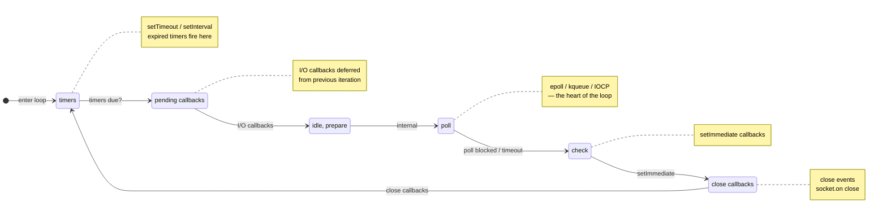
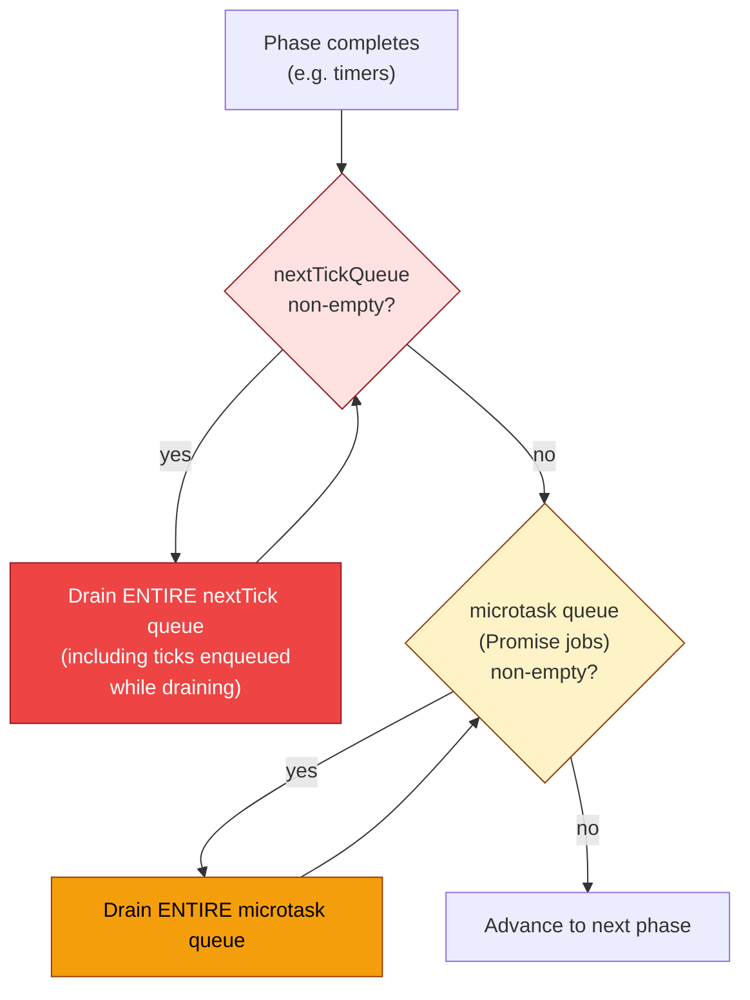
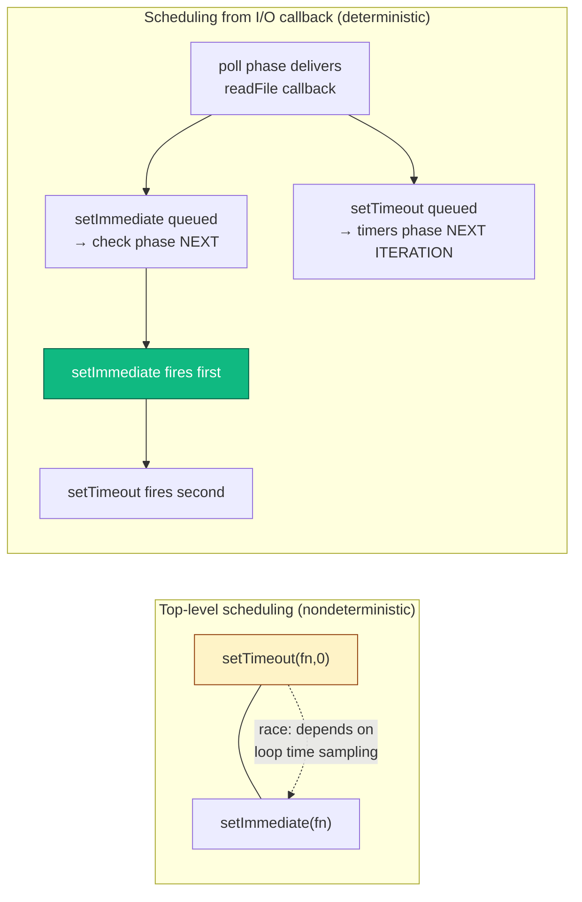
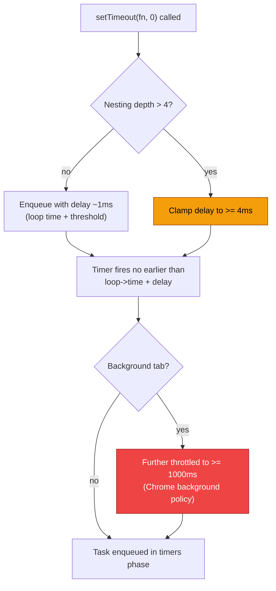
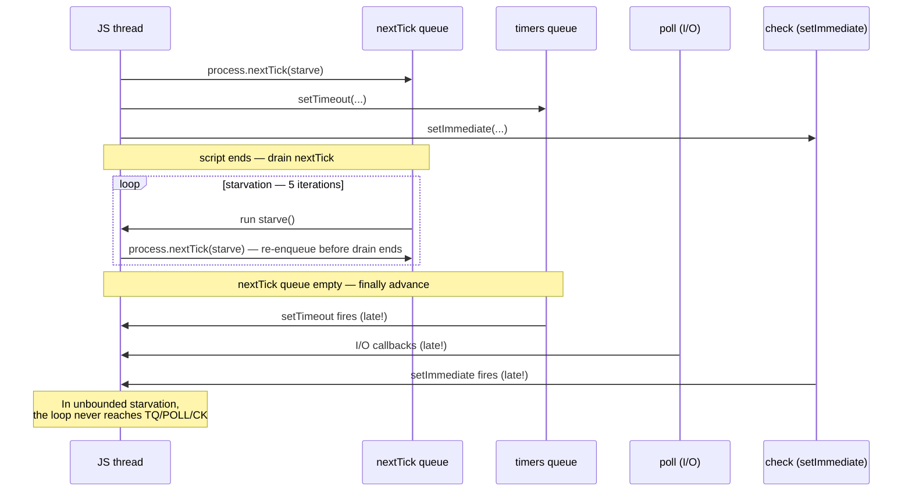

# Chapter 2 — The Event Loop, Microtasks, Macrotasks, and Timers

*What this chapter covers:* JavaScript runs on a single thread. That single thread multiplexes I/O, timers, rendering, promise continuations, and user callbacks through two cooperating event loops — the browser event loop defined by the HTML Standard and the Node.js event loop implemented by libuv. This chapter dissects both, down to the queue mechanics, phase ordering, and timing guarantees that determine when your code actually runs.

After reading this chapter you will be able to:

- Trace any snippet through the browser event loop — tasks, microtasks, rendering, `requestAnimationFrame`, `queueMicrotask`, `MessageChannel`, and `Promise` jobs — and predict the exact `console.log` order.
- Trace any snippet through the libuv event loop — timers, pending callbacks, idle/prepare, poll, check, close — and predict how `setTimeout`, `setImmediate`, `process.nextTick`, and `Promise.then` interleave.
- Explain why `setTimeout(fn, 0)` is never zero, why timers coalesce and drift, and why `setImmediate` vs `setTimeout(…, 0)` has a race in Node.
- Diagnose and fix starvation and livelock caused by recursive `nextTick` / microtask scheduling.
- Choose correctly between `queueMicrotask`, `Promise.resolve().then`, `MessageChannel`, `setTimeout`, `setImmediate`, and `requestAnimationFrame` for scheduling work.
- Use `node --trace-event`, `perf_hooks`, `async_hooks`, Chrome Performance panel, and a hand-built visualizer to observe loop behavior in production.
- Reason about event-loop delays as a backend reliability signal — event-loop lag, blocked rendering, and tail-latency amplification at scale.

---

## 2.1 The Single Thread and Run-to-Completion

V8, SpiderMonkey, and JavaScriptCore (see Chapter 1) all execute JavaScript on one **main thread** per isolate / realm. The call stack runs one frame at a time and each synchronous call chain runs to completion — there is no preemption inside JavaScript itself. Concurrency comes from the *environment* (browser or Node) posting callbacks into queues that the loop drains.

```
JS thread:  [  run script  ][microtasks][  run task  ][microtasks][render?][  run task  ]...
                ^--- never interrupted mid-frame ---^
```

Two invariants govern everything in this chapter:

1. **Run-to-completion.** Once a task or microtask starts, it runs until it returns. No other JavaScript runs concurrently on the same thread. Long synchronous work blocks everything — including rendering and I/O polling.
2. **Microtasks drain exhaustively before the next task.** After each task (and after each microtask that schedules more microtasks), the engine empties the entire microtask queue before yielding.

If you internalize those two rules, every ordering puzzle in this chapter becomes predictable.

### A minimal ordering demo

```javascript
console.log("1: script start");

setTimeout(() => console.log("2: setTimeout"), 0);

Promise.resolve().then(() => console.log("3: promise.then"));

queueMicrotask(() => console.log("4: queueMicrotask"));

console.log("5: script end");

// Output (browser and Node — same for this snippet):
// 1: script start
// 5: script end
// 3: promise.then
// 4: queueMicrotask
// 2: setTimeout
```

Synchronous code runs first (`1`, `5`). Then the microtask queue drains FIFO (`3`, `4` — note that `Promise.then` jobs and `queueMicrotask` jobs share the single microtask queue; insertion order wins). Only after the queue is empty does the next task run (`2`).

> **Senior-backend note.** This looks identical in browser and Node here, but the equivalence breaks the moment `process.nextTick` or `setImmediate` appears — as we will see in Section 2.4. Do not assume you can reason about one loop from the other.

---

## 2.2 The Browser Event Loop

### 2.2.1 The HTML Standard event loop

The [HTML Standard §8.1.4](https://html.spec.whatwg.org/#event-loops) defines an **event loop** per *agent* (roughly, per browsing context group) and a **task queue** per *task source* (DOM manipulation, user interaction, networking, history traversal, etc.). The loop is conceptually:



In prose:

1. Pick the oldest **task** (macrotask) from any task queue and run it.
2. Drain the **microtask queue** exhaustively — including microtasks enqueued by other microtasks.
3. Optionally perform **rendering steps** (only if the browser decides a frame is due — tied to the display refresh, typically 60 Hz / 16.6 ms).
4. If no task is ready, sleep until one arrives or the next rendering opportunity.

Every browser vendor maps this onto a platform message pump (Chromium: `base::MessageLoop` / `SequenceManager`, Firefox: `nsThread` + `PrioritizedEventQueue`, WebKit: `RunLoop`). The observable semantics are standardized; the internal scheduling is not.

### 2.2.2 Tasks vs microtasks — the two queues



| Queue | Also called | Enqueued by | Drained when |
|-------|-------------|-------------|--------------|
| **Task** | macrotask, task | `setTimeout`, `setInterval`, `MessageChannel`, `postMessage`, I/O, UI events | One per loop iteration, in task-source priority order |
| **Microtask** | jobs, microtask | `Promise` reactions, `queueMicrotask`, `MutationObserver`, `await` resume | Exhaustively after every task and after every microtask |

> **Terminology warning.** "Macrotask" is community jargon, not spec language. The spec says "task." This chapter uses "task" when being precise and "macrotask" when contrasting with microtasks, matching real-world usage.

### 2.2.3 What exactly is a microtask? Promise jobs, queueMicrotask, MutationObserver

All three feed the same FIFO queue. The [ECMA-262](https://tc39.es/ecma262/#sec-jobs) specification calls them **Jobs** and the HTML Standard calls them **microtasks** — they are the same mechanism.

```javascript
// All three enqueue into the SAME queue, in call order.

console.log("script start");

queueMicrotask(() => console.log("queueMicrotask 1"));

Promise.resolve().then(() => console.log("promise.then 1"));

new MutationObserver(() => console.log("mutation"))
  .observe(document.createElement("div"), { attributes: true });
// trigger it:
document.body?.setAttribute?.("data-x", "1");

// Also:
Promise.resolve().then(() => console.log("promise.then 2"));
queueMicrotask(() => console.log("queueMicrotask 2"));

console.log("script end");

// Output (Chrome / Firefox):
// script start
// script end
// queueMicrotask 1
// promise.then 1
// promise.then 2
// queueMicrotask 2
// mutation        ← MutationObserver fires after promise jobs in the same drain
```

Within one microtask drain, order is insertion order — there is no priority between `queueMicrotask` and `Promise.then`. The distinction matters only for *spec reason*: `queueMicrotask` was added so library code can enqueue a microtask without creating a throwaway Promise (cheaper, clearer intent).

**`MutationObserver` nuance.** The spec queues a single microtask that delivers *all* pending mutation records at once, not one per mutation. And in Chromium the observer callback runs after promise microtasks enqueued before it, but before promise microtasks enqueued *after* the DOM mutation — so its position in the FIFO depends on when the mutation was observed, not when `observe()` was called.

### 2.2.4 MessageChannel, postMessage, and the "fast task" trick

Before `queueMicrotask` existed, libraries needed a way to schedule a task that fires sooner than `setTimeout(…, 0)` (which is clamped to ~4 ms when nested — see Section 2.5). `MessageChannel` became the standard hack: posting a message enqueues a *task*, not a microtask, but it is the fastest task path — no timer clamping.

```javascript
// "setImmediate" polyfill via MessageChannel (used by many libs before queueMicrotask)
const { port1, port2 } = new MessageChannel(); // Node; browser uses new MessageChannel()
const fastQueue = [];
port2.onmessage = () => {
  const fn = fastQueue.shift();
  fn?.();
};

function setImmediatePolyfill(fn) {
  fastQueue.push(fn);
  port1.postMessage(null);
}

console.log("A");
setTimeout(() => console.log("setTimeout"), 0);
setImmediatePolyfill(() => console.log("MessageChannel"));
Promise.resolve().then(() => console.log("promise"));
console.log("B");

// Output:
// A
// B
// promise            ← microtask queue drains first
// MessageChannel     ← next task (MessageChannel is faster than the timer)
// setTimeout         ← timer task second
```

In browsers, `postMessage` on `window` and `MessageChannel` both enqueue tasks, but `MessageChannel` is preferred for scheduling because it avoids the origin-check overhead and does not collide with application `message` listeners.

### 2.2.5 Rendering: where rAF fits

The rendering steps run *between* tasks — after microtasks drain and before the next task — but only when the browser decides to render (aligned to vsync). The pipeline is:



Key points senior engineers often get wrong:

- **`requestAnimationFrame` (rAF) runs *before* style/layout/paint**, not after. Mutate the DOM in your rAF callback and the browser will include those mutations in the same frame. Read layout in rAF *before* you write and you avoid an extra reflow.
- **rAF does not run if the tab is backgrounded.** Browsers throttle or pause rAF in hidden tabs. Never use it for non-visual timers.
- **Microtasks run *before* rAF.** If you starve the microtask queue, rAF never fires and frames drop.
- **Multiple rAF callbacks in one frame are coalesced** — all callbacks registered before the frame starts run in that frame.

```javascript
// rAF vs microtask vs task — rendering-aware ordering
console.log("script start");

requestAnimationFrame(() => console.log("rAF"));

queueMicrotask(() => console.log("microtask"));

setTimeout(() => console.log("setTimeout"), 0);

// Force a style read to make the frame "needed" — illustrative only
// document.body.offsetHeight;

console.log("script end");

// Typical output when a frame IS rendered after this task:
// script start
// script end
// microtask          ← microtasks before rendering
// rAF                ← rendering step (if frame was due)
// setTimeout         ← next task (next iteration)

// When no frame is due, rAF is deferred:
// script start
// script end
// microtask
// setTimeout
// (rAF fires on a later iteration just before the next paint)
```

#### requestAnimationFrame vs queueMicrotask — scheduling intent

| Primitive | Queue | When | Use for |
|-----------|-------|------|---------|
| `queueMicrotask(fn)` | microtask | Immediately after current task, before rendering | Defer work but keep it in the same logical "tick" — flushing batched state before paint |
| `requestAnimationFrame(fn)` | rendering step | Just before next paint | Visual updates — DOM mutations, canvas draws, measuring layout |
| `setTimeout(fn, 0)` | task | Next task iteration, after rendering (clamped) | Deferring non-urgent work to avoid blocking rendering |
| `MessageChannel` | task (fast) | Next task iteration, unclamped | "Fast setTimeout(0)" when you need a task but not a timer |
| `requestIdleCallback(fn)` | idle | After rendering, if frame budget remains | Low-priority work (analytics, prefetch) — not supported in all browsers |

> **Rule of thumb.** If the work is *visual*, use `rAF`. If the work must happen *before* the next paint but is not visual (e.g., flushing a state batch so rAF reads the correct value), use `queueMicrotask`. If the work can wait until *after* paint, use a task.

---

## 2.3 The Node.js Event Loop — libuv

Browser JavaScript has one loop with rendering interleaved. Node has a different loop — no rendering, but **I/O polling**, a **thread pool**, and extra phase queues. The engine is still V8, but the event loop is provided by **[libuv](https://libuv.org/)**, the same cross-platform async I/O library behind Node, Deno (partially), and Julia.

### 2.3.1 libuv phases



In the actual C implementation (`uv_run` in `src/unix/core.c`), the order is:

```
while (r != 0 && loop alive) {
  uv__update_time(loop);          // (1) sample loop time
  uv__run_timers(loop);            // (2) timers phase
  uv__run_pending(loop);           // (3) pending callbacks
  uv__run_idle(loop);              // (4) idle handles      (internal, rarely visible to JS)
  uv__run_prepare(loop);           // (5) prepare handles   (internal)
  uv__io_poll(loop, timeout);      // (6) poll phase — blocks here
  uv__run_check(loop);             // (7) check phase
  uv__run_closing_handles(loop);   // (8) close callbacks
}
```

What each phase does for JavaScript:

| Phase | C function | JS-visible work | Notes |
|-------|-----------|-----------------|-------|
| **timers** | `uv__run_timers` | `setTimeout`, `setInterval` callbacks whose threshold has passed | Threshold is `loop->time` (cached per iteration), not wall time — see timer coalescing below |
| **pending callbacks** | `uv__run_pending` | I/O callbacks deferred to next iteration | Rarely populated; mainly `TCP` write errors |
| **idle / prepare** | `uv__run_idle` / `uv__run_prepare` | Internal only | Node uses these internally (e.g., for bookkeeping). No public JS API enqueues here |
| **poll** | `uv__io_poll` | I/O callbacks (`fs.read`, `net`, `http`) | *Blocks* calculating a timeout from the next timer. Uses `epoll` (Linux), `kqueue` (macOS), `IOCP` (Windows) |
| **check** | `uv__run_check` | `setImmediate` callbacks | Runs immediately after poll returns — this is why `setImmediate` fires after I/O |
| **close callbacks** | `uv__run_closing_handles` | `socket.on('close')`, `server.close` callbacks | Cleanup |

Between *every* phase transition, Node drains two special queues — **`process.nextTick`** and **Promise microtasks** — which is why Node ordering differs from the browser.

### 2.3.2 nextTick vs microtasks — the ordering that surprises everyone

This is the single most tested distinction in Node interviews and the single most common source of real bugs.



Rules:

1. **`process.nextTick` has its own queue, drained *before* Promise microtasks.** It is not a microtask — it is a *next-tick queue* that runs at higher priority.
2. **Both queues are drained exhaustively between every phase** (and after every task callback), including ticks/microtasks enqueued while draining.
3. `process.nextTick` **starves I/O** if recursed (Section 2.6). Promise microtasks can technically also starve, but V8 and Node have mitigations; `nextTick` has none by design.

```javascript
// Node — nextTick vs Promise ordering
console.log("1: script start");

setTimeout(() => console.log("2: setTimeout"), 0);
setImmediate(() => console.log("3: setImmediate"));

process.nextTick(() => console.log("4: nextTick 1"));
Promise.resolve().then(() => console.log("5: promise.then 1"));

process.nextTick(() => {
  console.log("6: nextTick 2");
  process.nextTick(() => console.log("7: nextTick (nested)"));
  Promise.resolve().then(() => console.log("8: promise inside nextTick"));
});
Promise.resolve().then(() => console.log("9: promise.then 2"));

console.log("10: script end");

// Output (Node 18+ / 20+):
// 1: script start
// 10: script end
// 4: nextTick 1
// 6: nextTick 2
// 7: nextTick (nested)        ← nested nextTick drains before microtasks
// 5: promise.then 1
// 9: promise.then 2
// 8: promise inside nextTick   ← promise enqueued inside nextTick runs after existing promises
// 2: setTimeout               ← timers phase
// 3: setImmediate             ← check phase (after poll)
```

Contrast the same snippet in a browser (where `process.nextTick` does not exist and `setImmediate` is non-standard / absent):

```javascript
// Browser — same snippet without nextTick / setImmediate
console.log("1: script start");
setTimeout(() => console.log("2: setTimeout"), 0);
Promise.resolve().then(() => console.log("3: promise.then 1"));
Promise.resolve().then(() => console.log("4: promise.then 2"));
console.log("5: script end");

// Browser output:
// 1: script start
// 5: script end
// 3: promise.then 1
// 4: promise.then 2
// 2: setTimeout
```

> **Takeaway.** In the browser there is one microtask queue. In Node there are *two* queues interleaved: `nextTick` first, then promise jobs, between every phase. Any mental model that equates `process.nextTick` with "a fast Promise" will produce wrong predictions.

### 2.3.3 I/O poll — the blocking heart

The `poll` phase is where Node spends most of its time when idle. `uv__io_poll` computes a timeout:

- If the loop is alive and there are no timers/check/close handles, it blocks *indefinitely* until I/O arrives.
- If there are timers, it blocks for `min(nextTimerExpiry - now, SOME_CAP)` so it wakes in time for the timers phase.
- On Linux it calls `epoll_wait` / `epoll_pwait`; on macOS `kevent`; on Windows `GetQueuedCompletionStatusEx`.

```javascript
// Observing poll blocking with perf_hooks
import { performance, PerformanceObserver } from "node:perf_hooks";
import fs from "node:fs";

const obs = new PerformanceObserver((list) =>
  list.getEntries().forEach((e) => console.log(e.name, e.duration.toFixed(2) + "ms"))
);
obs.observe({ entryTypes: ["measure"] });

performance.mark("start");
fs.readFile(__filename, () => {
  performance.mark("io-done");
  performance.measure("poll → callback", "start", "io-done");
  console.log("fs.readFile callback — poll phase delivered this");
});
console.log("after readFile call — poll is now blocking in libuv");
// Output:
// after readFile call — poll is now blocking in libuv
// fs.readFile callback — poll phase delivered this
// poll → callback 3.42ms   (time libuv blocked in epoll_wait)
```

> **Distributed-systems lens.** Event-loop stall in `poll` is usually healthy (the thread is parked waiting for I/O). Stall *outside* poll — a long task or microtask drain — is the latency killer: while JavaScript runs, `epoll_wait` is not being called, inbound connections queue in the kernel, and p99 spikes. Monitor `perf_hooks.monitorEventLoopDelay()` in production to distinguish the two.

---

## 2.4 Browser vs Node — Side-by-Side Ordering Demos

The demos below are runnable as-is. Outputs were captured on Chrome 124 and Node 20.12.

### 2.4.1 The classic interview puzzle, annotated

```javascript
// puzzle.js — run in Node with: node puzzle.js
//             — paste into browser console for comparison

console.log("A: script start");

setTimeout(() => {
  console.log("B: setTimeout");
  Promise.resolve().then(() => console.log("C: promise inside setTimeout"));
}, 0);

Promise.resolve()
  .then(() => {
    console.log("D: promise.then 1");
    queueMicrotask(() => console.log("E: queueMicrotask inside promise"));
  })
  .then(() => console.log("F: promise.then 2 (chained)"));

queueMicrotask(() => console.log("G: queueMicrotask"));

setTimeout(() => console.log("H: setTimeout 2"), 0);

console.log("I: script end");
```

**Browser output:**

```
A: script start
I: script end
D: promise.then 1
G: queueMicrotask
E: queueMicrotask inside promise
F: promise.then 2 (chained)
B: setTimeout
C: promise inside setTimeout
H: setTimeout 2
```

**Node output:** Identical *for this snippet* — there is no `nextTick` or `setImmediate`, so both loops agree: script → microtasks FIFO (including chained `then` and `queueMicrotask` inserted during the drain) → tasks FIFO, with microtasks draining again after task `B` before task `H`.

The equivalence breaks with Node-only primitives:

```javascript
// node-only-ordering.js — Node 20
console.log("A: start");

setTimeout(() => console.log("B: setTimeout 0"), 0);
setImmediate(() => console.log("C: setImmediate"));
process.nextTick(() => console.log("D: nextTick"));
Promise.resolve().then(() => console.log("E: promise"));
queueMicrotask(() => console.log("F: queueMicrotask"));

console.log("G: end");

// Output — top-level script context (no I/O):
// A: start
// G: end
// D: nextTick                 ← nextTick drains first
// E: promise / F: queueMicrotask  (FIFO — insertion order between them)
// B: setTimeout 0             ← timers phase before check — but see race note below
// C: setImmediate
```

> **The famous race.** When both `setTimeout(…, 0)` and `setImmediate` are scheduled from the *top-level* script (outside any I/O callback), their order is **nondeterministic** — it depends on how long script execution took vs the 1 ms timer threshold and whether `uv__update_time` has sampled a new millisecond. Inside an I/O callback, the order is deterministic: `setImmediate` always wins because poll → check comes before the next timers phase.

```javascript
// Deterministic ordering — schedule from inside poll phase (I/O callback)
import fs from "node:fs";

fs.readFile(__filename, () => {
  console.log("inside I/O callback (poll phase just delivered)");
  setTimeout(() => console.log("setTimeout inside I/O"), 0);
  setImmediate(() => console.log("setImmediate inside I/O"));
});

// Output — ALWAYS:
// inside I/O callback (poll phase just delivered)
// setImmediate inside I/O    ← check phase is next
// setTimeout inside I/O      ← timers phase on the following iteration
```



### 2.4.2 async/await ordering — await is Promise.then

```javascript
// await-ordering.js — identical in browser and Node (no nextTick)
console.log("1");

async function foo() {
  console.log("2");
  await Promise.resolve();
  console.log("3"); // resumes as a microtask
  await Promise.resolve();
  console.log("4"); // another microtask hop
}

foo();
console.log("5");
Promise.resolve().then(() => console.log("6"));
console.log("7");

// Output (browser and Node):
// 1
// 2          ← foo runs synchronously until first await
// 5
// 7          ← script continues
// 3          ← first await resumes (microtask)
// 6          ← promise.then enqueued before second await
// 4          ← second await resumes (microtask, but after 6)
```

Every `await` on an already-resolved promise still yields one microtask. Two awaits = two microtask hops. This is why `await` inside a hot loop can be measurably slower than synchronous iteration — each iteration pays the microtask queue tax.

---

## 2.5 Timers — setTimeout, setInterval, setImmediate, and process.nextTick

### 2.5.1 setTimeout is never zero

Three distinct sources of delay make `setTimeout(fn, 0)` always > 0:

| Source | Delay | Spec / implementation |
|--------|-------|-----------------------|
| **Timer resolution** | ~1 ms in Node (libuv `uv__update_time` samples per iteration), ~1–4 ms in browsers | Node caches `loop->time`; browsers use `DOMHighResTimeStamp` |
| **Nesting depth clamp** | After 5 nested `setTimeout` calls, delay clamped to **≥ 4 ms** | [HTML Standard §8.6](https://html.spec.whatwg.org/#timers) — "If nesting level > 4 and timeout < 4, set timeout to 4" |
| **Throttling** | Background tabs: ≥ 1000 ms (Chrome), nested timers throttled to 1 s | Browser background-tab throttling; Node has no equivalent |

```javascript
// Demonstrating nesting clamp — browser
let depth = 0;
function nested() {
  const t0 = performance.now();
  setTimeout(() => {
    const elapsed = performance.now() - t0;
    console.log(`depth ${depth} → next fires after ${elapsed.toFixed(2)}ms`);
    if (++depth < 8) nested();
  }, 0);
}
nested();

// Output (Chrome, foreground tab):
// depth 0 → next fires after 1.20ms
// depth 1 → next fires after 0.90ms
// depth 2 → next fires after 1.10ms
// depth 3 → next fires after 1.05ms
// depth 4 → next fires after 4.30ms   ← clamp kicks in at depth > 4
// depth 5 → next fires after 4.15ms
// depth 6 → next fires after 4.20ms
// depth 7 → next fires after 4.10ms
```



### 2.5.2 Timer coalescing and drift

libuv does not maintain a sorted timer heap with absolute precision. Each iteration it samples `loop->time` once and fires *all* timers whose expiry ≤ that sampled time. Timers that become due during the poll phase all fire together in the next timers phase — they **coalesce**.


`setInterval` drift compounds: if a callback takes longer than the interval, libuv does not queue multiple invocations — it fires once per iteration and scheduling is based on *start time*, not *end time*. A 10 ms interval callback that takes 25 ms will visibly skip beats.

```javascript
// Interval drift demo — Node
let ticks = 0;
const t0 = Date.now();
const id = setInterval(() => {
  ticks += 1;
  const drift = Date.now() - t0 - ticks * 10;
  console.log(`tick ${ticks} drift ${drift}ms`);
  // Simulate work that sometimes exceeds interval
  if (ticks === 5) {
    const block = Date.now() + 30;
    while (Date.now() < block) {} // block 30 ms
  }
  if (ticks >= 8) clearInterval(id);
}, 10);

// Output:
// tick 1 drift 1ms
// tick 2 drift 1ms
// tick 3 drift 1ms
// tick 4 drift 2ms
// tick 5 drift 2ms       ← then blocks 30ms
// tick 6 drift 28ms      ← drift jumps — missed beats
// tick 7 drift 28ms
// tick 8 drift 29ms
```

> **Production takeaway.** Do not use `setInterval` for precise periodic work (health checks, lease renewal). Use recursive `setTimeout` where the next schedule is computed from when the *previous callback completed*, or — better — a monotonic deadline check (`Date.now()` vs expected) inside the callback. For sub-millisecond scheduling, use `setImmediate` / `queueMicrotask` loops with explicit budget checks.

### 2.5.3 Choosing the right primitive

```javascript
// Decision helper — Node
// Need it BEFORE the next I/O poll?         → process.nextTick (but beware starvation)
// Need it before rendering, inside same tick? → queueMicrotask / Promise.then
// Need it after I/O, before timers?         → setImmediate
// Need a delay, even ~1ms?                  → setTimeout
// Need to yield to the event loop briefly?  → setImmediate (Node) / MessageChannel (browser) / scheduler.yield() (future)
// Need it before next paint?                → requestAnimationFrame (browser only)
```

| Primitive | Queue / phase | Clamped? | Starves I/O? | Browser | Node |
|-----------|:---:|:---:|:---:|:---:|:---:|
| `process.nextTick` | nextTick queue (before microtasks) | no | **yes** | — | yes |
| `queueMicrotask` | microtask | no | yes (but bounded in practice) | yes | yes |
| `Promise.then` | microtask | no | yes | yes | yes |
| `setTimeout(fn, 0)` | timers | yes (4 ms nested, 1 ms min) | no | yes | yes |
| `setImmediate` | check | no | no | — (Edge legacy only) | yes |
| `MessageChannel` | task (fast) | no | no | yes | yes |
| `requestAnimationFrame` | rendering | vsync | no | yes | — |

---

## 2.6 Starvation and Livelock

Every queue that drains exhaustively is a starvation vector. If callbacks keep re-enqueuing themselves into the same queue, lower-priority queues never get serviced.

### 2.6.1 nextTick starvation — blocking I/O indefinitely

```javascript
// STARVATION DEMO — DO NOT RUN UNGUARDED IN PRODUCTION
// This loop prevents the event loop from ever reaching poll/check/timers.

let n = 0;
function starve() {
  if (n++ < 5) {
    console.log(`nextTick ${n} — I/O and timers are blocked`);
    process.nextTick(starve);
  } else {
    console.log("stopped recursing — loop can breathe again");
  }
}

setTimeout(() => console.log("setTimeout — will be delayed until starvation ends"), 0);
setImmediate(() => console.log("setImmediate — also delayed"));

starve();
console.log("script end — but loop is still stuck in nextTick drain");

// Output:
// script end — but loop is still stuck in nextTick drain
// nextTick 1 — I/O and timers are blocked
// nextTick 2 — I/O and timers are blocked
// nextTick 3 — I/O and timers are blocked
// nextTick 4 — I/O and timers are blocked
// nextTick 5 — I/O and timers are blocked
// stopped recursing — loop can breathe again
// setTimeout — will be delayed until starvation ends
// setImmediate — also delayed
```

If the guard (`n < 5`) were missing, `setTimeout` and `setImmediate` would **never** fire — the loop never leaves the nextTick drain. The same applies to unbounded promise recursion, though Node's `process.maxTickDepth`-style mitigations and V8's microtask handling make it slightly harder to accidentally starve with promises alone.



### 2.6.2 Microtask starvation — the subtler variant

```javascript
// Promise recursion starvation — works in BOTH browser and Node
let count = 0;
function spamMicrotasks() {
  if (count++ < 100000) {
    Promise.resolve().then(spamMicrotasks);
  }
}
spamMicrotasks();

setTimeout(() => console.log(`setTimeout finally ran after ${count} microtasks`), 0);

// What happens:
// - The microtask queue never empties until count hits 100000.
// - setTimeout is delayed by the entire microtask chain.
// - In a browser, rendering is also blocked — the tab freezes.
// - Event-loop lag spikes; health checks time out; load balancers mark the instance unhealthy.
```

> **How to detect it in production.** Monitor `perf_hooks.monitorEventLoopDelay()` (Node) and `PerformanceObserver` long-task entries (browser). A p99 event-loop delay > 50 ms is a strong signal that synchronous work or microtask/nextTick recursion is starving the loop.

### 2.6.3 Backpressure as the fix

The fix is not "never use nextTick/microtasks" — it is **yielding**. Batch work and explicitly schedule the next batch as a *task* (not a microtask) so I/O and rendering interleave:

```javascript
// Cooperative batching — yield to the loop every N items
import { setImmediate } from "node:timers/promise"; // Node 15+

async function processLargeArray(items, batchSize = 1000) {
  for (let i = 0; i < items.length; i += batchSize) {
    const batch = items.slice(i, i + batchSize);
    // Synchronous batch — fast, but bounded
    for (const item of batch) transform(item);

    // Yield to the event loop so I/O and timers get a turn
    if (i + batchSize < items.length) {
      await setImmediate(); // check phase — lets poll run before next batch
      // Browser equivalent: await new Promise(r => setTimeout(r, 0));
      // or: await scheduler.yield() when available
    }
  }
}

function transform(x) { /* ... */ }
```

For browser-side large-data work, prefer `scheduler.yield()` (Chrome 115+, part of the [Prioritized Task Scheduling API](https://developer.mozilla.org/en-US/docs/Web/API/Scheduler)) or `requestIdleCallback` chunking — both yield to rendering so frames stay smooth.

---

## 2.7 Unhandled Rejections and Error Propagation

### 2.7.1 Browser — unhandledrejection

When a Promise rejects and no handler is attached *by the end of the microtask drain*, the browser fires `unhandledrejection` on `window`. If a handler is attached later (e.g., in a subsequent task), `rejectionhandled` fires.

```javascript
// Browser unhandled rejection lifecycle
window.addEventListener("unhandledrejection", (e) => {
  console.error("unhandled:", e.reason);
  // e.preventDefault() suppresses the console error
});

window.addEventListener("rejectionhandled", (e) => {
  console.warn("late-handled:", e.reason);
});

// Case 1: never handled — fires unhandledrejection
Promise.reject(new Error("boom"));

// Case 2: handled late — fires BOTH events
const p = Promise.reject(new Error("late"));
setTimeout(() => p.catch((e) => console.log("caught late:", e.message)), 10);
// Sequence: unhandledrejection (microtask drain) → 10ms later → catch → rejectionhandled
```

Important: the check happens at the **end of the microtask drain**, not synchronously when `reject` is called. Attaching `.catch` as a microtask (same drain) still counts as handled:

```javascript
const p = Promise.reject(new Error("sync catch"));
p.catch(() => console.log("handled")); // same microtask — no unhandledrejection
```

### 2.7.2 Node — stricter, configurable

Node surfaces three events on `process` and a CLI flag that controls the default:

```javascript
// Node unhandled rejection handling
process.on("unhandledRejection", (reason, promise) => {
  console.error("unhandledRejection:", reason);
  // Log, report to error tracking, but DO NOT silently swallow in production
});

process.on("rejectionHandled", (promise) => {
  console.warn("rejectionHandled — was unhandled, now caught late");
});

process.on("uncaughtException", (err) => {
  console.error("uncaughtException:", err);
  // Best practice: log, flush telemetry, then exit — the process is in an unknown state
  // process.exitCode = 1;
});
```

The flag `--unhandled-rejections` controls what happens if no listener is registered:

| Mode | Behavior |
|------|----------|
| `throw` (default since Node 15) | Emits `unhandledRejection`; if still unhandled, throws — becomes `uncaughtException` and terminates |
| `strict` | Same as `throw` but always terminates even with a listener that does not re-throw (future default) |
| `warn` | Emits warning, does not terminate (Node 14 default) |
| `none` | Silences the warning entirely |

```bash
# Recommended production setting — fail fast on unhandled rejections
node --unhandled-rejections=strict app.js

# Legacy / migration — warn but keep running (masks bugs)
node --unhandled-rejections=warn app.js
```

> **Distributed-systems lens.** An unhandled rejection in an HTTP handler that is not caught by your framework's error boundary can leave a request hanging, leak a database connection from the pool, and — if the process is configured to not crash — silently degrade the instance. Prefer `strict` mode and a top-level handler that logs and exits so the orchestrator (Kubernetes, systemd) restarts a clean process. A crashed pod that restarts is more observable than a zombie pod serving 500s.

---

## 2.8 Tooling — Observing the Loop

### 2.8.1 Browser — Performance panel and Long Tasks

Chrome DevTools → Performance → Record → look for:

- **Long tasks** (> 50 ms) — synchronous work blocking the loop.
- **Layout / Recalculate Style** — rendering work, often triggered by forced synchronous layout.
- **Fire Animation Frame** — rAF callbacks.
- **Microtasks** — shown as "Run Microtasks" in the flame chart.

Programmatically:

```javascript
// Long Task observer — browser
const observer = new PerformanceObserver((list) => {
  for (const entry of list.getEntries()) {
    console.warn(`long task: ${entry.duration.toFixed(1)}ms`, entry);
  }
});
observer.observe({ entryTypes: ["longtask"] });

// Event-loop lag approximation — browser
let last = performance.now();
setInterval(() => {
  const now = performance.now();
  const lag = now - last - 100; // expected 100ms interval
  if (lag > 10) console.warn(`loop lag: ${lag.toFixed(1)}ms`);
  last = now;
}, 100);
```

### 2.8.2 Node — trace events, perf_hooks, async_hooks

```bash
# 1. Trace the event loop phases — produces trace.json for chrome://tracing or Perfetto
node --trace-event-categories node,node.async_hooks,node.perf --trace-events-enabled -e "
  setTimeout(() => console.log('timer'), 10);
  setImmediate(() => console.log('immediate'));
  process.nextTick(() => console.log('nextTick'));
"
# Open trace.json in https://ui.perfetto.dev or chrome://tracing

# 2. Event-loop utilization (ELU) — Node 14.10+
node --trace-event-categories node.perf -e "
  import { eventLoopUtilization } from 'node:perf_hooks';
  const elu1 = eventLoopUtilization();
  setTimeout(() => {
    const elu2 = eventLoopUtilization(elu1);
    console.log('ELU:', elu2);
    // { idle: 2.3, active: 0.4, utilization: 0.15 }
    // utilization = active / (idle + active) — high means loop is saturated
  }, 100);
"

# 3. Histogram of event-loop delay — the production health signal
node -e "
  import { monitorEventLoopDelay } from 'node:perf_hooks';
  const h = monitorEventLoopDelay({ resolution: 10 });
  h.enable();
  setInterval(() => {
    console.log('p50', h.percentile(50)/1e6 + 'ms',
                'p99', h.percentile(99)/1e6 + 'ms',
                'max', h.max/1e6 + 'ms');
  }, 5000);
  // Keep busy to see lag
  setInterval(() => { const s = Date.now() + 30; while (Date.now() < s) {} }, 100);
"
# Output:
# p50 0.12ms p99 30.04ms max 30.12ms
```

```javascript
// async_hooks — trace async resource lifetimes (debug, not hot path)
import { createHook } from "node:async_hooks";
import fs from "node:fs";

const hook = createHook({
  init(asyncId, type, triggerAsyncId) {
    if (type === "Timeout" || type === "Immediate" || type === "PROMISE") {
      fs.writeSync(1, `init ${type} id=${asyncId} triggered by ${triggerAsyncId}\n`);
    }
  },
  before(asyncId) { fs.writeSync(1, `before ${asyncId}\n`); },
  after(asyncId)  { fs.writeSync(1, `after ${asyncId}\n`); },
});
hook.enable();

setTimeout(() => console.log("timer fired"), 0);
// Output:
// init Timeout id=5 triggered by 1
// before 5
// timer fired
// after 5
```

> **Performance note.** `async_hooks` has measurable overhead — do not enable it unconditionally in production. Use `AsyncLocalStorage` (built on async_hooks) for request context propagation, and gate verbose tracing behind a flag or sampled debug mode.

### 2.8.3 A hand-built event-loop visualizer

The snippet below is a self-contained HTML file that visualizes task / microtask / rAF ordering in the browser. Open it locally, click the buttons, and watch the interleaving.

```html
<!doctype html>
<html lang="en">
<head>
  <meta charset="utf-8" />
  <title>Event Loop Visualizer</title>
  <style>
    body { font-family: ui-monospace, monospace; max-width: 760px; margin: 2rem auto; }
    button { margin: 0.25rem; padding: 0.5rem 0.75rem; cursor: pointer; }
    #log { border: 1px solid #ccc; min-height: 260px; padding: 0.75rem; white-space: pre-wrap; background: #f9fafb; }
    .task { color: #1e40af; } .micro { color: #92400e; } .raf { color: #7c3aed; } .idle { color: #065f46; }
  </style>
</head>
<body>
  <h1>Event Loop Visualizer</h1>
  <div>
    <button id="btnTask">enqueue task (setTimeout 0)</button>
    <button id="btnMicro">enqueue microtask (queueMicrotask)</button>
    <button id="btnRaf">requestAnimationFrame</button>
    <button id="btnMessage">MessageChannel</button>
    <button id="btnBurst">burst: task → micro → rAF → micro</button>
    <button id="btnClear">clear</button>
  </div>
  <pre id="log"></pre>
  <script>
    const log = document.getElementById("log");
    let seq = 0;
    function entry(kind, msg) {
      const cls = { task: "task", micro: "micro", raf: "raf", idle: "idle" }[kind] || "";
      const line = `${String(++seq).padStart(2, "0")} [${kind.padEnd(5)}] ${msg} @${performance.now().toFixed(1)}ms`;
      const span = document.createElement("span");
      span.className = cls;
      span.textContent = line + "\n";
      log.appendChild(span);
      log.scrollTop = log.scrollHeight;
    }

    // MessageChannel fast task
    const { port1, port2 } = (() => {
      const ch = new MessageChannel();
      return { port1: ch.port1, port2: ch.port2 };
    })();
    const mcQueue = [];
    port2.onmessage = () => mcQueue.shift()?.();

    document.getElementById("btnTask").onclick = () =>
      setTimeout(() => entry("task", "setTimeout fired"), 0);

    document.getElementById("btnMicro").onclick = () =>
      queueMicrotask(() => entry("micro", "queueMicrotask fired"));

    document.getElementById("btnRaf").onclick = () =>
      requestAnimationFrame(() => entry("raf", "rAF fired"));

    document.getElementById("btnMessage").onclick = () => {
      mcQueue.push(() => entry("task", "MessageChannel fired"));
      port1.postMessage(null);
    };

    document.getElementById("btnBurst").onclick = () => {
      entry("task", "burst start (sync)");
      setTimeout(() => {
        entry("task", "burst: setTimeout");
        queueMicrotask(() => entry("micro", "burst: micro inside timeout"));
      }, 0);
      queueMicrotask(() => entry("micro", "burst: queueMicrotask"));
      requestAnimationFrame(() => entry("raf", "burst: rAF"));
      Promise.resolve().then(() => entry("micro", "burst: Promise.then"));
      entry("task", "burst end (sync)");
    };

    document.getElementById("btnClear").onclick = () => { log.textContent = ""; seq = 0; };

    entry("idle", "ready — click buttons and observe ordering");
    entry("idle", "hint: microtasks always drain before tasks and rAF");
  </script>
</body>
</html>
```

What to try:

1. Click **microtask** then **task** — microtask fires first, even though the button was clicked second.
2. Click **burst** — note that synchronous `burst start/end` log first, then both microtasks (`queueMicrotask` and `Promise.then` in FIFO), then `rAF` (before next paint), then the `setTimeout` task and its nested microtask.
3. Open DevTools → Performance → Record → click burst → stop → find "Run Microtasks" and "Fire Animation Frame" in the trace.

---

## 2.9 The Distributed-Systems Lens

A single-threaded event loop may seem like a frontend concern. In a microservice backend it is a *capacity and reliability* concern.

**Event-loop lag as a load signal.** At scale, Node services behind a load balancer report health via HTTP probes. If the loop is blocked — a synchronous JSON parse of a large payload, a recursive microtask chain, a missing `await` that fires thousands of concurrent promises — probe responses are delayed, the load balancer marks the instance unhealthy, traffic shifts to peers, and they tip over in turn. Use `monitorEventLoopDelay` and expose its p99 as a Prometheus histogram; alert on sustained p99 > 50 ms, not just CPU.

**Noisy-neighbor microtasks.** In a shared process (e.g., a BFF that fans out to ten downstream services), one route handler that schedules unbounded microtasks can starve all other concurrent requests on that event loop. Isolate CPU-heavy work to worker threads (`node:worker_threads`) or child processes — the main loop should only orchestrate I/O.

**Timer coalescing and thundering herd.** Hundreds of `setTimeout(fn, 5000)` calls created at nearly the same time will coalesce and fire in the same timers phase, spiking CPU. Jitter expiration times (`5000 + Math.random() * 1000`) or use a centralized scheduler so callbacks spread across iterations.

**Backpressure must yield.** Any batch processor (event consumer, queue drainer, bulk importer) that loops without yielding will starve I/O — downstream TCP backpressure signals are not polled, buffers grow, memory climbs. The `await setImmediate()` batching pattern in Section 2.6.3 is the minimum viable fix; for heavier work, move it off-thread.

**Tracing across async boundaries.** `AsyncLocalStorage` propagates request context (trace ID, tenant, deadline) across the very queues this chapter describes. If you lose context after an `await`, suspect a library that uses a non-tracked scheduling primitive (e.g., raw `MessageChannel` or a native addon that bypasses `async_hooks`). Verify with `async_hooks` tracing in staging before relying on context in production.

---

## Key takeaways

- JavaScript is single-threaded and run-to-completion; concurrency comes from the event loop draining queues — one task at a time, microtasks exhaustively between tasks.
- The **browser** event loop interleaves tasks, an exhaustive microtask drain, and conditional rendering steps (`requestAnimationFrame` → style → layout → paint) per iteration. All microtask sources (`Promise`, `queueMicrotask`, `MutationObserver`) share one FIFO queue.
- **Node's libuv** loop has distinct phases — timers, pending callbacks, idle/prepare, poll, check, close — with `process.nextTick` (highest priority, starves everything) and Promise microtasks draining between every phase.
- **Ordering is deterministic within each loop but different across loops.** `nextTick` before microtasks in Node has no browser equivalent; `setTimeout(…, 0)` vs `setImmediate` races at top level in Node but is ordered inside I/O callbacks.
- **`setTimeout(fn, 0)` is never zero.** Expect ~1 ms minimum, 4 ms when nested beyond depth 5, and ~1000 ms in background tabs. Timers coalesce to the sampled `loop->time` and `setInterval` drifts if callbacks overrun.
- **Exhaustive draining means starvation.** Recursive `nextTick` or microtask scheduling blocks I/O, timers, and rendering indefinitely. Yield with `setImmediate` (Node) or `setTimeout` / `scheduler.yield()` (browser) and batch large work.
- **Unhandled rejections** are detected at the end of the microtask drain (browser: `unhandledrejection` / `rejectionhandled`; Node: `unhandledRejection` + `--unhandled-rejections=strict`). Fail fast in production — a zombie process is worse than a restarted one.
- **Choose the scheduler by intent:** `queueMicrotask` to flush state before paint, `requestAnimationFrame` for visual work before paint, tasks (`setTimeout` / `MessageChannel` / `setImmediate`) to defer past paint or I/O.
- **Observe, do not guess.** Use the Performance panel and `PerformanceObserver` in the browser; `node --trace-event`, `perf_hooks.monitorEventLoopDelay()`, `eventLoopUtilization()`, and `async_hooks` in Node. Alert on p99 event-loop delay.

## Further reading

- HTML Standard — Event loops. https://html.spec.whatwg.org/#event-loops
- HTML Standard — Timers (`setTimeout` / `setInterval` clamping). https://html.spec.whatwg.org/#timers
- ECMA-262 — Jobs and HostEnqueuePromiseJob. https://tc39.es/ecma262/#sec-jobs
- MDN — The event loop. https://developer.mozilla.org/en-US/docs/Web/API/HTML_DOM_API/Microtask_guide
- MDN — `queueMicrotask`. https://developer.mozilla.org/en-US/docs/Web/API/queueMicrotask
- MDN — `requestAnimationFrame`. https://developer.mozilla.org/en-US/docs/Web/API/window/requestAnimationFrame
- MDN — Prioritized Task Scheduling (`scheduler.postTask` / `scheduler.yield`). https://developer.mozilla.org/en-US/docs/Web/API/Scheduler
- libuv documentation — Design overview and `uv_run` loop. https://docs.libuv.org/en/v1.x/design.html
- Node.js documentation — The Node.js event loop, timers, and `process.nextTick`. https://nodejs.org/en/docs/guides/event-loop-timers-and-nexttick
- Node.js documentation — `perf_hooks`: `monitorEventLoopDelay`, `eventLoopUtilization`. https://nodejs.org/api/perf_hooks.html
- Node.js documentation — `async_hooks` and `AsyncLocalStorage`. https://nodejs.org/api/async_hooks.html
- Jake Archibald — In The Loop (JSConf Asia 2018 talk, visual event-loop explainer). https://www.youtube.com/watch?v=cCOL7MCQZW0
- Chrome — Rendering performance / RAIL. https://web.dev/articles/rail
- Surma — When does the browser render a frame? https://surma.dev/things/requestanimationframe/

