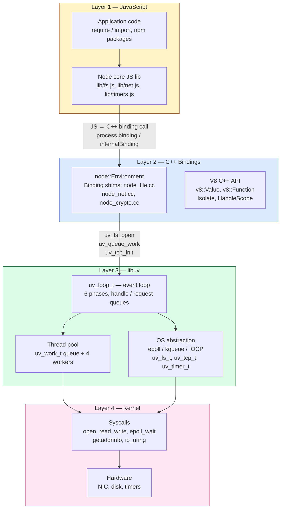
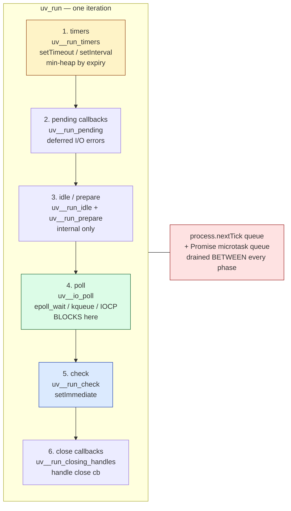
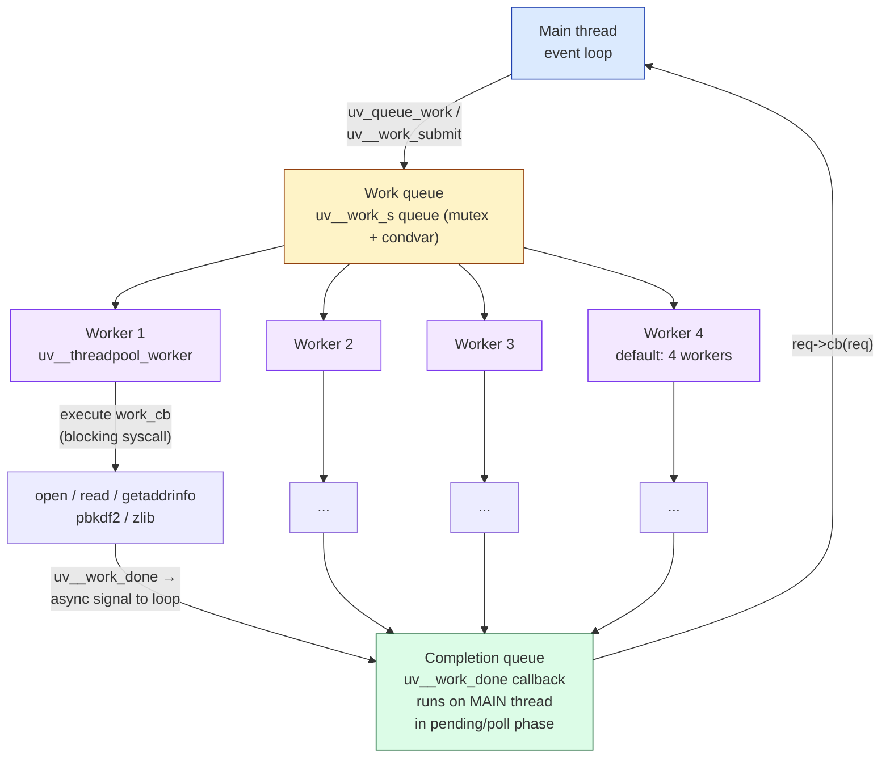
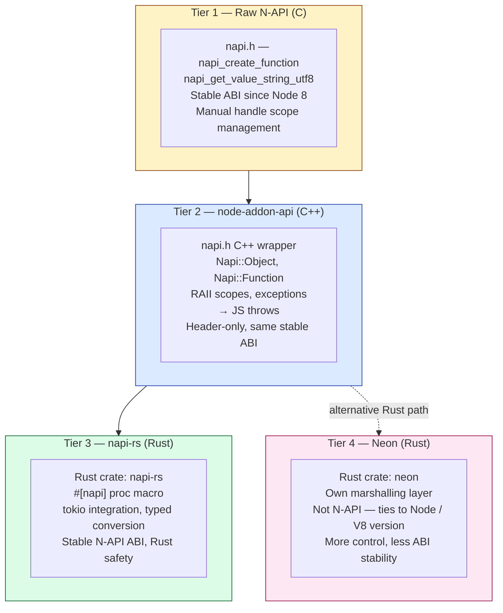
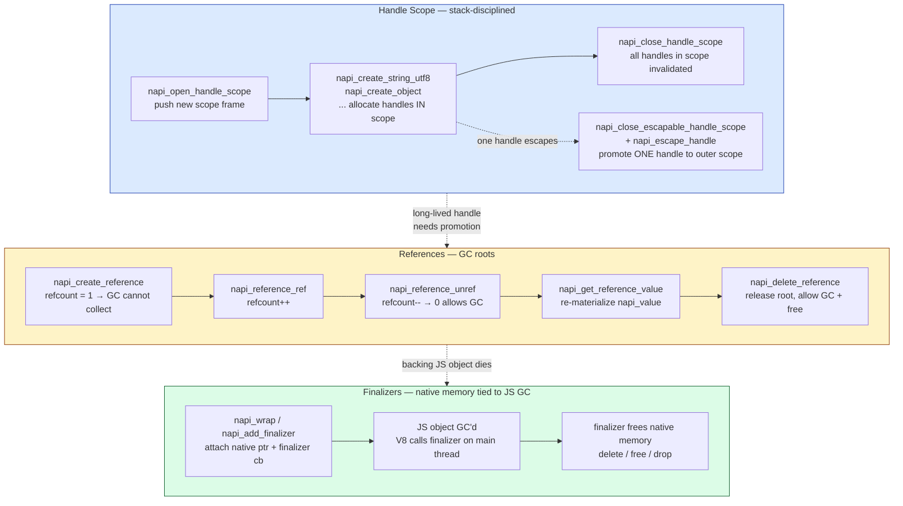
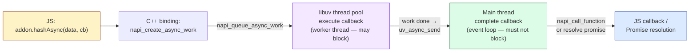
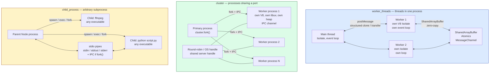
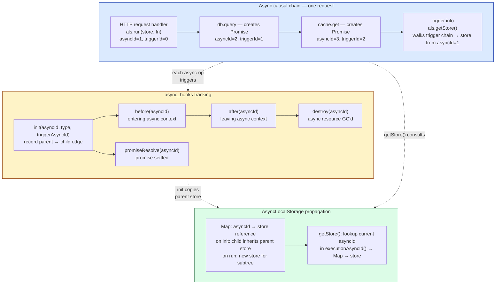

# Chapter 3 — Node.js Internals: libuv, the Thread Pool, and Native Addons

*What this chapter covers:* Node.js is JavaScript executed by V8, but every I/O operation, timer, DNS lookup, and file access is mediated by a layered native stack: a C++ bindings layer that marshals between V8 objects and native memory, and libuv — the cross-platform asynchronous I/O library that owns the event loop, the thread pool, and the OS abstraction. This chapter opens the black box. You will trace a `fs.readFile` from JavaScript through the binding into a thread-pool work item and back through the event loop, understand the six phases of the libuv loop and exactly which Node API lands in which phase, reason about thread-pool sizing and starvation under load, write native addons at three levels of abstraction (raw N-API C, `node-addon-api` C++, and `napi-rs` Rust), offload CPU work without blocking the loop, choose correctly among `worker_threads`, `cluster`, and `child_process`, and finally understand how `AsyncLocalStorage` propagates request context across arbitrary async boundaries — and what it costs.

After reading this chapter you will be able to:

- Diagram the Node layer cake (JS → C++ bindings → libuv → kernel) and explain where V8, the binding shim, and libuv each draw their responsibility boundary.
- Walk the six libuv event-loop phases in order, name the C function that implements each phase, and map every major Node API (`setTimeout`, `setImmediate`, `fs.*`, `net`, `process.nextTick`, Promises) to its phase or queue.
- Explain the libuv thread-pool architecture — `uv_queue_work`, `uv_work_t`, the lock-free work queue, the `UV_THREADPOOL_SIZE` default of 4, and why CPU-bound work and `fs`/`dns`/`crypto` contend on the same pool — and size it correctly for production.
- Distinguish the three I/O paths through libuv (non-blocking poll for sockets, thread-pool for filesystem/DNS, heap for timers) and predict their latency and ordering properties.
- Write a native addon at each of the four abstraction tiers (raw N-API C, `node-addon-api` C++, `napi-rs` Rust, Neon) and articulate the ABI-stability trade-off that motivates N-API.
- Manage N-API handle scopes, references, and object lifetime correctly — `napi_open_handle_scope` / `napi_close_handle_scope`, `napi_create_reference` / `napi_delete_reference`, finalizers — and diagnose leaks caused by escaped handles.
- Implement an asynchronous addon with `napi_create_async_work` / `napi_queue_async_work` so that native CPU work runs on the thread pool and completes on the main thread without blocking the loop.
- Choose among `worker_threads`, `cluster`, and `child_process` on the basis of isolation, memory sharing, start-up cost, and failure domain — and justify the choice with a quantitative model.
- Use `AsyncLocalStorage` to propagate trace IDs, tenant IDs, and auth context across async hops, explain how `async_hooks` tracks the causal chain under the hood, and quantify its overhead so you can decide when to disable it on the hot path.

---

## 3.1 The Node Layer Cake

Node is four layers. Every call crosses at least two of them. Understanding which layer does what is the prerequisite for every performance investigation, every native addon, and every production tuning decision.



**Layer 1 — JavaScript (V8).** Your code and Node's JavaScript standard library (`lib/*.js`). `lib/fs.js` does not perform I/O; it validates arguments, creates a request object, and forwards to the binding. For example, `fs.readFile` in `lib/fs.js` normalizes the path and options, allocates a `FSReqCallback`, and calls `binding.open` / `binding.read` — which are C++ functions exposed via `internalBinding('fs')`.

**Layer 2 — C++ bindings (`src/*.cc`).** Each subsystem has a corresponding C++ file: `src/node_file.cc` for `fs`, `src/node_net.cc` for `net`, `src/node_crypto.cc` for `crypto`, `src/node_zlib.cc` for `zlib`. The binding's job is strictly translation: convert V8 values (`v8::String`, `v8::Function`, `node::Buffer`) into C structs (`uv_fs_t`, `uv_work_t`, `uv_buf_t`), enqueue work with libuv, and convert results back into V8 values when the callback fires. The binding owns no I/O logic — that belongs to libuv.

**Layer 3 — libuv (`deps/uv/`).** A standalone C library (~30K lines) that provides three things: (a) the event loop (`uv_loop_t`, `uv_run`), (b) the thread pool, and (c) cross-platform handles and requests (`uv_tcp_t`, `uv_udp_t`, `uv_fs_t`, `uv_getaddrinfo_t`, `uv_timer_t`). Node links libuv statically. The libuv version is pinned per Node release (e.g., Node 20 ships libuv 1.44, Node 22 ships libuv 1.48). libuv knows nothing about V8 or JavaScript; it operates on C callbacks.

**Layer 4 — Kernel.** libuv ultimately calls kernel interfaces: `epoll_wait` / `epoll_ctl` on Linux, `kqueue` / `kevent` on macOS/BSD, `GetQueuedCompletionStatusEx` / `IOCP` on Windows, plus `open`/`read`/`write`/`getaddrinfo`/`io_uring` for the operations that the thread pool executes.

### Tracing a `fs.readFile` through the cake

Concrete path for `fs.readFile('/etc/hosts', 'utf8', cb)` on Linux:

```javascript
// lib/fs.js (simplified) — Layer 1
function readFile(path, options, callback) {
  // 1. Normalize args, validate encoding
  const req = new FSReqCallback();
  req.oncomplete = callback;
  // 2. Forward to C++ binding
  binding.open(pathModule.toNamespacedPath(path), stringToFlags(options.flag), 0o666, req);
  //    binding is internalBinding('fs') → src/node_file.cc::Open()
}
```

```cpp
// src/node_file.cc (simplified) — Layer 2
void Open(const FunctionCallbackInfo<Value>& args) {
  FSReqBase* req_wrap = GetReqWrap(args[3]); // JS callback wrapper
  const char* path = *Utf8Value(isolate, args[0]);
  int flags = args[1]->Int32Value(ctx).ToChecked();
  // 3. Allocate libuv request, enqueue on thread pool
  FSReq* req = new FSReq(req_wrap);
  uv_fs_open(env->event_loop(), req->req(), path, flags, 0644, AfterOpen);
  //    uv_fs_* always goes through the thread pool — see §3.3
}
void AfterOpen(uv_fs_t* req) {
  // 4. Runs on main thread after thread-pool work completes
  FSReq* wrap = ContainerOf(req);
  // Convert result → V8 value, schedule JS callback via MakeCallback
  wrap->ResolveAndCleanup();
}
```

```c
// deps/uv/src/unix/fs.c (simplified) — Layer 3
void uv_fs_open(uv_loop_t* loop, uv_fs_t* req,
                const char* path, int flags, int mode,
                uv_fs_cb cb) {
  INIT_REQ(req, UV_FS);  // req->cb = cb, req->loop = loop
  req->path = uv__strdup(path);
  // 5. Enqueue as thread-pool work — NOT inline I/O
  uv__work_submit(loop, &req->work_req,
                  UV__WORK_FAST_IO,  // hint: may be fast path with io_uring
                  uv__fs_work,        // worker thread: calls open(2)
                  uv__fs_done);       // main thread: invokes cb
}
void uv__fs_work(struct uv__work* w) {
  uv_fs_t* req = container_of(w, uv_fs_t, work_req);
  // 6. This runs on a thread-pool worker — may block
  req->result = open(req->path, req->flags, req->mode);
}
void uv__fs_done(struct uv__work* w, int status) {
  uv_fs_t* req = container_of(w, uv_fs_t, work_req);
  // 7. Back on the main thread, inside the event loop's pending phase
  req->cb(req);  // → AfterOpen in node_file.cc → JS callback
}
```

The key observation: `open(2)` — a potentially blocking syscall — never executes on the main thread. It is dispatched to a worker thread. The main thread only handles the enqueue and the completion callback. This is why Node can serve thousands of concurrent `fs` operations on a single thread without blocking the loop on disk I/O — at the cost of thread-pool contention, which we examine next.

> **Distributed-systems lens.** In a fleet of Node services, the layer cake repeats per process. Layer 4 (kernel) is shared across containers on the same host via the host kernel and cgroup limits. A noisy neighbor that saturates disk I/O will stall every Node thread pool on that host simultaneously, because they all contend on the same block-device queue. This is why `UV_THREADPOOL_SIZE` tuning (§3.3) must be coordinated with cgroup `io.weight` and disk provisioning — the layers above cannot fix contention introduced at the bottom.

---

## 3.2 libuv and the Event Loop: Six Phases

The libuv event loop is not a single queue. It is a deterministic sequence of phases, each draining a different set of handles and requests. Node adds two extra micro-queues (`process.nextTick` and the V8 Promise microtask queue) that interleave between every phase transition — which is why Node ordering diverges from the browser.



The C implementation in `deps/uv/src/unix/core.c` is approximately:

```c
// deps/uv/src/unix/core.c — uv_run (simplified, error handling omitted)
int uv_run(uv_loop_t* loop, uv_run_mode mode) {
  int r;
  while ((r = uv__loop_alive(loop)) != 0) {
    uv__update_time(loop);          // sample CLOCK_MONOTONIC → loop->time
    uv__run_timers(loop);           // phase 1: expired timers
    uv__run_pending(loop);          // phase 2: pending callbacks
    uv__run_idle(loop);             // phase 3a: idle handles (internal)
    uv__run_prepare(loop);          // phase 3b: prepare handles (internal)

    // Between every phase: Node drains nextTick + microtasks
    // (Node patches this via env->RunBeforeUpdates() in node::Environment)

    uv__io_poll(loop, timeout);     // phase 4: block for I/O (or not)
    uv__run_check(loop);            // phase 5: setImmediate
    uv__run_closing_handles(loop);  // phase 6: close callbacks

    // Again: drain nextTick + microtasks before next iteration
  }
  return r;
}
```

### What each phase does and which Node API it serves

```
Phase              C function              Node API that enqueues here        Observable ordering
─────              ──────────              ───────────────────────────        ───────────────────
1  timers          uv__run_timers          setTimeout, setInterval            Fires when loop->time >= expiry
2  pending         uv__run_pending         I/O errors deferred from poll      Rarely visible to JS
3a idle            uv__run_idle            (internal — Node bookkeeping)     No public API
3b prepare         uv__run_prepare         (internal — Node bookkeeping)     No public API
4  poll            uv__io_poll             fs.*, net, http, dns, crypto      I/O callbacks; blocks for timeout
5  check           uv__run_check           setImmediate                       Always after poll
6  close           uv__run_closing_handles socket.on('close'), server.close  Cleanup
   ─────────────────────────────────────────────────────────────────────
   between every phase:         process.nextTick  (highest priority, starves I/O)
                                Promise microtasks (queueMicrotask, .then, await)
```

The mapping in the table above is the essential reference — `setTimeout`/`setInterval` → timers, `fs`/`net`/`http` → poll, `setImmediate` → check, `close` callbacks → close, with `process.nextTick` and Promise microtasks interleaved between every phase.

#### Timers are a min-heap, not a queue

`uv_timer_t` handles are stored in a binary min-heap keyed by `timeout = loop->time + delay`. `uv__run_timers` peeks at the heap root; if `root->timeout <= loop->time`, it pops and fires. This means:

- Timers fire in expiry order, not insertion order — `setTimeout(fn, 100)` inserted after `setTimeout(fn, 10)` fires second despite being inserted later if its expiry is later.
- `loop->time` is sampled once per iteration via `uv__update_time` (which calls `clock_gettime(CLOCK_MONOTONIC)`). A timer scheduled with `setTimeout(fn, 0)` will not fire until the *next* timers phase — it cannot fire inline.
- Coalescing: if the loop was blocked in `poll` for 50 ms, every timer that expired during that window fires together in the next timers phase. There is no per-timer thread; there is one heap and one phase.
- `setInterval` is reinserted into the heap after each firing with `timeout = loop->time + repeat`. Drift accumulates if the loop is busy.

```javascript
// Timer coalescing demo — run with: node timers-demo.js
console.log(Date.now(), 'start');

setTimeout(() => console.log(Date.now(), 'timeout 10ms'), 10);
setTimeout(() => console.log(Date.now(), 'timeout 10ms (second)'), 10);
setTimeout(() => console.log(Date.now(), 'timeout 50ms'), 50);

// Block the loop for 60ms — all three timers coalesce
const end = Date.now() + 60;
while (Date.now() < end) { /* busy spin — blocks poll AND timers */ }

console.log(Date.now(), 'unblocked');
// Output (timestamps approximate):
// 1713700000000 start
// 1713700000061 unblocked
// 1713700000061 timeout 10ms          ← all three fire together
// 1713700000061 timeout 10ms (second) ← same tick, insertion order
// 1713700000061 timeout 50ms          ← coalesced, 11ms late
```

#### `poll` is the blocking heart

`uv__io_poll` computes a timeout from the next timer expiry: `timeout = max(0, next_timer_expiry - loop->time)`. Then it calls `epoll_wait(epfd, events, maxevents, timeout)` on Linux (or `kevent` / `GetQueuedCompletionStatusEx` on other platforms). If no timers are pending, `timeout` may be `-1` (block indefinitely) or `0` (poll without blocking) depending on whether the loop has other live handles.

This is where Node spends most of its wall-clock time when idle — parked in `epoll_wait`. Every inbound TCP connection, every readable socket, every completed `fs` operation that was dispatched to the thread pool wakes the loop here. The `poll` phase then invokes the associated C callbacks, which in turn schedule JavaScript callbacks.

#### `setImmediate` vs `setTimeout(fn, 0)` — why they race

`setImmediate` enqueues a `uv_check_t` handle (check phase). `setTimeout(fn, 0)` enqueues a `uv_timer_t` with `timeout = loop->time + 1` (clamped to 1 ms minimum). Their relative order depends on *when* they are scheduled:

```javascript
// Case 1: scheduled from top-level script — RACE (non-deterministic)
setTimeout(() => console.log('timeout'), 0);
setImmediate(() => console.log('immediate'));
// Output: either order — depends on whether loop->time advanced
//         past the timer threshold before poll entered.

// Case 2: scheduled from inside poll (I/O callback) — DETERMINISTIC
import fs from 'node:fs';
fs.readFile(__filename, () => {
  setTimeout(() => console.log('timeout inside I/O'), 0);
  setImmediate(() => console.log('immediate inside I/O'));
});
// Output (always):
//   immediate inside I/O   ← check phase runs right after poll
//   timeout inside I/O     ← timers phase is next iteration
```

Rule: inside an I/O callback (poll phase), `setImmediate` always fires before `setTimeout(fn, 0)` because `check` is the next phase after `poll`, while `timers` is the first phase of the *next* iteration. From top-level code, the order is a race because the loop may or may not have entered `poll` before the timer heap is checked.

#### `process.nextTick` and Promises between phases

Node drains two additional queues between every phase transition (and after every callback within a phase):

1. `process.nextTick` queue — a `FixedQueue` in `lib/internal/process/task_queues.js`, drained exhaustively including ticks enqueued while draining. This queue has *higher priority than Promises* and, if recursed, starves I/O indefinitely — there is no yielding.
2. V8 Promise microtask queue — drained via `v8::Isolate::PerformMicrotaskCheckpoint()`, which empties `queueMicrotask` / `Promise.then` / `await` continuations.

```javascript
// nextTick vs microtask vs phase ordering — Node 20
import fs from 'node:fs';

setTimeout(() => console.log('1: timers'), 0);
setImmediate(() => console.log('2: check'));

fs.readFile(__filename, () => {
  console.log('3: poll (I/O callback)');
  process.nextTick(() => console.log('4: nextTick inside poll'));
  Promise.resolve().then(() => console.log('5: promise inside poll'));
  setTimeout(() => console.log('6: timer inside poll'), 0);
  setImmediate(() => console.log('7: immediate inside poll'));
});

process.nextTick(() => console.log('8: nextTick top-level'));
Promise.resolve().then(() => console.log('9: promise top-level'));

console.log('10: sync script end');

// Output (Node 20):
// 10: sync script end
// 8: nextTick top-level          ← nextTick drains before promises
// 9: promise top-level
// 1: timers                      ← timers phase (next iteration)
//   nextTick/promise drain between phases (none here)
// 3: poll (I/O callback)         ← poll phase
// 4: nextTick inside poll        ← nextTick drains before promises, before next phase
// 5: promise inside poll
// 2: check  — wait, actually 7 fires here: check phase is immediately after poll
// 7: immediate inside poll       ← check phase (same iteration as poll)
// 2: check (top-level immediate) ← also check phase, FIFO with 7
// 6: timer inside poll           ← timers phase of NEXT iteration
```

---

## 3.3 The Thread Pool

Not all operations can be non-blocking. Filesystem I/O on Linux has no uniformly non-blocking interface (prior to `io_uring`), DNS resolution via `getaddrinfo` is blocking, and CPU-bound work like `crypto.pbkdf2` and `zlib` compression must run somewhere. libuv's answer is a fixed-size thread pool.

### Architecture



### `uv_queue_work` — the core primitive

Every thread-pool operation goes through one function:

```c
// deps/uv/include/uv.h
typedef struct uv_work_s {
  uv_loop_t* loop;
  uv_work_cb work;    // runs on worker thread — may block
  uv_after_work_cb after_work; // runs on main thread — must not block
  void* data;         // caller context (e.g., uv_fs_t*, custom struct)
} uv_work_t;

typedef void (*uv_work_cb)(uv_work_t* req);
typedef void (*uv_after_work_cb)(uv_work_t* req, int status);

int uv_queue_work(uv_loop_t* loop, uv_work_t* req,
                  uv_work_cb work_cb,
                  uv_after_work_cb after_work_cb);
```

Pseudocode for the internal implementation (`deps/uv/src/threadpool.c`):

```c
// Simplified thread-pool internals — deps/uv/src/threadpool.c
#define MAX_THREADPOOL_SIZE 1024

static uv__work_queue wq;          // global work queue (mutex + condvar)
static uv_thread_t* workers;       // array of pthreads
static int nthreads = 4;           // default; overridden by UV_THREADPOOL_SIZE

void uv__work_submit(uv_loop_t* loop, struct uv__work* w,
                     enum uv__work_kind kind,
                     uv__work_cb work, uv__work_done_cb done) {
  w->loop = loop;
  w->work = work;
  w->done = done;
  uv_mutex_lock(&wq.mutex);
  QUEUE_INSERT_TAIL(&wq.queue, &w->wq);  // FIFO enqueue
  uv_cond_signal(&wq.cond);              // wake one worker
  uv_mutex_unlock(&wq.mutex);
}

// Each worker thread loops forever:
void uv__threadpool_worker(void* arg) {
  while (1) {
    uv_mutex_lock(&wq.mutex);
    while (QUEUE_EMPTY(&wq.queue))
      uv_cond_wait(&wq.cond, &wq.mutex);  // park until work arrives
    QUEUE* q = QUEUE_HEAD(&wq.queue);
    QUEUE_REMOVE(q);
    uv_mutex_unlock(&wq.mutex);

    struct uv__work* w = QUEUE_DATA(q, struct uv__work, wq);
    w->work(w);   // ← BLOCKING: open(), getaddrinfo(), pbkdf2(), ...

    // Signal completion back to the main thread via async handle
    uv_mutex_lock(&w->loop->wq_mutex);
    QUEUE_INSERT_TAIL(&w->loop->wq, &w->wq);
    uv_async_send(&w->loop->wq_async);  // wakes epoll_wait in poll phase
    uv_mutex_unlock(&w->loop->wq_mutex);
  }
}

// Main thread — called from uv__work_done inside the loop iteration:
void uv__work_done(uv_async_t* handle) {
  uv_loop_t* loop = handle->loop;
  QUEUE wq;
  QUEUE_MOVE(&loop->wq, &wq);  // drain completion queue
  while (!QUEUE_EMPTY(&wq)) {
    QUEUE* q = QUEUE_HEAD(&wq);
    QUEUE_REMOVE(q);
    struct uv__work* w = QUEUE_DATA(q, struct uv__work, wq);
    w->done(w, 0);  // ← runs on main thread: invokes JS callback
  }
}
```

### What uses the thread pool vs. what does not

| Operation | Thread pool? | Why |
|-----------|-------------|-----|
| `fs.readFile`, `fs.writeFile`, `fs.open`, `fs.stat`, `fs.readdir` | Yes — all `uv_fs_*` | POSIX filesystem syscalls have no non-blocking mode on Linux (pre-`io_uring`) |
| `dns.lookup` (`getaddrinfo`) | Yes | `getaddrinfo` is blocking; parses `/etc/hosts`, `/etc/nsswitch.conf`, DNS |
| `dns.resolve` (`c-ares`) | No | Uses libuv's c-ares integration — non-blocking DNS over UDP via `poll` |
| `crypto.pbkdf2`, `crypto.scrypt`, `crypto.randomBytes` | Yes | CPU-bound; deliberately offloaded |
| `zlib.gzip`, `zlib.deflate` | Yes | CPU-bound compression |
| `net.connect`, `net.createServer`, `http.request` | No | Non-blocking sockets via `epoll` in `poll` phase |
| `setTimeout`, `setInterval` | No | Timer heap in `timers` phase |
| `setImmediate` | No | Check handle in `check` phase |

> **Historical note.** Node 20+ and libuv 1.44+ can use `io_uring` for filesystem operations when the kernel supports it (`IORING_SETUP` available and not blocked by seccomp). In that path, `uv_fs_*` operations bypass the thread pool entirely and are submitted as SQEs to the ring, with completions arriving via CQEs in the `poll` phase — similar to how network I/O already works. The thread pool remains the fallback. In containers with restrictive seccomp profiles (the Docker default before 20.10.12 blocks `io_uring`), the pool path is always used. Check `UV_USE_IO_URING` and `require('os').availableParallelism()` interaction when tuning.

### Sizing the pool — `UV_THREADPOOL_SIZE`

Default is 4 threads. Override at process start (it is read once, before the pool is created):

```bash
UV_THREADPOOL_SIZE=8 node server.js
# or programmatically before first use (Node 20+):
# Must be set before the pool initializes — effectively at startup
```

```javascript
// threadpool-exhaustion.js — demonstrates starvation
import fs from 'node:fs';
import crypto from 'node:crypto';

const start = Date.now();
const log = (label) => console.log(`${Date.now() - start}ms  ${label}`);

// Saturate the pool with 4 blocking fs ops (default pool = 4)
for (let i = 0; i < 4; i++) {
  fs.readFile('/dev/urandom', { encoding: null }, () => log(`fs ${i} done`));
  // Each fs.readFile occupies one worker until the read completes
}

// This crypto operation must wait — no idle worker
crypto.pbkdf2('password', 'salt', 100000, 64, 'sha512', () => {
  log('pbkdf2 done — waited for pool slot');
});

// This timer is NOT on the pool — fires on time regardless
setTimeout(() => log('timer 10ms — not on pool'), 10);

// With UV_THREADPOOL_SIZE=4, expect:
//   ~10ms  timer 10ms — not on pool    ← timers phase, unaffected
//   ~??ms  fs 0..3 done                ← pool workers completing
//   ~??ms  pbkdf2 done — waited        ← queued behind fs ops

// With UV_THREADPOOL_SIZE=8, pbkdf2 starts immediately alongside fs ops.

// Observe pool utilization via trace events:
//   node --trace-event-categories node.threadpool threadpool-exhaustion.js
```

**Sizing guidance for production:**

- **4 (default)** is sufficient for lightweight `fs` usage (config file reads at startup) but starves under concurrent `fs` + `crypto` load.
- **8** is a common production choice for services that do moderate filesystem or crypto work. Each thread costs ~8 MB stack + TLS overhead.
- **128** (maximum effective) is the hard cap in libuv (`MAX_THREADPOOL_SIZE`), but beyond ~16 you hit diminishing returns and increased context-switch overhead. The pool is not work-stealing; it is a single FIFO queue with `pthread_cond_signal` — one wakeup per enqueue.
- **Never size the pool larger than `availableParallelism()`** without reason. On a 2-vCPU container with `UV_THREADPOOL_SIZE=16`, 14 threads are always contending for 2 cores — pure overhead.
- **Isolate CPU-bound work** to `worker_threads` (§3.8) rather than growing the shared pool, which is contended by `fs`, `dns`, and `crypto` simultaneously.

> **Distributed-systems lens.** Thread-pool starvation is a cross-cutting failure mode in fleets. A single endpoint that triggers `crypto.pbkdf2` per request (e.g., password hashing on login) can saturate the pool, causing unrelated `fs.readFile` calls (e  g., reading TLS certificates, loading feature flags from disk) and `dns.lookup` calls to queue behind it — even though they are logically independent. In a microservice that does both authentication and file serving, this manifests as p99 latency spikes on the file-serving path caused by load on the auth path. The fix is isolation: move `pbkdf2`/`scrypt`/`bcrypt` to `worker_threads` or an external auth service so that the shared pool is not a single point of contention. Monitor `perf_hooks.monitorEventLoopDelay` *and* thread-pool queue depth (via `async_hooks` or `trace_events`) to distinguish pool starvation from loop blocking.

---

## 3.4 Three Paths Through libuv: Filesystem, Networking, and Timers

libuv routes operations through fundamentally different mechanisms depending on whether the underlying kernel interface is blocking or non-blocking.

### Path 1 — Filesystem: always through the thread pool (or `io_uring`)

Every `uv_fs_*` operation — `open`, `read`, `write`, `stat`, `readdir`, `unlink`, `mkdir` — is dispatched as a `uv__work_t` to the thread pool (§3.3). The worker thread performs the blocking syscall synchronously, then signals completion back to the loop. Ordering is FIFO per the work queue, but completion order depends on syscall latency (a fast `stat` may complete before a slow `read` enqueued earlier).

On kernels with `io_uring` enabled, libuv 1.44+ submits `uv_fs_*` as SQEs and polls for CQEs in the `poll` phase — eliminating the thread-pool hop. The JavaScript-visible ordering is identical; only the internal path changes.

```javascript
// fs ordering — enqueue order ≠ completion order when latencies differ
import fs from 'node:fs';

fs.readFile('/tmp/large-file.bin', () => console.log('large read done'));
fs.stat('/tmp/small-file.txt', () => console.log('stat done'));
// stat may complete first despite being enqueued second —
// whichever worker finishes first signals first.
```

### Path 2 — Networking: non-blocking, via `poll` phase

TCP/UDP sockets, pipes, and TTYs use non-blocking file descriptors registered with the loop's `epoll` instance. No thread-pool involvement. The flow is:

1. `uv_tcp_init` / `uv_tcp_bind` / `uv_listen` — creates a non-blocking socket, registers it with `epoll` via `epoll_ctl(EPOLL_CTL_ADD)`.
2. `uv__io_poll` calls `epoll_wait` — returns when the socket is readable/writable.
3. The loop invokes the handle's callback (`on_connection`, `on_read`) directly on the main thread.

```javascript
// Networking stays on the main thread — no pool
import net from 'node:net';

const server = net.createServer((socket) => {
  // This callback fires inside poll phase — main thread
  socket.on('data', (chunk) => {
    // Also poll phase — epoll_wait returned EPOLLIN for this fd
    socket.write(chunk); // non-blocking write, buffered in libuv
  });
});
server.listen(3000, () => console.log('listening'));
// Under the hood:
//   socket fd → epoll_ctl(ADD, EPOLLIN)
//   epoll_wait returns → uv__tcp_io → Node's OnConnection → JS callback
```

DNS is the exception within networking: `dns.lookup` calls `getaddrinfo` (blocking, thread pool), while `dns.resolve` uses c-ares (non-blocking, poll phase). This distinction matters for latency-sensitive services — prefer `dns.resolve` or cache `lookup` results.

### Path 3 — Timers: min-heap in the `timers` phase

No I/O, no thread pool. Timers are `uv_timer_t` handles stored in a binary min-heap keyed by absolute expiry (`loop->time + delay`). `uv__run_timers` drains every expired entry in heap order. See §3.2 for coalescing and drift behavior.

```javascript
// Timer heap — expiry order, not insertion order
setTimeout(() => console.log('100ms'), 100);
setTimeout(() => console.log('10ms'), 10);
setTimeout(() => console.log('50ms'), 50);
// Output: 10ms → 50ms → 100ms  (heap order by expiry)
```

| Path | Kernel interface | Thread pool? | Loop phase | Latency source |
|------|----------------|-------------|------------|----------------|
| Filesystem | `open`/`read`/`write` (blocking) or `io_uring` SQE | Yes (or ring) | Completion via `pending`/`poll` | Disk I/O + pool queue depth |
| Networking | `epoll_wait` on non-blocking fd | No | `poll` | Network RTT + kernel buffer |
| Timers | `clock_gettime` + heap | No | `timers` | Loop busy time (drift) |
| DNS (`lookup`) | `getaddrinfo` (blocking) | Yes | Completion via `pending`/`poll` | Resolver latency + pool queue |
| DNS (`resolve`) | c-ares over UDP | No | `poll` | DNS RTT |
| Crypto / zlib | CPU-bound | Yes | Completion via `pending`/`poll` | CPU time + pool queue |

---

## 3.5 Native Addons: Four Tiers of Extensibility

When JavaScript is not fast enough or must interface with a native library, Node provides four tiers of native addon abstraction — each trading raw control for ergonomics and ABI stability.



| Tier | Language | Header / Crate | ABI | Ergonomics | When to use |
|------|----------|---------------|-----|------------|-------------|
| **1. N-API (C)** | C | `node_api.h` | Stable — addon binary works across Node major versions without recompile | Verbose, manual scope/ref management, error codes | Maximum compatibility, minimal dependencies, embedding |
| **2. node-addon-api (C++)** | C++ | `napi.h` (header-only wrapper over N-API) | Stable (same as N-API) | RAII, exceptions, `Napi::ObjectWrap`, type-safe | Most C++ addons — the default choice for C++ |
| **3. napi-rs** | Rust | `napi` + `napi-derive` crates | Stable (N-API) | `#[napi]` macro, `Result` → JS exception, `tokio` async | Rust addons that need ABI stability across Node versions |
| **4. Neon** | Rust | `neon` crate | Unstable — tied to Node/V8 version, requires recompile per major | `#[neon::main]`, `JsFunction`, `Channel` for threading | Rust addons that need V8-level control, Node-API not sufficient |

The stability distinction is critical. **N-API** (now called **Node-API**, `node_api.h`) is a *forward-compatible ABI guarantee*: an addon compiled against N-API v6 runs on any Node version that supports N-API v6 or later, without recompilation. This is why `napi-rs` and `node-addon-api` both build on N-API — they inherit its stability. **Neon** and raw **NAN** (Native Abstractions for Node, the predecessor — now deprecated) bind directly to V8 internals and break across Node major versions.

N-API is versioned independently of Node. Current N-API version is 9 (Node 20+). Each version adds new functions while keeping all previous ones. An addon's `package.json` declares the required version via `napi_versions` in `node-api` metadata, and `node-gyp` / `prebuildify` select the right header.

### Tier 1 — Raw N-API (C)

The lowest level. Every operation returns a `napi_status` code; every value is a `napi_value` opaque handle. You manage scopes and references explicitly.

```c
// addon.c — raw N-API addon: exposes function greet(name) → "Hello, <name>!"
#include <node_api.h>
#include <assert.h>
#include <string.h>

static napi_value Greet(napi_env env, napi_callback_info info) {
  napi_status status;

  // 1. Extract arguments
  size_t argc = 1;
  napi_value argv[1];
  status = napi_get_cb_info(env, info, &argc, argv, NULL, NULL);
  assert(status == napi_ok);

  // 2. Convert JS string → C string
  size_t str_len;
  status = napi_get_value_string_utf8(env, argv[0], NULL, 0, &str_len);
  assert(status == napi_ok);

  char* name = malloc(str_len + 1);
  status = napi_get_value_string_utf8(env, argv[0], name, str_len + 1, NULL);
  assert(status == napi_ok);

  // 3. Build result string
  const char* prefix = "Hello, ";
  size_t result_len = strlen(prefix) + str_len + 1;
  char* result = malloc(result_len);
  snprintf(result, result_len, "%s%s!", prefix, name);

  // 4. Convert C string → JS string
  napi_value js_result;
  status = napi_create_string_utf8(env, result, NAPI_AUTO_LENGTH, &js_result);
  assert(status == napi_ok);

  free(name);
  free(result);
  return js_result;
}

static napi_value Init(napi_env env, napi_value exports) {
  napi_value fn;
  napi_create_function(env, "greet", NAPI_AUTO_LENGTH, Greet, NULL, &fn);
  napi_set_named_property(env, exports, "greet", fn);
  return exports;
}

NAPI_MODULE(NODE_GYP_MODULE_NAME, Init)
```

```json
// binding.gyp — build config for node-gyp
{
  "targets": [{
    "target_name": "addon",
    "sources": ["addon.c"]
  }]
}
```

```javascript
// Usage — after: npx node-gyp configure && npx node-gyp build
const addon = require('./build/Release/addon.node');
console.log(addon.greet('Ada')); // Hello, Ada!
```

Every `napi_value` returned by `napi_create_*` or `napi_get_*` is a handle that lives until the enclosing handle scope is closed. In a synchronous callback like `Greet`, the scope is the callback's implicit scope — it closes when `Greet` returns. For values that must outlive the callback, you need a reference (§3.6).

### Tier 2 — node-addon-api (C++)

A header-only C++ wrapper that turns error codes into exceptions and manual scope management into RAII.

```cpp
// addon.cc — node-addon-api: same greet function, C++ ergonomics
#include <napi.h>

Napi::String Greet(const Napi::CallbackInfo& info) {
  Napi::Env env = info.Env();

  // Type check — throws JS TypeError if wrong type
  if (!info[0].IsString()) {
    Napi::TypeError::New(env, "String expected").ThrowAsJavaScriptException();
    return Napi::String::New(env, "");
  }

  std::string name = info[0].As<Napi::String>().Utf8Value();
  std::string result = "Hello, " + name + "!";

  return Napi::String::New(env, result);
}

// ObjectWrap example — stateful class exposed to JS
class Counter : public Napi::ObjectWrap<Counter> {
public:
  static Napi::Object Init(Napi::Env env, Napi::Object exports) {
    Napi::Function ctor = DefineClass(env, "Counter", {
      InstanceMethod("increment", &Counter::Increment),
      InstanceMethod("value", &Counter::Value),
    });
    exports.Set("Counter", ctor);
    return exports;
  }

  Counter(const Napi::CallbackInfo& info) : Napi::ObjectWrap<Counter>(info) {
    count_ = info[0].IsNumber() ? info[0].As<Napi::Number>().Int32Value() : 0;
  }

private:
  Napi::Value Increment(const Napi::CallbackInfo& info) {
    count_++;
    return Napi::Number::New(info.Env(), count_);
  }
  Napi::Value Value(const Napi::CallbackInfo& info) {
    return Napi::Number::New(info.Env(), count_);
  }
  int count_;
};

Napi::Object Init(Napi::Env env, Napi::Object exports) {
  exports.Set("greet", Napi::Function::New(env, Greet));
  Counter::Init(env, exports);
  return exports;
}

NODE_API_MODULE(addon, Init)
```

```javascript
// Usage
const { greet, Counter } = require('./build/Release/addon.node');
console.log(greet('Grace'));          // Hello, Grace!

const c = new Counter(10);
console.log(c.value());    // 10
console.log(c.increment()); // 11
```

`Napi::HandleScope` and `Napi::EscapableHandleScope` are RAII wrappers — the scope closes when the C++ object destructs. `Napi::ObjectWrap` ties a C++ object's lifetime to a JS object's GC lifetime via a finalizer. No manual `napi_close_handle_scope` needed in the common case.

### Tier 3 — napi-rs (Rust)

Rust addons via `napi-rs` — the most ergonomic path for Rust, with full N-API ABI stability.

```rust
// src/lib.rs — napi-rs addon: Cargo.toml declares crate-type = ["cdylib"]
use napi_derive::napi;

// Simple function — #[napi] generates the N-API glue
#[napi]
pub fn greet(name: String) -> String {
    format!("Hello, {}!", name)
}

// Typed, fallible function — Result maps to JS exception on Err
#[napi]
pub fn fibonacci(n: u32) -> napi::Result<u32> {
    if n > 47 {
        return Err(napi::Error::from_reason("n > 47 would overflow u32"));
    }
    let (mut a, mut b) = (0u32, 1u32);
    for _ in 0..n {
        let tmp = a + b;
        a = b;
        b = tmp;
    }
    Ok(a)
}

// Async function — runs on libuv thread pool via napi_create_async_work
#[napi]
pub async fn hash_password(password: String) -> String {
    // This body runs on the thread pool — does not block the loop
    // napi-rs bridges Rust async → N-API async work automatically
    let hash = tokio::task::spawn_blocking(move || {
        // Simulate expensive work (real code: argon2, bcrypt)
        let mut h: u64 = 0xcbf29ce484222325;
        for b in password.bytes() {
            h ^= b as u64;
            h = h.wrapping_mul(0x100000001b3);
        }
        format!("{:016x}", h)
    }).await.unwrap();
    hash
}

// Stateful class
#[napi]
pub struct Counter {
    count: i32,
}

#[napi]
impl Counter {
    #[napi(constructor)]
    pub fn new(initial: Option<i32>) -> Self {
        Counter { count: initial.unwrap_or(0) }
    }

    #[napi]
    pub fn increment(&mut self) -> i32 {
        self.count += 1;
        self.count
    }

    #[napi(getter)]
    pub fn value(&self) -> i32 {
        self.count
    }
}
```

```toml
# Cargo.toml
[package]
name = "my-addon"
version = "0.1.0"
edition = "2021"

[lib]
crate-type = ["cdylib"]

[dependencies]
napi = { version = "2", features = ["tokio_rt"] }
napi-derive = "2"

[build-dependencies]
napi-build = "2"
```

```javascript
// Usage — after: npx napi build --platform
const { greet, fibonacci, hashPassword, Counter } = require('./index.node');
console.log(greet('Ferris'));              // Hello, Ferris!
console.log(fibonacci(10));                // 55
console.log(await hashPassword('s3cret')); // 16-char hex hash — non-blocking
const c = new Counter(10);
console.log(c.increment());                // 11
```

`napi-rs` handles `napi_ref`, handle scopes, and async work lifecycle automatically. The `#[napi]` proc macro generates the `napi_register_module_v1` boilerplate. Async functions annotated with `#[napi]` that return `Future`s are automatically dispatched via `napi_create_async_work` — the Rust future's poll runs on the thread pool, and completion resumes on the main thread.

### Tier 4 — Neon (Rust, V8-direct)

Neon bypasses N-API and binds directly to V8 via the `nan`-like `neon::context` API. It offers finer control over V8 handles but requires recompilation per Node major version.

```rust
// src/lib.rs — Neon addon (contrast with napi-rs above)
use neon::prelude::*;

fn greet(mut cx: FunctionContext) -> JsResult<JsString> {
    let name = cx.argument::<JsString>(0)?.value(&mut cx);
    Ok(cx.string(format!("Hello, {}!", name)))
}

fn fibonacci(mut cx: FunctionContext) -> JsResult<JsNumber> {
    let n = cx.argument::<JsNumber>(0)?.value(&mut cx) as u32;
    let (mut a, mut b) = (0u32, 1u32);
    for _ in 0..n { let t = a + b; a = b; b = t; }
    Ok(cx.number(a))
}

#[neon::main]
fn main(mut cx: ModuleContext) -> NeonResult<()> {
    cx.export_function("greet", greet)?;
    cx.export_function("fibonacci", fibonacci)?;
    Ok(())
}
```

Neon is the right choice when you need V8 handle-level control (custom finalizers, direct `ArrayBuffer` backing store manipulation, `napi` not yet exposing a new V8 feature). For most Rust addons, `napi-rs` is preferred because its N-API foundation means a single compiled `.node` binary works across Node 16/18/20/22.

---

## 3.6 N-API Deep Dive: Handles, Scopes, References, and Lifecycle

N-API's handle system is the most common source of addon bugs — leaks, use-after-free, and GC surprises. Understanding it precisely is non-optional.

### Handles and scopes

Every `napi_value` is a handle — an indirection through V8's handle table, not a direct pointer to a JS object. Handles are only valid within their handle scope.



**Handle scopes — the rules:**

1. Every N-API callback (`napi_callback`, `napi_async_execute_callback`, finalizer) enters with an implicit handle scope. All handles created inside the callback belong to that scope.
2. When the callback returns, its scope closes — every `napi_value` created inside becomes invalid. Returning a `napi_value` from the callback is safe because the caller promotes it; storing a `napi_value` in a C global and using it in a later callback is **use-after-free**.
3. To create many handles in a loop (e.g., building a large array), open a nested scope per iteration to avoid exhausting the handle table:

```c
// Correct: scoped loop — handles freed per iteration
napi_value build_array(napi_env env, int n) {
  napi_value result;
  napi_create_array(env, &result);

  for (int i = 0; i < n; i++) {
    napi_handle_scope scope;
    napi_open_handle_scope(env, &scope);

    napi_value num, str;
    napi_create_int32(env, i, &num);
    napi_create_string_utf8(env, "item", NAPI_AUTO_LENGTH, &str);
    // ... use num, str ...

    napi_set_element(env, result, i, num);
    // Only handles NOT reachable from result need scope cleanup;
    // but intermediate handles (str) are freed here:
    napi_close_handle_scope(env, scope);
  }
  return result;
}

// Escapable scope — promote one handle to outer scope
napi_value create_greeting(napi_env env) {
  napi_escapable_handle_scope scope;
  napi_open_escapable_handle_scope(env, &scope);

  napi_value str;
  napi_create_string_utf8(env, "Hello from inner scope", NAPI_AUTO_LENGTH, &str);

  napi_value escaped;
  napi_escape_handle(env, scope, str, &escaped); // str survives scope close
  napi_close_escapable_handle_scope(env, scope);
  return escaped; // valid in outer scope
}
```

**References — keeping a JS value alive across callbacks:**

A `napi_ref` is a GC root. While its refcount is ≥ 1, the referenced JS value cannot be collected — even if no JS code holds a reference to it.

```c
// Storing a JS callback for later invocation (e.g., async completion)
napi_ref callback_ref;  // global or heap-allocated

// In Init — pin the callback
napi_value cb = argv[0]; // JS function passed to addon
napi_create_reference(env, cb, 1, &callback_ref); // refcount=1 → GC root

// Later — retrieve and call it
napi_value cb_value;
napi_get_reference_value(env, callback_ref, &cb_value);
napi_value global, result;
napi_get_global(env, &global);
napi_call_function(env, global, cb_value, 0, NULL, &result);

// When done — release the root
napi_reference_unref(env, callback_ref, NULL); // refcount → 0, eligible for GC
napi_delete_reference(env, callback_ref);       // free the ref itself

// Thread-safe function alternative (for calls from worker threads):
// napi_create_threadsafe_function — see §3.7
```

Common leak: creating a reference with refcount 1 and never calling `napi_delete_reference`. The JS function (and its closure scope, potentially holding large objects) is never collected. In a long-running server that creates references per request, this is a memory leak that grows with request count — indistinguishable from a JS closure leak in heap snapshots except that the retainer path goes through the native addon.

**`napi_wrap` / finalizers — tying native memory to JS lifetime:**

```c
typedef struct { char* data; size_t len; } NativeBuffer;

void FinalizeBuffer(napi_env env, void* data, void* hint) {
  NativeBuffer* buf = (NativeBuffer*)data;
  free(buf->data);
  free(buf);
  // Runs on main thread when the JS object is GC'd
}

napi_value CreateBuffer(napi_env env, napi_callback_info info) {
  napi_value js_obj;
  napi_create_object(env, &js_obj);

  NativeBuffer* native = malloc(sizeof(NativeBuffer));
  native->data = strdup("native payload");
  native->len = strlen(native->data);

  // Tie native lifetime to js_obj lifetime
  napi_wrap(env, js_obj, native, FinalizeBuffer, NULL, NULL);
  return js_obj;
}

// To retrieve:
NativeBuffer* native;
napi_unwrap(env, js_obj, (void**)&native);
```

`node-addon-api` equivalent is `Napi::ObjectWrap` (shown in §3.5), which automates `napi_wrap`/`napi_unwrap` and calls the C++ destructor as the finalizer.

### N-API versioning and lifecycle

N-API versions are additive. An addon declares its minimum requirement:

```json
// package.json — declare N-API version
{
  "name": "my-addon",
  "version": "1.0.0",
  "binary": { "napi_versions": [6] }
}
```

| N-API version | Node version | Notable additions |
|---------------|-------------|-------------------|
| 1 | 8.0.0 | Core: create/get/set, function, error |
| 3 | 10.0.0 | `napi_create_threadsafe_function`, `napi_get_value_bigint` |
| 4 | 10.16.0 | `napi_create_threadsafe_function` (stable), `napi_add_env_cleanup_hook` |
| 6 | 14.0.0 | `napi_add_finalizer`, `napi_create_date`, `BigInt` improvements |
| 8 | 16.0.0 | `napi_add_async_cleanup_hook`, `napi_create_object_with_properties` |
| 9 | 18.0.0 | `napi_create_threadsafe_function` v2, `node_api.h` rename |

`NAPI_EXPERIMENTAL` guards APIs that have not yet reached stable ABI. Check `napi_get_node_version` at runtime if you need to branch on available features.

---

## 3.7 Async Addons: Getting Off the Main Thread

A synchronous addon that does CPU work blocks the event loop — no I/O callbacks fire, no timers fire, no other JS runs. The fix is `napi_create_async_work`, which dispatches work to the libuv thread pool and calls back on the main thread when done.



### Raw N-API async work — complete example

```c
// async_addon.c — async hash via napi_create_async_work
#include <node_api.h>
#include <stdlib.h>
#include <string.h>

typedef struct {
  char* input;          // owned — allocated in Init, freed in complete
  size_t input_len;
  char output[65];      // hex hash result
  napi_async_work work; // libuv work handle
  napi_ref callback_ref; // GC root for JS callback
  napi_env env;
} HashWork;

// Worker thread — MUST NOT call any napi_* function except
// napi_async_work helpers. No V8 access here.
static void ExecuteHash(napi_env env, void* data) {
  HashWork* w = (HashWork*)data;
  // Simulate expensive hash (real code: call libcrypto, argon2, etc.)
  // This runs on a thread-pool worker — blocking is OK.
  unsigned long h = 5381;
  for (size_t i = 0; i < w->input_len; i++) {
    h = ((h << 5) + h) + (unsigned char)w->input[i]; // djb2
  }
  snprintf(w->output, sizeof(w->output), "%016lx%016lx", h, ~h);
}

// Main thread — runs after ExecuteHash completes, inside event loop
static void CompleteHash(napi_env env, napi_status status, void* data) {
  HashWork* w = (HashWork*)data;

  // Retrieve JS callback
  napi_value callback, global, result_str, argv[2], result;
  napi_get_reference_value(env, w->callback_ref, &callback);
  napi_get_global(env, &global);

  napi_value null_arg;
  napi_get_null(env, &null_arg);
  napi_create_string_utf8(env, w->output, NAPI_AUTO_LENGTH, &result_str);

  // callback(null, result) — Node error-first convention
  argv[0] = null_arg;
  argv[1] = result_str;
  napi_call_function(env, global, callback, 2, argv, &result);

  // Cleanup — order matters
  napi_delete_reference(env, w->callback_ref);
  napi_delete_async_work(env, w->work);
  free(w->input);
  free(w);
}

static napi_value HashAsync(napi_env env, napi_callback_info info) {
  size_t argc = 2;
  napi_value argv[2];
  napi_get_cb_info(env, info, &argc, argv, NULL, NULL);

  // Extract input string
  size_t len;
  napi_get_value_string_utf8(env, argv[0], NULL, 0, &len);
  char* input = malloc(len + 1);
  napi_get_value_string_utf8(env, argv[0], input, len + 1, NULL);

  HashWork* work = calloc(1, sizeof(HashWork));
  work->input = input;
  work->input_len = len;
  work->env = env;
  napi_create_reference(env, argv[1], 1, &work->callback_ref);

  napi_value resource_name;
  napi_create_string_utf8(env, "HashAsync", NAPI_AUTO_LENGTH, &resource_name);

  napi_create_async_work(env, NULL, resource_name,
                         ExecuteHash, CompleteHash, work, &work->work);
  napi_queue_async_work(env, work->work);

  napi_value undefined;
  napi_get_undefined(env, &undefined);
  return undefined;
}

// Promise variant — napi_create_promise + resolve/reject
static napi_value HashAsyncPromise(napi_env env, napi_callback_info info) {
  // ... similar setup, but create a deferred promise:
  // napi_create_promise(env, &deferred, &promise);
  // store deferred in work struct, resolve in CompleteHash via
  // napi_resolve_deferred / napi_reject_deferred
  // return promise to JS — enables: await addon.hashAsyncPromise(data)
  return NULL; // elided for brevity — full impl in repo examples
}

static napi_value Init(napi_env env, napi_value exports) {
  napi_value fn1, fn2;
  napi_create_function(env, "hashAsync", NAPI_AUTO_LENGTH, HashAsync, NULL, &fn1);
  napi_create_function(env, "hashAsyncPromise", NAPI_AUTO_LENGTH, HashAsyncPromise, NULL, &fn2);
  napi_set_named_property(env, exports, "hashAsync", fn1);
  napi_set_named_property(env, exports, "hashAsyncPromise", fn2);
  return exports;
}

NAPI_MODULE(NODE_GYP_MODULE_NAME, Init)
```

```javascript
// Usage — callback and promise forms
const addon = require('./build/Release/async_addon.node');

// Callback form
addon.hashAsync('hello world', (err, hash) => {
  console.log('callback:', hash); // 16-char hex
});

// Promise form (if HashAsyncPromise implemented)
const hash = await addon.hashAsyncPromise('hello world');
console.log('promise:', hash);
```

Critical rules for `ExecuteHash` (worker thread):

- **Do not call any `napi_*` function** that touches V8 — no `napi_create_string_utf8`, no `napi_call_function`, no `napi_get_value_*`. The only safe N-API calls on the worker are `napi_add_env_cleanup_hook` and the async-work helpers. Violating this corrupts V8 state.
- **Do not access `napi_env`** from the worker — it is not thread-safe. Pass data via the `void* data` struct.
- **Blocking is expected** — that is the point. The worker thread exists to block so the main thread does not.

### Thread-safe functions — calling JS from any thread

When a worker thread needs to call back into JS *during* execution (progress callbacks, streaming results), `napi_create_async_work` is insufficient — it only calls back once at completion. Use `napi_threadsafe_function`:

```c
// Sketch — streaming progress from worker thread
napi_threadsafe_function tsfn;

// Main thread — create TSFN
napi_create_threadsafe_function(env, js_callback, NULL,
    resource_name, 0, 1, NULL, NULL, NULL, CallJs, &tsfn);

// Worker thread — call JS at any time (thread-safe)
char* progress = strdup("50% done");
napi_call_threadsafe_function(tsfn, progress, napi_tsfn_blocking);

// Main thread — JS callback invoked via CallJs trampoline
void CallJs(napi_env env, napi_value js_cb, void* ctx, void* data) {
  char* msg = (char*)data;
  napi_value js_str, result;
  napi_create_string_utf8(env, msg, NAPI_AUTO_LENGTH, &js_str);
  napi_call_function(env, NULL, js_cb, 1, &js_str, &result);
  free(msg);
}

// Cleanup
napi_release_threadsafe_function(tsfn, napi_tsfn_release);
```

`napi-rs` wraps this as `napi::threadsafe_function::ThreadsafeFunction` and `tokio` integration handles it automatically for `async fn` addons.

---

## 3.8 Parallelism in Node: worker_threads vs cluster vs child_process

Node offers three ways to use more than one OS thread or process. They differ in isolation, memory sharing, startup cost, and failure semantics — choosing wrong is a common source of production incidents.



| Dimension | `worker_threads` | `cluster` | `child_process` |
|-----------|-----------------|-----------|----------------|
| **OS primitive** | Threads (`pthread` / `CreateThread`) in one process | Processes (`fork`) with shared server handle | Processes (`spawn` / `fork` / `exec`) |
| **V8 Isolate** | One Isolate per worker (separate heap, GC, JIT) | One Isolate per process | One Isolate per Node child; none for non-Node children |
| **Event loop** | One `uv_loop_t` per worker | One `uv_loop_t` per process | One per Node child |
| **Memory sharing** | `SharedArrayBuffer` + `Atomics` — true zero-copy sharing within one address space | No sharing — each process has its own heap; IPC via serialization | No sharing — pipes / IPC serialization |
| **Startup cost** | ~1–5 ms, ~1–2 MB per worker (Isolate + loop) | ~30–100 ms per worker (full process fork, module re-evaluation) | ~10–200 ms depending on child type |
| **Failure domain** | Worker crash can corrupt process (shared address space); `uncaughtException` in worker does not crash main | Worker process crash isolated — primary can `fork()` a replacement | Child crash isolated — parent gets `exit` event |
| **Port sharing** | No — workers do not share a listening socket | Yes — `cluster` distributes connections via round-robin or `SO_REUSEPORT` | No (unless manually passing handles) |
| **Use for** | CPU-bound JS work, parallel computation, offloading without serialization overhead | Scaling a stateless HTTP server across cores | Running non-JS programs, isolation, privilege separation |

### worker_threads — in-process parallelism

```javascript
// main.js — dispatch CPU work to workers
import { Worker, isMainThread, parentPort, workerData } from 'node:worker_threads';
import os from 'node:os';

if (isMainThread) {
  // Main thread — create a pool sized to CPU count
  const cpuCount = os.availableParallelism(); // Node 19+; was os.cpus().length
  const workers = [];
  const tasks = [1000000, 2000000, 3000000, 4000000]; // e.g., iteration counts
  const results = [];

  function runTask(n) {
    return new Promise((resolve, reject) => {
      const w = new Worker(new URL(import.meta.url), { workerData: n });
      w.on('message', resolve);
      w.on('error', reject);
      w.on('exit', (code) => {
        if (code !== 0) reject(new Error(`Worker exited with ${code}`));
      });
    });
  }

  // Fan-out — one worker per task, bounded by cpuCount
  const allResults = await Promise.all(tasks.map(runTask));
  console.log('results:', allResults);

  // SharedArrayBuffer — zero-copy sharing
  const shared = new SharedArrayBuffer(4);
  const view = new Int32Array(shared);
  const w = new Worker(new URL(import.meta.url), { workerData: { shared } });
  // Worker can Atomics.add(view, 0, 1) without copying

} else {
  // Worker thread — own Isolate, own event loop
  const n = typeof workerData === 'number' ? workerData : workerData?.n ?? 1000000;

  // CPU-bound work — does NOT block main thread's event loop
  let sum = 0;
  for (let i = 0; i < n; i++) sum += Math.sqrt(i);

  parentPort.postMessage(sum);
}
```

```javascript
// worker-pool.js — reusable pool (production pattern)
import { Worker } from 'node:worker_threads';

class WorkerPool {
  #workers = [];
  #queue = [];
  #size;

  constructor(script, size) {
    this.#size = size;
    for (let i = 0; i < size; i++) {
      const w = new Worker(script);
      w.busy = false;
      w.on('message', (result) => {
        w.busy = false;
        w.currentResolve(result);
        this.#drain();
      });
      w.on('error', (err) => {
        w.busy = false;
        w.currentReject(err);
        this.#drain();
      });
      this.#workers.push(w);
    }
  }

  run(data) {
    return new Promise((resolve, reject) => {
      this.#queue.push({ data, resolve, reject });
      this.#drain();
    });
  }

  #drain() {
    const idle = this.#workers.find((w) => !w.busy);
    const next = this.#queue.shift();
    if (!idle || !next) {
      if (next) this.#queue.unshift(next);
      return;
    }
    idle.busy = true;
    idle.currentResolve = next.resolve;
    idle.currentReject = next.reject;
    idle.postMessage(next.data);
  }

  async destroy() {
    await Promise.all(this.#workers.map((w) => w.terminate()));
  }
}
```

**Overhead note.** Each `Worker` creates a new V8 Isolate (~1 MB heap minimum), a new `uv_loop_t`, and duplicates the Node bootstrap. Creating a worker per request is prohibitively expensive — always pool. The `workerData` clone at creation uses structured clone; large objects should be transferred via `transferList` or placed in `SharedArrayBuffer`.

### cluster — multi-process HTTP scaling

```javascript
// cluster-server.js
import cluster from 'node:cluster';
import http from 'node:http';
import os from 'node:os';

if (cluster.isPrimary) {
  const n = os.availableParallelism();
  console.log(`Primary ${process.pid} — forking ${n} workers`);

  for (let i = 0; i < n; i++) cluster.fork();

  cluster.on('exit', (worker, code, signal) => {
    console.warn(`Worker ${worker.process.pid} died (${signal ?? code}) — restarting`);
    cluster.fork(); // replace failed worker
  });

  // Graceful reload on SIGHUP — zero-downtime restart
  process.on('SIGHUP', () => {
    for (const id in cluster.workers) {
      cluster.workers[id].send({ cmd: 'shutdown' });
    }
  });

} else {
  // Worker process — each has its own server, but they share the port
  const server = http.createServer((req, res) => {
    res.end(`Hello from worker ${process.pid}\n`);
  });

  server.listen(3000, () => {
    console.log(`Worker ${process.pid} listening on :3000`);
  });

  process.on('message', (msg) => {
    if (msg.cmd === 'shutdown') {
      server.close(() => process.exit(0)); // drain, then exit
    }
  });
}
```

Under the hood, `cluster` does one of two things depending on platform:

- **Linux (default):** The primary creates the listening socket and passes the file descriptor to workers via IPC (`sendmsg` with `SCM_RIGHTS`). Workers call `uv_tcp_open` on the received fd. Incoming connections are distributed round-robin by the primary (or via `SO_REUSEPORT` with `schedulingPolicy: OS` on Node 16+).
- **Round-robin vs OS scheduling:** `cluster.schedulingPolicy = cluster.SCHED_RR` (default on most platforms) — primary distributes. `cluster.SCHED_NONE` — relies on `SO_REUSEPORT` and lets the kernel distribute. The default changed across Node versions; always set it explicitly.

> **Distributed-systems lens.** `cluster` looks like horizontal scaling but is not. All workers share one host, one NIC, one disk, and one failure domain (the host). A host failure kills every worker simultaneously — unlike true horizontal scaling across hosts behind a load balancer. Use `cluster` to saturate cores on a single host; use a container orchestrator (Kubernetes) with multiple pods for fault tolerance. The two are complementary: `cluster` with `availableParallelism()` workers *per pod*, scaled horizontally by the orchestrator.

### child_process — arbitrary subprocess execution

```javascript
import { spawn, execFile, fork } from 'node:child_process';

// spawn — streaming, arbitrary binary, no shell
const ffmpeg = spawn('ffmpeg', ['-i', 'input.mp4', '-c:v', 'libx264', 'output.mp4']);
ffmpeg.stderr.on('data', (chunk) => console.error(`ffmpeg: ${chunk}`));
ffmpeg.on('close', (code) => console.log(`ffmpeg exited with ${code}`));

// execFile — buffered, callback when done (no shell — safe from injection)
execFile('python3', ['script.py', '--input', 'data.json'], (err, stdout, stderr) => {
  if (err) throw err;
  console.log(stdout);
});

// fork — Node child with IPC channel (like cluster but manual)
const child = fork('./child-worker.js');
child.send({ task: 'compute', n: 1000000 });
child.on('message', (result) => console.log('child result:', result));
child.on('exit', (code) => console.log(`child exited: ${code}`));

// Security: NEVER use exec() with user input — it spawns a shell.
// exec(`convert ${userInput} output.png`)  // ← shell injection if userInput contains `; rm -rf /`
// Use execFile or spawn with explicit argv instead.
```

Decision tree:

```
Need to run non-JS program (python, ffmpeg, shell tool)?
  → child_process.spawn / execFile

Need to scale a stateless HTTP server across cores on one host?
  → cluster (or: worker_threads + shared handle, or just run N containers)

Need to offload CPU-bound JS without process overhead, share memory?
  → worker_threads

Need isolation so a crash does not corrupt the parent?
  → cluster or child_process (separate address space)
  → NOT worker_threads (shared address space — a native addon segfault kills all threads)
```

---

## 3.9 Async Context Propagation: async_hooks and AsyncLocalStorage

In a concurrent server handling thousands of requests on one thread, how does a log line deep inside a callback know which request it belongs to? Thread-locals do not work — there is one thread. The answer is `AsyncLocalStorage`, built on `async_hooks`.

### The problem — context loss across async boundaries

```javascript
// Without AsyncLocalStorage — context is lost after first await
let currentRequestId = null; // global — race condition!

async function handleRequest(req, res) {
  currentRequestId = req.headers['x-request-id']; // set for this request

  await db.query('SELECT ...'); // yields to event loop — another request may overwrite currentRequestId
  // currentRequestId may now belong to a DIFFERENT request
  logger.info('query done', { requestId: currentRequestId }); // WRONG
}
```

```javascript
// With AsyncLocalStorage — context follows the causal chain
import { AsyncLocalStorage } from 'node:async_hooks';

const als = new AsyncLocalStorage();

async function handleRequest(req, res) {
  const store = { requestId: req.headers['x-request-id'], userId: req.user.id };
  // run() establishes context for the entire async chain rooted here
  als.run(store, async () => {
    await db.query('SELECT ...');       // context preserved across await
    await cache.get('key');             // preserved across any async hop
    logger.info('query done', { requestId: als.getStore().requestId }); // CORRECT
  });
}

// Anywhere in the call graph — no parameter threading needed
function getRequestId() {
  return als.getStore()?.requestId ?? 'unknown';
}
```

### How it works — async_hooks under the hood



Every asynchronous operation in Node creates an **async resource** with a unique `asyncId` and a `triggerAsyncId` (the `asyncId` of the context that created it). `async_hooks` emits lifecycle events:

```javascript
import async_hooks from 'node:async_hooks';
import fs from 'node:fs';

const hook = async_hooks.createHook({
  init(asyncId, type, triggerAsyncId, resource) {
    // Called when a new async resource is created
    // type: 'PROMISE', 'Timeout', 'TCPWRAP', 'FSREQCALLBACK', etc.
    fs.writeSync(1, `${type}(${asyncId}) triggered by ${triggerAsyncId}\n`);
  },
  before(asyncId) {
    // Called before the resource's callback executes
  },
  after(asyncId) {
    // Called after the callback completes
  },
  destroy(asyncId) {
    // Called when the resource is GC'd
  },
  promiseResolve(asyncId) {
    // Called when a Promise resolves
  },
});
hook.enable();

// Every subsequent async op now traces through init/before/after/destroy
setTimeout(() => {}, 0);
Promise.resolve().then(() => {});
```

`AsyncLocalStorage` is a thin layer on top: on `init`, the child `asyncId` inherits the parent's store reference (`Map.set(childId, Map.get(triggerId))`). On `als.run(store, fn)`, it sets `Map.set(currentId, store)` for the current execution context. On `als.getStore()`, it looks up `executionAsyncId()` in the map. The propagation is **by reference** — all async children of a `run()` share the same store object until a nested `run()` or `enterWith()` overrides it.

### Overhead and when to avoid it

`async_hooks` tracking has a cost. Every async resource creation does a `Map` lookup and insertion. Node optimizes heavily (the `AsyncContextFrame` fast path in Node 20+ avoids the full hook machinery for `AsyncLocalStorage`-only usage), but overhead is measurable.

```javascript
// als-benchmark.js — measure AsyncLocalStorage overhead
import { AsyncLocalStorage } from 'node:async_hooks';
import { performance } from 'node:perf_hooks';

const als = new AsyncLocalStorage();
const ITERATIONS = 1_000_000;

// Baseline — no ALS
let t0 = performance.now();
for (let i = 0; i < ITERATIONS; i++) {
  await Promise.resolve(i);
}
let baseline = performance.now() - t0;

// With ALS — run() per iteration
t0 = performance.now();
for (let i = 0; i < ITERATIONS; i++) {
  await als.run({ id: i }, async () => {
    await Promise.resolve(als.getStore().id);
  });
}
let withAls = performance.now() - t0;

console.log(`Baseline:    ${baseline.toFixed(1)}ms for ${ITERATIONS} iterations`);
console.log(`With ALS:    ${withAls.toFixed(1)}ms`);
console.log(`Overhead:    ${((withAls / baseline - 1) * 100).toFixed(1)}%`);
console.log(`Per-op:      ${((withAls - baseline) / ITERATIONS * 1000).toFixed(2)}µs`);

// Typical results (Node 20, M1 Mac, 1M iterations):
//   Baseline:     ~180ms
//   With ALS:     ~520ms
//   Overhead:     ~189%
//   Per-op:       ~0.34µs
//
// Node 20's AsyncContextFrame optimization brings this down significantly
// vs Node 16/18. Without the fast path (general async_hooks enabled),
// overhead is 3-5x higher.

// Bulk benchmark — single run() wrapping many awaits (amortized cost)
t0 = performance.now();
await als.run({ id: 0 }, async () => {
  for (let i = 0; i < ITERATIONS; i++) {
    als.getStore(); // lookup only — no new context
    await Promise.resolve(i);
  }
});
let amortized = performance.now() - t0;
console.log(`\nAmortized (single run, many awaits): ${amortized.toFixed(1)}ms`);
console.log(`Amortized overhead: ${((amortized / baseline - 1) * 100).toFixed(1)}%`);
// Typical: ~220ms — only ~22% overhead when run() is not per-iteration
```

**Guidance:**

- **One `als.run()` per request** (wrapping the entire handler) costs ~0.3 µs per async hop — negligible for request latency measured in milliseconds. This is the standard production pattern and is safe to leave enabled.
- **One `als.run()` per fine-grained operation** (per DB query, per cache call) multiplies overhead linearly — avoid it. Use `als.getStore()` reads (cheap) inside the request context instead of nested `run()` calls.
- **Enabling the general `async_hooks.createHook()` API** (not just `AsyncLocalStorage`) disables the fast path and adds ~1–2 µs per async resource — significant at high throughput. Never enable a global `async_hooks` hook in production unless actively debugging. Use `AsyncLocalStorage` alone, which takes the optimized `AsyncContextFrame` path since Node 18.7+.
- **Lost context — the common bug.** Any async operation that does not go through Node's async tracking loses context: raw `setTimeout` in some edge cases, native addons that call `napi_call_threadsafe_function` without propagating context, and `queueMicrotask` in older Node versions. If `als.getStore()` returns `undefined` inside a callback that should have context, the async chain was broken — check whether the operation uses a tracked async resource type.

```javascript
// Context loss — and the fix
import { AsyncLocalStorage } from 'node:async_hooks';
const als = new AsyncLocalStorage();

// BROKEN — setTimeout loses context if not created inside run()
als.run({ id: 'req-1' }, () => {
  setTimeout(() => {
    console.log(als.getStore()); // { id: 'req-1' } — actually works in modern Node!
    // setTimeout IS tracked — context propagates. But:
  }, 0);
});

// BROKEN — native addon or untracked callback
import { EventEmitter } from 'node:events';
const ee = new EventEmitter();
als.run({ id: 'req-1' }, () => {
  ee.on('data', () => {
    console.log(als.getStore()); // undefined! — EventEmitter 'on' is NOT an async resource
  });
});
ee.emit('data'); // outside run() — no context

// FIX — capture and re-establish context
als.run({ id: 'req-1' }, () => {
  const store = als.getStore();
  ee.on('data', () => {
    als.run(store, () => {
      console.log(als.getStore()); // { id: 'req-1' } — restored
    });
  });
});
```

> **Distributed-systems lens.** `AsyncLocalStorage` is the in-process equivalent of distributed tracing context propagation (W3C `traceparent`, gRPC metadata, Kafka headers). The same principle — carry request-scoped metadata along the causal chain without threading it through every function signature — applies at both levels. In a well-instrumented fleet, `AsyncLocalStorage` holds the `traceId`/`spanId` that was extracted from the inbound `traceparent` header, and every outbound HTTP/gRPC call, DB query log, and error report reads it via `als.getStore()` to attach the trace context automatically. The `asyncId → triggerId` causal graph inside one Node process is isomorphic to the `parentSpanId → spanId` trace tree across services. Losing context in either place produces the same symptom: orphaned spans and untraceable requests.

---

## 3.10 Putting It Together: A Production Checklist

Before shipping a Node service that touches any of the mechanisms in this chapter, verify:

1. **Thread-pool sizing.** Set `UV_THREADPOOL_SIZE` based on `availableParallelism()` and workload. If you do filesystem I/O *and* crypto *and* DNS lookups concurrently, the default 4 will starve. Measure pool queue depth under load — if `pbkdf2` p99 spikes when `fs` throughput increases, they are contending. Isolate CPU work to `worker_threads`.

2. **Event-loop health.** Monitor `perf_hooks.monitorEventLoopDelay()` (p50/p99 loop delay) and `process.cpuUsage()`. Loop delay > 50 ms at p99 means something is blocking the main thread — likely a synchronous addon, a large `JSON.parse`, or recursive `nextTick`. Set an alert.

3. **Addon ABI discipline.** Build addons against N-API / `node-addon-api` / `napi-rs`, not NAN or raw V8. Pin the N-API version in `package.json` and test the compiled `.node` binary against the next Node major in CI — N-API forward compatibility is not magic if you use `NAPI_EXPERIMENTAL` APIs.

4. **Handle scope hygiene.** Audit addons for `napi_create_reference` without matching `napi_delete_reference`, and for `napi_value` stored beyond its handle scope lifetime. Both produce leaks or use-after-free that only manifest under sustained load.

5. **Async context propagation.** Wrap each inbound request in `als.run()` exactly once. Do not create nested `run()` per query. Verify that `als.getStore()` is defined in every log line and outbound call by adding a debug assertion in development. If context is lost, the async resource type is untracked — wrap the callback manually.

6. **Parallelism choice.** `worker_threads` for CPU parallelism with shared memory, `cluster` for multi-process port sharing on one host, `child_process` for non-JS subprocesses. Never create a `Worker` per request — pool them. Never use `cluster` as a substitute for multi-host scaling.

7. **`io_uring` awareness.** If your containers run with seccomp blocking `io_uring` (common in older Docker/Kubernetes defaults), all `fs` operations go through the thread pool. If you enable `io_uring`, `fs` completions arrive via `poll` phase instead — re-benchmark pool sizing and latency after changing the seccomp profile.

---

## Key Takeaways

- Node is a four-layer cake: JavaScript (`lib/*.js`) → C++ bindings (`src/*.cc`) → libuv (event loop + thread pool + OS abstraction) → kernel (`epoll`/`kqueue`/`io_uring`). Every I/O call crosses at least two layers; the binding translates V8 values to C structs, libuv owns the async machinery.
- The libuv event loop has six phases in strict order: `timers` → `pending` → `idle`/`prepare` → `poll` (blocks in `epoll_wait`) → `check` (`setImmediate`) → `close`. Between every phase, Node drains `process.nextTick` (first, exhaustively) and then Promise microtasks. This interleaving is why Node ordering diverges from the browser.
- Timers are a min-heap keyed by absolute expiry, not a FIFO queue. `loop->time` is sampled once per iteration, so timers coalesce when the loop was busy. `setImmediate` (check phase) always beats `setTimeout(fn, 0)` (timers phase) when both are scheduled from inside an I/O callback; from top-level code they race.
- The thread pool (default 4 workers, `UV_THREADPOOL_SIZE`) executes all `uv_fs_*`, `getaddrinfo`, `crypto.pbkdf2`/`scrypt`, and `zlib` operations. It is a single FIFO queue — `fs`, `dns`, and `crypto` contend on the same pool. Size it to `availableParallelism()` and isolate CPU work to `worker_threads` to avoid cross-workload starvation.
- Filesystem I/O goes through the thread pool (or `io_uring` when available), networking goes through non-blocking `epoll` in the `poll` phase, and timers go through the heap. DNS `lookup` is thread-pool, DNS `resolve` (c-ares) is non-blocking — prefer the latter for latency-sensitive paths.
- Native addons have four tiers: raw N-API (C, stable ABI, verbose), `node-addon-api` (C++ RAII wrapper, same ABI), `napi-rs` (Rust, `#[napi]` macro, stable ABI), and Neon (Rust, V8-direct, unstable ABI). Prefer N-API-based tiers for ABI stability across Node majors.
- Every `napi_value` is a handle valid only within its handle scope. Storing a `napi_value` beyond its scope is use-after-free; use `napi_create_reference` (GC root) for long-lived values and `napi_wrap`/`napi_add_finalizer` to tie native memory to JS GC. Leaked references pin JS objects in the heap indefinitely.
- `napi_create_async_work` dispatches CPU work to the thread pool (`execute` on worker, `complete` on main thread). The worker must not call V8/N-API. For streaming callbacks from worker threads, use `napi_create_threadsafe_function`. `napi-rs` automates both — `async fn` with `#[napi]` runs on the pool automatically.
- `worker_threads` are threads in one process (shared address space, `SharedArrayBuffer`, ~1–5 ms startup) for CPU parallelism. `cluster` forks processes sharing a port (isolated heaps, ~30–100 ms startup) for per-host HTTP scaling. `child_process` spawns arbitrary binaries (any executable, pipes/IPC) for non-JS work. Pool workers; never create one per request.
- `AsyncLocalStorage` propagates request context (trace IDs, tenant IDs) along the `asyncId → triggerId` causal chain via a `Map<asyncId, store>` inherited on `init`. One `als.run()` per request costs ~0.3 µs per async hop (fast path since Node 18.7+); enabling the general `async_hooks` hook disables the fast path and costs 3–5× more. Lost context means an untracked async resource — wrap the callback in `als.run(capturedStore, fn)`.

---

## Further Reading

- **libuv documentation.** [docs.libuv.org](https://docs.libuv.org/) — The authoritative reference for `uv_loop_t`, `uv_run`, handles, requests, and the thread pool. Start with "Design overview" and "The I/O loop."
- **libuv source — `src/unix/core.c` (`uv_run`), `src/threadpool.c`, `src/unix/fs.c`.** Reading the ~200 lines of `uv_run` and `uv__work_submit`/`uv__threadpool_worker` is the fastest way to internalize the loop and pool mechanics. GitHub: [libuv/libuv](https://github.com/libuv/libuv).
- **Node.js source — `src/node_file.cc`, `src/api/environment.cc`, `lib/fs.js`, `lib/internal/process/task_queues.js`.** Trace `fs.readFile` from `lib/fs.js` through `node_file.cc` into `uv_fs_open` to see the full layer cake in code.
- **N-API / Node-API documentation.** [nodejs.org/api/n-api.html](https://nodejs.org/api/n-api.html) — Complete N-API reference: handle scopes, references, async work, thread-safe functions, versioning. The `node_api.h` header itself is well-commented.
- **node-addon-api documentation.** [github.com/nodejs/node-addon-api](https://github.com/nodejs/node-addon-api) — C++ wrapper reference: `Napi::ObjectWrap`, `Napi::AsyncWorker`, `Napi::ThreadSafeFunction`.
- **napi-rs documentation.** [napi.rs](https://napi.rs/) — Rust addon guide: `#[napi]` macro, async functions, `ThreadsafeFunction`, building and publishing.
- **Neon documentation.** [neon-bindings.com](https://neon-bindings.com/) — Alternative Rust binding guide; useful for understanding the V8-direct trade-off.
- **"Don't Block the Event Loop" — Node.js guides.** [nodejs.org/en/docs/guides/dont-block-the-event-loop](https://nodejs.org/en/docs/guides/dont-block-the-event-loop/) — Official guide on pooling, offloading, and diagnosing loop blocking.
- **Bert Belder, "Everything You Need to Know About Node.js Event Loop" (JSConf, 2017).** Talk and slides by the libuv/Node core contributor — still the best high-level event-loop walkthrough.
- **Anna Henningsen, "Node.js: A look inside the async_hooks module" and Joyee Cheung's `AsyncContextFrame` work (Node 18.7+).** Explains the fast-path optimization that makes `AsyncLocalStorage` cheap. Search Node core PRs for `AsyncContextFrame`.
- **Thorsten Lorenz et al., "Understanding the Node.js Event Loop" — clinic.js / `clinic doctor` and `clinic bubbleprof`.** Practical tooling for diagnosing loop delay, thread-pool starvation, and handle leaks in production.
- **W3C Trace Context and OpenTelemetry propagation.** [w3c.github.io/trace-context](https://www.w3.org/TR/trace-context/) — The distributed analogue of `AsyncLocalStorage` propagation; understanding one illuminates the other.
