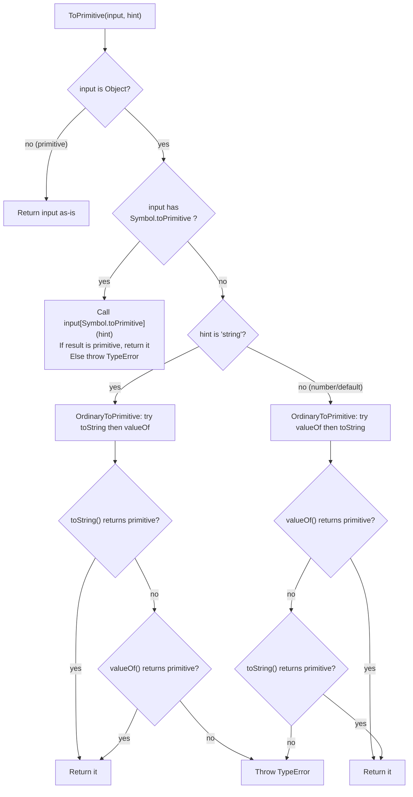
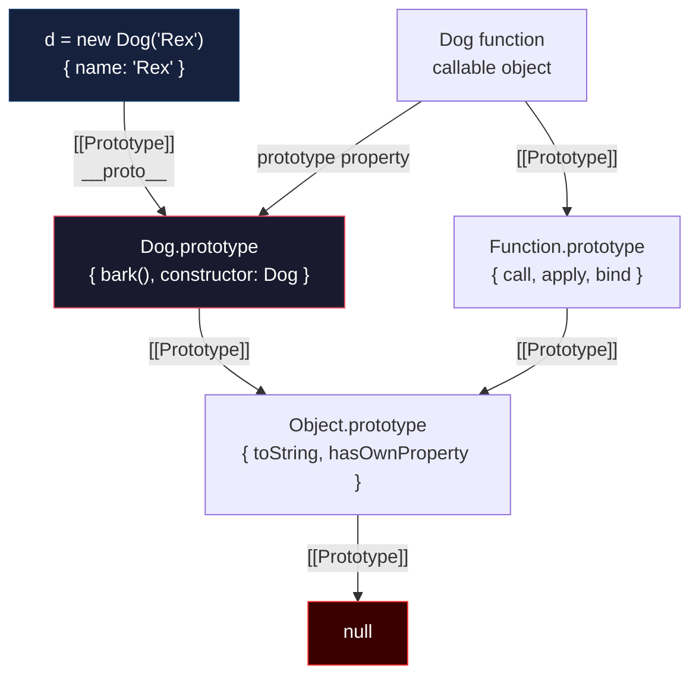
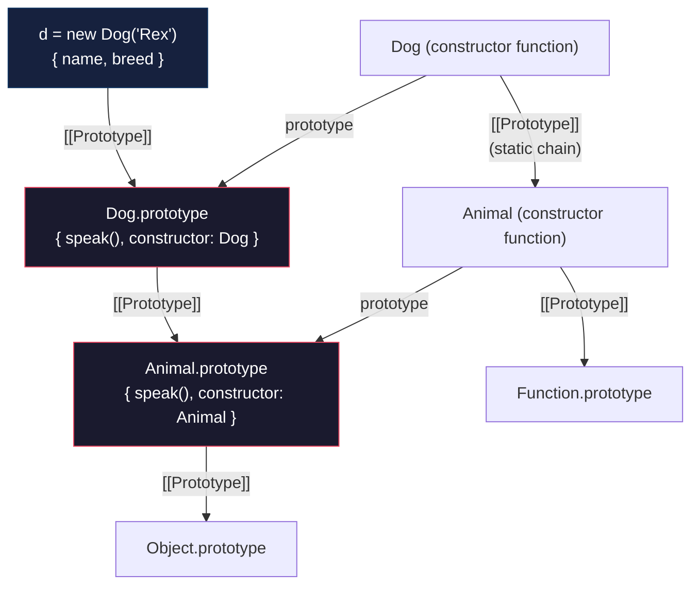
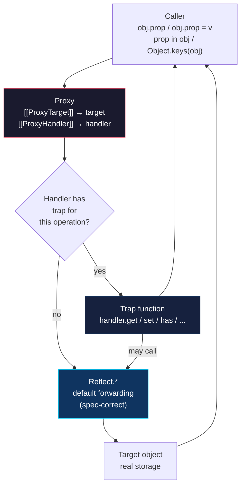
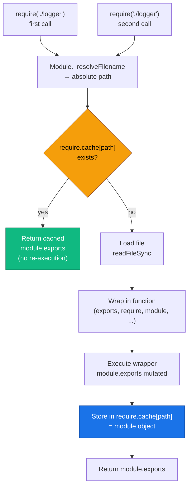
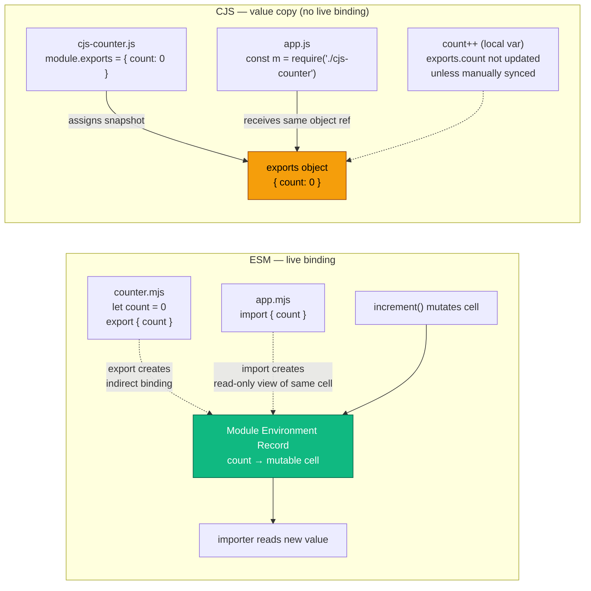
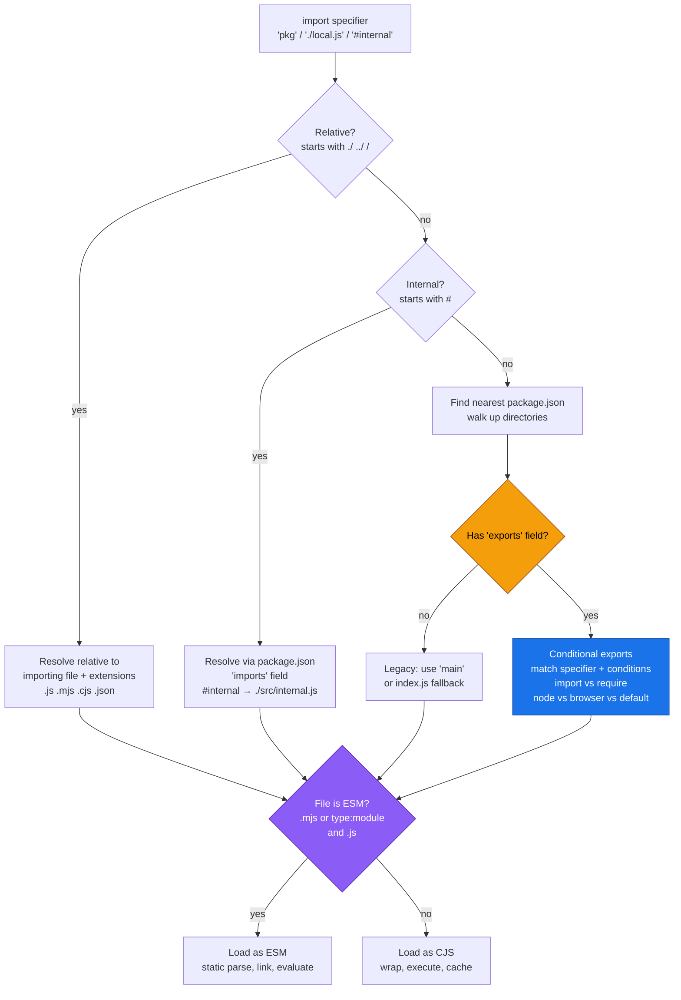
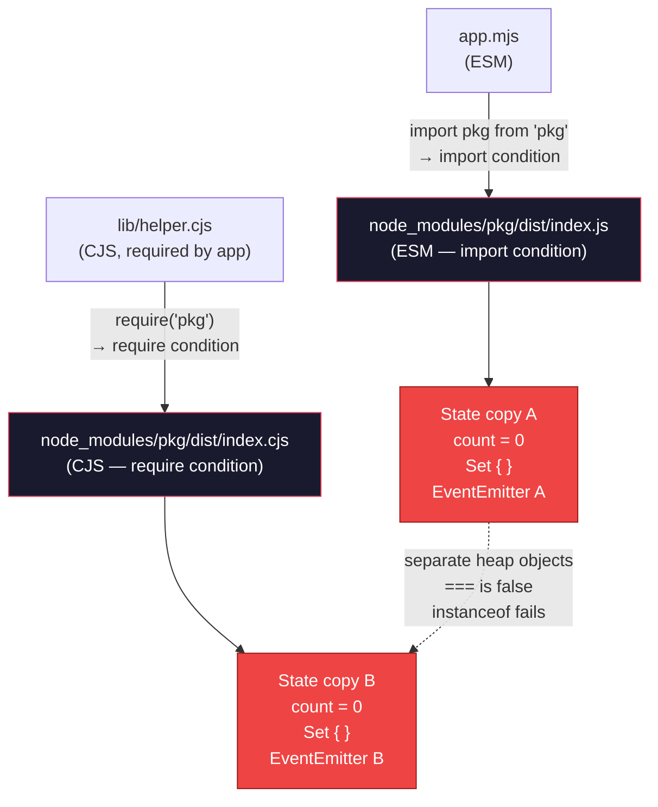

# Chapter 4 — The JavaScript Type System, Prototypes, Proxies, and the Module System

*What this chapter covers:* JavaScript's type system is dynamic, its object model is prototype-delegated, and its module system is split-brained. This chapter takes all three apart at the spec level — how values coerce, how property lookup walks `[[Prototype]]`, how `class` desugars to prototype wiring, how `Proxy`/`Reflect` intercept the metaobject protocol, and how two incompatible module systems (CommonJS and ESM) coexist in one runtime and one package registry. You will walk a prototype chain with `__proto__`, build a membrane proxy that actually revokes, diagnose a dual-package hazard that ships two copies of a singleton to production, and read Node's resolver as a flowchart rather than folklore.

**Learning goals:**

- Classify every JavaScript value by spec type and explain `typeof`/`instanceof` from the ECMA-262 internal slots they consult.
- Trace coercion through `ToPrimitive`, `ToString`, `ToNumber`, and the Abstract Equality (`==`) algorithm, and predict the output of any coercion puzzle without guessing.
- Draw and walk the prototype chain, distinguishing `prototype` (a property of constructor functions) from `[[Prototype]]`/`__proto__` (a slot on every object), and explain what `class`, `extends`, and `super` desugar to.
- Use `Proxy` and `Reflect` traps correctly, respect trap invariants, build a revocable membrane, and explain why proxies cannot be transparently polyfilled.
- Apply well-known Symbols (`@@iterator`, `@@toStringTag`, `@@hasInstance`, `@@species`, `@@toPrimitive`) to customize language protocols.
- Contrast CommonJS (dynamic `require`, `require.cache`, module wrapper) with ESM (static `import`/`export`, live bindings, cyclic linking) at the loader level.
- Diagnose CJS/ESM interop pitfalls, the `__esModule` convention, and the `require(ESM)` error that broke half the ecosystem.
- Configure `package.json` `exports` / `imports`, import maps, and ESM loaders (`--loader` / `--experimental-vm-modules`) correctly.
- Identify the dual-package hazard, explain why `instanceof` and singleton state break when one package loads twice, and choose the fix (conditional exports with a single source file vs. breaking change to ESM-only).

---

## 1. Why a Backend Engineer Should Care About Types, Prototypes, and Modules

At small scale, JavaScript's dynamism feels productive. At fleet scale, it becomes a reliability surface.

A coercion bug in a shared validation library (`if (config.retries == true)` passing when `retries` is the string `"0"`) propagates to every service that depends on it. A prototype pollution in a deep-merge utility (`lodash.merge` CVE-2019-10744, `qs` prototype pollution) becomes a remote code execution vector across hundreds of deployments before anyone patches. A dual-package hazard — where `npm install` resolves both a CJS and an ESM copy of `uuid` or `debug` — silently duplicates singleton state: two connection pools, two metric registries, two `EventEmitter` hierarchies that do not recognize each other's events.

These are not language-trivia problems. They are supply-chain and runtime-correctness problems rooted in how the language defines types, object delegation, and module identity. This chapter treats all three as infrastructure: mechanisms with exact specifications, observable failure modes, and operational fixes.

> **Relationship to Chapter 1.** Hidden classes (V8 Maps), inline caches, and speculative optimization from Chapter 1 explain *how* the engine makes these mechanisms fast. This chapter explains *what* the mechanisms are. Read them together: the engine optimizes the spec, not the other way around.

---

## 2. The Type System — What JavaScript Values Actually Are

JavaScript has no static type system at runtime. It has *spec types* and *language types* — categories the ECMA-262 specification uses to define behavior. The engine may represent them differently (SMIs, doubles, HeapObjects in V8), but the observable semantics follow the spec exactly.

### 2.1 Spec Types vs. Language Types

| Spec type | Language-visible? | Examples |
|-----------|-------------------|----------|
| Undefined | `typeof` reports `"undefined"` | `undefined` |
| Null | `typeof` reports `"object"` (historic bug) | `null` |
| Boolean | yes | `true`, `false` |
| String | yes | `"hello"`, `""` |
| Symbol | yes | `Symbol("id")` |
| Number | yes | `42`, `NaN`, `Infinity`, `-0` |
| BigInt | yes | `42n` |
| Object | yes | `{}`, `[]`, `function(){}`, `new Date()` |

Every value is one of the eight language types. Everything that is not a primitive is an Object — including functions and arrays. `typeof null === "object"` is a bug from the first ten days of the language, preserved for compatibility; the spec's internal `Type(x)` still returns Null, but `typeof` lies.

```javascript
// typeof — what it actually tests (and where it lies)
typeof undefined        // "undefined"
typeof null             // "object"  — spec Type is Null, typeof is wrong
typeof 42               // "number"
typeof 42n              // "bigint"
typeof "hello"          // "string"
typeof Symbol("id")     // "symbol"
typeof true             // "boolean"
typeof {}               // "object"
typeof []               // "object"  — arrays are objects
typeof function(){}     // "function" — callable objects get a special typeof
typeof NaN              // "number"  — NaN is a Number, IEEE 754, not an error type

// Reliable type predicates — what senior code actually uses
Number.isNaN(NaN)           // true  (vs isNaN("foo") which coerces — never use it)
Number.isFinite(Infinity)   // false
Object.is(NaN, NaN)         // true  (unlike ===, see §3.5)
Object.is(-0, 0)            // false (unlike ===)
Array.isArray([])           // true  (typeof cannot distinguish arrays)
```

### 2.2 Primitives vs. Objects — Identity, Copying, Immutability

Primitives are immutable and compared by value. Objects are mutable, compared by identity, and heap-allocated.

```javascript
// Primitives — value semantics
let a = "hello";
let b = a;       // copies the value
b = "world";
console.log(a);  // "hello" — a is unaffected

// Objects — reference semantics
let p = { x: 1 };
let q = p;       // copies the reference, not the object
q.x = 99;
console.log(p.x); // 99 — p and q point at the same object
console.log(p === q); // true — same identity

// Primitives are immutable — "mutation" creates a new value
let s = "hello";
s.toUpperCase(); // returns "HELLO", s is still "hello"
```

This distinction governs every performance and correctness property that follows: hidden classes and inline caches (Chapter 1) only apply to objects; primitives are unboxed in optimized code; and the prototype chain only exists on objects (primitives delegate to their wrapper prototype via autoboxing).

### 2.3 Wrapper Objects and Autoboxing

Each primitive type except `null`/`undefined` has a wrapper constructor (`String`, `Number`, `Boolean`, `Symbol`, `BigInt`). When you access a property on a primitive, the engine *autoboxes* it — temporarily wraps it — to perform the lookup.

```javascript
// Autoboxing — invisible wrapper creation
"hello".length        // string primitive → temporary String object → .length → unwrap
(42).toFixed(2)       // number primitive → temporary Number object → method → unwrap

// Explicit wrappers — almost always a mistake
const s1 = "hello";              // primitive — typeof "string"
const s2 = new String("hello");  // object  — typeof "object", truthy even when ""
console.log(typeof s2);          // "object"
console.log(!!new String(""));   // true — empty wrapper is truthy! Bug source.
console.log(s1 === s2);          // false — different types

// Symbol wrappers throw — you cannot new Symbol()
try { new Symbol("x"); } catch (e) { console.log(e.message); }
// TypeError: Symbol is not a constructor
```

Rule: never use `new String` / `new Number` / `new Boolean` in production code. Linters (`no-new-wrappers`) enforce this because the truthiness and equality semantics diverge silently.

---

## 3. Coercion — The Algorithms Behind `==` and Friends

Coercion is not random. It is a set of precisely specified abstract operations. Once you read them as algorithms, every "wat" puzzle becomes deterministic.

### 3.1 ToPrimitive — The Gateway

Almost every coercion passes through `ToPrimitive(input, hint)`. The hint is `"string"` or `"number"` (default is `"number"` except `Date` defaults to `"string"`).



`OrdinaryToPrimitive` order matters: for `"number"` hint, `valueOf` is tried first; for `"string"` hint, `toString` first.

```javascript
// ToPrimitive in action
const obj = {
  [Symbol.toPrimitive](hint) {
    console.log(`hint: ${hint}`);
    if (hint === "string") return "as-string";
    if (hint === "number") return 42;
    return true; // "default" hint — used by == and +
  }
};

String(obj);  // hint: string  → "as-string"  (calls toPrimitive with "string")
Number(obj);  // hint: number  → 42
obj + ""      // hint: default → true → "true" (default hint, then ToString)
obj == 1      // hint: default → true → 1 (ToPrimitive then ToNumber — see §3.3)

// Without Symbol.toPrimitive — OrdinaryToPrimitive ordering
const plain = {
  toString() { console.log("toString"); return "hello"; },
  valueOf()  { console.log("valueOf");  return 99; }
};

String(plain); // toString first (string hint) → "hello"
Number(plain); // valueOf first (number hint) → 99
plain + 1;     // default hint → valueOf first → 99 + 1 = 100

// Date is the exception — default hint is "string"
const d = new Date("2026-01-01");
String(d); // hint string  → toString first → "Thu Jan 01 2026 ..."
Number(d); // hint number  → valueOf first → 1767225600000
d + "";    // hint string (Date special case) → calls toString, not valueOf
```

### 3.2 ToString and ToNumber

After `ToPrimitive`, the remaining conversions are mechanical:

```javascript
// ToString
String(undefined)  // "undefined"
String(null)       // "null"
String(true)       // "true"
String(42)         // "42"
String(0)          // "0"
String(-0)         // "0"  (ToString collapses -0 to "0"!)
String(NaN)        // "NaN"
String(Infinity)   // "Infinity"
String([1,2,3])    // "1,2,3"  (array → ToPrimitive → join with ",")
String({})         // "[object Object]" (Object.prototype.toString)
String([])         // ""  (empty array → "")

// ToNumber — the strict numeric conversion (also what Number() does)
Number(undefined)  // NaN
Number(null)       // 0     — the famous null→0 in numeric context
Number(true)       // 1
Number(false)      // 0
Number("")         // 0     — empty string → 0
Number("  42  ")   // 42    — trims whitespace
Number("42abc")    // NaN   — not like parseInt
Number("0x2a")     // 42    — hex
Number("0b1010")   // 10    — binary
Number("0o52")     // 42    — octal

// parseInt vs Number — different algorithms
parseInt("42abc")  // 42    — parses prefix, ignores trailing
Number("42abc")    // NaN   — entire string must be numeric
parseInt("08")     // 8     — without radix, still decimal since ES5 (old engines: octal trap)
```

### 3.3 Abstract Equality — What `==` Actually Does

`==` is not "loose." It is 12 ordered clauses in ECMA-262 §7.2.14. The full algorithm:

| Step | Condition | Result |
|------|-----------|--------|
| 1 | Same Type | `===` |
| 2 | `null == undefined` | `true` (and only with each other) |
| 3 | `Number == String` | `ToNumber(String) == Number` |
| 4 | `Boolean == any` | `ToNumber(Boolean) == any` |
| 5 | `Object == String/Number/Symbol` | `ToPrimitive(Object) == primitive` |
| 6 | `BigInt == Number` | Numeric comparison (with NaN/Infinity handling) |
| 7 | Otherwise | `false` |

```javascript
// Walking through == step by step
42 == "42"          // Step 3: ToNumber("42") → 42, then 42 === 42 → true
0 == ""             // Step 3: ToNumber("") → 0, then 0 === 0 → true
0 == "0"            // Step 3: ToNumber("0") → 0, then 0 === 0 → true
false == "0"        // Step 4: ToNumber(false) → 0, then 0 == "0" → Step 3 → true
false == ""         // Step 4: 0 == "" → Step 3: 0 == 0 → true
null == undefined   // Step 2: true
null == 0           // Step 7: false — null only == undefined, not 0!
undefined == 0      // Step 7: false
[] == ""            // Step 5: ToPrimitive([]) → "" (join), then "" == "" → true
[] == 0             // Step 5: "" == 0 → Step 3: 0 == 0 → true  (!)
[1] == 1            // Step 5: "1" == 1 → Step 3: 1 == 1 → true
{} == "[object Object]" // Step 5: ToPrimitive({}) → "[object Object]" → true

// The classic traps
console.log(false == "0");   // true — ToNumber(false)=0, ToNumber("0")=0
console.log(false == "");    // true
console.log("" == 0);        // true
console.log([] == false);    // true — []→""→0, false→0, 0===0
console.log([0] == false);   // true — "0"→0, false→0
// Therefore [] is truthy but == false — different algorithms!
if ([]) console.log("truthy"); // prints — ToBoolean([]) is true
console.log([] == false);      // true — Abstract Equality, not ToBoolean
```

### 3.4 Strict Equality (`===`) and `Object.is`

`===` is simple: same type and same value, with two exceptions — `NaN !== NaN` and `-0 === 0`. `Object.is` fixes both.

```javascript
// === : no coercion, but NaN and -0 are special-cased per IEEE 754
NaN === NaN    // false — IEEE 754: NaN is not equal to itself
-0 === 0       // true  — IEEE 754: -0 equals 0 under ===
0 === -0       // true

// Object.is — SameValue (no coercion, no IEEE 754 surprises)
Object.is(NaN, NaN)  // true  — SameValue treats NaN as same
Object.is(-0, 0)     // false — SameValue distinguishes -0
Object.is(0, -0)     // false

// When it matters
Object.is(NaN, NaN)  // Map/Set key semantics use SameValueZero (like Object.is but -0===0)
const m = new Map();
m.set(NaN, "found");
m.get(NaN);   // "found" — Map uses SameValueZero, not ===
m.set(-0, "neg");
m.get(0);     // "neg"   — Map treats -0 and 0 as same (SameValueZero)

// Practical rule
// Use === for general equality. Use Object.is only when NaN/-0 distinction matters.
// Never use == except for the intentional nullish check: x == null (covers null|undefined).
if (value == null) {
  // true only when value is null or undefined — the one idiomatic use of ==
}
```

### 3.5 Coercion at Scale — The Backend Cost

In a 200-service Go/Java fleet, types are checked at compile time. In a 200-service Node fleet, types are checked — if at all — at runtime, on every request, with coercion silently papering over mismatches. The operational consequences:

- **Silent data corruption.** `config.port == 3000` passes when `config.port` is `"3000"` from an environment variable, but `config.port + 1` becomes `"30001"` (string concatenation via `ToPrimitive` default hint). One missing `Number()` call cascades into connection failures.
- **Validation bypass.** `if (user.role == "admin")` passes when `user.role` is the number `0` coerced through `ToNumber`? No — but `if (userInput == true)` passes for `"1"`, `"true"` does not coerce as expected, and loose checks on query parameters (`req.query.limit == 10`) behave differently for `"10"` vs `10` vs `""`.
- **Mitigation.** Enforce `===` and `Object.is` via `eslint: eqeqeq` (with `allow: ["null"]` for the `== null` idiom), add `typescript: strict: true` to new services, and validate at the boundary with Zod/ajv — not with inline coercion.

---

## 4. The Prototype Chain — Delegation, Not Inheritance

JavaScript has no classes in the classical sense. It has *prototype delegation*: every object has an internal slot `[[Prototype]]` that points at another object or `null`. Property lookup walks that chain.

### 4.1 `prototype` vs `__proto__` vs `[[Prototype]]`

These three names cause more confusion than any other part of the language. They refer to two distinct things:

| Name | What it is | Lives on |
|------|-----------|----------|
| `[[Prototype]]` | Internal slot — the actual prototype link. Spec name. Not directly accessible. | Every object |
| `__proto__` | Accessor property (`Object.prototype.__proto__`) — getter/setter for `[[Prototype]]`. Legacy, standardized for compatibility. | `Object.prototype` |
| `prototype` | Ordinary data property — the object that *will become* `[[Prototype]]` for instances created via `new`. | Constructor functions only |

```javascript
function Dog(name) {
  this.name = name;
}
Dog.prototype.bark = function() { return `${this.name} says woof`; };

const d = new Dog("Rex");

// What points where:
console.log(Dog.prototype);              // { bark: f, constructor: Dog }
console.log(Object.getPrototypeOf(d));   // same object as Dog.prototype
console.log(d.__proto__);                // same — via getter on Object.prototype
console.log(d.__proto__ === Dog.prototype); // true
console.log(Dog.__proto__ === Function.prototype); // true — Dog is a function

// d itself has NO .prototype property — only functions do
console.log(d.prototype);                // undefined
console.log(typeof Dog.prototype);       // "object"
console.log(typeof d.__proto__);         // "object"
```



### 4.2 Walking the Chain — The Code You Must Be Able to Read

Every property access follows this walk. The engine optimizes it with hidden classes and inline caches (Chapter 1), but the semantics are a loop:

```javascript
// Manual prototype walk — what the engine does on every property read
function getPropertyChain(obj, prop) {
  let current = obj;
  let depth = 0;
  while (current !== null) {
    const hasOwn = Object.prototype.hasOwnProperty.call(current, prop);
    const desc = Object.getOwnPropertyDescriptor(current, prop);
    console.log(
      `depth ${depth}: ${current.constructor?.name || "Object"} ` +
      `— hasOwn=${hasOwn}` +
      (desc ? ` descriptor=${JSON.stringify({ value: desc.value, get: typeof desc.get, enumerable: desc.enumerable })}` : "")
    );
    if (hasOwn) {
      console.log(`  → found "${prop}" at depth ${depth}`);
      return { found: true, depth, holder: current, descriptor: desc };
    }
    current = Object.getPrototypeOf(current); // same as current.__proto__ but without the accessor
    depth++;
  }
  console.log(`  → "${prop}" not found — reached null`);
  return { found: false, depth: -1 };
}

// Example hierarchy
class Animal {
  speak() { return "generic sound"; }
}
class Dog extends Animal {
  speak() { return "woof"; }
  fetch() { return "fetching"; }
}
const d = new Dog();

getPropertyChain(d, "fetch");
// depth 0: Dog — hasOwn=false ... wait, fetch lives on Dog.prototype, not the instance
// Let’s check more carefully:

console.log("--- own properties of d ---");
console.log(Object.getOwnPropertyNames(d));              // [] — instance has no own methods
console.log(Object.getOwnPropertyNames(Dog.prototype));   // ["constructor", "speak", "fetch"]
console.log(Object.getOwnPropertyNames(Animal.prototype)); // ["constructor", "speak"]
console.log(Object.getOwnPropertyNames(Object.prototype)); // ["toString", "hasOwnProperty", ...]

console.log("\n--- full chain walk for 'speak' ---");
getPropertyChain(d, "speak");
// depth 0: Dog — no own "speak"
// depth 1: Dog.prototype — hasOwn=true → found (Dog's speak shadows Animal's)

console.log("\n--- walk for 'toString' ---");
getPropertyChain(d, "toString");
// depth 0: Dog instance — miss
// depth 1: Dog.prototype — miss
// depth 2: Animal.prototype — miss
// depth 3: Object.prototype — hit → Object.prototype.toString

console.log("\n--- walk for 'nonexistent' ---");
getPropertyChain(d, "nonexistent");
// walks to null → not found → returns undefined at runtime

// The raw __proto__ chain — the shape the engine traverses
let cur = d;
let chain = [];
while (cur !== null) {
  chain.push(cur.constructor?.name || "(null proto object)" );
  cur = Object.getPrototypeOf(cur);
}
console.log("\n__proto__ chain:", chain.join("  →  "));
// Dog → Dog → Animal → Object → (null)

// Shadowing: own property wins over prototype
d.speak = function() { return "custom woof"; };
console.log(d.speak()); // "custom woof" — own property at depth 0 shadows prototype
delete d.speak;
console.log(d.speak()); // "woof" — falls back to Dog.prototype again
```

Rules the walk implies:

- **Writes never walk.** `d.newProp = 1` always creates an own property on `d`, even if `Dog.prototype.newProp` exists. Only reads delegate.
- **`hasOwnProperty` vs `in`.** `"toString" in d` is `true` (walks chain); `d.hasOwnProperty("toString")` is `false` (own only). In backend code, prefer `Object.hasOwn(d, key)` (ES2022) over `d.hasOwnProperty` — it is not vulnerable to `hasOwnProperty` being shadowed.
- **`__proto__` setter is slow.** Assigning `obj.__proto__ = x` deoptimizes the object to dictionary mode in V8. Use `Object.create(proto)` or `Object.setPrototypeOf` (still slow, but explicit). For hot paths, never mutate `[[Prototype]]` after construction.

### 4.3 `Object.create`, `Object.getPrototypeOf`, and Null-Prototype Objects

```javascript
// Object.create — create an object with an explicit [[Prototype]]
const animalProto = {
  speak() { return `${this.name} makes a sound`; }
};
const dog = Object.create(animalProto);
dog.name = "Rex";
console.log(dog.speak()); // "Rex makes a sound" — delegates to animalProto
console.log(Object.getPrototypeOf(dog) === animalProto); // true

// Null-prototype objects — no delegation at all, useful as safe dictionaries
const dict = Object.create(null);
dict["__proto__"] = "not a prototype, just a key"; // safe — no pollution
console.log(dict["__proto__"]); // "not a prototype, just a key"
console.log("__proto__" in dict); // true — own property
console.log("toString" in dict);  // false — no Object.prototype

// Contrast with a plain object — prototype pollution vector
const unsafe = {};
unsafe["__proto__"]; // accessor on Object.prototype — not an own key
// If a deep-merge does: target[key] = source[key] with key="__proto__", it mutates the prototype
```

Null-prototype objects are the correct dictionary type for untrusted keys — request headers, query parameters, user-supplied JSON keys. Using `{}` as a map with user-controlled keys is a prototype-pollution vulnerability (see §7 and Vol. 9, Chapter 7).

---

## 5. Class Syntax — Sugar Over Prototypes

`class` is not a new object model. It is deterministic desugaring to constructor functions, prototype assignment, and `Object.setPrototypeOf` wiring. Understanding the desugaring is the only way to debug `super`, `extends`, and `instanceof` correctly.

### 5.1 What `class` Desugars To

```javascript
// What you write:
class Animal {
  constructor(name) { this.name = name; }
  speak() { return `${this.name} speaks`; }
  static create(name) { return new this(name); }
}

// What the engine effectively creates (simplified — see ES spec §15.7):
function AnimalDesugared(name) {
  // Constructor body — called with `new`
  this.name = name;
}
// Instance methods → AnimalDesugared.prototype
Object.defineProperty(AnimalDesugared.prototype, "speak", {
  value: function() { return `${this.name} speaks`; },
  enumerable: false, writable: true, configurable: true
});
// Static methods → constructor itself
Object.defineProperty(AnimalDesugared, "create", {
  value: function(name) { return new this(name); },
  enumerable: false, writable: true, configurable: true
});
// constructor property
Object.defineProperty(AnimalDesugared.prototype, "constructor", {
  value: AnimalDesugared, enumerable: false, writable: true, configurable: true
});
// Prototype chain of the constructor itself
Object.setPrototypeOf(AnimalDesugared, Function.prototype);

// Verification — they are structurally identical
console.log(typeof Animal);                    // "function"
console.log(typeof AnimalDesugared);           // "function"
console.log(Object.getOwnPropertyDescriptor(Animal.prototype, "speak").enumerable); // false
console.log(Object.getOwnPropertyDescriptor(AnimalDesugared.prototype, "speak").enumerable); // false
```

Key differences between `class` and manual prototype assignment that are easy to miss:

- Class methods are **non-enumerable** (manual `Ctor.prototype.m = fn` is enumerable by default).
- Class constructors **must be called with `new`** (`ClassCallCheck` throws).
- `class` declarations are **not hoisted** like functions — TDZ applies.

### 5.2 `extends` and `super` — The Two Prototype Links

`extends` wires *two* prototype chains simultaneously:

```javascript
class Animal {
  constructor(name) { this.name = name; }
  speak() { return `${this.name} speaks`; }
  static kind() { return "animal"; }
}

class Dog extends Animal {
  constructor(name, breed) {
    super(name);        // must call super before touching `this`
    this.breed = breed;
  }
  speak() {
    return super.speak() + " — woof";
  }
  static kind() {
    return super.kind() + ":dog";
  }
}

// What extends wires (simplified):
// 1. Instance chain:  Dog.prototype.__proto__ === Animal.prototype
// 2. Static chain:    Dog.__proto__ === Animal
console.log(Object.getPrototypeOf(Dog.prototype) === Animal.prototype); // true
console.log(Object.getPrototypeOf(Dog) === Animal);                     // true

const d = new Dog("Rex", "shepherd");
console.log(d.speak());    // "Rex speaks — woof"
console.log(Dog.kind());   // "animal:dog"

// super is not a simple property lookup — it is a [[HomeObject]]-relative lookup
// super.speak inside Dog.prototype.speak means:
//   Object.getPrototypeOf(Dog.prototype).speak.call(this)
// The engine stores [[HomeObject]] (Dog.prototype) on the method at definition time.
console.log(Object.getOwnPropertyDescriptor(Dog.prototype, "speak").value);
// has internal slot [[HomeObject]] → Dog.prototype, used to resolve super

// super() in constructor — what it does:
// 1. Calls Animal constructor with `this` uninitialized (TDZ)
// 2. Animal constructor initializes `this` (allocates via new.target)
// 3. Returns the initialized `this` — now Dog constructor can assign breed
```



If `extends` only wired the instance chain, `Dog.kind()` would not find `Animal.kind()`. The static chain (`Dog.__proto__ === Animal`) is what makes static inheritance work — and what makes `instanceof` walk the `prototype` chain rather than the `__proto__` chain of the constructor.

### 5.3 Private Fields, Static Blocks, and What They Cost

```javascript
class Counter {
  static #instances = 0;          // private static field — per-class, not per-instance
  #count = 0;                     // private instance field — per-instance, WeakMap-backed in spec
  static {
    // static block — runs once at class evaluation, `this` is the class
    this.#instances++;
  }
  constructor() {
    Counter.#instances++;
  }
  increment() { this.#count++; return this.#count; }
  get count() { return this.#count; } // exposed via accessor
  static get instances() { return Counter.#instances; }
}

const c1 = new Counter();
const c2 = new Counter();
console.log(c1.increment()); // 1
console.log(c1.count);       // 1
console.log(c2.count);       // 0 — separate private slot
// c1.#count — SyntaxError: Private field '#count' must be declared in an enclosing class

// Private fields are not prototype properties — they are per-instance slots
// checked at runtime. In V8 they are stored out-of-line with a brand check.
// Accessing a private field on a wrong receiver throws TypeError, not undefined.
const fake = {};
try { Counter.prototype.increment.call(fake); } catch (e) {
  console.log(e.message); // Cannot read private member #count from an object whose class did not declare it
}
```

Performance note: private fields (`#x`) have a brand check on every access — the engine verifies the receiver was constructed by the class that declared the field. This is slightly slower than a public property or a `WeakMap` for cross-instance access, but faster than `WeakMap` for same-class access in V8 (the field offset is known at compile time after the Map check). For hot paths with millions of instances, measure; for most backend code, prefer private fields for encapsulation — the cost is a single branch.

---

## 6. Symbols and Well-Known Symbols — The Protocol Layer

`Symbol` is a primitive that is unique by construction. Every `Symbol()` call creates a value that is `!==` every other value, including another `Symbol` with the same description. The global registry (`Symbol.for`) and well-known Symbols are the extension points for the language itself.

### 6.1 Unique Symbols and the Global Registry

```javascript
// Unique symbols — never collide
const s1 = Symbol("id");
const s2 = Symbol("id");
console.log(s1 === s2);          // false — different identities, same description
console.log(s1.description);     // "id"
console.log(typeof s1);          // "symbol"

// Symbols as non-colliding property keys — the original use case
const kMetadata = Symbol("metadata");
const obj = { [kMetadata]: { version: 1 }, name: "service" };
console.log(obj[kMetadata]);     // { version: 1 }
console.log(Object.keys(obj));   // ["name"] — symbols are skipped
console.log(Object.getOwnPropertySymbols(obj)); // [Symbol(metadata)]
console.log(JSON.stringify(obj)); // '{"name":"service"}' — symbols are omitted

// Global registry — cross-realm shared symbols
const g1 = Symbol.for("app.config");
const g2 = Symbol.for("app.config");
console.log(g1 === g2);              // true — same registry entry
console.log(Symbol.keyFor(g1));      // "app.config"
console.log(Symbol.keyFor(s1));      // undefined — not in registry

// When the registry matters: sharing a symbol across packages without importing it
// Package A: Symbol.for("my-lib.internal") — Package B can retrieve the same symbol
// without depending on A. Useful for framework-level coordination, risky for collisions.
```

### 6.2 Well-Known Symbols — Customizing Language Protocols

Well-known Symbols are the hooks the spec uses to let user code participate in built-in operations. Each is a property on `Symbol` itself (`Symbol.iterator`, `Symbol.hasInstance`, etc.) and is looked up via `GetMethod` during the operation.

| Symbol | Protocol | Where it is consulted |
|--------|----------|-----------------------|
| `Symbol.iterator` | Iterable | `for...of`, spread `[...x]`, destructuring |
| `Symbol.asyncIterator` | Async iterable | `for await...of` |
| `Symbol.toStringTag` | `Object.prototype.toString` | `Object.prototype.toString.call(x)` |
| `Symbol.hasInstance` | `instanceof` | `x instanceof C` calls `C[Symbol.hasInstance](x)` |
| `Symbol.toPrimitive` | Coercion hint | `ToPrimitive` (see §3.1) |
| `Symbol.species` | Constructor species | `Array` methods that create new arrays (`map`, `filter`, `slice`) |
| `Symbol.match` / `replace` / `search` / `split` | String/RegExp | `str.match(re)`, `str.replace(re, ...)` |
| `Symbol.unscopables` | `with` (legacy) | Properties hidden from `with` |

```javascript
// Symbol.iterator — make any object iterable
class Range {
  constructor(start, end) { this.start = start; this.end = end; }
  *[Symbol.iterator]() {
    for (let i = this.start; i <= this.end; i++) yield i;
  }
}
console.log([...new Range(1, 3)]); // [1, 2, 3]
for (const n of new Range(5, 7)) console.log(n); // 5, 6, 7

// Manual iterator (what the engine actually calls)
const range = new Range(1, 2);
const it = range[Symbol.iterator]();
console.log(it.next()); // { value: 1, done: false }
console.log(it.next()); // { value: 2, done: false }
console.log(it.next()); // { value: undefined, done: true }

// Symbol.toStringTag — control Object.prototype.toString output
class ServiceError extends Error {
  get [Symbol.toStringTag]() { return "ServiceError"; }
}
const err = new ServiceError("timeout");
console.log(Object.prototype.toString.call(err)); // "[object ServiceError]" — not "[object Error]"
console.log(err.toString()); // "ServiceError: timeout"

// Symbol.hasInstance — customize instanceof
class EvenNumber {
  static [Symbol.hasInstance](value) {
    return typeof value === "number" && value % 2 === 0;
  }
}
console.log(4 instanceof EvenNumber);   // true
console.log(3 instanceof EvenNumber);   // false
console.log("4" instanceof EvenNumber); // false — typeof check fails

// Symbol.species — control what constructor derived methods use
class MyArray extends Array {
  static get [Symbol.species]() { return Array; } // map/filter return plain Array, not MyArray
}
const a = new MyArray(1, 2, 3);
const b = a.map(x => x * 2);
console.log(b instanceof MyArray); // false — species redirected to Array
console.log(b instanceof Array);   // true

// Symbol.toPrimitive — already covered in §3.1, included here for completeness
class Money {
  constructor(cents) { this.cents = cents; }
  [Symbol.toPrimitive](hint) {
    if (hint === "string") return `$${(this.cents / 100).toFixed(2)}`;
    if (hint === "number") return this.cents;
    return this.cents; // default
  }
}
const price = new Money(1999);
console.log(String(price));  // "$19.99"
console.log(Number(price));  // 1999
console.log(price + 1);      // 2000 (default hint → number)
```

For backend engineers, the most operationally relevant well-known Symbols are `Symbol.iterator` (streaming and pagination protocols often expose async iterables), `Symbol.toStringTag` (log enrichment and error classification), and `Symbol.hasInstance` (custom error hierarchies that survive cross-realm `instanceof` failures — see §8.4).

---

## 7. Proxy and Reflect — Intercepting the Metaobject Protocol

A `Proxy` wraps a *target* object and interposes on fundamental operations — property lookup, assignment, enumeration, function calls, construction, prototype queries — via *traps*. `Reflect` provides the default forwarding for each trap, so a proxy can observe and optionally delegate without reimplementing spec semantics.

### 7.1 The Trap Table and Invariants

Every trap corresponds to an internal method (`[[Get]]`, `[[Set]]`, `[[HasProperty]]`, etc.). If you define a trap, you replace that internal method on the proxy. If you omit it, the proxy forwards to the target.

```javascript
// Trap → internal method mapping (ECMA-262 §9.5)
const trapTable = `
// Proxy handler traps                    → Reflect counterpart              → Internal method
   get(target, prop, receiver)            Reflect.get(target, prop, receiver)      [[Get]]
   set(target, prop, value, receiver)     Reflect.set(target, prop, value, receiver) [[Set]]
   has(target, prop)                      Reflect.has(target, prop)                  [[HasProperty]]
   deleteProperty(target, prop)           Reflect.deleteProperty(target, prop)       [[Delete]]
   ownKeys(target)                        Reflect.ownKeys(target)                    [[OwnPropertyKeys]]
   getOwnPropertyDescriptor(target, prop) Reflect.getOwnPropertyDescriptor(target, prop) [[GetOwnProperty]]
   defineProperty(target, prop, desc)     Reflect.defineProperty(target, prop, desc) [[DefineOwnProperty]]
   getPrototypeOf(target)                 Reflect.getPrototypeOf(target)             [[GetPrototypeOf]]
   setPrototypeOf(target, proto)          Reflect.setPrototypeOf(target, proto)      [[SetPrototypeOf]]
   isExtensible(target)                   Reflect.isExtensible(target)               [[IsExtensible]]
   preventExtensions(target)              Reflect.preventExtensions(target)          [[PreventExtensions]]
   apply(target, thisArg, args)           Reflect.apply(target, thisArg, args)       [[Call]]     — function proxies only
   construct(target, args, newTarget)     Reflect.construct(target, args, newTarget) [[Construct]] — constructor proxies only
`;
```

Traps have *invariants* — conditions the engine enforces even if your handler violates them, throwing `TypeError`:

- If the target is non-extensible, `ownKeys` must return exactly the target's own keys.
- `getOwnPropertyDescriptor` must report non-configurable properties truthfully.
- `set` must return `true` if the property is a non-writable data property and the assign succeeded (strict-mode assignment checks the return value).
- `getPrototypeOf` must return the target's actual prototype if the target is non-extensible.

Violating invariants is not a lint warning — it is a runtime `TypeError` that crashes the request.



### 7.2 Minimal Proxy — Logging and Validation

```javascript
// Logging proxy — observe every operation without changing behavior
function loggingProxy(target, label = "obj") {
  return new Proxy(target, {
    get(t, prop, receiver) {
      const v = Reflect.get(t, prop, receiver);
      console.log(`GET ${label}[${String(prop)}] →`, v);
      return v;
    },
    set(t, prop, value, receiver) {
      console Archeology
      console.log(`SET ${label}[${String(prop)}] =`, value);
      return Reflect.set(t, prop, value, receiver);
    },
    has(t, prop) {
      const r = Reflect.has(t, prop);
      console.log(`HAS ${label}[${String(prop)}] →`, r);
      return r;
    },
    ownKeys(t) {
      const keys = Reflect.ownKeys(t);
      console.log(`OWNKEYS ${label} →`, keys);
      return keys;
    }
  });
}

const user = loggingProxy({ name: "Alice", age: 30 }, "user");
user.name;              // GET user[name] → Alice
user.age = 31;          // SET user[age] = 31
"name" in user;         // HAS user[name] → true
Object.keys(user);      // OWNKEYS user → ["name", "age"]

// Validation proxy — enforce invariants before forwarding
function validatedConfig(target) {
  return new Proxy(target, {
    set(t, prop, value, receiver) {
      if (prop === "port" && (typeof value !== "number" || value < 1 || value > 65535)) {
        throw new TypeError(`Invalid port: ${value}`);
      }
      if (prop === "retries" && (!Number.isInteger(value) || value < 0)) {
        throw new TypeError(`Invalid retries: ${value}`);
      }
      return Reflect.set(t, prop, value, receiver);
    },
    defineProperty(t, prop, desc) {
      // Also trap defineProperty — otherwise Object.defineProperty bypasses set
      if (prop === "port" && desc.value !== undefined) {
        if (typeof desc.value !== "number" || desc.value < 1 || desc.value > 65535) {
          throw new TypeError(`Invalid port: ${desc.value}`);
        }
      }
      return Reflect.defineProperty(t, prop, desc);
    }
  });
}

const config = validatedConfig({ port: 3000, retries: 3 });
config.port = 8080;   // ok
try { config.port = 99999; } catch (e) { console.log(e.message); } // Invalid port: 99999
try { Object.defineProperty(config, "port", { value: -1 }); } catch (e) { console.log(e.message); }
```

The `defineProperty` trap is the one most implementations forget. Without it, `Object.defineProperty(proxy, "port", { value: -1 })` bypasses `set` entirely — a validation bypass that survives code review if the reviewer only checks `set`.

### 7.3 Revocable Proxies — Capability Revocation

`Proxy.revocable` creates a proxy whose handler can be atomically disconnected. After revocation, every trap throws `TypeError`. This is the primitive for capability-based security in JavaScript.

```javascript
// Revocable proxy — grant temporary access, then revoke
function grantTemporaryAccess(target, ttlMs) {
  const { proxy, revoke } = Proxy.revocable(target, {
    get(t, prop, receiver) { return Reflect.get(t, prop, receiver); },
    set(t, prop, value, receiver) { return Reflect.set(t, prop, value, receiver); },
  });
  const timer = setTimeout(() => {
    revoke();
    console.log("Access revoked");
  }, ttlMs);
  // Return both — caller uses proxy, cleanup calls revoke
  return { proxy, revoke: () => { clearTimeout(timer); revoke(); } };
}

const secret = { apiKey: "sk-live-abc123" };
const { proxy: tempSecret, revoke } = grantTemporaryAccess(secret, 5000);
console.log(tempSecret.apiKey); // "sk-live-abc123"
revoke();
try { console.log(tempSecret.apiKey); } catch (e) {
  console.log(e.message); // Cannot perform 'get' on a proxy that has been revoked
}

// Real use: sandboxing untrusted code
function runUntrusted(code, allowedGlobals) {
  const { proxy: sandbox, revoke } = Proxy.revocable(allowedGlobals, {
    has() { return true; }, // trap `with` lookups — claim every name exists
    get(t, prop) {
      if (prop in t) return t[prop];
      throw new ReferenceError(`${String(prop)} is not defined in sandbox`);
    }
  });
  try {
    // In production, combine with vm module or SES (Hardened JS)
    // This is illustrative — with + proxy is not a full sandbox
    return Function("sandbox", `with(sandbox) { return (${code}); }`)(sandbox);
  } finally {
    revoke();
  }
}
```

### 7.4 Membrane — The Proxy Pattern That Matters for Backends

A *membrane* wraps an entire object graph so that every object crossing the boundary is transitively wrapped. It is the correct way to isolate untrusted or observed subgraphs, revoke access to a whole subsystem, and implement deep immutability or deep observation without copying.

```javascript
// Full membrane — every object crossing the boundary is wrapped consistently
// Based on the membrane pattern from "Comprehensive Compartmentalization" (Miller, 2006)
// and the SES (Hardened JS) implementation.

function createMembrane() {
  const targetToProxy = new WeakMap();
  const proxyToTarget = new WeakMap();

  function wrap(target) {
    if (target === null || typeof target !== "object") return target; // primitives pass through
    if (targetToProxy.has(target)) return targetToProxy.get(target);
    if (proxyToTarget.has(target)) return target; // already a proxy — unwrap check not needed for this direction

    const handler = {
      get(t, prop, receiver) {
        const v = Reflect.get(t, prop, receiver);
        return wrap(v); // transitively wrap on read
      },
      set(t, prop, value, receiver) {
        // Unwrap proxies being written in, wrap values being read out
        const unwrapped = proxyToTarget.get(value) ?? value;
        return Reflect.set(t, prop, unwrapped, receiver);
      },
      apply(t, thisArg, args) {
        const unwrappedThis = proxyToTarget.get(thisArg) ?? thisArg;
        const unwrappedArgs = args.map(a => proxyToTarget.get(a) ?? a);
        const result = Reflect.apply(t, unwrappedThis, unwrappedArgs);
        return wrap(result);
      },
      getOwnPropertyDescriptor(t, prop) {
        const desc = Reflect.getOwnPropertyDescriptor(t, prop);
        if (desc) {
          if ("value" in desc) desc.value = wrap(desc.value);
          if (desc.get) desc.get = wrap(desc.get);
          if (desc.set) desc.set = wrap(desc.set);
        }
        return desc;
      },
      // ... other traps forward similarly (ownKeys, has, etc.)
      has(t, prop) { return Reflect.has(t, prop); },
      ownKeys(t) { return Reflect.ownKeys(t); },
      getPrototypeOf(t) { return wrap(Reflect.getPrototypeOf(t)); },
    };

    const proxy = new Proxy(target, handler);
    targetToProxy.set(target, proxy);
    proxyToTarget.set(proxy, target);
    return proxy;
  }

  // Revocable membrane — one revoke disconnects the entire graph
  function revocableMembrane(root) {
    const { proxy, revoke } = Proxy.revocable(root, {
      get(t, prop, receiver) { return wrap(Reflect.get(t, prop, receiver)); },
      set(t, prop, value, receiver) {
        return Reflect.set(t, prop, proxyToTarget.get(value) ?? value, receiver);
      },
      // ... remaining traps as above
    });
    // Wrap the root through the same WeakMaps so identity is preserved
    targetToProxy.set(root, proxy);
    proxyToTarget.set(proxy, root);
    return { proxy, revoke };
  }

  return { wrap, revocableMembrane, targetToProxy, proxyToTarget };
}

// Usage — isolate a plugin's view of the host
const membrane = createMembrane();

const hostState = {
  config: { port: 3000, secrets: { apiKey: "sk-live-123" } },
  users: [{ id: 1, name: "Alice" }],
  getConfig() { return this.config; }
};

const pluginView = membrane.wrap(hostState);

// Plugin reads — gets wrapped objects, never the raw host objects
const cfg = pluginView.config;
console.log(cfg === hostState.config); // false — different identity (proxy)
console.log(cfg.port);                 // 3000 — transparently forwarded

// Plugin cannot escape the membrane by reaching the prototype
console.log(pluginView.getConfig() === cfg); // true — same proxy identity (WeakMap ensures idempotence)

// Revocable variant — one revoke cuts the entire plugin off
const { proxy: tempView, revoke } = membrane.revocableMembrane(hostState);
console.log(tempView.config.port); // 3000
revoke();
try { console.log(tempView.config.port); } catch (e) {
  console.log("Revoked:", e.message); // Cannot perform 'get' on a proxy that has been revoked
}
```

Design properties of a correct membrane:

- **Identity preservation.** `wrap(a) === wrap(a)` must hold (hence `WeakMap`). Without it, `Set` membership and `===` checks break inside the membrane.
- **Transitive wrapping.** Every object returned by any trap must be wrapped, otherwise the guest can obtain an unwrapped reference and escape.
- **Unwrapping on write.** Values the guest writes must be unwrapped before storing on the target, otherwise the host accumulates proxies in its own state.
- **No proxy transparency.** Proxies are not transparent — `proxy !== target`, `Array.isArray(proxy)` checks the target but `proxy instanceof Array` may behave differently across realms. Code that relies on `===` identity for caching or deduplication will see two identities for one logical object.

Performance note: every proxy adds an allocation, a `WeakMap` lookup, and a trap dispatch. A membrane that wraps a 100K-node object graph on first access will allocate 100K proxies. In V8, proxied property access is megamorphic and cannot be inlined — expect 10–100× slowdown on hot paths. Use membranes at trust boundaries (plugin isolation, deep immutability for config that is read rarely), not on inner loops.

---

## 8. The Module System — Two Runtimes in One Registry

JavaScript has two module systems with incompatible semantics sharing one package registry and one `node_modules` tree. Understanding both — and the seams between them — is the prerequisite for every bundling, deployment, and supply-chain decision in this volume.

### 8.1 CommonJS — The Dynamic Module System

CommonJS (CJS) was specified for server-side JavaScript in 2009 and adopted by Node.js. It is *dynamic*: `require` is a function call, `module.exports` is a mutable object, and modules are loaded synchronously at runtime.

#### The Module Wrapper

Node does not execute a CJS file as bare script. It wraps it in a function:

```javascript
// What Node actually executes for a file `lib/math.js`:
(function(exports, require, module, __filename, __dirname) {
  // your file contents here
  function add(a, b) { return a + b; }
  module.exports = { add };
  // `exports` is initially `module.exports`; reassigning `exports` alone does nothing
});

// Invocation per file (simplified from lib/internal/modules/cjs/loader.js):
// Module._compile wraps, then calls the function with per-file arguments.
```

Consequences:

- `exports` vs `module.exports`: `exports` is an alias for `module.exports` at entry. `exports.foo = 1` mutates the shared object (correct). `exports = { foo: 1 }` rebinds the local variable and is lost (bug). Always assign to `module.exports` when replacing the export object.
- `__filename` / `__dirname` are per-module, not globals.
- Top-level `return` is legal inside the wrapper (it returns from the wrapper function), but linters flag it.

#### `require`, `require.cache`, and Synchronous Loading

```javascript
// lib/logger.js
let calls = 0;
function log(msg) { calls++; console.log(`[${calls}] ${msg}`); }
module.exports = { log, getCalls: () => calls };

// app.js
const logger1 = require("./lib/logger");
logger1.log("first");   // [1] first

const logger2 = require("./lib/logger");
logger2.log("second");  // [2] second — same instance, cache hit

console.log(logger1 === logger2);              // true — same object
console.log(require.cache[require.resolve("./lib/logger")] !== undefined); // true
console.log(logger1.getCalls());               // 2 — shared mutable state

// Cache invalidation (used in tests, watch mode — dangerous in production)
delete require.cache[require.resolve("./lib/logger")];
const logger3 = require("./lib/logger");
console.log(logger3.getCalls());               // 0 — fresh instance, state reset
console.log(logger1 === logger3);              // false — different object now
```



#### Circular Dependencies — The Half-Initialized Trap

CJS handles cycles by returning the *partially populated* `module.exports` object. This is the most common source of `undefined` exports in large codebases.

```javascript
// a.js
console.log("a: start");
exports.loaded = false;
const b = require("./b");
console.log("a: b.loaded =", b.loaded); // false — b hasn't finished initializing
exports.loaded = true;
console.log("a: done");

// b.js
console.log("b: start");
exports.loaded = false;
const a = require("./a");
console.log("b: a.loaded =", a.loaded); // false — a is half-initialized! a.loaded is still false
exports.loaded = true;
console.log("b: done");

// node a.js output:
// a: start
// b: start
// b: a.loaded = false   ← a is incomplete
// b: done
// a: b.loaded = true    ← b finished, so a sees the final value
// a: done
```

```javascript
// The fix: export functions, not values, or defer access
// a.js (safe)
const b = require("./b");
exports.getA = () => aValue; // function — evaluated lazily, after both modules load
let aValue = 42;

// b.js (safe)
const a = require("./a");
console.log(a.getA()); // 42 — by the time this runs, aValue is initialized
```

### 8.2 ESM — The Static Module System

ECMAScript Modules (ESM, standardized in ES2015) are *static*: `import`/`export` are syntax, not runtime calls. The engine can determine the entire module graph without executing any module — enabling tree-shaking, cyclic handling via live bindings, and deterministic linking before evaluation.

#### Static Imports, Named vs Default Exports

```javascript
// math.js — ESM
export const PI = 3.14159;
export function add(a, b) { return a + b; }
export default function multiply(a, b) { return a * b; }

// app.mjs — static imports (must be at top level, string literal specifiers)
import multiply, { PI, add } from "./math.js";
import * as math from "./math.js"; // namespace import

console.log(PI);              // 3.14159
console.log(add(2, 3));       // 5
console.log(multiply(2, 3));  // 6
console.log(math.PI);         // 3.14159
console.log(math.default);    // [Function: multiply]

// Re-exports and aggregation
// index.js — barrel file
export { PI, add } from "./math.js";
export { default as multiply } from "./math.js";
export * from "./utils.js";   // re-export all named exports (not default)

// Conditional / dynamic import — the only non-static import
const mod = await import(`./locales/${lang}.js`); // dynamic, returns Promise<ModuleNamespace>
if (featureFlag) {
  const { heavyFn } = await import("./heavy.js"); // lazy, code-split point
  heavyFn();
}
```

Static constraints that are easy to forget:

- `import` must be at the top level (not inside `if`, not inside a function). Only `import()` is dynamic.
- Imported bindings are *live, read-only views* — not copies (see §8.3).
- `export` names are statically analyzable — bundlers rely on this for tree-shaking. `export const x = cond ? 1 : 2` is analyzable; `module.exports[dynamicKey] = val` is not.

#### Live Bindings — The Semantic That Breaks Mental Models

ESM exports are *live bindings*, not snapshots. If the exporting module mutates an exported `let`/`var`, every importer sees the new value. This is specified in ECMA-262 §16.2 and implemented via indirect environment-record bindings, not object properties.

```javascript
// counter.mjs — the exporter
export let count = 0;
export function increment() { count++; }
export const snapshot = count; // const — not live (but count itself is)

// app.mjs — the importer
import { count, increment, snapshot } from "./counter.mjs";

console.log(count);    // 0
console.log(snapshot); // 0
increment();
console.log(count);    // 1 — live binding updated!
console.log(snapshot); // 0 — const binding, never changes
increment();
console.log(count);    // 2

// Importer cannot reassign — bindings are read-only views
// count = 99; // SyntaxError: Assignment to constant variable (imported binding is const-like)

// Contrast with CJS — no live bindings, just object property copies
// cjs-counter.js
let count = 0;
function increment() { count++; }
module.exports = { get count() { return count; }, increment, snapshot: count };
// The getter makes it *look* live, but it's a manual pattern, not language semantics
```



Live bindings also fix CJS's circular-dependency problem: ESM cycles link bindings before evaluation, so every module in the cycle sees live (possibly uninitialized, TDZ-checked) bindings rather than a half-populated exports object.

```javascript
// ESM cycles — live bindings, TDZ instead of half-initialized objects
// a.mjs
import { bValue } from "./b.mjs";
export const aValue = 42;
console.log("a sees bValue:", bValue); // TDZ if b hasn't evaluated yet — ReferenceError, not undefined

// b.mjs
import { aValue } from "./a.mjs";
export const bValue = aValue + 1; // if a hasn't evaluated, aValue is TDZ → throws

// ESM fails loudly (TDZ) rather than silently (undefined). This is intentional —
// a TDZ error is diagnosable; a silent undefined propagates.
```

### 8.3 Module Resolution and `package.json` `exports`

Node's resolver has grown from a simple `node_modules` walk to a conditional-exports-aware algorithm. The `exports` field (Node 12.7+) is now the authoritative entry-point map; `main` is the legacy fallback.

#### The Resolution Flowchart



#### `package.json` `exports` — The Right Way

```json
{
  "name": "@company/utils",
  "version": "2.4.0",
  "type": "module",
  "exports": {
    ".": {
      "types": "./dist/index.d.ts",
      "import": "./dist/index.js",
      "require": "./dist/index.cjs",
      "default": "./dist/index.js"
    },
    "./math": {
      "types": "./dist/math.d.ts",
      "import": "./dist/math.js",
      "require": "./dist/math.cjs"
    },
    "./package.json": "./package.json"
  },
  "imports": {
    "#internal/*": "./src/internal/*.js",
    "#config": "./src/config.js"
  }
}
```

Rules and pitfalls:

- When `exports` exists, **only** specifiers listed in `exports` are importable. `import "pkg/src/internal.js"` fails even if the file exists — the package is encapsulated. This is intentional: `exports` is the public API boundary.
- `import` vs `require` conditions let one package serve both module systems. The consumer's `import` gets the ESM file; `require` gets the CJS file. If you only provide `import`, CJS consumers get `ERR_REQUIRE_ESM`.
- `"type": "module"` makes `.js` files ESM. Without it, `.js` is CJS and ESM must use `.mjs`. Mixing without `"type"` is the most common misconfiguration.
- `imports` (`#`-prefixed) are *private* remappings — internal aliases that never leak to consumers. They replace ad-hoc `../../` relative paths and work in both ESM and CJS (Node 14.6+).
- Always expose `"./package.json"` if tooling needs to read the package version at runtime — otherwise `exports` blocks it.

```javascript
// Consumer side — what resolves to what with the exports above
import utils from "@company/utils";          // → dist/index.js (import condition)
import { add } from "@company/utils/math";   // → dist/math.js
const utilsCjs = require("@company/utils");  // → dist/index.cjs (require condition)

// Blocked — not in exports, even though file exists on disk
import secret from "@company/utils/src/internal/secret.js";
// Error [ERR_PACKAGE_PATH_NOT_EXPORTED]: Package subpath './src/internal/secret.js' is not defined by "exports"

// Internal import — only works inside the package
// src/app.js
import { helper } from "#internal/helpers.js"; // → ./src/internal/helpers.js via imports field
```

### 8.4 CJS ↔ ESM Interop — Where It Breaks

Interop is the seam where most production incidents occur. The two systems have different timing, different binding semantics, and different ideas about what "default" means.

```javascript
// ── CJS consuming ESM ──────────────────────────────────────────────
// ESM file: greet.mjs
export default function greet(name) { return `Hello, ${name}`; }
export const version = "2.0";

// CJS file: app.cjs — require(ESM) is NOT allowed in Node ≥12
try {
  const greet = require("./greet.mjs");
} catch (e) {
  console.log(e.code); // ERR_REQUIRE_ESM — require() of ES Module not supported
  // Fix 1: use dynamic import() — async, returns Promise
  // Fix 2: rename consumer to .mjs and use static import
}

// Async fix — works but changes sync→async, may require refactoring
async function loadGreet() {
  const mod = await import("./greet.mjs");
  console.log(mod.default("Alice")); // "Hello, Alice" — default is under .default
  console.log(mod.version);          // "2.0"
}

// ── ESM consuming CJS ──────────────────────────────────────────────
// CJS file: legacy.cjs
module.exports = { add(a, b) { return a + b; } };
module.exports.extra = "bonus";

// ESM file: app.mjs
import legacy from "./legacy.cjs";          // default import gets module.exports
console.log(legacy.add(2, 3));              // 5
console.log(legacy.extra);                  // "bonus"

import * as ns from "./legacy.cjs";         // namespace import
console.log(ns.default.add(2, 3));          // 5 — CJS exports appear under .default too
console.log(ns.add);                        // undefined — no named exports synthesized by default

// Named import from CJS — only works if Node synthesizes them (best-effort, not reliable)
import { add } from "./legacy.cjs";         // may work via cjs-module-lexer, may not
// Prefer: import pkg from "./legacy.cjs"; const { add } = pkg;

// The __esModule convention — how Babel/TypeScript/rollup signal "this CJS was ESM"
 // Transpiled ESM→CJS by Babel:
 //   Object.defineProperty(exports, "__esModule", { value: true });
 //   exports.default = greet;
 //   exports.version = "2.0";
 // ESM import of that CJS:
 //   import greet, { version } from "./transpiled.cjs";
 //   — Node/bundlers check __esModule to decide whether to treat exports.default as default
```

Interop pitfall table:

| Direction | What works | What breaks | Fix |
|-----------|-----------|-------------|-----|
| ESM → CJS (`import` CJS) | `import pkg from "./c.cjs"` (default = `module.exports`) | Named `import { foo }` — not reliably synthesized | Use default import + destructure |
| CJS → ESM (`require` ESM) | Nothing synchronous | `require("./e.mjs")` throws `ERR_REQUIRE_ESM` | `await import("./e.mjs")` (async) |
| Bundler (webpack/RSPack) | May allow `require` of ESM via transpilation | Hides the runtime error; breaks when deployed unbundled | Align bundler + runtime module types |
| `__esModule` | Babel/TS CJS that was ESM: `exports.__esModule = true` | Node native ESM never sets `__esModule` | Check `__esModule` before treating `.default` as default |

```javascript
// Robust helper for consuming unknown CJS/ESM packages (e.g., in a shared library)
async function robustImport(specifier) {
  const mod = await import(specifier);
  // If the package is CJS transpiled with __esModule, mod.default is the real export
  // If it's native ESM, mod.default is the default export; named exports are on mod
  // If it's native CJS without __esModule, mod.default is module.exports
  const exported = mod.__esModule ? mod.default : mod.default ?? mod;
  return exported;
}
```

### 8.5 The Dual-Package Hazard

When a package provides both CJS and ESM entry points (via `exports` `import`/`require`), Node may load **two separate instances** of the same package — one per module system. They share no state.



Concrete failure:

```javascript
// node_modules/counter-pkg/dist/index.js (ESM)
export let count = 0;
export function increment() { count++; }
export const emitter = new (await import("node:events")).EventEmitter();

// node_modules/counter-pkg/dist/index.cjs (CJS) — same source, separately evaluated
let count = 0;
function increment() { count++; }
const { EventEmitter } = require("node:events");
const emitter = new EventEmitter();
module.exports = { count, increment, emitter };

// app.mjs (ESM consumer)
import { increment, emitter } from "counter-pkg";
increment();
emitter.emit("tick"); // emits on ESM copy's emitter

// lib/worker.cjs (CJS, loaded by app.mjs via createRequire)
const { emitter: cjsEmitter } = require("counter-pkg");
cjsEmitter.on("tick", () => console.log("tick received"));
// Never fires — cjsEmitter is a different object on a different copy!
// instanceof also breaks:
import { MyError } from "counter-pkg";
const { MyError: CjsMyError } = require("counter-pkg");
console.log(new MyError("x") instanceof CjsMyError); // false — different constructor copies
```

Fixes, in order of preference:

1. **Single-source ESM with CJS wrapper** (not two independent builds). Ship ESM as the source of truth; generate CJS as a thin wrapper that re-exports the ESM evaluation (or use Rollup/RSPack to emit both from one build with shared chunks). Node's `require(esm)` proposal (Stage 3 as of 2025, `--experimental-require-module`) will eventually eliminate the hazard by loading the ESM file for both conditions.
2. **ESM-only package** (`"type": "module"`, no `require` condition). Cleanest, but a breaking change — CJS consumers must migrate to `import()`.
3. **State externalization.** If dual copies are unavoidable, keep singleton state out of the package (in `globalThis`, a shared peer dependency, or an external store) so both copies observe the same state.

At fleet scale, the dual-package hazard is a *version-skew* problem. A service with 400 transitive dependencies may transitively depend on the same package via both CJS and ESM paths. Deduplication (`npm dedupe`, `overrides`) does not fix it — the two copies are different *files*, not different *versions*. The fix is at the package authoring level, not the consumer level.

### 8.6 Import Maps and ESM Loaders

#### Import Maps — Bare-Specifier Resolution in the Browser (and Node)

Import maps let bare specifiers (`"react"`, `"@company/utils"`) resolve without a bundler or `node_modules` walk. Standardized in the HTML spec and supported in Chrome/Edge/Firefox and Node 18+ (experimental).

```html
<!-- index.html -->
<script type="importmap">
{
  "imports": {
    "react": "https://cdn.jsdelivr.net/npm/react@18.3.1/+esm",
    "react-dom": "https://cdn.jsdelivr.net/npm/react-dom@18.3.1/+esm",
    "@company/utils": "/vendor/utils-v2.4.0/index.js",
    "@company/utils/": "/vendor/utils-v2.4.0/"
  },
  "scopes": {
    "/legacy/": {
      "react": "https://cdn.jsdelivr.net/npm/react@17.0.2/+esm"
    }
  }
}
</script>
<script type="module">
  import React from "react";              // → CDN ESM, no bundler
  import { add } from "@company/utils/math"; // → /vendor/utils-v2.4.0/math.js (trailing slash maps subpaths)
  // Inside /legacy/app.js, "react" resolves to 17.0.2 via scopes
</script>
```

```json
// Node — import map via --experimental-vm-modules or --import flag (Node 20+)
// package.json
{
  "imports": {
    "#utils": "./src/utils.js",
    "#config": {
      "node": "./src/config.node.js",
      "default": "./src/config.default.js"
    }
  }
}
```

```javascript
// src/app.js — uses private import map, not relative paths
import { helper } from "#utils";
import config from "#config"; // → config.node.js on Node, config.default.js elsewhere
```

Import maps are the browser's answer to `paths` in `tsconfig.json` and `resolve.alias` in bundlers — but they are runtime, not build-time, and they compose via scopes without rewriting source.

#### ESM Loaders and Hooks — Customizing Resolution and Loading

Node's loader hooks intercept `resolve` (specifier → URL) and `load` (URL → source) for ESM. They are the mechanism behind TypeScript-native execution (`tsx`, `ts-node/esm`), mocking (`quibble`), and policy enforcement.

```javascript
// loader.mjs — custom ESM loader (Node 20+ --experimental-loader is deprecated; use --loader or --import)
// As of Node 20.6+, the API is `register` + hooks; older API used --experimental-loader.
// This example uses the current (Node 20.12+) `initialize` + `resolve`/`load` shape.

// my-loader.mjs
export async function resolve(specifier, context, nextResolve) {
  // Intercept a virtual specifier
  if (specifier === "env:config") {
    return {
      url: "env:config",
      shortCircuit: true
    };
  }
  // Rewrite bare specifiers for a monorepo
  if (specifier.startsWith("@company/")) {
    const subpath = specifier.slice("@company/".length);
    return nextResolve(`./packages/${subpath}/src/index.js`, context);
  }
  // Default — delegate to Node's resolver
  return nextResolve(specifier, context);
}

export async function load(url, context, nextLoad) {
  if (url === "env:config") {
    // Synthesize a module from environment variables — no file on disk
    const config = { port: process.env.PORT ?? 3000, env: process.env.NODE_ENV };
    return {
      format: "module",
      source: `export default ${JSON.stringify(config)};`,
      shortCircuit: true
    };
  }
  if (url.endsWith(".ts")) {
    // Transpile TypeScript on the fly (simplified — real loaders use esbuild/SWC)
    const { source } = await nextLoad(url, context);
    const js = transpileTypeScript(String(source)); // your transpile function
    return { format: "module", source: js, shortCircuit: true };
  }
  return nextLoad(url, context);
}
```

```bash
# Usage — Node 20+
node --loader ./my-loader.mjs app.mjs
# Or via register (programmatic, no CLI flag)
# app.mjs
import { register } from "node:module";
register("./my-loader.mjs", import.meta.url);
import config from "env:config"; # ← resolved and loaded by the hook above
```

Loader hook flow: `import 'env:config'` → `resolve` hook (synthetic URL with `shortCircuit: true` or delegate to `nextResolve`) → `load` hook (synthetic source with `shortCircuit: true` or delegate to `nextLoad`) → Module record (parsed, linked, ready to evaluate).

Operational notes for backend teams:

- Loaders run **once per process** and affect every ESM import. A buggy `resolve` hook that throws or returns a bad URL crashes the entire service at startup — not at the call site. Keep loaders minimal and tested in isolation.
- Loaders are **ESM-only**. They do not intercept `require`. If your service mixes CJS and ESM, the loader covers only half the graph.
- Node 22 stabilizes `module.register` as the replacement for `--loader`. Prefer `register` (programmatic, scoped) over CLI flags for library-level hooks; use CLI flags for process-wide concerns (TypeScript transpilation, policy).
- For policy enforcement (allowed-dependency checks, integrity verification), loaders are the right layer — they see every import before it executes. See Vol. 9, Chapter 5 for supply-chain policy that builds on this hook.

---

## 9. Putting It Together — Distributed-Systems Lens

At single-service scale, type coercion, prototypes, proxies, and modules are language details. At fleet scale, they are coordination problems.

| Language mechanism | Single-service view | Fleet-scale reality |
|-------------------|--------------------|---------------------|
| Coercion (`==`, `ToPrimitive`) | "Know your `==` table" | Validation libraries with coercion bugs propagate incorrect data to every downstream consumer; one `== null` vs `=== null` mismatch in a shared SDK changes null-handling fleet-wide |
| Prototype chain | "Know your `__proto__`" | Prototype pollution in one shared dependency (`lodash`, `qs`, `minimist`) becomes RCE across every service that parses untrusted JSON; null-prototype dictionaries are a security boundary |
| Proxy / membrane | "Metaprogramming" | Plugin isolation, config immutability, and API deprecation warnings at the platform level — the membrane is the abstraction for multi-tenant hosting (Cloudflare Workers, Figma plugins, VS Code extensions) |
| Dual-package hazard | "CJS vs ESM is annoying" | Singleton duplication causes split-brain: two metric registries, two connection pools, `instanceof` failures that break error handling in shared middleware — invisible until production |

Three operational rules that follow from this chapter:

1. **Validate at the boundary, not in the middle.** Coercion-safe code validates inputs once at the service edge (Zod, ajv, `z.coerce.number()`) and uses `===` everywhere else. Do not scatter `Number()` and `String()` calls through business logic — they are easy to forget and hard to audit.

2. **Encapsulate packages with `exports`.** Every internal package should have an `exports` field that defines its public API. This prevents deep imports from coupling consumers to internal file layout and makes the dual-package hazard visible (two files in `exports` means two evaluations — audit them).

3. **Treat module identity as infrastructure.** `require.cache` and ESM's module map are global mutable state. Hot-reload, test isolation (`jest.resetModules`, `vi.resetModules`), and serverless cold-start all interact with it. In integration tests, assert singleton identity explicitly: `expect(esmEmitter === cjsEmitter).toBe(true)` — or prove it is not needed.

---

## 10. Key Takeaways

- JavaScript has eight language types; `typeof null === "object"` is a historic bug, and `Array.isArray` / `Number.isNaN` / `Object.is` are the reliable predicates.
- Coercion is deterministic: `ToPrimitive` (with `Symbol.toPrimitive` first, then `valueOf`/`toString` by hint), then `ToNumber`/`ToString`, then the 12-clause Abstract Equality algorithm for `==`. `===` skips coercion; `Object.is` also fixes `NaN` and `-0`.
- Every object has a `[[Prototype]]` internal slot. `__proto__` is its legacy accessor; `prototype` is a property of constructor functions that becomes the instance's `[[Prototype]]` when called with `new`. Walks are read-delegating; writes always create own properties.
- `class` desugars to constructor functions + prototype assignment + `Object.setPrototypeOf` for the static chain. `extends` wires two links (`Sub.prototype.__proto__ → Super.prototype` and `Sub.__proto__ → Super`); `super` is a `[[HomeObject]]`-relative lookup, not a dynamic `this` lookup.
- Private fields (`#x`) are per-instance slots with brand checks, not prototype properties. They are encapsulation, not just naming convention.
- Well-known Symbols are the language's protocol hooks: `Symbol.iterator` for iteration, `Symbol.toStringTag` for `Object.prototype.toString`, `Symbol.hasInstance` for `instanceof`, `Symbol.species` for derived constructors, `Symbol.toPrimitive` for coercion.
- `Proxy` interposes on internal methods via traps; `Reflect` forwards correctly. Traps have invariants enforced by the engine — violations throw `TypeError`. `Proxy.revocable` enables capability revocation.
- A correct membrane transitively wraps every object crossing a boundary, preserves identity via `WeakMap`, and unwraps on write. Proxies are not transparent and carry significant performance cost — use at trust boundaries, not hot paths.
- CJS is dynamic (`require` is a function, `module.exports` is mutable, `require.cache` is global, cycles return half-initialized objects). ESM is static (`import`/`export` are syntax, bindings are live, cycles use TDZ, tree-shaking is possible).
- `package.json` `exports` is the authoritative entry-point map; `imports` (`#`-prefixed) are private aliases. `import` vs `require` conditions serve both module systems from one package — but two files means two evaluations.
- CJS→ESM: `require(ESM)` throws `ERR_REQUIRE_ESM` — use `await import()`. ESM→CJS: default import gets `module.exports`; named imports from CJS are best-effort. `__esModule` is a transpiler convention, not a runtime guarantee.
- The dual-package hazard (two copies, no shared state) breaks `instanceof` and singletons. Prefer single-source builds or ESM-only packages; externalize shared state if dual copies are unavoidable.
- Import maps resolve bare specifiers at runtime without bundlers; ESM loader hooks (`resolve`/`load` via `module.register`) intercept resolution and loading for transpilation, mocking, and policy enforcement.

---

## 11. Further Reading

- **ECMA-262, 15th Edition (2024)** — [https://tc39.es/ecma262/](https://tc39.es/ecma262/) — §7 (Abstract Operations including `ToPrimitive`, `ToString`, Abstract Equality), §9.5 (Proxy invariants), §15.7 (Classes), §16.2 (Modules, live bindings).
- **V8 Design Docs** — Hidden classes, inline caches, and proxy performance: [https://v8.dev/docs](https://v8.dev/docs) and `src/objects/map.h`, `src/objects/js-proxy.h` in the V8 source.
- **Node.js Modules Documentation** — CJS and ESM, `exports`/`imports`, loader hooks: [https://nodejs.org/api/modules.html](https://nodejs.org/api/modules.html), [https://nodejs.org/api/packages.html](https://nodejs.org/api/packages.html), [https://nodejs.org/api/esm.html](https://nodejs.org/api/esm.html).
- **Node.js ESM Loader Hooks (Stabilized)** — `module.register` and `resolve`/`load` hooks: [https://nodejs.org/api/module.html#customization-hooks](https://nodejs.org/api/module.html#customization-hooks).
- **Import Maps Standard** — HTML Standard, import maps: [https://html.spec.whatwg.org/#import-maps](https://html.spec.whatwg.org/#import-maps) and [https://github.com/WICG/import-maps](https://github.com/WICG/import-maps).
- **TC39 Proposals** — `require(ESM)` / `require(esm)` (Stage 3, 2024–2025): [https://github.com/nodejs/loaders/issues](https://github.com/nodejs/loaders/issues) and the Node ESM/CJS interop tracker.
- **SES / Hardened JavaScript (Agoric)** — Membrane and compartment patterns for secure composition: [https://github.com/endojs/endo](https://github.com/endojs/endo) and Miller, "Robust Composition" (PhD thesis, 2006).
- **Surma — "The Dual-Package Hazard"** — Concise explanation of the hazard and mitigations (applies equally to Node and Deno).
- **Gil Tayar — "Dual Packages: ESM and CJS"** — Practical guidance on authoring dual packages without duplication: [https://giltayar.com/](https://giltayar.com/).
- **Dr. Axel Rauschmayer — "JavaScript for Impatient Programmers" / "Deep JavaScript"** — Accurate, spec-grounded coverage of types, prototypes, and modules: [https://exploringjs.com/](https://exploringjs.com/).
