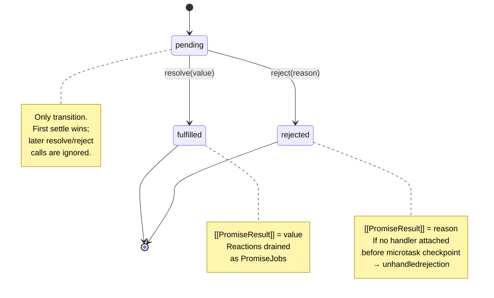
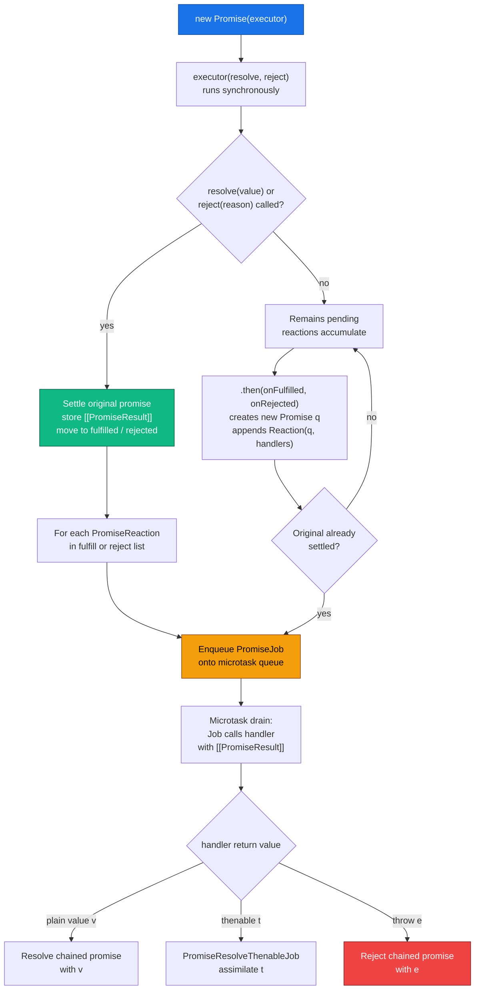
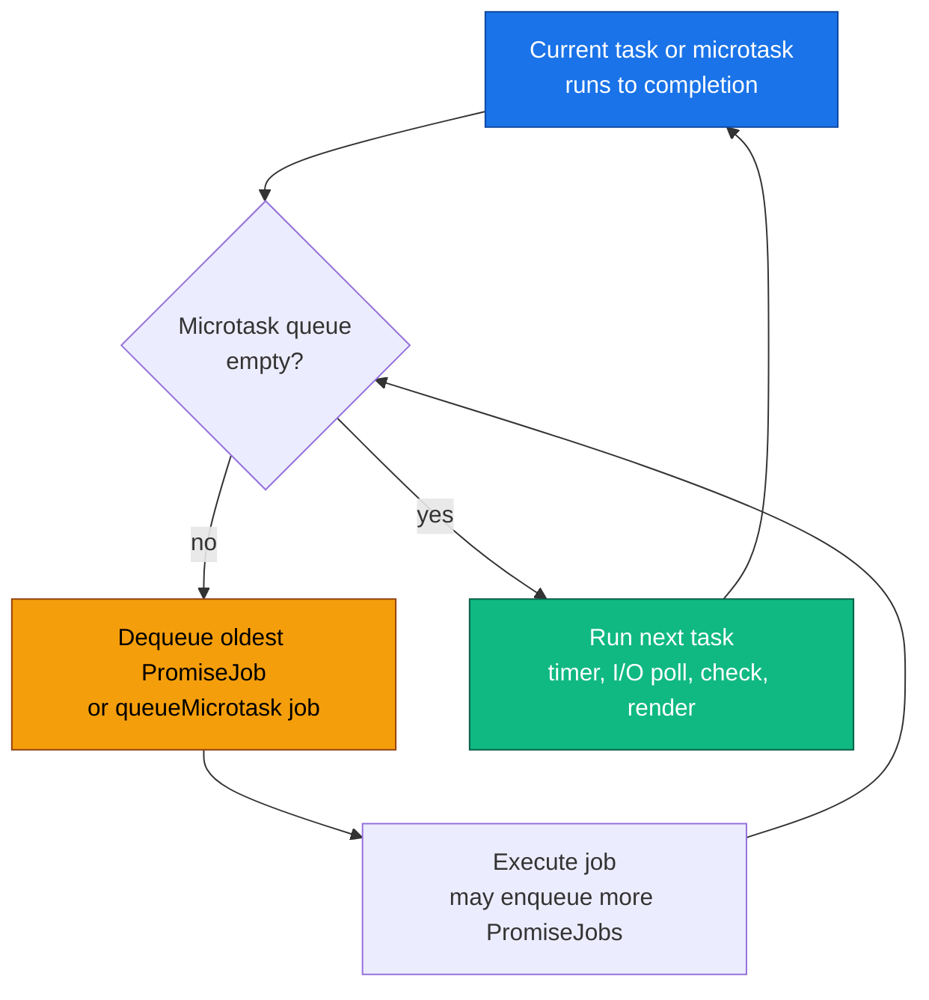
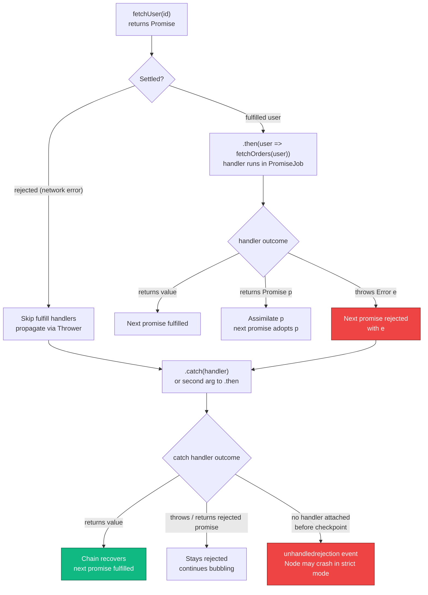
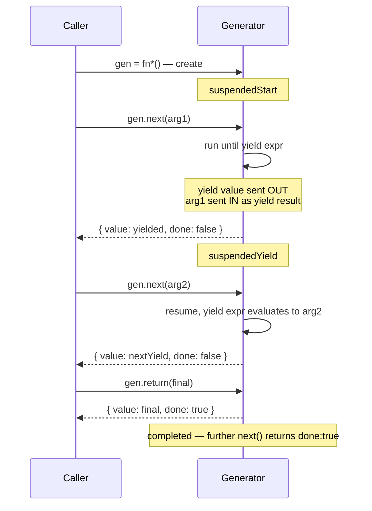
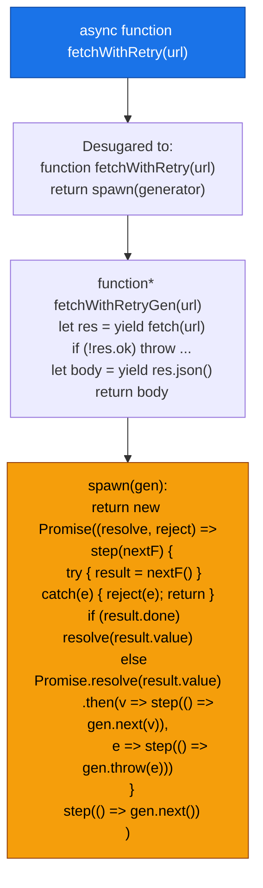
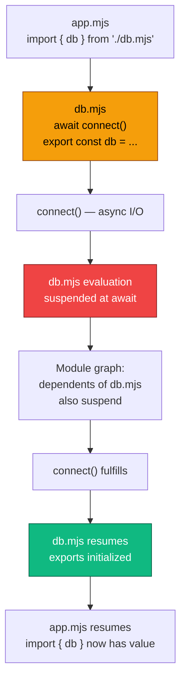

# Chapter 5 — Async JavaScript: Promises, async/await, Generators, and the Promise Job Queue

*What this chapter covers:* Every I/O operation in JavaScript — `fetch`, `fs.readFile`, database queries, RPC calls — returns a `Promise` that resolves through a microtask queue before any timer or I/O callback runs. This chapter dissects that mechanism end to end: the three-state Promise machine and its one-way transitions, how the executor and `.then` register reactions that become PromiseJobs, how those jobs drain in the microtask queue, how `async`/`await` desugars to generators wrapped in Promises, how errors propagate and go unhandled, how generators suspend and resume, and how async iteration and top-level await compose them into streaming and module-graph primitives. You will build a Promise visualizer, step through an `async` → generator transform by hand, watch the microtask queue drain under instrumentation, and wire an `unhandledrejection` handler that would actually ship in production.

**Learning goals:**

- Draw the Promise state machine (pending → fulfilled / rejected), explain why transitions are one-way and one-time, and predict the effect of calling `resolve`/`reject` multiple times or returning a thenable.
- Trace the executor → reaction-queue path: how `new Promise(executor)` captures `resolve`/`reject`, how `.then(onFulfilled, onRejected)` creates a new Promise and enqueues PromiseReaction records, and how the spec's PromiseResolveThenableJob assimilates foreign thenables.
- Explain the Promise Job Queue as a microtask queue: when PromiseJobs run relative to tasks, `queueMicrotask`, `process.nextTick`, and rendering; why `await` always yields at least one microtask; and how recursive microtask enqueuing can starve the event loop.
- Desugar any `async`/`await` function into an equivalent generator + Promise state machine, and explain what the engine actually optimizes away.
- Follow error propagation through `.then` chains, `async` functions, `try`/`catch` around `await`, `unhandledrejection`/`rejectionhandled` events, `AggregateError`, and the four combinators (`all`, `allSettled`, `race`, `any`).
- Operate generators: `function*`, `yield` / `yield*`, `next(value)`, `return(value)`, `throw(err)` — and explain the bidirectional value channel and the suspended-start / suspended-yield / completed states.
- Use async generators and `for await...of` to consume asynchronous iterables (streams, paginated APIs, message consumers) with backpressure.
- Explain top-level `await` in ESM: how it blocks module-graph evaluation, what it does to the instance lifecycle, and when to use it versus an exported promise or an `async` IIFE.
- Apply all of the above to backend concerns: timeout-wrapped fetches, retry with jitter, concurrency-limited fan-out, graceful shutdown while awaiting, and observability for slow or stuck promise chains.

---

## 1. Why a Backend Engineer Should Care About Promise Internals

In Go you write `resp, err := client.Do(req)` and the goroutine parks. In Java you call `future.get()` and the thread blocks. In JavaScript there is no blocking. Every I/O — `fetch('http://payments:8080/charge')`, `pg.query('SELECT ...')`, `redis.get('session:…')` — returns immediately with a placeholder. The placeholder is a `Promise`. Your request handler continues, the event loop polls for completions, and continuations run later as microtasks.

At fleet scale this has three consequences that senior backend engineers feel directly:

1. **Ordering is a contract, not an accident.** Promise continuations are microtasks. Microtasks drain exhaustively before the next timer, I/O poll, or render. If you attach `.then` handlers in a hot loop without yielding, you starve I/O. If you wrap a cache lookup in `Promise.resolve().then(...)` you add a guaranteed microtask hop — observable as an extra tick of latency per hop in a chain of middleware.

2. **Errors do not throw where you expect.** A `throw` inside a Promise executor or an `async` function does not unwind the caller. It rejects a Promise. If nobody attaches a rejection handler before the microtask checkpoint, the runtime fires `unhandledrejection`. In Node, a future flag (`--unhandled-rejections=strict`) will crash the process. Silent unhandled rejections in an API gateway become silent dropped charges.

3. **Composition is concurrency control.** `Promise.all`, `Promise.allSettled`, `Promise.race`, and `Promise.any` are not convenience aliases. They are your fan-out, scatter-gather, hedged-request, and quorum primitives — the same patterns from Volume 6 (quorums) and Volume 3 (hedging), implemented inside the language. Understanding when `all` fails fast versus when `allSettled` preserves partial results determines whether a single slow shard fails your entire aggregation.

This chapter treats async not as syntax trivia but as a scheduling and error-propagation substrate — the same class of concern as goroutine scheduling, future combinators, or Tokio tasks in other volumes.

> **Relationship to Chapter 2.** Chapter 2 explained the event loop's task vs. microtask queues and the libuv/browser divergence. This chapter zooms into one occupant of the microtask queue — PromiseJobs — and into the language constructs (Promise, generator, async/await) that enqueue them. Read them together: Chapter 2 tells you *when* microtasks drain; this chapter tells you *what* Promise enqueues and *why*.

---

## 2. The Promise State Machine — Pending, Fulfilled, Rejected

A Promise as defined in ECMA-262 [§27.2](https://tc39.es/ecma262/#sec-promise-objects) is an object with three internal slots that matter and one state that never goes backward:

| Internal slot | Purpose |
|---|---|
| `[[PromiseState]]` | `"pending"` \| `"fulfilled"` \| `"rejected"` — the only observable state, via `.then` and `await` |
| `[[PromiseResult]]` | The fulfillment value or rejection reason |
| `[[PromiseFulfillReactions]]` / `[[PromiseRejectReactions]]` | Queues of PromiseReaction records registered by `.then` / `.catch` / `.finally` / `await` |

A fourth slot, `[[PromiseIsHandled]]`, tracks whether a rejection has ever had a handler — the basis for `unhandledrejection` detection.

### 2.1 The one-way, one-time transition



Two invariants make Promises reliable as a coordination primitive:

- **Immutability after settlement.** Once `[[PromiseState]]` leaves `"pending"`, it never changes. Calling `resolve` twice, calling both `resolve` and `reject`, or throwing after resolving — all are no-ops. This matches the distributed-systems intuition of a single-assignment future: exactly once settled.

- **Observation is always async.** Even if a Promise is already fulfilled, `.then(handler)` never calls `handler` synchronously. It enqueues a PromiseJob. This eliminates the Zalgo problem (sometimes sync, sometimes async) that plagued callback APIs.

```javascript
// Invariant 1 — first settle wins, forever
let resolveOuter;
const p = new Promise((resolve) => { resolveOuter = resolve; });

p.then(v => console.log("fulfilled with", v),
       e => console.log("rejected with", e));

resolveOuter("first");
resolveOuter("second");   // ignored
// Logs: fulfilled with first

// Even throwing after resolve is ignored
const p2 = new Promise((resolve) => {
  resolve("ok");
  throw new Error("too late"); // swallowed — promise already fulfilled
});
p2.then(v => console.log(v)); // "ok"

// Invariant 2 — always async, even when already settled
const alreadyFulfilled = Promise.resolve(42);
alreadyFulfilled.then(v => console.log("microtask:", v));
console.log("sync");
// Logs:
//   sync
//   microtask: 42
```

That second guarantee is load-bearing for middleware chains. An auth middleware that does `return Promise.resolve(cachedUser).then(attachToReq)` always yields at least one microtask, so downstream middleware ordering is deterministic regardless of cache hit or miss.

### 2.2 The executor — where the state transition originates

```javascript
const p = new Promise((resolve, reject) => {
  // executor runs synchronously, during construction
  console.log("executor runs now");
  resolve(42);            // moves pending → fulfilled, stores 42
  // Any handlers already registered are enqueued as PromiseJobs
  // Handlers registered later (after this tick) are also enqueued
});
console.log("after construction");
// Logs:
//   executor runs now
//   after construction
//   (then handlers fire in a later microtask)
```

The executor receives two functions, `resolve` and `reject`, that are capability-bound to this specific Promise instance. Calling `resolve(x)` performs the spec operation `ResolvePromise(p, x)`:

- If `x` is a plain value → fulfill `p` with `x`.
- If `x` is a thenable (any object with a callable `.then`) → assimilate it: adopt its eventual state. This is how `resolve(fetch(...))` unwraps one level.
- If `x === p` → reject with `TypeError` (self-resolution).

```javascript
// Thenable assimilation — resolve unwraps one level
const thenable = {
  then(onFulfilled) { onFulfilled("from thenable"); }
};
Promise.resolve(thenable).then(v => console.log(v)); // "from thenable"

// Nested promise unwrapping
const inner = Promise.resolve("inner");
const outer = new Promise(resolve => resolve(inner));
outer.then(v => console.log(v)); // "inner" — outer adopted inner's state

// Self-resolution is a TypeError
let self;
self = new Promise((resolve) => {
  // Defer to catch the reference — direct self-resolution inside executor
  // would reference an uninitialized binding
});
self.then(() => {}); // placeholder
// Programmatic self-resolution via resolve(self) inside a handler:
const base = Promise.resolve(1);
const cycle = base.then(() => cycle); // handler returns its own promise
cycle.catch(e => console.log(e instanceof TypeError)); // true
```

> **Backend analogue.** Thenable assimilation is the language-level equivalent of future-flattening in RPC frameworks. Just as a gRPC stub that returns `ListenableFuture<ListenableFuture<T>>` is almost always a bug, a `Promise<Promise<T>>` automatically flattens to `Promise<T>` via assimilation. There is no nested promise at runtime.

---

## 3. Executor → Reaction Queue — How `.then` Really Works

Calling `.then` does not execute anything immediately. It creates a *new* Promise and registers a *PromiseReaction* that will enqueue a PromiseJob when the original settles.



### 3.1 The PromiseReaction record

Each `.then(onFulfilled, onRejected)` call allocates:

```
PromiseReaction {
  [[Capabilities]]: { [[Promise]]: newPromise, [[Resolve]]: ..., [[Reject]]: ... }
  [[Type]]: "Fulfill" | "Reject"
  [[Handler]]: onFulfilled | onRejected  (or Identity / Thrower if missing)
}
```

- If the original fulfills, the Fulfill reactions run; if it rejects, the Reject reactions run.
- If the corresponding handler is not callable (`p.then(null, null)`), the spec substitutes `Identity` (pass-through) or `Thrower` (re-throw), which is why `.then()` without arguments propagates the settlement unchanged.
- The chained promise (`newPromise`) is what the caller holds. Its fate is decided by what the handler returns or throws.

```javascript
// Chaining — each .then returns a NEW promise
const p1 = Promise.resolve(10);
const p2 = p1.then(v => v * 2);          // p2 fulfills with 20
const p3 = p2.then(v => Promise.resolve(v + 5)); // p3 fulfills with 25 (assimilated)
const p4 = p3.then(() => { throw new Error("oops"); }); // p4 rejects

p4.catch(e => console.log(e.message)); // "oops"

// Pass-through when handler is missing
const p5 = Promise.reject(new Error("fail"));
const p6 = p5.then(null); // no onRejected → Thrower → p6 also rejects with "fail"
p6.catch(e => console.log("propagated:", e.message)); // propagated: fail

const p7 = Promise.resolve(99);
const p8 = p7.then(); // no onFulfilled → Identity → p8 fulfills with 99
p8.then(v => console.log(v)); // 99

// .catch and .finally are sugar over .then
// p.catch(onRejected)  ≡  p.then(null, onRejected)
// p.finally(onFinally) ≡  p.then(v => { onFinally(); return v; },
//                              e => { onFinally(); throw e; })
```

### 3.2 Promise combinators — fan-out primitives

```javascript
// Promise.all — fail-fast scatter-gather (like a quorum requiring all replicas)
const shardResults = await Promise.all([
  fetchShard("shard-a"),
  fetchShard("shard-b"),
  fetchShard("shard-c"),
]);
// If ANY shard rejects, the whole all() rejects immediately.
// Use when partial results are useless.

// Promise.allSettled — always waits (like a quorum that reports per-replica status)
const settled = await Promise.allSettled([
  fetchShard("shard-a"),
  fetchShard("shard-b"),
  fetchShard("shard-c"),
]);
// settled = [
//   { status: "fulfilled", value: ... },
//   { status: "rejected", reason: ... },
//   { status: "fulfilled", value: ... },
// ]
// Use for best-effort aggregation, bulk writes, fan-out notifications.

// Promise.race — first to settle wins (hedged requests, timeouts)
const withTimeout = Promise.race([
  fetch("http://payments:8080/charge"),
  new Promise((_, reject) =>
    setTimeout(() => reject(new Error("timeout after 2s")), 2000)
  ),
]);

// Promise.any — first to FULFILL wins, ignores rejections until all reject
// Useful for redundant providers: try 3 payment gateways, use first success
try {
  const result = await Promise.any([
    chargeViaStripe(),
    chargeViaAdyen(),
    chargeViaBraintree(),
  ]);
} catch (e) {
  // e is AggregateError — all three rejected
  console.log(e.errors.map(err => err.message));
}
```

| Combinator | Waits for | Rejects when | Returns |
|---|---|---|---|
| `all` | All fulfilled | Any single rejection (fail-fast) | Array of values, order = input order |
| `allSettled` | All settled | Never rejects | Array of `{status, value\|reason}` |
| `race` | First settled (fulfill or reject) | First rejection if it settles first | Single value/reason |
| `any` | First fulfilled | All rejected → `AggregateError` | Single value |

> **Distributed-systems lens.** Choose `all` for strong-consistency fan-out (all shards must answer). Choose `allSettled` for availability-oriented fan-out (degraded answers are better than failure). Choose `race` for hedged requests with a timeout future. Choose `any` for redundant-provider failover. The same trade-off space as quorums and hedged reads in Volume 6 appears here inside a single process.

---

## 4. The Promise Job Queue — Microtask Drain Mechanics

ECMA-262 does not say "microtask queue" directly. It says *PromiseJobs* are enqueued via *HostEnqueuePromiseJob* and drained by *PerformMicrotaskCheckpoint*. In browsers this is the HTML Standard microtask queue; in Node it is the `nextTick` + promise microtask queue drained between libuv phases (see Chapter 2, §2.4). The observable behavior is identical: **PromiseJobs run before the next task, and they drain exhaustively — a PromiseJob that enqueues another PromiseJob causes that new job to run in the same drain.**



### 4.1 Microtask drain demo — the log order that proves the queue

```javascript
// microtask-drain-demo.js — run with `node microtask-drain-demo.js`
console.log("1 — script start");

setTimeout(() => console.log("2 — setTimeout (task)"), 0);

Promise.resolve().then(() => {
  console.log("3 — promise.then #1");
  // Enqueuing inside a microtask — runs in SAME drain, before any task
  Promise.resolve().then(() => console.log("4 — promise.then #2 (nested)"));
});

queueMicrotask(() => console.log("5 — queueMicrotask"));

Promise.resolve().then(() => console.log("6 — promise.then #3"));

console.log("7 — script end");

// Output — guaranteed order in every compliant engine:
// 1 — script start
// 7 — script end
// 3 — promise.then #1
// 5 — queueMicrotask
// 6 — promise.then #3
// 4 — promise.then #2 (nested)    ← enqueued during drain, still before task
// 2 — setTimeout (task)            ← only after queue fully empty

// Why #4 before #2: the checkpoint after #3 enqueued #4 before the queue
// was considered empty. Tasks never interleave inside a drain.

// Starvation hazard — uncomment to freeze the process:
// function starve() {
//   Promise.resolve().then(starve); // infinite microtask loop
// }
// starve();
// setTimeout(() => console.log("never reached"), 0);
// Node will never reach the setTimeout; the browser will never render.
```

Key observations for backend work:

- **`await` always enqueues at least one PromiseJob.** Even `await 42` (a non-Promise) wraps `42` in `Promise.resolve(42)` and suspends. The continuation resumes in a later microtask. Two consecutive `await` statements cost two microtask hops.
- **`queueMicrotask` and `Promise.then` share the same queue.** Insertion order determines execution order. There is no priority between them.
- **Node's `process.nextTick` drains *before* PromiseJobs.** A recursive `nextTick` loop starves PromiseJobs; a recursive PromiseJob loop starves `setImmediate` and I/O. Never recurse unboundedly on either.

```javascript
// await always yields — even for non-promises
async function demo() {
  console.log("a — before await");
  await 42; // ≡ await Promise.resolve(42) — suspends, resumes as microtask
  console.log("c — after await");
}
console.log("b — before calling demo");
demo();
console.log("d — after calling demo");
// Order: b, a, d, c
// 'c' is deferred because await enqueued a PromiseJob for the continuation

// Two awaits = two hops
async function twoHops() {
  await Promise.resolve(1); // hop 1
  await Promise.resolve(2); // hop 2 — separate microtask after first resumes
  console.log("done after two hops");
}
```

### 4.2 Observing the drain with instrumentation

```javascript
// microtask-instrumentation.js
const { performance } = require("node:perf_hooks");

function instrumentedThen(label, promise) {
  const start = performance.now();
  return promise.then(
    (v) => {
      console.log(`[${label}] fulfilled after ${(performance.now() - start).toFixed(2)}ms — value:`, v);
      return v;
    },
    (e) => {
      console.log(`[${label}] rejected after ${(performance.now() - start).toFixed(2)}ms — reason:`, e.message);
      throw e;
    }
  );
}

// Measure microtask ordering vs tasks
console.log("--- instrumented drain ---");
performance.mark("start");

instrumentedThen("A", Promise.resolve("a"));
instrumentedThen("B", Promise.resolve("b"));

queueMicrotask(() => {
  performance.mark("microtask");
  console.log("queueMicrotask fired");
});

setTimeout(() => {
  performance.mark("timeout");
  performance.measure("microtasks → timeout", "microtask", "timeout");
  console.log("setTimeout fired — measure:", performance.getEntriesByName("microtasks → timeout")[0]?.duration.toFixed(2), "ms");
}, 0);

// Expected: A, B, queueMicrotask all fire before setTimeout
// The gap between microtask and timeout is the task-queue wait
```

> **Operational signal.** In production, event-loop lag (Chapter 2, §2.8) is dominated by two things: long synchronous tasks and deep microtask drains. A chain of 1,000 `.then` handlers enqueued synchronously does not create 1,000 tasks — it creates 1,000 microtasks that drain as one uninterrupted block. Under load, this manifests as p99 latency spikes with no corresponding CPU spike, because the loop is busy but not doing I/O. Instrument `perf_hooks.monitorEventLoopDelay()` to catch it.

---

## 5. Error Propagation — Rejection, Unhandled Rejections, and AggregateError

### 5.1 How errors travel through a Promise chain

Every `.then` handler is wrapped so that a thrown exception becomes a rejection of the chained promise. This is the sole error-propagation mechanism for asynchronous code — there is no cross-microtask stack unwind.



```javascript
// Error bubbling through a realistic chain
function fetchUser(id) {
  if (id < 0) return Promise.reject(new Error("invalid id"));
  return Promise.resolve({ id, name: "Ada" });
}
function fetchOrders(user) {
  if (user.id === 0) throw new Error("no orders for guest");
  return Promise.resolve([{ id: 101, total: 42 }]);
}

fetchUser(0)                         // fulfills with { id: 0 }
  .then(user => fetchOrders(user))   // throws synchronously inside handler
  .then(orders => console.log("orders:", orders)) // skipped — previous rejected
  .catch(err => {
    console.log("caught:", err.message); // "no orders for guest"
    return [];                           // recovery — next promise fulfills with []
  })
  .then(orders => console.log("recovered orders:", orders)); // logs []

// Equivalent with async/await — errors become thrown exceptions
async function getOrders(id) {
  try {
    const user = await fetchUser(id);    // if fetchUser rejects, throws here
    const orders = await fetchOrders(user); // if fetchOrders throws/rejects, throws here
    return orders;
  } catch (err) {
    console.log("caught in async:", err.message);
    return []; // recovery
  }
}
```

### 5.2 Unhandled rejections — the silent failure mode

A rejection is *handled* if, at any point before the microtask checkpoint after the rejection, some `.then`/`.catch`/`await` has registered a rejection handler on that specific Promise object. If not, the host fires `unhandledrejection`.

```javascript
// unhandledrejection — the handler that belongs in every service entrypoint

// Browser
if (typeof window !== "undefined") {
  window.addEventListener("unhandledrejection", (event) => {
    console.error("[unhandledrejection]", event.reason);
    // Report to observability pipeline
    // In production: send to Sentry / Datadog / OTel
    event.preventDefault(); // suppress console warning if you handled it
  });
  window.addEventListener("rejectionhandled", (event) => {
    console.warn("[rejectionhandled late]", event.reason);
    // Fired when a rejection that was previously unhandled gets a handler later
  });
}

// Node.js — place this near the top of your entrypoint, before any imports that may reject
process.on("unhandledRejection", (reason, promise) => {
  console.error("[unhandledRejection]", reason);
  // Structured log for alerting — include promise identity for correlation
  // logger.error({ reason, promiseId: promise[Symbol.toStringTag] }, "unhandled rejection");

  // In Node 15+, unhandled rejections throw and crash by default (--unhandled-rejections=throw).
  // Explicit handling here prevents crash, but audit why it was unhandled at all.
});

process.on("rejectionHandled", (promise) => {
  console.warn("[rejectionHandled] — handler attached after unhandledRejection fired");
});

// Demo: unhandled vs handled timing
const p1 = Promise.reject(new Error("no handler at all"));
// → fires unhandledRejection at next microtask checkpoint

const p2 = Promise.reject(new Error("late handler"));
// Microtask checkpoint fires unhandledRejection for p2...
setTimeout(() => {
  p2.catch(e => console.log("late catch:", e.message));
  // → fires rejectionHandled (handler attached after the fact)
}, 10);

const p3 = Promise.reject(new Error("immediate handler"));
// Handled synchronously before checkpoint — no event fires
p3.catch(e => console.log("immediate catch:", e.message));
```

Common production pitfalls:

| Pattern | Why it is unhandled | Fix |
|---|---|---|
| `fetch(url);` with no `.catch` or `await` | Fire-and-forget — rejection has no handler | Always `await` or attach `.catch`; lint with `no-floating-promises` (`@typescript-eslint`) |
| `promise.then(onFulfilled)` with no second arg and no downstream `.catch` | Rejection propagates to chained promise, which also has no handler | End every chain with `.catch`, or `await` inside `try`/`catch` |
| `Promise.all([...])` where one rejects before you attach `.catch` | `all` rejects immediately; if you `await` it without `try`, caller gets unhandled | `await` inside `try`/`catch` or use `allSettled` |
| `async` event handler that throws | The returned rejected promise is ignored by the event emitter | Wrap handler body in `try`/`catch` and log, or return the promise to a central handler |

```javascript
// The no-floating-promises fix — every promise must be handled
// .eslintrc: "@typescript-eslint/no-floating-promises": "error"

// Bad — lint error, potential unhandled rejection
app.post("/charge", (req, res) => {
  chargeCard(req.body); // returns Promise — floating!
  res.sendStatus(202);
});

// Good — await or explicitly handle
app.post("/charge", async (req, res, next) => {
  try {
    await chargeCard(req.body);
    res.sendStatus(200);
  } catch (err) {
    next(err); // Express error handler — rejection is handled
  }
});

// Also good — explicit void with catch when fire-and-forget is intentional
app.post("/webhook", (req, res) => {
  void processWebhookAsync(req.body).catch(err => {
    logger.error({ err }, "webhook processing failed");
  });
  res.sendStatus(202);
});
```

### 5.3 AggregateError and the any/allSettled error model

`Promise.any` is the only combinator that aggregates multiple errors into one:

```javascript
// AggregateError — the error type for "all providers failed"
try {
  await Promise.any([
    Promise.reject(new Error("stripe: rate limited")),
    Promise.reject(new Error("adyen: timeout")),
    Promise.reject(new Error("braintree: invalid card")),
  ]);
} catch (e) {
  console.log(e instanceof AggregateError); // true
  console.log(e.message);                   // "All promises were rejected"
  console.log(e.errors.length);             // 3
  for (const err of e.errors) {
    console.log(" -", err.message);
  }
  // Use e.errors for per-provider diagnostics, retries, or alerting
}

// Constructing your own AggregateError for batch validation
function validateBatch(records) {
  const errors = [];
  for (const r of records) {
    try { validateRecord(r); } catch (e) { errors.push(e); }
  }
  if (errors.length > 0) {
    throw new AggregateError(errors, `batch validation failed: ${errors.length} errors`);
  }
}

// allSettled — no AggregateError, but you handle per-result status
const results = await Promise.allSettled(jobs.map(j => runJob(j)));
const failures = results.filter(r => r.status === "rejected");
if (failures.length > 0) {
  logger.warn({ failures: failures.map(f => f.reason.message) }, "partial batch failure");
  // Decide: retry failures, return partial, or escalate
}
```

---

## 6. Generators — Suspendable Functions with a Bidirectional Channel

Generators are the suspension primitive that `async`/`await` is built on. A generator function (`function*`) does not execute when called. It returns a *Generator* object — an iterator with a state machine — whose body advances only when the caller drives it via `.next()`, `.return()`, or `.throw()`.

### 6.1 States and the yield/next handshake



The critical insight: `yield` is a *bidirectional* channel. The value *after* `yield` goes out to the caller; the value *passed to* the next `next()` call comes *in* as the result of the `yield` expression.

```javascript
function* bidirectional() {
  console.log("start");
  const a = yield "first yield";   // sends "first yield" OUT, receives next arg as `a`
  console.log("a =", a);
  const b = yield "second yield";  // sends "second yield" OUT, receives next arg as `b`
  console.log("b =", b);
  return "done";
}

const gen = bidirectional();
console.log(gen.next());        // start → { value: "first yield", done: false }
console.log(gen.next("hello")); // a = hello → { value: "second yield", done: false }
console.log(gen.next("world")); // b = world → { value: "done", done: true }
console.log(gen.next("extra")); // { value: undefined, done: true } — completed, ignores arg

// .return — force completion, runs finally blocks
function* withFinally() {
  try {
    yield 1;
    yield 2;
    yield 3;
  } finally {
    console.log("cleanup in finally");
  }
}
const g2 = withFinally();
console.log(g2.next());   // { value: 1, done: false }
console.log(g2.return("early")); // cleanup in finally → { value: "early", done: true }

// .throw — inject an exception at the yield point
function* withCatch() {
  try {
    const v = yield "waiting";
    console.log("v =", v);
  } catch (e) {
    console.log("caught inside generator:", e.message);
    yield "recovered";
  }
  return "done";
}
const g3 = withCatch();
console.log(g3.next());                    // { value: "waiting", done: false }
console.log(g3.throw(new Error("oops")));  // caught inside generator: oops → { value: "recovered", done: false }
console.log(g3.next());                    // { value: "done", done: true }

// yield* — delegation to another iterable/generator
function* inner() { yield "a"; yield "b"; }
function* outer() { yield "start"; yield* inner(); yield "end"; }
console.log([...outer()]); // ["start", "a", "b", "end"]
// yield* also forwards .return/.throw and captures the delegated return value:
function* delegating() {
  const result = yield* inner(); // inner returns undefined → result = undefined
  console.log("delegated return:", result);
}
```

### 6.2 Generator visualizer — observable state machine

```javascript
// generator-visualizer.js — run to see every transition
function* orderWorkflow(orderId) {
  console.log(`[${orderId}] workflow started`);
  const payment = yield { step: "charge", orderId };
  console.log(`[${orderId}] payment result:`, payment);

  if (!payment.ok) {
    yield { step: "compensate", reason: payment.error };
    return { status: "failed", orderId };
  }

  const shipment = yield { step: "ship", orderId };
  console.log(`[${orderId}] shipment:`, shipment);
  return { status: "completed", orderId, tracking: shipment.tracking };
}

function visualize(gen) {
  let step = 0;
  let lastValue = undefined;
  let isThrow = false;
  let throwArg;

  while (true) {
    const result = isThrow ? gen.throw(throwArg) : gen.next(lastValue);
    console.log(`  step ${++step}: gen =>`, result);
    if (result.done) {
      console.log(`  → completed with:`, result.value);
      break;
    }
    // Simulate driving the generator from "infrastructure" responses
    console.log(`  ← driving next with response for step:`, result.value.step);
    if (result.value.step === "charge") lastValue = { ok: true, chargeId: "ch_123" };
    else if (result.value.step === "ship") lastValue = { tracking: "1Z999" };
    else lastValue = undefined;
    isThrow = false;
  }
}

const gen = orderWorkflow("ord-42");
visualize(gen);
// Logs every yield/next handshake — the exact protocol async/await automates
```

### 6.3 Why generators matter beyond async — iterables, pipelines, and cooperative scheduling

Generators are also the implementation behind lazy pipelines and custom iterables — used in streaming parsers, paginated API iterators, and test-data factories:

```javascript
// Lazy paginated API — caller drives fetching via iteration
function* paginateSync(fetchPage) {
  let cursor = null;
  while (true) {
    const page = fetchPage(cursor); // sync for illustration — async version in §8
    yield* page.items;
    if (!page.nextCursor) break;
    cursor = page.nextCursor;
  }
}

// Cooperative scheduling — yield to the event loop periodically
function* chunkedProcess(items, chunkSize = 100) {
  for (let i = 0; i < items.length; i += chunkSize) {
    const chunk = items.slice(i, i + chunkSize);
    yield chunk; // caller can await setImmediate or queueMicrotask between chunks
  }
}
```

---

## 7. async/await — Generators Wrapped in Promises

An `async` function is not a new execution model. It is a generator that the engine automatically drives to completion, with each `yield` replaced by `await`, and with the driving loop implemented as PromiseJobs. The desugaring below is semantically faithful — what V8 actually runs is more optimized, but the state transitions are identical.

### 7.1 The desugaring



```javascript
// What you write:
async function fetchWithRetry(url, retries = 3) {
  for (let attempt = 0; attempt < retries; attempt++) {
    try {
      const res = await fetch(url);
      if (!res.ok) throw new Error(`HTTP ${res.status}`);
      const body = await res.json();
      return body;
    } catch (err) {
      if (attempt === retries - 1) throw err;
      await sleep(100 * 2 ** attempt); // exponential backoff, still just an await
    }
  }
}

// What the engine conceptually executes (hand-written desugaring for illustration):
function fetchWithRetryDesugared(url, retries = 3) {
  return spawn(function* () {
    for (let attempt = 0; attempt < retries; attempt++) {
      try {
        const res = yield fetch(url);          // await → yield
        if (!res.ok) throw new Error(`HTTP ${res.status}`);
        const body = yield res.json();          // await → yield
        return body;
      } catch (err) {
        if (attempt === retries - 1) throw err;
        yield sleep(100 * 2 ** attempt);        // await → yield
      }
    }
  }());
}

// The driver that makes yield behave like await — the "spawn" / "co" pattern
function spawn(gen) {
  return new Promise((resolve, reject) => {
    function step(nextF) {
      let result;
      try {
        result = nextF(); // gen.next(v) or gen.throw(e)
      } catch (e) {
        reject(e); // exception inside generator → reject outer promise
        return;
      }
      if (result.done) {
        // Generator returned — fulfill outer promise with return value
        // (assimilate if return value is thenable)
        Promise.resolve(result.value).then(resolve, reject);
        return;
      }
      // Generator yielded a value — wait for it, then resume
      Promise.resolve(result.value).then(
        (v) => step(() => gen.next(v)),   // fulfillment → inject as yield result
        (e) => step(() => gen.throw(e))   // rejection → throw inside generator (catchable)
      );
    }
    step(() => gen.next()); // start — first next() takes no meaningful arg
  });
}

// Proof they behave identically (including error paths):
async function demoAsync(x) {
  if (x < 0) throw new Error("negative");
  const y = await Promise.resolve(x * 2);
  return y + 1;
}
function demoDesugared(x) {
  return spawn(function* () {
    if (x < 0) throw new Error("negative");
    const y = yield Promise.resolve(x * 2);
    return y + 1;
  }());
}
// Both: demo*(5) → 11, demo*(-1) → rejected with "negative"
```

Three properties fall out of this model:

1. **`await` is `yield` + `Promise.resolve` + resume-as-microtask.** The `Promise.resolve(result.value)` step is why `await 42` and `await someThenable` both work — non-promises are wrapped, thenables are assimilated, promises are adopted.

2. **Rejection becomes `throw` inside the generator.** That is why `try`/`catch` around `await` works — `gen.throw(e)` injects the exception at the `yield` point, where the generator's `try`/`catch` can intercept it. Without a `catch`, the exception propagates out of `gen.next`/`gen.throw`, and `spawn` rejects the outer promise.

3. **The outer promise is the function's return value.** Calling an `async` function always returns a Promise immediately, even before the first `await`. The function body runs synchronously until the first `await` (or `return`/`throw`), then suspends.

```javascript
// The outer promise is returned synchronously — before any await
async function example() {
  console.log("A — sync preamble");
  await Promise.resolve();
  console.log("C — resumed as microtask");
  return 42;
}
console.log("B — before call");
const p = example(); // logs "A" synchronously, returns a pending promise
console.log("B2 — after call, p is", p instanceof Promise);
p.then(v => console.log("D — return value:", v));
console.log("B3 — still sync");
// Order: B, A, B2, B3, C, D
```

### 7.2 await in loops — sequential vs. concurrent

A common backend performance bug is awaiting inside a loop when fan-out was intended:

```javascript
// Sequential — N round trips, total latency = sum(latencies)
async function sequential(ids) {
  const results = [];
  for (const id of ids) {
    results.push(await fetchUser(id)); // waits for each before starting next
  }
  return results;
}

// Concurrent — 1 fan-out, total latency ≈ max(latency)
async function concurrent(ids) {
  const promises = ids.map(id => fetchUser(id)); // all start immediately
  return Promise.all(promises);                  // single await for all
}

// Bounded concurrency — N at a time (p-limit pattern, see §9)
async function bounded(ids, limit = 10) {
  const results = new Array(ids.length);
  let nextIndex = 0;

  async function worker() {
    while (nextIndex < ids.length) {
      const i = nextIndex++;
      results[i] = await fetchUser(ids[i]);
    }
  }
  await Promise.all(Array.from({ length: limit }, () => worker()));
  return results;
}

// Rate-limited with backpressure — for await version in §8
```

> **Operational note.** The sequential version looks correct in tests with mocked I/O (where latency is zero) and becomes a p99 disaster in production where each `fetchUser` is 20ms and `ids.length` is 100 — 2 seconds of serial latency that `Promise.all` would collapse to ~20ms. Lint for `no-await-in-loop` in hot paths, but allow it when ordering or throttling is intentional (e.g., migrations that must apply sequentially).

---

## 8. Async Iteration and Top-Level Await

### 8.1 Async generators and `for await...of`

A *sync* generator yields values; an *async* generator yields promises of values. The consumer drives it with `for await...of`, which awaits each yielded promise before looping.

```javascript
// Async generator — each yield can await internally
async function* fetchPaginated(baseUrl) {
  let cursor = null;
  while (true) {
    const url = cursor ? `${baseUrl}?cursor=${cursor}` : baseUrl;
    const res = await fetch(url);
    if (!res.ok) throw new Error(`fetch failed: ${res.status}`);
    const page = await res.json();
    for (const item of page.items) {
      yield item; // each item yielded individually, consumer awaits each
    }
    if (!page.nextCursor) break;
    cursor = page.nextCursor;
  }
}

// Consumer — for await...of handles the async iterator protocol
async function processAll() {
  for await (const item of fetchPaginated("https://api.example.com/orders")) {
    await handleItem(item); // backpressure — next fetch waits for this
  }
}

// Manual iteration — what for await desugars to
async function processAllManual() {
  const iter = fetchPaginated("https://api.example.com/orders")[Symbol.asyncIterator]();
  while (true) {
    const { value, done } = await iter.next();
    if (done) break;
    await handleItem(value);
  }
}

// Async generator as a transform stream (readable → transform → writable)
async function* batched(source, batchSize = 100) {
  let batch = [];
  for await (const item of source) {
    batch.push(item);
    if (batch.length >= batchSize) {
      yield batch;
      batch = [];
    }
  }
  if (batch.length > 0) yield batch;
}

async function* withRetry(source, retries = 3) {
  for await (const item of source) {
    for (let attempt = 0; attempt < retries; attempt++) {
      try {
        yield await processWithPossibleFailure(item);
        break;
      } catch (e) {
        if (attempt === retries - 1) throw e;
        await sleep(100 * 2 ** attempt);
      }
    }
  }
}

// Composed pipeline — each stage is an async iterable
// for await (const batch of batched(withRetry(fetchPaginated(url)), 50)) { ... }
```

The async iterator protocol — the two methods the engine looks for:

| Protocol | Method | Returns |
|---|---|---|
| Sync iterable | `[Symbol.iterator]()` | Iterator with `next() → {value, done}` |
| Async iterable | `[Symbol.asyncIterator]()` | AsyncIterator with `next() → Promise<{value, done}>` |
| `for await...of` | Prefers `asyncIterator`, falls back to `iterator` (wrapping values in `Promise.resolve`) | Awaits each `next()` result |

Custom async iterable — useful for wrapping event emitters, queues, or message consumers:

```javascript
// Wrap a Node.js readable stream as an async iterable (Node does this natively, but here's the mechanism)
async function* streamToAsyncIterable(readable) {
  const queue = [];
  let done = false;
  let error = null;
  let resolveNext = null;

  readable.on("data", (chunk) => {
    if (resolveNext) { const r = resolveNext; resolveNext = null; r({ value: chunk, done: false }); }
    else queue.push(chunk);
  });
  readable.on("end", () => {
    done = true;
    if (resolveNext) { const r = resolveNext; resolveNext = null; r({ value: undefined, done: true }); }
  });
  readable.on("error", (err) => {
    error = err;
    if (resolveNext) { const r = resolveNext; resolveNext = null; r(Promise.reject(err)); }
  });

  while (true) {
    if (queue.length > 0) yield queue.shift();
    else if (done) break;
    else if (error) throw error;
    else {
      // Suspend until next data/end/error — the promise the generator yields
      const result = await new Promise((resolve) => { resolveNext = resolve; });
      if (result.done) break;
      yield result.value;
    }
  }
}
```

### 8.2 Top-level await — blocking the module graph

Top-level `await` (ES2022, supported in ESM — not in CommonJS or classic scripts) allows a module to `await` at the top level. The module's evaluation becomes asynchronous, and any importer waits for it.



```javascript
// db.mjs — top-level await for connection setup
import { createPool } from "./pool.mjs";
export const pool = await createPool(process.env.DATABASE_URL);
// No init() function, no race — importers that do `import { pool } from "./db.mjs"`
// are guaranteed pool is connected before their module body runs.

// config.mjs — top-level await for remote config
const res = await fetch("https://config.internal/v1/app-config");
if (!res.ok) throw new Error(`config fetch failed: ${res.status}`);
export const config = await res.json();

// app.mjs — all imports that transitively depend on db.mjs / config.mjs wait
import { pool } from "./db.mjs";
import { config } from "./config.mjs";
// By this line, pool is connected and config is loaded — no additional await needed
console.log("ready, pool size:", pool.size, "feature flag:", config.featureX);

// What the engine does (simplified):
// 1. Instantiate all modules, link imports/exports (live bindings).
// 2. Evaluate leaf modules first. When a module hits top-level await, suspend
//    its evaluation and return a promise for its namespace.
// 3. Any importer that depends on a suspended module also suspends.
// 4. When the awaited promise fulfills, resume evaluation, then resume dependents.
// 5. If the awaited promise rejects, the module fails to evaluate — importers get a rejected promise.

// Anti-pattern — top-level await that blocks the entire graph on slow I/O
// slow-init.mjs
await new Promise(r => setTimeout(r, 5000)); // 5s stall — every importer waits 5s
export const ready = true;
// If 20 modules import slow-init.mjs, all 20 stall for 5s serially (they run in parallel
// if independent, but any chain through slow-init.mjs is serial).

// Preferred — export a promise, let consumers await concurrently
// fast-init.mjs
export const readyPromise = init(); // starts immediately, does not block evaluation
async function init() { await new Promise(r => setTimeout(r, 5000)); return true; }
// Consumers: await readyPromise — they can do other work before awaiting

// Or: use Promise.all for parallel top-level fetches within one module
// parallel-init.mjs
const [pool, cfg] = await Promise.all([createPool(url), fetchConfig()]);
export { pool, cfg }; // single await for both, not two serial awaits
```

Rules and constraints:

- **Only in ESM.** `await` at the top level in a CommonJS or non-module script is a syntax error. Node requires `"type": "module"` in `package.json` or a `.mjs` extension.
- **Blocks dependents, not siblings.** Independent branches of the module graph evaluate in parallel. Only the transitive importers of an async module wait.
- **Failure is fatal to the branch.** If a top-level await rejects, the module and all its dependents fail to evaluate. There is no `try`/`catch` across modules — wrap the await in `try`/`catch` inside the module if fallback is needed.
- **Circular dependencies with top-level await deadlock.** If `a.mjs` awaits `b.mjs` and `b.mjs` awaits `a.mjs`, the graph cannot make progress. The engine detects this and the evaluation hangs or errors depending on the implementation — avoid the cycle.

```javascript
// Safe top-level await with fallback
// resilient-config.mjs
let config;
try {
  const res = await fetch("https://config.internal/v1/app-config");
  config = await res.json();
} catch (e) {
  console.warn("config fetch failed, using defaults:", e.message);
  config = { featureX: false, timeout: 5000 };
}
export { config };
```

---

## 9. Distributed-Systems Lens — Async Patterns at Scale

The primitives above compose into the patterns backend engineers reach for daily. Each is a small program over Promises; each has a failure mode that only appears under load.

### 9.1 Timeout, retry, and deadline propagation

```javascript
// Timeout wrapper — the building block for deadlines
function withTimeout(promise, ms, label = "operation") {
  let timer;
  const timeout = new Promise((_, reject) => {
    timer = setTimeout(() => reject(new Error(`${label} timed out after ${ms}ms`)), ms);
  });
  // Promise.race + cleanup — clear timer whichever settles first
  return Promise.race([promise, timeout]).finally(() => clearTimeout(timer));
}

// Usage — per-request deadline that propagates
async function handleRequest(req) {
  const deadline = Date.now() + 2000; // 2s budget for whole handler
  const remaining = () => Math.max(0, deadline - Date.now());

  const user = await withTimeout(fetchUser(req.userId), remaining(), "fetchUser");
  const orders = await withTimeout(fetchOrders(user.id), remaining(), "fetchOrders");
  return { user, orders };
}

// Retry with jittered exponential backoff — for idempotent operations only
async function retry(fn, { retries = 3, baseMs = 100, maxMs = 5000, label = "retry" } = {}) {
  let lastError;
  for (let attempt = 0; attempt <= retries; attempt++) {
    try {
      return await fn();
    } catch (e) {
      lastError = e;
      if (attempt === retries) break;
      if (e.status && e.status < 500) throw e; // don't retry 4xx — not transient
      const backoff = Math.min(maxMs, baseMs * 2 ** attempt);
      const jitter = backoff * (0.5 + Math.random() * 0.5); // 0.5x–1.0x
      console.warn(`[${label}] attempt ${attempt + 1} failed: ${e.message} — retry in ${jitter.toFixed(0)}ms`);
      await new Promise(r => setTimeout(r, jitter));
    }
  }
  throw lastError;
}

// Composed — retry with per-attempt timeout and global deadline
async function resilientFetch(url) {
  return retry(
    () => withTimeout(fetch(url).then(r => {
      if (!r.ok) throw Object.assign(new Error(`HTTP ${r.status}`), { status: r.status });
      return r.json();
    }), 1000, "fetch"),
    { retries: 3, baseMs: 200, label: "resilientFetch" }
  );
}
```

> **Deadline vs. timeout.** A timeout is per-attempt; a deadline is end-to-end. The `remaining()` pattern above implements deadline propagation — the same concept as gRPC deadlines and `context.WithDeadline` in Go. Without it, a handler that retries three times with 1s timeouts can take 3s even when the caller gave up after 2s, wasting downstream capacity.

### 9.2 Concurrency limiting and backpressure

Unbounded `Promise.all(ids.map(fetch))` with 10,000 IDs opens 10,000 concurrent connections — exhausting file descriptors, connection pools, or downstream rate limits. Bound it.

```javascript
// p-limit style — bounded concurrency with no external dependency
function pLimit(concurrency) {
  const queue = [];
  let active = 0;

  function next() {
    if (active >= concurrency || queue.length === 0) return;
    active++;
    const { fn, resolve, reject } = queue.shift();
    Promise.resolve()
      .then(fn)
      .then(resolve, reject)
      .finally(() => { active--; next(); });
  }

  return function run(fn) {
    return new Promise((resolve, reject) => {
      queue.push({ fn, resolve, reject });
      next();
    });
  };
}

// Usage — 10 concurrent fetches, rest queued
const limit = pLimit(10);
const results = await Promise.all(
  ids.map(id => limit(() => fetchUser(id)))
);

// With async iteration — natural backpressure (consumer controls rate)
async function* fetchUsersBatched(ids, batchSize = 10) {
  const limit = pLimit(batchSize);
  // Process in batches — each batch is concurrent, batches are sequential
  for (let i = 0; i < ids.length; i += batchSize) {
    const batch = ids.slice(i, i + batchSize);
    const users = await Promise.all(batch.map(id => limit(() => fetchUser(id))));
    for (const user of users) yield user;
  }
}

for await (const user of fetchUsersBatched(allIds, 20)) {
  await indexUser(user); // backpressure — next batch waits
}
```

### 9.3 Graceful shutdown while work is in flight

Node does not wait for pending Promises before exiting. If you handle `SIGTERM` by calling `process.exit()`, in-flight requests are dropped mid-`await`.

```javascript
// graceful-shutdown.js
let shuttingDown = false;
const inflight = new Set();

function track(promise) {
  inflight.add(promise);
  promise.finally(() => inflight.delete(promise));
  return promise;
}

async function handleRequest(req, res) {
  if (shuttingDown) {
    res.writeHead(503, { "Retry-After": "5" }).end("shutting down");
    return;
  }
  await track((async () => {
    const data = await fetchFromDownstream(req);
    if (!shuttingDown) res.json(data);
  })());
}

process.on("SIGTERM", async () => {
  console.log("SIGTERM — draining...");
  shuttingDown = true;
  server.close(); // stop accepting new connections

  // Wait for in-flight work with a deadline
  const deadline = new Promise((_, reject) =>
    setTimeout(() => reject(new Error("shutdown deadline exceeded")), 10000)
  );
  try {
    await Promise.race([Promise.allSettled([...inflight]), deadline]);
  } catch (e) {
    console.error("shutdown deadline exceeded, forcing exit");
  }
  // Flush observability pipeline, close pools
  await Promise.allSettled([flushMetrics(), pool.end()]);
  process.exit(0);
});
```

### 9.4 Observability — finding slow or stuck promise chains

```javascript
// Slow-promise detector — logs chains that exceed a threshold
function withSlowLog(promise, label, thresholdMs = 1000) {
  const start = performance.now();
  const timer = setTimeout(() => {
    console.warn(`[slow-promise] ${label} still pending after ${thresholdMs}ms`);
  }, thresholdMs);
  return promise.finally(() => {
    clearTimeout(timer);
    const elapsed = performance.now() - start;
    if (elapsed > thresholdMs) {
      console.warn(`[slow-promise] ${label} settled after ${elapsed.toFixed(0)}ms`);
    }
  });
}

// Usage
await withSlowLog(fetchOrders(userId), `fetchOrders:${userId}`, 500);

// Async context tracking — correlate logs across awaits (Node AsyncLocalStorage)
const { AsyncLocalStorage } = require("node:async_hooks");
const requestStore = new AsyncLocalStorage();

app.use((req, res, next) => {
  requestStore.run({ requestId: req.headers["x-request-id"] ?? crypto.randomUUID() }, () => next());
});

async function fetchWithContext(url) {
  const ctx = requestStore.getStore();
  console.log(`[${ctx?.requestId}] fetching ${url}`);
  return withSlowLog(fetch(url), `fetch:${url}`);
}
// AsyncLocalStorage propagates through PromiseJobs automatically —
// no manual context passing, unlike callback-based code.
```

---

## 10. Putting It All Together — A Worked Service Handler

This handler uses every primitive in the chapter — Promise states, microtask ordering, async/await, generators for the retry loop, async iteration for paginated downstream, bounded concurrency, timeout, and graceful error handling:

```javascript
// handler.js — realistic service endpoint
import { pLimit } from "./p-limit.mjs"; // §9.2

const limit = pLimit(10);

export async function handleListOrders(req, res) {
  const requestId = req.headers["x-request-id"] ?? crypto.randomUUID();
  const deadline = Date.now() + 3000;

  try {
    // Top-level await already resolved pool/config — available synchronously

    // 1. Fetch user with per-attempt timeout + retry (async generator-driven retry in §9.1)
    const user = await retry(
      () => withTimeout(fetchUser(req.params.userId, { requestId }), 800, "fetchUser"),
      { retries: 2, baseMs: 100, label: "fetchUser" }
    );

    // 2. Stream downstream orders via async iteration — backpressure-aware
    const orders = [];
    for await (const page of fetchOrderPages(user.id, { requestId, deadline })) {
      // 3. Enrich each order concurrently, bounded
      const enriched = await Promise.all(
        page.map(order => limit(() => enrichOrder(order, { requestId })))
      );
      orders.push(...enriched);
      if (Date.now() > deadline) throw new Error("deadline exceeded while paginating");
    }

    res.json({ user, orders });

  } catch (err) {
    // Error propagation path:
    // - fetchUser rejection → retry → throw → caught here
    // - withTimeout rejection → retry → caught here
    // - deadline exceeded → throw → caught here
    // - enrichOrder rejection → Promise.all rejects → caught here (fail-fast)
    //   (use allSettled inside enrichOrder if partial enrichment is acceptable)
    if (err.message.includes("timed out") || err.message.includes("deadline")) {
      res.writeHead(504).end(JSON.stringify({ error: "gateway timeout", requestId }));
    } else if (err.status === 404) {
      res.writeHead(404).end(JSON.stringify({ error: "not found", requestId }));
    } else {
      console.error(`[${requestId}] unhandled handler error:`, err);
      res.writeHead(500).end(JSON.stringify({ error: "internal error", requestId }));
    }
  }
}

// Async generator for paginated downstream — yields pages, handles cursor
async function* fetchOrderPages(userId, { requestId, deadline }) {
  let cursor = null;
  while (true) {
    if (Date.now() > deadline) throw new Error("deadline exceeded");
    const page = await withTimeout(
      fetchOrdersPage(userId, cursor, { requestId }),
      Math.max(100, deadline - Date.now()),
      "fetchOrdersPage"
    );
    yield page.items;
    if (!page.nextCursor) break;
    cursor = page.nextCursor;
  }
}
```

Trace the scheduling: `fetchUser` resolves → its `.then` reaction enqueues a PromiseJob → the `await` continuation resumes in that microtask → `fetchOrderPages` starts → each `await fetchOrdersPage` suspends and resumes as a microtask → `Promise.all` inside the loop fans out enrichment → each `limit`-wrapped `enrichOrder` enqueues its own PromiseJobs → the `for await` loop awaits each yielded page sequentially, providing natural backpressure. No callback, no manual queue management — the Promise Job Queue is the queue.

---

## Key takeaways

- A Promise has three states and one rule: pending → fulfilled or rejected, exactly once, immutably. All `.then` handlers run asynchronously as PromiseJobs, even for already-settled promises. This single-assignment, always-async contract is what makes Promise composition deterministic.
- `.then` does not execute handlers — it allocates a new Promise and a PromiseReaction. When the original settles, each reaction enqueues a PromiseJob onto the microtask queue. The chained promise's fate is determined by what the handler returns, throws, or assimilates.
- The Promise Job Queue is a microtask queue that drains exhaustively before the next task, timer, or render. Recursive Promise resolution starves tasks; unbounded microtask chains are a real source of p99 latency and event-loop lag. `await` always costs at least one microtask hop.
- `async`/`await` is syntactic sugar over generators + Promises: `await x` desugars to `yield Promise.resolve(x)` with a driver that resumes the generator via `gen.next` on fulfillment and `gen.throw` on rejection. `try`/`catch` around `await` works because rejection is injected as a `throw` at the yield point.
- Generators (`function*`, `yield`, `next`/`return`/`throw`, `yield*`) are the underlying suspension primitive. `yield` is a bidirectional channel; `yield*` delegates the protocol. Generators also power lazy iterables and cooperative scheduling independent of async.
- Error propagation in async code is promise rejection, not synchronous unwinding. Unhandled rejections fire `unhandledrejection` / `unhandledRejection` at the next microtask checkpoint and can crash Node in strict mode. Every promise chain must end with a handler — enforce `no-floating-promises` and install a global `unhandledRejection` logger at the entrypoint.
- `Promise.all` (fail-fast), `allSettled` (always report), `race` (first settled), and `any` (first fulfilled → `AggregateError` if all fail) are concurrency combinators with distinct failure semantics. Choose by whether partial results are useful — the same quorum/hedging trade-off as distributed systems.
- Async iteration (`async function*`, `for await...of`, `Symbol.asyncIterator`) composes streaming and paginated sources with backpressure. Top-level `await` in ESM suspends module-graph evaluation for that branch — powerful for one-time initialization, hazardous if it blocks the critical path or introduces a cycle.
- At scale, wrap I/O in `withTimeout` and deadline propagation, retry idempotent operations with jittered backoff, bound fan-out with `pLimit`-style concurrency limiters, stream large result sets with async generators, and await in-flight work during graceful shutdown.

## Further reading

- ECMA-262 §27.2 — Promise Objects, §27.7 — Async Functions, §27.5 — Generator Objects. The normative descriptions of `[[PromiseState]]`, PromiseReaction, HostEnqueuePromiseJob, and async function desugaring.
- HTML Standard [§8.1.4](https://html.spec.whatwg.org/multipage/webappapis.html#event-loops) — Event Loops and §8.1.6 — Microtask Queuing. Defines the task/microtask queues PromiseJobs run on in browsers.
- [Node.js documentation](https://nodejs.org/en/docs/guides/event-loop-timers-and-nexttick) — The Node.js Event Loop, Timers, and `process.nextTick` and Timers, `async_hooks` / `AsyncLocalStorage`. How libuv phases and `nextTick` interact with PromiseJobs.
- [Jake Archibald](https://jakearchibald.com/2015/tasks-microtasks-queues-and-schedules/) — *Tasks, microtasks, queues and schedules* (2015). The canonical visual explanation of microtask vs. task ordering with interactive demos.
- [Nolan Lawson](https://journal.stuffwithstuff.com/2015/02/01/what-color-is-your-function/) — *What color is your function?* and Bob Nystrom — *What Color is Your Function?* discussion. Why `async` contagion is a real API design constraint.
- [V8 blog](https://v8.dev/blog/fast-async) — *Fast async/await* (2017) and *Understanding the ECMAScript spec, part 4* (Promises). How V8 optimizes the generator+Promise desugaring away in the common case.
- MDN — [Promise](https://developer.mozilla.org/en-US/docs/Web/JavaScript/Reference/Global_Objects/Promise), async function, Generator, Async iteration, Top-level await, AggregateError, `unhandledrejection` event. Accurate, example-rich references with browser/Node compat tables.
- WHATWG / TC39 proposals — [Top-level await (ES2022)](https://github.com/tc39/proposal-top-level-await), `Promise.withResolvers` (ES2024), `Promise.try` / `Promise.withResolvers` patterns. Current and upcoming Promise ergonomics.
