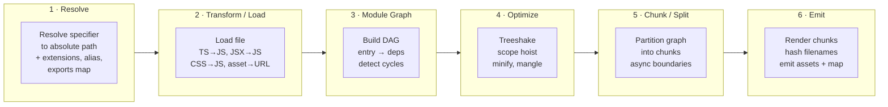
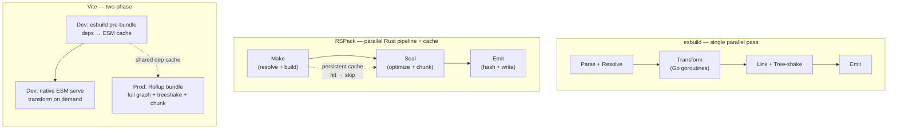
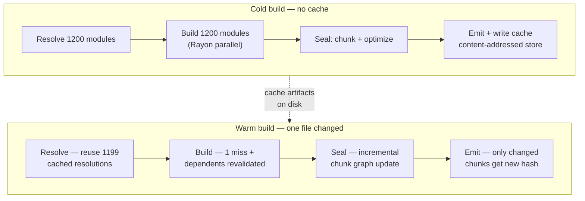
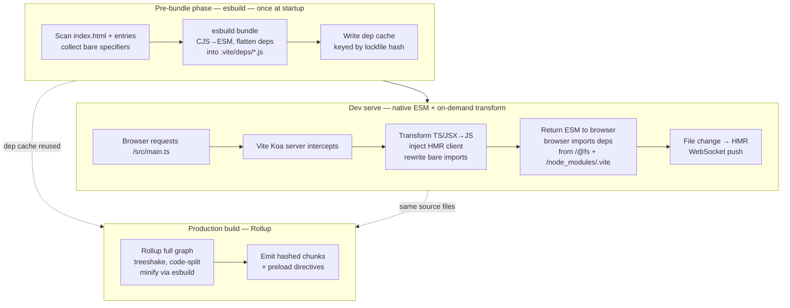
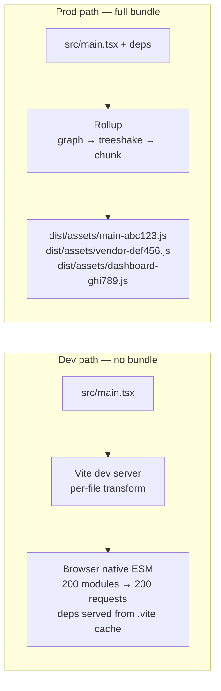
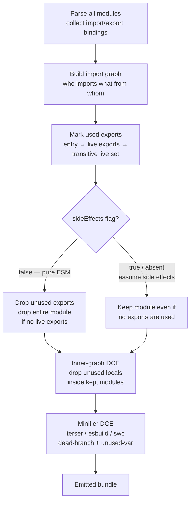
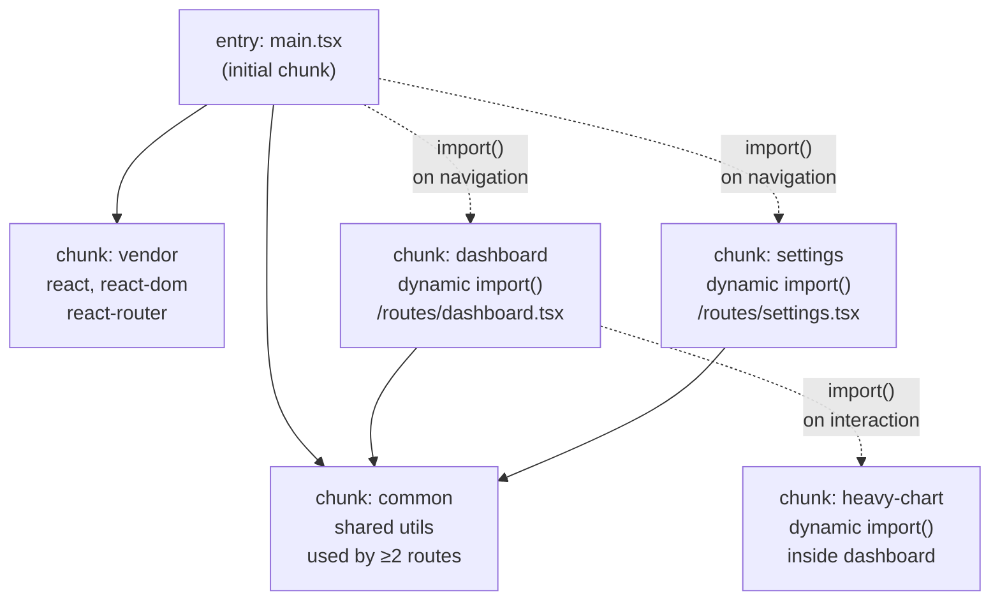
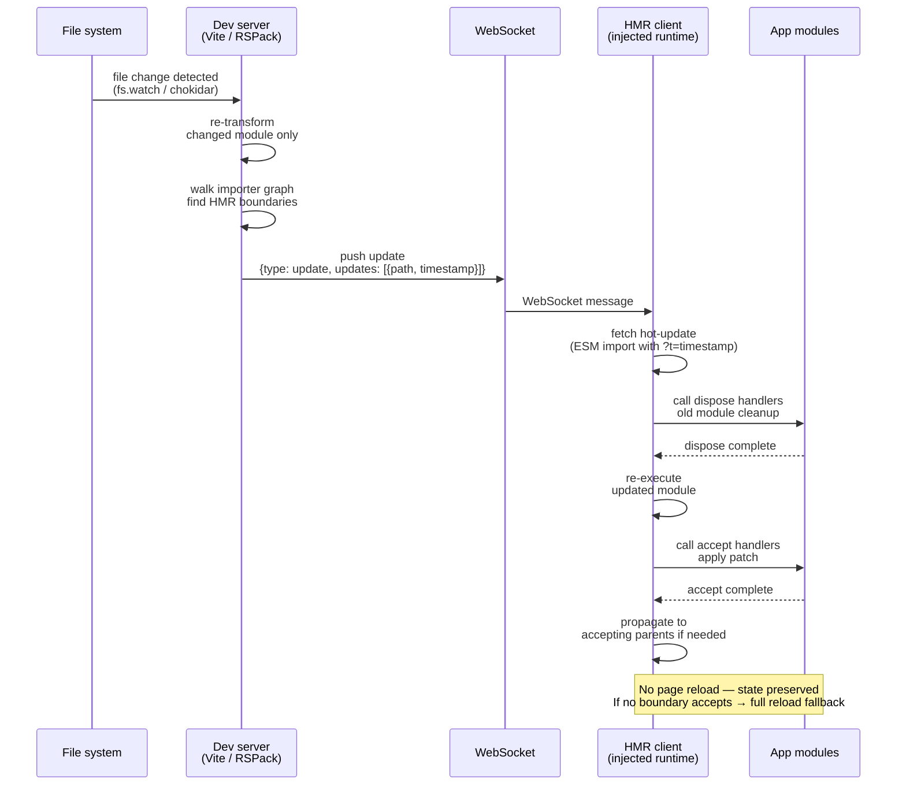

# Chapter 6 — Build Tooling and Bundlers: RSPack, Vite, esbuild

*What this chapter covers:* Why JavaScript needs bundlers at all, and how three modern toolchains solve the problem differently. We dissect the bundler pipeline — resolve, transform, graph, chunk, emit — then go deep on esbuild (Go, parallel, incremental), RSPack (Rust, Webpack-compatible), and Vite (esbuild pre-bundle + Rollup production build). Along the way you will configure each bundler from scratch, trace treeshaking through `sideEffects` and `usedExports`, split a production bundle with `dynamic import()` and `splitChunks`, follow the HMR WebSocket protocol frame-by-frame, and federate two independently deployed apps at runtime.

**Learning goals:**

- Explain why bundlers exist: the gap between authored ESM/CSS/assets and what browsers and CDNs can efficiently deliver.
- Compare the architectures of esbuild, RSPack, and Vite — language choice (Go vs Rust vs JS), parallelism model, caching strategy, and compatibility surface.
- Configure esbuild, RSPack, and Vite for a real project: entry, output, loaders, plugins, and production optimization.
- Trace treeshaking end-to-end: static `import`/`export` analysis, `sideEffects` flag, `usedExports` / `innerGraph`, and why CommonJS defeats it.
- Design code-splitting strategies with dynamic `import()`, `splitChunks`, and `manualChunks`, and read the resulting chunk graph.
- Explain the HMR protocol: WebSocket signaling, ESM hot-update injection, and accept/dispose lifecycle.
- Implement Module Federation between a host and remote: shared scope, version negotiation, and independent deploy semantics.
- Use bundle analyzers and source-map explorers to diagnose bloat, and apply chunk-level caching for long-term CDN stability.

---

## 1. Why Bundlers Exist

Authored code and deliverable code are different artifacts. You write hundreds of ESM files, TypeScript, JSX, CSS modules, SVG imports, and `import` statements that assume a resolver. The browser receives bytes over HTTP. The gap is large enough that shipping authored code directly has never been viable at scale — even now that browsers support native ESM.

### 1.1 The problems a bundler solves

| Authored concern | Deliverable requirement | Bundler job |
|---|---|---|
| Hundreds of small ESM files with bare specifiers (`import { x } from "lodash-es"`) | Few HTTP requests, no bare specifiers (until import maps mature) | Resolve, graph, concatenate |
| TypeScript, JSX, CSS, WASM, SVG, workers | Only JS + CSS the browser can parse | Transform / transpile / load |
| `import "./Button.css"` and `import logo from "./logo.svg"` | CSS extracted or injected; assets hashed and emitted | Asset pipeline |
| One logical app | Cacheable chunks that change independently | Code splitting + content hashing |
| Dead code from large dependencies | Minimal bytes on the wire | Treeshaking / DCE |
| Dev feedback loop | Sub-100 ms HMR | Incremental rebuild + HMR runtime |

An experienced backend engineer will recognize this as a compilation and distribution problem: the bundler is a build system that compiles a dependency graph into deployable artifacts with deterministic hashing, cache invalidation, and incremental rebuild semantics — directly analogous to Bazel or Buck for backend services.

### 1.2 From Browserify to the current landscape

```
Browserify (2011) → Webpack 1-5 (2012-2020) → Parcel / Rollup (2017)
        → esbuild (2020, Go) → Vite (2021, esbuild+Rollup) → RSPack (2023, Rust)
        → Turbopack (2023, Rust) → RSPack / Rsbuild ecosystem (2024+)
```

Webpack proved that *everything is a module* (JS, CSS, images, fonts) and that loaders and plugins could cover any transform. Its cost was speed: a large chunk of Webpack is single-threaded JavaScript, its caching was bolted on late (Webpack 5 persistent cache), and cold builds of 1000+ module apps routinely exceeded 30-60 seconds.

esbuild demonstrated that a bundler written in a systems language with parallelism baked in from day one could be 10-100x faster. Vite showed that native ESM in development could eliminate bundling entirely for the dev server. RSPack proved that Webpack API compatibility did not require Webpack's architecture — reimplementing the plugin/loader surface in Rust with parallel execution and first-class persistent caching.

Today a senior team chooses on three axes: **compatibility** (do existing Webpack plugins need to keep working?), **speed** (cold build, incremental rebuild, HMR latency), and **dev-server model** (bundled vs. native ESM).

---

## 2. The Universal Bundler Pipeline

Every bundler, regardless of language or API, implements the same pipeline. Differences are in *when* stages run, how much is parallelized, and what is cached.



The pipeline executes differently per tool:



Key architectural distinction for backend engineers: esbuild and RSPack are **eager bundlers** — they produce a complete bundle for every mode. Vite in development is a **lazy transformer** — it serves native ESM and transforms files on request, only pre-bundling `node_modules` dependencies that would otherwise trigger hundreds of waterfall requests.

---

## 3. esbuild — Go, Parallelism, and Incremental Builds

### 3.1 Why Go

esbuild's author (Evan Wallace) chose Go for three reasons that map directly to bundler bottlenecks:

1. **Parallelism without data races.** Go's goroutines + channels model lets the parser, resolver, and printer run across all cores with minimal synchronization. JavaScript bundlers in Node are fundamentally single-threaded; worker-thread parallelism requires serialization across the JS/C++ boundary.
2. **Fast startup, no JIT warmup.** Go compiles to a single static binary. No V8 warmup, no `node_modules` resolution to start the tool itself. Cold invocation is single-digit milliseconds.
3. **Cache-friendly memory layout.** The parser and printer are written to minimize allocations and maximize sequential memory access — the same concern that drives high-throughput backend parsers.

Measured on a 1000-module synthetic benchmark, esbuild typically builds in ~0.3s where Webpack 5 takes ~8s and Rollup ~5s. The gap widens on incremental rebuilds because esbuild's in-memory graph is designed for reuse.

### 3.2 Minimal esbuild config

esbuild has two interfaces: a CLI and a JS build API. Production use almost always goes through the JS API so plugins and incremental mode are available.

```javascript
// build.mjs — esbuild production build
import * as esbuild from "esbuild";
import { sassPlugin } from "esbuild-sass-plugin";

const ctx = await esbuild.context({
  entryPoints: ["src/main.tsx"],
  bundle: true,
  outdir: "dist",
  format: "esm",
  platform: "browser",
  target: ["chrome110", "firefox110", "safari16"],
  splitting: true,          // required for ESM code splitting
  sourcemap: true,
  minify: true,
  treeShaking: true,
  metafile: true,           // emit build metadata for analysis
  chunkNames: "chunks/[name]-[hash]",
  assetNames: "assets/[name]-[hash]",
  loader: {
    ".svg": "file",
    ".woff2": "file",
  },
  plugins: [sassPlugin()],
  define: {
    "process.env.NODE_ENV": '"production"',
  },
  // Incremental: keep context alive, rebuild on demand
});

// One-shot build
const result = await ctx.rebuild();
console.log(await esbuild.analyzeMetafile(result.metafile, { verbose: false }));

// Watch mode (long-lived process)
await ctx.watch();

// Serve mode (dev server with SSE-based HMR precursor)
// await ctx.serve({ servedir: "dist", port: 3000 });

await ctx.dispose();
```

Key options for backend engineers to note:

- `splitting: true` only works with `format: "esm"` — esbuild refuses to code-split CJS because CJS `require` is dynamic and cannot be statically partitioned.
- `metafile: true` produces a JSON description of every input, output, and byte contribution — the input to bundle analyzers.
- `esbuild.context()` + `rebuild()` is the incremental API. The module graph stays resident; unchanged files are not re-parsed. This is the foundation of Vite's pre-bundling speed.

### 3.3 Incremental rebuild and parallelism internals

esbuild's parallelism operates at module granularity. Each file's parse + transform is an independent goroutine. The linker phase joins the parsed ASTs, resolves cross-file references, and performs treeshaking. Because Go's scheduler multiplexes goroutines onto OS threads without per-module process overhead, scaling is near-linear up to core count — a 16-core machine roughly halves build time versus 8 cores.

Incremental rebuild (`ctx.rebuild()`) diffs file mtimes/hashes against the in-memory graph and only re-parses changed files and their transitive dependents. For a single-file edit in a 2000-module app, incremental rebuild is typically 20-50 ms — fast enough for HMR without a separate dev server.

```bash
# Metafile analysis output (trimmed)
$ node build.mjs
  dist/main.js              142.3kb  100.0%
   ├ src/main.tsx            2.1kb    1.5%
   ├ src/routes/dashboard.tsx 18.4kb  12.9%
   ├ node_modules/react-dom   42.7kb  30.0%
   └ node_modules/zod         12.1kb   8.5%
  dist/chunks/vendor-ABC123.js  89.2kb
  dist/chunks/dashboard-DEF456.js  24.1kb
```

### 3.4 Limitations

esbuild intentionally omits features that require expensive cross-module type analysis: noTypeScript type checking (use `tsc --noEmit` separately), no CSS code splitting beyond basic extraction, and a plugin API that is powerful but not Webpack-loader compatible. It also does not implement Hot Module Replacement natively — HMR requires a dev-server layer (Vite builds that layer on top).

---

## 4. RSPack — Rust, Webpack Compatibility, and Persistent Caching

### 4.1 Design thesis

RSPack (by ByteDance / WebInfra) reimplements Webpack's core semantics in Rust while preserving the Webpack plugin and loader API. The thesis: teams with large Webpack codebases and custom plugins should not have to rewrite their build to get Rust-class performance. If your build is defined by `webpack.config.js` plus a dozen custom loaders, RSPack should be a near drop-in replacement.

Architecture highlights:

- **Rust core, JS bindings via NAPI-RS.** The hot path (resolve, parse, codegen, chunk graph) runs in Rust. The JS layer exposes `Compiler`, `Compilation`, and `NormalModuleFactory` hooks that match Webpack's Tapable hook system, so existing plugins can run unmodified or with thin shims.
- **Parallel execution by default.** Module building (`make` phase) fans out across a Rayon thread pool. Unlike Webpack's `thread-loader` (which forks workers per loader), RSPack parallelizes the entire build pipeline.
- **Persistent filesystem cache.** Webpack 5 added `cache: { type: "filesystem" }` as an opt-in. RSPack enables persistent caching by default with content-addressed storage and fine-grained invalidation — second cold builds after a small change typically hit >80% cache.

### 4.2 RSPack config (Webpack-compatible)

```javascript
// rspack.config.js
const { defineConfig } = require("@rspack/cli");
const { rspack } = require("@rspack/core");
const { BundleAnalyzerPlugin } = require("webpack-bundle-analyzer");

module.exports = defineConfig({
  entry: { main: "./src/main.tsx" },
  mode: "production", // or "development" / "none"
  target: ["web", "es2022"],
  output: {
    path: __dirname + "/dist",
    filename: "[name].[contenthash:8].js",
    chunkFilename: "chunks/[name].[contenthash:8].js",
    assetModuleFilename: "assets/[name].[contenthash:8][ext]",
    clean: true,
  },
  resolve: {
    extensions: [".ts", ".tsx", ".js", ".jsx", ".json"],
    alias: { "@": __dirname + "/src" },
    // Reads package.json "exports" / "imports" like Webpack 5
  },
  module: {
    rules: [
      {
        test: /\.tsx?$/,
        loader: "builtin:swc-loader", // Rust-native SWC transform, no JS overhead
        options: {
          jsc: { parser: { syntax: "typescript", tsx: true }, target: "es2022" },
        },
      },
      { test: /\.css$/, type: "css/auto" }, // RSPack native CSS handling
      { test: /\.svg$/, type: "asset/resource" },
    ],
  },
  optimization: {
    minimize: true,
    minimizer: [new rspack.SwcJsMinimizerRspackPlugin()],
    splitChunks: {
      chunks: "all",
      cacheGroups: {
        vendor: {
          test: /[\\/]node_modules[\\/]/,
          name: "vendor",
          priority: 10,
          reuseExistingChunk: true,
        },
        common: {
          minChunks: 2,
          priority: 5,
          reuseExistingChunk: true,
        },
      },
    },
    usedExports: true,   // treeshaking: mark unused exports
    sideEffects: true,   // respect package.json sideEffects flag
  },
  experiments: {
    css: true,           // native CSS support (no mini-css-extract-plugin needed)
  },
  cache: true,           // persistent filesystem cache (default in RSPack)
  devtool: "source-map",
  plugins: [
    new rspack.HtmlRspackPlugin({ template: "./index.html" }),
    new BundleAnalyzerPlugin({ analyzerMode: "static", openAnalyzer: false }),
  ],
  devServer: {
    hot: true,
    port: 3000,
  },
});
```

Migration from Webpack is typically mechanical: change `webpack` imports to `@rspack/core`, replace `babel-loader` with `builtin:swc-loader`, and remove `thread-loader` / `cache-loader` (unnecessary — RSPack parallelizes and caches natively). The [RSPack migration guide](https://www.rspack.dev/guide/migration/webpack) tracks remaining incompatibilities; most Webpack 5 plugins work, though plugins that reach into Webpack's internal `Compilation` asset pipeline may need shims.

### 4.3 Caching at scale



The persistent cache stores per-module build results keyed by content hash of the input file plus the hash of loader options and resolver config. Changing a single source file invalidates only that module and modules that transitively import it. In a 1500-module app, a one-line edit typically rebuilds in 200-400 ms on a warm cache — competitive with Vite's ESM HMR for many workloads, with the advantage that production and development use the same bundler.

For distributed CI, RSPack's cache directory (`node_modules/.cache/rspack` by default) can be persisted across CI runs via actions/cache or BuildKit cache mounts. Remote cache sharing across machines is not yet built-in (unlike Turborepo or Bazel), so teams often layer a content-addressed cache on top.

### 4.4 Rsbuild — the higher-level wrapper

Rsbuild is the RSPack team's zero-config framework (analogous to Vite's role over Rollup/esbuild). It wraps RSPack with opinionated defaults for React/Vue, built-in performance budgets, and `create-rsbuild` scaffolding. If RSPack is "Webpack in Rust," Rsbuild is "Vite in Rust." Teams that do not need Webpack plugin compatibility often start with Rsbuild directly.

---

## 5. Vite — esbuild Pre-Bundle, Native ESM Dev, Rollup Production

### 5.1 The two-phase architecture

Vite's central insight: browsers already understand ESM, so the dev server does not need to bundle. Instead, it serves each source file as a native ESM module and lets the browser's import graph drive loading. The only bundling required in dev is for `node_modules` dependencies that are authored as CJS or that would otherwise trigger a waterfall of hundreds of small requests.



This split is why Vite cold start is fast (esbuild pre-bundles ~100 deps in ~300 ms) and HMR is near-instant (only the changed file is re-transformed and pushed over WebSocket). Production still does a full Rollup bundle because native ESM delivery with hundreds of modules is not optimal for HTTP/1.1/2 without bundling, and Rollup's treeshaking and chunking are more mature than esbuild's for production optimization.

### 5.2 Vite config

```javascript
// vite.config.ts
import { defineConfig } from "vite";
import react from "@vitejs/plugin-react";
import { visualizer } from "rollup-plugin-visualizer";

export default defineConfig({
  plugins: [
    react({ jsxImportSource: "react" }), // SWC-based JSX transform
    visualizer({ filename: "dist/stats.html", gzipSize: true }),
  ],
  resolve: {
    alias: { "@": "/src" },
  },
  css: {
    modules: { localsConvention: "camelCase" },
    preprocessorOptions: { scss: { additionalData: `@import "@/styles/vars.scss";` } },
  },
  optimizeDeps: {
    include: ["react", "react-dom", "react-router-dom", "zod"],
    exclude: ["@my-org/native-addon"], // CJS or native deps that break pre-bundle
    esbuildOptions: {
      target: "es2022",
    },
  },
  server: {
    port: 3000,
    hmr: {
      overlay: true, // error overlay in browser
    },
  },
  build: {
    outDir: "dist",
    sourcemap: true,
    target: "es2022",
    minify: "esbuild",          // or "terser" for finer control
    cssCodeSplit: true,
    rollupOptions: {
      output: {
        manualChunks: {
          vendor: ["react", "react-dom", "react-router-dom"],
          ui: ["@radix-ui/react-dialog", "@radix-ui/react-dropdown-menu"],
        },
        chunkFileNames: "assets/[name]-[hash].js",
        entryFileNames: "assets/[name]-[hash].js",
        assetFileNames: "assets/[name]-[hash][extname]",
      },
    },
    chunkSizeWarningLimit: 500, // warn if any chunk exceeds 500 kB
  },
  preview: { port: 4173 },
});
```

Notable details:

- `optimizeDeps.include` forces pre-bundling of deps that Vite's scanner might miss (dynamic imports, deps behind re-exports). `exclude` is used for deps that use Node builtins or native addons that esbuild cannot bundle.
- `build.rollupOptions.output.manualChunks` controls production chunking. Vite delegates this entirely to Rollup — the same `manualChunks` semantics as a raw Rollup config.
- `minify: "esbuild"` uses esbuild's minifier inside Rollup, which is 20-40x faster than Terser with marginally less compression. Switch to `"terser"` only when you need fine-grained mangle options.

### 5.3 Pre-bundle vs. production build

| Concern | Pre-bundle (dev, esbuild) | Production (Rollup) |
|---|---|---|
| Input | `node_modules` deps only | Full app graph (source + deps) |
| Output format | Flattened ESM per dep, cached in `node_modules/.vite` | Hashed chunks, code-split, minified |
| Treeshaking | No (whole dep bundled) | Yes (Rollup `treeshake.moduleSideEffects`) |
| Code splitting | No | Yes (`manualChunks`, dynamic `import()`) |
| HMR | N/A (pre-bundle is static) | N/A (prod is static) |
| Invalidation | Lockfile or dep source changes | Source changes |



The dev/prod split is Vite's main trade-off: dev and prod use different bundlers, so behavior can diverge (e.g., a CJS interop edge case that works in dev via esbuild's CJS→ESM transform but breaks in Rollup's prod build). Vite 6+ narrows this with the experimental `rolldown` (Rollup in Rust) unification, but the two-phase model remains the default.

---

## 6. Treeshaking — Dead Code Elimination at the Module Boundary

Treeshaking is dead code elimination (DCE) that operates on the ESM static import/export graph. The name comes from Rollup's original visualization: shake the dependency tree, dead leaves fall off.

### 6.1 What makes it possible

ESM `import`/`export` is statically analyzable: the set of imported and exported bindings is known without executing the module. This lets the bundler determine which exports are *used* and which are *dead* before any code runs. CommonJS defeats this because `require()` is a runtime call with a dynamic argument, and `module.exports` is a mutable object.

```javascript
// utils.ts — some exports used, some not
export function formatDate(d) { return d.toISOString().slice(0, 10); }
export function formatMoney(n) { return `$${n.toFixed(2)}`; } // ← unused
export function debounce(fn, ms) { /* ... */ }                  // ← unused

// app.ts — only imports one export
import { formatDate } from "./utils.js";
console.log(formatDate(new Date()));
// formatMoney and debounce are dead — treeshaking removes them
```

After treeshaking and minification, the bundle contains only `formatDate`:

```javascript
// bundled output (simplified, minified off for clarity)
function formatDate(d) { return d.toISOString().slice(0, 10); }
console.log(formatDate(new Date()));
```

### 6.2 The treeshaking pipeline



Three layers cooperate:

1. **Module-level treeshaking** (`usedExports` / `providedExports`). The bundler marks which exports of each module are imported by any live module. Unused exports are removed. If a module has no live exports *and* is side-effect-free, the entire module is dropped.

2. **`sideEffects` flag.** Declared in `package.json`, it tells the bundler whether importing a module can have observable side effects beyond its exports.

```json
// package.json — treeshaking hints
{
  "name": "my-ui-lib",
  "sideEffects": false,              // all modules are pure — safe to drop unused
  // or, granular:
  "sideEffects": ["*.css", "./src/polyfill.js"]
}
```

When `sideEffects: false`, `import "my-ui-lib/button"` that is never otherwise used can be dropped entirely. When `true` (the default), the bundler must keep the import because it might run global initialization code. Getting this wrong is a common source of both bloat (flag missing → dead code retained) and bugs (flag set to `false` on a module that does have side effects → needed initialization dropped).

3. **Inner-graph and minifier DCE.** After module-level shaking, RSPack/Rollup's `innerGraph` tracks usage of individual declarations inside a module, and the minifier (Terser/esbuild/SWC) eliminates dead branches, unused variables, and `/* @__PURE__ */`-annotated calls.

```javascript
// innerGraph example — only `used` survives
export const used = expensiveComputation();   // kept — exported and imported
export const unused = expensiveComputation(); // dropped — not imported anywhere
const local = expensiveComputation();         // dropped — never referenced
/* @__PURE__ */ createElement("div");        // dropped if return value unused
```

### 6.3 Why CommonJS defeats treeshaking

```javascript
// cjs-utils.js — CommonJS — NOT treeshakable
exports.formatDate = function(d) { return d.toISOString().slice(0, 10); };
exports.formatMoney = function(n) { return `$${n.toFixed(2)}`; };

// bundler sees: `exports` is a mutable object, properties assigned at runtime
// cannot prove formatMoney is unused without executing the file → must keep all

// esm-utils.js — ESM — treeshakable
export function formatDate(d) { return d.toISOString().slice(0, 10); }
export function formatMoney(n) { return `$${n.toFixed(2)}`; }
// bundler sees: static export list, can prove formatMoney is unused → drops it
```

This is why the ecosystem push toward ESM (`"type": "module"`, `exports` map with `import` condition, dual-package migration) directly affects bundle size. A single CJS dependency in the critical path can prevent treeshaking of its entire subtree.

### 6.4 Verifying treeshaking

```bash
# Rollup / Vite — treeshake report
$ vite build --debug 2>&1 | grep -i "treeshake\|unused"

# RSPack / Webpack — stats with usedExports
$ npx rspack build --json stats.json
$ npx webpack-bundle-analyzer stats.json

# esbuild — metafile inspection
$ node -e "import('./dist/meta.json', {with:{type:'json'}}).then(m=>console.log(Object.keys(m.outputs)))"
```

---

## 7. Code Splitting — Partitioning the Graph into Cacheable Chunks

Code splitting partitions the module graph into multiple chunks that can be loaded on demand and cached independently. Without it, every deploy invalidates a single monolithic bundle and every user downloads code for routes they never visit.

### 7.1 Chunk graph



Solid edges are **initial chunks** loaded with the HTML. Dashed edges are **async chunks** loaded via `import()` at runtime. The browser fetches async chunks only when the import is executed — typically on route navigation or user interaction.

### 7.2 Dynamic `import()`

The primitive behind all code splitting is the dynamic `import()` expression. Unlike static `import`, it is asynchronous, returns a Promise, and creates a split point in the chunk graph.

```javascript
// Static import — always in the initial chunk
import { Dashboard } from "./routes/dashboard.js";

// Dynamic import — creates an async chunk boundary
const Dashboard = React.lazy(() => import("./routes/dashboard.js"));

// With React Router — route-level splitting
import { createBrowserRouter } from "react-router-dom";

const router = createBrowserRouter([
  { path: "/", element: <Home /> },
  {
    path: "/dashboard",
    lazy: () => import("./routes/dashboard.js"), // async chunk
  },
  {
    path: "/settings",
    lazy: () => import("./routes/settings.js"),  // async chunk
  },
]);

// Manual dynamic import with preload hint
const loadChart = () => import("./components/HeavyChart.js");
// Vite/RSPack inject <link rel="modulepreload"> for known async chunks
```

At runtime, the bundler's chunk loader (a small runtime injected into the entry chunk) fetches async chunks via `import()` (ESM) or JSONP/script-tag (legacy). Vite and RSPack both emit `<link rel="modulepreload">` for async chunks discovered during build, so the browser can start fetching them before the `import()` executes.

### 7.3 `splitChunks` / `manualChunks` strategies

Beyond `import()`-driven splitting, bundlers can automatically extract shared modules into common chunks. The configuration differs per tool but the semantics are the same: define cache groups with tests and priorities.

```javascript
// RSPack / Webpack — splitChunks
optimization: {
  splitChunks: {
    chunks: "all",            // initial + async
    minSize: 20000,            // only split if chunk would be ≥20 kB
    maxAsyncRequests: 30,      // limit parallel async fetches
    maxInitialRequests: 30,
    cacheGroups: {
      vendor: {
        test: /[\\/]node_modules[\\/]/,
        name: "vendor",
        priority: 10,
        reuseExistingChunk: true,
        enforce: true,
      },
      react: {
        test: /[\\/]node_modules[\\/](react|react-dom|scheduler)[\\/]/,
        name: "react",
        priority: 20,          // higher priority → matched first
      },
      common: {
        minChunks: 2,          // shared by ≥2 chunks → extract
        priority: 5,
        reuseExistingChunk: true,
      },
    },
  },
}
```

```javascript
// Vite / Rollup — manualChunks
// vite.config.ts → build.rollupOptions.output.manualChunks
manualChunks(id) {
  if (id.includes("node_modules")) {
    if (id.includes("react") || id.includes("scheduler")) return "react";
    if (id.includes("zod") || id.includes("valibot")) return "validation";
    return "vendor"; // all other deps
  }
  if (id.includes("src/components/charts")) return "charts";
},
// Or object form for simple grouping:
// manualChunks: { vendor: ["react", "react-dom"], charts: ["recharts", "d3"] }
```

```javascript
// esbuild — manual code splitting via entryPoints as object
// esbuild does not have splitChunks; use multiple entry points or dynamic import only
await esbuild.build({
  entryPoints: { main: "src/main.tsx", dashboard: "src/routes/dashboard.tsx" },
  bundle: true,
  splitting: true,
  format: "esm",
  outdir: "dist",
});
```

**Trade-offs for backend engineers:**

- **Too many chunks** → waterfall of HTTP requests, especially on high-latency mobile networks. `maxAsyncRequests` and `minSize` prevent fragmentation into dozens of tiny chunks.
- **Too few chunks** → cache invalidation granularity suffers. Changing one route invalidates the shared vendor chunk if it is not split independently.
- **Content hashing** (`[contenthash]`) ensures that unchanged chunks keep their filename and CDN cache entry across deploys. Only chunks whose content changed get a new hash. This is the same content-addressed caching principle behind Docker layer caching.

### 7.4 Bundle analyzer output

After building, inspect the chunk graph with a visual analyzer. All three bundlers produce compatible stats.

```bash
# Vite — rollup-plugin-visualizer emits dist/stats.html
$ vite build
  dist/assets/main-a1b2c3d4.js         42.1 kB │ gzip: 12.4 kB
  dist/assets/vendor-e5f6g7h8.js       89.7 kB │ gzip: 28.1 kB
  dist/assets/dashboard-i9j0k1l2.js    24.3 kB │ gzip:  7.2 kB
  dist/assets/settings-m3n4o5p6.js     18.9 kB │ gzip:  5.8 kB

# RSPack / Webpack — webpack-bundle-analyzer
$ npx rspack build --json stats.json
$ npx webpack-bundle-analyzer stats.json dist
  → opens treemap: vendor 89.7 kB (31%), main 42.1 kB (15%), dashboard 24.3 kB ...

# esbuild — esbuild --analyze or metafile
$ npx esbuild --bundle src/main.tsx --metafile=meta.json --analyze
  src/main.tsx ──────────── 2.1 kB
  react-dom ─────────────── 42.7 kB  ██████████████
  zod ───────────────────── 12.1 kB  ████
```

The analyzer treemap is the primary tool for finding bloat: a single large dependency (e.g., `moment` at 65 kB minified, `lodash` at 72 kB) often dominates the vendor chunk. Replacing it with a modular alternative (`date-fns` with per-function imports, `lodash-es` with treeshaking) or moving it to an async chunk are the standard fixes.

---

## 8. Hot Module Replacement — The HMR Protocol

HMR updates modules in a running application without a full page reload, preserving application state (form inputs, scroll position, in-memory caches). It is a development-only feature — production builds never include the HMR runtime.

### 8.1 HMR update flow



### 8.2 WebSocket message flow (Vite)

Vite's dev server (Koa-based) maintains a WebSocket connection to each browser tab. The protocol is JSON over WebSocket, with a small set of message types.

```javascript
// Server → Client: HMR update payload (Vite)
{
  "type": "update",
  "updates": [
    {
      "type": "js-update",
      "path": "/src/components/Button.tsx",
      "acceptedPath": "/src/components/Button.tsx",
      "timestamp": 1713700000123
    }
  ]
}

// Server → Client: full reload (no HMR boundary found)
{ "type": "full-reload", "path": "*" }

// Server → Client: error overlay
{
  "type": "error",
  "err": {
    "message": "Transform failed: Unexpected token",
    "frame": "  12 |   return <Button\n             ^",
    "stack": "..."
  }
}

// Client → Server: connected (on page load)
{ "type": "connected" }

// Client → Server: ping/pong keepalive
{ "type": "ping" }
```

```javascript
// RSPack / Webpack HMR — similar but uses JSONP-style hot-update chunks
// Server pushes manifest via WebSocket (webpack-dev-server) or SSE
{
  "type": "hash",
  "data": "a1b2c3d4e5f6"  // new compilation hash
}
{
  "type": "ok"             // or "warnings" / "errors"
}
// Client then fetches hot-update chunk: main.a1b2c3d4.hot-update.json + .js
```

### 8.3 The `import.meta.hot` API

Application code opts into HMR by calling the HMR API. Without it, a file change triggers a full reload or propagation to the nearest accepting parent.

```javascript
// Button.tsx — HMR-aware module (Vite / RSPack both support import.meta.hot)
import { createStore } from "./store.js";

const store = createStore();

// Accept updates to this module — re-execute without reloading parents
if (import.meta.hot) {
  // Called when this module is about to be replaced
  import.meta.hot.dispose((data) => {
    // Preserve state across replacement
    data.storeState = store.getState();
  });

  // Called after the new version is executed
  import.meta.hot.accept((newModule) => {
    if (newModule) {
      // Optionally handle the new module's exports
      console.log("[HMR] Button updated");
    }
  });

  // Accept updates to a specific dependency only
  import.meta.hot.accept("./store.js", (newStore) => {
    console.log("[HMR] store updated, re-binding");
  });

  // Invalidate — force full reload when this module changes
  // import.meta.hot.invalidate();
}

// Framework HMR (React Fast Refresh, Vue HMR) builds on this primitive:
// the framework plugin wraps each component with accept logic that
// re-renders without unmounting state.
```

```javascript
// RSPack / Webpack equivalent — module.hot (legacy API, still supported)
if (module.hot) {
  module.hot.accept("./store.js", () => {
    console.log("[HMR] store updated");
  });
  module.hot.dispose((data) => {
    data.state = store.getState();
  });
}
// Vite and RSPack both support import.meta.hot; prefer it for new code.
```

### 8.4 HMR failure modes

| Failure | Cause | Visible effect |
|---|---|---|
| No HMR boundary accepts | Changed file has no `accept` call and no parent accepts | Full page reload (state lost) |
| Stale closure over old module | `accept` handler captures old export reference | App uses old code despite HMR success log |
| CSS HMR inject fails | CSS extraction in dev (e.g., `mini-css-extract-plugin`) | Styles flash or require reload |
| WebSocket disconnected | Proxy strips `Upgrade: websocket` header (common behind Nginx without `proxy_set_header Upgrade`) | No HMR, manual refresh required |
| ESM cache poisoning | Browser caches `?t=timestamp` incorrectly (service worker) | Old code served after HMR push |

The WebSocket proxy issue is the most common operational failure. Any reverse proxy in front of the dev server must forward WebSocket upgrades:

```nginx
# Nginx — required for Vite / RSPack HMR behind a proxy
location / {
    proxy_pass http://vite-dev:3000;
    proxy_http_version 1.1;
    proxy_set_header Upgrade $http_upgrade;
    proxy_set_header Connection "upgrade";
    proxy_set_header Host $host;
}
```

---

## 9. Module Federation — Runtime Composition of Independently Deployed Apps

Module Federation (introduced in Webpack 5, reimplemented in RSPack as `ModuleFederationPlugin`) allows separately built and deployed applications to share code at runtime. A **host** application dynamically loads modules exposed by one or more **remote** applications, with shared dependencies deduplicated via a version-negotiated shared scope.

This is the bundler-level primitive behind micro-frontends. For backend engineers, the analogy is service composition at the UI layer: each team deploys its app independently, and the shell composes them at runtime without a monolithic build.

### 9.1 Host / remote handshake


### 9.2 RSPack Module Federation config

```javascript
// Remote — team-a/rspack.config.js — exposes a Widget
const { ModuleFederationPlugin } = require("@rspack/core").container;

module.exports = {
  entry: { main: "./src/index.ts" },
  output: { publicPath: "http://localhost:3001/", uniqueName: "teamA" },
  plugins: [
    new ModuleFederationPlugin({
      name: "teamA",
      filename: "remoteEntry.js",          // manifest + loader, fetched by host
      exposes: {
        "./Widget": "./src/Widget.tsx",     // host imports as "teamA/Widget"
        "./utils": "./src/utils.ts",
      },
      shared: {
        react: { singleton: true, requiredVersion: "^18.0.0", eager: false },
        "react-dom": { singleton: true, requiredVersion: "^18.0.0" },
        "react-router-dom": { singleton: true, requiredVersion: "^6.0.0" },
      },
    }),
  ],
};
```

```javascript
// Host — shell/rspack.config.js — consumes the remote
const { ModuleFederationPlugin } = require("@rspack/core").container;

module.exports = {
  entry: { main: "./src/index.tsx" },
  output: { publicPath: "http://localhost:3000/", uniqueName: "shell" },
  plugins: [
    new ModuleFederationPlugin({
      name: "shell",
      remotes: {
        teamA: "teamA@http://localhost:3001/remoteEntry.js",
        teamB: "teamB@http://localhost:3002/remoteEntry.js",
      },
      shared: {
        react: { singleton: true, requiredVersion: "^18.0.0" },
        "react-dom": { singleton: true, requiredVersion: "^18.0.0" },
      },
    }),
  ],
};
```

```javascript
// Host runtime — dynamic import of a federated module
import React, { Suspense, lazy } from "react";

// Static federated import (resolved via remoteEntry at build time)
import { Widget } from "teamA/Widget";

// Lazy federated import — remote chunk loaded on demand
const TeamBApp = lazy(() => import("teamB/App"));

export function Shell() {
  return (
    <div>
      <h1>Shell</h1>
      <Widget />
      <Suspense fallback={<div>Loading Team B...</div>}>
        <TeamBApp />
      </Suspense>
    </div>
  );
}
```

```javascript
// Dynamic remote at runtime — no build-time coupling
// Useful when remote URL is determined by config / feature flag
async function loadRemoteWidget(url, scope, module) {
  // Vite equivalent: use @originjs/vite-plugin-federation
  await __webpack_init_sharing__("default");
  const container = window[scope];
  await container.init(__webpack_share_scopes__.default);
  const factory = await container.get(module);
  return factory();
}
```

### 9.3 Shared scope and version negotiation

The `shared` config controls how dependencies are deduplicated. The runtime negotiates versions using semver:

| Config | Meaning |
|---|---|
| `singleton: true` | Only one copy may exist. If host and remote disagree on version, the highest compatible version wins and the other reuses it. If no compatible version exists, the remote falls back to its own copy (duplicate — detectable via `window` inspection). |
| `requiredVersion: "^18.0.0"` | Semver range this build requires. Negotiation fails (duplicate loaded) if no shared copy satisfies the range. |
| `eager: true` | Include the shared dep in the initial chunk (no async loading). Use for deps needed before remote resolution. |
| `strictVersion: true` | Fail hard if version mismatch (throw instead of duplicating). Use in CI to catch drift. |

For backend engineers, the analogy is dependency convergence in Maven/Gradle: the shared scope is a runtime dependency mediation that picks one version of a singleton (React, singleton stores) to ensure identity — `instanceof`, context providers, and hook dispatchers must reference the same copy.

### 9.4 Operational concerns

- **Independent deploys.** Host and remote deploy on separate pipelines. The host fetches `remoteEntry.js` at runtime, so a remote deploy is live immediately without rebuilding the host. This decouples team velocity but requires backward-compatible remote interfaces — the same contract discipline as versioned gRPC services.
- **Rollback.** Rolling back a remote is independent of the host. Rolling back the host does not roll back remotes. Incident response must account for this split.
- **Observability.** Each federated chunk should emit its own source maps and be tagged with its build version. Error tracking (Sentry, Datadog RUM) must map stack frames to the correct remote's source map, not just the host's.
- **Security.** `remoteEntry.js` is arbitrary JavaScript executed in the host's origin. A compromised remote is XSS against the host. Treat remote URLs as trust boundaries — pin with SRI (`integrity` attribute) or serve all remotes from the same trusted CDN with the same CSP.

---

## 10. Bundle Analysis, Source Maps, and Long-Term Caching

### 10.1 Analyzing the bundle

All three bundlers can emit a stats/metafile that visualizers consume. The workflow is identical regardless of tool:

```bash
# Vite — visualizer plugin (rollup-plugin-visualizer)
# vite.config.ts already configured above → vite build emits dist/stats.html
$ vite build
$ open dist/stats.html  # treemap + sunburst + network waterfall

# RSPack / Webpack — webpack-bundle-analyzer
$ npx rspack build --json stats.json
$ npx webpack-bundle-analyzer stats.json --mode static --report dist/report.html

# esbuild — metafile + esbuild-visualizer
$ npx esbuild src/main.tsx --bundle --metafile=meta.json --outfile=dist/main.js
$ npx esbuild-visualizer --metafile meta.json --output dist/report.html

# Source-map explorer — maps bundled bytes back to original files
$ npx source-map-explorer "dist/**/*.js" --html dist/sourcemap.html
```

What to look for in the treemap: a single large rectangle is a candidate for code splitting or replacement. Common offenders and fixes:

| Bloat source | Fix |
|---|---|
| `moment` (65 kB) imported wholesale | Replace with `date-fns` per-function imports or `dayjs` |
| `lodash` (72 kB) via `import _ from "lodash"` | Use `lodash-es` + treeshaking or `import pick from "lodash/pick"` |
| `core-js` polyfills for every feature | Scope via `browserslist` / `target: es2022` + `useBuiltIns: "usage"` |
| Duplicate `react` (Module Federation misconfig) | Check `shared.singleton: true` and semver alignment |
| Large inline SVG / image assets | Switch to `type: "asset"` with threshold (RSPack) or `assetsInlineLimit` (Vite) |

### 10.2 Long-term caching and content hashing

Production filenames include a content hash so CDNs and browsers can cache indefinitely (`Cache-Control: public, max-age=31536000, immutable`). Only chunks whose content changed get a new filename after a deploy.

```javascript
// RSPack / Vite — hashed filenames
output: {
  filename: "[name].[contenthash:8].js",       // main.a1b2c3d4.js
  chunkFilename: "chunks/[name].[contenthash:8].js",
}
// Vite equivalent in build.rollupOptions.output:
chunkFileNames: "assets/[name]-[hash].js",
entryFileNames: "assets/[name]-[hash].js",
```

The hash is computed over the chunk's rendered content, not the source file's content. Two invariants matter:

1. **Deterministic hashing.** The same source + same bundler version + same config must produce the same hash. Non-deterministic chunk ordering or timestamp injection breaks CDN caching. All three bundlers guarantee this when `mode: "production"` with stable options.
2. **Minimal invalidation.** Changing one route's async chunk should not change the vendor chunk's hash. This requires `splitChunks` / `manualChunks` to isolate vendor code and `optimization.moduleIds: "deterministic"` (RSPack/Webpack) to avoid numeric module IDs that shift when any module is added.

```bash
# Verify hash stability — build twice, compare
$ vite build && sha256sum dist/assets/vendor-*.js > /tmp/hash1
$ vite build && sha256sum dist/assets/vendor-*.js > /tmp/hash2
$ diff /tmp/hash1 /tmp/hash2 && echo "deterministic ✓"
```

---

## 11. Choosing a Bundler — Decision Framework

| Criterion | esbuild | RSPack / Rsbuild | Vite (+ Rollup) |
|---|---|---|---|
| **Language / parallelism** | Go, goroutine-per-file | Rust, Rayon thread pool | JS (dev: esbuild + Koa; prod: Rollup) |
| **Cold build (1000 modules)** | ~0.3 s | ~0.8 s | ~3 s (Rollup prod) |
| **Incremental HMR** | ~20 ms (ctx.rebuild) | ~200 ms (warm cache) | ~30 ms (native ESM) |
| **Webpack compat** | None | High — loaders + plugins | None (Rollup plugins) |
| **Dev model** | Bundled | Bundled | Native ESM (unbundled) |
| **CSS handling** | Basic (CSS in JS or extract) | Native `type: css` | Native + PostCSS + modules |
| **Code splitting** | ESM only, no splitChunks | Full splitChunks + manualChunks | Rollup manualChunks |
| **HMR** | No built-in runtime | Webpack-style HMR | ESM HMR via WebSocket |
| **Module Federation** | No | Yes (Webpack API) | Via plugin (`@originjs/vite-plugin-federation`) |
| **Best for** | Libraries, CLIs, SSR bundles, Vite's engine | Large Webpack migrations, micro-frontends | Greenfield SPAs, fast dev loop |

Rule of thumb for senior teams:

- **Migrating a large Webpack app** with custom loaders/plugins → RSPack. Keep the config, gain Rust speed and caching. Evaluate Rsbuild if you can drop Webpack compat.
- **Greenfield SPA** where dev speed matters most → Vite. Fastest HMR, best DX, broad plugin ecosystem. Accept the dev/prod bundler split.
- **Building a library, CLI, or SSR bundle** where a single fast bundle is needed without dev-server complexity → esbuild directly. Minimal config, fastest cold build, easy to embed in a larger build system.
- **Micro-frontends with independent deploys** → RSPack Module Federation. Vite federation exists but is plugin-based and less battle-tested at scale.

---

## 12. Distributed-Systems Lens — Bundlers at Fleet Scale

A bundler is a local build tool, but its outputs and caching behavior have distributed-systems consequences when multiplied across many services, teams, and CI pipelines.

**Monorepo and many-repo builds.** In a monorepo with 50 frontend packages (common in platform teams), a single bundler invocation per package is wasteful. Tools like Turborepo, Nx, and Bazel add a task graph on top of the bundler: they cache task outputs (including bundler emits) by input hash and share the cache across CI runners. RSPack's persistent cache and Vite's pre-bundle cache both benefit from being stored in this layer — a CI job that hits the remote cache may skip bundling entirely.

**CI cache sharing.** Without remote caching, every CI runner cold-builds every app on every PR. With a content-addressed remote cache (BuildKit, Turborepo Remote Cache, Bazel Remote Execution), the bundler's cache directory becomes a cacheable artifact. Key the cache on lockfile hash + bundler config hash + source content hash. Invalidate surgically — the same principle as Docker layer caching.

**Deploy and CDN interaction.** Hashed chunk filenames are the contract between the bundler and the CDN. A deploy uploads new hashed chunks alongside old ones (never overwrite — old HTML may still reference old hashes). Old chunks are garbage-collected after the CDN TTL plus a safety margin. This is a distributed cache invalidation problem: the HTML is the manifest, chunks are immutable blobs, and the CDN is an eventually consistent cache. Getting it wrong (overwriting a chunk in place) causes users with old HTML to fetch a chunk whose content no longer matches the hash — a hard-to-diagnose white-screen error.

**Module Federation as distributed composition.** Federation moves composition from build time to runtime — the host and remotes are independently deployed services composed in the browser. This mirrors the backend shift from monolith to microservices, with the same trade-offs: independent deploy velocity vs. runtime coupling, version negotiation vs. API versioning, and the need for contract testing between host and remote interfaces. Treat federated module boundaries with the same rigor as service boundaries: versioned contracts, backward compatibility, and canary deploys.

**Reproducibility.** For supply-chain security (SLSA, see Book 4, Chapter 3), builds should be reproducible: the same inputs produce byte-identical outputs. Bundler reproducibility requires pinning the bundler version, locking `browserslist` targets, and ensuring no non-deterministic ordering (e.g., `Object.keys` iteration order in chunk assignment). Verify with a double-build hash check in CI.

---

## Key takeaways

- Bundlers bridge the gap between authored ESM/CSS/assets and efficiently deliverable artifacts — they resolve, transform, graph, treeshake, chunk, and emit with content hashing.
- esbuild (Go) is the fastest single-pass bundler, parallelized per-module via goroutines, with an incremental `context` API that makes sub-50 ms rebuilds possible; it has no native HMR runtime.
- RSPack (Rust) reimplements Webpack's semantics with Rayon parallelism and persistent caching, preserving loader/plugin compatibility for large Webpack migrations while delivering 5-10x faster builds.
- Vite splits the problem: esbuild pre-bundles `node_modules` once at startup, serves source as native ESM in dev (no bundle), and delegates production to Rollup for mature treeshaking and chunking.
- Treeshaking depends on static ESM `import`/`export`; it operates in three layers — module-level `usedExports`, `sideEffects` flag, and inner-graph/minifier DCE — and is defeated by CommonJS.
- Code splitting via dynamic `import()` plus `splitChunks`/`manualChunks` partitions the graph into cacheable chunks; content hashing (`[contenthash]`) ensures CDN stability with minimal invalidation.
- HMR is a WebSocket protocol: the dev server pushes an update manifest, the HMR client fetches the hot-update, and `import.meta.hot.accept`/`dispose` handlers patch the running app without a full reload.
- Module Federation enables runtime composition of independently deployed apps via a host/remote handshake and shared-scope version negotiation — singleton sharing ensures one copy of React and other singletons.
- Bundle analyzers (`rollup-plugin-visualizer`, `webpack-bundle-analyzer`, `source-map-explorer`) map bytes to source modules; use them to find bloat and validate treeshaking.
- At fleet scale, bundler caching (persistent filesystem cache, pre-bundle cache, Turborepo/Nx remote cache) and hashed-chunk CDN semantics are distributed caching problems with the same invalidation discipline as backend artifact distribution.

---

## Further reading

- esbuild documentation — Architecture and API: https://esbuild.github.io/ — Start with "Architecture" and "API" for the Go parallelism model and incremental build semantics.
- RSPack documentation — Guide and Migration: https://www.rspack.dev/guide/ — Covers Webpack compatibility, caching, and Module Federation; see "Guide / Migration / From Webpack" for drop-in steps.
- Rsbuild documentation: https://rsbuild.dev/ — Higher-level RSPack wrapper; see "Guide / Performance / Build Performance" for caching and profiling.
- Vite documentation — Features and Build: https://vitejs.dev/guide/features.html and https://vitejs.dev/guide/build.html — Pre-bundling, HMR, and Rollup production build; see "Guide / Why Vite" for the native-ESM rationale.
- Rollup documentation — Treeshaking and Code Splitting: https://rollupjs.org/configuration-options/#treeshake and https://rollupjs.org/configuration-options/#output-manualchunks
- Webpack Module Federation — Concepts: https://webpack.js.org/concepts/module-federation/ — The original design that RSPack reimplements; explains `exposes`, `remotes`, and `shared` semantics.
- RSPack Module Federation: https://www.rspack.dev/guide/features/module-federation
- SurviveJS — Webpack 5 and Module Federation (Artem Sapegin, Tobias Koppers): https://survivejs.com/ — Historical context on why federation was needed and how it replaced earlier `externals` + `DllPlugin` patterns.
- Google — Native ESM in production (Web Fundamentals): https://web.dev/articles/es-modules — When native ESM delivery without bundling is viable and when it is not.
- SLSA Framework — Build provenance and reproducibility: https://slsa.dev/spec/v1.0/ — For connecting bundler reproducibility to supply-chain security (see Book 4, Chapter 3).

