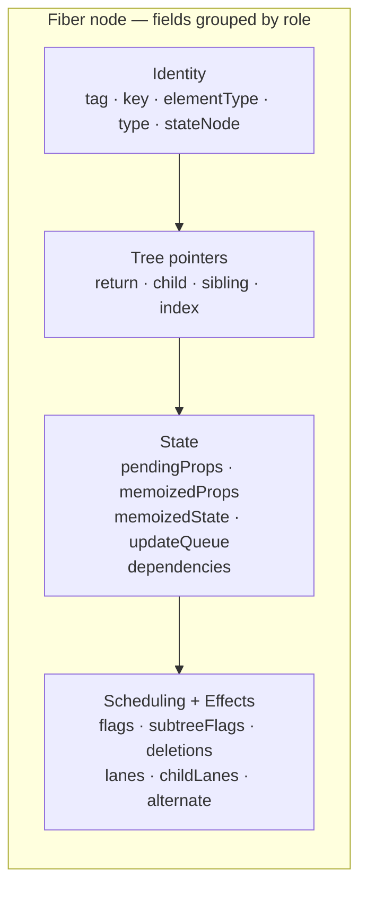
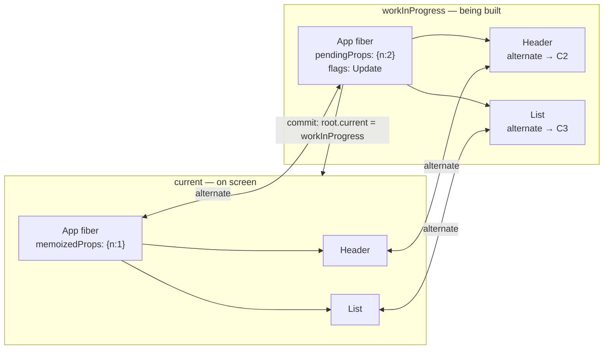
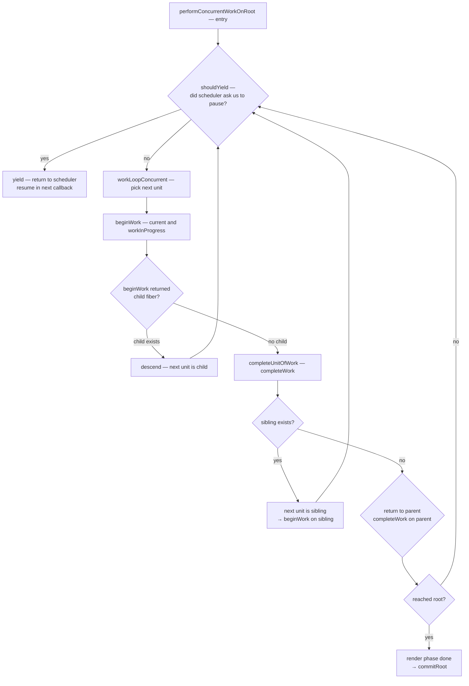
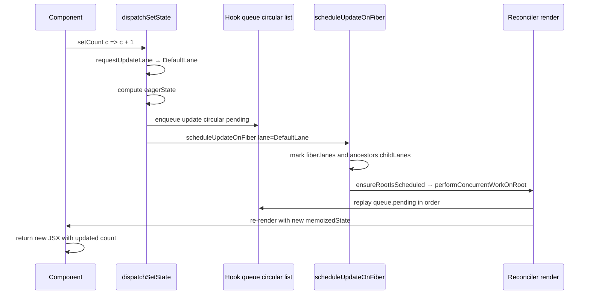
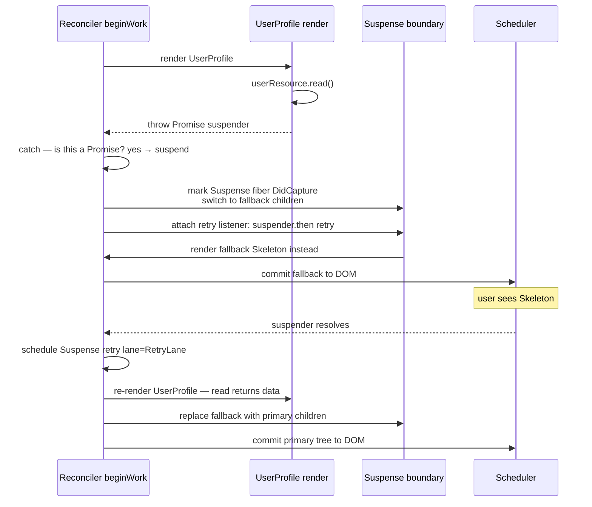
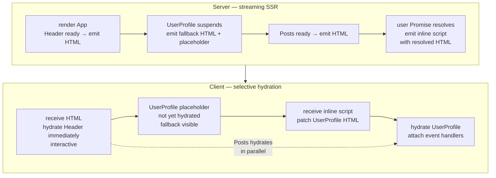
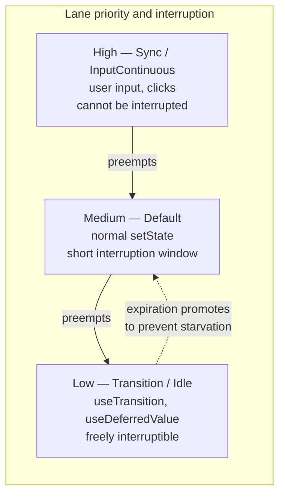

# Chapter 7 — React Internals: The Fiber Reconciler, Hooks, Suspense, and Concurrent Features

*What this chapter covers:* The machinery underneath `React.createElement` and `useState`. We open the Fiber reconciler — every field on a fiber node, the double-buffered `current`/`workInProgress` trees, the lane-based priority model — and follow a render from scheduling through `beginWork`/`completeWork` diffing to commit. We then explain Hooks as a call-order-indexed linked list (and why the Rules of Hooks are not stylistic advice but a correctness invariant), dissect `useEffect`'s mount/update/unmount lifecycle, trace Suspense's throw-Promise control flow including selective hydration and cache, and finally build an intuition for concurrent rendering via `useTransition`, `useDeferredValue`, and `startTransition`. Every mechanism is framed through the lens a backend engineer already has: fiber as a unit of work in a cooperative scheduler, lanes as priority queues, Suspense as a circuit breaker, and hydration as consistent replication.

**Learning goals:**

- Explain the Fiber node layout — `tag`, `key`, `type`, `stateNode`, `child`/`sibling`/`return`, `pendingProps`/`memoizedProps`, `memoizedState`, `updateQueue`, `flags`/`subtreeFlags`, `lanes`/`childLanes`, `alternate` — and what the reconciler reads from each field.
- Describe double buffering: how `current` and `workInProgress` trees relate via `alternate`, why React mutates only the work-in-progress tree, and when the trees are swapped at commit.
- Explain the lane model — bitmask lanes as concurrent priority queues — and how React maps event types to lanes, merges lanes, and starves or entangles them.
- Follow the reconciler loop: `scheduleUpdateOnFiber` → `ensureRootIsScheduled` → `performConcurrentWorkOnRoot` → depth-first `beginWork`/`completeWork` walk, keyed vs. unkeyed child reconciliation, and flag bubbling via `subtreeFlags`.
- Trace Hook dispatch end-to-end: `dispatchSetState` → `enqueueUpdate` → `scheduleUpdateOnFiber`, and contrast `useState`/`useReducer` update queues with `useEffect`'s three-phase lifecycle.
- Justify the Rules of Hooks from the call-order array invariant, with a concrete failure trace when a Hook is called conditionally.
- Explain Suspense's throw-Promise protocol, fallback rendering, selective hydration on the server, and the `cache`/`fetch` integration that makes Suspense data-fetching work.
- Compare Suspense waterfall vs. parallel fetch patterns and show how to collapse waterfalls with concurrent preloading.
- Use concurrent features — `startTransition`, `useTransition`, `useDeferredValue`, and concurrent rendering — correctly, including lane downgrading and interruptible renders.
- Analyze React's client-side engine as a distributed system: cooperative scheduling, priority inversion, replication (hydration), and eventual consistency between server HTML and client state.

---

## 1. Why a Reconciler Exists

React's public API promises a pure function from state to UI: `UI = f(state)`. The reconciler is the engine that makes that equation performant. Without it, every state change would destroy and recreate the entire DOM — correct but unusable beyond a todo list.

Two constraints forced the current architecture:

1. **The main thread is shared.** JavaScript execution, layout, paint, and input handling contend on a single thread (see Chapter 2 — Event Loop). A synchronous recursive tree walk that blocks for 200 ms drops frames and makes typing feel broken.

2. **The declaration is not the diff.** JSX describes the desired tree, not the minimal DOM mutation. The reconciler must compare the new description against the previous output and emit the smallest set of insertions, moves, updates, and deletions.

React's answer is **Fiber**: a reimplementation of the reconciler (landed in React 16, refined continuously through React 18 and 19) that turns the component tree into an interruptible, priority-aware work queue.

Backend analogy: if the old stack reconciler was a batch job that ran to completion on a single machine, Fiber is a cooperative scheduler with preemption, priority queues, and incremental checkpointing — closer to a work-stealing executor than a simple recursive function.

### 1.1 What Fiber replaced

| Concern | Stack reconciler (pre-16) | Fiber reconciler (16+) |
|---|---|---|
| Data structure | Call stack — recursion depth equals tree depth | Heap-allocated fiber nodes linked via `child`/`sibling`/`return` |
| Interruptibility | None — `render()` ran synchronously to completion | Yes — work is chunked into units, yields to browser via scheduler |
| Priority | None — every update is equally urgent | Lanes — discrete priority bitmasks per update |
| Error handling | Unwind the call stack, unrecoverable | Error boundaries as fiber nodes with `DidCapture` flag |
| Suspense / concurrency | Not possible — requires suspension mid-tree | Throw-Promise protocol + offscreen fibers + lane downgrading |

---

## 2. The Fiber Node — React's Unit of Work

A **fiber** is a JavaScript object that represents one unit of work: a component instance, a DOM node, or a bookkeeping node (root, fragment, suspense boundary, offscreen). The tree of fibers *is* the reconciler's state. You can inspect it at runtime via `__REACT_DEVTOOLS_GLOBAL_HOOK__` or by logging `fiber` inside a custom reconciler.

### 2.1 Fiber node layout

Every fiber carries the same shape (simplified from `ReactFiber.js` in the React source). The fields below are not implementation trivia — each one is read on every render path.

```typescript
// Simplified fiber shape — mirrors ReactFiber.js (React 18/19)
type Fiber = {
  // Identity
  tag: WorkTag;              // FunctionComponent | ClassComponent | HostComponent | SuspenseComponent ...
  key: string | null;        // reconciler key — stable identity across renders
  elementType: any;          // type from JSX before resolution (e.g., MyComponent)
  type: any;                 // resolved type after resolution
  stateNode: any;            // instance: DOM node, class instance, or fiber root

  // Tree structure — singly-linked tree, not a nested object
  return: Fiber | null;      // parent
  child: Fiber | null;       // first child
  sibling: Fiber | null;     // next sibling
  index: number;             // position among siblings

  // Props and state
  pendingProps: any;         // props for the upcoming render
  memoizedProps: any;        // props from the last committed render
  memoizedState: any;        // hooks linked list head, or class state
  updateQueue: any;          // queue of pending state/effect updates
  dependencies: any;         // context dependencies collected during render

  // Scheduling and effects
  flags: Flags;              // Placement | Update | ChildDeletion | Snapshot ...
  subtreeFlags: Flags;       // bubbled union of child flags — skip optimization
  deletions: Fiber[] | null; // children to delete
  lanes: Lanes;              // priority of work on this fiber
  childLanes: Lanes;         // union of child lanes — where to find pending work
  alternate: Fiber | null;   // the other buffer (see section 2.2)
};
```



The three tree pointers are deliberate. React stores children as a **linked list**, not an array:

```javascript
// JSX
<ul>
  <li key="a">A</li>
  <li key="b">B</li>
  <li key="c">C</li>
</ul>

// Fiber links (parent <ul>):
// ulFiber.child ──► li(a) ──sibling──► li(b) ──sibling──► li(c)
//                  return ◄────────── return ◄────────── return
```

This lets the reconciler walk the tree iteratively without recursion, and splice children (insert, move, delete) by mutating `sibling` pointers — the same intrusive linked-list technique you would use for a lock-free work queue.

### 2.2 Double buffering — `current` vs. `workInProgress`

React maintains **two** fiber trees that point at each other via `alternate`:

- **`current`** — the tree that matches what is on screen. Its `stateNode` pointers are the live DOM nodes. It is immutable during a render.
- **`workInProgress`** (WIP) — the tree being built. Created by cloning `current` fibers (via `createWorkInProgress`), mutated freely, and either committed or discarded.

This is **double buffering** in the graphics sense, or **MVCC** in the database sense: readers (the commit phase, the browser paint) see a consistent snapshot (`current`) while writers (the render phase) build the next version (`workInProgress`) off to the side. Only at commit does React swap the pointers.



Lifecycle of one update:

```javascript
// 1. An update is scheduled (e.g., setState, event handler, transition)
dispatchSetState(fiber, action); // → enqueueUpdate → scheduleUpdateOnFiber

// 2. React clones the current fiber to create/update the WIP fiber
let wip = fiber.alternate;
if (wip === null) {
  wip = createWorkInProgress(fiber, fiber.pendingProps);
} else {
  wip.pendingProps = fiber.pendingProps;
  wip.flags = NoFlags; // reset effect flags
}

// 3. Render phase mutates only WIP
// 4a. If render completes: root.current = finishedWork (atomic pointer swap)
// 4b. If render suspends or is interrupted: discard WIP, keep current intact
```

Key invariants for backend engineers:

- **WIP is not visible until commit.** There is no torn read — the user never sees a half-rendered tree. This is the same guarantee shadow paging gives a database.
- **WIP can be discarded.** If a higher-priority update arrives mid-render, React can abandon the in-progress WIP and start a new one from `current`. Work is speculative and cheap to redo because the input (props + state) is pure.
- **Only one WIP tree exists at a time per root.** Concurrent features do not mean parallel fiber-tree mutation. They mean the scheduler can interleave which *lanes* get rendered.

### 2.3 Lanes — a bitmask priority model

React 17 had `expirationTime` (a single integer deadline). React 18 replaced it with **lanes**: a 31-bit bitmask where each bit is a priority lane. The lane model supports overlapping priorities (a single update can belong to multiple lanes) and efficient set operations via bitwise ops.

```typescript
// ReactFiberLane.js (simplified — React 18/19)
type Lanes = number; // 31-bit bitmask
type Lane  = number; // single bit

const SyncLane: Lane              = 0b0000000000000000000000000000001; // discrete, immediate (click, input)
const InputContinuousLane: Lane   = 0b0000000000000000000000000001000; // drag, scroll
const DefaultLane: Lane           = 0b0000000000000000000000000100000; // normal setState, data fetch completion
const TransitionLane1: Lane       = 0b0000000000000000000000010000000; // useTransition — lowest, interruptible
const TransitionLane2: Lane       = 0b0000000000000000000000100000000;
const RetryLane1: Lane            = 0b0000000000000001000000000000000; // Suspense retry
const IdleLane: Lane              = 0b0100000000000000000000000000000; // prefetch, offscreen
const OffscreenLane: Lane         = 0b1000000000000000000000000000000;
```


Operations that matter:

```javascript
// Scheduling — map an event to a lane
function requestUpdateLane(fiber) {
  if (isTransition) return claimNextTransitionLane(); // pick next TransitionLane
  if (isSuspenseRetry) return RetryLane1;
  if (isUserBlockingEvent) return InputContinuousLane;
  return DefaultLane;
}

// Merging — a root tracks pending work as a bitmask union
root.pendingLanes |= updateLane;
fiber.lanes = mergeLanes(fiber.lanes, updateLane);
fiber.return.childLanes = mergeLanes(fiber.return.childLanes, updateLane); // bubble up

// Picking — scheduler always renders the highest-priority pending lane
const nextLane = getNextLanes(root, root.pendingLanes); // highest set bit
const isSync = (nextLane & SyncLane) !== NoLanes;

// Starvation avoidance — if a lane has been pending too long, expire it
if (hasExpired(lane, currentTime)) lane = SyncLane; // force sync
```

Distributed-systems framing: lanes are **weighted fair queuing** with expiration. Every fiber advertises which lanes have pending work (`lanes` for itself, `childLanes` as a bubbled summary — a Merkle-tree-like summary that lets the scheduler skip subtrees with no relevant work). A `DefaultLane` update never starves a `SyncLane` update; conversely, a burst of `SyncLane` updates can starve a `TransitionLane` render, but expiration eventually promotes the transition to prevent indefinite deferral. The `childLanes` summary is what makes `shouldComponentUpdate` / `React.memo` / lane skipping efficient: if `fiber.childLanes & renderLanes === 0`, the entire subtree is skipped.

---

## 3. The Reconciler Loop — `beginWork`, `completeWork`, and Commit

The reconciler's hot loop is a **depth-first walk** over the WIP tree that alternates between descending (`beginWork`) and ascending (`completeWork`), followed by a synchronous commit that mutates the DOM. The render phase (the walk) is interruptible; the commit phase is not.

### 3.1 Scheduling an update

Everything starts at `scheduleUpdateOnFiber`:

```javascript
function scheduleUpdateOnFiber(fiber, lane, eventTime) {
  // 1. Mark the fiber and its ancestors with the lane
  let node = fiber;
  let root = null;
  while (node !== null) {
    node.lanes = mergeLanes(node.lanes, lane);
    if (node.alternate !== null) node.alternate.lanes = mergeLanes(node.alternate.lanes, lane);
    if (node.return === null) { root = node.stateNode; break; } // HostRoot
    // Also bubble to childLanes of the parent
    node.return.childLanes = mergeLanes(node.return.childLanes, lane);
    node = node.return;
  }

  // 2. Mark the root pending
  markRootUpdated(root, lane, eventTime);

  // 3. Ensure the root is scheduled
  ensureRootIsScheduled(root, eventTime);
  // → scheduler callback: performConcurrentWorkOnRoot or performSyncWorkOnRoot
}
```

`ensureRootIsScheduled` is where lanes become scheduling decisions:

```javascript
function ensureRootIsScheduled(root, eventTime) {
  const nextLanes = getNextLanes(root, NoLanes);
  if (nextLanes === NoLanes) return; // nothing to do

  const newCallbackPriority = getHighestPriorityLane(nextLanes);
  const existingCallbackPriority = root.callbackPriority;

  if (existingCallbackPriority === newCallbackPriority) return; // already scheduled

  if (existingCallbackNode !== null) cancelCallback(existingCallbackNode);

  let newCallbackNode;
  if (newCallbackPriority === SyncLane) {
    // Sync work — flush synchronously after microtasks, or in next tick
    scheduleSyncCallback(performSyncWorkOnRoot.bind(null, root));
  } else {
    // Concurrent work — schedule via Scheduler package (cooperative)
    newCallbackNode = scheduleCallback(
      schedulerPriorityToLanePriority(newCallbackPriority),
      performConcurrentWorkOnRoot.bind(null, root)
    );
  }
  root.callbackNode = newCallbackNode;
  root.callbackPriority = newCallbackPriority;
}
```

### 3.2 The work loop — an iterative depth-first walk

React does not recurse. It walks fibers iteratively using `child`/`sibling`/`return`, yielding to the browser scheduler when its time slice expires.



Concrete walk for a small tree — note how the reconciler visits each fiber **twice** (once going down, once coming up), exactly like a tree traversal that builds and then finalizes:

```javascript
// Tree:
//   App
//   ├── Header
//   │   └── Title
//   └── List
//       ├── Item(a)
//       └── Item(b)

// Walk order (each line is one unit of work):
// 1. beginWork(App)        → returns Header (child)
// 2. beginWork(Header)     → returns Title
// 3. beginWork(Title)      → returns null (leaf, HostComponent)
// 4. completeWork(Title)   → creates/updates DOM text, bubbles flags to Header
// 5. completeWork(Header)  → bubbles subtreeFlags
// 6. beginWork(List)       → reconcileChildren → Item(a), Item(b)
// 7. beginWork(Item a)     → ...
// 8. completeWork(Item a)
// 9. beginWork(Item b)
// 10. completeWork(Item b)
// 11. completeWork(List)
// 12. completeWork(App)    → finishedWork = App WIP; commit
```

```javascript
// Simplified work loop (ReactFiberWorkLoop.js)
function workLoopConcurrent() {
  while (workInProgress !== null && !shouldYield()) {
    performUnitOfWork(workInProgress);
  }
}

function performUnitOfWork(unitOfWork) {
  const current = unitOfWork.alternate;
  let next = beginWork(current, unitOfWork, renderLanes);
  unitOfWork.memoizedProps = unitOfWork.pendingProps;

  if (next === null) {
    next = completeUnitOfWork(unitOfWork);
  }
  workInProgress = next;
}

function completeUnitOfWork(unitOfWork) {
  let completedWork = unitOfWork;
  do {
    const current = completedWork.alternate;
    const returnFiber = completedWork.return;

    // 1. Finalize this fiber (create DOM, compute flags, diff props)
    completeWork(current, completedWork, renderLanes);

    // 2. Bubble flags and lanes to parent
    if (returnFiber !== null) {
      bubbleProperties(completedWork, returnFiber);
    }

    // 3. Try sibling; otherwise walk up
    const siblingFiber = completedWork.sibling;
    if (siblingFiber !== null) return siblingFiber;
    completedWork = returnFiber;
  } while (completedWork !== null);
  return null; // reached root
}
```

### 3.3 `beginWork` — reconcile this fiber's children

`beginWork` is a giant switch on `workInProgress.tag`. Its job is to **reconcile children**: compare the new React elements returned by the component with the previous child fibers, and produce the WIP child list.

```javascript
function beginWork(current, workInProgress, renderLanes) {
  // Bailout fast path — props and lanes unchanged, skip subtree
  if (
    current !== null &&
    workInProgress.pendingProps === current.memoizedProps &&
    (current.lanes & renderLanes) === NoLanes &&
    (workInProgress.childLanes & renderLanes) === NoLanes
  ) {
    return bailoutOnAlreadyFinishedWork(current, workInProgress, renderLanes);
  }

  switch (workInProgress.tag) {
    case HostRoot:            return updateHostRoot(current, workInProgress, renderLanes);
    case HostComponent:        return updateHostComponent(current, workInProgress, renderLanes);
    case FunctionComponent:    return updateFunctionComponent(current, workInProgress, renderLanes);
    case ClassComponent:       return updateClassComponent(current, workInProgress, renderLanes);
    case SuspenseComponent:    return updateSuspenseComponent(current, workInProgress, renderLanes);
    case Fragment:             return updateFragment(current, workInProgress, renderLanes);
    case ContextProvider:      return updateContextProvider(current, workInProgress, renderLanes);
    // ... ~30 tags
  }
}
```

For function components, `updateFunctionComponent` renders the component (calls it) and reconciles the returned elements:

```javascript
function updateFunctionComponent(current, workInProgress, renderLanes) {
  const nextChildren = renderWithHooks(current, workInProgress, Component, props, renderLanes);
  // renderWithHooks sets up the Hooks dispatcher, calls Component(props), collects hooks

  reconcileChildren(current, workInProgress, nextChildren, renderLanes);
  return workInProgress.child;
}
```

`reconcileChildren` dispatches to one of two paths:

```javascript
function reconcileChildren(current, workInProgress, nextChildren, renderLanes) {
  if (current === null) {
    // Mount — no previous children, just create fibers
    workInProgress.child = mountChildFibers(workInProgress, null, nextChildren, renderLanes);
  } else {
    // Update — diff against current child list
    workInProgress.child = reconcileChildFibers(workInProgress, current.child, nextChildren, renderLanes);
  }
}
```

### 3.4 Diffing — keyed vs. unkeyed reconciliation

The diff is where React earns its performance. Given the old child fibers and the new React elements, the reconciler must produce the minimal WIP child list with flags (`Placement`, `Update`, `Deletion`) that tell the commit phase what DOM mutations to perform.

**Unkeyed (index-based) reconciliation** — default when no `key` is provided. React matches children by position:

```javascript
// Unkeyed: position is identity
// Previous: [<li>A</li>, <li>B</li>, <li>C</li>]
// Next:     [<li>A</li>, <li>C</li>]
// Diff by index: index 0 matches, index 1: B vs C → update B to C, index 2: delete C
// Result: B's DOM node is mutated to show "C", C's DOM node is removed.
// If B held state (input, animation), that state incorrectly survives on "C".
```

**Keyed reconciliation** — when `key` is provided, React builds a `Map<key, oldFiber>` and matches by key, detecting moves:

```javascript
// Keyed: key is identity
// Previous: [<li key="a">A</li>, <li key="b">B</li>, <li key="c">C</li>]
// Next:     [<li key="b">B</li>, <li key="a">A</li>, <li key="c">C</li>]
// Diff by key: all three keys found → reorder via Placement flag (move, not recreate)
// Result: DOM nodes for a/b are moved, state follows the key.

// reconcileChildFibers fast paths (ReactChildFiber.js):
// 1. Single element  → reconcileSingleElement        (key + type check)
// 2. Single text node → reconcileSingleTextNode
// 3. Array/iterable  → reconcileChildrenArray         (the main diff)
//    3a. Fast path: walk both lists in lockstep while keys+types match
//    3b. On mismatch: build Map of remaining old fibers by key, then match
//    3c. Remaining new elements → Placement; remaining old fibers → Deletion
```



```mermaid
flowchart TB
    subgraph Mount["Mount — call order defines slots"]
        H0["Hook 0 — useState count<br/>fiber.memoizedState → H0"]
        H1["Hook 1 — useState extra<br/>H0.next → H1"]
        H2["Hook 2 — useState name<br/>H1.next → H2"]
        H0 --> H1 --> H2
    end
    subgraph UpdateBroken["Update enabled=false — BROKEN<br/>conditional Hook skips slot 1"]
        B0["call 0: useState count → Hook 0 ✓"]
        B1["call 1: useState name → Hook 1 ✗<br/>reads extra state"]
        B0 --> B1
        ERR["silent corruption<br/>name gets extra value"]
        B1 --> ERR
    end
    subgraph UpdateFixed["Update — FIXED — always call in order"]
        F0["call 0: useState count → Hook 0 ✓"]
        F1["call 1: useState extra → Hook 1 ✓"]
        F2["call 2: useState name → Hook 2 ✓"]
        F0 --> F1 --> F2
    end
```

Concrete demo — an instrumented reconciler trace for a reorder:

```javascript
function Item({ value }) {
  // Each Item has local state (e.g., input), tied to fiber identity
  const [text, setText] = React.useState(value);
  return <li><input value={text} onChange={e => setText(e.target.value)} /> — {value}</li>;
}

function List({ items }) {
  // With keys: React moves fibers; input state follows the key
  return <ul>{items.map(it => <Item key={it.id} value={it.label} />)}</ul>;
}

// Initial: items = [{id:'a',label:'Alpha'}, {id:'b',label:'Beta'}, {id:'c',label:'Gamma'}]
// User types "ALPHA!" into first input → Item(a) state: "ALPHA!"

// Reorder: items = [{id:'b',...}, {id:'a',...}, {id:'c',...}]
// Trace (reconcileChildrenArray):
//   oldFiber(a) key=a  ──► Map { a→fiberA, b→fiberB, c→fiberC }
//   new element key=b  ──► Map hit: fiberB → reuse, Placement=5 (move), old index 1 → new index 0
//   new element key=a  ──► Map hit: fiberA → reuse, Placement=5 (move), old index 0 → new index 1
//   new element key=c  ──► Map hit: fiberC → reuse, no move (old index 2 → new index 2, after moves)
//   commit: DOM nodes for a and b are moved, not recreated; input "ALPHA!" stays with key "a"
// Without keys: React would patch by index — the input containing "ALPHA!" would now display "Beta"
```

A backend engineer's takeaway: keyed reconciliation is **consistent hashing for UI state**. The `key` is the stable identity that lets React distinguish "the same entity in a new position" from "a new entity." Choosing `key={index}` is like using array offset as a cache key — it works until the list mutates, then it silently serves stale state.

### 3.5 `completeWork` and `subtreeFlags` bubbling

`completeWork` finalizes a fiber after its children are done. For host components it diffs props and creates or updates DOM nodes; for composite components it does bookkeeping.

The critical optimization is **flag bubbling**. Each fiber has `flags` (effects on itself) and `subtreeFlags` (union of its entire subtree's flags). When `completeWork` finishes, it bubbles to the parent:

```javascript
function bubbleProperties(completedWork, returnFiber) {
  let newChildLanes = NoLanes;
  let subtreeFlags = NoFlags;

  let child = completedWork.child;
  while (child !== null) {
    newChildLanes = mergeLanes(newChildLanes, mergeLanes(child.lanes, child.childLanes));
    subtreeFlags |= child.subtreeFlags;
    subtreeFlags |= child.flags;
    child = child.sibling;
  }

  completedWork.childLanes = newChildLanes;
  completedWork.subtreeFlags = subtreeFlags;

  // Also bubble to parent's flags without traversing again at commit
  returnFiber.subtreeFlags |= subtreeFlags;
  returnFiber.childLanes = mergeLanes(returnFiber.childLanes, newChildLanes);
}
```

At commit, React walks only fibers where `subtreeFlags & MutationMask !== 0`, skipping entire subtrees that had no DOM side effects. In a 10,000-node tree where only one leaf changed, the commit walk visits `O(depth + changed_subtree)` fibers rather than the full tree. This is the same pruning that makes Merkle-tree verification efficient: a summary hash at each interior node lets you skip unchanged subtrees.

### 3.6 The commit phase — not interruptible

Once `performConcurrentWorkOnRoot` produces a `finishedWork` tree, `commitRoot` runs synchronously in three sub-phases:

1. **Before mutation** — `getSnapshotBeforeUpdate`, focus management.
2. **Mutation** — apply `Placement`/`Update`/`Deletion` to the DOM (insert, move, remove, set props). This is where `fiber.stateNode` (the DOM node) is actually mutated.
3. **Layout** — `componentDidMount`/`componentDidUpdate`, `useLayoutEffect` callbacks (fire synchronously after DOM mutation, before paint), ref attachment.

```javascript
function commitRoot(root, finishedWork) {
  const prevExecutionContext = executionContext;
  executionContext |= CommitContext;

  // 1. Before mutation
  commitBeforeMutationEffects(root, finishedWork);

  // 2. Mutation — the only phase that touches the DOM
  commitMutationEffects(root, finishedWork);

  // 3. Swap trees — the atomic commit point
  root.current = finishedWork;

  // 4. Layout effects (useLayoutEffect, componentDidMount)
  commitLayoutEffects(finishedWork, root, lanes);

  // 5. Passive effects (useEffect) — scheduled, not synchronous
  schedulePassiveEffects(finishedWork);

  executionContext = prevExecutionContext;
}
```

The pointer swap `root.current = finishedWork` is the linearization point. Before it, the world sees `current`; after it, the world sees `finishedWork`. The mutation phase has already made the DOM match `finishedWork`, so there is no window where `root.current` and the DOM disagree.

---

## 4. Hooks — State as a Call-Order-Indexed Linked List

Hooks let function components hold state without classes. Underneath, they are a **linked list of hook objects attached to the fiber**, indexed by call order. This design explains both how Hooks work and why their rules are non-negotiable.

### 4.1 The hook linked list

Each function-component fiber's `memoizedState` points to the head of a singly-linked list of `Hook` objects. Each hook holds its own `memoizedState`, `queue`, and `next` pointer.

```typescript
type Hook = {
  memoizedState: any;   // state for useState/useReducer, effect object for useEffect, etc.
  baseState: any;       // base state for reducer coalescing
  baseQueue: Update<any> | null;
  queue: any;           // update queue (for useState/useReducer) or effect queue
  next: Hook | null;    // next hook in this component
};
```

On every render, React walks this list in lockstep with the component's hook calls. The first `useState` call reads/writes `hook[0]`, the second reads/writes `hook[1]`, and so on.

```javascript
// How React tracks hooks during render (ReactFiberHooks.js, simplified)
let currentlyRenderingFiber = null;
let workInProgressHook = null;  // tail of new list being built
let currentHook = null;         // pointer into old list (from current fiber)

function updateWorkInProgressHook() {
  // Called by each Hook on re-render to get its Hook object
  if (workInProgressHook === null) {
    // First hook — clone from current's first hook
    currentlyRenderingFiber.memoizedState = workInProgressHook =
      createWorkInProgressHook(currentHook);
  } else {
    // Subsequent hooks — append to new list
    workInProgressHook = workInProgressHook.next =
      createWorkInProgressHook(currentHook.next);
  }
  currentHook = currentHook.next;
  return workInProgressHook;
}

function mountWorkInProgressHook() {
  // Called by each Hook on mount — no current list, create fresh
  const hook = { memoizedState: null, queue: null, next: null, baseState: null, baseQueue: null };
  if (workInProgressHook === null) {
    currentlyRenderingFiber.memoizedState = workInProgressHook = hook;
  } else {
    workInProgressHook = workInProgressHook.next = hook;
  }
  return workInProgressHook;
}
```

### 4.2 `useState` / `useReducer` dispatch trace

`useState` is sugar over `useReducer` with a basic-state reducer (`(s, a) => typeof a === 'function' ? a(s) : a`). The dispatch path is identical for both.

End-to-end trace of `setCount(c => c + 1)`:

```javascript
// Component
function Counter() {
  const [count, setCount] = React.useState(0);
  return <button onClick={() => setCount(c => c + 1)}>{count}</button>;
}

// 1. dispatchSetState is the setter returned by useState
function dispatchSetState(fiber, queue, action) {
  const lane = requestUpdateLane(fiber); // DefaultLane for normal setState
  const update = {
    lane,
    action,          // the updater: c => c + 1
    hasEagerState: false,
    eagerState: null,
    next: null,
  };

  // 2. Eager-state optimization — compute next state synchronously if possible
  //    If next state === current state (Object.is), bail out without scheduling
  const currentState = queue.lastRenderedState;
  const eagerState = queue.lastRenderedReducer(currentState, action);
  update.hasEagerState = true;
  update.eagerState = eagerState;
  if (Object.is(eagerState, currentState)) return; // no-op, skip render

  // 3. Enqueue into the hook's circular update list
  const pending = queue.pending;
  if (pending === null) {
    update.next = update; // first update points to itself (circular)
  } else {
    update.next = pending.next;
    pending.next = update;
  }
  queue.pending = update;

  // 4. Schedule — this is where lanes and the scheduler enter
  const root = enqueueConcurrentHookUpdate(fiber, queue, update, lane);
  scheduleUpdateOnFiber(fiber, lane, eventTime);
  // → ensureRootIsScheduled → performConcurrentWorkOnRoot
}

// 5. During next render, the reconciler replays the queue
function updateReducer(reducer, initialArg) {
  const hook = updateWorkInProgressHook();
  const queue = hook.queue;
  let baseState = hook.baseState;
  let first = queue.pending;

  if (first !== null) {
    // Replay all pending updates in order
    let newState = baseState;
    let update = first.next;
    do {
      const action = update.action;
      newState = update.hasEagerState
        ? update.eagerState
        : reducer(newState, action);
      update = update.next;
    } while (update !== first.next);

    hook.memoizedState = newState;
    hook.baseState = newState;
    queue.pending = null;
    queue.lastRenderedState = newState;
  }
  return [hook.memoizedState, queue.dispatch];
}
```



Batched updates: multiple `setState` calls inside the same event handler are coalesced into one render. Before React 18, batching only happened inside React event handlers; since React 18, **all** updates — including `setTimeout`, promises, and native event handlers — are batched via `batchedUpdates` and the lane system. The circular queue naturally handles this: N dispatches enqueue N updates, but only one `scheduleUpdateOnFiber` triggers one render that replays all N updates in order.

### 4.3 `useEffect` — mount, update, unmount

Effects are not part of the render phase. They are **registered** during render and **executed** after commit. This separation is what keeps rendering pure and interruptible.

Each `useEffect` call appends an effect object to `fiber.updateQueue`:

```typescript
type Effect = {
  tag: HookFlags;        // HasEffect | Layout | Passive
  create: () => (() => void) | void;  // setup function
  destroy: (() => void) | void;       // cleanup from previous effect
  deps: any[] | null;    // dependency array
  next: Effect;          // circular list
};
```

Three-phase lifecycle:

```javascript
function Counter({ id }) {
  const [count, setCount] = React.useState(0);

  React.useEffect(() => {
    // Phase 1 — mount (or deps changed): create
    console.log(`subscribe ${id} count=${count}`);
    const sub = subscribe(id, count);

    // Phase 2 — cleanup on next effect run or unmount: destroy
    return () => {
      console.log(`unsubscribe ${id} count=${count}`);
      sub.unsubscribe();
    };
  }, [id, count]); // deps array — compared via Object.is per slot

  return <div>{count}</div>;
}

// Timeline:
// Mount:   render → commit (DOM updated) → passive effect flush → create()
// Update (id same, count 0→1): render → commit → flush: destroy(old) → create(new)
// Unmount: commit (Deletion) → flush: destroy()
// Deps unchanged: render → commit → flush: nothing (effect skipped, tag has no HasEffect)
```

How `areHookInputsEqual` decides to skip:

```javascript
function areHookInputsEqual(nextDeps, prevDeps) {
  if (prevDeps === null) return false;
  for (let i = 0; i < prevDeps.length && i < nextDeps.length; i++) {
    if (!Object.is(nextDeps[i], prevDeps[i])) return false;
  }
  return true;
}
// On mount: prevDeps is null → always HasEffect
// On update: Object.is compare per slot → if any differs, HasEffect; else skip
```

Effect timing — the distinction between `useLayoutEffect` and `useEffect`:

| Hook | When it fires | Blocks paint? | Use for |
|---|---|---|---|
| `useLayoutEffect` | Synchronously after mutation, before browser paint (inside `commitLayoutEffects`) | Yes | DOM measurements, synchronous visual corrections |
| `useEffect` | Asynchronously after paint (flushed via `scheduleCallback` with `NormalPriority`) | No | Subscriptions, data fetching, non-visual side effects |

```javascript
// useLayoutEffect — e.g., measure then correct to avoid flicker
function Tooltip({ targetRef }) {
  const tooltipRef = React.useRef(null);
  const [pos, setPos] = React.useState({ top: 0, left: 0 });

  React.useLayoutEffect(() => {
    // Runs before paint — user never sees the wrong position
    const rect = targetRef.current.getBoundingClientRect();
    const tipRect = tooltipRef.current.getBoundingClientRect();
    setPos({ top: rect.bottom + 4, left: rect.left + (rect.width - tipRect.width) / 2 });
  }, [targetRef]);

  return <div ref={tooltipRef} style={pos}>tip</div>;
}
```

### 4.4 Rules of Hooks — the call-order invariant

The hook list is indexed by call order, not by name. On mount, hooks are appended; on update, they are consumed positionally. This makes the following rule a correctness requirement, not a style preference:

> **Do not call Hooks conditionally, inside loops, or after an early return. Always call them in the same order.**

```javascript
// BROKEN — conditional hook violates call-order invariant
function Broken({ enabled }) {
  const [count, setCount] = React.useState(0); // Hook 0 — always runs
  if (enabled) {
    const [extra, setExtra] = React.useState(0); // Hook 1 — only when enabled!
  }
  const [name, setName] = React.useState("");    // Hook 1 or 2 depending on enabled
  // ...
}

// Trace:
// Mount with enabled=true:  Hook0:count, Hook1:extra, Hook2:name  → list [H0,H1,H2]
// Update with enabled=false: code calls useState(count) → H0 ✓, then skips extra,
//                            then calls useState(name) → reads H1 (which is extra's state!)
//                            → name's state is now extra's previous state — silent corruption
// Next update: extra's dispatcher called, but H1 is now name's slot — state cross-contamination

// CORRECT — always call hooks unconditionally, gate the *behavior*
function Fixed({ enabled }) {
  const [count, setCount] = React.useState(0);
  const [extra, setExtra] = React.useState(0);
  const [name, setName] = React.useState("");
  // Use extra only when enabled — the hook still exists, just unused
  React.useEffect(() => {
    if (!enabled) return;
    // subscribe with extra
  }, [enabled, extra]);
}
```

The static rule is enforced by `eslint-plugin-react-hooks`, which performs control-flow analysis to verify that every hook call dominates the function exit. The runtime invariant is enforced by React's dev-mode dispatcher, which throws if the number of hooks on update differs from mount.

---

## 5. Suspense — Throwing Promises as Control Flow

Suspense inverts the usual data-fetching pattern. Instead of a component checking `if (loading) return <Spinner />`, it **throws a Promise**, and React catches it at the nearest `<Suspense>` boundary. The fallback is shown until the Promise resolves, at which point React retries rendering the suspended tree.

This is unusual — exceptions for control flow are generally discouraged — but it solves a real problem: data dependencies are often discovered **during** rendering, deep inside the tree. Throwing lets any descendant suspend without threading loading state through every intermediate component.

### 5.1 The throw-Promise protocol

```javascript
// A Suspense-compatible resource (the pattern React docs use for illustration)
function createResource(promise) {
  let status = "pending";
  let result;
  const suspender = promise.then(
    r => { status = "success"; result = r; },
    e => { status = "error";   result = e; }
  );
  return {
    read() {
      if (status === "pending") throw suspender; // ← suspend: throw the Promise
      if (status === "error")   throw result;     // ← error boundary
      return result;                               // ← data available
    }
  };
}

// Usage
const userResource = createResource(fetch("/api/user/42").then(r => r.json()));

function UserProfile() {
  const user = userResource.read(); // throws Promise on first render
  return <h1>{user.name}</h1>;
}

function App() {
  return (
    <Suspense fallback={<Skeleton />}>
      <UserProfile />
    </Suspense>
  );
}
```

What happens frame-by-frame:



Internally (simplified from `ReactFiberThrow.js`):

```javascript
function throwException(root, returnFiber, sourceFiber, value, rootRenderLanes) {
  // value is the thrown Promise
  sourceFiber.flags |= Incomplete;
  sourceFiber.flags |= ShouldCapture;

  // Walk up to find the nearest Suspense boundary
  let workInProgress = returnFiber;
  while (workInProgress !== null) {
    if (workInProgress.tag === SuspenseComponent) {
      const retryLane = ClaimRetryLane();
      // Attach a listener that schedules a retry when the Promise settles
      attachSuspenseRetryListeners(workInProgress, value, retryLane);
      workInProgress.flags |= ShouldCapture;
      workInProgress.lanes = mergeLanes(workInProgress.lanes, retryLane);
      return createSuspenseFallbackChildren(workInProgress, value);
    }
    if (workInProgress.tag === HostRoot) break;
    workInProgress = workInProgress.return;
  }
  // No boundary found — treat as error (error boundary or fatal)
  throw value;
}
```

Critical detail for backend engineers: the thrown Promise is never caught by user `try/catch`. React intercepts it inside `invokeGuardedCallback` / the reconciler's `try` around `beginWork`. A component that wraps `resource.read()` in `try/catch` and swallows the Promise will break Suspense — `read()` must let the Promise propagate.

### 5.2 Suspense boundaries, fallback, and nested suspense

Each `<Suspense>` creates a fiber with two child sets: the **primary** children (what you wrote inside) and the **fallback** children. Only one set is visible at a time. Nested boundaries isolate suspension — an inner suspension shows only the inner fallback, not every ancestor's fallback.

```javascript
function App() {
  return (
    <Suspense fallback={<PageSkeleton />}>
      <Header /> {/* never suspends — always visible */}
      <Suspense fallback={<UserSkeleton />}>
        <UserProfile /> {/* suspends until user fetch resolves */}
      </Suspense>
      <Suspense fallback={<PostsSkeleton />}>
        <Posts />       {/* suspends until posts fetch resolves */}
      </Suspense>
    </Suspense>
  );
}
// If UserProfile suspends but Posts does not, only UserSkeleton shows;
// Posts renders immediately. Boundaries are independent commit units.
```

The fiber layout for one boundary:

```javascript
// Suspense fiber children (when suspended):
// SuspenseFiber
//   ├── OffscreenFiber (primary — hidden, dehydrated)
//   │     └── UserProfile (suspended, marked Incomplete)
//   └── Fragment (fallback — visible)
//         └── UserSkeleton
```

`Offscreen` is the mechanism that keeps the primary tree mounted but hidden — its `visibility` semantics are reused for Suspense fallbacks, for `hidden` subtrees, and for the upcoming Activity API.

### 5.3 Suspense waterfall vs. parallel — the fetch coordination problem

The throw-Promise model makes it easy to write a **waterfall** by accident: each component fetches sequentially because the next component does not even render until the previous suspension resolves.

```javascript
// WATERFALL — sequential, total time = sum of latencies
function WaterfallApp() {
  return (
    <Suspense fallback={<Skeleton />}>
      <UserProfile />   {/* fetch user — suspends 300ms */}
      <UserPosts />     {/* not rendered until UserProfile resolves — then fetches posts 300ms */}
    </Suspense>
  );
  // Timeline: |--- user 300ms ---|--- posts 300ms ---| = 600ms
  // Network:  ──fetch user────────────fetch posts──────
}

// PARALLEL — concurrent, total time = max of latencies
// Hoist fetches above Suspense so they start before rendering
function ParallelApp() {
  return (
    <Suspense fallback={<Skeleton />}>
      <UserProfileAndPosts />
    </Suspense>
  );
}

function UserProfileAndPosts() {
  // Both resources start fetching before either read() suspends
  const user = userResource.read();   // if pending, throw — but both fetches already in flight
  const posts = postsResource.read(); // if this also suspends, React waits for both
  return <><h1>{user.name}</h1><PostsList posts={posts} /></>;
}
// With parallel initiation:
// Timeline: |--- user 300ms ---|
//           |--- posts 300ms --| = 300ms (overlapped)
// Network:  ──fetch user──┐
//           ──fetch posts─┘  (concurrent)
```

The fix is to **initiate fetches before rendering**, not inside `read()` on first call. Modern approaches:

```javascript
// Pattern 1 — initiate at module scope / route loader
const userPromise = fetch("/api/user/42").then(r => r.json());
const postsPromise = fetch("/api/posts?user=42").then(r => r.json());
const userResource = createResource(userPromise);
const postsResource = createResource(postsPromise);

// Pattern 2 — initiate in parent, pass resource down
function App() {
  const [userRes, postsRes] = React.useMemo(() => {
    const u = fetchUser(42);
    const p = fetchPosts(42);
    return [wrapPromise(u), wrapPromise(p)]; // both start immediately
  }, []);
  return (
    <Suspense fallback={<Skeleton />}>
      <Profile userRes={userRes} postsRes={postsRes} />
    </Suspense>
  );
}

// Pattern 3 — framework-level (Next.js / Remix / TanStack) — route loader runs before component tree renders
// The framework initiates all data fetches for a route in parallel, then provides them via cache
```

For backend engineers: this is the `N+1 query` problem transposed to the client. The waterfall pattern is the frontend analog of a service that fetches a user, then for each user fetches posts in a loop. The fix is the same — batch or parallelize initiations, and use a cache (React `cache`, or a framework data layer) so repeated `read()` calls do not re-fetch.

### 5.4 Server Suspense, selective hydration, and `cache`

On the server (React 18+ with streaming SSR), Suspense boundaries are **streaming commit points**. The server renders to HTML, and each Suspense boundary that suspends emits its fallback HTML immediately, then streams the resolved content as an inline `<script>` that patches the HTML when the Promise settles. The client **selectively hydrates**: it can make a suspended subtree interactive before the rest of the page has hydrated.



Selective hydration semantics:

```javascript
// Server
import { renderToPipeableStream } from "react-dom/server";

const stream = renderToPipeableStream(
  <App />,
  {
    onShellReady() { pipeToResponse(stream, response); }, // shell = non-suspended parts
    onAllReady() { /* all Suspense boundaries resolved */ },
  }
);

// Client — hydration is per-boundary, not all-or-nothing
import { hydrateRoot } from "react-dom/client";

// React can hydrate high-priority Suspense boundaries first.
// If the user clicks inside a not-yet-hydrated boundary, React
// synchronously hydrates that boundary before handling the event
// (so the handler is available — no lost clicks).
```

The `cache` API (React 18+) complements Suspense by deduplicating fetches during a single server render pass:

```javascript
import { cache } from "react";

// cache() memoizes per-render, not globally — like request-scoped memoization
export const getUser = cache(async (id) => {
  const res = await fetch(`https://api.example.com/user/${id}`, { cache: "no-store" });
  return res.json();
});

// In any component during the same render, getUser(42) hits the same Promise
// — no duplicate fetches even if 10 components request the same user.
// This is the server analog of DataLoader batching in GraphQL backends.
function Avatar({ userId }) {
  const user = React.use(getUser(userId)); // React.use() unwraps the Promise (React 19)
  return ;
}
```

---

## 6. Concurrent Features — Interrupting Low-Priority Work

The Fiber reconciler can **interrupt** a render in progress, handle a higher-priority update, and then resume or restart the interrupted render. Concurrent features are the public API that exposes this capability: `startTransition`, `useTransition`, `useDeferredValue`, and concurrent rendering itself.

### 6.1 Concurrent rendering — the scheduler contract

Concurrent rendering means the render phase may run more than once for a single commit, may be interleaved with browser work, and may be abandoned. The contract with components is:

- **Render must be pure.** No side effects, no subscriptions, no DOM mutations during render. Effects belong in `useEffect`/`useLayoutEffect`, which run only after a successful commit.
- **Render may be called multiple times without committing.** An interrupted low-priority render's WIP tree is discarded; its side effects must not have leaked.
- **State updates inside a transition are interruptible; urgent updates are not.** Typing in an input (`SyncLane`/`InputContinuousLane`) preempts a transition render (`TransitionLane`).

```javascript
// createRoot enables concurrent rendering (React 18+)
import { createRoot } from "react-dom/client";

// Legacy: ReactDOM.render(<App />, container) — synchronous, blocking
// Concurrent: createRoot enables time-slicing and interruption
const root = createRoot(document.getElementById("root"));
root.render(<App />);

// Concurrent root also enables Suspense, transitions, and selective hydration
```

### 6.2 Lanes and transitions — priority downgrading

When an update is wrapped in `startTransition`, React assigns it a `TransitionLane` instead of `DefaultLane`. Transition lanes are lower priority, so the scheduler can interrupt them:

```javascript
function SearchApp() {
  const [query, setQuery] = React.useState("");
  const [isPending, startTransition] = React.useTransition();

  function handleChange(e) {
    const next = e.target.value;
    setQuery(next); // urgent — DefaultLane / InputContinuousLane, stays responsive

    startTransition(() => {
      // Transition — TransitionLane, interruptible
      setSearchQuery(next); // drives expensive <Results query={searchQuery} />
    });
  }

  return (
    <>
      <input value={query} onChange={handleChange} />
      {isPending && <Spinner />} {/* isPending mirrors whether transition is in flight */}
      <Results query={searchQuery} />
    </>
  );
}
```

What happens when the user types while `Results` is mid-render:

```javascript
// Timeline:
// t0: user types "a"  → setQuery("a") on DefaultLane → high-priority render, input updates immediately
//                       startTransition → setSearchQuery("a") on TransitionLane → low-priority render of Results starts
// t1: user types "ab" → setQuery("ab") on DefaultLane → RE-ENTERS scheduler at higher priority
//                       → interrupt Results render for "a" (discard WIP)
//                       → commit input "ab" immediately
//                       → startTransition → setSearchQuery("ab") on new TransitionLane
//                       → render Results for "ab" from scratch
// t2: no more input → Results for "ab" completes and commits
// User never sees a frozen input — keystrokes commit eagerly, results commit when ready
```



### 6.3 `useDeferredValue` — debouncing without timers

`useDeferredValue` is `useTransition` for a value rather than an update. It returns a deferred copy that lags behind the real value, rendered at `TransitionLane` priority:

```javascript
function SearchWithDeferred() {
  const [query, setQuery] = React.useState("");
  const deferredQuery = React.useDeferredValue(query);
  //         urgent ─┐                    └─ transition lane

  // query updates synchronously (typing stays responsive)
  // deferredQuery updates in a transition — expensive consumers read deferredQuery
  return (
    <>
      <input value={query} onChange={e => setQuery(e.target.value)} />
      {/* Results sees deferredQuery — its render is interruptible */}
      <ExpensiveResults query={deferredQuery} />
      {/* Optional: indicate staleness */}
      {query !== deferredQuery && <div style={{ opacity: 0.5 }}><ExpensiveResults query={deferredQuery} /></div>}
    </>
  );
}

// How it works internally (simplified):
// 1. deferredQuery === query on initial render
// 2. When query changes, React schedules a transition update that sets deferredQuery = query
// 3. That transition render can be interrupted by the next query change
// 4. Effect: the expensive subtree re-renders at most once per settled query, not per keystroke
```

Unlike a `setTimeout`-based debounce, `useDeferredValue` is integrated with the scheduler: there is no fixed delay, and the deferred value commits as soon as the main thread is idle and no higher-priority work is pending. On a fast device it may update every frame; on a slow device it naturally throttles — adaptive, not clock-based.

### 6.4 Concurrent rendering demo — tracing an interruptible render

The following demo logs the reconciler's decision points. Run it in a React 18+ `createRoot` app with `React.Profiler` or the DevTools Profiler to see the same timings visually.

```javascript
// demo-concurrent.jsx — run with `npx vite` (Vite + React 18)
import React from "react";
import { createRoot } from "react-dom/client";

// An intentionally expensive component — simulates a large list or chart
function ExpensiveList({ filter }) {
  console.log(`[render] ExpensiveList filter="${filter}"`);
  // Artificial work — in production this would be real layout/computation
  const items = React.useMemo(() => {
    const start = performance.now();
    let filtered = [];
    for (let i = 0; i < 20000; i++) {
      if (String(i).includes(filter)) filtered.push(i);
      // Yield hint — in a real app, React's scheduler yields here automatically
    }
    console.log(`[memo] filtered ${filtered.length} items in ${(performance.now() - start).toFixed(1)}ms`);
    return filtered;
  }, [filter]);

  return <ul>{items.slice(0, 100).map(n => <li key={n}>{n}</li>)}</ul>;
}

function App() {
  const [query, setQuery] = React.useState("");
  const [isPending, startTransition] = React.useTransition();
  const [filter, setFilter] = React.useState("");

  function handleChange(e) {
    const next = e.target.value;
    setQuery(next); // urgent — input must stay responsive
    startTransition(() => {
      setFilter(next); // transition — ExpensiveList re-render is interruptible
    });
  }

  // Trace: open DevTools console and type quickly — observe:
  // 1. query updates on every keystroke (input never lags)
  // 2. ExpensiveList renders only for the settled filter, not every intermediate query
  // 3. isPending is true while the transition is in flight
  return (
    <div>
      <input value={query} onChange={handleChange} placeholder="filter 0-20000" />
      {isPending && <span> — updating…</span>}
      <ExpensiveList filter={filter} />
    </div>
  );
}

createRoot(document.getElementById("root")).render(
  <React.StrictMode><App /></React.StrictMode>
);

// Expected console trace when typing "12" quickly:
// [render] ExpensiveList filter=""         — initial
// [render] ExpensiveList filter="1"        — transition for "1" starts
// [memo] filtered ...                      — (may be interrupted if "12" arrives before commit)
// [render] ExpensiveList filter="12"       — transition for "1" discarded, new transition for "12"
// [memo] filtered ...                      — completes for "12"
// (query input showed "1" then "12" without jank — urgent updates committed eagerly)
```

Replacing `startTransition` with a direct `setFilter(next)` would make every keystroke a `DefaultLane` update, forcing `ExpensiveList` to render synchronously for every character. On a low-end device that render might exceed the frame budget (16 ms at 60 fps), causing visible input lag — the same head-of-line blocking you see when a backend service does expensive synchronous work on the request path instead of offloading to a background lane.

---

## 7. The Distributed-Systems Lens

React's client engine mirrors problems backend engineers solve in distributed systems. Naming the correspondence makes the design decisions legible and helps you apply the same operational discipline to frontend state.

### 7.1 Cooperative scheduling and priority inversion

Fiber's scheduler is a **cooperative multitasking** executor on a single thread — the browser main thread. Like any cooperative scheduler, it must choose when to yield. React yields via `shouldYield()` (backed by `scheduler`'s `getCurrentTime` and `shouldYieldToHost`), which checks whether there is pending higher-priority work or the frame deadline is near. This is the browser analog of `Gosched()` in Go or `tokio::task::yield_now()` in Rust.

Priority inversion appears when a low-priority transition holds a resource (e.g., a Suspense boundary's fallback is committed) and a high-priority update needs to replace it. React avoids inversion by letting high-priority lanes preempt low-priority renders entirely — the low-priority WIP is discarded and rebuilt after the high-priority commit. There is no lock to hold; fibers are pure values, not mutexes, so preemption is always safe.

### 7.2 Hydration as replication and consistency

Server-side rendering is **replication**: the server produces HTML (the primary), the client hydrates it (the replica). Consistency hazards are identical to database replication:

| Replication concern | SSR / hydration analog |
|---|---|
| Divergence — replica disagrees with primary | Hydration mismatch — server HTML and client render differ (e.g., `Date.now()` or `Math.random()` in render) — React warns and falls back to client render |
| Lag — replica behind primary | Selective hydration — client hydrates shell first, suspended subtrees later; the user sees fallback until the replica catches up |
| Atomic cutover | `root.current = finishedWork` — the commit is the linearization point; the DOM never shows a partial tree |
| Read-your-writes | `useSyncExternalStore` / `useLayoutEffect` — ensure the client reads consistent state after hydration, not a stale server snapshot |

The hydration mismatch warning (`Text content does not match server-rendered HTML`) is React's consistency check — like a checksum failure on a replicated log entry. The fix is to make the render deterministic, or to delay the non-deterministic part until after hydration (`useEffect`).

### 7.3 Suspense as a circuit breaker and bulkhead

A Suspense boundary is a **bulkhead**: it isolates failure (suspension) to a subtree. Without boundaries, one slow fetch would block the entire page (the fallback problem). With boundaries, each data dependency is isolated, and the page degrades gracefully — exactly how bulkheads prevent one slow downstream from cascading to the whole service.

The retry listener (`suspender.then(retry)`) is a **circuit breaker** half-open probe: when the Promise resolves, React retries the suspended subtree. If it suspends again (e.g., a dependent fetch), it re-opens. The `RetryLane` ensures retries do not starve user input — they are low priority, just as a circuit-breaker probe should not contend with live traffic.

### 7.4 Caching and deduplication — request-scoped memoization

`cache()` on the server is request-scoped memoization — the same scope as a per-request `DataLoader` or a per-RPC `context.Context` cache in a gRPC service. It deduplicates concurrent `getUser(42)` calls within one render pass without leaking state across requests. On the client, the equivalent is a framework data cache (React Query, SWR, Next.js fetch cache) that deduplicates across component instances and across navigations — a shared read-through cache with TTL and revalidation, familiar to any backend engineer who has built a caching layer in front of a database.

### 7.5 Observability — what to measure

For a production React app treated as a distributed system, instrument the same signals you would for a service:

- **Render duration and commit frequency** — `React.Profiler`'s `onRender` callback, or the DevTools Profiler. Track `actualDuration` vs. `baseDuration` — a ratio near 1.0 means bailouts are working; a high ratio means excessive re-renders.
- **Hydration mismatches** — count `console.error` hydration warnings in production logging; each is a consistency violation.
- **Suspense fallback rate and duration** — how often and how long fallbacks are shown; long fallbacks indicate fetch waterfalls or slow upstreams.
- **Transition pending time** — `isPending` duration from `useTransition`; long pending states mean the main thread is saturated.
- **Interaction to Next Paint (INP)** — the Core Web Vital that captures input responsiveness, directly affected by lane priority and concurrent rendering effectiveness.

---

## Key takeaways

- A fiber is a heap-allocated unit of work with identity (`tag`/`key`/`type`), tree pointers (`child`/`sibling`/`return`), state (`pendingProps`/`memoizedProps`/`memoizedState`/`updateQueue`), and scheduling metadata (`flags`/`subtreeFlags`/`lanes`/`childLanes`/`alternate`). The reconciler reads every field on every render.
- React double-buffers the fiber tree: `current` is the committed, on-screen tree; `workInProgress` is the speculative next tree. Only `commitRoot`'s pointer swap `root.current = finishedWork` makes the new tree visible. Interrupted renders discard `workInProgress` with no side effects.
- Lanes are a 31-bit priority bitmask. `SyncLane` and `InputContinuousLane` are urgent and non-interruptible; `TransitionLane` and `IdleLane` are interruptible and subject to expiration. `childLanes` bubbling lets the scheduler skip entire subtrees with no relevant work.
- The reconciler loop is an iterative depth-first walk: `beginWork` descends (reconciles children, may suspend), `completeWork` ascends (finalizes DOM, bubbles `subtreeFlags` and `childLanes`). The render phase is interruptible; the commit phase (before-mutation → mutation → layout) is synchronous and atomic.
- Child reconciliation has two paths: unkeyed (index-based, fast but loses identity on reorder) and keyed (Map-based, detects moves via `key`, preserves state). `key={index}` is a correctness bug for mutable lists — use stable entity IDs.
- `subtreeFlags` is a Merkle-like summary: interior fibers carry the union of their subtree's mutation flags, so `commitRoot` visits only fibers that actually need DOM work.
- Hooks form a call-order-indexed linked list on `fiber.memoizedState`. Each Hook indexes by position, so conditional Hook calls corrupt state across renders. The Rules of Hooks are a structural invariant enforced by `eslint-plugin-react-hooks` and the dev-mode dispatcher.
- `useState`/`useReducer` dispatch enqueues into a circular update queue, applies an eager-state bailout (`Object.is` check), and schedules via `scheduleUpdateOnFiber` with a lane derived from the event type. Multiple dispatches in one event batch into one render that replays the queue in order.
- `useEffect` registers effects during render and flushes them after commit: `destroy` of the previous effect, then `create` of the next, compared via `Object.is` on the `deps` array. `useLayoutEffect` fires synchronously before paint; `useEffect` fires asynchronously after paint.
- Suspense's throw-Promise protocol lets any descendant suspend by throwing a Promise, caught at the nearest `<Suspense>` boundary. The boundary swaps primary children for fallback, attaches a `RetryLane` listener, and re-renders when the Promise resolves. Nested boundaries isolate suspension independently.
- Suspense waterfalls happen when fetches are initiated inside `read()` on first render — each level suspends sequentially. The fix is to initiate all fetches before rendering (module scope, route loader, or `React.cache`) so they run in parallel and `read()` either returns or suspends on an already-in-flight Promise.
- On the server, Suspense boundaries are streaming commit points: fallback HTML is emitted immediately, resolved content streams as inline scripts. The client selectively hydrates boundaries in priority order and synchronously hydrates a boundary on interaction if the user clicks before it is ready.
- Concurrent rendering lets the scheduler interrupt a low-priority transition render to handle a higher-priority urgent update, discarding the interrupted WIP. `startTransition`/`useTransition` downgrade updates to `TransitionLane`; `useDeferredValue` creates a transition-lagged copy of a value. Both keep the UI responsive by ensuring urgent updates (typing, clicks) never wait for expensive renders.
- Treating React as a distributed system clarifies its design: cooperative scheduling with priority queues, double-buffered MVCC for consistent commits, bulkheaded Suspense boundaries, request-scoped `cache` deduplication, and the same observability signals (latency, error rate, consistency checks) you apply to backend services.

## Further reading

- React source — `ReactFiber.js`, `ReactFiberWorkLoop.js`, `ReactChildFiber.js`, `ReactFiberHooks.js`, `ReactFiberThrow.js`, `ReactFiberLane.js` (github.com/facebook/react, `packages/react-reconciler`). Reading the reconciler source with this chapter as a map is the fastest way to go deeper.
- React documentation — [React Internals and Suspense/Transitions](https://react.dev/reference/react) and [React Server Components](https://react.dev/reference/rsc/server-components) — official API reference and conceptual guides.
- Dan Abramov — [A Cartoon Intro to Fiber](https://github.com/acdlite/react-fiber-architecture) — the original Fiber architecture overview with diagrams, still accurate on core concepts.
- Andrew Clark — [React Suspense and Time Slicing](https://reactjs.org/docs/concurrent-mode-suspense.html) and [Concurrent UI Patterns](https://react.dev/blog) — React team's introductions to the Suspense and concurrency model.
- Scheduler package — [scheduler](https://github.com/facebook/react/tree/main/packages/scheduler) — the cooperative scheduler that Fiber delegates yielding to; read `Scheduler.js` for `shouldYieldToHost` and priority mapping.
- Lin Clark — [A Cartoon Intro to Fiber](https://www.youtube.com/watch?v=ZCuYPiUIONs) (talk) — visual walkthrough of the fiber tree and work loop.
- J. S. Choi — [Inside Fiber: an in-depth overview of the new reconciliation algorithm in React](https://medium.com/react-in-depth/inside-fiber-in-depth-overview-of-the-new-reconciliation-algorithm-in-react-ea047a765ee0) — detailed fiber-field walkthrough with examples.
- Kent C. Dodds — [Application State Management with React](https://kentcdodds.com/blog/application-state-management-with-react) — practical guidance on when Hook state vs. external stores is appropriate.
- Next.js documentation — [Data Fetching, Caching, and Revalidation](https://nextjs.org/docs/app/building-your-application/data-fetching) — how framework-level caching and Suspense integrate in production.
- Web Incubator CG — [Scheduler API proposal](https://github.com/WICG/scheduling-apis) (`scheduler.postTask`, `scheduler.yield`) — the browser primitives that may eventually back `Scheduler` natively.
