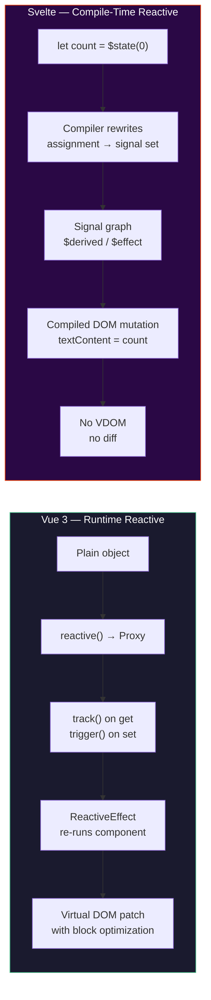
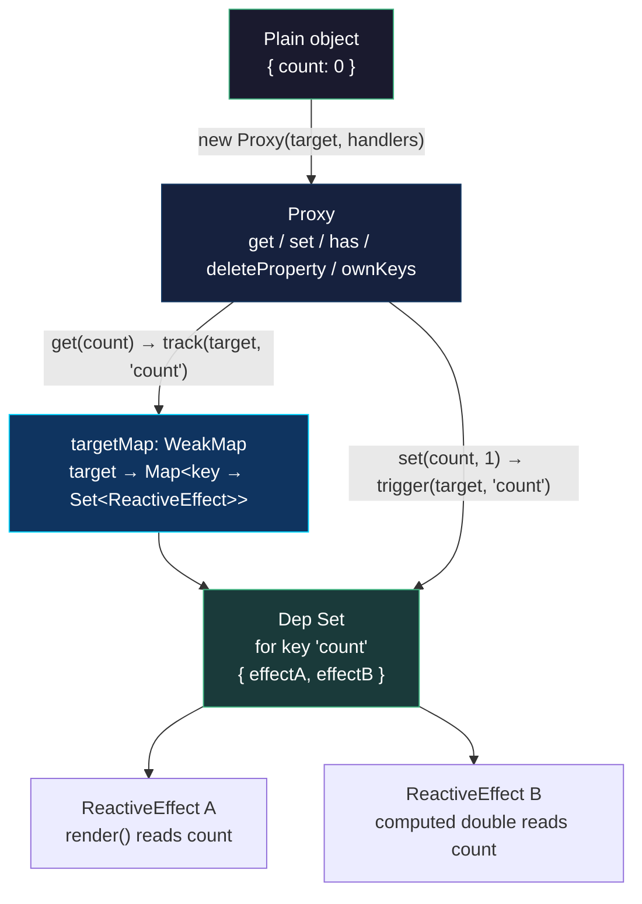
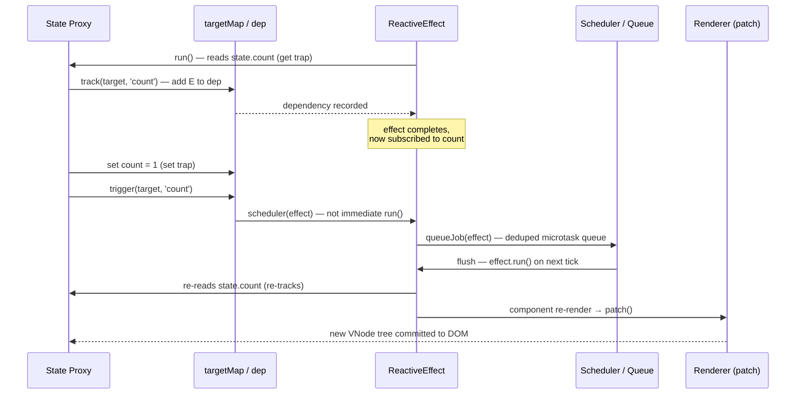
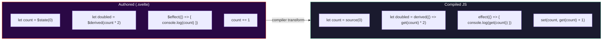
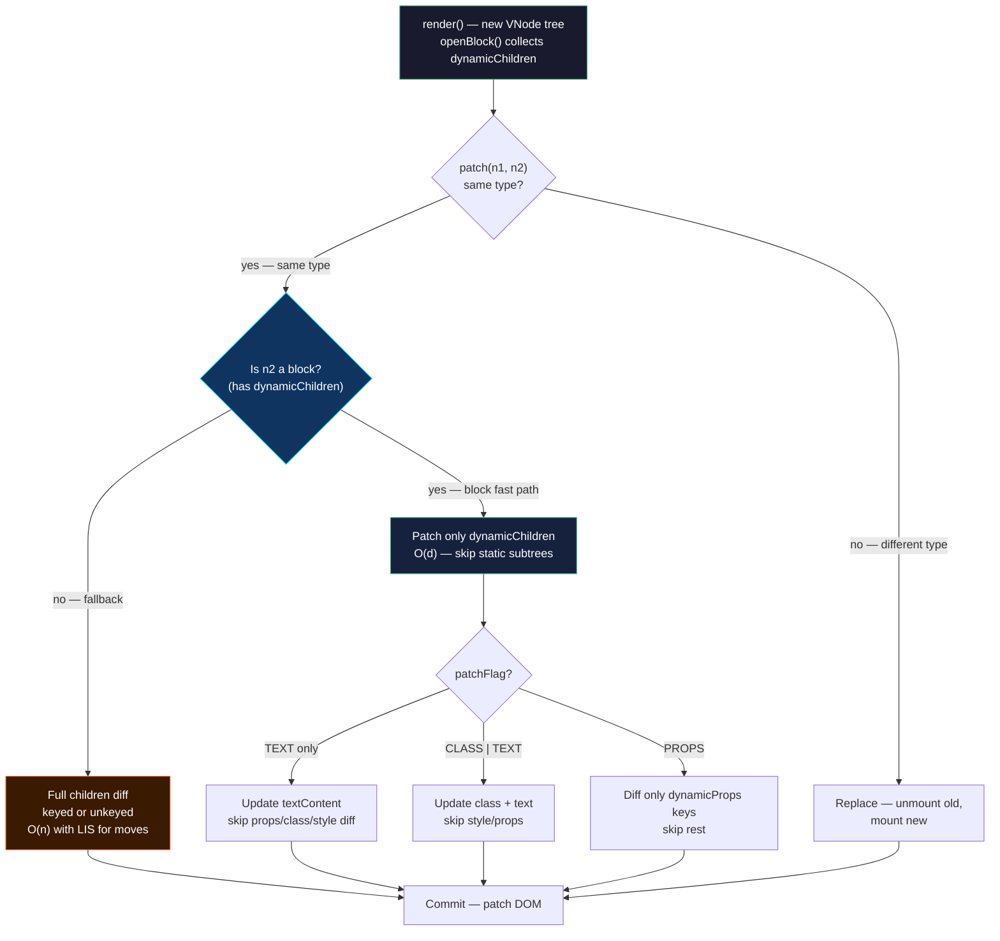
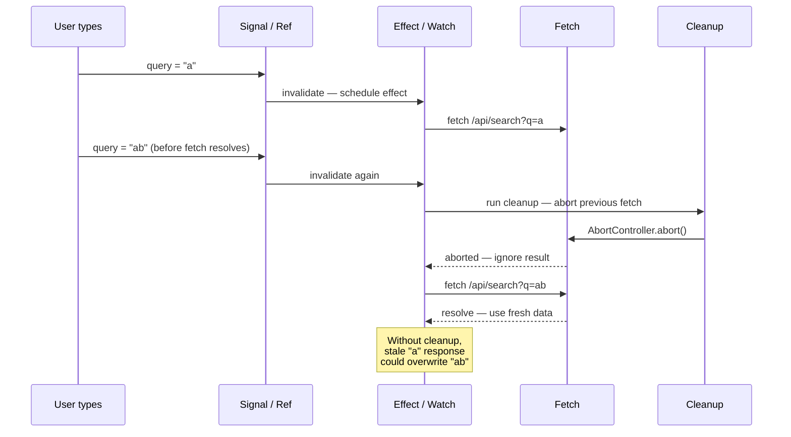

# Chapter 8 — Vue and Svelte Internals: Reactivity (Proxy vs Signals vs Compile-Time), Virtual DOM vs Compiled Output

*What this chapter covers:* Two dominant answers to the same question — how does a UI stay consistent with state? Vue 3 answers with a runtime reactive system built on `Proxy`, an effect graph, and a compiler-informed Virtual DOM. Svelte answers by erasing itself at compile time: no Proxy, no Virtual DOM, only the imperative DOM mutations the compiler can prove you need. We open both frameworks on the operating table, trace every trap, dependency, patch flag, and generated `$.append` call, and compare what each choice costs in bundle bytes, CPU cycles, and developer ergonomics.

**Learning goals:**

- Explain Vue 3's Proxy-based reactivity from first principles: `reactive`/`ref`, the `track`/`trigger` pair, `WeakMap` dep storage, `ReactiveEffect` scheduling, and why `ref` needs `.value`.
- Distinguish `reactive` vs `ref`, `computed` vs `watch`/`watchEffect`, and the abandoned Reactivity Transform (`$ref`) — including when each is the correct primitive.
- Trace Svelte's compile-time reactivity through both eras: Svelte 3/4's `$:` label transform and Svelte 5's runes (`$state`, `$derived`, `$effect`), and explain why Svelte needs no runtime Proxy.
- Describe Vue's Virtual DOM pipeline — `h()`, `VNode` shape and flags (`PatchFlags`, `ShapeFlags`), `patch` with block optimization and static hoisting — and quantify what the compiler saves the runtime.
- Read Svelte's compiled output as imperative DOM code (create/mount/update/detach) and explain why diffing is unnecessary.
- Compare Vue and Svelte side-by-side on runtime cost, bundle size, memory pressure, SSR/hydration, and the debugging trade-offs of implicit magic vs explicit mutation.
- Connect framework choice to distributed-systems realities: edge rendering budgets, hydration cost at CDN scale, independent deployability of micro-frontends, and observability of reactive graphs in production.

---

## 1. Two Philosophies, One Problem

Every frontend framework solves the same consistency problem: given mutable application state, how do you keep the DOM in sync without the developer manually calling `element.textContent = newValue` on every mutation?

React (see Chapter 7) answers with re-rendering: state change schedules a new render, the reconciler diffs the result, and the commit phase flushes DOM writes. The framework is always present at runtime.

Vue and Svelte offer two different departures from that model:

| Dimension | Vue 3 | Svelte 3/4 and 5 |
|-----------|-------|-------------------|
| Reactivity | Runtime — `Proxy` traps intercept gets/sets | Compile-time — compiler rewrites assignments into update calls |
| Dependency tracking | Automatic `track` on read, `trigger` on write | Explicit signal graph (`$state`/`$derived`) or implicit via `$:` analysis |
| Rendering | Virtual DOM with compiler hints (blocks, patch flags) | No Virtual DOM — compiled imperative DOM mutations |
| Runtime shipped to browser | ~40 kB min+gzip (runtime-dom) | ~2–5 kB runtime helpers; most logic is compiled away |
| Mental model | State is a reactive proxy; effects re-run automatically | State is a variable; the compiler instruments writes |

For a senior backend engineer, the analogy is direct: Vue is like an ORM with change tracking — it wraps your objects, intercepts mutations, and flushes diffs. Svelte is like a code generator — it rewrites your source at build time so no tracking layer is needed at runtime. Both achieve fine-grained updates; they differ in *when* the work happens and *where* the complexity lives.



---

## 2. Vue 3 Reactivity — A Proxy Around Plain Objects

### 2.1 `reactive()` and the Proxy Trap Layer

Vue 3's reactivity is built on a single primitive: `Proxy`. Unlike Vue 2's `Object.defineProperty`, which could only intercept known keys and required `Vue.set` for new properties, `Proxy` intercepts *any* property access on the target, including dynamic keys, array index writes, `in` checks, and `delete`.

The core lives in `packages/reactivity/src/reactive.ts` and `baseHandlers.ts`:

```javascript
// Simplified from Vue 3 source — packages/reactivity/src/reactive.ts
const reactiveMap = new WeakMap(); // target → proxy cache
const targetMap = new WeakMap();   // target → (key → dep Set)

export function reactive(target) {
  if (!isObject(target)) return target;
  // Return cached proxy if already wrapped
  const existing = reactiveMap.get(target);
  if (existing) return existing;

  const proxy = new Proxy(target, {
    get(t, key, receiver) {
      const res = Reflect.get(t, key, receiver);
      track(t, key);                          // record dependency
      return isObject(res) ? reactive(res) : res; // deep conversion, lazy
    },
    set(t, key, value, receiver) {
      const oldValue = t[key];
      const result = Reflect.set(t, key, value, receiver);
      if (hasChanged(value, oldValue)) {
        trigger(t, key);                      // notify dependents
      }
      return result;
    },
    deleteProperty(t, key) {
      const hadKey = Object.prototype.hasOwnProperty.call(t, key);
      const result = Reflect.deleteProperty(t, key);
      if (hadKey) trigger(t, key);
      return result;
    },
    has(t, key) {
      track(t, key);
      return Reflect.has(t, key);
    },
    ownKeys(t) {
      track(t, ITERATE_KEY);                  // for ...in / Object.keys
      return Reflect.ownKeys(t);
    }
  });

  reactiveMap.set(target, proxy);
  return proxy;
}
```

Three design decisions matter:

1. **Lazy deep conversion.** `get` wraps nested objects in `reactive()` on first access, not eagerly at creation. A 1,000-key state tree where you only read 5 keys creates only 5 nested proxies. This is the same lazy-materialization principle behind demand-paged memory.

2. **Proxy identity via `WeakMap`.** `reactiveMap` ensures `reactive(obj) === reactive(obj)` — identity stability matters because component props are compared by reference. `targetMap` stores the dependency graph without preventing GC of the targets.

3. **Array instrumentation.** Arrays get special handling in `collectionHandlers.ts`. Methods like `push`, `pop`, `splice` are wrapped to pause tracking during internal reads (otherwise `push` would trigger spurious `length` tracking) and to trigger correctly for index and length changes. Without this, `arr.push(1)` would both track and trigger `length` in the same synchronous frame, causing infinite loops.



### 2.2 `ref` vs `reactive` — Why Primitives Need a Box

`Proxy` only wraps objects. A bare `let count = 0` has no object identity to proxy, so Vue cannot intercept `count = 1`. The solution is `ref` — a single-property reactive box:

```javascript
// packages/reactivity/src/ref.ts — simplified
class RefImpl {
  constructor(value) {
    this._rawValue = value;
    this._value = isObject(value) ? reactive(value) : value;
    this.dep = new Set(); // dep for .value
  }
  get value() {
    trackRefValue(this);   // track(this.dep)
    return this._value;
  }
  set value(newVal) {
    if (hasChanged(newVal, this._rawValue)) {
      this._rawValue = newVal;
      this._value = isObject(newVal) ? reactive(newVal) : newVal;
      triggerRefValue(this); // trigger(this.dep)
    }
  }
}

export function ref(value) { return new RefImpl(value); }
```

`reactive` vs `ref` — the rules a senior engineer should internalize:

| Concern | `reactive(obj)` | `ref(value)` |
|---------|-----------------|--------------|
| Wraps | Objects/arrays deeply (lazy) | Any value — primitives via `.value` box, objects via inner `reactive` |
| Access | `state.count` — no `.value` | `count.value` in JS; auto-unwrapped in templates |
| Reassignment | `state = newObj` **breaks** reactivity (variable rebinding is not trapped) | `count.value = 1` **preserves** reactivity (mutation of the box) |
| Destructuring | `const { count } = state` loses reactivity (bare value) | `const c = count` keeps reactivity (still a ref object) |
| Prop passing | Must use `toRefs(state)` to keep per-key refs | Pass the ref directly |
| Use when | Grouped domain state (`form`, `user`) | Standalone primitives, values that get reassigned, composable return values |

```javascript
// reactive vs ref — the pitfalls that bite every team once
import { reactive, ref, toRefs, isRef } from 'vue';

// --- reactive: destructuring severs the proxy link ---
const state = reactive({ count: 0, name: 'Ada' });
let { count } = state;  // count is now just 0 — a plain number
count++;                // no trigger — nobody is tracking this local
console.log(state.count); // still 0

// Fix: toRefs preserves per-key reactivity
const { count: countRef } = toRefs(state);
countRef.value++;       // triggers — countRef is a ref linked to state.count
console.log(state.count); // 1

// --- ref: auto-unwrapping in templates, not in plain JS ---
const count2 = ref(0);
function useCounter() {
  return { count2 };    // caller gets a ref — must use .value in JS
}
const { count2: c } = useCounter();
console.log(isRef(c));  // true
console.log(c.value);   // 0 — .value required in script

// In <template>{{ count2 }}</template> — no .value needed, compiler unwraps
```

**Collection types** (`Map`, `Set`, `WeakMap`, `WeakSet`) cannot be proxied via the base handlers because their methods access internal slots (`[[MapData]]`) that throw if `this` is a Proxy. Vue provides `collectionHandlers` that proxy the *methods* instead — `size` is tracked via `ITERATE_KEY`, and `get`/`set`/`has`/`delete` each track/trigger their respective keys.

### 2.3 `track` / `trigger` / `dep` / `ReactiveEffect` — The Engine

Every reactive read calls `track`, every write calls `trigger`, and both operate on the same global data structure:

```javascript
// packages/reactivity/src/effect.ts — simplified to essentials
let activeEffect = undefined;  // currently executing effect, if any
let shouldTrack = true;

const targetMap = new WeakMap(); // target → key → dep Set

export function track(target, key) {
  if (!shouldTrack || !activeEffect) return;
  let depsMap = targetMap.get(target);
  if (!depsMap) targetMap.set(target, (depsMap = new Map()));
  let dep = depsMap.get(key);
  if (!dep) depsMap.set(key, (dep = new Set()));
  if (!dep.has(activeEffect)) {
    dep.add(activeEffect);
    activeEffect.deps.push(dep); // for cleanup on re-run
  }
}

export function trigger(target, key) {
  const depsMap = targetMap.get(target);
  if (!depsMap) return;
  const dep = depsMap.get(key);
  if (!dep) return;
  // Copy to array — effects may mutate the set during trigger
  const effects = [...dep];
  for (const effect of effects) {
    if (effect.scheduler) effect.scheduler(effect);
    else effect.run();
  }
}

class ReactiveEffect {
  deps = [];
  active = true;
  constructor(fn, scheduler) {
    this.fn = fn;
    this.scheduler = scheduler;
  }
  run() {
    if (!this.active) return this.fn();
    const prev = activeEffect;
    activeEffect = this;
    try { return this.fn(); }
    finally {
      activeEffect = prev;
    }
  }
  stop() {
    if (this.active) {
      for (const dep of this.deps) dep.delete(this);
      this.deps.length = 0;
      this.active = false;
    }
  }
}
```

The execution model:

1. A component's `render` (or a `watchEffect` callback) runs inside `effect.run()`, which sets `activeEffect`.
2. Every reactive `get` during that execution calls `track`, adding `activeEffect` to the dep set for that key.
3. On the next `set`, `trigger` finds the dep set and re-runs each effect.
4. Before re-running, the effect cleans up its old deps — so conditional branches that no longer read a key automatically unsubscribe from it.

```javascript
// Effect invalidation — conditional deps are cleaned up automatically
import { reactive, effect } from 'vue';

const state = reactive({ show: true, a: 1, b: 2 });

effect(() => {
  // On first run: tracks show + a
  // On second run (show=false): tracks show + b, dep on 'a' is removed
  console.log(state.show ? state.a : state.b);
});

state.a = 99;    // triggers — effect depends on 'a' (show is true)
state.b = 99;    // does NOT trigger — effect does not depend on 'b' yet
state.show = false; // triggers, re-runs, now depends on show + b
state.a = 100;   // no longer triggers — dep on 'a' was cleaned up
state.b = 100;   // now triggers
```



Key production detail: effects are **not** re-run synchronously inside `trigger`. The scheduler batches them into a microtask queue (`queueJob` in `runtime-core/src/scheduler.ts`), deduped by effect identity. Ten synchronous mutations to the same reactive object produce one component re-render, not ten. This is the same coalescing principle behind write-ahead log batching.

### 2.4 `computed` and `watch` — Lazy Effects and Schedulers

```javascript
import { reactive, computed, watch, watchEffect } from 'vue';

const state = reactive({ count: 0, name: 'Ada' });

// computed — lazy, cached, only recomputes when deps change
const doubled = computed(() => state.count * 2);
console.log(doubled.value); // 0 — computed runs on first access
console.log(doubled.value); // 0 — cached, no re-run
state.count = 5;
console.log(doubled.value); // 10 — dirty, recomputes on next access

// watchEffect — immediate, tracks whatever it reads
watchEffect(() => {
  console.log(`count is ${state.count}`);
});
// logs immediately: "count is 5", then on every count change

// watch — explicit source, old/new values, lazy by default
watch(
  () => state.count,
  (newVal, oldVal) => {
    console.log(`${oldVal} → ${newVal}`);
  }
);
state.count = 6; // logs "5 → 6"

watch(
  () => state.name,
  async (newName) => {
    // common pattern: fetch on param change, with cancellation
    const data = await fetch(`/api/users/${newName}`).then(r => r.json());
    // Vue's watch cleanup: onInvalidate runs before next invocation
  }
);
```

Internally, `computed` is a `ReactiveEffect` with `lazy: true` and a `scheduler` that marks it dirty instead of re-running immediately. The next `.value` access re-runs the getter if dirty. `watch` is a `ReactiveEffect` whose scheduler is the component's job queue (so the callback runs after the component has flushed) and whose getter is the watch source function.

| Primitive | Eager? | Cached? | Has old/new? | Scheduler |
|-----------|--------|---------|--------------|-----------|
| `effect` / `watchEffect` | Yes — runs immediately | No | No | Component queue (batched) |
| `computed` | No — lazy on first `.value` | Yes — until dep changes | No (derive, don't compare) | Dirty-flag, no queue |
| `watch(source, cb)` | No — lazy until source changes | N/A | Yes | Component queue, with `flush: 'pre'/'post'/'sync'` |

The `flush` option controls *when* the watcher callback fires relative to the component update cycle — `pre` (before DOM patch), `post` (after), `sync` (immediately, rarely used because it defeats batching).

### 2.5 The Reactivity Transform (`$ref`) — An Experiment Retired

Vue 3.2 shipped an experimental **Reactivity Transform** that let you write `let count = $ref(0)` and use `count` without `.value` — the compiler rewrote bare assignments into `.value` sets:

```javascript
// Authored with reactivity transform (experimental, now deprecated)
let count = $ref(0);
let doubled = $computed(() => count * 2);

function inc() {
  count++;           // compiler rewrites → count.value++
  console.log(doubled); // → doubled.value
}
```

The transform was removed in Vue 3.4 (RFC withdrawn). Reasons instructive for any team considering compiler magic:

- **Tooling cost.** Every tool that reads Vue code (TypeScript, ESLint, Vitest, IDE) needed a pre-transform pass to understand `$ref` semantics. The ecosystem never fully adopted it.
- **Mental model split.** Code inside `<script setup>` with the transform behaved differently from the same code in a plain `.ts` file. Two dialects of Vue increased onboarding cost.
- **Destructuring still leaked.** `$ref` values that crossed a function boundary reverted to plain values unless the callee also participated in the transform.

The replacement is ergonomic conventions, not compiler rewriting: `ref` + auto-unwrapping in templates, and composables that return refs explicitly. The lesson generalizes — compiler sugar that requires whole-toolchain cooperation must clear a high bar to justify its maintenance burden.

---

## 3. Svelte Reactivity — The Disappearing Framework

### 3.1 Svelte 3/4 — The `$:` Label Era

Before runes, Svelte had no runtime reactivity primitives at all. Reactivity *was* the compiler. Any assignment to a top-level `let` in a `.svelte` component was reactive, and `$:` labeled statements declared derived values:

```svelte
<!-- Counter.svelte — Svelte 3/4 -->
<script>
  let count = 0;              // reactive by virtue of being top-level let
  $: doubled = count * 2;     // re-runs whenever count changes
  $: {
    console.log(`count is ${count}`);
    if (count > 10) alert('high!');
  }
  $: if (count > 5) console.log('more than five');

  function inc() { count += 1; } // assignment triggers update — compiler inserts invalidation
</script>

<button on:click={inc}>{count} × 2 = {doubled}</button>
```

What the compiler did with this (Svelte 3/4 output, simplified):

```javascript
// Svelte 3/4 compiled output — Counter.svelte → Counter.js (simplified)
import { SvelteComponent, init, safe_not_equal, element, text, listen, set_data } from 'svelte/internal';

function create_fragment(ctx) {
  let button;
  let t;
  return {
    c() { // create — called once
      button = element('button');
      t = text(`${ctx[0]} × 2 = ${ctx[1]}`);
    },
    m(target, anchor) { // mount — insert into DOM
      target.appendChild(button);
      button.appendChild(t);
      listen(button, 'click', ctx[2]);
    },
    p(ctx, [dirty]) { // update — called when count changes
      if (dirty & 1) set_data(t, `${ctx[0]} × 2 = ${ctx[1]}`);
    },
    d(detaching) { // destroy
      if (detaching) button.remove();
    }
  };
}

function instance($$self, $$props, $$invalidate) {
  let count = 0;
  let doubled;
  // $: doubled = count * 2  → compiler inserts this after every count assignment
  // $$invalidate(0, count = count + 1)  in inc()
  $$self.$$.update = () => {
    if ($$self.$$.dirty & 1) doubled = count * 2;
  };
  function inc() { $$invalidate(0, count += 1); }
  return [count, doubled, inc];
}
```

The mechanism: the compiler wraps every assignment to a reactive variable in `$$invalidate(index, value)`, which marks the component dirty and schedules an update. `$:` blocks become code inside `$$.update` that re-runs when their dependencies are dirty. No Proxy, no `WeakMap`, no `track`/`trigger` — just code generation driven by static analysis of the assignment graph.

The limitation that motivated Svelte 5: reactivity was **component-scoped**. A plain `let count = 0` in a `.js` module was not reactive — only top-level `let` inside `.svelte` files. Sharing reactive state across components required stores (`writable`/`readable` with subscribe protocol), which reintroduced runtime overhead and boilerplate.

### 3.2 Svelte 5 Runes — Explicit Signals

Svelte 5 (stable since late 2024) replaces component-scoped magic with **runes** — explicit reactive primitives that work in any `.svelte` or `.svelte.js` file and are compiled away:

```svelte
<!-- Counter.svelte — Svelte 5 with runes -->
<script>
  let count = $state(0);              // reactive signal
  let doubled = $derived(count * 2);  // computed — cached, lazy
  let history = $state([]);           // reactive array — no Proxy, just signal on reassignment

  $effect(() => {
    console.log(`count is ${count}`);
    // cleanup: runs before next effect invocation and on destroy
    return () => console.log('cleanup');
  });

  function inc() { count += 1; }      // compiler rewrites to signal set
  function pushHistory() { history.push(count); } // see caveat below
</script>

<button onclick={inc}>{count} × 2 = {doubled}</button>
```

```javascript
// Shared reactive state — Svelte 5 .svelte.js (works outside components)
import { SvelteMap } from 'svelte/reactivity';

// counter.svelte.js
export let count = $state(0);
export let doubled = $derived(count * 2);
export function inc() { count += 1; }

// Any component can import and mutate — no store wrapper needed
// App.svelte:  import { count, inc } from './counter.svelte.js'
```

The three runes:

| Rune | Role | Vue equivalent | Lazy? |
|------|------|----------------|-------|
| `$state(value)` | Reactive signal — write triggers dependents | `ref(value)` | N/A |
| `$derived(expr)` | Cached derived value | `computed(() => expr)` | Yes — recomputes only when read after dep changes |
| `$effect(fn)` | Side effect — runs after DOM update, with cleanup | `watchEffect` / `watch` with `flush: 'post'` | No — runs on dep change |

Additional runes: `$state.raw` (no deep reactivity — only reassignment triggers, like `shallowRef`), `$derived.by(() => { ... })` for multi-statement derivations, `$effect.pre` (runs before DOM update, like Vue `flush: 'pre'`), and `$inspect` (dev-only logging without subscribing).

**The array/object caveat.** `$state` with objects/arrays in Svelte 5 uses a Proxy internally for deep reactivity — `history.push(count)` does trigger. But `$state.raw` does not: you must reassign (`history = [...history, count]`). This parallels Vue's `reactive` vs `shallowReactive` distinction. Svelte's proxy for `$state` is an implementation detail of the signal, not the primary reactivity mechanism — the signal graph still drives scheduling, not `track`/`trigger` on arbitrary objects.



What the Svelte 5 compiler actually emits (simplified from real output, `svelte/internal/client`):

```javascript
// Svelte 5 compiled output — Counter.svelte → Counter.svelte.js (simplified)
import { source, derived, effect, get, set } from 'svelte/internal/client';
import { append, from_html, set_text } from 'svelte/internal/client';

const template = from_html(`<button> </button>`);

export default function Counter($$anchor) {
  let count = source(0);
  let doubled = derived(() => get(count) * 2);

  effect(() => { console.log(get(count)); });

  function inc() { set(count, get(count) + 1); }

  const button = template();
  const text = button.firstChild;

  effect(() => { set_text(text, `${get(count)} × 2 = ${get(doubled)}`); });
  button.addEventListener('click', inc);
  append($$anchor, button);
}
```

`source` creates a signal cell (value + version + subscribers), `derived` creates a lazy computed cell, `get` subscribes the current effect, and `set` bumps the version and schedules subscribers. The DOM update is itself an `effect` — no Virtual DOM diff, just a `set_text` inside an effect that re-runs when `count` or `doubled` changes.

### 3.3 Why Svelte Needs No Runtime Proxy (Mostly)

In Vue, `Proxy` is the *mechanism* — it is how the framework discovers dependencies at runtime. In Svelte, the compiler is the mechanism — it *knows* at build time that `count` is read inside `derived(() => count * 2)` and inside `set_text(...)`, so it emits `get(count)` calls that subscribe to the signal. For primitives and reassigned variables, no Proxy is needed at all.

The Proxy that Svelte 5 *does* use for `$state({ ... })` and `$state([...])` is an optimization for ergonomic deep mutation — it lets `obj.nested.x = 1` trigger without requiring `obj = { ...obj, nested: { ...obj.nested, x: 1 } }`. But the scheduling still flows through the signal graph, not through `track`/`trigger` on arbitrary keys. The Proxy is a convenience wrapper around the signal, not the signal itself.

```mermaid
flowchart TB
    subgraph VuePath["Vue 3 — Runtime Discovery"]
        V1["Plain object"] --> V2["Proxy wraps object"]
        V2 --> V3["Any property read<br/>calls track() at runtime"]
        V3 --> V4["Dep Map built<br/>dynamically"]
        V4 --> V5["Any property write<br/>calls trigger()"]
    end
    subgraph SveltePath["Svelte 5 — Compile-Time Wiring"]
        S1["let x = $state(0)"] --> S2["Compiler emits<br/>source() signal cell"]
        S2 --> S3["Reads compiled to<br/>get(x) — subscribes"]
        S3 --> S4["Signal graph<br/>built at compile time"]
        S4 --> S5["Writes compiled to<br/>set(x, v) — notifies graph"]
    end
    style VuePath fill:#1a1a2e,stroke:#42b883,color:#fff
    style SveltePath fill:#2a0845,stroke:#ff3e00,color:#fff
```



---

## 4. Vue Virtual DOM — Compiler-Informed Diffing

Vue *does* use a Virtual DOM — but not the naive kind that diffs every node. The template compiler and the runtime conspire to make patching cheap.

### 4.1 `h()` and `VNode` Shape — What a Virtual Node Really Is

Every Vue template compiles to `h()` (hyperscript) calls that create `VNode` objects:

```javascript
// Template
// <div class="app">
//   <h1>{{ title }}</h1>
//   <Button :count="count" @click="inc" />
// </div>

// Compiled render function (simplified, Vue 3.4)
import { openBlock, createElementBlock, createElementVNode, createVNode, toDisplayString } from 'vue';

export function render(ctx, cache) {
  return (openBlock(), createElementBlock('div', { class: 'app' }, [
    createElementVNode('h1', null, toDisplayString(ctx.title), 1 /* PatchFlag TEXT */),
    createVNode(Button, { count: ctx.count, onClick: ctx.inc }, null, 8 /* PatchFlag PROPS */, ['count'])
  ]));
}
```

A `VNode` is a plain object — not a DOM node — with this shape (from `runtime-core/src/vnode.ts`):

```typescript
interface VNode {
  __v_isVNode: true;
  type: string | Component | Symbol;  // 'div', MyComponent, Fragment, Text
  props: Record<string, any> | null;
  key: string | number | null;
  ref: Ref | null;
  children: VNode[] | string | null;
  shapeFlag: number;   // bitmask: ELEMENT=1, STATEFUL_COMPONENT=4, TEXT_CHILDREN=8, ARRAY_CHILDREN=16, ...
  patchFlag: number;   // compiler hint: TEXT=1, CLASS=2, STYLE=4, PROPS=8, FULL_PROPS=16, ...
  dynamicProps: string[] | null; // which props are dynamic: ['count']
  el: Element | null;  // linked DOM element after mount
  component: ComponentInternalInstance | null;
}
```

Two flag systems carry compiler knowledge to the runtime:

- **`ShapeFlags`** — what *kind* of node is this? Element vs component vs text vs fragment. Lets `patch` branch without `typeof` checks on every node.
- **`PatchFlags`** — what *can change* in this node? If the compiler can prove only `textContent` is dynamic (`PatchFlag.TEXT`), `patch` skips diffing `class`, `style`, and `props` entirely.

```javascript
// PatchFlags — packages/shared/src/patchFlags.ts
export const enum PatchFlags {
  TEXT               = 1,       // dynamic textContent
  CLASS              = 1 << 1,  // dynamic class
  STYLE              = 1 << 2,  // dynamic style
  PROPS              = 1 << 3,  // dynamic props (known keys in dynamicProps)
  FULL_PROPS         = 1 << 4,  // props with unknown keys (v-bind="obj")
  NEED_HYDRATION     = 1 << 5,  // need hydration
  STABLE_FRAGMENT    = 1 << 6,  // fragment with stable order
  KEYED_FRAGMENT     = 1 << 7,  // keyed fragment
  UNKEYED_FRAGMENT   = 1 << 8,  // unkeyed fragment
  NEED_PATCH         = 1 << 9,  // non-props patch needed
  DYNAMIC_SLOTS      = 1 << 10, // dynamic slots
  DEV_ROOT_FRAGMENT  = 1 << 11,
  HOISTED            = -1,      // static — hoisted, never patches
  BAIL               = -2,      // diff without optimization
}
```

A `PatchFlag.HOISTED` node is created once outside the render function and reused across renders — zero allocation, zero diff. The compiler hoists every static subtree it can prove does not depend on reactive state.

### 4.2 `patch()` with Block Optimization and Static Hoisting

Naive Virtual DOM diffs the entire tree on every update — O(n) where n is total nodes. Vue 3's **block optimization** narrows that to O(d) where d is the number of *dynamic* nodes.

How it works:

1. **Blocks.** The compiler groups each template into *blocks* — a block is a subtree rooted at a node with `openBlock()`/`createElementBlock()`. Inside a block, the compiler collects `dynamicChildren` — only the VNodes that have a `patchFlag` (i.e., that can change).

2. **`patch` fast path.** When a block re-renders, `patch` iterates only `dynamicChildren` instead of all children. A 200-node template with 3 dynamic bindings patches 3 nodes, not 200.

3. **Static hoisting.** Fully static subtrees are hoisted to module scope and patch-flagged `HOISTED`. They are never visited during patch at all.

```javascript
// Template with block optimization visible
// <div>
//   <p>Static — never changes</p>          ← hoisted, PatchFlag.HOISTED
//   <p>{{ count }}</p>                       ← dynamic, PatchFlag.TEXT
//   <div class="card">
//     <span>Static label</span>              ← static within block
//     <span :class="active ? 'on' : 'off'">{{ label }}</span> ← CLASS | TEXT
//   </div>
// </div>

// Compiled output — note openBlock / createElementBlock / dynamicChildren
const _hoisted_1 = createElementVNode('p', null, 'Static — never changes', -1 /* HOISTED */);

export function render(ctx, cache) {
  return (openBlock(), createElementBlock('div', null, [
    _hoisted_1,  // reused — no allocation, no diff
    createElementVNode('p', null, toDisplayString(ctx.count), 1 /* TEXT */),
    createElementVNode('div', { class: 'card' }, [
      createElementVNode('span', null, 'Static label', -1 /* HOISTED inside? no — inside block, but static child skipped by dynamicChildren */),
      createElementVNode('span', {
        class: normalizeClass(ctx.active ? 'on' : 'off')
      }, toDisplayString(ctx.label), 3 /* TEXT | CLASS */)
    ])
  ]));
  // block's dynamicChildren = [p(TEXT), span(TEXT|CLASS)]  — only 2 nodes patched
}
```



The keyed children diff (`patchKeyedChildren` in `runtime-core/src/renderer.ts`) uses the classic longest-increasing-subsequence (LIS) optimization to minimize DOM moves — identical to the algorithm described in Chapter 7 for React's reconciler, but applied only to the dynamic fragment, not the whole tree.

Static hoisting deserves a concrete measurement. For a typical admin dashboard template with ~150 nodes and ~15 dynamic bindings, block optimization reduces patch work by roughly 10x — from visiting 150 VNodes to visiting 15. The compiler pays once at build time to save work on every frame at runtime. This is the same trade-off as building an index to avoid a full table scan.

---

## 5. Svelte Compiled Output — No Virtual DOM at All

### 5.1 What the Compiler Emits

Svelte has no `h()`, no `VNode`, no `patch`. The compiler emits imperative DOM API calls directly. For a Svelte 5 component, the four lifecycle fragments are `create` (build DOM), `mount` (insert), `update` (mutate in place inside effects), and `destroy` (remove):

```svelte
<!-- List.svelte — Svelte 5 -->
<script>
  let items = $state(['apple', 'banana']);
  let filter = $state('');
  let filtered = $derived(items.filter(i => i.includes(filter)));
  function add() { items.push(`item-${items.length}`); }
</script>

<input bind:value={filter} placeholder="filter" />
<button onclick={add}>Add</button>
<ul>
  {#each filtered as item (item)}
    <li>{item}</li>
  {/each}
</ul>
<p>{filtered.length} items</p>
```

Simplified compiled output (Svelte 5, `svelte/internal/client`):

```javascript
// List.svelte → List.svelte.js (simplified, comments added)
import { source, derived, get, set, effect } from 'svelte/internal/client';
import { append, from_html, set_text, template_effect, each } from 'svelte/internal/client';

const row_template = from_html(`<li> </li>`);
const root_template = from_html(`<input placeholder="filter"><button>Add</button><ul></ul><p> </p>`);

export default function List($$anchor) {
  let items = source(['apple', 'banana']);
  let filter = source('');
  let filtered = derived(() => get(items).filter(i => i.includes(get(filter))));

  function add() {
    const next = [...get(items), `item-${get(items).length}`];
    set(items, next);
  }

  const fragment = root_template();
  const input = fragment.firstChild;
  const button = input.nextSibling;
  const ul = button.nextSibling;
  const p = ul.nextSibling;
  const p_text = p.firstChild;

  // Two-way binding — input ↔ filter signal
  input.addEventListener('input', () => set(filter, input.value));
  effect(() => { if (input.value !== get(filter)) input.value = get(filter); });

  button.addEventListener('click', add);

  // Keyed each — the compiler emits a keyed reconciler, but NOT a VDOM diff
  // It tracks which keys exist and surgically inserts/moves/removes <li> nodes
  each(ul, () => get(filtered), (item) => item, row_template, (li, item) => {
    set_text(li.firstChild, item);
  });

  // Text update — fine-grained effect, not a tree diff
  effect(() => { set_text(p_text, `${get(filtered).length} items`); });

  append($$anchor, fragment);
}
```



```mermaid
flowchart TB
    subgraph Create["Create — once"]
        C1["from_html('<li> </li>')<br/>clone template"]
        C2["from_html('<input>...')<br/>clone root template"]
        C3["Allocate signal cells<br/>source() / derived()"]
    end
    subgraph Mount["Mount — once"]
        M1["append(anchor, fragment)<br/>insert into DOM"]
        M2["Add event listeners"]
    end
    subgraph Update["Update — per change, inside effects"]
        U1["set(filter, 'a')<br/>bump version"]
        U2["derived filtered<br/>recomputes lazily"]
        U3["effect → set_text(p, '1 items')<br/>direct DOM write"]
        U4["each reconciler<br/>insert/move/remove li<br/>by key — no VDOM"]
    end
    subgraph Destroy["Destroy — on unmount"]
        D1["Remove fragment<br/>from DOM"]
        D2["Destroy effects<br/>run cleanups"]
    end
    Create --> Mount --> Update --> Destroy

    style Create fill:#2a0845,stroke:#ff3e00,color:#fff
    style Update fill:#1a1a2e,stroke:#42b883,color:#fff
    style Destroy fill:#3a0000,stroke:#ff3333,color:#fff
```

The `each` block is the one place Svelte *does* diff — but it diffs a flat keyed list of DOM nodes directly, not a Virtual DOM tree. The algorithm is a keyed reconciler specialized to a single `{#each}` scope, with no cross-component Virtual DOM.

### 5.2 Fine-Grained Updates Without Diffing

Because each reactive value's DOM update is its own `effect`, Svelte achieves O(1) updates per changed value — not O(d) like Vue's block patch, and not O(n) like a naive Virtual DOM. Changing `filter` from `""` to `"a"` triggers:

1. `set(filter, "a")` — bump signal version.
2. `filtered` derived — marked dirty, recomputes on next `get`.
3. `each` effect — reads `filtered`, diffs the keyed list, surgically updates `<li>` nodes.
4. `set_text` effect for the `<p>` — reads `filtered.length`, writes one text node.

No Virtual DOM tree is created, no flags are checked, no `dynamicChildren` array is walked. The compiler already proved which DOM writes correspond to which signals.

The cost of this precision is paid at build time: the compiler must correctly identify every reactive dependency. Svelte 5's explicit runes make this easier — `$state`/`$derived`/`$effect` are unambiguous. Svelte 3/4's implicit `let` + `$:` required whole-component data-flow analysis that occasionally needed `$$invalidate` hints for edge cases like mutating an object property without reassignment (`obj.x = 1` without `obj = obj` did not trigger in Svelte 3).

---

## 6. Compiled Output Comparison — The Same Counter, Two Compilers

To make the difference visceral, here is the same counter component compiled by both frameworks, side by side:

```javascript
// ============================================================
// Vue 3 — Counter.vue compiled (render function, ~Vue 3.4)
// Template: <button @click="count++">{{ count }} × 2 = {{ doubled }}</button>
// ============================================================
import { openBlock, createElementBlock, createElementVNode, toDisplayString } from 'vue';

// Static hoisting: none here — everything is dynamic
export function render(ctx, cache) {
  // ctx.count is a ref auto-unwrapped; ctx.doubled is a computed ref
  return (openBlock(), createElementBlock('button', {
    onClick: () => ctx.count++          // triggers Proxy set → scheduler → re-render
  }, toDisplayString(ctx.count) + ' × 2 = ' + toDisplayString(ctx.doubled), 1 /* TEXT */));
  // PatchFlag TEXT — patch only updates textContent, skips props/class/style
}
// Runtime cost per update: create new VNode → patch compares TEXT flag → one textContent write
// VNode allocation: 1 object per render
// Diff work: O(1) — single dynamic node in block

// ============================================================
// Svelte 5 — Counter.svelte compiled (imperative DOM, Svelte 5)
// Source: let count = $state(0); let doubled = $derived(count*2);
//         <button onclick={() => count++}>{count} × 2 = {doubled}</button>
// ============================================================
import { source, derived, get, set, effect } from 'svelte/internal/client';
import { from_html, set_text, append } from 'svelte/internal/client';

const template = from_html(`<button> </button>`);

export default function Counter($$anchor) {
  let count = source(0);
  let doubled = derived(() => get(count) * 2);
  const button = template();
  const text = button.firstChild;

  // Single effect owns the text update — no VNode, no diff, no flag check
  effect(() => { set_text(text, `${get(count)} × 2 = ${get(doubled)}`); });
  button.addEventListener('click', () => set(count, get(count) + 1));
  append($$anchor, button);
}
// Runtime cost per update: set() bumps version → effect re-runs → one set_text call
// VNode allocation: 0 — no Virtual DOM objects
// Diff work: none — compiler wired the exact DOM write
```

| Concern | Vue 3 output | Svelte 5 output |
|---------|-------------|-----------------|
| DOM update mechanism | New VNode → `patch` diff with `PatchFlag.TEXT` → `textContent =` | `effect` re-runs → `set_text(text, ...)` directly |
| Objects allocated per update | 1 VNode + patch traversal state | 0 VNodes; effect re-runs in place |
| Work skipped on update | Static subtrees hoisted; non-TEXT flags skipped | Nothing to skip — only subscribed effects run |
| Compiler hint | `PatchFlag.TEXT` on the VNode | No hint needed — the effect *is* the hint |
| Event handler | `onClick` prop on VNode, patched via `patchProp` | `addEventListener` once at mount, never patched |
| Scaling with template size | O(d) — dynamicChildren only | O(1) per changed signal |

For a single counter the difference is negligible. For a 500-row table where one cell changes, Vue patches the block's dynamic children (perhaps 500 text nodes if each row has one dynamic binding), while Svelte re-runs the single effect that owns that cell's text node. Both are fast — the practical difference is constant factors and allocation pressure, not algorithmic complexity.

---

## 7. Head-to-Head — Runtime Cost, Bundle Size, Ergonomics

### 7.1 Runtime Cost and Memory

| Metric | Vue 3 | Svelte 5 |
|--------|-------|----------|
| Reactive cell | `Proxy` + `WeakMap` entry + `Set` dep per key | `source` cell: `{ v, version, subscribers }` — ~3 fields |
| Dependency storage | `WeakMap<target, Map<key, Set<effect>>>` — grows with observed keys | Per-signal subscriber set — grows with number of effects reading the signal |
| Update scheduling | Global scheduler queue — deduped microtask flush | Per-signal version bump — effects scheduled via microtask, similar batching |
| Memory per component instance | VNode tree (retained between renders for diff) + reactive proxies | DOM nodes + signal cells — no VNode tree retained |
| GC pressure per update | New VNode objects allocated, old tree GC'd | No VNode allocation; signal version bump is a field write |

Vue's `WeakMap` + `Set` graph is the heavier structure, but it scales well because deps are only created for keys actually read during an effect. Svelte's signal cells are lighter per cell, but every `$state` variable allocates one. In practice, neither dominates heap for typical apps — the difference matters in extreme cases: thousands of reactive objects (Vue's `WeakMap` retains dep sets) vs thousands of signals (Svelte's per-signal bookkeeping).

CPU cost is dominated by different phases:

- **Vue:** Proxy trap overhead on every property access (even non-reactive reads go through the `get` trap and branch on `shouldTrack`) plus VNode diff. The trap cost is small per access (~tens of nanoseconds) but accumulates in hot loops that read reactive state repeatedly. `markRaw` / `shallowReactive` exist to opt out.
- **Svelte:** `get`/`set` call overhead inside effects. No proxy trap on plain reads outside effects. The compiler can even inline `get`/`set` to field accesses in optimized builds.

### 7.2 Bundle Size

Bundle size is where the compile-time approach wins unambiguously:

| App | Vue 3 (runtime-dom, min+gzip) | Svelte 5 (helpers, min+gzip) |
|-----|-------------------------------|------------------------------|
| Hello world (one component) | ~42 kB (runtime always included — VDOM + reactivity + scheduler) | ~4 kB (template clone + a few `source`/`effect` helpers) |
| 50-component SPA | ~42 kB runtime + app code | ~6–10 kB helpers + app code (helpers deduped, per-component code is inline DOM ops) |
| With router + state | + ~10 kB (vue-router) | + ~2 kB (svelte routing is user-space, no framework router required) |

Numbers are approximate and vary with minifier and treeshaking, but the order of magnitude is stable: Vue ships a runtime that handles every component; Svelte ships helpers and compiles each component into standalone DOM code. The gap narrows as app code grows — for a 500 kB app, 40 kB vs 5 kB is noise. For an embedded widget, a marketing page, or an edge-rendered fragment where every kilobyte counts against a 100 kB budget, it decides the framework.

Svelte's per-component code can be *larger* than Vue's template-compiled render function for very simple components, because each Svelte component inlines its DOM creation. Vue's render function is compact but pays the shared runtime tax once. The crossover where Vue's larger runtime is amortized is typically a mid-size SPA.

### 7.3 Developer Ergonomics and Debugging

| Concern | Vue 3 | Svelte 5 |
|---------|-------|----------|
| Reactivity declaration | `ref`/`reactive` explicit; `.value` ceremony in JS | `$state`/`$derived` explicit; no `.value` — reassignment is the mutation |
| Template unwrapping | Refs auto-unwrapped in templates — no `.value` in HTML | Signals auto-subscribed in templates — no explicit `get` |
| Destructuring | Loses reactivity — `toRefs` or keep the ref | Loses reactivity if you destructure the value — keep the signal binding |
| Reactivity leak | Easy to accidentally make everything reactive (deep `reactive`) | Easy to forget `$state` and wonder why assignment does not trigger |
| DevTools | Vue DevTools shows reactive graph, dep tracking, component inspector, timeline | Svelte DevTools shows signal graph (new in Svelte 5), compiler warnings |
| Debugging updates | `effect` + scheduler is indirect — stack trace goes through queue flush | `effect` inside compiled output — stack trace is closer to the assignment |
| TypeScript | `Ref<number>` vs `number` distinction leaks into types; `UnwrapRef` helpers | `$state` returns the value type directly — no wrapper type |

Both frameworks have a version of the same pitfall: reactivity that silently does not fire because the developer mutated state outside the reactive boundary. In Vue, that is `state = newObj` (rebinding) or mutating a `markRaw` object. In Svelte 3/4, it was `obj.x = 1` without `obj = obj`; in Svelte 5 with `$state`, deep mutation does trigger (via Proxy), but `$state.raw` does not — and the choice is explicit.


### 7.4 Effect Invalidation — When Cleanup Matters

Both frameworks need to handle effect cleanup: aborting stale fetches, removing event listeners, cancelling timers. The pattern is structurally identical, but the API surface differs:

```javascript
// Vue 3 — watch with onCleanup
import { ref, watch } from 'vue';

const query = ref('');
watch(query, async (newQuery, oldQuery, onCleanup) => {
  const controller = new AbortController();
  onCleanup(() => controller.abort()); // called before next watch invocation

  const res = await fetch(`/api/search?q=${newQuery}`, {
    signal: controller.signal
  });
  const data = await res.json();
  // ... use data — safe because stale request was aborted
}, { flush: 'post' });
```

```javascript
// Svelte 5 — $effect with return cleanup
let query = $state('');

$effect(() => {
  const controller = new AbortController();
  const q = query; // subscribe to query

  fetch(`/api/search?q=${q}`, { signal: controller.signal })
    .then(r => r.json())
    .then(data => { /* ... use data */ });

  return () => controller.abort(); // cleanup before next run + on destroy
});
```



The distributed-systems parallel is request cancellation in any concurrent system: without explicit invalidation, stale responses race with fresh ones and the last writer wins — which is not necessarily the freshest data. Both Vue's `onCleanup` and Svelte's `return () => ...` are cooperative cancellation tokens scoped to the effect lifetime.

---

## 8. The Distributed-Systems Lens

Framework internals are not just frontend trivia — they determine properties that matter at fleet scale.

### 8.1 Edge Rendering and Bundle Budgets

When you render at the edge (Cloudflare Workers, Fastly Compute, Vercel Edge Functions), every kilobyte of framework runtime is cold-start latency. A Vue SSR bundle carries the full `runtime-dom` plus the server renderer (`@vue/server-renderer`); a Svelte SSR bundle is the compiled component plus a small streaming helper. For an edge function with a 1 MB limit and a 50 ms CPU budget, the difference between 42 kB and 4 kB of framework overhead is measurable.

Svelte's compiled output also treeshakes more aggressively at the edge: unused components contribute zero runtime, not just zero render calls. Vue's runtime is monolithic — you pay for `Teleport`, `Suspense`, and `KeepAlive` even if you use none of them (though `runtime-dom` treeshaking is improving).

### 8.2 Hydration Cost — Why It Matters for CDN Scale

Hydration is the process of making server-rendered HTML interactive. Both frameworks hydrate, but the cost differs:

- **Vue hydration** walks the server-rendered DOM and the client VNode tree in parallel, matching nodes and attaching reactivity. The VNode tree must be created on the client even though the DOM already exists — allocation and matching are O(n) in the number of nodes.

- **Svelte hydration** reuses the compiled DOM-creation code but skips actual creation when a DOM node already exists (via `hydrate` markers). Because there is no VNode tree, there is nothing to allocate and diff — the compiler knows which effects to attach to which existing nodes. Hydration is closer to O(d) in the number of dynamic bindings.

For a CDN-cached page served to millions of users, hydration cost is multiplied by every page load. A 200 ms hydration on a low-end device becomes a Core Web Vitals (INP) regression at scale. Svelte's lighter hydration is one reason it is popular for content-heavy sites (blogs, docs, marketing) where SSR is the primary rendering mode.

This connects directly to Chapter 9's discussion of islands architecture and partial hydration: both Vue (via `defineAsyncComponent` + `Suspense`) and Svelte (via `{#await}` and dynamic `import()`) support loading interactivity per island, but Svelte's per-island cost is lower because each island carries no shared runtime.

### 8.3 Micro-Frontends and Independent Deployability

In a micro-frontend architecture where teams deploy fragments independently, framework runtime sharing matters:

- **Vue micro-frontends** typically share a singleton `vue` runtime via module federation or import maps. Version skew (team A on 3.3, team B on 3.4) can break because the reactivity internals (`targetMap`, effect scheduler) are global singletons. Pinning a single Vue version across teams is an operational constraint.

- **Svelte micro-frontends** have no shared runtime singleton — each fragment carries its own compiled DOM code plus a small shared helper. Version skew is less dangerous because there is no global reactive graph. Two fragments built with different Svelte versions can coexist on the same page without sharing state. The trade-off is dedup: if ten fragments each bundle `svelte/internal/client` helpers, you pay the helper cost ten times unless you externalize it.

### 8.4 Observability of the Reactive Graph

Debugging reactivity in production is a distributed-tracing problem applied to the client. When a component re-renders unexpectedly, you need to answer: which signal changed, which effect was invalidated, and what triggered the mutation?

- **Vue** exposes `getCurrentScope`, `ReactiveEffect` tracking, and the Vue DevTools timeline that records every `trigger` with its target, key, and effect stack. In production, `app.config.warnHandler` and `effectScope` let you instrument the graph programmatically. The `WeakMap`-based dep graph is inspectable at runtime.

- **Svelte 5** exposes `$inspect` (dev-only, logs signal reads/writes) and the `svelte` DevTools signal graph. Because the signal graph is built at compile time, the mapping from signal to effect is more static and easier to visualize — but also less inspectable at runtime without dev-mode instrumentation.

For both, the operational lesson is the same as for any event-driven system: instrument the edges (what triggered the effect), not just the nodes (that an effect ran). A reactive graph without trigger provenance is as opaque as a microservice trace without span attribution.

---

## 9. Choosing Between Them

There is no universal winner. The choice depends on where the complexity budget should be spent:

| Choose Vue 3 when… | Choose Svelte 5 when… |
|--------------------|-----------------------|
| Team already has Vue expertise and ecosystem (Vuetify, Nuxt, Pinia) | Starting greenfield and bundle size / edge performance is a primary constraint |
| App is a large SPA where 42 kB runtime is amortized | App is content-heavy, SSR-first, or widget/embedded where every kB counts |
| Dynamic, deeply nested state with frequent structural changes (large `reactive` trees) | State is mostly flat signals or moderate-depth objects |
| Need runtime reactivity for dynamic plugins / user-defined schemas (Proxy handles unknown keys) | Compiler can see all reactive declarations at build time (closed-world assumption) |
| Shared component library across micro-frontends with a single Vue version | Independently deployed fragments where runtime isolation matters |
| DevTools timeline and ecosystem maturity are priorities | Compile-time guarantees and minimal runtime are priorities |

A hybrid architecture is also viable and increasingly common: Svelte for marketing/docs/edge-rendered islands, Vue (or React) for the authenticated app shell. The two can coexist on the same page via Web Components or iframe islands — the same isolation strategy used for micro-frontends.

---

## Key Takeaways

- Vue 3's reactivity is a **runtime Proxy system**: `reactive` wraps objects in `Proxy`, `ref` boxes primitives, `track`/`trigger` maintain a `WeakMap<target, Map<key, Set<effect>>>` graph, and a scheduler batches effect re-runs into a deduped microtask queue. One Proxy per object, one `Set` per observed key, one `ReactiveEffect` per component render or `watch`.
- `ref` vs `reactive` is a choice about identity: `reactive` is for grouped state where the proxy identity is stable; `ref` is for primitives and values that get reassigned. Destructuring either without `toRefs` severs reactivity — the most common Vue bug in code review.
- `computed` is a lazy, cached `ReactiveEffect` with a dirty flag; `watch`/`watchEffect` are eager effects with a scheduler and optional `flush` timing. The Reactivity Transform (`$ref`) was retired because compiler sugar that requires whole-toolchain cooperation must clear a high bar.
- Svelte's reactivity is **compile-time code generation**: the compiler rewrites `let x = $state(0)` into `source(0)` signal cells, `$derived` into lazy computed cells, and `$effect` into subscribed effects. No `WeakMap`, no Proxy traps on every read — just `get`/`set` calls the compiler proved are needed. Svelte 3/4's `$:` labels worked the same way with `$$invalidate` and `$$.update`.
- Vue's Virtual DOM is **compiler-informed**: `PatchFlags` and `ShapeFlags` let `patch` skip static subtrees, `openBlock`/`createElementBlock` collect `dynamicChildren` so patch is O(d) not O(n), and `HOISTED` nodes are never visited. This narrows the classic Virtual DOM cost without abandoning the abstraction.
- Svelte has **no Virtual DOM**: the compiler emits imperative `set_text`, `set_attribute`, and `each` reconciliation calls directly, each inside its own `effect`. Updates are O(1) per changed signal with zero VNode allocation. The cost is paid at build time in compiler complexity.
- Bundle size reflects the philosophy: Vue ships ~42 kB of runtime that handles every component; Svelte ships ~4 kB of helpers and compiles each component into inline DOM code. The gap matters at the edge and for widgets, and narrows for large SPAs where app code dominates.
- Both frameworks handle effect cleanup identically in spirit — Vue's `onCleanup` and Svelte's `return () => ...` are cooperative cancellation tokens that prevent stale async results from overwriting fresh state. Without them, concurrent mutations race.
- At fleet scale, framework choice affects edge cold start, hydration cost (O(n) VNode matching vs O(d) effect attachment), micro-frontend version isolation, and the observability of the reactive graph. Instrument trigger provenance, not just effect execution.

## Further Reading

- Vue 3 Reactivity — source: `packages/reactivity/src/reactive.ts`, `effect.ts`, `ref.ts`, `computed.ts` ([github.com/vuejs/core](https://github.com/vuejs/core)).
- Vue 3 Renderer — `packages/runtime-core/src/renderer.ts` (patch, block optimization), `packages/compiler-core/src/codegen.ts` (PatchFlags, hoisting).
- Vue RFCs — Reactivity Transform withdrawal: [github.com/vuejs/rfcs/discussions/431](https://github.com/vuejs/rfcs/discussions/431); Vapor mode (no-VDOM future): [github.com/vuejs/rfcs/discussions/377](https://github.com/vuejs/rfcs/discussions/377).
- Svelte 5 Runes — official docs: [svelte.dev/docs/svelte/$state](https://svelte.dev/docs/svelte/$state), [$derived](https://svelte.dev/docs/svelte/$derived), [$effect](https://svelte.dev/docs/svelte/$effect).
- Svelte compiler output — `packages/svelte/src/compiler/phases/3-transform/` and `packages/svelte/src/internal/client/` ([github.com/sveltejs/svelte](https://github.com/sveltejs/svelte)).
- Rich Harris — "Rethinking Reactivity" (2019, original Svelte talk): [youtube.com/watch?v=AdNJ3fydeao](https://www.youtube.com/watch?v=AdNJ3fydeao).
- Rich Harris — "Svelte 5 and Runes" (2024): [svelte.dev/blog/runes](https://svelte.dev/blog/runes).
- Evan You — "Vue 3 Reactivity in Depth" (official docs): [vuejs.org/guide/extras/reactivity-in-depth](https://vuejs.org/guide/extras/reactivity-in-depth.html).
- Evan You — "Compiler-Informed Virtual DOM" (Vue 3 deep dive): [vuejs.org/guide/extras/rendering-mechanism](https://vuejs.org/guide/extras/rendering-mechanism.html).
- Svelte vs Vue bundle analysis — `rollup-plugin-visualizer` / `esbuild --metafile` for per-framework measurement on your own app (no single benchmark is authoritative; measure your bundle).

