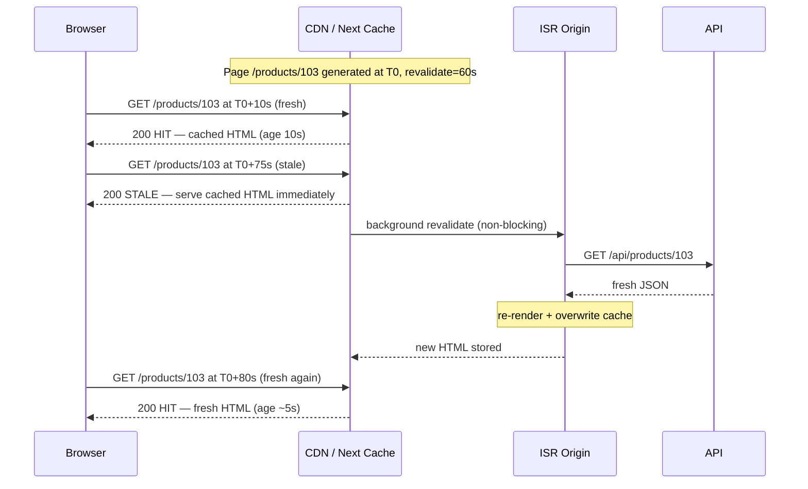
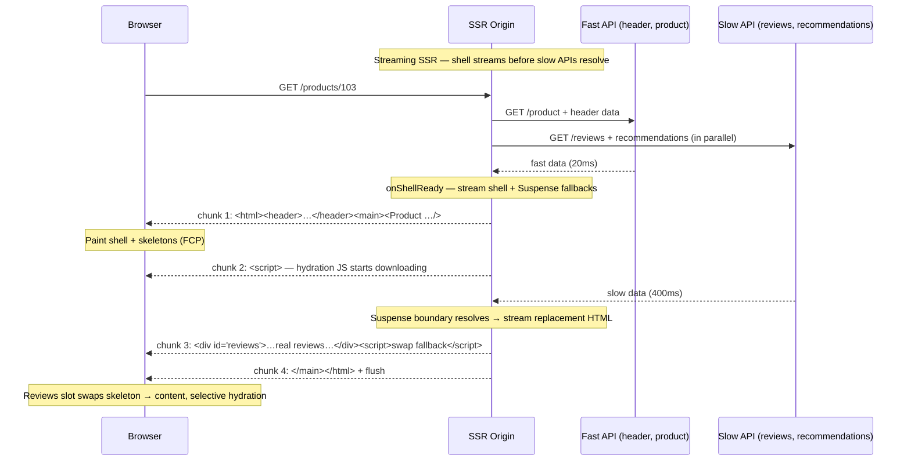
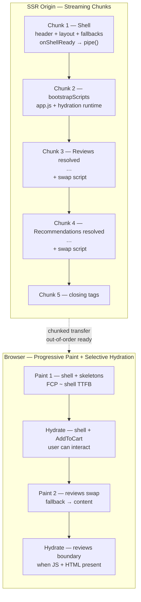
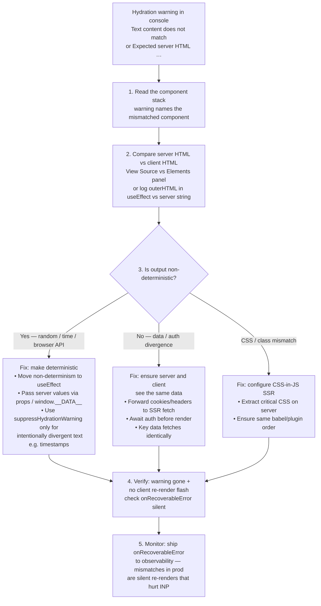
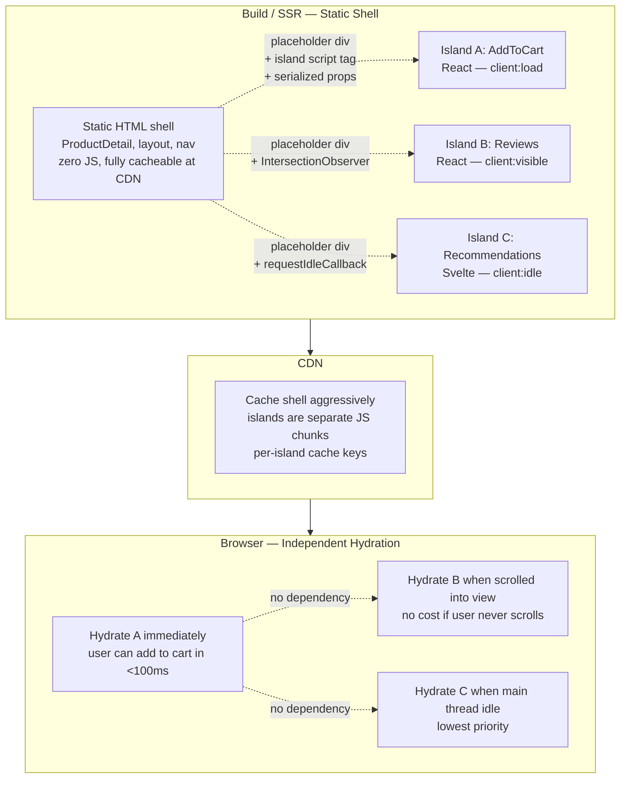
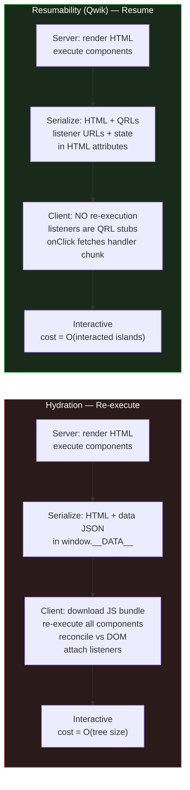

# Chapter 9 — Rendering at Scale: SSR, SSG, ISR, Streaming SSR, Hydration, Islands, and Partial Hydration

*What this chapter covers:* Every modern frontend framework must answer one question: where does HTML come from and when does it become interactive? This chapter traces the full rendering spectrum — client-side rendering (CSR), server-side rendering (SSR), static generation (SSG), incremental static regeneration (ISR), streaming SSR with Suspense, and the post-render phase where HTML becomes an application (hydration). We then examine the escape hatches that make scale tractable: islands architecture, partial hydration, and resumability. Along the way we ground each abstraction in concrete runtime mechanics — `renderToString` vs `renderToPipeableStream`, `hydrateRoot` reconciliation, Next.js App Router and React Server Components (RSC), and Astro's island directives — and connect every choice to the realities of CDNs, cache invalidation, and multi-service backends.

**Learning goals:**

- Distinguish CSR, SSR, SSG, ISR, and streaming SSR by where HTML is produced, when it is produced, and what is cached where — and choose correctly for a given page's data freshness, personalization, and traffic profile.
- Explain SSR internals from first principles: synchronous `renderToString` vs streaming `renderToPipeableStream` / `renderToReadableStream`, backpressure, and why the latter unlocks Suspense.
- Implement SSG and ISR in Next.js (Pages and App Router), including `revalidate`, `fallback`, on-demand revalidation with `revalidatePath`/`revalidateTag`, and `fetch` cache semantics — and reason about their consistency model (stale-while-revalidate).
- Wire streaming SSR end-to-end with React `Suspense`, understand chunk framing and selective hydration, and debug the resulting out-of-order delivery.
- Describe hydration precisely — what `hydrateRoot` does, why it re-executes component trees, how mismatches are detected, and how to diagnose and fix them without `suppressHydrationWarning` as a crutch.
- Compare islands architecture (Astro, Fresh) and partial hydration against full-page hydration, and explain Qwik's resumability as a qualitatively different strategy that eliminates hydration entirely.
- Quantify performance trade-offs with real metrics (TTFB, FCP, LCP, TTI, INP) and connect rendering choices to distributed-systems concerns: CDN cache hit ratios, origin load, thundering herds on revalidation, and independent deployability.

---

## 1. The Rendering Spectrum: Where and When HTML Is Born

Every rendering strategy is a placement decision along two axes: **where** the HTML bytes are assembled (browser vs server vs build) and **when** they are assembled (request time vs build time vs background revalidation). Get either axis wrong and you pay in latency, origin cost, or stale data.

| Strategy | Where HTML is built | When | Cacheable at CDN? | Data freshness | Interactivity |
|----------|---------------------|------|-------------------|----------------|---------------|
| CSR (SPA) | Browser | On navigation | Only shell + JS | Live (client fetch) | After JS download + hydration |
| SSR (`renderToString`) | Server | Per request | Conditionally (short TTL / Vary) | Per-request fresh | After full HTML + hydration |
| Streaming SSR | Server | Per request, chunked | Same as SSR, but TTFB wins | Per-request fresh, progressive | Selective / prioritized hydration |
| SSG | Build worker | At build | Aggressively (immutable until deploy) | Stale until next deploy | After hydration |
| ISR | Build + server | Build + background revalidate | Stale-while-revalidate | Bounded staleness | After hydration |
| Islands / Partial Hydration | Build + server + browser (per island) | Build + per-island hydration | Static shell cached, islands vary | Shell stale, islands live | Island-by-island |

For a backend engineer the analogy is precise: CSR is like a thick client that calls your APIs directly — the edge serves only static assets and your API fleet bears every read. SSR moves the aggregation to the server tier (a BFF / SSR origin) and ships assembled HTML. SSG/ISR push assembly into the build and CDN tier, turning the origin from a per-request renderer into a background revalidator. Islands push the decision down to the component level: each island declares its own hydration contract.

There is no globally optimal strategy. A marketing landing page, a personalized feed, and a real-time dashboard have different freshness, cardinality, and compute requirements. Scale forces you to mix them — often on the same route.

### 1.1 CSR vs SSR: The Waterfall That Users Actually Experience

In CSR the browser downloads a near-empty shell, then JavaScript, then data, then renders. In SSR the server does the data fetch and render before the first byte reaches the browser. The network waterfall differs fundamentally:

```mermaid
sequenceDiagram
    participant Browser
    participant CDN
    participant Origin as SSR Origin
    participant API as Data API

    rect rgb(30, 30, 60)
        note over Browser,API: CSR — three serial waterfalls before pixels
        Browser->>CDN: GET / (shell HTML)
        CDN-->>Browser: 200 shell (empty div + script tags)
        Browser->>CDN: GET /assets/app.js
        CDN-->>Browser: app.js
        Browser->>API: GET /api/products
        API-->>Browser: JSON
        Note over Browser: React renders + paints
    end

    rect rgb(30, 60, 30)
        note over Browser,API: SSR — one waterfall, first byte is content
        Browser->>CDN: GET /products
        CDN->>Origin: cache miss → render
        Origin->>API: GET /api/products (server-side)
        API-->>Origin: JSON
        Note over Origin: renderToPipeableStream → HTML
        Origin-->>CDN: 200 HTML (contentful)
        CDN-->>Browser: HTML (paints immediately)
        Browser->>CDN: GET /assets/app.js (hydration)
        Note over Browser: hydrateRoot — attach listeners
    end
```



Two observations matter at scale:

1. **TTFB vs completeness trade-off.** CSR TTFB is fast (CDN serves a tiny shell) but *meaningful* paint is late — after JS and data fetches. SSR TTFB is slower (origin must fetch data and render) but first contentful paint (FCP) arrives with that first byte. Users perceive SSR as faster even when total bytes are larger, because the browser can paint and the user can read before JavaScript arrives.
2. **Origin load.** CSR moves load to your API fleet and the user's device. SSR concentrates load on the SSR origin. Without caching, SSR is an amplification layer — one page request fans out to N API calls server-side. This is the core scaling problem the rest of this chapter solves.

---

## 2. SSR in Depth: From `renderToString` to Streaming

### 2.1 The Naive Model: `renderToString`

React 16-era SSR was synchronous and blocking:

```typescript
// server-legacy.tsx — synchronous SSR (blocking)
import { renderToString } from "react-dom/server";
import App from "./App";

export function handleRequest(req: Request, res: Response) {
  // 1. Fetch all data BEFORE rendering — waterfall is serial
  const data = await fetchProduct(req.params.id); // blocks
  const html = renderToString(<App data={data} />);

  res.setHeader("Content-Type", "text/html");
  res.end(`<!DOCTYPE html>
    <html><head><link rel="stylesheet" href="/assets/app.css"></head>
    <body>
      <div id="root">${html}</div>
      <script>window.__DATA__ = ${JSON.stringify(data)}</script>
      <script src="/assets/app.js"></script>
    </body></html>`);
}
```

`renderToString` renders the entire tree to a string in memory, then sends it. It is simple, debuggable, and compatible with any streaming-incompetent proxy — but it has three scaling liabilities:

- **All-or-nothing TTFB.** The slowest `await` before `renderToString` delays the first byte for every user. One slow downstream API stalls the entire page.
- **Memory pressure.** The full HTML string is buffered in memory before flushing. For large pages (catalog, search results) this allocates and holds O(page size) on the SSR origin per concurrent request — GC pressure under load.
- **No Suspense.** `renderToString` cannot suspend. If a component throws a promise (Suspense), the legacy API has no way to emit a fallback and resume later.

For low-traffic internal tools this is fine. For a high-traffic storefront it is a bottleneck.

### 2.2 The Streaming Model: `renderToPipeableStream` and `renderToReadableStream`

React 18 replaced the blocking model with streaming renderers that write HTML incrementally as data resolves, interleaving Suspense fallbacks with eventual content.

```typescript
// server-streaming.tsx — streaming SSR with Suspense + backpressure
import { renderToPipeableStream } from "react-dom/server";
import { DataProvider } from "./data";
import App from "./App";

export function handleRequest(req: Request, res: Response) {
  let didError = false;

  const { pipe, abort } = renderToPipeableStream(
    <DataProvider>
      <App />
    </DataProvider>,
    {
      bootstrapScripts: ["/assets/app.js"],
      // Called when the shell (non-Suspense content) is ready to stream
      onShellReady() {
        res.statusCode = didError ? 500 : 200;
        res.setHeader("Content-Type", "text/html");
        pipe(res); // Node Writable — respects backpressure
      },
      onShellError(err) {
        console.error("Shell error", err);
        res.statusCode = 500;
        res.setHeader("Content-Type", "text/html");
        res.end("<!doctype html><p>Internal Server Error</p>");
      },
      onError(err) {
        didError = true;
        console.error("Recoverable render error", err);
        // Stream continues — error boundary / fallback is emitted
      },
    }
  );

  // Safety: abort suspended work if client disconnects
  req.on("close", () => abort());
  // Optional hard timeout — prevent dangling renders under downstream stalls
  setTimeout(abort, 10_000);
}
```

The Edge / Web Streams variant is symmetrical:

```typescript
// server-edge.tsx — Edge runtime (Cloudflare Workers / Vercel Edge)
import { renderToReadableStream } from "react-dom/server";

export default {
  async fetch(req: Request): Promise<Response> {
    const stream = await renderToReadableStream(<App />, {
      bootstrapScripts: ["/assets/app.js"],
      onError(err) { console.error(err); },
    });
    return new Response(stream, {
      headers: { "Content-Type": "text/html" },
    });
  },
};
```

What streaming buys you at scale:

- **Earlier TTFB.** `onShellReady` fires as soon as everything *outside* Suspense boundaries is ready. The browser receives the shell (header, nav, layout, fallbacks) while slow islands are still fetching server-side. Paint starts before the slowest API responds.
- **Backpressure awareness.** `pipe(res)` respects Node stream backpressure — if the client is on a slow link, the renderer pauses rather than buffering unbounded HTML in origin memory. This is the same flow-control principle as TCP windowing applied to HTML generation.
- **Resilience.** A single failing Suspense boundary emits its error fallback; the rest of the page still streams. With `renderToString`, one throw fails the whole page.

The cost is complexity: chunked transfer encoding, inline `<script>` placeholders that the client runtime uses to swap fallbacks for resolved content, and the fact that some intermediaries (older WAFs, misconfigured proxies) buffer chunked responses — negating the benefit. Validate your CDN and proxy chain actually forwards chunks; otherwise you have added complexity for no TTFB gain.

### 2.3 Next.js: From `getServerSideProps` to React Server Components

Next.js is the clearest record of how the community's mental model shifted.

**Pages Router (pre-13) — explicit per-page SSR/SSG:**

```typescript
// pages/products/[id].tsx — Pages Router
import type { GetServerSideProps, GetStaticProps, GetStaticPaths } from "next";

// SSR — runs on every request, origin does data fetch + render
export const getServerSideProps: GetServerSideProps = async ({ params }) => {
  const product = await fetch(`https://api.internal/products/${params!.id}`).then(r => r.json());
  if (!product) return { notFound: true };
  return { props: { product } }; // serialized as JSON into HTML
};
export default function ProductPage({ product }: { product: Product }) {
  return <ProductDetail product={product} />;
};

// SSG + ISR — rendered at build, revalidated in background
export const getStaticPaths: GetStaticPaths = async () => {
  const ids = await fetchTopProductIds(); // e.g. top 1000 at build time
  return { paths: ids.map(id => ({ params: { id } })), fallback: "blocking" };
};
export const getStaticProps: GetStaticProps = async ({ params }) => {
  const product = await fetch(`https://api.internal/products/${params!.id}`).then(r => r.json());
  return { props: { product }, revalidate: 60 }; // ISR: regenerate at most every 60s
};
```

**App Router (13+) — Server Components by default, `fetch` cache controls rendering:**

```typescript
// app/products/[id]/page.tsx — App Router + RSC
// This file is a React Server Component — it runs ONLY on the server,
// never ships to the browser, and can await directly.

export const revalidate = 60; // route-level ISR: background revalidate every 60s
// Alternatives: export const dynamic = 'force-dynamic'  // always SSR
//              export const dynamic = 'force-static'    // always SSG

async function getProduct(id: string) {
  // Next.js extends fetch with cache + revalidation semantics:
  const res = await fetch(`https://api.internal/products/${id}`, {
    // Per-fetch control — more granular than route-level revalidate
    next: { revalidate: 60, tags: ["products"] },
    // cache: 'no-store'  → always dynamic (SSR)
    // cache: 'force-cache' → static (SSG)
  });
  if (!res.ok) throw new Error(`Failed to fetch product ${id}`);
  return res.json();
}

export default async function ProductPage({ params }: { params: { id: string } }) {
  // No getServerSideProps, no props serialization — just await.
  const product = await getProduct(params.id);
  return (
    <div>
      <h1>{product.name}</h1>
      {/* Client Component boundary — only this subtree hydrates */}
      <AddToCartButton productId={product.id} />
      {/* Streaming: slow part wrapped in Suspense — shell streams immediately */}
      <Suspense fallback={<ReviewsSkeleton />}>
        <Reviews productId={product.id} />
      </Suspense>
    </div>
  );
}

// On-demand revalidation — call from webhook / admin mutation
// app/api/revalidate/route.ts
import { revalidateTag, revalidatePath } from "next/cache";
export async function POST(req: Request) {
  const { tag, path } = await req.json();
  if (tag) revalidateTag(tag);   // purge all fetches tagged "products"
  if (path) revalidatePath(path); // purge a specific route
  return Response.json({ revalidated: true });
}
```

The App Router collapses three previously distinct concepts (SSR, SSG, ISR) into a single caching model: every `fetch` declares its freshness contract, and the framework derives the rendering strategy. A `fetch` with `cache: 'no-store'` makes the route dynamic; a `fetch` with `revalidate` makes it ISR; no fetch at all makes it static. This is more compositional than the Pages Router's per-page mode switch and maps cleanly onto CDN semantics — but it demands that developers understand HTTP caching, not just React.

**Next.js configuration that matters at scale:**

```javascript
// next.config.js
/** @type {import('next').NextConfig} */
const config = {
  // Standalone output for container deploys — no next start dependency on node_modules
  output: "standalone",

  // ISR / fetch cache backed by Redis for multi-instance consistency (self-hosted)
  // On Vercel this is automatic; self-hosted you wire it:
  // experimental: { incrementalCacheHandlerPath: require.resolve('./cache-handler.js') },

  // Streaming requires no extra flag since Next 13 — but compression + chunked encoding do:
  compress: true,

  // CDN + cache headers — App Router respects fetch revalidate, but static assets need explicit policy
  async headers() {
    return [
      {
        source: "/assets/:path*",
        headers: [{ key: "Cache-Control", value: "public, max-age=31536000, immutable" }],
      },
    ];
  },

  // Split vendor chunks for hydration cost control — large hydration JS delays TTI
  webpack(cfg) {
    cfg.optimization.splitChunks = {
      chunks: "all",
      cacheGroups: {
        framework: { test: /[\\/]node_modules[\\/](react|react-dom|scheduler)[\\/]/, name: "framework", priority: 40 },
        lib: { test: /[\\/]node_modules[\\/]/, name: "lib", priority: 30 },
      },
    };
    return cfg;
  },
};
export default config;
```

---

## 3. SSG and ISR: Pre-render Once, Revalidate in the Background

### 3.1 SSG — Shift Rendering Left to Build Time

Static generation renders pages at build time and emits HTML files that any CDN can serve as immutable assets. For content with low write frequency (marketing pages, docs, blog posts) this is optimal: origin cost is zero at request time, cache hit ratio is ~100%, and global latency is the CDN edge RTT.

```bash
# Build-time SSG — output is plain HTML + JSON data files
$ next build
Route (app)                              Size     First Load JS
┌ ○ /                                    5.2 kB          87 kB
├ ○ /about                               1.1 kB          83 kB
├ ● /products/[id] (ISR: 60s)           8.4 kB          91 kB  # ● = ISR, ○ = static
└ λ /api/revalidate                      0  B             0 B  # λ = server function

# Emitted artifacts (self-hosted output: standalone)
$ ls .next/server/app/products/
103.html  104.html  105.html  # one HTML file per pre-rendered param
$ ls .next/static/chunks/
framework-*.js  lib-*.js  app-*.js
```

The scaling constraint is cardinality. Pre-rendering 10 million product pages at build time is infeasible — build duration, storage, and the fact that most pages are never visited make exhaustive SSG wasteful. ISR exists to solve this.

### 3.2 ISR — Stale-While-Revalidate as a Consistency Model

ISR borrows directly from HTTP's `stale-while-revalidate` (RFC 5861). The first request after a page becomes stale is served **immediately** from the stale cache while a background regeneration is triggered. Subsequent requests get the fresh page once regeneration completes.



This is an **eventually consistent** model with bounded staleness. Readers never block on writes. The write path (revalidation) is asynchronous and decoupled from the read path — the same pattern as a database read replica with async replication or a CQRS projection that lags behind the write model. The bound is `revalidate` seconds plus regeneration time.

Three `fallback` modes handle the case where a path was not generated at build time:

| `fallback` | Behavior on first request for unknown path | Use when |
|------------|---------------------------------------------|----------|
| `false` | 404 immediately | Closed set (e.g. `/docs/[slug]` from known files) |
| `true` | Serve fallback shell, then client-side fill + cache | Large set, want fast TTFB even on miss |
| `"blocking"` | SSR on first request (no fallback), then cache | Large set, SEO-sensitive, prefer complete HTML on first hit |

In the App Router, `fallback` is replaced by `dynamicParams`:

```typescript
// app/products/[id]/page.tsx
export const dynamicParams = true; // true → blocking-like: unknown ids render on demand then cache
// dynamicParams = false → 404 on unknown ids (like fallback: false)

export async function generateStaticParams() {
  // Controls which params are pre-rendered at build — same as getStaticPaths
  return (await fetchTopIds()).map(id => ({ id }));
}
```

### 3.3 On-Demand Revalidation — Closing the Staleness Window

Time-based revalidation bounds staleness but cannot react to writes. When a product price changes, waiting up to 60 seconds to reflect it may violate business requirements. On-demand revalidation lets the write path explicitly invalidate the read path:

```typescript
// When product 103 is updated via admin API / CMS webhook:
 // 1. Tag-based — most granular, App Router idiomatic:
 await fetch("https://app.example.com/api/revalidate", {
   method: "POST",
   body: JSON.stringify({ tag: "products" }),
   // Server handler calls revalidateTag("products")
 });

 // 2. Path-based — coarser, Pages Router compatible:
 // revalidatePath("/products/103")

 // 3. Self-hosted cache handler — must propagate across instances:
 // If you run N SSR origins behind a load balancer without shared cache,
 // each origin must receive the invalidation (pub/sub) or share a cache (Redis).
```

The distributed-systems problem is cache coherence. With a single Vercel-like platform, the cache is global. Self-hosted with N replicas and local filesystem caches, an on-demand revalidation that hits replica A does not purge replica B — users see inconsistent pages depending on which replica the load balancer chose. Solutions in order of robustness:

1. **Shared cache backend** (Redis, S3, or a purpose-built incremental cache handler) so all replicas read/write the same store.
2. **Pub/sub invalidation** — publish revalidation events to all replicas via Redis pub/sub, NATS, or similar.
3. **CDN purge** — issue a CDN cache purge (CloudFront invalidation, Fastly purge key, Cloudflare cache tag) so the CDN refetches from any replica.

Without one of these, ISR self-hosted at scale exhibits the same split-brain that any replicated cache without invalidation does.

---

## 4. Streaming SSR: Suspense, Chunks, and Selective Hydration

### 4.1 Why Streaming Exists

Without streaming, the SSR waterfall is serial: fetch all data → render → send. The 95th-percentile API dominates TTFB. With streaming, Suspense boundaries let the server send the shell early and fill holes as data arrives — overlapping data fetching, rendering, and network transfer.



The key mechanism is the **template + inline script** pattern. Each Suspense boundary emits a fallback with a unique ID and, when its data resolves, an inline `<script>` that moves the resolved HTML into place. The client React runtime listens for these swaps and hydrates each boundary independently — this is *selective hydration*.

### 4.2 Suspense Boundaries as Scheduling Primitives

```typescript
// app/products/[id]/page.tsx — streaming with prioritized Suspense
import { Suspense } from "react";

// Server Components can be async — they suspend implicitly when awaiting
async function Reviews({ productId }: { productId: string }) {
  // This fetch suspends the Reviews boundary until it resolves
  const reviews = await fetch(`https://api.internal/products/${productId}/reviews`, {
    next: { revalidate: 30 },
  }).then(r => r.json());
  return <ReviewList reviews={reviews} />;
}

async function Recommendations({ productId }: { productId: string }) {
  const recs = await fetch(`https://api.internal/products/${productId}/recs`).then(r => r.json());
  return <Carousel items={recs} />;
}

export default function ProductPage({ params }: { params: { id: string } }) {
  return (
    <div>
      {/* Shell — streams immediately, no suspension */}
      <ProductHeader id={params.id} />

      {/* Each Suspense boundary is an independent streaming unit.
          Slow boundaries do NOT block the shell or each other. */}
      <Suspense fallback={<ReviewsSkeleton />}>
        <Reviews productId={params.id} />
      </Suspense>

      <Suspense fallback={<CarouselSkeleton />}>
        <Recommendations productId={params.id} />
      </Suspense>

      {/* Client island — hydrates independently, can hydrate before reviews resolve */}
      <Suspense fallback={null}>
        <AddToCartHydrationBoundary productId={params.id} />
      </Suspense>
    </div>
  );
}
```

Streaming + Suspense gives the server a **priority scheduler** that mirrors React's client scheduler:

- Shell content has highest priority — it streams first.
- Each Suspense boundary resolves independently — no head-of-line blocking.
- On the client, React hydrates boundaries in priority order (user-interacted boundaries first via selective hydration) rather than top-to-bottom.



### 4.3 Operational Realities of Streaming

Streaming is not free. Validate these before committing a route to it:

- **Proxy buffering.** Some corporate proxies, WAFs, and older Nginx configs buffer chunked responses until `Content-Length` is known — check `proxy_buffering off` and `chunked_transfer_encoding on` where applicable.
- **Compression.** Streaming + gzip/brotli interact: the compressor must flush per chunk. Most CDNs handle this, but self-hosted Nginx `gzip` with default buffering may delay chunks.
- **Error handling.** Errors inside a Suspense boundary after the shell has been sent cannot change the HTTP status code (headers already flushed). Your monitoring must distinguish shell errors (5xx status) from boundary errors (200 with embedded error fallback) — they look identical at the CDN layer unless you emit a header or metric.

---

## 5. Hydration: Attaching Interactivity to Server HTML

### 5.1 What `hydrateRoot` Actually Does

Hydration is often described as "attaching event listeners." That undersells it. `hydrateRoot` re-executes your component tree on the client, builds a Fiber tree, and **reconciles** it against the server-rendered DOM — reusing existing DOM nodes where they match and warning where they diverge.

```typescript
// client.tsx — hydration entry
import { hydrateRoot } from "react-dom/client";
import App from "./App";

// hydrateRoot: React takes over existing DOM inside #root.
// It does NOT re-render from scratch — it walks the existing DOM and attaches.
hydrateRoot(
  document.getElementById("root")!,
  <App data={window.__DATA__} />,
  {
    onRecoverableError(err, info) {
      // Mismatches and recoverable render errors land here — log them
      console.error("Recoverable hydration error", err, info.componentStack);
      reportToObservability(err, info);
    },
  }
);

// Contrast:
// createRoot(document.getElementById("root")!).render(<App />)
//   → discards server HTML, renders from scratch (CSR). No hydration, no mismatch check.
// hydrateRoot(...)
//   → reuses server HTML, warns on mismatch, preserves DOM state (focus, scroll, input values).
```

The cost of hydration is proportional to the size of the hydrated tree — every component function re-executes, every hook re-initializes, and the reconciler walks the DOM. Hydrating a 5,000-node product page is O(nodes) CPU on the main thread, blocking user interaction (TTI) until complete. This is why full-page hydration scales poorly and why islands/partial hydration exist (Section 6).

**Selective hydration** (React 18+) improves the UX without reducing the CPU cost: React hydrates boundaries in priority order and can interrupt low-priority hydration to handle a user event (e.g., clicking an "Add to Cart" button hydrates that boundary first). TTI for the *interacted* island improves; total hydration time does not shrink.

### 5.2 Hydration Mismatches: Causes, Detection, Debugging

A mismatch means the server-rendered HTML and the client's first render produced different output for the same component. React detects this during hydration by comparing the expected DOM (from the client render) with the actual DOM (from the server). In development it logs a warning; in production it attempts to recover by re-rendering the mismatched subtree on the client (discarding server HTML for that subtree).

Common causes — every one is a **non-determinism** between server and client:

| Cause | Example | Why it mismatches |
|-------|---------|-------------------|
| Random / time | `Math.random()`, `Date.now()`, `new Date().toLocaleString()` | Server and client generate different values |
| Browser-only globals | `window.innerWidth`, `localStorage`, `navigator` | Undefined on server, defined on client |
| User-specific data | Auth state, cookies not forwarded to SSR | Server renders logged-out, client renders logged-in |
| Locale / timezone | `Intl.DateTimeFormat` without explicit locale | Server locale (e.g. `en-US` container) vs client locale |
| CSS-in-JS ordering | Emotion/styled-components without SSR setup | Class name hashes differ between server/client |
| Streaming + non-deterministic Suspense | Data fetch not keyed consistently | Fallback vs content differs between renders |

**Debugging workflow:**



Concrete fix — the most common mismatch, a timestamp:

```typescript
// ❌ Mismatches — server and client render different strings
function LastUpdated({ ts }: { ts: number }) {
  return <time>{new Date(ts).toLocaleString()}</time>;
  // Server: "8/21/2026, 12:00:00 AM" (UTC container)
  // Client: "8/21/2026, 8:00:00 AM"  (local timezone) → mismatch
}

// ✅ Deterministic — format on server, hydrate with same string
function LastUpdatedFixed({ ts, formatted }: { ts: number; formatted: string }) {
  // formatted is produced server-side with explicit locale/timezone
  return <time suppressHydrationWarning dateTime={new Date(ts).toISOString()}>
    {formatted}
  </time>;
  // Or defer formatting to client only:
}
function LastUpdatedClientOnly({ ts }: { ts: number }) {
  const [label, setLabel] = useState<string | null>(null);
  useEffect(() => {
    // Runs only on client, after hydration — no mismatch possible
    setLabel(new Date(ts).toLocaleString());
  }, [ts]);
  if (label === null) return <time>{/* server placeholder */}—</time>;
  return <time>{label}</time>;
}
```

Rules of thumb for mismatch-free hydration:

1. **Server and client must be pure functions of the same props.** Any divergence is a bug. Treat `hydrateRoot`'s second argument as a consistency check — if it would render different HTML than the server did, hydration will warn and the client will pay for a re-render.
2. **Defer browser-only work to `useEffect`.** Effects do not run during SSR and do not participate in hydration comparison — they run after hydration commits.
3. **Instrument `onRecoverableError`.** In production, mismatches do not log to the console — they silently re-render the subtree. Without `onRecoverableError` telemetry you will not know you are shipping wasted client work and layout shifts.

---

## 6. Islands, Partial Hydration, and Resumability

Full-page hydration treats every component as interactive, even when 90% of the page is static content that will never need JavaScript. Islands architecture inverts this: the page is mostly static HTML with isolated *islands* of interactivity that hydrate independently.

### 6.1 Astro Islands — Declarative Hydration Directives

Astro renders every component to static HTML by default (zero JS). Only components annotated with a `client:*` directive ship JavaScript and hydrate:

```astro
---
// src/pages/products/[id].astro — Astro island page
import Layout from "../../layouts/Layout.astro";
import ProductDetail from "../../components/ProductDetail.astro"; // static — no JS
import AddToCart from "../../components/AddToCart.tsx";           // React island
import Reviews from "../../components/Reviews.tsx";                // React island
import Recommendations from "../../components/Recommendations.tsx";

const { id } = Astro.params;
const product = await fetch(`https://api.internal/products/${id}`).then(r => r.json());
// Astro SSG/SSR: this page can be pre-rendered (SSG) or server-rendered (SSR)
// via `export const prerender = true` or `output: "server"` in astro.config.mjs
---

<Layout title={product.name}>
  <!-- Static — no JS shipped, no hydration -->
  <ProductDetail product={product} />

  <!-- Island: hydrates immediately on page load (high priority) -->
  <AddToCart productId={product.id} client:load />

  <!-- Island: hydrates when visible (below the fold) -->
  <Reviews productId={product.id} client:visible />

  <!-- Island: hydrates when idle (lowest priority, non-critical) -->
  <Recommendations productId={product.id} client:idle />

  <!-- Island: hydrates on media query (e.g. mobile-only drawer) -->
  <!-- <MobileDrawer client:media="(max-width: 768px)" /> -->

  <!-- Island: never hydrates on client — server-only (e.g. heavy chart rendered as image) -->
  <!-- <ExpensiveChart data={data} server:only /> -->
</Layout>
```

```javascript
// astro.config.mjs — Astro configuration at scale
import { defineConfig } from "astro/config";
import react from "@astrojs/react";
import svelte from "@astrojs/svelte"; // multiple frameworks per page — islands are framework-agnostic

export default defineConfig({
  output: "server", // "static" | "server" | "hybrid"
  adapter: await import("@astrojs/node").then(m => m.default({ mode: "standalone" })),
  // Hybrid: pre-render marketing pages, SSR dynamic routes
  // src/pages/about.astro       → prerender = true  → SSG
  // src/pages/products/[id].astro → prerender = false → SSR

  integrations: [react(), svelte()],

  // Vite under the hood — same chunk-splitting concerns as Next.js
  vite: {
    build: {
      rollupOptions: {
        output: { manualChunks: { framework: ["react", "react-dom"] } },
      },
    },
  },
});
```

Hydration directives form a **priority and trigger matrix**:

| Directive | When JS loads | When hydration runs | Use for |
|-----------|---------------|---------------------|---------|
| `client:load` | Eagerly with page | Immediately | Above-the-fold, critical interactivity |
| `client:idle` | Eagerly | `requestIdleCallback` | Below-the-fold, non-critical |
| `client:visible` | Lazily | `IntersectionObserver` fires | Offscreen content |
| `client:media` | Lazily | Media query matches | Responsive-only components |
| `client:only="react"` | Eagerly | Immediately, no SSR | Browser-only components (maps, editors) |

The scaling win is multiplicative: each `client:visible` island below the fold saves JS download, parse, and hydration on initial load. For a content-heavy page with one critical island (add-to-cart) and five deferred islands, the initial JS payload can drop by 70-80% — directly improving TTI and INP.

### 6.2 Islands Architecture — How It Fits Together



Key differences from full-page hydration:

- **Failure isolation.** A JS error in the Reviews island does not break AddToCart. With full-page `hydrateRoot`, an uncaught error during hydration can leave the entire page non-interactive.
- **Independent versioning.** Islands can be deployed and cached independently — the shell at `v42` can serve an island JS chunk at `v43` as long as the props contract is respected. This mirrors micro-frontend deployability.
- **Framework agnostic.** Astro islands can mix React, Svelte, Vue, and Solid on the same page — each island is its own framework runtime, scoped to its DOM subtree. The shell pays no framework cost.

Fresh (Deno) follows the same model with `islands/` directory convention — any component under `islands/` is an island, everything else is static.

### 6.3 Resumability: Qwik's Alternative to Hydration

Hydration — even partial, even selective — re-executes component code on the client to rebuild the state that was already computed on the server. Qwik observes that this is wasted work: the server already knew the component tree, props, and listeners. Instead of re-executing, Qwik *serializes* that knowledge into HTML and *resumes* on the client without re-execution.



In Qwik, every event handler is a **QRL** (Qwik URL) — a lazy reference to a code chunk, serialized as an attribute:

```typescript
// Qwik component — looks like React, behaves differently
import { component$, useSignal, $ } from "@builder.io/qwik";

export const Counter = component$(() => {
  const count = useSignal(0);
  // $() marks the handler as a separate chunk — not bundled with the component
  const increment = $(() => count.value++);

  // Rendered HTML includes: <button on:click="./chunk-abc.js#increment[0]">
  // No JS executes on load — clicking fetches chunk-abc.js and resumes state.
  return <button onClick$={increment}>Count: {count.value}</button>;
});

// Build output — handler is a separate file, fetched only on interaction
// dist/build/counter-abc.js  →  export const increment = () => { ... }
```

Comparison on a 100-component page where the user interacts with one counter:

| Metric | Full hydration (React) | Partial hydration (Astro) | Resumability (Qwik) |
|--------|------------------------|---------------------------|---------------------|
| JS downloaded before any interaction | Entire app bundle (e.g. 150 kB) | Shell + `client:load` islands (e.g. 30 kB) | ~1 kB Qwik loader |
| JS executed before interaction | All 100 components re-execute | `client:load` islands re-execute | Zero component re-execution |
| JS on first interaction | Already loaded | Already loaded (if island hydrated) or load on trigger | Fetch one QRL chunk (e.g. 2 kB) |
| Time to interactive (TTI) | Hydration of whole tree completes | Hydration of critical islands completes | Loader parsed — effectively instant |
| State continuity | Rebuilt by re-execution | Rebuilt per island | Resumed from serialized state |

Resumability is not a free upgrade — it requires the framework to own serialization of state, listeners, and even lexical scope (closures must be serializable). Qwik's optimizer does this at build time via Rust-based transforms. For teams already on React, islands + partial hydration capture most of the benefit with less migration cost. For greenfield, latency-critical surfaces (e-commerce PDP, search), resumability's O(interaction) cost is unmatched.

---

## 7. Performance at Scale: TTFB, TTI, and the Distributed Systems Lens

### 7.1 Metrics That Actually Matter

Rendering choices move different Web Vitals in opposite directions. Optimizing one without measuring the others is how teams ship fast TTFB and slow INP.

| Metric | What it measures | Rendering lever |
|--------|------------------|-----------------|
| **TTFB** (Time to First Byte) | Server + network latency to first HTML byte | SSR streaming helps; SSG/ISR helps most (CDN hit) |
| **FCP** (First Contentful Paint) | First DOM content painted | SSR/SSG win over CSR; streaming shell paints early |
| **LCP** (Largest Contentful Paint) | Largest element (hero, product image) painted | SSR helps if LCP element is server-rendered; streaming with Suspense can *delay* LCP if hero is inside a suspended boundary |
| **TTI** (Time to Interactive) | Main thread idle + listeners attached | Islands / resumability win; full hydration loses |
| **INP** (Interaction to Next Paint) | Latency of worst interaction | Less hydration JS → less main-thread contention → better INP |
| **CLS** (Cumulative Layout Shift) | Visual stability | Suspense fallbacks must reserve space; mismatches cause shifts |

```mermaid
gantt
    title TTFB vs TTI — why streaming + islands win both
    dateFormat X
    axisFormat %L ms

    section CSR
    Download shell + JS       :0, 400
    Fetch data + render       :400, 900
    TTI (all JS + data)       : milestone, 900, 0

    section SSR renderToString
    Server render (blocking)  :0, 350
    TTFB                      : milestone, 350, 0
    Download JS + hydrate     :350, 850
    TTI (full hydration)      : milestone, 850, 0

    section Streaming SSR + Islands
    Server shell (TTFB)       :0, 80
    Paint shell + FCP         : milestone, 80, 0
    Stream reviews chunk      :80, 480
    Hydrate critical island   :80, 250
    TTI critical              : milestone, 250, 0
    Hydrate deferred islands  :480, 700
    TTI full                  : milestone, 700, 0
```



Three lessons from the timeline:

1. **Streaming moves TTFB left** (shell streams before slow data) and **islands move TTI left** (only critical islands hydrate before interactive). Together they close the TTFB–TTI gap that pure SSR leaves open.
2. **LCP can regress with streaming** if the LCP element is inside a Suspense boundary — the browser cannot paint it until the boundary resolves. Place LCP-critical content (hero image, product title) *outside* Suspense or in a high-priority boundary.
3. **TTI is not a single number** with selective hydration and islands. Report TTI-critical (time until primary CTA is interactive) and TTI-full separately — business metrics correlate with the former.

### 7.2 The Distributed Systems Lens

Rendering at scale is a distributed caching and consistency problem with a CDN, N SSR origins, a data API fleet, and browsers as the final replica.

**Cache hit ratio is the dominant cost lever.** Every SSR cache miss is an origin render that fans out to API calls. At 10k RPS with a 70% hit ratio, the origin handles 3k renders/s. At 95% hit ratio, 500 renders/s — a 6× reduction in origin fleet size. SSG and ISR exist to push the hit ratio toward 95%+ for cacheable pages. Measure hit ratio per route (`Cache-Status`, `X-Cache`, CDN analytics) and treat a drop as an incident.

**Stale-while-revalidate and the thundering herd.** When a popular ISR page expires, the first request triggers a background revalidation. If 1k requests arrive during the regeneration window and your cache does not coalesce them, you get 1k concurrent origin renders for the same page — a self-inflicted DDoS. Mitigations:

- **Request coalescing / singleflight** at the cache layer — only one regeneration per key at a time; others serve stale.
- **Soft TTL + hard TTL** — serve stale up to hard TTL while revalidating, only block when past hard TTL.
- **Origin concurrency limits** — cap concurrent renders per route; queue or shed load beyond the cap.

This is the same pattern as cache stampede protection in any distributed cache (see Volume 6, Chapter 3 — Caching Strategies).

**Invalidation propagation and consistency.** As noted in Section 3.3, ISR with N replicas and local caches is eventually consistent with no bound unless invalidations are broadcast. For price, inventory, or compliance-sensitive content, prefer on-demand revalidation with a shared cache or explicit CDN purge over time-based revalidation alone. Model it as you would any replicated state: define the consistency SLA (e.g., "price updates visible within 5 seconds globally"), instrument staleness, and alert when violated.

**Independent deployability.** Islands and micro-frontends let teams deploy rendering units independently — the shell at v42 can serve an island at v43. This requires a props contract (schema, versioned) and backward-compatible island interfaces. Treat island props like an API schema: version them, validate at build, and canary island JS changes separately from shell changes. Astro's per-island JS chunks make canarying natural; full-page hydration bundles make it all-or-nothing.

**Observability per rendering tier:**

```bash
# What to measure per route, per rendering strategy
# CDN layer
#   cache_hit_ratio, cache_age_seconds, revalidation_concurrency
# Origin layer
#   ssr_render_duration_p50/p95, render_error_rate, concurrent_renders
#   suspense_boundary_resolve_p95, streaming_chunk_count
# Browser layer (Real User Monitoring)
#   TTFB, FCP, LCP, INP, CLS, hydration_duration, hydration_mismatch_count
#   island_hydration_duration{island="AddToCart"}, qrl_fetch_latency{chunk="..."}
```

If you measure only origin latency and not LCP/INP, you will optimize TTFB at the expense of the metrics users and search ranking actually reward.

---

## Key takeaways

- CSR, SSR, SSG, ISR, and streaming SSR are placement decisions along *where* and *when* HTML is assembled. No single strategy is optimal for every page — mix them, often on the same route, guided by data freshness and traffic.
- `renderToString` is synchronous and blocking — simple but TTFB-bound by the slowest data fetch and memory-heavy under concurrency. `renderToPipeableStream` / `renderToReadableStream` stream the shell early, respect backpressure, and enable Suspense-driven progressive delivery.
- Next.js App Router collapses SSR/SSG/ISR into a unified `fetch` cache model (`cache`, `revalidate`, `tags`). Route-level `revalidate` and per-fetch `next.revalidate` replace the Pages Router's `getServerSideProps` / `getStaticProps` mode switch — understand HTTP caching to use it correctly.
- ISR is `stale-while-revalidate` with bounded staleness. Time-based `revalidate` bounds staleness passively; on-demand `revalidateTag` / `revalidatePath` closes the window on writes. Self-hosted ISR with N replicas requires a shared cache or broadcast invalidation to avoid split-brain.
- Streaming SSR via Suspense boundaries lets the server send the shell before slow data resolves, with inline scripts that swap fallbacks for content. Selective hydration then hydrates boundaries in priority order — but proxies/WAFs that buffer chunked responses negate the benefit, and errors after headers flush cannot change the status code.
- `hydrateRoot` re-executes the component tree and reconciles against server DOM — it is O(tree size) CPU on the main thread. Mismatches are non-determinisms between server and client (random, time, browser globals, unforwarded auth); defer browser-only work to `useEffect` and instrument `onRecoverableError` to catch silent production mismatches.
- Islands architecture (Astro `client:*`, Fresh) makes most of the page static HTML and hydrates only interactive islands, each with its own trigger (`load` / `idle` / `visible` / `media`). This isolates failures, enables per-island caching and deployability, and can cut initial JS by 70%+.
- Qwik's resumability eliminates hydration entirely by serializing listeners and state as QRLs in HTML — the client resumes without re-execution, paying O(interacted) rather than O(tree) cost. It is the strongest TTI optimization but requires framework-level serialization.
- Performance is multi-dimensional: streaming helps TTFB/FCP, islands/resumability help TTI/INP, and Suspense placement can hurt LCP if the hero is suspended. Measure all of TTFB, FCP, LCP, TTI, INP, and CLS per route — and treat rendering as a distributed caching problem with hit ratio, stampede protection, and consistency SLAs.

---

## Further reading

- React 18 — Rendering APIs: `renderToPipeableStream`, `renderToReadableStream`, `hydrateRoot`, and Suspense for SSR. https://react.dev/reference/react-dom/server and https://react.dev/reference/react-dom/client/hydrateRoot
- Next.js — App Router, Data Fetching and Caching, `fetch` extensions, `revalidateTag` / `revalidatePath`, and Route Segment Config (`revalidate`, `dynamic`, `dynamicParams`). https://nextjs.org/docs/app/building-your-application/caching and https://nextjs.org/docs/app/api-reference/functions/revalidateTag
- Next.js — `next.config.js` reference and `output: "standalone"` for container deploys. https://nextjs.org/docs/app/api-reference/next-config-js
- Astro — Islands architecture and `client:*` directives. https://docs.astro.build/en/concepts/islands/
- Fresh (Deno) — Islands architecture and partial hydration. https://fresh.deno.dev/docs/concepts/islands
- Qwik — Resumability vs hydration, QRLs, and the optimizer. https://qwik.dev/docs/concepts/resumable/ and https://qwik.dev/docs/advanced/optimizer/
- HTTP — `stale-while-revalidate` and `stale-if-error` (RFC 5861) and Cache-Control extensions. https://httpwg.org/specs/rfc5861.html
- Web Performance — Core Web Vitals (LCP, INP, CLS), TTFB, and RUM vs lab data. https://web.dev/vitals/ and https://developer.mozilla.org/en-US/docs/Web/Performance
- Vercel — Incremental Static Regeneration and On-Demand Revalidation deep dive (platform reference for ISR semantics that generalize to self-hosted). https://vercel.com/docs/incremental-static-regeneration

