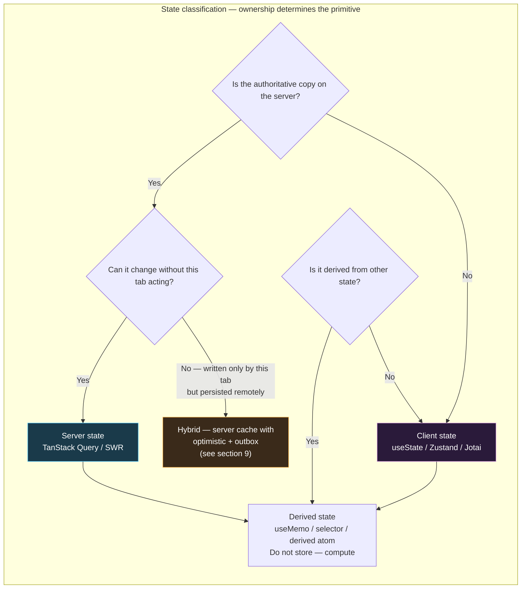
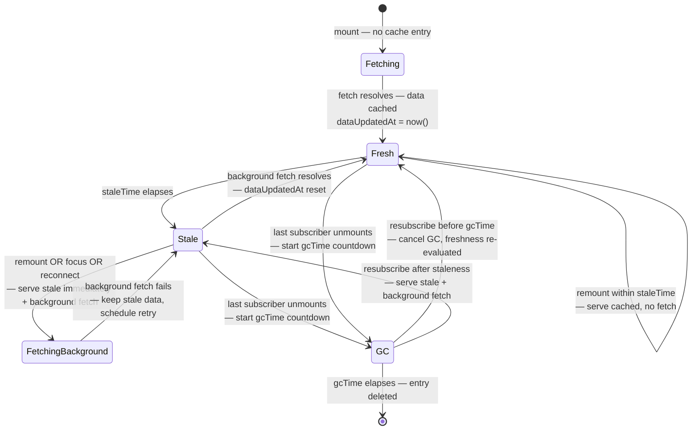
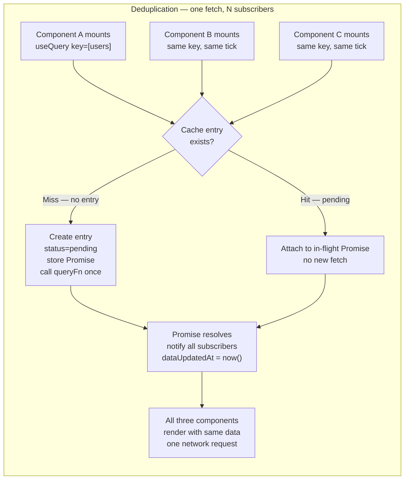
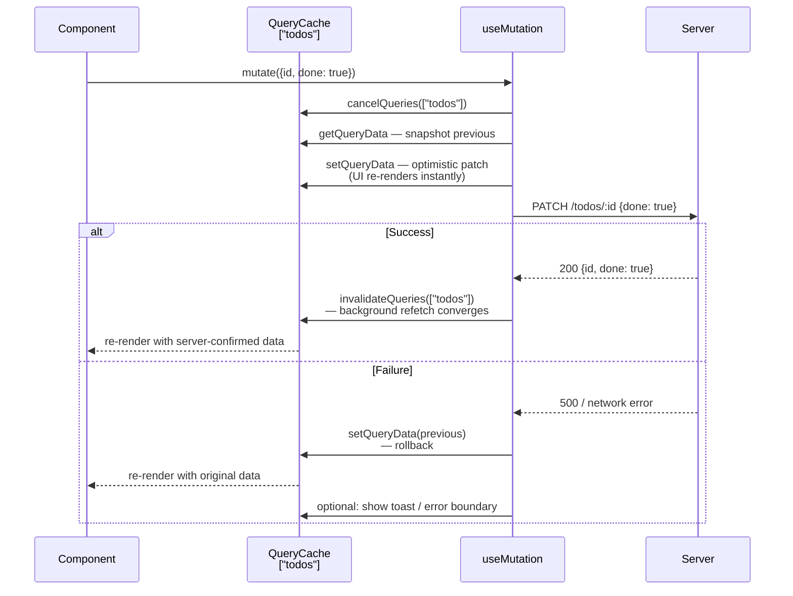
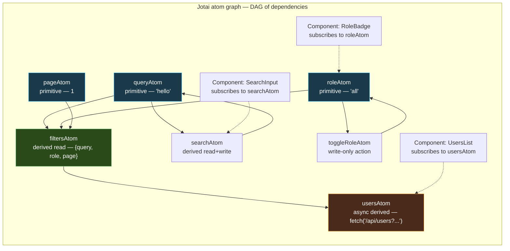
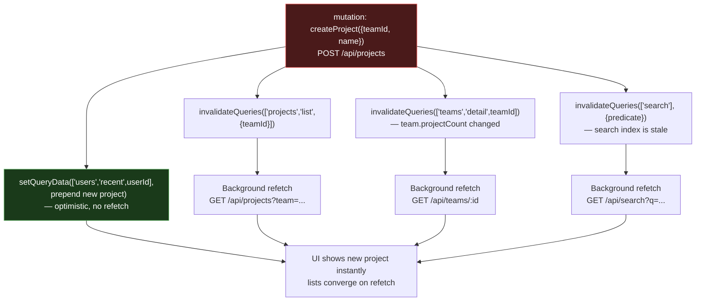
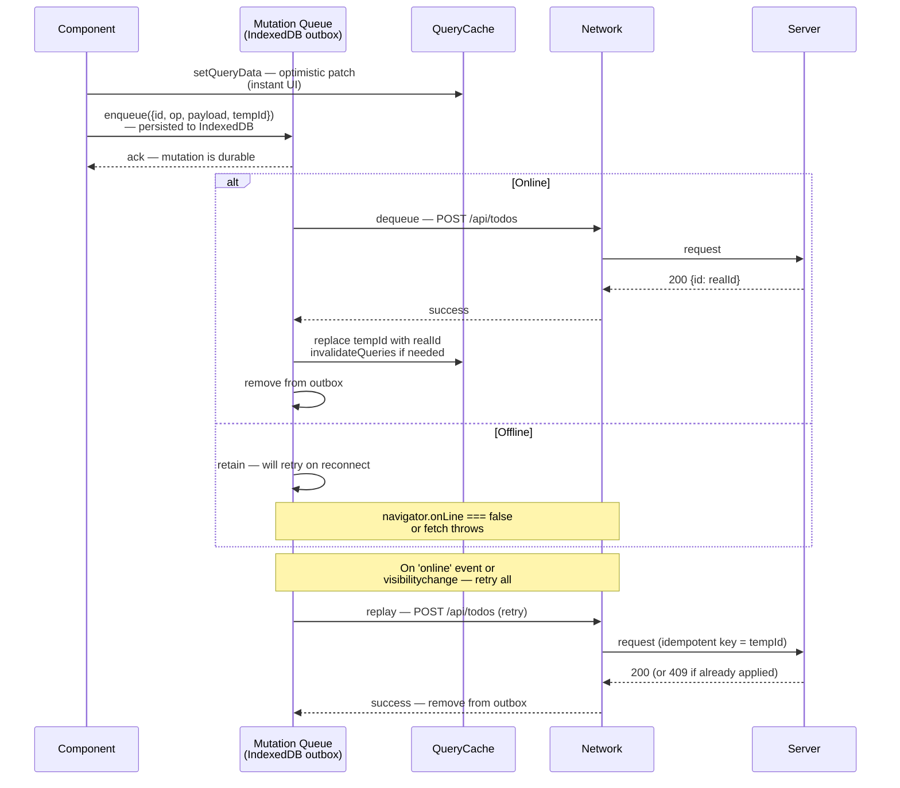
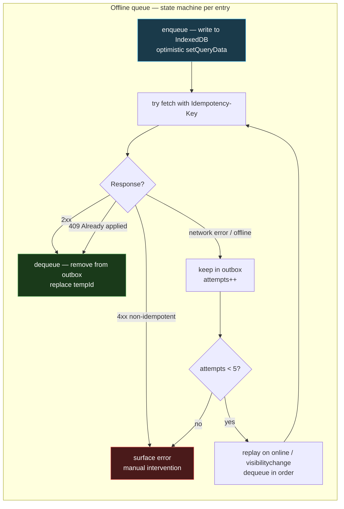

# Chapter 10 — State Management, Data Fetching, and Caching (TanStack Query, SWR, Zustand/Jotai, Cache Invalidation)

*What this chapter covers:* The two hard problems every production frontend eventually faces — keeping remote data consistent with the server without drowning in `useEffect` fetch logic, and keeping local UI state predictable without turning every component into a prop-drilling relay. We dissect server state and client state as fundamentally different consistency problems, then open the four tools senior teams actually standardize on: TanStack Query for canonical server-state caching (query keys, `staleTime` vs. `gcTime`, deduplication, retries, infinite queries, optimistic updates), SWR for its stale-while-revalidate simplicity and when its trade-offs bite, Zustand for minimal store-based client state, and Jotai for atom-graph fine-grained reactivity. Along the way we trace cache invalidation as a distributed invalidation problem, compare normalized vs. denormalized caches, and build an offline mutation queue that survives tab close and network partition.

**Learning goals:**

- Distinguish server state from client state by ownership, mutability, staleness, and invalidation semantics — and choose the correct primitive for each.
- Explain TanStack Query's cache model: `queryKey` as a hierarchical address, `staleTime` vs. `gcTime` (formerly `cacheTime`), deduplication, retry with exponential backoff, background refetch triggers, and garbage collection.
- Implement infinite queries (`useInfiniteQuery`), optimistic updates with rollback, and dependent/parallel query patterns without waterfalling.
- Compare TanStack Query and SWR on cache key design, revalidation triggers, mutation ergonomics, and middleware — and know when SWR's smaller API surface is the right call.
- Build client stores with Zustand (imperative store, selectors, subscriptions, middleware) and atom graphs with Jotai (primitive atoms, derived atoms, async atoms, atom dependency DAG).
- Design cache invalidation: `invalidateQueries` scoping, `refetchOnWindowFocus`/`refetchOnReconnect`/`refetchInterval`, tag-based and predicate invalidation, and the invalidation cascade.
- Contrast normalized vs. denormalized caches: why TanStack Query and SWR are denormalized by default, when normalization (entity tables, `normalizr`-style) pays off, and how Apollo Client's normalized cache differs.
- Implement an offline mutation queue with optimistic application, persistent outbox, conflict detection, and background sync replay — the frontend analog of a write-ahead log.

---

## 1. Two Kinds of State, Two Consistency Models

Every frontend bug that survives code review traces back to the same category error: treating server state as if it were client state.

| Property | Client state | Server state |
|---|---|---|
| **Owner** | The browser — this tab owns it | The server — the browser holds a cached replica |
| **Mutability** | Synchronous, local — `setState` is authoritative | Asynchronous, remote — local copy is stale the instant it is fetched |
| **Source of truth** | In-memory store / component | Database behind an API; other clients mutate it concurrently |
| **Consistency hazard** | Lost updates within the tab (rare) | Stale reads, write conflicts, concurrent writers (constant) |
| **Invalidation** | Explicit — reducer or setter | Implicit — TTL, focus, reconnect, push, poll, mutation |
| **Persistence** | Ephemeral unless persisted | Durable, but the cache is ephemeral |

A backend engineer already has the vocabulary for this. Client state is thread-local memory. Server state is a cache over a remote database with an unknown number of concurrent writers and no invalidation channel unless you build one. The entire design space of TanStack Query and SWR is a read-through cache with background revalidation. The entire design space of Zustand and Jotai is an in-process store with subscriptions.

Getting the boundary wrong produces two characteristic failure modes:

1. **Server state in a global store.** You `fetch('/api/users')` in a `useEffect`, `dispatch({ type: 'SET_USERS', payload })` into Redux/Zustand, and now you own the staleness problem yourself: when do you refetch? How do you deduplicate concurrent mounts? How do you garbage-collect? You have reimplemented half of TanStack Query, worse.

2. **Client state in the server cache.** You stash `isDropdownOpen` or `draftComment` as a query with `staleTime: Infinity`. It works until someone calls `invalidateQueries()` broadly and wipes UI state, or until you try to persist it and discover the query cache is not a state machine.

The rule is mechanical: **if the data has an authoritative copy on the server and can change without this tab acting, it is server state and belongs in a server-state cache. Otherwise it is client state and belongs in a store or component state.**



A practical test when reviewing a PR: look at each `useState` and each store slice and ask *would this value be wrong if another user mutated the same entity one second ago?* If yes, it should be a query, not state. Conversely, if a query key contains UI-only concerns (sort order, selected tab, ephemeral form draft), it should be a store atom that *parameterizes* the query, not part of the cached value.

### 1.1 Where the old patterns break

The naive fetch-in-effect pattern fails on every property a cache must provide:

```typescript
// Anti-pattern — every concern is manual and subtly wrong
function UsersList() {
  const [users, setUsers] = useState<User[]>([]);
  const [loading, setLoading] = useState(true);
  const [error, setError] = useState<Error | null>(null);

  useEffect(() => {
    let cancelled = false;
    setLoading(true);
    fetch("/api/users")
      .then((r) => {
        if (!r.ok) throw new Error(String(r.status));
        return r.json();
      })
      .then((data) => {
        if (!cancelled) setUsers(data);
      })
      .catch((e) => {
        if (!cancelled) setError(e);
      })
      .finally(() => {
        if (!cancelled) setLoading(false);
      });
    return () => { cancelled = true; };
  }, []); // empty deps — never refetches, even on window focus or reconnect

  // Missing: deduplication (two mounts = two fetches)
  // Missing: retry with backoff (one transient 503 = permanent error)
  // Missing: garbage collection (users stays in memory after unmount forever)
  // Missing: background revalidation (stale after first render, forever)
  // Missing: dependent query coordination (fetch posts after users? waterfall)
}
```

Each `// Missing` comment is a feature TanStack Query or SWR provides by default. Reimplementing them correctly requires roughly 300 lines of careful cache, timer, and subscription logic — which is precisely what those libraries are.

---

## 2. TanStack Query — A Read-Through Cache for Server State

TanStack Query (v5, formerly React Query) is not a data-fetching library. It is a **cache with a fetcher interface**. Its core abstraction is `QueryCache` — an in-memory `Map<QueryKey, QueryEntry>` where each entry holds `data`, `error`, `status`, `fetchStatus`, `dataUpdatedAt`, and timers for staleness and garbage collection. Every hook (`useQuery`, `useInfiniteQuery`, `useQueries`) is a subscription to one or more entries in that cache.

### 2.1 `queryKey` — The Hierarchical Address

The `queryKey` is the cache address. It is an array, compared by deep structural equality (via `dequal`-style hashing), where prefix matching determines invalidation scope.

```typescript
import { QueryClient, useQuery, useQueryClient } from "@tanstack/react-query";

// Key design — hierarchical, serializable, stable
const userKeys = {
  all: ["users"] as const,
  lists: () => [...userKeys.all, "list"] as const,
  list: (filters: { role?: string; page?: number }) =>
    [...userKeys.lists(), filters] as const,
  details: () => [...userKeys.all, "detail"] as const,
  detail: (id: string) => [...userKeys.details(), id] as const,
};

// Usage — each key is a distinct cache entry
function useUsers(filters: { role?: string }) {
  return useQuery({
    queryKey: userKeys.list(filters),       // e.g. ["users","list",{role:"admin"}]
    queryFn: () => fetchUsers(filters),     // only called on cache miss or stale revalidation
  });
}

function useUser(id: string) {
  return useQuery({
    queryKey: userKeys.detail(id),          // ["users","detail","42"]
    queryFn: () => fetchUser(id),
    enabled: !!id,                          // dependent query — disabled until id is truthy
  });
}

// Invalidation by prefix — one call wipes the subtree
function useInvalidateUsers() {
  const qc = useQueryClient();
  return {
    invalidateAll: () => qc.invalidateQueries({ queryKey: userKeys.all }),
    invalidateLists: () => qc.invalidateQueries({ queryKey: userKeys.lists() }),
    invalidateOne: (id: string) => qc.invalidateQueries({ queryKey: userKeys.detail(id) }),
  };
}
```

Three rules that prevent the most common production bugs:

1. **Keys must be serializable.** The key is hashed to a string for `Map` lookup. Non-serializable members (class instances, functions) hash unstably and cause phantom misses. Use primitives, plain objects, and arrays.

2. **Include every variable that affects the fetch in the key.** If `queryFn` reads `filters.role` but the key is `["users"]`, two different filter values alias to the same cache entry. The key must be a pure function of the fetcher's inputs.

3. **Use the factory pattern.** The `userKeys` factory above makes prefix invalidation trivial and prevents typos. Without it, `invalidateQueries({ queryKey: ["users"] })` and `useQuery({ queryKey: ["user"] })` silently fail to match — a one-character namespace bug that no type checker catches unless the factory is typed.

The `queryKey` hashing also explains why inline object literals without memoization still work: TanStack Query hashes by value, not reference. `{ role: "admin" }` on two renders produces the same hash, so no extra fetch is triggered. But inline *arrays* that include unstable values (e.g., `new Date()`) will thrash the cache.

### 2.2 `staleTime` vs. `gcTime` — Two Timers, Two Concerns

This is the most misconfigured surface in TanStack Query. The two timers control orthogonal lifecycles:

| Timer | Old name (v4) | Default | What it controls |
|---|---|---|---|
| `staleTime` | `staleTime` | `0` (immediately stale) | How long cached data is considered **fresh**. Fresh data is returned without a background fetch. Stale data is returned immediately *and* refetched in the background. |
| `gcTime` | `cacheTime` | 5 minutes | How long an **unused** cache entry (zero active subscribers) is retained before garbage collection. After GC, the next mount is a hard cache miss. |



Configuration guidance for backend-minded teams:

```typescript
import { QueryClient } from "@tanstack/react-query";

const queryClient = new QueryClient({
  defaultOptions: {
    queries: {
      staleTime: 30_000,       // 30s — tune per resource volatility
      gcTime: 5 * 60_000,      // 5 min — keep unused entries for quick back-nav
      retry: 3,                // transient failure tolerance (see 2.4)
      retryDelay: (attempt) => Math.min(1000 * 2 ** attempt, 30_000),
      refetchOnWindowFocus: true,
      refetchOnReconnect: true,
      refetchOnMount: true,    // respects staleTime — only refetches if stale
    },
  },
});

// Per-query overrides — match staleness to mutation frequency
const queries = {
  // Reference data — rarely changes, safe to keep fresh longer
  useCountries: () =>
    useQuery({
      queryKey: ["countries"],
      queryFn: fetchCountries,
      staleTime: 60 * 60_000,  // 1 hour
      gcTime: 24 * 60 * 60_000,
    }),

  // Hot data — changes frequently, tolerate extra fetches for freshness
  useOrderBook: (symbol: string) =>
    useQuery({
      queryKey: ["orderbook", symbol],
      queryFn: () => fetchOrderBook(symbol),
      staleTime: 2_000,        // 2s — frequent revalidation
      refetchInterval: 5_000,  // poll every 5s while mounted
    }),

  // User-specific — fresh on navigation, but don't refetch on every focus
  useCurrentUser: () =>
    useQuery({
      queryKey: ["me"],
      queryFn: fetchMe,
      staleTime: 5 * 60_000,
      refetchOnWindowFocus: false, // avoid noisy refetch on alt-tab
    }),
};
```

The back-nav case is why `gcTime` matters. With `gcTime: 0`, navigating from a list to a detail and back triggers a full refetch and a loading spinner — even though `staleTime` was satisfied. With `gcTime: 5m`, the list data is still in the cache and renders synchronously on back-nav, then revalidates in the background if stale. This is the same trade-off as a CPU cache vs. main memory: `staleTime` is the coherence window, `gcTime` is the eviction policy.

### 2.3 Deduplication and Request Coalescing

When three components mount simultaneously and call `useQuery({ queryKey: ["users"], queryFn: fetchUsers })`, TanStack Query issues **one** network request. The mechanism is straightforward: the first subscriber triggers `fetch`, subsequent subscribers with the same key within the same tick attach to the in-flight `Promise` stored on the cache entry.



This replaces the manual `let inflight: Promise | null` singleton that teams otherwise scatter across service modules. It also handles the race where a component unmounts mid-fetch: the fetch continues (it is a cache-level operation, not a component-level one), and the result is still cached for the next subscriber.

Key detail: deduplication is keyed on the **hashed queryKey**, not on the `queryFn` reference. Two hooks with the same key but different `queryFn` still deduplicate to one fetch — the first `queryFn` wins. This is why `queryFn` should always be a pure function of the key.

Beyond single-key dedup, `useQueries` and prefetching handle fan-out without waterfalling:

```typescript
// Parallel — N queries, N cache entries, maximally concurrent
function useUsersParallel(ids: string[]) {
  return useQueries({
    queries: ids.map((id) => ({
      queryKey: userKeys.detail(id),
      queryFn: () => fetchUser(id),
    })),
  });
}

// Prefetch on hover — warm the cache before navigation
function UserLink({ id }: { id: string }) {
  const qc = useQueryClient();
  return (
    <a
      href={`/users/${id}`}
      onMouseEnter={() =>
        qc.prefetchQuery({
          queryKey: userKeys.detail(id),
          queryFn: () => fetchUser(id),
          staleTime: 30_000,
        })
      }
    >
      View {id}
    </a>
  );
}

// Dependent query — second fetch waits for first, but is still cached/deduped
function useUserPosts(userId: string) {
  const userQ = useQuery({
    queryKey: userKeys.detail(userId),
    queryFn: () => fetchUser(userId),
  });
  const postsQ = useQuery({
    queryKey: ["posts", { userId }],
    queryFn: () => fetchPostsByUser(userId),
    enabled: !!userQ.data, // gated — no fetch until user resolves
  });
  return { userQ, postsQ };
}
```

### 2.4 Retries — Exponential Backoff with Correct Defaults

TanStack Query retries **queries** but not **mutations** by default — the right call, since mutations are non-idempotent.

```typescript
useQuery({
  queryKey: ["users"],
  queryFn: fetchUsers,
  retry: 3,
  retryDelay: (attempt) => Math.min(1000 * 2 ** attempt, 30_000),
  // attempt 0 -> 1000ms, attempt 1 -> 2000ms, attempt 2 -> 4000ms
});

// Conditional retry — don't retry on 4xx, only on network/5xx
useQuery({
  queryKey: ["users"],
  queryFn: fetchUsers,
  retry: (failureCount, error) => {
    if (error instanceof ApiError && error.status >= 400 && error.status < 500) return false;
    return failureCount < 3;
  },
});

// Mutations — never retry by default; opt in only for idempotent mutations
const mutation = useMutation({
  mutationFn: createUser,
  retry: false, // correct default — creating a user twice is not safe
});

// Idempotent mutation — safe to retry
const idempotentMutation = useMutation({
  mutationFn: (vars: { id: string; name: string }) => putUser(vars), // PUT is idempotent
  retry: 2,
});
```

The retry timer is per-query-entry, not per-component. If a query fails and two components are subscribed, both see `status: 'error'` and both benefit from the single retry schedule.


### 2.5 Infinite Queries — Cursor Pagination as a Cache Problem

`useInfiniteQuery` models paginated data as a single cache entry whose `data` is `{ pages: TPage[], pageParams: unknown[] }`. Each `fetchNextPage()` call appends a page; the cache entry grows monotonically until invalidated or garbage-collected.

```typescript
type Project = { id: string; name: string };
type ProjectsPage = { items: Project[]; nextCursor: string | null };

function useInfiniteProjects(filters: { teamId: string }) {
  return useInfiniteQuery({
    queryKey: ["projects", "infinite", filters],
    queryFn: ({ pageParam, signal }) =>
      fetchProjects({ ...filters, cursor: pageParam as string | undefined, signal }),
    initialPageParam: undefined as string | undefined,
    getNextPageParam: (lastPage) => lastPage.nextCursor ?? undefined, // undefined = no more pages
    getPreviousPageParam: (firstPage) => undefined, // cursor pagination — no backward param
    staleTime: 30_000,
  });
}

// Component — renders flattened pages, fetches on scroll
function ProjectsList({ teamId }: { teamId: string }) {
  const {
    data,
    fetchNextPage,
    hasNextPage,
    isFetchingNextPage,
    status,
  } = useInfiniteProjects({ teamId });

  // IntersectionObserver trigger
  const sentinelRef = React.useRef<HTMLDivElement>(null);
  React.useEffect(() => {
    if (!hasNextPage) return;
    const el = sentinelRef.current;
    if (!el) return;
    const io = new IntersectionObserver(
      ([entry]) => {
        if (entry.isIntersecting && !isFetchingNextPage) fetchNextPage();
      },
      { rootMargin: "400px" }
    );
    io.observe(el);
    return () => io.disconnect();
  }, [hasNextPage, isFetchingNextPage, fetchNextPage]);

  if (status === "pending") return <Skeleton />;
  const all = data!.pages.flatMap((p) => p.items);
  return (
    <>
      <ul>{all.map((p) => <li key={p.id}>{p.name}</li>)}</ul>
      <div ref={sentinelRef} />
      {isFetchingNextPage && <Skeleton />}
      {!hasNextPage && <p>End of list.</p>}
    </>
  );
}
```

Operational details that matter at scale:

- **`pageParam` is opaque.** The cache does not interpret it; `getNextPageParam` extracts it from the last page's response. For offset pagination, return `pages.length`; for cursor pagination, return `lastPage.nextCursor`.
- **Refetch refetches all pages.** `invalidateQueries({ queryKey: ["projects"] })` re-fetches every page sequentially via `queryFn` with each stored `pageParam`. For long lists this is expensive — prefer targeted invalidation or `setQueryData` patching (see section 2.6).
- **`select` for derived views.** Flattening `pages.flatMap(...)` on every render is O(total items). Use `select` to memoize:

```typescript
const { data: projects } = useInfiniteProjects({ teamId });
const flat = React.useMemo(() => projects?.pages.flatMap((p) => p.items) ?? [], [projects]);

// Or inside the query — cached and referentially stable across renders
const q = useInfiniteQuery({
  // ...
  select: (data) => data.pages.flatMap((p) => p.items),
});
```

- **Bidirectional infinite scroll** (`getPreviousPageParam` + `fetchPreviousPage`) is supported but rare. Most backends only need forward pagination; implementing backward fetch requires the API to return `prevCursor`.

### 2.6 Optimistic Updates — Applying Writes Before They Commit

Optimistic updates make mutations feel instant by applying the expected result to the cache synchronously, then reconciling with the server response. The pattern has four phases: snapshot, optimistically patch, commit-or-rollback, reconcile.

```typescript
type Todo = { id: string; title: string; done: boolean };

function useToggleTodo() {
  const qc = useQueryClient();

  return useMutation({
    mutationFn: ({ id, done }: { id: string; done: boolean }) =>
      patchTodo(id, { done }), // PUT /todos/:id

    // 1. Snapshot + optimistic patch — runs synchronously before the network request
    onMutate: async ({ id, done }) => {
      // Cancel outgoing refetches so they don't overwrite the optimistic value
      await qc.cancelQueries({ queryKey: ["todos"] });

      // Snapshot previous value for rollback
      const previous = qc.getQueryData<Todo[]>(["todos"]);

      // Optimistically update — synchronous, UI reflects immediately
      qc.setQueryData<Todo[]>(["todos"], (old) =>
        old ? old.map((t) => (t.id === id ? { ...t, done } : t)) : old
      );

      return { previous };
    },

    // 2. Rollback on failure — restore snapshot
    onError: (_err, _vars, context) => {
      if (context?.previous) {
        qc.setQueryData(["todos"], context.previous);
      }
    },

    // 3. Reconcile — refetch to converge with server truth
    onSettled: () => {
      qc.invalidateQueries({ queryKey: ["todos"] });
    },
  });
}

// Usage — no loading spinner on the checkbox; the toggle is instant
function TodoItem({ todo }: { todo: Todo }) {
  const { mutate } = useToggleTodo();
  return (
    <label>
      <input
        type="checkbox"
        checked={todo.done}
        onChange={() => mutate({ id: todo.id, done: !todo.done })}
      />
      {todo.title}
    </label>
  );
}
```



Key invariants:

- **Always `cancelQueries` before `setQueryData`.** Without cancellation, an in-flight background refetch can resolve after the optimistic patch and overwrite it with stale server data — a lost-update bug.
- **Snapshot via `getQueryData`, not closure.** The closure's `data` may be stale if another mutation already patched the cache. `getQueryData` reads the current cache entry atomically.
- **Prefer `onSettled` invalidation over manual `setQueryData` on success.** The server may have applied side effects (timestamps, derived fields) that the optimistic patch did not anticipate. Invalidation converges to truth. For latency-sensitive cases, patch on success *and* invalidate — the patch hides the refetch latency.
- **Optimistic updates are not transactions.** Two concurrent optimistic mutations to the same entity can interleave. TanStack Query serializes `onMutate` calls via `cancelQueries`, but if two mutations patch overlapping fields, the second snapshot includes the first optimistic value. On rollback, restoring the second snapshot does not undo the first mutation — use per-entity `setQueryData` or a proper store for contended entities.

For creates (no `id` yet), generate a temporary client id and replace it on success:

```typescript
function useCreateTodo() {
  const qc = useQueryClient();
  return useMutation({
    mutationFn: (vars: { title: string }) => postTodo(vars),
    onMutate: async ({ title }) => {
      await qc.cancelQueries({ queryKey: ["todos"] });
      const previous = qc.getQueryData<Todo[]>(["todos"]);
      const temp: Todo = { id: `temp-${Date.now()}`, title, done: false };
      qc.setQueryData<Todo[]>(["todos"], (old) => (old ? [...old, temp] : [temp]));
      return { previous, tempId: temp.id };
    },
    onSuccess: (created, _vars, ctx) => {
      // Replace temp entry with server-confirmed entity (real id)
      qc.setQueryData<Todo[]>(["todos"], (old) =>
        old ? old.map((t) => (t.id === ctx?.tempId ? created : t)) : old
      );
    },
    onError: (_e, _v, ctx) => {
      if (ctx?.previous) qc.setQueryData(["todos"], ctx.previous);
    },
  });
}
```

---

## 3. SWR — Stale-While-Revalidate, Minimal Surface

SWR (from Vercel, `swr` on npm) implements the HTTP cache directive `stale-while-revalidate` as a React hook. The name is the algorithm: return stale data immediately, revalidate in the background, then return fresh data.

```typescript
import useSWR from "swr";
import useSWRInfinite from "swr/infinite";
import useSWRMutation from "swr/mutation";

// Basic — fetcher is (key) => Promise<data>
const fetcher = (url: string) => fetch(url).then((r) => {
  if (!r.ok) throw new Error(String(r.status));
  return r.json();
});

function Profile({ id }: { id: string }) {
  const { data, error, isLoading, isValidating, mutate } = useSWR(
    id ? `/api/users/${id}` : null, // null key = disabled (like enabled: false)
    fetcher,
    {
      revalidateOnFocus: true,
      revalidateOnReconnect: true,
      dedupingInterval: 2000,        // dedup window — default 2s
      errorRetryCount: 3,
      // No staleTime/gcTime distinction — SWR's cache is simpler
    }
  );
  if (isLoading) return <Skeleton />;
  if (error) return <ErrorBox error={error} />;
  return <div>{data.name}</div>;
}

// Mutation — explicit mutate call, no built-in optimistic helper
function useUpdateName(id: string) {
  const { mutate } = useSWR(`/api/users/${id}`, fetcher);
  return async (name: string) => {
    // Optimistic — manually patch, then revalidate
    await mutate(
      async (current: any) => {
        await fetch(`/api/users/${id}`, {
          method: "PATCH",
          body: JSON.stringify({ name }),
        });
        return { ...current, name }; // return new data for cache
      },
      {
        optimisticData: (current: any) => ({ ...current, name }),
        rollbackOnError: true,
        revalidate: true,
      }
    );
  };
}

// Infinite — key is a function of page index and previous page
function ProjectsInfinite({ teamId }: { teamId: string }) {
  const { data, size, setSize, isLoading } = useSWRInfinite(
    (index, prev) => {
      if (prev && !prev.nextCursor) return null; // no more pages — disable
      const cursor = prev?.nextCursor ?? "";
      return `/api/projects?team=${teamId}&cursor=${cursor}&page=${index}`;
    },
    fetcher
  );
  const items = data?.flatMap((p) => p.items) ?? [];
  return (
    <>
      <ul>{items.map((p) => <li key={p.id}>{p.name}</li>)}</ul>
      <button onClick={() => setSize(size + 1)}>Load more</button>
    </>
  );
}
```

### 3.1 TanStack Query vs. SWR — When Each Fits

| Dimension | TanStack Query | SWR |
|---|---|---|
| **Cache key** | Structured array `["users", { id }]` with prefix invalidation | String (or array serialized to string); invalidation by key string or predicate |
| **Freshness control** | Two knobs: `staleTime` + `gcTime` — precise coherence vs. eviction | One knob: `dedupingInterval` — dedup window only; no explicit freshness TTL |
| **GC** | Explicit — entry deleted after `gcTime` with no subscribers | Implicit — cache persists in memory; no per-entry GC timer |
| **Dedup** | Per-key, tick-coalesced, cache-level | Per-key, `dedupingInterval` window (default 2s) |
| **Retry** | Configurable count + backoff + predicate | `errorRetryCount` + `errorRetryInterval`; less expressive predicate |
| **Optimistic updates** | First-class `onMutate`/`onError`/`onSettled` with `cancelQueries` + snapshot | `mutate` with `optimisticData` + `rollbackOnError` — manual but workable |
| **Infinite** | `useInfiniteQuery` with `getNextPageParam` + flattened `pages` | `useSWRInfinite` with key function `(index, prev) => key \| null` |
| **Dependent queries** | `enabled` gate | `null` key gate — idiomatic and concise |
| **DevTools** | Dedicated DevTools panel (query inspector, cache explorer) | No official DevTools; relies on React DevTools |
| **Bundle size** | ~13 kB min+gzip | ~4 kB min+gzip |
| **Ecosystem** | `persistQueryClient`, `createPersister`, framework adapters | `swr` middleware, cache provider API |

For backend teams, the decision heuristic is:

- **Choose TanStack Query** when cache correctness matters more than bundle size: multiple teams sharing a cache, complex invalidation, background sync, offline support, or when you need DevTools to debug stale-data incidents. This is the default for non-trivial SPAs.
- **Choose SWR** when the app is small, the data is mostly read-only, or you are already in the Vercel/Next.js ecosystem and want the lightest possible revalidation layer. SWR is also the right call when the fetcher is already a thin wrapper over `fetch` and you do not need hierarchical invalidation.

Both are denormalized caches. Neither normalizes entities (see section 7).

---

## 4. Client State — Zustand and Jotai

Client state — UI toggles, form drafts, selection, ephemeral filters — belongs in a synchronous, local store with subscriptions. Two designs dominate modern React.

### 4.1 Zustand — A Minimal External Store

Zustand is a ~1 kB external store built on `useSyncExternalStore`. There is one store object, one `set` function, and selectors for granular subscriptions. No provider, no context, no boilerplate.

```typescript
import { create } from "zustand";
import { devtools, persist, subscribeWithSelector } from "zustand/middleware";
import { immer } from "zustand/middleware/immer";

// Store — single source of truth for client state
type Filters = { query: string; role: "all" | "admin" | "member"; page: number };
type UIState = {
  filters: Filters;
  selectedIds: Set<string>;
  isCommandPaletteOpen: boolean;
  // Actions — colocated with state, no separate reducer file
  setQuery: (q: string) => void;
  setRole: (r: Filters["role"]) => void;
  toggleSelect: (id: string) => void;
  toggleCommandPalette: () => void;
  reset: () => void;
};

const initialFilters: Filters = { query: "", role: "all", page: 1 };

export const useUIStore = create<UIState>()(
  devtools(
    persist(
      subscribeWithSelector(
        immer((set) => ({
          filters: initialFilters,
          selectedIds: new Set<string>(),
          isCommandPaletteOpen: false,

          setQuery: (query) =>
            set((s) => {
              s.filters.query = query;
              s.filters.page = 1; // reset pagination on filter change
            }),

          setRole: (role) =>
            set((s) => {
              s.filters.role = role;
              s.filters.page = 1;
            }),

          toggleSelect: (id) =>
            set((s) => {
              if (s.selectedIds.has(id)) s.selectedIds.delete(id);
              else s.selectedIds.add(id);
            }),

          toggleCommandPalette: () =>
            set((s) => {
              s.isCommandPaletteOpen = !s.isCommandPaletteOpen;
            }),

          reset: () =>
            set((s) => {
              s.filters = { ...initialFilters };
              s.selectedIds = new Set();
            }),
        }))
      ),
      { name: "ui-store", partialize: (s) => ({ filters: s.filters }) } // persist only filters
    ),
    { name: "UIStore" }
  )
);

// Selectors — each component subscribes to a slice; unrelated changes don't re-render
function SearchInput() {
  const query = useUIStore((s) => s.filters.query);
  const setQuery = useUIStore((s) => s.setQuery);
  return <input value={query} onChange={(e) => setQuery(e.target.value)} />;
}

function RoleFilter() {
  const role = useUIStore((s) => s.filters.role);
  const setRole = useUIStore((s) => s.setRole);
  return (
    <select value={role} onChange={(e) => setRole(e.target.value as Filters["role"])}>
      <option value="all">All</option>
      <option value="admin">Admin</option>
      <option value="member">Member</option>
    </select>
  );
}

// Wiring client state to server state — store drives query key
function UsersPage() {
  const filters = useUIStore((s) => s.filters);
  const { data, isPending } = useQuery({
    queryKey: ["users", "list", filters],
    queryFn: () => fetchUsers(filters),
    placeholderData: (prev) => prev, // keep previous page visible while fetching next
  });
  // ...
}

// Subscriptions outside React — for imperative integrations (analytics, WebSocket handlers)
const unsub = useUIStore.subscribe(
  (s) => s.filters,
  (filters, prev) => {
    console.log("filters changed", prev, "->", filters);
    // e.g., push to URL search params for shareable links
    const params = new URLSearchParams(filters as any);
    history.replaceState(null, "", `?${params}`);
  },
  { equalityFn: (a, b) => JSON.stringify(a) === JSON.stringify(b) }
);
```

How Zustand subscriptions work internally (simplified):

```typescript
// Simplified Zustand core — useSyncExternalStore over a plain object
function createStore<T>(initializer: (set: SetState<T>, get: GetState<T>) => T) {
  let state: T;
  const listeners = new Set<() => void>();
  const set: SetState<T> = (partial) => {
    const next = typeof partial === "function" ? (partial as any)(state) : partial;
    if (Object.is(next, state)) return;
    state = { ...state, ...next };
    listeners.forEach((l) => l()); // notify all subscribers synchronously
  };
  const get: GetState<T> = () => state;
  const subscribe = (listener: () => void) => {
    listeners.add(listener);
    return () => listeners.delete(listener);
  };
  state = initializer(set, get);
  // Hook — selector + equality check prevents re-render when slice is unchanged
  return (selector: (s: T) => any = (s) => s) => {
    return useSyncExternalStore(subscribe, () => selector(state), () => selector(state));
  };
}
```

Trade-offs vs. Redux Toolkit:

| Concern | Zustand | Redux Toolkit |
|---|---|---|
| Boilerplate | Zero — store is a hook | Slices, reducers, `configureStore`, provider |
| DevTools | Via `devtools` middleware — time-travel | Built-in, more mature |
| Middleware | Composable (`persist`, `immer`, `subscribeWithSelector`) | `createListenerMiddleware`, `redux-persist` |
| Selector stability | Manual — `useShallow` or custom `equalityFn` | `createSelector` (reselect) memoized |
| Team scaling | Lightweight for small/medium apps; can fragment if teams create many stores | Single-store discipline scales to large teams |

For senior backend teams, the key discipline with Zustand is **store cohesion**: one domain per store, not one store per component. A `useUIStore` for filters/selection and a `useEditorStore` for draft state is correct. A `useButtonStore` for one button's `isOpen` is not — that is `useState`.

### 4.2 Jotai — Atoms as a Dependency Graph

Jotai inverts the model: instead of one store with selectors, there are many **atoms** — minimal units of state — composed into a directed acyclic graph. Derived atoms recompute when their dependencies change; components subscribe to individual atoms and re-render only when that atom's value changes.

```typescript
import { atom, createStore } from "jotai";
import { atomWithQuery, atomWithMutation } from "jotai-tanstack-query";

// Primitives — each atom is an independent read/write node
const queryAtom = atom("");
const roleAtom = atom<"all" | "admin" | "member">("all");
const pageAtom = atom(1);

// Derived (read-only) — recomputes when any dependency changes
const filtersAtom = atom((get) => ({
  query: get(queryAtom),
  role: get(roleAtom),
  page: get(pageAtom),
}));

// Derived (read-write) — custom read + write
const searchAtom = atom(
  (get) => get(queryAtom),
  (_get, set, value: string) => {
    set(queryAtom, value);
    set(pageAtom, 1); // side effect on write — reset pagination
  }
);

// Async derived — Jotai suspends while the promise is pending (Suspense-compatible)
const usersAtom = atom(async (get) => {
  const filters = get(filtersAtom);
  const res = await fetch(`/api/users?${new URLSearchParams(filters as any)}`);
  if (!res.ok) throw new Error(String(res.status));
  return res.json() as Promise<User[]>;
});

// Action atom — write-only, for mutations
const toggleRoleAtom = atom(null, (get, set) => {
  const current = get(roleAtom);
  set(roleAtom, current === "admin" ? "member" : "admin");
});

// Usage — each component subscribes to exactly the atoms it reads
import { useAtom, useAtomValue, useSetAtom } from "jotai";

function SearchInput() {
  const [query, setQuery] = useAtom(searchAtom); // subscribes to queryAtom only
  return <input value={query} onChange={(e) => setQuery(e.target.value)} />;
}

function RoleBadge() {
  const role = useAtomValue(roleAtom); // subscribes to roleAtom only — not queryAtom
  return <span>{role}</span>;
}

function UsersList() {
  const users = useAtomValue(usersAtom); // suspends until fetch resolves
  return <ul>{users.map((u) => <li key={u.id}>{u.name}</li>)}</ul>;
}
```



How Jotai's subscription model differs from Zustand's:

| Property | Zustand | Jotai |
|---|---|---|
| **Granularity** | Store-level with selector slicing | Atom-level — each atom is a subscription node |
| **Derivation** | Manual — `useMemo` or selector composition | First-class — `atom((get) => ...)` tracks deps automatically |
| **Async** | Outside the store — combine with TanStack Query | Inside the graph — `atom(async (get) => ...)` suspends |
| **Write isolation** | Any `set` notifies all listeners (filtered by selector) | Only atoms that depend on the written atom re-render |
| **Mental model** | Centralized state (like a single-table DB) | Graph of signals (like a spreadsheet or reactive stream DAG) |

Backend analogy: Zustand is a single document store with secondary indexes (selectors). Jotai is a normalized entity graph with computed views — closer to a materialized-view DAG where each view subscribes to its base tables.

When to choose which:

- **Zustand** when client state is flat and imperative: filters, toggles, form drafts, selection sets. The store reads like a service class.
- **Jotai** when client state is derived and fine-grained: computed filters, cross-dependent toggles, async state that should suspend, or when you need per-atom subscription to avoid re-render cascades in large component trees.
- **Either** can drive TanStack Query keys. The pattern `store state → queryKey → useQuery` is identical; only the store primitive differs.

---

## 5. Cache Invalidation — The Hard Part

Phil Karlton's quip holds for frontend caches: invalidation is where correctness is won or lost. TanStack Query gives you four invalidation mechanisms; using the wrong one causes either stale reads or thundering-herd refetches.

### 5.1 `invalidateQueries` — Scoped Invalidation by Key Prefix

```typescript
const qc = useQueryClient();

// Exact match — only ["users","detail","42"]
qc.invalidateQueries({ queryKey: ["users", "detail", "42"], exact: true });

// Prefix match — all keys starting with ["users"] (default)
qc.invalidateQueries({ queryKey: ["users"] });

// Predicate — arbitrary logic over the query key and query state
qc.invalidateQueries({
  predicate: (query) =>
    query.queryKey[0] === "projects" && query.state.dataUpdatedAt < Date.now() - 60_000,
});

// Invalidate and refetch type control
qc.invalidateQueries({ queryKey: ["users"] });                          // marks stale + refetches active queries
qc.invalidateQueries({ queryKey: ["users"] }, { cancelRefetch: false }); // don't cancel in-flight fetches
```

The `exact` flag is the most common source of silent no-ops. `invalidateQueries({ queryKey: ["users"] })` with `exact: true` matches *only* the key `["users"]`, not `["users", "detail", "42"]`. The default `exact: false` is prefix matching and is almost always what you want for cache busting.

### 5.2 Automatic Revalidation Triggers

| Trigger | Default | What it does |
|---|---|---|
| `refetchOnMount` | `true` (if stale) | Refetches when a component using the query mounts and the data is stale |
| `refetchOnWindowFocus` | `true` | Refetches all active stale queries when the window regains focus (`visibilitychange` + `focus` events) |
| `refetchOnReconnect` | `true` | Refetches when the browser fires `online` after being `offline` |
| `refetchInterval` | `false` | Polls at a fixed interval while the query is mounted |
| `refetchIntervalInBackground` | `false` | Continues polling even when the tab is not focused |

```typescript
// Polling for hot data — only while the component is mounted and the tab is visible
useQuery({
  queryKey: ["buildStatus", buildId],
  queryFn: () => fetchBuildStatus(buildId),
  refetchInterval: (query) =>
    query.state.data?.status === "running" ? 2000 : false, // stop polling when build finishes
  refetchIntervalInBackground: false,
});

// Disable focus refetch for noisy resources (avoids fetch storm on alt-tab)
useQuery({
  queryKey: ["analytics", dateRange],
  queryFn: () => fetchAnalytics(dateRange),
  refetchOnWindowFocus: false,
  staleTime: 5 * 60_000,
});
```

Tune `refetchOnWindowFocus` per query, not globally. Global `refetchOnWindowFocus: false` silences the most useful staleness recovery mechanism for data that is cheap to refetch. Global `true` with many active queries causes a thundering herd on focus — each stale query fires simultaneously. TanStack Query batches focus refetches in a single microtask, but the server still sees N concurrent requests. Mitigate with staggered `staleTime` or by disabling focus refetch for expensive queries.

### 5.3 The Invalidation Cascade

A single mutation often affects multiple cache entries: creating a project invalidates the project list, the team dashboard, and the user's recent-activity feed. The cascade must be explicit — the cache does not know about entity relationships.



Encapsulate the cascade in the mutation, not in the component:

```typescript
function useCreateProject(teamId: string) {
  const qc = useQueryClient();
  return useMutation({
    mutationFn: (vars: { name: string }) => postProject({ teamId, ...vars }),
    onSuccess: (created) => {
      // Precise invalidation — only the affected team
      qc.invalidateQueries({ queryKey: ["projects", "list", { teamId }] });
      qc.invalidateQueries({ queryKey: ["teams", "detail", teamId] });
      // Optimistic prepend for instant feedback — no refetch needed for the creator
      qc.setQueryData<Project[]>(["projects", "list", { teamId }], (old) =>
        old ? [created, ...old] : [created]
      );
      // Broad invalidation for derived data — search is denormalized
      qc.invalidateQueries({ queryKey: ["search"] });
    },
  });
}
```

Alternatives that reduce cascade breadth:

- **`setQueryData` patching** instead of invalidation — updates the cache entry in place without a network round-trip. Use when the mutation response contains the full updated entity and no derived fields need recomputation.
- **Tag-based invalidation** (Next.js `fetch` cache, RTK Query tags) — the server declares which tags a mutation invalidates, and the framework maps tags to cache entries. TanStack Query does not have built-in tags, but the `predicate` option achieves the same with manual bookkeeping.
- **Optimistic list operations** — for reordering or deletion, patching the list is cheaper and faster than refetching it.

---

## 6. Normalized vs. Denormalized Caches

TanStack Query and SWR are **denormalized** caches: each query key holds an independent copy of the data. If `GET /users/42` and `GET /projects/99` both embed `{ id: "42", name: "Ada" }` as a project owner, that user object is duplicated in two cache entries. Mutating the user's name and invalidating `["users", "detail", "42"]` leaves `["projects", "detail", "99"]` stale.

A **normalized** cache (Apollo Client, Relay, Redux Toolkit's `createEntityAdapter` pattern) stores entities in a flat table keyed by `__typename:id` and queries hold references:

```
Denormalized (TanStack Query / SWR):

  ["users","detail","42"] ──► { id:"42", name:"Ada", role:"admin" }
  ["projects","detail","99"] ──► { id:"99", name:"Atlas", owner:{ id:"42", name:"Ada" } }
                                 ── duplicate, can diverge ──▲

Normalized (Apollo Client):

  entities["User:42"] ──► { id:"42", name:"Ada", role:"admin" }  ◄── single copy
                              ▲                    ▲
  queries["users:42"] ────────┘                    │
  queries["projects:99"] ──► { id:"99", owner: ────┘ }  (reference, not copy)
```

| Dimension | Denormalized (TanStack Query / SWR) | Normalized (Apollo / Relay) |
|---|---|---|
| **Write path** | Patch or invalidate each affected key manually | Write to entity table — all referencing queries update automatically |
| **Read path** | `useQuery` returns the cached value directly — no join | Cache resolves references on read — extra indirection |
| **Consistency** | Eventual — requires explicit cascade (section 5.3) | Strong within the cache — one write, all views converge |
| **Complexity** | Low — no schema, no type policy, no GC for entities | High — requires `__typename`/`id` on every entity, type policies, field merging |
| **When it wins** | REST APIs, heterogeneous backends, small entity overlap | GraphQL APIs with deep entity reuse, many writers to the same entities |

For teams on REST, normalization can be added manually with `normalizr` or a lightweight entity table, but the cost is rarely justified unless the same entities appear in many queries:

```typescript
// Manual entity table — normalize on write, denormalize on read
type EntityTable = Map<string, User>;
const userTable: EntityTable = new Map();

function normalizeUsers(users: User[]) {
  for (const u of users) userTable.set(u.id, u);
  return users.map((u) => u.id); // store only ids in the query cache
}

// Query holds ids, not objects — single source of truth per entity
function useUsersNormalized() {
  const qc = useQueryClient();
  return useQuery({
    queryKey: ["users", "normalized"],
    queryFn: async () => {
      const users: User[] = await fetchUsers();
      return normalizeUsers(users);
    },
    select: (ids) => ids.map((id) => userTable.get(id)!), // denormalize on read
  });
}

// Mutation — write to table, all queries referencing that id see the update
function updateUserInTable(user: User) {
  userTable.set(user.id, user);
  // No invalidateQueries needed for normalized reads — select() re-runs
}
```

The trade-off is the same as database normalization: normalized caches eliminate update anomalies but add read-path joins and require discipline (every entity must have a stable id, every write must go through the table). For most REST frontends, the pragmatic choice is a denormalized cache with disciplined invalidation — and to adopt a normalized cache only when the same entities are fetched via many overlapping queries and stale-owner bugs recur.

---

## 7. Background Sync and Refetch Semantics

Background sync is the mechanism that keeps the cache eventually consistent with the server without blocking the UI. Three primitives compose it:

1. **Stale-while-revalidate** — the default. The cache returns stale data synchronously and fetches in the background. The component never shows a loading spinner on revalidation — `isFetching` is `true` while `data` is still the stale value.

2. **Polling** — `refetchInterval` for hot data. The query refetches on a timer while mounted. Use the functional form to stop polling when the data reaches a terminal state.

3. **Push invalidation** — WebSocket/SSE/server-sent event that calls `invalidateQueries` or `setQueryData` when the server pushes an update. This is the only mechanism that avoids polling.

```typescript
// Push invalidation via WebSocket — server tells the client what changed
function useRealtimeInvalidation() {
  const qc = useQueryClient();
  React.useEffect(() => {
    const ws = new WebSocket("wss://api.example.com/events");
    ws.onmessage = (event) => {
      const msg = JSON.parse(event.data);
      switch (msg.type) {
        case "user:updated":
          qc.setQueryData(["users", "detail", msg.id], msg.payload); // no fetch — server sent the entity
          break;
        case "project:created":
          qc.invalidateQueries({ queryKey: ["projects", "list", { teamId: msg.teamId }] });
          break;
        case "build:status":
          qc.setQueryData(["buildStatus", msg.buildId], msg.payload);
          break;
      }
    };
    return () => ws.close();
  }, [qc]);
}
```

Distinguish `isPending` (no data yet — initial fetch) from `isFetching` (any fetch in flight, including background revalidation). Rendering a spinner on `isFetching` causes the UI to flash on every background refetch — the same mistake as showing a loading bar on every cache revalidation in a backend service.

```typescript
function UsersList() {
  const { data, isPending, isFetching, error } = useQuery({
    queryKey: ["users"],
    queryFn: fetchUsers,
  });
  if (isPending) return <Skeleton />;       // no data yet — show skeleton
  if (error) return <ErrorBox error={error} />;
  return (
    <div style={{ opacity: isFetching ? 0.7 : 1 }}>  {/* subtle revalidation indicator */}
      <ul>{data.map((u) => <li key={u.id}>{u.name}</li>)}</ul>
      {isFetching && <span> updating…</span>}
    </div>
  );
}
```

---

## 8. Offline Mutations Queue — A Write-Ahead Log for the Frontend

When the user mutates data while offline (or during a transient partition), the frontend must not lose the write. The solution is an **outbox** — a persistent queue of mutations that replays when connectivity returns. This is the frontend analog of a write-ahead log (WAL) in a database: writes are durably recorded before they are acknowledged, and replay is idempotent.



### 8.1 Implementation

The queue must survive page reload and tab close, so it cannot live in memory. `IndexedDB` (via `idb-keyval` or similar) or `localStorage` with a size cap are the durable stores. Each entry carries an idempotency key so replay is safe.

```typescript
// Offline queue — durable outbox with replay and conflict handling
import { get as idbGet, set as idbSet } from "idb-keyval";

type OutboxEntry = {
  localId: string;          // client-generated, used as Idempotency-Key header
  op: "create" | "update" | "delete";
  url: string;
  payload: unknown;
  createdAt: number;
  attempts: number;
};

const OUTBOX_KEY = "mutation-outbox";

// Durable queue — survives reload
async function enqueue(entry: OutboxEntry) {
  const box: OutboxEntry[] = (await idbGet(OUTBOX_KEY)) ?? [];
  await idbSet(OUTBOX_KEY, [...box, entry]);
}

async function dequeue(localId: string) {
  const box: OutboxEntry[] = (await idbGet(OUTBOX_KEY)) ?? [];
  await idbSet(OUTBOX_KEY, box.filter((e) => e.localId !== localId));
}

async function peekAll(): Promise<OutboxEntry[]> {
  return (await idbGet(OUTBOX_KEY)) ?? [];
}

// Replay — idempotent, with exponential backoff
async function replayOutbox(qc: QueryClient) {
  const entries = await peekAll();
  for (const entry of entries) {
    try {
      const res = await fetch(entry.url, {
        method: entry.op === "create" ? "POST" : entry.op === "update" ? "PATCH" : "DELETE",
        headers: {
          "Content-Type": "application/json",
          "Idempotency-Key": entry.localId, // server must honor this — see below
        },
        body: JSON.stringify(entry.payload),
      });
      if (res.status === 409) {
        // Already applied — server recognized the idempotency key
        await dequeue(entry.localId);
        continue;
      }
      if (!res.ok) throw new Error(String(res.status));
      const result = await res.json();
      // Converge the cache — replace temp id or patch entity
      if (entry.op === "create") {
        qc.setQueryData<Todo[]>(["todos"], (old) =>
          old ? old.map((t) => (t.id === entry.localId ? result : t)) : old
        );
      }
      await dequeue(entry.localId);
    } catch (err) {
      // Transient failure — increment attempts, back off
      const box = await peekAll();
      const next = box.map((e) =>
        e.localId === entry.localId ? { ...e, attempts: e.attempts + 1 } : e
      );
      await idbSet(OUTBOX_KEY, next);
      if (entry.attempts >= 5) {
        console.error(`Outbox entry ${entry.localId} failed after 5 attempts — manual intervention needed`, err);
        // Optionally: surface to UI as a persistent error banner
      }
      // Stop replay on first failure to preserve ordering within the outbox
      break;
    }
  }
}

// Hook — wraps a mutation with outbox durability
function useOfflineMutation() {
  const qc = useQueryClient();

  // Replay on reconnect and on mount (covers reload while offline)
  React.useEffect(() => {
    replayOutbox(qc);
    const onOnline = () => replayOutbox(qc);
    const onVisible = () => {
      if (document.visibilityState === "visible") replayOutbox(qc);
    };
    window.addEventListener("online", onOnline);
    document.addEventListener("visibilitychange", onVisible);
    return () => {
      window.removeEventListener("online", onOnline);
      document.removeEventListener("visibilitychange", onVisible);
    };
  }, [qc]);

  return useMutation({
    mutationFn: async (vars: { title: string }) => {
      const localId = `temp-${Date.now()}-${Math.random().toString(36).slice(2, 8)}`;
      const entry: OutboxEntry = {
        localId,
        op: "create",
        url: "/api/todos",
        payload: vars,
        createdAt: Date.now(),
        attempts: 0,
      };

      // Optimistic — instant UI
      qc.setQueryData<Todo[]>(["todos"], (old) =>
        old ? [...old, { id: localId, title: vars.title, done: false }] : [{ id: localId, title: vars.title, done: false }]
      );

      // Durable — survives reload
      await enqueue(entry);

      // Attempt immediately — if offline, replay will handle it later
      try {
        const res = await fetch(entry.url, {
          method: "POST",
          headers: { "Content-Type": "application/json", "Idempotency-Key": localId },
          body: JSON.stringify(vars),
        });
        if (!res.ok) throw new Error(String(res.status));
        const result = await res.json();
        qc.setQueryData<Todo[]>(["todos"], (old) =>
          old ? old.map((t) => (t.id === localId ? result : t)) : old
        );
        await dequeue(localId);
        return result;
      } catch (err) {
        // Network failure — leave in outbox for replay; keep optimistic UI
        if (!navigator.onLine || err instanceof TypeError) {
          console.warn("Offline — mutation queued for replay", localId);
          return { id: localId, title: vars.title, done: false } as Todo;
        }
        // Non-network error — rollback
        qc.setQueryData<Todo[]>(["todos"], (old) => old?.filter((t) => t.id !== localId) ?? []);
        await dequeue(localId);
        throw err;
      }
    },
  });
}
```



Backend contract the queue depends on:

- **Idempotency-Key header.** The server must store the key and return the original response on replay (or `409`/`200` with the existing entity). Without this, replay creates duplicates. This is the same contract as Stripe's `Idempotency-Key` or S3's multipart upload idempotency.
- **Ordering.** The queue replays in FIFO order. If operations on the same entity must be ordered (create then update), the queue must not reorder them. The `break` on first failure in `replayOutbox` preserves ordering — a failed entry blocks later entries.
- **Conflict detection.** If another client mutated the same entity while this client was offline, the server should return `409 Conflict` with the current entity. The client can then surface a merge dialog or apply last-writer-wins. Without conflict detection, offline replay silently overwrites concurrent writes — a lost-update anomaly.

TanStack Query's `persistQueryClient` plugin (with an `idb` persister) handles the *read* side of offline — persisting the query cache to IndexedDB so cached data survives reload. The outbox above handles the *write* side. Together they make the app usable offline with eventual consistency on reconnect — the same guarantees as a mobile app with a local SQLite WAL.

---

## 9. Putting It Together — Architecture of a Production Data Layer

A production frontend composes these primitives into a layered data architecture. Each layer has one owner and one consistency model.

Conventions that keep this architecture maintainable across teams:

1. **One query-key factory per domain.** `userKeys`, `projectKeys`, `buildKeys` — each factory owns its namespace. No inline keys.
2. **Store drives query, not the reverse.** `filters` lives in Zustand/Jotai; the query key *reads* it. Never write server data into the client store.
3. **Mutations own their invalidation.** The `useCreateProject` hook invalidates `["projects"]` and `["teams"]` — the component that calls `mutate` does not decide what to invalidate.
4. **`staleTime` and `gcTime` are tuned per resource, not globally.** Reference data gets long `staleTime`; hot data gets short `staleTime` + `refetchInterval`; user-specific data disables `refetchOnWindowFocus`.
5. **Optimistic updates are opt-in per mutation**, with snapshot + rollback. Not every mutation needs them — only latency-sensitive writes where the expected result is predictable.
6. **The outbox is opt-in per mutation** and requires server idempotency. Do not add it to every mutation; add it to writes where data loss is unacceptable.

---

## 10. The Distributed-Systems Lens

Frontend state management is distributed systems engineering with the browser as a node.

| Distributed-systems concern | Frontend analog | What to do |
|---|---|---|
| **Cache coherence** | `staleTime` / `gcTime` / `invalidateQueries` | Treat the query cache as a read-through cache with TTL. Tune TTL per resource volatility, not globally. |
| **Write-ahead log** | Offline outbox in IndexedDB | Durably record mutations before acknowledging; replay with idempotency keys. |
| **Idempotency** | `Idempotency-Key` header on replay | Server must deduplicate by key; client must generate a stable key per mutation. |
| **Conflict resolution** | Concurrent offline edits to the same entity | Server returns `409` with current state; client merges or prompts. Last-writer-wins is the default, not the goal. |
| **Thundering herd** | `refetchOnWindowFocus` with many stale queries | Stagger `staleTime`, disable focus refetch for expensive queries, batch WebSocket invalidations. |
| **Deduplication** | Per-key request coalescing | Rely on the cache's dedup; do not add a second dedup layer in the fetcher. |
| **Eventual consistency** | Optimistic update + background revalidation | Apply locally, converge via refetch or push. The UI is eventually consistent with the server. |
| **Backpressure** | Infinite query with `IntersectionObserver` + `fetchNextPage` | Paginate on the server, fetch on demand, keep `pages` bounded or virtualize. |
| **Observability** | Query DevTools, `isFetching`/`isPending` counters, outbox depth | Instrument cache hit rate, revalidation latency, and outbox queue length — the same RED metrics as any cache. |

Every decision in this chapter maps to a decision you have already made on the backend: TTL vs. explicit invalidation, normalized vs. denormalized storage, optimistic concurrency vs. pessimistic locking, WAL durability, and idempotent replay. The browser is not a special case — it is a cache node with a UI attached.

---

## Key takeaways

- Server state and client state have different owners, mutability, and invalidation semantics. Server state belongs in a server-state cache (TanStack Query / SWR); client state belongs in a local store (Zustand / Jotai) or component state. Mixing them recreates staleness or invalidation bugs.
- TanStack Query's cache is a `Map<QueryKey, Entry>` where the `queryKey` array is the hierarchical address. Design keys as a factory (`userKeys.list(filters)`) to make prefix invalidation reliable and typo-proof.
- `staleTime` controls freshness (when to revalidate); `gcTime` controls eviction (when to delete an unused entry). Fresh data is served without a fetch; stale data is served immediately plus a background fetch. `gcTime` preserves back-nav without a spinner.
- Deduplication is automatic and per-key: N simultaneous subscribers to the same key trigger one fetch. Do not add manual dedup in the fetcher; include every variable that affects the fetch in the key.
- Retries use exponential backoff and should be conditional — retry network/5xx, not 4xx. Mutations do not retry by default because they are non-idempotent; only idempotent mutations (`PUT`) should opt in.
- `useInfiniteQuery` stores `{ pages, pageParams }` as a single cache entry. `getNextPageParam` extracts the cursor; `fetchNextPage` appends. Refetch refetches all pages — prefer `setQueryData` patching for large lists.
- Optimistic updates follow snapshot → patch → commit-or-rollback → reconcile. Always `cancelQueries` before `setQueryData` to avoid lost updates from in-flight refetches; snapshot via `getQueryData`, not closure.
- SWR implements stale-while-revalidate with a smaller API: string keys, `dedupingInterval` instead of `staleTime`/`gcTime`, and manual `mutate` with `optimisticData`. Choose it for small or read-heavy apps; choose TanStack Query when hierarchical invalidation, DevTools, and precise freshness control matter.
- Zustand is a single external store with selector subscriptions; Jotai is an atom DAG with per-atom subscriptions and first-class derived/async atoms. Both drive query keys; the choice is flat/imperative (Zustand) vs. graph/derived (Jotai).
- Invalidation is explicit and cascading: one mutation may invalidate many keys. Encapsulate the cascade in the mutation hook. Prefer `setQueryData` patching when the response contains the full entity; use `invalidateQueries` with prefix or `predicate` when derived data is stale.
- `refetchOnWindowFocus`/`onReconnect`/`interval` and WebSocket push are the four revalidation triggers. Tune per query — global focus refetch causes a thundering herd; per-query polling with a functional `refetchInterval` stops when data reaches a terminal state.
- Denormalized caches (TanStack Query / SWR) duplicate entities across keys and require explicit cascade; normalized caches (Apollo) store one copy per entity with references and converge automatically. For REST, denormalized with disciplined invalidation is the pragmatic default.
- The offline outbox is a write-ahead log: durably enqueue to IndexedDB, apply optimistically, replay with `Idempotency-Key` on `online`/`visibilitychange`, handle `409` as already-applied, preserve FIFO ordering, and surface conflicts for merge. Pair with `persistQueryClient` for offline reads.

## Further reading

- TanStack Query documentation — [Queries, Mutations, Invalidation, Infinite Queries, Optimistic Updates](https://tanstack.com/query/latest/docs/framework/react/overview) — canonical reference for `queryKey`, `staleTime`/`gcTime`, `invalidateQueries`, and `useInfiniteQuery`.
- TanStack Query source — `QueryCache`, `QueryObserver`, `MutationCache` on GitHub (github.com/TanStack/query) — read the cache map, dedup, and GC timer implementation directly.
- SWR documentation — [SWR: React Hooks for Data Fetching](https://swr.vercel.app) — stale-while-revalidate semantics, `useSWRInfinite`, `useSWRMutation`, and cache provider API.
- Vercel — [SWR vs. React Query discussion](https://swr.vercel.app/docs/comparison) — trade-off comparison from the SWR authors.
- Jotai documentation — [Jotai: Primitive and Flexible State Management](https://jotai.org) — atoms, derived atoms, async atoms, and `jotai-tanstack-query` integration.
- Zustand documentation — [Zustand: Bear Necessities for State Management](https://docs.pmnd.rs/zustand/getting-started/introduction) — store creation, middleware (`persist`, `immer`, `subscribeWithSelector`), and `useSyncExternalStore` semantics.
- Kent C. Dodds — [Application State Management with React](https://kentcdodds.com/blog/application-state-management-with-react) — when to use server cache vs. client store vs. component state.
- TkDodo (Dominik Dorfmeister) — [TanStack Query blog series](https://tkdodo.eu/blog/why-you-want-react-query) — deep dives on `staleTime` vs. `cacheTime`/`gcTime`, query keys, and optimistic updates.
- Apollo Client documentation — [Normalized Cache](https://www.apollographql.com/docs/react/caching/cache-configuration) — how a normalized entity cache with `__typename:id` and type policies differs from denormalized caches.
- Mozilla — [IndexedDB API](https://developer.mozilla.org/en-US/docs/Web/API/IndexedDB_API) and [idb-keyval](https://github.com/jakearchibald/idb-keyval) — the durable store backing the offline outbox and `persistQueryClient`.
- Stripe API — [Idempotent Requests](https://stripe.com/docs/api/idempotent_requests) — the `Idempotency-Key` contract the offline queue depends on for safe replay.

