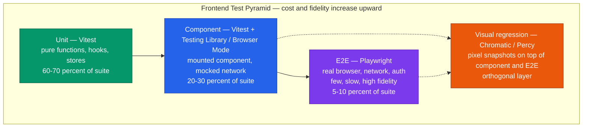
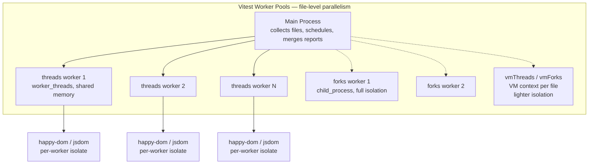
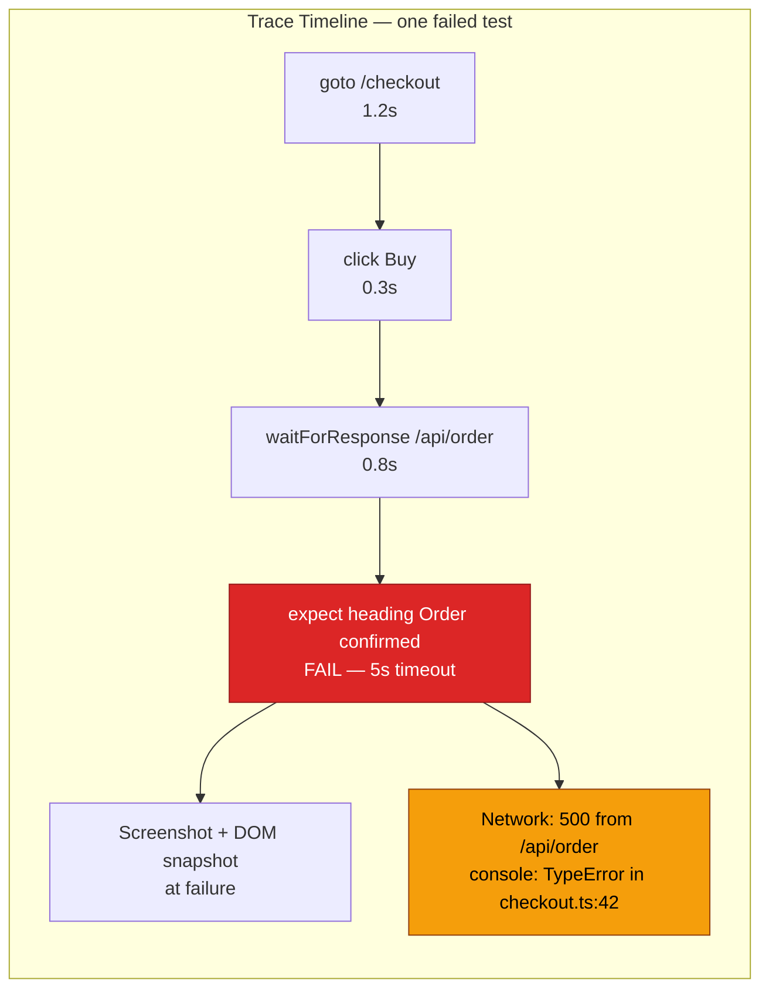
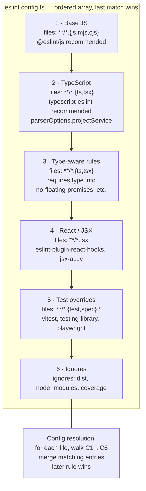
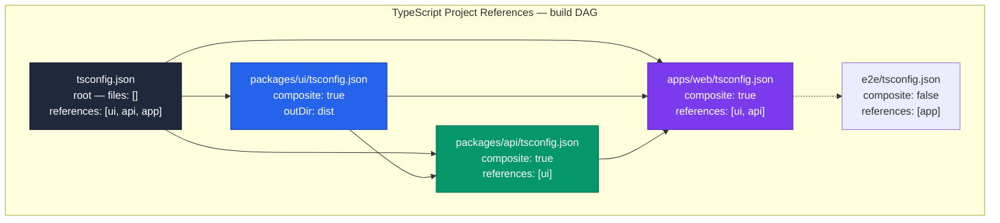
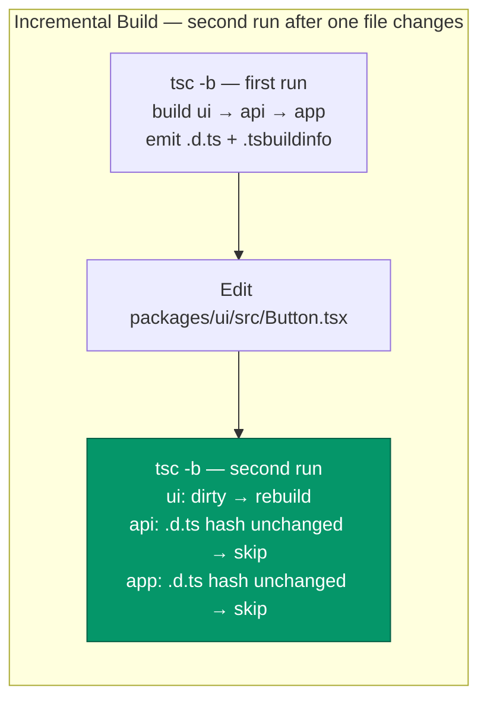
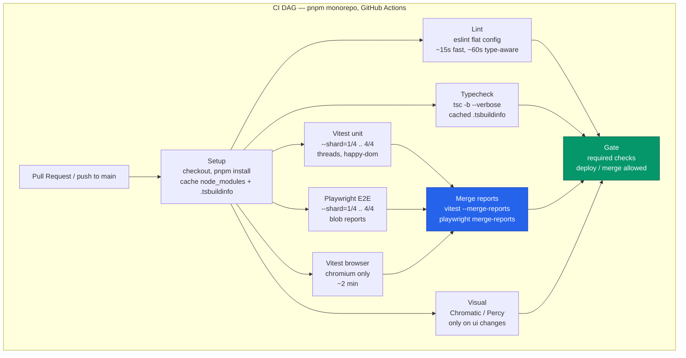
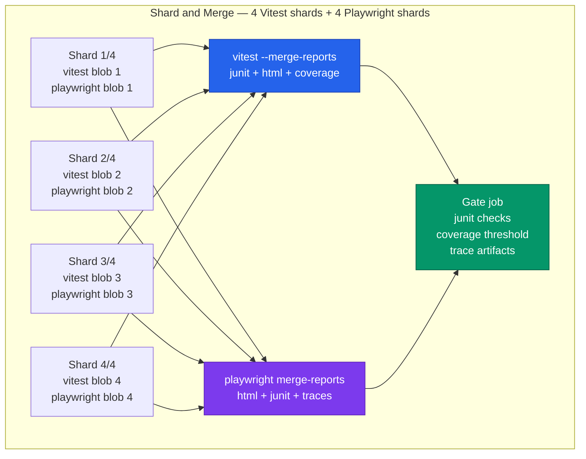

# Chapter 11 — Testing, Linting, and Tooling for Frontend at Scale (Vitest, Playwright, ESLint, TypeScript)

*What this chapter covers:* The frontend tooling stack that replaces Jest, Cypress, TSLint, and ad-hoc TypeScript configs when a codebase grows past one team and one deploy per week. We dissect Vitest's Vite-native runner and its worker pool, Playwright's browser-context isolation and trace architecture, ESLint's flat-config system with type-aware rules, TypeScript's project-references and incremental-build machinery, visual regression pipelines, and the CI sharding and report-merge patterns that keep the whole system under ten minutes. Every section ends in real config you can copy into a monorepo tomorrow.

**Learning goals:**

- Choose and configure the DOM environment for Vitest (happy-dom vs jsdom vs real browser) and explain the performance and fidelity trade-off.
- Explain Vitest's worker model (threads, forks, vmThreads, vmForks), snapshot update flow, and V8 vs Istanbul coverage collection.
- Design Playwright suites with browser contexts, fixtures, parallel workers, sharding, and trace-viewer debugging.
- Author ESLint flat config with `typescript-eslint`, type-aware rules, and per-glob overrides that scale across packages.
- Operate TypeScript at monorepo scale: project references, `incremental` / `composite` / `isolatedModules`, and the build-mode (`tsc -b`) dependency graph.
- Integrate visual regression (Percy, Chromatic) without flaking the pipeline.
- Build a CI matrix that shards Vitest and Playwright, merges JUnit / HTML / blob reports, and gates deploys on type, lint, and test results.

---

## 1. Why Frontend Tooling Breaks at Scale

A single-team SPA can afford Jest with jsdom, `eslint .`, `tsc --noEmit`, and a Cypress job that runs serially. At 50 engineers, 4000 test files, and 15 deploys per day those choices become the bottleneck.

| Symptom at scale | Root cause | What this chapter replaces it with |
|---|---|---|
| `jest` cold start 40 s, watch mode stale | Jest resolves and transforms outside Vite; no shared pipeline | Vitest reuses Vite's transform and dev server |
| E2E suite 35 min wall-clock | One Cypress runner, one browser, serial specs | Playwright workers + sharded CI matrix |
| `eslint` takes 3 min, rules conflict per package | Legacy `.eslintrc` cascading, no typed rules | Flat config with per-glob overrides, `typescript-eslint` |
| `tsc --noEmit` takes 90 s on every PR | Single `tsconfig.json`, no incremental graph | Project references + `incremental` + `tsc -b` |
| Visual bugs ship despite green tests | No pixel-level assertion | Percy / Chromatic snapshot pipeline |
| CI is flaky, retries mask real failures | No trace, no report merge | Playwright trace viewer, Vitest `--merge-reports`, blob reporters |

Backend engineers will recognize every row as a distributed-systems problem: work that was serial must become parallel, shared state must be isolated, and feedback loops must be incremental and cacheable.

### 1.1 The frontend test pyramid

The pyramid for frontend is not the classic backend unit → integration → e2e. The middle layer is component tests — a mounted React/Vue/Svelte component asserted with DOM queries — and the cost curve is steeper because real browsers are involved.



The rule of thumb: if a bug can be caught below the browser boundary, catch it there. Reserve Playwright for flows that require navigation, auth, cross-origin iframes, or real layout. Everything else belongs in Vitest.

---

## 2. Vitest — A Vite-Native Test Runner

Vitest is not a fork of Jest. It reuses the Jest-compatible API (`describe`, `it`, `expect`, `vi`) but replaces the runner, transformer, resolver, and watcher with Vite. That single decision explains most of its wins: transforms are cached by Vite, path aliases and plugins are shared, and HMR-style watch invalidation is free.

### 2.1 Architecture

```
Source file → Vite plugin pipeline (resolve → load → transform)
            → Vitest runner (collect tests → schedule workers → run)
            → Reporter / Coverage / Snapshot manager
```

Jest's pipeline parses and transforms each file in its own `jest-runtime` sandbox. Vitest delegates to `vite dev server` in transform mode, so `vite.config.ts` aliases, CSS modules, and import handling work identically in app and test. The consequence: a monorepo with a custom Vite plugin (say, an SVG-to-component transform) does not need a second Jest transformer.

### 2.2 happy-dom vs jsdom vs Real Browser

Vitest can run tests in four environments, configured per project or per file:

| Environment | What it is | DOM fidelity | Speed | When to use |
|---|---|---|---|---|
| `node` | No DOM at all | None | Fastest | Pure utilities, stores, parsers |
| `happy-dom` | JS implementation of DOM, no layout engine | Good for queries, no layout / `getComputedStyle` limits | ~2-3x faster than jsdom | Unit and component tests that only need DOM queries |
| `jsdom` | JS implementation of DOM + more complete CSSOM | Higher fidelity, supports `getComputedStyle`, `innerText` | Slower, heavier | Component tests that assert styles or measure elements |
| `browser` (Playwright/WebDriver) | Real Chromium/Firefox/WebKit | Full fidelity | Slowest, requires browser binary | Tests that need layout, focus, clipboard, or real event dispatch |

For a senior backend analogy: happy-dom is to jsdom as an in-memory fake is to a heavier emulator. Both satisfy the DOM interface, but only the real browser satisfies the rendering contract.

```typescript
// vitest per-file environment override
/**
 * @vitest-environment happy-dom
 */
import { test, expect } from 'vitest';
import { render } from '@testing-library/react';
import { Button } from './Button';

test('renders label', () => {
  const { getByRole } = render(<Button label="Save" />);
  expect(getByRole('button', { name: 'Save' })).toBeInTheDocument();
});
```

Default guidance for a large codebase: set `environment: 'happy-dom'` globally, override to `jsdom` for the handful of suites that need `getComputedStyle` or `Range`, and promote layout-sensitive suites to `browser` mode rather than faking more of the DOM.

Browser mode itself deserves attention. Vitest's `browser.enabled: true` launches a real browser via Playwright or WebDriver and executes tests inside it. The test file still imports from `vitest`, but `expect` and DOM APIs run in the browser context and results are serialized back. This closes the fidelity gap without moving the test to a separate Playwright project.

### 2.3 Workers: threads, forks, vmThreads, vmForks

Vitest parallelizes at the file level. Each test file is assigned to a worker; inside a file, tests run serially by default (configurable). Four pool strategies exist:



| Pool | Mechanism | Isolation | Startup cost | Best for |
|---|---|---|---|---|
| `threads` | `node:worker_threads` | Shared heap, `vm` sandbox per file | Low | Default for most suites; fastest |
| `forks` | `node:child_process` | Full process isolation | Higher | Suites that mutate `process.env`, global state, or native addons |
| `vmThreads` | `worker_threads` + `vm` context | Per-file VM context, no `require` cache sharing | Low-medium | Need per-file global isolation without fork cost |
| `vmForks` | `child_process` + `vm` context | Per-file VM context + process isolation | Highest | Maximum isolation for leaking suites |

Practical rules at scale:

- Default to `pool: 'threads'`. Move leaking suites to `forks` with `poolOptions.forks.singleFork: false` so they get their own process.
- Set `poolOptions.threads.singleThread: false` and let Vitest size the pool to `os.availableParallelism() - 1`. Override with `--poolOptions.threads.maxThreads` in CI if the runner is shared.
- Isolate files that touch `process.env` or register global handlers with `sequence.concurrent: false` or by placing them in a separate Vitest project (see below).
- `isolate: true` (default) re-creates the environment per file. Setting `isolate: false` is faster but leaks globals — only safe for pure unit files.

### 2.4 Snapshots

Vitest supports three snapshot forms:

1. **Inline snapshots** — `expect(value).toMatchInlineSnapshot()` writes the snapshot into the source file on `--update`.
2. **File snapshots** — `expect(value).toMatchSnapshot()` writes to `__snapshots__/TestName.snap`.
3. **Custom serializers** — `expect.addSnapshotSerializer()` for normalizing unstable fields (timestamps, ids).

Snapshot flow:

```
test run → serialize value → compare to stored snapshot
         → if mismatch: fail, show diff
         → if --update: overwrite snapshot file
         → CI: never auto-update; fail on mismatch
```

At scale, snapshots are a liability if misused. Serialize the minimal stable shape, not the entire component tree. Normalize non-deterministic fields:

```typescript
expect.addSnapshotSerializer({
  test: (val) => val && typeof val === 'object' && 'id' in val,
  serialize: (val) => JSON.stringify({ ...val, id: '[ID]', createdAt: '[DATE]' }),
});
```

Store snapshots next to tests, check them in, and review them as code. A snapshot update that touches 200 files is a signal that the serializer is too broad.

### 2.5 Coverage: V8 vs Istanbul

Vitest delegates coverage to either `@vitest/coverage-v8` or `@vitest/coverage-istanbul`:

| Provider | Mechanism | Accuracy | Speed | Notes |
|---|---|---|---|---|
| `v8` | V8's built-in coverage (via `c8`) | Native, handles ESM, no instrumentation | Fast, no AST rewrite | Default; requires `node --coverage` compatible |
| `istanbul` | Babel-style instrumentation (`istanbul-lib-instrument`) | Works everywhere, supports `/* istanbul ignore */` | Slower, rewrites source | Needed when custom Babel transforms must be covered |

For Vite + TypeScript + ESM codebases, `v8` is almost always correct. It avoids double-transform and respects Vite's pipeline. Enable with `coverage.provider: 'v8'` and `coverage.reportsDirectory`.

Coverage at scale is a gate, not a goal. Set `coverage.thresholds` per project and enforce `lines / branches / functions` on changed files via CI diff, not a global percentage that encourages gaming.

### 2.6 Authoritative vitest.config.ts

The config below is a realistic monorepo setup: two Vitest projects (unit and browser), typed, with coverage, snapshot, and worker tuning. It assumes the monorepo runs `vitest --project unit --project browser` or `vitest --run` for all.

```typescript
// vitest.config.ts
import { defineConfig } from 'vitest/config';
import react from '@vitejs/plugin-react';
import tsconfigPaths from 'vite-tsconfig-paths';

export default defineConfig({
  plugins: [react(), tsconfigPaths()],
  test: {
    // Global defaults — overridden per project below
    globals: true,
    css: true,
    mockReset: true,
    restoreMocks: true,
    clearMocks: true,

    // File-level parallelism: threads by default, forks for leaking suites
    pool: 'threads',
    poolOptions: {
      threads: {
        maxThreads: 8,
        minThreads: 2,
        singleThread: false,
        isolate: true,
      },
      forks: {
        maxForks: 4,
        singleFork: false,
      },
    },

    // Sharding is configured via CLI (--shard=1/4), not here.
    // Merge reports across shards with --merge-reports.

    coverage: {
      provider: 'v8',
      reportsDirectory: './coverage',
      reporter: ['text', 'lcov', 'html', 'json'],
      thresholds: {
        lines: 70,
        branches: 65,
        functions: 70,
        statements: 70,
      },
      exclude: [
        '**/__tests__/**',
        '**/*.test.{ts,tsx}',
        '**/generated/**',
        '**/*.stories.*',
      ],
      // v8 ignores are respected; istanbul-style comments also work via transform
    },

    // Snapshot config
    snapshotFormat: {
      printBasicPrototype: false,
    },

    // Projects let one vitest invocation run heterogeneous suites
    projects: [
      {
        extends: true,
        test: {
          name: 'unit',
          include: ['packages/*/src/**/*.{test,spec}.{ts,tsx}'],
          exclude: ['**/*.browser.test.*', '**/e2e/**'],
          environment: 'happy-dom',
          setupFiles: ['./test/setup/unit.ts'],
          sequence: { concurrent: false },
        },
      },
      {
        extends: true,
        test: {
          name: 'browser',
          include: ['packages/*/src/**/*.browser.test.{ts,tsx}'],
          environment: 'browser',
          browser: {
            enabled: true,
            provider: 'playwright',
            instances: [{ browser: 'chromium' }],
            headless: true,
          },
          setupFiles: ['./test/setup/browser.ts'],
        },
      },
    ],

    reporters: ['default', 'junit'],
    outputFile: {
      junit: './reports/junit-vitest.xml',
    },
  },
});
```

Key details:

- `plugins: [react(), tsconfigPaths()]` is shared between app and test — no second transform config.
- `projects` replaces the old `workspace` field (Vitest 2+). Each project can have its own `environment`, `browser`, and `include`.
- `poolOptions.threads.isolate: true` prevents cross-file leakage in `threads` mode. Flip to `false` only for a known-pure project.
- Coverage `thresholds` fail the run; pair with `coverage.reportOnFailure: true` in CI so the HTML report is still emitted on failure.

---

## 3. Component Testing — The Middle of the Pyramid

Component tests mount a real component, interact with it via user-event, and assert via DOM queries. The stack is Vitest + `@testing-library/react` (or Vue/Svelte equivalents) + `happy-dom` or browser mode.

```typescript
// packages/ui/src/Button.browser.test.tsx — runs in real browser
import { describe, it, expect } from 'vitest';
import { render, screen } from '@testing-library/react';
import userEvent from '@testing-library/user-event';
import { Button } from './Button';

describe('Button', () => {
  it('emits onClick with correct payload', async () => {
    const user = userEvent.setup();
    const onClick = vi.fn();
    render(<Button label="Save" onClick={onClick} />);

    await user.click(screen.getByRole('button', { name: 'Save' }));
    expect(onClick).toHaveBeenCalledTimes(1);
  });

  it('is disabled when loading', () => {
    render(<Button label="Save" loading />);
    expect(screen.getByRole('button', { name: 'Save' })).toBeDisabled();
  });
});
```

Principles that keep component suites fast and stable at scale:

- Query by role and accessible name (`getByRole('button', { name })`), not by class or test id. This couples tests to the accessibility contract, not the implementation.
- Use `userEvent` over `fireEvent`. `userEvent` dispatches the full sequence (`pointerdown` → `mousedown` → `focus` → `mouseup` → `click`) that a real interaction triggers.
- Mock network at the `fetch` / `msw` layer, not at the component prop layer, so the loading/error/empty states are exercised.
- Keep component tests hermetic: no real network, no real timers unless `vi.useFakeTimers()` is explicit, no shared DOM between files (Vitest isolates by default).

Browser mode vs happy-dom for components: if your component uses `ResizeObserver`, `IntersectionObserver`, `scrollIntoView`, or CSS-dependent logic, promote that file to browser mode. Faking those APIs in happy-dom creates a mock that diverges from the real layout engine and hides bugs.

---

## 4. Playwright — E2E at Scale

Playwright is the successor to Puppeteer and Cypress for cross-browser E2E. Its architecture is a Node controller that speaks CDP (Chromium), Juggler (Firefox), or WebKit IPC to browser instances.

### 4.1 Browser contexts — the isolation primitive

A browser context is Playwright's equivalent of an incognito profile: isolated cookies, storage, permissions, and viewport, but sharing a single browser process. Creating a context is milliseconds; launching a browser is seconds.

Playwright multiplexes contexts over a single browser process — `browser.newContext()` creates an isolated incognito profile (cookies, storage, permissions) in milliseconds, while `browser.launch()` costs seconds. The runner assigns one context per test (via the built-in `page` fixture) so every test starts from a clean slate without paying the browser-launch tax.

```typescript
// Isolated contexts — no state leakage between tests
import { test, expect } from '@playwright/test';

test('buyer sees checkout', async ({ browser }) => {
  const buyerCtx = await browser.newContext({ storageState: 'buyer.json' });
  const page = await buyerCtx.newPage();
  await page.goto('/checkout');
  await expect(page.getByRole('heading', { name: 'Checkout' })).toBeVisible();
  await buyerCtx.close();
});

test('admin sees dashboard', async ({ browser }) => {
  const adminCtx = await browser.newContext({ storageState: 'admin.json' });
  const page = await adminCtx.newPage();
  await page.goto('/admin');
  await expect(page.getByRole('heading', { name: 'Admin' })).toBeVisible();
  await adminCtx.close();
});
```

Most tests never call `browser.newContext` directly. Playwright's built-in `page` fixture creates a fresh context per test and tears it down, which is why E2E tests are isolated by default.

### 4.2 Fixtures — dependency injection for tests

Fixtures are Playwright's replacement for global `beforeEach` setup. Each fixture is a factory that can depend on other fixtures, is scoped to `test` or `worker`, and is torn down automatically.

```typescript
// fixtures.ts
import { test as base, expect } from '@playwright/test';

type Fixtures = {
  authedPage: import('@playwright/test').Page;
  apiHelper: { createOrder: (input: unknown) => Promise<string> };
};

export const test = base.extend<Fixtures>({
  // Worker-scoped fixture: one auth per worker, not per test
  authedPage: async ({ browser }, use) => {
    const ctx = await browser.newContext({ storageState: 'playwright/.auth/user.json' });
    const page = await ctx.newPage();
    await use(page);
    await ctx.close();
  },

  apiHelper: async ({ request }, use) => {
    const helper = {
      createOrder: async (input: unknown) => {
        const res = await request.post('/api/orders', { data: input });
        expect(res.ok()).toBeTruthy();
        const { id } = await res.json();
        return id as string;
      },
    };
    await use(helper);
  },
});

export { expect } from '@playwright/test';
```

Fixture scoping matters for performance: `scope: 'worker'` fixtures are created once per worker and shared across tests in that worker. Use it for expensive auth or DB seeding. Default `scope: 'test'` gives isolation.

### 4.3 Parallel workers and sharding

Playwright runs specs in parallel across workers. Each worker owns a browser process and runs one spec file at a time (tests within a file run serially by default, `fullyParallel: true` allows intra-file parallelism).

Sharding splits the spec list deterministically so CI machines can run disjoint subsets:

```bash
# CI matrix — 4 shards, each runner executes one
npx playwright test --shard=1/4
npx playwright test --shard=2/4
npx playwright test --shard=3/4
npx playwright test --shard=4/4
```

After sharding, merge the blob reports:

```bash
# Each shard writes a blob
# playwright.config.ts: reporter: [['blob', { outputDir: 'blob-report' }]]
# After all shards finish:
npx playwright merge-reports ./blob-report --reporter html
```

The blob reporter stores raw test results and traces per shard. `merge-reports` combines them into a single HTML report with a unified trace viewer — the pattern that scales to 30-minute suites on 4-8 CI runners.

### 4.4 Trace viewer

`trace: 'on-first-retry'` is the recommended setting. On failure (or retry), Playwright captures a trace ZIP containing:

- Screenshots per action
- DOM snapshots per action
- Network log (request/response headers and bodies)
- Console messages
- Source location of each `expect`
- Timeline with action durations



Open with `npx playwright show-trace trace.zip` or from the HTML report. At scale, upload traces as CI artifacts so any engineer can debug a flaky failure without re-running locally. Never set `trace: 'on'` globally — it doubles artifact size and slows every test.

### 4.5 Authoritative playwright.config.ts

```typescript
// playwright.config.ts
import { defineConfig, devices } from '@playwright/test';

export default defineConfig({
  testDir: './e2e',
  testMatch: '**/*.e2e.ts',
  fullyParallel: true,
  forbidOnly: !!process.env.CI,
  retries: process.env.CI ? 2 : 0,
  workers: process.env.CI ? 4 : undefined, // let CI matrix + shard control this; locally auto
  timeout: 30_000,
  expect: { timeout: 7_000 },

  reporter: process.env.CI
    ? [
        ['blob', { outputDir: 'blob-report' }],
        ['junit', { outputFile: 'reports/junit-playwright.xml' }],
        ['github'],
      ]
    : [['html', { open: 'never' }], ['list']],

  use: {
    baseURL: process.env.BASE_URL ?? 'http://localhost:3000',
    trace: 'on-first-retry',
    screenshot: 'only-on-failure',
    video: 'retain-on-failure',
    actionTimeout: 10_000,
    navigationTimeout: 15_000,
  },

  // Isolated projects: each gets its own worker pool, like Vitest projects
  projects: [
    {
      name: 'chromium',
      use: { ...devices['Desktop Chrome'] },
      dependencies: ['setup'],
    },
    {
      name: 'firefox',
      use: { ...devices['Desktop Firefox'] },
      dependencies: ['setup'],
    },
    {
      name: 'webkit',
      use: { ...devices['Desktop Safari'] },
      dependencies: ['setup'],
    },
    {
      name: 'mobile',
      use: { ...devices['Pixel 7'] },
      dependencies: ['setup'],
    },
    // Setup project runs once per worker pool — handles auth
    {
      name: 'setup',
      testMatch: /.*\.setup\.ts/,
      teardown: 'cleanup',
    },
    {
      name: 'cleanup',
      testMatch: /.*\.teardown\.ts/,
    },
  ],

  webServer: {
    command: 'pnpm dev --port 3000',
    url: 'http://localhost:3000/health',
    reuseExistingServer: !process.env.CI,
    timeout: 120_000,
  },
});
```

Notes for scale:

- `projects` with `dependencies` and `teardown` is the auth pattern. `setup` logs in once, writes `playwright/.auth/user.json`, and downstream projects load it via `use.storageState`.
- `blob` reporter is mandatory for sharded CI. Without it, shards overwrite each other's HTML report.
- `forbidOnly: !!process.env.CI` prevents a `test.only` from silently skipping the suite in CI.
- `workers: undefined` locally lets Playwright size to cores; in CI, the shard matrix controls parallelism — do not hardcode workers in CI.

---

## 5. ESLint — Flat Config and typescript-eslint at Scale

ESLint's legacy `.eslintrc` system cascaded configs by directory and merged `extends` arrays with opaque precedence. The flat config (`eslint.config.ts` / `eslint.config.js`, ESLint 9+) replaces it with a single ordered array of config objects, each declaring its own `files`, `ignores`, `languageOptions`, `rules`, and `plugins`. Order matters: later entries override earlier ones for matching files.

### 5.1 Flat config graph



The key insight for backend engineers: flat config is a middleware chain, not a tree. There is no implicit parent lookup. A file's config is the merge of every array entry whose `files` glob matches it, in array order. This makes the system predictable and debuggable — `npx eslint --print-config path/to/file.ts` prints the resolved config for a file.

### 5.2 typescript-eslint — parser, plugin, and project service

`typescript-eslint` is the monorepo that replaces `@typescript-eslint/parser` + `@typescript-eslint/eslint-plugin` (the old split). It provides:

- A parser that produces an ESTree-compatible AST with type information.
- Rule sets: `recommended`, `strict`, `stylistic`, and type-aware (`recommendedTypeChecked`, `strictTypeChecked`).
- `projectService` — a lightweight TypeScript program that answers type queries without requiring `parserOptions.project` to list every `tsconfig.json`.

Type-aware rules (e.g., `no-floating-promises`, `no-misused-promises`, `await-thenable`, `consistent-type-imports`) need the type checker. They are 3-10x slower than syntactic rules. At scale, run them in a separate ESLint invocation or as a CI job so the fast syntactic pass stays under 10 seconds for editor feedback.

### 5.3 Authoritative eslint flat config

```typescript
// eslint.config.ts
import eslint from '@eslint/js';
import tseslint from 'typescript-eslint';
import reactHooks from 'eslint-plugin-react-hooks';
import jsxA11y from 'eslint-plugin-jsx-a11y';
import vitest from '@vitest/eslint-plugin';
import playwright from 'eslint-plugin-playwright';
import testingLibrary from 'eslint-plugin-testing-library';
import importX from 'eslint-plugin-import-x';
import prettier from 'eslint-config-prettier';

export default tseslint.config(
  // 1 · Ignores — must be first, global
  {
    ignores: [
      '**/dist/**',
      '**/build/**',
      '**/coverage/**',
      '**/blob-report/**',
      '**/.next/**',
      '**/node_modules/**',
      '**/*.generated.*',
    ],
  },

  // 2 · Base JS — all files
  eslint.configs.recommended,

  // 3 · TypeScript — all TS/TSX files
  ...tseslint.configs.recommended,
  ...tseslint.configs.stylistic,
  {
    files: ['**/*.{ts,tsx}'],
    languageOptions: {
      parserOptions: {
        // projectService: no need to list tsconfig.json files
        projectService: true,
        tsconfigRootDir: import.meta.dirname,
      },
    },
    plugins: {
      'import-x': importX,
    },
    rules: {
      // Enforce type-only imports where possible — helps isolatedModules
      '@typescript-eslint/consistent-type-imports': [
        'error',
        { prefer: 'type-imports', fixStyle: 'inline-type-imports' },
      ],
      '@typescript-eslint/no-unused-vars': [
        'error',
        { argsIgnorePattern: '^_', varsIgnorePattern: '^_', caughtErrors: 'none' },
      ],
      '@typescript-eslint/no-explicit-any': 'warn',
      'import-x/no-cycle': ['error', { maxDepth: 8 }],
      'import-x/no-duplicates': 'error',
    },
  },

  // 4 · Type-aware rules — only where they pay for themselves
  // Run this as a separate CI job if wall-clock matters: `eslint --config eslint.typeaware.config.ts`
  {
    files: ['packages/*/src/**/*.{ts,tsx}'],
    extends: [...tseslint.configs.recommendedTypeChecked],
    rules: {
      '@typescript-eslint/no-floating-promises': 'error',
      '@typescript-eslint/no-misused-promises': [
        'error',
        { checksVoidReturn: { attributes: false } },
      ],
      '@typescript-eslint/await-thenable': 'error',
      '@typescript-eslint/no-unnecessary-condition': 'warn',
    },
  },

  // 5 · React / JSX
  {
    files: ['**/*.tsx'],
    plugins: {
      'react-hooks': reactHooks,
      'jsx-a11y': jsxA11y,
    },
    rules: {
      ...reactHooks.configs.recommended.rules,
      ...jsxA11y.configs.recommended.rules,
      // jsx-a11y recommended includes many rules; tighten for prod:
      'jsx-a11y/no-autofocus': 'warn',
    },
  },

  // 6 · Test files — relax rules that conflict with test ergonomics
  {
    files: ['**/*.{test,spec}.*', '**/__tests__/**', '**/e2e/**'],
    plugins: {
      vitest,
      playwright,
      'testing-library': testingLibrary,
    },
    rules: {
      ...vitest.configs.recommended.rules,
      ...testingLibrary.configs['flat/recommended'].rules,
      '@typescript-eslint/no-explicit-any': 'off',
      '@typescript-eslint/no-non-null-assertion': 'off',
      'jsx-a11y/click-events-have-key-events': 'off',
    },
  },

  // 7 · Playwright E2E — playwright rules only on e2e files
  {
    files: ['e2e/**/*.{ts,tsx}'],
    ...playwright.configs['flat/recommended'],
    rules: {
      'playwright/no-wait-for-timeout': 'error',
      'playwright/prefer-web-first-assertions': 'error',
      'playwright/no-force-option': 'warn',
    },
  },

  // 8 · Prettier must be last — disables formatting rules that conflict with prettier
  prettier,
);
```

Operational notes:

- `projectService: true` (via `tseslint`) replaces `parserOptions.project: ['./tsconfig.json']`. It discovers the owning `tsconfig.json` per file using TypeScript's own resolution, which is correct for project references and avoids the glob-enumeration bottleneck.
- Splitting type-aware rules into a separate config file (`eslint.typeaware.config.ts`) and running it as a parallel CI job cuts PR lint time from ~60s to ~15s for the fast path. The type-aware job can be `continue-on-error` on PRs and required on `main`.
- `eslint-config-prettier` (or `prettier` via `tseslint.config`) must be last so it disables `eslint` formatting rules. Do not run `prettier` as an ESLint rule — run it as a separate formatter.
- Use `npx eslint --print-config packages/ui/src/Button.tsx` to debug why a rule fires or does not fire.

---

## 6. TypeScript at Scale

TypeScript's value at scale is not syntax — it is the type checker as a distributed build system. The features that matter beyond a single package are project references, incremental builds, `isolatedModules`, and the interaction between type-aware lint and the checker.

### 6.1 Project references — the monorepo build graph

A single `tsconfig.json` that includes every file in the monorepo typechecks correctly but is serial and uncacheable: any file change invalidates the whole program. Project references partition the program into composite projects with explicit `references` edges. `tsc -b` (build mode) walks the DAG, builds leaves first, and skips projects whose inputs have not changed.



```jsonc
// tsconfig.json — root, no files of its own
{
  "files": [],
  "references": [
    { "path": "./packages/ui" },
    { "path": "./packages/api" },
    { "path": "./apps/web" }
  ]
}
```

```jsonc
// packages/ui/tsconfig.json — leaf project
{
  "extends": "../../tsconfig.base.json",
  "compilerOptions": {
    "composite": true,          // required for referenced projects
    "declaration": true,        // emit .d.ts so dependents can typecheck without source
    "declarationMap": true,     // jump-to-definition goes to source, not .d.ts
    "outDir": "./dist",
    "rootDir": "./src",
    "incremental": true,        // per-project .tsbuildinfo
    "tsBuildInfoFile": "./dist/.tsbuildinfo"
  },
  "include": ["src/**/*"],
  "references": []
}
```

```jsonc
// packages/api/tsconfig.json — depends on ui
{
  "extends": "../../tsconfig.base.json",
  "compilerOptions": {
    "composite": true,
    "declaration": true,
    "declarationMap": true,
    "outDir": "./dist",
    "rootDir": "./src",
    "incremental": true,
    "tsBuildInfoFile": "./dist/.tsbuildinfo"
  },
  "include": ["src/**/*"],
  "references": [{ "path": "../ui" }]
}
```

```jsonc
// tsconfig.base.json — shared options
{
  "compilerOptions": {
    "strict": true,
    "target": "ES2022",
    "module": "ESNext",
    "moduleResolution": "bundler",
    "verbatimModuleSyntax": true,
    "isolatedModules": true,
    "esModuleInterop": true,
    "forceConsistentCasingInFileNames": true,
    "skipLibCheck": true,
    "resolveJsonModule": true,
    "declaration": true,
    "sourceMap": true,
    "noEmitOnError": false
  }
}
```

Build and check commands:

```bash
# Build all projects in DAG order, incrementally, with caching
tsc -b

# Verbose — see which projects are up-to-date vs rebuilding
tsc -b --verbose

# Force rebuild (e.g., after tsconfig change)
tsc -b --force

# Typecheck without emitting — still respects references (TS 5+)
tsc --noEmit
# or per-project: tsc -p packages/ui/tsconfig.json --noEmit
```

### 6.2 isolatedModules, incremental, and verbatimModuleSyntax

Three flags that are non-negotiable at scale:

| Flag | What it enforces | Why it matters |
|---|---|---|
| `isolatedModules: true` | Each file must be independently transpilable without cross-file type info | Vite, esbuild, and swc transpile per-file in parallel. Without this, `const enum`, `export =`, and type-only elision behave differently between `tsc` and the bundler, causing prod-only bugs |
| `verbatimModuleSyntax: true` | `import type` / `export type` must be explicit; value imports are never erased | Prevents the bundler from silently dropping a value import that `tsc` thought was type-only, and makes the `consistent-type-imports` lint rule enforceable |
| `incremental: true` + `composite: true` | Emit `.tsbuildinfo` and `.d.ts` so dependents can skip re-checking | Without this, project references degrade to serial builds with no cache |



The `.tsbuildinfo` file stores the shape of every source file, its dependencies, and the emit output so the next `tsc -b` can skip projects whose inputs hash identically. On the second `tsc -b`, only the dirty project rebuilds — dependents whose `.d.ts` output hash has not changed are skipped. Cache `.tsbuildinfo` in CI (`actions/cache` keyed on `pnpm-lock.yaml` + `tsconfig` hashes) to cut typecheck from 90 s to ~15 s on no-op PRs:

### 6.3 Type-aware lint as a second checker

Type-aware ESLint rules run the same type checker as `tsc`, but per file via `projectService`. They catch:

- `no-floating-promises` — an unhandled `Promise` that `tsc` allows but that loses errors at runtime.
- `no-misused-promises` — passing an `async` function where a `void` callback is expected (e.g., `array.forEach(async ...)`).
- `await-thenable` / `no-unnecessary-condition` — dead code and redundant guards.

Because they invoke the checker, they belong in the same cost bucket as `tsc -b`. Two viable strategies:

1. **Single job:** `tsc -b --noEmit` then `eslint` with type-aware rules. Simple, but wall-clock is sum of both.
2. **Parallel jobs:** `tsc -b` on one runner, `eslint` (type-aware) on another, both reading the same `.tsbuildinfo`. Faster, but requires `projectService` so `eslint` does not need to rebuild the program from scratch.

The second strategy is the backend pattern: parallelize independent checks that share a cache.

### 6.4 Editor and CI integration

For editors, `typescript-eslint` with `projectService` is fast enough for on-save feedback if type-aware rules are limited to the ~10 that catch real bugs. For CI, run the full `recommendedTypeChecked` set.

```bash
# CI — fast lint (no type info, <15s) — required
pnpm eslint .

# CI — type-aware lint (needs checker, ~30-60s) — required on main, advisory on PR
pnpm eslint --config eslint.typeaware.config.ts .

# CI — typecheck (no emit, respects references)
pnpm tsc -b

# Local — single command that does all three, for pre-push
pnpm check  # runs tsc -b && eslint . && eslint --config eslint.typeaware.config.ts .
```

---

## 7. Visual Regression — Percy and Chromatic

Unit and E2E tests assert behavior; visual regression asserts pixels. A component can pass every DOM assertion and still render broken because of a CSS change three packages away. Visual regression closes that gap by screenshotting rendered UI and diffing against a baseline.

### 7.1 How it works

The pipeline is: render stories or pages (Storybook or a Playwright-driven preview URL, one URL per variant) → screenshot via the Percy agent or Chromatic CLI (per viewport and browser) → diff against the last accepted baseline stored in the cloud (with anti-aliasing ignored and a per-story threshold) → surface in a review UI that blocks the PR until a human approves or denies the diff.

Two dominant tools:

| Tool | Rendering source | Diff model | Review flow | Best for |
|---|---|---|---|---|
| **Chromatic** | Storybook stories (or Playwright via `chromatic --playwright`) | Per-story snapshot, per-viewport, browser farm | GitHub check, per-story approve, auto-accept on `main` | Component libraries, design systems |
| **Percy (BrowserStack)** | Any URL (Storybook, deployed preview, Playwright) | Per-page snapshot, viewport matrix, cross-browser | GitHub check, per-snapshot approve | E2E pages, marketing sites, full-page regression |

Both follow the same lifecycle: render → screenshot → upload → diff against baseline → report as a GitHub check → human reviews diffs with changed pixels highlighted → approve updates baseline.

### 7.2 Chromatic with Storybook

```bash
# Install
pnpm add -D chromatic

# Run — builds Storybook, uploads stories, diffs
npx chromatic --project-token=$CHROMATIC_PROJECT_TOKEN \
  --branch-name=$GITHUB_HEAD_REF \
  --exit-zero-on-changes false

# Playwright mode — no Storybook needed
npx chromatic --playwright --project-token=$CHROMATIC_PROJECT_TOKEN
```

```typescript
// .storybook/preview.ts — stable visual tests
import type { Preview } from '@storybook/react';

const preview: Preview = {
  parameters: {
    chromatic: {
      // Per-story viewports — avoids combinatorial explosion
      viewports: [320, 768, 1280],
      // Delay snapshot until fonts and images settle
      delay: 500,
      // Ignore anti-aliasing noise
      diffThreshold: 0.02,
    },
  },
};

export default preview;
```

### 7.3 Percy with Playwright

```typescript
// e2e/visual.e2e.ts
import { test } from '@playwright/test';
import percySnapshot from '@percy/playwright';

test('homepage visual baseline', async ({ page }) => {
  await page.goto('/');
  await page.waitForLoadState('networkidle');
  await percySnapshot(page, 'homepage', {
    widths: [375, 768, 1280],
    percyCSS: `.ad-banner { display: none; }`, // hide flaky regions
  });
});
```

```bash
# Percy wraps the test run
npx percy exec -- npx playwright test e2e/visual.e2e.ts
```

### 7.4 Operational rules

- **Scope narrowly.** Snapshot 200 stories, not 2000 pages. Prioritize the design system and the top 20 user-facing pages. Combinatorial viewports × browsers explodes cost and flake.
- **Stabilize before screenshotting.** Wait for `networkidle`, fonts loaded (`document.fonts.ready`), and animations settled. Use `chromatic.delay` or `page.waitForLoadState`.
- **Mask flake.** Hide timestamps, avatars, ads, and animated regions with `percyCSS` or `chromatic.diffIncludeAntiAliasing: false`. A visual suite that flakes on every run will be ignored.
- **Gate, don't block blindly.** Require visual review on PRs that touch `packages/ui` or `apps/web/styles`, advisory elsewhere. The goal is to catch CSS regressions early, not to gate every docs change.

---

## 8. CI Matrix — Shard, Merge, Gate

At scale, CI is a distributed system: a DAG of jobs that must be parallel, cacheable, and whose outputs merge deterministically. The pattern below keeps typecheck + lint + unit + component + E2E + visual under 10 minutes for a 4000-test monorepo.

### 8.1 The DAG



### 8.2 Sharding Vitest and Playwright

Both runners shard deterministically by hashing spec file paths, so shard 1/4 on one runner is disjoint from shard 2/4 on another without coordination.

```yaml
# .github/workflows/ci.yml — excerpt, Vitest sharding
jobs:
  vitest:
    strategy:
      matrix:
        shard: [1, 2, 3, 4]
    runs-on: ubuntu-latest
    steps:
      - uses: actions/checkout@v4
      - uses: pnpm/action-setup@v4
      - uses: actions/setup-node@v4
        with:
          node-version: 22
          cache: pnpm
      - run: pnpm install --frozen-lockfile
      - name: Cache TS build info
        uses: actions/cache@v4
        with:
          path: |
            **/dist/.tsbuildinfo
            **/.tsbuildinfo
          key: tsbuild-${{ hashFiles('pnpm-lock.yaml', 'tsconfig*.json', 'packages/*/tsconfig.json') }}

      - name: Run Vitest shard ${{ matrix.shard }}/4
        run: pnpm vitest run --shard=${{ matrix.shard }}/4 --reporter=blob --outputFile.blob=blob-report/vitest-${{ matrix.shard }}.blob

      - uses: actions/upload-artifact@v4
        with:
          name: vitest-blob-${{ matrix.shard }}
          path: blob-report/vitest-${{ matrix.shard }}.blob

  playwright:
    strategy:
      matrix:
        shard: [1, 2, 3, 4]
    runs-on: ubuntu-latest
    steps:
      - uses: actions/checkout@v4
      - uses: pnpm/action-setup@v4
      - uses: actions/setup-node@v4
        with:
          node-version: 22
          cache: pnpm
      - run: pnpm install --frozen-lockfile
      - run: npx playwright install --with-deps chromium

      - name: Run Playwright shard ${{ matrix.shard }}/4
        run: pnpm playwright test --shard=${{ matrix.shard }}/4
        env:
          BASE_URL: http://localhost:3000

      - uses: actions/upload-artifact@v4
        if: always()
        with:
          name: playwright-blob-${{ matrix.shard }}
          path: blob-report/
      - uses: actions/upload-artifact@v4
        if: failure()
        with:
          name: playwright-traces-${{ matrix.shard }}
          path: playwright-report/
```

### 8.3 Merging reports

Shards produce disjoint outputs that must merge before the gate job can evaluate them. Both runners support first-class merge.

```yaml
  merge-reports:
    needs: [vitest, playwright]
    runs-on: ubuntu-latest
    if: always()
    steps:
      - uses: actions/checkout@v4
      - uses: pnpm/action-setup@v4
      - uses: actions/setup-node@v4
        with:
          node-version: 22
          cache: pnpm
      - run: pnpm install --frozen-lockfile

      - name: Download all Vitest blobs
        uses: actions/download-artifact@v4
        with:
          pattern: vitest-blob-*
          path: blob-report/
          merge-multiple: true

      - name: Download all Playwright blobs
        uses: actions/download-artifact@v4
        with:
          pattern: playwright-blob-*
          path: blob-report/
          merge-multiple: true

      - name: Merge Vitest reports
        run: |
          pnpm vitest --merge-reports --reporter=junit --reporter=html
          # Produces reports/junit-vitest.xml + html report
          # Coverage is merged via c8/v8: vitest already wrote per-shard coverage;
          # merge with: pnpm vitest run --coverage --merge-reports

      - name: Merge Playwright reports
        run: npx playwright merge-reports ./blob-report --reporter html --reporter junit

      - name: Publish merged HTML
        uses: actions/upload-artifact@v4
        with:
          name: merged-html-reports
          path: |
            html-report/
            playwright-report/

      - name: Publish JUnit for GitHub checks
        uses: mikepenz/action-junit-report@v4
        with:
          report_paths: |
            reports/junit-vitest.xml
            playwright-report/junit.xml
          check_name: Tests
          fail_on_failure: true
```



Key details:

- `--reporter=blob` writes a binary report per shard that includes traces and attachments. Do not use `html` per shard — shards overwrite each other's HTML.
- Vitest's `--merge-reports` and Playwright's `merge-reports` are idempotent and order-independent. Both accept a directory of blobs.
- Coverage merging: `v8` coverage from shards is written per shard; `c8 report --reporter=lcov` or `vitest --coverage --merge-reports` merges them. Emit `lcov.info` once for Codecov/Coveralls upload.
- JUnit XML is the lingua franca for CI checks. Both runners emit it; the gate job uploads it via `action-junit-report` so failures annotate the PR diff.

### 8.4 Gating and required checks

```yaml
  gate:
    needs: [lint, typecheck, merge-reports, visual]
    runs-on: ubuntu-latest
    if: always()
    steps:
      - name: Check all required jobs passed
        run: |
          # needs.*.result is success/skipped/failure
          if [[ "${{ needs.lint.result }}" != "success" ]]; then echo "lint failed"; exit 1; fi
          if [[ "${{ needs.typecheck.result }}" != "success" ]]; then echo "typecheck failed"; exit 1; fi
          if [[ "${{ needs.merge-reports.result }}" != "success" ]]; then echo "tests failed"; exit 1; fi
          # visual is advisory on PRs that don't touch ui
          echo "All gates passed"
```

Configure `gate` as the sole required check in branch protection. This is the backend pattern: a single aggregator job that fans in all shard results, so the PR status is one green or red check, not N shard checks that humans must interpret.

### 8.5 Caching that actually helps

| Cache | Key | Hit rate | Savings |
|---|---|---|---|
| `pnpm store` / `node_modules` | `hashFiles('pnpm-lock.yaml')` | High on PRs | 30-60 s install → 5 s |
| `.tsbuildinfo` per project | `hashFiles('pnpm-lock.yaml', 'tsconfig*.json')` | High on no-op PRs | 90 s `tsc -b` → 15 s |
| Playwright browser binaries | `playwright version` + OS | High | 60 s install → 5 s |
| Vite transform cache | `hashFiles('vite.config.ts', 'pnpm-lock.yaml')` | Medium | 10 s Vitest cold start → 3 s |
| ESLint cache (`--cache`) | `hashFiles('eslint.config.ts', 'pnpm-lock.yaml')` | High | 15 s → 3 s on no-op |

Always use `actions/cache` with `restore-keys` fallbacks so a partial hit still helps. Cache `blob-report` is never worth caching — it is per-run output.

---

## 9. Putting It Together — A Minimal Monorepo

The configs in this chapter are designed to work together. The dependency graph between tools is itself a DAG: TypeScript project references feed both ESLint (via `projectService`) and Vite (via path resolution); Vite feeds Vitest; Playwright and visual tools run independently but all converge on the CI gate.

Repository layout:

```
.
├── tsconfig.json                 # root — files: [], references: [ui, api, app]
├── tsconfig.base.json            # shared compilerOptions (isolatedModules, etc.)
├── vitest.config.ts              # projects: [unit (happy-dom), browser (chromium)]
├── playwright.config.ts          # projects: [chromium, firefox, webkit, setup]
├── eslint.config.ts              # flat config — ordered array, last match wins
├── eslint.typeaware.config.ts    # type-aware rules — parallel CI job
├── packages/
│   ├── ui/
│   │   ├── tsconfig.json         # composite, references: []
│   │   └── src/Button.tsx
│   └── api/
│       ├── tsconfig.json         # composite, references: [ui]
│       └── src/client.ts
├── apps/web/
│   ├── tsconfig.json             # composite, references: [ui, api]
│   └── src/App.tsx
├── e2e/
│   ├── tsconfig.json             # no composite, references: [app]
│   └── checkout.e2e.ts
├── test/setup/
│   ├── unit.ts                   # vi.mock, jest-dom matchers
│   └── browser.ts                # browser setup
└── .github/workflows/ci.yml      # shard matrix + merge-reports + gate
```

```bash
# Local development — fast feedback
pnpm tsc -b --watch          # typecheck incrementally on save
pnpm eslint . --cache        # fast lint, cached
pnpm vitest --project unit   # watch mode, HMR-style invalidation
pnpm playwright test --ui    # Playwright UI mode — time-travel, trace, pick locator

# Pre-push — full check
pnpm check                   # tsc -b && eslint . && eslint --config eslint.typeaware.config.ts .
pnpm vitest run --coverage
pnpm playwright test

# CI — sharded, merged, gated (see section 8)
```

---

## Key takeaways

- The frontend test pyramid is unit (Vitest, pure) → component (Vitest + Testing Library, mounted) → E2E (Playwright, real browser), with visual regression as an orthogonal pixel layer. Push bugs as low in the pyramid as fidelity allows.
- Vitest wins by reusing Vite's transform. Default to `happy-dom` for speed, promote layout-sensitive suites to `jsdom` or `browser` mode, and size `threads` / `forks` pools to the machine. Use `projects` to run heterogeneous suites in one invocation.
- Coverage `v8` is correct for Vite+ESM; `istanbul` only when custom instrumentation is needed. Treat thresholds as per-project gates, not global vanity metrics. Snapshots are code — review them and normalize non-determinism.
- Playwright's primitive is the browser context, not the browser. Fixtures are dependency injection with `test` vs `worker` scope; `trace: 'on-first-retry'` plus the trace viewer is the primary debugger for flaky E2E. Shard with `--shard` and merge with `blob` + `merge-reports`.
- ESLint flat config is an ordered array — last match wins, no implicit cascading. Use `typescript-eslint` with `projectService` so type-aware rules discover `tsconfig.json` per file. Split type-aware lint into a parallel CI job to keep the fast path under 15 seconds.
- TypeScript at scale means project references (`composite: true`, `declaration: true`), `tsc -b` for DAG-ordered incremental builds, and `isolatedModules` + `verbatimModuleSyntax` so the bundler and checker agree. Cache `.tsbuildinfo` in CI and use it as the shared build cache between `tsc` and type-aware lint.
- Visual regression (Chromatic, Percy) screenshots stories or pages and diffs against a baseline. Scope to the design system and top pages, stabilize before screenshotting, mask flake, and gate only on relevant paths.
- CI is a DAG: shard Vitest and Playwright across N runners, merge `blob` reports into unified JUnit/HTML, publish traces as artifacts, and gate on a single aggregator job. Cache `node_modules`, `.tsbuildinfo`, and `eslint --cache` — everything else is per-run output.

---

## Further reading

- Vitest documentation — Config, Projects, Browser Mode, Coverage, Reporters. https://vitest.dev/config/ , https://vitest.dev/guide/browser.html
- Playwright documentation — Fixtures, Test Sharding, Trace Viewer, Blob Reporter. https://playwright.dev/docs/test-fixtures , https://playwright.dev/docs/test-sharding , https://playwright.dev/docs/trace-viewer
- ESLint Flat Config and typescript-eslint — Configuration Files, Project Service, Typed Linting. https://eslint.org/docs/latest/use/configure/configuration-files , https://typescript-eslint.io/getting-started/typed-linting
- TypeScript Project References and Build Mode. https://www.typescriptlang.org/docs/handbook/project-references.html
- TypeScript `isolatedModules` and `verbatimModuleSyntax`. https://www.typescriptlang.org/tsconfig#isolatedModules , https://www.typescriptlang.org/tsconfig#verbatimModuleSyntax
- Chromatic and Percy documentation. https://www.chromatic.com/docs/ , https://docs.percy.io/docs/percy-specific-functionality
- GitHub Actions — Caching, Artifacts, Required Status Checks. https://docs.github.com/en/actions/using-workflows/caching-dependencies-to-speed-up-workflows
