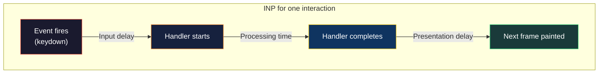
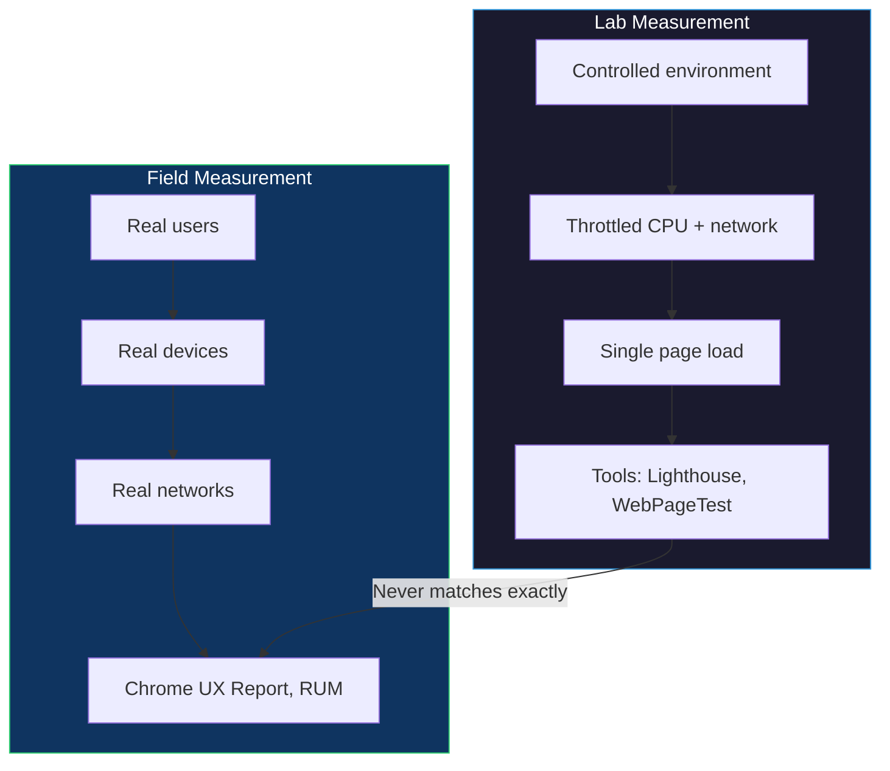
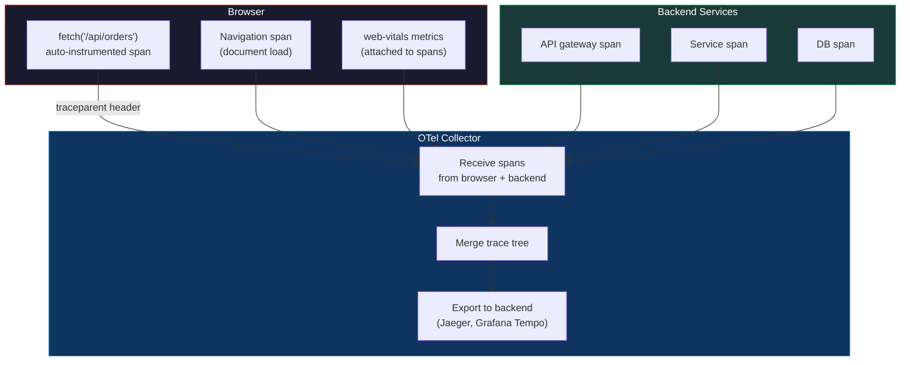
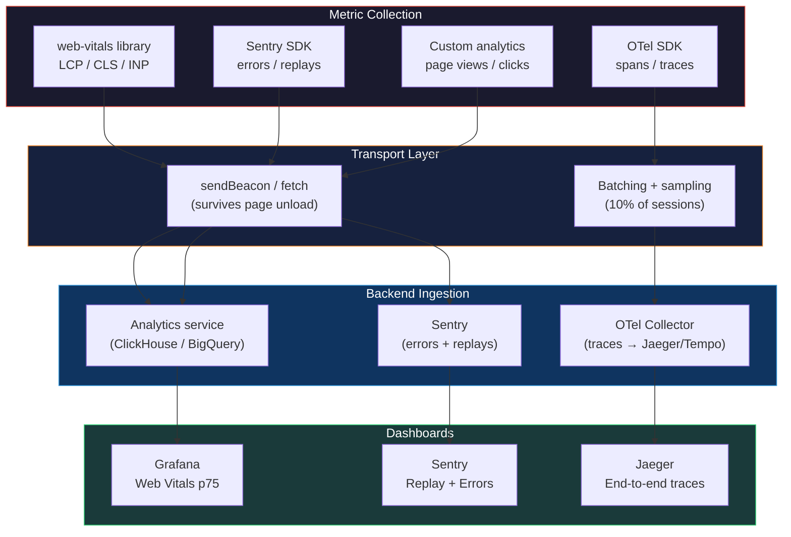
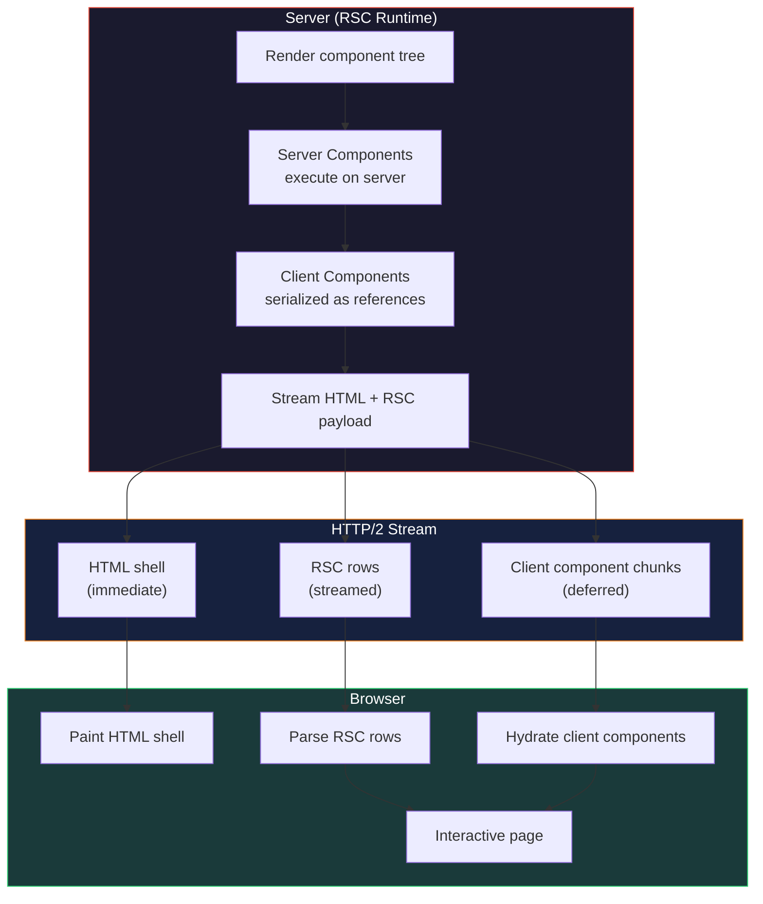
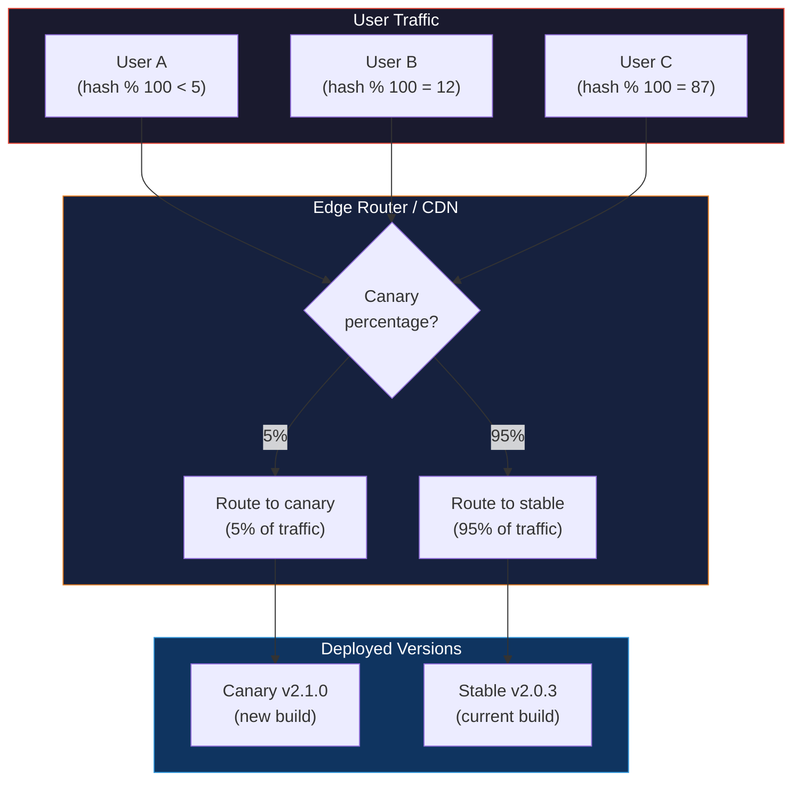
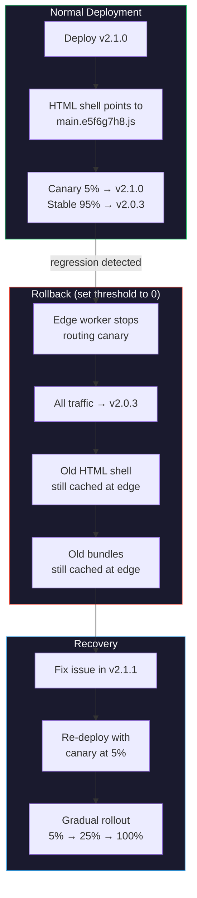
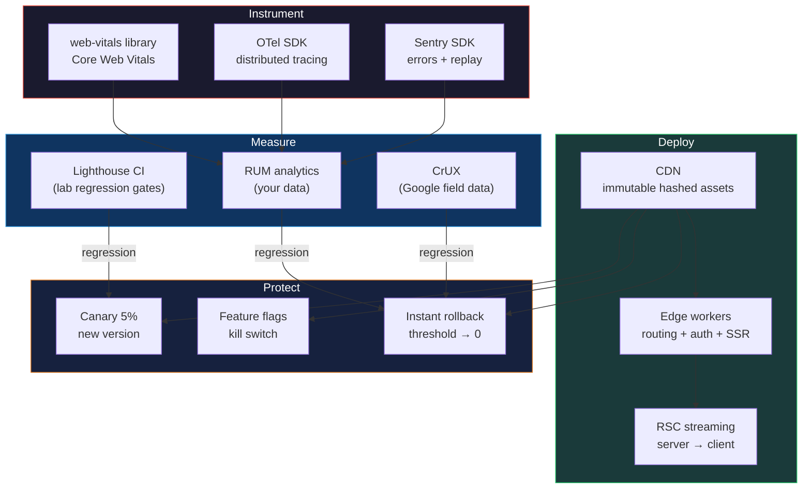

# Chapter 12 — Production Frontend: Observability, Performance (Core Web Vitals, Lighthouse), and Deployment (CDN, Edge, RSC)

*What this chapter covers:* The last mile of frontend engineering — getting code to users fast, measuring whether it stays fast, and recovering when it does not. We begin with **Core Web Vitals** — LCP, CLS, and INP — the browser-native metrics that correlate with user engagement and search ranking, and explain how lab measurements (Lighthouse, WebPageTest) differ from field data (Chrome UX Report, RUM). We then build a production observability stack: the `web-vitals` JavaScript library for metric collection, Sentry session replay for visual debugging, and OpenTelemetry RUM for end-to-end tracing that correlates frontend spans with backend traces. On the deployment side we cover CDN edge caching — cache-control headers, fingerprinting strategies, and long-term immutable assets — then push compute to the edge with Cloudflare Workers and Vercel Edge Functions. We trace React Server Component streaming from server to client, showing how the wire protocol delivers HTML and RSC payloads over a single connection. Finally we address rollback: canary deploys, feature flags, and progressive rollout at the edge, with concrete configs for Lighthouse CI, edge workers, and CDN cache rules.

**Learning goals:**

- Define LCP (Largest Contentful Paint), CLS (Cumulative Layout Shift), and INP (Interaction to Next Paint) — what each measures, how the browser computes it, and the threshold that separates "good" from "poor."
- Explain the lab-vs-field divide: why Lighthouse scores on a developer laptop never match Chrome UX Report data from real users, and when to trust each.
- Instrument a production app with the `web-vitals` JavaScript library, Sentry session replay, and OpenTelemetry RUM to produce a correlated observability pipeline.
- Configure CDN cache headers — `Cache-Control`, `stale-while-revalidate`, content hashing, and immutable long-term caching — with the trade-offs of each strategy.
- Deploy edge logic with Cloudflare Workers and Vercel Edge Functions, understanding the V8 isolate model and its limits compared to serverless containers.
- Trace React Server Component streaming: the RSC wire protocol, `use` on the client, and how partial HTML hydration works over a streaming HTTP response.
- Design canary rollouts and rollback strategies for frontend deployments — percentage-based routing, feature flags, and version-pinned caches.
- Integrate Lighthouse CI into a CI/CD pipeline to gate merges on performance regressions.

---

## 1. Core Web Vitals — The Metrics That Matter

Google's Core Web Vitals are a set of three metrics that measure the user-perceived quality of a web page. They are not arbitrary benchmarks — each one is tied to a specific phase of the page lifecycle, and Google has publicly stated that they influence search ranking. As a backend engineer, think of them as SLIs for your frontend: user-facing, measurable, and actionable.

### 1.1 Largest Contentful Paint (LCP)

**What it measures:** The time from when the user begins loading the page to when the largest visible content element (image, video poster, or block-level text) finishes rendering in the viewport.

**Why it matters:** LCP is the closest browser-native metric to "the page feels loaded." It correlates with the user's perception that content has arrived, as opposed to TTFB (which measures server response) or FCP (which only measures the first pixel).

**Eligible elements** (in the LCP candidate hierarchy):
1. `` elements (including `<svg>` inside ``)
2. `<video>` poster images
3. CSS `background-image` on block-level elements
4. `<text>` elements in SVG
5. Block-level text nodes containing inline content

**Thresholds:**

| Rating | LCP (mobile) | LCP (desktop) |
|--------|-------------|---------------|
| Good   | ≤ 2.5 s     | ≤ 2.5 s       |
| Needs improvement | 2.5–4.0 s | 2.5–4.0 s |
| Poor   | > 4.0 s     | > 4.0 s       |

**What delays LCP (and what to do):**

| Delay source | Mechanism | Mitigation |
|-------------|-----------|------------|
| Slow server response (TTFB) | Backend compute, DB queries, cold start | Edge compute, CDN, warm starts |
| Render-blocking resources | `<link rel="stylesheet">`, synchronous `<script>` | `media="print"` swap, `async`/`defer`, critical CSS inlining |
| Slow resource load | Large images, no preload | `<link rel="preload">` for hero image, responsive `srcset`, modern formats (WebP/AVIF) |
| Client-side rendering | SPA shell loads empty, JS hydrates | Server-side rendering (see Vol 19, Ch 9 — SSR), streaming SSR, or static generation |
| Layout shift delaying paint | Ads, dynamic embeds push LCP element down | Reserve space with aspect-ratio or min-height |

**LCP timing diagram:**


### 1.2 Cumulative Layout Shift (CLS)

**What it measures:** The sum of all unexpected layout shifts that occur during the entire lifespan of the page. A layout shift is "unexpected" if it happens without user interaction (click, tap, keypress) and involves elements that move more than a threshold.

**Why it matters:** Layout shift is the metric most correlated with user frustration — you click a button and a banner loads above it, pushing the button down. The user accidentally taps the wrong thing.

**The CLS score formula:**

```
layout_shift_score = impact_fraction × distance_fraction
```

- **impact_fraction:** The total area of unstable elements relative to the viewport.
- **distance_fraction:** How far the unstable element moved relative to the viewport height.

CLS is the sum of these scores across the page session, but Chrome applies **session windows** (a maximum 5-second gap between shifts, capped at the page lifetime) and reports the **maximum session window** — not the lifetime total. This prevents a long-lived tab from accumulating a misleadingly high score.

**Thresholds:**

| Rating | CLS |
|--------|-----|
| Good   | ≤ 0.1 |
| Needs improvement | 0.1–0.25 |
| Poor   | > 0.25 |

**Common culprits and fixes:**

| Shift source | Mechanism | Fix |
|-------------|-----------|-----|
| Images without dimensions | Browser doesn't know size until loaded | Always set `width` and `height` (or `aspect-ratio`); the browser reserves space |
| Dynamic content injection | Banners, ads, cookie notices push content down | `min-height` or placeholder skeletons with fixed size |
| Web fonts causing FOIT/FOUT | FOUT swaps font after load, changing line heights | `font-display: optional` or `font-display: swap` with size-adjusted fallbacks |
| Late-loading CSS/JS | Additional styles change layout after initial paint | Inline critical CSS, defer non-critical |

### 1.3 Interaction to Next Paint (INP)

**What it measures:** The maximum (or near-maximum) latency of any interaction during the page session. An "interaction" is a pair of `keydown`/`keyup`, `mousedown`/`mouseup`, or `pointerdown`/`pointerup` events. INP measures the time from the event to when the browser paints the next frame after processing the event handler.

**Why it matters:** INP replaced First Input Delay (FID) in March 2024 because FID only measured the *first* interaction and only measured input delay (not processing time or render time). INP captures the full latency of *every* interaction, which better represents responsiveness.

**The INP timeline for one interaction:**

```
Input delay → Processing time → Presentation delay = total latency
     ↑              ↑                    ↑
Event fires    JS handler runs    Layout + Paint + Composite
```

- **Input delay:** Time between the event and when the main thread is available to run the handler. If the main thread is busy with another task, this grows.
- **Processing time:** Time the event handler's JavaScript runs. Long tasks (Figure 2 — Event Loop, Chapter 2) are the primary cause.
- **Presentation delay:** Time between handler completion and the next painted frame. Large DOM mutations or expensive layout/paint work increase this.

**Thresholds:**

| Rating | INP |
|--------|-----|
| Good   | ≤ 200 ms |
| Needs improvement | 200–500 ms |
| Poor   | > 500 ms |

**What hurts INP:**

| Problem | Mechanism | Mitigation |
|---------|-----------|------------|
| Long JavaScript tasks | Synchronous rendering, large state updates | Break work into chunks (`scheduler.yield()`), `requestIdleCallback`, `useTransition` in React |
| Layout thrashing | Reading `offsetHeight` after writing styles | Batch reads before writes, use `ResizeObserver` |
| Heavy event handlers | Complex React state updates on click | Debounce, defer to microtask, virtualize lists |



### 1.4 Lab vs. Field — Why the Numbers Differ

A backend engineer is familiar with this distinction: synthetic benchmarks (lab) vs. production traffic (field). Core Web Vitals have the same split.



| Dimension | Lab (Lighthouse) | Field (CrUX / RUM) |
|-----------|-----------------|-------------------|
| Environment | Developer machine or CI server, throttled to simulate slow 3G + 4x CPU throttling | Real devices (Moto G, iPhone 13, Pixel 7), real networks (4G, 3G, Wi-Fi) |
| Sample size | One page load (or a few) | Thousands to millions of sessions over 28-day rolling window |
| What it's good for | Debugging, regression detection, pre-merge gating | Understanding real user experience, identifying slow pages |
| What it misses | Variability across devices, networks, geographies, concurrent usage | Cannot inspect DOM, replay interactions, or test specific scenarios |
| Metric precision | Exact, reproducible | Statistical: 75th percentile over 28 days |

**Chrome UX Report (CrUX)** is Google's field data pipeline: Chrome periodically reports page load metrics for users who opt in to usage statistics. It provides 75th-percentile (p75) values for LCP, CLS, INP, FCP, TTFB, and TTFB per origin or per URL. CrUX data is available via:
- PageSpeed Insights API
- `chrome-ux-report` BigQuery dataset
- The `CrUX API` (per-origin, per-metric)

**When to use each:**

- **Lab (Lighthouse):** In CI/CD to gate merges. If LCP regresses by 20%, block the PR. In development to debug a slow page.
- **Field (CrUX):** In dashboards to track production health. If p75 LCP exceeds 2.5 s for 3 consecutive weeks, file an issue.
- **RUM (your own):** For granular data CrUX cannot give — per-page, per-user-segment, per-geography, correlated with error rates and backend traces.

---

## 2. Observability — The Full Stack from Browser to Backend

### 2.1 The `web-vitals` JavaScript Library

The [`web-vitals`](https://github.com/GoogleChrome/web-vitals) library (maintained by Google) provides a consistent API for measuring LCP, CLS, INP, FCP, TTFB, and Interaction to Next Paint. It uses `PerformanceObserver` internally and handles edge cases (late-loading images, session windows, attribution data) that raw `PerformanceObserver` entries do not.

```typescript
// npm install web-vitals
import { onLCP, onCLS, onINP, onFCP, onTTFB } from 'web-vitals';

function sendToAnalytics(metric: {
  name: string;
  value: number;
  rating: 'good' | 'needs-improvement' | 'poor';
  delta: number;
  entries: PerformanceEntry[];
  id: string;
  navigationType: 'navigate' | 'reload' | 'back-forward' | 'prerender';
}) {
  // Example: send to your analytics endpoint
  const body = JSON.stringify({
    name: metric.name,
    value: metric.value,
    rating: metric.rating,
    delta: metric.delta,
    id: metric.id,
    navigationType: metric.navigationType,
    // Attribution data for debugging
    ...(metric.name === 'LCP' && metric.entries.length > 0 && {
      element: (metric.entries[0] as LargestContentfulPaint).element?.tagName,
      url: (metric.entries[0] as LargestContentfulPaint).url,
    }),
  });

  // Use sendBeacon for reliability — survives page unload
  if (navigator.sendBeacon) {
    navigator.sendBeacon('/api/vitals', body);
  } else {
    fetch('/api/vitals', { body, method: 'POST', keepalive: true });
  }
}

// Register observers — each fires once per metric session window
onLCP(sendToAnalytics);   // Largest Contentful Paint
onCLS(sendToAnalytics);   // Cumulative Layout Shift
onINP(sendToAnalytics);   // Interaction to Next Paint
onFCP(sendToAnalytics);   // First Contentful Paint
onTTFB(sendToAnalytics);  // Time to First Byte
```

**Key design decisions in this snippet:**

1. **`sendBeacon` for reliability.** Page unload events (`beforeunload`) kill in-flight `fetch` requests. `sendBeacon` queues the payload in the browser's networking queue and guarantees delivery even after navigation. This is the same durability guarantee you would get from writing to a WAL before responding — the telemetry is persisted before the process exits.

2. **Rating per metric.** The library classifies each metric into good/needs-improvement/poor based on the thresholds from §1. This lets you filter dashboards and alert on "poor" ratings specifically.

3. **Attribution mode.** For LCP, the attribution data tells you *which element* was the LCP candidate and *which resource* caused the delay. Without attribution, you know LCP is slow but not why. The attribution callback provides `element`, `url`, `timeToFirstByte`, `resourceLoadDelay`, `resourceLoadTime`, and `elementRenderDelay` — breaking the LCP timeline into segments.

4. **`delta` vs. `value`.** `value` is the absolute metric value. `delta` is the change since the last report for this metric name. For CLS, `delta` is what matters — it tells you whether the layout shifted *just now* or was already shifted from before.

### 2.2 Sentry Session Replay

Sentry's session replay captures a DOM recording of a user's session — a visual playback of what they saw and did. This is invaluable for debugging because you can *see* the layout shift, the slow interaction, the error — not just read a metric number.

```typescript
import * as Sentry from '@sentry/react';

Sentry.init({
  dsn: 'https://examplePublicKey@o0.ingest.sentry.io/0',
  integrations: [
    Sentry.replayIntegration({
      // Mask sensitive inputs
      maskAllInputs: true,
      // Block external iframes
      blockAllMedia: true,
      // Only record sessions that had an error
      onErrorSampleRate: 1.0,
      // 10% of normal sessions
      replaysSessionSampleRate: 0.1,
      // Always record if an error occurs
      replaysOnErrorSampleRate: 1.0,
    }),
  ],
  // Correlate with backend traces
  tracesSampleRate: 0.1,
});
```

**The replay pipeline:**

**Privacy:** `maskAllInputs` replaces user-entered text with `*` characters. `blockAllMedia` prevents recording of `` and `<video>` elements that may contain PII. The Sentry replay library uses a custom serialization format, not raw DOM snapshots, which reduces upload size and avoids leaking HTML structure.

**Correlation:** When Sentry captures an error *during* a replay session, the error event links to the replay. You can click the error, open the replay, and watch the user's session from 5 seconds before the error to understand what led to it. This is analogous to tailing logs around a backend error — but visual.

### 2.3 OpenTelemetry RUM — Full-Stack Tracing

OpenTelemetry (OTel) provides a vendor-neutral API for distributed tracing. The `opentelemetry-web` SDK collects browser spans (navigation, resource loads, user interactions) and exports them to a collector that merges them with backend traces — giving you end-to-end visibility from the browser click to the database query.

```typescript
// npm install @opentelemetry/sdk-trace-web
//          @opentelemetry/api
//          @opentelemetry/exporter-trace-otlp-http

import { WebTracerProvider } from '@opentelemetry/sdk-trace-web';
import { BatchSpanProcessor } from '@opentelemetry/sdk-trace-base';
import { OTLPTraceExporter } from '@opentelemetry/exporter-trace-otlp-http';
import { Resource } from '@opentelemetry/resources';
import { ATTR_SERVICE_NAME } from '@opentelemetry/semantic-conventions';
import { registerInstrumentations } from '@opentelemetry/instrumentation';
import { DocumentLoadInstrumentation } from '@opentelemetry/instrumentation-document-load';
import { FetchInstrumentation } from '@opentelemetry/instrumentation-fetch';
import { XMLHttpRequestInstrumentation } from '@opentelemetry/instrumentation-xml-http-request';

const provider = new WebTracerProvider({
  resource: new Resource({
    [ATTR_SERVICE_NAME]: 'my-frontend',
  }),
});

// Batch and export to OTel collector
provider.addSpanProcessor(
  new BatchSpanProcessor(
    new OTLPTraceExporter({
      url: 'https://otel-collector.internal:4318/v1/traces',
    })
  )
);

// Auto-instrument document load, fetch, and XMLHttpRequest
registerInstrumentations({
  instrumentations: [
    new DocumentLoadInstrumentation(),
    new FetchInstrumentation(),
    new XMLHttpRequestInstrumentation(),
  ],
});

provider.register();

// Now every `fetch()` call automatically creates a span
// with trace context propagated via `traceparent` header,
// correlating frontend and backend traces
```



**The RUM collection pipeline:**



**RUM sampling:** You cannot send telemetry from 100% of sessions — the overhead (network, CPU, storage) is prohibitive. The standard approach is deterministic sampling: assign each session a hash, and send telemetry for sessions where `hash(session_id) % 100 < sample_rate`. For high-traffic sites, 1–10% is typical. For error replays, `onErrorSampleRate: 1.0` ensures you capture every error session regardless of the general sample rate.

---

## 3. Lighthouse and Chrome UX Report

### 3.1 Lighthouse — Lab Measurement

Lighthouse is a tool that loads a page in a headless Chrome instance with throttled CPU (4x slowdown) and network (simulated 3G), measures performance metrics, and produces a scored report. It runs entirely in the lab — no real users involved.

**What Lighthouse measures beyond Core Web Vitals:**

| Metric | Description |
|--------|-------------|
| Total Blocking Time (TBT) | Lab proxy for INP — sum of long tasks (>50 ms) during the load phase |
| Speed Index | How quickly the page visually loads (painted pixels over time) |
| Largest Contentful Paint (LCP) | Same as field, but in lab conditions |
| Cumulative Layout Shift (CLS) | Same as field, but in lab conditions |
| First Contentful Paint (FCP) | Time to first painted pixel |
| Time to Interactive (TTI) | When the main thread is quiet enough for input response |

**Lighthouse CI in a CI/CD pipeline:**

```yaml
# .github/workflows/lighthouse.yml
name: Lighthouse CI

on:
  pull_request:
    branches: [main]

jobs:
  lighthouse:
    runs-on: ubuntu-latest
    steps:
      - uses: actions/checkout@v4

      - name: Setup Node
        uses: actions/setup-node@v4
        with:
          node-version: 20

      - name: Install dependencies
        run: npm ci

      - name: Build
        run: npm run build

      - name: Serve and run Lighthouse
        uses: treosh/lighthouse-ci-action@v12
        with:
          urls: |
            http://localhost:3000/
            http://localhost:3000/dashboard
          configPath: ./lighthouserc.json
          uploadArtifacts: true

      - name: Assert performance budgets
        run: |
          npx lhci autorun --assertions \
            "largest-contentful-paint:warn" \
            "cumulative-layout-shift:error" \
            "interactive:warn" \
            "total-blocking-time:error"
```

```json
// lighthouserc.json
{
  "ci": {
    "collect": {
      "numberOfRuns": 3,
      "startServerCommand": "npm run preview",
      "startServerReadyPattern": "Local:",
      "url": "http://localhost:4173/"
    },
    "assert": {
      "assertions": {
        "largest-contentful-paint": ["error", { "maxNumericValue": 2500 }],
        "cumulative-layout-shift": ["error", { "maxNumericValue": 0.1 }],
        "interactive": ["warn", { "maxNumericValue": 3500 }],
        "total-blocking-time": ["error", { "maxNumericValue": 200 }],
        "resource-summary:script:size": ["warn", { "maxNumericValue": 300000 }],
        "resource-summary:total-byte-size": ["warn", { "maxNumericValue": 1000000 }]
      }
    },
    "upload": {
      "target": "lhci",
      "serverBaseUrl": "https://your-lhci-server.internal"
    }
  }
}
```

**Why `numberOfRuns: 3`:** Lighthouse results vary between runs due to system load and random network jitter. Running 3 times and taking the median filters out outliers. This is the same statistical technique you would use for any benchmark: multiple runs, discard min/max.

**Performance budgets:** The `assertions` block in `lighthouserc.json` defines hard limits. If any metric exceeds the budget, the CI step fails and the PR cannot merge. This is your frontend SLO enforced at deploy time — analogous to API latency SLOs in backend CI.

### 3.2 Chrome UX Report (CrUX)

CrUX is Google's field dataset, collected from real Chrome users who have opted in to usage statistics. It provides 28-day rolling p75 values for Core Web Vitals, available per origin or per page.

**Access methods:**

| Method | Granularity | Use case |
|--------|------------|----------|
| CrUX API (REST) | Per-origin, monthly | Dashboard, automated monitoring |
| CrUX BigQuery | Per-page, daily | Deep analysis, segment breakdown |
| PageSpeed Insights | Per-page (uses CrUX + Lighthouse) | Debugging, one-off checks |
| `gathering_strategy` in `crux-api` | Per-page, monthly | Production dashboards |

**CrUX data structure:**

```json
{
  "record": {
    "key": {
      "origin": "https://example.com",
      "url": "https://example.com/product/123"
    },
    "metrics": {
      "largest_contentful_paint": {
        "histogram": [
          { "start": 0, "end": 1000, "density": 0.52 },
          { "start": 1000, "end": 2500, "density": 0.31 },
          { "start": 2500, "end": 4000, "density": 0.12 },
          { "start": 4000, "density": 0.05 }
        ],
        "percentiles": { "p75": 2100 }
      },
      "cumulative_layout_shift": {
        "histogram": [
          { "start": 0, "end": 0.1, "density": 0.68 },
          { "start": 0.1, "end": 0.25, "density": 0.22 },
          { "start": 0.25, "density": 0.10 }
        ],
        "percentiles": { "p75": 0.08 }
      }
    }
  }
}
```

**The p75 metric:** CrUX reports the 75th percentile — meaning 75% of real users experienced a metric value *at or below* this number. The p75 is chosen because it is sensitive enough to detect regressions (unlike p50, which misses tail slowness) but not so sensitive that a few slow sessions dominate the signal (unlike p95 or p99). For a backend engineer, this is the same trade-off you make when choosing between median and p99 latency for SLIs.

---

## 4. Deployment — CDN, Edge, and RSC

### 4.1 CDN Edge Caching

A CDN (Content Delivery Network) caches your static assets at edge nodes close to users. For frontend, this is the single highest-impact optimization: a 500 KB JavaScript bundle served from a CDN node 10 ms away loads 10x faster than one served from your origin server 100 ms away.

**Cache-Control header strategies:**

| Strategy | Header | Use case | Risk |
|----------|--------|----------|------|
| Immutable long-term | `Cache-Control: public, max-age=31536000, immutable` | Content-hashed assets (`main.a1b2c3.js`) | None — URL changes when content changes |
| Revalidation | `Cache-Control: public, max-age=3600, must-revalidate` | API responses, non-hashed assets | Must have origin server for revalidation |
| Stale-while-revalidate | `Cache-Control: public, max-age=3600, stale-while-revalidate=86400` | Semi-dynamic content, HTML shell | User may see stale content for up to SWR window |
| No cache | `Cache-Control: no-store` | Sensitive data, auth responses | Every request hits origin |

**Fingerprinting:** The `immutable` strategy requires content-hashed filenames. Your build tool (Vite, Webpack, RSPack) generates filenames like `main.a1b2c3d4.js` where `a1b2c3d4` is a hash of the file contents. When the content changes, the hash changes, the URL changes, and the browser fetches the new file. Old cached files are never invalidated — they simply become unreferenced. This is analogous to immutable artifacts in a CI/CD pipeline: you never modify an artifact in place, you publish a new version.

```nginx
# nginx CDN configuration for frontend assets
# Hashed assets — immutable, long-term cache
location ~* \.[a-f0-9]{8}\.(js|css|woff2|avif|webp)$ {
    add_header Cache-Control "public, max-age=31536000, immutable";
    add_header Vary "Accept-Encoding";
    gzip on;
    gzip_types text/css application/javascript font/woff2;
    brotli on;
    brotli_types text/css application/javascript font/woff2;
}

# HTML shell — short cache, revalidate
location = /index.html {
    add_header Cache-Control "public, max-age=60, stale-while-revalidate=3600";
    add_header Vary "Accept-Encoding";
}

# API responses — no cache
location /api/ {
    add_header Cache-Control "no-store";
    proxy_pass http://backend;
}
```

### 4.2 Edge Compute — Cloudflare Workers and Vercel Edge

CDNs cache. Edge compute *runs code* at the edge node. This is the frontend equivalent of running your API gateway at the edge — you can do request routing, A/B testing, authentication, and even server-side rendering without hitting your origin.

**Cloudflare Workers** use V8 isolates — not containers, not VMs. An isolate is a lightweight execution environment with a ~5 ms cold start (vs. ~100–500 ms for a Lambda container). The trade-off: Workers have a 128 MB memory limit and 30-second CPU time limit (free tier) or 30 seconds (paid). They cannot run native binaries or access the filesystem.

```javascript
// Cloudflare Worker — edge A/B testing and cache headers
export default {
  async fetch(request, env) {
    const url = new URL(request.url);

    // Serve static assets from KV (Cloudflare's edge key-value store)
    if (url.pathname.match(/\.(js|css|woff2|avif|webp|png|jpg|svg)$/)) {
      const asset = await env.ASSETS.get(url.pathname, 'arrayBuffer');
      if (asset) {
        return new Response(asset, {
          headers: {
            'Content-Type': getContentType(url.pathname),
            'Cache-Control': 'public, max-age=31536000, immutable',
            'CDN-Cache-Control': 'max-age=31536000',
          },
        });
      }
    }

    // A/B test: route 50% of users to variant
    const bucket = await env.AB_BUCKET.get(request.headers.get('cf-ray'));
    const isVariant = bucket && parseInt(bucket, 16) % 2 === 0;

    if (isVariant) {
      url.hostname = 'variant.example.com';
    }

    // Forward to origin with trace context
    const response = await fetch(url.toString(), {
      headers: {
        ...Object.fromEntries(request.headers),
        'x-ab-variant': isVariant ? 'B' : 'A',
      },
    });

    // Add security and performance headers
    const newHeaders = new Headers(response.headers);
    newHeaders.set('X-Frame-Options', 'DENY');
    newHeaders.set('X-Content-Type-Options', 'nosniff');
    newHeaders.set('Referrer-Policy', 'strict-origin-when-cross-origin');

    if (url.pathname === '/') {
      newHeaders.set('Cache-Control', 'public, max-age=60, stale-while-revalidate=3600');
    }

    return new Response(response.body, {
      status: response.status,
      headers: newHeaders,
    });
  },
};

function getContentType(pathname) {
  const ext = pathname.split('.').pop();
  const types = {
    js: 'application/javascript',
    css: 'text/css',
    woff2: 'font/woff2',
    avif: 'image/avif',
    webp: 'image/webp',
    png: 'image/png',
    jpg: 'image/jpeg',
    svg: 'image/svg+xml',
  };
  return types[ext] || 'application/octet-stream';
}
```

**Vercel Edge Functions** run on the same V8 isolate runtime (via the `edge-runtime` package). They integrate with Next.js's `middleware.ts` and `edge` runtime:

```typescript
// middleware.ts — Vercel Edge
import { NextResponse } from 'next/server';
import type { NextRequest } from 'next/server';

export const config = {
  matcher: ['/dashboard/:path*', '/api/:path*'],
};

export function middleware(request: NextRequest) {
  // Edge-level auth check
  const token = request.cookies.get('session-token');
  if (!token && request.nextUrl.pathname.startsWith('/dashboard')) {
    return NextResponse.redirect(new URL('/login', request.url));
  }

  // A/B test via header
  const variant = request.cookies.get('ab-variant') || 'A';
  const response = NextResponse.next();
  response.headers.set('x-variant', variant);
  return response;
}
```

**Edge vs. serverless containers:**

| Dimension | Edge (V8 isolates) | Serverless containers (Lambda, Cloud Run) |
|-----------|-------------------|------------------------------------------|
| Cold start | ~1–5 ms | ~100–500 ms |
| Memory limit | 128 MB | 10 GB |
| CPU limit | 30 s (continuous) | 15 min |
| Network | 50+ edge locations | 1–3 regions |
| State | KV/R2 (eventual consistency) | Full DB access |
| Best for | Routing, caching, SSR, auth | Heavy compute, DB queries, ML inference |

### 4.3 React Server Component (RSC) Streaming

React Server Components (RSC) render on the server and stream HTML + RSC payload to the client. The key insight: the server does *not* send a full HTML document and then a separate hydration bundle. Instead, it streams a hybrid response — initial HTML for the shell, then RSC payloads for deferred components, all over a single HTTP connection.

**The RSC wire protocol:**

1. **Server renders** the component tree. Server Components execute entirely on the server; Client Components are serialized as references.
2. **HTML stream** begins immediately — the shell (layout, header, nav) is sent first so the browser can start painting.
3. **RSC payload** is appended as a series of "rows" in a custom format (not HTML, not JSON — a streaming binary protocol). Each row represents a component boundary, a suspense boundary resolution, or a reference to a client component.
4. **Client hydration** reads the RSC payload, resolves client component references, and attaches event handlers — but does *not* re-render server components.



**Server Component that streams:**

```tsx
// app/dashboard/page.tsx — Server Component by default
// This runs on the server, NOT in the browser
async function DashboardPage() {
  // Server-side data fetch — no loading spinner, no waterfall
  const orders = await fetchOrders(); // runs during render, streamed to client
  const user = await getUser();        // parallel with orders

  return (
    <main>
      <h1>Welcome, {user.name}</h1>

      {/* This Client Component hydrates after the RSC payload arrives */}
      <Suspense fallback={<OrderListSkeleton />}>
        <OrderList initialData={orders} />
      </Suspense>

      {/* Another server-rendered section — no client JS needed */}
      <section>
        <h2>Recent activity</h2>
        <ActivityFeed data={user.recentActivity} />
      </section>
    </main>
  );
}
```

```tsx
// components/OrderList.tsx — Client Component (interactive)
'use client';

import { useState } from 'react';

export function OrderList({ initialData }: { initialData: Order[] }) {
  const [filter, setFilter] = useState<string>('all');

  const filtered = filter === 'all'
    ? initialData
    : initialData.filter(o => o.status === filter);

  return (
    <div>
      <select value={filter} onChange={e => setFilter(e.target.value)}>
        <option value="all">All</option>
        <option value="pending">Pending</option>
        <option value="shipped">Shipped</option>
      </select>
      {filtered.map(order => (
        <div key={order.id}>{order.id} — {order.status}</div>
      ))}
    </div>
  );
}
```

**Why RSC streaming matters for performance:**

The old model (SSR + hydration) required the server to render the *entire* page, send it as HTML, then send a *second* payload (the JavaScript bundle) for hydration. The user saw the page quickly (good LCP) but could not interact with it until hydration completed (bad INP).

RSC streaming solves this:
- **Shell paints immediately** (good LCP) — the HTML shell arrives without waiting for data.
- **Data streams in** — server components resolve on the server and stream their output. No client-side `useEffect` fetch, no loading spinners for above-the-fold content.
- **Client components hydrate incrementally** — only the components that need interactivity get hydrated, and they hydrate as soon as their RSC chunk arrives.
- **No full hydration waterfall** — the browser does not need to download and execute the entire client bundle before any interaction works.

This is analogous to streaming responses from a backend API: instead of waiting for the full response to buffer, you send chunks as they become available. The frontend equivalent is streaming HTML and RSC rows instead of buffering the entire page.

---

## 5. Cache Headers in Depth

### 5.1 The Cache-Control Directive Matrix

| Directive | Meaning | Frontend use |
|-----------|---------|-------------|
| `public` | Any cache may store the response | CDN, browser, proxy |
| `private` | Only the user's browser may cache | Authenticated pages, personal data |
| `no-store` | No cache may store the response | Sensitive data, auth tokens |
| `no-cache` | Cache may store but must revalidate before use | HTML shell (revalidate on every load) |
| `max-age=N` | Fresh for N seconds from response time | Static assets |
| `s-maxage=N` | Fresh for N seconds in shared (CDN) cache | CDN-specific TTL |
| `immutable` | Response will never change (do not revalidate) | Content-hashed assets |
| `stale-while-revalidate=N` | Serve stale for up to N seconds while revalidating in background | Semi-dynamic content |
| `must-revalidate` | Never serve stale; always revalidate | Default behavior when `max-age` expires |

### 5.2 Long-Term Caching Strategy

The ideal for static assets: **immutable + content hashing + `max-age=31536000`**. This means:

1. The build produces `main.a1b2c3d4.js`.
2. The CDN caches it for 1 year.
3. The browser caches it for 1 year.
4. When you deploy a new version, the build produces `main.e5f6g7h8.js` — a different URL.
5. Old cached files are never invalidated, never revalidated, never refetched.

**The risk:** If you use non-hashed filenames (`main.js`) with long `max-age`, browsers will serve the old version until the cache expires. This is the "zombie cache" problem — users see stale code with no way to force an update. Content hashing eliminates this entirely.

**The HTML shell problem:** Your `index.html` cannot be content-hashed (it is the entry point). It needs a short `max-age` with `stale-while-revalidate`:

```
Cache-Control: public, max-age=60, stale-while-revalidate=3600
```

This means: the CDN serves the cached HTML for up to 1 hour (stale), but every 60 seconds it revalidates in the background. Users always get a fast response (cache hit), and after at most 60 seconds they get the updated HTML pointing to the new hashed bundles.

---

## 6. Canary Deployments and Rollback

### 6.1 Canary Rollout Topology

A canary deploy sends a small percentage of traffic to the new version before rolling out to everyone. For frontend, this is typically done at the CDN or edge layer — the edge worker or CDN configuration routes requests based on a hash of the user ID or session.



**Cloudflare Workers canary implementation:**

```javascript
// Edge worker with canary routing
export default {
  async fetch(request, env) {
    const url = new URL(request.url);

    // Hash the user's IP or a cookie for deterministic routing
    const userId = request.headers.get('cf-connecting-ip') || request.headers.get('x-forwarded-for') || '';
    const hash = await hashString(userId);
    const bucket = hash % 100;

    // Canary: 5% of users get the new version
    const canaryThreshold = parseInt(await env.CANARY_THRESHOLD.get('threshold') || '5');

    if (bucket < canaryThreshold) {
      // Canary — serve from canary asset bucket
      const asset = await env.CANARY_ASSETS.get(url.pathname, 'arrayBuffer');
      if (asset) {
        return new Response(asset, {
          headers: {
            'Cache-Control': 'public, max-age=31536000, immutable',
            'X-Served-By': 'canary',
          },
        });
      }
    }

    // Stable — serve from production asset bucket
    const asset = await env.PROD_ASSETS.get(url.pathname, 'arrayBuffer');
    if (asset) {
      return new Response(asset, {
        headers: {
          'Cache-Control': 'public, max-age=31536000, immutable',
          'X-Served-By': 'stable',
        },
      });
    }

    // Fallback to origin
    return fetch(request);
  },
};

async function hashString(str) {
  const encoder = new TextEncoder();
  const data = encoder.encode(str);
  const hashBuffer = await crypto.subtle.digest('SHA-256', data);
  const hashArray = Array.from(new Uint8Array(hashBuffer));
  return hashArray.reduce((acc, byte) => (acc * 31 + byte) % 1000000, 0);
}
```

### 6.2 Rollback Strategies

| Strategy | Mechanism | Time to rollback | Trade-off |
|----------|-----------|-----------------|-----------|
| CDN version swap | Update CDN origin pointer to previous build | Seconds | Requires CDN API access |
| Edge worker threshold | Set `CANARY_THRESHOLD` to 0 | Seconds | Canary traffic sees old version until KV propagates |
| Git revert + redeploy | Revert commit, trigger CI/CD | Minutes | Full rebuild, but clean history |
| Feature flag kill switch | Disable feature in flag service | Seconds | Requires flag service integration |
| Immutable asset revert | Point HTML shell at old hashed filenames | Minutes | Requires rebuild with old filenames |

**The critical insight for frontend rollback:** Because static assets are content-hashed and immutable, rolling back means serving the old HTML shell (which references the old hashed bundles). The old bundles are still in the CDN cache (or can be re-fetched from the origin). This is why the `stale-while-revalidate` strategy for the HTML shell is so important — it lets you swap the shell in seconds without purging CDN caches.

**Rollback without downtime:**



---

## 7. Lighthouse CI Integration

### 7.1 Full CI/CD Pipeline

```yaml
# .github/workflows/frontend-deploy.yml
name: Frontend Deploy

on:
  push:
    branches: [main]

jobs:
  build:
    runs-on: ubuntu-latest
    steps:
      - uses: actions/checkout@v4

      - name: Install and build
        run: |
          npm ci
          npm run build

      - name: Lighthouse CI
        uses: treosh/lighthouse-ci-action@v12
        with:
          urls: |
            http://localhost:4173/
          configPath: ./lighthouserc.json

      - name: Upload build artifacts
        run: |
          # Upload hashed assets to R2/S3 for CDN
          aws s3 sync dist/ s3://my-cdn-assets/ \
            --cache-control "public, max-age=31536000, immutable" \
            --exclude "index.html"

          # Upload HTML shell with short cache
          aws s3 cp dist/index.html s3://my-cdn-assets/index.html \
            --cache-control "public, max-age=60, stale-while-revalidate=3600"

      - name: Update edge worker canary
        run: |
          # Set canary threshold to 5% for new version
          npx wrangler kv:key put --binding=CONFIG threshold 5

      - name: Monitor canary
        run: |
          # Wait 10 minutes, check error rates
          sleep 600
          ERROR_RATE=$(curl -s "https://analytics.internal/api/error-rate?version=canary&window=10m" | jq '.rate')
          if (( $(echo "$ERROR_RATE > 0.01" | bc -l) )); then
            echo "Canary error rate too high: $ERROR_RATE"
            npx wrangler kv:key put --binding=CONFIG threshold 0
            exit 1
          fi

      - name: Full rollout
        if: success()
        run: |
          npx wrangler kv:key put --binding=CONFIG threshold 100
```

### 7.2 Performance Budget Enforcement

```typescript
// scripts/assert-vitals.ts
// Run after Lighthouse CI to check RUM data against budgets
import { chromium } from 'playwright';

const BUDGETS = {
  LCP: 2500,    // ms
  CLS: 0.1,     // score
  INP: 200,     // ms
  FCP: 1800,    // ms
  TTFB: 800,    // ms
} as const;

async function assertPerformance(url: string) {
  const browser = await chromium.launch();
  const page = await browser.newPage();

  const metrics: Record<string, number> = {};

  await page.goto(url, { waitUntil: 'networkidle' });

  // Extract Core Web Vitals from the page
  const vitals = await page.evaluate(() => {
    return new Promise<Record<string, number>>((resolve) => {
      const results: Record<string, number> = {};

      // Use PerformanceObserver to get final metrics
      const observer = new PerformanceObserver((list) => {
        for (const entry of list.getEntries()) {
          if (entry.entryType === 'largest-contentful-paint') {
            results.LCP = entry.startTime;
          }
          if (entry.entryType === 'layout-shift' && !(entry as any).hadRecentInput) {
            results.CLS = (results.CLS || 0) + (entry as any).value;
          }
        }
      });

      observer.observe({ type: 'largest-contentful-paint', buffered: true });
      observer.observe({ type: 'layout-shift', buffered: true });

      // Give the page a moment to finalize metrics
      setTimeout(() => resolve(results), 3000);
    });
  });

  console.log('Measured metrics:', vitals);

  let failed = false;
  for (const [metric, budget] of Object.entries(BUDGETS)) {
    const actual = vitals[metric];
    if (actual !== undefined && actual > budget) {
      console.error(`FAIL: ${metric} = ${actual.toFixed(0)} (budget: ${budget})`);
      failed = true;
    }
  }

  if (failed) {
    process.exit(1);
  }

  console.log('All metrics within budget');
  await browser.close();
}

assertPerformance(process.argv[2] || 'http://localhost:4173/');
```

---

## 8. Putting It All Together — The Production Frontend Stack

A backend engineer will recognize this architecture as the same layered approach you use for backend observability and deployment: instrument, measure, deploy safely, rollback quickly.



**The production frontend feedback loop:**

1. **Instrument** — `web-vitals`, OTel, and Sentry collect metrics, traces, and errors from real user sessions.
2. **Measure** — Dashboards show p75 LCP, CLS, INP per page, per geography, per device. CrUX data validates your RUM data against Google's independent measurement.
3. **Gate** — Lighthouse CI runs on every PR, asserting performance budgets. A regression in LCP > 2500 ms blocks the merge.
4. **Deploy** — Hashed static assets go to the CDN with immutable cache headers. The HTML shell gets `stale-while-revalidate`. Edge workers handle routing, auth, and A/B testing.
5. **Canary** — 5% of users get the new version. Error rates and Web Vitals are monitored in real time.
6. **Rollback** — If metrics degrade, the edge worker threshold is set to 0 in seconds. No CDN cache purge needed — the old assets are already cached.

This is the same deployment discipline you apply to backend services: canary, monitor, rollback. The difference is that frontend rollback is faster (CDN cache is already warm with the old version) and the blast radius is smaller (no database migrations to undo).

---

## Key Takeaways

- **Core Web Vitals are SLIs for your frontend.** LCP measures perceived load time, CLS measures visual stability, and INP measures interactivity. The thresholds (2.5 s, 0.1, 200 ms) are not arbitrary — they are tied to user engagement data at Google scale.
- **Lab and field measurements serve different purposes.** Use Lighthouse in CI to gate merges; use CrUX and RUM in dashboards to monitor production health. Never conflate the two.
- **The `web-vitals` library is the right abstraction.** It handles session windows, attribution, and edge cases that raw `PerformanceObserver` does not. Always send telemetry via `sendBeacon` to survive page unload.
- **Content-hashed immutable assets with long `max-age` are the gold standard.** The HTML shell is the only asset that needs short cache + `stale-while-revalidate`. Everything else is immutable.
- **Edge compute (V8 isolates) replaces serverless containers for latency-sensitive logic.** A/B testing, auth checks, and SSR at the edge give you 1–5 ms cold starts and 50+ locations.
- **RSC streaming eliminates the hydration waterfall.** Server components render on the server and stream their output; client components hydrate incrementally. This is streaming responses for the frontend.
- **Canary deploys with instant rollback are non-negotiable.** Set a threshold, monitor metrics, and roll back in seconds. The old version is already cached at the edge.

---

## Further Reading

- [Web Vitals — web.dev](https://web.dev/articles/vitals) — Official documentation for Core Web Vitals
- [web-vitals library — GitHub](https://github.com/GoogleChrome/web-vitals) — Google's JavaScript library for measuring Core Web Vitals
- [Chrome UX Report — developer.chrome.com](https://developer.chrome.com/docs/crux/) — Field data from real Chrome users
- [Lighthouse CI — GitHub](https://github.com/GoogleChrome/lighthouse-ci) — CI integration for Lighthouse
- [Sentry Session Replay — docs.sentry.io](https://docs.sentry.io/product/session-replay/) — Visual replay of user sessions
- [OpenTelemetry JS — opentelemetry.io](https://opentelemetry.io/docs/languages/js/) — Browser instrumentation for distributed tracing
- [Cloudflare Workers — developers.cloudflare.com](https://developers.cloudflare.com/workers/) — Edge compute on V8 isolates
- [Vercel Edge Functions — vercel.com/docs](https://vercel.com/docs/functions/edge-functions) — Edge compute for Next.js
- [React Server Components — react.dev](https://react.dev/reference/rsc/server-components) — Official RSC documentation
- [Cache-Control — MDN Web Docs](https://developer.mozilla.org/en-US/docs/Web/HTTP/Headers/Cache-Control) — HTTP cache directive reference
- [Lighthouse Performance Scoring — web.dev](https://web.dev/articles/performance-scoring) — How Lighthouse calculates scores
