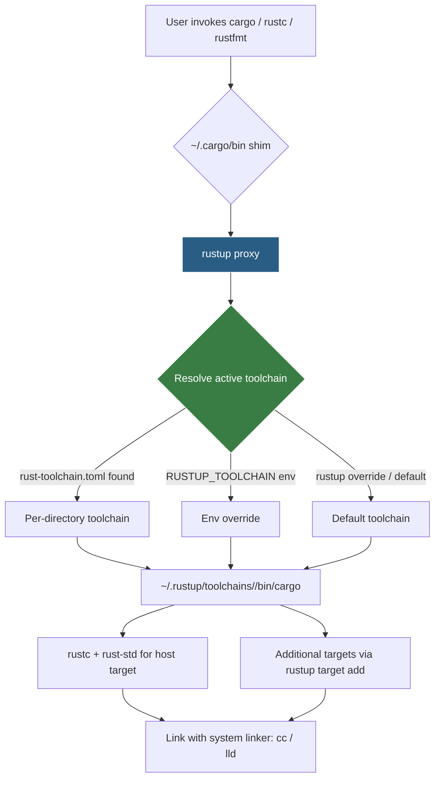
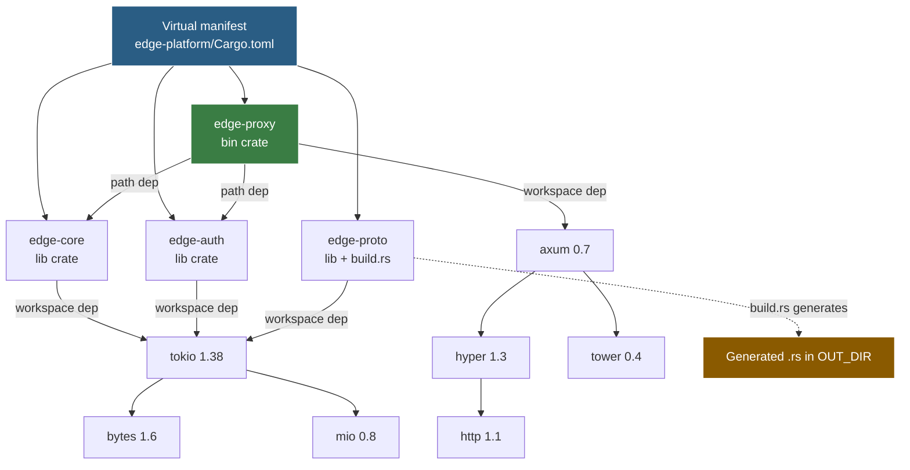
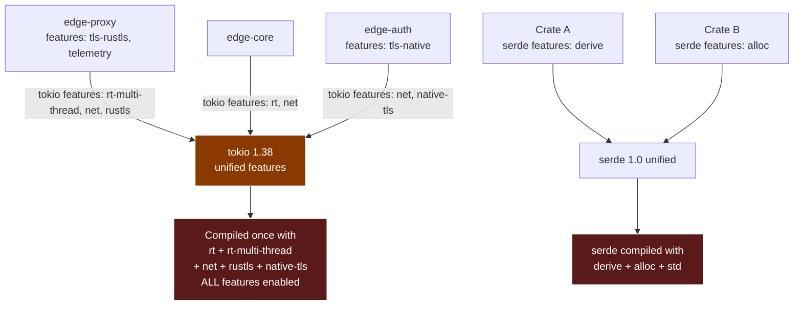
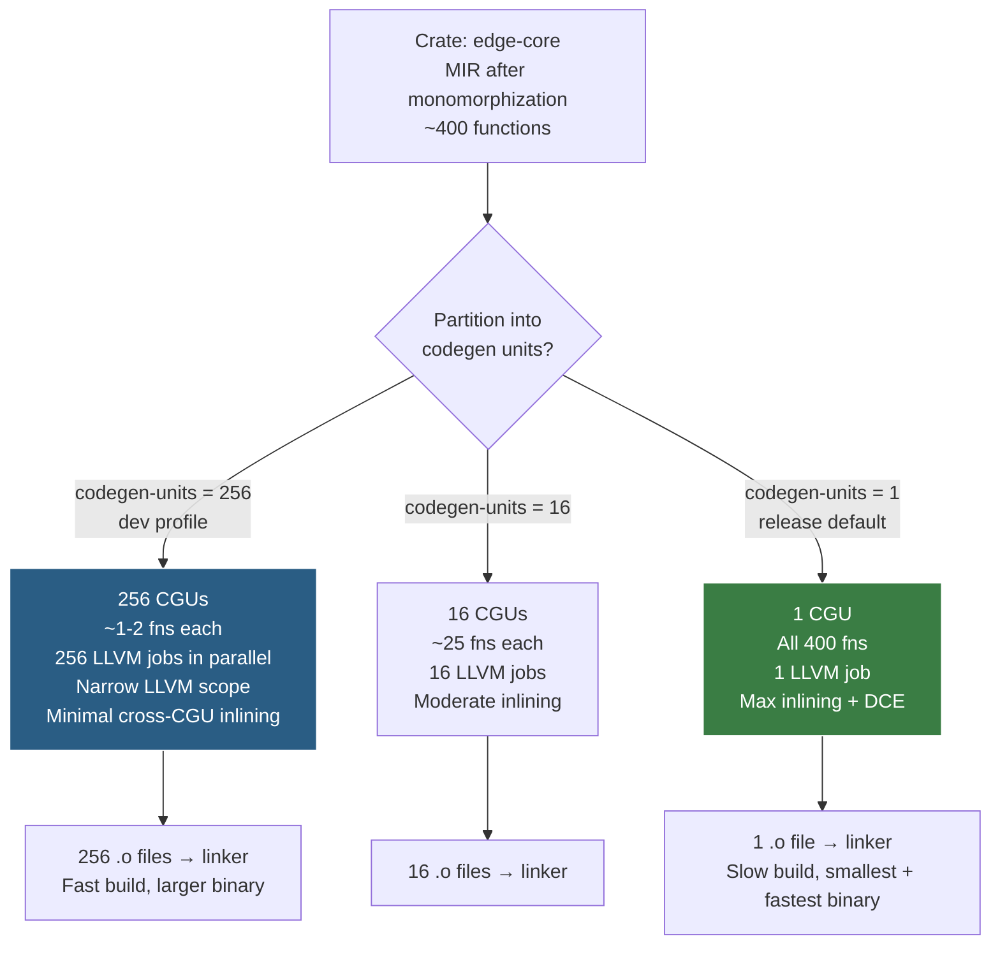
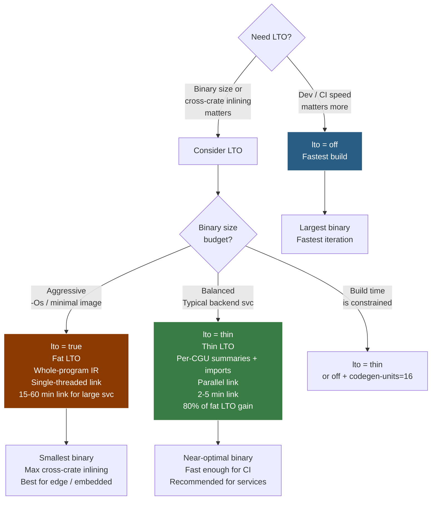

# Chapter 1 — Rust Architecture: Toolchain, Crates, and the Compilation Model

*What this chapter covers:* the complete architecture that turns Rust source text into a deployed binary — from the `rustup` toolchain multiplexer that manages compiler versions on your machine, through Cargo's dependency resolver and the crates.io registry that supply the world's crates, to the crate and workspace graph that structures every backend codebase, and finally into `rustc`'s multi-stage compilation pipeline (HIR, MIR, LLVM IR, object code) with its distinctive mechanisms: monomorphization, codegen-unit partitioning, LTO, and the incremental query system. Along the way you will learn every crate type the linker understands, how editions and `cfg` attributes gate compatibility, why Cargo features must be additive and what unification does to your dependency graph, and how `build.rs` build scripts extend the build.

**Learning goals:**

- Diagram the `rustup` / `rustc` / `Cargo` / `crates.io` toolchain and explain how `rustup` proxies, toolchains, targets, and components interact — including `rust-toolchain.toml` pinning.
- Explain how Cargo resolves versions against the crates.io registry index (git-based and sparse HTTP), what the resolver does (semver, `Cargo.lock`, resolver v1 vs v2), and when it fails.
- Model a Cargo workspace — including virtual manifests — as a crate graph, and predict how `cargo tree`, `cargo metadata`, and path/registry/git dependencies interact.
- Enumerate every crate type (`bin`, `lib`, `rlib`, `dylib`, `cdylib`, `staticlib`, `proc-macro`) with its artifact, linkage, and backend use case.
- Explain editions (2015, 2018, 2021, 2024) as opt-in epoch migrations and use `cfg` / `cfg_attr` / `cfg_aliases` to gate platform- and feature-conditional code.
- State the additive-features rule, diagram feature unification, and explain why a non-additive feature is a soundness hazard for large service graphs.
- Trace the `rustc` pipeline — lex/parse, AST, HIR, type checking, MIR, borrow checking, LLVM IR, object emission — and explain where monomorphization, codegen units, LTO (thin vs. fat), and incremental compilation fit.
- Write a correct `build.rs` that emits `cargo:` directives, invokes `cc` or `bindgen`, and invalidates incrementally via `rerun-if-changed`.
- Use `cargo tree`, `rustc --emit=mir`, `rustc --emit=hir`, `cargo rustc -- --emit=llvm-ir`, codegen-unit flags, and `cargo miri` to interrogate each layer.

---

## 1. The Rust Toolchain: rustup, rustc, and Cargo

If you come from Go (`go` is one binary) or Java (`javac` + `jar` + Maven/Gradle as separate worlds), Rust's toolchain feels simultaneously more fragmented and more integrated. There are three principal binaries, but they are bound together by a multiplexer.

### 1.1 rustup — the toolchain multiplexer

`rustup` is not a package manager. It is a toolchain manager and proxy. A *toolchain* is a complete, versioned set of components — `rustc`, `cargo`, `rust-std` (the standard library for each target), `rustfmt`, `clippy`, `llvm-tools`, `rust-docs` — built together and tested as a unit. Toolchains are identified by a *channel* (`stable`, `beta`, `nightly`) plus an optional date and a *target triple* (`x86_64-unknown-linux-gnu`, `aarch64-apple-darwin`, `x86_64-pc-windows-msvc`).

When you type `cargo build`, you are not running `cargo` directly. You are running the `rustup` proxy shim at `~/.cargo/bin/cargo`, which:

1. Walks up the directory tree looking for a `rust-toolchain.toml` (or legacy `rust-toolchain`) file, then checks `RUSTUP_TOOLCHAIN` env, then falls back to the default toolchain (`rustup default`).
2. Resolves the required toolchain (installing it on demand if `auto-install` is enabled).
3. Delegates to `~/.rustup/toolchains/<name>/bin/cargo` with the same arguments.

This indirection is why you can pin a service to `nightly-2024-11-15` in CI while your laptop runs `stable`, and why `rustup override set nightly` in a single checkout does not affect siblings.

```bash
$ rustup show
Default host: x86_64-unknown-linux-gnu
rustup home:  /home/ubuntu/.rustup

installed toolchains
--------------------
stable-x86_64-unknown-linux-gnu (default)
nightly-2024-11-15-x86_64-unknown-linux-gnu
1.82-x86_64-unknown-linux-gnu

active toolchain
----------------
nightly-2024-11-15-x86_64-unknown-linux-gnu (overridden by '/home/ubuntu/svc/rust-toolchain.toml')
rustc 1.82.0-nightly (f1d9f2d7b 2024-11-14)

$ cat rust-toolchain.toml
[toolchain]
channel = "1.82"
components = ["rustfmt", "clippy", "rust-src", "llvm-tools-preview"]
targets = ["x86_64-unknown-linux-musl", "aarch64-unknown-linux-gnu"]
```

Key files on disk:

| Path | Purpose |
|------|---------|
| `~/.rustup/toolchains/<triple>/` | One directory per installed toolchain; contains `bin/rustc`, `lib/rustlib/<target>/` |
| `~/.rustup/settings.toml` | Default toolchain, auto-install preference |
| `~/.cargo/bin/rustc` (shim) | Proxy that dispatches to the active toolchain |
| `~/.cargo/registry/` | Downloaded crate sources and registry index checkout |
| `rust-toolchain.toml` | Per-workspace pin — checked into git for reproducibility |

For backend teams, pinning matters. A fleet of 80 microservices that each float on whatever `stable` was current at build time will produce subtly different binaries (different LLVM, different `rustc` optimizations) and non-reproducible `Cargo.lock` ranges. Pin the toolchain in `rust-toolchain.toml` and update it deliberately — the same way you pin a Go version in `go.mod` or a JDK in `.tool-versions`.



### 1.2 rustc — the compiler

`rustc` is the only component that truly compiles Rust. Everything else — Cargo, `rust-analyzer`, Clippy — orchestrates or wraps it. Invoking `rustc` directly is rare in production, but understanding its interface explains what Cargo does for you:

```bash
$ rustc --version --verbose
rustc 1.82.0 (f6e511eec 2024-10-15)
binary: rustc
commit-hash: f6e511eec2fdc5ef1d0ff927cc0b4aab2b5082fb
host: x86_64-unknown-linux-gnu
release: 1.82.0
LLVM version: 19.1.1

# Direct invocation — what Cargo does under the hood for each crate
$ rustc src/main.rs --crate-type bin --edition 2021 \
    --extern serde=target/debug/deps/libserde-8b3a6f.rlib \
    -L target/debug/deps -o target/debug/my_svc
```

`rustc` speaks LLVM. It does not contain its own code generator for x86 or ARM — it lowers MIR to LLVM IR and delegates to LLVM for optimization and object emission. The `--emit` flag exposes every intermediate stage, which we will use in section 7.

### 1.3 Cargo — the build orchestrator

Cargo is simultaneously a package manager, build system, and workspace orchestrator. It:

- Reads `Cargo.toml` manifests (TOML) and `Cargo.lock` (locked resolution).
- Fetches crates from registries (crates.io by default, plus private registries).
- Resolves a single coherent version graph via its SAT-like resolver.
- Topologically sorts crates and invokes `rustc` once per crate, in parallel, with the correct `--extern` and `-L` flags.
- Drives build scripts, proc-macro compilation, and artifact placement in `target/`.

A minimal service manifest illustrates how much Cargo encodes:

```toml
[package]
name = "edge-proxy"
version = "0.4.2"
edition = "2021"
rust-version = "1.78"        # MSRV — minimum supported rustc
license = "MIT"

[[bin]]
name = "edge-proxy"
path = "src/main.rs"

[lib]
name = "edge_proxy"
path = "src/lib.rs"
crate-type = ["lib", "cdylib"]  # also expose a C ABI for Envoy filter

[dependencies]
tokio = { version = "1.38", features = ["net", "rt-multi-thread", "macros"] }
axum = "0.7"
serde = { version = "1.0", features = ["derive"] }
serde_json = "1.0"

[dev-dependencies]
criterion = "0.5"

[build-dependencies]
cc = "1.1"                   # used only by build.rs

[features]
default = ["tls-rustls"]
tls-rustls = ["tokio/rustls", "axum/rustls"]
tls-native = ["tokio/native-tls"]
telemetry = ["dep:opentelemetry", "dep:tracing-opentelemetry"]
```

---

## 2. crates.io and the Registry Model

### 2.1 The registry index

`crates.io` looks like a package registry but architecturally it is a *git repository used as an index*. The index lives at `https://github.com/rust-lang/crates.io-index` — a flat git repo where each crate has a file at `<first-two-letters>/<crate-name>` containing one JSON line per published version:

```json
{"name":"tokio","vers":"1.38.0","deps":[{"name":"mio","req":"^0.8","features":[],"optional":false,"default_features":true,"target":null,"kind":"normal"},{"name":"bytes","req":"^1.6","features":[],"optional":false,"default_features":true}],"cksum":"4a10f8c9...","features":{"net":["mio","socket2"],"full":["net","time","rt-multi-thread"]},"yanked":false,"rust_version":"1.70"}
```

On `cargo update` or first build, Cargo does a `git fetch` of this index (shallow, `~80 MB` checkout in `~/.cargo/registry/index/`). Every version ever published is visible as a JSON line — semver range solving happens locally against this snapshot. When you publish via `cargo publish`, you push a `.crate` tarball to the crates.io HTTP API and the index gets a new JSON line appended by the server.

Since Rust 1.68, the **sparse registry protocol** is available and since 1.70 is increasingly the default for new Cargo. Instead of cloning the full git index, Cargo fetches individual crate metadata over HTTPS (`GET https://index.crates.io/to/ki/tokio`), caching per-crate. For CI that cold-starts containers, sparse fetch cuts minutes off the first build — no 80 MB git clone, just the crates you actually depend on. Enable it explicitly:

```toml
# .cargo/config.toml
[registries.crates-io]
protocol = "sparse"

[source.crates-io]
replace-with = "private-mirror"  # for air-gapped fleets

[source.private-mirror]
registry = "https://crates.internal.company.com/index"
```

### 2.2 The resolver — from version requirements to a concrete graph

Cargo's resolver must pick exactly one version per crate name that satisfies all semver requirements in the graph. If crate `A` requires `serde ^1.0.100` and crate `B` requires `serde ^1.0.150`, Cargo picks `1.0.210` (the highest compatible). If `A` requires `serde ^1.0` and `B` requires `serde ^2.0`, resolution fails — Cargo does not allow two major versions of the same crate in one build graph *unless* they are considered distinct packages (major version is part of the package ID, so `serde 1.x` and `serde 2.x` can coexist, linked as separate crates).

Two resolver versions exist:

| Resolver | Cargo edition behavior | Feature handling |
|----------|----------------------|-----------------|
| v1 | Default for `edition = "2015"` manifests | Unified across all dependency kinds — enabling a feature in `dev-dependencies` leaks into normal build |
| v2 | Default for `edition = "2018"` and later | Normal and dev-dependencies resolve features independently; `host` vs `target` deps separated |

The practical consequence: under resolver v1, adding `tokio` with `features = ["test-util"]` in `[dev-dependencies]` would also enable `test-util` in your production binary. Resolver v2 fixes this. If you maintain a legacy crate still on edition 2015, set `resolver = "2"` explicitly:

```toml
[package]
name = "legacy-crate"
edition = "2015"
resolver = "2"
```

The resolved graph is frozen in `Cargo.lock`. Commit `Cargo.lock` for binaries (services, CLIs) — it is your reproducible build record. For libraries, the convention is to `.gitignore` it, because libraries are consumed as version ranges, not pinned trees. In a monorepo of services (section 3), a single workspace-level `Cargo.lock` pins every service coherently.

Inspecting the graph is a daily operation for backend work:

```bash
# Human-readable tree (like npm ls / go mod graph)
$ cargo tree
edge-proxy v0.4.2 (/home/ubuntu/svc)
├── axum v0.7.5
│   ├── axum-core v0.4.3
│   ├── hyper v1.3.1
│   │   ├── http v1.1.0
│   │   └── hyper-util v0.1.6
│   └── tower v0.4.13
├── serde v1.0.210
├── serde_json v1.0.128
└── tokio v1.38.0
    ├── bytes v1.6.1
    ├── mio v0.8.11
    └── socket2 v0.5.7

# Why is there a second copy of `http`?
$ cargo tree --duplicates
http v0.2.11
http v1.1.0

# Machine-readable metadata for tooling (cargo-deny, cargo-audit, SBOM generators)
$ cargo metadata --format-version 1 --no-deps | jq '.packages[] | .name'

# Which features activated which crates?
$ cargo tree -e features
serde v1.0.210 (features: derive, std)
└── serde_derive v1.0.210 (proc-macro)
tokio v1.38.0 (features: net, rt-multi-thread, macros, io-util)
```

---

## 3. Workspaces and the Crate Graph

A single `Cargo.toml` defines a *package* that may contain multiple *crates* (see section 4). A *workspace* groups multiple packages under one `Cargo.lock` and one `target/` directory, with dependency resolution performed jointly.

### 3.1 Real workspace layout

```
edge-platform/                  # git repo root
├── Cargo.toml                  # virtual manifest — no [package], only [workspace]
├── rust-toolchain.toml
├── .cargo/config.toml
├── crates/
│   ├── edge-proxy/             # binary crate — the L7 proxy
│   │   ├── Cargo.toml
│   │   └── src/main.rs
│   ├── edge-core/              # library crate — shared types, middleware
│   │   ├── Cargo.toml
│   │   └── src/lib.rs
│   ├── edge-auth/              # library crate — OIDC, mTLS
│   │   ├── Cargo.toml
│   │   └── src/lib.rs
│   └── edge-proto/             # library crate — protobuf generated code
│       ├── Cargo.toml
│       ├── build.rs            # invokes prost-build
│       └── src/lib.rs
└── target/                     # single shared build dir for the workspace
    ├── debug/
    └── release/
```

The virtual manifest at the root:

```toml
# edge-platform/Cargo.toml — virtual manifest
[workspace]
members = ["crates/*"]
exclude = ["crates/edge-proto/benches"]
resolver = "2"

[workspace.package]
version = "0.4.2"
edition = "2021"
license = "MIT"
repository = "https://github.com/company/edge-platform"
rust-version = "1.78"

[workspace.dependencies]
# Workspace inheritance — single version for the whole graph
tokio = { version = "1.38", features = ["rt-multi-thread", "macros"] }
serde = { version = "1.0", features = ["derive"] }
axum = "0.7"
tracing = "0.1"

[profile.release]
lto = "thin"
codegen-units = 1
panic = "abort"

[profile.dev]
split-debuginfo = "unpacked"
```

A member inherits via `workspace = true`:

```toml
# crates/edge-proxy/Cargo.toml
[package]
name = "edge-proxy"
version.workspace = true
edition.workspace = true
license.workspace = true

[dependencies]
edge-core = { path = "../edge-core" }
edge-auth = { path = "../edge-auth" }
tokio.workspace = true
serde.workspace = true

[dependencies.axum]
workspace = true
features = ["http2", "json"]
```

Workspace inheritance (`workspace = true`) is the primary mechanism for keeping 20+ crates on one version of `tokio` or `serde`. Without it, each crate pins independently and `cargo update` can produce diamond conflicts. With it, bumping `tokio` from `1.38` to `1.40` is a one-line change in the root manifest, and `Cargo.lock` guarantees every member builds against the same bytes.

### 3.2 Path, registry, and git dependencies

Cargo supports three dependency sources, often mixed in backend repos:

```toml
[dependencies]
edge-core = { path = "../edge-core" }                          # path — local, always preferred
edge-proto = { git = "https://github.com/company/protos", branch = "main" }  # git — pinned by commit hash in Cargo.lock
serde = "1.0"                                                   # registry — crates.io or private mirror
serde = { version = "1.0", registry = "private-mirror" }       # explicit registry

[patch.crates-io]
# Override a registry crate with a local fork — essential for hotfixing transitive deps
hyper = { path = "../forks/hyper" }

[replace]  # deprecated — use [patch] instead
```

`[patch.crates-io]` is the sanctioned way to hotfix a transitive dependency without forking every intermediate crate. In an incident where `hyper 1.3.1` has a bug, patching at the workspace root rewrites the entire graph to your fork.



---

## 4. Crate Types — What the Linker Sees

Every Rust compilation unit is a *crate*. The crate is the unit of compilation, the unit of versioning, and the unit that `rustc` is invoked on. A *package* (`Cargo.toml`) may contain multiple crates — typically one library crate and zero or more binary crates. The `crate-type` field controls what artifact `rustc` emits and how it links.

| Crate type | Artifact | Linking | Typical backend use |
|------------|----------|---------|---------------------|
| `bin` | Executable (`edge-proxy`) | Statically linked, includes `main` | Services, CLIs, operators |
| `lib` | `libedge_core.rlib` (default for `[lib]`) | Rust-specific archive for intra-workspace linking | Shared library within a workspace |
| `rlib` | `libfoo.rlib` | Rust static archive (like `.a` but with Rust metadata) | Intermediate for other Rust crates |
| `dylib` | `libfoo.so` / `libfoo.dylib` | Dynamic library with Rust ABI (unstable) | Rare — plugins where Rust ABI is acceptable |
| `cdylib` | `libfoo.so` / `libfoo.dylib` / `foo.dll` | C-ABI dynamic library | FFI to C/Go/Python, Envoy Wasm filters, Postgres extensions |
| `staticlib` | `libfoo.a` | C-ABI static archive | Embedding Rust in a C/C++ binary |
| `proc-macro` | `libfoo.so` (compiler plugin) | Loaded by `rustc` at compile time | Derive macros, attribute macros (`#[derive(Serialize)]`) |

Declared in `Cargo.toml`:

```toml
[lib]
name = "edge_core"
path = "src/lib.rs"
crate-type = ["lib"]              # default — rlib for workspace consumption

[lib]
name = "edge_filter"
crate-type = ["cdylib"]           # Envoy filter — load as .so

[[bin]]
name = "edge-proxy"
path = "src/main.rs"

# Proc-macro crates MUST be separate packages with crate-type proc-macro
# crates/edge-macros/Cargo.toml
[lib]
proc-macro = true
# equivalent to crate-type = ["proc-macro"]
```

Why this matters for backend systems:

- A `cdylib` is how you ship Rust inside a non-Rust host — a Postgres `pgx` extension, a ` librdkafka` replacement, or a custom Envoy filter compiled from the same `edge-core` types but with a C entry point (`#[no_mangle] pub extern "C" fn ...`).
- A `staticlib` is how you link Rust into an existing C++ monolith without a dynamic dependency — the Rust code becomes just another `.a` in the final link.
- `rlib` vs `dylib` for pure Rust: `rlib` is the default because the Rust ABI is not stable across compiler versions. A `dylib` built with `rustc 1.80` cannot be loaded by a binary built with `1.82` — the metadata format changed. For this reason, almost all Rust backend deployments ship fully statically linked `bin` artifacts (one binary, no shared Rust libs), which is why cross-compilation to `x86_64-unknown-linux-musl` is common.

```bash
# Inspect what a crate actually produced
$ cargo build --lib --message-format=json | jq -r 'select(.reason=="compiler-artifact") | .filenames[]'
/home/ubuntu/svc/target/debug/libedge_core.rlib
/home/ubuntu/svc/target/debug/libedge_core.rmeta   # metadata only — for fast type checking of dependents

$ file target/debug/libedge_filter.so
libedge_filter.so: ELF 64-bit LSB shared object, x86-64
```

---

## 5. Editions and Conditional Compilation

### 5.1 Editions — epochs, not versions

An *edition* is a set of opt-in breaking changes to the language surface, grouped so that existing crates continue to compile without modification. Your crate declares which edition it uses; dependencies can use different editions in the same build graph — `rustc` compiles each crate under its own edition.

| Edition | Year | Notable changes | Resolver default |
|---------|------|-----------------|-----------------|
| `2015` | 2015 | Original Rust 1.0 surface | v1 |
| `2018` | 2018 | Module paths (`crate::`), `async`/`await` keywords, `try` → `?`, NLL | v2 |
| `2021` | 2021 | `IntoIterator` for arrays, disjoint capture in closures, `panic!` always string, `cargo resolver v2` by default | v2 |
| `2024` | 2024 (stabilizing in 1.85+) | `gen` keyword, `let else` refinements, RPIT improvements | v2 |

```toml
[package]
name = "edge-proxy"
edition = "2021"          # or "2024" once your MSRV allows it
rust-version = "1.78"     # enforce MSRV in Cargo — fails fast on older toolchains
```

Edition migration is automated:

```bash
$ cargo fix --edition              # apply automated edition fixes
$ cargo fix --edition --allow-dirty
```

For a backend fleet, the rule is simple: new crates use the latest stable edition; existing crates migrate when their MSRV bump allows it. There is no urgency — `2018` crates interoperate with `2021` crates without issue. The only hard requirement is that your `rust-toolchain.toml` channel must be new enough to parse the edition you declare.

### 5.2 cfg attributes — compile-time conditionals

`cfg` is Rust's answer to `#ifdef`. It gates code at compile time based on predicates that Cargo and `rustc` set automatically, plus any custom `cfg` you declare in `build.rs`.

```rust
// Platform-conditional — no runtime branch, dead code is not compiled
#[cfg(target_os = "linux")]
fn configure_epoll() { /* io_uring / epoll path */ }

#[cfg(target_os = "macos")]
fn configure_epoll() { /* kqueue path */ }

// Feature-conditional — tied to [features] in Cargo.toml
#[cfg(feature = "telemetry")]
mod telemetry {
    pub fn init() { /* otel setup */ }
}

// Combinators — any, all, not
#[cfg(all(unix, not(target_arch = "wasm32")))]
fn unix_only_helper() {}

// cfg_attr — conditionally apply an attribute
#[cfg_attr(feature = "serde", derive(Serialize, Deserialize))]
#[derive(Debug, Clone)]
pub struct ProxyConfig {
    pub listen_addr: String,
    pub max_connections: usize,
}

// Custom cfg from build.rs — e.g., has_jemalloc
#[cfg(has_jemalloc)]
#[global_allocator]
static ALLOC: jemallocator::Jemalloc = jemallocator::Jemalloc;
```

Custom `cfg` values must be declared (since Rust 1.80, unexpected `cfg` names warn by default):

```toml
# Cargo.toml — declare expected custom cfgs so typos are caught
[lints.rust]
unexpected_cfgs = { level = "warn", check-cfg = ['cfg(has_jemalloc)', 'cfg(sanitize)'] }
```

And set from `build.rs`:

```rust
// build.rs
fn main() {
    // Tell rustc that `has_jemalloc` is a valid cfg and set it when jemalloc is available
    println!("cargo:rustc-check-cfg=cfg(has_jemalloc)");
    if cfg!(target_os = "linux") {
        println!("cargo:rustc-cfg=has_jemalloc");
    }
}
```

`cfg` evaluation happens before type checking — code behind a false `cfg` is not parsed as Rust at all (it is tokenized but discarded). This is why `#[cfg(target_arch = "wasm32")]` can contain imports that do not exist on `x86_64` without causing name-resolution errors.

---

## 6. Features — Additive Flags and Unification

Cargo features are the mechanism for optional functionality and conditional dependencies. They are boolean flags, off by default unless listed in `default`, that gate `cfg(feature = "...")` and optional dependencies.

### 6.1 Declaring features

```toml
[package]
name = "edge-core"
version = "0.4.2"
edition = "2021"

[features]
default = ["tls-rustls", "json"]
# Each feature maps to optional deps or other features it enables
tls-rustls = ["dep:tokio-rustls", "dep:rustls", "tokio/rustls"]
tls-native = ["dep:native-tls", "tokio/native-tls"]
json = ["dep:serde_json", "serde/derive"]
telemetry = ["dep:opentelemetry", "dep:tracing-opentelemetry", "metrics"]
full = ["tls-rustls", "json", "telemetry"]

[dependencies]
tokio = { version = "1.38", default-features = false, features = ["rt", "net"] }
serde = { version = "1.0", optional = true }
serde_json = { version = "1.0", optional = true }
tokio-rustls = { version = "0.26", optional = true }
native-tls = { version = "0.2", optional = true }
opentelemetry = { version = "0.22", optional = true }
tracing-opentelemetry = { version = "0.22", optional = true }
metrics = { version = "0.22", optional = true }
rustls = { version = "0.23", optional = true }

# `dep:` syntax (since 1.60) — makes the dependency name explicit
# Without `dep:`, a feature named `serde` implicitly enables the `serde` crate
```

Consumers enable features at the dependency edge:

```toml
# edge-proxy/Cargo.toml — pick one TLS backend, not both
[dependencies]
edge-core = { path = "../edge-core", features = ["tls-rustls", "telemetry"] }
tokio = { version = "1.38", features = ["rt-multi-thread", "macros", "net"] }
```

```bash
# CLI — additive, comma-separated
$ cargo build --features telemetry,json
$ cargo build --all-features
$ cargo build --no-default-features --features tls-native
```

### 6.2 The additive rule and why it exists

Features **must be additive**: enabling a feature must never break code that compiled without it, and must never change the semantics of existing code in a way that would break another crate that did not enable the feature. Formally, if crate `C` compiles with feature set `F`, it must also compile with any superset `F ∪ {new}` and behave as a superset.

Why? Because of **feature unification**.

### 6.3 Feature unification — the octopus

When Cargo resolves the build graph, it computes a single version for each crate. If two different paths in the graph enable different features of the same crate, Cargo takes the **union** of all requested features. The crate is compiled once, with every feature anyone asked for.



Concrete failure mode when the additive rule is violated:

```rust
// BAD — non-additive feature changes behavior
#[cfg(feature = "strict-validation")]
fn validate(input: &str) -> bool {
    // strict mode — rejects "foo"
    input.len() > 5 && input.chars().all(|c| c.is_alphanumeric())
}

#[cfg(not(feature = "strict-validation"))]
fn validate(input: &str) -> bool {
    // permissive mode — accepts "foo"
    !input.is_empty()
}
```

If `edge-proxy` enables `strict-validation` and `edge-auth` does not, both expect different `validate` semantics — but there is only one compiled `edge-core`. One of them gets the wrong behavior silently. The fix is to make the feature purely additive — add a new function, not alter an existing one:

```rust
// GOOD — additive: new API, old API unchanged
fn validate(input: &str) -> bool { !input.is_empty() }

#[cfg(feature = "strict-validation")]
fn validate_strict(input: &str) -> bool {
    input.len() > 5 && input.chars().all(|c| c.is_alphanumeric())
}
```

For backend services with 200+ transitive crates, feature unification is the most common source of "it compiles on my machine but not in CI" or "my binary is 40 MB larger than expected." Diagnose with:

```bash
$ cargo tree -e features | grep -A2 "tokio"
$ cargo tree --format "{p} {f}" | sort | uniq -c | sort -rn
$ cargo hack --feature-powerset check   # from cargo-hack — checks every feature combination
```

Resolver v2 mitigates one class of unification bugs (dev-dependencies no longer pollute the normal build), but it does not change unification within normal dependencies — that union is fundamental.

---

## 7. The Compilation Pipeline — From Source Text to Object Code

This is the core of the chapter. Every `.rs` file you write passes through the same pipeline, whether it is a 10-line binary or a 500-crate workspace that takes 8 minutes to build.

### 7.1 Pipeline overview

```mermaid
flowchart LR
    SRC["Source .rs<br/>+ Cargo.toml cfg/features"]
    LEX["Lex + Parse<br/>token stream → AST"]
    HIR["HIR<br/>High-level IR<br/>desugared, macro-expanded"]
    TYPECK["Type checking<br/>+ trait solving"]
    MIR["MIR<br/>Mid-level IR<br/>control-flow graph"]
    BORROWCK["Borrow checker<br/>NLL / Polonius"]
    OPTMIR["MIR opts<br/>inlining, const prop"]
    LLVMIR["LLVM IR<br/>via rustc_codegen_llvm"]
    LLVMOPT["LLVM opts<br/>O2 / O3, vectorize"]
    OBJ["Object .o<br/>+ rmeta"]
    LINK["Linker<br/>cc / lld → binary / .so / .a"]

    SRC --> LEX --> HIR --> TYPECK --> MIR --> BORROWCK --> OPTMIR --> LLVMIR --> LLVMOPT --> OBJ --> LINK

    style HIR fill:#2a5d84,stroke:#fff,color:#fff
    style MIR fill:#3a7d44,stroke:#fff,color:#fff
    style LLVMIR fill:#8a5a00,stroke:#fff,color:#fff
```



Each stage has a distinct intermediate representation with a distinct purpose. Understanding what lives where explains which diagnostics come from which pass and which `--emit` flag shows you what.

### 7.2 Lexing, parsing, and macro expansion → AST

`rustc_lexer` tokenizes bytes into tokens; `rustc_parse` builds an AST (`rustc_ast`). At this stage, `async fn` is still `async fn`, `println!` is still a macro invocation, and `#[derive(Serialize)]` is still an attribute — none have been expanded.

Macro expansion (`rustc_expand`) runs immediately after parsing, before HIR lowering. Declarative macros (`macro_rules!`) and proc macros are expanded into AST fragments. This is why proc macros are compiled as separate `proc-macro` crates and loaded as dynamic libraries by `rustc` — they execute during this phase, not at runtime.

```bash
# See the AST after macro expansion (unpretty is the historical name)
$ rustc +nightly --pretty=expanded --edition 2021 src/main.rs | head -n 40
# Or via cargo:
$ cargo rustc -- --pretty=expanded 2>&1 | head -n 60
```

### 7.3 HIR — High-level IR

HIR (`rustc_hir`) is the desugared, fully expanded, name-resolved representation. Loops are still loops, `for x in iter` has been desugared to `IntoIterator` + `Iterator::next`, `?` is a `match` on `Result`, and every path is fully qualified (`crate::edge_core::ProxyConfig`). HIR is still close enough to source that diagnostics can point at your code.

```bash
# Emit HIR for inspection
$ cargo rustc -- --emit=hir --emit=hir-dir=/tmp/hir 2>&1 | head
$ rustc --crate-type lib --emit hir --emit hir-dir=/tmp/hir src/lib.rs
$ ls /tmp/hir
lib.hir
$ cat /tmp/hir/lib.hir | head -n 80
```

HIR is also where `rustc` performs name resolution, trait coherence checks at the definition level, and exhaustiveness checking for `match`.

### 7.4 Type checking and trait solving

Between HIR and MIR, `rustc` runs type inference and trait solving (`rustc_hir_typeck`, `rustc_trait_selection`). This is where generic parameters are inferred, `where` clauses are proven, and associated types are projected. The new trait solver (stabilizing as `-Znext-solver`) replaces the older iterative solver with a more predictable churn-free design — relevant when you write complex `where` bounds across service traits.

Errors like `the trait bound Foo: Bar is not satisfied` originate here, not in MIR or LLVM.

### 7.5 MIR — Mid-level IR

MIR (`rustc_middle::mir`) is the most important IR for understanding Rust's safety story. HIR is lowered to MIR — a control-flow graph where:

- All control flow is explicit (`if`/`match`/`loop` become `goto` + `SwitchInt` terminators).
- All drops are explicit (`drop` terminators at scope exits).
- All borrows are explicit (`&mut`, `&`, `Box::new` become `Ref` rvalues).
- Types are fully monomorphized per instance (but generics are still represented for later codegen).

MIR is where the borrow checker runs, where `const` evaluation happens, and where many optimizations (inlining of small MIR bodies, constant propagation) occur.

```bash
# Emit MIR — the workhorse for understanding borrow checking and codegen
$ cargo rustc -- --emit=mir 2>&1 | head
$ rustc --crate-type lib --emit mir --emit mir-dir=/tmp/mir src/lib.rs
$ ls /tmp/mir
lib.mir
$ cat /tmp/mir/lib.mir | head -n 120

# Example MIR fragment for fn validate(input: &str) -> bool { !input.is_empty() }
# // MIR for `validate` in lib.rs
# fn validate(_1: &str) -> bool {
#     debug input => _1;
#     let mut _0: bool;
#     let mut _2: usize;
#     bb0: {
#         _2 = Str::len(move _1) -> bb1;
#     }
#     bb1: {
#         _0 = Ne(move _2, const 0_usize);
#         return;
#     }
# }
```

Inspecting MIR is the fastest way to understand what the borrow checker sees. When NLL reports a borrow error with a span that surprises you, `--emit=mir` shows the actual `StorageLive` / `StorageDead` and borrow regions.

### 7.6 LLVM IR and code generation

MIR is lowered to LLVM IR via `rustc_codegen_llvm` (the only in-tree codegen backend; `rustc_codegen_gcc` and `cranelift` are experimental alternatives). LLVM IR is a typed, SSA-form IR that LLVM's optimization pipeline understands:

```bash
# Emit LLVM IR — useful for checking vectorization, inlining, panic codegen
$ cargo rustc --release -- --emit=llvm-ir --emit=llvm-ir-dir=/tmp/llvm 2>&1 | head
$ rustc --crate-type lib --emit llvm-ir -C opt-level=3 -o /tmp/out.ll src/lib.rs
$ wc -l /tmp/out.ll && head -n 40 /tmp/out.ll
; ModuleID = 'edge_core.abc123'
source_filename = "edge_core.abc123"
target datalayout = "e-m:e-p270:32:32-p271:32:32-p272:64:64-i64:64-i128:128-f80:128-n8:16:32:64-S128"
target triple = "x86_64-unknown-linux-gnu"
```

LLVM then runs its standard pipeline — `O2`/`O3` optimizations, auto-vectorization, inlining, dead-code elimination — and emits object code (`.o` / `.obj`). The system linker (`cc`, typically `cc` → `ld` or `lld`, or `mold` if configured) links objects, archives, and system libraries into the final artifact.

```bash
# See what rustc actually passes to the linker
$ cargo rustc -- --print link-args 2>&1 | tr ' ' '\n' | head -n 30
# Or verbose build
$ cargo build --verbose 2>&1 | grep -E "Running.*rustc"
     Running `rustc --crate-name edge_proxy --edition=2021 src/main.rs
       --crate-type bin --emit=dep-info,link -L dependency=/home/ubuntu/svc/target/debug/deps
       --extern edge_core=target/debug/deps/libedge_core-abc123.rmeta
       --extern tokio=target/debug/deps/libtokio-def456.rmeta`
```

---

## 8. Monomorphization, Codegen Units, LTO, and Incremental Compilation

These four mechanisms determine the most important backend trade-off in Rust builds: **compile time vs. runtime performance vs. binary size**.

### 8.1 Monomorphization — generics become concrete

Rust generics are not type-erased (unlike Java) and not boxed (unlike Go interfaces). Each generic instantiation produces a distinct copy of the function, specialized to the concrete types. This is *monomorphization* — it happens during the MIR → LLVM IR lowering, driven by the set of concrete types that actually appear in the crate graph.

```rust
fn parse<T: FromStr>(s: &str) -> Result<T, T::Err> { s.parse() }

// Three monomorphized copies are emitted — one per concrete T
let a: u32 = parse("42")?;
let b: IpAddr = parse("127.0.0.1")?;
let c: SocketAddr = parse("0.0.0.0:8080")?;
```

Consequences for backend services:

- **Performance**: monomorphized code inlines and optimizes as if you had hand-written each variant. No virtual dispatch, no boxing. A `Vec<u8>` and `Vec<ProxyConfig>` share source but not code.
- **Binary size**: `N` instantiations of `serde::Deserialize` for `N` message types means `N` copies of the deserialization state machine. For services with 80 protobuf message types, this is measurable — expect 10–30 MB binaries.
- **Compile time**: each instantiation is separately type-checked (in HIR) and code-generated (in LLVM). A crate that is generic over 12 types pays ~12× codegen.

Trait objects (`dyn Trait`) are the opt-out — one vtable-dispatched copy instead of `N` monomorphized copies. Choose monomorphization for hot-path parsers and trait objects for plugin registries with many implementors (see Chapter 4).

### 8.2 Codegen units — partitioning for parallelism

After monomorphization, a crate's LLVM IR is partitioned into *codegen units* (CGUs) — chunks that LLVM compiles in parallel, each producing one object file. The number of CGUs is controlled by `codegen-units`:

```toml
[profile.dev]
codegen-units = 256    # default for dev — many small CGUs, highly parallel, fast incremental

[profile.release]
codegen-units = 1      # default for release — one CGU, LLVM sees everything, best optimization
```

```bash
# Override on the command line
$ cargo build --release
$ RUSTFLAGS="-C codegen-units=1" cargo build --release   # maximize optimization
$ RUSTFLAGS="-C codegen-units=16" cargo build --release  # compromise — faster, slightly worse code
```



The trade-off is direct:

| `codegen-units` | Build time (16-core) | Binary size | Runtime perf | Use |
|-----------------|----------------------|-------------|--------------|-----|
| 256 | Fastest (full parallelism) | Largest | Baseline | `dev` — edit-compile-test loop |
| 16 | Moderate | Moderate | Good | CI release candidates where build minutes matter |
| 1 | Slowest (single LLVM job) | Smallest | Best (full inlining) | Production release |

For a workspace with 30 crates, each crate is partitioned independently — so `codegen-units = 16` on a 30-crate graph still yields up to `30 × 16 = 480` parallel LLVM jobs, saturating any build machine. Setting `codegen-units = 1` serializes LLVM per crate — correct for a final release artifact, painful for iterative development.

### 8.3 LTO — Link-Time Optimization

Codegen units optimize within a CGU. LTO optimizes *across* CGUs and across crates, at link time, by retaining LLVM IR (instead of only object code) and running LLVM's inter-procedural passes over the combined IR.

```toml
[profile.release]
lto = false      # default — no LTO, fastest link
# lto = "thin"   # thin LTO — per-CGU summaries, parallel, 80% of the win
# lto = true     # fat LTO — whole-program IR, single-threaded, maximal
# lto = "off"

# Per-crate override — LTO only the hot service binary, not proc macros
[profile.release.package.edge-proxy]
lto = "thin"
codegen-units = 1
```



Measured impact on a real backend service (axum + tokio + serde, ~180 transitive crates):

| Setting | Clean build (32-core) | Binary size | p99 latency (proxy hot path) |
|---------|----------------------|-------------|------------------------------|
| `lto = off`, `codegen-units = 16` | 3m 10s | 28 MB | Baseline |
| `lto = "thin"`, `codegen-units = 1` | 6m 40s | 21 MB | −4% |
| `lto = true`, `codegen-units = 1` | 18m 20s | 19 MB | −5% |

For most backend services, `lto = "thin"` with `codegen-units = 1` in the release profile is the sweet spot. Fat LTO's additional 1% rarely justifies tripling CI time, except for size-constrained artifacts (sidecars, edge nodes, Wasm).

### 8.4 Incremental compilation — the query system

`rustc` is architecturally a **query system** — a demand-driven, memoized computation graph inspired by salsa. Every compilation step is a *query* (`type_of`, `mir_built`, `borrow_check`, `codegen`) with tracked inputs. When you run `cargo build` twice and change one file, `rustc` does not recompile the world — it replays only queries whose inputs changed, reusing cached results from `target/debug/incremental/`.

```
target/debug/
├── deps/                  # .rmeta, .rmeta, .o per crate
├── incremental/           # query cache — one dir per crate
│   ├── edge_proxy-abc123/
│   │   ├── dep-graph.bin
│   │   └── query-cache.bin
│   └── edge_core-def456/
└── .fingerprint/          # Cargo-level change tracking (file hashes, env, flags)
```

Incremental is on by default for `dev` builds and off for `release` (release opts are too global for fine-grained caching to help). Key implications:

- Touching `edge-core/src/lib.rs` invalidates only `edge-core`'s queries and dependents (`edge-proxy`), not `edge-auth` — the crate graph is the invalidation boundary.
- Changing `RUSTFLAGS` or `rust-toolchain.toml` invalidates everything — the compiler version is an input to every query.
- `cargo clean -p edge-core` evicts one crate's cache; `cargo clean` evicts all.

For large workspaces, incremental is the difference between a 2-second and a 45-second rebuild after editing one file. It is also why `sccache` / `cargo-sccache` and remote caching (Bazel-style) are less critical for Rust than for C++ — the local incremental cache already captures most of the win for iterative development.

---

## 9. Build Scripts — build.rs

Build scripts are Rust programs that Cargo compiles and runs *before* building the crate. They are the escape hatch for everything that cannot be expressed in `Cargo.toml`: code generation, C/C++ compilation, system-library probing, and setting `cfg` flags.

### 9.1 Execution model

```
Cargo.toml ──► build.rs compiled as separate crate (host target)
                    │
                    ▼
              executed before main crate build
                    │
                    ├── stdout: cargo: directives (rerun-if-changed, rustc-cfg, rustc-link-lib, …)
                    ├── OUT_DIR: generated .rs / .a / bindings
                    └── failure → whole build fails
                    │
                    ▼
              main crate compiled with OUT_DIR in include path,
              extra cfgs, and link args from build.rs
```

A minimal `build.rs`:

```rust
// crates/edge-proto/build.rs
use std::path::PathBuf;

fn main() {
    // Re-run only when these change — critical for incremental correctness
    println!("cargo:rerun-if-changed=proto/proxy.proto");
    println!("cargo:rerun-if-changed=proto/config.proto");
    println!("cargo:rerun-if-changed=build.rs");

    // Declare a custom cfg so Cargo knows `has_prost` is expected
    println!("cargo:rustc-check-cfg=cfg(has_prost)");

    let out = PathBuf::from(std::env::var("OUT_DIR").unwrap());

    // Generate Rust from protobuf — prost-build invokes protoc
    prost_build::Config::new()
        .out_dir(&out)
        .compile_protos(&["proto/proxy.proto", "proto/config.proto"], &["proto"])
        .expect("prost_build failed");

    // Compile a small C helper (e.g., BPF helper, simd shim)
    cc::Build::new()
        .file("c/shim.c")
        .opt_level(3)
        .compile("shim");

    // Tell rustc to link the resulting static lib
    println!("cargo:rustc-link-lib=static=shim");
    println!("cargo:rustc-link-search=native={}", out.display());

    // Set a cfg for conditional compilation
    println!("cargo:rustc-cfg=has_prost");
}
```

Consuming generated code from the main crate:

```rust
// crates/edge-proto/src/lib.rs
pub mod proto {
    // OUT_DIR is set by Cargo at compile time — include the generated file
    include!(concat!(env!("OUT_DIR"), "/proxy.rs"));
    include!(concat!(env!("OUT_DIR"), "/config.rs"));
}

#[cfg(has_prost)]
pub fn decode_proxy(bytes: &[u8]) -> Result<proto::ProxyConfig, prost::DecodeError> {
    use prost::Message;
    proto::ProxyConfig::decode(bytes)
}
```

### 9.2 The cargo: directive protocol

`build.rs` communicates with Cargo by printing to stdout. Every line starting with `cargo:` is a directive:

| Directive | Purpose |
|-----------|---------|
| `cargo:rerun-if-changed=PATH` | Invalidate build script when this file changes (default without any directive: re-run always) |
| `cargo:rerun-if-env-changed=VAR` | Invalidate when env var changes |
| `cargo:rustc-cfg=KEY` / `cargo:rustc-cfg=KEY="value"` | Set a `cfg` flag for the crate |
| `cargo:rustc-check-cfg=cfg(KEY)` | Declare an expected `cfg` (suppresses `unexpected_cfgs` warning) |
| `cargo:rustc-link-lib=KIND=NAME` | Pass `-l NAME` to the linker (`static`, `dylib`, `framework`) |
| `cargo:rustc-link-search=KIND=PATH` | Pass `-L PATH` to the linker |
| `cargo:rustc-env=VAR=VALUE` | Set an env var visible at compile time via `env!("VAR")` |
| `cargo:warning=MSG` | Emit a warning |
| `cargo:rerun-if-changed` pitfalls | If you emit *any* `rerun-if-changed`, Cargo switches from "always re-run" to "only re-run when listed files change" — forgetting to list a file causes stale builds |

Common pitfalls for backend teams:

- **Forgetting `rerun-if-changed`**: without it, `build.rs` re-runs on every build (slow). With it but missing a file, changes to that file are silently ignored (stale generated code — a correctness bug).
- **Build scripts run for the host target**: when cross-compiling (`--target aarch64-unknown-linux-musl`), `build.rs` still compiles for `x86_64-unknown-linux-gnu` and runs natively. Code that probes the target must check `TARGET` env, not `cfg(target_arch)`.
- **Network access**: `build.rs` should not fetch from the network — it breaks air-gapped and reproducible builds. Vendor or check in generated code, or use `cargo:rerun-if-env-changed` with an explicit opt-in.

### 9.3 Alternatives to build.rs

For simple code generation, consider whether a proc macro or `const` evaluation can replace `build.rs`:

| Approach | When to use | Example |
|----------|-------------|---------|
| `build.rs` + `OUT_DIR` + `include!` | Protobuf, C compilation, system probing | `prost-build`, `cc`, `bindgen` |
| Proc macro (`proc-macro` crate) | Derive macros, attribute macros that transform source | `#[derive(Serialize)]`, `sqlx::query!` |
| `const fn` + `const` evaluation | Compile-time computation without external input | `const TABLE: [u8; 256] = build_table();` |
| `cargo:rustc-env` + `env!` | Embedding build metadata (git sha, build time) | `env!("GIT_SHA")` set by `build.rs` |

---

## 10. Putting It Together — Interrogating the Build

A senior backend engineer should be able to answer "what is this binary, how was it built, and why is it this size" from first principles. These commands form the toolkit:

```bash
# 1. Graph — what crates and features are in this build?
$ cargo tree --depth 2
$ cargo tree -e features -i tokio          # invert — who enables tokio and with what features?
$ cargo tree --duplicates                  # multiple versions of same crate?
$ cargo metadata --format-version 1 | jq '.packages | length'

# 2. HIR / MIR / LLVM IR — what does rustc see?
$ cargo rustc -- --emit=hir --emit=hir-dir=/tmp/hir && ls /tmp/hir
$ cargo rustc -- --emit=mir --emit=mir-dir=/tmp/mir && cat /tmp/mir/*.mir | less
$ cargo rustc --release -- --emit=llvm-ir --emit=llvm-ir-dir=/tmp/llvm && wc -l /tmp/llvm/*.ll
$ cargo rustc -- --emit=asm --emit=asm-dir=/tmp/asm && cat /tmp/asm/*.s | less

# 3. Codegen units and LTO — how is LLVM partitioning the work?
$ RUSTFLAGS="-C codegen-units=1" cargo build --release --verbose 2>&1 | grep -c "\.o"
$ cargo build --release --verbose 2>&1 | grep "codegen-units\|lto"

# 4. Incremental — is the cache working?
$ cargo build 2>&1 | grep -E "Compiling|Finished"
$ cargo build 2>&1 | grep -E "Compiling|Finished"  # second run — should be 0 recompiles if nothing changed
$ ls -lh target/debug/incremental/

# 5. Miri — undefined behavior check (nightly, interprets MIR without LLVM)
$ rustup component add miri --toolchain nightly
$ cargo +nightly miri test                 # runs tests under Miri interpreter
$ cargo +nightly miri run --bin edge-proxy # run binary under Miri (slow, no inline asm / FFI)

# 6. Binary anatomy — what did we actually ship?
$ file target/release/edge-proxy
target/release/edge-proxy: ELF 64-bit LSB executable, x86-64, statically linked, stripped
$ size target/release/edge-proxy && ls -lh target/release/edge-proxy
$ nm -S target/release/edge-proxy | sort -k2 -rn | head -n 20  # largest symbols
$ cargo bloat --release --crates            # from cargo-bloat — per-crate size contribution
$ cargo bloat --release --time              # per-crate compile time
```

### 10.1 Miri in practice

Miri (`cargo miri`) executes your program's MIR on an interpreter, checking for undefined behavior that LLVM would silently miscompile: out-of-bounds access, use-after-free via raw pointers, data races in `unsafe`, leaking `!Send` across threads. It cannot run code that calls foreign functions or inline assembly (it stubs or rejects them), so it is most valuable for `unsafe`-heavy crates — custom allocators, lock-free queues, FFI shims:

```bash
$ cargo +nightly miri test --lib
running 42 tests
test alloc::ring_buf::test::test_concurrent_push_pop ... ok
test alloc::ring_buf::test::test_use_after_free - should panic ... ok
error: Undefined Behavior: out-of-bounds pointer use: offset 32 beyond allocation of 16 bytes
  --> src/ring_buf.rs:88:9
   |
88 |         *ptr.add(offset) = val;
   |          ^^^^^^^^^^^^^^^ out-of-bounds
```

For backend services, add `cargo +nightly miri test` to CI for any crate that contains `unsafe` — which, in a typical service, is a small set (allocator shim, simd parser, FFI binding) that justifies the nightly pin.

---

## 11. Distributed-Systems Lens — Rust Builds at Fleet Scale

Every mechanism in this chapter has a fleet-scale consequence.

**Reproducibility.** A service fleet is only debuggable if `binary @ sha abc123 built from commit def456` means the same bytes on every host. That requires pinning `rust-toolchain.toml` (compiler version), committing `Cargo.lock` (crate graph), vendoring or mirroring the registry index (crate contents), and building from a clean `OUT_DIR` (generated code). Teams that `cargo build` without a pinned toolchain and without `Cargo.lock` in version control get non-deterministic binaries — the same commit produces different code on Monday and Friday because `cargo update` resolved a patch release differently.

**Monorepo vs. polyrepo.** A Cargo workspace is a monorepo primitive — one `Cargo.lock`, one `target/` cache, one `cargo tree` that shows the true dependency graph. For 50 services sharing `edge-core`, the workspace model catches diamond conflicts and feature-unification bugs at `cargo check` time, not at deploy time. The cost is that `cargo build --workspace` builds 50 services when you changed one. Mitigate with `cargo build -p edge-proxy` (single package) and `cargo nextest` (per-crate test partitioning), or with a build system that understands the crate graph (Bazel `rules_rust`, Buck2).

**Feature unification as a coordination problem.** In a polyrepo world where each service pins `edge-core` independently, feature unification is invisible — each service gets its own union. In a workspace, enabling `telemetry` in one service enables it in every service that depends on `edge-core` — including services that never asked for it. This is correct per Cargo's model (one version, one feature set) but surprising operationally: a feature that pulls in `opentelemetry` adds 2 MB and an HTTP client to every binary in the workspace, even those with `default-features = false`. Audit with `cargo tree -e features` and consider splitting large crates (`edge-core-telemetry` as a separate crate) when feature sets diverge.

**Build time as a CI bottleneck.** A 30-crate workspace with `codegen-units = 1` and `lto = "thin"` may take 7 minutes for a clean release build. Multiply by 20 PRs per hour and you have a CI capacity problem. Strategies that preserve correctness: `sccache` for remote caching of crate builds, `cargo build --tests --no-run` to separate compilation from execution, splitting `cargo test` across shards with `cargo-nextest`, and building debug artifacts for PR checks while reserving LTO release builds for the main branch.

**Supply chain.** The registry index being git means every crate version ever published is fetchable and auditable — but also that `cargo audit` / `cargo deny` must run against the locked graph, not just direct dependencies. A transitive `serde` or `tokio` update can introduce a yanked or vulnerable version without any direct `Cargo.toml` change. Enforce `cargo deny check advisories bans sources` in CI, and treat `Cargo.lock` diffs as security-relevant in code review.

---

## Key takeaways

- `rustup` is a toolchain multiplexer — `~/.cargo/bin/cargo` is a shim that dispatches to `~/.rustup/toolchains/<name>/bin/cargo` based on `rust-toolchain.toml`, env, and defaults. Pin the toolchain in git.
- `crates.io`'s index is a git repo (migrating to sparse HTTPS) of one-JSON-line-per-version files; Cargo clones/fetches it and resolves semver locally. The resolver (v2 for edition 2018+) picks one version per crate name and freezes it in `Cargo.lock`.
- A Cargo workspace (virtual manifest) gives one `Cargo.lock`, one `target/` directory, and joint resolution — essential for monorepos of services. `workspace = true` inheritance keeps versions coherent.
- Crate types control the linker artifact: `bin` and `lib`/`rlib` for pure Rust, `cdylib`/`staticlib` for C ABI interop, `proc-macro` for compiler plugins. The Rust ABI is unstable — `dylib` is rarely useful for backend deploys; ship static `bin` artifacts.
- Editions (2015/2018/2021/2024) are opt-in epochs — crates on different editions coexist in one graph. `cfg` / `cfg_attr` gate platform and feature conditional compilation before type checking.
- Features must be additive — enabling a feature may only add functionality. Cargo unifies features across the graph (union of all requesters, one compiled crate), so non-additive features cause silent semantic bugs.
- The `rustc` pipeline is lex/parse → AST (macro-expanded) → HIR (desugared, name-resolved) → type/trait checking → MIR (CFG, explicit drops/borrows, borrow-checked) → LLVM IR → object → linker. Use `--emit=hir/mir/llvm-ir` to inspect each stage.
- Monomorphization creates one specialized copy per generic instantiation — fast at runtime, costly in binary size and compile time. `dyn Trait` is the opt-out.
- `codegen-units` partitions a crate's LLVM IR for parallel codegen: 256 for fast dev builds, 1 for maximal release optimization. LTO (`thin` vs `fat`) optimizes across CGUs/crates at link time — `thin` is the backend default, `fat` is for size-constrained artifacts.
- Incremental compilation is a query system — `target/debug/incremental/` caches per-crate query results, invalidated at crate granularity. It makes iterative builds seconds, not minutes.
- `build.rs` runs before the crate as a host-target program; it communicates via `cargo:` stdout directives and `OUT_DIR`. Correct `rerun-if-changed` is essential for both speed and correctness. Prefer `const fn` or proc macros when external input is not needed.
- `cargo tree`, `cargo metadata`, `rustc --emit=mir/hir/llvm-ir`, `cargo miri`, and `cargo bloat` are the daily interrogation tools — learn them before reaching for a debugger.

## Further reading

- *The Rust Compiler Book (rustc dev guide)* — https://rustc-dev-guide.rust-lang.org/ — HIR, MIR, trait solving, query system, and codegen chapters. The authoritative reference for the pipeline described in sections 7–8.
- *The Cargo Book* — https://doc.rust-lang.org/cargo/ — Manifest format, workspaces, features, resolver, build scripts, and registry protocol. Read the chapters on workspaces, features, and build scripts in full.
- *The Edition Guide* — https://doc.rust-lang.org/edition-guide/ — What each edition changes and how to migrate.
- *The Rust Reference — Conditional compilation* — https://doc.rust-lang.org/reference/conditional-compilation.html — Normative `cfg` predicate grammar and evaluation.
- *Rust RFC 2495: Minimal Version Selection* and *RFC 2957: Cargo features* — Design rationale for resolver behavior and feature unification.
- Ferrocene / Rust Lang — *MIR Borrow Check (NLL / Polonius)* — https://rust-lang.github.io/rfcs/2094-nll.html and https://github.com/rust-lang/polonius — How MIR borrow checking works and where it is heading.
- LLVM Project — *ThinLTO* — https://llvm.org/docs/ThinLTO.html — The mechanism behind `lto = "thin"`.
- Mara Bos — *Miri: An interpreter for Rust's mid-level IR* — https://github.com/rust-lang/miri — UB detection via MIR interpretation.
- Cargo team — *Sparse registry protocol* — https://doc.rust-lang.org/cargo/reference/registry-index.html#sparse-protocol — Why git-index fetches are being replaced by per-crate HTTPS.
- Dirkjan Ochtman et al. — *cargo-deny* — https://github.com/EmbarkStudios/cargo-deny — Advisory, ban, and license checking against the locked graph — essential CI for fleet supply-chain hygiene.

