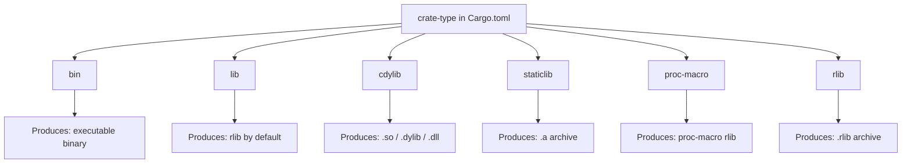
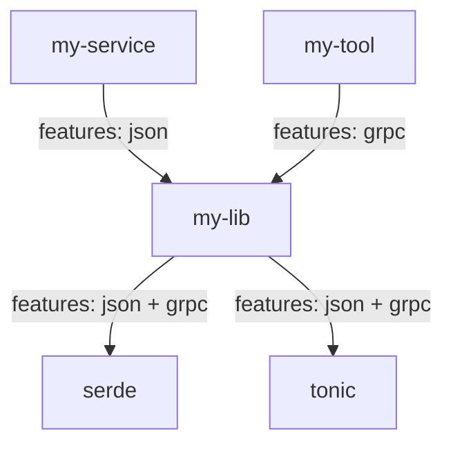
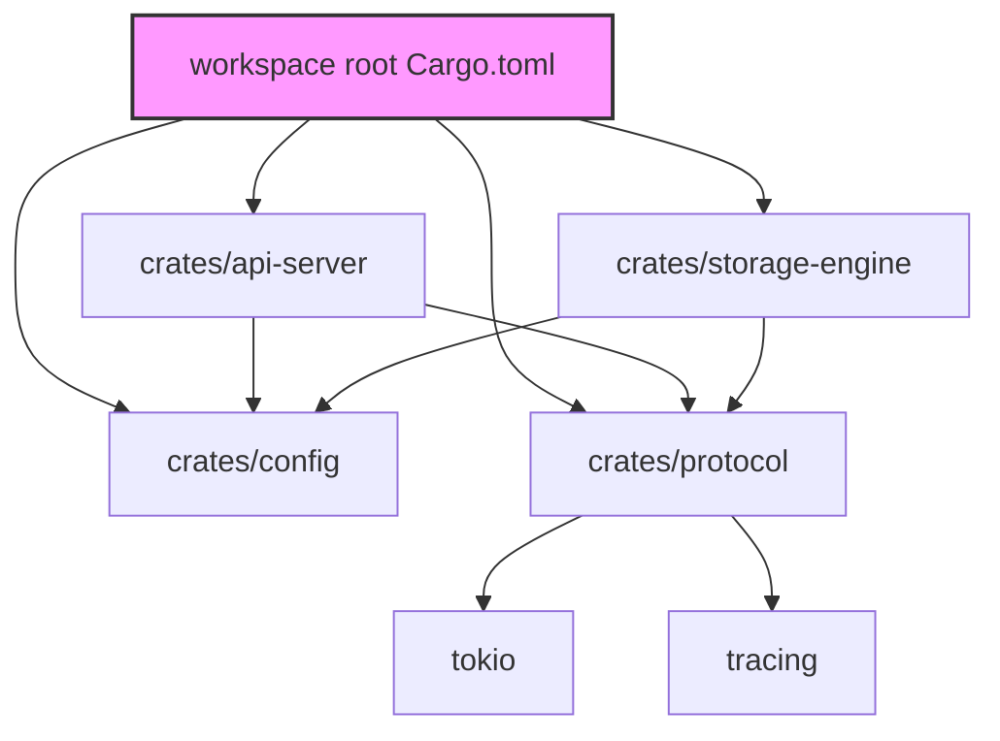
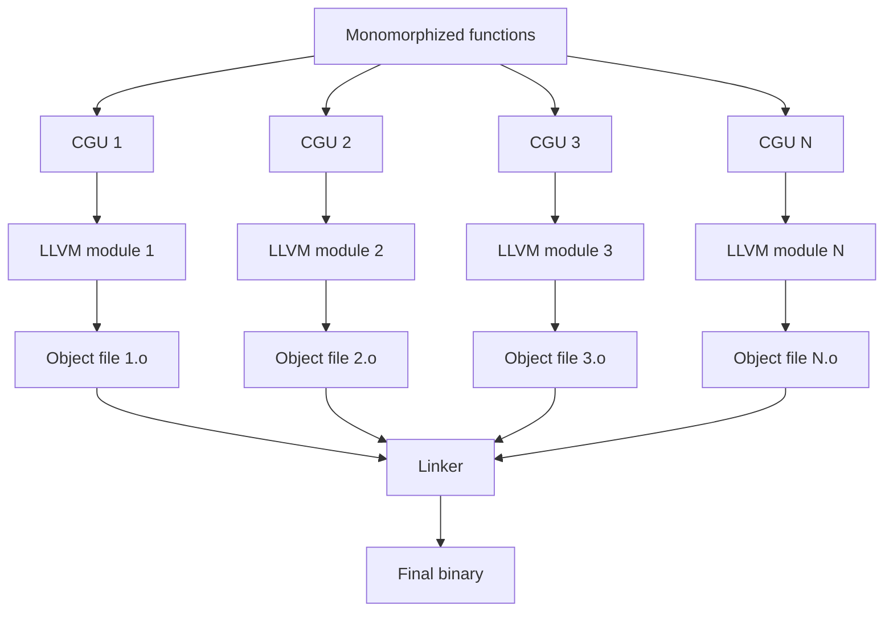
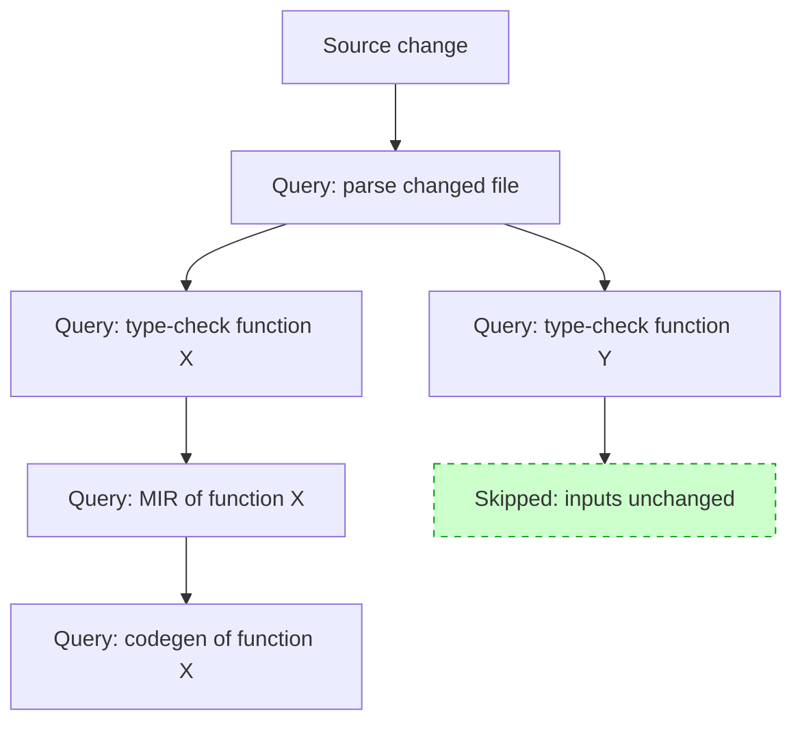

# Chapter 1 — Rust Architecture: Toolchain, Crates, and the Compilation Model

*What this chapter covers:* the full Rust toolchain — from source text to linked binary — with enough depth that you can diagnose build failures, tune compilation speed, structure multi-crate workspaces, and understand what the compiler is actually doing when it says "borrowed value does not live long enough." You will learn how `rustup`, `rustc`, `Cargo`, and crates.io fit together, what crate types exist and when to use each, how editions and feature flags change the language surface, and how the compilation pipeline transforms source through HIR and MIR into LLVM IR and ultimately object code — including monomorphization, codegen units, LTO, and the incremental query system. Every concept is grounded in the operational reality of backend systems: large workspaces, CI build times, cross-compilation for containers, and the tension between compilation speed and runtime performance.

**Learning goals:**

- Explain the role of each toolchain component — `rustup`, `rustc`, `Cargo`, and crates.io — and how they interact in a typical development and CI workflow.
- Distinguish all six crate types (`bin`, `lib`, `rlib`, `cdylib`, `staticlib`, `proc-macro`) and know which `crate-type` to set for a given deployment target.
- Understand Rust editions (2015, 2018, 2021, 2024), how `cfg` attributes and conditional compilation work, and how feature flags and feature unification affect build graphs.
- Trace the compilation pipeline from source text through macro expansion, name resolution, HIR lowering, MIR construction, borrow checking, monomorphization, LLVM optimization, codegen-unit partitioning, linking, and final binary production.
- Read and interpret the output of `rustc --emit mir`, `cargo tree`, and `cargo build --timings`.
- Understand codegen units, incremental compilation, and LTO (thin vs. fat) — and know when to enable or disable each.
- Use `build.rs` build scripts to generate code, invoke system tools, and emit Cargo metadata at build time.

---

## 1. The Rust Toolchain: Components and Their Roles

A Rust developer rarely invokes `rustc` directly. Instead, they interact through Cargo, which orchestrates `rustc` invocations, dependency resolution, and build orchestration. Understanding what each component actually does matters when something goes wrong in CI, when you need to cross-compile, or when you need to pin a specific toolchain version.

### 1.1 rustup: The Toolchain Manager

`rustup` is the official toolchain installer and version manager. It manages multiple installed toolchains (stable, beta, nightly) and target triples on the same machine. When you run `rustup update`, it downloads new releases of `rustc`, `cargo`, `clippy`, `rustfmt`, and the standard library for all installed targets.

```bash
$ rustup show
Default host: x86_64-unknown-linux-gnu
rustup home:  /home/user/.rustup

installed toolchains
--------------------
stable-x86_64-unknown-linux-gnu
nightly-x86_64-unknown-linux-gnu

active toolchain
----------------
stable-x86_64-unknown-linux-gnu (default)
```

For backend teams, rustup enables reproducible builds via `rust-toolchain.toml`:

```toml
[toolchain]
channel = "1.78.0"
components = ["clippy", "rustfmt", "miri"]
targets = ["x86_64-unknown-linux-gnu", "aarch64-unknown-linux-gnu"]
```

Committing this file to a repository pins every developer and CI runner to the same compiler version. Without it, "works on my machine" builds are inevitable — a problem familiar from Java's `JAVA_HOME` or Go's `GOROOT`, but now with the added dimension of target-triple specificity.

### 1.2 rustc: The Compiler

`rustc` is the Rust compiler. It accepts a single crate root (a `lib.rs` or `main.rs`), resolves its dependencies, and produces an output artifact. Cargo calls `rustc` once per crate in the dependency graph, passing the correct flags for each.

Key `rustc` flags for backend engineers:

| Flag | Purpose |
|------|---------|
| `--emit mir` | Emit MIR (Mid-level IR) — useful for debugging borrow-checker errors and inspecting optimizations |
| `--emit llvm-ir` | Emit LLVM IR — see what LLVM receives after Rust optimizations |
| `--emit dep-info` | Emit dependency information for build tools |
| `--crate-type` | Override the crate type (bin, lib, cdylib, staticlib, rlib, proc-macro) |
| `--edition` | Set the Rust edition (2015, 2018, 2021, 2024) |
| `--print target-spec-json` | Inspect a target's specification, useful for custom cross-compilation |
| `-C lto=thin` | Enable thin LTO for the crate |
| `-C codegen-units=1` | Set codegen units to 1 for maximum optimization at the cost of parallelism |

You will almost never pass these directly — Cargo translates `Cargo.toml` settings into `rustc` flags. But when debugging build failures or inspecting optimization artifacts, knowing what `rustc` flags correspond to which Cargo settings is essential.

### 1.3 Cargo: The Build System and Package Manager

Cargo handles dependency resolution, compilation orchestration, test running, benchmarking, publishing, and more. It is analogous to npm (Node), pip+setuptools (Python), or Maven (Java), but tightly integrated with the compiler rather than bolted on.

### 1.3.1 Essential Cargo Subcommands

Backend engineers should know these Cargo subcommands beyond the basic `build` and `run`:

| Subcommand | Purpose |
|------------|---------|
| `cargo tree` | Print the dependency tree, with optional filters by features, duplicates, or target |
| `cargo tree -d` | Show duplicate dependencies — the first thing to check when a crate is unexpectedly large |
| `cargo tree -e features` | Show how features are resolved across the dependency graph |
| `cargo build --timings` | Generate an HTML Gantt chart of crate compilation times |
| `cargo build --message-format=short` | Machine-readable output for CI integration |
| `cargo clippy --workspace -- -D warnings` | Run the linter on all workspace crates with warnings as errors |
| `cargo audit` | Check dependencies against the RustSec advisory database |
| `cargo deny check` | Enforce license, advisory, and duplicate policies |
| `cargo update` | Update `Cargo.lock` to latest compatible versions |
| `cargo generate-lockfile` | Regenerate `Cargo.lock` from scratch |
| `cargo vendor` | Vendor all dependencies into a local directory for offline builds |

For CI pipelines, the typical sequence is: `cargo fmt --check` → `cargo clippy --workspace` → `cargo test --workspace` → `cargo build --release`. Each step is independent and can be parallelized across CI runners for faster feedback.


Cargo resolves the full dependency graph, downloads crates from the registry, executes any `build.rs` scripts, invokes `rustc` once per crate in topological order, and links the final artifact. The `target/` directory caches all intermediate artifacts — `rlib` files for library crates, object files, and dependency metadata — enabling incremental rebuilds.

### 1.4 crates.io: The Registry

crates.io is the official package registry, hosting over 150,000 crates. Each crate is a versioned tarball containing `Cargo.toml` and source. Cargo downloads crates via HTTPS from static file endpoints and indexes them via a sparse Git protocol.

For backend systems, the registry is both an asset and a risk. A supply-chain attack via a typosquatted crate (like the 2021 `rustdecimal` incident, where a crate impersonating the `rust_decimal` library contained a keylogger) can compromise production builds. Cargo.lock pins exact versions, but only if you commit it to source control and verify it in CI — a practice that should be as automatic as `cargo audit` in any production pipeline.

### 1.5 Dependency Resolution

Cargo's dependency resolver is a SAT-solver-based system that computes a set of compatible versions for all crates in the dependency graph. It respects semver constraints, honors `[patch]` and `[replace]` sections, and produces a deterministic `Cargo.lock` file. For backend teams, understanding the resolver's behavior is critical when:

- Two crates depend on incompatible versions of the same library (e.g., `tokio 0.2` vs. `tokio 1.0`). Cargo resolves both versions into the build, resulting in duplicate code and potential type-mismatch errors across crate boundaries.
- A transitive dependency publishes a breaking change within a semver-compatible range (a semver violation). The `cargo update` command will pick it up, potentially breaking builds. Pinning versions in `[workspace.dependencies]` mitigates this.
- You need to substitute a dependency with a local fork or a patched version. The `[patch]` section in `Cargo.toml` allows this without forking every upstream crate.

```toml
# Patch a transitive dependency with a local fork
[patch.crates-io]
hyper = { path = "../hyper-fork" }
tokio = { git = "https://github.com/myorg/tokio", branch = "custom-park" }
```

The resolver produces a single `Cargo.lock` for the entire workspace, ensuring that all crates in the project use the same versions of shared dependencies. This is a significant advantage over ecosystems like npm, where each package can have its own nested `node_modules` with different versions of the same library.
## 2. Crate Types: What the Compiler Produces

The `crate-type` field in `Cargo.toml` (or the `--crate-type` flag to `rustc`) controls what kind of artifact the compiler produces. This matters enormously in backend systems where you may need a shared library for FFI, a static library for embedded targets, or a binary for a container image.



### 2.1 Binary Crates (`bin`)

A binary crate produces an executable. The crate root must contain a `fn main()`. In a workspace, you declare a binary crate like this:

```toml
# Cargo.toml
[package]
name = "my-service"
version = "0.1.0"
edition = "2021"

[[bin]]
name = "my-service"
path = "src/main.rs"
```

The compiler produces an ELF binary (on Linux) containing all the machine code from the binary crate and all of its dependencies. This is the artifact you put in a Docker image or deploy to a server.

### 2.2 Library Crates (`lib`)

A library crate produces an `.rlib` file by default — a Rust-specific archive format that contains compiled Rust code, metadata, and type information. Library crates do not have a `main` function.

```toml
[lib]
name = "my_lib"
crate-type = ["lib"]
```

The `lib` crate type defaults to `rlib`, which is what you want for Rust-to-Rust dependencies. The `.rlib` is not a general-purpose archive — it is designed for the Rust compiler to read, not for linking by external tools.

### 2.3 C-Dynamic Libraries (`cdylib`)

A `cdylib` produces a C-compatible shared library (`.so` on Linux, `.dylib` on macOS, `.dll` on Windows). This is what you need for FFI — calling Rust from C, Python, Ruby, or any other language that can load shared libraries.

```toml
[lib]
crate-type = ["cdylib"]
```

The compiler strips Rust-specific metadata and produces a standard shared library with C-compatible symbol names (mangled with `rustc`'s name mangling scheme, or `#[no_mangle]` for C-ABI symbols). This is how `libgit2`-bindings, `ring`, and other Rust FFI crates work.

### 2.4 Static Libraries (`staticlib`)

A `staticlib` produces an `.a` archive (on Unix) or `.lib` (on Windows) that can be linked into a C program at compile time. Unlike `cdylib`, the final linking happens when the consuming C program is built.

```toml
[lib]
crate-type = ["staticlib"]
```

Static libraries are preferred for embedded targets or when you want a single self-contained binary. They avoid the deployment complexity of shared library versioning.

### 2.5 proc-macro

A `proc-macro` crate produces a special rlib that the compiler loads during macro expansion of downstream crates. Procedural macros run at compile time with full access to the compiler's API.

```toml
[lib]
crate-type = ["proc-macro"]
```

Examples: `serde_derive`, `tokio-macros`, `thiserror`. The compiler loads proc-macro crates as plugins, invokes their functions with token streams, and replaces macro invocations with the generated code.

### 2.6 rlib

An `rlib` is the default library type and is the most efficient format for Rust-to-Rust dependency chains. It contains Rust-specific metadata that enables cross-crate inlining, monomorphization, and type checking. You almost never set `crate-type = ["rlib"]` explicitly — it is the default for `lib` crates.

## 3. Editions, cfg, and Conditional Compilation

### 3.1 Rust Editions

Rust uses an edition system to evolve the language without breaking existing code. Each edition is specified in `Cargo.toml` and applies to all crates in the package. Editions are not backward-compatible subsets — they add features and sometimes change default behavior.

| Edition | Year | Key Changes |
|---------|------|-------------|
| 2015 | 1.0 | Initial stable release. `extern crate` required. |
| 2018 | 1.31 | `extern crate` no longer needed. `dyn Trait` syntax. NLL borrow checker. `async`/`await` (stabilized later). Module path improvements. |
| 2021 | 1.56 | Closure capture improvements. `IntoIterator` for arrays. `panic!` macro always expects format strings. Disjoint capture in closures. |
| 2024 | 1.85 | `unsafe_op_in_unsafe_fn` lint by default. `gen` blocks. More strict lifetime rules. RPIT (Return Position Impl Trait) captures all in-scope lifetimes. |

Editions are *opt-in per crate*: a library can be edition 2015 while its dependency uses 2021. Cargo handles the edition bridging automatically. For backend teams, the practical impact is that you should always use the latest edition for new crates — there is no cost to doing so, and you gain cleaner syntax and better defaults.

### 3.2 cfg and Conditional Compilation

The `cfg` attribute controls conditional compilation. It is the Rust equivalent of C preprocessor `#ifdef`, but with better semantics:

```rust
#[cfg(target_os = "linux")]
fn get_page_size() -> usize {
    // Use sysconf on Linux
    unsafe { libc::sysconf(libc::_SC_PAGESIZE) as usize }
}

#[cfg(target_os = "macos")]
fn get_page_size() -> usize {
    // Use sysctl on macOS
    let mut size: usize = 0;
    let mut len = std::mem::size_of::<usize>();
    unsafe {
        libc::sysctlbyname(
            b"hw.pagesize\0".as_ptr() as *const libc::c_char,
            &mut size as *mut _ as *mut libc::c_void,
            &mut len,
            std::ptr::null_mut(),
            0,
        );
    }
    size
}
```

Custom `cfg` flags are passed via `--cfg` to `rustc`, which Cargo exposes through `[target.*.cfg]` in `Cargo.toml` and through `build.rs`:

```rust
// build.rs
fn main() {
    // Set a custom cfg flag based on build environment
    if std::env::var("TARGET").unwrap().contains("musl") {
        println!("cargo:rustc-cfg=has_musl");
    }
}
```

For backend systems, `cfg` is used extensively for platform-specific code paths (Linux vs. macOS for local development), feature gating (enabling experimental APIs only in nightly builds), and integration testing (enabling test-only code paths without affecting the release build).

### 3.3 Edition Migration in Practice

When upgrading an edition, `cargo fix --edition` can automatically apply mechanical transformations. For example, moving from edition 2015 to 2018 replaces bare `use foo::Bar` paths with `use crate::foo::Bar` and removes unnecessary `extern crate` declarations. The process:

```bash
# Step 1: Check what would change
$ cargo fix --edition --allow-dirty --allow-no-vcs

# Step 2: Review the diff
$ git diff

# Step 3: Update Cargo.toml
$ sed -i 's/edition = "2018"/edition = "2021"/' Cargo.toml

# Step 4: Verify
$ cargo check
$ cargo test
```

For large backend codebases with hundreds of crates, edition migration should be done incrementally — one workspace member at a time — rather than attempting a monolithic upgrade. Each crate can be at a different edition, and the compiler handles inter-edition compatibility transparently.

## 4. Features and Feature Unification

### 4.1 Declaring and Using Features

Cargo features are compile-time flags that conditionally enable code in a crate. They are declared in `Cargo.toml` and consumed via `#[cfg(feature = "...")]` in source:

```toml
[features]
default = ["std"]
std = []
json = ["serde", "serde_json"]
grpc = ["tonic", "prost"]

[dependencies]
serde = { version = "1.0", optional = true }
serde_json = { version = "1.0", optional = true }
tonic = { version = "0.10", optional = true }
prost = { version = "0.12", optional = true }
```

```rust
#[cfg(feature = "json")]
pub mod json_support {
    use serde::{Serialize, Deserialize};

    #[derive(Serialize, Deserialize)]
    pub struct Config {
        pub timeout_ms: u64,
        pub max_retries: u32,
    }
}
```

Features are additive — enabling a feature can only add code, never remove it. This is a deliberate design choice that prevents dependency conflicts when two crates enable different features of the same dependency.

### 4.2 Feature Unification

Feature unification is one of the most misunderstood aspects of Cargo's dependency resolution. When two crates in the same build depend on the same library with different features, Cargo enables *the union* of all requested features — not the intersection, and not independent resolutions.



In this example, `my-lib` is used by both `my-service` (with the `json` feature) and `my-tool` (with the `grpc` feature). Cargo resolves `my-lib` with *both* features enabled for the entire build graph. This means `my-service` — which only requested `json` — will also pull in `tonic` and `prost` as transitive dependencies.

This has real consequences for backend builds: feature unification can pull in unexpected transitive dependencies, increasing compilation time and binary size. The mitigation is to structure workspaces so that feature-gated dependencies are separated into distinct crates, and to use `cargo tree -e features` to inspect the resolved feature graph.

```bash
$ cargo tree -e features -p my-lib
my-lib v0.1.0
├── serde feature "default"
│   └── serde v1.0.193
├── serde_json feature "default"
│   └── serde_json v1.0.108
├── tonic feature "default"
│   └── tonic v0.10.2
└── prost feature "default"
    └── prost v0.12.1
```

### 4.3 Cargo Workspaces

Workspaces are Cargo's mechanism for managing multi-crate projects. A workspace is a set of crates that share a single `Cargo.lock` and a single `target/` directory:

```toml
# Root Cargo.toml
[workspace]
members = [
    "crates/api-server",
    "crates/storage-engine",
    "crates/config",
    "crates/protocol",
]

[workspace.dependencies]
tokio = { version = "1.35", features = ["full"] }
tracing = "0.1"
thiserror = "1.0"
```



Workspaces solve several backend engineering problems:

- **Atomic dependency updates:** `cargo update` updates a single `Cargo.lock` for all crates, ensuring that inter-crate dependencies are consistent.
- **Shared build cache:** All crates share the `target/` directory, so changing one crate does not require recompiling unchanged crates.
- **Workspace-level linting and testing:** `cargo test --workspace` runs all tests across all crates. `cargo clippy --workspace` lints everything.
- **Version inheritance:** `[workspace.dependencies]` lets you pin versions centrally, preventing version drift between crates in the same project.

## 5. The Compilation Pipeline: Source to Binary

Understanding what `rustc` does between reading your source and producing a binary is critical for diagnosing build failures, understanding error messages, and tuning performance.


### 5.1 Source to HIR

The compiler first parses source text into a concrete syntax tree (CST), expands macros (including procedural macros), resolves names, and then lowers the resulting AST into HIR (High-Level IR). HIR is similar to the AST but with some desugaring already applied — `for` loops become `loop`/`match`, `?` becomes `match` on `Result`, and closures are represented uniformly.

You can inspect HIR with `rustc --emit hir`, but it is rarely useful in practice. HIR exists primarily as the input to the type checker.

### 5.2 HIR to MIR

After type checking and borrow checking succeed, the compiler lowers HIR to MIR (Mid-level IR). MIR is a control-flow-graph-based representation — each function body is represented as a graph of basic blocks connected by edges. MIR is the representation where:

- **Borrow checking** actually happens (NLL and Polonius operate on MIR).
- **MIR optimizations** are applied (constant propagation, dead code elimination, inlining).
- **Code generation** begins.

You can inspect MIR with `rustc --emit mir`, and Cargo exposes this through `cargo rustc -- --emit mir`:

```bash
$ cargo rustc --lib -- --emit mir -C output-codegen-units=1
```

MIR output looks like:

```
fn my_function(_1: i32) -> i32 {
    let mut _0: i32;
    let _2: i32;
    bb0: {
        StorageLive(_2);
        _2 = _1;
        _0 = Add(_2, 1);
        StorageDead(_2);
        return -> [return: bb1];
    }
    bb1: {
        return;
    }
}
```

Each basic block ends with a terminator (`goto`, `switchInt`, `return`, `resume`, `unwind`). The explicit storage annotations (`StorageLive`/`StorageDead`) track variable lifetime for the borrow checker.

### 5.3 MIR to LLVM IR

After MIR optimizations, the compiler generates LLVM IR for each function. This is where monomorphization occurs: each generic function instantiation gets its own copy of LLVM IR, specialized to the concrete types used. The compiler also generates "drop glue" — code to run `Drop::drop` on values when they go out of scope.

```bash
$ rustc --emit llvm-ir src/lib.rs --crate-type lib -O
$ head -n 30 my_lib.ll
; ModuleID = 'my_lib.3a1fbbf7-cgu.0'
source_filename = "my_lib.3a1fbbf7-cgu.0"
target datalayout = "e-m:e-p270:32:32-p271:32:32-p272:64:64-..."
target triple = "x86_64-unknown-linux-gnu"

; Function attributes
define i32 @my_function(i32 %0) {
start:
  %1 = add i32 %0, 1
  ret i32 %1
}
```

### 5.4 Monomorphization

Monomorphization is Rust's primary strategy for generic dispatch. When you write a generic function:

```rust
pub fn parse_packet<T: PacketCodec>(buf: &[u8]) -> Result<T, ParseError> {
    T::decode(buf)
}
```

The compiler generates a *separate copy* of `parse_packet` for each concrete type `T` that the function is called with. If you call `parse_packet::<HttpRequest>(...)` and `parse_packet::<HttpResponse>(...)`, two distinct machine-code functions exist in the binary.

This gives zero-cost abstraction — no virtual dispatch, no dynamic typing, no runtime overhead — at the cost of binary size. In a backend service that uses generics extensively (which is inevitable with `tokio::Service`, `tower::Layer`, `serde::Serialize`, etc.), binary sizes of 50–200 MB for debug builds and 10–50 MB for release builds are common.

### 5.4.1 Monomorphization and Binary Size

The binary size cost of monomorphization is not just about duplicate function bodies. Each monomorphized function also includes:

- **Drop glue** — a function that calls `Drop::drop` on each field of a struct. For a generic `Vec<T>`, the drop glue is generated for each concrete `T` used in the program.
- **Panic formatting** — each monomorphized function that can panic carries its own panic formatting payload, including the function name and source location.

Mitigation strategies for large backend binaries:

1. **Use `dyn Trait` for large generic trees** — replaces N monomorphized copies with a single function that dispatches through a vtable. The trade-off is a pointer indirection per call, negligible for most backend workloads.
2. **Enable `strip = "symbols"` in release** — removes debug symbols, typically reducing binary size by 30–50%.
3. **Use `cargo bloat`** to identify which generic instantiations contribute most to binary size, then refactor accordingly.
4. **Consider `panic = "abort"`** — eliminates the unwinding machinery, saving significant binary size.

### 5.5 Codegen Units

After monomorphization, the compiler partitions the resulting functions into codegen units (CGUs). Each CGU is compiled to LLVM IR independently and then to an object file. Multiple CGUs are then linked together.

The number of codegen units is controlled by `-C codegen-units=N` (default: 16 in debug, 1 in release with LTO). More CGUs mean more parallelism during compilation, but LLVM has less opportunity to optimize across CGU boundaries.



For backend CI pipelines, CGU count is a knob for build speed: `codegen-units = 1` produces a faster binary but takes longer to compile, while `codegen-units = 16` compiles faster but produces a slower binary. The default is a reasonable trade-off for development, but release builds should use LTO (see §7).

### 5.6 Linking

The final step is linking — combining all object files and system libraries into the output artifact. Rust uses `cc` (the system C compiler) as the linker on Unix, or `link.exe` on Windows. The linker resolves symbols, performs relocations, and produces the final ELF/PE/Mach-O binary.

Linker errors are among the most common build failures in backend Rust projects, especially when linking C libraries via FFI. The error messages from `ld` or `lld` are often opaque — understanding the compilation pipeline helps you diagnose them: the issue is almost always a missing symbol in a `cdylib` or `staticlib`, or a mismatch between the declared FFI signatures and the actual C function signatures.

## 6. Cargo.toml in Practice: A Backend Service

Here is a realistic `Cargo.toml` for a production backend service:

```toml
[package]
name = "payment-gateway"
version = "0.12.0"
edition = "2021"
rust-version = "1.78"

[dependencies]
tokio = { version = "1.35", features = ["full"] }
axum = "0.7"
tower = "0.4"
tower-http = { version = "0.5", features = ["cors", "trace"] }
serde = { version = "1.0", features = ["derive"] }
serde_json = "1.0"
tracing = "0.1"
tracing-subscriber = { version = "0.3", features = ["env-filter", "json"] }
sqlx = { version = "0.7", features = ["runtime-tokio", "tls-rustls", "postgres", "chrono"] }
redis = { version = "0.24", features = ["tokio-comp", "connection-manager"] }
thiserror = "1.0"
anyhow = "1.0"
uuid = { version = "1.6", features = ["v4", "serde"] }
chrono = { version = "0.4", features = ["serde"] }

[dev-dependencies]
tokio-test = "0.4"
assert_cmd = "2.0"
predicates = "3.0"

[build-dependencies]
cc = "1.0"
tonic-build = "0.10"

[profile.release]
opt-level = 3
lto = "thin"
codegen-units = 1
strip = "symbols"
panic = "abort"
```

Notice the deliberate choices:

- `features = ["full"]` on tokio — this is the development convenience choice; production builds should select only the features actually used (rt, net, io-util, etc.) to reduce compile time and binary size.
- `profile.release` with `lto = "thin"` and `codegen-units = 1` — maximum optimization for release binaries at the cost of longer builds.
- `strip = "symbols"` — removes debug symbols from the release binary, reducing size significantly.
- `panic = "abort"` — avoids unwinding machinery, reducing binary size and simplifying `Drop` semantics.

## 7. LTO, Incremental Compilation, and Build Performance

### 7.1 Link-Time Optimization (LTO)

LTO operates at the linking stage, enabling cross-module optimizations that are impossible during per-crate compilation. There are three modes:

| Mode | Behavior | Build Time | Runtime Performance |
|------|----------|------------|-------------------|
| `lto = false` | No LTO. Each CGU is compiled independently. | Fastest | Baseline |
| `lto = "thin"` | ThinLTO processes LLVM IR summaries in parallel, then performs cross-module inlining and optimization. | Moderate (2–3× baseline) | Good (~5–10% faster than no LTO) |
| `lto = "fat"` | Fat LTO merges all modules into a single LLVM module. Maximum optimization surface. | Slowest (5–10× baseline) | Best (~10–15% faster than no LTO) |

ThinLTO is the right default for release builds. It provides most of fat LTO's performance benefits at a fraction of the build time. Fat LTO is only justified when every nanosecond of runtime performance matters — e.g., in a hot-path network packet parser processing millions of packets per second.

For backend CI, you can enable LTO only for release builds and keep debug builds fast:

```toml
[profile.release]
lto = "thin"
codegen-units = 1
```

### 7.2 Incremental Compilation

Rust's incremental compilation system caches intermediate results of the compilation pipeline so that changes to one function do not require recompiling unrelated functions. The incremental query system works by tracking which compilation queries (e.g., type-checking a function, computing the MIR of a function, monomorphizing a generic call) were invoked during the previous build, and re-running only the queries whose inputs changed.



Incremental compilation is enabled by default in debug builds and disabled in release builds (because release optimizations are not incremental-friendly). The cache lives in `target/debug/incremental/` and can be several gigabytes for large workspaces.

Key facts for backend teams:

- Incremental compilation reduces rebuild time from minutes to seconds for typical edits, but first builds are slightly slower due to dependency tracking overhead.
- The incremental cache is not cross-machine — CI builds cannot reuse a developer's cache, so CI should use `--incremental` sparingly or not at all.
- If the incremental cache becomes corrupted (which can happen after toolchain upgrades), delete `target/debug/incremental/` and rebuild.
- `cargo build --timings` produces an HTML report showing which crates are the build bottleneck and how much parallelism is actually achieved.

### 7.3 CI Build Caching Strategies

For backend teams, CI build times are a direct cost — developers wait for feedback, and slow CI delays deployments. The key strategies:

1. **`sccache`** — a shared compilation cache (backed by S3, GCS, or local disk) that caches the output of `rustc` invocations. When the same source file + flags are compiled on a different CI runner, `sccache` returns the cached object file instead of invoking `rustc`. This can reduce CI build times by 50–70% for clean builds.

```bash
# Install sccache
$ cargo install sccache
$ export RUSTC_WRAPPER=sccache
$ cargo build --release
```

2. **`cargo nextest`** — a faster test runner that runs each test in its own process, enabling better parallelism and isolation. For backend services with hundreds of integration tests, `cargo nextest` can reduce test execution time by 30–50% compared to `cargo test`.

3. **Target directory caching** — cache the `target/` directory across CI runs. This is effective for incremental builds but requires careful cache key management (toolchain version, Cargo.lock hash, source hash).

4. **Dependency vendoring** — `cargo vendor` downloads all dependencies into a local directory, eliminating network fetches during CI. This is essential for air-gapped build environments and for reproducibility.

```bash
$ cargo build --timings
```

This generates `target/cargo-timing.html`, a Gantt chart of crate compilation. For backend teams with large workspaces, this is the first tool to reach for when diagnosing slow CI builds.

### 7.4 Build Script Interaction with Incremental Compilation

Build scripts (`build.rs`) are re-run when their output changes or when their declared dependencies change. This can cause surprising rebuilds if a build script reads environment variables that change between runs, or if it generates code that depends on the current date. Best practices:

- Declare `cargo:rerun-if-changed=src/protobuf/` to limit rebuild triggers.
- Never read `CARGO_PKG_NAME` or other package metadata in build scripts — it changes per crate and triggers unnecessary re-runs.
- Use `cargo:rerun-if-env-changed=CC` only if the build script actually depends on the C compiler.

## 8. Build Scripts: build.rs in Practice

Build scripts are Rust programs that run at compile time, before `rustc` is invoked for the crate. They are declared as `[build-dependencies]` in `Cargo.toml` and executed from `build.rs` in the package root.

Build scripts are the standard mechanism for:

1. **Generating Rust code** — protobuf/gRPC code generation via `tonic-build` or `prost-build`.
2. **Compiling C/C++ code** — using the `cc` crate to build native dependencies.
3. **Emitting Cargo metadata** — `cargo:rustc-link-lib=ssl` to link a system library.
4. **Setting cfg flags** — `cargo:rustc-cfg=has_feature_x` to enable conditional compilation.

A typical `build.rs` for a gRPC service:

```rust
fn main() -> Result<(), Box<dyn std::error::Error>> {
    let proto_root = "proto";
    let proto_files = &["proto/payment.proto", "proto/gateway.proto"];

    tonic_build::configure()
        .build_server(true)
        .build_client(false)
        .compile(proto_files, &[proto_root])?;

    // Tell Cargo to re-run if proto files change
    for proto in proto_files {
        println!("cargo:rerun-if-changed={proto}");
    }

    // Link the native TLS library
    println!("cargo:rustc-link-lib=ssl");
    println!("cargo:rustc-link-search=/usr/lib/x86_64-linux-gnu");

    Ok(())
}
```

Build scripts execute in a sandboxed environment with limited access to the filesystem (only the package directory and `OUT_DIR`). They communicate with Cargo through stdout, printing specially formatted lines:

| Output | Effect |
|--------|--------|
| `cargo:rustc-link-lib=NAME` | Link a native library |
| `cargo:rustc-link-search=PATH` | Add a library search path |
| `cargo:rustc-cfg=KEY` | Set a cfg flag |
| `cargo:rustc-env=KEY=VALUE` | Set an environment variable accessible via `env!()` |
| `cargo:rerun-if-changed=PATH` | Re-run the script if PATH changes |
| `cargo:rerun-if-env-changed=KEY` | Re-run the script if KEY env var changes |

For backend systems, build scripts are a performance-sensitive bottleneck. A slow `build.rs` (e.g., one that invokes `protoc` on hundreds of `.proto` files) can dominate CI build times. Mitigation: cache `OUT_DIR` in CI, pre-generate protobuf code and commit it to source, or use `cargo:rerun-if-changed` to minimize re-runs.

## 9. Distributed-Systems Lens: Build Tooling at Scale

The Rust toolchain's design decisions have direct consequences for large backend organizations:

- **Compile times are the primary developer-experience bottleneck.** Rust's monomorphization strategy produces fast binaries at the cost of long compile times. In a workspace with 50 crates and 200 dependencies, a clean build can take 5–15 minutes on CI. Incremental rebuilds help in development, but CI always does clean builds. Strategies include: shared CI caches of `target/`, build distribution (e.g., `sccache`), and structuring workspaces so that frequently-changed crates have minimal downstream dependents.

- **Feature unification causes unexpected dependency bloat.** In a large workspace where many crates depend on a common library with different features, the union of all features can pull in heavyweight dependencies. This increases build time, binary size, and the attack surface for supply-chain risks. Monitor with `cargo tree -e features` regularly.

- **Crate types determine deployment architecture.** A service that links a `cdylib` for FFI with a Python plugin system needs a different build pipeline than one that produces a static binary for a container. Cross-compilation (`cargo build --target aarch64-unknown-linux-gnu`) requires target-specific toolchains installed via `rustup target add`.

- **The lock file is a contract.** `Cargo.lock` pins exact versions of all dependencies. For reproducible builds in distributed teams, committing `Cargo.lock` to source control is mandatory — the Rust community's equivalent of Go's `go.sum` or Java's Maven lockfiles. Without it, two developers running `cargo build` on different days may get different dependency versions, leading to irreproducible bugs.

- **Procedural macro crates are a build-time dependency.** They run on the host machine during compilation, not on the target. When cross-compiling for a different architecture, proc-macro crates must compile for the *host* target, while the rest of the code compiles for the *target*. This is handled automatically by Cargo but can cause confusion when build scripts assume they are running on the target platform.

## Key takeaways

- **rustup, rustc, Cargo, and crates.io** form a tightly integrated toolchain. `rustup` manages versions, `rustc` compiles, `Cargo` orchestrates, and `crates.io` distributes. Understanding the boundary between them is essential for debugging CI failures and cross-compilation issues.

- **Crate types control the output artifact.** `bin` produces executables, `lib` produces `.rlib` for Rust dependencies, `cdylib` produces C-compatible shared libraries, `staticlib` produces static archives, and `proc-macro` produces compile-time plugins. Choosing the wrong crate type leads to linker errors or deployment failures.

- **Editions enable language evolution without breakage.** Each crate can independently declare its edition, and Cargo bridges the differences. Always use the latest edition for new crates.

- **Feature unification is a build-graph-level phenomenon.** When multiple crates depend on the same library with different features, all features are enabled for the entire build. This can increase compile time, binary size, and supply-chain attack surface. Monitor with `cargo tree -e features`.

- **The compilation pipeline is source → macro expansion → HIR → type check → MIR → monomorphization → LLVM IR → object → linked binary.** Each stage is a distinct optimization and error-checking boundary. MIR is where borrow checking happens; LLVM IR is where machine-level optimizations happen.

- **Monomorphization trades binary size for zero-cost generic dispatch.** Every generic instantiation produces a separate copy of the function. In backend services with heavy use of generics (async, serde, tower), this can produce binaries of 10–50 MB in release mode.

- **Codegen units, LTO, and incremental compilation are the three knobs for build performance.** Debug builds use many CGUs + incremental for fast iteration. Release builds use few CGUs + thin LTO for maximum performance. CI builds should use release-like settings for reproducibility.

- **Build scripts (`build.rs`) are a critical part of the compilation pipeline.** They run at compile time, generate code, link native libraries, and set cfg flags. A slow or poorly-triggered build script can dominate CI build times.

## Further reading

- *The Rust Reference — Conditional Compilation:* https://doc.rust-lang.org/reference/attributes.html#conditional-compilation
- *The Cargo Book — Features:* https://doc.rust-lang.org/cargo/reference/features.html
- *The Cargo Book — Build Scripts:* https://doc.rust-lang.org/cargo/reference/build-scripts.html
- *The Cargo Book — Workspaces:* https://doc.rust-lang.org/cargo/reference/workspaces.html
- *The rustc book:* https://doc.rust-lang.org/rustc/
- *Rust Edition Guide:* https://doc.rust-lang.org/edition-guide/
- *Miri (interpreter for MIR):* https://github.com/rust-lang/miri
- *ThinLTO: Scalable and Incremental LTO (Google, 2017):* https://clang.llvm.org/docs/ThinLTO.html
- *cargo-timing HTML reports:* https://doc.rust-lang.org/cargo/reference/build-progress.html#showing-the-timing-information
