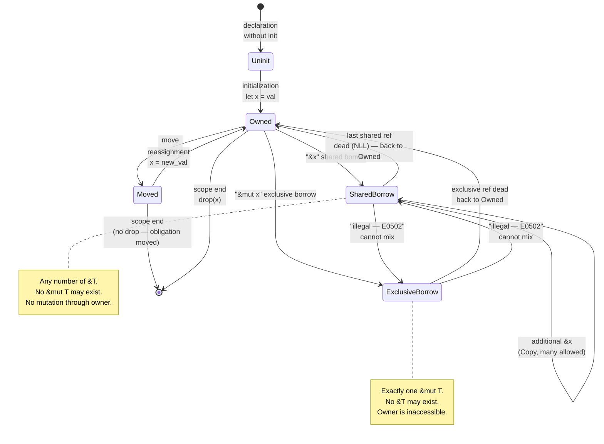
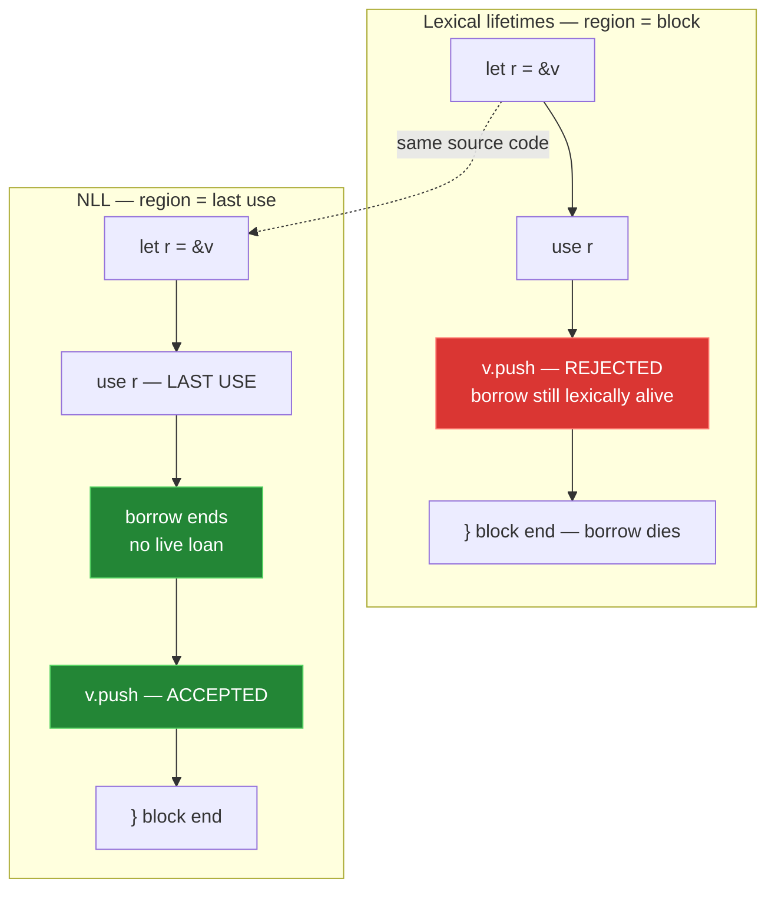
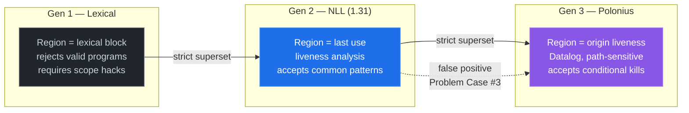
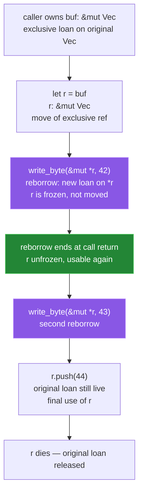
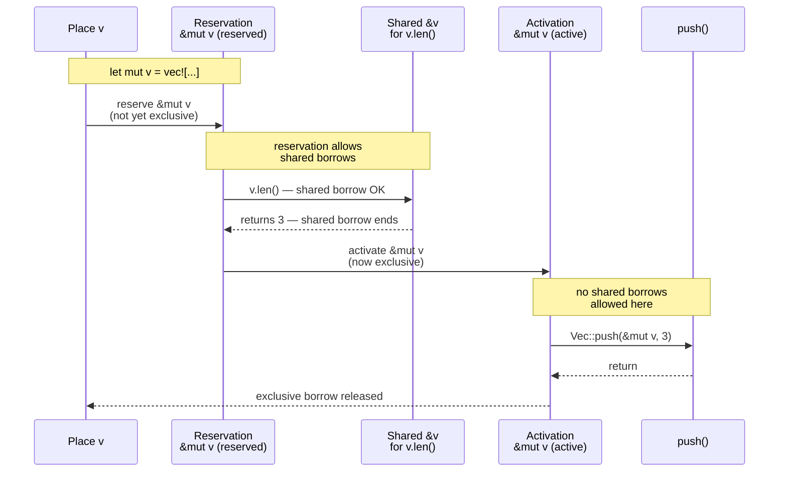
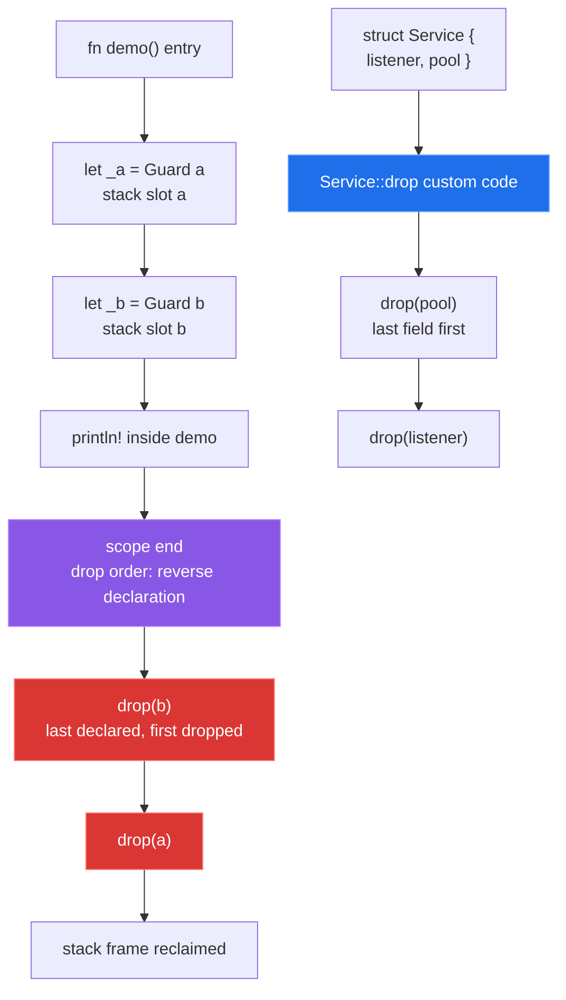

# Chapter 2 — Ownership, Borrowing, and the Borrow Checker

*What this chapter covers:* the three invariants that make Rust's approach to memory fundamentally different from every other backend language you already know — ownership, borrowing, and lifetime enforcement — not as syntax rules to memorize but as a static, compile-time ownership system that replaces garbage collection and manual memory management with an affine type system. You will understand what a move does at the machine level, why `Copy` and `Clone` are different traits with different contracts, how shared (`&T`) and exclusive (`&mut T`) borrows enforce aliasing XOR mutability, how the borrow checker evolved from lexical scopes to non-lexical lifetimes to Polonius, and how reborrowing, two-phase borrows, drop semantics, and interior mutability interact with all of the above.

**Learning goals:**

- Explain move semantics precisely — what is moved, what is invalidated, what the compiler emits — and predict when a value is usable after an assignment or function call.
- Distinguish `Copy` (implicit bitwise copy, `Copy: Clone`) from `Clone` (explicit, potentially expensive duplication) and know when to derive or implement each.
- State and apply the borrowing rules, diagram the borrow state machine, and read borrow-checker errors as consequences of aliasing violations.
- Contrast lexical scopes, non-lexical lifetimes (NLL), and Polonius — and explain why each evolution accepted strictly more programs while preserving soundness.
- Recognize reborrowing, two-phase borrows, and the associated desugarings in method call chains and conditional borrows.
- Trace drop order, understand `Drop` and the drop check (`#[may_dangle]`), and reason about RAII in backend services.
- Preview the interior mutability escape hatch (`Cell`, `RefCell`, `OnceLock`, `Mutex`) and know when it is sound.
- Diagnose failing borrow-checker examples — including real `rustc` diagnostics — and fix them idiomatically.

---

## 1. Ownership as an Affine Type System

Most backend languages give you one of two bad choices for memory: a tracing garbage collector that trades latency for convenience, or manual `malloc`/`free` that trades convenience for correctness. Rust introduces a third option — an **affine type system** where every value has a single owner and ownership can be transferred but not duplicated implicitly.

An affine type is like a linear type but allows discarding — you must use a value at most once via ownership-consuming operations, not exactly once. The compiler tracks this statically. There is no runtime reference count, no finalizer queue, no stop-the-world pause. The bookkeeping happens entirely at compile time.

Three invariants underpin everything in this chapter:

1. **Each value has exactly one owner** — a variable, a struct field, a stack slot.
2. **There can be only one owner at a time** — ownership can be *moved*, not shared by default.
3. **When the owner goes out of scope, the value is dropped** — `Drop::drop` runs deterministically, stack-unwinding order.

If you have written C++ this sounds like `std::unique_ptr` made mandatory for every value. If you have written Go or Java, think of it as the compiler inserting a static analysis pass that proves the GC would have been unnecessary for most values.

> **Mental model:** ownership is not about heap vs. stack. A `u32` on the stack and a `Vec<u8>` with heap storage both obey the same ownership rules. The difference is whether the type's `Drop` implementation does anything. `u32` has no drop glue; `Vec<u8>` frees its allocation.

### Why This Matters for Backend Systems

In a request handler that allocates a `Bytes` buffer, parses it into a `Request`, spawns validation futures, and then serializes a `Response`, ownership tells you — at a glance, without runtime tracing — who is responsible for freeing each buffer and when. There is no `defer cancel()` to forget. There is no finalizer that holds onto 200 MB of request bodies until the next GC cycle. In the hot path of a proxy or a storage engine, that determinism is a feature, not a restriction.

---

## 2. Move Semantics — What `let b = a` Actually Does

Consider this program:

```rust
fn main() {
    let s1 = String::from("hello");
    let s2 = s1;
    println!("{}", s1);
}
```

It fails to compile. The verbatim diagnostic from `rustc 1.78`:

```text
error[E0382]: borrow of moved value: `s1`
 --> src/main.rs:4:20
  |
2 |     let s1 = String::from("hello");
  |         -- move occurs because `s1` has type `String`, which does not implement the `Copy` trait
3 |     let s2 = s1;
  |              -- value moved here
4 |     println!("{}", s1);
  |                    ^^ value borrowed here after move
  |
  = note: this error originates in the macro `$crate::println` (in Nightly builds, run with -Z macro-backtrace for more info)
help: consider cloning the value if the performance cost is acceptable
  |
3 |     let s2 = s1.clone();
  |                ++++++++
```

What happened at the machine level? `String` is three words on the stack:

```text
struct String {
    ptr: *mut u8,   // heap allocation
    len: usize,
    cap: usize,
}
```

`let s2 = s1` performs a **shallow bitwise copy** of those three words from `s1`'s stack slot to `s2`'s stack slot and then **statically invalidates** `s1`. No heap allocation is duplicated. No reference count is bumped. The compiler simply marks `s1`'s slot as uninitialized and transfers the obligation to run `Drop` to `s2`. When `s2` goes out of scope, the heap buffer is freed once. If `s1` were still usable, the same buffer would be double-freed.

This is why move is cheap — it is `memcpy` of the stack representation, not a deep copy — and why it is destructive to the source binding.

```rust
fn takes_ownership(s: String) {
    println!("got: {s}");
} // s dropped here

fn main() {
    let s = String::from("hello");
    takes_ownership(s);
    // s is moved — its drop obligation moved into the callee
    // println!("{s}"); // would be E0382
}
```

```mermaid
flowchart LR
    A["let s1 = String::from(\"hello\")<br/>s1 owns heap buffer<br/>ptr/len/cap on stack"] --> B["let s2 = s1<br/>bitwise copy 24 bytes<br/>invalidate s1"]
    B --> C["s2 owns buffer<br/>s1 = uninitialized<br/>drop obligation on s2"]
    C --> D["scope end<br/>drop(s2) frees heap<br/>s1 already dead"]
    C -.-> E["println!(s1) rejected<br/>E0382 borrow of moved value"]

    style A fill:#1f6feb,stroke:#58a6ff,color:#fff
    style B fill:#8957e5,stroke:#bc8cff,color:#fff
    style C fill:#238636,stroke:#56d364,color:#fff
    style D fill:#21262d,stroke:#8b949e,color:#c9d1d9
    style E fill:#da3633,stroke:#ff7b72,color:#fff
```

**Diagram 1 — Ownership move flow.** A move is a shallow copy plus invalidation of the source and transfer of the drop obligation. No heap work.

Move semantics interacts with **partial moves** from structs:

```rust
struct Conn {
    addr: String,
    fd: i32,
}

fn main() {
    let c = Conn { addr: String::from("10.0.0.5:5432"), fd: 7 };
    let addr = c.addr; // partial move: c.addr is moved, c.fd remains
    // println!("{}", c.addr); // E0382 — partially moved
    println!("{}", c.fd);      // ok — field not moved
    // println!("{:?}", c);   // E0382 — c is partially moved, wholly unusable
}
```

```text
error[E0382]: borrow of partially moved value: `c`
 --> src/main.rs:10:20
  |
7 |     let addr = c.addr;
  |                ------ value partially moved here
...
10 |     println!("{}", c.addr);
  |                    ^^^^^^ value borrowed here after partial move
  |
  = note: partial move occurs because `c.addr` has type `String`, which does not implement the `Copy` trait
```

A struct whose field has been partially moved cannot be used as a whole, cannot be dropped as a whole, and cannot be reassigned without completing initialization — the compiler tracks fields independently but treats the aggregate as poisoned until fully reconstituted.

Reassigning restores full initialization:

```rust
let mut c = Conn { addr: String::from("10.0.0.5:5432"), fd: 7 };
let addr = c.addr;
c.addr = String::from("10.0.0.6:5432"); // reinitialize — c is whole again
println!("{} {}", c.addr, c.fd); // ok
```

---

## 3. Copy vs. Clone — Implicit Bitwise Copy vs. Explicit Duplication

`Copy` and `Clone` look similar and are often derived together, but they encode fundamentally different contracts.

| Trait | Mechanism | Invocation | Cost model | Supertrait |
|-------|-----------|------------|------------|------------|
| `Copy` | Implicit bitwise copy on assignment / argument passing | Automatic — `let b = a` copies | Must be cheap (memcpy of stack representation) | `Copy: Clone` |
| `Clone` | Explicit `a.clone()` producing a new value | Manual — `let b = a.clone()` | May allocate, may be arbitrarily expensive | — |

```rust
// Copy: implicit, cheap, bitwise
let x: u64 = 42;
let y = x;           // copy — x still valid
println!("{x} {y}"); // ok: u64 is Copy

// Clone: explicit, may allocate
let s1 = String::from("hello");
let s2 = s1.clone(); // explicit heap allocation + memcpy
println!("{s1} {s2}"); // ok: s1 not moved, s2 is a deep copy

// &T is Copy (copies the pointer, not the pointee)
let r1: &String = &s1;
let r2 = r1;          // Copy — r1 still valid
```

```toml
# No Cargo.toml magic — Copy vs Clone is a language property.
# Deriving both is idiomatic for small value types:
# [derive macros expand to trivial impls]
```

```rust
#[derive(Copy, Clone, Debug)]
struct HeaderId(u32); // 4 bytes — Copy is correct

#[derive(Clone, Debug)]
struct Payload(Vec<u8>); // heap — cannot be Copy

// This fails:
// #[derive(Copy, Clone)]
// struct Bad(Vec<u8>);
// error[E0204]: the trait `Copy` cannot be implemented for this type
//   = note: the type `Vec<u8>` does not implement `Copy`
```

Rules for `Copy`:

- A type can be `Copy` only if all its fields/components are `Copy`.
- `Copy` types are still moved — but the move is defined as a copy that leaves the source initialized, so the old name remains usable. The compiler does not track invalidation for `Copy` types.
- `Copy` cannot have a custom `Drop` implementation. `Copy` + `Drop` would mean a bitwise copy that duplicates drop obligations — necessarily a double-free. The compiler rejects it.
- References (`&T`) and raw pointers are `Copy` regardless of `T`. `&mut T` is *not* `Copy` — copying a unique borrow would alias it.
- `Copy` is implicit. If you find yourself calling `.clone()` on a `Copy` type, the clone is redundant.

For backend code, reach for `Copy` on small identifiers, status codes, handles, and configuration values that are register-sized. Avoid it on anything owning heap or holding a resource handle — those want `Clone` (explicit, auditable duplication cost) or no duplication at all.

```rust
#[derive(Copy, Clone, Debug, PartialEq, Eq, Hash)]
struct ShardId(u16);

fn route(req: &Request, shard: ShardId) {
    // ShardId copied implicitly — no clone noise, no allocation
    dispatch(shard, req);
    metrics::record(shard); // still valid — was copied
}
```

---

## 4. Borrowing — Shared (`&T`) and Exclusive (`&mut T`) References

Ownership transfer is too coarse for most programs — a function that inspects a request should not consume it. Borrowing lets you create references that temporarily grant access without transferring ownership.

- `&T` — **shared borrow** (also called immutable or shared reference). Many may coexist. None may mutate.
- `&mut T` — **exclusive borrow** (also called mutable or unique reference). Exactly one may exist, and no shared borrows may coexist with it.

This is **aliasing XOR mutability (AXM)**: at any point, you may have *either* any number of shared borrows *or* one exclusive borrow, never both, and never two exclusive borrows to the same place.

```rust
fn len(s: &String) -> usize { s.len() } // borrows, does not own

fn main() {
    let mut s = String::from("hello");
    let r1 = &s;   // shared borrow — s is borrowed immutably
    let r2 = &s;   // second shared borrow — ok
    println!("{} {}", r1, r2);
    // r1, r2 last used here — borrow ends (NLL)

    let r3 = &mut s; // exclusive borrow — ok now that shared borrows expired
    r3.push_str(", world");
    println!("{r3}"); // exclusive borrow in use
    // r3 last used here

    println!("{s}"); // ok — no active borrows
}
```

Why AXM? Because it eliminates data races at compile time. If an exclusive borrow exists, the compiler has proven no other path can read or write the same memory — no reader-writer race, no iterator invalidation, no use-after-reallocation.

```rust
// This is the class of bug Rust eliminates statically.
// Equivalent Go/Java would compile and race:
fn broken_concurrent_push(v: &mut Vec<u32>) {
    let first: &u32 = &v[0]; // shared borrow of element
    v.push(99);               // exclusive borrow of whole vec — may reallocate
    // println!("{}", first); // dangling pointer if push reallocated!
}
```

```text
error[E0502]: cannot borrow `*v` as mutable because it is also borrowed as immutable
 --> src/main.rs:3:5
  |
2 |     let first: &u32 = &v[0];
  |                        - immutable borrow occurs here
3 |     v.push(99);
  |     ^^^^^^^^^^ mutable borrow occurs here
4 |     println!("{}", first);
  |                    ----- immutable borrow later used here
```

Shared borrows are `Copy` — creating a new `&T` from an existing `&T` copies the pointer/length pair without affecting the loan. Exclusive borrows are *not* `Copy` — they must be moved or reborrowed (section 7).

---

## 5. The Borrowing Rules Visualized — The Borrow State Machine

The borrow checker can be understood as a state machine tracking each place (variable, field, index) through its lifetime.



**Diagram 2 — Borrow state machine.** Each place moves between uninitialized, owned, shared-borrowed, exclusively-borrowed, and moved. NLL returns a place to `Owned` when the loan's last use passes, not when the lexical scope ends.

The rules in their canonical form:

1. **Shared borrows (`&T`) allow aliasing but forbid mutation.** Any number may coexist. While any shared borrow is live, neither the owner nor any exclusive borrow may mutate the place.
2. **Exclusive borrows (`&mut T`) forbid aliasing but allow mutation.** Exactly one may exist, and no shared borrow may be live simultaneously.
3. **The owner is inaccessible while any borrow is live.** You cannot move out of a borrowed place, and you cannot mutate through the owner while a shared borrow exists.
4. **A borrow's extent is the region where the reference may be used**, not the lexical block that contains it (since NLL — section 6). The compiler shrinks regions to the last use.

```rust
fn state_demo() {
    let mut x = 42u32;         // Owned
    let a: &u32 = &x;           // SharedBorrow — x aliased, not mutable
    let b: &u32 = &x;           // SharedBorrow — still shared, ok
    println!("{a} {b}");        // last use of a, b
    // — NLL: shared borrows end here —

    let c: &mut u32 = &mut x;   // ExclusiveBorrow — now exclusive
    *c += 1;                    // mutation through exclusive ref
    println!("{c}");            // last use of c
    // — exclusive borrow ends —

    let d = x;                  // Moved (Copy — actually copied, x still valid for Copy types)
    // For non-Copy: let s2 = s1 would be Moved and s1 unusable
}
```

For a `Copy` type like `u32`, the `Moved` → `Owned` transition is invisible because the move is a copy. For a non-`Copy` type like `String`, `Moved` is enforced — the source becomes `Uninit` until reassigned.

---

## 6. The Borrow Checker — Lexical Scopes, NLL, Polonius

The borrow checker has had three generations. Each accepted a strict superset of the previous while preserving soundness.

### 6.1 Lexical Borrows (Rust 1.0 — 1.30)

A borrow lasted for the entire lexical block containing it. This was simple to explain but rejected valid programs:

```rust
// Lexical borrow checker rejected this — incorrectly.
fn lexical_example(mut v: Vec<u32>) {
    let r = &v;          // shared borrow starts
    // v.push(1);        // rejected: cannot borrow as mutable because
                         // it is also borrowed as immutable — even though
                         // r is never used again after this point!
    println!("{}", r.len());
} // r's lexical scope ends here — only here could &mut v become legal again
```

Under lexical rules, `r`'s borrow covered `[let r = &v; ... }` — the rest of the block — regardless of whether `r` was used again. This caused idiomatic code to require artificial scoping hacks:

```rust
// Lexical workaround: extra block to kill the borrow early
fn lexical_workaround(mut v: Vec<u32>) {
    {
        let r = &v;
        println!("{}", r.len());
    } // force r dead
    v.push(1); // now ok
}
```

### 6.2 Non-Lexical Lifetimes — NLL (Rust 1.31, RFC 2094)

NLL made borrow regions **use-based**, not scope-based. A borrow ends at its **last use**, not at the end of the block. The canonical motivating example from the RFC:

```rust
fn nll_accepts(mut v: Vec<u32>) {
    let r = &v;                // shared borrow starts
    println!("{}", r.len());   // last use of r — borrow ends HERE
    v.push(1);                 // ok under NLL — no live shared borrow
    println!("{:?}", v);
}
```

NLL is implemented as a **liveness + loan invalidation** analysis. The compiler computes where each reference is live and where each loan (the permission to access a place) is active, then checks that conflicting loans do not overlap.



**Diagram 3 — Lexical vs. NLL region diagram.** Identical source, different region computation. NLL shrinks the loan to the last use of the reference, accepting strictly more programs.

A more realistic NLL example — conditional control flow:

```rust
fn get_or_insert(map: &mut std::collections::HashMap<String, String>, key: String) -> &String {
    // NLL understands that the shared borrow in the if branch does not
    // overlap with the exclusive borrow in the else branch.
    if let Some(v) = map.get(&key) {
        return v; // shared borrow, returned to caller
    }
    // NLL: shared borrow from get() is dead here — no live loan
    map.insert(key.clone(), String::from("default"));
    map.get(&key).unwrap()
}
```

Under lexical rules this required `contains_key` + `get` + extra cloning. Under NLL the borrow from `map.get(&key)` dies at the end of the `if let` branch.

#### NLL Is Not Perfect — The "Problem Case #3"

NLL still rejects some programs that are sound because its analysis is **location-insensitive** within a function — it tracks loans at control-flow points, not per-path facts. The classic example:

```rust
fn nll_problem_case(mut v: Vec<u32>) {
    let mut r = &v[0];
    if condition() {
        // This branch does not use r
        v.push(1); // NLL still rejects — it sees r live at the
                   // control-flow join point, even though this path
                   // does not need r
    } else {
        println!("{}", r);
    }
}
```

### 6.3 Polonius — Loan Invalidation at the Origin (Next Generation)

**Polonius** (named after the character in *Hamlet* who is stabbed through a curtain — the project is about seeing through borrows) replaces NLL's liveness analysis with a true **Datalog-based origin-contains-loan** model. Instead of asking "is this loan live at this program point?", Polonius asks "is there *any* future use of this loan's origin that would read the borrowed place?".

Key improvement: Polonius invalidates loans when the **origin is no longer needed**, even if the loan would still be considered live by NLL. It is path-sensitive where NLL is not.

```rust
// Polonius accepts — NLL rejects (as of Rust 1.78, requires -Z polonius)
fn polonius_example(mut map: std::collections::HashMap<String, String>) {
    let key = String::from("k");
    let val_ref: Option<&String> = map.get(&key); // loan on map
    if val_ref.is_none() {
        // Polonius sees: val_ref's origin has no future use on this path
        // — loan invalidated — exclusive borrow allowed
        map.insert(key, String::from("inserted")); // would be E0502 under NLL
    }
    // NLL: val_ref still live at join point → rejects
    // Polonius: val_ref dead on the is_none() path → accepts
}
```

```text
// NLL diagnostic (current stable) for the polonius_example above:
error[E0502]: cannot borrow `map` as mutable because it is also borrowed as immutable
 --> src/main.rs:6:9
  |
3 |     let val_ref: Option<&String> = map.get(&key);
  |                                    --- immutable borrow occurs here
...
6 |         map.insert(key, String::from("inserted"));
  |         ^^^^^^^^^^ mutable borrow occurs here
7 |     }
8 |     // val_ref dropped here — but NLL keeps loan alive to join point
```

Polonius also handles **conditional invalidation**:

```rust
// Loan invalidation per path — Polonius sees the None branch kills the loan
fn conditional_invalidation(mut v: Vec<u32>) -> u32 {
    let r = v.get(0); // Option<&u32> — loan on v
    match r {
        Some(n) => *n,       // uses loan — must keep it
        None => {
            v.push(42);      // Polonius: r is None — no loan to keep
            v[0]
        }
    }
    // NLL keeps loan alive through the whole match; Polonius invalides per-variant
}
```

Status as of 2024: Polonius is available under `-Z polonius` (and `-Z polonius=next` for the next-generation engine that will become the default). The migration is soundness-preserving and accepts a strict superset of NLL. Enable it in CI to preview which current `E0502` errors are false positives that will disappear:

```bash
RUSTFLAGS="-Z polonius" cargo +nightly check
```



**Diagram 4 — Borrow checker generations.** Each generation shrinks the computed borrow region while preserving soundness. Polonius is the first to be path-sensitive.

---

## 7. Reborrowing — The Implicit `&*` You Did Not Write

When you pass a `&mut T` to a function expecting `&mut T`, you are not moving the exclusive borrow — you are **reborrowing** it. The compiler inserts an implicit `&mut *r` that creates a shorter-lived loan derived from the original.

```rust
fn write_byte(buf: &mut Vec<u8>, b: u8) {
    buf.push(b);
}

fn caller(buf: &mut Vec<u8>) {
    let r: &mut Vec<u8> = buf; // r is an exclusive borrow of caller's buffer
    write_byte(r, 42);         // reborrow: &mut *r — not a move of r
    write_byte(r, 43);         // ok — r still valid, was only reborrowed
    r.push(44);                // ok — r never moved
}
```

Without reborrowing, `write_byte(r, 42)` would move `r` and the second call would be `E0382`:

```rust
// What the borrow checker sees after desugaring:
fn caller_desugared(buf: &mut Vec<u8>) {
    let r: &mut Vec<u8> = buf;
    write_byte(&mut *r, 42); // reborrow — loan on *r, shorter than r
    // reborrow ends — r usable again
    write_byte(&mut *r, 43);
    // reborrow ends
    r.push(44);
}
```



**Diagram 5 — Reborrowing desugaring.** `write_byte(r, …)` is sugar for `write_byte(&mut *r, …)` — a shorter loan derived from `r` that ends at the call, leaving `r` intact.

Reborrowing also applies to shared references, but there it is `&*r` producing a new shared loan that can coexist. The key properties:

- Reborrowing **shortens** the loan — the new loan's region is a subset of the original's.
- The original reference is **frozen** (unusable) for the duration of the reborrow, not moved.
- Method receivers reborrow implicitly: `r.push(1)` is `Vec::push(&mut *r, 1)`.

A place where reborrowing matters visibly is iteration:

```rust
let mut v = vec![1, 2, 3];
for item in &mut v {
    // item: &mut i32 — reborrow of v's elements, not a move of v
    *item += 1;
}
// v still owned here — for loop reborrowed, did not consume
println!("{:?}", v); // [2, 3, 4]
```

vs. consuming iteration:

```rust
let v = vec![1, 2, 3];
for item in v {
    // item: i32 — v moved into IntoIterator, consumed
}
// println!("{:?}", v); // E0382 — v moved
```

---

## 8. Two-Phase Borrows — Allowing `vec.push(vec.len())`

Two-phase borrows solve a specific ergonomic problem: method calls where the receiver and an argument both borrow the same place.

```rust
let mut v = vec![1, 2, 3];
v.push(v.len()); // how is this allowed?
```

Naively, `v.push` needs `&mut v` (exclusive) and `v.len()` needs `&v` (shared) simultaneously — a direct AXM violation. The compiler accepts it anyway because of **two-phase borrows** (RFC 2025).

The desugaring:

```rust
let mut v = vec![1, 2, 3];
// Two-phase borrow: reservation + activation
let tmp = v.len(); // shared borrow, evaluated first
v.push(tmp);       // exclusive borrow, starts after argument evaluation

// Compiler's view (simplified):
// 1. Reserve &mut v — mark that an exclusive borrow WILL happen,
//    but do not yet activate it — shared borrows still allowed.
// 2. Evaluate arguments — v.len() uses shared borrow, ok while reserved.
// 3. Activate &mut v — now exclusive, call push.
// 4. Exclusive borrow ends when push returns.
```

General rule: when a method call has the form `receiver.method(args...)` and `receiver` is an exclusive borrow, the compiler splits that borrow into a **reservation** (checked for conflicts but not yet exclusive) and an **activation** (becomes exclusive at the call). Shared borrows of the same place are allowed between reservation and activation — but not after activation.



**Diagram 6 — Two-phase borrow timeline.** Reservation permits shared borrows for argument evaluation; activation makes the borrow exclusive for the call itself. Without this split, `v.push(v.len())` would be ill-formed.

Two-phase borrows only apply to the **receiver** of a method call. This still fails:

```rust
fn print_and_push(v: &mut Vec<u32>, n: &u32) {
    println!("{n}");
    v.push(*n);
}

let mut v = vec![1, 2, 3];
// print_and_push(&mut v, &v[0]); // E0502 — not a method receiver, no two-phase
// Two-phase only triggers for v.method(args), not free_fn(&mut v, &v[0])
```

Workaround — bind the argument first:

```rust
let n = v[0]; // Copy — no borrow
print_and_push(&mut v, &n); // ok — n is independent

// Or for non-Copy:
let n = v[0].clone();
print_and_push(&mut v, &n);
```

For backend code, two-phase borrows matter most when building buffers incrementally — `buf.extend(buf.len().to_le_bytes())`, `frame.push(frame.checksum())` — patterns common in codec and framing layers.

---

## 9. Drop Semantics, Drop Order, and the Drop Check

### 9.1 RAII and Deterministic Destruction

Rust's `Drop` is deterministic RAII: when an owned value goes out of scope, `Drop::drop(&mut self)` runs before the stack memory is reclaimed. There is no finalizer thread, no nondeterministic GC pause. For a service holding a database connection, a file handle, or a `tokio::JoinHandle`, drop is where cleanup happens — and it happens at a predictable point.

```rust
struct Guard {
    name: &'static str,
}

impl Drop for Guard {
    fn drop(&mut self) {
        println!("dropping {}", self.name);
    }
}

fn demo() {
    let _a = Guard { name: "a" };
    let _b = Guard { name: "b" };
    println!("inside demo");
}
// Output:
// inside demo
// dropping b
// dropping a
```

Drop order is **declaration order reversed** (stack discipline), then field order reversed within a struct:

```rust
struct Service {
    listener: Guard, // declared first
    pool: Guard,     // declared second
}

impl Drop for Service {
    fn drop(&mut self) {
        // Custom drop runs BEFORE field drops
        println!("dropping Service");
        // then pool, then listener (reverse declaration order)
    }
}

fn service_demo() {
    let _s = Service {
        listener: Guard { name: "listener" },
        pool: Guard { name: "pool" },
    };
    println!("service running");
}
// Output:
// service running
// dropping Service
// dropping pool
// dropping listener
```



**Diagram 7 — Drop order graph.** Variables drop in reverse declaration order; struct fields drop in reverse declaration order after the struct's own `Drop::drop` body.

Drop order matters for correctness: a `ConnectionPool` that holds `TcpStream`s must drop streams before the runtime handle they depend on. Declaration order encodes this dependency — and getting it wrong produces a use-after-free that `Drop` ordering prevents, or a panic during drop that aborts the process.

 Panics during drop are abortive — `Drop::drop` must not panic. If a drop panics while already unwinding from another panic, the process aborts (`double panic → abort`). Backend services should keep `Drop` implementations infallible.

### 9.2 The Drop Check — Soundness Across Lifetimes

The **drop check** answers: "is it sound to drop a value of type `T` that contains references with lifetime `'a`?" If `T`'s `Drop` implementation could access those references after they have become dangling, dropping would be unsound.

By default, the compiler assumes `T: Drop` **uses** all lifetimes in `T` — so `T` must strictly outlive every reference it contains. This is conservative but sound.

```rust
struct Holder<'a> {
    data: &'a str,
}

// No custom Drop — compiler knows Holder does not access data during drop
// → Holder<'a> can be dropped even if 'a has technically ended, because
//   there is no drop glue that reads data.

struct HolderWithDrop<'a> {
    data: &'a str,
}

impl<'a> Drop for HolderWithDrop<'a> {
    fn drop(&mut self) {
        println!("dropping with data: {}", self.data);
        // accesses 'a during drop — 'a must still be live
    }
}

fn drop_check_demo() {
    let s = String::from("hello");
    let h = HolderWithDrop { data: &s };
    drop(h); // ok — s still live
    // drop(s) happens after — 'a outlives HolderWithDrop
}
```

The escape hatch for types whose `Drop` does **not** access certain references is `#[may_dangle]`:

```rust
// Standard library example — Vec<T> with #[may_dangle] on T
// Vec's Drop only needs to deallocate, not to read T through a reference
// that might dangle. So Vec<&'a str> can be dropped after 'a ends.

struct RawBuffer<'a> {
    ptr: *mut u8,
    _marker: std::marker::PhantomData<&'a u8>,
}

// Sound to mark 'a as may_dangle because drop only frees ptr, never reads &'a u8
unsafe impl<#[may_dangle] 'a> Drop for RawBuffer<'a> {
    fn drop(&mut self) {
        unsafe { std::alloc::dealloc(self.ptr as *mut u8, std::alloc::Layout::new::<u8>()) }
    }
}
```

`#[may_dangle]` is `unsafe` because the compiler can no longer verify the claim — you are asserting that your `Drop` does not touch the dangling reference. Misusing it is instant undefined behavior. In backend code you will rarely write it; you will encounter it in allocator wrappers, arena types, and zero-copy buffer abstractions.

---

## 10. Interior Mutability Preview — When AXM Is Too Strict

AXM forbids mutation through a shared borrow. But some patterns need mutation that is invisible to the borrow checker or protected by runtime checks:

| Type | Mechanism | Cost | When to use |
|------|-----------|------|-------------|
| `Cell<T>` | `Copy` value, `set`/`get` via `Copy` | No runtime check, `T: Copy` only | Counters, flags, small `Copy` state |
| `RefCell<T>` | Runtime borrow count, panics on violation | Borrow count per access | Single-threaded shared mutable state |
| `OnceLock<T>` / `LazyLock<T>` | Write once, then immutable | Atomic once flag | Global config, connection pools |
| `Mutex<T>` / `RwLock<T>` | OS or spin lock | Lock acquisition | Cross-thread mutation |
| `AtomicU64` etc. | Hardware atomics | Fence cost | Counters, flags across threads |

```rust
use std::cell::{Cell, RefCell};
use std::sync::OnceLock;

// Cell — no borrow tracking, T must be Copy
let counter = Cell::new(0u32);
let r: &Cell<u32> = &counter; // shared borrow of Cell
r.set(r.get() + 1);           // mutates through shared ref — ok, no &mut needed
assert_eq!(counter.get(), 1);

// RefCell — runtime borrow check
let data = RefCell::new(vec![1, 2, 3]);
{
    let b1 = data.borrow();      // shared borrow — runtime count = shared
    let b2 = data.borrow();      // second shared borrow — ok
    println!("{:?} {:?}", b1, b2);
} // b1, b2 dropped — count back to 0
{
    let mut b = data.borrow_mut(); // exclusive borrow — runtime count = exclusive
    b.push(4);
    // let _b2 = data.borrow();    // panic at runtime: already borrowed: BorrowMutError
}

// OnceLock — initialize once, share immutably after
static CONFIG: OnceLock<String> = OnceLock::new();
CONFIG.get_or_init(|| String::from("production"));
println!("{}", CONFIG.get().unwrap());
```

For backend services, `OnceLock` is the workhorse for global singletons (config, regex caches, tracing subscribers) that are initialized at startup and then shared immutably. `Cell` and `RefCell` are single-threaded and never cross `Send`/`Sync` boundaries — they are for parser state, iterator adapters, and interior caches, not for cross-task sharing. Cross-task shared mutation wants `Arc<Mutex<T>>` or atomics — covered in Chapter 8.

The key invariant: interior mutability is **sound** because the mutation cannot create a data race observable through safe code. `Cell` avoids races by requiring `Copy` (no references to hand out). `RefCell` avoids races by panicking instead of aliasing mutably. `OnceLock` avoids races by freezing after first write. `Mutex` avoids races with an actual lock.

Chapter 3 covers variance, `PhantomData`, and the full interior mutability design space — including `UnsafeCell`, the primitive on which all of them are built.

---

## 11. Failure Gallery — Examples That Fail and Why

Every example below is a real `rustc` rejection with the verbatim diagnostic. For each, the fix is idiomatic — not a `clone()` hammer.

### 11.1 Use After Move

```rust
fn use_after_move() {
    let s = String::from("hello");
    consume(s);
    println!("{s}");
}
fn consume(s: String) { println!("{s}"); }
```

```text
error[E0382]: borrow of moved value: `s`
 --> src/main.rs:4:20
  |
2 |     let s = String::from("hello");
  |         - move occurs because `s` has type `String`, which does not implement the `Copy` trait
3 |     consume(s);
  |             - value moved here
4 |     println!("{s}");
  |                ^ value borrowed here after move
```

**Fix:** borrow instead of moving, or clone explicitly if ownership transfer is intended.

```rust
fn use_after_move_fixed() {
    let s = String::from("hello");
    consume_borrow(&s); // borrow — s stays owned
    println!("{s}");     // ok
}
fn consume_borrow(s: &str) { println!("{s}"); }
```

In a backend handler, this pattern appears when you pass a buffer to a parser that takes `String` by value. Prefer `&str` or `&[u8]` parameters for inspection; reserve `String` parameters for functions that genuinely need ownership (insertion into a store, sending across threads).

### 11.2 Mutable Alias in Iterator Invalidation

```rust
fn iterator_invalidation() {
    let mut v = vec![1, 2, 3, 4];
    for item in &v {
        if *item == 2 {
            v.push(99); // may reallocate — invalidates item
        }
        println!("{item}");
    }
}
```

```text
error[E0502]: cannot borrow `v` as mutable because it is also borrowed as immutable
 --> src/main.rs:4:13
  |
2 |     for item in &v {
  |                 -- immutable borrow occurs here
3 |         if *item == 2 {
4 |             v.push(99);
  |             ^^^^^^^^^^ mutable borrow occurs here
5 |         }
6 |         println!("{item}");
  |                  ------ immutable borrow later used here
```

**Fix:** separate the mutation from the iteration — collect first, mutate after; or iterate by index.

```rust
fn iterator_invalidation_fixed() {
    let mut v = vec![1, 2, 3, 4];
    let to_insert = v.iter().filter(|&&x| x == 2).count();
    for _ in 0..to_insert { v.push(99); }
    for item in &v { println!("{item}"); }
}
```

### 11.3 Returning a Reference to a Local

```rust
fn dangling() -> &String {
    let s = String::from("hello");
    &s
}
```

```text
error[E0515]: cannot return reference to local variable `s`
 --> src/main.rs:3:5
  |
3 |     &s
  |     ^^ returns a reference to data owned by the current function
```

**Fix:** return an owned value, or tie the output lifetime to an input lifetime.

```rust
fn not_dangling(s: &str) -> String { // owned return — caller owns allocation
    format!("hello {s}")
}
fn borrowed_from_input<'a>(input: &'a String) -> &'a str { // output borrows input
    input.as_str()
}
```

### 11.4 NLL Region Too Large — Conditional Shared Borrow

```rust
fn nll_conditional(map: &mut std::collections::HashMap<String, String>) {
    let key = String::from("k");
    if let Some(v) = map.get(&key) {
        println!("found: {v}");
        return;
    }
    // NLL understands the borrow in the if branch is dead here
    map.insert(key, String::from("new")); // ok — NLL kills the loan after the branch
}
```

This one actually compiles under NLL — included to show the boundary. The variant that NLL still rejects and Polonius accepts is the `Option`-carrying form from section 6.3, where the `Option<&String>` keeps the loan alive to the join point.

### 11.5 Two-Phase Borrow Does Not Apply to Free Functions

```rust
fn add(a: &mut Vec<u32>, b: &u32) { a.push(*b); }

fn free_fn_no_two_phase() {
    let mut v = vec![1, 2, 3];
    add(&mut v, &v[0]); // E0502 — no two-phase for free functions
}
```

```text
error[E0502]: cannot borrow `v` as immutable because it is also borrowed as mutable
 --> src/main.rs:5:19
  |
5 |     add(&mut v, &v[0]);
  |     --- ^^^^ immutable borrow occurs here
  |     |   |
  |     |   mutable borrow occurs here
  |     mutable borrow later used here
```

**Fix:** copy the argument out first (for `Copy` types) or restructure.

```rust
fn free_fn_fixed() {
    let mut v = vec![1, 2, 3];
    let first = v[0]; // Copy
    add(&mut v, &first);
}
```

### 11.6 Reborrowing vs. Moving an Exclusive Reference

```rust
fn takes(b: &mut Vec<u8>) { b.push(1); }

fn move_vs_reborrow() {
    let mut v = vec![];
    let r = &mut v;
    takes(r); // reborrow — r still valid
    takes(r); // ok — was reborrowed, not moved
    // Compare — explicit move would consume:
    let r2 = &mut v;
    let moved = r2; // moves r2 — r2 is now unusable
    // takes(r2);   // E0382 — use of moved value
    takes(moved);   // ok — moved owns the loan now
}
```

### 11.7 Drop Check Failure

```rust
struct Leak<'a> {
    data: &'a str,
}

impl<'a> Drop for Leak<'a> {
    fn drop(&mut self) {
        println!("{}", self.data); // reads 'a during drop
    }
}

fn drop_check_fail() {
    let leak;
    {
        let s = String::from("hello");
        leak = Leak { data: &s };
        // drop(leak) would read &s after s is dropped — unsound
    } // s dropped here — but leak still live — rejected
    // leak dropped here — would read dangling &str
}
```

```text
error[E0597]: `s` does not live long enough
 --> src/main.rs:14:26
  |
13 |         let s = String::from("hello");
  |             - binding `s` declared here
14 |         leak = Leak { data: &s };
  |                          ^^ borrowed value does not live long enough
15 |     }
  |     - `s` dropped here while still borrowed
16 |     // leak dropped here
  |     - borrow might be used here, when `leak` is dropped and runs the `Drop` code for type `Leak`
  |
  = note: values in a scope are dropped in the opposite order they are defined
```

**Fix:** ensure the referent outlives the holder, or remove the `Drop` impl's access to the borrowed data.

---

## 12. Distributed-Systems Lens — Ownership Across Service Boundaries

The borrow checker is a single-process analysis, but its principles scale to distributed ownership in ways that senior backend engineers should recognize explicitly.

### Ownership as a Single-Writer Invariant

The exclusive borrow rule — at most one `&mut T` — is the compile-time analog of a distributed single-writer invariant. In a replicated log, only one leader may append at a time; in a sharded store, only one shard owns a key range for writes. Violating either produces the same class of bug: concurrent writers corrupting state that readers assume is stable.

Rust surfaces this invariant earlier — at compile time, on every `&mut` — so that by the time you reach distributed coordination, the single-threaded aliasing bugs are already excluded. A `tokio::sync::Mutex<T>` is a runtime extension of the same idea: the lock token is an owned value whose `Drop` releases the permit, just as an exclusive borrow's scope releases the loan.

### Borrow Regions as Lease Intervals

An NLL borrow region — from creation to last use — behaves like a **lease** on a distributed resource. The holder may use the resource for the lease interval; the owner regains access when the lease expires. Polonius's loan invalidation is lease revocation: when the holder demonstrably no longer needs the lease, the owner can reclaim early without waiting for the lease to time out. Designing cache leases, lock TTLs, and exactly-once delivery windows with explicit last-use semantics — rather than wall-clock timeouts — reduces contention the same way NLL reduced borrow conflicts.

### Zero-Copy as Ownership Transfer Across the Network

Backend Rust services frequently move ownership across I/O boundaries without copying: `Bytes` (reference-counted, cheap to clone, expensive to duplicate), `Vec<u8>` moved into a `tokio::io::AsyncWrite`, or a `Box<[u8]>` passed through an `mpsc` channel to a writer task. Each transfer is a move — the sender's slot becomes uninitialized, the receiver assumes the drop obligation, and no bytes are copied. This is the same optimization as RDMA or `sendfile(2)` at the systems level, but expressed as a type-system move.

The danger is holding a borrow across an `.await` point — the borrow checker forbids it when the future may be `Send`, because the borrowed data might be accessed from another thread after suspension. This is the compile-time analog of holding a lock across an RPC — and the fix is the same: clone or copy the needed data before the suspension, or restructure to narrow the critical section.

```rust
// Holding a borrow across await — often rejected
async fn hold_across_await(map: &mut std::collections::HashMap<String, String>) {
    let v: &String = map.get("key").unwrap();
    // some_async_op(v).await; // error: cannot borrow `*map` as mutable
                               // while `v` is live across await
    // Fix: clone before await
    let owned = v.clone();
    some_async_op(&owned).await; // ok — owned value, no borrow of map
    map.insert("other".into(), owned);
}
async fn some_async_op(_: &str) {}
```

### Anti-Pattern: Cloning to Appease the Borrow Checker

In services with many shared caches, the temptation is to clone aggressively to avoid borrow conflicts — `Arc::clone`, `String::clone`, `Vec::clone` on every access. This trades a compile-time discipline problem for a runtime cost: allocator pressure, memory bloat, and GC-like latency spikes in a language that promised none. Prefer narrowing borrow scopes, reborrowing, and `Arc` sharing (clone the pointer, not the pointee) before reaching for deep clones. `cargo clippy` with `pedantic` lints will flag some of these, but judgment is required — profile the clone, measure the allocation rate with `jemalloc` stats or `alloc` tracing, and let the borrow checker guide you toward the cheaper structure.

---

## Key Takeaways

- **Ownership is affine, not linear.** Every value has one owner; moves transfer ownership via shallow bitwise copy and invalidate the source; dropping runs deterministically in reverse declaration order.
- **`Copy` is implicit bitwise copy; `Clone` is explicit duplication.** `Copy` types remain usable after assignment; non-`Copy` types do not. `Copy` implies `Clone` but not the reverse, and `Copy` types cannot have custom `Drop`.
- **Aliasing XOR mutability is the single rule.** Any number of `&T` or one `&mut T`, never both. The owner is inaccessible while any borrow is live. Everything else is a consequence.
- **Borrow regions are use-based since NLL.** A borrow ends at its last use, not at the end of the block. This accepted a large class of previously rejected programs without weakening soundness.
- **Polonius is the next step — path-sensitive, Datalog-based.** It invalidates loans when the origin has no future use on the taken path, accepting programs that NLL still rejects. Preview with `-Z polonius` on nightly.
- **Reborrowing (`&mut *r`) creates a shorter loan without moving the original.** Method receivers, `for &mut` loops, and nested calls all rely on it. Without reborrowing every `&mut` would be consumed on first use.
- **Two-phase borrows split the receiver's exclusive borrow into reserve + activate.** This is why `v.push(v.len())` compiles — and why `free_fn(&mut v, &v[0])` does not (only method receivers get two-phase treatment).
- **Drop order is reverse declaration order; the drop check ensures references outlive the values that might read them during `Drop`.** `#[may_dangle]` is an `unsafe` assertion that a particular lifetime is not used during drop.
- **Interior mutability (`Cell`, `RefCell`, `OnceLock`, `Mutex`) is the principled escape hatch** when AXM is too strict — each variant upholds soundness through a different runtime or structural guarantee.
- **Read the diagnostic, then narrow the region.** Most borrow-checker errors are fixed by shrinking a borrow's live range (smaller scope, earlier last use, clone before await), not by adding indirection or cloning everything.

---

## Further Reading

- *The Rustonomicon* — Ownership, moves, and `Drop` check in depth. <https://doc.rust-lang.org/nomicon/>
- *Rust Reference* — Ownership and moves; borrow checker; `Drop` and drop check. <https://doc.rust-lang.org/reference/>
- RFC 2094 — Non-Lexical Lifetimes. <https://rust-lang.github.io/rfcs/2094-nll.html>
- RFC 2025 — Two-Phase Borrows. <https://rust-lang.github.io/rfcs/2025-two-phase-borrows.html>
- The Polonius Book — Model, origins, and loan invalidation. <https://rust-lang.github.io/polonius/>
- Niko Matsakis, "After NLL: The Next Steps" — Polonius and the borrow checker roadmap. <https://smallcultfollowing.com/babysteps/blog/2018/06/15/after-nll-interprocedural-lexical-regions/>
- Amanieu d'Antras et al., "Polonius: Model and Implementation" — Formal underpinnings. <https://github.com/rust-lang/polonius>
- *Rustonomicon* — `UnsafeCell` and interior mutability soundness. <https://doc.rust-lang.org/nomicon/interior-mutability.html>
- Jon Gjengset, *Rust for Rustaceans* (No Starch Press, 2021) — Chapter 2 (types) and Chapter 4 (lifetimes) for applied ownership patterns in backend Rust.
- Mara Bos, *Rust Atomics and Locks* (O'Reilly, 2023) — Chapter 1–3 for the runtime extension of ownership into concurrency.
- `rustc` Borrow Checker Diagnostics Guide — Reading `E0382`, `E0502`, `E0515`, `E0597` with examples. <https://doc.rust-lang.org/error_codes.html>
- `std::cell`, `std::sync::OnceLock`, `std::sync::Mutex` documentation — Interior mutability APIs. <https://doc.rust-lang.org/std/cell/> <https://doc.rust-lang.org/std/sync/struct.OnceLock.html>

