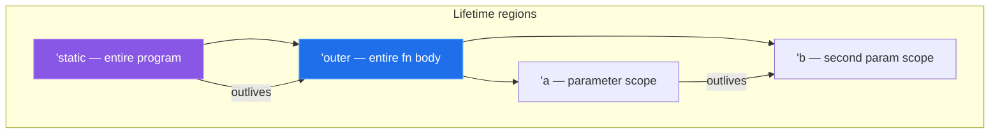
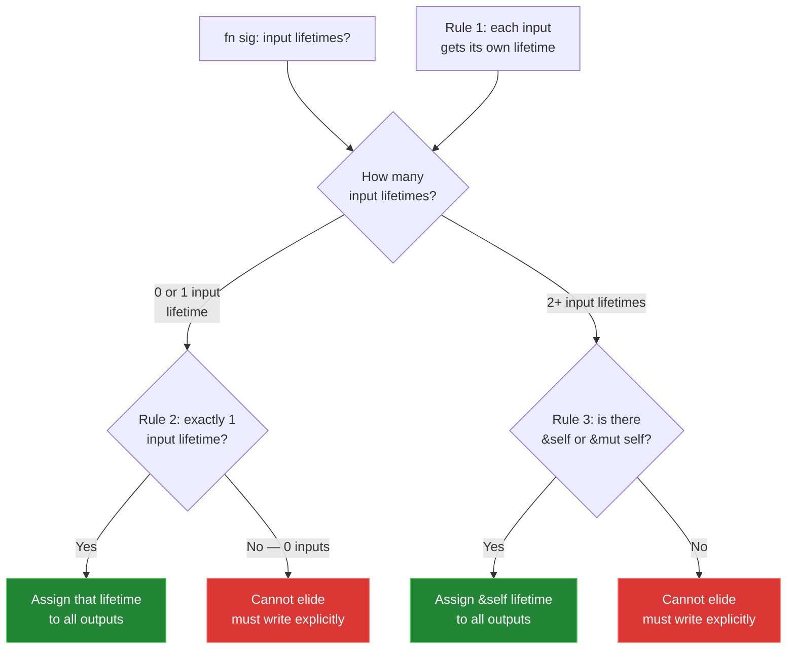
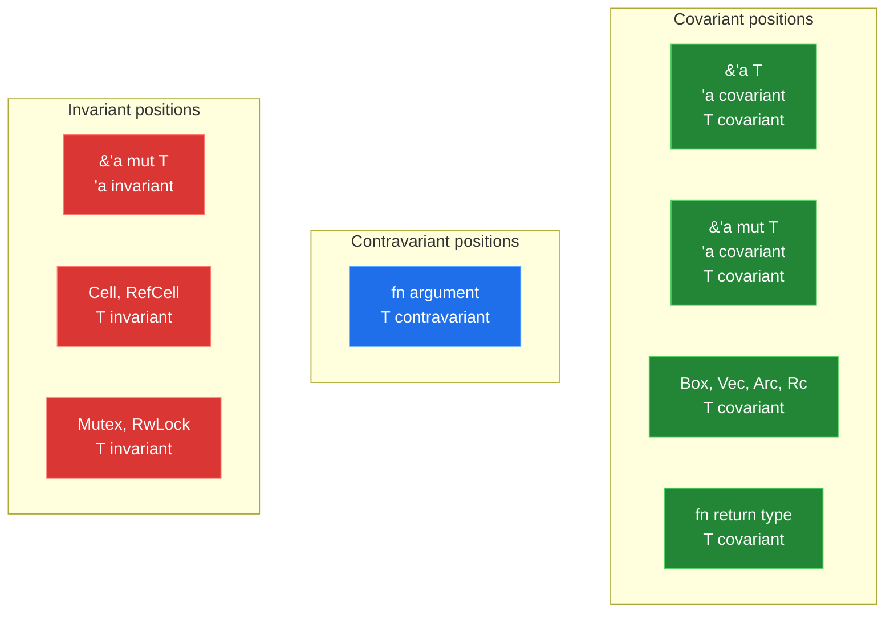
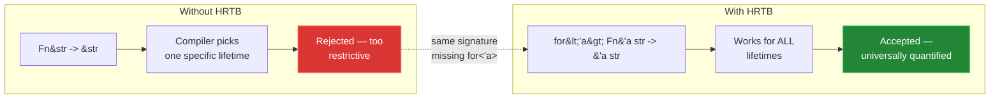
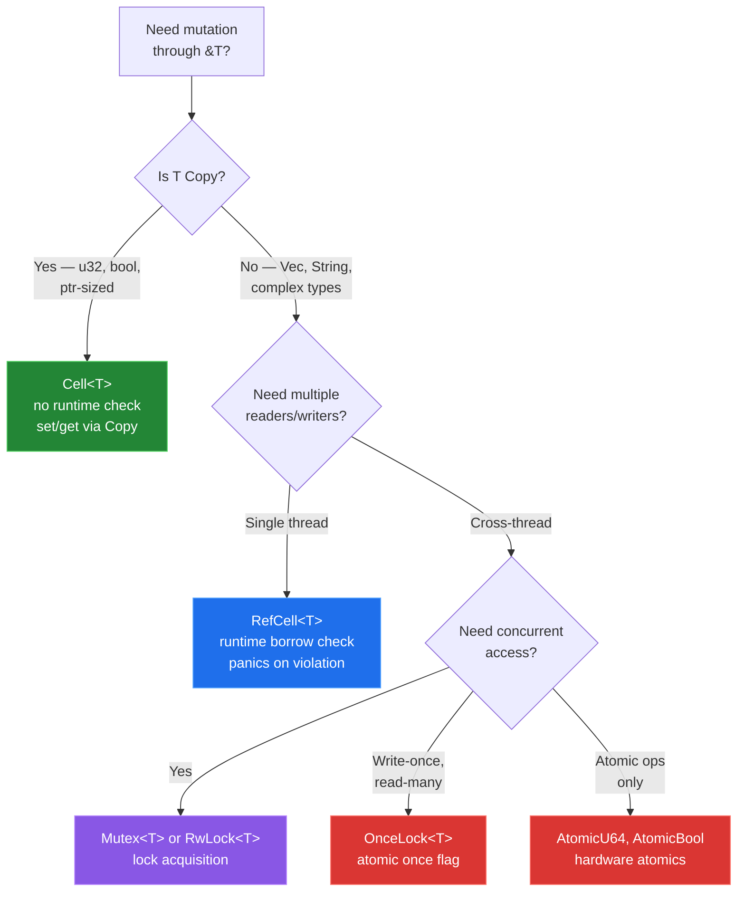
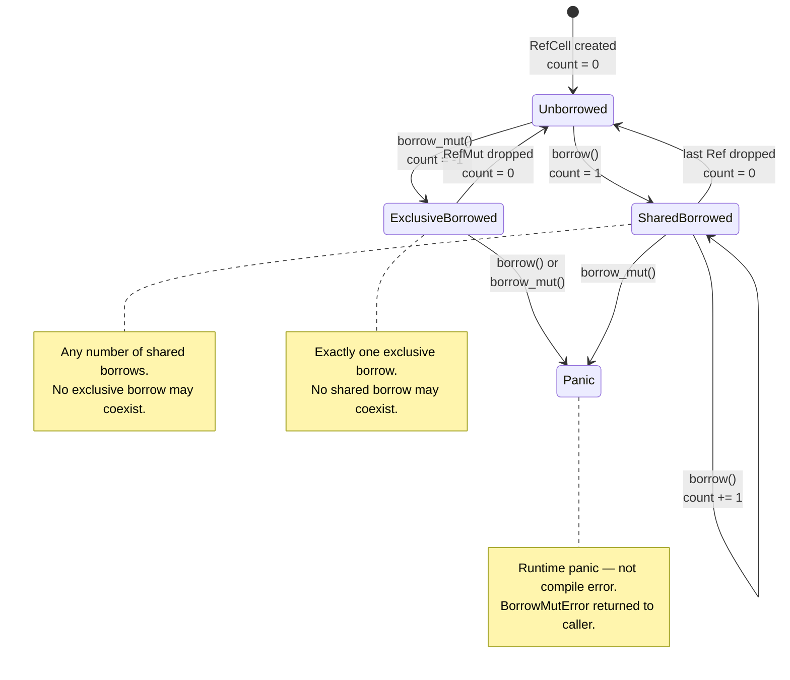
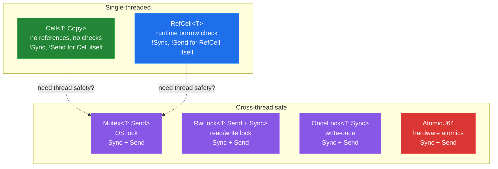
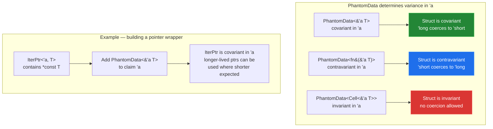

# Chapter 3 — Lifetimes, Variance, and Interior Mutability

*What this chapter covers:* the three pillars that govern how Rust reason about references across time, subtyping, and mutation — explicit lifetime annotations and the elision rules that hide them, variance and its interaction with `PhantomData`, and the interior mutability escape hatches that let you bypass aliasing XOR mutability (AXM) when a sound runtime or structural invariant can replace the compile-time proof. You will learn to read `rustc` lifetime diagnostics, predict variance from type structure, use higher-ranked trait bounds (`for<'a>`) to express closure and callback contracts, and choose among `Cell`, `RefCell`, `OnceLock`, and `Mutex` for shared mutable state with full awareness of their runtime guarantees, panics, and `Sync`/`Send` implications.

**Learning goals:**

- Write and read explicit lifetime annotations (`'a`, `'static`, named regions) and predict when the compiler inserts elision — and when it cannot.
- State the three elision rules and apply them to resolve return types, closures, and `impl Trait` contexts.
- Explain lifetime subtyping: `'a: 'b` means `'a` outlives `'b`, and how the compiler uses this to constrain where references can appear.
- Define covariance, contravariance, and invariance for generic type positions, explain why `&'a mut T` is invariant in `'a`, and use `PhantomData` to annotate unused lifetimes.
- Write and read higher-ranked trait bounds (`for<'a> Fn(&'a str) -> &'a str`) and explain why they exist.
- Compare `Cell`, `RefCell`, `OnceLock`, `Mutex`, and `AtomicU64` — their mechanisms, costs, panic behavior, and when each is sound.
- Explain why `Cell` and `RefCell` are `!Sync` and why `Mutex<T>` is `Sync` when `T: Send`.
- Diagnose and fix real `rustc` lifetime errors, variance footguns, and interior mutability misuse.

---

## 1. Lifetime Syntax — What `'a` Actually Means

A **lifetime** is a region of code during which a reference is valid. The compiler computes these regions statically — there is no runtime cost. The syntax `'a` names a region; the compiler then ensures that the referenced data lives at least as long as the named region.

### 1.1 Named Lifetimes and the Outlives Relation

```rust
fn first<'a>(s: &'a str) -> &'a str {
    s
}
```

The signature says: "for any lifetime `'a`, if the input reference lives for `'a`, the output reference also lives for `'a`." This is a **constraint** — the compiler must find a concrete `'a` that satisfies it.

The **outlives** relation `'a: 'b` means "'a lives at least as long as 'b." If `'a: 'b`, then any reference with lifetime `'a` can be used where a reference with lifetime `'b` is expected — because `'a` is the longer (or equal) region.

```rust
fn longer<'a, 'b: 'a>(x: &'a str, y: &'b str) -> &'a str {
    if x.len() > y.len() { x } else { y }
}
// 'b outlives 'a — so &'b can be coerced to &'a
// The return type is &'a, the shorter of the two
```



**Diagram 1 — Lifetime region graph.** `'static` outlives every other region. `'outer` (the function body) outlives any parameter lifetimes. `'a: 'b` means `'a` is at least as long as `'b`.

### 1.2 `'static` — Not a Guarantee of Eternal Life

`'static` means the reference is valid for the entire program execution. It does **not** mean the data lives forever — it means the reference *could* live that long. A `String` moved into a `static` variable has `'static` lifetime. A `&'static str` points to data baked into the binary (string literals). But a reference to a `String` on the stack is *never* `'static`, no matter how long the stack frame lives.

A common misconception: "`'static` means leak." It does not. `'static` is a *capability* — "this reference could live for the whole program." You can shorten it by coercing a `'static` reference to a shorter lifetime. The reverse is unsound.

### 1.3 Lifetime Elision — The Three Rules

Most function signatures omit lifetime annotations. The compiler infers them through three elision rules applied in order:

1. **Each input reference parameter gets its own lifetime.** `fn foo(x: &str, y: &str)` becomes `fn foo<'a, 'b>(x: &'a str, y: &'b str)`.
2. **If there is exactly one input lifetime parameter, that lifetime is assigned to all output references.** `fn foo(x: &str) -> &str` becomes `fn foo<'a>(x: &'a str) -> &'a str`.
3. **If the input is a method reference (`&self` or `&mut self`), the lifetime of `self` is assigned to all output references.** `fn foo(&self) -> &str` becomes `fn foo<'a>(&'a self) -> &'a str`.



**Diagram 2 — Lifetime elision rules flowchart.** Rules are applied in order. If none produce a unique output lifetime, the compiler rejects the signature.

Elision fails when the function has multiple input lifetimes and no `&self`:

```rust
// This fails — two input lifetimes, no &self:
fn first_word(s: &str, hint: &str) -> &str {
    s
}

// error[E0106]: missing lifetime specifier
// help: this function's return type contains a borrowed value,
//       but the signature does not say whether it is borrowed from `s` or `hint`
//   |
// 1 | fn first_word(s: &str, hint: &str) -> &str {
//   |                      ----          ^ expected named lifetime parameter
//   |
// help: consider introducing a named lifetime parameter
//   |
// 1 | fn first_word<'a>(s: &'a str, hint: &'a str) -> &'a str {
//   |           ++++     ++          ++              ++
```

**Fix:** explicitly annotate:

```rust
fn first_word<'a>(s: &'a str, _hint: &str) -> &'a str {
    s // 'a tied to s — hint's lifetime is independent
}
```

Elision also fails for free functions returning references with no input lifetime:

```rust
// fn bad() -> &str { "hello" }
// error[E0106]: missing lifetime specifier
// help: this function's return type contains a borrowed value,
//       but there is no value for it to be borrowed from

fn good() -> &'static str { "hello" } // string literal is 'static
```

```rust
// Elision succeeds — Rule 2 (one input lifetime):
fn trim(s: &str) -> &str { s.trim() }
// Desugars to: fn trim<'a>(s: &'a str) -> &'a str

// Elision succeeds — Rule 3 (&self):
struct Parser<'input> { text: &'input str }
impl<'input> Parser<'input> {
    fn current(&self) -> &str { self.text }
    // Desugars to: fn current(&'a self) -> &'a str
}

// Elision fails — two inputs, no &self:
fn pick<'a>(a: &'a str, _b: &str) -> &'a str { a }
// Must annotate — compiler cannot determine which input's lifetime to use
```

### 1.4 Lifetime Subtyping — When `'a` Outlives `'b`

If `'a: 'b` (a outlives b), then `&'a T` is a **subtype** of `&'b T` — a longer-lived reference can be used where a shorter-lived one is expected, because the reference is guaranteed to be valid at least as long as `'b`. This is a special case of lifetime subtyping, not general type subtyping.

```rust
fn select<'long: 'short, 'short>(data: &'long str, _default: &'short str) -> &'short str {
    data // ok: &'long coerces to &'short because 'long: 'short
}

fn demo() {
    let long_lived = String::from("persistent");
    let result;
    {
        let short_lived = String::from("ephemeral");
        result = select(&long_lived, &short_lived);
    } // short_lived dropped
    println!("{result}"); // ok — result points to long_lived
}
```

The compiler uses outlives constraints to verify that returned references do not outlive the data they point to. A common error is returning a reference tied to a local:

```rust
fn dangling() -> &str {
    let s = String::from("hello");
    &s
}

// error[E0515]: cannot return reference to local variable `s`
```

The fix is to return an owned value or tie the return to an input:

```rust
fn owns() -> String { String::from("hello") }           // owned
fn borrows<'a>(s: &'a str) -> &'a str { s }             // tied to input
```

---

## 2. Variance — How Generic Positions Affect Subtyping

**Variance** determines how subtyping of component types affects the subtyping of the composite type. For a generic type `F<T>`, if `T` is a subtype of `U` (meaning `T` can be used wherever `U` is expected), then:

| Variance | If `T <: U`, then… | Analogy |
|----------|---------------------|---------|
| **Covariant** | `F<T> <: F<U>` | Preserves direction |
| **Contravariant** | `F<U> <: F<T>` | Reverses direction |
| **Invariant** | No subtyping relationship | Neither direction |

### 2.1 Variance in Rust — The Full Matrix

Rust applies variance rules to two positions: **type parameters** and **lifetime parameters**. The rules for common types:



**Diagram 3 — Variance table matrix.** Covariant positions preserve subtyping direction; contravariant positions reverse it; invariant positions block it entirely.

The full matrix:

| Type | In `'a` | In `T` |
|------|---------|--------|
| `&'a T` | covariant | covariant |
| `&'a mut T` | covariant | **invariant** |
| `fn(T) -> U` | — | `T` contravariant, `U` covariant |
| `Cell<T>` | — | **invariant** |
| `RefCell<T>` | — | **invariant** |
| `Mutex<T>` | — | **invariant** |
| `Box<T>` | — | covariant |
| `Vec<T>` | — | covariant |
| `PhantomData<T>` | — | same as `T` |

### 2.2 Why `&'a mut T` Is Invariant in `'a`

This is the variance footgun that trips up every backend engineer at least once. `&'a mut T` is covariant in `T` but **invariant** in `'a`. Here is why:

If `&'a mut T` were covariant in `'a`, then a `&'long mut T` could be used as a `&'short mut T`. But a `&'short mut T` lets you mutate `T` only for the short duration — while a `&'long mut T` holds exclusive access for the long duration. If you could coerce a long exclusive borrow to a short one, you could create two overlapping exclusive borrows — exactly the aliasing that AXM forbids.

```rust
// Hypothetical — would be unsound if &'a mut were covariant in 'a:
fn invariant_demo<'long: 'short, 'short, T>(long_ref: &'long mut T) {
    let short_ref: &'short mut T = long_ref; // coerce long to short
    // Now both short_ref and a reborrow of long_ref could alias
    // — data race, undefined behavior
}
// The compiler rejects this because &'a mut is invariant in 'a:
// error: lifetime mismatch (cannot coerce 'long to 'short)
```

**Concrete footgun — returning `&mut` from a shorter-lived source:**

```rust
fn get_or_default<'a>(map: &'a mut std::collections::HashMap<String, String>, key: &str) -> &'a String {
    map.entry(key.to_string())
        .or_insert_with(|| String::from("default"))
}
```

This compiles because the `Entry` API ties the returned reference to the `&'a mut` of the map. But if you accidentally introduce a shorter lifetime:

```rust
fn broken<'short, 'long: 'short>(
    map: &'long mut std::collections::HashMap<String, String>,
    key: &str,
) -> &'short String {
    map.entry(key.to_string())
        .or_insert_with(|| String::from("default"))
    // error: borrowed data escapes — returned reference 'short
    // outlives the mutable borrow 'long
    // The compiler requires 'long: 'short, but the return type
    // claims 'short, which might be shorter than 'long
}
```

```text
error: lifetime may not live long enough
 --> src/lib.rs:5:5
  |
3 | fn broken<'short, 'long: 'short>(
  |                    ------- lifetime `'long` required by the outer scope
...
5 |     map.entry(key.to_string())
  |     --- `map` is borrowed for `'long`
7 |     .or_insert_with(|| String::from("default"))
  |     - `map` is borrowed for `'long`
8 | }
  | - returning this value requires that `'long` outlives `'short`
```

**Fix:** the return lifetime must match the borrow's lifetime:

```rust
fn fixed<'long>(
    map: &'long mut std::collections::HashMap<String, String>,
    key: &str,
) -> &'long String {
    map.entry(key.to_string())
        .or_insert_with(|| String::from("default"))
}
```

### 2.3 Invariance in `Cell` and `RefCell`

`Cell<T>` and `RefCell<T>` are invariant in `T` — not covariant — because they allow mutation through a shared reference. If `Cell` were covariant, you could coerce `Cell<&'long str>` to `Cell<&'short str>`, then use `.set()` to write a short-lived reference into a slot that previously held a long-lived one — creating a dangling reference through the `Cell`.

`PhantomData<T>` makes a type act as if it owns a `T`, affecting variance. Use it to annotate lifetime parameters you do not otherwise use:

```rust
use std::marker::PhantomData;

struct Processor<'a> {
    config: &'a str,       // uses 'a — variance derived naturally
    _marker: PhantomData<&'a str>, // explicit annotation if 'a were unused
}
```

If a lifetime parameter is completely unused, the compiler will reject it. `PhantomData` fixes this by claiming ownership of the lifetime, influencing variance:

```rust
// PhantomData<&'a T> makes the type covariant in 'a
// PhantomData<fn(&'a T)> makes the type contravariant in 'a
// PhantomData<Cell<&'a T>> makes the type invariant in 'a
```

This matters when building custom collections or smart pointers — the `PhantomData` type determines which subtyping coercions the compiler permits.

---

## 3. Higher-Ranked Lifetimes — `for<'a>` and Closure Bounds

When you write a trait bound involving a reference, you sometimes need to say "for *any* lifetime 'a, this closure accepts a `&'a str`." This is a **higher-ranked trait bound** (HRTB).

### 3.1 The Problem Without HRTB

```rust
// This does not compile:
fn apply<F>(f: F)
where
    F: Fn(&str) -> &str,
{
    let s = String::from("hello");
    let result = f(&s);
    println!("{result}");
}

// The compiler asks: what lifetime is the &str in Fn(&str) -> &str?
// The answer must work for ANY lifetime the caller provides —
// not one specific lifetime. HRTB solves this.
```

The desugared bound is `for<'a> Fn(&'a str) -> &'a str` — "for all lifetimes 'a, this closure takes a `&'a str` and returns a `&'a str`." The compiler inserts this implicitly for `Fn` trait bounds, but sometimes you need it explicitly:

```rust
// Explicit HRTB — required when the lifetime appears only inside the bound
fn apply_explicit<F>(f: F)
where
    F: for<'a> Fn(&'a str) -> &'a str,
{
    let s = String::from("hello");
    let result = f(&s);
    println!("{result}");
}
```



**Diagram 4 — HRTB closure capture.** Without `for<'a>`, the compiler picks a single concrete lifetime for the closure's reference arguments. HRTB says "for all lifetimes," which is what closures that return their input actually need.

### 3.2 HRTB in Backend Code — Iterator Adapters and Middleware

HRTB appears in practice when building iterator adapters, middleware chains, and filter functions:

```rust
// A filter that works for any input lifetime
fn filter_by<'a, F>(items: &'a [String], predicate: F) -> Vec<&'a String>
where
    F: for<'b> Fn(&'b String) -> bool,
{
    items.iter().filter(|item| predicate(item)).collect()
}

fn demo() {
    let data = vec![String::from("hello"), String::from("world")];
    let long = filter_by(&data, |s| s.len() > 3);
    println!("{long:?}"); // ["hello", "world"]
}
```

HRTB also appears in trait object bounds:

```rust
// Box<dyn for<'a> Fn(&'a str) -> &'a str>
// A callable that works for any input lifetime
type StringTransform = Box<dyn for<'a> Fn(&'a str) -> &'a str>;

fn make_transformer() -> StringTransform {
    Box::new(|s| s.trim())
}
```

### 3.3 Why HRTB Cannot Be Omitted

The compiler sometimes requires an explicit `for<'a>` when the lifetime is **higher-ranked** — it appears in a position where the compiler cannot infer it from a single concrete lifetime. This happens when:

1. The lifetime is only inside the trait bound, not in the function signature.
2. The bound is on a trait object or a type alias.
3. You are writing a generic function that must accept callbacks with different input lifetimes.

Without `for<'a>`, the compiler interprets `Fn(&str) -> &str` as having a single, fixed lifetime — which is too restrictive for most real use.

---

## 4. Interior Mutability — The Sound Escape Hatches

Interior mutability lets you mutate data through a shared reference. This violates AXM at the language level but is sound because each variant enforces a different **runtime or structural invariant** that prevents data races.

### 4.1 The Interior Mutability Spectrum



**Diagram 5 — Interior mutability decision tree.** Choose the type based on `T: Copy`, thread safety requirements, and access patterns.

### 4.2 `Cell<T>` — Zero-Cost Mutation for `Copy` Types

`Cell<T>` provides `get()` and `set()` without creating any references to the interior. Since `T: Copy`, `get()` returns a bitwise copy — no borrow is ever held on the data inside the `Cell`.

```rust
use std::cell::Cell;

let cell = Cell::new(0u32);
cell.set(cell.get() + 1); // no &mut needed — no borrow conflict
cell.set(42);
assert_eq!(cell.get(), 42);
```

`Cell` is `!Sync` — it cannot be shared across threads. Its `Copy` requirement is a deliberate design choice: by never handing out references, it eliminates the possibility of aliasing. The cost is zero runtime overhead — `Cell` is the same size and layout as `T`.

`Cell` also provides `replace`, `take`, and `swap` — all operating on owned values without references:

```rust
use std::cell::Cell;

let cell = Cell::new(String::from("hello"));
let old = cell.replace(String::from("world")); // swap in new, get old
assert_eq!(old, "hello");
assert_eq!(cell.take(), "world"); // take value out, leave Default::default()
assert_eq!(cell.get(), String::default());
```

For backend code, `Cell` is the right choice for counters, flags, and small state that lives within a single task or thread. It has no allocation, no runtime check, and no panic — you simply cannot create a reference to its interior.

### Cell vs. RefCell — When Each Is Sound

| Property | `Cell<T>` | `RefCell<T>` |
|----------|-----------|--------------|
| `T` constraint | `T: Copy` | Any `T` |
| Mechanism | Bitwise copy in/out | Runtime borrow counter |
| References handed out | Never | `Ref<T>` / `RefMut<T>` |
| Panic risk | None | Double-borrow or borrow-while-mut |
| Performance | Zero overhead | Counter increment/decrement per access |
| Size | Same as `T` | `T` + borrow state (typically `T` + `isize`) |
| `Sync` | No | No |

### 4.3 `RefCell<T>` — Runtime Borrow Checking

`RefCell<T>` maintains a runtime borrow counter (shared borrows increment it, exclusive borrows set it to -1). It panics if you violate the borrowing rules at runtime instead of compile time.

```rust
use std::cell::RefCell;

let data = RefCell::new(vec![1, 2, 3]);

// Shared borrows — multiple allowed
{
    let b1 = data.borrow();
    let b2 = data.borrow();
    println!("{b1:?} {b2:?}"); // ok — both shared
}

// Exclusive borrow
{
    let mut b = data.borrow_mut();
    b.push(4);
} // b dropped — borrow count back to 0

// Panics on violation:
// let mut b1 = data.borrow_mut();
// let b2 = data.borrow(); // PANIC: already borrowed: BorrowMutError
```



**Diagram 6 — RefCell state machine.** Runtime enforcement of the same aliasing rules the borrow checker enforces at compile time. Violations produce panics, not compilation errors.

### 4.4 `OnceLock<T>` — Write-Once, Read-Many

`OnceLock<T>` (stabilized in Rust 1.70) and its lazy variant `LazyLock<T>` provide a one-time initialization primitive. After the first successful `set()` or `get_or_init()`, the value is frozen — all subsequent access is immutable.

```rust
use std::sync::OnceLock;

static DB_URL: OnceLock<String> = OnceLock::new();

fn init_config() {
    DB_URL.get_or_init(|| {
        std::env::var("DATABASE_URL").unwrap_or_else(|_| "postgres://localhost/mydb".into())
    });
}

fn handle_request() {
    let url = DB_URL.get().expect("config not initialized");
    println!("connecting to {url}");
}
```

`OnceLock` is `Sync` when `T: Sync` — safe to read from multiple threads after initialization. The internal synchronization is a single atomic flag with a `compare_exchange` — negligible overhead. It does **not** provide mutation after initialization — that is the point.

### 4.5 `Mutex<T>` — Locked Exclusive Access

`Mutex<T>` provides true exclusive access protected by an OS-level lock (or a futex on Linux). Unlike `RefCell`, it can be shared across threads (`Mutex<T>: Sync` when `T: Send`).

```rust
use std::sync::Mutex;

let counter = Mutex::new(0u64);
{
    let mut guard = counter.lock().unwrap();
    *guard += 1;
} // guard dropped — lock released
assert_eq!(*counter.lock().unwrap(), 1);
```

`Mutex<T>` panics on poisoning — if a thread panics while holding the lock, subsequent `lock()` calls return `Err(PoisonError)`. You can call `.unwrap()` to propagate the panic, or `.into_inner()` to recover the data.

### 4.6 The Panic Question — `RefCell` vs. Everything Else

| Type | Panic behavior |
|------|----------------|
| `Cell<T>` | Never panics on access (no borrow counting) |
| `RefCell<T>` | Panics on double-borrow or borrow-while-mutably-borrowed |
| `OnceLock<T>` | `get_or_init` panics if the initializer panics |
| `Mutex<T>` | `lock().unwrap()` panics on poisoned lock |
| `AtomicU64` | Never panics (hardware-level, no locks) |

**RefCell panic in practice:**

```rust
use std::cell::RefCell;

let shared = RefCell::new(vec![1, 2, 3]);

fn process(data: &RefCell<Vec<i32>>) {
    let borrowed = data.borrow();
    // ... complex logic that might call something that also borrows ...
    inner_borrow(data); // PANIC if inner_borrow calls data.borrow_mut()
}

fn inner_borrow(data: &RefCell<Vec<i32>>) {
    data.borrow_mut().push(4); // will panic if shared is already borrowed
}

// process(&shared);
// thread 'main' panicked at 'already borrowed: BorrowMutError'
```

This is the fundamental trade-off: `RefCell` gives you flexibility at the cost of runtime panics. In backend services, this means `RefCell` is appropriate for single-threaded, well-audited code paths (parsers, state machines within a single task), but not for code paths with complex call chains where borrow violations are hard to predict statically.

---

## 5. `Send` and `Sync` — How Interior Mutability Interacts with Thread Safety

Two marker traits govern cross-thread transfer and sharing:

- `Send` — a value of type `T` can be **transferred** to another thread. Almost everything is `Send` except `Rc`, raw pointers, and `Cell`/`RefCell`.
- `Sync` — a reference `&T` can be **shared** between threads. `T: Sync` iff `&T: Send`.

### 5.1 Why `Cell` and `RefCell` Are `!Sync`

`Cell<T>` is `!Sync` because its mutation protocol (`set`/`get` via `Copy`) is not atomic — two threads calling `set` concurrently could lose a write. `RefCell<T>` is `!Sync` because its borrow counter is not atomic — concurrent `borrow()` calls could corrupt the counter.

This is a deliberate safety choice: `Cell` and `RefCell` are single-threaded interior mutability. If you need shared mutation across threads, the compiler forces you to use `Mutex<T>`, `RwLock<T>`, or atomics — all of which provide actual synchronization.

### 5.2 `Mutex<T>: Sync` When `T: Send`

`Mutex<T>` implements `Sync` when `T: Send`, because the lock ensures that only one thread accesses `T` at a time. The `MutexGuard` returned by `lock()` is `Send` (you can move it to another thread), but the key property is that `&Mutex<T>` is safe to share — each thread acquires the lock independently.

```rust
use std::sync::{Arc, Mutex};
use std::thread;

let counter = Arc::new(Mutex::new(0u64));
let mut handles = vec![];

for _ in 0..10 {
    let c = Arc::clone(&counter);
    handles.push(thread::spawn(move || {
        let mut guard = c.lock().unwrap();
        *guard += 1;
    }));
}

for h in handles { h.join().unwrap(); }
assert_eq!(*counter.lock().unwrap(), 10);
```

### 5.3 The Interior Mutability + Thread Safety Matrix



**Diagram 7 — Interior mutability and thread safety matrix.** Single-threaded types are `!Sync`; cross-thread types are `Sync + Send`. The transition is not just adding a lock — it changes the trait implementation entirely.

---

## 6. Variance Footguns in Practice

### 6.1 The PhantomData Trap

A common mistake when building custom iterators or wrappers:

```rust
use std::marker::PhantomData;

struct Iter<'a, T> {
    ptr: *const T,
    end: *const T,
    // OOPS: no PhantomData — compiler treats 'a as unused
}

// error[E0392]: parameter `'a` is never used
// --> src/lib.rs:4:14
//   |
// 4 | struct Iter<'a, T> {
//   |              ^^ unused parameter
//   |
// help: consider removing the lifetime parameter
```

**Fix:** add `PhantomData<&'a T>` to claim ownership of the lifetime:

```rust
struct Iter<'a, T> {
    ptr: *const T,
    end: *const T,
    _marker: PhantomData<&'a T>,
}
```

The type of `PhantomData` determines variance. This matters when building custom wrappers:



**Diagram 8 — PhantomData variance control.** The type parameter of `PhantomData` directly controls the variance of the containing struct in each lifetime and type position. Choosing the wrong `PhantomData` variant can either block legitimate coercions or permit unsound ones.

### 6.2 Invariance Preventing Legitimate Coercions

Sometimes invariance is too strict. A common pattern in backend code is a struct that contains a `Cell<T>` where you want to coerce the inner type:

```rust
use std::cell::Cell;

struct CacheEntry<'a> {
    value: Cell<&'a str>, // invariant in 'a because of Cell
}

fn coerce<'long: 'short, 'short>(
    entry: CacheEntry<'long>,
) -> CacheEntry<'short> {
    // error: mismatched types — Cell<&'long str] is not a subtype of Cell<&'short str]
    // because Cell is invariant in T, and &T is covariant in 'a,
    // but Cell's invariance in T blocks the coercion

    entry // E0308 — mismatched types
}
```

**Fix:** use `Cell::from()` or restructure to avoid the invariant wrapper:

```rust
// Option 1: store the reference outside Cell
struct CacheEntry<'a> {
    value: &'a str, // covariant in 'a — coercion works
}

// Option 2: use a helper that extracts and re-wraps
fn coerce<'long: 'short, 'short>(entry: CacheEntry<'long>) -> CacheEntry<'short> {
    CacheEntry { value: entry.value.get() } // extract, then re-wrap with new lifetime
}
```

### 6.3 The `fn` Pointer Variance Surprise

Function pointers are contravariant in their arguments and covariant in their return type. This means:

```rust
fn process(f: fn(&str) -> &str) {
    let s = String::from("hello");
    let result = f(&s);
    println!("{result}");
}

fn identity(s: &str) -> &str { s }
fn upper(s: &str) -> String { s.to_uppercase() } // returns owned — covariant

// fn(identity) — ok: fn(&str) -> &str
// fn(upper) — NOT ok: fn(&str) -> String — return type mismatch
// But &str -> String coerces via Into<String>... but not via fn pointer coercion
```

---

## 7. Distributed-Systems Lens — Lifetimes as Resource Leases

### Lifetimes as Distributed Leases

A lifetime `'a` is a compile-time lease on a borrowed resource. The compiler's outlives check (`'a: 'b`) is a lease ordering constraint: the inner lease must not outlive the outer lease, just as a sub-resource lease must not outlive the parent resource lease. In a distributed cache, a lease on a cached entry must expire before the cache line is evicted — the same ordering guarantee Rust encodes at compile time.

### Variance as Subtyping in Service Meshes

When a gRPC service exposes a `&Request` to middleware, the middleware's lifetime is constrained by the request's lifetime — covariant, like `&'a T`. But when a middleware returns a modified request, the returned reference must be at least as long-lived as the original — contravariant in the mutation path. Service mesh routing rules exhibit the same variance: a route rule for a shorter path prefix can be applied to a longer path (covariant), but a route rule for a specific service cannot be applied to a different service (invariant). Getting variance wrong in a service mesh produces dangling routes; getting it wrong in Rust produces dangling references.

### Interior Mutability as Distributed State

`OnceLock<T>` is the compile-time analog of a distributed write-once register (like a configuration service that accepts one write at startup and serves reads thereafter). `Mutex<T>` maps to a distributed lock (etcd, ZooKeeper). `Cell<T>` has no distributed analog — it is a thread-local counter that would be a single-threaded in-memory variable in a Go or Java service. The key insight: each interior mutability variant trades a different distributed-system primitive for compile-time safety, and choosing the wrong one is like choosing a `Mutex` where an `AppendOnly` log would suffice — correct but wasteful.

### Holding Borrows Across `.await` — The Lease-Across-RPC Anti-Pattern

Holding a `&T` across an `.await` is rejected by the compiler when the future must be `Send`, because the future may resume on a different thread. This is the Rust equivalent of holding a distributed lock across an RPC call — the lease may expire (or be revoked) while the RPC is in flight, and when the RPC returns, the lease is gone. The fix is the same: narrow the critical section. Clone or copy the data you need before the `.await`, release the borrow, then use the owned copy.

### Lifetime Elision as Protocol Negotiation

Lifetime elision is the Rust analog of implicit protocol negotiation. When a function accepts `&str` and returns `&str`, the compiler infers that the output lives as long as the input — no explicit version negotiation needed. When elision fails (two input lifetimes, no `&self`), it is like a protocol that requires explicit version pinning: the compiler cannot infer the negotiation, so you must spell it out. In distributed systems, this maps to gRPC's implicit HTTP/2 negotiation (elision succeeds) versus requiring explicit TLS configuration (elision fails, explicit annotation needed).

### Interior Mutability and Distributed State Consistency

The choice of interior mutability type maps directly to distributed state consistency models:

| Interior mutability | Distributed analog | Consistency model |
|---------------------|-------------------|-------------------|
| `Cell<T>` | Thread-local counter | No consistency needed — single-threaded |
| `RefCell<T>` | Single-process shared state | Optimistic concurrency — conflict detection at runtime, abort on violation |
| `OnceLock<T>` | Write-once register (config service) | Eventual consistency after initialization |
| `Mutex<T>` | Distributed lock (etcd, ZooKeeper) | Strong consistency — exclusive access |
| `AtomicU64` | Atomic counter (Redis INCR) | Linearizable — hardware-level ordering |

The key insight is that Rust's borrow checker forces you to choose the *minimum* concurrency primitive that is sound for your use case. Using a `Mutex` where a `Cell` would suffice is like using a distributed lock for a thread-local counter — correct but wasteful. Using a `Cell` where a `Mutex` is needed is like using a thread-local variable for shared state — incorrect and race-prone.

### Reborrowing and Resource Pooling

Reborrowing — creating a shorter loan from a longer one — maps to resource pooling in distributed systems. A connection pool holds a set of connections (long-lived borrows); a request handler reborrows a connection for the duration of a single request (short-lived loan); when the request completes, the connection returns to the pool (reborrow ends, original loan restored). The key property is the same: the original resource is *frozen* during the reborrow but not consumed — the pool still owns it and can reassign it after the reborrow ends.

---

## 8. Failure Gallery — Lifetime and Variance Errors

### 8.1 Missing Lifetime Annotation

```rust
struct Parser<'a> {
    input: &'a str,
    pos: usize,
}

fn parse(input: &str) -> Parser {
    Parser { input, pos: 0 }
}

// error[E0106]: missing lifetime specifier
// help: this struct's elided lifetime fields need explicit annotations
//   |
// 4 | fn parse(input: &str) -> Parser {
//   |                    ----          ^ expected named lifetime parameter
```

**Fix:**

```rust
fn parse<'a>(input: &'a str) -> Parser<'a> {
    Parser { input, pos: 0 }
}
```

### 8.2 Returning Reference to Local

```rust
fn make_header() -> &str {
    let header = format!("HTTP/1.1 200 OK\r\n");
    &header
}

// error[E0515]: cannot return reference to local variable `header`
//   |
// 3 |     &header
//   |     ^^^^^^^ returns a reference to data owned by the current function
```

**Fix:** return an owned value:

```rust
fn make_header() -> String {
    format!("HTTP/1.1 200 OK\r\n")
}
```

### 8.3 Variance-Induced Lifetime Mismatch

```rust
use std::cell::RefCell;

fn store_ref<'a>(cell: &RefCell<Option<&'a str>>, val: &'a str) {
    *cell.borrow_mut() = Some(val);
}

fn demo() {
    let cell = RefCell::new(None);
    {
        let short = String::from("ephemeral");
        store_ref(&cell, &short);
    } // short dropped
    // cell still holds a reference to dropped short!
    // But wait — this actually compiles because 'a is inferred
    // to be the inner scope. Let's see the REAL footgun:
}

// The real footgun: RefCell is invariant in T = Option<&'a str],
// which means you cannot coerce RefCell<Option<&'long str>>
// to RefCell<Option<&'short str>> even when 'long: 'short.
// This blocks legitimate lifetime shortening.
```

### 8.4 HRTB Required but Missing

```rust
fn apply_all<F>(items: Vec<String>, f: F) -> Vec<String>
where
    F: Fn(&str) -> String,
{
    items.iter().map(|s| f(s)).collect()
}

// This compiles — but only because the bound is Fn(&str) -> String,
// where the return type is owned. Change it to return &str:

fn apply_all_borrowed<'a, F>(items: Vec<&'a str>, f: F) -> Vec<&'a str>
where
    F: Fn(&str) -> &str,
{
    items.iter().map(|s| f(s)).collect()
}

// This ALSO compiles because the compiler infers for<'a>.
// But when you need it explicitly for trait objects:
type Transform = Box<dyn Fn(&str) -> &str>;
// error: hidden lifetime parameters in `Fn(&str) -> &str` not allowed
// help: use `for<'a>` to make the lifetime explicit
// fix:
type TransformFixed = Box<dyn for<'a> Fn(&'a str) -> &'a str>;
```

### 8.5 Interior Mutability Across Threads

```rust
use std::cell::RefCell;
use std::thread;

let data = RefCell::new(vec![1, 2, 3]);

// thread::spawn(move || {
//     let mut guard = data.borrow_mut();
//     guard.push(4);
// });
// error[E0277]: `RefCell<Vec<i32>>` cannot be sent between threads safely
//   = help: the trait `Send` is not implemented for `RefCell<Vec<i32>>`
//   = note: required because it appears within the closure
```

**Fix:** use `Mutex` or `Arc<Mutex<T>>`:

```rust
use std::sync::{Arc, Mutex};
use std::thread;

let data = Arc::new(Mutex::new(vec![1, 2, 3]));
let d = Arc::clone(&data);
thread::spawn(move || {
    d.lock().unwrap().push(4);
}).join().unwrap();
assert_eq!(*data.lock().unwrap(), vec![1, 2, 3, 4]);
```

---

## Key Takeaways

- **Lifetime annotations are compile-time leases.** `'a` names a region of validity; `'a: 'b` means `'a` outlives `'b`; the compiler rejects any reference that might outlive its referent.
- **Elision rules hide common lifetime patterns.** Three rules — one lifetime per input, single-input lifetime to outputs, `&self` lifetime to outputs. When they fail, you must write lifetimes explicitly.
- **`'static` is a capability, not a promise of immortality.** It means "could live for the whole program." Any reference can be shortened; only owned data (`String`, `Vec`) can be promoted to `'static` via leaking or static binding.
- **Variance controls subtyping in generic positions.** `&'a T` is covariant in both `'a` and `T`. `&'a mut T` is covariant in `'a` but invariant in `T`. `Cell<T>` is invariant in `T`. Getting variance wrong produces either dangling references (too permissive) or unnecessary rejections (too restrictive).
- **HRTB (`for<'a>`) is universal quantification over lifetimes.** Required for trait objects, closures that return borrowed data, and generic functions that must accept callbacks with any input lifetime.
- **Interior mutability is sound because each variant enforces a different invariant.** `Cell` avoids references entirely (requires `Copy`). `RefCell` enforces aliasing rules at runtime (panics on violation). `OnceLock` freezes after first write. `Mutex` provides a real lock.
- **`Cell` and `RefCell` are `!Sync` — they are single-threaded by design.** Cross-thread interior mutability requires `Mutex<T>`, `RwLock<T>`, or atomics. The compiler enforces this through the `Send`/`Sync` marker traits.
- **RefCell panics are not compiler errors.** They are runtime assertions that replace compile-time borrow checking with a panic. In backend services, audit `RefCell` usage paths carefully — a panic in a request handler can take down the whole worker.

---

## Further Reading

- *Rust Reference* — Lifetimes. <https://doc.rust-lang.org/reference/lifetime-elision.html>
- *Rust Reference* — Variance. <https://doc.rust-lang.org/reference/subtyping.html#variance>
- RFC 1558 — Higher-ranked lifetime bounds. <https://rust-lang.github.io/rfcs/1558-closure-fn-syntax.html>
- Niko Matsakis, "Higher-Ranked Trait Bounds" — The original blog post explaining HRTB. <https://smallcultfollowing.com/babysteps/blog/2016/04/27/higher-ranked-trait-bounds/>
- *The Rustonomicon* — `PhantomData` and variance. <https://doc.rust-lang.org/nomicon/phantom-data.html>
- *The Rustonomicon* — `UnsafeCell` and interior mutability soundness. <https://doc.rust-lang.org/nomicon/interior-mutability.html>
- Mara Bos, *Rust Atomics and Locks* (O'Reilly, 2023) — Chapters 1–4 for `Send`/`Sync`, atomics, and lock internals.
- Jon Gjengset, *Rust for Rustaceans* (No Starch Press, 2021) — Chapter 4 (lifetimes) and Chapter 6 (interior mutability) for advanced patterns.
- `std::cell` documentation — `Cell`, `RefCell`, `OnceCell`, `OnceLock`. <https://doc.rust-lang.org/std/cell/>
- `std::sync::Mutex` documentation — Poisoning, `Sync` bounds, and `lock()`. <https://doc.rust-lang.org/std/sync/struct.Mutex.html>
- RFC 2585 — `UnsafeCell` guarantees and `PhantomData` variance. <https://rust-lang.github.io/rfcs/2585-unsafe-cell-validate.html>
