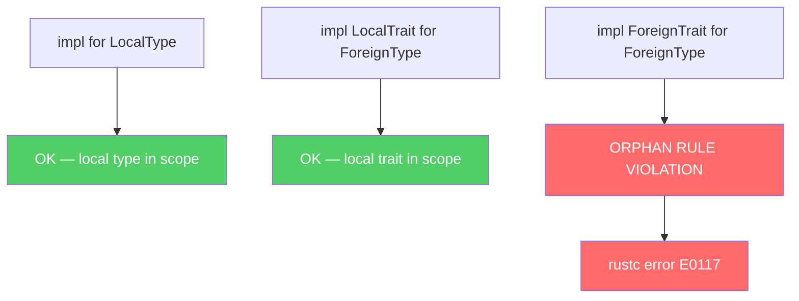
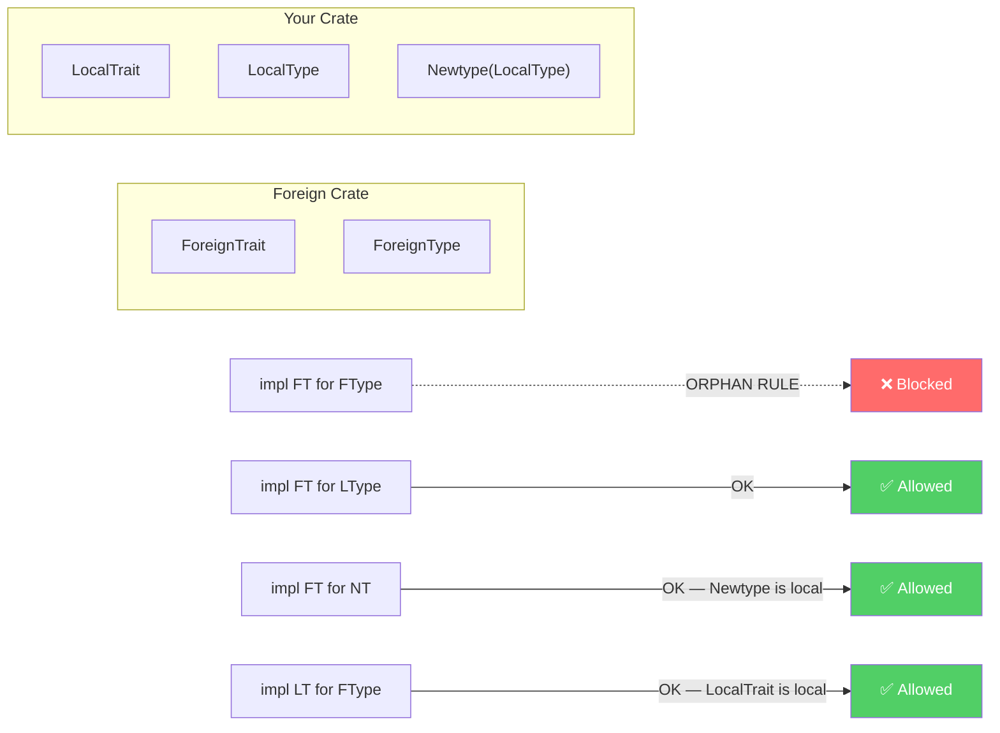
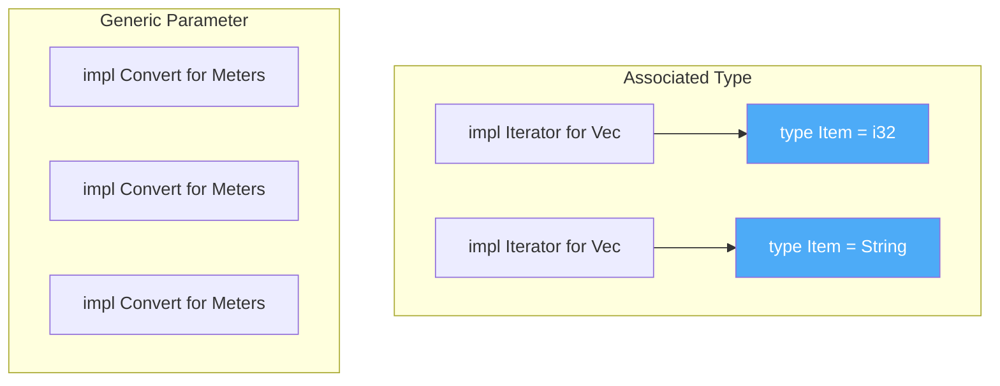
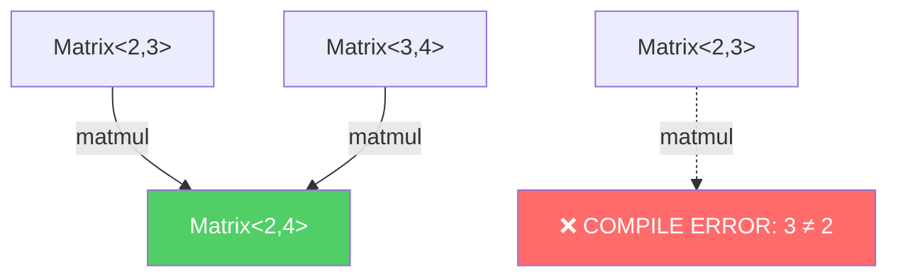
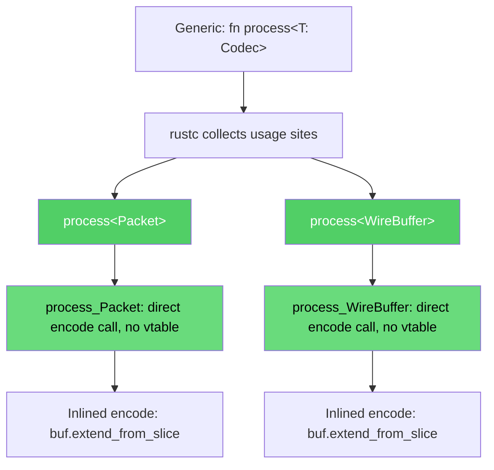
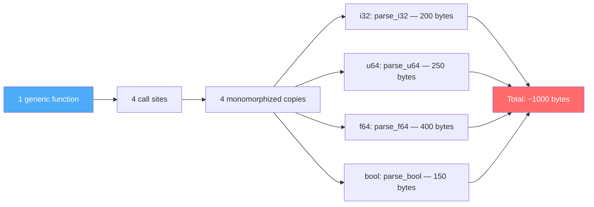
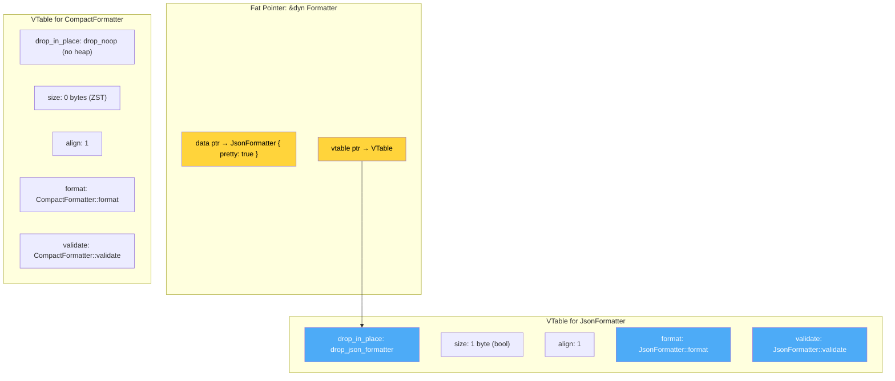
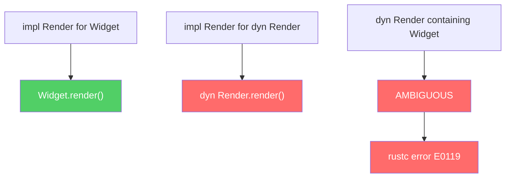

# Chapter 4 — Traits, Generics, and Monomorphization

*What this chapter covers:* the mechanism that lets Rust express polymorphism without inheritance or a runtime type system — traits and their static monomorphization. You will understand how `impl Trait` and `dyn Trait` are two fundamentally different strategies for the same abstraction, how monomorphization trades binary size for zero-cost dispatch, how the orphan rule enforces coherent downstream reasoning, how associated types differ from generic parameters in their impact on implementor ergonomics, and how specialization and coherence interact at the boundaries of soundness. Every concept is grounded in the backend reality: trait objects in async runtimes, const generics in protocol buffer encoding, monomorphization in network parsing hot paths.

**Learning goals:**

- Define traits, implement them on concrete and generic types, and explain the difference between inherent and trait impls.
- State and apply the orphan rule, predict which impls are legal, and diagnose violations from `rustc` errors.
- Choose associated types vs. generic type parameters for a trait's design, and explain the ergonomic and correctness consequences.
- Use supertraits and default methods to build trait hierarchies without inheritance, and apply them in backend abstractions.
- Explain how monomorphization expands generics into specialized machine code, and measure the resulting binary size impact.
- Describe the memory layout of a `dyn Trait` fat pointer and its vtable, and walk through a vtable construction step by step.
- Evaluate when to use `dyn Trait` (type erasure, heterogeneous collections) versus static dispatch (`impl Trait`, generics).
- Apply const generics to encode protocol-level invariants at the type level, and use GATs to express higher-ranked abstractions.
- Understand specialization (`min_specialization`), coherence, and their soundness implications in backend codebases.

---

## 1. Traits — The Abstraction Primitive

A trait defines a set of methods that types must provide. Unlike a class interface in Java or Go, a trait in Rust is *not* a type — it is a predicate on types. A type satisfies a trait only when an `impl` block exists, checked at compile time. There is no inheritance chain, no virtual dispatch by default, and no runtime type identity.

```rust
pub trait Codec {
    fn encode(&self, buf: &mut Vec<u8>);
    fn decode(buf: &[u8]) -> Result<Self, DecodeError>
    where
        Self: Sized;
}

#[derive(Debug)]
pub enum DecodeError {
    InsufficientData,
    InvalidEncoding,
}
```

A few design points are immediately visible:

- `encode` takes `&self` — any implementor can be called by reference.
- `decode` returns `Self`, requiring `Self: Sized`. This means `decode` cannot be called through a trait object (see §5), because the compiler needs to know the concrete type to construct it.
- `DecodeError` is a separate type — traits do not carry their own error types.

### 1.1 Inherent vs. Trait Impls

Rust distinguishes two kinds of `impl` blocks:

```rust
struct Packet {
    payload: Vec<u8>,
}

// Inherent impl — methods are called directly on Packet
impl Packet {
    fn len(&self) -> usize {
        self.payload.len()
    }
}

// Trait impl — method is called via the trait
impl Codec for Packet {
    fn encode(&self, buf: &mut Vec<u8>) {
        buf.extend_from_slice(&self.payload);
    }

    fn decode(buf: &[u8]) -> Result<Self, DecodeError> {
        if buf.is_empty() {
            return Err(DecodeError::InsufficientData);
        }
        Ok(Packet {
            payload: buf.to_vec(),
        })
    }
}
```

Inherent impls are always in scope for `Packet::method()`. Trait impls are in scope only when the trait is imported (`use codec::Codec`). This is the Rust equivalent of Go's implicit interface satisfaction, but with a compile-time trait import gate instead of a runtime interface value.

### 1.2 The Orphan Rule

The orphan rule prevents downstream crates from impl-ing a foreign trait on a foreign type. The rule exists to preserve coherence: any downstream consumer should be able to reason about which impls are in scope without knowing the entire dependency graph.

Formally, at least one of `Self` or the trait must be local to the crate defining the impl. The key constraint:

```text
impl ForeignTrait for ForeignType { ... }  // FORBIDDEN
impl LocalTrait for ForeignType { ... }    // OK — LocalTrait is local
impl ForeignTrait for LocalType { ... }    // OK — LocalType is local
```



The orphan rule is one of the most contentious design decisions in Rust. It prevents the "diamond problem" of overlapping impls across crate boundaries, but it also forces the newtype pattern when you want to impl a foreign trait for a foreign type:

```rust
// Wrapping Vec<u8> to impl Codec — the newtype pattern
struct WireBuffer(Vec<u8>);

impl Codec for WireBuffer {
    fn encode(&self, buf: &mut Vec<u8>) {
        buf.extend_from_slice(&self.0);
    }

    fn decode(buf: &[u8]) -> Result<Self, DecodeError> {
        Ok(WireBuffer(buf.to_vec()))
    }
}
```



### 1.3 Associated Types vs. Generic Parameters

A trait can express polymorphism in two ways: through an associated type or through generic parameters on the method. The choice has real ergonomic consequences.

```rust
// Associated type: one implementation per type
trait Iterator {
    type Item;
    fn next(&mut self) -> Option<Self::Item>;
}

// Generic parameter: multiple implementations possible
trait Convert<T> {
    fn convert(self) -> T;
}

struct Meters(u32);
struct Feet(u32);

// With associated type, one impl per Self
impl Iterator for Meters {
    type Item = u32;
    fn next(&mut self) -> Option<u32> {
        Some(self.0)
    }
}

// With generic parameter, implement for many target types
impl Convert<Feet> for Meters {
    fn convert(self) -> Feet {
        Feet((self.0 as f64 * 3.28084) as u32)
    }
}

impl Convert<String> for Meters {
    fn convert(self) -> String {
        format!("{}m", self.0)
    }
}
```

The general rule: use an associated type when there is one "natural" output per input type (e.g., `Iterator::Item` — you cannot implement `Iterator` for `Vec<T>` twice with different `Item` types). Use generic parameters when you want multiple implementations for different target types (e.g., `Convert<T>`).



### 1.4 Supertraits and Trait Bounds

Supertraits express dependency: a trait that requires another trait to be implemented first. This is the Rust analog of interface inheritance.

```rust
use std::fmt;

// Write requires Display — types must be Display-able to be Written
trait Write: fmt::Display {
    fn write_to_buffer(&self, buf: &mut String) {
        // Default implementation using Display
        buf.push_str(&self.to_string());
    }
}

struct LogEntry {
    level: String,
    message: String,
}

impl fmt::Display for LogEntry {
    fn fmt(&self, f: &mut fmt::Formatter<'_>) -> fmt::Result {
        write!(f, "[{}] {}", self.level, self.message)
    }
}

impl Write for LogEntry {} // inherits default write_to_buffer
```

Supertraits compose to form a bound lattice. A type can satisfy multiple supertrait chains simultaneously:

```rust
use std::fmt;

trait Identifiable {
    fn id(&self) -> u64;
}

trait Serializable: fmt::Display + Identifiable {
    fn serialize(&self) -> String {
        format!("id={}, display={}", self.id(), self)
    }
}
```


### 1.5 Default Methods

Default methods let you provide a baseline implementation that implementors can override. This is essential for evolving traits without breaking downstream code.

```rust
pub trait Connection {
    fn send(&self, data: &[u8]) -> std::io::Result<()>;

    // Default: flush is a no-op — implementors can override
    fn flush(&self) -> std::io::Result<()> {
        Ok(())
    }

    // Default: keepalive queries the OS
    fn keepalive_interval(&self) -> std::time::Duration {
        std::time::Duration::from_secs(30)
    }
}

struct TcpConn {
    stream: std::net::TcpStream,
}

impl Connection for TcpConn {
    fn send(&self, data: &[u8]) -> std::io::Result<()> {
        use std::io::Write;
        (&self.stream).write_all(data)
    }

    fn keepalive_interval(&self) -> std::time::Duration {
        std::time::Duration::from_secs(60) // override default
    }
    // flush inherits the default no-op
}
```

Default methods can call other methods on the trait, including those without defaults. This is how `Iterator` provides `map`, `filter`, `take`, and dozens of other combinators — all as default methods that call the required `next`.

---

## 2. Generics — Compile-Time Polymorphism

Generics in Rust are not templates (C++) or type-erased (Java). They are **compile-time specializations** — the compiler generates a separate monomorphized function for each concrete type combination used.

### 2.1 Bounds and Where Clauses

Generic parameters carry bounds that constrain which types are valid. Bounds are enforced at the call site, not the definition site.

```rust
use std::fmt::Display;

// Inline bounds
fn log_value<T: Display + Clone>(value: &T) {
    let cloned = value.clone();
    println!("Value: {}, Clone: {}", value, cloned);
}

// Where clauses — same semantics, better readability for complex bounds
fn merge_maps<K, V>(a: &mut std::collections::HashMap<K, V>, b: &std::collections::HashMap<K, V>)
where
    K: Eq + std::hash::Hash + Clone,
    V: Clone,
{
    for (k, v) in b {
        a.entry(k.clone()).or_insert_with(|| v.clone());
    }
}
```

Where clauses are not syntactic sugar — they are semantically identical to inline bounds. The compiler sees the same constraints. The difference is readability: when a function has many generic parameters, inline bounds become unreadable.

### 2.2 Const Generics

Const generics let you parameterize types by values, not just types. This enables compile-time encoding of protocol invariants.

```rust
/// A fixed-size buffer for network protocol frames.
/// The const generic N encodes the maximum frame size at the type level.
struct Frame<const N: usize> {
    data: [u8; N],
    len: usize,
}

impl<const N: usize> Frame<N> {
    fn new() -> Self {
        Frame {
            data: [0u8; N],
            len: 0,
        }
    }

    fn push(&mut self, byte: u8) -> Result<(), BufferFull> {
        if self.len >= N {
            return Err(BufferFull);
        }
        self.data[self.len] = byte;
        self.len += 1;
        Ok(())
    }

    fn as_slice(&self) -> &[u8] {
        &self.data[..self.len]
    }
}

#[derive(Debug)]
struct BufferFull;

// Protocol-specific frame sizes
type EthernetFrame = Frame<1500>;
type JumboFrame = Frame<9000>;
type LoopbackFrame = Frame<65535>;
```

Const generics enable type-level computation. Two `Frame<N>` values of different sizes are *different types* — the compiler enforces that you never mix a 1500-byte buffer with a 9000-byte buffer.

### Const Generic Matrix Example

A practical application: a matrix type where dimensions are encoded at the type level, preventing dimension mismatches at compile time.

```rust
/// A matrix with compile-time-known dimensions.
/// Matrix<R, C> is a different type for each (R, C) pair.
#[derive(Debug, Clone)]
struct Matrix<const R: usize, const C: usize> {
    data: [[f64; C]; R],
}

impl<const R: usize, const C: usize> Matrix<R, C> {
    fn zeros() -> Self {
        Matrix {
            data: [[0.0; C]; R],
        }
    }

    fn get(&self, row: usize, col: usize) -> f64 {
        self.data[row][col]
    }

    fn set(&mut self, row: usize, col: usize, val: f64) {
        self.data[row][col] = val;
    }
}

// Matrix multiplication: (R x K) * (K x C) = (R x C)
// The dimensions are checked at COMPILE TIME — no runtime cost.
fn matmul<const R: usize, const K: usize, const C: usize>(
    a: &Matrix<R, K>,
    b: &Matrix<K, C>,
) -> Matrix<R, C> {
    let mut result = Matrix::<R, C>::zeros();
    for i in 0..R {
        for j in 0..C {
            let mut sum = 0.0;
            for k in 0..K {
                sum += a.data[i][k] * b.data[k][j];
            }
            result.data[i][j] = sum;
        }
    }
    result
}

fn main() {
    let a = Matrix::<2, 3>::zeros();   // 2x3 matrix
    let b = Matrix::<3, 4>::zeros();   // 3x4 matrix
    let c = matmul(&a, &b);            // 2x4 matrix — compiles

    // let bad = matmul(&a, &a);       // COMPILE ERROR: 3 != 2
    // Dimension mismatch caught at compile time, zero runtime cost.

    println!("{:?}", c);
}
```



This is impossible with runtime generics (Java, Go) — the dimension mismatch would only be caught when the multiplication loop runs. With const generics, the Rust compiler rejects the program before any machine code is generated.

### 2.3 Generic Associated Types (GATs)

GATs — stabilized in Rust 1.65 — let you parameterize an associated type by a lifetime or generic parameter. They enable patterns that were previously impossible without boxing.

```rust
trait StreamingCodec {
    type Encoded<'a> where Self: 'a;
    type Decoded<'a> where Self: 'a;

    fn encode_ref(&self, input: &[u8]) -> Self::Encoded<'_>;
    fn decode_ref(&self, encoded: &[u8]) -> Self::Decoded<'_>;
}

// Zero-copy codec: encoded form borrows the input
struct ZeroCopyCodec;

impl StreamingCodec for ZeroCopyCodec {
    type Encoded<'a> = &'a [u8]; // just a slice — no allocation
    type Decoded<'a> = &'a [u8];

    fn encode_ref(&self, input: &[u8]) -> Self::Encoded<'_> {
        input // zero-copy pass-through
    }

    fn decode_ref(&self, encoded: &[u8]) -> Self::Decoded<'_> {
        encoded
    }
}

// Owned codec: allocates on every operation
struct OwnedCodec;

impl StreamingCodec for OwnedCodec {
    type Encoded<'a> = Vec<u8>; // owns the data
    type Decoded<'a> = Vec<u8>;

    fn encode_ref(&self, input: &[u8]) -> Self::Encoded<'_> {
        input.to_vec()
    }

    fn decode_ref(&self, encoded: &[u8]) -> Self::Decoded<'_> {
        encoded.to_vec()
    }
}
```

Without GATs, you cannot express "the associated type can borrow from the self reference" in a trait definition. GATs make this possible — and they are essential for designing zero-copy codec traits, async streaming parsers, and lending iterators.

---

## 3. Monomorphization — Static Dispatch

When you write a generic function, Rust does not erase the type at runtime. Instead, the compiler **monomorphizes** the function — creating a separate copy for each concrete type used. This is zero-cost abstraction: the generated code is identical to hand-written specialized functions.

### 3.1 How Monomorphization Works

```rust
fn process<T: Codec>(item: &T, buf: &mut Vec<u8>) {
    item.encode(buf);
}

fn main() {
    let packet = Packet { payload: vec![1, 2, 3] };
    let wire = WireBuffer(vec![4, 5, 6]);

    let mut output = Vec::new();
    process(&packet, &mut output);   // generates process_Packet
    process(&wire, &mut output);     // generates process_WireBuffer
}
```

The compiler generates two independent functions:

```text
process_Packet(item: &Packet, buf: &mut Vec<u8>) {
    item.encode(buf);  // inlined: buf.extend_from_slice(&item.payload)
}

process_WireBuffer(item: &WireBuffer, buf: &mut Vec<u8>) {
    item.encode(buf);  // inlined: buf.extend_from_slice(&item.0)
}
```

No dynamic dispatch, no vtable lookup, no type check at runtime. The call site is replaced with a direct call to the monomorphized function.



### 3.2 Binary Size: The Monomorphization Tax

Monomorphization is zero-cost *at runtime* but costs *at compile time and in binary size*. Each monomorphization produces a new copy of the function body. For deeply nested generic code (common in serialization libraries like `serde`), this can produce megabytes of redundant machine code.

Let's demonstrate with a real example:

```rust
// A generic function that the compiler will monomorphize.
// Each call site with a different concrete T generates a separate copy.
fn parse_field<T: std::str::FromStr>(input: &str) -> Result<T, ()> {
    input.parse().map_err(|_| ())
}

// Multiple call sites → multiple monomorphizations
fn main() {
    let _a: i32 = parse_field("42").unwrap();
    let _b: u64 = parse_field("18446744073709551615").unwrap();
    let _c: f64 = parse_field("3.14").unwrap();
    let _d: bool = parse_field("true").unwrap();
}
```

We can inspect the generated assembly size. On a real binary, `cargo bloat` shows the per-function cost of monomorphization:

```bash
# Compile with optimization to see real codegen
cargo build --release 2>/dev/null

# Count unique monomorphizations in the binary
nm --size-sort target/release/your_binary | grep 'parse_field' | tail -5

# Or use cargo-bloat for a top-by-size view
cargo install cargo-bloat
cargo bloat --release -n 20
```



The mitigation strategy is layered:

1. **`#[inline(never)]`** on large generic functions that are called with many type parameters. This forces the compiler to emit a single function body with indirect calls instead of inlining.
2. **Factor out type-independent logic** into a non-generic helper. The monomorphized wrapper calls the shared body.
3. **Use `dyn Trait` at API boundaries.** Within a module, monomorphize freely; at the public API surface, expose trait objects to avoid propagating monomorphization across crate boundaries.
4. **`#[cold]` annotations** for error paths. Monomorphized cold paths are not inlined, reducing code size.

For backend services parsing many message types, this is a real concern — a monomorphized `serde::Deserialize` for a complex protobuf struct can produce 50–200 KB of machine code per type. A service with 50 message types going through a common deserialization pipeline may have 2.5–10 MB of monomorphized code just for deserialization.

Here is a practical demonstration. Consider a generic validation function used across many endpoint types:

```rust
use std::fmt::Display;

// Generic validator — monomorphized for each request type
#[inline(never)] // prevents inlining to control binary size
fn validate_request<T: Display + std::fmt::Debug>(req: &T) -> Result<(), String> {
    let rendered = req.to_string();
    if rendered.is_empty() {
        return Err("empty request".into());
    }
    // type-independent validation logic could be in a non-generic helper
    Ok(())
}

struct CreateUserRequest { name: String }
struct DeleteUserRequest { id: u64 }
struct ListUsersRequest { page: u32, per_page: u32 }

impl Display for CreateUserRequest {
    fn fmt(&self, f: &mut std::fmt::Formatter<'_>) -> std::fmt::Result {
        write!(f, "CreateUser({})", self.name)
    }
}
impl std::fmt::Debug for CreateUserRequest {
    fn fmt(&self, f: &mut std::fmt::Formatter<'_>) -> std::fmt::Result {
        write!(f, "CreateUserRequest {{ name: {:?} }}", self.name)
    }
}
// ... similar impls for DeleteUserRequest, ListUsersRequest
```

Three call sites produce three monomorphized copies of `validate_request`. If the function body is 500 bytes of machine code, that is 1.5 KB total — trivial. But if it pulls in a 2 KB generic serialization helper via inlining, it becomes 6 KB. Multiply by 50 message types and you have 300 KB — now worth profiling.

### 3.3 The Cost-Benefit Analysis

| Factor | Monomorphization (static) | Dynamic dispatch |
|--------|--------------------------|------------------|
| Call overhead | Zero — direct call | ~2 ns — vtable indirection |
| Code size | O(types × functions) | O(functions) |
| Compile time | O(types × functions) | O(functions) |
| Inline potential | Yes — full visibility | No — behind pointer |
| Type safety | Compile-time | Runtime (object safety) |

For a backend service handling 100 message types through a common `Codec` trait, monomorphization produces 100 copies of each codec function. If each is 200 bytes, that is 20 KB — acceptable. If each is 2 KB (common with `serde`), that is 200 KB — potentially problematic. Dynamic dispatch would produce one copy with a vtable overhead of ~2 ns per call.

### 3.4 Monomorphization and Inlining: The Optimization Feedback Loop

The real power of monomorphization is not just specialization — it is that the compiler can **inline** the entire call chain when it knows the concrete type. Consider:

```rust
trait Parser {
    fn parse(&self, input: &[u8]) -> Result<Packet, DecodeError>;
}

struct LengthPrefixedParser;

impl Parser for LengthPrefixedParser {
    fn parse(&self, input: &[u8]) -> Result<Packet, DecodeError> {
        if input.len() < 4 {
            return Err(DecodeError::InsufficientData);
        }
        let len = u32::from_be_bytes([input[0], input[1], input[2], input[3]]) as usize;
        if input.len() < 4 + len {
            return Err(DecodeError::InsufficientData);
        }
        Ok(Packet {
            payload: input[4..4 + len].to_vec(),
        })
    }
}

// Monomorphized: the compiler inlines parse() into handle_packet
fn handle_packet<P: Parser>(parser: &P, data: &[u8]) -> Result<(), String> {
    let packet = parser.parse(data).map_err(|e| format!("parse error: {:?}", e))?;
    // ... process packet
    Ok(())
}

fn main() {
    let parser = LengthPrefixedParser;
    let data = b"\x00\x00\x00\x03hello";
    handle_packet(&parser, data).unwrap();
    // Generated: handle_packet_LengthPrefixedParser with parse() fully inlined
    // The length-prefix check, bounds check, and slice are all visible to the optimizer
}
```

With dynamic dispatch, the compiler cannot inline through the vtable. The parse call remains an indirect function call, the bounds check cannot be hoisted, and the slice copy cannot be elided. For a hot parsing loop processing millions of messages per second, this inlining advantage alone can justify the binary size cost of monomorphization.

---

## 4. Dynamic Dispatch — Trait Objects and Vtables

When you need to store heterogeneous types behind a single pointer, or when the binary size cost of monomorphization is unacceptable, Rust provides **trait objects** — a fat pointer containing a data pointer and a vtable pointer.

### 4.1 Trait Object Layout

A `dyn Trait` reference is a fat pointer: two machine words on 64-bit systems.

```text
&dyn Codec = {
    data:   *const (),   // pointer to the concrete value
    vtable: *const VTable // pointer to the vtable
}

struct VTable {
    drop_in_place: fn(*mut ()),   // destructor
    size:          usize,         // sizeof(Self)
    align:         usize,         // alignof(Self)
    // followed by one function pointer per trait method
    methods: [fn(); N],           // N = number of methods in Codec
}
```

Let's walk through a concrete vtable construction:

```rust
trait Formatter {
    fn format(&self) -> String;
    fn validate(&self) -> bool;
}

struct JsonFormatter {
    pretty: bool,
}

struct CompactFormatter;

impl Formatter for JsonFormatter {
    fn format(&self) -> String {
        if self.pretty {
            "{\n  \"key\": \"value\"\n}".to_string()
        } else {
            r#"{"key":"value"}"#.to_string()
        }
    }

    fn validate(&self) -> bool {
        true
    }
}

impl Formatter for CompactFormatter {
    fn format(&self) -> String {
        r#"{"compact":true}"#.to_string()
    }

    fn validate(&self) -> bool {
        true
    }
}
```



When you call `formatter.format()`, the compiler:

1. Loads the vtable pointer from the fat pointer.
2. Indexes into the vtable at the offset for `format` (second method slot).
3. Loads the function pointer.
4. Calls it with the data pointer as the first argument.

This is a double indirection — pointer to vtable, then pointer to function. The cost is roughly 2 ns on modern x86 with branch prediction, but it prevents inlining and defeats SIMD vectorization.

### 4.2 Object Safety

Not every trait can be made into a trait object. A trait is **object-safe** if:

1. All methods have `Self` in a position where the compiler knows the size (not as a return type, not as a generic parameter).
2. The trait does not require `Self: Sized`.
3. All methods are object-safe (recursive check).

```rust
// Object-safe — can be used as dyn Clone
trait Clone {
    fn clone(&self) -> Self; // Self is behind &self — OK
}

// NOT object-safe — returns Self
trait Factory {
    fn create(&self) -> Self; // Self as return type — NOT object-safe
}

// NOT object-safe — has generic method
trait Serializer {
    fn serialize<T: std::fmt::Display>(&self, item: &T) -> String; // generic — NOT object-safe
}

// Fixed: use associated type instead of generic parameter
trait SerializerFixed {
    type Input: std::fmt::Display;
    fn serialize(&self, item: &Self::Input) -> String; // object-safe
}
```

The compiler enforces object safety with a clear error:

```text
error[E0038]: the trait `Factory` cannot be made into an object
 --> src/lib.rs:10:20
  |
10 | fn make_thing(f: &dyn Factory) -> Box<dyn Factory> {
  |                           ^^^^^ `Factory` cannot be made into an object
  |
note: for a trait to be "object safe" it needs to allow building a vtable
  = note: ...because it has a method that returns `Self`
```

### 4.3 When to Use dyn Trait

Use `dyn Trait` when:

- **Heterogeneous collections:** `Vec<Box<dyn Codec>>` — you need to store `Packet`, `WireBuffer`, and `Frame<1500>` in the same vector.
- **Dynamic plugin systems:** `Box<dyn Service>` — plugins loaded at runtime from shared libraries.
- **Binary size reduction:** avoid monomorphizing large trait implementations across many types.
- **API boundaries:** `Box<dyn Error>` — the error type at module boundaries does not need to be known.

Use static dispatch when:

- **Performance-critical paths:** parsing, serialization, network I/O hot loops.
- **Small, concrete type sets:** only two or three types — monomorphization produces negligible code.
- **Need to call methods that are not object-safe:** `Factory::create`, generic serializers.

---

## 5. Coherence — Why the Compiler Rejects Ambiguous Impls

Coherence ensures that for any given type and trait, there is exactly one impl in scope. Without coherence, different compilation units could provide conflicting impls, and the compiler could not determine which method to call.

### 5.1 Overlapping Impls

```rust
trait Render {
    fn render(&self) -> String;
}

struct Widget;

// This compiles — one impl
impl Render for Widget {
    fn render(&self) -> String {
        "widget".to_string()
    }
}

// This DOES NOT compile — overlapping impl
// impl Render for dyn Render {
//     fn render(&self) -> String {
//         "trait object".to_string()
//     }
// }
```

The compiler rejects overlapping impls because it cannot determine, for `dyn Render`, whether to use the `impl Render for Widget` (if the trait object happens to contain a `Widget`) or `impl Render for dyn Render`.



### 5.2 Negative Impls and the Blanket Impl Pattern

Rust does not support negative impls (`impl !Send for MyType`), but it uses the orphan rule and blanket impls to achieve similar effects. The `Send` and `Sync` traits are automatically implemented by the compiler for types whose fields are all `Send`/`Sync`. `Rc<T>` is `!Send` because the compiler simply does not implement `Send` for it.

Blanket impls extend a trait to all types satisfying a bound:

```rust
// From std — every type implementing Display also implements ToString
impl<T: std::fmt::Display + ?Sized> ToString for T {
    fn to_string(&self) -> String {
        // alloc::fmt::format(self)
    }
}
```

This blanket impl means you never need to implement `ToString` directly — if you implement `Display`, you get `ToString` for free. But it also means you cannot implement `ToString` for your own types (the blanket impl already covers everything that implements `Display`).

### 5.3 The Overlap Check in Detail

The compiler's overlap check is conservative. It rejects impls that *might* overlap, even if at the call site the concrete type is known. This is necessary because impls are resolved globally — a blanket impl `impl<T> Trait for T` overlaps with every specific `impl Trait for ConcreteType`. The compiler must reject both, or it risks ambiguity.

```rust
// Blanket impl
trait Logger {
    fn log(&self);
}

impl<T: std::fmt::Display> Logger for T {
    fn log(&self) {
        println!("{}", self);
    }
}

// This would overlap with the blanket impl above:
// struct MyStruct;
// impl Logger for MyStruct { fn log(&self) { println!("custom"); } }
// Error: conflicting implementations of trait `Logger` for type `MyStruct`

// The blanket impl already covers MyStruct (if MyStruct: Display)
// The specific impl would be more specific, but Rust does not allow
// specialization in stable (see §6)
```

In a distributed system, coherence is analogous to consensus: every node must agree on which implementation handles a given request. If two services provide different implementations of the same interface for the same type, callers face ambiguity — the same problem Rust's coherence check prevents at compile time. The orphan rule is the language-level equivalent of requiring that at most one service owns a given type's behavior, ensuring that adding a new dependency never silently changes which code runs for an existing call.

---

## 6. Specialization — The Soundness Frontier

Specialization allows a more specific impl to override a more general one for certain types. It is currently unstable under `min_specialization` and requires careful reasoning about soundness.

```rust
#![feature(min_specialization)]

trait FastPath {
    fn process(&self) -> String;
}

// Default: slow path for all types
impl<T> FastPath for T {
    default fn process(&self) -> String {
        "slow path".to_string()
    }
}

// Specialized: fast path for u32
impl FastPath for u32 {
    fn process(&self) -> String {
        format!("fast path: {}", self)
    }
}

fn main() {
    let x: u32 = 42;
    let y: String = "hello".to_string();
    println!("{}", x.process()); // "fast path: 42"
    println!("{}", y.process()); // "slow path"
}
```

The soundness problem with specialization is **lifetime-dependent dispatch**. If a specialized impl for `T` conflicts with a general impl for `&'static T`, the dispatch depends on the lifetime, which is erased in the type system. This can lead to unsound behavior where the wrong impl is selected. `min_specialization` restricts specialization to avoid this, but full specialization remains unstable.

### Specialization in Backend Code

Despite being unstable, `min_specialization` is used in production in some Rust codebases — notably `serde`'s `Serialize` implementation for `Cow<'_, str>` and `hashbrown`'s optimized hash implementations. The pattern is: provide a generic fallback and a specialized fast path for specific types.

```rust
#![feature(min_specialization)]

use std::collections::HashMap;

trait FastInsert {
    fn fast_insert(&mut self, key: String, value: String);
}

// Generic fallback: clone everything
impl<V: Clone> FastInsert for HashMap<String, V> {
    default fn fast_insert(&mut self, key: String, value: V) {
        self.insert(key, value);
    }
}

// Specialized for HashMap<String, String>: avoid cloning
impl FastInsert for HashMap<String, String> {
    fn fast_insert(&mut self, key: String, value: String) {
        // Could do an in-place optimization here
        self.insert(key, value);
    }
}
```

---

## 7. Distributed-Systems Lens — Traits Across Service Boundaries

Traits in backend Rust encode the same abstraction patterns you see in microservice architectures, but at the language level.

### Traits as Service Contracts

A trait is a compile-time service contract. `trait Service { fn handle(&self, req: Request) -> Response; }` is the Rust equivalent of a gRPC service definition — but enforced at compile time, not at runtime via protobuf reflection. This means:

- **Breaking changes are compile errors**, not runtime 500s.
- **Implementations are checked** at the call site — no "method not found" errors in production.
- **Blanket impls are library-wide** — a blanket impl of `Service` for `Box<dyn Service>` means any service can be wrapped without boilerplate.

### Dyn Trait as the Dynamic Plugin Boundary

When building plugin systems (e.g., custom middleware, authentication strategies, storage backends), `dyn Trait` is the equivalent of a dynamic linking boundary. The plugin implements the trait; the host loads it and calls through the vtable. This is how `tower::Service` works in Tokio — middleware layers are `dyn Service<Request>` in heterogeneous stacks.

```rust
// The Tower Service trait — the backbone of async Rust middleware
pub trait Service<Request> {
    type Response;
    type Error;
    type Future: std::future::Future<Output = Result<Self::Response, Self::Error>>;

    fn poll_ready(
        &mut self,
        cx: &mut std::task::Context<'_>,
    ) -> std::task::Poll<Result<(), Self::Error>>;

    fn call(&mut self, req: Request) -> Self::Future;
}

// In a real service stack, you might have:
// Box<dyn Service<Request, Response = Response, Error = Infallible>>
// for a type-erased middleware chain
```

### Monomorphization and Binary Size in Deployed Services

In a Rust backend service handling 50 different HTTP endpoint types, each going through a common generic validation pipeline, monomorphization can produce substantial binary bloat. A typical Axum or Actix-web service might have a 15–30 MB binary, of which 30–50% can be monomorphized generic code from `serde`, `hyper`, and `tower`. The operational consequences:

- **Longer cold starts** in serverless contexts (Lambda, Cloud Run).
- **Larger container images** — each layer adds to pull time.
- **Higher compile times** — monomorphization is the single largest factor in Rust compile time for generic-heavy codebases.

The mitigation: profile with `cargo bloat`, identify the largest monomorphizations, and refactor hot generic paths into non-generic functions where possible. For truly performance-critical hot paths, the monomorphization cost is usually worth it; for cold paths, `dyn Trait` is the better choice.

---

## 8. Converting Between Static and Dynamic Dispatch

Rust provides explicit conversion between static and dynamic dispatch:

```rust
use std::fmt::Display;

// Static dispatch — concrete type known at compile time
fn print_static<T: Display>(value: &T) {
    println!("static: {}", value);
}

// Dynamic dispatch — type erased at runtime
fn print_dynamic(value: &dyn Display) {
    println!("dynamic: {}", value);
}

// Box::new(x) as Box<dyn Display> — explicit conversion
fn into_dynamic<T: Display + 'static>(value: T) -> Box<dyn Display> {
    Box::new(value) // coercion from Box<T> to Box<dyn Display>
}

// Rc/Arc similarly
use std::rc::Rc;
fn into_rc_dynamic<T: Display + 'static>(value: T) -> Rc<dyn Display> {
    Rc::new(value)
}

fn main() {
    let x = 42;
    print_static(&x);         // monomorphized for i32
    print_dynamic(&x);        // vtable indirection
    let boxed = into_dynamic(x);
    println!("boxed: {}", boxed); // dyn Display
}
```

The `'static` bound on `into_dynamic` is required because the trait object must own all its data — any borrowed data would need a lifetime, and the trait object has no lifetime parameter by default.

---

## 9. Advanced Patterns

### 9.1 Trait Aliases

Trait aliases let you simplify complex bounds:

```rust
// Instead of writing this everywhere:
// fn process<T: Send + Sync + Clone + 'static>(item: T)

// Define a trait alias (still unstable as trait_alias, but achievable with a supertrait):
trait ServiceBounds: Send + Sync + Clone + 'static {}

// Blanket impl for all qualifying types
impl<T: Send + Sync + Clone + 'static> ServiceBounds for T {}

fn process<T: ServiceBounds>(item: T) {
    // ...
}
```

### 9.2 Impls in Trait Definitions

Trait definitions can include impl blocks for associated types or for the trait itself:

```rust
trait Graph {
    type Node;
    type Edge;

    fn nodes(&self) -> Vec<&Self::Node>;
    fn edges(&self) -> Vec<&Self::Edge>;

    // Default method using the associated types
    fn node_count(&self) -> usize {
        self.nodes().len()
    }

    fn has_cycle(&self) -> bool {
        // Tarjan's algorithm — same for all graphs
        // implemented once as a default method
        todo!()
    }
}
```

---

## Key Takeaways

- **Traits are predicates on types, not types themselves.** An `impl Trait for Type` makes `Type` satisfy `Trait`. No inheritance, no runtime type identity — just a compile-time contract.
- **The orphan rule prevents impls of foreign traits on foreign types.** At least one must be local. Use the newtype pattern to work around it.
- **Associated types vs. generic parameters** is a design choice, not a performance choice. Associated types express "one natural output per input"; generic parameters express "multiple possible outputs."
- **Supertraits compose via trait bounds.** `trait A: B + C` means "any type implementing A must also implement B and C."
- **Default methods enable trait evolution without breaking downstream code.** Call other trait methods in the default body; implementors can override.
- **Monomorphization generates a separate function for each concrete type.** Zero runtime cost, but O(types × functions) binary size. Profile with `cargo bloat`.
- **`dyn Trait` is a fat pointer: data pointer + vtable pointer.** The vtable contains drop, size, align, and method pointers. Double indirection prevents inlining.
- **Object safety requires methods to be resolvable without knowing `Self`'s exact type.** Generic methods and `Self`-returning methods break object safety.
- **Const generics encode value-level invariants at the type level.** `Frame<1500>` and `Frame<9000>` are different types — the compiler prevents mixing.
- **GATs enable associated types parameterized by lifetimes**, enabling zero-copy codec traits and lending iterators.
- **Specialization is unstable.** `min_specialization` is safe but limited; full specialization is blocked by lifetime-dependent dispatch soundness issues.
- **Coherence requires exactly one impl per (trait, type) pair.** Blanket impls and negative impls interact with coherence to determine which impls are in scope.

---

## Further Reading

- *The Rust Reference* — Traits. <https://doc.rust-lang.org/reference/items/traits.html>
- *The Rust Reference* — Trait object safety. <https://doc.rust-lang.org/reference/items/traits.html#object-safety>
- RFC 2532 — Associated Type Defaults. <https://rust-lang.github.io/rfcs/2532-associated-type-defaults.html>
- RFC 1598 — Const Generics. <https://rust-lang.github.io/rfcs/1598-const-generics.html>
- RFC 2089 — Implied Bounds. <https://rust-lang.github.io/rfcs/2089-implied-bounds.html>
- RFC 2056 — Allow `impl Trait` in more positions. <https://rust-lang.github.io/rfcs/2056-allow-impl-trait-in-more-positions.html>
- Rust Blog — "Introducing `min_specialization`". <https://blog.rust-lang.org/2020/01/30/specialization.html>
- Jon Gjengset, *Rust for Rustaceans* (No Starch Press, 2021) — Chapter 5 (Trait Objects) and Chapter 8 (Generics and Monomorphization).
- Mara Bos, *Rust Atomics and Locks* (O'Reilly, 2023) — Chapter 4 for trait-based concurrency patterns.
- `cargo-bloat` — Measuring monomorphization impact on binary size. <https://github.com/RazrFalcon/cargo-bloat>
- The Rustonomicon — Object Safety. <https://doc.rust-lang.org/nomicon/object-safety.html>
- Without Boats, "Specialization and Coherence" — The soundness challenge of specialization. <https://without.boats/blog/specialization-and-coherence/>
