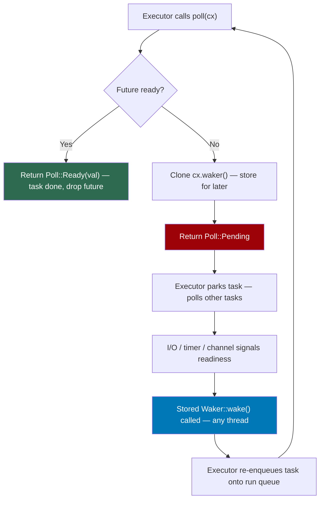
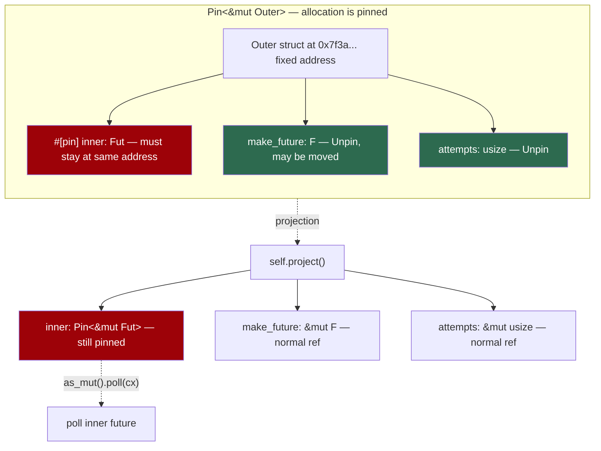
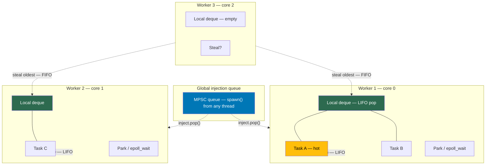
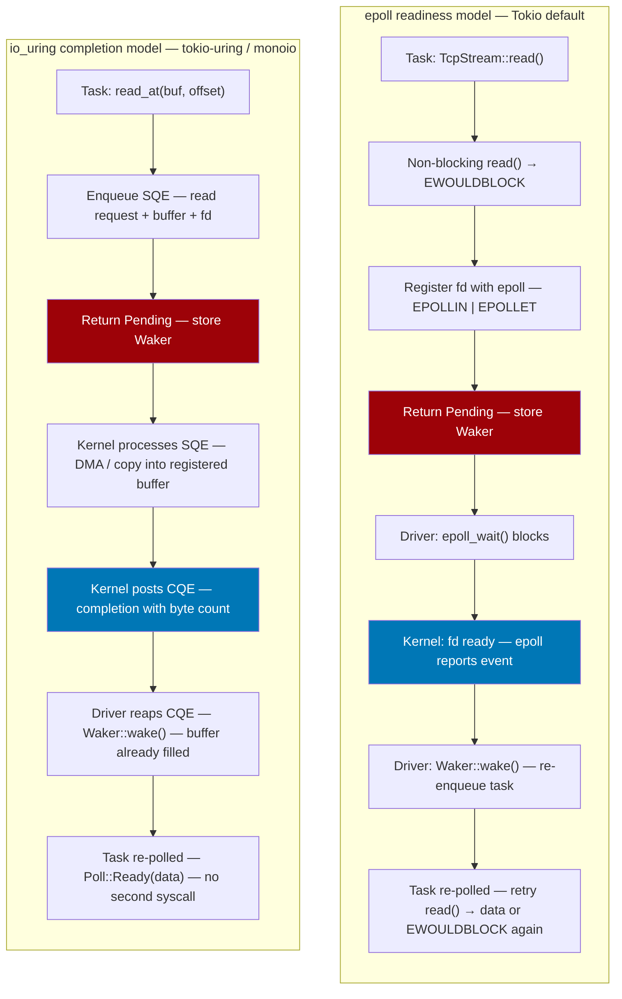
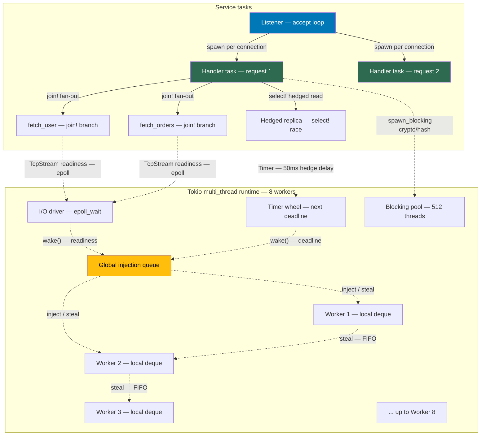
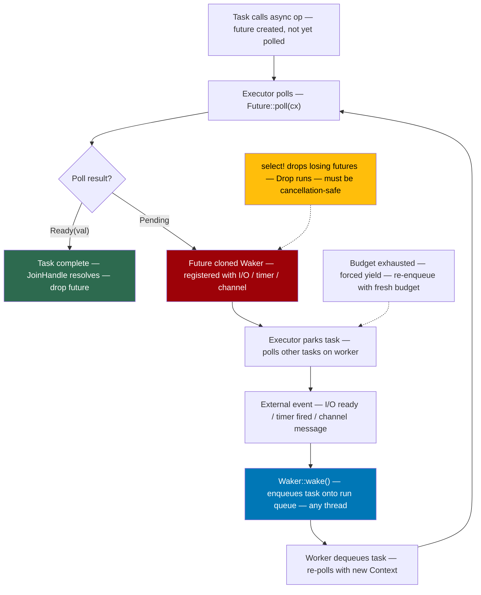

# Chapter 5 — Async Rust: Futures, Pin/Unpin, the Tokio Runtime, and Work-Stealing

*What this chapter covers:* the machinery that makes asynchronous Rust actually asynchronous — from the `Future` trait's `poll`/`Waker`/`Context` protocol through the `Pin`/`Unpin` guarantee that makes self-referential state machines sound, to the Tokio runtime's work-stealing scheduler, cooperative budget, I/O driver, and task combinators. You will be able to read a hand-written `Future` implementation and predict exactly when it wakes, explain why `Pin` exists in one paragraph that convinces a skeptic, trace an `async fn` through its compiler-desugared state machine, configure and reason about Tokio's multi-thread and `current_thread` runtimes, and choose correctly between `select!`, `join!`, and `try_join!` under cancellation and error-propagation constraints.

**Learning goals:**

- Define the `Future` trait, implement `poll` correctly, and explain the contract between `Poll::Pending`, `Waker::wake`, and `Context`.
- Explain readiness vs. completion, level-triggered vs. edge-triggered notification, and why spurious wakes are legal but wasteful.
- State what `Pin<&mut T>` guarantees, when `Unpin` applies, why `async` state machines need pinning, and how projection works.
- Use `pin_project` (and manual `unsafe` projection) to access pinned fields without violating the pin contract.
- Describe how `async fn` and `async` blocks desugar into compiler-generated `enum` state machines with per-`await` variants.
- Build and tune a Tokio runtime (`Builder`, worker threads, `block_on`, `spawn`, `JoinHandle`, blocking pool), and explain work-stealing, task injection, and the cooperative budget.
- Compare the `mio`/`epoll`/`kqueue` readiness driver with `io_uring` and explain when each wins for backend I/O.
- Choose between `select!`, `join!`, `try_join!`, and `JoinSet` with precise understanding of cancellation, fairness, and error semantics.
- Apply all of the above to distributed-systems patterns: fan-out RPCs, deadline racing, graceful shutdown, and backpressure-aware multiplexing.

---

## 1. The `Future` Trait — Poll, Waker, Context, and Readiness

Every async computation in Rust bottoms out in one trait, defined in `core`:

```rust
use core::future::Future;
use core::pin::Pin;
use core::task::{Context, Poll};

pub trait Future {
    type Output;
    fn poll(self: Pin<&mut Self>, cx: &mut Context<'_>) -> Poll<Self::Output>;
}
```

Three things are immediately unusual if you come from `Promise`/`CompletableFuture`/`goroutine` runtimes:

1. A `Future` is **lazy**. Creating it does nothing. Nothing happens until something *polls* it. Dropping a future that was never polled is perfectly legal and runs no code.
2. Polling is **non-blocking**. `poll` must return quickly — either `Poll::Ready(value)` meaning done, or `Poll::Pending` meaning "not ready yet, I will notify you."
3. Notification uses an explicit **waker**. When a future returns `Pending`, it must have arranged for `cx.waker().wake()` to be called at some point in the future. The executor then re-polls the future.

This is the readiness model. It inverts the callback model: instead of the I/O subsystem calling your callback when data arrives, your future *asks* whether data is ready and, if not, hands the runtime a `Waker` — a type-erased, cloneable, `Send + Sync` handle whose only operation is `wake()`.

### 1.1 `Context` and `Waker` — Type-Erased Notification

```rust
// core::task (simplified)
pub struct Context<'a> {
    waker: &'a Waker,
    // ext field omitted
}

impl<'a> Context<'a> {
    pub fn from_waker(waker: &'a Waker) -> Self { /* ... */ }
    pub fn waker(&self) -> &'a Waker { &self.waker }
}

pub struct Waker { /* vtable: clone, wake, wake_by_ref, drop */ }

impl Waker {
    pub fn wake(self) { /* consumes and wakes */ }
    pub fn wake_by_ref(&self) { /* wakes without consuming */ }
    pub fn clone(&self) -> Self { /* vtable dispatch */ }
}
```

A `Waker` is a trait object in disguise — a `RawWaker` vtable holding function pointers for `clone`, `wake`, `wake_by_ref`, and `drop`. The executor installs its own vtable. For Tokio, `wake()` enqueues the task back onto a run queue. For `futures::executor::block_on`, it unparks the blocked thread. For `Waker` created by `noop_waker()`, it does nothing (useful for testing).

`Context` exists so that `poll` signatures do not expose the executor type. Any executor can construct a `Context` from its `Waker` and hand it in. Futures are executor-agnostic — they only know how to clone and wake the waker.

### 1.2 The Poll Contract

The contract is precise and load-bearing:

- If `poll` returns `Poll::Ready(val)`, the future is **fused** — the executor must not poll it again. Doing so is not UB for safe code but may panic. The `Future` is considered completed and typically dropped.
- If `poll` returns `Poll::Pending`, the future **must** have ensured that `wake()` will be called at some point when progress is possible. If it returns `Pending` without arranging a wake, the task stalls forever — a silent deadlock that no runtime can detect.
- `poll` must not block. If it needs to wait for I/O, a timer, or another future, it returns `Pending` and relies on the waker. Blocking inside `poll` starves the executor thread.
- Spurious wakes are allowed: `wake()` may be called even when the future is still not ready. The future must handle re-polling gracefully (typically by checking readiness again and returning `Pending` a second time if needed).
- `wake()` may be called from any thread. The `Waker` is `Send + Sync`.

### 1.3 Readiness vs. Completion

The `Future` protocol is a *completion* notification, but underneath it Tokio's I/O driver uses a *readiness* model (borrowed from `mio`). Understanding the distinction matters for backend I/O.

| Model | Question answered | Who calls whom | Risk |
|-------|-------------------|----------------|------|
| Completion (`Future::poll`) | "Is the operation done?" | Executor polls future; future wakes executor | Missed wake = stalled task |
| Readiness (`mio`/`epoll`) | "Can this fd be read/written without blocking?" | Driver polls kernel; kernel reports readiness | Spurious readiness if you don't drain |

Tokio bridges the two. When you call `TcpStream::readable().await`, the readiness future registers interest in `epoll` (or `io_uring`), returns `Pending`, and the driver arranges that `epoll_wait` waking causes `Waker::wake`. The readiness is edge-triggered at the kernel level but presented as completion at the `Future` level.

### 1.4 A Real `Future` Implementation

The canonical teaching example — a timer — exposes every piece of the protocol. This implementation is structurally identical to what `tokio::time::Sleep` does internally (simplified to use a helper thread instead of the timer wheel for clarity).

```rust
use std::future::Future;
use std::pin::Pin;
use std::sync::{Arc, Mutex};
use std::task::{Context, Poll, Waker};
use std::thread;
use std::time::{Duration, Instant};

/// Shared state between the Future and the timer thread.
struct TimerState {
    deadline: Instant,
    waker: Option<Waker>,
    fired: bool,
}

pub struct TimerFuture {
    state: Arc<Mutex<TimerState>>,
}

impl TimerFuture {
    pub fn new(duration: Duration) -> Self {
        let state = Arc::new(Mutex::new(TimerState {
            deadline: Instant::now() + duration,
            waker: None,
            fired: false,
        }));

        // Spawn a thread that sleeps until the deadline, then wakes.
        // Real Tokio uses a hashed timing wheel instead — no thread per timer.
        let state_clone = Arc::clone(&state);
        thread::spawn(move || {
            let sleep_for = {
                let s = state_clone.lock().unwrap();
                s.deadline.saturating_duration_since(Instant::now())
            };
            thread::sleep(sleep_for);
            let maybe_waker = {
                let mut s = state_clone.lock().unwrap();
                s.fired = true;
                s.waker.take()
            };
            if let Some(waker) = maybe_waker {
                waker.wake(); // <-- re-enqueues the task
            }
        });

        Self { state }
    }
}

impl Future for TimerFuture {
    type Output = ();

    fn poll(self: Pin<&mut Self>, cx: &mut Context<'_>) -> Poll<Self::Output> {
        let mut state = self.state.lock().unwrap();

        if state.fired {
            Poll::Ready(())
        } else {
            // Register (or re-register) the waker so the timer thread
            // knows who to wake. Clone is required — we store it.
            // update_waker avoids cloning if the waker hasn't changed.
            let should_update = match &state.waker {
                Some(existing) => !existing.will_wake(cx.waker()),
                None => true,
            };
            if should_update {
                state.waker = Some(cx.waker().clone());
            }
            Poll::Pending
        }
    }
}

#[tokio::main]
async fn main() {
    println!("waiting 200ms...");
    TimerFuture::new(Duration::from_millis(200)).await;
    println!("done");
}
```

Key observations for production code:

- **`will_wake` optimization.** Cloning a `Waker` may allocate (Tokio's waker clones an `Arc<Task>`). Checking `will_wake` first avoids the clone on every re-poll when the same task is polling.
- **Lock scope.** The mutex is held only briefly to check/set state. Never hold a lock across a `wake()` call if the waker might try to re-lock the same mutex (deadlock). Here we `take()` the waker out before waking.
- **Race between poll and wake.** If the timer fires *after* we check `fired` but *before* we store the waker, the wake is lost. The implementation above handles this because the timer thread checks `state.waker` under the same lock — if it fires before we store, it sees `None` and does nothing, but by then `fired` is `true`, so the *next* poll returns `Ready`. More efficient implementations use an atomic flag plus `Waker` registration in a loop.
- **Why not `async fn` here?** Because you cannot implement custom wake logic inside `async fn`. Any time you need to interface with a non-async callback, kernel event, or cross-thread signal, you write a manual `Future`.



---

## 2. `Pin` and `Unpin` — Why Self-Referential Futures Need a Guarantee

### 2.1 The Problem `Pin` Solves

An `async fn` that holds a value across an `.await` point creates a self-referential struct. The compiler desugars the function into a state machine where one field may contain a pointer into another field of the same struct. If that struct is moved in memory, the internal pointer dangles.

```rust
async fn self_ref_demo() {
    let data = String::from("hello");
    let slice: &str = &data;       // slice points into `data`
    async_op().await;              // suspension point — state machine is stored
    println!("{slice}");            // uses the pointer after resume
}
```

The desugared state machine (conceptually) looks like:

```rust
enum SelfRefDemoFuture {
    Start { data: String },
    WaitingForOp {
        data: String,
        slice: *const str,  // points into `data` above — self-referential!
        op_future: SomeOpFuture,
    },
    Done,
}
```

If you move `SelfRefDemoFuture::WaitingForOp` to a new address with `mem::swap` or by returning it from a function, `slice` still points at the old address. Use-after-move. In safe Rust this must be impossible, so the compiler marks the future as `!Unpin` and requires it to be pinned before polling.

### 2.2 `Pin<&mut T>` — The Guarantee

`Pin<&mut T>` is a wrapper that promises: the value behind the pointer **will not be moved** for as long as the `Pin` exists, unless `T: Unpin`.

```rust
use std::pin::Pin;
use std::marker::Unpin;

// Unpin is an auto trait — most types are Unpin.
// Primitives, Vec, String, Box, &mut T — all Unpin.
// The compiler-generated async state machine is !Unpin.

fn poll_requires_pin<F: Future>(future: Pin<&mut F>, cx: &mut Context<'_>) -> Poll<F::Output> {
    future.poll(cx) // only callable through Pin<&mut Self>
}

// For Unpin futures, you can pin trivially:
let mut fut = async { 42 };
let pinned = Pin::new(&mut fut); // only works because this future happens to be Unpin
// For !Unpin futures, you must use pinning that prevents moves:
Box::pin(async { 42 }) // Pin<Box<F>> — the Box is pinned, heap address is stable
```

The two operations `Pin` forbids (without `unsafe`) are:

- Moving the value out (`mem::swap`, `ptr::read`, assignment).
- Obtaining `&mut T` from `Pin<&mut T>` when `T: !Unpin`. You only get `Pin<&mut T>` back, or `&T`.

The escape hatch is `Unpin`. If `T: Unpin`, then `Pin<&mut T>` dereferences to `&mut T` freely — moving an `Unpin` value is always safe because it contains no self-references. This is why most futures that do not hold borrows across await points are `Unpin` and easy to work with, while futures that borrow local variables across await points become `!Unpin`.

### 2.3 Projection — Accessing Fields of a Pinned Struct

When you implement `Future` for a struct that contains other futures, you need to poll those inner futures — which requires `Pin<&mut Inner>`. But you only have `Pin<&mut Outer>`. Getting a pinned reference to a field is called **projection**, and it is `unsafe` to do manually because you must uphold the pin guarantee.

Here is the manual version, then the safe `pin_project` version.

**Manual projection (unsafe, for understanding):**

```rust
use std::future::Future;
use std::pin::Pin;
use std::task::{Context, Poll};

struct DelayWithInner<F> {
    inner: F,
    use_inner: bool,
}

impl<F: Future> Future for DelayWithInner<F> {
    type Output = F::Output;

    fn poll(self: Pin<&mut Self>, cx: &mut Context<'_>) -> Poll<Self::Output> {
        // SAFETY: we never move `inner` out of `self`.
        // We only return Pin<&mut F> that points into the pinned allocation.
        // `use_inner` is Unpin (bool), so projecting it as &mut bool is fine.
        unsafe {
            let this = self.get_unchecked_mut();
            if this.use_inner {
                // Re-pin the inner future at its current address.
                let inner = Pin::new_unchecked(&mut this.inner);
                inner.poll(cx)
            } else {
                // No future to poll — but we must still arrange a wake
                // if we return Pending. Simplified: ready immediately.
                Poll::Ready(std:: panic!("use_inner is false — no output"))
            }
        }
    }
}
```

The safety argument for `Pin::new_unchecked` here is: `self` is already pinned, so the allocation holding `this.inner` will not move. Creating `Pin<&mut F>` at the same address preserves that guarantee.

**Safe projection with `pin-project`:**

In production code, never write the `unsafe` above by hand. Use `pin-project`:

```toml
# Cargo.toml
[dependencies]
pin-project = "1"
```

```rust
use pin_project::pin_project;
use std::future::Future;
use std::pin::Pin;
use std::task::{Context, Poll};

#[pin_project]
pub struct Retry<F, Fut> {
    #[pin]              // <-- this field requires pin projection
    inner: Fut,
    make_future: F,     // Unpin field — accessed as &mut F
    attempts: usize,    // Unpin field
    max_attempts: usize,
}

impl<F, Fut, T, E> Future for Retry<F, Fut>
where
    F: Fn() -> Fut,
    Fut: Future<Output = Result<T, E>>,
{
    type Output = Result<T, E>;

    fn poll(self: Pin<&mut Self>, cx: &mut Context<'_>) -> Poll<Self::Output> {
        // `project()` returns a struct with pinned / unpinned refs correctly split:
        //   inner: Pin<&mut Fut>   (because #[pin])
        //   make_future: &mut F    (Unpin — normal mutable ref)
        //   attempts: &mut usize
        let mut this = self.project();

        // Poll the current attempt
        match this.inner.as_mut().poll(cx) {
            Poll::Ready(Ok(val)) => Poll::Ready(Ok(val)),
            Poll::Ready(Err(_e)) if *this.attempts < *this.max_attempts => {
                *this.attempts += 1;
                // Replace the inner future with a fresh one.
                // set() is safe because Fut is the #[pin] field — pin_project
                // ensures the old future is dropped in place and the new one
                // is written without moving the outer struct.
                this.inner.set((this.make_future)());
                // Wake immediately — we have a new future to poll.
                cx.waker().wake_by_ref();
                Poll::Pending
            }
            Poll::Ready(Err(e)) => Poll::Ready(Err(e)),
            Poll::Pending => Poll::Pending,
        }
    }
}
```

`#[pin_project]` generates a `project()` method that respects `#[pin]` annotations: pinned fields project to `Pin<&mut Field>`, unpinned fields project to `&mut Field`. It also generates `project_replace` and `project_ref` variants.



**Rules of thumb for backend code:**

- If your type contains a `#[pin]` field, it should usually be `!Unpin` itself. `pin-project` handles this.
- Never call `Pin::new_unchecked` unless you can articulate the pin guarantee in a comment. Prefer `pin_project` or `Box::pin`.
- `Box::pin(x)` and `Pin::new(&mut x)` where `x: Unpin` are the two safe pinning constructors. Everything else is either `pin!` macro (stable since 1.68) or `unsafe`.
- `tokio::pin!(fut)` expands to shadowing `let fut = Box::pin(fut)` semantics on the stack via `Pin` — use it whenever you need to poll a future by reference in the same scope.

---

## 3. `async fn` → State Machine Desugaring

`async fn` is syntax sugar for a function that returns an `impl Future`. The compiler transforms the body into a state machine `enum` where each `.await` point becomes a variant.

### 3.1 Minimal Desugaring

```rust
// What you write:
async fn fetch_with_retry(url: String) -> Result<String, reqwest::Error> {
    let client = reqwest::Client::new();          // (1) before first await
    let resp = client.get(&url).send().await?;    // (2) first suspension
    let body = resp.text().await?;                // (3) second suspension
    Ok(body)                                      // (4) done
}
```

Conceptually, the compiler generates something like:

```rust
// What the compiler generates (simplified, not actual name mangling):
enum FetchWithRetryFuture {
    // Variant 0: not yet started / running up to first await
    Start { url: String },
    // Variant 1: waiting for send() — holds locals live across await
    WaitingSend {
        url: String,
        client: reqwest::Client,
        send_future: SendFuture,  // the future returned by send()
    },
    // Variant 2: waiting for text() — resp is live
    WaitingBody {
        url: String,
        client: reqwest::Client,
        resp: Response,
        text_future: TextFuture,
    },
    Done,
}

impl Future for FetchWithRetryFuture {
    type Output = Result<String, reqwest::Error>;

    fn poll(mut self: Pin<&mut Self>, cx: &mut Context<'_>) -> Poll<Self::Output> {
        loop {
            // SAFETY: projection via internal pin_project-like logic
            match self.as_mut().get_mut() {
                Self::Start { url } => {
                    let url = std::mem::replace(url, String::new());
                    let client = reqwest::Client::new();
                    let fut = client.get(&url).send();
                    // Transition to WaitingSend — move locals into variant
                    *self.as_mut().get_mut() = Self::WaitingSend {
                        url, client, send_future: fut,
                    };
                    // fall through to poll the new variant
                }
                Self::WaitingSend { send_future, .. } => {
                    // SAFETY: pin projection of send_future
                    let res = unsafe {
                        Pin::new_unchecked(send_future).poll(cx)
                    };
                    match res {
                        Poll::Pending => return Poll::Pending,
                        Poll::Ready(Ok(resp)) => {
                            // Extract fields, transition to WaitingBody
                            // (actual code uses MaybeUninit + drop glue)
                            todo!("transition")
                        }
                        Poll::Ready(Err(e)) => return Poll::Ready(Err(e)),
                    }
                }
                Self::WaitingBody { text_future, .. } => {
                    let res = unsafe { Pin::new_unchecked(text_future).poll(cx) };
                    match res {
                        Poll::Pending => return Poll::Pending,
                        Poll::Ready(r) => return Poll::Ready(r),
                    }
                }
                Self::Done => panic!("polled after Ready"),
            }
        }
    }
}
```

Salient details:

- **Each `await` is a state transition.** The future stores all locals that are live across the await. Locals that die before the await are dropped and not stored — the compiler computes liveness precisely, so the state machine is as small as possible.
- **The generated `Future` is `!Unpin`** when any await holds a borrow or a `!Unpin` inner future across the suspension. The compiler enforces this automatically.
- **Drop glue matters.** If the future is dropped while in `WaitingSend`, the compiler runs destructors for `url`, `client`, and `send_future` in that variant. Cancellation safety (see §7) depends on which destructors run and whether the inner future's drop has side effects.
- **`?` is just `match` inside the state machine.** `future.await?` desugars to polling the future, then matching `Ok/Err` and returning early on `Err`.

```mermaid
stateDiagram-v2
    [*] --> Start: call async fn — create future
    Start --> WaitingSend: first poll — init locals, create send_future
    WaitingSend --> WaitingSend: poll returns Pending — stay, waker registered
    WaitingSend --> WaitingBody: send_future Ready(Ok) — move resp, create text_future
    WaitingSend --> Done_Err: send_future Ready(Err) — return Err
    WaitingBody --> WaitingBody: poll returns Pending
    WaitingBody --> Done_Ok: text_future Ready(Ok) — return Ok(body)
    WaitingBody --> Done_Err: text_future Ready(Err) — return Err
    Done_Ok --> [*]: Poll::Ready — fused
    Done_Err --> [*]: Poll::Ready — fused
    note right of WaitingSend
        State holds: url, client, send_future
        Self-referential if send_future
        borrows from client
    end note
```

### 3.2 `async move` Blocks and `Send` Bounds

`async` blocks capture variables. `async move` takes ownership. The difference determines `Send`:

```rust
use std::rc::Rc;

async fn requires_send<F>(f: F) where F: Future + Send { f.await }

// Rc is !Send, so this async block is !Send:
let rc = Rc::new(42);
let fut = async move { println!("{}", rc); }; // captures Rc — !Send
// requires_send(fut).await; // error: future cannot be sent between threads

// Drop Rc before the await — future becomes Send again:
let rc = Rc::new(42);
let fut = async move {
    let val = *rc;
    drop(rc);               // Rc dropped before suspension point
    async_op().await;       // suspension holds only `val: i32` — Send
};
requires_send(fut).await; // ok
```

For backend services this matters constantly: `tokio::spawn` requires `Send` (the task may move between worker threads after a wake). A single `Rc` or `Cell` held across an await makes the entire future `!Send` and the `spawn` fails to compile. The fix is either to scope the `!Send` value so it is dropped before the await, or to use `spawn_local` on a `LocalSet`.

---

## 4. The Tokio Runtime — Builder, Topologies, and `block_on`

### 4.1 Runtime Roles

Tokio's runtime has three cooperating subsystems:

| Subsystem | Responsibility | Wakes tasks when… |
|-----------|---------------|-------------------|
| **Scheduler** | Decides which task to poll next, on which thread | A task's `Waker` is woken (re-enqueued) |
| **I/O driver** | Manages `epoll`/`kqueue`/`io_uring` registrations, readiness | Kernel reports fd readiness |
| **Timer wheel** | Tracks deadlines, parks threads until next tick | Deadline expires |

A fourth pool — the **blocking pool** — handles `spawn_blocking` work that must not run on scheduler threads.

### 4.2 Building a Runtime

```rust
use tokio::runtime::Builder;

fn main() -> anyhow::Result<()> {
    // Multi-thread runtime — the default for tokio::main
    let rt = Builder::new_multi_thread()
        .worker_threads(8)               // scheduler threads; default = num_cpus
        .max_blocking_threads(512)       // blocking pool cap; default 512
        .thread_name("my-worker")        // prefix for worker thread names
        .thread_stack_size(2 * 1024 * 1024)
        .enable_all()                    // I/O + time drivers
        .on_thread_start(|| println!("worker started"))
        .build()?;

    rt.block_on(async {
        // Inside block_on, a Tokio context is active — spawn, sleep, I/O all work.
        let h = tokio::spawn(async { 42 });
        println!("spawned: {}", h.await.unwrap());
    });

    // Custom current_thread runtime — single-threaded, no work-stealing
    let rt2 = Builder::new_current_thread()
        .enable_all()
        .build()?;
    rt2.block_on(async {
        // Tasks never migrate threads; !Send futures ok via spawn_local + LocalSet
        let local = tokio::task::LocalSet::new();
        local.run_until(async {
            let rc = std::rc::Rc::new("local data");
            tokio::task::spawn_local(async move {
                println!("{rc} on {:?}", std::thread::current().id());
            }).await.unwrap();
        }).await;
    });

    Ok(())
}
```

`#[tokio::main]` is sugar for `Builder::new_multi_thread().enable_all().build()?.block_on(async { ... })`. Add `flavor = "current_thread"` to switch:

```rust
#[tokio::main(flavor = "current_thread")]
async fn main() { /* ... */ }
```

```rust
// Cargo.toml — minimal Tokio features for a backend service
[dependencies]
tokio = { version = "1", features = ["rt-multi-thread", "macros", "net", "time", "sync", "io-util"] }
```

### 4.3 `block_on` — Entering the Runtime

`block_on` is the bridge between sync and async. It blocks the calling thread, drives the provided future to completion by polling it, and runs the scheduler loop on that thread for the duration.

```rust
// Simplified mental model of block_on (current_thread variant):
pub fn block_on<F: Future>(&self, future: F) -> F::Output {
    // 1. Enter the runtime context (thread-local).
    // 2. Pin the future.
    // 3. Loop: poll future; if Pending, park thread until waker unparks it.
    // 4. Drive I/O + timers while parked (epoll_wait / timer wheel).
    // 5. On Ready, exit context and return.
    todo!()
}
```

Constraints:

- You **cannot** call `block_on` from within an async context (it would block the worker thread). Tokio detects this and panics with "Cannot start a runtime from within a runtime."
- `block_on` on a `current_thread` runtime parks the *same* thread that runs tasks. On a `multi_thread` runtime, `block_on` parks the calling thread while worker threads continue driving other tasks.

### 4.4 Multi-Thread Scheduler — Work-Stealing

Tokio's multi-thread scheduler is the production default for backend services. Each worker thread owns:

- A **local run queue** — a Chase-Lev deque (double-ended, work-stealing deque). The owner pushes/pops from one end (LIFO for cache locality); thieves steal from the other end (FIFO, stealing the oldest task).
- An **I/O driver handle** and **timer wheel shard**.

There is also a single **global (injection) queue** — an MPSC queue where `spawn` from outside the runtime and cross-thread wakes inject tasks. Workers check the injection queue when their local queue is empty.

Scheduling loop per worker (simplified):

```
loop {
    // 1. Drain local queue (LIFO — most recent task first, hot cache)
    if let Some(task) = local.pop() { poll(task); continue; }

    // 2. Check injection queue (new spawns from any thread)
    if let Some(task) = inject.pop() { poll(task); continue; }

    // 3. Try to steal from another worker's queue (FIFO — oldest task)
    if let Some(task) = steal_from_random_worker() { poll(task); continue; }

    // 4. Nothing to do — park. epoll_wait / timer park until woken.
    park();
}
```

Work-stealing gives two properties backend engineers care about:

- **Load balancing without a central coordinator.** Busy workers keep their hot tasks local; idle workers steal, smoothing utilization. No single lock on a global queue in the hot path.
- **Cache locality.** LIFO local pops mean a task that just woke (likely with hot cache lines from the I/O that woke it) runs immediately on the same core.



### 4.5 `current_thread` — When Single-Threaded Wins

`current_thread` runs all tasks on the calling thread. No work-stealing, no cross-thread synchronization in the scheduler hot path, and `!Send` futures are allowed via `LocalSet`.

Use it when:

- The service is single-tenant per core and you shard by other means (e.g., one runtime per `SO_REUSEPORT` listener).
- You need `!Send` state (e.g., `Rc`, `!Send` FFI handles) across awaits.
- Startup latency matters and you want to avoid spawning worker threads (CLI tools, tests).
- You are embedding Tokio inside an already-threaded system and want explicit control over which thread runs async work.

Operationally, `current_thread` has *lower* tail latency under light load (no cross-thread handoff) but *worse* tail under saturation (one slow task blocks all others on that thread, whereas `multi_thread` can still make progress on other workers — subject to the budget, see §5).

---

## 5. Tasks, `spawn`, `JoinHandle`, and the Cooperative Budget

### 5.1 `spawn` and `JoinHandle`

`tokio::spawn` is how you create concurrent work inside the runtime. It takes a `Future + Send + 'static`, enqueues it as a task, and returns a `JoinHandle<T>` — itself a future that resolves when the task completes.

```rust
use tokio::task::JoinHandle;

#[tokio::main]
async fn main() -> anyhow::Result<()> {
    // Spawn — task may run on any worker thread after creation
    let handle: JoinHandle<u64> = tokio::spawn(async {
        // This async block is a separate task with its own budget.
        expensive_computation().await
    });

    // JoinHandle is a Future — await it to get the result.
    // The Output is Result<T, JoinError> — Err if the task panicked or was cancelled.
    match handle.await {
        Ok(val) => println!("task returned {val}"),
        Err(e) if e.is_panic() => eprintln!("task panicked: {e}"),
        Err(e) if e.is_cancelled() => eprintln!("task cancelled"),
        Err(e) => eprintln!("join error: {e}"),
    }

    // Detached task — dropping the JoinHandle does NOT cancel the task.
    // The task continues running in the background.
    let _detached: JoinHandle<()> = tokio::spawn(async {
        loop {
            tokio::time::sleep(std::time::Duration::from_secs(60)).await;
            do_background_work().await;
        }
    });
    // To cancel, call handle.abort():
    // handle.abort(); // signals cancellation; task is dropped at next poll point

    Ok(())
}

async fn expensive_computation() -> u64 { 42 }
async fn do_background_work() {}
```

Key semantics:

- **`'static` bound.** The spawned future must own its data or hold `'static` references. You cannot `spawn(async { &local_var })` — the task may outlive the stack frame. Move owned data in or use `Arc`.
- **`Send` bound** (on `multi_thread`). The future may migrate between workers. `spawn_local` on a `LocalSet` relaxes this to `!Send`.
- **Dropping `JoinHandle` detaches.** This is unlike `std::thread::JoinHandle` where dropping may or may not detach depending on context. In Tokio, dropping the handle is explicitly a detach — the task keeps running. Use `handle.abort()` or a cancellation token to stop it.
- **`JoinHandle` cancellation.** `abort()` causes the next poll of the task to be skipped and the future dropped. Whether that drop is *cancellation-safe* depends on the future (see §7).

**`JoinSet` for structured concurrency:**

When you spawn many tasks and want to manage their lifetimes together, `JoinSet` is the right primitive. It tracks all spawned tasks, lets you `join_next` as they complete, and aborts remaining tasks on drop.

```rust
use tokio::task::JoinSet;

async fn fan_out(urls: Vec<String>) -> Vec<Result<String, anyhow::Error>> {
    let mut set = JoinSet::new();

    for url in urls {
        set.spawn(async move {
            // Each task owns its url — 'static satisfied via move
            fetch(url).await
        });
    }

    let mut results = Vec::new();
    while let Some(res) = set.join_next().await {
        match res {
            Ok(Ok(body)) => results.push(Ok(body)),
            Ok(Err(e)) => results.push(Err(e)),
            Err(join_err) => results.push(Err(anyhow::anyhow!("join: {join_err}"))),
        }
    }
    results
}

async fn fetch(_url: String) -> Result<String, anyhow::Error> { Ok(String::new()) }
```

`JoinSet` also solves the "spawn and forget to await" bug: on `drop`, it aborts all remaining tasks, unlike detached `JoinHandle`s. For request-scoped fan-out in a backend service, always prefer `JoinSet` over collecting `Vec<JoinHandle>`.

### 5.2 The Cooperative Budget

Tokio tasks are **cooperatively scheduled**. A task that never yields (never returns `Pending`) starves all other tasks on that worker. To mitigate, Tokio gives each task a **budget** — a counter decremented on each poll. When the budget is exhausted, the task is preemptively yielded even if it is ready to continue.

```rust
// The budget is internal — you interact with it via these patterns:

// 1. Every .await is a yield point — budget is reset on wake.
// 2. For CPU-heavy loops without I/O, yield explicitly:
async fn cpu_heavy(n: u64) -> u64 {
    let mut sum = 0u64;
    for i in 0..n {
        sum = sum.wrapping_add(i);
        if i % 128 == 0 {
            // Cooperative yield — returns Pending once, re-enqueues task,
            // resets budget. Without this, a large n blocks the worker.
            tokio::task::yield_now().await;
        }
    }
    sum
}

// 3. For truly blocking work, use the blocking pool — never block a worker:
async fn blocking_work(path: String) -> anyhow::Result<String> {
    tokio::task::spawn_blocking(move || {
        // Runs on the blocking thread pool, not a worker.
        // May block, do sync I/O, call FFI.
        std::fs::read_to_string(&path)
    })
    .await? // JoinHandle<Result<String, io::Error>>
    .map_err(Into::into)
}
```

The budget also governs **mutex fairness**. `tokio::sync::Mutex` is not a spinlock — it yields cooperatively. A task holding a mutex across an await that exhausts its budget will be yielded, letting other tasks run, but the lock remains held (it is an async lock, not a blocking one).

### 5.3 `spawn_blocking` and `block_in_place`

| Primitive | Where it runs | Blocks worker? | Use when |
|-----------|---------------|----------------|----------|
| `spawn_blocking` | Dedicated blocking pool (512 threads default) | No | Sync I/O, CPU crypto, FFI, `std::fs` |
| `block_in_place` | Temporarily moves worker to blocking pool, runs closure on same thread | Worker is replaced — pool grows by one | Must stay on same thread (TLS, thread-local) but need to block |
| `yield_now().await` | Same worker, re-enqueued | No — cooperative | CPU loop needs to yield without blocking |

```rust
// spawn_blocking — preferred for most blocking work
let data = tokio::task::spawn_blocking(|| {
    // No async here — this is a plain sync closure on a blocking thread.
    std::fs::read("/etc/hosts").unwrap()
}).await.unwrap();

// block_in_place — only on multi_thread runtime
let result = tokio::task::block_in_place(|| {
    // Runs on the worker thread, but the scheduler has moved
    // this worker's other tasks elsewhere. Ok to block.
    expensive_sync_ffi_call()
});

fn expensive_sync_ffi_call() -> String { String::new() }
```

---

## 6. I/O Drivers — `epoll`/`kqueue`/`mio` vs. `io_uring`

### 6.1 The `mio` + `epoll`/`kqueue` Path (Tokio's Default)

On Linux, Tokio's I/O driver is built on `mio`, which wraps `epoll`. On macOS/BSD, `kqueue`. The flow:

1. When you call `TcpStream::readable().await`, Tokio registers the fd with `epoll` via `epoll_ctl(EPOLL_CTL_ADD, EPOLLIN | EPOLLOUT | EPOLLET)` (edge-triggered).
2. The future returns `Pending` and stores the `Waker`.
3. The I/O driver thread (one per runtime, or shared with workers in `current_thread`) calls `epoll_wait` in a loop.
4. When `epoll_wait` reports readiness for that fd, the driver looks up the associated `Waker` and calls `wake()`.
5. The task is re-enqueued and re-polled. It attempts the I/O again — if it would still block (`EWOULDBLOCK`), it re-registers and returns `Pending` again (level-triggered re-check on top of edge-triggered kernel notification).

This readiness model requires **two syscalls per I/O operation** in the steady state: one to initiate (`read`/`write` that returns `EWOULDBLOCK`) and one `epoll_wait` wake to retry. For high-throughput services doing millions of small reads/writes, this syscall overhead is measurable.

### 6.2 `io_uring` — Completion-Based I/O

`io_uring` (Linux 5.1+) is a completion-based interface. Instead of "tell me when this fd is ready, then I will `read`," you submit "read N bytes from this fd into this buffer" to a shared ring buffer, and the kernel completes it asynchronously, posting a completion event.

```
epoll model:     submit readiness interest → wait → readiness → syscall read → data
io_uring model:  submit read request      → wait → completion (data already in buffer)
```

Advantages for backend workloads:

- **Fewer syscalls.** Submission and completion can be batched. Multiple I/Os submitted with one `io_uring_enter`, multiple completions reaped together. With `IORING_SETUP_SQPOLL`, even the submission syscall can be avoided (kernel polls the submission ring).
- **No `EWOULDBLOCK` dance.** The operation either completes or is queued — no readiness re-check.
- **Registered buffers and fixed files.** `IORING_REGISTER_BUFFERS` and `IORING_REGISTER_FILES` let the kernel avoid per-I/O setup costs — critical for databases and proxies doing large sequential I/O.
- **Zero-copy potential.** With `O_DIRECT` and registered buffers, data can move without extra copies.

Current Tokio status: as of Tokio 1.x, `io_uring` support is **not** in the default I/O driver. The `tokio-uring` crate (now `tokio-uring` / `monoio`) provides an `io_uring`-backed runtime for workloads where the syscall reduction matters. The ecosystem is converging — expect `io_uring` to become Tokio's Linux driver behind a feature flag as the kernel interface stabilizes further. For now:

| Workload | Recommended driver | Reason |
|----------|-------------------|--------|
| Typical HTTP/gRPC service (many small messages, moderate throughput) | `mio`/`epoll` (Tokio default) | Mature, well-tuned, no `io_uring` kernel version requirement |
| High-throughput proxy / storage engine (large sequential I/O, `O_DIRECT`) | `io_uring` via `tokio-uring` / `monoio` | Batched completions, registered buffers, fewer syscalls |
| Cross-platform service (Linux + macOS) | `mio` (abstracts `epoll`/`kqueue`) | Single code path |



**Practical guidance for backend teams:** do not adopt `io_uring` for a standard microservice because it sounds faster. The `epoll` path in Tokio is heavily optimized and the bottleneck in most services is serialization, business logic, or downstream latency — not syscall count. Adopt `io_uring` when profiling shows `epoll_wait`/`read`/`write` syscall overhead in the hot path, typically in proxies, storage engines, or services doing >100K IOPS per core with large buffers.

---

## 7. Combinators — `select!`, `join!`, `try_join!`, and Cancellation

### 7.1 `tokio::select!` — Racing Futures

`select!` polls multiple futures concurrently and returns when **the first** completes. Remaining futures are **dropped** (cancelled). This is the primitive for timeouts, shutdown signals, and racing replicas.

```rust
use tokio::time::{sleep, Duration};

async fn fetch_with_timeout(url: String) -> Option<String> {
    tokio::select! {
        body = fetch(url) => Some(body.unwrap_or_default()),
        _ = sleep(Duration::from_secs(2)) => {
            eprintln!("fetch timed out");
            None
        }
    }
    // The non-winning branch's future is dropped here.
    // If `fetch` holds a TCP connection, its Drop closes it.
    // If that Drop is not cancellation-safe, data may be lost.
}

async fn fetch(_url: String) -> Result<String, anyhow::Error> { Ok(String::new()) }
```

**Biased vs. fair polling.** By default, `select!` polls branches in **random order** (to avoid starvation). Add `biased;` to poll in written order — useful when one branch (like a shutdown signal) must take priority, but be explicit about it:

```rust
tokio::select! {
    biased; // poll in order written — shutdown checked first
    _ = shutdown_signal() => { graceful_shutdown().await; }
    res = handle_request() => { return res; }
}
```

**Cancellation safety.** When `select!` drops the losing future, that future's destructor runs mid-await. If the future was in the middle of a protocol step that must not be interrupted (e.g., sent a request but not yet read the response), dropping it may leave the connection in an inconsistent state. Tokio documents which operations are cancellation-safe. `tokio::io::AsyncReadExt::read_exact` is *not* cancellation-safe (it may have partially filled the buffer). `tokio::sync::mpsc::recv` *is* cancellation-safe.

For backend code, this means: never `select!` over a future that performs a non-idempotent operation unless you can tolerate the operation being half-done. Use `tokio::select!` with channels and timers (cancellation-safe), and guard non-idempotent I/O with explicit state or by wrapping in `tokio::sync::CancellationToken`.

### 7.2 `tokio::join!` and `try_join!` — Waiting for All

`join!` polls all futures concurrently and returns when **all** complete. Unlike `select!`, it does not cancel — every future runs to completion.

```rust
// join! — heterogeneous futures, all must succeed (or you handle errors per-branch)
let (a, b, c) = tokio::join!(
    fetch_user(42),
    fetch_orders(42),
    fetch_recommendations(42),
);
// a, b, c are each the Output of their future — no wrapping.

// try_join! — via `tokio::try_join!` — short-circuits on first Err
// All futures are still polled concurrently; on first Err, remaining futures
// continue to completion but their results are discarded. No cancellation.
let (user, orders) = tokio::try_join!(
    fetch_user(42),
    fetch_orders(42),
)?; // returns Err immediately on first failure

async fn fetch_user(_id: u64) -> Result<String, anyhow::Error> { Ok(String::new()) }
async fn fetch_orders(_id: u64) -> Result<String, anyhow::Error> { Ok(String::new()) }
async fn fetch_recommendations(_id: u64) -> Result<String, anyhow::Error> { Ok(String::new()) }
```

**`futures::future::join_all` vs. `tokio::join!`:**

| Combinator | Input | Output | Runtime requirement |
|------------|-------|--------|---------------------|
| `tokio::join!(a, b, c)` | Fixed set, heterogeneous types | Tuple `(A::Output, B::Output, C::Output)` | None — polls inline, no spawn |
| `futures::join_all(vec)` | Dynamic `Vec<Future<Output=T>>`, homogeneous | `Vec<T>` | None — polls inline |
| `tokio::try_join!(a, b)` | Fixed set, `Output = Result<T, E>` | `Result<(T1, T2), E>` — first `Err` wins | None |
| `JoinSet::join_next` | Dynamic, spawned tasks | `Option<Result<T, JoinError>>` | Tokio — tasks are spawned |

For a backend fan-out where the number of downstream calls is known at compile time, `join!` is zero-overhead (no allocation, no spawn). For dynamic fan-out (fan out to N replicas where N comes from config), `JoinSet` is correct — it actually spawns tasks so they run concurrently on the work-stealing scheduler, whereas `join_all` polls them cooperatively on the current task.

### 7.3 Timing and Semantics Compared

```mermaid
gantt
    title select! vs join! vs try_join! — 3 concurrent futures
    dateFormat X
    axisFormat %L ms
    section select!
    winner (200ms) :a1, 0, 200
    loser1 (500ms — cancelled at 200) :a2, 0, 200
    loser2 (800ms — cancelled at 200) :a3, 0, 200
    section join!
    task A (200ms) :b1, 0, 200
    task B (500ms) :b2, 0, 500
    task C (800ms) :b3, 0, 800
    section try_join! — B fails at 500
    task A (200ms ok) :c1, 0, 200
    task B (500ms Err) :c2, 0, 500
    task C (800ms — runs but discarded) :c3, 0, 800
```



### 7.4 Distributed-Systems Patterns

**Deadline racing — hedged requests:**

```rust
use tokio::time::{sleep, Duration};

async fn hedged_fetch(url: String) -> Result<String, anyhow::Error> {
    // Send to primary. If it hasn't responded in 50ms, also try replica.
    // First response wins — the other request is cancelled (connection dropped).
    // Only use when the operation is idempotent (GET, not POST with side effects).
    let primary = fetch(url.clone());
    let replica = async {
        sleep(Duration::from_millis(50)).await;
        fetch(url).await
    };

    tokio::select! {
        r = primary => r,
        r = replica => r,
    }
}

async fn fetch(_url: String) -> Result<String, anyhow::Error> { Ok(String::new()) }
```

**Graceful shutdown with `CancellationToken`:**

```rust
use tokio_util::sync::CancellationToken;

async fn serve(token: CancellationToken) {
    let mut set = tokio::task::JoinSet::new();

    loop {
        tokio::select! {
            biased;
            _ = token.cancelled() => {
                eprintln!("shutdown signal — draining {} tasks", set.len());
                break;
            }
            conn = accept() => {
                let token = token.clone();
                set.spawn(async move {
                    tokio::select! {
                        _ = handle(conn) => {},
                        _ = token.cancelled() => {
                            eprintln!("connection cancelled — dropping");
                        }
                    }
                });
            }
            // Reap completed tasks without blocking accept
            Some(res) = set.join_next() => {
                if let Err(e) = res { eprintln!("task failed: {e:?}"); }
            }
        }
    }

    // Drain remaining connections with a deadline
    tokio::select! {
        _ = drain_join_set(&mut set) => eprintln!("all connections drained"),
        _ = tokio::time::sleep(Duration::from_secs(10)) => {
            eprintln!("drain deadline — aborting {} tasks", set.len());
            set.abort_all();
        }
    }
}

async fn accept() -> String { String::new() }
async fn handle(_conn: String) {}
async fn drain_join_set(_set: &mut tokio::task::JoinSet<()>) {}
```

**Backpressure-aware multiplexing:**

```rust
use tokio::sync::{mpsc, Semaphore};
use std::sync::Arc;

/// Fan out with bounded concurrency — never spawn unbounded tasks.
async fn bounded_fan_out(urls: Vec<String>, concurrency: usize) -> Vec<String> {
    let sem = Arc::new(Semaphore::new(concurrency));
    let mut set = tokio::task::JoinSet::new();

    for url in urls {
        let permit = Arc::clone(&sem).acquire_owned().await.unwrap();
        set.spawn(async move {
            let result = fetch(url).await.unwrap_or_default();
            drop(permit); // release concurrency slot
            result
        });
    }

    let mut out = Vec::new();
    while let Some(Ok(val)) = set.join_next().await {
        out.push(val);
    }
    out
}

async fn fetch(_url: String) -> Result<String, anyhow::Error> { Ok(String::new()) }
```

For higher-level backpressure, `tower::Service` with `BoxService` and `Buffer` gives you poll-ready semantics that compose with the runtime's readiness model — the service returns `Pending` when at capacity, and the caller naturally awaits without spawning.

---

## 8. Putting It Together — A Production Task Topology

A typical backend service combines every primitive in this chapter. The diagram below shows a `multi_thread` Tokio runtime serving an HTTP API that fans out to downstream services with hedged reads, bounded concurrency, and graceful shutdown.



Operational checklist for backend teams running Tokio at scale:

- **Size `worker_threads` explicitly** for noisy-neighbor isolation. Default `num_cpus` is usually right, but if the host runs sidecars, leave cores for them. Measure with `tokio-metrics`.
- **Monitor the blocking pool.** `spawn_blocking` tasks that never complete leak blocking threads. The pool grows to `max_blocking_threads` then stalls — symptom is latency spikes with no CPU saturation.
- **Enforce `yield_now` or `spawn_blocking` in code review** for any loop that might iterate >100 times without an await. A single `for` over 10K items without yielding can add milliseconds of tail latency to every other task on that worker.
- **Use `JoinSet` for request-scoped concurrency** and `CancellationToken` for shutdown. Avoid `Vec<JoinHandle>` + manual abort — it is easy to forget a handle and leak a task.
- **Audit `select!` for cancellation safety** whenever the losing branch holds a protocol step. If in doubt, wrap the critical section in a dedicated task and `select!` on its `JoinHandle` instead — dropping a `JoinHandle` does not cancel the inner future.



---

## Key takeaways

- A `Future` is a lazy, poll-based state machine. `poll` returns `Ready` or `Pending`; `Pending` must be paired with a future `Waker::wake()`. Missed wakes are silent deadlocks — the executor cannot detect them.
- `Waker` is a type-erased, `Send + Sync`, cloneable handle. `Context` wraps it so futures stay executor-agnostic. Spurious wakes are legal; futures must re-check readiness on every poll.
- `Pin<&mut T>` guarantees the value will not move. `Unpin` opts out. Compiler-generated async state machines are `!Unpin` when they hold self-references across await points. `Pin` is the reason `Future::poll` takes `Pin<&mut Self>`.
- Projection — obtaining `Pin<&mut Field>` from `Pin<&mut Outer>` — is `unsafe` to do manually. Use `pin_project` with `#[pin]` annotations. Never call `Pin::new_unchecked` without a written safety argument.
- `async fn` desugars into an `enum` with one variant per await suspension point, holding all locals live across that await. Each variant's `poll` arm drives one inner future. Drop glue for the active variant runs on cancellation.
- Tokio's `multi_thread` scheduler uses per-worker Chase-Lev deques (LIFO local pop, FIFO steal) plus a global injection queue. This gives load balancing without a central lock and preserves cache locality for hot tasks.
- `current_thread` eliminates cross-thread scheduling overhead and allows `!Send` futures via `LocalSet`, at the cost of no parallelism within the runtime. Choose it for single-core sharding, `!Send` FFI, or embedding.
- `block_on` bridges sync and async by blocking the caller and driving the runtime. Never call it from inside an async context. `spawn_blocking` and `block_in_place` are the correct ways to run blocking work without stalling workers.
- The cooperative budget prevents one task from starving a worker. CPU-heavy loops must `yield_now().await` or be moved to `spawn_blocking`. The budget is reset on each wake.
- `select!` races futures and cancels losers (drops them). `join!` waits for all. `try_join!` waits for all but short-circuits on first `Err` without cancelling. `JoinSet` is the structured-concurrency primitive for dynamic task counts — it aborts on drop.
- Cancellation safety is a property of the future being dropped mid-await. Never `select!` over a future that performs a non-idempotent protocol step unless you can tolerate a half-completed operation. Wrap critical sections in a task and `select!` on the `JoinHandle` if needed.
- Tokio's default I/O driver is `mio`/`epoll` (readiness-based, two syscalls per I/O). `io_uring` (completion-based, batched, registered buffers) wins for high-IOPS storage/proxy workloads but is not yet Tokio's default — use `tokio-uring`/`monoio` when profiling justifies it.

## Further reading

- `core::future::Future`, `core::task::{Context, Poll, Waker, RawWaker}` — standard library docs, <https://doc.rust-lang.org/core/future/trait.Future.html> and <https://doc.rust-lang.org/core/task/>
- `std::pin::Pin` and `Unpin` — <https://doc.rust-lang.org/std/pin/struct.Pin.html>
- *The `pin` module documentation* — the most precise explanation of the pin contract and `Unpin`, <https://doc.rust-lang.org/std/pin/>
- `pin-project` crate — <https://docs.rs/pin-project>
- Tokio documentation — runtime builder, task spawning, `select!`/`join!`, I/O, sync primitives, <https://docs.rs/tokio>
- Tokio internals — work-stealing scheduler, budget, I/O driver, timer wheel, <https://tokio.rs/tokio/topics/better-together> and <https://github.com/tokio-rs/tokio/tree/master/tokio/src/runtime>
- *Asynchronous Programming in Rust* (official async book) — futures, executors, pinning, <https://rust-lang.github.io/async-book/>
- `mio` — the readiness-based I/O library under Tokio, <https://docs.rs/mio>
- `tokio-uring` — `io_uring` runtime for Tokio, <https://docs.rs/tokio-uring>
- `monoio` — thread-per-core `io_uring` runtime, <https://docs.rs/monoio>
- *Efficient Work-Stealing for Multicore Scheduling* (Chase–Lev deque) — the deque behind Tokio's scheduler, <https://dl.acm.org/doi/10.1145/1073970.1073974>
- *The io_uring interface* — Linux kernel documentation and `io_uring_enter(2)` man page, <https://man7.org/linux/man-pages/man2/io_uring_enter.2.html>
- *Are we `async` yet?* — ecosystem status and interop notes, <https://areweasyncyet.rs/>
- *Tokio metrics* (`tokio-metrics` crate) — instrumenting scheduler utilization, blocking pool, and task counts in production, <https://docs.rs/tokio-metrics>
