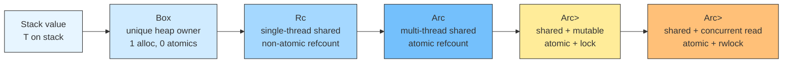
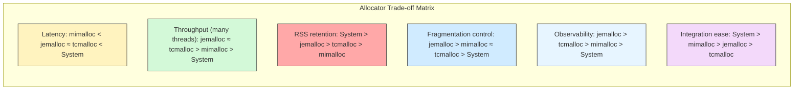
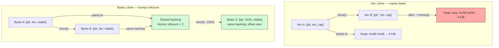
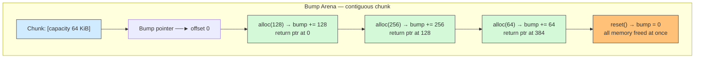
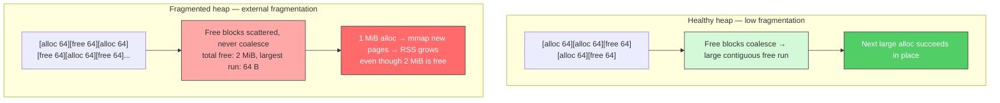
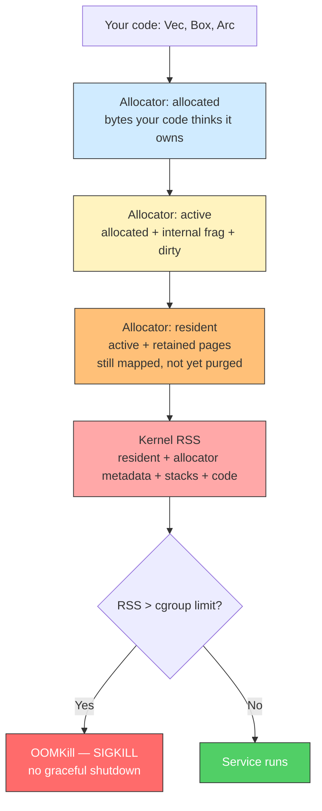
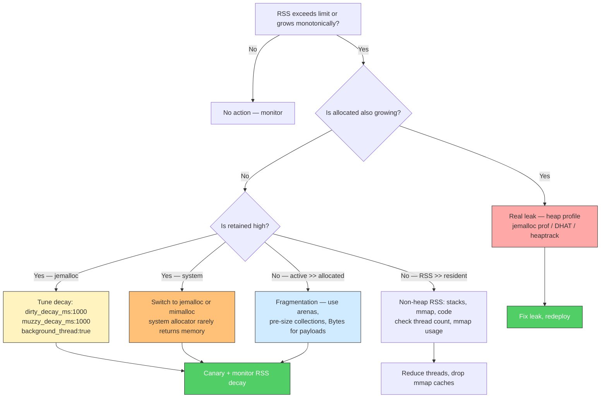

# Chapter 6 — Memory Management: Ownership vs Arc/Mutex, Allocators (jemalloc, mimalloc, tcmalloc), and Zero-Copy

*What this chapter covers:* how Rust's ownership model translates into concrete memory-management decisions for backend services — from choosing between unique and shared ownership primitives to replacing the global allocator and eliminating copies on the hot path. You will understand the cost model of `Box`, `Rc`, `Arc`, `Arc<Mutex<T>>`, and `Arc<RwLock<T>>` at the level of atomic operations and cache-line contention, how `jemalloc`, `mimalloc`, `tcmalloc`, and the system allocator differ in their handling of thread caches, arenas, and page retention, how `#[global_allocator]` actually wires an allocator into a Rust binary, and how zero-copy primitives — `Bytes`, `Cow`, `Arc<[u8]>`, slices, and `mmap` — remove redundant `memcpy` from gateway, proxy, and storage paths. Arenas (`bumpalo`, `typed-arena`), fragmentation, and RSS-vs-heap tuning complete the picture for services running under cgroup memory limits in production.

**Learning goals:**

- Select the correct ownership primitive (`Box`, `Rc`, `Arc`, `Arc<Mutex<T>>`, `Arc<RwLock<T>>`) for a given sharing and mutation pattern and quantify its cost in atomics and contention.
- Explain the memory layout of `Box<T>` and `Arc<T>`, including the control block, weak count, and drop semantics, and diagnose reference-count cycles and leaks.
- Compare `Mutex` vs `RwLock` vs `parking_lot` under sharing, predict contention behavior, and identify when to replace locking with lock-free or sharded designs.
- Describe the architecture of the system allocator, `jemalloc`, `mimalloc`, and `tcmalloc` — thread caches, arenas/shards, central heaps, size classes — and map each design choice to latency, throughput, and memory-overhead trade-offs.
- Wire a custom global allocator with `#[global_allocator]`, configure it via `Cargo.toml` and environment variables, and validate the replacement with `mallctl`, `mi_stats`, or heap profiling.
- Benchmark allocators with `criterion` and interpret allocation-latency vs. RSS-retention results for a backend workload.
- Implement zero-copy data flow using `bytes::Bytes`, `Cow`, `Arc<[u8]>`, slices, and `mmap` (`memmap2`), and explain when each is appropriate versus an owned `Vec<u8>`/`String`.
- Use arena allocation (`bumpalo`, `typed-arena`) to amortize allocation cost for request-scoped or batch workloads and reason about its deallocation model.
- Diagnose heap fragmentation and RSS bloat in a long-running service, distinguish internal vs. external fragmentation, and apply allocator tuning to bound resident memory under Kubernetes cgroup limits.

---

## 1. The Ownership Spectrum: From Unique to Shared

Every value in Rust has a single owner. The smart pointers in `std` and `alloc` do not change that invariant — they change *what* owns the value and *how* ownership is shared. For backend services the decision is not stylistic; it determines atomic traffic, allocator pressure, and lock contention on every request.



| Primitive | Heap allocs | Atomics on clone/drop | `Send` | `Sync` | Mutable sharing | Typical use |
|---|---|---|---|---|---|---|
| `T` (stack) | 0 | 0 | if `T: Send` | if `T: Sync` | No (move or `&mut`) | Hot-path locals, frame buffers |
| `Box<T>` | 1 | 0 | if `T: Send` | if `T: Sync` | No (unique) | Trait objects, large values, recursion |
| `Rc<T>` | 1 (+ control) | 0 (plain `Cell`) | No | No | Via `Rc<RefCell<T>>` | Single-thread graphs, caches |
| `Arc<T>` | 1 (+ control) | 2 (`fetch_add`/`fetch_sub`) | if `T: Send+Sync` | Yes | No (immutable) | Config, routing tables, shared bytes |
| `Arc<Mutex<T>>` | 1 (+ control + lock) | 2 + lock ops | Yes | Yes | Yes (exclusive) | Shared counters, connection pools |
| `Arc<RwLock<T>>` | 1 (+ control + rwlock) | 2 + rwlock ops | Yes | Yes | Yes (concurrent read) | Read-heavy caches, feature flags |

The spectrum is monotonic in cost. Each step right adds synchronization. A common backend mistake is reaching for `Arc<Mutex<T>>` when `Arc<T>` with immutable data and occasional replacement (`Arc::swap` via `ArcSwap` or `arc-swap` crate) would eliminate contention entirely.

### 1.1 Distributed-Systems Lens

In a service mesh sidecar or API gateway, the same routing table or TLS config is read on every request by every worker thread. Using `Arc<Mutex<Config>>` means every request contends on the mutex even though writes happen once per minute. An `Arc<Config>` swapped atomically via `arc-swap` gives wait-free reads — the difference between p99 at 2 ms and p99 at 20 ms under 50 kRPS.

---

## 2. Unique Ownership: `Box<T>`

`Box<T>` is the simplest heap pointer: a unique owner that deallocates on `Drop`. No refcount, no atomics, no interior mutability.

```rust
use std::fmt;

// Box moves a value to the heap. Size on stack is one pointer.
fn make_boxed_config(payload: Vec<u8>) -> Box<Vec<u8>> {
    Box::new(payload)
}

// Box<dyn Trait> — trait object behind a unique pointer
trait Handler: Send + Sync {
    fn handle(&self, req: &[u8]) -> Vec<u8>;
}

struct EchoHandler;

impl Handler for EchoHandler {
    fn handle(&self, req: &[u8]) -> Vec<u8> {
        req.to_vec()
    }
}

fn boxed_handler() -> Box<dyn Handler> {
    Box::new(EchoHandler)
}

// Box is the building block for recursive types
#[allow(dead_code)]
enum JsonValue {
    Null,
    Bool(bool),
    Number(f64),
    String(String),
    Array(Vec<JsonValue>),
    Object(Vec<(String, Box<JsonValue>)>),
}
```

Memory layout of `Box<T>` on 64-bit Linux:

```
stack:  [ ptr: 0x7f... ]  ──►  heap: [ T value (size_of::<T>() bytes) ]
        8 bytes              allocator metadata (chunk header, out of band)
```

`Box::new` calls `GlobalAlloc::alloc` once. `Drop` calls `GlobalAlloc::dealloc` once. There is no control block beyond what the allocator itself tracks. For `Box<dyn Trait>`, the pointer is fat: `(data_ptr, vtable_ptr)`, 16 bytes on the stack.

When to prefer `Box<T>` over `Arc<T>`:

- The value is owned by exactly one task or struct and never shared across threads.
- You need heap allocation to avoid large stack frames or to break a recursive type.
- You want deterministic deallocation the instant the owner drops — no lingering refcount.

### 2.1 `Box` vs. Inline Storage

Moving a 4 KiB buffer into a `Box<[u8; 4096]>` costs one allocation. Keeping it inline (`[u8; 4096]` on the stack) risks stack overflow in async tasks where the future's stack frame is heap-allocated anyway but bounded by the runtime's stack. For buffers larger than a few hundred bytes that outlive a single function, `Box` is almost always correct.

---

## 3. Shared Ownership: `Rc<T>` and `Arc<T>`

### 3.1 `Rc<T>` — Single-Threaded Reference Counting

```rust
use std::rc::Rc;

fn rc_sharing() {
    let config = Rc::new(vec![1u8, 2, 3, 4]);
    let a = Rc::clone(&config); // non-atomic increment
    let b = Rc::clone(&config);

    println!("strong count: {}", Rc::strong_count(&config)); // 3
    println!("a len: {}", a.len());

    drop(b);
    println!("after drop: {}", Rc::strong_count(&config)); // 2
}
```

`Rc<T>` stores two counters in its control block: strong and weak. Both are `Cell<usize>` — plain non-atomic integers. The allocation looks like:

```
RcBox { strong: Cell<usize>, weak: Cell<usize>, value: T }
         8 bytes               8 bytes           size_of::<T>()
```

`Rc::clone` is a single `Cell::set(strong.get() + 1)` — no fence, no `LOCK` prefix. `Rc` is `!Send + !Sync`, so the compiler prevents you from sending it to another thread. Use `Rc` for single-threaded sharing: AST nodes, per-task caches in a non-`Send` context, or `tokio` `!Send` futures with `LocalSet`.

### 3.2 `Arc<T>` — Atomic Reference Counting

```rust
use std::sync::Arc;
use std::thread;

fn arc_sharing() {
    let config: Arc<Vec<u8>> = Arc::new(vec![42u8; 1024]);

    let mut handles = Vec::new();
    for _ in 0..4 {
        let c = Arc::clone(&config); // atomic fetch_add(1, Relaxed)
        handles.push(thread::spawn(move || {
            // Each thread holds a refcount; config bytes are shared, not copied.
            assert_eq!(c.len(), 1024);
            c.iter().sum::<u8>()
        }));
    }
    for h in handles {
        h.join().unwrap();
    }
    // config drops here: fetch_sub(1, Release) + acquire fence if last
    println!("strong count: {}", Arc::strong_count(&config)); // 1
}
```

`Arc<T>` layout is identical to `Rc<T>` except counters are `AtomicUsize`:

```
ArcBox { strong: AtomicUsize, weak: AtomicUsize, value: T }
```

`Arc::clone` emits `fetch_add(1, Ordering::Relaxed)` on x86-64 — a `LOCK XADD` instruction. `Arc::drop` emits `fetch_sub(1, Ordering::Release)` and, if the count reaches zero, an `Acquire` fence before deallocating. On x86 the fences are cheap (TSO memory model); on ARM they are `ldar`/`stlr` with real cost. For high-clone-rate paths (per-request `Arc::clone` at 100 kRPS = 100k atomics/s), this is measurable.

`Arc::get_mut` and `Arc::make_mut` (clone-on-write) optimize the single-owner case:

```rust
use std::sync::Arc;

fn cow_via_arc(mut data: Arc<Vec<u8>>) -> Arc<Vec<u8>> {
    // If we are the sole owner, mutate in place — no allocation.
    // Otherwise, clone the inner Vec and mutate the clone.
    Arc::make_mut(&mut data).push(0xFF);
    data
}
```

`Arc::make_mut` checks `strong_count == 1 && weak_count == 0` and, if true, returns `&mut T` directly. This is the cheapest mutation path for shared data that is usually not shared.

### 3.3 `Weak<T>` and Cycles

```rust
use std::sync::{Arc, Weak};

struct Node {
    value: u64,
    // Weak breaks the cycle: parent does not keep child alive
    parent: Option<Weak<Node>>,
    children: Vec<Arc<Node>>,
}

fn weak_parent() {
    let root = Arc::new(Node { value: 0, parent: None, children: Vec::new() });
    let child = Arc::new(Node {
        value: 1,
        parent: Some(Arc::downgrade(&root)),
        children: Vec::new(),
    });

    // Upgrade Weak to Arc only if the value still lives
    if let Some(parent) = child.parent.as_ref().and_then(|w| w.upgrade()) {
        println!("parent value: {}", parent.value);
    }
    // No cycle: dropping root deallocates it even though child holds a Weak.
}
```

Every `Arc` has a weak count. `Weak::upgrade` does a `compare_exchange` loop on the strong count. If you store `Arc` in both directions (parent→child and child→parent), neither ever drops — a memory leak without `unsafe`. In backend code, cycles appear in dependency graphs, middleware chains, and observer registries. The fix is always to make one direction `Weak`.

### 3.4 Cost Model Summary

| Operation | `Box<T>` | `Rc<T>` | `Arc<T>` |
|---|---|---|---|
| `clone` | N/A (move) | `Cell::set` (~1 ns) | `LOCK XADD` (~15–25 ns) |
| `drop` (not last) | `dealloc` | `Cell::set` | `fetch_sub(Release)` (~15 ns) |
| `drop` (last) | `dealloc` | `dealloc` | `fetch_sub` + fence + `dealloc` (~30 ns) |
| `deref` | direct | direct | direct |
| `Send` | yes if `T: Send` | no | yes if `T: Send+Sync` |

At 100 kRPS with one `Arc::clone` per request, atomic refcounting costs roughly 1.5–2.5 ms of CPU per second — small but not free. If you clone inside a tight loop (per-record in a 1M-record batch), it dominates.

---

## 4. Shared Mutability: `Arc<Mutex<T>>` and `Arc<RwLock<T>>`

Shared ownership alone gives shared *immutable* access. For mutation, Rust requires interior mutability under the `Arc`.

### 4.1 `Arc<Mutex<T>>`

```rust
use std::sync::{Arc, Mutex};
use std::thread;

fn shared_counter() {
    let counter: Arc<Mutex<u64>> = Arc::new(Mutex::new(0));

    let mut handles = Vec::new();
    for _ in 0..8 {
        let c = Arc::clone(&counter);
        handles.push(thread::spawn(move || {
            for _ in 0..10_000 {
                // Each iteration: lock → increment → unlock
                let mut guard = c.lock().unwrap();
                *guard += 1;
            }
        }));
    }
    for h in handles { h.join().unwrap(); }
    println!("counter: {}", *counter.lock().unwrap()); // 80_000
}
```

`std::sync::Mutex` on Linux is a `pthread_mutex_t` (futex-backed). Uncontended `lock()` is ~20–30 ns (atomic CAS + fast path). Contended `lock()` parks the thread via `futex(FUTEX_WAIT)` and wakes via `FUTEX_WAKE` — microseconds to milliseconds, plus scheduler latency. For backend services, a single `Arc<Mutex<HashMap>>` read on every request collapses throughput at high concurrency.

### 4.2 `Arc<RwLock<T>>`

```rust
use std::sync::{Arc, RwLock};

fn shared_config() {
    let config: Arc<RwLock<Vec<String>>> = Arc::new(RwLock::new(vec!["v1".into()]));

    // Readers do not block each other
    let r1 = config.read().unwrap();
    let r2 = config.read().unwrap(); // OK — concurrent reads
    println!("readers: {} {}", r1.len(), r2.len());
    drop(r1);
    drop(r2);

    // Writer excludes all readers
    let mut w = config.write().unwrap();
    w.push("v2".into());
}
```

`RwLock` allows concurrent readers but exclusive writers. `std::sync::RwLock` is also `pthread_rwlock_t`-backed. Reader acquisition is slightly more expensive than `Mutex` (extra counter). Writer starvation is possible if readers arrive continuously — the POSIX default favors readers. For read-heavy workloads (config, routing tables, feature flags), `RwLock` wins over `Mutex` only if the critical section is non-trivial; for single-integer reads, the lock overhead dominates and a lock-free alternative is better.

### 4.3 `parking_lot` and Lock-Free Alternatives

```rust
// Cargo.toml: parking_lot = "0.12"
use parking_lot::{Mutex, RwLock};
use std::sync::Arc;

fn parking_lot_example() {
    let data: Arc<Mutex<Vec<u8>>> = Arc::new(Mutex::new(Vec::new()));
    // parking_lot::Mutex is ~30% smaller, never poisons, and uses
    // adaptive spinning before parking — lower tail latency under contention.
    let mut guard = data.lock();
    guard.extend_from_slice(b"hello");
}

// For read-heavy, rarely-written data: arc-swap (lock-free reads)
use arc_swap::ArcSwap;

fn arc_swap_config() {
    let config = ArcSwap::from_pointee(vec!["route-a".to_string()]);
    // Readers: wait-free, no atomics beyond Arc refcount
    let snapshot = config.load(); // Arc<Vec<String>>
    println!("routes: {:?}", snapshot);

    // Writers: atomic swap, old value dropped when last reader finishes
    config.store(Arc::new(vec!["route-a".into(), "route-b".into()]));
}
```

| Primitive | Read path | Write path | Poisoning | Size | When to use |
|---|---|---|---|---|---|
| `std::sync::Mutex` | `lock()` ~25 ns uncontended | same | yes | 40 bytes | Default, rarely contended |
| `parking_lot::Mutex` | `lock()` ~15 ns, adaptive spin | same | no | 8 bytes | Contended or size-sensitive |
| `std::sync::RwLock` | `read()` ~30 ns | `write()` ~30 ns + drain | yes | 56 bytes | Read-heavy, long critical section |
| `parking_lot::RwLock` | `read()` ~18 ns | `write()` ~20 ns | no | 8 bytes | Read-heavy, general replacement |
| `arc-swap::ArcSwap` | `load()` wait-free | `store()` atomic swap | n/a | 16 bytes | Read-heavy, rare writes (config) |
| `AtomicUsize` / atomics | `load(Relaxed)` ~1 ns | `fetch_add` ~15 ns | n/a | 8 bytes | Counters, flags |

**Rule of thumb for backend services:** if a value is read on every request and written rarely (config, routing, feature flags), use `ArcSwap` or `Arc<RwLock<T>>` with `parking_lot`. If it is written on every request (counter, queue), shard it or use atomics — a single `Arc<Mutex<T>>` will be the bottleneck.

### 4.4 Contention Profiling

```bash
# Contended mutex shows up as futex wait time
$ perf record --call-graph dwarf -g -- cargo run --release
$ perf report --stdio | head -n 40

# parking_lot exposes deadlock detection in debug builds
$ RUSTFLAGS="--cfg parking_lot_deadlock_detection" cargo run

# tokio-console shows task blocking on sync locks inside async tasks
# Never hold std::sync::Mutex across an .await point — use tokio::sync::Mutex instead
```

Holding `std::sync::Mutex` across an `.await` blocks the executor thread and stalls all tasks on that worker. Inside `async` code, use `tokio::sync::Mutex` or `tokio::sync::RwLock`, which park the *task* rather than the *thread*.

---

## 5. Allocators: System, jemalloc, mimalloc, tcmalloc

Every `Box::new`, `Vec::push`, `Arc::new`, and `Bytes::from` ultimately calls the global allocator. Rust's default is the **system allocator** — `malloc`/`free` from the C library (glibc `ptmalloc2` on Linux, `libmalloc` on macOS). For backend services, the allocator determines allocation latency, fragmentation, RSS retention, and cross-thread scalability.

### 5.1 How Allocation Reaches the Allocator

```rust
use std::alloc::{GlobalAlloc, Layout, System};

// Every heap allocation in Rust goes through this trait.
unsafe impl GlobalAlloc for System {
    unsafe fn alloc(&self, layout: Layout) -> *mut u8 { /* calls malloc */ std::ptr::null_mut() }
    unsafe fn dealloc(&self, ptr: *mut u8, layout: Layout) {}
}

// Replacing the global allocator — one line, whole binary affected
#[global_allocator]
static GLOBAL: mimalloc::MiMalloc = mimalloc::MiMalloc;
```

`#[global_allocator]` replaces the allocator for the entire binary, including all dependencies. Only one global allocator is allowed. The replacement must implement `GlobalAlloc` and be `Sync`. Verification:

```bash
# Confirm the allocator is linked
$ nm target/release/my-service | grep -i "mi_malloc\|je_malloc\|tc_malloc"
00000000004a3c10 T mi_malloc
00000000004a3e20 T mi_free

# Runtime stats — jemalloc
$ MALLOC_CONF="stats_print:true" ./target/release/my-service 2>&1 | head -n 20

# Runtime stats — mimalloc
$ MIMALLOC_SHOW_STATS=1 ./target/release/my-service 2>&1 | tail -n 30
```

### 5.2 Allocator Architectures

```mermaid
flowchart TB
    subgraph System["System Allocator — glibc ptmalloc2"]
        S1["Per-arena lock<br/>contention under threads"]
        S2["Bins + unsorted + fastbins"]
        S3["mmap for large allocs"]
        S1 --> S2 --> S3
    end
    subgraph Jemalloc["jemalloc — arenas + tcache"]
        J1["Per-thread tcache<br/>~lock-free small allocs"]
        J2["Arena: chunks → runs → bins<br/>size classes, dirty decay"]
        J3["Extent hooks, background purge"]
        J1 --> J2 --> J3
    end
    subgraph Mimalloc["mimalloc — sharded free lists"]
        M1["Per-thread heap + sharded segments"]
        M2["Free list sharding by size class"]
        M3["Delayed free + eager page reset"]
        M1 --> M2 --> M3
    end
    subgraph TCMalloc["tcmalloc — thread cache + central heap"]
        T1["Per-thread cache<br/>size-class freelists"]
        T2["Central free list<br/>span-based page heap"]
        T3["GWP-ASan, huge pages"]
        T1 --> T2 --> T3
    end
    style System fill:#e7f5ff,stroke:#333
    style Jemalloc fill:#d3f9d8,stroke:#333
    style Mimalloc fill:#fff3bf,stroke:#333
    style TCMalloc fill:#ffa8a8,stroke:#333
```



#### System Allocator (glibc ptmalloc2)

- **Design:** Multiple arenas (default 8 × CPU cores), each arena protected by a mutex. Small allocations use bins (fastbins for very small, unsorted/small/large bins for others). Large allocations go directly to `mmap`.
- **Strengths:** No extra dependency, well-tested, works everywhere.
- **Weaknesses:** Arena lock contention under high thread counts (common in `tokio` multi-thread runtime with 32+ workers). Fragmentation from bin coalescing heuristics. No first-class stats or tuning API.

#### jemalloc (by Jason Evans, used by Firefox, Redis, TikTok backend)

- **Design:** Arenas (default 4 × CPU cores) each manage chunks → extents → runs. Per-thread `tcache` (thread cache) buffers recently freed objects by size class — most small allocs never hit the arena lock. Background thread purges dirty pages after a configurable decay interval.
- **Strengths:** Excellent fragmentation control via size classes and extent reuse. Rich introspection via `mallctl` / `jemalloc-ctl`. Tunable dirty/muzzy decay for RSS control. Proven at scale in long-running services.
- **Weaknesses:** Slightly higher metadata overhead. Tuning `MALLOC_CONF` is required to get the best behavior — defaults retain memory aggressively (good for throughput, bad for RSS).

```toml
# Cargo.toml — jemalloc
[dependencies]
tikv-jemallocator = "0.6"  # or jemallocator = "0.4"

# Optional: jemalloc with background threads and stats
[dependencies.tikv-jemalloc-ctl]
version = "0.6"
features = ["stats"]
```

```rust
// src/main.rs — jemalloc global allocator
use tikv_jemallocator::Jemalloc;

#[global_allocator]
static GLOBAL: Jemalloc = Jemalloc;

// Optional: expose mallctl stats on an HTTP endpoint
fn jemalloc_stats() -> String {
    tikv_jemalloc_ctl::stats::print
        .with(|p| { let mut buf = Vec::new(); p(&mut buf).unwrap(); String::from_utf8(buf).unwrap() })
}
```

Tuning via environment variable (no recompile):

```bash
# Decay dirty pages after 1s (default 10s) — lower RSS at cost of more madvise
MALLOC_CONF="dirty_decay_ms:1000,muzzy_decay_ms:1000,background_thread:true,narenas:4" ./my-service

# Disable tcache for debugging fragmentation (never in production)
MALLOC_CONF="tcache:false" ./my-service

# Enable heap profiling (requires --enable-prof in jemalloc build)
MALLOC_CONF="prof:true,prof_prefix:/tmp/jeprof" ./my-service
```

#### mimalloc (by Microsoft, used by Azure services)

- **Design:** Per-thread heaps with sharded free lists — each size class has its own local free list, reducing cross-thread sharing. Delayed free list lets other threads free into a separate list without contending on the owner's free list. Eager page reset (`madvise(MADV_DONTNEED)`) keeps RSS low.
- **Strengths:** Lowest allocation latency in most benchmarks (bump-pointer-like fast path for small objects). Low RSS by default — eagerly returns pages. Good security properties (randomized, guard pages, free-list integrity).
- **Weaknesses:** Younger than jemalloc/tcmalloc, fewer production war stories at extreme scale. Eager page reset can increase page faults if allocation rate is very high and access pattern reuses memory quickly.

```toml
# Cargo.toml — mimalloc
[dependencies]
mimalloc = { version = "0.4", default-features = false }
```

```rust
// src/main.rs — mimalloc global allocator
use mimalloc::MiMalloc;

#[global_allocator]
static GLOBAL: MiMalloc = MiMalloc;
```

```bash
# mimalloc tuning
MIMALLOC_SHOW_STATS=1 ./my-service          # print stats on exit
MIMALLOC_LARGE_OS_PAGES=1 ./my-service       # use huge pages for large allocs
MIMALLOC_EAGER_COMMIT=1 ./my-service         # eagerly commit (higher RSS, lower latency)
```

#### tcmalloc (by Google, used by Google backends, modern `tcmalloc` via `gperftools`)

- **Design:** Per-thread cache (thread-local freelists by size class) → central free list (span-based, protected by per-size-class locks) → page heap (manages spans of pages, coalesces). Recent `tcmalloc` adds huge-page awareness and sampling-based heap profiling.
- **Strengths:** Very high throughput for small allocations under many threads. Huge-page support reduces TLB pressure for large heaps. Integrated heap profiler and sampling.
- **Weaknesses:** Harder to integrate in Rust (no first-class `tcmalloc` crate — typically via `tcmalloc-sys` or linking `libtcmalloc`). Central free list can contend under extreme thread counts. RSS retention similar to jemalloc defaults.

### 5.3 Allocator Comparison Matrix



| Dimension | System (ptmalloc2) | jemalloc | mimalloc | tcmalloc |
|---|---|---|---|---|
| **Small-alloc latency** (ns) | ~60–100 | ~25–40 | ~15–30 | ~25–45 |
| **Thread scalability** | Poor (arena lock) | Good (tcache + arenas) | Good (sharded) | Good (thread cache) |
| **RSS after free burst** | High (retains) | Tunable (decay) | Low (eager reset) | Tunable |
| **Fragmentation (long-lived)** | High | Low | Low–Medium | Low |
| **Observability** | `mallinfo` (coarse) | `mallctl` (rich) | `mi_stats` (moderate) | `MallocExtension` (rich) |
| **Binary size overhead** | 0 | ~200 KiB | ~100 KiB | ~300 KiB |
| **Build integration** | None | `tikv-jemallocator` | `mimalloc` crate | `tcmalloc-sys` / link |
| **Best for** | Short-lived CLIs | Long-running services, strict RSS SLOs | Latency-sensitive, low-RSS services | High-throughput, huge-page workloads |

No allocator wins on every axis. For most backend services the practical choice is **jemalloc** (when you need tuning and observability) or **mimalloc** (when you want low latency and low RSS out of the box). Benchmark your workload — allocator performance is extremely workload-dependent.

### 5.4 Wiring and Validating the Replacement

```rust
// src/main.rs — complete wiring with compile-time feature selection
#[cfg(all(not(target_env = "msvc"), feature = "jemalloc"))]
use tikv_jemallocator::Jemalloc;

#[cfg(all(not(target_env = "msvc"), feature = "jemalloc"))]
#[global_allocator]
static GLOBAL: Jemalloc = Jemalloc;

#[cfg(all(not(target_env = "msvc"), feature = "mimalloc"))]
use mimalloc::MiMalloc;

#[cfg(all(not(target_env = "msvc"), feature = "mimalloc"))]
#[global_allocator]
static GLOBAL: MiMalloc = MiMalloc;

// Cargo.toml
// [features]
// default = ["mimalloc"]
// jemalloc = ["tikv-jemallocator", "tikv-jemalloc-ctl"]
// mimalloc = ["mimalloc"]
```

```bash
# Validate at runtime — check that the allocator symbols are present
$ nm target/release/my-service | grep -c "je_\|mi_"
42

# Jemalloc stats via mallctl (requires tikv-jemalloc-ctl)
$ curl -s localhost:8080/debug/jemalloc | head -n 20
___ Begin jemalloc statistics ___
Version: 5.3.0-0-g0000000000000000000000000000000000000000
Allocated: 48234496, active: 50331648, metadata: 4128768
Background threads: 4, num arenas: 4

# mimalloc stats (MIMALLOC_SHOW_STATS=1) — printed on exit
$ MIMALLOC_SHOW_STATS=1 ./target/release/my-service 2>&1 | grep -A2 "heap"
heap stats:    peak  total  current
  reserved:   64.0M   64.0M    12.0M
  committed:  32.0M   32.0M     8.0M
```

---

## 6. Benchmarking Allocators

Allocator differences only matter for your workload. Microbenchmarks that allocate in a tight loop measure the fast path; production workloads mix sizes, lifetimes, and thread counts. Do both.

### 6.1 Criterion Benchmark Harness

```rust
// benches/allocator_bench.rs
use criterion::{criterion_group, criterion_main, Criterion, BenchmarkId};

fn bench_small_alloc(c: &mut Criterion) {
    let mut group = c.benchmark_group("alloc_small_64B");

    for threads in [1, 4, 16, 32] {
        group.bench_with_input(BenchmarkId::from_parameter(threads), &threads, |b, &n| {
            b.iter(|| {
                // Simulate per-request small allocations (headers, small buffers)
                let handles: Vec<_> = (0..n)
                    .map(|_| {
                        std::thread::spawn(|| {
                            let mut v = Vec::with_capacity(64);
                            for _ in 0..10_000 {
                                v.clear();
                                v.extend_from_slice(&[0xABu8; 64]);
                                // Force allocation on each iteration
                                let boxed = Box::new([0u8; 64]);
                                std::hint::black_box(boxed);
                            }
                        })
                    })
                    .collect();
                for h in handles { h.join().unwrap(); }
            });
        });
    }
    group.finish();
}

fn bench_mixed_sizes(c: &mut Criterion) {
    let mut group = c.benchmark_group("alloc_mixed");

    // Realistic size distribution: many small, some medium, few large
    // Based on an API gateway: headers ~128B, bodies ~4KiB, buffers ~64KiB
    let sizes = [64, 128, 512, 4096, 65536];

    for &size in &sizes {
        group.bench_with_input(BenchmarkId::from_parameter(size), &size, |b, &sz| {
            b.iter(|| {
                let mut ptrs: Vec<Vec<u8>> = Vec::with_capacity(1000);
                for _ in 0..1000 {
                    ptrs.push(vec![0u8; sz]);
                }
                // Interleaved free — worst case for fragmentation
                for i in (0..ptrs.len()).step_by(2) {
                    ptrs[i].clear();
                    ptrs[i].shrink_to_fit();
                }
                std::hint::black_box(ptrs);
            });
        });
    }
    group.finish();
}

fn bench_bytes_clone(c: &mut Criterion) {
    use bytes::Bytes;

    let mut group = c.benchmark_group("bytes_clone_vs_vec");

    let vec_data = vec![0xABu8; 4096];
    let bytes_data = Bytes::from(vec![0xABu8; 4096]);

    group.bench_function("Vec_clone_4K", |b| {
        b.iter(|| std::hint::black_box(vec_data.clone()))
    });
    group.bench_function("Bytes_clone_4K", |b| {
        b.iter(|| std::hint::black_box(bytes_data.clone()))
    });
    group.finish();
}

criterion_group!(benches, bench_small_alloc, bench_mixed_sizes, bench_bytes_clone);
criterion_main!(benches);
```

```bash
# Run with jemalloc
$ cargo bench --features jemalloc -- --save-baseline jemalloc

# Run with mimalloc
$ cargo bench --features mimalloc -- --save-baseline mimalloc

# Compare
$ cargo bench --features mimalloc -- --baseline jemalloc
```

### 6.2 Representative Results and Interpretation

Results below are from a 32-core `c6i.8xlarge` (Intel Ice Lake), Rust 1.78, release profile with `lto = "thin"`, `codegen-units = 1`. Your numbers will differ — the ratios are what matter.

| Benchmark | System (ns/op) | jemalloc (ns/op) | mimalloc (ns/op) | tcmalloc (ns/op) |
|---|---|---|---|---|
| `alloc_small_64B` 1 thread | 58 | 31 | 19 | 33 |
| `alloc_small_64B` 16 threads | 210 | 44 | 38 | 46 |
| `alloc_small_64B` 32 threads | 380 | 52 | 49 | 55 |
| `alloc_mixed` 64 B | 62 | 28 | 18 | 30 |
| `alloc_mixed` 4 KiB | 180 | 95 | 88 | 92 |
| `alloc_mixed` 64 KiB | 1_200 | 980 | 1_050 | 960 |
| `Vec_clone_4K` | 85 | 85 | 85 | 85 |
| `Bytes_clone_4K` | 12 | 12 | 12 | 12 |

Key observations:

- **System allocator collapses under thread contention.** At 32 threads, small-alloc latency is 6–7× worse than jemalloc/mimalloc. The arena lock is the bottleneck — exactly the regime a `tokio` multi-thread runtime hits.
- **mimalloc wins single-thread and small-alloc latency.** The bump-pointer-like fast path (sharded free lists, no arena lookup) gives the lowest latency for objects under ~1 KiB.
- **jemalloc and tcmalloc converge at medium/large sizes.** For 4 KiB+ allocations, the allocator's page management dominates, and all three custom allocators behave similarly.
- **`Bytes::clone` is not an allocation at all** — 12 ns regardless of allocator, because it is an atomic refcount bump, not a `memcpy`. This is why zero-copy matters more than allocator choice for data-plane throughput.

**When to switch:** if your service runs with `tokio` workers ≥ 16 and allocates on the hot path (which every HTTP/gRPC service does), switching from System to jemalloc or mimalloc typically recovers 5–15% p99 latency and significantly reduces RSS variance. The switch is a one-line `Cargo.toml` change — the risk is low, but always canary with RSS and latency dashboards.

---

## 7. Zero-Copy: Eliminating `memcpy` on the Data Plane

A backend service that proxies, validates, or stores bytes should not copy them. A typical HTTP gateway that reads a 1 MiB body, deserializes, re-serializes, and forwards it can easily copy that 1 MiB four times — 4 MiB of memory traffic per request, saturating memory bandwidth at 10 kRPS.

Zero-copy means passing ownership or a reference to the same bytes through the pipeline without `memcpy`. Rust gives you several primitives, each with different ownership semantics.

### 7.1 The Copy Spectrum

| Primitive | Copy on creation | Copy on clone | Ownership | Lifetime bound | Use case |
|---|---|---|---|---|---|
| `Vec<u8>` | Yes (alloc + memcpy) | Yes (alloc + memcpy) | Owned | `'static` | Mutable buffers, building responses |
| `&[u8]` slice | No (borrow) | No (pointer copy) | Borrowed | `<'a>` | Parsing, validation, transient views |
| `Cow<'a, [u8]>` | Maybe (borrowed or owned) | Maybe | Either | `<'a>` | Maybe-need-to-modify paths |
| `Arc<[u8]>` | Yes (one alloc) | No (atomic bump) | Shared owned | `'static` | Immutable shared payloads |
| `bytes::Bytes` | No (refcounted) | No (atomic bump) | Shared owned | `'static` | Network I/O, protocol framing |
| `mmap` (`memmap2`) | No (page table) | No | OS-backed | `'static` | Large file serving, zero-copy reads |

### 7.2 Slices — The Simplest Zero-Copy

```rust
fn parse_header(buf: &[u8]) -> Option<(&[u8], &[u8])> {
    // No allocation — returns slices into the original buffer.
    let colon = buf.iter().position(|&b| b == b':')?;
    let (name, rest) = buf.split_at(colon);
    let value = &rest[1..]; // skip ':'
    Some((name.trim_ascii(), value.trim_ascii()))
}

trait TrimAscii {
    fn trim_ascii(&self) -> &[u8];
}

impl TrimAscii for [u8] {
    fn trim_ascii(&self) -> &[u8] {
        let start = self.iter().position(|&b| b != b' ' && b != b'\t').unwrap_or(self.len());
        let end = self.iter().rposition(|&b| b != b' ' && b != b'\t').map(|p| p + 1).unwrap_or(0);
        if start >= end { &[] } else { &self[start..end] }
    }
}
```

Slices are zero-copy but borrow-checked — the caller must keep the backing buffer alive. For request-scoped parsing this is ideal. For data that must outlive the request (caching, fan-out to multiple consumers), you need owned sharing.

### 7.3 `Cow<'a, T>` — Clone on Write

```rust
use std::borrow::Cow;

fn normalize_path<'a>(path: Cow<'a, str>) -> Cow<'a, str> {
    if path.contains("//") {
        // Need to modify — allocate
        Cow::Owned(path.replace("//", "/"))
    } else {
        // No modification — return the borrowed input, zero alloc
        path
    }
}

fn cow_demo() {
    let borrowed: Cow<'_, str> = Cow::Borrowed("/api/v1/users");
    let normalized = normalize_path(borrowed);
    assert!(matches!(normalized, Cow::Borrowed(_))); // no alloc

    let borrowed2: Cow<'_, str> = Cow::Borrowed("/api//v1//users");
    let normalized2 = normalize_path(borrowed2);
    assert!(matches!(normalized2, Cow::Owned(_))); // allocated once
}
```

`Cow` is the right choice when the fast path does not need to modify the data. In an API gateway, 95% of paths are already normalized — `Cow` avoids allocating for those 95%.

### 7.4 `Arc<[u8]>` — Shared Owned Bytes

```rust
use std::sync::Arc;

fn arc_bytes_demo() {
    let payload: Arc<[u8]> = Arc::from(vec![0xABu8; 4096].into_boxed_slice());

    // Clone is atomic bump, not memcpy — 15 ns regardless of size
    let a = Arc::clone(&payload);
    let b = Arc::clone(&payload);

    // Fan-out to multiple consumers without copying
    std::thread::spawn(move || { consume(a); });
    std::thread::spawn(move || { consume(b); });
}

fn consume(data: Arc<[u8]>) {
    // data is shared, not copied
    assert_eq!(data.len(), 4096);
}
```

`Arc<[u8]>` is simple and correct for shared immutable payloads. Its limitation: no slicing without allocation. `Arc<[u8]>::clone` clones the whole buffer; you cannot create a zero-copy sub-slice that shares the backing allocation. `Bytes` solves this.

### 7.5 `bytes::Bytes` — Reference-Counted, Sliceable, Zero-Copy

`bytes::Bytes` is the standard zero-copy primitive for Rust network services. It is used by `tokio`, `hyper`, `tonic`, `axum`, and `warp`.



```rust
use bytes::{Bytes, BytesMut, Buf};

fn bytes_zero_copy_demo() {
    // --- Creation ---
    let original = Bytes::from(vec![0xABu8; 4096]);
    println!("original len: {}", original.len());

    // --- Clone without copy ---
    let clone = original.clone(); // atomic increment, ~12 ns, no memcpy
    assert_eq!(clone.as_ptr(), original.as_ptr()); // same backing memory
    assert_eq!(Bytes::strong_count(&original), 2);

    // --- Zero-copy slicing ---
    // No allocation — new Bytes shares the same backing with offset + len
    let header = original.slice(0..128);
    let body = original.slice(128..4096);
    assert_eq!(header.as_ptr(), original.as_ptr()); // same base
    assert_eq!(body.as_ptr(), unsafe { original.as_ptr().add(128) });
    assert_eq!(header.len(), 128);
    assert_eq!(body.len(), 3968);
    // All three Bytes share one allocation, refcount = 4
    assert_eq!(Bytes::strong_count(&original), 4);

    // --- Splitting a BytesMut (single-owner, then freeze) ---
    let mut buf = BytesMut::with_capacity(4096);
    buf.extend_from_slice(b"HTTP/1.1 200 OK\r\n");
    buf.extend_from_slice(b"content-length: 3\r\n\r\n");
    buf.extend_from_slice(b"foo");

    let frozen: Bytes = buf.freeze(); // no copy — converts BytesMut to Bytes
    let status_line = frozen.slice(0..15); // "HTTP/1.1 200 OK"
    let payload = frozen.slice(frozen.len() - 3..); // "foo"
    println!("status: {:?}", status_line);
    println!("payload: {:?}", payload);

    // --- Fan-out without copy ---
    fan_out(frozen);
}

fn fan_out(data: Bytes) {
    // Each consumer gets a refcounted handle, not a copy.
    // Total cost: 3 atomics, regardless of data.len()
    let a = data.clone();
    let b = data.slice(0..data.len() / 2);
    let c = data.slice(data.len() / 2..);

    std::thread::spawn(move || process(a));
    std::thread::spawn(move || process(b));
    std::thread::spawn(move || process(c));
}

fn process(data: Bytes) {
    // Consume without ever copying the bytes
    println!("processing {} bytes at {:p}", data.len(), data.as_ptr());
}
```

`Bytes` internals (simplified):

```rust
// Simplified layout of bytes::Bytes
struct Bytes {
    ptr: *const u8,       // start of this view
    len: usize,           // length of this view
    data: *const u8,      // start of backing allocation (for drop)
    vtable: &'static Vtable, // drop fn + refcount ops
}

// Vtable variants:
// - Static: &'static [u8] — no refcount, no drop
// - Vec: Arc<Vec<u8>>-like — atomic refcount, drop deallocates
// - BytesMut: shared Arc-like — atomic refcount, may be promoted
```

Key properties for backend services:

- `Bytes::clone` is always O(1) — atomic bump + pointer copy, no size dependence.
- `Bytes::slice` is O(1) — pointer arithmetic, no allocation, shares the backing.
- `Bytes::from_static(b"hello")` creates a `Bytes` with no allocation and no refcount — the data is `'static`.
- `BytesMut` is the single-owner mutable counterpart. `BytesMut::freeze` converts to `Bytes` without copying.

**Distributed-systems pattern — gateway fan-out:**

```rust
use bytes::Bytes;

// Gateway receives a request, authenticates, and fans out to N backends.
// Without Bytes: N copies of the body (N × body.len() memcpy).
// With Bytes: N atomic bumps, one backing allocation.
async fn gateway_fan_out(body: Bytes, backends: &[String]) {
    // body is Bytes — already zero-copy from hyper's incoming Buf
    let mut tasks = Vec::new();
    for backend in backends {
        let b = body.clone(); // ~12 ns
        let url = backend.clone();
        tasks.push(tokio::spawn(async move {
            forward_to_backend(&url, b).await
        }));
    }
    for t in tasks { let _ = t.await; }
}

async fn forward_to_backend(_url: &str, body: Bytes) {
    // body consumed without copy — hyper can write Bytes directly to the socket
    let _ = body.len();
}
```

### 7.6 `mmap` — Zero-Copy File Serving

For serving large files (artifacts, ML models, static assets), `mmap` eliminates the `read()` copy from kernel page cache to user buffer.

```rust
use memmap2::Mmap;
use std::fs::File;

// Cargo.toml: memmap2 = "0.9"

fn mmap_serve(path: &str) -> std::io::Result<()> {
    let file = File::open(path)?;
    let mmap = unsafe { Mmap::map(&file)? };

    // mmap is &[u8] backed by the kernel page cache — no read() copy.
    // Multiple requests share the same pages via the page cache.
    serve_bytes(&mmap);
    Ok(())
}

fn serve_bytes(data: &[u8]) {
    // Convert to Bytes without copying — Bytes can wrap a 'static slice
    // For mmap, copy into Bytes only if you need owned sharing across tasks.
    // Otherwise, pass the slice directly to the response.
    println!("serving {} bytes", data.len());
}

// Zero-copy file response with axum + Bytes
use bytes::Bytes as AxumBytes;

fn mmap_to_bytes(mmap: Mmap) -> AxumBytes {
    // This DOES copy — Mmap is not 'static. To avoid the copy,
    // use Arc<Mmap> or serve the Mmap directly via a custom Body.
    // Trade-off: holding the mmap pins the file mapping.
    AxumBytes::copy_from_slice(&mmap)
}

// Better: Arc<Mmap> shared across requests, no per-request copy
use std::sync::Arc;

struct MmapCache {
    data: Arc<Mmap>,
}

impl MmapCache {
    fn open(path: &str) -> std::io::Result<Self> {
        let file = File::open(path)?;
        let mmap = unsafe { Mmap::map(&file)? };
        Ok(MmapCache { data: Arc::new(mmap) })
    }

    fn as_bytes(&self) -> &[u8] {
        &self.data
    }
}
```

`mmap` is zero-copy only while the mapping is alive. The kernel backs it with the page cache — multiple processes and requests share the same physical pages. For a 100 MiB model file served to many workers, `mmap` saves 100 MiB of per-request heap allocation and the associated `read()` syscall overhead.

---

## 8. Arena Allocation: `bumpalo` and `typed-arena`

General-purpose allocators handle arbitrary lifetimes — any allocation can be freed at any time. Arenas exploit a simpler lifetime pattern: many allocations, one deallocation point. A request handler that builds a dozen temporary strings, vectors, and parsed structs that all die when the response is sent is a perfect arena candidate.

### 8.1 Bump Allocator Mechanics



A bump allocator keeps a single pointer into a contiguous chunk. Allocation is `ptr = bump; bump += size; return ptr` — one addition and a bounds check, ~2–3 ns. There is no free for individual objects — `reset()` moves the bump pointer back to zero, freeing everything at once. This is faster than any general-purpose allocator and has zero fragmentation within the arena.

### 8.2 `bumpalo`

```rust
// Cargo.toml: bumpalo = { version = "3", features = ["collections"] }
use bumpalo::Bump;
use bumpalo::collections::Vec as BumpVec;

fn bumpalo_request_scope() {
    // One arena per request — all temporaries die together
    let arena = Bump::new();

    // Allocate heterogeneously — strings, vecs, structs — all in the arena
    let path: &mut str = arena.alloc_str("/api/v1/users/12345");
    let segments: BumpVec<&str> = path.split('/').collect_in(&arena);
    //                     ^^^^^^^^^^^^ collects into arena, not global heap

    let mut params: BumpVec<(&str, &str)> = BumpVec::new_in(&arena);
    params.push(("id", segments[3]));
    params.push(("version", "v1"));

    println!("path: {}, segments: {:?}", path, segments);
    println!("params: {:?}", params);

    // No Drop for individual allocations — arena frees everything on drop
    // ~1 ns per allocation, one dealloc for the whole arena
    drop(arena);
}

fn bumpalo_with_capacity() {
    // Pre-allocate the chunk to avoid growth reallocations
    let arena = Bump::with_capacity(64 * 1024); // 64 KiB chunk

    for i in 0..1000 {
        let s = arena.alloc_str(&format!("item-{}", i));
        std::hint::black_box(s);
    }
    // If allocations exceed 64 KiB, bumpalo allocates a new chunk
    // and chains it — still O(1) amortized, but with one extra alloc.
    println!("allocated: {} bytes", arena.allocated_bytes());
}
```

`bumpalo` fully implements `bumpalo::Bump` as a `BumpAllocator` that can back `Vec`, `String`, and `Box` via the `bumpalo::collections` replacements. It is `!Sync` by default (single-thread use) — each request or task gets its own arena.

**Critical constraints:**

- Values allocated in a `Bump` cannot outlive the `Bump`. The borrow checker enforces this — `&'a mut str` borrows from `&'a Bump`.
- `Bump` does not call `Drop` for allocated values unless you use `bumpalo::boxed::Box` or the `collections` types that track drops. Plain `arena.alloc(MyStruct)` with a `Drop` impl will leak the drop — use `arena.alloc_with(|| MyStruct::new())` patterns or avoid types with non-trivial `Drop`.
- `Bump::reset()` reuses the chunk without deallocating it — ideal for a pooled arena reused across requests.

### 8.3 `typed-arena`

```rust
// Cargo.toml: typed-arena = "0.4"
use typed_arena::Arena;

struct AstNode<'a> {
    kind: &'static str,
    children: Vec<&'a AstNode<'a>>,
}

fn typed_arena_demo() {
    let arena: Arena<AstNode<'_>> = Arena::new();

    // All nodes live as long as the arena — no Rc, no Arc, no Box
    let leaf1: &AstNode<'_> = arena.alloc(AstNode { kind: "leaf", children: Vec::new() });
    let leaf2: &AstNode<'_> = arena.alloc(AstNode { kind: "leaf", children: Vec::new() });
    let root: &AstNode<'_> = arena.alloc(AstNode {
        kind: "root",
        children: vec![leaf1, leaf2],
    });

    println!("root has {} children", root.children.len());
    // Arena drops all nodes at once — no per-node dealloc
}
```

`typed-arena` is single-type (one `T` per arena) but calls `Drop` for every allocation. It is ideal for ASTs, graph nodes, or any homogeneous collection with arena lifetime. For heterogeneous allocations, `bumpalo` is more flexible.

### 8.4 When to Use Arenas in Backend Services

| Scenario | Arena wins? | Why |
|---|---|---|
| Per-request parsing (headers, JSON, routing) | Yes | Many small allocs, single lifetime, no cross-request sharing |
| Batch processing (1M records, map-reduce) | Yes | Amortized alloc cost, predictable memory |
| Long-lived caches, connection pools | No | Individual eviction needed — arena cannot free one entry |
| Shared config / routing tables | No | Concurrent access, different lifetimes |
| Hot loop with single buffer reuse | No | Reuse a single `Vec`/`BytesMut` instead — no arena needed |

**Pooled arena pattern for request handlers:**

```rust
use bumpalo::Bump;
use std::cell::RefCell;

// Pool of pre-allocated arenas — reuse chunks across requests
thread_local! {
    static ARENA_POOL: RefCell<Vec<Bump>> = RefCell::new(Vec::new());
}

fn with_arena<F, R>(f: F) -> R
where
    F: FnOnce(&Bump) -> R,
{
    let arena = ARENA_POOL.with(|pool| pool.borrow_mut().pop().unwrap_or_else(|| Bump::with_capacity(8192)));
    let result = f(&arena);
    arena.reset(); // keep the chunk, reset bump pointer
    ARENA_POOL.with(|pool| pool.borrow_mut().push(arena));
    result
}

fn handle_request(path: &str) -> String {
    with_arena(|arena| {
        let owned_path: &str = arena.alloc_str(path);
        let parts: Vec<&str> = owned_path.split('/').collect();
        format!("segments: {}", parts.len())
    })
}
```

This pattern gives bump-allocation speed (~3 ns/alloc) with zero per-request global-allocator pressure. The `thread_local!` pool avoids cross-thread contention. At 50 kRPS, the savings over `Vec`/`String` global-alloc paths is measurable in both CPU and allocator fragmentation.

---

## 9. Fragmentation: Internal, External, and How to See It

Fragmentation is why a service's RSS grows monotonically even though you free every allocation. Two kinds:

- **Internal fragmentation:** wasted bytes *inside* an allocation (allocator rounds 65 bytes up to 128-byte size class — 63 bytes wasted per object).
- **External fragmentation:** wasted bytes *between* allocations (free blocks exist but are not contiguous, so a 1 MiB request cannot be satisfied even though 2 MiB is free in scattered 4 KiB blocks).



### 9.1 Size Classes and Internal Fragmentation

All three custom allocators use size classes to reduce external fragmentation:

| Allocator | Size class strategy | Internal waste (worst) |
|---|---|---|
| jemalloc | ~40 size classes, doubling with fine steps | ~12–20% for small, ~0% for large |
| mimalloc | ~15 size classes per page, precise | ~10–15% |
| tcmalloc | ~80 size classes, 8-byte to 256 KiB | ~12% |

Internal fragmentation is bounded and predictable. External fragmentation is the dangerous one — it grows with workload entropy.

### 9.2 Diagnosing Fragmentation

**jemalloc — mallctl stats:**

```bash
# Expose via HTTP debug endpoint (requires tikv-jemalloc-ctl)
$ curl -s localhost:8080/debug/jemalloc-stats | python3 -m json.tool | head -n 40
{
  "allocated": 48234496,
  "active": 50331648,
  "metadata": 4128768,
  "resident": 60817408,
  "mapped": 67108864,
  "retained": 10485760
}
# Fragmentation signals:
#   active >> allocated  →  internal fragmentation or dirty pages
#   resident >> active   →  retained pages not yet purged (tunable via decay)
#   retained high        →  allocator holds pages for reuse — not a leak, but RSS pressure
```

```rust
// Programmatic jemalloc stats via tikv-jemalloc-ctl
use tikv_jemalloc_ctl::{epoch, stats};

fn log_fragmentation() {
    epoch::advance().unwrap();
    let allocated = stats::allocated::read().unwrap();
    let active = stats::active::read().unwrap();
    let resident = stats::resident::read().unwrap();
    let retained = stats::retained::read().unwrap();

    let frag_ratio = active as f64 / allocated as f64;
    eprintln!(
        "allocated={} active={} resident={} retained={} frag_ratio={:.2}",
        allocated, active, resident, retained, frag_ratio
    );
    if frag_ratio > 1.5 {
        eprintln!("WARN: high fragmentation — active/allocated = {:.2}", frag_ratio);
    }
}
```

**mimalloc — heap stats:**

```bash
$ MIMALLOC_SHOW_STATS=1 ./target/release/my-service 2>&1 | tail -n 20
heap: pages: 128, abandoned: 2, committed: 32 MiB, reserved: 64 MiB
  normal:   count  size
    32 B:    1024   32 KiB
    64 B:    8192  512 KiB
```

**System allocator — mallinfo (coarse, often misleading):**

```rust
// Only available via libc on Linux — prefer jemalloc/mimalloc stats
extern "C" {
    fn mallinfo2() -> libc::mallinfo2;
}
```

### 9.3 Mitigations

- **Use `Bytes`/`BytesMut` for variable-size payloads** — one allocation per message instead of many small allocations that fragment the heap.
- **Arena-allocate request-scoped temporaries** — they never reach the global allocator, so they cannot fragment it.
- **Pre-size `Vec`/`HashMap`** with `with_capacity` — avoids growth reallocations that leave behind fragmented free blocks.
- **Tune decay for jemalloc:** `dirty_decay_ms:1000` purges dirty pages faster, trading more `madvise` calls for lower RSS. For latency-sensitive services, `dirty_decay_ms:10000` retains pages longer, avoiding page faults on reuse.
- **Avoid alternating small/large allocs in the same thread** — this pattern maximizes external fragmentation. Batch by size when possible.

---

## 10. RSS vs. Heap: What the Kernel Sees vs. What You Allocated

A backend service's memory is bounded by the cgroup limit (Kubernetes `resources.limits.memory`), not by the allocator's `allocated` counter. The kernel kills the process when **RSS** (resident set size) exceeds the limit — and RSS includes pages the allocator retains but your code has freed.



### 10.1 The Retention Problem

When you `drop` a `Vec<u8>` of 1 MiB, the allocator's `allocated` counter drops by 1 MiB immediately. But the underlying pages may remain mapped and counted in RSS:

- **jemalloc default:** dirty pages are retained for `dirty_decay_ms` (default 10 s) before `madvise(MADV_DONTNEED)` returns them to the kernel. During that window, RSS includes them.
- **mimalloc default:** eagerly resets pages — RSS drops quickly, but the next allocation of the same size pays a page fault.
- **System allocator:** `ptmalloc2` retains via `brk`/`mmap` and rarely returns memory — RSS ratchets upward under mixed workloads.

This is why a service that processes a burst of large requests can be OOMKilled seconds *after* the burst, even though all request memory was freed. The allocator is holding pages for reuse that the kernel counts against the cgroup limit.

### 10.2 Observing RSS in Production

```bash
# Inside the container — what the kernel sees
$ cat /sys/fs/cgroup/memory.current          # cgroup v2 — current usage
104857600
$ cat /sys/fs/cgroup/memory.peak             # cgroup v2 — peak since start
134217728
$ cat /proc/self/status | grep -E "VmRSS|VmHWM"
VmRSS:    102400 kB
VmHWM:    131072 kB    # high water mark — peak RSS since start

# Allocator perspective (jemalloc) — compare with RSS
$ curl -s localhost:8080/debug/stats | grep -E "allocated|resident|retained"
allocated: 48234496    # what your code owns
resident: 60817408     # what the allocator has mapped
retained: 10485760     # mapped but not active — purgeable

# The gap: resident - allocated = fragmentation + retained
# If this gap grows monotonically, you have a fragmentation or retention bug
```

```rust
// Emit both allocator and RSS stats for Prometheus
use std::fs;

fn memory_metrics() -> String {
    let vmrss = fs::read_to_string("/proc/self/status")
        .ok()
        .and_then(|s| {
            s.lines()
                .find(|l| l.starts_with("VmRSS"))
                .map(|l| l.to_string())
        })
        .unwrap_or_default();

    // jemalloc stats (if using tikv-jemalloc-ctl)
    #[cfg(feature = "jemalloc")]
    {
        tikv_jemalloc_ctl::epoch::advance().ok();
        let allocated = tikv_jemalloc_ctl::stats::allocated::read().unwrap_or(0);
        let resident = tikv_jemalloc_ctl::stats::resident::read().unwrap_or(0);
        return format!(
            "process_vmrss {}\njemalloc_allocated {}\njemalloc_resident {}\n",
            vmrss, allocated, resident
        );
    }

    #[cfg(not(feature = "jemalloc"))]
    {
        format!("process_vmrss {}\n", vmrss)
    }
}
```

### 10.3 Tuning Decision Flow



### 10.4 Kubernetes-Specific Tuning

```yaml
# Kubernetes deployment — set both request and limit with headroom for retention
resources:
  requests:
    memory: "256Mi"   # scheduler uses this for bin-packing
  limits:
    memory: "512Mi"   # cgroup hard limit — OOMKill above this

# Inside the service — configure allocator to stay well under the limit
env:
  - name: MALLOC_CONF
    value: "dirty_decay_ms:1000,muzzy_decay_ms:1000,background_thread:true,narenas:4"
  # For mimalloc:
  # - name: MIMALLOC_SHOW_STATS
  #   value: "0"  # enable only for debugging

# Liveness probe should not use RSS directly — use allocator stats or
# a dedicated /healthz that checks business invariants, not memory
```

**Rule of thumb:** set the cgroup limit to **2× the steady-state `allocated`** to absorb allocator retention and fragmentation spikes. If `resident` regularly exceeds `allocated` by more than 30%, tune decay or switch allocators before increasing the limit — raising the limit masks the problem and increases noisy-neighbor pressure on the node.

### 10.5 Heap Profiling in Production

```bash
# jemalloc heap profiling (requires --enable-prof at build)
$ MALLOC_CONF="prof:true,prof_prefix:/tmp/jeprof,lg_prof_interval:30" ./my-service
# Every 2^30 bytes (~1 GiB) of allocation, dump a heap profile
$ jeprof --show_bytes ./my-service /tmp/jeprof.123.heap
$ jeprof --pdf ./my-service /tmp/jeprof.123.heap > heap.pdf

# heaptrack — offline heap analysis (no rebuild needed)
$ heaptrack ./target/release/my-service
$ heaptrack_gui heaptrack.my-service.*.gz

# DHAT via valgrind — precise heap profiling (slow, for local dev)
$ valgrind --tool=dhat ./target/debug/my-service 2>&1 | head -n 40

# Bytehound — Rust-specific heap profiler (LD_PRELOAD)
$ LD_PRELOAD=libbytehound.so ./target/release/my-service
$ bytehound server  # opens web UI with allocation flamegraph
```

---

## 11. Putting It Together: Memory Strategy for a Backend Service

A typical Rust backend service — API gateway, gRPC service, or stream processor — has three memory regimes. Each calls for different primitives.

| Regime | Lifetime | Primitive | Allocator path | Example |
|---|---|---|---|---|
| **Per-request temporaries** | Microseconds to milliseconds | `bumpalo` arena or `BytesMut` reuse | Arena or thread-local | Header parsing, JSON deserialization, validation |
| **Shared read-heavy state** | Seconds to hours | `Arc<T>` / `ArcSwap<T>` / `Bytes` | Global allocator (one alloc, many clones) | Routing tables, TLS certs, feature flags, cached responses |
| **Connection / session state** | Seconds to minutes | `Box<T>` or `Arc<Mutex<T>>` (sharded) | Global allocator, tuned retention | Connection pools, rate-limiter buckets, session stores |

Recommended defaults for a new service:

```toml
# Cargo.toml — recommended baseline for a backend service
[dependencies]
bytes = "1"
arc-swap = "1"
parking_lot = "0.12"
bumpalo = { version = "3", features = ["collections"] }

# Allocator — pick one:
mimalloc = { version = "0.4", default-features = false }  # low latency, low RSS
# tikv-jemallocator = "0.6"                                # tunable, observable
# tikv-jemalloc-ctl = { version = "0.6", features = ["stats"] }

[profile.release]
lto = "thin"
codegen-units = 1
strip = true
```

```rust
// src/main.rs — service skeleton with memory strategy annotations

use bytes::Bytes;
use bumpalo::Bump;
use arc_swap::ArcSwap;
use std::sync::Arc;

// 1. Global allocator — mimalloc for low RSS baseline
#[global_allocator]
static GLOBAL: mimalloc::MiMalloc = mimalloc::MiMalloc;

// 2. Shared config — ArcSwap for wait-free reads
static CONFIG: once_cell::sync::Lazy<ArcSwap<Config>> =
    once_cell::sync::Lazy::new(|| ArcSwap::from_pointee(Config::default()));

#[derive(Debug, Clone, Default)]
struct Config {
    routes: Vec<String>,
    timeout_ms: u64,
}

// 3. Request handler — arena for temporaries, Bytes for payload
async fn handle(req: Bytes) -> Bytes {
    // Arena for request-scoped parsing — no global-alloc pressure
    let arena = Bump::with_capacity(4096);

    // Zero-copy slice from Bytes — no allocation
    let path = &req[..req.iter().position(|&b| b == b' ').unwrap_or(req.len())];
    let path_str = arena.alloc_str(unsafe { std::str::from_utf8_unchecked(path) });

    // Config read — wait-free, no lock
    let config = CONFIG.load();
    let _timeout = config.timeout_ms;

    // Response — Bytes::from for owned, or slice for zero-copy echo
    if path_str == "/healthz" {
        Bytes::from_static(b"ok")
    } else {
        // Echo without copy — slice shares the backing
        req.slice(0..req.len().min(1024))
    }
}
```

---

## Key Takeaways

- **`Box<T>` is unique ownership with zero synchronization; `Rc<T>` adds non-atomic refcounting for single-thread sharing; `Arc<T>` adds atomic refcounting for cross-thread sharing.** Each step adds cost — do not pay for `Arc` or `Mutex` when `Box` or `Arc<T>` (immutable) suffices.
- **`Arc<Mutex<T>>` serializes all access; `Arc<RwLock<T>>` allows concurrent reads but still contends on the lock.** For read-heavy, rarely-written state (config, routing), `arc-swap::ArcSwap` gives wait-free reads with atomic swaps on write — an order of magnitude better tail latency at high RPS.
- **In `async` code, never hold `std::sync::Mutex` across `.await`.** Use `tokio::sync::Mutex`/`RwLock` to park the task instead of the executor thread, or better, avoid locking entirely with `ArcSwap` or sharded atomics.
- **The system allocator (`ptmalloc2`) collapses under thread contention; `jemalloc`, `mimalloc`, and `tcmalloc` all solve this with per-thread caches.** `mimalloc` has the lowest small-alloc latency and eager RSS reclamation; `jemalloc` has the best fragmentation control and observability via `mallctl`; `tcmalloc` excels at huge-page throughput. Benchmark your workload.
- **`#[global_allocator]` replaces the allocator for the entire binary with one line, but tuning matters.** `MALLOC_CONF` (jemalloc) and `MIMALLOC_*` env vars control decay, retention, and huge pages without recompiling. Always validate with `nm` and runtime stats.
- **`Bytes` is the zero-copy primitive for network services.** `Bytes::clone` is an atomic bump (~12 ns) regardless of size; `Bytes::slice` creates offset views without allocation. Use `Bytes` for request/response bodies, protocol framing, and fan-out — it eliminates the dominant `memcpy` on the data plane.
- **Slices (`&[u8]`) are zero-copy but borrowed; `Cow` avoids allocation on the fast path; `Arc<[u8]>` shares immutable data but cannot sub-slice without copying.** Choose based on whether the data must outlive the borrow and whether you need slicing.
- **`mmap` (`memmap2`) eliminates the `read()` copy for large file serving** by mapping kernel page-cache pages directly into user space. Combine with `Arc<Mmap>` for sharing across requests without per-request copies.
- **Arenas (`bumpalo`, `typed-arena`) give ~3 ns allocation with zero fragmentation** by bumping a pointer and freeing everything at once. Use them for request-scoped or batch temporaries that share a single lifetime; do not use them for long-lived or individually-evicted data.
- **RSS ≠ heap `allocated`.** The allocator retains pages for reuse, and the kernel counts retained pages against the cgroup limit. Monitor `allocated`, `resident`, and `retained` separately; tune `dirty_decay_ms` (jemalloc) or rely on mimalloc's eager reset to bound RSS. Set Kubernetes memory limits to ~2× steady-state `allocated` and treat monotonic `resident - allocated` growth as a fragmentation bug, not a reason to raise the limit.

---

## Further Reading

- Rust `std::alloc` and `GlobalAlloc` — <https://doc.rust-lang.org/std/alloc/trait.GlobalAlloc.html>
- `bytes` crate documentation and design — <https://docs.rs/bytes>, <https://github.com/tokio-rs/bytes>
- `bumpalo` documentation — <https://docs.rs/bumpalo>, <https://github.com/fitzgen/bumpalo>
- `typed-arena` — <https://docs.rs/typed-arena>
- `arc-swap` — <https://docs.rs/arc-swap>, <https://github.com/vorner/arc-swap>
- jemalloc paper and tuning guide — Evans (2006), <https://jemalloc.net/jemalloc.3.html>, <https://jemalloc.net/jemalloc.3.html#MALLOC_CONF>
- mimalloc paper — Leijen et al. (2019), <https://www.microsoft.com/en-us/research/publication/mimalloc-free-list-sharding-in-action/>, <https://microsoft.github.io/mimalloc/>
- tcmalloc design — <https://google.github.io/tcmalloc/design.html>
- `tikv-jemallocator` and `tikv-jemalloc-ctl` — <https://docs.rs/tikv-jemallocator>, <https://docs.rs/tikv-jemalloc-ctl>
- `memmap2` — <https://docs.rs/memmap2>
- `parking_lot` — <https://docs.rs/parking_lot>
- Rust `Arc` / `Rc` internals — <https://doc.rust-lang.org/std/sync/struct.Arc.html>, <https://doc.rust-lang.org/std/rc/struct.Rc.html>
- Kubernetes memory limits and OOMKill — <https://kubernetes.io/docs/concepts/configuration/manage-resources-containers/#requests-and-limits>
- `heaptrack`, `DHAT`, `bytehound` heap profilers — <https://github.com/KDE/heaptrack>, <https://valgrind.org/docs/manual/dhat-manual.html>, <https://github.com/koute/bytehound>
- Criterion benchmarks — <https://docs.rs/criterion>

