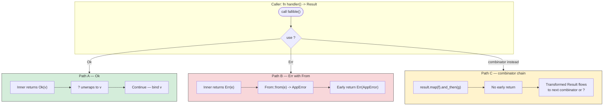
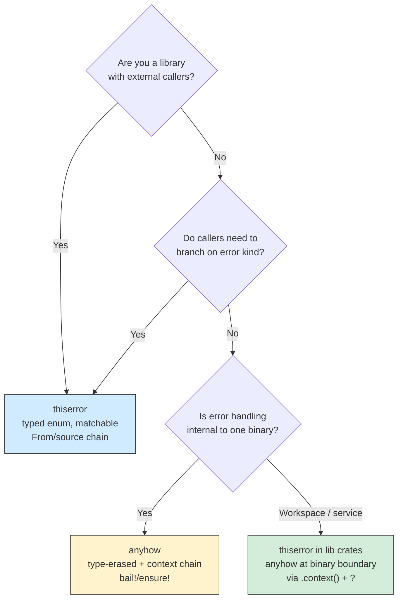
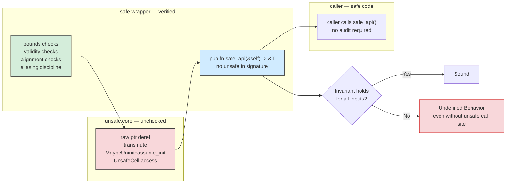
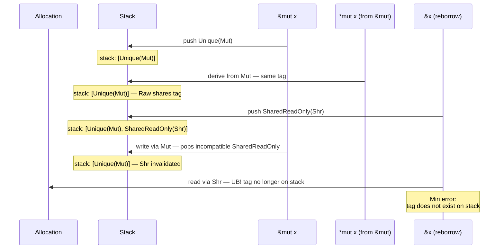
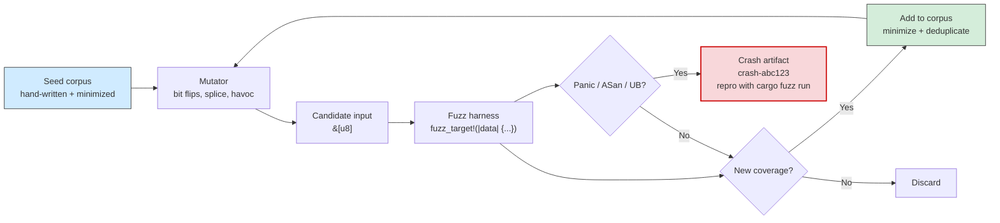
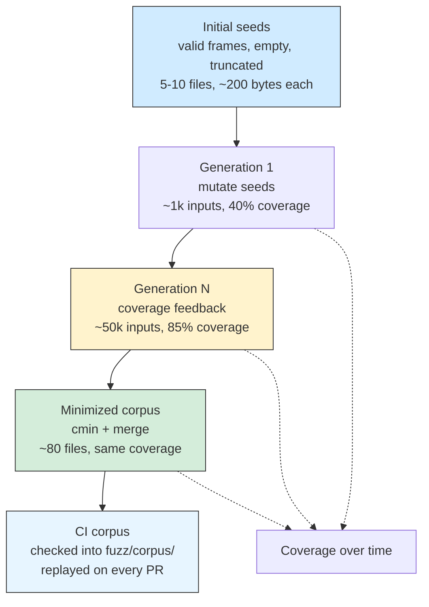

# Chapter 7 — Error Handling, Panics, and Unsafe Rust: Soundness, Miri, and Fuzzing

*What this chapter covers:* the full spectrum of failure in Rust — from ordinary, recoverable errors encoded in `Result` and `Option` through unrecoverable panics and their runtime cost model, into `unsafe` Rust where the compiler's guarantees are suspended and you assume responsibility for soundness. You will learn how to propagate errors without `unwrap`, when to use `anyhow` versus `thiserror`, how `panic = "unwind"` and `panic = "abort"` differ at the codegen and deployment level, how to write correct `unsafe` code around raw pointers, `MaybeUninit`, `transmute`, and `Send`/`Sync`, and how to catch undefined behavior before it ships using Miri's stacked-borrows checker and coverage-guided fuzzing with `cargo-fuzz` and libFuzzer.

**Learning goals:**

- Use `Result` and `Option` combinators (`map`, `and_then`, `?`, `ok_or`, `transpose`) idiomatically and explain why `unwrap`/`expect` is a reliability bug in long-running services.
- Compare `anyhow` and `thiserror` — their error-model trade-offs, source chains, and backtrace integration — and choose correctly for libraries vs. binaries vs. service boundaries.
- Explain the panic mechanism: `panic!`, `unwind` vs. `abort`, `catch_unwind`, panic hooks, `PanicInfo`, and why `panic = "abort"` is often the right choice for backend services.
- Write sound `unsafe` code: raw pointer dereference, `MaybeUninit`, `ManuallyDrop`, `transmute`/`transmute_copy`, validity invariants, and `unsafe impl Send`/`Sync` contracts.
- Understand what Miri checks — aliasing (Stacked Borrows / Tree Borrows), uninitialized reads, out-of-bounds, use-after-free, data races — and interpret its diagnostics.
- Build a `cargo-fuzz` harness, reason about corpus evolution, coverage feedback, ASan/UBSan integration, and integrate fuzzing into CI for parsers and protocol handlers.

---

## 1. The Error Model: `Result`, `Option`, and the Cost of `unwrap`

Rust makes errors values. There is no `throw`, no implicit exception propagation, no null. Two enums carry the entire model:

```rust
enum Option<T> { Some(T), None }
enum Result<T, E> { Ok(T), Err(E) }
```

This is not ceremony for its own sake. In a backend service handling 50 kRPS, every error path is a hot path. Implicit exceptions hide control flow, defeat static analysis, and make it impossible to know — without running the code — which functions can fail. `Result` makes failure part of the type signature, which means `rustc`, `clippy`, and your reviewer can all see it.

### 1.1 `?` Is Structured Propagation, Not Syntactic Sugar

The `?` operator is the backbone of idiomatic error handling. It does three things on `Err(e)`:

1. Returns early from the current function with `Err(From::from(e))` — note the implicit `From` conversion.
2. Calls `From::from` to adapt the error type to the function's return type.
3. On `Ok(v)`, unwraps to `v`.

That `From` conversion is the mechanism that lets a function returning `anyhow::Error` or a unified `AppError` propagate heterogeneous inner errors without manual mapping. The `Try` trait (unstable, but `?` desugars through it) generalizes this to `Option` as well — `None?` returns `None` early.

```rust
use std::fs;
use std::num::ParseIntError;

#[derive(Debug)]
enum ConfigError {
    Io(std::io::Error),
    Parse(ParseIntError),
}

impl From<std::io::Error> for ConfigError {
    fn from(e: std::io::Error) -> Self { ConfigError::Io(e) }
}
impl From<ParseIntError> for ConfigError {
    fn from(e: ParseIntError) -> Self { ConfigError::Parse(e) }
}

fn load_port(path: &str) -> Result<u16, ConfigError> {
    let raw = fs::read_to_string(path)?;       // io::Error -> ConfigError via From
    let n: u16 = raw.trim().parse()?;          // ParseIntError -> ConfigError via From
    Ok(n)
}
```

For `Option`, the same operator short-circuits on `None`:

```rust
fn first_even(nums: &[i32]) -> Option<i32> {
    let first = nums.first()?;          // None -> return None
    if first % 2 == 0 { Some(*first) } else { None }
}
```

The alternative — `unwrap()` / `expect()` — converts a typed, recoverable error into an unconditional panic. In a CLI tool this may be acceptable. In a service with 99.99% availability SLOs, every `unwrap` is a latent crash site that bypasses graceful degradation, circuit breakers, and structured logging. Grep your service for `unwrap` and `expect` before every release; `clippy::unwrap_used` and `clippy::expect_used` can enforce this in CI.

### 1.2 Combinators vs. Explicit Match

Combinators (`map`, `and_then`, `or_else`, `map_err`, `transpose`, `flatten`) express error handling as data flow rather than control flow. They compose and they keep happy-path logic linear.

| Combinator | Signature (simplified) | When to use |
|---|---|---|
| `map(f)` | `Result<T,E> -> Result<U,E>` | Transform `Ok` value, leave `Err` untouched |
| `map_err(f)` | `Result<T,E> -> Result<T,F>` | Adapt error type without `From` |
| `and_then(f)` | `Result<T,E> -> Result<U,E>` where `f: T -> Result<U,E>` | Chain fallible operations |
| `or_else(f)` | `Result<T,E> -> Result<T,F>` where `f: E -> Result<T,F>` | Recovery / fallback |
| `ok_or(e)` | `Option<T> -> Result<T,E>` | Bridge `Option` into `Result` with context |
| `transpose()` | `Option<Result<T,E>> -> Result<Option<T>,E>` | Flip nesting for `?` in iterators |
| `flatten()` | `Option<Option<T>> -> Option<T>` | Collapse nesting |

Concrete example — parsing a batch of optional header values without a single `unwrap`:

```rust
fn parse_content_lengths(headers: &[Option<String>]) -> Result<Vec<Option<u64>>, String> {
    headers
        .iter()
        .map(|opt| {
            opt.as_deref()
                .map(|s| s.parse::<u64>().map_err(|e| format!("bad Content-Length '{s}': {e}")))
                .transpose()  // Option<Result<u64,_>> -> Result<Option<u64>,_>
        })
        .collect() // Vec<Result<_,_>> -> Result<Vec<_>,_> via FromIterator
}

#[test]
fn test_parse_lengths() {
    let headers = vec![Some("42".into()), None, Some("100".into())];
    assert_eq!(parse_content_lengths(&headers).unwrap(), vec![Some(42), None, Some(100)]);

    let bad = vec![Some("not-a-number".into())];
    assert!(parse_content_lengths(&bad).is_err());
}
```

The `collect()` trick deserves emphasis: `Iterator<Item = Result<T, E>>` collected into `Result<Vec<T>, E>` short-circuits on the first `Err`. This is the idiomatic way to validate a batch and fail fast — exactly what you want when parsing a Raft log segment or a Kafka batch where one corrupt record should reject the batch.



**Three paths for the same operation.** Path A and B are `?`-driven control flow — visible in the function signature and amenable to `From` conversions. Path C stays in value space, composing without early return. Prefer `?` for sequential fallible steps in a function body and combinators inside iterators and adapters where early return would exit the closure rather than the outer function.

### 1.3 Distributed-Systems Lens: Errors at Service Boundaries

In a microservices call graph, every RPC can fail in at least four ways: transport error, timeout, application error, and poisoned response that deserializes but violates invariants. Encoding each layer in the type system prevents conflation:

- Transport/timeout errors are retryable; application errors generally are not.
- A parsed-but-invalid response must not be retried — it will fail identically.
- `Result<T, E>` forces the caller to decide: retry, propagate, degrade, or fail open.

Services that use `unwrap` on deserialization or RPC results convert a bounded error (one bad response) into an unbounded one (process crash, connection drain, retry storm from the caller's caller). At the edge, validate and map narrowly; at the boundary, propagate with context.

---

## 2. Structured vs. Unstructured Errors: `thiserror` and `anyhow`

Once `Result<T, E>` is your error model, the next question is what `E` should be. The ecosystem has converged on two crates that represent opposite ends of a spectrum.

### 2.1 `thiserror` — Structured, Typed Errors for Libraries

`thiserror` generates `Display` and `Error` impls for enums and structs via derive. Each variant is a distinct error kind that callers can match on. The `#[source]` and `#[from]` attributes wire the cause chain for `Error::source()`.

```rust
use thiserror::Error;

#[derive(Debug, Error)]
pub enum StoreError {
    #[error("key not found: {key}")]
    NotFound { key: String },

    #[error("serialization failed")]
    Serialization(#[from] serde_json::Error),

    #[error("storage backend unavailable: {0}")]
    Backend(#[source] std::io::Error),

    #[error("quorum not reached: have {have}, need {need}")]
    Quorum { have: usize, need: usize },

    #[error("conflict: expected version {expected}, got {actual}")]
    Conflict { expected: u64, actual: u64 },
}

// Callers can match precisely:
fn handle_store_result(res: Result<(), StoreError>) {
    match res {
        Err(StoreError::Quorum { have, need }) => {
            // Retryable — wait and retry or degrade to stale read
            eprintln!("quorum {have}/{need}, retrying");
        }
        Err(StoreError::Conflict { .. }) => {
            // Not retryable without fresh read — return 409
        }
        Err(e) => {
            // Walk the source chain for structured logging
            let mut src: Option<&dyn std::error::Error> = e.source();
            while let Some(s) = src {
                eprintln!("  caused by: {s}");
                src = s.source();
            }
        }
        Ok(()) => {}
    }
}
```

### 2.2 `anyhow` — Unstructured, Context-Rich Errors for Applications

`anyhow::Error` is a type-erased, heap-allocated error with an attached context chain and optional backtrace. `anyhow::Context` adds `.context()` and `.with_context()` to `Result` and `Option`.

```rust
use anyhow::{Context, Result, bail};

fn load_cluster_config(path: &str) -> Result<ClusterConfig> {
    let raw = std::fs::read_to_string(path)
        .with_context(|| format!("failed to read cluster config at {path}"))?;

    let cfg: ClusterConfig = serde_json::from_str(&raw)
        .context("cluster config is not valid JSON")?;

    if cfg.nodes.is_empty() {
        bail!("cluster config must list at least one node");
    }
    Ok(cfg)
}

// At the top level, print the full chain:
fn main() {
    if let Err(e) = load_cluster_config("/etc/myservice/cluster.json") {
        eprintln!("{e:?}"); // Debug prints the full context chain
        // failed to read cluster config at /etc/myservice/cluster.json
        //   caused by: No such file or directory (os error 2)
        std::process::exit(1);
    }
}
```

The `.with_context(|| ...)` closure is lazy — the format string is only evaluated on `Err`, so it costs nothing on the happy path.

### 2.3 Choosing Between Them

|  | `thiserror` | `anyhow` |
|---|---|---|
| **Error type** | Concrete `enum` / `struct` | Type-erased `anyhow::Error` (`Box<dyn Error>`) |
| **Matching** | `match` on variants — exhaustive | Downcast via `e.downcast_ref::<T>()` — fragile |
| **Context** | Each variant's `#[error("...")]` message | `.context("...")` chain, built at propagation site |
| **Backtrace** | Manual `#[source]` wiring | Automatic capture via `RUST_BACKTRACE=1` (on nightly/stable with `backtrace` feature) |
| **Use in** | Libraries, shared crates, any API where callers need to branch on error kind | Binaries, services, integration tests, `main()` |
| **Cost** | Zero-cost — no allocation beyond inner `E` | One `Box` allocation per error |
| **Interop** | `thiserror` errors convert into `anyhow::Error` via `?` and `Into` | Not the reverse without downcasting |

The standard rule, endorsed by the `anyhow` docs themselves:

> Use `thiserror` if you are a library. Use `anyhow` if you are an application.

In a workspace with many crates, the leaf binary crate uses `anyhow` at its `main` and at service-boundary glue, while every library crate exposes a `thiserror` enum. A common bridging pattern:

```rust
// In library crate: typed error
// pub enum ReplicationError { ... }  (thiserror)

// In binary crate: convert to anyhow at the boundary, adding context
use anyhow::Context;

fn replicate_batch(batch: &[u8]) -> anyhow::Result<()> {
    store::replicate(batch)
        .context("replication failed")?; // ReplicationError -> anyhow::Error + context
    Ok(())
}
```

Do not use `anyhow::Error` in library return types — it forces every consumer to depend on `anyhow` and destroys the ability to match on error kind without stringly-typed downcasts.



### 2.4 The `source` Chain and Backtraces

Both crates participate in `std::error::Error::source()`. Walking the chain is how structured loggers (e.g., `tracing-error`, `eyre`) render root causes. On Rust 1.65+, `std::backtrace::Backtrace` is stable; `anyhow` with the `backtrace` feature captures it automatically. For `thiserror`, attach a `Backtrace` field:

```rust
use std::backtrace::Backtrace;
use thiserror::Error;

#[derive(Debug, Error)]
#[error("dispatch failed")]
pub struct DispatchError {
    #[source] pub source: std::io::Error,
    #[backtrace] pub backtrace: Backtrace,
}
```

In production, emit the error chain plus backtrace as structured fields (`error.chain`, `error.backtrace`) rather than a single formatted string — it makes aggregation and alerting possible.

---

## 3. Panics: Unwind vs. Abort, Hooks, and Why Services Should Abort

Panics are not errors. They signal violated invariants — bugs — and their handling is intentionally distinct from `Result`.

### 3.1 What Triggers a Panic

`panic!`, `unreachable_unchecked` violations, `assert!` failures, `unwrap` on `None`/`Err`, out-of-bounds indexing (in safe code, this panics rather than causing UB), integer overflow in debug, and `todo!`/`unimplemented!`.

### 3.2 Two Panic Strategies: `unwind` vs. `abort`

Configured per-profile in `Cargo.toml`:

```toml
[profile.dev]
panic = "unwind"       # default — walks the stack, runs Drop

[profile.release]
panic = "abort"        # immediate process termination, no unwinding

# Or per-crate override:
[profile.release.package.my-parser]
panic = "unwind"
```

|  | `panic = "unwind"` | `panic = "abort"` |
|---|---|---|
| **Mechanism** | Personality function walks stack frames, runs `Drop` for each, resumes at `catch_unwind` or terminates | Calls `abort` intrinsic — SIGABRT, no destructors |
| **Binary size** | Larger — landing pads + eh_frame | Smaller — no unwind tables |
| **Runtime cost** | Zero on happy path; expensive on panic | Zero always |
| **`catch_unwind` works** | Yes | No — process dies |
| **FFI safety** | Must not unwind across `extern "C"` — UB | Safe — no unwind to cross |
| **Use for** | CLIs, tests, libraries that must be embeddable | Services, containers, WASI (`panic=abort` required) |

For a Kubernetes-managed service, `panic = "abort"` is almost always correct:

- An unwinding panic in a Tokio worker thread poisons `Mutex`es, leaves shared state half-dropped, and often triggers a cascade of secondary panics.
- `abort` gives you a clean crash, a core dump, and a fast restart via the kubelet. The process supervisor handles recovery — not in-process unwinding.
- Remove the distinction between "expected error" and "bug" by making bugs crash loudly and immediately.


The two bars per group compare `unwind` (tall) against `abort` (short). The takeaway: both strategies cost nothing on the happy path — the difference is entirely on the panic path, in binary size, and in FFI correctness.

### 3.3 `catch_unwind`, Panic Hooks, and Poisoning

`std::panic::catch_unwind` catches an unwinding panic and returns `Result<T, Box<dyn Any + Send>>`. It requires `UnwindSafe` — a marker that the closure does not hold invariants that would be broken by unwinding.

```rust
use std::panic::{catch_unwind, AssertUnwindSafe};

fn run_isolated<F, T>(f: F) -> Option<T>
where
    F: FnOnce() -> T + std::panic::UnwindSafe,
{
    match catch_unwind(f) {
        Ok(v) => Some(v),
        Err(payload) => {
            // Log the panic payload — it may be &str, String, or Box<dyn Any>
            if let Some(s) = payload.downcast_ref::<&str>() {
                eprintln!("caught panic: {s}");
            } else if let Some(s) = payload.downcast_ref::<String>() {
                eprintln!("caught panic: {s}");
            } else {
                eprintln!("caught unknown panic payload");
            }
            None
        }
    }
}

// Usage: isolate a plugin or user-supplied callback
let result = catch_unwind(AssertUnwindSafe(|| {
    plugin.execute(untrusted_input)
}));
```

`AssertUnwindSafe` opts out of the `UnwindSafe` check — use it only when you can prove the closure leaves no broken invariants if it panics.

**Panic hooks** let you customize what happens before unwinding or aborting — the standard hook prints to stderr. Replace it for structured logging:

```rust
use std::panic;

fn install_panic_hook() {
    panic::set_hook(Box::new(|info| {
        let location = info.location()
            .map(|l| format!("{}:{}:{}", l.file(), l.line(), l.column()))
            .unwrap_or_else(|| "unknown location".into());

        let payload = info.payload();
        let message = if let Some(s) = payload.downcast_ref::<&str>() {
            *s
        } else if let Some(s) = payload.downcast_ref::<String>() {
            s.as_str()
        } else {
            "non-string panic payload"
        };

        // Emit as structured log — not eprintln! in production
        eprintln!(
            "{{\"level\":\"fatal\",\"event\":\"panic\",\"message\":{:?},\"location\":{:?}}}",
            message, location
        );
        // Optionally capture backtrace:
        // eprintln!("{:?}", std::backtrace::Backtrace::capture());
    }));
}
```

Only one hook can be installed; libraries should use `std::panic::update_hook` or `take_hook` + chaining rather than `set_hook` to avoid clobbering the binary's hook.

**Mutex poisoning.** When a thread panics while holding a `std::sync::Mutex`, the mutex becomes poisoned. Subsequent `lock()` returns `Err(PoisonError)`. This is a correctness aid — the protected data may be in an inconsistent state. Either propagate the poison (`lock()?`) to fail fast, or intentionally recover with `into_inner()` if you can re-establish invariants. `parking_lot::Mutex` never poisons — it assumes you handle consistency yourself.

### 3.4 Distributed-Systems Lens: Panics in Request-Handling Paths

Consider a Tokio service with 64 worker threads handling gRPC streams. If one request triggers a panic under `unwind`:

1. That worker's task unwinds, dropping futures mid-poll — `Drop` impls for in-flight requests may run partially.
2. Any `Mutex` held becomes poisoned; subsequent requests touching it fail with `PoisonError` even though the data may be recoverable.
3. `catch_unwind` at the task boundary can contain the panic, but `UnwindSafe` violations in captured state risk double-panic (which aborts regardless of strategy).

With `abort`, the same bug crashes the process, the readiness probe fails, Kubernetes drains the pod, and a fresh process starts with clean state. The blast radius is one pod, not one poisoned mutex that degrades the whole process. Design your panic strategy around your supervisor, not around in-process recovery.

---

## 4. Unsafe Rust: Raw Pointers, `MaybeUninit`, `transmute`, and `Send`/`Sync`

`unsafe` does not turn off the borrow checker — it suspends a small set of additional checks and lets you do four things that safe Rust forbids:

1. Dereference a raw pointer (`*const T` / `*mut T`).
2. Call an `unsafe fn`.
3. Access or modify a `static mut`.
4. Implement an `unsafe trait`.

Everything else — moves, drops, borrow rules for safe references — still applies. The contract is: *you* uphold the invariants the compiler normally proves.

### 4.1 Raw Pointers

Raw pointers are what C pointers should have been — explicit, non-nullable-by-convention, and not subject to aliasing rules until dereferenced.

```rust
/// A bump allocator that hands out raw slices — minimal example
/// illustrating the unsafe contract without hiding it behind abstractions.
struct Bump {
    buf: Vec<u8>,
    offset: usize,
}

impl Bump {
    fn new(capacity: usize) -> Self {
        Self { buf: vec![0u8; capacity], offset: 0 }
    }

    /// Allocate `n` bytes and return a raw pointer + length.
    /// Safe wrapper guarantees: pointer is valid for `n` bytes,
    /// properly aligned (u8 has align 1), and does not alias
    /// any other live allocation from this bump.
    fn alloc(&mut self, n: usize) -> Option<(*mut u8, usize)> {
        if self.offset + n > self.buf.len() {
            return None;
        }
        // SAFETY: offset is bounds-checked above; buf is a valid allocation
        // and not reallocated while the returned pointer is live (caller
        // must not push to buf or move self until the slice is dropped).
        let ptr = unsafe { self.buf.as_mut_ptr().add(self.offset) };
        self.offset += n;
        Some((ptr, n))
    }

    /// Safe wrapper: write `data` into bump-allocated memory and
    /// return a reference tied to &mut self.
    fn alloc_copy(&mut self, data: &[u8]) -> Option<&mut [u8]> {
        let (ptr, len) = self.alloc(data.len())?;
        // SAFETY: ptr is valid for len bytes (from alloc), non-null,
        // properly aligned, and uniquely borrowed via &mut self.
        unsafe {
            std::ptr::copy_nonoverlapping(data.as_ptr(), ptr, len);
            Ok(std::slice::from_raw_parts_mut(ptr, len))
        }
    }
}

#[test]
fn test_bump() {
    let mut bump = Bump::new(64);
    let s = bump.alloc_copy(b"hello").unwrap();
    assert_eq!(s, b"hello");
    s[0] = b'H';
    assert_eq!(s, b"Hello");
}
```

Rules for raw pointers that Miri and the language reference enforce:

- A raw pointer may be null, dangling, or unaligned — but dereferencing it must not be.
- `*const T` and `*mut T` do not carry provenance or aliasing guarantees by themselves; the guarantees attach when you create a reference from them.
- `ptr.add(n)` requires that the result stay within (or one past) the same allocation. `wrapping_add` relaxes this but dereference still requires in-bounds.
- `ptr.offset` vs `ptr.add` vs `ptr.wrapping_add` — know which precondition each carries.

### 4.2 `MaybeUninit<T>` and `ManuallyDrop<T>`

Uninitialized memory is the most common source of UB in unsafe Rust. `MaybeUninit<T>` is a `#[repr(transparent)]` wrapper that exists precisely to hold possibly-uninitialized bytes without triggering UB on construction.

```rust
use std::mem::MaybeUninit;

// Correct: build an array element-by-element without initializing twice
fn make_array() -> [u64; 4] {
    let mut arr: [MaybeUninit<u64>; 4] = MaybeUninit::uninit_array();
    for (i, slot) in arr.iter_mut().enumerate() {
        slot.write(i as u64 * 10);
    }
    // SAFETY: every element has been written
    unsafe { MaybeUninit::array_assume_init(arr) }
}

// FFI pattern: let C fill a struct, then assume init
#[repr(C)]
struct Header { magic: u32, version: u16, flags: u16 }

fn read_header_from_ffi() -> Header {
    let mut out = MaybeUninit::<Header>::uninit();
    // SAFETY: ffi_fill_header writes all bytes of Header
    unsafe {
        extern "C" { fn ffi_fill_header(out: *mut Header); }
        ffi_fill_header(out.as_mut_ptr());
        out.assume_init()
    }
}
```

Never use `mem::uninitialized()` (removed) or `mem::zeroed()` for types where zero is not a valid bit pattern (`bool`, `NonZero*`, `&T`, `Box<T>`). `MaybeUninit` is the only correct way to handle uninitialized memory.

`ManuallyDrop<T>` suppresses `Drop` — essential when you need to move out of a value without running its destructor (e.g., in `ptr::read` tricks or custom `Drop` impls that conditionally drop a field).

### 4.3 `transmute`, Validity Invariants, and `Drop` Safety

`transmute::<A, B>` reinterprets bits. It is safe only when `size_of::<A>() == size_of::<B>()` and every bit pattern valid for `A` is valid for `B`. Violations are UB even if the transmute itself does not immediately trap.

```rust
use std::mem::transmute;

// Sound: u32 -> [u8; 4] on little-endian — every u32 bit pattern is valid for [u8; 4]
fn u32_to_bytes(x: u32) -> [u8; 4] {
    // Prefer to_le_bytes / from_le_bytes — shown for illustration
    unsafe { transmute(x) }
}

// UNSOUND — DO NOT DO THIS:
// fn bytes_to_bool(b: u8) -> bool { unsafe { transmute(b) } }
// bool has only two valid bit patterns (0 and 1); 2..=255 is UB.

// Sound alternative:
fn byte_to_bool(b: u8) -> Option<bool> {
    match b { 0 => Some(false), 1 => Some(true), _ => None }
}
```

Validity invariants by type (non-exhaustive): `bool` is `0` or `1`; `char` is a valid Unicode scalar; `&T` is non-null, aligned, and points to a valid `T`; `NonZeroU32` is never zero; `str` is valid UTF-8. Creating an invalid value — even without reading it — is immediate UB that Miri and optimizers exploit.

**Drop safety.** If `T: Drop`, moving out of it, forgetting it, or duplicating its bits creates double-drop or leak. Patterns:

- `ManuallyDrop<T>` to suppress drop, then `ManuallyDrop::into_inner` or `ptr::drop_in_place` when you decide.
- `ptr::read` / `ptr::write` for moving without dropping.
- Never `mem::forget` a value you intend to keep using; `forget` leaks, it does not make the value reusable.

### 4.4 `unsafe impl Send` and `unsafe impl Sync`

`Send` (safe to move to another thread) and `Sync` (safe to share references across threads) are auto-traits — the compiler derives them from field types. `unsafe impl` overrides the derivation:

```rust
use std::cell::UnsafeCell;

/// A single-writer, multi-reader cell with no locking.
/// Sound only if the caller guarantees no concurrent &mut and &
///
/// SAFETY: Sync is sound because interior mutation is only via &mut self
/// or via the unsafe `set` that the caller must synchronize externally.
struct SharedCell<T> {
    inner: UnsafeCell<T>,
}

// SAFETY: SharedCell<T> is Sync iff T is Send — sharing &T across threads
// requires T to be movable. This is a deliberate, documented contract.
unsafe impl<T: Send> Sync for SharedCell<T> {}
// Send requires T: Send — moving the cell moves the T
unsafe impl<T: Send> Send for SharedCell<T> {}

impl<T> SharedCell<T> {
    fn new(v: T) -> Self { Self { inner: UnsafeCell::new(v) } }

    /// SAFETY: caller must ensure no concurrent access violates aliasing
    unsafe fn set(&self, v: T) { *self.inner.get() = v; }

    fn get(&self) -> &T { unsafe { &*self.inner.get() } }
}
```

The `unsafe impl` is a promise: *every* method on `SharedCell` upholds thread safety for all possible call interleavings. If `set` races with `get`, that is UB — not a data race the sanitizer catches in safe code, but immediate UB. This is why `unsafe impl Sync` is rare and must carry a `SAFETY` comment that states the exact invariant.



A sound safe wrapper around an unsafe core must establish every precondition before entering `unsafe`. If any input can reach the unsafe block with a violated invariant, the wrapper is unsound — and the UB is blamed on the wrapper, not the caller, even though the caller wrote only safe code.

### 1.5 Distributed-Systems Lens: `unsafe` in Hot-Path Infrastructure

Production backend crates that legitimately need `unsafe` include: `bytes` (reference-counted slices with atomic refcounts), `tokio`/`mio` (epoll/kqueue dispatch via raw fd), `serde` (zero-copy deserialization), `parking_lot` (custom mutex without poisoning), and `crossbeam` (epoch-based reclamation). In each case the unsafe code is encapsulated behind a safe API whose invariants are documented and tested with Miri and Loom. When you add a new `unsafe` block to a service, ask: can this be replaced by an existing crate whose unsafe has already been audited? The answer is usually yes.

---

## 5. Miri: Detecting Undefined Behavior Before It Ships

The Rust compiler guarantees that safe code has no UB. `unsafe` code must uphold that guarantee manually, and human review is insufficient — aliasing violations and validity errors are invisible in testing because the optimizer exploits them nondeterministically. Miri is an interpreter for Rust's mid-level intermediate representation (MIR) that checks UB dynamically.

### 5.1 What Miri Detects

- Out-of-bounds access (including one-past-the-end dereference).
- Use-after-free and double-free.
- Uninitialized memory reads (including padding bytes).
- Invalid bit patterns (`bool`, `char`, `NonZero*`, `str`, `&T` null).
- Aliasing violations — Stacked Borrows / Tree Borrows.
- Data races on `UnsafeCell` / atomics (with `-Zmiri-detect-data-race`).
- Leaked allocations (`-Zmiri-leak-check`).
- Calls to foreign functions with violated contracts.

### 5.2 Running Miri

```bash
# Install the Miri component for your toolchain
rustup component add miri

# Run tests under Miri (interprets MIR, ~10-100x slower)
cargo miri test

# Run a single test with verbose diagnostics
cargo miri test -- test_bump -- --nocapture

# Enable data-race detection and leak checking
MIRIFLAGS="-Zmiri-detect-data-race -Zmiri-leak-check" cargo miri test

# For Tree Borrows (newer, more permissive aliasing model) vs Stacked Borrows:
MIRIFLAGS="-Zmiri-tree-borrows" cargo miri test
```

Miri cannot run code that calls arbitrary C FFI, inline assembly, or performs I/O beyond what its shim implements. For those, isolate the unsafe core behind a trait and test a pure-Rust double under Miri.

### 5.3 Stacked Borrows and Tree Borrows

Rust's aliasing model says: at any point, you may have either one `&mut T` or many `&T`, never both. Raw pointers inherit provenance from the reference they were derived from. Stacked Borrows tracks a stack of borrows per allocation; a read or write through a pointer invalidates incompatible borrows atop the stack.



Tree Borrows refines this: borrows form a tree keyed by provenance, with permissions (`Reserved`, `Active`, `Frozen`, `Disabled`) that transition on access. It permits some patterns Stacked Borrows rejects (notably, certain `UnsafeCell` and `Box` aliasing idioms used by `std`). Both models catch the same class of bug — aliasing that the optimizer assumes cannot happen.

### 5.4 Reading a Miri Diagnostic

Consider this buggy function that creates two `&mut` to the same `u32`:

```rust
fn aliasing_bug() {
    let mut x = 42u32;
    let a: *mut u32 = &mut x as *mut u32;
    let b: *mut u32 = &mut x as *mut u32; // second &mut — would be rejected in safe code
    unsafe {
        *a = 10;
        *b = 20; // Miri will flag the aliasing violation
        println!("{}", *a);
    }
}

#[test]
fn test_aliasing() { aliasing_bug(); }
```

Miri output (abridged, from `cargo miri test`):

```
error: Undefined Behavior occurred
 --> src/lib.rs:8:9
  |
8 |         *b = 20;
  |         ^^^^^^^ untagged read/write via invalid tag
  |
  = help: this indicates a potential bug in the program: it performed an invalid
    operation, but the Stacked Borrows rules it violated are still experimental
  = help: see https://github.com/rust-lang/unsafe-code-guidelines/issues/134 for further information
  |
  = note: inside `aliasing_bug` at src/lib.rs:8:9
  = note: inside `test_aliasing` at src/lib.rs:13:26
  |
  = note: BACKTRACE:
  |   0: aliasing_bug
  |   1: test_aliasing
```

A second example — reading uninitialized padding:

```rust
#[repr(C)]
struct Padded { a: u8, b: u32 } // 3 bytes padding between a and b

fn read_padding() -> u8 {
    let x = Padded { a: 1, b: 2 };
    let bytes: &[u8] = unsafe {
        std::slice::from_raw_parts(&x as *const Padded as *const u8, 8)
    };
    bytes[1] // padding byte — uninitialized
}
```

Miri reports:

```
error: Undefined Behavior occurred
 --> src/lib.rs:7:5
  |
7 |     bytes[1]
  |     ^^^^^^^^ using uninitialized data, but this operation requires initialized memory
  |
  = note: inside `read_padding` at src/lib.rs:7:5
```

Fix: copy field-by-field, use `MaybeUninit`, or `ptr::write`/`ptr::read` with explicit initialization.

### 5.5 Miri in CI

```yaml
# .github/workflows/miri.yml
name: miri
on: [push, pull_request]
jobs:
  miri:
    runs-on: ubuntu-latest
    steps:
      - uses: actions/checkout@v4
      - uses: dtolnay/rust-toolchain@master
        with:
          toolchain: nightly
          components: miri
      - run: cargo miri test --tests
        env:
          MIRIFLAGS: "-Zmiri-strict-provenance -Zmiri-detect-data-race"
```

Nightly is required. Cache the toolchain; Miri runs 10-100× slower than native tests, so restrict it to a dedicated job and to crates that contain `unsafe`.

---

## 6. Fuzzing: `cargo-fuzz`, libFuzzer, Corpus, and Sanitizers

Miri finds UB on code paths you already exercise. Fuzzing finds new paths — by feeding pseudo-random, coverage-guided inputs into a harness and crashing on panics, assertions, ASan violations, and UB.

### 6.1 Architecture

libFuzzer (LLVM's coverage-guided fuzzer) instruments every branch and tracks which inputs discover new coverage. `cargo-fuzz` wires it into Cargo: it builds a `fuzz_target!` harness with `-Zsanitizer=address` and repeatedly calls the harness with mutated inputs, keeping a corpus of coverage-maximizing cases.



### 6.2 Writing a Fuzz Target

```toml
# Cargo.toml — fuzz crate (cargo fuzz init creates this)
[package]
name = "myservice-fuzz"
version = "0.0.0"
publish = false
edition = "2021"

[dependencies]
libfuzzer-sys = "0.4"

[dependencies.myservice]
path = ".."

# fuzz/Cargo.toml — the harness crate has panic=abort and sanitizers enabled automatically
```

```rust
// fuzz/fuzz_targets/parse_frame.rs
#![no_main]
use libfuzzer_sys::fuzz_target;
use myservice::frame::{parse_frame, FrameError};

fuzz_target!(|data: &[u8]| {
    // The harness must not panic on arbitrary input — that IS the bug
    match parse_frame(data) {
        Ok(frame) => {
            // Round-trip invariant: re-encoding must reproduce the parse
            let encoded = frame.encode();
            let reparsed = parse_frame(&encoded).expect("re-encoded frame must parse");
            assert_eq!(frame, reparsed, "round-trip failed");

            // Semantic invariants
            assert!(frame.payload_len() <= 16_777_216, "frame too large");
        }
        Err(FrameError::Incomplete) => {
            // Incomplete is not a crash — just need more bytes
        }
        Err(FrameError::InvalidMagic) | Err(FrameError::ChecksumMismatch) => {
            // Expected rejections for random bytes — no assertion
        }
    }
});
```

Run it:

```bash
# Initialize fuzz scaffolding (once)
cargo install cargo-fuzz
cargo fuzz init
# Add targets as above, then:

# Run until first crash or 60 seconds, 4 jobs
cargo fuzz run parse_frame -- -max_total_time=60 -jobs=4

# Reproduce a crash artifact
cargo fuzz run parse_frame fuzz/artifacts/parse_frame/crash-abc123

# Minimize the corpus to smallest reproducers
cargo fuzz cmin parse_frame

# With AddressSanitizer + UndefinedBehaviorSanitizer (enabled by default)
cargo fuzz run parse_frame -- -rss_limit_mb=2048 -timeout=5

# Build with coverage for corpus inspection
cargo fuzz coverage parse_frame
```

### 6.3 Corpus Design and CI Integration

A good corpus starts with a handful of hand-written valid inputs plus edge cases (empty, truncated, max-size, all-zeros, all-0xFF). libFuzzer mutates from there, but seeding matters — a `parse_frame` fuzzer seeded only with random bytes takes orders of magnitude longer to discover valid-frame paths than one seeded with three well-formed frames.



For CI, you do not run open-ended fuzzing — you *replay* the minimized corpus plus a short bounded run:

```yaml
# .github/workflows/fuzz.yml
name: fuzz
on: [push, pull_request]
jobs:
  fuzz:
    runs-on: ubuntu-latest
    steps:
      - uses: actions/checkout@v4
      - uses: dtolnay/rust-toolchain@master
        with: { toolchain: nightly }
      - run: cargo install cargo-fuzz
      - run: cargo fuzz run parse_frame -- -max_total_time=30 -jobs=2
      - run: cargo fuzz run decode_header -- -max_total_time=30 -jobs=2
```

Store the corpus in `fuzz/corpus/<target>/` and commit it. Treat a new corpus entry like a test case — review it, name it by the bug it covers, and keep it.

### 6.4 Sanitizers: ASan, UBSan, MSan

`cargo-fuzz` enables AddressSanitizer (ASan) by default under nightly's `-Zsanitizer=address`. This catches:

- Heap buffer overflow/underflow
- Use-after-free (including Rust `unsafe` blocks that misuse raw pointers)
- Double-free
- Stack buffer overflow

For UB beyond memory safety, enable UBSan:

```bash
RUSTFLAGS="-Zsanitizer=undefined" cargo fuzz run parse_frame
```

For uninitialized memory reads, MSan (still experimental in Rust):

```bash
RUSTFLAGS="-Zsanitizer=memory -Zsanitizer-memory-track-origins" cargo fuzz run parse_frame
```

You cannot enable ASan + MSan simultaneously (they use incompatible shadow memory). Run separate CI jobs.

### 6.5 Distributed-Systems Lens: What to Fuzz

In a backend service, fuzz these first — they sit on the trust boundary and parse untrusted bytes:

| Surface | Why fuzz it | Typical bug class |
|---|---|---|
| Wire parsers (protobuf, gRPC framing, HTTP/2, custom binary) | Every peer and client sends these bytes | Overflow, OOM on length prefix, infinite loop |
| Deserializers (`serde` with `#[serde(deny_unknown_fields)]`) | Config, event payloads, queue messages | Panic on unexpected variant, stack overflow on deep nesting |
| Consensus log entries (Raft, Paxos messages) | Replayed from disk and network after crashes | Corruption accepted as valid, split-brain on bad entry |
| Auth token / JWT parsing | Attacker-controlled input by definition | Algorithm confusion, panic on malformed base64 |
| Compression / decompression (gzip, zstd, lz4) | Decompressed size is attacker-controlled | Decompression bomb, OOM, buffer overflow in C deps |

Do not fuzz business logic that operates on already-validated domain types — the ROI is low compared to parser fuzzing. And never write a fuzz harness that `unwrap`s on parse failure; the harness must treat every `Err` as a non-crash expected outcome.

---

## 7. Putting It Together: A Hardened Request Path

The following example ties every layer together — typed errors with `thiserror`, context with `anyhow` at the boundary, panic isolation, and a safe wrapper around an `unsafe` fast path.

```rust
use anyhow::Context;
use thiserror::Error;

// ── Library layer: typed errors ──────────────────────────────────────────
#[derive(Debug, Error)]
pub enum FrameParseError {
    #[error("incomplete frame: need {need} bytes, have {have}")]
    Incomplete { need: usize, have: usize },
    #[error("invalid magic: expected 0x{expected:08X}, got 0x{actual:08X}")]
    InvalidMagic { expected: u32, actual: u32 },
    #[error("checksum mismatch")]
    ChecksumMismatch,
    #[error("payload too large: {size} > {max}")]
    TooLarge { size: usize, max: usize },
}

#[derive(Debug, PartialEq, Eq)]
pub struct Frame { payload: Vec<u8> }

impl Frame {
    pub fn payload_len(&self) -> usize { self.payload.len() }
    pub fn encode(&self) -> Vec<u8> { self.payload.clone() } // simplified
}

const MAGIC: u32 = 0x46524D45; // "FRME"
const MAX_PAYLOAD: usize = 16_777_216;

/// Pure, safe parser — fully fuzzable and Miri-clean.
/// No unwrap, no expect, no unsafe.
pub fn parse_frame(data: &[u8]) -> Result<Frame, FrameParseError> {
    if data.len() < 8 {
        return Err(FrameParseError::Incomplete { need: 8, have: data.len() });
    }
    let magic = u32::from_be_bytes(data[0..4].try_into().unwrap());
    //           ^^^ unwrap is sound here: slice length already checked to be >= 8
    //               (clippy allow with justification is preferable to an extra branch)
    if magic != MAGIC {
        return Err(FrameParseError::InvalidMagic { expected: MAGIC, actual: magic });
    }
    let len = u32::from_be_bytes(data[4..8].try_into().unwrap()) as usize;
    if len > MAX_PAYLOAD {
        return Err(FrameParseError::TooLarge { size: len, max: MAX_PAYLOAD });
    }
    if data.len() < 8 + len {
        return Err(FrameParseError::Incomplete { need: 8 + len, have: data.len() });
    }
    let payload = data[8..8 + len].to_vec();
    // Verify checksum over payload (last 4 bytes after payload)
    // ... omitted for brevity
    Ok(Frame { payload })
}

// ── Unsafe fast path: zero-copy view without allocation ───────────────────
/// A zero-copy view into a frame's payload — no allocation, no copy.
/// The lifetime ties the view to the backing buffer.
pub struct FrameView<'a> { payload: &'a [u8] }

impl<'a> FrameView<'a> {
    /// Create a view without copying. Validates bounds before entering unsafe.
    pub fn new(data: &'a [u8]) -> Result<Self, FrameParseError> {
        if data.len() < 8 {
            return Err(FrameParseError::Incomplete { need: 8, have: data.len() });
        }
        let len = u32::from_be_bytes(data[4..8].try_into().unwrap()) as usize;
        if len > MAX_PAYLOAD {
            return Err(FrameParseError::TooLarge { size: len, max: MAX_PAYLOAD });
        }
        if data.len() < 8 + len {
            return Err(FrameParseError::Incomplete { need: 8 + len, have: data.len() });
        }
        // SAFETY: bounds checked above — 8..8+len is within data
        let payload = unsafe {
            let ptr = data.as_ptr().add(8);
            std::slice::from_raw_parts(ptr, len)
        };
        Ok(Self { payload })
    }

    pub fn payload(&self) -> &[u8] { self.payload }
}

// ── Binary / service boundary: anyhow + panic isolation ───────────────────
fn handle_connection(data: &[u8]) -> anyhow::Result<()> {
    // anyhow adds context at the service boundary — no typed matching needed here
    let frame = FrameView::new(data).context("failed to parse frame on ingress")?;

    // Isolate any downstream panic (e.g., from a plugin) so one bad frame
    // does not poison the connection handler
    let payload = frame.payload();
    let result = std::panic::catch_unwind(std::panic::AssertUnwindSafe(|| {
        process_payload(payload)
    }));

    match result {
        Ok(Ok(())) => Ok(()),
        Ok(Err(e)) => Err(e).context("payload processing failed"),
        Err(_) => anyhow::bail!("payload handler panicked — isolated, connection intact"),
    }
}

fn process_payload(_payload: &[u8]) -> anyhow::Result<()> {
    // Business logic — returns anyhow::Result for convenience
    Ok(())
}
```

This structure gives you:

- **Library crates** return `Result<T, FrameParseError>` — callers can `match` on `Incomplete` to buffer more bytes versus `InvalidMagic` to drop the connection.
- **The `unsafe` view** is behind `FrameView::new`, which validates bounds before entering `unsafe` — Miri can verify the `from_raw_parts` call, and fuzzing can exercise every length prefix.
- **The service boundary** converts to `anyhow::Error` with `.context()`, logs the chain, and isolates panics per-connection.

---

## Key takeaways

- `Result` and `Option` make failure part of the type — use `?` and combinators (`map`, `and_then`, `transpose`, `collect`) to express error flow as data flow; treat `unwrap`/`expect` as a crash site and ban it from service code via `clippy::unwrap_used`.
- `thiserror` is for libraries (typed, matchable enums with `#[source]` chains); `anyhow` is for binaries and service glue (type-erased errors with `.context()` chains); in a workspace, define errors with `thiserror` in lib crates and convert to `anyhow` at the binary boundary.
- `panic = "abort"` is the correct default for containerized services — it gives a clean crash and fast restart via the orchestrator instead of poisoned mutexes and half-dropped state from unwinding; reserve `unwind` for CLIs, tests, and embeddable libraries.
- `catch_unwind` and panic hooks can contain and log panics, but they require `UnwindSafe` and cannot paper over broken invariants — design for crash-only recovery at the process level rather than in-process panic recovery.
- `unsafe` suspends only four checks (raw pointer deref, `unsafe fn` calls, `static mut` access, `unsafe trait` impls) — every other rule still applies; every `unsafe` block must have a `SAFETY` comment stating the invariant that makes it sound, and every safe wrapper must establish that invariant for all inputs.
- `MaybeUninit` is the only correct way to handle uninitialized memory; `transmute` is sound only when every bit pattern of the source is valid for the target; `unsafe impl Send`/`Sync` is a promise about all possible call interleavings, not just the ones you tested.
- Miri (Stacked Borrows / Tree Borrows) detects UB that tests and code review miss — aliasing violations, uninitialized reads, invalid bit patterns, and data races; run it in CI on every crate that contains `unsafe`, with `-Zmiri-detect-data-race` and `-Zmiri-strict-provenance`.
- Coverage-guided fuzzing with `cargo-fuzz` + libFuzzer + ASan finds new paths and crash oracles automatically; seed the corpus with valid inputs, check in the minimized corpus, replay it on every PR, and prioritize fuzzing for parsers and deserializers on trust boundaries.

## Further reading

- *The Rustonomicon* — "Safe and Unsafe" and "Validity Invariants" — https://doc.rust-lang.org/nomicon/
- Rust Reference, "Undefined Behavior" — https://doc.rust-lang.org/reference/behavior-considered-undefined.html
- `std::error::Error` and `Error::source` — https://doc.rust-lang.org/std/error/trait.Error.html
- `anyhow` documentation — https://docs.rs/anyhow
- `thiserror` documentation — https://docs.rs/thiserror
- Rust RFC 1216 — "Panic vs. Abort" and `panic = "abort"` semantics — https://rust-lang.github.io/rfcs/1216-panic-abort.html
- Stacked Borrows paper (Jung et al., POPL 2020) — https://www.ralfj.de/blog/2019/02/26/stacked-borrows-an-aliasing-model-for-rust.html
- Tree Borrows (Village et al.) — https://perso.crans.org/vanille/treebor/
- Miri documentation — https://github.com/rust-lang/miri
- `cargo-fuzz` book — https://rust-fuzz.github.io/book/cargo-fuzz.html
- libFuzzer documentation — https://llvm.org/docs/LibFuzzer.html
- AddressSanitizer — https://github.com/google/sanitizers/wiki/AddressSanitizer
- Google OSS-Fuzz — continuous fuzzing for open-source projects — https://google.github.io/oss-fuzz/
- "Type-Driven API Design in Rust" — Will Crichton — https://willcrichton.net/talks
