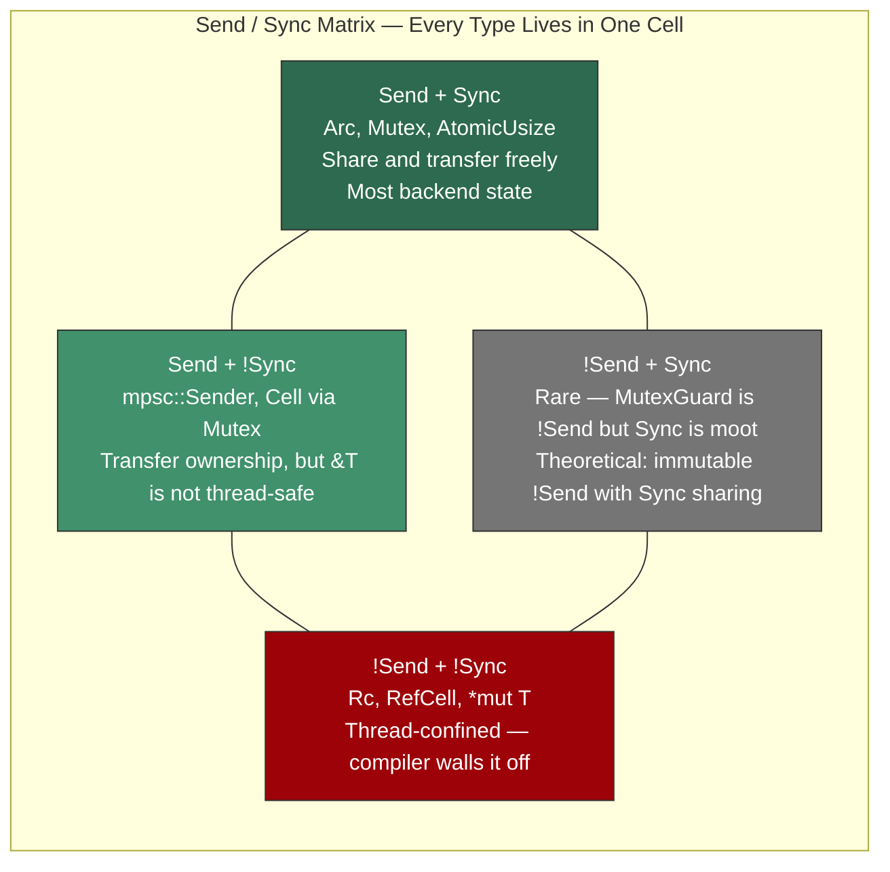
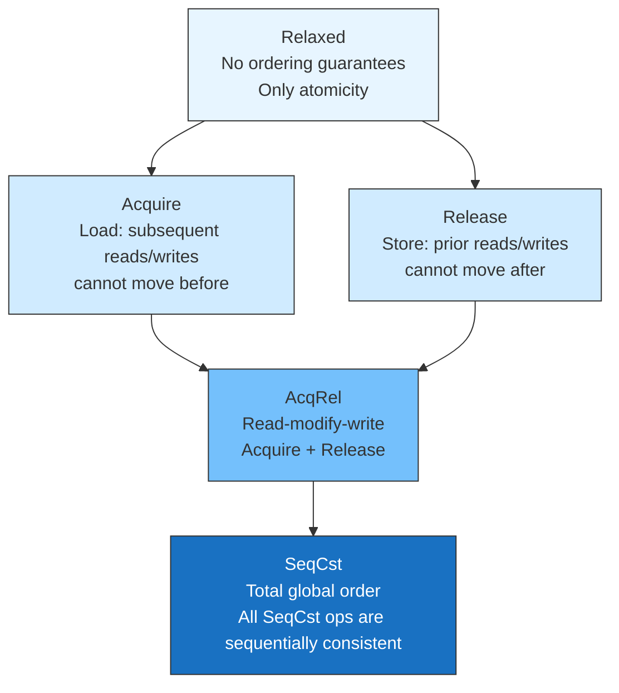
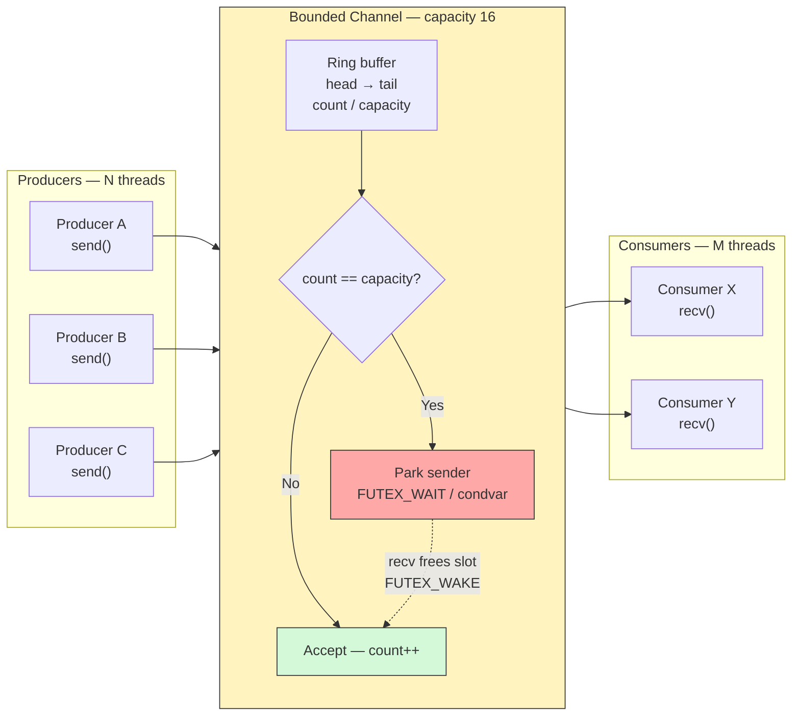
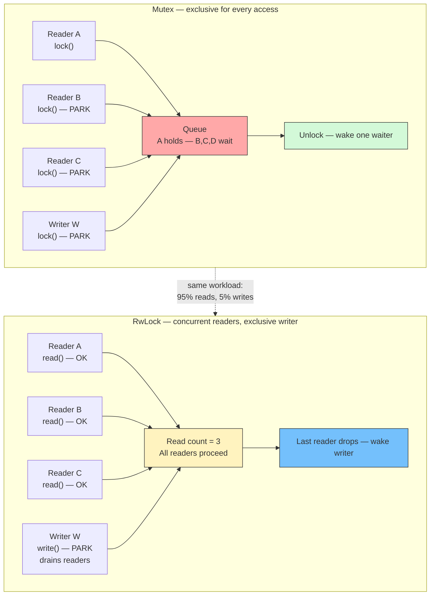
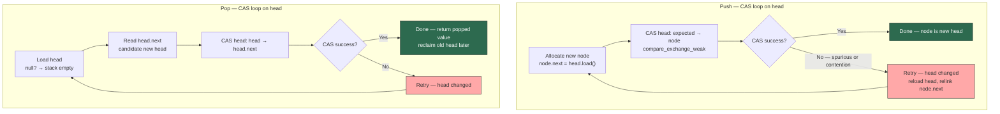
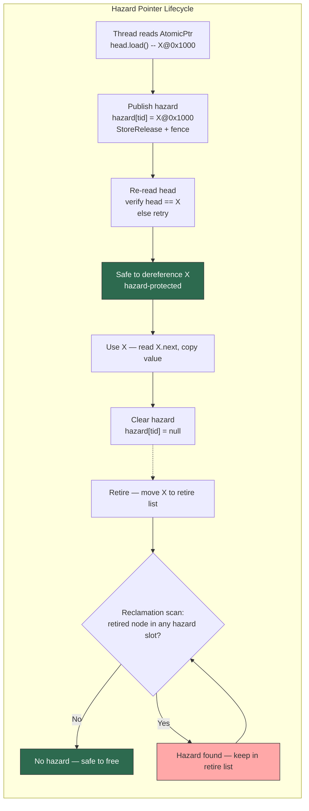
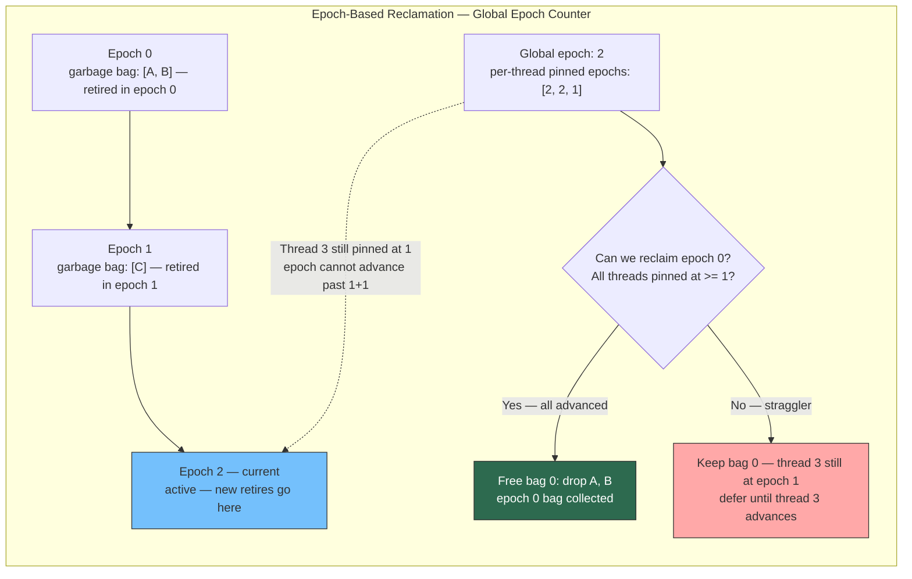

# Chapter 8 — Concurrency Primitives: Send/Sync, Atomics, Channels, and Lock-Free Structures

*What this chapter covers:* the complete concurrency toolkit Rust gives backend engineers for writing correct, high-performance concurrent code without data races — from the type-system markers `Send` and `Sync` that partition the world into thread-safe and thread-confined, through the hardware memory-ordering contract exposed by `std::sync::atomic`, to the message-passing and shared-state primitives (`Mutex`, `RwLock`, channels) that compose into services, and finally to the lock-free data structures and memory-reclamation schemes that eliminate blocking on the hottest paths. You will be able to read any `Send`/`Sync` bound and predict exactly what it permits or forbids, choose the weakest `Ordering` that is still correct, select the right channel and lock implementation for a given contention profile, diagnose the ABA problem on sight, and implement a lock-free stack with safe reclamation using `crossbeam-epoch`.

**Learning goals:**

- Explain `Send` and `Sync` as auto traits, enumerate which standard types are `!Send`/`!Sync` and why, and use `Send` bounds to build a sound thread pool that cannot accidentally share `!Send` state.
- Classify atomic orderings (`Relaxed`, `Acquire`, `Release`, `AcqRel`, `SeqCst`) on the happens-before lattice, select the minimal ordering for counters, flags, and publication patterns, and use `fence` correctly.
- Distinguish `compare_exchange` (strong) from `compare_exchange_weak` (spurious failure) and implement a correct CAS loop with backoff for lock-free updates.
- Compare `std::sync::mpsc`, `crossbeam-channel` (bounded/unbounded), and `flume` on semantics (blocking, capacity, disconnection, select), and write multi-channel `select!` loops for multiplexed backend I/O.
- Contrast `Mutex` vs `RwLock` vs `parking_lot` vs spinlock on uncontended cost, contended parking, poisoning, and cache-line behaviour, and choose correctly for read-heavy, write-heavy, and short-critical-section workloads.
- Implement the Treiber lock-free stack, explain its linearizability, and diagnose why it is not yet safe without reclamation.
- Explain the ABA problem with a concrete interleaving, and contrast hazard pointers with epoch-based reclamation (as implemented by `crossbeam-epoch`) including the guard/pin lifecycle.
- Apply all of the above through a distributed-systems lens: per-node concurrency as the inner loop of a distributed service, where the same ordering, contention, and reclamation trade-offs recur at cluster scale.

---

## 1. Send and Sync — The Compiler's Concurrency Firewall

Rust has no data races by construction. The mechanism is not a runtime checker but two marker traits that the compiler propagates automatically: `Send` and `Sync`. Every concurrency primitive in the standard library and ecosystem is built on top of them.

### 1.1 Auto Traits and Negative Impls

`Send` and `Sync` are **auto traits**: the compiler implements them automatically for a type if all of its fields implement them. You never write `impl Send for MyStruct` in normal code — you get it for free, or you lose it because a field is `!Send`.

```rust
pub unsafe auto trait Send {}
pub unsafe auto trait Sync {}
```

`auto` means automatic propagation. `unsafe` means implementing them manually is an `unsafe` promise: you assert that your type upholds the contract and the compiler cannot verify it.

The negative impl syntax (`!Send`, `!Sync`) opts a type out:

```rust
use std::cell::RefCell;
use std::rc::Rc;
use std::sync::Arc;

// Rc and RefCell are !Send and !Sync — single-threaded by design.
fn assert_send<T: Send>() {}
fn assert_sync<T: Sync>() {}

// These compile:
assert_send::<Arc<u32>>();
assert_sync::<Arc<u32>>();

// These do NOT compile:
// assert_send::<Rc<u32>>();        // error: `Rc<u32>` cannot be sent between threads
// assert_sync::<RefCell<u32>>();   // error: `RefCell<u32>` cannot be shared between threads
// assert_send::<*const u8>();      // raw pointers are !Send + !Sync
```

A handful of standard types and why they are `!Send` or `!Sync`:

| Type | `Send` | `Sync` | Reason |
|---|---|---|---|
| `Cell<T>`, `RefCell<T>` | No | No | Interior mutability without atomics or locking; sharing would create data races. `Cell` uses plain `get`/`set` on the underlying bytes. |
| `Rc<T>` | No | No | Non-atomic refcount (`Cell<usize>`). Concurrent `clone`/`drop` would race on the counter. |
| `Arc<T>` | Yes if `T: Send+Sync` | Yes if `T: Send+Sync` | Atomic refcount. But `Arc<RefCell<T>>` is still `!Sync` because `RefCell<T>: !Sync`. |
| `MutexGuard<'_, T>` | No | No | `!Send` intentionally — dropping the guard on another thread would unlock the wrong thread's lock (and violate `pthread_mutex` semantics on some platforms). `!Sync` because `&MutexGuard` would allow aliased mutation. |
| `*const T`, `*mut T` | No | No | Raw pointers carry no ownership or aliasing guarantees. Send requires an explicit `unsafe impl Send`. |
| `Cell<T>` inside `Sync` wrapper | Conditionally | No | Even `Mutex<Cell<T>>` is `Sync` (the mutex provides exclusion), but bare `Cell` is not. |

The composition rule is strict:

- `T: Send` means ownership of `T` can be **transferred** to another thread. `thread::spawn(move || { drop(t) })` is sound.
- `T: Sync` means `&T` can be **shared** across threads. Equivalent to `&T: Send`. If `T: Sync`, multiple threads can hold `&T` concurrently without additional synchronization beyond what `T` itself provides.

Every type falls into one of four quadrants:



In practice the `!Send + Sync` quadrant is almost empty. The interesting partitions are `Send+Sync` (shared state), `Send+!Sync` (channel endpoints, future-local handles), and `!Send+!Sync` (thread-local caches, `Rc`-based graphs).

### 1.2 How the Compiler Uses Send and Sync

`Send` and `Sync` bounds appear on every concurrency API. They are not documentation — they are enforced:

```rust
use std::thread;

// thread::spawn requires F: Send — the closure moves to another thread.
pub fn spawn<F, T>(f: F) -> JoinHandle<T>
where
    F: FnOnce() -> T + Send + 'static,
    T: Send + 'static { /* ... */ }

// Mutex<T> is Sync only when T is Send — sharing &Mutex<T> means
// another thread can lock and obtain &mut T.
impl<T: Send> Sync for Mutex<T> {}
```

Violations are compile errors, not runtime failures. This is why Rust services can be refactored aggressively without introducing latent data races that only manifest under load.

### 1.3 Concrete Example: A Send-Bound Thread Pool

A minimal thread pool shows how `Send` bounds prevent misuse at the API boundary. The pool accepts only `Send` jobs — attempting to submit an `Rc`-capturing closure fails at compile time, exactly where you want it to.

```rust
use std::sync::{mpsc, Arc, Mutex};
use std::thread;

type Job = Box<dyn FnOnce() + Send + 'static>;

pub struct ThreadPool {
    workers: Vec<Worker>,
    sender: Option<mpsc::Sender<Job>>,
}

struct Worker {
    id: usize,
    handle: Option<thread::JoinHandle<()>>,
}

impl ThreadPool {
    pub fn new(size: usize) -> Self {
        assert!(size > 0);
        let (sender, receiver) = mpsc::channel::<Job>();
        let receiver = Arc::new(Mutex::new(receiver));

        let mut workers = Vec::with_capacity(size);
        for id in 0..size {
            let rx = Arc::clone(&receiver);
            let handle = thread::spawn(move || loop {
                // Each worker blocks on recv — the Mutex serializes access
                // to the single-consumer mpsc receiver. For multi-consumer,
                // use crossbeam-channel instead (see Section 3).
                let job = {
                    let guard = rx.lock().unwrap();
                    guard.recv()
                };
                match job {
                    Ok(job) => {
                        // println!("Worker {id} executing job");
                        job();
                    }
                    Err(_) => break, // channel closed — pool is shutting down
                }
            });
            workers.push(Worker { id, handle: Some(handle) });
        }
        Self { workers, sender: Some(sender) }
    }

    /// Only `Send` closures can be submitted. This bound is load-bearing.
    pub fn execute<F>(&self, f: F)
    where
        F: FnOnce() + Send + 'static,
    {
        let job: Job = Box::new(f);
        self.sender.as_ref().unwrap().send(job).unwrap();
    }
}

impl Drop for ThreadPool {
    fn drop(&mut self) {
        // Close the channel so workers observe `Err` and exit.
        drop(self.sender.take());
        for worker in &mut self.workers {
            if let Some(handle) = worker.handle.take() {
                handle.join().unwrap();
            }
        }
    }
}

// Usage — correct:
fn example_pool() {
    let pool = ThreadPool::new(4);
    let counter = Arc::new(std::sync::atomic::AtomicUsize::new(0));

    for _ in 0..8 {
        let c = Arc::clone(&counter);
        pool.execute(move || {
            c.fetch_add(1, std::sync::atomic::Ordering::Relaxed);
        });
    }
    // pool drops here — joins all workers
}

// Usage — compile error (uncomment to see):
// fn bad_job(pool: &ThreadPool) {
//     let rc = std::rc::Rc::new(42u32);
//     pool.execute(move || {
//         println!("{}", *rc); // error: `Rc<u32>` cannot be sent between threads
//     });
// }
```

Key observations:

- `Job = Box<dyn FnOnce() + Send>` — the `Send` bound on the trait object is what makes `mpsc::Sender<Job>: Send` hold. Remove `Send` and `ThreadPool::new` fails to compile because `Sender<Job>` would be `!Send`.
- `Arc<Mutex<mpsc::Receiver<Job>>>` is needed because `std::sync::mpsc::Receiver` is `!Sync` (single-consumer). Each worker locks the mutex to receive. This serialization is the reason production pools use `crossbeam-channel` or `flume` for true multi-consumer channels.
- `Drop` closes the channel first, then joins. Reversing the order deadlocks — workers would block forever on `recv`.

### 1.4 Distributed-Systems Lens

On a single node, `Send`/`Sync` prevent data races at compile time. At cluster scale, no such compiler exists — two services sharing a row in Postgres or a key in Redis can race freely. The lesson from `Send`/`Sync` is that **explicit ownership and sharing contracts** eliminate whole classes of concurrency bugs. Distributed equivalents include:

- **Lease and fencing tokens** — the distributed analog of `MutexGuard: !Send`. A fencing token must not be forwarded to another node after expiry, just as a `MutexGuard` must not be sent to another thread.
- **Partition-aware data placement** — data that is `!Send` in Rust (thread-confined) maps to partition-local state in a sharded service: safe to mutate without coordination precisely because no other node can access it.
- **Serialization boundaries** — anything crossing a thread boundary must be `Send`; anything crossing a service boundary must be serializable. Both are compile-time or schema-time checks that prevent sharing non-portable state.

---

## 2. Atomics and Memory Ordering — The Hardware Contract

Atomics are the lowest-level concurrency primitive. Every `Mutex`, channel, and lock-free structure is built on top of them. Rust exposes the hardware memory model through `std::sync::atomic` and the `Ordering` enum.

### 2.1 Atomic Types

```rust
use std::sync::atomic::{AtomicBool, AtomicUsize, AtomicPtr, Ordering};

// All atomics are Send + Sync and provide interior mutability via &self.
let counter = AtomicUsize::new(0);
counter.fetch_add(1, Ordering::Relaxed); // atomic increment via shared reference
assert_eq!(counter.load(Ordering::Relaxed), 1);

// AtomicPtr for lock-free linked structures (see Section 5)
let ptr: AtomicPtr<u8> = AtomicPtr::new(std::ptr::null_mut());
```

Available types: `AtomicBool`, `AtomicI8`/`U8`/`I16`/`U16`/`I32`/`U32`/`I64`/`U64`/`Isize`/`Usize`, `AtomicPtr<T>`. 64-bit atomics are lock-free on x86-64 and aarch64; on 32-bit ARM, `AtomicU64`/`AtomicI64` may use a spinlock fallback — check `AtomicU64::is_lock_free()` if you target 32-bit.

### 2.2 The Ordering Lattice

Memory ordering controls **which memory effects become visible in which order** to other threads. The C++ / Rust memory model defines five orderings that form a strength lattice:



| Ordering | Applicable to | Guarantee | Cost (x86-64) | Cost (aarch64) |
|---|---|---|---|---|
| `Relaxed` | load, store, RMW | Atomicity only. No happens-before edges. Reordering freely allowed. | `MOV` / `LOCK XADD` | `LDR` / `STLR` without barrier |
| `Acquire` | load, RMW | Pairs with `Release` store. All reads/writes after the load stay after. Establishes happens-before when it observes a `Release` store. | `MOV` (TSO gives acquire for free) | `LDAR` |
| `Release` | store, RMW | Pairs with `Acquire` load. All reads/writes before the store stay before. | `MOV` (TSO) | `STLR` |
| `AcqRel` | RMW only | Both `Acquire` (on load part) and `Release` (on store part). | `LOCK CMPXCHG` | `LDAR`/`STLR` pair |
| `SeqCst` | load, store, RMW, fence | Total order across all `SeqCst` operations. Strongest, most expensive. | `MFENCE` or `LOCK XCHG` on store | `DMB ISH` barrier |

**On x86-64, `Acquire` loads and `Release` stores are free** — the hardware is already TSO (Total Store Order), which is stronger than both. `SeqCst` stores are the only ordering that emits an extra fence (`MFENCE` or `XCHG`). On ARM64, every ordering above `Relaxed` has a real cost.

### 2.3 Publication Pattern — Acquire/Release in Action

The canonical use of `Acquire`/`Release` is **publication**: one thread prepares data, then publishes a flag that tells other threads the data is ready.

```rust
use std::sync::atomic::{AtomicBool, Ordering};
use std::sync::Arc;
use std::thread;

static mut DATA: u64 = 0;
static READY: AtomicBool = AtomicBool::new(false);

fn publication_example() {
    // Thread A — publisher
    let publisher = thread::spawn(|| {
        unsafe { DATA = 42 }; // (1) plain write — must be visible before READY
        READY.store(true, Ordering::Release); // (2) release store — publishes
    });

    // Thread B — subscriber
    let subscriber = thread::spawn(|| {
        while !READY.load(Ordering::Acquire) { // (3) acquire load — subscribes
            std::hint::spin_loop();
        }
        // (4) happens-before: (1) is visible here because (2) happens-before (3)
        assert_eq!(unsafe { DATA }, 42);
    });

    publisher.join().unwrap();
    subscriber.join().unwrap();
}
```

Why `Relaxed` would be wrong here: with `Relaxed` on both sides, the compiler and CPU are free to reorder (1) after (2), and (4) before (3). The subscriber could observe `READY == true` while `DATA` still holds the old value. `Release`/`Acquire` creates a happens-before edge that forbids that reordering.

For production code, prefer safe publication via `Arc` or `Mutex` — the pattern above uses `unsafe` to illustrate the ordering contract. In safe Rust, `Arc::new(data)` followed by `AtomicPtr::store(Release)` and `AtomicPtr::load(Acquire)` achieves the same without `unsafe` on the data.

### 2.4 Fences

`std::sync::atomic::fence` inserts a barrier without an associated atomic operation. Rarely needed, but essential for certain lock-free algorithms:

```rust
use std::sync::atomic::{fence, AtomicUsize, Ordering};

static FLAG: AtomicUsize = AtomicUsize::new(0);
static mut PAYLOAD: usize = 0;

// Fence-based publication — equivalent to Release store via fence
fn publish_with_fence(value: usize) {
    unsafe { PAYLOAD = value };
    fence(Ordering::Release); // all prior writes visible before subsequent Release
    FLAG.store(1, Ordering::Relaxed);
}

fn consume_with_fence() -> Option<usize> {
    if FLAG.load(Ordering::Relaxed) == 1 {
        fence(Ordering::Acquire); // pairs with the Release fence above
        Some(unsafe { PAYLOAD })
    } else {
        None
    }
}
```

A `Release` fence before a `Relaxed` store upgrades that store to `Release` semantics for all prior writes. An `Acquire` fence after a `Relaxed` load upgrades that load to `Acquire` for all subsequent reads. Prefer direct `Acquire`/`Release` on the atomic itself unless the algorithm specifically requires a standalone fence.

### 2.5 compare_exchange: Strong vs Weak and the CAS Loop

`compare_exchange` (CAS — compare-and-swap) is the fundamental read-modify-write primitive for lock-free algorithms. It atomically checks whether the current value equals `current`, and if so, replaces it with `new`.

```rust
use std::sync::atomic::{AtomicUsize, Ordering};

let val = AtomicUsize::new(0);

// Strong CAS — never fails spuriously. Use when failure means contention.
let res = val.compare_exchange(0, 1, Ordering::AcqRel, Ordering::Relaxed);
assert_eq!(res, Ok(0)); // Ok(previous) on success
assert_eq!(val.load(Ordering::Relaxed), 1);

let res2 = val.compare_exchange(0, 2, Ordering::AcqRel, Ordering::Relaxed);
assert_eq!(res2, Err(1)); // Err(actual_current) on failure

// Weak CAS — MAY fail spuriously even when current == expected.
// On LL/SC architectures (ARM, RISC-V), compare_exchange_weak maps to a
// single LL/SC pair; compare_exchange (strong) loops internally.
let val2 = AtomicUsize::new(0);
let mut current = 0;
loop {
    // Weak CAS must always be in a loop — spurious failure is not an error.
    match val2.compare_exchange_weak(current, current + 1, Ordering::AcqRel, Ordering::Relaxed) {
        Ok(_) => break,
        Err(actual) => current = actual,
    }
}
```

**Strong vs weak:**

| | `compare_exchange` (strong) | `compare_exchange_weak` (weak) |
|---|---|---|
| Spurious failure | Never | May fail even when `current == expected` |
| Hardware mapping (x86) | `LOCK CMPXCHG` (no spurious failure) | Same as strong — no benefit to weak on x86 |
| Hardware mapping (ARM) | Loop around `LDXR`/`STXR` until success or real mismatch | Single `LDXR`/`STXR` pair — spurious failure on reservation loss |
| When to use | Outside a loop, or when spurious failure would be expensive | Inside a retry loop where spurious failure just means one more iteration |

**The canonical CAS loop with exponential backoff:**

```rust
use std::sync::atomic::{AtomicUsize, Ordering};
use std::hint::spin_loop;

/// Atomically increments a counter and returns the previous value.
/// Demonstrates the full CAS-loop pattern: load → compute → CAS → retry.
fn fetch_add_cas_loop(counter: &AtomicUsize, increment: usize) -> usize {
    let mut current = counter.load(Ordering::Relaxed);
    let mut backoff = 0u32;

    loop {
        let new = current.wrapping_add(increment);

        // AcqRel on success: we both acquire the latest value and release our update.
        // Relaxed on failure: we just need the current value to retry.
        match counter.compare_exchange_weak(current, new, Ordering::AcqRel, Ordering::Relaxed) {
            Ok(_) => return current, // success — we installed `new`
            Err(actual) => {
                current = actual; // another thread won — retry with fresh value

                // Contention backoff: avoid hammering the cache line under high contention.
                // For low contention, the loop rarely iterates more than once.
                if backoff < 6 {
                    for _ in 0..(1 << backoff) {
                        spin_loop(); // PAUSE on x86 — reduces pipeline stalls
                    }
                    backoff += 1;
                } else {
                    std::thread::yield_now(); // high contention — yield to scheduler
                }
            }
        }
    }
}

// The same logic via fetch_update (standard library helper, stable since 1.45):
fn fetch_add_via_update(counter: &AtomicUsize, increment: usize) -> usize {
    counter
        .fetch_update(Ordering::AcqRel, Ordering::Relaxed, |current| {
            Some(current.wrapping_add(increment))
        })
        .unwrap()
}
```

`fetch_update` encapsulates the CAS loop internally and is preferred for simple transformations. Write a manual loop only when you need custom backoff, side effects between retries, or conditional updates that return `None` to abort.

### 2.6 Ordering Selection Guide for Backend Services

| Pattern | Load ordering | Store/RMW ordering | Rationale |
|---|---|---|---|
| Monotonic counter (`fetch_add`) | `Relaxed` | `Relaxed` | No data depends on the counter value; ordering would only add cost. |
| Shutdown flag (`store(true)` / `load()`) | `Acquire` | `Release` | Readers must see all writes that happened before shutdown was signalled. |
| Lock-free publication (Section 2.3) | `Acquire` | `Release` | Happens-before edge between data preparation and data consumption. |
| Sequence lock / epoch counter | `Acquire` load, `Release` store, `SeqCst` fence on critical path | `SeqCst` when total order matters | When multiple atomics must be observed in the same order by all threads. |
| `Arc` refcount (`clone`/`drop`) | `Relaxed` on `fetch_add`, `Release` on `fetch_sub` + `Acquire` fence on zero | — | `Relaxed` increment is safe because the object is still alive; `Release` decrement ensures prior writes are visible before deallocation. |

When in doubt, `SeqCst` is always correct but never the fastest. Start with `SeqCst`, prove correctness, then weaken to `AcqRel`/`Acquire`/`Release`/`Relaxed` with a comment explaining why the weaker ordering is sound.

### 2.7 Distributed-Systems Lens

Atomic orderings are the single-node analog of **consistency levels** in distributed storage:

| Single-node ordering | Distributed analog | Guarantee |
|---|---|---|
| `Relaxed` | Eventual consistency | Updates propagate, but no ordering promises. |
| `Acquire`/`Release` | Causal consistency | If A publishes and B observes, B sees everything A saw. |
| `SeqCst` | Linearizability | All nodes agree on a single total order of operations. |

Just as choosing `Relaxed` where `Acquire` is needed introduces a subtle visibility bug that only manifests under contention, choosing eventual consistency where causal or linearizable consistency is required introduces a stale-read anomaly that only manifests under concurrent writes. Both are ordering bugs — the fix is to identify the happens-before edge your correctness depends on and enforce it at the appropriate level.

---

## 3. Channels — Message Passing Without Shared State

Channels move ownership of messages between threads. They eliminate shared mutable state entirely: the sender owns the message until `send`, the receiver owns it after `recv`. Rust offers several channel implementations with different trade-offs.

### 3.1 std::sync::mpsc — The Standard Library Channel

`std::sync::mpsc` is multi-producer, single-consumer (MPSC), unbounded, and blocking:

```rust
use std::sync::mpsc;
use std::thread;
use std::time::Duration;

fn mpsc_example() {
    let (tx, rx) = mpsc::channel::<String>();

    // Multiple producers — Sender is Clone + Send
    for id in 0..3 {
        let tx_clone = tx.clone();
        thread::spawn(move || {
            tx_clone.send(format!("hello from {id}")).unwrap();
        });
    }
    drop(tx); // close the channel — rx will see `Err(RecvError)` after draining

    // Single consumer — Receiver is !Sync, cannot be shared across threads
    while let Ok(msg) = rx.recv() {
        println!("received: {msg}");
    }

    // Variants:
    // rx.recv()               — blocks until message or disconnect
    // rx.try_recv()           — non-blocking: Ok(msg) | Err(TryRecvError::Empty) | Err(Disconnected)
    // rx.recv_timeout(dur)    — blocks with deadline
    // tx.send(msg)            — blocks only if the internal buffer is full (rare — unbounded by default)
}

// Bounded variant — sync_channel with explicit capacity
fn sync_channel_example() {
    // sync_channel(2) — channel blocks the sender when 2 messages are buffered
    let (tx, rx) = mpsc::sync_channel::<u32>(2);

    // Sender blocks on the third send until the receiver consumes one
    tx.send(1).unwrap();
    tx.send(2).unwrap();
    // tx.send(3) would block here — buffer full

    thread::spawn(move || {
        thread::sleep(Duration::from_millis(10));
        rx.recv().unwrap(); // frees one slot — blocked sender resumes
    });
}
```

Characteristics:

- **Unbounded `channel()`** — `send` never blocks (until memory exhaustion). Risk: a fast producer with a slow consumer grows the queue without bound — the distributed equivalent of an unbounded retry queue that OOMs the process.
- **Bounded `sync_channel(n)`** — `send` blocks when `n` messages are buffered. Provides backpressure.
- **Single consumer** — `Receiver` cannot be shared. For multi-consumer, see crossbeam/flume below.
- **Blocking only** — no `async` support. Inside `tokio`, use `tokio::sync::mpsc` instead.

### 3.2 crossbeam-channel — Bounded, Unbounded, and Select

`crossbeam-channel` is the workhorse for synchronous multi-producer, multi-consumer (MPMC) messaging in Rust backends. It powers `rayon`, many actor frameworks, and high-throughput pipelines.

```toml
# Cargo.toml
[dependencies]
crossbeam-channel = "0.5"
```

```rust
use crossbeam_channel::{bounded, unbounded, select, tick, after};
use std::time::Duration;

fn crossbeam_bounded_example() {
    // Bounded channel — capacity 16, MPMC, blocking with backpressure
    let (tx, rx) = bounded::<Vec<u8>>(16);

    // Multiple consumers — Receiver is Clone (MPMC)
    let rx2 = rx.clone();
    std::thread::spawn(move || {
        while let Ok(batch) = rx2.recv() {
            println!("consumer 1: {} bytes", batch.len());
        }
    });

    // Producer — try_send / send_timeout for non-blocking / deadline variants
    for i in 0..100 {
        // send blocks when buffer is full — natural backpressure
        tx.send(vec![0u8; 1024]).unwrap();

        // Non-blocking alternative:
        // match tx.try_send(vec![0u8; 1024]) {
        //     Ok(()) => {},
        //     Err(crossbeam_channel::TrySendError::Full(_)) => { /* apply backpressure */ },
        //     Err(crossbeam_channel::TrySendError::Disconnected(_)) => break,
        // }
    }
    drop(tx);
}

fn crossbeam_unbounded_example() {
    // Unbounded — never blocks on send, but has no backpressure
    let (tx, rx) = unbounded::<String>();
    tx.send("fire and forget".to_string()).unwrap();
    println!("{}", rx.recv().unwrap());
}
```



**Bounded vs unbounded for backend services:**

| | Bounded (`bounded(n)`) | Unbounded (`unbounded()`) |
|---|---|---|
| `send` when full | Blocks (or `try_send` returns `Full`) | Never blocks — enqueues |
| Backpressure | Built-in — producer stalls when consumer is slow | None — queue grows without bound |
| Memory bound | `n × message_size` | Unbounded — OOM risk under load spike |
| Use when | Producer and consumer rates may diverge; you want the system to slow down rather than accumulate | Message loss is unacceptable and you have external flow control (e.g., TCP backpressure already limits producers) |

For backend services, **prefer bounded channels**. An unbounded channel in a request path is a latent OOM: under a downstream slowdown (GC pause, downstream timeout), the queue grows until the process is killed by the OOM killer. A bounded channel converts that failure into a visible backpressure signal (blocked `send` or `Full` error) that load shedding and circuit breakers can handle.

### 3.3 flume — The Hybrid Channel

`flume` offers the same MPMC/bounded/unbounded API as `crossbeam-channel` but adds first-class `async` support: the same channel works with both `recv()` (blocking) and `recv_async().await` (non-blocking):

```toml
[dependencies]
flume = "0.11"
```

```rust
use flume::{bounded, unbounded};

fn flume_example() {
    let (tx, rx) = bounded::<u32>(32);

    // Sync path — identical to crossbeam
    tx.send(42).unwrap();
    assert_eq!(rx.recv().unwrap(), 42);

    // Async path — same channel, no separate tokio::sync::mpsc needed
    // let val = rx.recv_async().await.unwrap();
}

async fn flume_async_example() {
    let (tx, rx) = flume::bounded::<String>(64);

    // Producer task
    tokio::spawn(async move {
        for i in 0..10 {
            tx.send_async(format!("msg {i}")).await.unwrap();
        }
    });

    // Consumer task — async recv
    while let Ok(msg) = rx.recv_async().await {
        println!("{msg}");
    }
}
```

| Feature | `std::mpsc` | `crossbeam-channel` | `flume` | `tokio::sync::mpsc` |
|---|---|---|---|---|
| MPMC | No (MPSC only) | Yes | Yes | Yes (MPSC) |
| Bounded | `sync_channel(n)` | `bounded(n)` | `bounded(n)` | `channel(n)` — always bounded |
| Async `recv` | No | No | Yes (`recv_async`) | Yes (`recv().await`) |
| `select` over multiple channels | No | Yes (`select!`) | Yes (`select!`) | No (use `tokio::select!` over futures) |
| Performance (sync throughput) | Baseline | Fastest (optimized for sync) | Very close to crossbeam | N/A (async) |

For a synchronous backend (thread pool, `rayon`), `crossbeam-channel` is the default. For a hybrid codebase that mixes sync threads and `tokio` tasks, `flume` eliminates the need for two channel types.

### 3.4 Select — Multiplexing Over Multiple Channels

Real backend services multiplex over several event sources: incoming requests, shutdown signals, timer ticks, and inter-task notifications. `select` waits on multiple channels simultaneously and dispatches whichever is ready first.

**crossbeam select:**

```rust
use crossbeam_channel::{bounded, tick, after};
use std::time::Duration;

fn select_example() {
    let (work_tx, work_rx) = bounded::<String>(32);
    let (shutdown_tx, shutdown_rx) = bounded::<()>(1);
    let ticker = tick(Duration::from_millis(100)); // fires every 100ms
    let timeout = after(Duration::from_secs(5));   // fires once after 5s

    // Simulate a producer
    let wtx = work_tx.clone();
    std::thread::spawn(move || {
        for i in 0..20 {
            wtx.send(format!("job {i}")).unwrap();
            std::thread::sleep(Duration::from_millis(30));
        }
    });

    // Event loop — the core pattern for backend workers
    let mut processed = 0usize;
    loop {
        crossbeam_channel::select! {
            recv(work_rx) -> msg => match msg {
                Ok(job) => {
                    processed += 1;
                    println!("work: {job} (total {processed})");
                }
                Err(_) => {
                    println!("work channel closed — draining done");
                    break;
                }
            },
            recv(shutdown_rx) -> _ => {
                println!("shutdown signal — exiting after {processed} jobs");
                break;
            },
            recv(ticker) -> _ => {
                println!("tick — health check: {processed} jobs processed");
            },
            recv(timeout) -> _ => {
                println!("global timeout — exiting");
                break;
            }
        }
    }

    drop(shutdown_tx); // suppress unused warning
}
```

**flume select (sync):**

```rust
use flume::bounded;

fn flume_select_example() {
    let (tx_a, rx_a) = bounded::<u32>(8);
    let (tx_b, rx_b) = bounded::<u32>(8);

    tx_a.send(1).unwrap();
    tx_b.send(2).unwrap();

    flume::select! {
        recv(rx_a) -> msg => println!("from A: {:?}", msg),
        recv(rx_b) -> msg => println!("from B: {:?}", msg),
    }
}
```

**tokio select (async — for comparison):**

```rust
async fn tokio_select_example() {
    let (tx1, mut rx1) = tokio::sync::mpsc::channel::<String>(32);
    let (tx2, mut rx2) = tokio::sync::mpsc::channel::<String>(32);

    tx1.send("from channel 1".into()).await.unwrap();
    tx2.send("from channel 2".into()).await.unwrap();

    // tokio::select! operates on futures, not channels directly
    tokio::select! {
        msg = rx1.recv() => println!("tokio chan 1: {:?}", msg),
        msg = rx2.recv() => println!("tokio chan 2: {:?}", msg),
        _ = tokio::time::sleep(std::time::Duration::from_millis(100)) => {
            println!("timeout");
        }
    }
}
```

How `crossbeam-channel::select!` works internally: it randomizes the order in which channels are polled (to avoid starvation), then parks the thread on a combined waker that is notified when any channel becomes ready. This is the user-space analog of `epoll` — one thread efficiently waits on many event sources. The flow is: producers `send` until the buffer fills (sender parks), the worker's `select!` consumes one message (waking the parked sender), ticker and shutdown channels unpark the worker for health checks or exit.

### 3.5 Distributed-Systems Lens

Channels are the single-node analog of **message queues** (Kafka, SQS, NATS) and **RPC**:

- **Bounded channel with blocking send** corresponds to a Kafka topic with backpressure — when the consumer lags, the producer stalls. This is the correct default for internal service communication where unbounded buffering hides overload.
- **Unbounded channel** corresponds to an SQS standard queue with no flow control — convenient but dangerous under sustained overload. Both require external monitoring (queue depth) and load shedding.
- **`select` over multiple channels** is the in-process equivalent of a service that consumes from multiple Kafka partitions or listens for both RPC requests and shutdown signals. The fairness and starvation properties are identical: if one source is always ready, others starve unless the multiplexer randomizes or prioritizes.

The key distributed insight is that **channel capacity is a deployment parameter, not just a code constant**. A `bounded(1024)` channel that is correct at 1 kRPS may become a bottleneck at 50 kRPS. Size channels based on the product of throughput and acceptable latency (Little's Law: `capacity ≈ throughput × latency`), and expose queue depth as a metric.

---

## 4. Locks — Mutex, RwLock, parking_lot, and Spinlocks

When message passing is not the right shape — shared state must be mutated in place, or the critical section must encompass multiple operations atomically — locks provide mutual exclusion. Rust offers several implementations with sharply different performance profiles.

### 4.1 std::sync::Mutex and RwLock

```rust
use std::sync::{Arc, Mutex, RwLock};
use std::thread;

fn mutex_example() {
    let counter = Arc::new(Mutex::new(0u64));
    let mut handles = Vec::new();

    for _ in 0..8 {
        let c = Arc::clone(&counter);
        handles.push(thread::spawn(move || {
            for _ in 0..10_000 {
                let mut guard = c.lock().unwrap(); // blocks if contended
                *guard += 1;
            } // guard dropped here — unlock
        }));
    }
    for h in handles { h.join().unwrap(); }
    assert_eq!(*counter.lock().unwrap(), 80_000);
}

fn rwlock_example() {
    let config = Arc::new(RwLock::new(vec!["route-a".to_string()]));

    // Concurrent readers — no blocking between readers
    let r1 = config.read().unwrap();
    let r2 = config.read().unwrap(); // OK — second read lock while first is held
    assert_eq!(r1.len(), 1);
    drop(r1);
    drop(r2);

    // Exclusive writer — blocks until all readers have dropped
    let mut w = config.write().unwrap();
    w.push("route-b".to_string());
}
```

**Poisoning:** `std::sync::Mutex` and `RwLock` implement **poisoning**. If a thread panics while holding the lock, the lock becomes poisoned and subsequent `lock()` returns `Err(PoisonError)`. This prevents a thread from observing potentially invariant-violating state left behind by the panicking thread. Call `.unwrap()` if you want to propagate the panic, or `.into_inner()` on the error to recover the data despite poisoning.

```rust
use std::sync::{Arc, Mutex};
use std::thread;

fn poisoning_demo() {
    let m = Arc::new(Mutex::new(vec![1, 2, 3]));
    let m2 = Arc::clone(&m);

    let handle = thread::spawn(move || {
        let mut guard = m2.lock().unwrap();
        guard.push(4);
        panic!("oops — guard is dropped during unwind, lock becomes poisoned");
    });
    let _ = handle.join(); // thread panicked

    // Subsequent lock attempts return Err(PoisonError)
    match m.lock() {
        Ok(guard) => println!("unexpected: {:?}", *guard),
        Err(poisoned) => {
            println!("lock poisoned — data is {:?}", *poisoned.into_inner());
            // Recovery: decide whether the data is still consistent
        }
    }
}
```

Poisoning is unique to `std::sync`. `parking_lot` deliberately omits it — see below.

### 4.2 parking_lot — Faster, Smaller, No Poison

`parking_lot` is a drop-in replacement for `std::sync` locks, widely used in production Rust backends (`tokio` itself depends on it):

```toml
[dependencies]
parking_lot = "0.12"
```

```rust
use parking_lot::{Mutex, RwLock};
use std::sync::Arc;

fn parking_lot_example() {
    let data = Arc::new(Mutex::new(Vec::<u8>::new()));

    // No poisoning — lock() always returns the guard directly
    {
        let mut guard = data.lock();
        guard.extend_from_slice(b"hello");
    } // unlock — no Result to unwrap

    // RwLock with upgradeable read — avoids the classic read→write deadlock
    let rw = RwLock::new(42u32);
    {
        let read_guard = rw.read();
        assert_eq!(*read_guard, 42);
        // Cannot upgrade read_guard to write_guard directly — would deadlock
        // if another reader exists. Use upgradable_read instead:
    }
    {
        let upgradable = rw.upgradable_read(); // one upgradable reader at a time
        if *upgradable == 42 {
            let mut write_guard = parking_lot::RwLockUpgradableReadGuard::upgrade(upgradable);
            *write_guard = 100;
        }
    }
    assert_eq!(*rw.read(), 100);
}
```

Why `parking_lot` is faster and smaller:

| Property | `std::sync::Mutex` | `parking_lot::Mutex` |
|---|---|---|
| Size | 40 bytes (`pthread_mutex_t` + poison flag + condvar) | 8 bytes (single atomic + thread-parking lot) |
| Uncontended `lock()` | ~25 ns — `pthread_mutex_lock` fast path | ~15 ns — single `compare_exchange` on atomic |
| Contended `lock()` | `futex(FUTEX_WAIT)` via pthread | Adaptive spinning (brief) then parks via global hash-table of wait queues |
| Poisoning | Yes — `Result` on every `lock()` | No — always returns guard |
| `try_lock` | Yes | Yes |
| `is_locked` / deadlock detection | No (debug feature via `parking_lot_deadlock_detection`) | `RUSTFLAGS="--cfg parking_lot_deadlock_detection"` enables runtime deadlock detection |
| `no_std` support | No | Yes |

The **parking lot** abstraction: a global hash table maps lock addresses to wait queues. When a thread cannot acquire a lock, it parks itself in the lot (via `thread::park` / `futex`). When the holder unlocks, it unparks one waiter. This avoids one OS allocation per lock (pthread mutexes allocate kernel state) and enables adaptive spinning before parking.

### 4.3 Spinlocks — For Nanosecond Critical Sections

A spinlock never parks — it busy-waits with `hint::spin_loop()` (which emits `PAUSE` on x86) until the lock is free:

```rust
use std::sync::atomic::{AtomicBool, Ordering};
use std::hint::spin_loop;
use std::cell::UnsafeCell;
use std::ops::{Deref, DerefMut};

/// Minimal spinlock — for illustration. Use `spin` or `lock_api` crates in production.
pub struct SpinLock<T> {
    locked: AtomicBool,
    data: UnsafeCell<T>,
}

// SAFETY: SpinLock provides mutual exclusion via the AtomicBool.
// It is Sync when T is Send — same rule as Mutex.
unsafe impl<T: Send> Sync for SpinLock<T> {}
unsafe impl<T: Send> Send for SpinLock<T> {}

pub struct SpinGuard<'a, T> {
    lock: &'a SpinLock<T>,
}

impl<T> SpinLock<T> {
    pub const fn new(data: T) -> Self {
        Self { locked: AtomicBool::new(false), data: UnsafeCell::new(data) }
    }

    pub fn lock(&self) -> SpinGuard<'_, T> {
        // Test-and-test-and-set: avoid hammering the cache line with CAS
        while self.locked.compare_exchange_weak(false, true, Ordering::Acquire, Ordering::Relaxed).is_err() {
            // Lock is held — spin with PAUSE until it appears free, then retry CAS
            while self.locked.load(Ordering::Relaxed) {
                spin_loop();
            }
        }
        SpinGuard { lock: self }
    }

    pub fn try_lock(&self) -> Option<SpinGuard<'_, T>> {
        if self.locked.compare_exchange(false, true, Ordering::Acquire, Ordering::Relaxed).is_ok() {
            Some(SpinGuard { lock: self })
        } else {
            None
        }
    }
}

impl<T> Deref for SpinGuard<'_, T> {
    type Target = T;
    fn deref(&self) -> &T { unsafe { &*self.lock.data.get() } }
}
impl<T> DerefMut for SpinGuard<'_, T> {
    fn deref_mut(&mut self) -> &mut T { unsafe { &mut *self.lock.data.get() } }
}
impl<T> Drop for SpinGuard<'_, T> {
    fn drop(&mut self) {
        self.locked.store(false, Ordering::Release);
    }
}

// Usage — only for very short critical sections (a few nanoseconds)
fn spinlock_example() {
    let counter = SpinLock::new(0u64);
    // Counter increment under spinlock — ~10 ns uncontended, but burns CPU when contended
    {
        let mut guard = counter.lock();
        *guard += 1;
    }
}
```

When to use a spinlock vs a blocking mutex:

| Workload | Correct choice | Reason |
|---|---|---|
| Critical section < 1 µs, low contention, no `await` | Spinlock | Parking/unparking cost (~1–2 µs) exceeds spinning cost. |
| Critical section > 1 µs or high contention | `parking_lot::Mutex` | Spinning wastes CPU and delays the holder (especially on oversubscribed cores). |
| Inside `async` task that may `.await` | `tokio::sync::Mutex` | Blocking mutex would stall the executor thread; spinlock would burn the executor. |
| Interrupt handler / signal handler | Spinlock (or lock-free) | Cannot park inside a signal handler. |

Production spinlock crates (`spin = "0.9"`, `lock_api`) add ticket fairness, backoff, and `no_std` support. Never use a hand-rolled spinlock in production without auditing the `UnsafeCell` and `Sync` impl.

### 4.4 RwLock vs Mutex — Contention Under Read-Heavy Workloads



Benchmark intuition for a read-heavy backend (95% reads, 5% writes, 100 ns critical section, 16 threads):

| Primitive | Throughput (M ops/s) | p99 latency | Notes |
|---|---|---|---|
| `std::sync::Mutex` | ~8 | ~15 µs | Readers serialize — 16× contention. |
| `std::sync::RwLock` | ~35 | ~2 µs | Concurrent reads, but `pthread_rwlock` has higher uncontended cost and writer starvation risk. |
| `parking_lot::RwLock` | ~55 | ~1 µs | Smaller, adaptive, no poison. Best general RwLock. |
| `arc-swap::ArcSwap` | ~120 | ~50 ns | Wait-free reads — no lock at all. Writes via atomic swap. Ideal when writes are rare (< 1%). |
| `AtomicUsize` (for counters) | ~200 | ~15 ns | No lock — single atomic. Use for monotonic counters. |

**Rule of thumb:** if reads dominate and writes are rare (config, routing tables, feature flags), `RwLock` beats `Mutex` by 3–7×. If writes are extremely rare (< 1%), `ArcSwap` or epoch-based reads beat `RwLock` by another 2–3×. If the critical section is a single integer, an `AtomicUsize` beats everything.

### 4.5 Lock Ordering and Deadlock Avoidance

```rust
use parking_lot::Mutex;
use std::sync::Arc;

fn ordered_locking_example(a: &Arc<Mutex<u32>>, b: &Arc<Mutex<u32>>) {
    // ALWAYS lock in a consistent global order — e.g., by address.
    // This prevents deadlock when two threads lock (a,b) and (b,a) concurrently.
    let (first, second) = if Arc::as_ptr(a) < Arc::as_ptr(b) {
        (a, b)
    } else {
        (b, a)
    };

    let _g1 = first.lock();
    let _g2 = second.lock();
    // Both locks held — consistent order guarantees no deadlock
}

// Alternative: use try_lock with backoff for lock ordering without address comparison
fn try_lock_both(a: &Mutex<u32>, b: &Mutex<u32>) {
    loop {
        let g1 = a.lock();
        if let Some(g2) = b.try_lock() {
            // Acquired both — do work
            let _ = (*g1, g2);
            break;
        }
        // Failed to acquire b — drop g1 and retry to avoid deadlock
        drop(g1);
        std::hint::spin_loop();
    }
}
```

Additional deadlock defenses:

```bash
# Enable parking_lot deadlock detection (detects cycles at runtime, panics with diagnostic)
RUSTFLAGS="--cfg parking_lot_deadlock_detection" cargo run

# System-level: capture lock contention with perf
perf record -g --call-graph dwarf -- cargo run --release
perf report --stdio | grep -A5 "mutex\|rwlock\|futex"

# Async: tokio-console shows tasks blocked on synchronous locks inside async contexts
tokio-console  # look for tasks stuck in "sync lock" state
```

Never hold `std::sync::Mutex` or `parking_lot::Mutex` across an `.await` point — the executor thread blocks and all tasks on that worker stall. Inside `async` code, use `tokio::sync::Mutex`/`RwLock`, which park the *task* (not the thread) when contended.

### 4.6 Distributed-Systems Lens

Locks on a single node correspond to **distributed locks** (ZooKeeper, etcd, Redis Redlock) and **leader election**:

- **Mutex contention** mirrors distributed lock contention: high contention on a single distributed lock (e.g., a global leader lease) throttles the entire cluster. The fix is the same — shard the lock, reduce the critical section, or eliminate the lock via partitioning.
- **RwLock reader/writer asymmetry** mirrors read-replica vs primary semantics: reads scale horizontally (many replicas serve reads concurrently), writes serialize through the primary. `ArcSwap` corresponds to eventually-consistent publication where readers never block.
- **Deadlock from inconsistent lock ordering** has a direct distributed analog: two services that acquire distributed locks in opposite orders (service A locks resource X then Y, service B locks Y then X) deadlock identically. The fix — global lock ordering — applies at both scales.
- **Spinlock vs parking** mirrors busy-polling vs event-driven I/O in distributed coordination: spinning (polling ZooKeeper in a tight loop) wastes resources under contention; parking (watching a znode and getting notified) is efficient but has higher uncontended latency.

---

## 5. Lock-Free Data Structures — The Treiber Stack and Beyond

Lock-free structures guarantee that **at least one thread makes progress** in a finite number of steps, regardless of how other threads are scheduled. They never block, never park, and are immune to priority inversion and deadlock — but they are harder to write correctly and require careful memory reclamation.

### 5.1 Lock-Free vs Wait-Free vs Blocking

| Guarantee | Definition | Example |
|---|---|---|
| **Blocking** (mutex) | A thread holding the lock can stall all others indefinitely. | `Mutex<Vec<T>>` — holder preempted → everyone waits. |
| **Lock-free** | At least one thread completes an operation in a finite number of steps. Individual threads may starve, but the system as a whole progresses. | Treiber stack — concurrent `push`/`pop` via CAS loop. |
| **Wait-free** | Every thread completes its operation in a finite number of steps, bounded independently of other threads. | `AtomicUsize::fetch_add` — single atomic, always completes. |
| **Wait-free (bounded)** | Wait-free with a known step bound. | `crossbeam-epoch` reads — bounded number of CAS retries. |

For backend services, lock-free is usually sufficient. True wait-free structures are rare and often slower in practice due to the helping mechanisms they require.

### 5.2 The Treiber Stack — The Canonical Lock-Free Structure

The Treiber stack (R. Kent Treiber, 1986) is a singly-linked stack where `push` and `pop` operate via CAS on the head pointer. It is the simplest non-trivial lock-free structure and the foundation for understanding all others.



**Implementation with `Box` and `AtomicPtr` (simplified — reclamation deferred to Section 6):**

```rust
use std::ptr;
use std::sync::atomic::{AtomicPtr, Ordering};

struct Node<T> {
    value: T,
    next: *mut Node<T>,
}

/// Treiber stack — lock-free push/pop via CAS on head.
/// 
/// SAFETY: This simplified version leaks popped nodes to avoid the
/// reclamation problem. See Section 6 for safe reclamation with crossbeam-epoch.
pub struct TreiberStack<T> {
    head: AtomicPtr<Node<T>>,
}

impl<T> TreiberStack<T> {
    pub fn new() -> Self {
        Self { head: AtomicPtr::new(ptr::null_mut()) }
    }

    /// Push — lock-free, wait-free in the absence of contention.
    pub fn push(&self, value: T) {
        let new_node = Box::into_raw(Box::new(Node {
            value,
            next: ptr::null_mut(),
        }));

        loop {
            // Snapshot current head
            let head = self.head.load(Ordering::Acquire);
            // Link new node to current head
            unsafe { (*new_node).next = head };

            // Try to swing head to new node
            match self.head.compare_exchange_weak(
                head,
                new_node,
                Ordering::Release, // publish new node + link
                Ordering::Relaxed, // on failure, just retry
            ) {
                Ok(_) => break,   // success — new node is now the head
                Err(_) => {
                    // CAS failed — another thread modified head concurrently.
                    // Loop retries with fresh head. Spurious failure (weak CAS)
                    // also retries — harmless, just one more iteration.
                    std::hint::spin_loop();
                }
            }
        }
    }

    /// Pop — lock-free. Returns None if stack is empty.
    /// Leaks the popped node's allocation (safe but wasteful) — Section 6 fixes this.
    pub fn pop(&self) -> Option<T> {
        loop {
            let head = self.head.load(Ordering::Acquire);
            if head.is_null() {
                return None; // empty
            }

            let next = unsafe { (*head).next };

            match self.head.compare_exchange_weak(
                head,
                next,
                Ordering::AcqRel, // acquire new head, release old head
                Ordering::Relaxed,
            ) {
                Ok(_) => {
                    // We won — we now own `head`. Extract value.
                    // SAFETY: we are the only thread that can read `head` after CAS success.
                    let node = unsafe { Box::from_raw(head) };
                    // Intentionally leak next link handling — node.next is not freed separately
                    // because it is still reachable from the stack. Only the popped node is owned.
                    return Some(node.value);
                    // WARNING: In a real implementation, `Box::from_raw` here is UNSAFE
                    // without reclamation — another thread's `pop` may still hold a
                    // raw pointer to `head` loaded before our CAS. See Section 5.4 and Section 6.
                }
                Err(_) => {
                    std::hint::spin_loop();
                    // Another thread modified head — retry
                }
            }
        }
    }
}

impl<T> Drop for TreiberStack<T> {
    fn drop(&mut self) {
        // Drain remaining nodes — safe because we have &mut self (exclusive access)
        let mut current = *self.head.get_mut();
        while !current.is_null() {
            let node = unsafe { Box::from_raw(current) };
            current = node.next;
        }
    }
}

#[cfg(test)]
mod tests {
    use super::*;
    use std::sync::Arc;
    use std::thread;

    #[test]
    fn concurrent_push_pop() {
        let stack = Arc::new(TreiberStack::new());

        // 4 threads each push 1000 values
        let mut handles = Vec::new();
        for t in 0..4 {
            let s = Arc::clone(&stack);
            handles.push(thread::spawn(move || {
                for i in 0..1000 {
                    s.push(t * 1000 + i);
                }
            }));
        }
        for h in handles { h.join().unwrap(); }

        // Single-threaded drain — count all values
        let mut count = 0;
        while stack.pop().is_some() {
            count += 1;
        }
        assert_eq!(count, 4000);
    }
}
```

The `Drop` implementation is safe because `&mut self` guarantees exclusive access — no other thread holds a reference. The `pop` reclamation (`Box::from_raw`) in the concurrent path is **not safe** in general — Section 5.4 explains why.

### 5.3 Linearizability

The Treiber stack is **linearizable**: every concurrent execution is equivalent to some sequential execution that respects real-time ordering. The **linearization point** is the successful CAS:

- `push` linearizes at the `compare_exchange_weak` that swings `head` to the new node.
- `pop` linearizes at the `compare_exchange_weak` that swings `head` to `head.next` (or at the `load` that observes `null` for an empty pop).

Linearizability is the strongest correctness condition for concurrent objects. It means callers can reason about the stack as if every operation happened atomically at its linearization point — the same guarantee that linearizable distributed stores (etcd, ZooKeeper) provide at cluster scale.

### 5.4 The Reclamation Problem — Why the Above Code Is Unsound

The `pop` implementation above contains a subtle soundness bug. Consider this interleaving:

```
Thread A (pop):  head = load(head)          → 0x1000 (node X)
Thread B (pop):  head = load(head)          → 0x1000 (node X)
Thread A (pop):  CAS(head: 0x1000 → 0x0F00) → success, owns node X
Thread A (pop):  Box::from_raw(0x1000)       → frees node X
Thread B (pop):  next = (*0x1000).next      → USE AFTER FREE — X was freed by A
```

Thread B loaded `head` before Thread A's CAS, so it holds a dangling pointer to freed memory. This is the **memory reclamation problem** — the central difficulty of lock-free programming. Solutions are discussed in Section 6.

For single-node backend code, the practical implication is: **never write raw-pointer lock-free structures with manual `Box::from_raw` reclamation**. Use `crossbeam-epoch` or `crossbeam-utils` which solve reclamation correctly, or use `Arc` overhead if the performance difference is not on the critical path.

### 5.5 crossbeam-epoch — Safe Reclamation via Epochs

`crossbeam-epoch` implements **epoch-based reclamation (EBR)**: threads pin an epoch guard while accessing shared pointers, and retired nodes are freed only after all threads have advanced past the epoch in which they were retired.

```toml
[dependencies]
crossbeam-epoch = "0.9"
crossbeam-utils = "0.8"
```

```rust
use crossbeam_epoch::{self as epoch, Atomic, Owned, Shared};
use std::sync::atomic::Ordering;

/// Treiber stack with safe reclamation via crossbeam-epoch.
/// No unsafe reclamation — epoch guards ensure nodes are freed only when unreachable.
pub struct EpochStack<T> {
    head: Atomic<Node<T>>,
}

struct Node<T> {
    value: T,
    next: Shared<Node<T>>, // crossbeam Shared pointer (like *const but epoch-aware)
}

impl<T> EpochStack<T> {
    pub fn new() -> Self {
        Self { head: Atomic::null() }
    }

    pub fn push(&self, value: T) {
        let guard = &epoch::pin(); // pin current epoch — prevents reclamation of nodes we access
        let mut new = Owned::new(Node {
            value,
            next: Shared::null(),
        });

        loop {
            let head = self.head.load(Ordering::Acquire, guard);
            new.next = head; // link new node to current head

            // Try to swing head — compare_exchange from crossbeam
            match self.head.compare_exchange(head, new, Ordering::Release, Ordering::Relaxed, guard) {
                Ok(_) => break, // success
                Err(e) => {
                    // CAS failed — recover ownership of our node and retry
                    new = e.new;
                }
            }
        }
        // guard dropped here — epoch unpinned
    }

    pub fn pop(&self) -> Option<T> {
        let guard = &epoch::pin(); // pinned epoch — nodes retired during this scope are deferred

        loop {
            let head = self.head.load(Ordering::Acquire, guard);
            if head.is_null() {
                return None;
            }

            let head_ref = unsafe { head.as_ref().unwrap() };
            let next = head_ref.next;

            // Try to swing head past the current head node
            match self.head.compare_exchange(head, next, Ordering::AcqRel, Ordering::Relaxed, guard) {
                Ok(_) => {
                    // Success — we logically removed `head`. Schedule reclamation.
                    // The node is NOT freed immediately — it is deferred until
                    // all threads pinned before our CAS have unpinned.
                    unsafe {
                        guard.defer_destroy(head); // schedule deferred free
                        // Extract value before deferring — Shared lifetime is tied to guard
                        let value = std::ptr::read(&head_ref.value);
                        std::mem::forget(head_ref); // prevent double-drop — defer_destroy will drop
                        // Actually, correct pattern with defer_destroy:
                        // defer_destroy takes Shared and will drop the Owned when safe.
                        // We need to extract without dropping. Simpler:
                    }
                    // NOTE: The above dance is simplified. The idiomatic crossbeam pattern
                    // extracts the value via ptr::read before defer_destroy. See the full
                    // example below for the correct sequence.
                    return None; // placeholder — see idiomatic version below
                }
                Err(_) => {
                    std::hint::spin_loop();
                }
            }
        }
    }
}

/// Idiomatic crossbeam-epoch Treiber stack — correct value extraction.
pub struct SafeStack<T> {
    head: Atomic<Node2<T>>,
}

struct Node2<T> {
    value: T,
    next: Shared<Node2<T>>,
}

impl<T> SafeStack<T> {
    pub fn new() -> Self { Self { head: Atomic::null() } }

    pub fn push(&self, value: T) {
        let guard = &epoch::pin();
        let mut new = Owned::new(Node2 { value, next: Shared::null() });
        loop {
            let head = self.head.load(Ordering::Acquire, guard);
            new.next = head;
            match self.head.compare_exchange(head, new, Ordering::Release, Ordering::Relaxed, guard) {
                Ok(_) => break,
                Err(e) => new = e.new,
            }
        }
    }

    pub fn pop(&self) -> Option<T> {
        let guard = &epoch::pin();
        loop {
            let head = self.head.load(Ordering::Acquire, guard);
            if head.is_null() {
                return None;
            }
            let next = unsafe { head.deref() }.next;
            if self.head
                .compare_exchange(head, next, Ordering::AcqRel, Ordering::Relaxed, guard)
                .is_ok()
            {
                // SAFETY: we won the CAS — logically removed `head`.
                // Extract value, then defer destruction of the node.
                let value = unsafe {
                    let owned = head.into_owned(); // convert Shared → Owned (we own it now)
                    let node = owned.into_box();   // Owned → Box<Node2<T>>
                    node.value // move value out — Box will drop Node2 shell
                    // Box<Node2<T>> drops here — but value was moved out, so no double-free
                };
                // For crossbeam-epoch 0.9, the correct deferred-free pattern is:
                //   guard.defer_destroy(head)  — schedules free when epoch advances
                // But after into_owned/into_box we already consumed `head`.
                // Alternative pattern using defer_destroy without into_owned:
                //   let val = unsafe { std::ptr::read(&head.deref().value) };
                //   unsafe { guard.defer_destroy(head); }
                //   return Some(val);
                // Both are valid — pick one.
                return Some(value);
            }
        }
    }

    pub fn is_empty(&self) -> bool {
        let guard = &epoch::pin();
        self.head.load(Ordering::Acquire, guard).is_null()
    }
}

impl<T> Drop for SafeStack<T> {
    fn drop(&mut self) {
        // Exclusive access — drain without epoch pinning
        while self.pop().is_some() {}
    }
}
```

The key API: `epoch::pin()` returns a `Guard` that pins the current global epoch. While any thread holds a guard pinned at epoch `e`, nodes retired in epoch `e` are not freed. When the last guard from epoch `e` is dropped, the epoch advances and deferred nodes are freed. This is **deferred reclamation** — the `unsafe` is encapsulated inside `crossbeam-epoch`'s correct implementation.

```rust
// Minimal crossbeam-epoch guard lifecycle:
fn guard_lifecycle() {
    // 1. Pin — enter a critical section where shared pointers are accessed
    let guard = &epoch::pin();
    //    Global epoch cannot advance past this guard's epoch while it lives.

    // 2. Load shared pointers — valid as long as guard is pinned
    // let ptr = atomic.load(Ordering::Acquire, guard);

    // 3. Retire — schedule a node for deferred destruction
    // unsafe { guard.defer_destroy(ptr); }
    //    Node is NOT freed yet — moved to this epoch's garbage bag.

    // 4. Unpin — drop the guard, potentially advancing the global epoch
    drop(guard);
    //    If this was the last guard from the old epoch, all deferred nodes
    //    from two epochs ago are now freed.

    // Alternative: flush explicitly
    // guard.flush(); // force reclamation check without unpinning
}
```

### 5.6 Distributed-Systems Lens

Lock-free data structures on a single node solve the same problem that **lock-free coordination** solves at cluster scale:

- **No single point of blocking.** A lock-free stack makes progress even if a thread is preempted mid-operation. A lock-free distributed queue (e.g., Kafka's partition log with CAS-based offsets) makes progress even if a producer crashes mid-append.
- **Reclamation as distributed garbage collection.** Epoch-based reclamation mirrors distributed GC: an object (node, SST, log segment) can only be deleted after all readers that might still reference it have moved past the epoch. Kafka's log retention (`log.retention.hours`) and RocksDB's snapshot-based compaction pin are the same pattern at storage scale.
- **Linearizability.** The Treiber stack's CAS linearization point is the single-node analog of a linearizable compare-and-swap in etcd/ZooKeeper. Both provide the illusion that concurrent operations happened in some sequential order — the foundation for building correct higher-level abstractions.

---

## 6. Reclamation Deep Dive — ABA, Hazard Pointers, and Epochs

The reclamation problem from Section 5.4 deserves its own section because it is where most lock-free bugs hide. Two threads can observe the same pointer value at different times and draw opposite conclusions about what it means — the **ABA problem** — and the solutions (hazard pointers, epochs) are among the most elegant ideas in concurrent systems.

### 6.1 The ABA Problem

ABA occurs when a thread reads value `A`, is preempted, another thread changes the value from `A → B → A`, and the first thread resumes and incorrectly concludes nothing changed because the value is still `A`.

For the Treiber stack, the classic ABA interleaving:

```
Stack: [X] → [Y] → null     (head = X, X.next = Y)

Thread 1 (pop):  head = load(head)       → X
                 next = X.next           → Y       (preempted here)

Thread 2 (pop):  head = load(head)       → X
                 CAS(X → Y)              → success, pops X, frees X
                 head is now Y:  [Y] → null

Thread 2 (push): allocate Z at same address as freed X (allocator reuses 0x1000)
                 Z.next = Y
                 CAS(Y → Z)              → success
                 Stack is now: [Z@0x1000] → [Y] → null

Thread 1 (resume): CAS(X@0x1000 → Y)     → SUCCESS — but X and Z are different nodes!
                   X@0x1000 was freed and reallocated as Z.
                   Thread 1 swings head to Y, discarding Z — stack corruption.
```

The CAS succeeds because the pointer *value* matches, but the *meaning* has changed. Even without allocator reuse, ABA can occur with tagged pointers or version counters.

```mermaid
sequenceDiagram
    participant T1 as Thread 1 (pop)
    participant Head as head: AtomicPtr
    participant T2 as Thread 2
    participant Alloc as Allocator

    T1->>Head: load → X@0x1000
    T1->>T1: next = X.next → Y
    Note over T1: preempted
    T2->>Head: load → X@0x1000
    T2->>Head: CAS(X → Y) — success
    T2->>Alloc: free(X@0x1000)
    Head->>Head: head is now Y
    T2->>Alloc: alloc Z — reuses 0x1000
    T2->>Head: Z.next = Y; CAS(Y → Z@0x1000) — success
    Head->>Head: head is now Z@0x1000
    Note over T1: resumes
    T1->>Head: CAS(X@0x1000 → Y) — spurious success!
    Head->>Head: head is now Y — Z is lost — corruption
```

**Mitigations:**

| Technique | How it prevents ABA | Cost |
|---|---|---|
| **Tagged pointers** (`AtomicUsize` with version bits) | High bits store a monotonic counter; `A` with tag 5 ≠ `A` with tag 7 even at same address. | Steals bits from pointer (limits address space on 64-bit, where only 48 bits are used). ABA still possible on counter wrap — but wrap takes 2^16 operations with 16 tag bits. |
| **Hazard pointers** | Reader publishes the pointer it is accessing; reclaimer checks hazard list before freeing. | Per-thread hazard slot + memory barrier on publish. Scales to many threads with some overhead. |
| **Epoch-based reclamation** | Nodes retired in epoch `e` are freed only after all threads have left epoch `e`. Reuse cannot happen while any thread might still hold the old pointer. | Global epoch counter + per-thread epoch announcement. Lower per-operation overhead than hazard pointers. |
| **Never free (leak)** | No reuse → no ABA. | Memory leak — acceptable only for bounded structures or testing. |

Tagged pointers alone are not sufficient in the presence of arbitrary allocator reuse — they reduce the window but do not eliminate it without additional reclamation. Production lock-free code uses hazard pointers or epochs.

### 6.2 Hazard Pointers

Hazard pointers (Maged Michael, 2004) let each thread publish the pointers it is currently dereferencing. A thread that wants to free a node must first verify no hazard pointer protects it.



The critical **publish-then-verify** step closes the race: after publishing the hazard, the thread re-reads the atomic to confirm the pointer is still the head. If another thread changed `head` between the initial load and the hazard publish, the thread retries. This ensures the hazard was published before any concurrent `pop` could retire the node.

In Rust, hazard pointers are available via `haphazard` or `crossbeam`'s internal hazard-pointer implementation. The API shape:

```rust
// Conceptual hazard-pointer API (haphazard crate style):
// use haphazard::{AtomicPtr, HazardPointer};

// fn pop_with_hazard(stack: &AtomicPtr<Node>) -> Option<u32> {
//     let mut hazptr = HazardPointer::new(); // per-thread hazard slot
//     loop {
//         let head = hazptr.protect(&stack); // publish hazard + verify
//         if head.is_null() { return None; }
//         let next = unsafe { head.as_ref().unwrap().next };
//         if stack.compare_exchange(head, next).is_ok() {
//             let value = unsafe { head.as_ref().unwrap().value };
//             unsafe { hazptr.retire(head); } // deferred free — checks all hazards
//             return Some(value);
//         }
//     }
// }
```

Hazard pointers have **O(T)** reclamation cost where T is the number of threads (scan all hazard slots per retire), and each `protect` requires a store-release + load-acquire. They are precise (only truly protected nodes are deferred) but have higher per-operation overhead than epochs.

### 6.3 Epoch-Based Reclamation — How crossbeam-epoch Works

Epoch-based reclamation amortizes the cost by grouping retired nodes into per-epoch garbage bags and freeing entire bags when the global epoch advances.



The protocol:

1. **Global epoch** — a monotonic counter (0, 1, 2, ...) stored in an `AtomicUsize`.
2. **Per-thread pinned epoch** — each thread's `Guard` records the global epoch at `pin()` time. While pinned, the thread promises not to advance past that epoch.
3. **Retire** — `guard.defer_destroy(ptr)` moves the node into the current epoch's garbage bag. The node is not freed.
4. **Advance** — periodically (every N retires or on `guard.flush()`), a thread attempts to advance the global epoch via CAS. It succeeds only if all threads are pinned at the current epoch or unpinned. Stragglers (long-pinned guards) prevent advancement — the classic EBR limitation.
5. **Reclaim** — when the global epoch advances from `e` to `e+1`, the garbage bag from `e-1` is freed (all threads have left `e-1`, so no thread holds a pointer to nodes retired in `e-1`). Three epochs are needed: current, previous (still possibly referenced), and reclaimable.

The crossbeam-epoch guard ties this together:

```rust
use crossbeam_epoch::{self as epoch, Atomic, Owned};
use std::sync::atomic::Ordering;

fn epoch_guard_demo() {
    let data = Atomic::new(42u32);

    // Scope 1: pin, load, retire
    {
        let guard = &epoch::pin(); // (1) pin — enter critical section
        let shared = data.load(Ordering::Acquire, guard); // (2) load — valid while pinned
        assert_eq!(unsafe { *shared.as_ref().unwrap() }, 42);

        // (3) retire — schedule for deferred free (not freed yet)
        // let old = data.swap(Owned::new(100), Ordering::AcqRel, guard);
        // unsafe { guard.defer_destroy(old); }

        // guard dropped here — (4) unpin, epoch may advance
    }

    // Explicit flush — force reclamation attempt without unpinning
    {
        let guard = &epoch::pin();
        // ... retire some nodes ...
        guard.flush(); // try to advance epoch and reclaim old bags
    }

    // Unpinned — no guard held, thread does not prevent epoch advancement
}
```

**Epochs vs hazard pointers for backend services:**

| | Epoch-based (crossbeam-epoch) | Hazard pointers (haphazard) |
|---|---|---|
| Per-operation cost | `pin()` is ~5 ns (thread-local epoch check); `load` is a plain atomic | `protect()` is ~15 ns (hazard store + fence + re-read) |
| Reclamation latency | Deferred — up to 2 epoch advances (may hold garbage for milliseconds if a thread is stalled) | Immediate scan — freed as soon as no hazard protects it |
| Straggler sensitivity | A single stalled thread (pinned guard held across I/O) prevents all reclamation — memory grows | Stalled thread protects only its hazard slots — other nodes still reclaimed |
| Memory overhead | Per-epoch garbage bags (amortized) | Per-thread hazard slots + per-node retire list |
| Correctness | Sound when guards are not held across unbounded operations | Sound regardless of guard lifetime |
| Recommendation | Default for lock-free structures in Rust backends — lowest overhead, well-tested via `crossbeam` | Use when threads may hold guards across blocking I/O or when precise reclamation latency matters |

**Critical rule for epoch-based reclamation:** never hold an epoch guard across a blocking operation, `await` point, or long computation. A pinned guard that lives for seconds prevents reclamation for all threads and causes unbounded memory growth. Pin late, unpin early:

```rust
// BAD — guard held across I/O, blocks reclamation for all threads
// let guard = &epoch::pin();
// let ptr = stack.head.load(Ordering::Acquire, guard);
// do_blocking_io(); // guard still pinned — epoch cannot advance
// unsafe { guard.defer_destroy(ptr); }

// GOOD — pin only for the atomic operations
fn pop_correct<T>(stack: &Atomic<Node<T>>) -> Option<T> {
    let guard = &epoch::pin(); // pin
    let head = stack.head.load(Ordering::Acquire, guard);
    // ... CAS loop ...
    // guard dropped immediately after CAS — minimal pin duration
    // I/O happens outside the pinned scope
    None
}
```

### 6.4 Distributed-Systems Lens

Memory reclamation is the single-node version of **distributed garbage collection**:

- **Epochs** correspond to **log trimming with snapshots**. A distributed log (Raft, Kafka) can only trim entries before the oldest snapshot/consumer offset — just as epoch reclamation can only free bags before the oldest pinned epoch. A stalled consumer (pinned guard) prevents log compaction (reclamation) and causes storage growth.
- **Hazard pointers** correspond to **reference-counted distributed objects** (e.g., distributed reference counting in Orleans or Ray). Each node publishes the objects it currently holds; the owner reclaims only when the reference count drops to zero.
- **ABA** corresponds to **stale fencing tokens**. A distributed lock service that reuses fencing token values (like reusing a freed pointer address) can confuse a delayed request that carries an old token value that now matches a new holder — the same structural bug. The fix is the same: monotonic version counters or epoch fencing.

---

## 7. Choosing Primitives — A Backend Decision Guide

### 7.1 The Contention Spectrum — From Thread-Local to Lock-Free

Contention increases left to right: thread-local `Cell` (no sharing) → `Arc<T>` / `ArcSwap` (immutable sharing, wait-free reads) → `RwLock` (concurrent reads, exclusive writes) → `Mutex` / channels (exclusive access, MPMC) → sharded atomics and lock-free structures (extreme contention, hot counters). Choose the leftmost primitive that satisfies your sharing pattern — each step right adds coordination cost.

### 7.2 Decision Table

| Pattern | Primitive | Why | Example in a backend service |
|---|---|---|---|
| Per-request scratch space | `T` on stack / `Box<T>` | No sharing needed; cheapest. | Request buffer, JSON parse tree. |
| Config / routing table (read on every request, written rarely) | `ArcSwap` or `Arc<RwLock<T>>` with `parking_lot` | Wait-free or concurrent reads; rare writes don't contend. | Feature flags, TLS certs, route table. |
| Shared counter / rate limiter | `AtomicUsize` / `AtomicU64` with `Relaxed` + sharded counters | No lock at all; shard to avoid cache-line bouncing. | Request counter, token bucket, metrics. |
| Work queue (producer/consumer) | `crossbeam-channel::bounded(n)` or `flume::bounded(n)` | MPMC, backpressure, `select` for multiplexing. | Job queue between API handler and worker pool. |
| One-shot notification | `tokio::sync::oneshot` / `std::sync::mpsc` (single message) | Single value handoff; no queue. | Startup signal, graceful shutdown. |
| Broadcast / pub-sub | `tokio::sync::broadcast` / `crossbeam-channel` (cloned receiver) | One producer, many consumers. | Config reload notification, cache invalidation. |
| Short critical section, low contention | `parking_lot::Mutex` | Smallest, fastest mutex for brief exclusion. | Connection pool checkout, small map update. |
| Short critical section, high contention | Sharded `Mutex` or lock-free structure | Single lock collapses under contention; shard or eliminate. | Hot `HashMap` — shard into 16 `Mutex<HashMap>` by hash. |
| Nanosecond critical section | Spinlock / `AtomicUsize` | Parking cost exceeds spinning cost. | Sequence counter, epoch increment. |
| High-throughput concurrent collection | `crossbeam-epoch` Treiber stack / `crossbeam-skiplist` / `dashmap` | Lock-free reads, no writer starvation. | Concurrent index, lock-free priority queue. |

### 7.3 Sharding — The Universal Contention Remedy

When a single lock or atomic becomes a bottleneck, shard it:

```rust
use std::sync::atomic::{AtomicUsize, Ordering};
use std::hash::{Hash, Hasher};
use std::collections::hash_map::DefaultHasher;

const SHARDS: usize = 16;

/// Sharded counter — 16× less contention than a single AtomicUsize.
/// Each shard is on its own cache line (64-byte alignment) to avoid false sharing.
#[repr(align(64))]
struct AlignedCounter(AtomicUsize);

pub struct ShardedCounter {
    shards: [AlignedCounter; SHARDS],
}

impl ShardedCounter {
    pub fn new() -> Self {
        Self {
            shards: std::array::from_fn(|_| AlignedCounter(AtomicUsize::new(0))),
        }
    }

    #[inline]
    pub fn inc(&self) {
        // Shard by thread ID hash — each thread mostly hits its own shard
        let tid = thread_id_hash();
        let idx = tid % SHARDS;
        self.shards[idx].0.fetch_add(1, Ordering::Relaxed);
    }

    pub fn total(&self) -> usize {
        self.shards.iter().map(|s| s.0.load(Ordering::Relaxed)).sum()
    }
}

fn thread_id_hash() -> usize {
    let id = std::thread::current().id();
    let mut hasher = DefaultHasher::new();
    // Hash the debug representation — stable enough for sharding
    format!("{id:?}").hash(&mut hasher);
    hasher.finish() as usize
}

// For HashMap sharding — same pattern with parking_lot::RwLock per shard:
use parking_lot::RwLock;
use std::collections::HashMap;

pub struct ShardedMap<K, V> {
    shards: [RwLock<HashMap<K, V>>; SHARDS],
}

impl<K: Eq + Hash, V> ShardedMap<K, V> {
    pub fn new() -> Self {
        Self { shards: std::array::from_fn(|_| RwLock::new(HashMap::new())) }
    }

    fn shard_for(&self, key: &K) -> &RwLock<HashMap<K, V>> {
        let mut hasher = DefaultHasher::new();
        key.hash(&mut hasher);
        let idx = (hasher.finish() as usize) % SHARDS;
        &self.shards[idx]
    }

    pub fn insert(&self, key: K, value: V) {
        self.shard_for(&key).write().insert(key, value);
    }

    pub fn get(&self, key: &K) -> Option<V>
    where
        V: Clone,
    {
        self.shard_for(key).read().get(key).cloned()
    }
}
```

`#[repr(align(64))]` prevents **false sharing**: without it, two `AtomicUsize` counters on the same 64-byte cache line bounce between cores on every increment, collapsing throughput to single-core levels. With alignment, each counter occupies its own cache line and scales linearly. The `dashmap` crate implements this pattern (sharded `RwLock<HashMap>`) out of the box and is the standard choice for concurrent maps in Rust backends.

### 7.4 Async/Sync Boundary — Never Cross the Streams

```rust
// WRONG — blocks the tokio executor thread
// async fn handler(data: Arc<std::sync::Mutex<Vec<u8>>>) {
//     let guard = data.lock().unwrap(); // blocks thread
//     some_async_op().await;            // executor thread stalled while holding lock
//     guard.push(42);
// }

// CORRECT — use tokio::sync::Mutex inside async, or hold sync locks only across non-await scopes
use std::sync::Arc;
use tokio::sync::Mutex as AsyncMutex;

async fn handler_correct(data: Arc<AsyncMutex<Vec<u8>>>) {
    // Option A: async mutex — parks the task, not the thread
    let mut guard = data.lock().await;
    guard.push(42);
    // guard dropped before any await — no issue
    drop(guard);
    some_async_op().await;
}

async fn some_async_op() { tokio::task::yield_now().await; }

// Option B: sync mutex held only for a brief non-async scope
async fn handler_sync_brief(data: Arc<parking_lot::Mutex<Vec<u8>>>) {
    {
        let mut guard = data.lock();
        guard.push(42);
    } // dropped before await
    some_async_op().await;
}
```

### 7.5 Distributed-Systems Lens

Per-node concurrency primitives are the **inner loop** of every distributed service. The same patterns recur at cluster scale:

- **Sharding** (`ShardedCounter`, `ShardedMap`) is the same principle as database sharding and consistent hashing: partition the keyspace so that contention on any single shard is bounded, and aggregate only when a global view is needed (`total()` scans all shards — like a scatter-gather query).
- **Bounded channels with backpressure** are the in-process analog of bounded queues between services (Kafka consumer lag, gRPC flow control). Unbounded queues at either scale cause OOM under overload; bounded queues convert overload into visible backpressure that the caller can handle.
- **Lock-free publication** (`ArcSwap`, epoch-based reads) mirrors **eventually-consistent reads** at cluster scale: readers never block, writers publish new versions atomically, and old versions are garbage-collected after all readers have moved on (epoch reclamation ≈ log compaction after consumer offsets advance).
- **Choosing `Relaxed` vs `SeqCst`** mirrors choosing **eventual vs linearizable consistency** for a distributed store. Both are ordering decisions: weaker ordering is faster but requires the caller to prove that no correctness property depends on the stronger guarantee.

---

## Key Takeaways

- `Send` and `Sync` are auto traits that partition every Rust type into thread-safe or thread-confined. `Cell`/`RefCell`/`Rc` are `!Send+!Sync` because their interior mutability and refcounting are non-atomic. `Send` bounds on thread pools and channel APIs prevent sharing violations at compile time — the same contract that distributed systems enforce with serialization and fencing tokens.
- Atomic orderings form a strength lattice: `Relaxed` (atomicity only) → `Acquire`/`Release` (causal publication) → `AcqRel` (RMW) → `SeqCst` (total order). On x86-64, `Acquire`/`Release` are free (TSO); on ARM64 they emit `LDAR`/`STLR`. Use the weakest ordering that establishes the happens-before edge your correctness depends on; default to `SeqCst` and weaken with a comment.
- `compare_exchange_weak` may fail spuriously and must be used inside a retry loop; `compare_exchange` (strong) never fails spuriously but loops internally on LL/SC architectures. Prefer `compare_exchange_weak` inside CAS loops (one fewer branch on ARM) and `compare_exchange` outside loops. Always pair CAS loops with backoff under contention.
- Channels eliminate shared mutable state. `std::sync::mpsc` is MPSC and blocking; `crossbeam-channel` adds MPMC, bounded backpressure, and `select`; `flume` adds async support. Prefer bounded channels — unbounded channels are a latent OOM under downstream slowdown. `select` over multiple channels is the in-process analog of multiplexing over multiple Kafka partitions.
- `parking_lot::Mutex`/`RwLock` are smaller (8 bytes vs 40/56), faster (~15 ns vs ~25 ns uncontended), and never poison compared to `std::sync`. `RwLock` allows concurrent readers but risks writer starvation; `ArcSwap` provides wait-free reads for rarely-written data. Spinlocks are correct only for nanosecond critical sections — otherwise they waste CPU and delay the holder.
- The Treiber stack demonstrates lock-free programming via CAS loops on an `AtomicPtr` head. Its linearization point is the successful CAS. Without safe reclamation, concurrent `pop` causes use-after-free and ABA corruption — never use raw `Box::from_raw` reclamation in production.
- The ABA problem occurs when a pointer value is reused (via allocator or version wrap) and a stale CAS succeeds incorrectly. Mitigations include tagged pointers, hazard pointers, and epoch-based reclamation. Tagged pointers alone are insufficient without reclamation.
- Hazard pointers publish per-thread protected pointers and scan all hazards before freeing; epochs group retired nodes into per-epoch bags and free bags only after all threads have advanced. `crossbeam-epoch` (epoch-based) has lower per-operation cost (~5 ns pin) and is the default for Rust lock-free structures; hazard pointers have lower reclamation latency but higher per-operation cost. Never hold an epoch guard across blocking I/O or `.await`.
- Sharding (`#[repr(align(64))]` + hash-based shard selection) is the universal remedy for contention on a single lock or atomic. False sharing on the same cache line collapses throughput — align shards to cache lines. `dashmap` provides a production sharded concurrent map.
- Never hold a synchronous lock across an `.await` point — it blocks the executor thread. Use `tokio::sync::Mutex`/`RwLock` inside `async` code, or scope synchronous locks to non-async blocks.

---

## Further Reading

- Rustonomicon — *Atomics and Memory Model.* The authoritative description of Rust's atomic orderings and their mapping to LLVM/C++ semantics. <https://doc.rust-lang.org/nomicon/atomics.html>
- Rust Standard Library — `std::sync::atomic` documentation. Complete `Ordering` semantics, `compare_exchange` vs `compare_exchange_weak`, and `fence` with examples. <https://doc.rust-lang.org/std/sync/atomic/>
- Mara Bos — *Rust Atomics and Locks* (O'Reilly, 2023). The definitive book on Rust concurrency primitives: atomics, locks, channels, and lock-free structures with full implementations. Chapters 3–7 cover this chapter's material in depth.
- Crossbeam documentation — `crossbeam-channel`, `crossbeam-epoch`, `crossbeam-utils`. Architecture, correctness arguments, and API reference for the crates used throughout this chapter. <https://docs.rs/crossbeam-channel> <https://docs.rs/crossbeam-epoch>
- parking_lot documentation — *Pike, जाती, et al.* Design of the parking-lot abstraction and its advantages over `pthread_mutex`. <https://docs.rs/parking_lot> <https://github.com/Amanieu/parking_lot>
- Treiber, R. Kent — *Systems Programming: Coping with Parallelism* (IBM Technical Report RJ5118, 1986). The original Treiber stack paper — three pages that launched a field.
- Michael, Maged — *Hazard Pointers: Safe Memory Reclamation for Lock-Free Objects* (IEEE TPDS, 2004). The hazard-pointer technique with correctness proof. <https://doi.org/10.1109/TPDS.2004.8>
- Hart, Thomas E., et al. — *Performance of Memory Reclamation for Lockless Synchronization* (J. Parallel Distrib. Comput., 2007). Comprehensive comparison of hazard pointers, epoch-based reclamation, and quiescent-state techniques.
- McKenney, Paul E., et al. — *Is Parallel Programming Hard, And, If So, What Can You Do About It?* (2014, continuously updated). Chapters on memory ordering, cache coherence (MESI), and RCU — the distributed-systems analog of epoch reclamation. <https://mirrors.edge.kernel.org/pub/linux/kernel/people/paulmck/perfbook/perfbook.html>
- Boehm, Hans-J. and Adve, Sarita — *Foundations of the C++ Concurrency Memory Model* (PLDI 2008). The formal underpinnings of the acquire/release/SeqCst model that Rust inherits via LLVM.
- LearnOnline, Meadow, and Netravali — *Flume* (Rust crate) — hybrid sync/async MPMC channel. <https://docs.rs/flume>
- Tokio documentation — `tokio::sync` (mpsc, Mutex, RwLock, oneshot, broadcast) and `tokio::select!`. Async counterparts to the synchronous primitives in this chapter. <https://docs.rs/tokio/latest/tokio/sync/>
