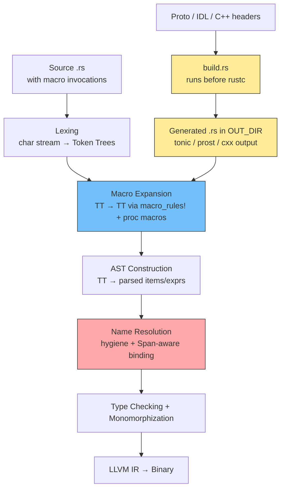
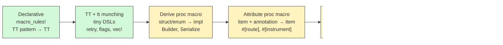
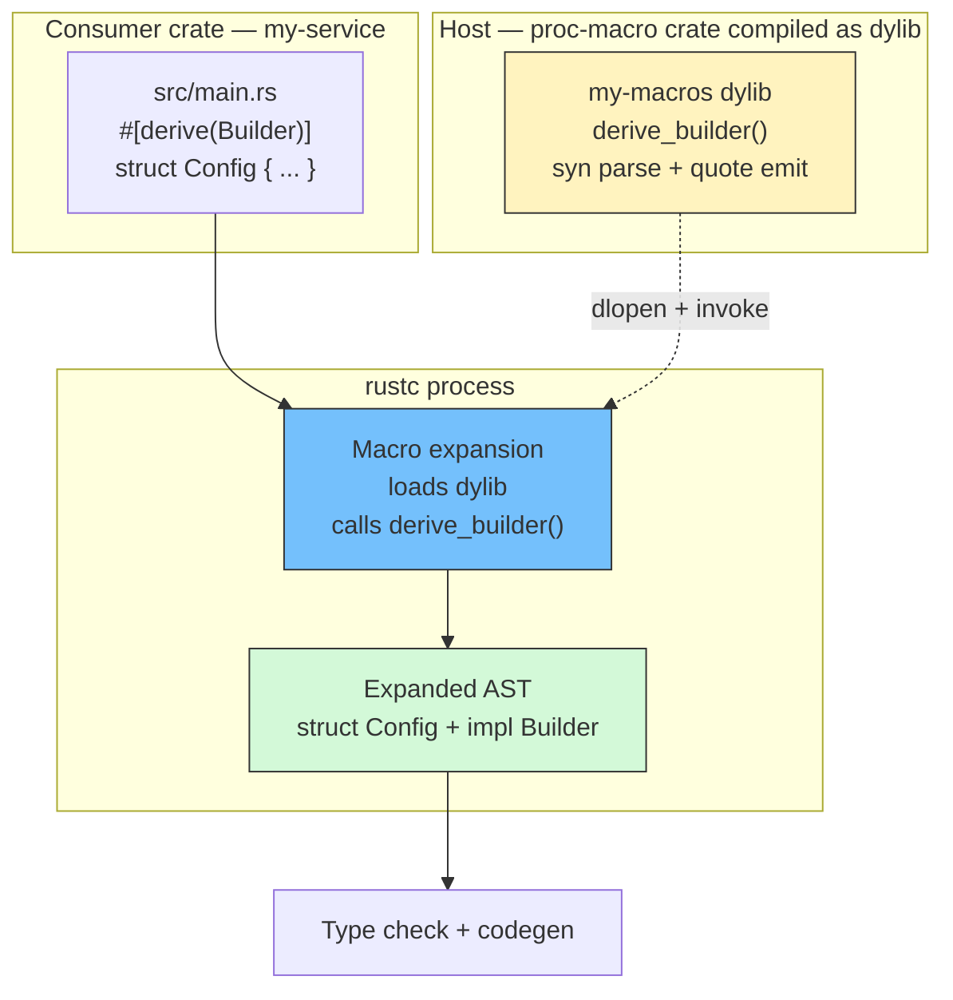
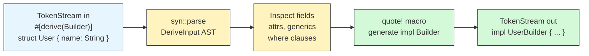
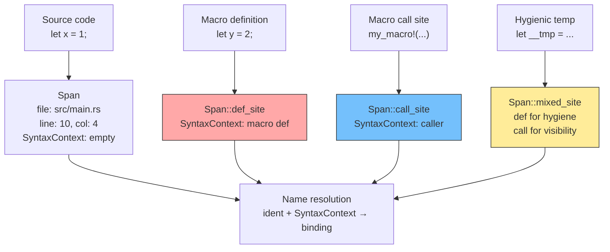
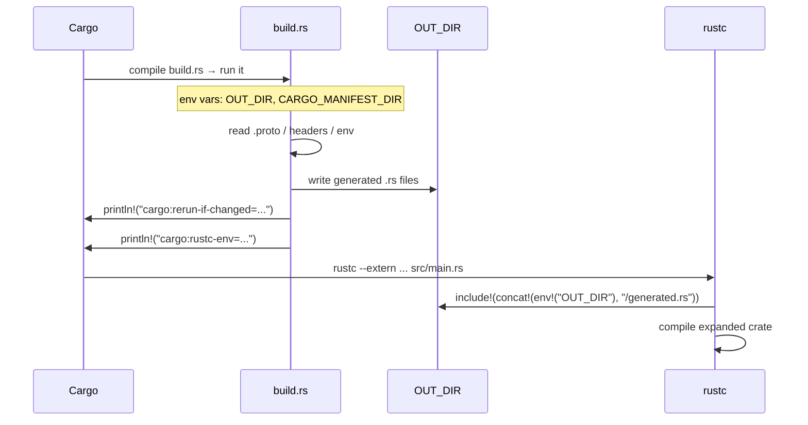
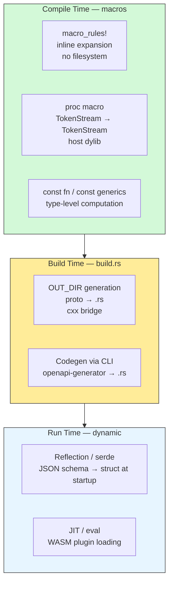
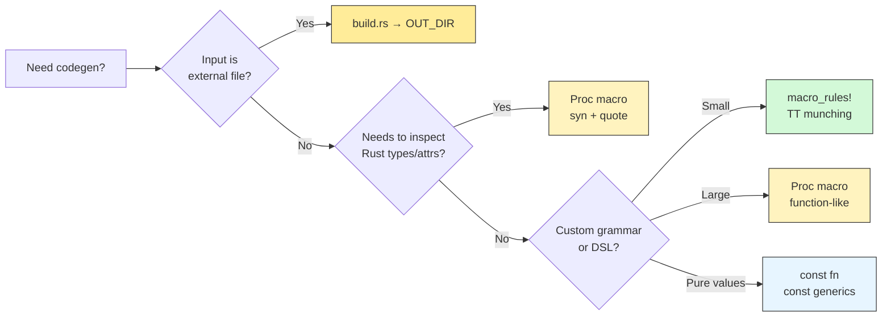

# Chapter 9 — Macros, Procedural Macros, and Code Generation: Build Scripts and build.rs

*What this chapter covers:* the full code-generation stack in Rust — from declarative `macro_rules!` macros that match token trees, through procedural macros that perform arbitrary AST surgery with `syn` and `quote`, to `build.rs` scripts that generate source files into `OUT_DIR` before compilation. You will learn how `vec!`, `#[derive(Builder)]`, `#[route]` attribute macros, `sql!` function-like macros, `tonic`/`prost` protobuf generation, and `cxx` bridges actually work at the compiler level — including hygiene, `Span` kinds, incremental compilation, and when to choose macros versus build scripts versus `const fn` — all through the lens of backend services that generate gRPC clients, database query code, and FFI glue at scale.

**Learning goals:**

- Explain the macro expansion pipeline — how `rustc` transforms token trees into AST nodes before name resolution and type checking.
- Write correct `macro_rules!` macros using fragment specifiers, TT munching, recursion, and hygiene-aware patterns; reimplement `vec!` from scratch.
- Distinguish derive, attribute, and function-like procedural macros and explain the `proc-macro` crate model and its compilation boundary.
- Build a `#[derive(Builder)]` macro with `syn` and `quote`, including field-attribute parsing and generated-token hygiene.
- Implement attribute macros (`#[route(GET, "/users")]`) and function-like macros (`sql!("SELECT ...")`) with compile-time validation.
- Explain hygiene via `Span` — `call_site`, `def_site`, `mixed_site` — and predict when identifiers resolve inside versus outside a macro definition.
- Write `build.rs` scripts that emit to `OUT_DIR`, drive `tonic`/`prost` protobuf generation and `cxx` bridges, and set `cargo:rerun-if-changed` correctly for incremental builds.
- Choose between declarative macros, procedural macros, `build.rs`, `const fn`/`const generics`, and runtime codegen using a coherent decision model and its operational trade-offs at fleet scale.

---

## 1. Why Backend Rust Needs Code Generation

Every production Rust backend generates code. An API service with 80 protobuf-defined RPCs does not hand-write serialization for each message. A data plane proxy does not manually implement `From`/`Display`/`Serialize` for 200 config structs. A polyglot service bridging Rust and C++ does not maintain FFI glue by hand. Code generation eliminates this toil — but in Rust it also eliminates the runtime cost that code generation imposes in other languages.

Three forces push backend Rust toward compile-time generation:

**1. Boilerplate at scale.** A single `.proto` file defining a `UserService` with 10 RPCs expands to roughly 2,000 lines of Rust: message structs, `prost::Message` impls, client traits, server traits, and codec glue. Multiplied across 30 services sharing 15 `.proto` files, manual maintenance is infeasible and error-prone.

**2. Zero-cost abstraction.** Unlike Java annotation processors or Python decorators that pay a runtime cost (reflection, wrapping), Rust macros and build scripts produce ordinary Rust source that the optimizer sees in full. A `#[derive(Builder)]` produces the same assembly as a hand-written builder. A `tonic`-generated gRPC client inlines identically to hand-written `hyper` calls.

**3. Correctness at the boundary.** The most expensive bugs in distributed systems live at serialization and FFI boundaries — a field renamed in protobuf but not in the consumer, a SQL query whose columns drift from the Rust struct, a C++ header whose layout changes. Compile-time generation turns these into compiler errors instead of production incidents.

The Rust code-generation stack has four layers, each operating at a different phase:

| Layer | Runs when | Input | Output | Example |
|---|---|---|---|---|
| `macro_rules!` | Macro expansion (early, per-crate) | Token trees | Token trees | `vec!`, `my_retry!` |
| Procedural macro | Macro expansion (separate compiler process) | `TokenStream` | `TokenStream` | `#[derive(Builder)]`, `#[route]` |
| `build.rs` | Before compilation (Cargo build script) | Files, env, proto | `.rs` files in `OUT_DIR` | `tonic`/`prost`, `cxx` |
| `const fn` / generics | Type checking + const eval + monomorphization | Rust types/consts | Specialized code / const values | `const fn hash()`, generic `ArrayVec<T, N>` |

Choosing the wrong layer produces needless complexity or silent staleness. The rest of this chapter teaches you to choose correctly and implement each one.



*The compilation pipeline with code generation. Declarative and procedural macros expand token trees before AST construction. Build scripts run before the compiler even starts, writing Rust source into `OUT_DIR` that is then included and subject to the same expansion and checking as hand-written code.*

---

## 2. Declarative Macros: `macro_rules!` — Pattern Matching on Token Trees

Declarative macros are pattern-matching rules that transform one token tree into another. They run entirely inside `rustc`, require no separate crate, and are hygienic by default. Every Rust backend engineer uses them; fewer can write non-trivial ones without introducing subtle capture bugs.

### 2.1 How `macro_rules!` Works: Fragments and Matchers

A `macro_rules!` definition is a list of arms, each with a matcher (pattern) and a transcriber (template). The matcher operates on **token trees (TTs)** — the raw lexical tokens before parsing — not on AST nodes.

```rust
// A minimal declarative macro: `say_hello!(name)`
macro_rules! say_hello {
    // Matcher: captures an identifier
    // Transcriber: emits tokens
    ($name:ident) => {
        println!("Hello, {}!", stringify!($name));
    };
}

fn main() {
    say_hello!(world); // expands to: println!("Hello, {}!", stringify!(world));
}
```

Fragment specifiers constrain what a metavariable can match:

| Specifier | Matches | Example match |
|---|---|---|
| `ident` | Identifier | `foo`, `MyStruct` |
| `expr` | Expression | `1 + 2`, `foo()` |
| `ty` | Type | `Vec<u8>`, `&str` |
| `path` | Path | `std::vec::Vec` |
| `stmt` | Statement | `let x = 1;` |
| `block` | Block | `{ x + 1 }` |
| `item` | Item | `fn foo() {}` |
| `meta` | Attribute contents | `inline`, `derive(Debug)` |
| `literal` | Literal | `42`, `"hello"` |
| `tt` | Single token tree | Any single TT |
| `vis` | Visibility | `pub`, `pub(crate)` |
| `lifetime` | Lifetime | `'a`, `'static` |

The `tt` fragment is the most general — it matches a single token tree but gives the macro no structural guarantee. Prefer specific fragments (`expr`, `ty`) when you can; they produce better error messages and prevent accidental over-capture.

Repetition is expressed with `$( ... ),*` (zero or more, comma-separated), `$( ... );+` (one or more, semicolon-separated), and an optional separator:

```rust
// Accepts: emit!("a", "b", "c")  or  emit!()
// Separators can be any token: , ; or even =>
macro_rules! emit {
    // Zero or more exprs, comma-separated, optional trailing comma
    ( $( $msg:expr ),* $(,)? ) => {
        $( println!("{}", $msg); )*
    };
}
```

### 2.2 Reimplementing `vec!` — TT Munching and Recursion

The standard library's `vec!` is the canonical example of a non-trivial declarative macro. It handles three forms: `vec![]`, `vec![elem; n]`, and `vec![a, b, c]`:

```rust
// Simplified reimplementation of std::vec!
// Demonstrates: repetition, optional trailing comma, expression fragments.

macro_rules! my_vec {
    // Arm 1: empty — vec![]
    () => {
        ::std::vec::Vec::new()
    };
    // Arm 2: repeat — vec![elem; n]
    // The semicolon disambiguates from the list form.
    ( $elem:expr ; $n:expr ) => {
        ::std::vec::from_elem($elem, $n)
    };
    // Arm 3: list — vec![a, b, c] with optional trailing comma
    ( $( $elem:expr ),* $(,)? ) => {
        {
            let mut vs = ::std::vec::Vec::new();
            $( vs.push($elem); )*
            vs
        }
    };
}

fn demo() {
    let empty: Vec<u8> = my_vec![];
    let repeated = my_vec![0u8; 4];       // [0, 0, 0, 0]
    let listed = my_vec!["a", "b", "c"]; // ["a", "b", "c"]
    let trailing = my_vec![1, 2, 3,];   // trailing comma OK
}
```

Two details matter operationally:

**Hygiene note:** `vs` inside the macro is hygienic — it cannot collide with a `vs` variable at the call site. The compiler assigns each identifier a `SyntaxContext` (see Section 7) so that macro-introduced names are invisible outside the expansion. The `::std::vec::Vec` leading `::` ensures the path resolves from the crate root regardless of local shadowing of `std` or `vec`.

**Order matters.** `rustc` tries arms top-to-bottom and takes the first match. The `elem; n` arm must precede the `a, b, c` arm, otherwise `vec![x; 5]` would fail to match the list arm's comma-separated pattern and produce a confusing error.

### 2.3 TT Munching: Recursive Descent on Token Trees

When a macro needs to parse a custom grammar — for example, a mini-DSL for defining a state machine or a routing table — the standard technique is **TT munching**: recursively peel one element off the token stream per expansion step.

```rust
// TT-munching macro: builds a bitmask from named flags.
// Usage: flags!(READ | WRITE | EXEC) => 0b001 | 0b010 | 0b100

macro_rules! flags {
    // Base case: single flag (no trailing |)
    ( $flag:ident ) => {
        flag_bit(stringify!($flag))
    };
    // Recursive case: flag | rest — munches one flag, recurses on rest
    ( $flag:ident | $( $rest:tt )+ ) => {
        flag_bit(stringify!($flag)) | flags!( $( $rest )+ )
    };
}

fn flag_bit(name: &str) -> u32 {
    match name {
        "READ"  => 0b001,
        "WRITE" => 0b010,
        "EXEC"  => 0b100,
        _ => 0,
    }
}

fn demo_flags() {
    let mask = flags!(READ | WRITE | EXEC);
    assert_eq!(mask, 0b111);
}
```

Each expansion consumes one `ident |` prefix and delegates the remainder to a recursive invocation. The compiler has a recursion limit (default 128, configurable via `#![recursion_limit = "256"]`) — deep TT munching on large inputs can hit it. For backend use, TT munching is ideal for small DSLs (feature-flag sets, metric label lists, route tables with fewer than 50 entries). For larger grammars, a procedural macro is more maintainable.

A more realistic TT-munching example — a retry macro with backoff:

```rust
macro_rules! retry_with_backoff {
    // Entry point: retry!(3, my_operation())
    ( $retries:expr, $body:expr ) => {
        retry_with_backoff!(@inner $retries, $body, 0)
    };
    // Internal rule: @inner is a convention for "private" macro arms
    // that callers never invoke directly.
    ( @inner $remaining:expr, $body:expr, $attempt:expr ) => {
        {
            let mut attempt = $attempt;
            loop {
                match $body {
                    Ok(val) => break Ok(val),
                    Err(e) if attempt < $remaining => {
                        let backoff = ::std::time::Duration::from_millis(
                            100 * (1 << attempt) // exponential: 100, 200, 400, ...
                        );
                        ::std::thread::sleep(backoff);
                        attempt += 1;
                    }
                    Err(e) => break Err(e),
                }
            }
        }
    };
}

// Usage in a backend service:
fn fetch_from_upstream(url: &str) -> Result<String, String> {
    retry_with_backoff!(3, do_fetch(url))
}

fn do_fetch(_url: &str) -> Result<String, String> {
    // Simulated fallible fetch
    Ok("data".to_string())
}
```

The `@inner` prefix is a hygiene trick: `@` is not a valid Rust identifier start, so no caller can accidentally match the internal arm. This is a widely used convention for multi-arm helper macros.

### 2.4 Hygiene Inside `macro_rules!`

Declarative macros are **hygienic by definition**: identifiers introduced inside the macro definition are invisible at the call site, and identifiers at the call site are resolved as if the macro had never existed.

```rust
macro_rules! make_counter {
    ($name:ident) => {
        // `count` here is hygienic — each invocation gets a fresh SyntaxContext.
        // It will NOT collide with a `count` variable at the call site.
        let mut $name = 0;
        let count = 42; // hygienic local — invisible outside
        $name += count;
    };
}

fn hygiene_demo() {
    let count = 999;
    make_counter!(my_val);
    // `count` inside the macro was a different binding — this still prints 999.
    println!("outer count: {}", count); // 999
    println!("my_val: {}", my_val);    // 42
}
```

This is the default and almost always what you want. The rare exception is when a macro intentionally introduces a name the caller should see — for example, a `setup_test_env!()` macro that binds a `db` variable. For that, you need procedural macros with explicit `Span` control (Section 7).

---

## 3. Declarative vs. Procedural: A Spectrum

Not every code-generation problem fits `macro_rules!`. The decision comes down to how much syntactic and semantic understanding the generator needs:



| Capability | `macro_rules!` | Proc macro | `build.rs` |
|---|---|---|---|
| Parse Rust types/attrs | Fragment-level only | Full AST via `syn` | Full AST (reads files) |
| Access filesystem | No | No (pure token transform) | Yes |
| Access env vars at build | No | Limited | Yes (`env::var`) |
| Generate files | No (inline only) | No (inline only) | Yes (`OUT_DIR`) |
| Dependency on `.proto`/IDL | No | No | Yes |
| Incremental rebuild control | Automatic | Automatic | Manual (`rerun-if`) |
| Debugging difficulty | Low (`cargo expand`) | Medium (separate crate) | Higher (generated files) |

**Rule of thumb:**

- One or two patterns over expressions/types → `macro_rules!`.
- Needs to inspect struct fields, attributes, or generics → derive proc macro.
- Needs to wrap or rewrite an item based on annotation arguments → attribute proc macro.
- Needs to parse a custom language (SQL, GraphQL) at compile time → function-like proc macro.
- Needs to read external files (`.proto`, C++ headers, OpenAPI specs) → `build.rs`.

---

## 4. Procedural Macros: Compiler Plugins that Transform Token Streams

Procedural macros are Rust functions that run at compile time, receive a `TokenStream`, and return a `TokenStream`. Unlike `macro_rules!`, they can execute arbitrary Rust code — they are full compiler plugins.

### 4.1 The Proc-Macro Crate Model

A procedural macro must live in a crate with `crate-type = ["proc-macro"]`. This crate is compiled for the **host** (the machine running `rustc`), not the target, and is loaded as a dynamic library by the compiler:

```toml
# my-macros/Cargo.toml — the proc-macro crate
[package]
name = "my-macros"
version = "0.1.0"
edition = "2021"

[lib]
proc-macro = true          # required: this crate exports proc macros

[dependencies]
proc-macro2 = "1.0"
quote = "1.0"
syn = { version = "2.0", features = ["full"] }
```

```toml
# Cargo.toml — the consuming crate
[dependencies]
my-macros = { path = "../my-macros" }
```

Constraints of proc-macro crates:

- They can **only** export proc macros (and helper functions used by them). They cannot export normal library items consumed at runtime.
- They are compiled separately and cannot share generics or types with the consuming crate at the type level — only at the token level.
- Each proc macro function signature is fixed by kind (derive, attribute, function-like).

Three kinds exist:

```rust
// my-macros/src/lib.rs — all three kinds in one crate (common)

use proc_macro::TokenStream;

// ── 1. Derive macro ──────────────────────────────────────────
// Attached to a struct/enum via #[derive(Name)]
#[proc_macro_derive(Builder, attributes(builder))]
pub fn derive_builder(input: TokenStream) -> TokenStream {
    // input: the annotated item's TokenStream
    // output: new items to inject alongside it (usually an impl block)
    expand_builder(input)
}

// ── 2. Attribute macro ───────────────────────────────────────
// Wraps any item: #[my_route(GET, "/users")]
#[proc_macro_attribute]
pub fn route(attr: TokenStream, item: TokenStream) -> TokenStream {
    // attr: tokens inside #[route(...)], item: the annotated item
    expand_route(attr, item)
}

// ── 3. Function-like macro ───────────────────────────────────
// Called like a function: sql!("SELECT * FROM users WHERE id = $1")
#[proc_macro]
pub fn sql(input: TokenStream) -> TokenStream {
    expand_sql(input)
}

fn expand_builder(input: TokenStream) -> TokenStream { todo!() }
fn expand_route(attr: TokenStream, item: TokenStream) -> TokenStream { todo!() }
fn expand_sql(input: TokenStream) -> TokenStream { todo!() }
```



---

## 5. `syn` and `quote`: AST Surgery for Derive Macros

Almost every non-trivial proc macro uses two crates: **`syn`** (parses `TokenStream` into a typed AST) and **`quote`** (turns AST fragments back into `TokenStream` via quasi-quoting). Together they let you perform precise surgery on Rust's syntax tree.



### 5.1 Derive Macro: `#[derive(Builder)]` End-to-End

The goal: given a struct, generate a builder that enforces required fields at compile time and produces a fluent API.

```rust
// ── Consumer code — what the user writes ─────────────────────

// src/main.rs
use my_macros::Builder;

#[derive(Builder, Debug)]
pub struct ServiceConfig {
    pub host: String,
    pub port: u16,
    // Optional field — builder should default to None
    #[builder(default)]
    pub tls_cert: Option<String>,
    // Repeated field — builder accumulates with push
    #[builder(each = "route")]
    pub routes: Vec<String>,
}

fn main() {
    // Generated API:
    let cfg = ServiceConfig::builder()
        .host("0.0.0.0".into())
        .port(8080)
        .route("/health".into())
        .route("/api/v1/users".into())
        .build()
        .unwrap();

    println!("{cfg:?}");
}
```

```rust
// ── Proc-macro crate — my-macros/src/lib.rs ──────────────────

use proc_macro::TokenStream;
use quote::{format_ident, quote};
use syn::{parse_macro_input, Data, DeriveInput, Fields, GenericParam};

#[proc_macro_derive(Builder, attributes(builder))]
pub fn derive_builder(input: TokenStream) -> TokenStream {
    let input = parse_macro_input!(input as DeriveInput);
    expand_builder(input).unwrap_or_else(|e| e.to_compile_error().into())
}

fn expand_builder(input: DeriveInput) -> syn::Result<TokenStream> {
    let struct_name = &input.ident;
    let builder_name = format_ident!("{}Builder", struct_name);
    let generics = &input.generics;

    // Extract fields — only named structs supported in this example
    let fields = match &input.data {
        Data::Struct(s) => match &s.fields {
            Fields::Named(n) => &n.named,
            _ => {
                return Err(syn::Error::new_spanned(
                    &input.ident,
                    "Builder only supports structs with named fields",
                ))
            }
        },
        _ => {
            return Err(syn::Error::new_spanned(
                &input.ident,
                "Builder only supports structs",
            ))
        }
    };

    // Collect per-field metadata: name, type, whether it has #[builder(default)]
    struct FieldInfo {
        name: syn::Ident,
        ty: syn::Type,
        optional: bool,   // #[builder(default)] → Option-wrapped in builder
        each: Option<String>,
    }

    let mut field_infos: Vec<FieldInfo> = Vec::new();
    for f in fields {
        let name = f.ident.clone().unwrap();
        let ty = f.ty.clone();
        let mut optional = false;
        let mut each: Option<String> = None;

        for attr in &f.attrs {
            if attr.path().is_ident("builder") {
                attr.parse_nested_meta(|meta| {
                    if meta.path.is_ident("default") {
                        optional = true;
                        Ok(())
                    } else if meta.path.is_ident("each") {
                        let val: syn::LitStr = meta.value()?.parse()?;
                        each = Some(val.value());
                        Ok(())
                    } else {
                        Err(meta.error("unsupported builder attribute"))
                    }
                })?;
            }
        }
        field_infos.push(FieldInfo { name, ty, optional, each });
    }

    // Generate builder fields: required fields become Option<T>, optional stay as-is
    let builder_fields = field_infos.iter().map(|fi| {
        let name = &fi.name;
        let ty = &fi.ty;
        if fi.optional {
            quote! { #name: #ty }
        } else {
            quote! { #name: ::std::option::Option<#ty> }
        }
    });

    // Generate setter methods
    let setters = field_infos.iter().map(|fi| {
        let name = &fi.name;
        let ty = &fi.ty;
        if let Some(each_name) = &fi.each {
            // Vec field with `each = "route"` → generate `route(item)` that pushes
            let each_ident = format_ident!("{}", each_name);
            // Extract inner type of Vec<T> — simplified: assume Vec<String>
            quote! {
                pub fn #each_ident(mut self, value: String) -> Self {
                    self.#name.push(value);
                    self
                }
            }
        } else if fi.optional {
            quote! {
                pub fn #name(mut self, value: #ty) -> Self {
                    self.#name = value;
                    self
                }
            }
        } else {
            quote! {
                pub fn #name(mut self, value: #ty) -> Self {
                    self.#name = ::std::option::Option::Some(value);
                    self
                }
            }
        }
    });

    // Generate build() — checks required fields
    let build_assignments = field_infos.iter().map(|fi| {
        let name = &fi.name;
        if fi.optional {
            quote! { #name: self.#name }
        } else {
            quote! {
                #name: self.#name.ok_or_else(|| {
                    format!("Builder: required field `{}` not set", stringify!(#name))
                })?
            }
        }
    });

    // Where clause: carry over generics
    let (impl_generics, ty_generics, where_clause) = generics.split_for_impl();

    let expanded = quote! {
        pub struct #builder_name #impl_generics #where_clause {
            #( #builder_fields, )*
        }

        impl #impl_generics #struct_name #ty_generics #where_clause {
            pub fn builder() -> #builder_name #ty_generics {
                #builder_name {
                    #( #field_infos_init, )*
                }
            }
        }

        // Default init — required fields None, Vec fields empty, optional fields None/default
        // (init tokens generated inline below via field_infos)
    };

    // Expanded — two-phase construction for clarity.
    // Real implementation handles default initialization per-field.
    let field_inits = field_infos.iter().map(|fi| {
        let name = &fi.name;
        if fi.each.is_some() {
            quote! { #name: ::std::vec::Vec::new() }
        } else {
            quote! { #name: ::std::option::Option::None }
        }
    });

    let expanded = quote! {
        pub struct #builder_name #impl_generics #where_clause {
            #( #builder_fields, )*
        }

        impl #impl_generics #struct_name #ty_generics #where_clause {
            pub fn builder() -> #builder_name #ty_generics {
                #builder_name {
                    #( #field_inits, )*
                }
            }
        }

        impl #impl_generics #builder_name #ty_generics #where_clause {
            #( #setters )*

            pub fn build(self) -> ::std::result::Result<#struct_name #ty_generics, String> {
                ::std::result::Result::Ok(#struct_name {
                    #( #build_assignments, )*
                })
            }
        }
    };

    Ok(expanded.into())
}
```

Key `syn`/`quote` patterns in this example:

- **`parse_macro_input!(input as DeriveInput)`** — parses the `TokenStream` into `syn`'s typed representation of a Rust item. `DeriveInput` handles `struct`, `enum`, and `union` with generics and attributes.
- **`attr.parse_nested_meta`** — the modern (syn 2.0) way to parse `#[builder(default)]` and `#[builder(each = "route")]` without stringly-typed hacks.
- **`quote! { ... }`** — quasi-quoting: Rust-like syntax where `#variable` interpolates a captured `TokenStream`-compatible value. Repetition `#( #items )*` mirrors `macro_rules!` repetition but at the proc-macro level.
- **`format_ident!("{}Builder", name)`** — creates a new `Ident` by formatting. The resulting identifier's `Span` is `call_site` by default (see Section 7).
- **`to_compile_error()`** — on failure, emits `compile_error!("...")` so the user sees a proper diagnostic rather than a silent non-expansion.

**Debugging proc macros:** `cargo expand` (from `cargo-expand`) shows the expanded output as the compiler sees it. For the `ServiceConfig` above:

```bash
$ cargo install cargo-expand
$ cargo expand --lib 2>&1 | head -n 60
# pub struct ServiceConfigBuilder {
#     host: ::std::option::Option<String>,
#     port: ::std::option::Option<u16>,
#     tls_cert: Option<String>,
#     routes: Vec<String>,
# }
# ...
```

Unit-testing proc macros without a full compilation: use `syn::parse_str` and assert on the generated `TokenStream` string, or use the `trybuild` crate for compile-pass/compile-fail tests.

---

## 6. Attribute and Function-Like Macros in Practice

### 6.1 Attribute Macro: `#[route]` for HTTP Handlers

Attribute macros wrap an existing item and can rewrite it arbitrarily — adding middleware, extracting path parameters, or registering the handler in a routing table. This is the mechanism behind `axum`'s `#[debug_handler]`, `actix-web`'s `#[get("/path")]`, and `tracing`'s `#[instrument]`.

```rust
// ── Proc-macro crate ─────────────────────────────────────────

use proc_macro::TokenStream;
use quote::quote;
use syn::{parse_macro_input, ItemFn, LitStr, Token, punctuated::Punctuated};

#[proc_macro_attribute]
pub fn route(attr: TokenStream, item: TokenStream) -> TokenStream {
    let result: syn::Result<TokenStream> = (|| {
        // Parse attribute: route(GET, "/users/:id")
        let parser = Punctuated::<syn::Expr, Token![,]>::parse_terminated;
        let args = parser.parse(attr)?;

        if args.len() != 2 {
            return Err(syn::Error::new(
                proc_macro2::Span::call_site(),
                "expected #[route(METHOD, \"/path\")] — e.g. #[route(GET, \"/users/:id\")]",
            ));
        }

        // Extract method and path as strings for code generation
        let method = &args[0];
        let path = &args[1];

        let func: ItemFn = syn::parse(item)?;
        let fn_name = &func.sig.ident;
        let fn_block = &func.block;
        let fn_inputs = &func.sig.inputs;
        let fn_output = &func.sig.output;
        let vis = &func.vis;

        // Generate: original function + registration helper
        let expanded = quote! {
            #vis fn #fn_name(#fn_inputs) #fn_output #fn_block

            // Inventory-style registration — real frameworks use `linkme` or
            // `inventory` to collect routes at link time.
            #[allow(non_upper_case_globals)]
            const _: () = {
                inventory::submit! {
                    crate::Route {
                        method: stringify!(#method),
                        path: #path,
                        handler: #fn_name,
                    }
                }
            };
        };
        Ok(expanded.into())
    })();

    result.unwrap_or_else(|e| e.to_compile_error().into())
}
```

```rust
// ── Consumer code ────────────────────────────────────────────

// src/handlers.rs
use my_macros::route;

#[route(GET, "/users/:id")]
pub async fn get_user(axum::extract::Path(id): axum::extract::Path<String>) -> String {
    format!("user {id}")
}

#[route(POST, "/users")]
pub async fn create_user(axum::extract::Json(body): axum::extract::Json<serde_json::Value>) -> String {
    format!("created: {body}")
}

// Expanded (via cargo expand):
// pub async fn get_user(Path(id): Path<String>) -> String { format!("user {id}") }
// const _: () = { inventory::submit! { Route { method: "GET", path: "/users/:id", handler: get_user } } };
```

Design considerations for attribute macros in backend services:

- **Preserve the original item.** Most attribute macros emit the original function unchanged plus additional registration or wrapping. Replacing the function body is possible but makes debugging harder — `cargo expand` output no longer resembles the source.
- **Validate attribute arguments early** and emit `compile_error!` with actionable messages. A typo like `#[route(GTE, "/users")]` should fail with "unknown method `GTE`, expected GET/POST/PUT/DELETE/PATCH" rather than a cryptic downstream type error.
- **Attention to async.** If the macro wraps `async fn`, it must handle `async` correctly — you cannot simply wrap an `async` body in a closure without `async move` and appropriate `Send` bounds.

### 6.2 Function-Like Macro: `sql!` with Compile-Time Checking

Function-like macros look like function calls but operate on arbitrary token trees. They are ideal for embedding domain-specific languages (SQL, GraphQL, regex) with compile-time validation:

```rust
// ── Proc-macro crate ─────────────────────────────────────────

use proc_macro::TokenStream;
use quote::quote;
use syn::{parse::Parse, LitStr, Token};

struct SqlInput {
    query: LitStr,
}

impl Parse for SqlInput {
    fn parse(input: syn::parse::ParseStream) -> syn::Result<Self> {
        Ok(SqlInput { query: input.parse()? })
    }
}

#[proc_macro]
pub fn sql(input: TokenStream) -> TokenStream {
    let result: syn::Result<TokenStream> = (|| {
        let SqlInput { query } = syn::parse(input)?;
        let raw = query.value();

        // Compile-time SQL validation — simplified example
        // Production: use `sqlparser` crate for full dialect parsing.
        validate_sql(&raw).map_err(|e| {
            syn::Error::new(query.span(), format!("sql! — invalid SQL: {e}"))
        })?;

        // Extract parameter placeholders ($1, $2, ...) to type-check arity at compile time
        let param_count = raw.matches('$').count();

        let expanded = quote! {
            ::my_db::CheckedQuery {
                sql: #raw,
                param_count: #param_count,
            }
        };
        Ok(expanded.into())
    })();

    result.unwrap_or_else(|e| e.to_compile_error().into())
}

fn validate_sql(sql: &str) -> Result<(), String> {
    let upper = sql.trim().to_ascii_uppercase();
    if !upper.starts_with("SELECT") && !upper.starts_with("INSERT")
        && !upper.starts_with("UPDATE") && !upper.starts_with("DELETE")
    {
        return Err("query must start with SELECT/INSERT/UPDATE/DELETE".into());
    }
    // Balanced parentheses check as minimal validation
    let mut depth = 0i32;
    for ch in sql.chars() {
        match ch {
            '(' => depth += 1,
            ')' => {
                depth -= 1;
                if depth < 0 { return Err("unmatched ')'".into()); }
            }
            _ => {}
        }
    }
    if depth != 0 { return Err("unmatched '('".into()); }
    Ok(())
}
```

```rust
// ── Consumer code ────────────────────────────────────────────

// This compiles:
let q = sql!("SELECT id, name FROM users WHERE id = $1");
assert_eq!(q.param_count, 1);

// This fails at compile time with: sql! — invalid SQL: query must start with ...
// let bad = sql!("DROP TABLE users");

// This fails at compile time with a span pointing at the string literal:
// let unbalanced = sql!("SELECT * FROM t WHERE x IN ((1, 2)");
```

Production-grade `sql!` macros like `sqlx::query!` go further: they connect to a live database at compile time (or read a cached `sqlx-data.json`) to verify that columns, types, and tables actually exist. This is the strongest form of compile-time boundary checking — a schema migration that renames a column breaks the build rather than a request at 3 AM. The trade-off is that CI must have access to the schema (or its cache), and developers pay a compile-time cost for the database round-trip.

---

## 7. Hygiene Deep Dive: Spans and Name Resolution

Hygiene is Rust's answer to a classic macro problem: how to prevent identifiers introduced by a macro from colliding with identifiers at the call site, and vice versa. Every identifier in Rust carries a `Span` that tracks where it was written and how it should be resolved.

### 7.1 What `Span` Carries

A `Span` is not just a source location (file, line, column). It also carries a **SyntaxContext** — an opaque ID that determines name resolution:



Three `Span` constructors matter:

| Constructor | Resolution behavior | Typical use |
|---|---|---|
| `Span::call_site()` | Resolves as if written at the macro **invocation** | Default for `quote!` interpolations; user-visible names |
| `Span::def_site()` | Resolves at the macro **definition** | Internal helpers that must not leak; hygienic temporaries |
| `Span::mixed_site()` | Resolves for hygiene at `def_site`, but appears at `call_site` for diagnostics | The common "right" choice for generated locals that should be hygienic but report errors at the call site |

Plus one legacy value:

| `Span::mixed_site()` (proc-macro2) | Hybrid: hygiene of `def_site`, location of `call_site` | Preferred for identifiers that are implementation details but whose errors should point at the call site |

### 7.2 Hygiene in `macro_rules!` vs. Procedural Macros

In `macro_rules!`, hygiene is automatic and invisible. Identifiers in the **transcriber** (the `=> { ... }` side) are automatically given a fresh `SyntaxContext` tied to the macro definition. This is why `vs` inside `my_vec!` never collides with `vs` at the call site.

In procedural macros, you control hygiene explicitly through `Span`:

```rust
use proc_macro2::{Span, TokenStream};
use quote::quote;
use syn::Ident;

fn hygiene_example() -> TokenStream {
    // call_site — resolves at the caller. If the caller has `let helper = 1;`,
    // this `helper` refers to that binding.
    let call_site_ident = Ident::new("helper", Span::call_site());

    // def_site — resolves at the proc-macro crate. Caller cannot see or shadow it.
    // Useful for internal temporaries and for referring to items inside the
    // proc-macro crate itself.
    let def_site_ident = Ident::new("helper", Span::def_site());

    // mixed_site — hygienic (won't collide) but error messages point at call site.
    // The recommended default for generated temporaries in derive macros.
    let mixed_ident = Ident::new("__builder_tmp", Span::mixed_site());

    quote! {
        // Each identifier resolves differently despite identical spelling:
        let #call_site_ident = 1;  // caller-visible
        let #def_site_ident = 2;   // hygienic, crate-internal
        let #mixed_ident = 3;      // hygienic, but errors at call site
    }
}
```

A concrete failure mode when hygiene is wrong — a derive macro that accidentally captures a user binding:

```rust
// Buggy derive macro — uses call_site for an internal temporary:
let tmp = Ident::new("__tmp", Span::call_site());
quote! { let #tmp = self.field; }
// If the user's struct has a field named `__tmp`, this shadows it.

// Correct — uses mixed_site:
let tmp = Ident::new("__tmp", Span::mixed_site());
quote! { let #tmp = self.field; }
// Hygienic: guaranteed fresh, no shadowing possible.
```

### 7.3 Inside-Macro-Definition Hygiene

A subtlety: when a macro **calls another macro**, hygiene contexts nest. Consider:

```rust
macro_rules! outer {
    () => {
        // `inner!` is resolved at outer's def_site, not at the call site of outer!
        inner!()
    };
}

macro_rules! inner {
    () => { println!("inner expanded"); };
}

fn main() {
    // This works only if `inner` is visible where `outer` was defined,
    // not necessarily where `outer!()` is called.
    outer!();
}
```

For `macro_rules!`, the resolver walks the `SyntaxContext` chain to find where each identifier was introduced. For proc macros, `Span::def_site()` achieves the same isolation — the generated code's name resolution is anchored at the proc-macro crate's definition, not at the consumer's call site.

**`$crate` metavariable.** Inside `macro_rules!` defined in a library crate, `$crate` expands to the absolute path of the defining crate. This is essential for macros that refer to crate-internal items:

```rust
// Inside crate `my_lib`
#[macro_export]
macro_rules! my_log {
    ($msg:expr) => {
        $crate::internal::log_impl($msg)
        // $crate ensures this resolves to `my_lib::internal::log_impl`
        // even if the caller has a different `internal` module.
    };
}
```

Without `$crate`, `crate::internal::log_impl` would resolve relative to the **caller's** crate root and fail.

---

## 8. Build Scripts: `build.rs`, `OUT_DIR`, and Pre-Compilation Code Generation

When code generation needs to read files, inspect environment variables, invoke external tools, or produce artifacts larger than a single `TokenStream`, macros are insufficient. **Build scripts** fill this gap. A `build.rs` file at the crate root runs before `rustc` compiles the crate, can emit arbitrary Rust source into `OUT_DIR`, and communicates with Cargo through `cargo:` directives on stdout.

### 8.1 How `build.rs` Runs



Cargo sets these environment variables for the build script:

| Variable | Meaning |
|---|---|
| `OUT_DIR` | Writable directory for generated files (`target/debug/build/<crate>-<hash>/out`) |
| `CARGO_MANIFEST_DIR` | Directory containing `Cargo.toml` |
| `CARGO_CFG_TARGET_OS` | Target OS (`linux`, `windows`) |
| `PROFILE` | `debug` or `release` |
| `CARGO_FEATURE_*` | Enabled Cargo features |

And the build script communicates back via stdout:

| Directive | Meaning |
|---|---|
| `cargo:rerun-if-changed=path` | Re-run build script only if `path` changes (critical for incremental builds) |
| `cargo:rerun-if-env-changed=VAR` | Re-run if env var changes |
| `cargo:rustc-env=VAR=val` | Set env var for the compiled crate (`env!("VAR")` reads it) |
| `cargo:rustc-cfg=flag` | Set a `cfg` flag for conditional compilation |
| `cargo:warning=msg` | Emit a warning |
| `cargo:rustc-link-lib=lib` | Link a native library |

**Incremental compilation pitfall.** If you omit `rerun-if-changed`, Cargo re-runs the build script on **every** build, even when nothing changed. For large proto sets, this can add seconds to every `cargo check`. Always declare inputs:

```rust
// build.rs — correct rerun directives
fn main() {
    println!("cargo:rerun-if-changed=proto/");
    println!("cargo:rerun-if-changed=build.rs");
    // Do NOT do this — it re-runs on every build:
    // println!("cargo:rerun-if-changed=src/");
}
```

### 8.2 Example: `tonic` + `prost` — gRPC Code Generation

The most common build-script use in backend Rust is generating protobuf/gRPC bindings. `tonic` (gRPC framework) and `prost` (protobuf codec) consume `.proto` files and emit Rust structs, traits, and client/server stubs:

```toml
# Cargo.toml — service crate
[dependencies]
tonic = "0.11"
prost = "0.12"
tokio = { version = "1", features = ["full"] }

[build-dependencies]
tonic-build = "0.11"
```

```protobuf
// proto/user.proto
syntax = "proto3";

package users.v1;

service UserService {
  rpc GetUser(GetUserRequest) returns (GetUserResponse);
  rpc ListUsers(ListUsersRequest) returns (ListUsersResponse);
  rpc CreateUser(CreateUserRequest) returns (CreateUserResponse);
}

message GetUserRequest  { string id = 1; }
message GetUserResponse { User user = 1; }
message ListUsersRequest {
  int32 page_size = 1;
  string page_token = 2;
}
message ListUsersResponse {
  repeated User users = 1;
  string next_page_token = 2;
}
message CreateUserRequest {
  string name = 1;
  string email = 2;
}
message CreateUserResponse { User user = 1; }
message User {
  string id = 1;
  string name = 2;
  string email = 3;
}
```

```rust
// build.rs — tonic code generation
use std::path::PathBuf;

fn main() -> Result<(), Box<dyn std::error::Error>> {
    let proto_dir = PathBuf::from("proto");
    let proto_files = ["proto/user.proto"];

    // Tell Cargo when to re-run this script
    println!("cargo:rerun-if-changed=proto/");
    println!("cargo:rerun-if-changed=build.rs");

    tonic_build::configure()
        // Generate server trait as well as client
        .build_server(true)
        .build_client(true)
        // Use prost types for serialization
        .compile_protos(&proto_files, &[proto_dir])?;

    // Optional: format generated code for readability during debugging
    // (tonic_build already emits rustfmt-friendly output)

    Ok(())
}
```

```rust
// src/main.rs — consuming the generated code

// Include the generated file from OUT_DIR.
// The file path matches the proto package + file name.
pub mod users {
    pub mod v1 {
        tonic::include_proto!("users.v1");
        // Expands to:
        // include!(concat!(env!("OUT_DIR"), "/users.v1.rs"))
    }
}

use users::v1::{
    user_service_server::{UserService, UserServiceServer},
    GetUserRequest, GetUserResponse, User,
};
use tonic::{Request, Response, Status};

#[derive(Default)]
pub struct MyUserService;

#[tonic::async_trait]
impl UserService for MyUserService {
    async fn get_user(
        &self,
        request: Request<GetUserRequest>,
    ) -> Result<Response<GetUserResponse>, Status> {
        let id = request.into_inner().id;
        // In production: fetch from database
        let user = User { id: id.clone(), name: "Alice".into(), email: "alice@example.com".into() };
        Ok(Response::new(GetUserResponse { user: Some(user) }))
    }

    async fn list_users(
        &self,
        _request: Request<users::v1::ListUsersRequest>,
    ) -> Result<Response<users::v1::ListUsersResponse>, Status> {
        todo!()
    }

    async fn create_user(
        &self,
        _request: Request<users::v1::CreateUserRequest>,
    ) -> Result<Response<users::v1::CreateUserResponse>, Status> {
        todo!()
    }
}

#[tokio::main]
async fn main() -> Result<(), Box<dyn std::error::Error>> {
    let addr = "0.0.0.0:50051".parse()?;
    tonic::transport::Server::builder()
        .add_service(UserServiceServer::new(MyUserService::default()))
        .serve(addr)
        .await?;
    Ok(())
}
```

What `tonic_build::compile_protos` actually does:

1. Invokes `protoc` (or `prost-build`'s pure-Rust parser) to parse each `.proto` into a `FileDescriptorSet`.
2. For each message, emits a `#[derive(prost::Message)]` struct with field attributes encoding protobuf wire tags.
3. For each service, emits a `trait UserService` (server) and a `struct UserServiceClient` (client) with `tonic`-specific codec glue.
4. Writes the result to `$OUT_DIR/users.v1.rs`.

The generated file is ordinary Rust. You can inspect it:

```bash
$ find target/debug/build -name "users.v1.rs" | head -1
target/debug/build/my-service-abc123/out/users.v1.rs

$ head -n 40 target/debug/build/my-service-abc123/out/users.v1.rs
# // @generated
# #[derive(Clone, PartialEq, ::prost::Message)]
# pub struct GetUserRequest {
#     #[prost(string, tag = "1")]
#     pub id: ::prost::alloc::string::String,
# }
# ...
```

**Operational notes:**

- **`protoc` dependency.** `tonic_build` by default shells out to `protoc`. In CI/Docker, ensure it is installed (`apt-get install protobuf-compiler`) or use `prost-build` with `compile_protos` which can parse protos without `protoc` via `protoc-bin-vendored`.
- **Determinism.** The generated file includes `// @generated` and should be deterministic — same input produces same output regardless of build machine. This is important for reproducible builds and caching (see Section 10).
- **`cargo:rerun-if-changed` granularity.** Pointing at `proto/` is correct but coarse — any file in `proto/` triggers regeneration. For large repos with 50+ proto files, consider per-file directives or a dedicated proto crate that other crates depend on, so only the proto crate rebuilds.

### 8.3 Example: `cxx` — Safe Rust ↔ C++ Bridge

For services that embed a C++ library (ML inference engine, legacy codec, hardware SDK), `cxx` generates the FFI glue that would otherwise require hand-written `unsafe` and `extern "C"` blocks:

```rust
// build.rs — cxx bridge generation
fn main() {
    // cxx_build generates both Rust and C++ sides of the bridge
    cxx_build::bridge("src/bridge.rs")
        .file("src/engine.cc")       // C++ implementation
        .flag_if_supported("-std=c++17")
        .compile("my-service-engine");

    println!("cargo:rerun-if-changed=src/bridge.rs");
    println!("cargo:rerun-if-changed=src/engine.cc");
    println!("cargo:rerun-if-changed=src/engine.h");
}
```

```rust
// src/bridge.rs — the bridge definition (declarative FFI spec)
#[cxx::bridge]
mod ffi {
    unsafe extern "C++" {
        include!("engine.h");

        type InferenceEngine;

        fn new_engine(model_path: &str) -> UniquePtr<InferenceEngine>;
        fn predict(self: &InferenceEngine, input: &[f32]) -> Vec<f32>;
        fn model_version(self: &InferenceEngine) -> String;
    }

    // Rust functions exposed to C++
    extern "Rust" {
        fn log_prediction(latency_ms: u64, score: f32);
    }
}

pub fn log_prediction(latency_ms: u64, score: f32) {
    tracing::info!(latency_ms, score, "inference completed");
}
```

```cpp
// src/engine.h — C++ header
#pragma once
#include "rust/cxx.h"
#include <vector>
#include <string>

class InferenceEngine {
public:
    static std::unique_ptr<InferenceEngine> new_engine(rust::Str model_path);
    rust::Vec<float> predict(rust::Slice<const float> input) const;
    rust::String model_version() const;
};
```

`cxx_build::bridge` generates:

- A `.cc` file in `OUT_DIR` containing the C++ shims that translate between `rust::Vec`/`rust::Slice` and `std::vector`/`std::span`.
- A `.rs` file in `OUT_DIR` containing the Rust-side `extern "C++"` declarations with correct `#[link]` attributes.
- A static library (`libmy-service-engine.a`) linked into the final binary.

The key advantage over raw `extern "C"` is **type safety across the boundary**: `cxx` verifies at compile time that Rust `Vec<f32>` and C++ `rust::Vec<float>` have compatible layouts, and generates bounds-checked slice conversions. A layout mismatch is a compiler error, not a heap corruption in production.

### 8.4 `prost` Standalone — When You Don't Need gRPC

For services that use protobuf for storage or message queues (Kafka payloads, etcd values) without gRPC, `prost` alone is lighter than `tonic`:

```rust
// build.rs — prost only (no tonic, no protoc required via pure-Rust parser)
fn main() -> Result<(), Box<dyn std::error::Error>> {
    let mut config = prost_build::Config::new();
    config.type_attribute(".", "#[derive(serde::Serialize, serde::Deserialize)]");
    config.field_attribute("users.v1.User.email", "#[serde(default)]");

    config.compile_protos(&["proto/user.proto"], &["proto"])?;

    println!("cargo:rerun-if-changed=proto/user.proto");
    Ok(())
}
```

```rust
// src/main.rs — using prost types directly (e.g., as Kafka message payloads)
pub mod proto {
    include!(concat!(env!("OUT_DIR"), "/users.v1.rs"));
}

use prost::Message;

fn encode_user(user: &proto::User) -> Vec<u8> {
    let mut buf = Vec::new();
    user.encode(&mut buf).expect("encoding failed");
    buf
}

fn decode_user(bytes: &[u8]) -> Result<proto::User, prost::DecodeError> {
    proto::User::decode(bytes)
}
```

`prost` field attributes (`type_attribute`, `field_attribute`) let you add derives or serde annotations to generated types — essential when the same protobuf message is used for both wire format and JSON logging.

---

## 9. Compile-Time vs. Build-Time vs. Run-Time: Choosing the Right Phase

Code generation can happen at three distinct phases, each with different trade-offs for build time, debuggability, and operational control:



| Dimension | `macro_rules!` / proc macro | `build.rs` / `OUT_DIR` | `const fn` / generics | Runtime (serde / reflection) |
|---|---|---|---|---|
| **When it runs** | During `rustc` expansion | Before `rustc` (Cargo) | During typeck + const eval | At process startup / per-request |
| **Can read files** | No | Yes | No | Yes |
| **Can call network** | No | Yes (discouraged) | No | Yes |
| **Incremental rebuild** | Automatic (per-item) | Manual (`rerun-if`) | Automatic | N/A (no rebuild) |
| **Error reporting** | Span-accurate `compile_error!` | Build script failure (opaque) | Type errors | Runtime errors / panics |
| **Generated code visible** | `cargo expand` | File in `OUT_DIR` | Monomorphized IR | Not applicable |
| **Build-time cost** | Low (inline) | Higher (I/O + codegen) | Low–medium | Zero (deferred to runtime) |
| **Runtime cost** | Zero | Zero | Zero | Non-zero (parsing, branching) |
| **Supply-chain risk** | Proc-macro crate (auditable) | Build script (arbitrary code) | None | Runtime dependency (version drift) |
| **Best for** | Derive, DSL, wrapping | Protobuf, FFI, large IDL | Const computation, array sizes | Dynamic config, plugins |

### 9.1 Decision Guide with Backend Examples

**Use a proc macro when:**

- The transformation is a function of Rust source alone (struct fields → builder, function + attribute → route registration). No external files needed.
- You need hygienic name introduction or precise span control.
- The generated code is small and tightly coupled to the annotated item — colocating it with the source via `cargo expand` aids debugging.

**Use `build.rs` when:**

- The input is an external file (`.proto`, `.thrift`, OpenAPI YAML, C++ headers). Macros cannot read the filesystem.
- The generated output is large (thousands of lines for 50+ proto messages) and benefits from being a separate file rather than inline expansion.
- The generation requires invoking an external tool (`protoc`, `bindgen`, `cbindgen`).

**Use `const fn` / generics when:**

- The computation is a pure function of types or constants (hash at compile time, array size from const, `typenum`-style arithmetic).
- You need the result to be usable in const contexts (array lengths, const generics bounds).

**Use runtime generation when:**

- The schema is not known at build time (user-supplied JSON schema, feature flags fetched from a control plane, WASM plugins).
- The cost of a build-time dependency (database connection for `sqlx::query!`, proto compilation) outweighs the benefit of compile-time checking — typically for fast-iteration development or when the schema changes more frequently than deployments.

### 9.2 `const fn` as a Codegen Alternative — And Its Limits

```rust
// Compile-time computation without any macro or build script:
const fn fnv1a_hash(bytes: &[u8]) -> u64 {
    let mut hash: u64 = 14695981039346656037;
    let mut i = 0;
    while i < bytes.len() {
        hash ^= bytes[i] as u64;
        hash = hash.wrapping_mul(1099511628211);
        i += 1;
    }
    hash
}

const ROUTE_HASH: u64 = fnv1a_hash(b"/api/v1/users");
const SHARD_COUNT: usize = 16;

// Const generics — array size derived from const computation:
struct ShardedMap<T, const N: usize> {
    shards: [std::collections::HashMap<String, T>; N],
}

fn make_sharded<T>() -> ShardedMap<T, SHARD_COUNT> {
    ShardedMap { shards: std::array::from_fn(|_| std::collections::HashMap::new()) }
}
```

`const fn` is evaluated at compile time and produces no runtime overhead, but it cannot generate new types, impl blocks, or match arms — only values. When you need to generate *structure* (new structs, trait impls, enum variants), macros or build scripts are required.



---

## 10. Distributed-Systems Lens: Code Generation at Fleet Scale

In a single-service repository, code generation is a convenience. In a fleet of 50+ services sharing protobuf definitions, gRPC clients, and FFI bridges, it is load-bearing infrastructure. Getting it wrong produces version skew, non-reproducible builds, and phantom incidents that evade local reproduction.

### 10.1 Protobuf as the Contract — Single Source of Truth

The canonical pattern is a **dedicated proto crate** (or a separate repository published as a Cargo crate) that owns all `.proto` files and their generated bindings:

```
proto-crate/                  # crate: acme-proto
├── Cargo.toml                # [build-dependencies] tonic-build, prost-build
├── build.rs                  # compiles all .proto → OUT_DIR
├── proto/
│   ├── users/v1/user.proto
│   ├── orders/v1/order.proto
│   └── common/v1/pagination.proto
└── src/
    └── lib.rs                # pub mod users::v1 { include_proto!(...) }

service-a/Cargo.toml          # [dependencies] acme-proto = { path = "../proto-crate" }
service-b/Cargo.toml          # [dependencies] acme-proto = { version = "0.4" }
```

Benefits:

- **One compilation of protos** — all services share the same generated types. No per-service `build.rs` duplication and no risk of two services generating different code from the same proto due to different `tonic_build` versions.
- **Versioned contract.** The proto crate is versioned semantically. A breaking proto change (field rename, type change) bumps the major version, and consumers opt in via `Cargo.toml`. This mirrors API versioning (see Volume 8, Chapter 3 — gRPC and Protobuf Schema Design).
- **Wire compatibility checking.** CI runs `buf breaking` (from Buf) or `protovalidate` against the previous proto-crate version to reject breaking changes before they merge.

### 10.2 Build Reproducibility and Caching

Generated code must be deterministic: same inputs → same `OUT_DIR` output, byte-for-byte. Non-determinism breaks Cargo's fingerprinting, Docker layer caching, and SLSA provenance (see Companion Book 4, Chapter 3 — Reproducible Builds).

Common sources of non-determinism in build scripts:

| Source | Symptom | Fix |
|---|---|---|
| `HashMap` iteration in codegen | Field order varies between builds | Use `BTreeMap` or sort before emitting |
| Timestamp in generated header | `OUT_DIR` file changes every build | Omit timestamps or use `SOURCE_DATE_EPOCH` |
| `protoc` version skew | Different wire-tag handling | Pin `protoc` version in Dockerfile / `protoc-bin-vendored` |
| Absolute `OUT_DIR` path in output | Path leaks into binary / debug info | Use relative paths; `tonic` already does this |

For hermetic builds (Bazel, Nix), `build.rs` is a liability — it runs arbitrary code at build time outside the sandbox. Alternatives:

- **Pre-generate and check in** the `OUT_DIR` output (e.g., `prost` output committed as `src/generated/`). The build script becomes a CI check that the committed files are up-to-date, rather than a build-time generator. This is the approach used by `prost`'s own `cargo check --frozen` workflows.
- **Bazel `genrule` / `proto_library`** — generation is an explicit build graph edge, not an implicit `build.rs` side effect. Hermetic and cacheable.

### 10.3 Supply-Chain and Security Considerations

Both proc macros and build scripts execute **arbitrary code at build time** with the full privileges of the build machine. This is the same trust boundary exploited in the `event-stream` (2018) and `xz-utils` (2024) incidents — a compromised build-time dependency can inject code into every downstream binary without touching runtime code.

Mitigations for backend Rust:

- **Audit proc-macro and build-dependencies** with `cargo audit` / `cargo deny` / `osv-scanner`. Proc-macro crates are a high-value target because they run inside `rustc`.
- **Minimize `build.rs` network access.** A build script that fetches schemas from a URL at build time is a supply-chain risk and a reproducibility hazard. Vendor the schema file and verify its hash.
- **Pin codegen tool versions.** `tonic-build`, `prost-build`, `cxxbridge`, and `protoc` should be pinned in `Cargo.lock` and verified via `cargo vet` / SLSA provenance where available.
- **Use `cargo expand` and `OUT_DIR` inspection in CI** to detect unexpected code generation changes — a diff in expanded output that no source change explains is a red flag.

### 10.4 Observability of Generated Code

Generated gRPC clients and database query code are often the hottest paths in a backend service. Two operational practices help:

**Structured errors from generated code.** Ensure that `tonic` status codes and `prost` decode errors propagate with context. A bare `Status::internal("decode error")` is unobservable; wrap it:

```rust
use tonic::Status;

fn decode_with_context(bytes: &[u8]) -> Result<proto::User, Status> {
    proto::User::decode(bytes).map_err(|e| {
        Status::internal(format!("prost decode users.v1.User: {e}"))
    })
}
```

**Tracing through generated clients.** `tonic` clients are `tower::Service` implementations — wrap them with `tower` middleware for retries, timeouts, and tracing without modifying generated code:

```rust
use tower::{ServiceBuilder, ServiceExt};
use tracing::Instrument;

let svc = ServiceBuilder::new()
    .layer(tower::timeout::TimeoutLayer::new(std::time::Duration::from_secs(2)))
    .layer(tower::retry::RetryLayer::new(MyRetryPolicy))
    .service(users::v1::user_service_client::UserServiceClient::connect("http://users:50051").await?);
```

This separation — generated code for serialization, hand-written `tower` layers for resilience — keeps the codegen boundary clean and the operational behavior explicit.

---

## Key Takeaways

- **Macro expansion happens before name resolution and type checking** — `rustc` lexes into token trees, expands all `macro_rules!` and proc macros into new token trees, then parses the result into an AST. Build scripts run even earlier, before `rustc` starts, writing Rust source into `OUT_DIR`.
- **`macro_rules!` is pattern matching on token trees**, not on AST nodes. Fragment specifiers (`expr`, `ty`, `tt`, `ident`) constrain matches; TT munching with recursion handles custom grammars; hygiene is automatic — macro-introduced identifiers cannot collide with call-site names.
- **Order matters in `macro_rules!` arms** — `rustc` takes the first match. More specific arms (e.g., `elem; n`) must precede general ones (e.g., `a, b, c`), and `$crate` is required for hygienic crate-relative paths.
- **Procedural macros are host-compiled dylib plugins** that transform `TokenStream → TokenStream`. They must live in a `proc-macro = true` crate and come in three kinds: derive (struct/enum → impl), attribute (item + annotation → item), and function-like (arbitrary TT → TT).
- **`syn` parses `TokenStream` into a typed AST; `quote` quasi-quotes it back.** Together they enable precise AST surgery — field inspection, attribute parsing via `parse_nested_meta`, and hygienic code emission. Always emit `compile_error!` on failure for actionable diagnostics, and use `cargo expand` to inspect output.
- **Hygiene is implemented via `Span` + `SyntaxContext`.** `Span::call_site()` resolves at the caller, `Span::def_site()` at the macro definition, and `Span::mixed_site()` is the hybrid — hygienic but with call-site error locations. Use `mixed_site` for generated temporaries in derive macros.
- **`build.rs` generates files into `OUT_DIR` before compilation.** It reads external inputs (`.proto`, C++ headers, OpenAPI specs), writes `.rs` files, and communicates with Cargo via `cargo:rerun-if-changed` directives. Omitting rerun directives breaks incremental builds; absolute paths or timestamps in output break reproducibility.
- **`tonic`/`prost` and `cxx` are the canonical build-script consumers** in backend Rust — protobuf/gRPC bindings and safe Rust↔C++ bridges respectively. Both generate type-safe, zero-cost code that the optimizer sees as hand-written. Prefer a shared proto crate over per-service `build.rs` duplication to avoid version skew.
- **Choose the codegen phase deliberately:** `macro_rules!` for small DSLs → proc macros for type-aware generation → `build.rs` for external-file inputs → `const fn` for pure value computation → runtime for schemas unknown at build time. Each phase has distinct build-time cost, error quality, and supply-chain implications.
- **At fleet scale, code generation is infrastructure:** version the proto crate, enforce `buf breaking` in CI, pin codegen tool versions, audit proc-macro dependencies, and use `tower` middleware around generated clients rather than modifying generated code. Deterministic output is non-negotiable for caching and SLSA provenance.

---

## Further Reading

- *The Rust Reference — Macros* — formal specification of `macro_rules!` matching, hygiene, and expansion order. https://doc.rust-lang.org/reference/macros.html
- *The Rust Reference — Procedural Macros* — proc-macro kinds, crate type, and expansion model. https://doc.rust-lang.org/reference/procedural-macros.html
- *The Little Book of Rust Macros* — comprehensive guide to `macro_rules!` patterns, TT munching, and recursion. https://veykril.github.io/tlborm/
- *syn* (docs.rs/syn) and *quote* (docs.rs/quote) — API documentation for the two foundational proc-macro crates. https://docs.rs/syn and https://docs.rs/quote
- *proc-macro2* (docs.rs/proc-macro2) — `Span`, `TokenStream`, and `Ident` wrappers with `call_site`/`def_site`/`mixed_site`. https://docs.rs/proc-macro2
- *The Cargo Book — Build Scripts* — `build.rs` execution model, `OUT_DIR`, and `cargo:` directives. https://doc.rust-lang.org/cargo/reference/build-scripts.html
- *tonic* (github.com/hyperium/tonic) and *prost* (github.com/tokio-rs/prost) — gRPC and protobuf code generation for Rust; `tonic_build` documentation covers `compile_protos` options.
- *cxx* (cxx.rs) — safe interop between Rust and C++; `cxx_build` API and bridge semantics. https://cxx.rs/
- *cargo-expand* (github.com/dtolnay/cargo-expand) — tool to expand macros and inspect generated code; essential for proc-macro development.
- *Buf* — protobuf linting, breaking-change detection, and schema registry for fleet-scale proto management. https://buf.build/docs/
- *SLSA Framework v1.0 — Build Requirements* — hermetic, reproducible builds and provenance for supply-chain integrity of generated artifacts. https://slsa.dev/spec/v1.0/requirements
