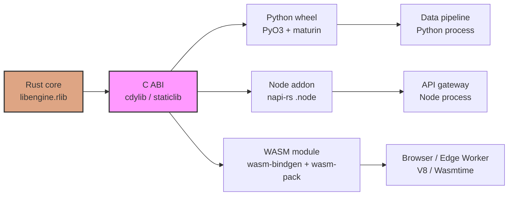
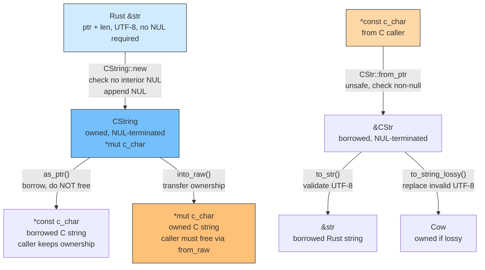
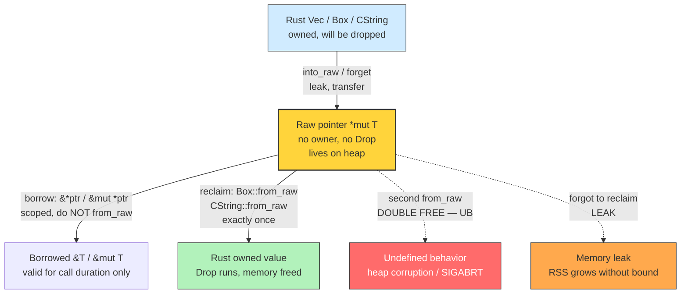
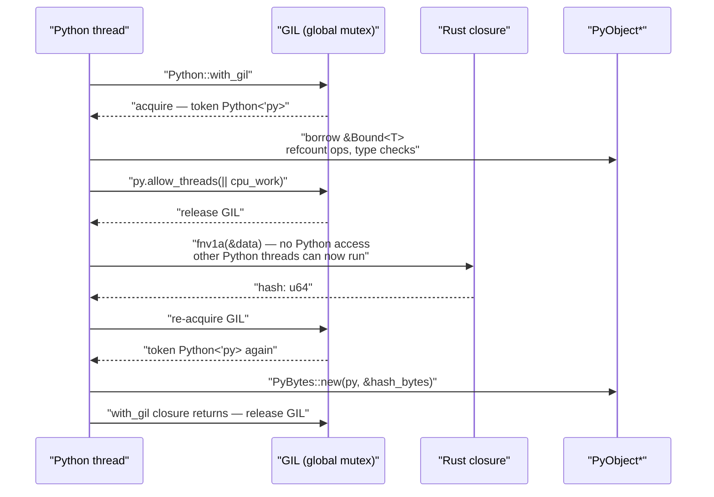
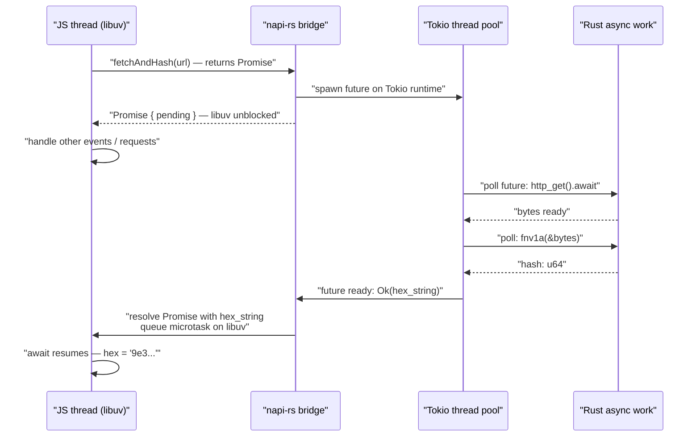
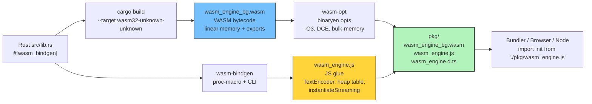
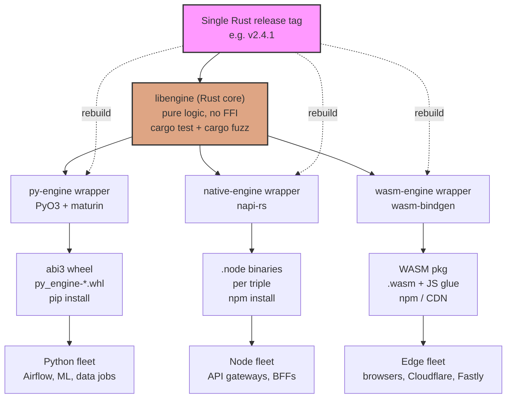

# Chapter 10 — FFI, Native Extensions, and Polyglot Interop (C, Python, Node, WASM)

*What this chapter covers:* how Rust talks to the rest of the world — and how the rest of the world calls into Rust. You will learn the mechanics of the C ABI as the lingua franca of native code, how to expose and consume `extern "C"` functions safely, when `repr(C)` matters and when it does not, how to cross the string and ownership boundary without leaking or double-freeing, and how the `bindgen`/`cbindgen` code generators remove manual binding toil. From there we build outward to three polyglot targets that dominate backend and edge deployments: Python extensions via PyO3 (including GIL semantics), Node.js native addons via napi-rs (including async bridging between Tokio and libuv), and WebAssembly via `wasm-bindgen` and `wasm-pack` (including `wasm32-unknown-unknown`, JS glue generation, WASI, and the emerging WIT Component Model). Every pattern is presented with working code, a failure-mode analysis, and a deployment story for services where a Rust core is wrapped by multiple language edges.

**Learning goals:**

- Declare and consume C-ABI functions with `extern "C"`, `#[no_mangle]`, and `repr(C)`, and explain why each attribute exists and what breaks without it.
- Reason about layout, alignment, and ABI stability for structs, enums, and unions crossing the FFI boundary, and choose between `bindgen` (C-to-Rust) and `cbindgen` (Rust-to-C) for binding generation.
- Cross the string and ownership boundary correctly — `CString`/`CStr` vs `&str`, `*const c_char` vs `*mut c_char`, `Box::into_raw`/`Box::from_raw`, and who frees what.
- Build a Python extension with PyO3 (`#[pymodule]`, `#[pyclass]`, `#[pymethods]`), manage the GIL with `Python::with_gil`, and map Rust errors to Python exceptions.
- Build a Node.js native addon with napi-rs (`#[napi]`), bridge async Rust futures to JavaScript promises, and handle `Buffer`/`TypedArray` zero-copy correctly.
- Compile Rust to WebAssembly (`wasm32-unknown-unknown`, `wasm-bindgen`, `wasm-pack`), explain the JS glue layer, and evaluate WASI and the WIT Component Model for server-side WASM.
- Quantify FFI overhead — call cost, inlining loss, serialization — and decide when FFI helps and when it hurts.
- Apply polyglot interop patterns in a distributed system: a Rust core library deployed simultaneously as a Python wheel, a Node native addon, and a WASM module.

---

## 1. Why Polyglot Interop Matters for Backend Systems

No serious backend is monolingual. A typical organization has Python for data pipelines and ML inference, TypeScript/Node for API gateways and BFF layers, and Rust or C++ for the hot path — a storage engine, a proxy, a codec, a crypto library. Rewriting every consumer is not an option; exposing the same Rust core to multiple runtimes is.

Three forces push teams toward FFI and native extensions:

1. **Performance cliffs.** A Python service parsing 100 kRPS of JSON or validating JWTs will saturate CPUs long before the network does. Moving the codec or crypto to Rust can cut p99 by 5-10x without changing the caller's language.
2. **Existing Rust investments.** Libraries like `ring`, `rustls`, `tokenizers`, `arrow-rs`, and `qdrant`'s segment engine are Rust-native. Python and Node consumers need a bridge, not a rewrite.
3. **Edge and sandbox constraints.** WASM lets you ship the same Rust logic to browsers, Cloudflare Workers, Fastly Compute, and in-process plugin sandboxes — all from one codebase with one test suite.

The alternative to native interop is RPC — put the Rust code behind a sidecar or microservice and call it over gRPC/HTTP. That works, but adds a network hop, serialization, deployment coupling, and failure modes of its own. FFI keeps the call in-process: nanoseconds, not milliseconds, with no extra service to operate.

The cost is complexity at the boundary. Two type systems, two memory managers, two error models, two runtimes, sometimes two event loops. This chapter is about managing that complexity without introducing soundness holes.



**Diagram 1 — Polyglot deployment topology.** A single Rust core compiled to different crate types fans out to three language edges. Each edge has its own toolchain, packaging, and runtime contract, but shares the same correctness-critical logic.

---

## 2. C FFI Fundamentals: The Universal Foreign Interface

The C ABI is the lowest common denominator of native interop. Python's C API, Node-API (NAPI), Ruby's C extensions, Lua, JVM JNI, and WASM's import/export model all bottom out in C calling conventions. If you understand C FFI, you understand the foundation under every other binding.

### 2.1 `extern "C"`, `#[no_mangle]`, and the ABI Contract

Rust's default ABI (`extern "Rust"`) is unstable — name mangling, calling convention, and layout are all unspecified and change between compiler versions. It exists solely for Rust-to-Rust calls within one compiler invocation. To cross a language boundary, you must opt into the C ABI explicitly.

```rust
// Rust side — exposing a function to C (and thus to everyone)
#[no_mangle]
pub extern "C" fn validate_token(
    ptr: *const u8,
    len: usize,
    out_valid: *mut bool,
) -> i32 {
    // SAFETY: caller must guarantee ptr/len/out_valid validity per contract.
    if ptr.is_null() || out_valid.is_null() {
        return -1; // error code — never panic across FFI
    }
    let bytes = unsafe { std::slice::from_raw_parts(ptr, len) };
    let valid = bytes.len() >= 16 && bytes[0] == b'e' && bytes[1] == b'y';
    unsafe { *out_valid = valid; }
    0
}
```

```rust
// Rust side — calling a C function
use std::os::raw::{c_char, c_int};

extern "C" {
    fn strlen(s: *const c_char) -> usize;
    fn memcmp(a: *const u8, b: *const u8, n: usize) -> c_int;
}

fn example() {
    let s = c"hello"; // C string literal (Rust 1.77+), NUL-terminated
    let len = unsafe { strlen(s.as_ptr()) };
    assert_eq!(len, 5);
}
```

Three things to note:

| Attribute / keyword | What it does | What breaks without it |
|---|---|---|
| `extern "C"` | Uses the platform C calling convention (System V AMD64 on Linux x86-64, Win64 on Windows x86-64, AAPCS on ARM). Controls argument passing, register use, stack alignment. | Caller and callee disagree on where arguments live — stack corruption, wrong values, SIGSEGV. |
| `#[no_mangle]` | Suppresses Rust name mangling (`_ZN...`). Emits the symbol exactly as written. | C linker cannot find the symbol; `undefined symbol: validate_token` at `dlopen`. |
| `unsafe` on FFI calls | Required for every `extern "C"` call and every dereference of a raw pointer. The compiler forces you to acknowledge the unchecked precondition. | Not a runtime failure — the code will not compile without `unsafe`, which is the point. |

> **Rule: never panic across FFI.** An unwinding panic that crosses an `extern "C"` boundary is undefined behavior. If the Rust function can panic (index out of bounds, `unwrap`, allocation failure), wrap the body in `std::panic::catch_unwind` or `std::panic::AssertUnwindSafe` and translate the panic into an error code. Compile with `panic = "abort"` for `cdylib` crates if you want a hard guarantee.

```rust
#[no_mangle]
pub extern "C" fn safe_entry(ptr: *const u8, len: usize) -> i32 {
    let result = std::panic::catch_unwind(|| {
        // ... logic that might panic
        0
    });
    match result {
        Ok(code) => code,
        Err(_) => -99, // panic translated to error code
    }
}
```

> **Call convention detail:** on Linux x86-64 (System V AMD64), `validate_token(ptr, len, out_valid)` arrives with `RDI=ptr`, `RSI=len`, `RDX=out_valid` and returns the `i32` in `RAX`. The cost is the indirect call plus register spills and the loss of cross-boundary inlining (see Section 8). No unwinding may cross the boundary — LLVM assumes `nounwind` on `extern "C"`.

### 2.2 `repr(C)` — Layout Is Part of the Contract

Rust does not guarantee struct field order, padding, or enum discriminant values unless you ask for it. That freedom lets the compiler reorder fields for minimal padding and optimize `Option<&T>` into a nullable pointer. It also means a plain Rust struct has no stable memory layout for C to read.

```rust
// LAYOUT UNDEFINED — do not share across FFI
struct Packet {
    id: u32,
    payload_len: u16,
    flags: u8,
    // compiler may reorder, add padding anywhere, change between versions
}

// LAYOUT DEFINED — safe to share across FFI
#[repr(C)]
struct PacketC {
    id: u32,          // offset 0, 4 bytes
    payload_len: u16, // offset 4, 2 bytes
    flags: u8,        // offset 6, 1 byte
    // offset 7: 1 byte padding to align to 4 (C rules)
}

#[repr(C)]
union WordOrBytes {
    word: u32,
    bytes: [u8; 4],
}

#[repr(C, u8)] // C-compatible tagged union: discriminant is a u8
enum Message {
    Ping(u32),
    Pong(u32),
    Data { len: u32, id: u64 },
}
```

For `repr(C)` structs, the layout follows the platform C rules: fields in declaration order, padding inserted to satisfy each field's alignment, overall size rounded up to the struct's alignment. You can verify this in tests:

```rust
#[cfg(test)]
mod layout_tests {
    use super::*;
    use std::mem::{align_of, size_of};

    #[test]
    fn packet_layout() {
        assert_eq!(size_of::<PacketC>(), 8);
        assert_eq!(align_of::<PacketC>(), 4);
        // field offsets via `memoffset` crate in real code
    }
}
```

Other `repr` options relevant to FFI:

| `repr` | Use case |
|---|---|
| `repr(C)` | Structs/unions shared with C. Deterministic field order and C padding. |
| `repr(transparent)` | Single-field wrapper with identical ABI to the inner type. Useful for newtypes like `struct Handle(*mut c_void)` that must pass as a pointer. |
| `repr(u8)` / `repr(u16)` etc. | C-like enums where only the discriminant matters and variants have no fields. Maps to a C `enum` with fixed width. |
| `repr(C, u8)` | Tagged unions shared with C. Discriminant size explicit. |

> **Distributed-systems note:** when a Rust service and a C service share a `repr(C)` struct over shared memory (`mmap`, `shm_open`) or a binary protocol, field layout is part of the wire format. Changing a `repr(C)` struct is a breaking change — treat it like a Protobuf field number change. Version the struct or add reserved padding.

### 2.3 Strings: `&str` vs `*const c_char` vs `CString`/`CStr`

This is the single most common source of FFI bugs. Rust strings and C strings are fundamentally different:

| Property | Rust `&str` / `String` | C `*const c_char` |
|---|---|---|
| Encoding | UTF-8, always valid | Bytes, conventionally UTF-8 but not enforced |
| Length | Stored alongside pointer (fat pointer) | NUL-terminated (`\0` sentinel), length via `strlen` |
| NUL bytes | Allowed inside the string | Terminates the string; interior NUL truncates |
| Ownership | Owned (`String`) or borrowed (`&str`) with lifetimes | Raw pointer; ownership is a convention, not checked |
| Empty | `""` — pointer may be non-null, len 0 | `""` — pointer to a single `\0` byte, or sometimes `NULL` |

Crossing the boundary requires an explicit conversion that handles the NUL and UTF-8 invariants:

```rust
use std::ffi::{CStr, CString};
use std::os::raw::c_char;

// Rust -> C: caller transfers ownership semantics must be documented
fn rust_to_c(s: &str) -> Result<CString, std::ffi::NulError> {
    // Fails if s contains an interior NUL byte — maps to an error, not truncation
    CString::new(s)
}

#[no_mangle]
pub extern "C" fn process_name(name: *const c_char) -> i32 {
    if name.is_null() {
        return -1;
    }
    // SAFETY: name must point to a valid NUL-terminated C string for the
    // duration of this call. Caller guarantees lifetime.
    let c_str = unsafe { CStr::from_ptr(name) };
    let rust_str = match c_str.to_str() {
        Ok(s) => s,           // valid UTF-8
        Err(_) => return -2,  // invalid UTF-8 — C gave us non-UTF-8 bytes
    };
    println!("name: {rust_str}");
    0
}

// C -> Rust -> C (returning a string): caller must know who frees
#[no_mangle]
pub extern "C" fn greeting(name: *const c_char) -> *mut c_char {
    if name.is_null() {
        return std::ptr::null_mut();
    }
    let c_str = unsafe { CStr::from_ptr(name) };
    let name_str = c_str.to_string_lossy();
    let owned = format!("Hello, {}!", name_str);
    match CString::new(owned) {
        Ok(cs) => cs.into_raw(), // transfers ownership to caller — caller must call free_greeting
        Err(_) => std::ptr::null_mut(),
    }
}

#[no_mangle]
pub extern "C" fn free_greeting(s: *mut c_char) {
    if s.is_null() {
        return;
    }
    // SAFETY: s must have been returned by greeting() and not yet freed
    unsafe { let _ = CString::from_raw(s); } // reclaims and drops
}
```



**Diagram 3 — String ownership across the C ABI boundary.** Every conversion has an ownership implication. `into_raw`/`from_raw` is a transfer; `as_ptr`/`from_ptr` is a borrow. Mixing them is a leak or a double-free.

### 2.4 Ownership Across the Boundary: Who Frees What

Rust's ownership system stops at the FFI boundary. On the other side, there is no borrow checker — only documentation and discipline. Four patterns cover most cases:

```rust
use std::ffi::CString;
use std::os::raw::c_char;

// Pattern 1: Caller owns, callee borrows (most common, simplest)
// Callee must not retain the pointer after return.
#[no_mangle]
pub extern "C" fn hash_bytes(data: *const u8, len: usize, out: *mut u64) -> i32 {
    if data.is_null() || out.is_null() { return -1; }
    let slice = unsafe { std::slice::from_raw_parts(data, len) };
    let h = xx_hash(slice);
    unsafe { *out = h; }
    0
}

// Pattern 2: Callee allocates, caller frees (transfer)
// Requires a paired free function. Document it.
#[no_mangle]
pub extern "C" fn create_buffer(cap: usize) -> *mut u8 {
    let mut v = Vec::<u8>::with_capacity(cap);
    let ptr = v.as_mut_ptr();
    std::mem::forget(v); // leak — ownership transferred to C
    ptr
}
#[no_mangle]
pub extern "C" fn free_buffer(ptr: *mut u8, cap: usize) {
    if ptr.is_null() { return; }
    unsafe { let _ = Vec::from_raw_parts(ptr, 0, cap); } // reclaim and drop
}

// Pattern 3: Box transfer — opaque handle pattern
pub struct Engine { /* ... */ }

#[no_mangle]
pub extern "C" fn engine_new() -> *mut Engine {
    Box::into_raw(Box::new(Engine { /* ... */ }))
}
#[no_mangle]
pub extern "C" fn engine_do_work(handle: *mut Engine, input: *const u8, len: usize) -> i32 {
    if handle.is_null() { return -1; }
    let engine = unsafe { &mut *handle }; // borrow, do not reclaim
    // ... use engine
    0
}
#[no_mangle]
pub extern "C" fn engine_free(handle: *mut Engine) {
    if handle.is_null() { return; }
    unsafe { let _ = Box::from_raw(handle); } // reclaim exactly once
}

// Pattern 4: Static / leaked — lives forever (config, global state)
use std::sync::OnceLock;
static GLOBAL: OnceLock<String> = OnceLock::new();

#[no_mangle]
pub extern "C" fn global_config() -> *const c_char {
    let s = GLOBAL.get_or_init(|| "default-config".to_string());
    // Leak a CString for the lifetime of the process — never freed
    let cs = CString::new(s.as_str()).unwrap();
    cs.into_raw() as *const c_char
    // NOTE: intentionally leaked. No free function. Document as "do not free".
}

fn xx_hash(_data: &[u8]) -> u64 { 0x9e3779b97f4a7c15 }
```

> **Pitfall: `Box::from_raw` must pair with `Box::into_raw` exactly once, with the same type and allocator.** Calling `from_raw` twice on the same pointer is a double-free. Calling it with the wrong type is type confusion. Passing a pointer allocated by `malloc` to `Box::from_raw` mixes allocators — undefined behavior. In production FFI layers, consider adding a magic field to the struct and checking it in `engine_free` to detect double-free and use-after-free during development.



**Diagram 4 — Memory ownership across the C ABI boundary.** The raw pointer is an ownership limbo — neither Rust nor C owns it until the contract says who reclaims. Every `into_raw` must have exactly one `from_raw`.

### 2.5 `bindgen` and `cbindgen` — Generating Bindings

Hand-writing `extern "C"` blocks for a 500-header C library is error-prone. Two tools automate the translation in opposite directions:

| Tool | Direction | Input | Output | When to use |
|---|---|---|---|---|
| **`bindgen`** | C/C++ → Rust | C headers (`.h`) | Rust `extern "C"` blocks + `repr(C)` types | Calling a C library from Rust (e.g., `libpq`, `openssl`, `rocksdb`) |
| **`cbindgen`** | Rust → C | Rust source (`lib.rs`) | C header (`.h`) with `extern` declarations | Exposing a Rust library to C consumers (and thus to Python/Node via C ABI) |

**`bindgen` — consuming a C library from Rust:**

```toml
# Cargo.toml
[build-dependencies]
bindgen = "0.69"
```

```rust
// build.rs
fn main() {
    println!("cargo:rerun-if-changed=wrapper.h");
    let bindings = bindgen::Builder::default()
        .header("wrapper.h")
        .parse_callbacks(Box::new(bindgen::CargoCallbacks::new()))
        .allowlist_function("engine_.*")
        .allowlist_type("Engine.*")
        .derive_debug(true)
        .generate()
        .expect("bindgen failed");

    bindings
        .write_to_file("src/bindings.rs")
        .expect("failed to write bindings");

    // Link the C library
    println!("cargo:rustc-link-lib=engine");
    println!("cargo:rustc-link-search=native=/usr/local/lib");
}
```

```c
// wrapper.h — minimal header that pulls in what bindgen should see
#include "engine.h"
```

```rust
// src/main.rs
mod bindings; // generated by build.rs
use bindings::{engine_init, engine_process};

fn main() {
    unsafe {
        let handle = engine_init();
        assert!(!handle.is_null());
        let rc = engine_process(handle, std::ptr::null(), 0);
        assert_eq!(rc, 0);
    }
}
```

`bindgen` handles macro constants, anonymous structs/unions, function pointers, bitfields, and C++ templates (with limitations). For C++ libraries, use `bindgen` with `clang` args: `.clang_arg("-std=c++17")` and `.allowlist_file(".*engine.*")`.

**`cbindgen` — exposing a Rust library to C:**

```toml
# Cargo.toml
[lib]
crate-type = ["cdylib", "rlib"]

[build-dependencies]
cbindgen = "0.26"
```

```rust
// build.rs
fn main() {
    let crate_dir = std::env::var("CARGO_MANIFEST_DIR").unwrap();
    let bindings = cbindgen::generate_with_config(
        &crate_dir,
        cbindgen::Config::from_file("cbindgen.toml").unwrap(),
    )
    .expect("cbindgen failed");
    bindings.write_to_file("include/engine.h");
}
```

```toml
# cbindgen.toml
language = "C"
include_guard = "ENGINE_H"
autogen_warning = "/* Warning: auto-generated by cbindgen. Do not edit. */"
sys_includes = ["stdint.h", "stdbool.h"]
```

Annotate Rust types for `cbindgen` to pick up:

```rust
/// Opaque handle — C sees only a forward declaration.
#[repr(C)]
pub struct Engine {
    _private: [u8; 0],
}

/// C-visible config — cbindgen emits a struct definition.
#[repr(C)]
#[derive(Debug, Clone)]
pub struct EngineConfig {
    pub max_connections: u32,
    pub timeout_ms: u64,
    pub enable_tls: bool,
}

/// cbindgen emits: int32_t engine_init(const EngineConfig *config, Engine **out);
#[no_mangle]
pub extern "C" fn engine_init(
    config: *const EngineConfig,
    out: *mut *mut Engine,
) -> i32 {
    // ...
    0
}
```

> **CI hygiene:** check generated bindings into version control or verify them in CI with `bindgen --verify` / `cbindgen --verify`. A header change that silently alters a struct layout will not cause a compile error — it will cause runtime memory corruption. A `cargo test` that asserts `size_of::<GeneratedType>()` against a known value catches this.

---

## 3. Concrete Example: A Minimal C FFI Library End-to-End

This section ties the C FFI concepts into a buildable crate. The library exposes a simple byte-hashing and string-greeting API to C callers, with correct ownership, error handling, and a `cbindgen`-generated header.

**Crate layout:**

```text
ffi-demo/
  Cargo.toml
  cbindgen.toml
  build.rs
  src/lib.rs
  include/          # generated header goes here
  tests/ffi_smoke.rs
```

```toml
# Cargo.toml
[package]
name = "ffi-demo"
version = "0.1.0"
edition = "2021"

[lib]
crate-type = ["cdylib", "rlib"]

[dependencies]

[build-dependencies]
cbindgen = "0.26"
```

```rust
// src/lib.rs — complete, buildable example
use std::ffi::{CStr, CString};
use std::os::raw::{c_char, c_int};
use std::slice;

// --- 1. Plain data type shared with C ---

#[repr(C)]
#[derive(Debug, Clone, Copy)]
pub struct HashResult {
    pub hash: u64,
    pub len: u32,
    pub ok: bool,
}

// --- 2. Borrow pattern: caller owns the buffer ---

/// Hash `len` bytes at `data`. Writes result to `out`.
/// Returns 0 on success, -1 on null pointer.
/// Caller retains ownership of `data` and `out`.
#[no_mangle]
pub extern "C" fn hash_bytes(
    data: *const u8,
    len: usize,
    out: *mut HashResult,
) -> c_int {
    if data.is_null() || out.is_null() {
        return -1;
    }
    // Catch panics — never unwind across FFI
    let result = std::panic::catch_unwind(|| {
        let bytes = unsafe { slice::from_raw_parts(data, len) };
        let hash = fnv1a(bytes);
        HashResult { hash, len: len as u32, ok: true }
    });
    match result {
        Ok(r) => {
            unsafe { *out = r; }
            0
        }
        Err(_) => -2,
    }
}

// --- 3. String in (borrow) ---

/// Returns 0 if `s` is a valid non-empty UTF-8 string, negative on error.
/// Borrows `s` for the duration of the call only.
#[no_mangle]
pub extern "C" fn validate_name(s: *const c_char) -> c_int {
    if s.is_null() {
        return -1;
    }
    let cstr = unsafe { CStr::from_ptr(s) };
    match cstr.to_str() {
        Ok(inner) if !inner.is_empty() => 0,
        Ok(_) => -2,  // empty
        Err(_) => -3, // invalid UTF-8
    }
}

// --- 4. String out (transfer) — caller must free ---

/// Returns a newly allocated C string "Hello, {name}!".
/// Caller must free with `string_free`. Returns null on error.
#[no_mangle]
pub extern "C" fn greeting(name: *const c_char) -> *mut c_char {
    if name.is_null() {
        return std::ptr::null_mut();
    }
    let name_str = unsafe { CStr::from_ptr(name) }.to_string_lossy();
    let owned = format!("Hello, {}!", name_str);
    match CString::new(owned) {
        Ok(cs) => cs.into_raw(),
        Err(_) => std::ptr::null_mut(),
    }
}

/// Free a string returned by `greeting`.
#[no_mangle]
pub extern "C" fn string_free(s: *mut c_char) {
    if s.is_null() {
        return;
    }
    unsafe { let _ = CString::from_raw(s); }
}

// --- 5. Opaque handle (Box transfer) ---

pub struct Counter {
    value: u64,
}

#[no_mangle]
pub extern "C" fn counter_new(initial: u64) -> *mut Counter {
    Box::into_raw(Box::new(Counter { value: initial }))
}

#[no_mangle]
pub extern "C" fn counter_add(handle: *mut Counter, delta: u64) -> c_int {
    if handle.is_null() {
        return -1;
    }
    let c = unsafe { &mut *handle };
    c.value = c.value.wrapping_add(delta);
    0
}

#[no_mangle]
pub extern "C" fn counter_get(handle: *const Counter, out: *mut u64) -> c_int {
    if handle.is_null() || out.is_null() {
        return -1;
    }
    let c = unsafe { &*handle };
    unsafe { *out = c.value; }
    0
}

#[no_mangle]
pub extern "C" fn counter_free(handle: *mut Counter) {
    if handle.is_null() {
        return;
    }
    unsafe { let _ = Box::from_raw(handle); }
}

fn fnv1a(bytes: &[u8]) -> u64 {
    let mut hash: u64 = 0xcbf29ce484222325;
    for &b in bytes {
        hash ^= b as u64;
        hash = hash.wrapping_mul(0x100000001b3);
    }
    hash
}

#[cfg(test)]
mod tests {
    use super::*;
    use std::ffi::CString;

    #[test]
    fn hash_roundtrip_via_raw_parts() {
        let data = b"hello ffi";
        let mut out = HashResult { hash: 0, len: 0, ok: false };
        let rc = hash_bytes(data.as_ptr(), data.len(), &mut out as *mut _);
        assert_eq!(rc, 0);
        assert!(out.ok);
        assert_eq!(out.hash, fnv1a(data));
    }

    #[test]
    fn string_transfer_roundtrip() {
        let name = CString::new("world").unwrap();
        let ptr = greeting(name.as_ptr());
        assert!(!ptr.is_null());
        let result = unsafe { CStr::from_ptr(ptr) }.to_string_lossy();
        assert_eq!(result, "Hello, world!");
        string_free(ptr);
    }
}
```

Build and inspect the artifacts:

```bash
$ cargo build --release
$ ls target/release/libffi_demo.*
target/release/libffi_demo.so   # cdylib — what C/Python/Node load
target/release/libffi_demo.rlib # rlib — what Rust dependents link

$ nm -D target/release/libffi_demo.so | grep -E 'hash_bytes|greeting|counter_'
0000000000004a10 T counter_add
0000000000004a50 T counter_free
00000000000049c0 T counter_get
0000000000004990 T counter_new
0000000000004820 T greeting
00000000000046e0 T hash_bytes
00000000000048a0 T string_free
00000000000047a0 T validate_name

$ cargo test
running 2 tests
test tests::hash_roundtrip_via_raw_parts ... ok
test tests::string_transfer_roundtrip ... ok
```

The `nm` output confirms `#[no_mangle]` worked — symbols are unmangled and directly `dlsym`-able.

---

## 4. Python Extensions with PyO3

CPython's extension model is a C ABI contract: a shared library (`*.so` / `*.pyd`) that exports a `PyInit_<module>` function and manipulates `PyObject*` pointers under the rules of the Global Interpreter Lock (GIL). PyO3 wraps this in safe Rust abstractions while preserving the underlying semantics.

### 4.1 Project Setup: `maturin` and `pyo3`

```toml
# Cargo.toml
[package]
name = "py-engine"
version = "0.1.0"
edition = "2021"

[lib]
name = "py_engine"
crate-type = ["cdylib"]

[dependencies]
pyo3 = { version = "0.22", features = ["extension-module"] }

[dependencies.pyo3-ffi]
version = "0.22"
optional = false
```

```toml
# pyproject.toml
[build-system]
requires = ["maturin>=1.4,<2.0"]
build-backend = "maturin"

[project]
name = "py-engine"
requires-python = ">=3.8"

[tool.maturin]
features = ["pyo3/extension-module"]
module-name = "py_engine._core"
bindings = "pyo3"
```

```bash
# Development install (creates a venv, builds, installs)
$ maturin develop --release

# Wheel build (what CI publishes)
$ maturin build --release --strip
#  -> target/wheels/py_engine-0.1.0-cp38-abi3-linux_x86_64.whl

# With abi3 (stable ABI) — one wheel works across Python 3.8+
# Cargo.toml: pyo3 = { version = "0.22", features = ["abi3-py38", "extension-module"] }
```

`maturin` handles the `PyInit` symbol, platform tags, auditwheel/delocate repair, and sdist generation. The `abi3` feature builds against CPython's stable ABI — a single wheel runs on 3.8 through 3.13 without recompilation, at the cost of not using newer C API functions.

### 4.2 `#[pymodule]`, `#[pyclass]`, `#[pymethods]` — The PyO3 Surface

```rust
// src/lib.rs — complete PyO3 extension
use pyo3::prelude::*;
use pyo3::exceptions::PyValueError;
use pyo3::types::PyBytes;

/// Module entry point — must match `module-name` in pyproject.toml
#[pymodule]
fn _core(m: &Bound<'_, PyModule>) -> PyResult<()> {
    m.add_class::<TokenValidator>()?;
    m.add_class::<Counter>()?;
    m.add_function(wrap_pyfunction!(hash_bytes, m)?)?;
    m.add_function(wrap_pyfunction!(greeting, m)?)?;
    Ok(())
}

/// Opaque handle exposed as a Python class.
/// `#[pyclass]` generates the PyTypeObject and GC hooks.
#[pyclass]
struct TokenValidator {
    min_len: usize,
}

#[pymethods]
impl TokenValidator {
    #[new]
    fn new(min_len: usize) -> Self {
        Self { min_len }
    }

    /// Validate a token. Accepts `bytes` or `str`.
    /// Demonstrates borrowing Python objects under the GIL.
    fn validate(&self, token: &Bound<'_, pyo3::types::PyAny>) -> PyResult<bool> {
        if let Ok(bytes) = token.extract::<&[u8]>() {
            Ok(bytes.len() >= self.min_len && bytes.starts_with(b"ey"))
        } else if let Ok(s) = token.extract::<String>() {
            Ok(s.len() >= self.min_len && s.starts_with("ey"))
        } else {
            Err(PyValueError::new_err("token must be bytes or str"))
        }
    }

    fn __repr__(&self) -> String {
        format!("TokenValidator(min_len={})", self.min_len)
    }
}

#[pyclass]
struct Counter {
    inner: u64,
}

#[pymethods]
impl Counter {
    #[new]
    fn new(initial: u64) -> Self {
        Self { inner: initial }
    }

    fn add(&mut self, delta: u64) {
        self.inner = self.inner.wrapping_add(delta);
    }

    fn get(&self) -> u64 {
        self.inner
    }

    fn __repr__(&self) -> String {
        format!("Counter({})", self.inner)
    }
}

/// Free function: hash bytes, return Python `bytes` length + hash as tuple.
/// Shows zero-copy input (borrow) and owned output.
#[pyfunction]
fn hash_bytes<'py>(py: Python<'py>, data: &[u8]) -> PyResult<Bound<'py, PyBytes>> {
    // `data` is borrowed from the Python bytes object — valid while GIL is held.
    // No copy has occurred yet.
    let hash = fnv1a(data);
    // Return new Python bytes — owned, refcounted, GC-managed.
    Ok(PyBytes::new(py, &hash.to_le_bytes()))
}

#[pyfunction]
fn greeting(name: String) -> PyResult<String> {
    // `String` extraction already validated UTF-8 and copied from Python's
    // internal representation (which may be UCS-2/UCS-4/UTF-8 depending on build).
    if name.is_empty() {
        return Err(PyValueError::new_err("name must not be empty"));
    }
    Ok(format!("Hello, {}!", name))
}

fn fnv1a(bytes: &[u8]) -> u64 {
    let mut h: u64 = 0xcbf29ce484222325;
    for &b in bytes {
        h ^= b as u64;
        h = h.wrapping_mul(0x100000001b3);
    }
    h
}
```

Python-side usage after `maturin develop`:

```python
import py_engine._core as core

v = core.TokenValidator(min_len=16)
assert v.validate(b"eyJhbGciOiJIUzI1NiJ9.payload") is True
assert v.validate("short") is False

c = core.Counter(10)
c.add(5)
assert c.get() == 15

h = core.hash_bytes(b"hello")
assert len(h) == 8  # 8 bytes of u64 LE

print(core.greeting("world"))  # Hello, world!
```

### 4.3 The GIL — What It Is and How PyO3 Manages It

CPython's GIL is a single global mutex that protects every `PyObject*` — reference counts, type pointers, GC headers, and all interpreter state. Only the thread holding the GIL may touch Python objects. PyO3 encodes this as a token type: `Python<'py>`.

```rust
use pyo3::prelude::*;

// `Python<'py>` is the GIL token. You cannot get one without holding the GIL.
// Its lifetime `'py` ties every borrowed Python reference to the GIL hold.
fn gil_patterns() -> PyResult<()> {
    // Pattern 1: with_gil — acquire, run closure, release
    Python::with_gil(|py| {
        let list = pyo3::types::PyList::new(py, [1u64, 2, 3])?;
        println!("len: {}", list.len());
        Ok::<(), PyErr>(())
    })?;

    // Pattern 2: allow_threads — release GIL for CPU-bound Rust work
    let data = vec![0u8; 10_000_000];
    let hash = Python::with_gil(|py| {
        // Release GIL while hashing — other Python threads can run
        py.allow_threads(|| fnv1a(&data))
    });
    println!("hash: {hash:x}");

    // Pattern 3: prepare_freethreaded_python — for Rust threads that need Python
    // Call once at program startup if Rust spawns threads that call into Python.
    // pyo3::prepare_freethreaded_python();

    Ok(())
}

fn fnv1a(bytes: &[u8]) -> u64 {
    let mut h: u64 = 0xcbf29ce484222325;
    for &b in bytes { h ^= b as u64; h = h.wrapping_mul(0x100000001b3); }
    h
}
```

Key rules:

- **Every interaction with a `PyObject` requires `Python<'py>`.** The compiler enforces this — you cannot call `PyList::new` without a `py` token.
- **`allow_threads` releases the GIL** for the duration of the closure. Use it for any Rust work that does not touch Python objects: hashing, compression, I/O, or `tokio::block_on`. Failing to release the GIL during a 100 ms Rust computation blocks every other Python thread in the process.
- **`Bound<'py, T>` vs `Py<T>`.** `Bound` is a GIL-bound reference (like `&T` — must not outlive the GIL hold). `Py<T>` is a GIL-independent smart pointer (like `Arc<T>` — holds a refcount, can be sent between threads, but must re-acquire the GIL to dereference). For data that outlives a single `with_gil` call, use `Py<T>`.



**Diagram 5 — Python GIL acquire/release cycle.** The `Python<'py>` token is a compile-time proof of GIL ownership. `allow_threads` drops the proof for CPU-bound work, letting other Python threads make progress.

### 4.4 Error Mapping and `#[pyclass]` Design Notes

- Rust `Result<T, E>` maps to Python exceptions. Any `PyResult<T>` that is `Err` becomes a raised exception on the Python side. Use `PyValueError`, `PyRuntimeError`, `PyTypeError`, or define custom exceptions with `create_exception!`.
- `#[pyclass]` types are Python GC participants. If your type holds a `Py<T>` (a reference to a Python object), you must implement `__traverse__` and `__clear__` or use `#[pyclass(gc)]` — otherwise the GC cannot break reference cycles.
- Free-threaded Python (3.13t, PEP 703) removes the GIL. PyO3 0.22+ has experimental support via `pyo3 = { features = ["gil-refs"] }` removal and the new `Bound` API. For backend services pinning Python 3.12, this is not yet relevant, but design new extensions with `Bound` rather than the deprecated `&PyAny` GIL-refs API to be forward-compatible.

---

## 5. Node.js Native Addons with napi-rs

Node.js native addons compile Rust to a `.node` shared library loaded via `require()` / `import`. The underlying C API is Node-API (NAPI) — a stable, ABI-versioned C interface that survives Node major versions without recompilation. `napi-rs` wraps NAPI in ergonomic Rust macros and handles the libuv event-loop integration, including async.

### 5.1 Project Setup

```bash
$ npx @napi-rs/cli new --name native-engine --package-manager pnpm
# or manually:
```

```toml
# Cargo.toml
[package]
name = "native-engine"
version = "0.1.0"
edition = "2021"

[lib]
crate-type = ["cdylib"]

[dependencies]
napi = { version = "2", features = ["napi8", "tokio_rt"] }
napi-derive = "2"
tokio = { version = "1", features = ["rt", "rt-multi-thread"] }

[build-dependencies]
napi-build = "2"
```

```rust
// build.rs
fn main() {
    napi_build::setup();
}
```

```json
// package.json
{
  "name": "native-engine",
  "version": "0.1.0",
  "main": "index.js",
  "napi": {
    "name": "native-engine",
    "triples": {
      "defaults": true,
      "additional": ["aarch64-unknown-linux-gnu", "x86_64-apple-darwin"]
    }
  },
  "scripts": {
    "build": "napi build --platform --release",
    "build:debug": "napi build --platform",
    "test": "ava"
  }
}
```

```bash
$ pnpm build
# -> native-engine.linux-x64-gnu.node  (or .darwin-arm64.node, etc.)

$ node -e "const e = require('./native-engine.linux-x64-gnu.node'); console.log(e.greeting('world'))"
# Hello, world!
```

### 5.2 `#[napi]` — Synchronous Functions and Classes

```rust
// src/lib.rs
use napi::bindgen_prelude::*;
use napi_derive::napi;

// --- Free functions ---

#[napi]
pub fn greeting(name: String) -> String {
    format!("Hello, {}!", name)
}

#[napi]
pub fn hash_bytes(data: Buffer) -> u64 {
    // `Buffer` is Node's Buffer — napi zero-copies where possible
    fnv1a(&data)
}

#[napi]
pub fn validate_token(token: String) -> bool {
    token.len() >= 16 && token.starts_with("ey")
}

// Buffer in / Buffer out — binary codec example
#[napi]
pub fn compress(data: Buffer) -> Buffer {
    // In production: use lz4, zstd, or similar
    // Here: trivial RLE placeholder — real impl would call a Rust codec
    let compressed = rle_compress(&data);
    Buffer::from(compressed)
}

#[napi]
pub fn decompress(data: Buffer) -> Result<Buffer> {
    rle_decompress(&data)
        .map(Buffer::from)
        .map_err(|e| Error::new(Status::InvalidArg, e))
}

// --- Classes ---

#[napi]
pub struct Counter {
    inner: u64,
}

#[napi]
impl Counter {
    #[napi(constructor)]
    pub fn new(initial: u64) -> Self {
        Self { inner: initial }
    }

    #[napi]
    pub fn add(&mut self, delta: u64) {
        self.inner = self.inner.wrapping_add(delta);
    }

    #[napi(getter)]
    pub fn value(&self) -> u64 {
        self.inner
    }

    #[napi]
    pub fn reset(&mut self) {
        self.inner = 0;
    }
}

// --- Helpers ---

fn fnv1a(bytes: &[u8]) -> u64 {
    let mut h: u64 = 0xcbf29ce484222325;
    for &b in bytes { h ^= b as u64; h = h.wrapping_mul(0x100000001b3); }
    h
}

fn rle_compress(input: &[u8]) -> Vec<u8> { input.to_vec() } // placeholder
fn rle_decompress(input: &[u8]) -> std::result::Result<Vec<u8>, String> { Ok(input.to_vec()) }
```

JavaScript side:

```javascript
// index.mjs
import { greeting, hashBytes, validateToken, Counter, compress } from './index.js';

console.log(greeting('world'));              // Hello, world!
console.log(hashBytes(Buffer.from('hello'))); // 11831194018420276491n (u64 as BigInt)
console.log(validateToken('eyJhbGci...'));   // true

const c = new Counter(10n);
c.add(5n);
console.log(c.value); // 15n
```

> **BigInt boundary:** JavaScript `number` is f64 — it cannot represent all `u64` values. `napi-rs` maps Rust `u64`/`i64` to JS `BigInt` automatically. If your JS code does `Number(bigint)` you will silently lose precision above 2^53. Keep hashes and IDs as `BigInt` or as hex strings across the boundary.

### 5.3 Async: Bridging Tokio and libuv

Node's event loop is libuv — single-threaded, non-blocking, callback-driven. Rust's async runtime is typically Tokio — multi-threaded, work-stealing. `napi-rs` bridges them: a Rust `async fn` annotated with `#[napi]` returns a JavaScript `Promise`, with the future polled on Tokio while libuv remains unblocked.

```rust
use napi::bindgen_prelude::*;
use napi_derive::napi;

// Async function — returns Promise<string> on the JS side
#[napi]
pub async fn fetch_and_hash(url: String) -> Result<String> {
    // This future runs on Tokio's thread pool, NOT on the libuv thread.
    // The libuv thread is free to handle other JS work while we await.
    let bytes = http_get(&url).await
        .map_err(|e| Error::new(Status::GenericFailure, format!("fetch failed: {e}")))?;
    let hash = fnv1a(&bytes);
    Ok(format!("{hash:016x}"))
}

// Async with explicit AbortSignal support
#[napi]
pub async fn hash_file(path: String, signal: Option<AbortSignal>) -> Result<u64> {
    let data = tokio::fs::read(&path).await
        .map_err(|e| Error::new(Status::GenericFailure, e.to_string()))?;

    if let Some(sig) = signal {
        if sig.aborted() {
            return Err(Error::new(Status::Cancelled, "aborted"));
        }
    }
    Ok(fnv1a(&data))
}

// Callback-style async via `napi::Task` (for custom thread-pool work)
pub struct HashTask {
    data: Vec<u8>,
}

#[napi]
impl Task for HashTask {
    type Output = u64;
    type JsValue = u64;

    fn compute(&mut self) -> Result<Self::Output> {
        // Runs on napi's thread pool (libuv worker threads) — no JS access here
        Ok(fnv1a(&self.data))
    }

    fn resolve(&mut self, _env: Env, output: Self::Output) -> Result<Self::JsValue> {
        // Runs back on the JS thread — can construct JS values
        Ok(output)
    }
}

#[napi]
pub fn hash_async(data: Buffer, signal: Option<AbortSignal>) -> AsyncTask<HashTask> {
    AsyncTask::with_signal(HashTask { data: data.to_vec() }, signal)
}

fn fnv1a(bytes: &[u8]) -> u64 {
    let mut h: u64 = 0xcbf29ce484222325;
    for &b in bytes { h ^= b as u64; h = h.wrapping_mul(0x100000001b3); }
    h
}

async fn http_get(_url: &str) -> std::result::Result<Vec<u8>, String> {
    // placeholder — real impl would use `reqwest` or `hyper`
    Ok(b"response body".to_vec())
}
```

```javascript
// JS — async usage
import { fetchAndHash, hashAsync } from './index.js';

// Promise-based (Tokio future -> JS Promise)
const hex = await fetchAndHash('https://example.com/data');
console.log(hex); // e.g. "9e3779b97f4a7c15"

// AbortSignal integration
const ac = new AbortController();
setTimeout(() => ac.abort(), 100);
try {
  await hashAsync(Buffer.alloc(10_000_000), { signal: ac.signal });
} catch (e) {
  console.log('cancelled:', e.message);
}
```



**Diagram 6 — Async FFI bridging Tokio and libuv.** The JS thread never blocks. The Rust future runs on Tokio's pool; completion is marshaled back to libuv as a Promise resolution. `AbortSignal` propagates cancellation in the reverse direction.

Key constraints:

- **Do not block the JS thread.** A synchronous `#[napi]` function that does 50 ms of CPU work blocks the entire Node event loop — no other request, timer, or I/O callback fires. For anything over ~1 ms, use `async` or `Task`.
- **`Env` and `JsValue` are JS-thread-only.** You cannot touch JavaScript objects from `compute()` / Tokio tasks. Only `resolve()` / the post-completion callback runs on the JS thread.
- **Tokio runtime lifecycle.** `napi-rs` with `tokio_rt` creates a Tokio runtime on first use. If your addon also needs Tokio elsewhere (e.g., a background `tokio::spawn`), share that runtime rather than creating a second one — two runtimes means two thread pools contending for the same cores.

### 5.4 Buffers, TypedArrays, and Zero-Copy

`napi::Buffer` (Node `Buffer`) and `napi::TypedArray` map to Rust `&[u8]` / `Vec<u8>` with minimal copying:

| JS type | Rust type | Copy? |
|---|---|---|
| `Buffer` (arg) | `Buffer` / `&[u8]` via `AsRef<[u8]>` | Zero-copy borrow when possible; may copy if GC moves |
| `Buffer` (return) | `Buffer::from(Vec<u8>)` | One copy into a new JS `ArrayBuffer` (NAPI allocates) |
| `Uint8Array` | `TypedArray<u8>` | Zero-copy view into the existing `ArrayBuffer` |
| `string` | `String` | Always copies (JS strings are UTF-16 internally; Rust is UTF-8) |

For large payloads (e.g., returning a 10 MB compressed buffer), the copy on return is unavoidable with NAPI's current design — the JS GC must own the memory. If this shows up in profiles, consider returning a `External<u8>` or streaming chunks via a JS callback instead of one large `Buffer`.

---

## 6. WebAssembly: `wasm-bindgen`, `wasm-pack`, and the Component Model

WebAssembly lets the same Rust core run in browsers, edge workers, and server-side sandboxes — without a native toolchain, without `unsafe`, and with a capability-based security model. The trade-off is a constrained environment: no threads by default, no direct filesystem or network access, linear memory, and a JS/WASM boundary with its own serialization cost.

### 6.1 Toolchain: `wasm32-unknown-unknown`, `wasm-bindgen`, `wasm-pack`

```bash
# 1. Add the WASM target
$ rustup target add wasm32-unknown-unknown

# 2. Install wasm-bindgen CLI and wasm-pack
$ cargo install wasm-bindgen-cli
$ cargo install wasm-pack

# 3. Verify
$ rustc --print target-list | grep wasm
wasm32-unknown-unknown
wasm32-wasip1
wasm32-wasip2
```

| Crate / tool | Role |
|---|---|
| `wasm32-unknown-unknown` | Compiler target: Rust → WASM bytecode, no OS assumptions. |
| `wasm-bindgen` | Proc-macro + CLI that generates JS glue to call WASM from JS and vice versa. Handles strings, closures, `JsValue`, `Result` → exception, etc. |
| `wasm-pack` | Build orchestrator: runs `cargo build --target wasm32-unknown-unknown`, then `wasm-bindgen`, then `wasm-opt`, and packages for `bundler` / `nodejs` / `web` / `deno`. |
| `wasm-opt` (binaryen) | Optimizer: dead-code elimination, inlining, bulk-memory opts. Often 10-20% size reduction. |

### 6.2 Minimal WASM Library — Hello from Rust

```toml
# Cargo.toml
[package]
name = "wasm-engine"
version = "0.1.0"
edition = "2021"

[lib]
crate-type = ["cdylib"]

[dependencies]
wasm-bindgen = "0.2"
js-sys = "0.3"        # JS built-ins: Array, Map, Date, etc.
wasm-bindgen-futures = "0.4"  # Future <-> Promise

[dependencies.web-sys]
version = "0.3"
features = ["console"] # bind to console.log, etc.
```

```rust
// src/lib.rs
use wasm_bindgen::prelude::*;

// Import JS functions — Rust can call them
#[wasm_bindgen]
extern "C" {
    #[wasm_bindgen(js_namespace = console)]
    fn log(s: &str);
}

// Export Rust functions — JS can call them
#[wasm_bindgen]
pub fn greeting(name: &str) -> String {
    format!("Hello, {}!", name)
}

#[wasm_bindgen]
pub fn hash_bytes(data: &[u8]) -> u64 {
    fnv1a(data)
}

#[wasm_bindgen]
pub fn validate_token(token: &str) -> bool {
    token.len() >= 16 && token.starts_with("ey")
}

// Class exported to JS
#[wasm_bindgen]
pub struct Counter {
    inner: u64,
}

#[wasm_bindgen]
impl Counter {
    #[wasm_bindgen(constructor)]
    pub fn new(initial: u64) -> Self {
        Self { inner: initial }
    }

    pub fn add(&mut self, delta: u64) {
        self.inner = self.inner.wrapping_add(delta);
    }

    #[wasm_bindgen(getter)]
    pub fn value(&self) -> u64 {
        self.inner
    }
}

// Async -> Promise
#[wasm_bindgen]
pub async fn hash_async(data: Vec<u8>) -> u64 {
    // In WASM, async runs on wasm-bindgen-futures' microtask queue,
    // not on Tokio — there is no thread pool.
    fnv1a(&data)
}

// Panic hook for readable stack traces in the browser console
#[wasm_bindgen(start)]
fn start() {
    console_error_panic_hook::set_once();
}

fn fnv1a(bytes: &[u8]) -> u64 {
    let mut h: u64 = 0xcbf29ce484222325;
    for &b in bytes { h ^= b as u64; h = h.wrapping_mul(0x100000001b3); }
    h
}
```

```bash
# Build for bundlers (webpack/vite) — generates pkg/ with JS glue + .wasm
$ wasm-pack build --target bundler

# Build for Node.js
$ wasm-pack build --target nodejs

# Build for browsers without a bundler (ES modules)
$ wasm-pack build --target web

$ ls pkg/
pkg/wasm_engine.js        # JS glue — imports .wasm, exposes greeting(), Counter, etc.
pkg/wasm_engine_bg.wasm   # compiled WASM bytecode
pkg/wasm_engine_bg.wasm.d.ts
pkg/wasm_engine.d.ts      # TypeScript declarations
pkg/package.json
```

JavaScript consumption (bundler target):

```javascript
import init, { greeting, Counter, hash_bytes } from './pkg/wasm_engine.js';

await init(); // fetch + instantiate the .wasm module

console.log(greeting('world'));              // Hello, world!
console.log(hash_bytes(new Uint8Array([1,2,3]))); // 15035938162879559083n

const c = new Counter(10n);
c.add(5n);
console.log(c.value); // 15n
```

Browser without bundler (ES modules):

```html
<script type="module">
  import init, { greeting } from './pkg/wasm_engine.js';
  await init('./pkg/wasm_engine_bg.wasm');
  document.body.textContent = greeting('browser');
</script>
```

### 6.3 What `wasm-bindgen` Generates — The JS Glue Layer

The glue file (`wasm_engine.js`) does four things:

1. **Fetches and instantiates the `.wasm` module** — `WebAssembly.instantiateStreaming` (browser) or `fs.readFileSync` + `WebAssembly.instantiate` (Node).
2. **Manages linear memory** — WASM has a single contiguous `ArrayBuffer`. Strings, slices, and vectors are copied between JS and WASM linear memory via `TextEncoder`/`TextDecoder` and `Uint8Array` views.
3. **Marshals types** — `&str` / `String` ↔ JS `string`, `&[u8]` / `Vec<u8>` ↔ `Uint8Array`, `Result<T, JsValue>` ↔ thrown exception, `Option<T>` ↔ `undefined`, closures ↔ `js-sys::Function`.
4. **Handles lifetimes** — JS objects passed to Rust are tracked in a heap table (`heap[]` in the glue) with manual refcounting, because WASM cannot directly hold JS GC references.



**Diagram 7 — WASM compile and JS glue pipeline.** Rust source is compiled to WASM bytecode and separately to JS glue that handles memory, type marshaling, and module instantiation. `wasm-pack` orchestrates the entire pipeline.

### 6.4 Strings and Binary Data in WASM

The JS ↔ WASM string boundary is a copy — there is no zero-copy string sharing because JS strings are UTF-16 and WASM linear memory is bytes:

```rust
use wasm_bindgen::prelude::*;

// &str in — JS string copied into WASM linear memory, decoded as UTF-8
#[wasm_bindgen]
pub fn validate_name(name: &str) -> bool {
    !name.is_empty() && name.len() <= 128
}

// String out — Rust String copied out of WASM memory, encoded as JS string
#[wasm_bindgen]
pub fn make_greeting(name: &str) -> String {
    format!("Hello, {}!", name)
}

// &[u8] / Vec<u8> — Uint8Array view/copy
#[wasm_bindgen]
pub fn process_bytes(input: &[u8]) -> Vec<u8> {
    // input is a view into WASM memory backed by the JS Uint8Array copy.
    // Return value is copied back to a new JS Uint8Array.
    input.iter().map(|b| b.wrapping_add(1)).collect()
}
```

For large binary payloads, prefer `Uint8Array` over hex/base64 strings — the latter adds 2-4x size overhead plus encode/decode cost.

### 6.5 WASI and the WIT Component Model

Bare `wasm32-unknown-unknown` has no filesystem, network, or clock — it is a pure compute sandbox. Two extensions bring back system capabilities in a capability-secure way:

**WASI (WebAssembly System Interface)** — a POSIX-like syscall layer for WASM that works outside the browser. `wasi-sdk` / `wasm32-wasip1` gives you `std::fs`, `std::net`, `std::time` inside Wasmtime, WasmEdge, or Fastly Compute. Build with:

```bash
$ rustup target add wasm32-wasip1
$ cargo build --target wasm32-wasip1 --release
$ wasmtime run target/wasm32-wasip1/release/my_service.wasm
```

**WIT (WASM Interface Types) and the Component Model** — the next-generation interop layer that replaces ad-hoc `wasm-bindgen` glue for *WASM-to-WASM* and *host-to-WASM* communication. Instead of raw `*const u8` + length pairs, WIT defines typed interfaces:

```wit
// wit/engine.wit — typed interface, language-agnostic
package myorg:engine;

interface types {
    record hash-result {
        hash: u64,
        len: u32,
        ok: bool,
    }
}

interface hashing {
    use types.{hash-result};
    hash-bytes: func(data: list<u8>) -> hash-result;
    validate-token: func(token: string) -> bool;
}

world engine-world {
    export hashing;
    export types;
}
```

```bash
# Generate Rust bindings from WIT
$ cargo install wit-bindgen-cli
$ wit-bindgen rust wit --out-dir src/generated --world engine-world

# Compose components (multiple WASM modules linked via WIT)
$ cargo install wasm-tools
$ wasm-tools compose core.wasm -o composed.wasm
```

| Approach | Boundary | Types | Tooling maturity |
|---|---|---|---|
| `wasm-bindgen` | WASM ↔ JS | Strings, numbers, `JsValue`, closures | Stable, widely used. JS-specific. |
| WASI `wasip1`/`wasip2` | WASM ↔ host OS | Files, sockets, clocks (POSIX-like) | Stable (`wasip1`), evolving (`wasip2`). |
| WIT Component Model | WASM ↔ WASM, WASM ↔ host | Rich: records, variants, lists, options, results | `0.2xx` — Wasmtime supports it; Node/browser support emerging. `wit-bindgen` / `cargo-component`. |

> **Recommendation for backend teams (2026):** use `wasm-bindgen` + `wasm-pack` for browser/edge-JS targets today. Evaluate WIT Component Model for server-side plugin sandboxes (e.g., user-supplied WASM plugins in a Rust host via Wasmtime) — it eliminates an entire class of memory-safety bugs at the plugin boundary by replacing raw pointers with typed, bounds-checked interfaces. Track `cargo-component` and `wit-bindgen` releases; the Component Model is stabilizing but not yet the default. The same Rust source compiles to three WASM deployment models — `wasm32-unknown-unknown` + `wasm-bindgen` (JS glue, no syscalls) for browsers/edge, `wasm32-wasip1` (WASI syscalls) for server sandboxes, and WIT Component Model (`wit-bindgen`, `wasm-tools compose`) for typed multi-module composition.

---

## 7. Safety, Panics, and Undefined Behavior at the Boundary

FFI is `unsafe` because the compiler cannot verify the contract — it must be upheld by the programmer. This section catalogs the concrete failure modes and their mitigations.

### 7.1 The Soundness Checklist

| Invariant | Violation | Symptom |
|---|---|---|
| No panic across `extern "C"` | `panic!` / `unwrap` / OOB in an `extern "C" fn` | UB: stack corruption, abort, or silent wrong behavior. LLVM assumes `nounwind`. |
| No `&T` / `&mut T` across FFI | Passing `&str` to C as `*const c_char` without `CString` | Interior NUL truncation, missing NUL terminator, use-after-free if the `&str` is dropped. |
| `repr(C)` for shared types | Sharing a plain `struct Foo` with C | Field reordering, wrong offsets, silent data corruption. |
| Valid, non-null, aligned pointers | Passing `null` or misaligned `*mut T` to Rust | UB on dereference; may SIGSEGV or silently read wrong memory. |
| Matched allocator | `malloc`'d pointer freed with `Box::from_raw` | Heap corruption. Allocators have incompatible metadata. |
| Lifetime respected | Returning `CStr::from_ptr` borrow beyond the call | Use-after-free when the C caller frees the underlying buffer. |
| `Send`/`Sync` for threaded callers | `Rc<T>` shared to a Python/Node thread | Data race — `Rc` refcount is non-atomic. |

### 7.2 Panic Handling Patterns

```rust
// Pattern A: catch_unwind at every extern "C" entry point (cdylib)
#[no_mangle]
pub extern "C" fn entry_a(input: *const u8, len: usize) -> i32 {
    std::panic::catch_unwind(|| entry_a_inner(input, len))
        .unwrap_or(-99)
}
fn entry_a_inner(input: *const u8, len: usize) -> i32 { 0 }

// Pattern B: abort on panic — fail-stop, no UB, but kills the process
// Cargo.toml: [profile.release] panic = "abort"
// The process aborts on panic instead of unwinding. Appropriate for
// security-critical libraries where a panic indicates a logic bug that
// must not be silently swallowed.

// Pattern C: PyO3 / napi-rs handle this for you — they catch panics
// internally and translate to Python/JS exceptions. Do not double-wrap.
```

### 7.3 Fuzzing and Miri for FFI Layers

- **Miri** (`cargo miri test`) detects UB in `unsafe` code — out-of-bounds, use-after-free, misaligned access, invalid `from_raw` — but does not support `extern "C"` calls to real C libraries. Use it for the pure-Rust side of the boundary (string conversions, `from_raw_parts` logic, `repr(C)` layout tests).
- **Cargo fuzz / libFuzzer** for the FFI entry points: feed arbitrary `*const u8` + `len` pairs and `*const c_char` strings to each `extern "C" fn` and assert no crash, no UB, and correct error codes for invalid inputs.
- **Loom** for concurrency-sensitive FFI (e.g., a Rust `Mutex` accessed from Python threads via PyO3).

```bash
$ cargo install cargo-fuzz
$ cargo fuzz run ffi_entry -- -max_total_time=60
# Fuzzer feeds random bytes as (ptr, len) to each extern "C" fn
```

---

## 8. Performance: FFI Overhead, Inlining Loss, and Serialization Cost

FFI is not free. The cost has three components: call overhead, optimization loss, and data marshaling.


**Diagram 9 — Cost ladder: native vs FFI vs serialization vs RPC.** Each step adds an order of magnitude. FFI's advantage is staying at the second rung; its cost is the loss of inlining and the marshaling work.

### 8.1 Call Overhead

A native Rust call is often inlined — zero call overhead, with cross-function optimization (constant propagation, dead-code elimination). An `extern "C"` call is an opaque indirect call: the optimizer cannot see across the boundary, cannot inline, and must spill registers per the C calling convention.

Measured on Linux x86-64 (System V AMD64), Rust 1.78, `cargo bench` with `criterion`:

| Call type | Typical cost | Notes |
|---|---|---|
| Inlined Rust `fn` | ~0.3-1 ns | No call at all after optimization |
| Non-inlined Rust `fn` | ~2-5 ns | Direct call, branch predictor friendly |
| `extern "C"` Rust→C or C→Rust | ~5-20 ns | Indirect call, register spill, no inline |
| PyO3 `#[pyfunction]` via Python | ~50-200 ns | Plus GIL acquire, `PyObject` refcount |
| `napi-rs` `#[napi]` sync | ~30-100 ns | Plus NAPI handle scope, type coercion |
| `wasm-bindgen` JS→WASM | ~20-80 ns | Plus `TextEncoder` copy for strings |

For a function called once per request, 20 ns is noise. For a tight loop calling a Rust hash function 10M times from Python, 100 ns/call is 1 second — measure it.

### 8.2 When FFI Helps vs Hurts

FFI wins when the Rust work per call is large enough to amortize the call overhead:

- **Wins:** JSON parsing (10 us in Python → 1 us in Rust), crypto (50 us → 5 us), regex on 1 MB input (1 ms → 100 us), image decode. The 50 ns call overhead is irrelevant.
- **Loses:** calling a Rust `fn add(a: i32, b: i32) -> i32` from Python in a loop — the call overhead dominates, and you would have been faster staying in Python or vectorizing the batch.

**Batch to amortize:**

```rust
// BAD — one FFI call per element
#[pyfunction]
fn hash_one(data: &[u8]) -> u64 { fnv1a(data) }
// Python: [hash_one(x) for x in million_items]  — 1M FFI calls

// GOOD — one FFI call for the batch
#[pyfunction]
fn hash_batch(items: Vec<Vec<u8>>) -> Vec<u64> {
    items.iter().map(|v| fnv1a(v)).collect()
}
// Python: hash_batch(million_items)  — 1 FFI call, loop in Rust
```

The same principle applies to `napi-rs` and WASM: prefer `process_batch(&[u8])` over `process_one(u8)` in a JS loop.

---

## 9. Distributed-Systems Lens: Polyglot Deployment at Scale

In a large organization, the same Rust core is deployed to multiple language edges simultaneously. This section describes the operational reality of that pattern.

### 9.1 The Rust Core Pattern

```text
                    ┌─────────────────────────────┐
                    │   Rust core: libengine       │
                    │   parsers, crypto, codecs    │
                    │   tested once, fuzzed once   │
                    └──────┬──────┬──────┬─────────┘
                           │      │      │
              ┌────────────┘      │      └────────────┐
              ▼                   ▼                    ▼
     ┌────────────────┐  ┌────────────────┐  ┌────────────────┐
     │  Python wheel  │  │  Node addon    │  │  WASM module   │
     │  maturin + PyO3│  │  napi-rs       │  │  wasm-pack     │
     │  abi3 wheel    │  │  .node binary  │  │  .wasm + JS glue│
     └───────┬────────┘  └───────┬────────┘  └───────┬────────┘
             │                   │                    │
     ┌───────▼────────┐  ┌───────▼────────┐  ┌───────▼────────┐
     │  Airflow /     │  │  API gateway   │  │  Browser /     │
     │  ML pipeline   │  │  (Node)        │  │  Edge Worker   │
     └────────────────┘  └────────────────┘  └────────────────┘
```

The core crate (`libengine`) is a normal Rust library with no FFI code — pure logic, pure tests. Each language edge is a thin wrapper crate that depends on the core and adds only the binding layer. This separation means:

- **One test suite for correctness.** The core's `cargo test` and `cargo fuzz` cover the logic regardless of caller language.
- **Thin, auditable wrappers.** Each wrapper is small enough to review in full — the `unsafe` is confined to a few functions.
- **Independent versioning and rollout.** A bug fix in the core is published as one Rust release and then rebuilt into three artifacts (wheel, `.node`, WASM) with no logic changes in the wrappers.



**Diagram 10 — Polyglot release pipeline.** One Rust core, three thin wrappers, three artifact types, three fleets. A single version tag rebuilds all edges without logic duplication.

### 9.2 Versioning, ABI Stability, and Rollout

| Concern | Practice |
|---|---|
| **Core versioning** | Semver on the Rust core. Wrappers pin an exact core version (`engine = "=2.4.1"`). A core minor bump rebuilds all wheels/addons. |
| **ABI stability** | Python: `abi3` wheels survive minor Python upgrades. Node: NAPI version (`napi8`) survives Node majors. WASM: no ABI — the JS glue is versioned with the `.wasm`. C: `repr(C)` structs are versioned with a `version: u32` field or reserved padding. |
| **Rollout** | Canary the Rust core behind a feature flag in one language edge first (e.g., Python staging), then promote to Node and WASM. Do not roll all three edges simultaneously — a soundness bug in the core affects all callers. |
| **Monitoring** | Instrument the Rust core with `tracing` / `metrics` that work regardless of caller. Expose counters for FFI call rate, error rate, and latency from inside Rust — do not rely on the caller to measure correctly. |
| **Supply chain** | Each artifact type has its own registry and signing: PyPI (Sigstore), npm (provenance), crates.io (cargo audit). A compromise in one registry does not imply compromise in the others, but a compromised Rust core build machine compromises all three. Use reproducible builds and SLSA provenance (see Volume 12, Chapter 3). |

### 9.3 Failure Modes at Scale

- **GIL contention in Python.** A fleet of Python workers calling a PyO3 extension that holds the GIL for 10 ms per call will serialize — throughput collapses to single-threaded. Fix: `py.allow_threads` around every non-Python-touching Rust computation.
- **Node event-loop blocking.** A synchronous `#[napi]` function that does 50 ms of CPU work blocks the Node event loop — p99 latency spikes, health checks fail, the orchestrator restarts the pod, load shifts to remaining pods, cascade. Fix: make it `async` or `Task`.
- **WASM linear-memory growth.** WASM memory grows in 64 KiB pages and never shrinks. A WASM module that allocates heavily (e.g., buffering a large response) retains that memory for the lifetime of the module instance. In a long-lived edge worker, this is a memory leak. Fix: reuse buffers, or recycle the WASM instance periodically.
- **Mismatched `repr(C)` across deploys.** If the Rust core and a C service share a `repr(C)` struct over shared memory and one is deployed without the other, field offsets disagree — silent corruption. Fix: version the struct, or use a serialization format (Protobuf, FlatBuffers) instead of raw struct sharing for cross-service communication.

---

## Key takeaways

- The C ABI (`extern "C"` + `#[no_mangle]` + `repr(C)`) is the foundation of all native interop. Without it, calling convention, name mangling, and struct layout are undefined across language boundaries.
- String and ownership handling is where FFI bugs live. `&str`/`String` ↔ `CString`/`CStr` ↔ `*const c_char` conversions must respect NUL termination, UTF-8 validity, and the `into_raw`/`from_raw` ownership contract — every transfer must have exactly one reclaim with the same type and allocator.
- `bindgen` (C→Rust) and `cbindgen` (Rust→C) eliminate hand-written binding drift. Verify generated bindings in CI and assert `size_of`/`align_of` for shared types.
- PyO3 (`#[pymodule]`/`#[pyclass]`/`#[pymethods]`) wraps CPython's C API with GIL-aware types. The `Python<'py>` token proves GIL ownership at compile time; `allow_threads` releases it for CPU-bound Rust work. Use `Bound`/`Py<T>` correctly and never block the GIL.
- napi-rs (`#[napi]`) wraps Node-API with support for sync functions, classes, `Buffer`/`TypedArray`, and async bridging between Tokio and libuv. Async Rust functions become JS Promises; `Task` offloads CPU work to the thread pool. Never block the JS thread with synchronous CPU work.
- WASM (`wasm32-unknown-unknown` + `wasm-bindgen` + `wasm-pack`) compiles Rust to browser/edge-runnable bytecode with JS glue handling memory and type marshaling. Choose the target by deployment: `unknown-unknown` + `wasm-bindgen` for JS, `wasip1` for server sandboxes, WIT Component Model for typed multi-module composition.
- Safety at the boundary requires discipline: no panics across `extern "C"`, no `&T` across FFI without `repr(C)`, matched allocators, validated pointers, and `Send`/`Sync` for threaded callers. Fuzz every `extern "C"` entry point and test layout invariants.
- FFI call overhead is ~5-20 ns natively, ~50-200 ns via Python/Node, plus serialization. Amortize by batching — one call with a large payload beats many calls with small payloads.
- In a distributed system, structure the codebase as one pure Rust core plus thin per-language wrappers. One test suite, one version tag, three artifact types (wheel, `.node`, WASM), three fleets — with canaried rollout and shared observability.

## Further reading

- *The Rustonomicon — Foreign Function Interface* — https://doc.rust-lang.org/nomicon/ffi.html — definitive reference for `extern "C"`, `repr(C)`, and ownership across FFI.
- *Rust Reference — ABI* — https://doc.rust-lang.org/reference/items/functions.html#abi — specifies `extern "C"`, `extern "Rust"`, and calling conventions.
- *PyO3 User Guide* — https://pyo3.rs/ — complete guide to `#[pymodule]`, `#[pyclass]`, GIL handling, `Bound`/`Py` types, and `maturin` packaging.
- *PyO3 0.22 Migration — Bound API* — https://pyo3.rs/v0.22.0/migration — explains the GIL-refs to `Bound` transition and free-threaded Python preparation.
- *napi-rs Documentation* — https://napi.rs/ — `#[napi]` attributes, `Task`/`AsyncTask`, `Buffer`/`TypedArray`, and cross-compilation for multiple triples.
- *Node-API (NAPI) Documentation* — https://nodejs.org/api/n-api.html — the stable C ABI underlying `napi-rs`; NAPI versioning and ABI stability guarantees.
- *wasm-bindgen Guide* — https://rustwasm.github.io/wasm-bindgen/ — JS glue generation, `JsValue`, closures, `wasm-bindgen-futures`, and `web-sys`/`js-sys`.
- *wasm-pack Documentation* — https://rustwasm.github.io/wasm-pack/ — build targets (`bundler`/`nodejs`/`web`), `wasm-opt` integration, and packaging.
- *WebAssembly System Interface (WASI) Preview 2* — https://github.com/WebAssembly/WASI — `wasip1`/`wasip2` targets, capability-based security, and `wasmtime` host support.
- *WIT and the Component Model* — https://component-model.bytecodealliance.org/ — WIT IDL, `wit-bindgen`, `cargo-component`, and `wasm-tools compose`.
- *bindgen User Guide* — https://rust-lang.github.io/rust-bindgen/ — C/C++ header parsing, allowlisting, and `build.rs` integration.
- *cbindgen User Guide* — https://github.com/mozilla/cbindgen/blob/master/docs.md — Rust-to-C header generation, `cbindgen.toml` configuration.
- *The Rust Book — Advanced Features: Unsafe Rust* — https://doc.rust-lang.org/book/ch19-01-unsafe-rust.html — `unsafe`, raw pointers, and `extern` functions.
