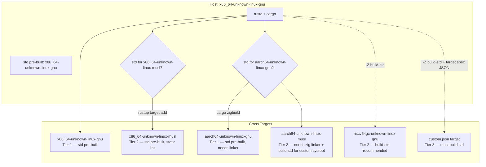
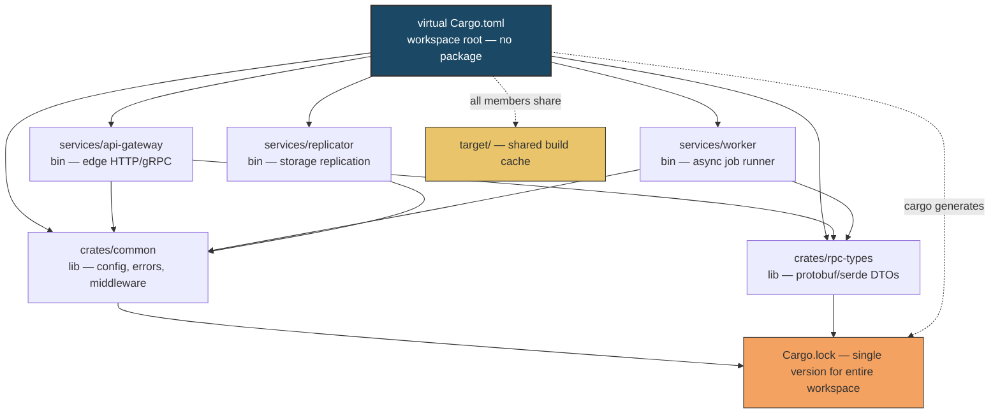
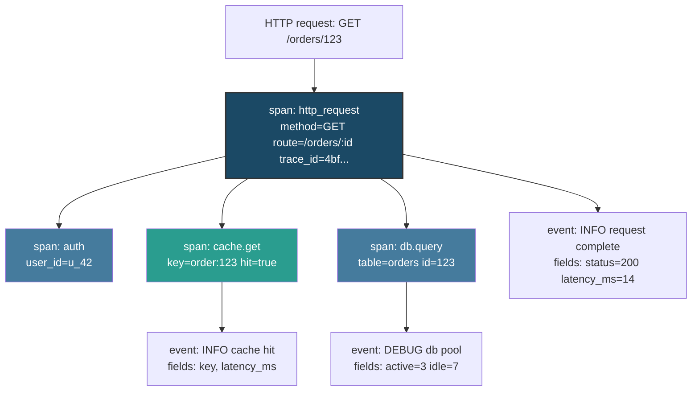
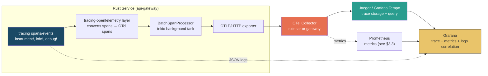
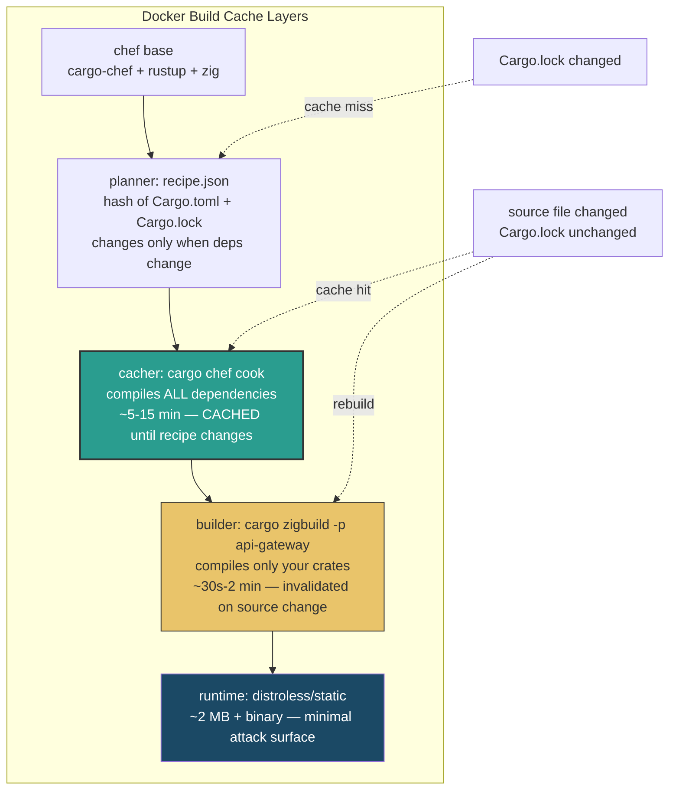
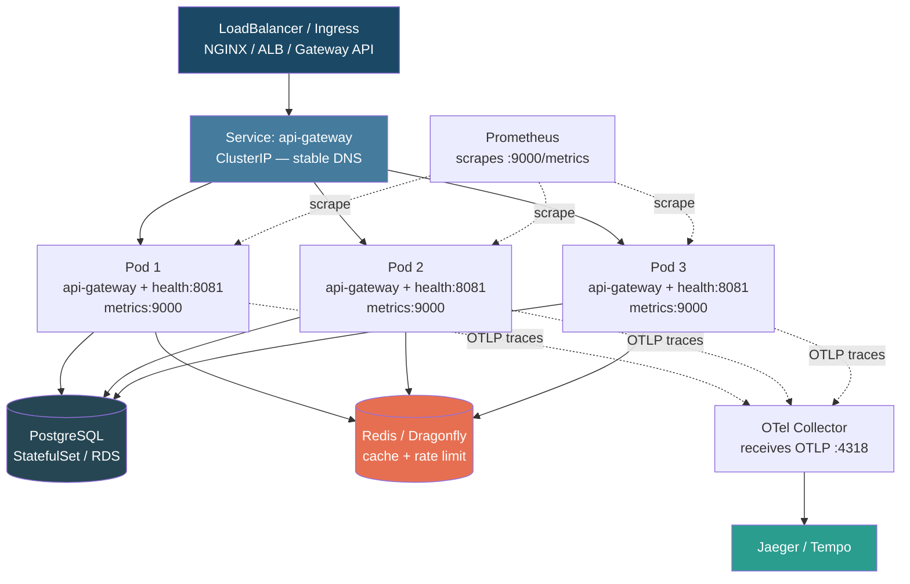

# Chapter 12 — Production Rust: Cross-Compilation, Workspaces, Telemetry, and Deployment at Scale

*What this chapter covers:* everything between `cargo build` succeeding on your laptop and a hardened Rust binary serving production traffic across heterogeneous fleets — reproducibly, observably, and safely. You will learn how to cross-compile Rust for any target triple (including fully static `musl` and `aarch64` via `cargo-zigbuild` and `build-std`), how to structure large multi-crate workspaces for teams of tens to hundreds of engineers, how to instrument services with `tracing`, OpenTelemetry, and Prometheus so they are debuggable in a distributed mesh, and how to ship them through multi-stage, layer-cached Docker builds into Kubernetes with health probes and graceful shutdown — all under a supply-chain posture that can pass audit. Every choice is examined through the lens of fleet scale: what happens when this is not one binary but fifty services, built fifty times a day, on mixed `x86_64`/`aarch64` nodes, by a CI system that must be fast, hermetic, and trustworthy.

**Learning goals:**

- Deconstruct a Rust target triple (`arch-vendor-os-env-abi`), select the correct triple for Linux `musl`/`gnu` and macOS/Windows cross targets, and cross-compile with `cargo-zigbuild` and `-Z build-std` — including `aarch64` and fully static binaries.
- Design a Cargo workspace: virtual manifests, `[workspace.dependencies]` inheritance, shared `Cargo.lock`, selective builds with `-p`/`--workspace`, patch overrides, and tuned `[profile.release]` / `[profile.dev]` for CI throughput and runtime performance.
- Instrument a service with `tracing` (spans, events, levels, span context propagation), export to OpenTelemetry (Jaeger/Tempo), emit Prometheus metrics via the `metrics` crate, and produce structured JSON logs suitable for centralized aggregation.
- Build production container images: `distroless` vs. `scratch` vs. `alpine`, multi-stage Dockerfiles, `cargo-chef` layer caching, minimal attack surface, and reproducible builds.
- Operate Rust services in Kubernetes: liveness/readiness probes, resource limits, graceful shutdown via `tokio::signal`, connection draining, and zero-downtime rolling deploys.
- Harden the supply chain: `cargo audit`, `cargo vet`, `cargo deny`, SBOM generation, and reproducible-build verification — and connect each to SLSA and organizational policy.
- Reason about all of the above at fleet scale: shared registries, distributed build caching, heterogeneous architectures, and the operational cost of getting any of it wrong.

---

## 1. Cross-Compilation: One Codebase, Every Target

Rust's cross-compilation story is among the best in systems languages — no preprocessor maze, no separate toolchain per target by default — but it still requires understanding what a *target* is, what the standard library has to do with it, and why linking is the hard part.

### 1.1 Target Triples, Tiers, and `rustc` Targets

A target triple has the form `arch-vendor-os-env-abi` (the `vendor` field is largely historical):

| Component | Examples | Meaning |
|-----------|----------|---------|
| `arch` | `x86_64`, `aarch64`, `armv7`, `wasm32`, `riscv64gc` | CPU architecture |
| `vendor` | `unknown`, `apple`, `pc` | Vendor tag; `unknown` for most Linux targets |
| `os` | `linux`, `darwin`, `windows`, `none`, `wasi` | Operating system |
| `env` | `gnu`, `musl`, `musl`, `msvc` | C environment / ABI variant |
| `abi` | often empty; `eabihf`, `gnu` | ABI qualifier (ARM hard-float, etc.) |

Common production triples:

```
x86_64-unknown-linux-gnu        # standard Linux (glibc), your laptop/server
x86_64-unknown-linux-musl       # fully static Linux — ideal for scratch/distroless
aarch64-unknown-linux-gnu       # ARM64 Linux (Graviton, Apple Silicon servers)
aarch64-unknown-linux-musl      # ARM64 static
x86_64-apple-darwin             # Intel macOS
aarch64-apple-darwin            # Apple Silicon macOS
x86_64-pc-windows-msvc          # Windows MSVC
wasm32-unknown-unknown          # bare WASM
wasm32-wasip1                   # WASI preview 1
```

Rust classifies targets into tiers:

- **Tier 1:** guaranteed to build and pass tests on CI; `rustup` ships pre-built `std` for these.
- **Tier 2:** guaranteed to build, but not fully tested. `std` may still be shipped.
- **Tier 3:** no guarantees; you must build `std` yourself with `-Z build-std`.

For backend work the tier-1 Linux and macOS triples cover almost everything. The moment you need `musl` static binaries or a tier-2/3 embedded triple, you need `build-std`.



### 1.2 The Two Hard Problems: `std` and the Linker

Cross-compiling a Rust crate involves two pieces the host cannot provide by default:

1. **`std` / `core` / `alloc` for the target.** For tier-1 triples `rustup` distributes pre-compiled `std`. For anything else you rebuild it from source with `build-std` (requires nightly or `cargo -Z build-std` on stable with `config.toml` opt-in).

2. **A linker that understands the target.** `rustc` delegates linking to `cc` (or `lld`). An `x86_64` host has no `aarch64` linker by default. Solutions range from installing `gcc-aarch64-linux-gnu` to using `zig cc` as a universal linker — which is what `cargo-zigbuild` does.

### 1.3 `cargo-zigbuild`: `zig cc` as a Universal Cross Linker

[Zig](https://ziglang.org/) ships a drop-in `cc` replacement that bundles `libc` headers and can target any triple Zig knows about — which covers essentially every production Rust target. `cargo-zigbuild` wraps `cargo build` and substitutes `zig cc`/`zig c++` as linker and `ar`:

```bash
# Install
cargo install cargo-zigbuild
pip install cargo-zigbuild   # alternative
rustup target add aarch64-unknown-linux-gnu
rustup target add x86_64-unknown-linux-musl

# Cross-compile for ARM64 from an x86_64 host — no apt-get cross toolchain needed
cargo zigbuild --target aarch64-unknown-linux-gnu --release

# Fully static binary for scratch/distroless (glibc-free)
cargo zigbuild --target x86_64-unknown-linux-musl --release

# ARM64 static
cargo zigbuild --target aarch64-unknown-linux-musl --release

# Verify: should report "statically linked" and the correct arch
file target/x86_64-unknown-linux-musl/release/my-service
# target/x86_64-unknown-linux-musl/release/my-service: ELF 64-bit LSB executable, x86-64, statically linked, ...

ldd target/x86_64-unknown-linux-musl/release/my-service
# not a dynamic executable
```

Configure `cargo` to always use `zigbuild` for a target via `.cargo/config.toml`:

```toml
# .cargo/config.toml
[build]
# default target for this repo (optional)
# target = "x86_64-unknown-linux-musl"

[target.aarch64-unknown-linux-gnu]
linker = "zigbuild"
# cargo-zigbuild sets this automatically; explicit config shown for clarity

[target.x86_64-unknown-linux-musl]
linker = "zigbuild"
rustflags = ["-C", "target-feature=+crt-static"]

[unstable]
# Enable build-std on stable (since 1.78, configurable without nightly)
build-std = ["std", "panic_abort"]
build-std-features = ["panic_immediate_abort"]
```

Why `zigbuild` matters at scale: in CI you avoid maintaining per-architecture builder images or `apt-get install gcc-aarch64-linux-gnu` steps that bloat cache keys. A single `rust:1.82-bookworm` image plus `cargo-zigbuild` can emit `x86_64-gnu`, `x86_64-musl`, `aarch64-gnu`, and `aarch64-musl` artifacts in one matrix job.

### 1.4 `musl` vs `gnu` and Fully Static Binaries

| Property | `x86_64-unknown-linux-gnu` | `x86_64-unknown-linux-musl` |
|----------|---------------------------|------------------------------|
| Libc | glibc (dynamic) | musl (static by default) |
| Binary portability | Requires glibc >= build version | Runs on any Linux kernel (truly static) |
| Image base | `debian:bookworm-slim` or `gcr.io/distroless/cc` | `scratch` or `gcr.io/distroless/static` |
| DNS | glibc NSS (may need `nss` compat) | musl resolver (no NSS) |
| Binary size | Smaller (shared glibc) | ~1-2 MB larger (libc baked in) |
| Compatibility | Broadest ecosystem | Some crates need `vendored` features (`openssl` → `rustls`) |

Practical rules:

- Prefer `musl` + `scratch`/`distroless/static` when you want the smallest attack surface and fastest cold start — the binary carries everything it needs.
- Prefer `gnu` + `distroless/cc` when you depend on `glibc`-only behavior (NSS, `libnss_dns`, certain `openssl` builds).
- If any dependency links C code that assumes glibc (e.g., `jemalloc-sys` without `musl` support), you must either enable the crate's `musl`/`static` feature or switch the dependency. The compile error will tell you — `cannot find -lgcc_s` or `undefined reference to __register_atfork` are classic glibc-isms.

```bash
# Typical CI matrix — one job per target
cargo zigbuild --target x86_64-unknown-linux-gnu --release
cargo zigbuild --target x86_64-unknown-linux-musl --release
cargo zigbuild --target aarch64-unknown-linux-gnu --release
cargo zigbuild --target aarch64-unknown-linux-musl --release

# Smoke-test the foreign-arch binary with qemu (optional)
docker run --rm --privileged multiarch/qemu-user-static --reset -p yes
qemu-aarch64 target/aarch64-unknown-linux-musl/release/my-service --help
```

### 1.5 `build-std` and Custom Targets

When you need a target without pre-built `std` — or want to rebuild `std` with custom flags (e.g., `panic_immediate_abort` for minimal binaries, or sanitizers) — enable `build-std`:

```toml
# .cargo/config.toml
[unstable]
build-std = ["std", "panic_abort"]
build-std-features = ["panic_immediate_abort"]

[build]
rustflags = ["-C", "panic=abort", "-Z", "sanitizer=address"]
```

```bash
# Nightly required for -Z build-std historically; on recent stable with
# config.toml [unstable] section it works on stable too:
cargo build -Z build-std --target x86_64-unknown-linux-musl --release
cargo build -Z build-std --target riscv64gc-unknown-linux-gnu --release

# Custom target spec (tier 3) — checked into the repo
cargo build -Z build-std --target targets/x86_64-unknown-linux-musl-custom.json --release
```

Custom target JSON example (rarely needed, shown for completeness):

```json
{
  "llvm-target": "x86_64-unknown-linux-musl",
  "data-layout": "e-m:e-p270:32:32-p271:32:32-p272:64:64-p1:64:64-i64:64-f80:128-n8:16:32:64-S128",
  "arch": "x86_64",
  "target-pointer-width": "64",
  "target-c-int-width": "32",
  "os": "linux",
  "env": "musl",
  "vendor": "unknown",
  "linker-flavor": "gnu",
  "linker": "cc",
  "executables": true,
  "panic-strategy": "abort"
}
```

At fleet scale, `build-std` is a double-edged sword: it gives you total control but it *rebuilds the standard library on every clean build*, which can add 30-90 seconds to CI. Cache `~/.cargo` and `target/` aggressively (see §5) or restrict `build-std` to the jobs that actually need it.

---

## 2. Workspaces: Scaling Cargo Beyond One Crate

A single `Cargo.toml` works for a service. It collapses for a platform: fifty services, shared libraries, proc-macros, integration tests, and a CI system that must not rebuild the world when one file changes. Cargo workspaces solve this.

### 2.1 Virtual Manifests and Workspace Layout

A *virtual manifest* is a root `Cargo.toml` with `[workspace]` and no `[package]` — it exists only to group members:

```toml
# /Cargo.toml — virtual manifest (no [package])
[workspace]
members = [
    "crates/common",          # shared library: config, errors, middleware
    "crates/rpc-types",       # protobuf / serde types (no_std-friendly)
    "services/api-gateway",   # binary: edge service
    "services/worker",        # binary: background worker
    "services/replicator",    # binary: storage replicator
]
exclude = ["target", "tools/*"]

# Centralize versions — every member inherits these
[workspace.package]
version = "0.14.2"
edition = "2021"
rust-version = "1.78"
license = "Apache-2.0"
repository = "https://github.com/acme/platform"

[workspace.dependencies]
tokio      = { version = "1.38", features = ["full"] }
axum       = { version = "0.7", features = ["json", "tracing"] }
tracing    = "0.1"
tracing-subscriber = { version = "0.3", features = ["env-filter", "json"] }
serde      = { version = "1.0", features = ["derive"] }
serde_json = "1.0"
anyhow     = "1.0"
thiserror  = "2.0"
opentelemetry          = "0.24"
opentelemetry-otlp     = { version = "0.24", features = ["http-proto", "trace"] }
tracing-opentelemetry  = "0.25"
metrics                = "0.24"
metrics-exporter-prometheus = "0.15"

[workspace.lints.clippy]
pedantic = "warn"
unwrap_used = "deny"
expect_used = "warn"

[profile.release]
opt-level = 3
lto = "thin"          # thin LTO: good balance for large workspaces
codegen-units = 1     # slower build, better optimization — gate behind CI flag
strip = true          # requires cargo 1.59+
panic = "abort"

[profile.dev]
opt-level = 0
debug = true

[profile.release-with-debug]
inherits = "release"
debug = true          # keep symbols for profiling in staging
strip = false
```

And a member crate inherits via `workspace = true`:

```toml
# crates/common/Cargo.toml
[package]
name = "acme-common"
version.workspace = true
edition.workspace = true
rust-version.workspace = true
license.workspace = true

[dependencies]
tokio.workspace = true
tracing.workspace = true
serde.workspace = true
thiserror.workspace = true

# crate-local dep that is not shared
ulid = "1.1"

[lints]
workspace = true
```

```toml
# services/api-gateway/Cargo.toml
[package]
name = "api-gateway"
version.workspace = true
edition.workspace = true

[[bin]]
name = "api-gateway"
path = "src/main.rs"

[dependencies]
acme-common = { path = "../../crates/common" }
acme-rpc-types = { path = "../../crates/rpc-types" }
axum.workspace = true
tokio.workspace = true
tracing.workspace = true
metrics.workspace = true
```



### 2.2 The Shared `Cargo.lock` and Why It Matters

A workspace produces **one `Cargo.lock` at the root**. Every member resolves to the same version of every shared dependency. This is a correctness property, not just convenience:

- Without a shared lock, `common` could resolve `serde 1.0.197` while `api-gateway` resolves `serde 1.0.210` — different `Serialize` impls, mysterious trait-not-implemented errors, or worse, two copies of `serde` in the binary.
- With a shared lock, `cargo update -p serde` bumps it once for the whole workspace, and `cargo tree` shows a single resolved graph.

Commit `Cargo.lock` for binaries and workspaces (even if libraries traditionally do not). At scale, the lockfile is the reproducibility anchor that makes `cargo build --locked` and `cargo --frozen` meaningful in CI.

### 2.3 Selective Builds: `-p`, `--workspace`, and Friends

Rebuilding fifty crates when you touched one is wasteful. Cargo's selectors:

```bash
# Build / test / lint exactly one member
cargo build -p api-gateway --release
cargo test -p acme-common
cargo clippy -p acme-common -- -D warnings

# Build all members (CI gate)
cargo build --workspace --release
cargo test --workspace --all-features
cargo clippy --workspace --all-targets -- -D warnings

# Exclude a heavy member from a fast lint pass
cargo clippy --workspace --exclude replicator

# Run a binary from a specific package
cargo run -p api-gateway -- --config config/dev.toml
cargo run -p worker --features backfill

# Tree / audit scoped to one package
cargo tree -p acme-common -e features
cargo audit --manifest-path services/api-gateway/Cargo.toml
```

Combine with `cargo-hakari` or `cargo-workspace` tools when the workspace grows past ~20 members to keep feature unification from silently enabling half the ecosystem.

### 2.4 Release Profiles and Build Tuning

Profiles control the `rustc` flags Cargo passes. For production services:

```toml
[profile.release]
opt-level = 3          # maximum optimization
lto = "thin"           # cross-crate inlining without fat-LTO build cost
codegen-units = 1      # one LLVM codegen unit — best optimization, slowest build
strip = "debuginfo"    # strip debuginfo but keep symbols for backtraces (1.59+)
panic = "abort"        # smaller binary, no unwinding — requires abort-safe deps

# Staging profile that keeps debug symbols for profiling
[profile.profiling]
inherits = "release"
debug = true
strip = false
lto = "thin"
codegen-units = 1

# Dev profile optimized for compile speed, not runtime
[profile.dev]
opt-level = 0
debug = true
incremental = true

# Test profile — often you want release opts but with debug asserts
[profile.test]
inherits = "dev"
opt-level = 2
```

Trade-offs at scale:

| Setting | Effect | When to use |
|---------|--------|-------------|
| `lto = "thin"` | ~10-20% smaller/faster binary, +2-5 min build | Always for release artifacts |
| `lto = "fat"` | Best optimization, very slow build | Only for the final release binary, not per-PR CI |
| `codegen-units = 1` | Best optimization, no parallelism | Release builds on beefy CI runners |
| `codegen-units = 16` | Fast build, less optimization | Dev / PR CI |
| `strip = true` | Smallest binary | Production images |
| `panic = "abort"` | Smaller binary, no `catch_unwind` | Services (not libraries) |
| `debug = true` in release | Retain symbols for `perf`/`flamegraph` | Staging / profiling builds |

For large workspaces, consider per-package overrides:

```toml
# Optimize only the hot crate with fat LTO; keep the rest thin
[profile.release.package.replicator]
opt-level = 3
lto = "fat"
codegen-units = 1
```

---

## 3. Telemetry: Tracing, Metrics, and Structured Logs

An uninstrumented Rust service is a black box. In a distributed system, observability is not optional — it is how you correlate a user's 500 through twenty hops, find the slow replica, and prove an SLO is met. Rust's story centers on three pillars: **traces** (request-scoped causality), **metrics** (aggregated counters/gauges/histograms), and **logs** (discrete events) — unified through `tracing` and OpenTelemetry.

### 3.1 `tracing` — Structured, Contextual, Async-Aware

`tracing` replaces `log` for serious backend work. Where `log` emits flat lines, `tracing` emits *spans* (timed contexts) and *events* (points inside spans), with structured fields that survive through `async` instrumentation:

```rust
use tracing::{info, warn, error, instrument, Level};
use tracing_subscriber::{fmt, EnvFilter, layer::SubscriberExt, util::SubscriberInitExt};

// One-time init at process start — before any async runtime
fn init_tracing(service_name: &str) {
    // EnvFilter respects RUST_LOG (e.g. RUST_LOG=api_gateway=debug,tower_http=info)
    let env_filter = EnvFilter::try_from_default_env()
        .unwrap_or_else(|_| EnvFilter::new("info"));

    // JSON formatter for production (parsed by Loki/ELK/Datadog)
    // Pretty formatter for local dev — gate with cfg or env var
    let fmt_layer = fmt::layer()
        .json()
        .with_current_span(true)   // include span context in every event
        .with_span_list(true)      // include span stack
        .with_target(true)
        .with_file(true)
        .with_line_number(true);

    tracing_subscriber::registry()
        .with(env_filter)
        .with(fmt_layer)
        // OTel layer added in §3.2
        .init();

    info!(service = service_name, "tracing initialized");
}
```



Spans compose. The `#[instrument]` macro creates and enters a span for the function body, capturing arguments as fields and recording the return/error automatically:

```rust
use tracing::instrument;
use anyhow::Result;

#[instrument(
    name = "orders.get",
    skip(pool),                          // don't log the pool (large, sensitive)
    fields(order_id = %id, trace_id),    // attach correlation id
    err(level = Level::WARN),            // log Err at WARN with error field
)]
async fn get_order(
    pool: &sqlx::PgPool,
    id: i64,
    trace_id: &str,
) -> Result<Order> {
    tracing::debug!("querying db");
    let order = sqlx::query_as::<_, Order>("SELECT * FROM orders WHERE id = $1")
        .bind(id)
        .fetch_one(pool)
        .await?;
    tracing::info!(order.status = %order.status, "order fetched");
    Ok(order)
}
```

Key practices for distributed systems:

- **Propagate trace context.** Extract `traceparent`/`tracestate` headers at the edge and inject them into every outbound call. `tracing-opentelemetry` does this when wired to an OTel propagator.
- **Never log secrets.** Use `skip` for sensitive args and `%`/`?` formatters deliberately. Structured fields are indexed — accidentally logging a token means it is searchable in your log lake.
- **Use `span!` levels correctly.** `ERROR`/`WARN` for actionable signals, `INFO` for request lifecycle, `DEBUG` for per-query detail, `TRACE` for hot-loop internals (off by default).

### 3.2 OpenTelemetry Export: From `tracing` to Jaeger / Grafana Tempo

`tracing` alone writes to stdout. To get distributed traces across services you bridge it to the OpenTelemetry Collector via `tracing-opentelemetry` + `opentelemetry-otlp`:

```toml
# Cargo.toml
[dependencies]
tracing = "0.1"
tracing-subscriber = { version = "0.3", features = ["env-filter", "json", "registry"] }
tracing-opentelemetry = "0.25"
opentelemetry = { version = "0.24", features = ["trace"] }
opentelemetry-otlp = { version = "0.24", features = ["http-proto", "trace", "tokio"] }
opentelemetry_sdk = { version = "0.24", features = ["rt-tokio"] }
opentelemetry-semantic-conventions = "0.16"
```

```rust
use opentelemetry::{global, KeyValue};
use opentelemetry_otlp::WithExportConfig;
use opentelemetry_sdk::{trace as sdktrace, Resource};
use tracing_subscriber::{layer::SubscriberExt, util::SubscriberInitExt};

fn init_otel(service_name: &str, otlp_endpoint: &str) -> sdktrace::Tracer {
    // Resource identifies this service in every span
    let resource = Resource::new(vec![
        KeyValue::new("service.name", service_name.to_owned()),
        KeyValue::new("service.version", env!("CARGO_PKG_VERSION").to_owned()),
        KeyValue::new("deployment.environment", std::env::var("ENV").unwrap_or("dev".into())),
    ]);

    // OTLP HTTP exporter — points at the OTel Collector sidecar or gateway
    let otlp_exporter = opentelemetry_otlp::new_exporter()
        .http()
        .with_endpoint(format!("{otlp_endpoint}/v1/traces"))
        .with_timeout(std::time::Duration::from_secs(3));

    let tracer = opentelemetry_otlp::new_pipeline()
        .tracing()
        .with_exporter(otlp_exporter)
        .with_trace_config(sdktrace::config().with_resource(resource))
        .install_batch(opentelemetry_sdk::runtime::Tokio)
        .expect("OTel pipeline install failed");

    tracer
}

fn init_subscriber_with_otel(service_name: &str, otlp_endpoint: &str) {
    let tracer = init_otel(service_name, otlp_endpoint);
    let otel_layer = tracing_opentelemetry::layer().with_tracer(tracer);
    let env_filter = tracing_subscriber::EnvFilter::try_from_default_env()
        .unwrap_or_else(|_| tracing_subscriber::EnvFilter::new("info"));
    let fmt_layer = tracing_subscriber::fmt::layer()
        .json()
        .with_current_span(true);

    tracing_subscriber::registry()
        .with(env_filter)
        .with(fmt_layer)
        .with(otel_layer)
        .init();
}

// Ensure flush on shutdown — OTel batch exporter is async
async fn shutdown_otel() {
    global::shutdown_tracer_provider();
    // Give the batch exporter time to flush
    tokio::time::sleep(std::time::Duration::from_millis(500)).await;
}
```

Wire the `traceparent` propagator at the HTTP layer (Axum example):

```rust
use axum::{Router, routing::get, http::HeaderMap, extract::State};
use opentelemetry::propagation::Extractor;
use tracing::Instrument;
use tracing_opentelemetry::OpenTelemetrySpanExt;

struct HeaderExtractor<'a>(&'a HeaderMap);
impl<'a> Extractor for HeaderExtractor<'a> {
    fn get(&self, key: &str) -> Option<&str> {
        self.0.get(key).and_then(|v| v.to_str().ok())
    }
    fn keys(&self) -> Vec<&str> {
        self.0.keys().map(|k| k.as_str()).collect()
    }
}

async fn handler(headers: HeaderMap, State(pool): State<sqlx::PgPool>) -> String {
    // Extract upstream trace context and link current span as child
    let parent_cx = global::get_text_map_propagator(|prop| prop.extract(&HeaderExtractor(&headers)));
    let span = tracing::info_span!("handler.get_order", http.route = "/orders/:id");
    span.set_parent(parent_cx);

    async move {
        // downstream calls inherit this span's context automatically
        let order = get_order(&pool, 123, "trace-xyz").await.unwrap();
        format!("ok: {:?}", order.id)
    }
    .instrument(span)
    .await
}
```



Deployment note: always run the OTel Collector as a sidecar or DaemonSet, never have services export directly to Jaeger/Tempo over the network — the Collector handles batching, retries, tail sampling, and backpressure so your service does not.

### 3.3 Prometheus Metrics via the `metrics` Crate

For counters, gauges, and histograms that feed dashboards and alerting, the `metrics` facade (from the `metrics-rs` ecosystem) is the Rust equivalent of Prometheus client libraries in Go/Java — with the advantage that instrumentation is decoupled from the exporter:

```toml
[dependencies]
metrics = "0.24"
metrics-exporter-prometheus = "0.15"
metrics-tracing-context = "0.15"   # optional: label metrics with current span fields
```

```rust
use metrics::{counter, histogram, gauge, describe_counter, describe_histogram};
use metrics_exporter_prometheus::PrometheusBuilder;
use std::net::SocketAddr;

fn init_metrics(addr: SocketAddr) {
    // Describe metrics once — shows up as HELP in Prometheus exposition
    describe_counter!("http_requests_total", "Total HTTP requests");
    describe_histogram!("http_request_duration_seconds", "HTTP request latency");
    describe_histogram!("db_query_duration_seconds", "DB query latency");
    describe_counter!("cache_hits_total", "Cache hits");
    describe_counter!("cache_misses_total", "Cache misses");

    // Install Prometheus exporter that serves /metrics
    PrometheusBuilder::new()
        .with_http_listener(addr)   // e.g. 0.0.0.0:9000
        .install()
        .expect("prometheus exporter install failed");
}

// In request handler — cheap, lock-free, label-cardinality aware
async fn handle_request(pool: &sqlx::PgPool, cache: &Cache) -> axum::response::Response {
    let start = std::time::Instant::now();
    counter!("http_requests_total", "route" => "/orders/:id", "method" => "GET").increment(1);
    gauge!("inflight_requests").increment(1.0);

    let result = get_with_cache(pool, cache, 123).await;

    gauge!("inflight_requests").decrement(1.0);
    histogram!("http_request_duration_seconds",
        "route" => "/orders/:id", "status" => if result.is_ok() {"200"} else {"500"}
    ).record(start.elapsed().as_secs_f64());

    // ...
    axum::response::IntoResponse::into_response("ok")
}

async fn get_with_cache(pool: &sqlx::PdPool, cache: &Cache, id: i64) -> anyhow::Result<Order> {
    let t0 = std::time::Instant::now();
    if let Some(order) = cache.get(id).await {
        counter!("cache_hits_total").increment(1);
        histogram!("db_query_duration_seconds", "source" => "cache").record(t0.elapsed().as_secs_f64());
        return Ok(order);
    }
    counter!("cache_misses_total").increment(1);
    let order = get_order(pool, id, "trace").await?;
    histogram!("db_query_duration_seconds", "source" => "db").record(t0.elapsed().as_secs_f64());
    Ok(order)
}
```

Prometheus exposition (what `curl localhost:9000/metrics` returns):

```
# HELP http_requests_total Total HTTP requests
# TYPE http_requests_total counter
http_requests_total{route="/orders/:id",method="GET"} 48291
# HELP http_request_duration_seconds HTTP request latency
# TYPE http_request_duration_seconds histogram
http_request_duration_seconds_bucket{route="/orders/:id",status="200",le="0.005"} 12034
http_request_duration_seconds_bucket{route="/orders/:id",status="200",le="0.025"} 47102
http_request_duration_seconds_bucket{route="/orders/:id",status="200",le="0.1"} 48201
http_request_duration_seconds_sum{route="/orders/:id",status="200"} 312.45
http_request_duration_seconds_count{route="/orders/:id",status="200"} 48201
```

Cardinality warning: every unique label combination creates a new time series. Never use unbounded values (user IDs, trace IDs, raw URLs) as label values — that is how you create a cardinality bomb that crashes Prometheus. Keep labels to bounded enums: route templates, status codes, cache hit/miss, region.

### 3.4 Structured JSON Logs

When `tracing-subscriber`'s `fmt::layer().json()` is active, every event is a JSON line — ideal for centralized log pipelines (Loki, Elasticsearch, Datadog). Example output:

```json
{"timestamp":"2026-05-11T14:22:31.123456Z","level":"INFO","fields":{"message":"order fetched","order.status":"paid","order_id":123},"span":{"name":"orders.get","order_id":123,"trace_id":"4bf92f3577b34da6a3ce929d0e0e4736"},"target":"acme_common::orders","filename":"crates/common/src/orders.rs","line_number":42}
{"timestamp":"2026-05-11T14:22:31.124001Z","level":"INFO","fields":{"message":"request complete","status":200,"latency_ms":14},"span":{"name":"http_request","method":"GET","route":"/orders/:id","trace_id":"4bf92f3577b34da6a3ce929d0e0e4736"},"target":"api_gateway::http"}
```

Correlate logs with traces by including `trace_id`/`span_id` in every span — Grafana can then jump from a log line to the full distributed trace.

---

## 4. Deployment: From Binary to Fleet

A correct binary that cannot be deployed safely is not production software. This section covers the container and orchestration layer — where Rust's static-binary advantage pays off most.

### 4.1 Distroless vs. Scratch vs. Alpine vs. Debian

| Base | Size | Contains | Use when |
|------|------|----------|----------|
| `scratch` | 0 MB | Nothing — just your binary | `musl` static binary, no shell/debugging needed |
| `gcr.io/distroless/static` | ~2 MB | CA certs, timezone data, `/etc/passwd` stub | `musl` static, need TLS + sane defaults |
| `gcr.io/distroless/cc` | ~20 MB | Above + `libgcc`, `glibc` | `gnu` binary that needs `libstdc++`/`glibc` |
| `alpine:3.19` | ~7 MB | `musl`, `sh`, `apk` | Need a shell for debugging but want small |
| `debian:bookworm-slim` | ~80 MB | Full `glibc`, `sh`, `apt` | Broadest compat, largest surface |

For Rust `musl` services, `distroless/static` is the sweet spot: CA certs and timezone data without a shell, package manager, or any interpreter that an attacker could use for lateral movement. `scratch` is marginally smaller but requires you to `COPY --from` CA certs yourself — easy to forget, painful to debug when TLS fails at 3 AM.

### 4.2 Multi-Stage Dockerfile with `cargo-chef` Layer Caching

Naive `COPY . /app && cargo build --release` invalidates the Docker cache on every source change, re-downloading and recompiling all dependencies. `cargo-chef` splits dependency compilation from application compilation so dependency layers are cached until `Cargo.lock` changes:

```dockerfile
# ── Stage 1: chef base ──────────────────────────────────────────────
FROM lukemathwalker/cargo-chef:0.1.68-rust-1.82-bookworm AS chef
WORKDIR /app

# ── Stage 2: plan — compute dependency recipe ───────────────────────
FROM chef AS planner
COPY . .
# Generates /app/recipe.json — a stable fingerprint of all Cargo.toml/lock
RUN cargo chef prepare --recipe-path recipe.json

# ── Stage 3: cacher — cook dependencies (cached until recipe.json changes)
FROM chef AS cacher
COPY --from=planner /app/recipe.json recipe.json
# Build dependencies only — this layer is cached across source changes
RUN cargo chef cook --release --zigbuild --target x86_64-unknown-linux-musl --recipe-path recipe.json

# ── Stage 4: builder — compile the actual application ───────────────
FROM cacher AS builder
COPY . .
# Only the application crates recompile here; deps come from cacher cache
RUN cargo zigbuild --release --target x86_64-unknown-linux-musl -p api-gateway \
    && strip target/x86_64-unknown-linux-musl/release/api-gateway \
    && cp target/x86_64-unknown-linux-musl/release/api-gateway /app/api-gateway

# ── Stage 5: runtime — minimal image ────────────────────────────────
FROM gcr.io/distroless/static:nonroot AS runtime
# nonroot runs as uid 65532 (nonroot) — no root in production
COPY --from=builder /app/api-gateway /usr/local/bin/api-gateway
# If you need CA certs with scratch, copy them explicitly:
# COPY --from=builder /etc/ssl/certs/ca-certificates.crt /etc/ssl/certs/

EXPOSE 8080 9000
USER nonroot:nonroot
ENTRYPOINT ["/usr/local/bin/api-gateway"]
```



Without `cargo-chef`, a one-line fix triggers a full `cargo build --release` that recompiles `tokio`, `serde`, `axum`, and every other dependency — easily 8-15 minutes. With `cargo-chef`, the same fix recompiles only your crates (30-90 seconds) because the dependency layer is cache-hit. In a monorepo with fifty services, this is the difference between a 10-minute PR pipeline and a 45-minute one.

Alternative without `cargo-chef` (simpler, less cache-efficient):

```dockerfile
FROM rust:1.82-bookworm AS builder
WORKDIR /app
# Copy manifests first for layer caching (manual, less precise than chef)
COPY Cargo.toml Cargo.lock ./
COPY crates/ crates/
COPY services/api-gateway/Cargo.toml services/api-gateway/Cargo.toml
RUN cargo fetch --locked
COPY . .
RUN cargo build --release --locked -p api-gateway
```

### 4.3 Health Probes and Kubernetes Manifest

Kubernetes needs to know when your service is alive (liveness), ready to serve (readiness), and when it has started (startup). Rust services should expose these on a separate port from application traffic so probes do not contend with request handling:

```rust
use axum::{Router, routing::get, http::StatusCode, extract::State};
use std::sync::{Arc, atomic::{AtomicBool, Ordering}};

#[derive(Clone)]
struct HealthState {
    ready: Arc<AtomicBool>,  // flipped to true after warmup (DB pool, cache, etc.)
    axum_state: AppState,
}

async fn liveness() -> StatusCode {
    // Liveness: is the process alive? Always 200 unless deadlocked.
    // For deeper checks, verify the tokio runtime is not stalled.
    StatusCode::OK
}

async fn readiness(State(h): State<HealthState>) -> (StatusCode, String) {
    if !h.ready.load(Ordering::Relaxed) {
        return (StatusCode::SERVICE_UNAVAILABLE, "warming up".into());
    }
    // Check downstream deps — fail readiness, not liveness, on DB blip
    match sqlx::query("SELECT 1").execute(&h.axum_state.pool).await {
        Ok(_) => (StatusCode::OK, "ok".into()),
        Err(e) => {
            tracing::warn!(error = %e, "readiness: db check failed");
            (StatusCode::SERVICE_UNAVAILABLE, format!("db: {e}"))
        }
    }
}

async fn startup(State(h): State<HealthState>) -> (StatusCode, String) {
    // Startup probe: has initial warmup completed? K8s waits before sending traffic.
    if h.ready.load(Ordering::Relaxed) {
        (StatusCode::OK, "started".into())
    } else {
        (StatusCode::SERVICE_UNAVAILABLE, "starting".into())
    }
}

fn health_router(health: HealthState) -> Router {
    Router::new()
        .route("/healthz", get(liveness))
        .route("/readyz", get(readiness))
        .route("/startupz", get(startup))
        .with_state(health)
}
```

```yaml
# k8s/deployment.yaml
apiVersion: apps/v1
kind: Deployment
metadata:
  name: api-gateway
  labels: { app: api-gateway, version: v0.14.2 }
spec:
  replicas: 3
  strategy:
    type: RollingUpdate
    rollingUpdate: { maxUnavailable: 0, maxSurge: 1 }  # zero-downtime
  selector:
    matchLabels: { app: api-gateway }
  template:
    metadata:
      labels: { app: api-gateway, version: v0.14.2 }
      annotations:
        prometheus.io/scrape: "true"
        prometheus.io/port: "9000"
        prometheus.io/path: "/metrics"
    spec:
      securityContext:
        runAsNonRoot: true
        runAsUser: 65532
        seccompProfile: { type: RuntimeDefault }
      containers:
        - name: api-gateway
          image: ghcr.io/acme/api-gateway:v0.14.2  # distroless/static, musl
          imagePullPolicy: IfNotPresent
          ports:
            - { name: http, containerPort: 8080 }
            - { name: metrics, containerPort: 9000 }
            - { name: health, containerPort: 8081 }
          env:
            - { name: RUST_LOG, value: "info,tower_http=debug" }
            - { name: OTEL_EXPORTER_OTLP_ENDPOINT, value: "http://otel-collector.observability:4318" }
            - { name: ENV, value: production }
          resources:
            requests: { cpu: "500m", memory: "256Mi" }
            limits:   { cpu: "2000m", memory: "512Mi" }
          # Startup: wait up to 60s for warmup before marking pod started
          startupProbe:
            httpGet: { path: /startupz, port: health }
            periodSeconds: 2
            failureThreshold: 30
          # Liveness: restart if deadlocked (not on transient DB failure)
          livenessProbe:
            httpGet: { path: /healthz, port: health }
            periodSeconds: 10
            failureThreshold: 3
            initialDelaySeconds: 5
          # Readiness: remove from Service endpoints when not ready
          readinessProbe:
            httpGet: { path: /readyz, port: health }
            periodSeconds: 5
            failureThreshold: 2
          lifecycle:
            preStop:
              exec:
                # Give the app SIGTERM grace period to drain (see §4.4)
                command: ["/bin/sh", "-c", "sleep 5"]
          securityContext:
            allowPrivilegeEscalation: false
            readOnlyRootFilesystem: true
            capabilities: { drop: ["ALL"] }
---
apiVersion: v1
kind: Service
metadata:
  name: api-gateway
  labels: { app: api-gateway }
  annotations:
    # ServiceMonitor for Prometheus Operator (alternative to prometheus.io/* annotations)
    prometheus.io/scrape: "true"
spec:
  selector: { app: api-gateway }
  ports:
    - { name: http, port: 80, targetPort: http }
    - { name: metrics, port: 9000, targetPort: metrics }
---
# HPA — scale on CPU and on custom metric (request latency p99)
apiVersion: autoscaling/v2
kind: HorizontalPodAutoscaler
metadata: { name: api-gateway }
spec:
  scaleTargetRef: { apiVersion: apps/v1, kind: Deployment, name: api-gateway }
  minReplicas: 3
  maxReplicas: 30
  metrics:
    - type: Resource
      resource: { name: cpu, target: { type: Utilization, averageUtilization: 70 } }
    - type: Pods
      pods:
        metric: { name: http_request_duration_seconds }
        target: { type: AverageValue, averageValue: "100m" }  # 100ms p50 budget
```



Key operational details:

- **`maxUnavailable: 0` + `maxSurge: 1`** guarantees at least `replicas` pods are always available during a rollout — no capacity dip.
- **`preStop: sleep 5`** gives the kubelet's `SIGTERM` time to propagate before the pod is removed from endpoints. Combined with graceful shutdown (§4.4), in-flight requests finish rather than being severed.
- **Separate health port** prevents probe traffic from competing with application traffic under load and allows distinct rate-limiting or auth.

### 4.4 Graceful Shutdown via `tokio::signal`

Abrupt termination drops in-flight requests, corrupts in-progress writes, and triggers retry storms. Graceful shutdown drains connections, finishes handlers, and flushes telemetry:

```rust
use axum::Router;
use std::net::SocketAddr;
use tokio::net::TcpListener;
use tracing::{info, warn};

#[tokio::main]
async fn main() -> anyhow::Result<()> {
    init_subscriber_with_otel("api-gateway", &std::env::var("OTEL_EXPORTER_OTLP_ENDPOINT")?);

    let app = build_router().await?;
    let addr: SocketAddr = "0.0.0.0:8080".parse()?;
    let listener = TcpListener::bind(addr).await?;
    info!(%addr, "listening");

    // axum::serve with graceful shutdown — preferred over Server::bind in axum 0.7+
    axum::serve(listener, app)
        .with_graceful_shutdown(shutdown_signal())
        .await?;

    // Flush OTel and other buffered telemetry after the server stops accepting
    shutdown_otel().await;
    info!("shutdown complete");
    Ok(())
}

/// Waits for SIGTERM (k8s) or SIGINT (Ctrl-C / docker stop).
/// On Unix, SIGTERM is what `kubectl rollout` and pod eviction send.
async fn shutdown_signal() {
    let ctrl_c = async {
        tokio::signal::ctrl_c()
            .await
            .expect("failed to install Ctrl+C handler");
    };

    #[cfg(unix)]
    let terminate = async {
        tokio::signal::unix::signal(tokio::signal::unix::SignalKind::terminate())
            .expect("failed to install SIGTERM handler")
            .recv()
            .await;
    };

    #[cfg(not(unix))]
    let terminate = std::future::pending::<()>();

    tokio::select! {
        _ = ctrl_c => {
            warn!("received SIGINT — draining");
        }
        _ = terminate => {
            warn!("received SIGTERM — draining");
        }
    }

    // Optional: bounded drain timeout so shutdown cannot hang forever
    // The outer `with_graceful_shutdown` already stops accepting new connections;
    // this sleep gives handlers time to finish before the process exits.
    // K8s `terminationGracePeriodSeconds` (default 30s) is the hard deadline.
    info!("grace period: draining up to 25s");
    tokio::time::sleep(std::time::Duration::from_secs(25)).await;
}
```

For services with background workers or connection pools, extend the shutdown to drain those explicitly:

```rust
async fn shutdown_signal_with_drain(pool: sqlx::PgPool, worker_handle: tokio::task::JoinHandle<()>) {
    // ... same signal wait as above ...

    // Stop accepting new work
    info!("stopping worker");
    worker_handle.abort();

    // Close DB pool — waits for in-flight queries with a timeout
    pool.close().await;
    info!("pool closed");

    // Flush traces
    shutdown_otel().await;
}
```

Kubernetes coordination: `terminationGracePeriodSeconds` (default 30s) must be longer than your drain timeout. If the app needs 25s to drain, set `terminationGracePeriodSeconds: 35` so the kubelet does not `SIGKILL` mid-drain. The `preStop: sleep 5` hook is *additional* — it delays `SIGTERM` delivery by 5s so the pod is removed from the Service endpoints before shutdown begins, preventing the race where a pod receives new requests after it has started draining.

---

## 5. Supply Chain: Vetting, Auditing, and Provenance

Rust's crate ecosystem is a supply chain. Every `cargo build` fetches code from crates.io and builds it with the same privileges as your own code — including `build.rs` scripts that execute at compile time. The xz-utils backdoor (2024) and the `event-stream` npm incident (2018) demonstrate that single-maintainer dependencies are high-value targets. Rust-specific incidents — the `rustdecimal` typosquat (2021) and the `cargo audit` advisories for `chrono`, `time`, and `rustls` — reinforce the point.

### 5.1 `cargo audit` — Known Vulnerabilities (RustSec)

`cargo audit` checks `Cargo.lock` against the [RustSec Advisory Database](https://rustsec.org/):

```bash
cargo install cargo-audit

# Check current workspace
cargo audit

# CI: fail on any vulnerability, use locked dependencies
cargo audit --deny warnings

# Audit a specific lockfile (e.g. after cross-compilation)
cargo audit --file Cargo.lock

# Output (example)
# Fetching advisory database from `https://github.com/RustSec/advisory-db.git`
#       Fresh advisory database fetched into 0.50s
#   Scanning Cargo.lock for vulnerabilities (412 crate versions)
# Crate:     time
# Version:   0.3.34
# Title:     Time Crate Vulnerable to Potential Segfault
# Date:      2024-11-14
# ID:        RUSTSEC-2024-0429
# URL:       https://rustsec.org/advisories/RUSTSEC-2024-0429
# Solution:  Upgrade to >=0.3.35
# error: 1 vulnerability found!
```

Run `cargo audit` in CI on every PR. For workspaces, it scans the single root `Cargo.lock` — one invocation covers all members.

### 5.2 `cargo vet` — Vetting the Unknown

`cargo audit` catches *known* vulnerabilities. `cargo vet` (from Mozilla) addresses the harder problem: every crate you depend on that has *never been audited* is an unknown risk. `cargo vet` requires you to explicitly vet each crate version:

```bash
cargo install cargo-vet

# Initialize vetting policy
cargo vet init
# Creates supply-chain/config.toml

# Check vetting status
cargo vet
#   Vetting Failed!
#   3 unvetted dependencies:
#    erythiej v0.4.2
#       - has not been vetted
#     some-proc-macro v1.2.0
#       - has not been audited

# Vet a crate after manual review (records in supply-chain/audits.toml)
cargo vet certify some-crate 1.2.0 --criteria safe-to-deploy

# Import audits from trusted publishers (Mozilla, Google, etc.)
# supply-chain/config.toml:
[policy]
[policy.some-crate]
criteria = "safe-to-deploy"
dependency-criteria = { weak-reviewed = ["safe-to-deploy"] }

[imports.mozilla]
url = "https://raw.githubusercontent.com/mozilla/supply-chain/main/audits.toml"
```

Criteria levels: `safe-to-run` (does not introduce malicious build scripts) vs. `safe-to-deploy` (safe to run in production, handles untrusted input). At scale, delegate vetting to a security team that publishes an `audits.toml` imported by every service repo.

### 5.3 `cargo deny` — Policy as Code

`cargo deny` enforces license, advisory, ban, and source policies in one tool — ideal as a CI gate:

```toml
# deny.toml
[advisories]
db-path = "~/.cargo/advisory-db"
db-urls = ["https://github.com/rustsec/advisory-db"]
ignore = []  # never ignore without a tracking issue

[licenses]
unlicensed = "deny"
allow = ["MIT", "Apache-2.0", "Apache-2.0 WITH LLVM-exception", "BSD-3-Clause", "ISC", "Unicode-DFS-2016"]
deny = ["GPL-3.0", "AGPL-3.0"]
copyleft = "warn"
confidence-threshold = 0.8

[bans]
multiple-versions = "warn"   # alert on duplicate semver versions (binary bloat)
wildcards = "deny"
highlight = "all"
skip = []  # crates exempt from bans

[sources]
unknown-registry = "deny"
unknown-git = "deny"
allow-registry = ["https://github.com/rust-lang/crates.io-index"]
allow-git = []  # explicitly list allowed git deps if any

[graph]
all-features = false
exclude-dev = true
targets = [{ triple = "x86_64-unknown-linux-musl" }, { triple = "aarch64-unknown-linux-gnu" }]
```

```bash
cargo install cargo-deny
cargo deny check          # all checks
cargo deny check advisories
cargo deny check licenses
cargo deny check bans
cargo deny check sources
```

### 5.4 SBOM and Provenance

For SLSA Level 2+ and regulatory requirements (EU CRA, US EO 14028), generate an SBOM (Software Bill of Materials) for every release artifact. Rust tooling is maturing here:

```bash
# CycloneDX SBOM via cargo-cyclonedx
cargo install cargo-cyclonedx
cargo cyclonedx --format json --override-filename sbom.cdx.json

# SPDX via cargo-sbom (alternative)
cargo install cargo-sbom
cargo sbom --output-format spdx_json --output-file sbom.spdx.json

# Attest the SBOM + image with Sigstore cosign (keyless, via OIDC)
cosign sign-blob --yes sbom.cdx.json --output-signature sbom.cdx.json.sig --output-certificate sbom.cdx.json.pem
cosign attest --predicate sbom.cdx.json --type cyclonedx --yes ghcr.io/acme/api-gateway:v0.14.2
```

Store the SBOM alongside the container image (OCI referrers or registry metadata) so consumers can verify what went into a deployment without rebuilding.

### 5.5 Reproducible Builds

`cargo build --locked --frozen` guarantees the exact versions in `Cargo.lock` are used — no implicit `cargo update` from a stale registry cache. For bit-for-bit reproducibility (same input → same binary hash), also:

- Pin `rust-toolchain.toml` to an exact version (`1.82.0`, not `stable`).
- Set `SOURCE_DATE_EPOCH` for deterministic timestamps in binaries.
- Avoid `build.rs` scripts that embed timestamps or random IDs.
- Verify with `cargo reproducible` or by building twice and comparing hashes.

---

## 6. Putting It Together: The Production Pipeline at Fleet Scale

A single service's pipeline is straightforward. The challenge is doing it for fifty services, on every PR, without quadratic cost.

### 6.1 CI Pipeline Sketch (GitHub Actions)

```yaml
# .github/workflows/ci.yml
name: ci
on: [push, pull_request]

env:
  CARGO_TERM_COLOR: always
  CARGO_INCREMENTAL: 0  # better cache hit rate in CI
  RUSTFLAGS: "-D warnings"

jobs:
  lint-and-audit:
    runs-on: ubuntu-latest
    steps:
      - uses: actions/checkout@v4
      - uses: dtolnay/rust-toolchain@master
        with: { toolchain: "1.82.0", components: clippy, rustfmt }
      - uses: Swatinem/rust-cache@v2  # caches target/ + cargo registry
      - run: cargo fmt --all -- --check
      - run: cargo clippy --workspace --all-targets -- -D warnings
      - run: cargo deny check
      - run: cargo audit --deny warnings
      - run: cargo vet --locked  # vet uses Cargo.lock

  test:
    runs-on: ubuntu-latest
    steps:
      - uses: actions/checkout@v4
      - uses: dtolnay/rust-toolchain@master
        with: { toolchain: "1.82.0" }
      - uses: Swatinem/rust-cache@v2
      - run: cargo test --workspace --all-features --locked
      - run: cargo test --workspace --doc --locked

  build-matrix:
    needs: [lint-and-audit, test]
    strategy:
      matrix:
        target: [x86_64-unknown-linux-musl, aarch64-unknown-linux-musl]
    runs-on: ubuntu-latest
    steps:
      - uses: actions/checkout@v4
      - uses: dtolnay/rust-toolchain@master
        with: { toolchain: "1.82.0", targets: "${{ matrix.target }}" }
      - uses: Swatinem/rust-cache@v2
        with: { key: "${{ matrix.target }}" }
      - run: cargo install cargo-zigbuild --locked
      - run: cargo zigbuild --locked --release --target ${{ matrix.target }} -p api-gateway
      - uses: actions/upload-artifact@v4
        with:
          name: api-gateway-${{ matrix.target }}
          path: target/${{ matrix.target }}/release/api-gateway

  image:
    needs: build-matrix
    runs-on: ubuntu-latest
    permissions: { contents: read, packages: write, id-token: write }
    steps:
      - uses: actions/checkout@v4
      - uses: docker/setup-buildx-action@v3
      - uses: docker/login-action@v3
        with: { registry: ghcr.io, username: ${{ github.actor }}, password: ${{ secrets.GITHUB_TOKEN }} }
      - uses: docker/build-push-action@v5
        with:
          context: .
          file: services/api-gateway/Dockerfile
          platforms: linux/amd64,linux/arm64
          push: true
          tags: ghcr.io/acme/api-gateway:${{ github.sha }}
          cache-from: type=gha
          cache-to: type=gha,mode=max
          provenance: true
          sbom: true
      - run: cosign sign --yes ghcr.io/acme/api-gateway:${{ github.sha }}
```

### 6.2 Distributed-Systems Lens: What Changes at Scale

Every technique in this chapter has a scaling cliff where the naive approach breaks:

| Concern | Single service | Fifty services, hundreds of engineers |
|---------|---------------|---------------------------------------|
| **Cross-compilation** | `cargo build` on one arch | Matrix of `x86_64`/`aarch64` × `gnu`/`musl`; heterogeneous k8s nodes; `cargo-zigbuild` avoids per-arch builder images |
| **Workspaces** | One `Cargo.toml` | Virtual workspace with 20+ members; `cargo hakari` to manage feature unification; `cargo-chef` to keep CI under 10 min |
| **Telemetry** | `println!` | OTel Collector fleet, tail sampling, cardinality budgets, trace-to-log correlation across 10 hops |
| **Deployment** | `docker run` | GitOps (ArgoCD/Flux), progressive delivery (Flagger/Argo Rollouts), HPA on custom metrics, PodDisruptionBudgets |
| **Supply chain** | `cargo audit` locally | Org-wide `cargo vet` registry, `deny.toml` policy enforced by CI gate, SBOM per image, SLSA provenance, Sigstore signing |
| **Build caching** | Local `target/` | Distributed sccache/rust-cache, shared registry cache, `cargo-chef` Docker layers, remote execution (Bazel-style) for large workspaces |

The deeper pattern: at fleet scale, *consistency* is the scarce resource. One `Cargo.lock`, one `rust-toolchain.toml`, one `deny.toml`, one OTel Collector config, one Dockerfile pattern — templated or generated — prevents the drift that causes "works in staging, fails in prod" incidents. Treat the platform as a product: paved roads, not scattered scripts.

---

## Key takeaways

- A target triple is `arch-vendor-os-env-abi`; `musl` gives static binaries for `scratch`/`distroless/static`, `gnu` needs `glibc`. `cargo-zigbuild` (via `zig cc`) is the simplest universal cross linker — one CI image can emit `x86_64` and `aarch64` `musl`/`gnu` artifacts without apt cross-toolchains. Use `-Z build-std` when pre-built `std` is unavailable or you need custom `std` flags.
- Virtual Cargo workspaces with `[workspace.dependencies]` and a single `Cargo.lock` give atomic versioning, shared build cache, and selective builds (`-p`, `--workspace`, `--exclude`). Tune `[profile.release]` (`lto = "thin"`, `codegen-units = 1`, `strip`) for production; keep `codegen-units = 16` and `incremental = true` for fast dev CI.
- `tracing` with `#[instrument]` and structured fields is the foundation; bridge to OpenTelemetry via `tracing-opentelemetry` + `opentelemetry-otlp` batch exporter to get distributed traces in Jaeger/Tempo. Never export directly to the backend — go through the OTel Collector for batching, sampling, and backpressure.
- Prometheus metrics via the `metrics` crate decouple instrumentation from exposition; keep label cardinality bounded (route templates, not raw URLs or user IDs). Structured JSON logs from `tracing-subscriber::fmt::json` give centralized log correlation via `trace_id`.
- `distroless/static` (or `scratch` + manual CA certs) is the minimal, most defensible image for `musl` Rust services; `cargo-chef` (`prepare`/`cook`/`build`) caches dependency compilation so source-only changes rebuild in seconds, not minutes. Health probes on a separate port, `maxUnavailable: 0`, `preStop` hooks, and `tokio::signal` graceful shutdown together deliver zero-downtime deploys.
- Supply chain is not optional: `cargo audit` (known vulns), `cargo vet` (unknown risk), `cargo deny` (licenses/bans/sources), CycloneDX/SPDX SBOMs, and Sigstore signing form the layered defense. Enforce all of them as CI gates; import org-wide vet audits so individual teams do not re-review the same crates.
- At fleet scale, every local optimization becomes a platform concern: shared `Cargo.lock`, pinned `rust-toolchain.toml`, templated Dockerfiles, distributed build caches, and a single OTel Collector topology prevent drift and keep fifty services deployable fifty times a day.

## Further reading

- *The Rust Reference — Conditional Compilation and Target Specs.* https://doc.rust-lang.org/reference/conditional-compilation.html and `rustc --print target-spec-json --target <triple>` — authoritative target definitions.
- *Cargo Book — Workspaces, Profiles, and Configuration.* https://doc.rust-lang.org/cargo/reference/workspaces.html, https://doc.rust-lang.org/cargo/reference/profiles.html, https://doc.rust-lang.org/cargo/reference/config.html — workspace inheritance, profile tuning, and `.cargo/config.toml`.
- *`cargo-zigbuild` — Zig as Cross Linker for Rust.* https://github.com/rust-cross/cargo-zigbuild — setup, supported triples, and CI examples.
- *`tracing` and `tracing-subscriber` Documentation.* https://docs.rs/tracing, https://docs.rs/tracing-subscriber — spans, levels, subscribers, and `EnvFilter`.
- *OpenTelemetry Rust — OTLP Exporter and SDK.* https://docs.rs/opentelemetry-otlp, https://opentelemetry.io/docs/languages/rust/ — pipeline setup, batch processors, and propagators.
- *`metrics` and `metrics-exporter-prometheus`.* https://docs.rs/metrics, https://docs.rs/metrics-exporter-prometheus — facade, recorder, and Prometheus exposition.
- *Google Distroless Images.* https://github.com/GoogleContainerTools/distroless — `static`, `cc`, and `base` image docs and Debian version matrix.
- *`cargo-chef` — Cached Docker Builds for Rust.* https://github.com/LukeMathWalker/cargo-chef — `prepare`/`cook` pattern and multi-stage Dockerfile recipes.
- *Tokio — Graceful Shutdown.* https://tokio.rs/tokio/topics/shutdown — `tokio::signal`, `with_graceful_shutdown`, and cancellation patterns.
- *RustSec Advisory Database.* https://rustsec.org/ — searchable advisories consumed by `cargo audit` and `cargo deny`.
- *`cargo vet` Book.* https://mozilla.github.io/cargo-vet/ — criteria (`safe-to-run` vs `safe-to-deploy`), imports, and org-wide vetting workflows.
- *`cargo deny` Book.* https://embarkstudios.github.io/cargo-deny/ — `advisories`/`licenses`/`bans`/`sources` configuration and CI integration.
- *SLSA Framework v1.0 and SSDF.* https://slsa.dev/spec/v1.0/levels, https://csrc.nist.gov/Projects/ssdf — provenance levels and secure development practices that motivate SBOM + Sigstore attestation.
- *Kubernetes — Probes, Lifecycle, and HPA.* https://kubernetes.io/docs/tasks/configure-pod-container/configure-liveness-readiness-startup-probes/, https://kubernetes.io/docs/concepts/workloads/pods/pod-lifecycle/ — `startupProbe`/`livenessProbe`/`readinessProbe`, `preStop`, and `terminationGracePeriodSeconds`.
